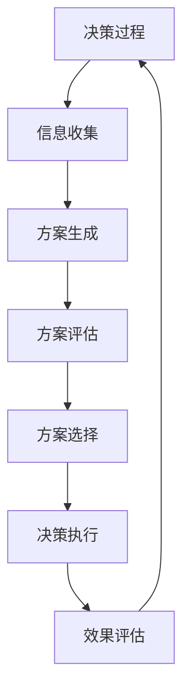

                 

### 文章标题：领导力与决策科学应用：提高决策质量和速度

#### 关键词：领导力，决策科学，决策质量，决策速度，优化策略，案例分析

#### 摘要：本文旨在探讨领导力与决策科学在提高决策质量和速度方面的应用。通过对领导力的本质和决策过程的深入分析，结合决策科学的理论和方法，本文将详细阐述如何利用决策科学来优化领导力实践，从而在复杂多变的环境中做出更为明智和高效的决策。文章结构分为三个部分：第一部分介绍了领导力与决策的基础知识，包括领导力与决策的定义、模型及其关系；第二部分探讨了决策科学的应用，包括决策分析与评估方法、风险管理策略、数据驱动决策和决策制定过程优化；第三部分通过实际案例和模型应用，分析了领导力与决策实践的优化策略，并提出了实践建议和教育方向。文章末尾附有推荐书籍、工具资源和模拟练习题，以供读者进一步学习和实践。

---

### 《领导力与决策科学应用：提高决策质量和速度》目录大纲

#### 第一部分：领导力基础

1. **1.1 领导力与决策的定义**
    - **1.1.1 领导力的本质**
    - **1.1.2 决策的定义与分类**

2. **1.2 领导力模型概述**
    - **1.2.1 传统领导力模型**
    - **1.2.2 现代领导力模型**

3. **1.3 决策科学基础**
    - **1.3.1 决策过程**
    - **1.3.2 决策理论**

4. **1.4 领导力与决策的关系**
    - **1.4.1 领导力对决策的影响**
    - **1.4.2 决策对领导力的要求**

#### 第二部分：决策科学应用

5. **2.1 决策分析与评估方法**
    - **2.1.1 量化分析方法**
    - **2.1.2 定性分析方法**

6. **2.2 风险管理策略**
    - **2.2.1 风险识别与评估**
    - **2.2.2 风险应对策略**

7. **2.3 数据驱动决策**
    - **2.3.1 数据收集与处理**
    - **2.3.2 数据分析与应用**

8. **2.4 决策制定过程优化**
    - **2.4.1 决策流程优化**
    - **2.4.2 决策支持系统应用**

9. **2.5 决策与团队协作**
    - **2.5.1 团队决策模型**
    - **2.5.2 团队决策中的沟通与协调**

#### 第三部分：领导力与决策实践

10. **3.1 领导力与决策案例分析**
    - **3.1.1 成功案例**
    - **3.1.2 失败案例**

11. **3.2 领导力与决策模型应用**
    - **3.2.1 企业决策模型应用**
    - **3.2.2 政府决策模型应用**

12. **3.3 领导力与决策实践建议**
    - **3.3.1 领导力提升策略**
    - **3.3.2 决策优化建议**

13. **3.4 领导力与决策教育**
    - **3.4.1 领导力教育体系**
    - **3.4.2 决策科学教育课程设置**

#### 附录

14. **附录A：领导力与决策相关书籍推荐**
15. **附录B：领导力与决策常用工具与资源**
16. **附录C：领导力与决策模拟练习题**

### Mermaid 流程图


### 伪代码
```python
# 决策过程伪代码

# 1. 信息收集
info_collection()

# 2. 方案生成
scheme_generation()

# 3. 方案评估
scheme_evaluation()

# 4. 方案选择
scheme_selection()

# 5. 决策执行
scheme_implementation()

# 6. 效果评估
effect_evaluation()
```

### 数学模型
$$
\text{决策质量} = \frac{\text{正确决策数}}{\text{总决策数}}
$$

### 数学公式举例
$$
\text{期望收益} = \sum_{i=1}^{n} p_i \cdot r_i
$$
其中，$p_i$为第$i$个方案的收益概率，$r_i$为第$i$个方案的收益。

### 项目实战
1. 开发环境搭建
2. 源代码实现
3. 代码解读与分析

### 详细解释说明
- 领导力与决策的关系
- 决策过程优化策略
- 数据驱动决策案例分析
- 领导力提升实践建议

### 注意事项
- 在撰写文章过程中，确保每个章节的内容完整、具体详细。
- 核心内容包含：背景介绍、核心概念与联系、核心算法原理讲解、数学模型和公式、项目实战、最佳实践 tips 等。

### 拓展阅读
- [领导力与决策相关书籍推荐](#附录A)
- [领导力与决策常用工具与资源](#附录B)
- [领导力与决策模拟练习题](#附录C)

---

接下来的文章将按照上述目录大纲逐步深入探讨领导力与决策科学的各个方面，通过理论讲解、案例分析、模型应用和实践建议，为读者提供一个全面而深入的理解。让我们一起开启这段技术思维的旅程。

