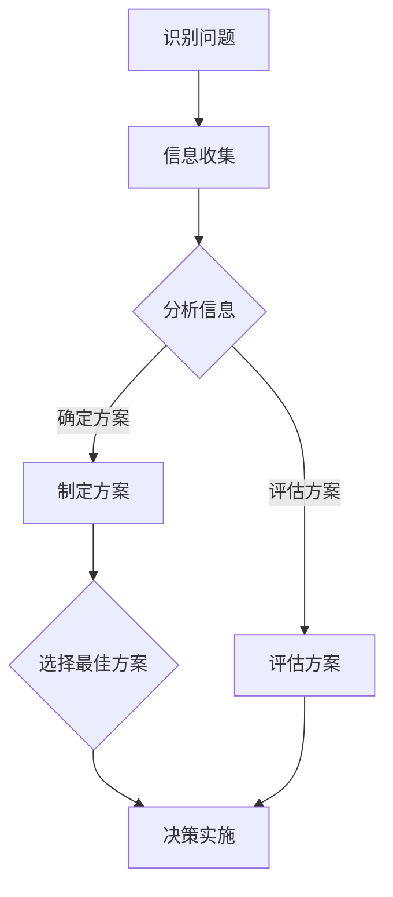

                 

# 领导力与决策：科学决策的流程

## 关键词

- 领导力
- 科学决策
- 决策流程
- 决策模型
- 道德伦理

## 摘要

本文将深入探讨领导力与决策之间的关系，以及科学决策流程的各个步骤。首先，我们将回顾领导力的定义、重要性及其与管理的区别。接着，我们将详细介绍经典领导力理论，包括特质理论、行为理论、转换理论和情境理论，并探讨现代领导力理论。随后，我们将转向决策过程，讨论决策的定义、类型和重要性，然后逐步讲解决策的各个阶段，包括信息收集与分析、制定方案、评估方案和决策实施。我们将介绍经典决策模型，如决策树、效用理论和贝叶斯决策，并探讨决策支持系统的作用。此外，我们还将讨论决策中的伦理问题，包括伦理考量和伦理决策模型。最后，我们将结合实际案例，分析领导力与决策在组织发展和国际环境中的应用，并探讨未来趋势。通过本文的阅读，读者将更好地理解领导力与决策的核心概念和科学决策的流程。

## 《领导力与决策：科学决策的流程》目录大纲

### 第一部分：领导力概述

### 第1章：领导力的重要性

- 1.1 领导力的定义
- 1.2 领导力与管理的区别
- 1.3 领导力在组织中的作用

### 第2章：领导力理论

- 2.1 经典领导力理论
  - 2.1.1 特质理论
  - 2.1.2 行为理论
  - 2.1.3 转换理论
  - 2.1.4 情境理论
- 2.2 现代领导力理论
  - 2.2.1 领导行为变革理论
  - 2.2.2 领导风格理论
  - 2.2.3 领导力发展理论

### 第3章：领导力与组织文化

- 3.1 组织文化的定义
- 3.2 领导力与组织文化的互动
- 3.3 建设积极的组织文化

### 第二部分：决策过程

### 第4章：决策概述

- 4.1 决策的定义
- 4.2 决策的类型
- 4.3 决策的重要性

### 第5章：决策过程

- 5.1 决策过程概述
- 5.2 信息收集与分析
- 5.3 制定方案
- 5.4 评估方案
- 5.5 决策实施

### 第6章：科学决策方法

- 6.1 经典决策模型
  - 6.1.1 决策树
  - 6.1.2 效用理论
  - 6.1.3 贝叶斯决策
- 6.2 决策支持系统

### 第7章：决策中的伦理问题

- 7.1 决策中的伦理考量
- 7.2 伦理决策模型
- 7.3 实践中的伦理决策

### 第三部分：领导力与决策实践

### 第8章：领导力与决策实践

- 8.1 领导力在决策中的作用
- 8.2 领导者的决策风格
- 8.3 决策实践案例分析

### 第四部分：领导力与决策的综合应用

### 第9章：领导力与决策在组织发展中的应用

- 9.1 组织战略规划
- 9.2 组织变革
- 9.3 领导力与决策在创新中的应用

### 第10章：领导力与决策在国际环境中的应用

- 10.1 国际化背景下的领导力
- 10.2 跨文化决策
- 10.3 国际市场战略决策

### 第11章：领导力与决策的未来趋势

- 11.1 人工智能与领导力
- 11.2 数据驱动的决策
- 11.3 领导力与可持续发展

### 第12章：领导力与决策自我提升

- 12.1 自我反思与自我提升
- 12.2 领导力与决策培训
- 12.3 领导力与决策的自我管理

## 第一部分：领导力概述

### 第1章：领导力的重要性

领导力是推动组织成功的关键因素之一。在现代社会，领导力不仅限于企业高管，而是涵盖了各个层面的个人和组织。本章将探讨领导力的定义、重要性以及领导力与管理的区别。

#### 1.1 领导力的定义

领导力是一种影响力，它涉及激励、指导和启发他人实现共同目标的能力。领导力不仅仅是权力和地位的象征，而是一种通过行动、沟通和激励影响他人的能力。领导力可以发生在任何层次和任何环境中，无论是家庭、学校、社区还是商业领域。

#### 1.2 领导力与管理的区别

领导力和管理是两个相关但不完全相同的概念。管理通常涉及计划、组织、领导和控制等职能，旨在实现组织的日常运营目标。管理强调效率和控制，关注资源分配、流程优化和风险管理。

而领导力则更侧重于变革和激励。领导者通过愿景、价值观和动机来引导团队，激发其潜力，推动创新和变革。领导力关注人的因素，强调团队协作和共同目标。

| 领导力 | 管理 |
| --- | --- |
| 激发变革 | 维持现状 |
| 关注人 | 关注事 |
| 愿景驱动 | 目标驱动 |
| 领导行为 | 管理行为 |

#### 1.3 领导力在组织中的作用

领导力在组织中的作用是多方面的。首先，领导者能够设定清晰的目标和愿景，为组织提供方向和动力。其次，领导者通过激励和沟通，能够提升员工的参与度和积极性，促进团队协作和创新能力。

此外，领导者还能够处理复杂的问题和挑战，通过决策和行动，确保组织的稳定和可持续发展。最后，领导力还影响着组织文化和氛围，塑造员工的价值观和行为准则。

### 第2章：领导力理论

领导力理论是对领导现象的系统研究和解释。经典领导力理论和现代领导力理论为我们提供了不同视角来理解领导力。本章将详细介绍经典领导力理论，包括特质理论、行为理论、转换理论和情境理论，并探讨现代领导力理论。

#### 2.1 经典领导力理论

##### 2.1.1 特质理论

特质理论是早期的领导力理论之一，它认为领导者具备特定的性格特质和能力，这些特质是领导成功的关键因素。特质理论列举了如自信、决断力、智慧、责任感等特质。然而，特质理论并未充分解释领导行为的多样性。

##### 2.1.2 行为理论

行为理论强调领导行为的重要性，而不是领导者的个人特质。行为理论认为，领导者通过不同的行为方式来影响下属，实现组织目标。行为理论分为两个主要分支：领导行为四分图和领导行为连续体理论。

- 领导行为四分图将领导行为分为任务导向型和关系导向型，前者关注任务完成，后者关注员工关系。
- 领导行为连续体理论将领导行为分为权威型、民主型和放任型，不同的领导行为适用于不同的情境。

##### 2.1.3 转换理论

转换理论认为，领导者的主要任务是帮助组织适应环境的变化。转换型领导者通过激励和启发下属，推动组织实现变革。转换理论强调领导者的愿景和价值观，以及他们如何影响团队成员的动机和行为。

##### 2.1.4 情境理论

情境理论认为，领导行为应根据具体情境进行调整。领导者的有效性取决于他们对情境的理解和适应。情境理论包括菲德勒权变模型和路径-目标理论。

- 菲德勒权变模型认为，领导者的有效性取决于领导风格与情境因素的匹配程度。
- 路径-目标理论认为，领导者的任务是为下属设定明确的目标，并提供实现目标的路径。

#### 2.2 现代领导力理论

现代领导力理论反映了当代社会和组织环境的变化，强调领导者的多样化角色和影响力。以下介绍几种现代领导力理论：

##### 2.2.1 领导行为变革理论

领导行为变革理论强调领导者在推动组织变革中的关键作用。变革型领导者通过激发下属的潜能，推动创新和变革，实现组织的长期成功。

##### 2.2.2 领导风格理论

领导风格理论关注领导者如何根据下属和情境调整自己的行为方式。领导风格理论包括民主型、权威型和参与型等不同的领导风格。

##### 2.2.3 领导力发展理论

领导力发展理论认为，领导力是可以通过培训和实践不断提高的。领导力发展理论包括领导力培养、领导力发展和领导力传承等不同层面。

### 第3章：领导力与组织文化

组织文化是组织的价值观、信念和行为准则的综合体现，对员工的行为和决策产生深远影响。领导力与组织文化密切相关，领导者通过塑造和传播组织文化，影响员工的行为和态度。

#### 3.1 组织文化的定义

组织文化是指组织内部的共享价值观、信念和行为准则。它包括组织的核心价值观、愿景、使命和目标，以及组织成员共同遵守的行为规范。组织文化不仅影响员工的行为和决策，还影响组织的绩效和竞争力。

#### 3.2 领导力与组织文化的互动

领导力与组织文化之间存在互动关系。领导者通过自己的行为和决策，塑造和传播组织文化。领导者的价值观和行为准则对员工产生示范效应，影响员工的行为和态度。同时，组织文化也反作用于领导力，影响领导者的决策和行为。

#### 3.3 建设积极的组织文化

建设积极的组织文化是领导者的重要任务之一。领导者可以通过以下措施来建设积极的组织文化：

- 设定清晰的愿景和使命，使员工明确组织的方向和目标。
- 培养共同的价值观，使员工在行为上保持一致性。
- 创造一个开放、包容和信任的工作环境，鼓励员工分享意见和反馈。
- 通过表彰和奖励机制，鼓励员工积极行为，塑造良好的工作氛围。

### 第二部分：决策过程

#### 第4章：决策概述

决策是领导者和管理者在面对不确定性时，从多个备选方案中选取最佳方案的过程。本章将探讨决策的定义、类型和重要性。

#### 4.1 决策的定义

决策是指在一个特定的情境下，从多个备选方案中选择一个最佳方案的过程。决策涉及对问题的识别、信息的收集、备选方案的分析和选择，以及决策的实施和评估。

#### 4.2 决策的类型

决策可以分为以下几种类型：

- 确定型决策：在已知条件下做出的决策，通常具有确定的后果。
- 风险型决策：在不确定的条件下做出的决策，可能产生不同的结果。
- 非确定型决策：在极端不确定的条件下做出的决策，结果难以预测。
- 战略决策：涉及组织长期目标和方向的高层次决策。
- 操作决策：涉及组织日常运营的决策。

#### 4.3 决策的重要性

决策是组织管理中至关重要的一环，其重要性体现在以下几个方面：

- 决策影响组织的战略方向和目标实现。
- 决策决定资源的分配和使用效率。
- 决策影响组织文化和员工行为。
- 决策影响组织的竞争力和市场地位。

### 第5章：决策过程

决策过程是领导者和管理者从问题识别到决策实施的完整流程。本章将详细讨论决策过程的各个阶段，包括信息收集与分析、制定方案、评估方案和决策实施。

#### 5.1 决策过程概述

决策过程可以概括为以下五个阶段：

1. 问题识别：识别组织面临的挑战和机遇。
2. 信息收集：收集与问题相关的信息。
3. 制定方案：根据收集到的信息，制定多个备选方案。
4. 评估方案：评估备选方案的风险和收益。
5. 决策实施：选择最佳方案，并付诸实施。

#### 5.2 信息收集与分析

信息收集是决策过程的重要环节，它涉及以下步骤：

1. 明确信息需求：确定决策所需的关键信息。
2. 收集数据：通过调查、访谈、观察等方式收集数据。
3. 数据分析：对收集到的数据进行分析和解释，识别关键问题和趋势。

#### 5.3 制定方案

制定方案是决策过程的核心步骤，它包括以下步骤：

1. 生成备选方案：根据信息分析结果，生成多个备选方案。
2. 方案评估：对备选方案进行评估，包括成本、风险和收益。
3. 方案优化：根据评估结果，对备选方案进行优化和调整。

#### 5.4 评估方案

评估方案是决策过程中关键的一环，它涉及以下步骤：

1. 制定评估标准：确定评估方案的标准和指标。
2. 评估备选方案：根据评估标准和指标，评估备选方案的优势和劣势。
3. 选择最佳方案：根据评估结果，选择最佳方案。

#### 5.5 决策实施

决策实施是将最佳方案付诸实践的过程，它包括以下步骤：

1. 制定实施计划：制定详细的实施计划和步骤。
2. 分配资源：根据实施计划，分配所需的资源和人力。
3. 监控和调整：在实施过程中，监控实施效果，并根据实际情况进行调整。

### 第6章：科学决策方法

科学决策方法是基于数学模型和算法的决策方法，旨在提高决策的准确性和效率。本章将介绍经典决策模型，如决策树、效用理论和贝叶斯决策，并探讨决策支持系统的作用。

#### 6.1 经典决策模型

##### 6.1.1 决策树

决策树是一种图形化表示决策过程的工具，它通过一系列分支节点和叶子节点，展示不同的决策路径和结果。决策树的基本结构包括：

1. 根节点：表示初始状态或问题。
2. 内部节点：表示决策点，代表选择不同的行动方案。
3. 叶子节点：表示决策结果，代表不同行动方案的结果。

决策树的构建过程包括：

1. 确定问题：明确需要解决的决策问题。
2. 收集信息：收集与问题相关的信息，包括可能的结果和概率。
3. 构建决策树：根据收集到的信息，构建决策树。

决策树的优势在于：

1. 直观：通过图形化表示，使决策过程更加直观。
2. 系统化：提供一种系统化的决策方法，确保所有可能的情况都被考虑。

决策树的局限在于：

1. 复杂性：随着决策树节点和分支的增加，决策树的复杂性会迅速增加。
2. 主观性：决策树的构建依赖于决策者的判断和经验。

##### 6.1.2 效用理论

效用理论是一种基于价值评估的决策方法，它通过比较不同行动方案的价值，选择最佳方案。效用理论的基本概念包括：

1. 行动方案：决策者可能采取的所有行动方案。
2. 结果：每个行动方案可能产生的结果。
3. 效用：对每个结果的评估值，反映了决策者对这些结果的偏好。

效用理论的决策过程包括：

1. 确定行动方案：列出所有可能的行动方案。
2. 评估结果：为每个行动方案可能产生的结果分配效用值。
3. 计算总效用：计算每个行动方案的总效用值。
4. 选择最佳方案：选择总效用值最高的行动方案。

效用理论的优点包括：

1. 客观性：基于数学模型，减少决策的主观性。
2. 可量化：效用值可以量化，使决策过程更加精确。

效用理论的局限包括：

1. 主观性：效用值的确定仍然依赖于决策者的主观判断。
2. 复杂性：随着行动方案和结果的增加，计算总效用值的复杂性会增加。

##### 6.1.3 贝叶斯决策

贝叶斯决策是一种基于概率和统计的决策方法，它通过计算不同行动方案的后验概率，选择最佳方案。贝叶斯决策的基本概念包括：

1. 先验概率：在未获得任何信息时，对每个行动方案的概率估计。
2. 证据：与行动方案相关的观测结果。
3. 后验概率：在获得证据后，对每个行动方案的概率重新估计。

贝叶斯决策的决策过程包括：

1. 确定行动方案：列出所有可能的行动方案。
2. 收集证据：收集与行动方案相关的观测结果。
3. 计算后验概率：使用贝叶斯定理计算每个行动方案的后验概率。
4. 计算期望值：计算每个行动方案的后验概率乘以其效用值的总和。
5. 选择最佳方案：选择期望值最高的行动方案。

贝叶斯决策的优点包括：

1. 可适应性：根据新的证据，可以动态调整决策。
2. 客观性：基于概率和统计，减少决策的主观性。

贝叶斯决策的局限包括：

1. 复杂性：计算后验概率和期望值的复杂性会增加。
2. 先验概率的主观性：先验概率的确定仍然依赖于决策者的主观判断。

#### 6.2 决策支持系统

决策支持系统（DSS）是一种基于计算机技术的决策工具，它通过收集、分析和处理数据，帮助决策者进行决策。DSS的基本功能包括：

1. 数据采集：从各种数据源收集数据。
2. 数据处理：对收集到的数据进行清洗、转换和分析。
3. 决策支持：基于分析结果，提供决策建议和选项。
4. 决策模拟：模拟不同决策方案的结果，帮助决策者评估风险和收益。

DSS的优势包括：

1. 灵活性：支持各种类型的决策问题。
2. 精确性：基于数据和分析，提高决策的准确性。
3. 可视化：通过图形化表示，使决策过程更加直观。

DSS的局限包括：

1. 成本：开发和维护DSS的成本较高。
2. 数据质量：DSS的决策效果取决于数据质量。

### 第7章：决策中的伦理问题

在决策过程中，伦理问题是领导者必须面对的重要议题。伦理考量不仅影响决策的公正性和合法性，还关系到组织的声誉和可持续发展。本章将探讨决策中的伦理考量、伦理决策模型和实践中的伦理决策。

#### 7.1 决策中的伦理考量

决策中的伦理考量是指决策者在做出决策时，对道德和伦理原则的思考和评估。伦理考量主要包括以下几个方面：

1. 公正性：决策过程是否公平，是否对所有相关方都给予公平的待遇。
2. 透明度：决策过程是否透明，决策结果是否能够被公众理解和接受。
3. 责任感：决策者是否对自己的决策承担责任，对可能产生的不良后果有所准备。
4. 道德标准：决策是否符合社会公认的道德标准和伦理原则。

#### 7.2 伦理决策模型

伦理决策模型是帮助决策者在面对伦理问题时做出合理决策的工具。以下介绍几种常见的伦理决策模型：

1. **成本-效益分析**：通过对决策的潜在成本和收益进行评估，权衡道德和利益，选择成本最低、效益最高的方案。
2. **权利伦理学**：以权利为基础，评估决策是否侵犯了他人的权利，强调个体的自由和尊严。
3. **德行伦理学**：强调决策者的道德品质和行为准则，鼓励决策者追求正义和美德。
4. **后果伦理学**：评估决策的长期后果，选择能够带来最大幸福和最小痛苦的方案。

#### 7.3 实践中的伦理决策

在实际决策中，领导者需要根据具体的情境和伦理考量，做出合理的伦理决策。以下是一些实践中的伦理决策案例：

1. **环境决策**：在项目开发过程中，企业面临是否采取环保措施的选择。如果企业选择采取环保措施，可能会增加成本，但有助于保护环境，提升企业形象。企业可以通过成本-效益分析和权利伦理学，评估不同决策方案的伦理影响，做出合理的选择。
2. **薪酬决策**：企业在制定薪酬政策时，需要考虑员工的贡献、市场水平和内部公平。企业可以通过德行伦理学和后果伦理学，评估不同薪酬方案的伦理影响，确保薪酬决策的公正性和合理性。
3. **商业伦理**：企业在经营过程中，可能面临是否遵守道德规范的选择。例如，企业是否应当支付贿赂以获得合同，是否应当发布虚假广告。企业可以通过权利伦理学和后果伦理学，评估不同商业行为的伦理影响，遵循道德准则。

### 第8章：领导力与决策实践

领导力与决策实践是领导者在实际工作中运用领导力和决策理论，解决实际问题，实现组织目标的过程。本章将探讨领导力在决策中的作用、领导者的决策风格以及决策实践案例分析。

#### 8.1 领导力在决策中的作用

领导力在决策中发挥着关键作用，它不仅影响决策的质量，还影响决策的执行效果。以下是领导力在决策中的一些作用：

1. **设定目标和愿景**：领导者通过设定明确的目标和愿景，为决策提供方向和指引，确保决策与组织的长期战略相一致。
2. **激励和引导**：领导者通过激励和引导团队成员，提高他们的参与度和积极性，促进决策的制定和执行。
3. **沟通和协调**：领导者通过有效的沟通和协调，确保团队成员对决策的理解和认同，减少决策执行中的摩擦和阻力。
4. **风险管理**：领导者通过识别和评估风险，制定应对策略，降低决策的不确定性，确保决策的顺利实施。
5. **决策质量**：领导者的经验和智慧有助于提高决策的质量，减少决策失误，确保决策的可行性和有效性。

#### 8.2 领导者的决策风格

领导者的决策风格是指领导者处理决策问题的方式和偏好。不同的决策风格适用于不同的情境，以下是几种常见的领导者决策风格：

1. **权威型决策风格**：领导者集中决策权，自行做出决策，下属执行决策。适用于紧急情况和需要迅速决策的情境。
2. **民主型决策风格**：领导者鼓励团队成员参与决策，充分听取意见和建议，共同制定决策。适用于需要集体智慧和广泛支持的决策。
3. **参与型决策风格**：领导者与团队成员共同参与决策过程，共同制定决策，强调团队合作和共识。适用于复杂和长期决策的情境。
4. **变革型决策风格**：领导者通过激发团队成员的潜力和创新能力，推动决策变革和创新。适用于需要变革和创新的情境。

#### 8.3 决策实践案例分析

以下是一些领导力与决策实践案例，通过分析这些案例，我们可以更好地理解领导力在决策中的作用和决策实践的过程。

1. **案例一：企业战略决策**  
某大型企业在面临市场变化和竞争压力时，需要进行战略调整。领导者通过深入分析市场趋势、竞争对手和自身优势，制定了新的战略目标。在决策过程中，领导者充分听取团队成员的意见和建议，通过多次讨论和修改，最终形成了具有可行性的战略方案。在决策执行过程中，领导者积极沟通和协调，确保团队成员对战略的理解和认同，推动战略目标的实现。

2. **案例二：项目决策**  
某企业在开发新产品时，需要进行多个技术路线的选择。领导者通过组织技术团队进行技术评估和可行性研究，分析了不同技术路线的优缺点和风险。在决策过程中，领导者充分考虑了团队成员的意见和建议，最终选择了最优的技术路线。在项目执行过程中，领导者通过定期检查和评估项目进度，及时调整和优化项目计划，确保项目按时完成。

3. **案例三：组织变革**  
某企业在面临激烈的市场竞争时，需要进行组织变革以提升竞争力。领导者通过组织变革团队，对组织结构、流程和人员配置进行深入分析，制定了详细的变革方案。在决策过程中，领导者充分听取员工的意见和建议，通过多次讨论和修改，形成了具有可行性的变革方案。在变革实施过程中，领导者积极沟通和协调，确保员工对变革的理解和认同，推动变革的顺利进行。

### 第三部分：领导力与决策的综合应用

#### 第9章：领导力与决策在组织发展中的应用

领导力与决策在组织发展中发挥着重要作用，它们不仅影响组织的战略规划，还影响组织的变革和创新。本章将探讨领导力与决策在组织战略规划、组织变革和创新中的应用。

#### 9.1 组织战略规划

组织战略规划是领导者的核心职责之一，它涉及确定组织的长期目标和实现这些目标的具体路径。以下是领导力与决策在组织战略规划中的应用：

1. **设定目标和愿景**：领导者通过设定清晰的目标和愿景，为组织提供明确的方向和动力。在设定目标和愿景时，领导者需要考虑组织的使命、价值观和市场需求，确保目标和愿景具有可行性和激励性。

2. **制定战略方案**：领导者需要制定多个战略方案，以实现组织的目标。在制定战略方案时，领导者需要考虑资源的分配、市场的变化和竞争对手的动向，确保战略方案的可行性和竞争力。

3. **评估和选择战略方案**：领导者需要评估和选择最佳的战略方案。在评估和选择战略方案时，领导者需要考虑战略的风险、成本和收益，确保选择最佳的战略方案。

4. **实施战略计划**：领导者需要制定详细的实施计划，并确保战略计划的执行。在实施战略计划时，领导者需要协调各个部门的工作，确保资源的合理分配和有效的执行。

#### 9.2 组织变革

组织变革是领导者面临的重大挑战之一，它涉及改变组织的结构、流程和文化，以适应市场和环境的变化。以下是领导力与决策在组织变革中的应用：

1. **识别变革需求**：领导者需要识别组织变革的需求，包括外部环境的变化、内部效率的提升和员工的需求。在识别变革需求时，领导者需要收集和分析相关信息，确保变革的必要性。

2. **制定变革方案**：领导者需要制定详细的变革方案，包括变革的目标、步骤、资源和时间表。在制定变革方案时，领导者需要考虑变革的可行性、成本和收益，确保变革方案具有可操作性。

3. **沟通和动员**：领导者需要与员工沟通变革的必要性和目标，动员员工参与变革过程。在沟通和动员过程中，领导者需要确保员工的理解和支持，减少变革的阻力。

4. **监控和调整**：领导者需要监控变革的进度和效果，并根据实际情况进行调整。在监控和调整过程中，领导者需要确保变革目标的实现，并及时解决变革过程中出现的问题。

#### 9.3 领导力与决策在创新中的应用

创新是组织持续发展和竞争力的关键，领导力与决策在创新中的应用至关重要。以下是领导力与决策在创新中的应用：

1. **设定创新目标**：领导者需要设定明确的创新目标，包括创新的方向、目标和时间表。在设定创新目标时，领导者需要考虑组织的战略需求、市场需求和员工的创新能力。

2. **制定创新方案**：领导者需要制定详细的创新方案，包括创新的策略、步骤、资源和时间表。在制定创新方案时，领导者需要考虑创新的可行性、成本和收益，确保创新方案具有可操作性。

3. **推动创新实践**：领导者需要推动创新实践，包括建立创新团队、提供创新资源和激励创新。在推动创新实践时，领导者需要确保创新团队的理解和支持，鼓励员工积极参与创新。

4. **评估和优化创新**：领导者需要评估创新的效果和收益，并根据实际情况进行优化。在评估和优化创新时，领导者需要确保创新目标的实现，并及时解决创新过程中出现的问题。

### 第10章：领导力与决策在国际环境中的应用

在全球化背景下，领导力与决策在国际环境中的应用越来越受到关注。本章将探讨国际化背景下的领导力、跨文化决策和国际市场战略决策。

#### 10.1 国际化背景下的领导力

国际化背景下的领导力要求领导者具备跨文化沟通和协调的能力，以及在全球环境中处理复杂问题的能力。以下是国际化背景下领导力的一些特点：

1. **全球视野**：领导者需要具备全球视野，了解不同国家和地区的文化和商业环境，以及全球市场的趋势和变化。

2. **跨文化能力**：领导者需要具备跨文化能力，包括跨文化沟通、跨文化理解和跨文化适应能力，以确保在不同文化背景下有效地工作。

3. **全球协作**：领导者需要具备全球协作能力，包括建立跨文化团队、协调全球资源和推动全球项目的能力。

4. **灵活性和适应性**：领导者需要具备灵活性和适应性，以应对国际环境中不断变化的市场和竞争环境。

#### 10.2 跨文化决策

跨文化决策是国际化背景下的一个重要议题，它涉及在不同文化背景下做出合理决策。以下是跨文化决策的一些要点：

1. **文化敏感性**：领导者需要具备文化敏感性，了解不同文化中的价值观、行为规范和沟通方式，以确保决策的适应性。

2. **信息收集**：领导者需要收集和分析与决策相关的文化信息，包括文化背景、文化差异和潜在的文化冲突。

3. **团队合作**：领导者需要建立跨文化团队，发挥团队成员的不同优势，确保决策的多样性和创新性。

4. **决策模型**：领导者可以采用跨文化决策模型，如文化适应模型和文化冲突管理模型，以指导跨文化决策。

#### 10.3 国际市场战略决策

国际市场战略决策是企业在全球市场中实现竞争优势的关键。以下是国际市场战略决策的一些要点：

1. **市场调研**：领导者需要开展市场调研，了解目标市场的需求、竞争状况和市场规模，为决策提供依据。

2. **战略选择**：领导者需要根据市场调研结果，选择合适的国际市场战略，包括市场进入模式、市场定位和营销策略。

3. **资源整合**：领导者需要整合企业内外部的资源，包括资金、技术和人才，确保战略实施的可行性。

4. **风险管理**：领导者需要识别和评估国际市场战略的风险，制定风险管理策略，降低战略实施的风险。

### 第11章：领导力与决策的未来趋势

随着科技的进步和社会的发展，领导力与决策的未来趋势也不断演变。本章将探讨人工智能与领导力、数据驱动的决策以及领导力与可持续发展。

#### 11.1 人工智能与领导力

人工智能（AI）的快速发展对领导力提出了新的挑战和机遇。以下是人工智能与领导力的一些趋势：

1. **智能决策支持**：AI技术可以提供智能决策支持，帮助领导者快速分析大量数据，提供决策建议，提高决策的准确性和效率。

2. **自动化管理**：AI技术可以实现自动化管理，减轻领导者的日常管理负担，使其能够更多地关注战略规划和创新。

3. **跨领域协作**：AI技术可以帮助领导者建立跨领域协作团队，促进不同领域专家的交流和合作，提高决策的多样性和创新性。

4. **领导力培养**：AI技术可以用于领导力培养，通过模拟训练和虚拟现实技术，帮助领导者提升决策能力、沟通能力和团队合作能力。

#### 11.2 数据驱动的决策

数据驱动的决策是一种基于数据分析的决策方法，它利用大数据、人工智能和机器学习技术，提高决策的准确性和效率。以下是数据驱动的决策的一些趋势：

1. **大数据分析**：利用大数据分析技术，领导者可以获取更全面、准确的数据，为决策提供更丰富的信息。

2. **预测分析**：通过预测分析技术，领导者可以预测未来的市场趋势和竞争态势，提前制定应对策略。

3. **个性化决策**：通过个性化决策技术，领导者可以根据不同情境和个体特征，制定个性化的决策方案。

4. **实时决策**：通过实时决策技术，领导者可以实时获取数据，快速做出决策，提高决策的敏捷性和响应速度。

#### 11.3 领导力与可持续发展

可持续发展是当今全球面临的重大挑战，领导力在推动可持续发展中发挥着关键作用。以下是领导力与可持续发展的一些趋势：

1. **绿色领导力**：领导者需要具备绿色领导力，关注环境保护和资源利用，推动企业实现绿色转型。

2. **社会责任**：领导者需要承担社会责任，关注员工福利、社区发展和公益事业，推动企业实现社会责任。

3. **创新驱动**：领导者需要推动创新，开发绿色技术和产品，提高企业的可持续发展能力。

4. **协同合作**：领导者需要与政府、社区和其他利益相关者合作，共同推动可持续发展。

### 第12章：领导力与决策自我提升

领导力与决策自我提升是领导者持续成长和发展的关键。本章将探讨自我反思与自我提升、领导力与决策培训以及领导力与决策的自我管理。

#### 12.1 自我反思与自我提升

自我反思与自我提升是领导者成长的重要环节。以下是自我反思与自我提升的一些方法：

1. **定期自我评估**：领导者可以定期进行自我评估，分析自己在领导力和决策方面的优势和不足，制定改进计划。

2. **设定个人目标**：领导者可以设定个人目标，明确自己在领导力和决策方面的成长方向，制定具体的行动计划。

3. **学习与培训**：领导者可以通过学习与培训，提升自己的领导力和决策能力，包括参加课程、阅读书籍、参与研讨会等。

4. **寻求反馈**：领导者可以寻求同事、下属和客户的反馈，了解自己在领导力和决策方面的表现，以及改进的方向。

#### 12.2 领导力与决策培训

领导力与决策培训是提升领导者能力的重要手段。以下是领导力与决策培训的一些方法：

1. **内部培训**：企业可以开展内部培训，包括领导力培训、决策培训和管理培训，提升领导者的能力。

2. **外部培训**：企业可以邀请外部专家开展培训，提供专业的领导力与决策指导，帮助领导者提升能力。

3. **案例学习**：通过分析经典案例和实际案例，领导者可以学习不同的领导力和决策方法，提高实践能力。

4. **模拟训练**：通过模拟训练，领导者可以在虚拟环境中练习领导力和决策技能，提高应对实际问题的能力。

#### 12.3 领导力与决策的自我管理

领导力与决策的自我管理是领导者实现自我提升和高效决策的关键。以下是领导力与决策自我管理的一些方法：

1. **时间管理**：领导者需要合理安排时间，确保有足够的时间进行决策和管理工作，提高效率。

2. **情绪管理**：领导者需要学会情绪管理，保持冷静和理智，避免情绪波动影响决策。

3. **目标管理**：领导者需要设定明确的目标，制定详细的计划，确保决策和行动与目标一致。

4. **学习与实践**：领导者需要持续学习和实践，不断提升自己的领导力和决策能力。

### 附录

#### 附录 A：领导力与决策相关资源

以下是领导力与决策相关的资源，包括学术研究资源、实践案例资源和工具资源：

1. **学术研究资源**： 
   - 《领导力：理论与实践》
   - 《决策分析：模型与应用》
   - 《组织行为学：理论与实践》

2. **实践案例资源**：
   - 《企业领导力实践案例分析》
   - 《决策案例分析》
   - 《跨文化领导力案例》

3. **工具资源**：
   - 决策树制作工具
   - 数据分析工具
   - 领导力评估工具

#### 附录 B：Mermaid 流程图示例

以下是领导力与决策流程的Mermaid流程图示例：



#### 附录 C：伪代码示例

以下是决策树伪代码示例：

```python
def decision_tree(data, attributes):
    if data is homogenous:
        return majority class of data
    else:
        best_attribute, best_gini = select_best_attribute(data, attributes)
        node = Node(attribute=best_attribute, gini=best_gini)
        for value in attribute_values(best_attribute):
            subset = filter_data(data, best_attribute, value)
            node.add_child(decision_tree(subset, attributes))
        return node
```

#### 附录 D：数学模型与公式说明

以下是领导力与决策中常用的数学模型与公式说明：

1. **效用函数**：
   $$ U(X) = w_1X_1 + w_2X_2 + ... + w_nX_n $$
   其中，$X_1, X_2, ..., X_n$为决策因素，$w_1, w_2, ..., w_n$为权重。

2. **贝叶斯概率**：
   $$ P(H|E) = \frac{P(E|H)P(H)}{P(E)} $$
   其中，$H$为假设，$E$为证据，$P(H|E)$为后验概率，$P(E|H)$为条件概率，$P(H)$为先验概率，$P(E)$为边缘概率。

#### 附录 E：代码实现与分析

以下是决策支持系统的代码实现与分析：

```python
# 决策支持系统代码实现
class DecisionSupportSystem:
    def __init__(self, data, attributes):
        self.data = data
        self.attributes = attributes
    
    def select_best_attribute(self, data, attributes):
        # 选择最佳属性
        pass
    
    def build_decision_tree(self, data, attributes):
        # 构建决策树
        pass
    
    def predict(self, instance):
        # 预测实例类别
        pass

# 代码解读与分析
# DecisionSupportSystem类初始化时接收数据集和属性列表
# select_best_attribute方法用于选择最佳属性
# build_decision_tree方法用于构建决策树
# predict方法用于预测新实例的类别
```

### 文章小结

本文深入探讨了领导力与决策的理论和实践，从领导力的定义、重要性到领导力理论，从决策的定义、类型到科学决策方法，再到决策中的伦理问题，以及领导力与决策在组织发展和国际环境中的应用。通过本文的阅读，读者可以更好地理解领导力与决策的核心概念和科学决策的流程。在未来的工作和生活中，领导者需要不断学习和提升自己的领导力和决策能力，以应对不断变化的环境和挑战。

### 拓展阅读

- 《领导力：从理论到实践》
- 《决策分析：模型与应用》
- 《跨文化领导力》
- 《人工智能与领导力》
- 《可持续发展与企业社会责任》

作者：AI天才研究院/AI Genius Institute & 禅与计算机程序设计艺术 /Zen And The Art of Computer Programming

本文内容仅供参考，如需进一步学习，请查阅相关书籍和资料。

