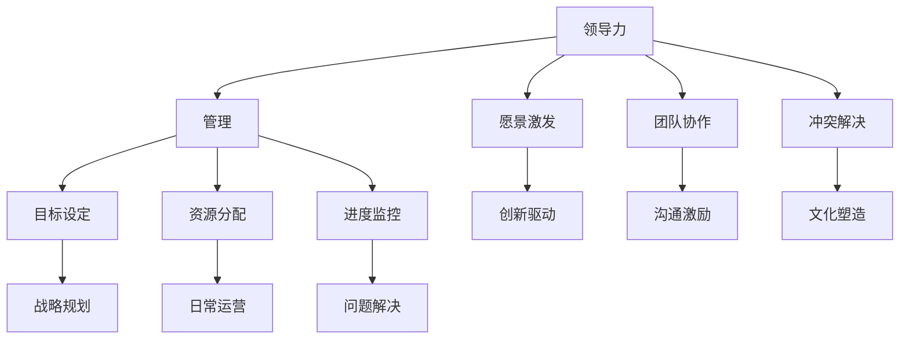
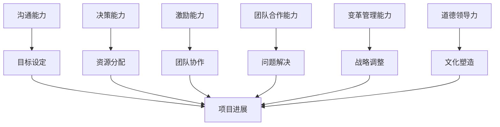
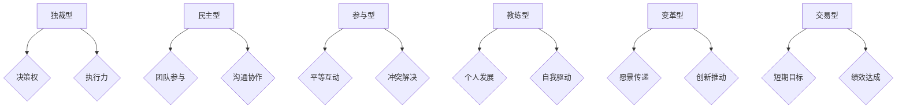
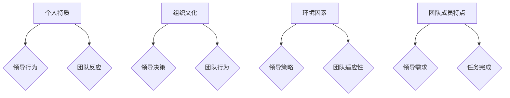
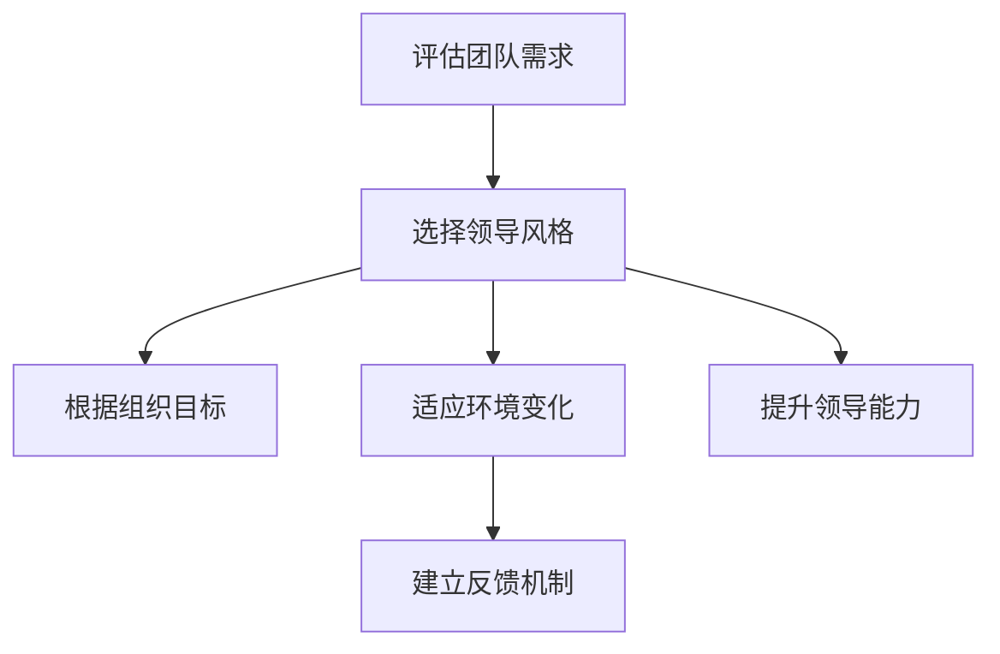
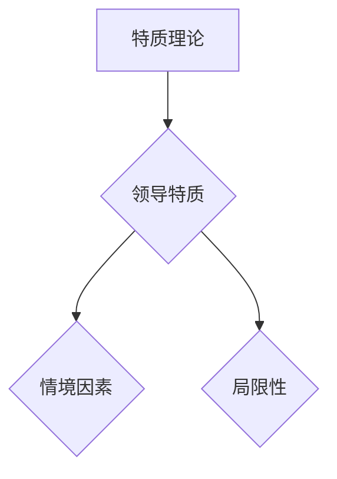
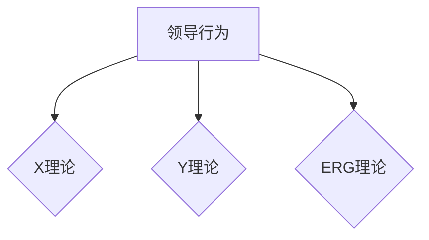
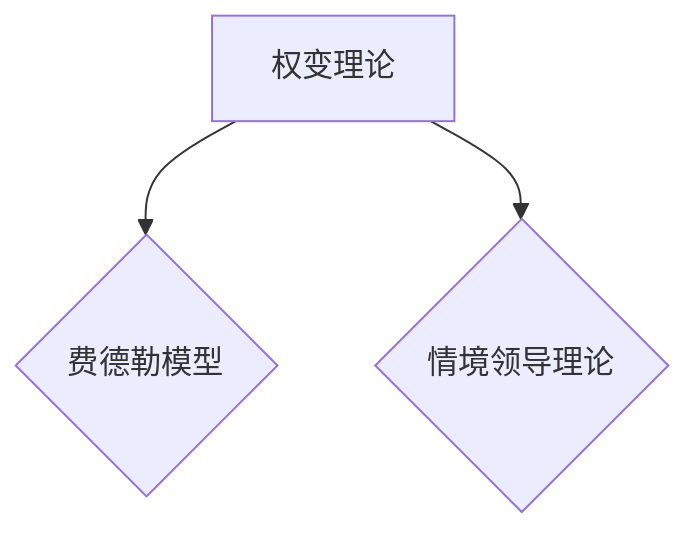

                 

### 1.1.1 领导力的定义与作用

领导力（Leadership）是一种影响力，是推动个体或团队朝着共同目标前进的能力。它与权威（Authority）不同，权威是基于职位赋予的权力，而领导力则更多依赖于个人魅力、专业知识、以及沟通和激励能力。

在组织中，领导力起着至关重要的作用。它能够激发团队成员的潜力，提高工作效率，促进创新和协作，最终实现组织目标。有效的领导力不仅能够提高组织的竞争力，还能增强员工的满意度和忠诚度，从而在长期内为企业带来持续的成功。

领导力的核心作用可以从以下几个方面进行阐述：

1. **目标设定**：领导者需要明确组织的愿景和目标，并将其传达给团队成员，使每个人都明确自己的工作方向和责任。

2. **沟通与协调**：领导力强调有效的沟通，确保信息在组织内顺畅传递，减少误解和冲突。同时，领导者还需要协调不同部门或团队成员的工作，确保项目顺利进行。

3. **激励与培养**：领导者需要了解团队成员的需求和动机，通过激励措施激发他们的工作热情和创造力，并提供成长和发展的机会。

4. **决策与风险管理**：领导力涉及制定决策和应对风险的能力。领导者需要具备分析问题和制定解决方案的能力，同时勇于承担风险和责任。

5. **文化塑造**：领导力对组织文化的塑造具有重要影响。一个优秀的领导者能够塑造积极向上的企业文化，提升组织的整体凝聚力。

因此，领导力不仅是领导者个人素质的体现，也是组织成功的关键因素。在现代社会，越来越多的组织开始重视领导力的培养和发展，将其视为核心竞争力之一。

### 1.1.2 领导力与管理的区别

领导力（Leadership）和管理（Management）是两个相互关联但有所区别的概念。尽管两者都关注组织的目标实现和资源优化，但它们的核心任务和方法有所不同。

首先，领导力更侧重于激励和引导，而管理则更关注规划和执行。领导力是通过个人魅力、愿景和价值观来激发团队成员的潜能，推动他们自发地为实现共同目标而努力。而管理则侧重于制定计划、分配资源、监控进度和解决问题，确保组织目标的实现。

其次，领导力和管理的目标虽然都指向组织的成功，但侧重点不同。领导力更注重长远的发展和战略规划，强调创新和变革。它关注如何激发组织的创造力和竞争力，推动组织不断进步。管理则更注重日常运营和效率，确保组织的各项任务按时完成，资源得到合理利用。

此外，领导力和管理的风格和方法也有所不同。领导力强调个人影响力和团队协作，领导者需要具备良好的沟通、激励和冲突解决能力。管理则强调系统性和规范性，管理者需要制定明确的目标、流程和制度，确保组织有序运作。

尽管领导力和管理有明确的区别，但在实际操作中，两者往往是相互交织、相互促进的。一个优秀的领导者既需要具备管理能力，又需要具备领导力，才能在组织中发挥最大作用。以下是一个简化的Mermaid流程图，展示领导力与管理之间的关系：

通过这个流程图，我们可以看到，领导力和管理在目标设定、资源分配、进度监控等方面有所重叠，但领导力更注重愿景激发、团队协作和文化塑造，而管理则更注重日常运营和问题解决。

### 1.1.3 领导力的核心要素

领导力作为一种复杂的能力，其成功实施依赖于多个核心要素。以下是一些关键的领导力要素，以及它们在领导过程中的具体应用和重要性。

1. **沟通能力**：沟通是领导力的核心要素之一。一个优秀的领导者必须具备出色的沟通技巧，包括倾听、表达、说服和反馈能力。有效的沟通能够确保信息在组织内部准确无误地传递，减少误解和冲突。例如，在项目启动时，领导者需要清晰地传达目标和期望，使团队成员明确自己的职责。在项目进行过程中，领导者需要及时收集团队成员的意见和反馈，调整策略，确保项目顺利进行。

2. **决策能力**：领导者需要具备快速、明智的决策能力。决策能力不仅涉及对信息的分析和判断，还涉及承担风险和责任。在面对复杂和不确定的情况时，领导者需要果断做出决策，同时考虑团队成员的利益和组织的长远发展。例如，在资源分配上，领导者需要权衡不同项目的优先级和潜在收益，做出合理的决策。

3. **激励能力**：激励是激发团队成员潜力和工作热情的关键。领导者需要了解团队成员的需求和动机，通过奖励、认可和晋升等手段，激发他们的工作积极性。有效的激励不仅能够提高工作效率，还能增强团队的凝聚力和忠诚度。例如，在项目取得阶段性成果时，领导者可以通过公开表扬和奖励，激励团队成员继续努力。

4. **团队合作能力**：团队合作能力是领导者成功的关键。领导者需要能够构建和维护高效的团队，促进团队成员之间的沟通和协作。这包括解决团队内部的冲突，协调不同成员的工作，以及确保每个成员都能充分发挥自己的优势。例如，在跨部门项目中，领导者需要协调不同部门的工作，确保项目能够按时完成。

5. **变革管理能力**：在快速变化的环境中，领导者需要具备变革管理能力。这包括对变化的敏感度，能够及时识别和应对外部环境的变化，推动组织内部的变革。领导者需要具备创新思维，能够提出新的策略和解决方案，同时引导团队成员适应变革。例如，在面对市场变化时，领导者需要调整组织的策略，确保组织能够快速响应市场变化。

6. **道德领导力**：道德领导力是领导力的基石。领导者需要具备高尚的道德品质，包括诚信、正直、公正和责任。道德领导力能够赢得团队成员的信任和尊重，增强组织的凝聚力和文化。例如，在面对利益冲突时，领导者需要坚持原则，做出公正的决策，以树立良好的榜样。

通过以上核心要素的实践，领导者能够有效地推动组织的发展，实现组织的目标。以下是一个简化的Mermaid流程图，展示领导力的核心要素及其在领导过程中的应用：

通过这个流程图，我们可以看到，领导力的核心要素在目标设定、资源分配、团队协作、问题解决、战略调整和文化塑造等方面都发挥着重要作用，共同推动组织的发展。

### 1.2.1 领导风格的分类

领导风格是指领导者在其工作中表现出来的行为模式和态度。不同的领导风格对团队成员的激励和组织的绩效有着重要的影响。根据不同的分类标准，领导风格可以有多种分类方法。以下介绍几种常见的领导风格分类及其特点。

1. **独裁型领导**（Authoritative Leadership）

独裁型领导是一种传统的领导风格，领导者拥有绝对的决策权和控制权。他们通常通过命令和指示来指导团队成员，并严格监督执行情况。独裁型领导的特点是决策迅速、执行力强，但在某些情况下可能会导致团队成员缺乏参与感和主动性。

2. **民主型领导**（Democratic Leadership）

民主型领导强调团队成员的参与和协作。领导者会征求团队成员的意见，共同讨论和决策，从而增强团队的凝聚力和合作精神。民主型领导鼓励开放沟通和自由表达，能够激发团队成员的创造力和积极性。然而，这种领导风格可能会因为决策过程复杂而影响执行效率。

3. **参与型领导**（Participant Leadership）

参与型领导强调领导者与团队成员之间的平等关系，领导者会主动参与团队成员的工作，提供支持和帮助。这种领导风格强调互动和合作，能够建立良好的团队氛围。参与型领导通常擅长解决冲突，增强团队凝聚力。然而，领导者可能会因为过度参与而分散注意力，影响决策效率。

4. **教练型领导**（Coach Leadership）

教练型领导注重团队成员的个人发展和成长。领导者会通过指导和培训，帮助团队成员提升技能和知识水平。教练型领导鼓励自我驱动和自主学习，使团队成员能够在工作中不断进步。这种领导风格能够提高团队成员的工作满意度和忠诚度。然而，教练型领导可能需要花费更多时间和精力在团队成员的培训和发展上。

5. **变革型领导**（Transformational Leadership）

变革型领导是一种具有远见的领导风格，领导者通过激发团队成员的潜力和热情，推动组织实现变革和进步。变革型领导强调愿景和价值观的传递，能够激励团队成员追求卓越。这种领导风格在应对外部环境变化和推动组织创新方面表现突出。然而，变革型领导可能因为变革过程中的挑战而面临较大的压力。

6. **交易型领导**（Transactional Leadership）

交易型领导侧重于短期目标和绩效的达成。领导者通过奖励和惩罚来激励团队成员，确保他们按照预期完成工作。交易型领导的特点是清晰的目标设定和高效的执行。然而，这种领导风格可能缺乏对长期发展的关注，容易导致团队成员的被动行为。

以上各种领导风格都有其独特的优势和局限性。在实际应用中，领导者需要根据具体情况和团队需求，灵活调整自己的领导风格，以达到最佳效果。以下是一个简化的Mermaid流程图，展示不同领导风格的特点和适用场景：

通过这个流程图，我们可以更好地理解不同领导风格的特点和适用场景，从而在实际工作中选择最合适的领导风格。

### 1.2.2 领导风格的影响因素

领导风格的影响因素多种多样，主要包括个人特质、组织文化和环境因素。这些因素相互作用，共同塑造了领导者的领导风格，从而对团队和组织产生深远的影响。

首先，个人特质是影响领导风格的重要因素。领导者的性格、价值观、信念和经验都会影响其领导行为。例如，一个自信且果断的领导者可能更倾向于采用独裁型领导风格，而一个善于倾听和沟通的领导者可能更倾向于采用民主型领导风格。个人特质不仅影响领导者的行为，还影响团队成员对领导者的反应和信任度。

其次，组织文化是另一个关键因素。组织文化是指组织内部普遍认同的价值观、信仰和行为准则。一个鼓励创新和自主性的组织文化可能促使领导者采用参与型或变革型领导风格，而一个强调稳定和秩序的组织文化可能更倾向于独裁型或交易型领导风格。组织文化不仅影响领导者的决策和行动，还影响团队成员的行为和态度。

环境因素也是影响领导风格的重要因素。外部环境的变化，如市场竞争、经济波动和政策调整，都会对领导风格产生影响。例如，在竞争激烈的市场中，领导者可能需要更果断地做出决策，采用变革型或交易型领导风格，以应对外部挑战。而在经济不确定的时期，领导者可能需要更注重团队协作和稳定，采用民主型或参与型领导风格，以增强团队的凝聚力和适应性。

此外，团队成员的特点也会影响领导风格的选择。团队成员的技能水平、经验、动机和态度都会影响领导者对领导风格的需求。例如，对于技能水平较高且自主性较强的团队成员，领导者可能采用参与型或教练型领导风格，以充分发挥他们的潜力。而对于技能水平较低且需要严格监督的团队成员，领导者可能采用独裁型或交易型领导风格，以确保任务的顺利完成。

综上所述，领导风格的影响因素是多方面的，领导者需要根据自身特质、组织文化和环境因素，以及团队成员的特点，灵活调整领导风格，以实现最佳效果。以下是一个简化的Mermaid流程图，展示领导风格的影响因素：

通过这个流程图，我们可以更清晰地理解领导风格的影响因素，从而在实际工作中选择和调整最合适的领导风格。

### 1.2.3 领导风格的选择与调整

选择和调整领导风格是领导者的一项重要任务。合适的领导风格能够提升团队效能和员工满意度，而不合适的领导风格则可能导致团队冲突和绩效下降。以下是一些关键步骤和策略，帮助领导者根据不同情况和需求选择和调整领导风格。

首先，领导者需要评估团队的需求和当前情况。这包括了解团队成员的技能水平、工作态度、团队合作情况以及面临的挑战。例如，如果团队成员普遍具备较高的技能水平和自主性，领导者可能选择采用参与型或教练型领导风格，以充分发挥团队成员的潜力。如果团队成员需要更多的指导和监督，领导者可能需要采用独裁型或交易型领导风格，以确保任务顺利完成。

其次，领导者需要根据组织的战略目标和文化背景选择领导风格。例如，在一个创新驱动的组织中，领导者可能需要采用变革型领导风格，鼓励团队成员提出新的想法和解决方案。在一个注重稳定和秩序的组织中，领导者可能需要采用独裁型或交易型领导风格，以确保组织目标的实现。

第三，领导者需要不断调整领导风格以适应环境变化。外部环境的变化，如市场竞争加剧、经济波动和政策调整，都可能对团队的运作产生影响。在这种情况下，领导者需要灵活调整领导风格，以应对外部挑战。例如，在竞争激烈的市场中，领导者可能需要采用变革型或交易型领导风格，迅速做出决策并推动团队适应市场变化。

第四，领导者需要关注自身的成长和发展，不断提升领导能力。这包括学习新的领导理论和实践，参加领导力培训课程，以及与同行交流经验。通过不断学习和实践，领导者能够更好地理解不同领导风格的优势和局限，从而更有效地选择和调整领导风格。

最后，领导者需要建立反馈机制，定期收集团队成员的反馈意见。通过反馈，领导者可以了解团队成员对领导风格的感受和反应，及时进行调整和改进。例如，如果团队成员普遍反映领导风格过于独裁，领导者可能需要更多地采用民主型或参与型领导风格，以增强团队的参与感和合作精神。

以下是一个简化的Mermaid流程图，展示选择和调整领导风格的步骤和策略：

通过这个流程图，我们可以看到，选择和调整领导风格是一个系统性的过程，需要领导者综合考虑团队需求、组织目标、环境变化和个人成长，从而选择和调整最合适的领导风格。

### 1.3.1 特质理论

特质理论（Trait Theory）是早期关于领导力研究的重要理论之一，其核心观点是领导者的成功取决于他们天生具备的一系列特质或性格特征。特质理论认为，某些人因为拥有特定的内在素质，如聪明、自信、决断力等，从而具备了领导者的潜力。这些特质可以通过心理测试和评估来识别。

特质理论的早期研究者包括托马斯·马尔基尔（Thomas M. Menzies）和弗雷德里克·赫兹伯格（Fredrick Herzberg）。他们提出，领导者的特质包括智力、自信心、决断力、热情、沟通能力等。特质理论的支持者认为，这些特质是可以通过遗传和环境因素共同塑造的，并且是稳定的、持久的。

然而，特质理论也存在一些局限性。首先，特质理论忽视了情境因素对领导力的影响。即一个具备良好特质的领导者在不同情境下可能表现出不同的领导风格和效果。其次，特质理论忽略了个体特质与情境的相互作用。例如，一个聪明、自信的领导者在一个支持性的环境中可能表现出色，但在一个压力巨大、资源匮乏的环境中可能面临挑战。

尽管如此，特质理论在领导力研究中的地位不可忽视。它为后续的领导力研究提供了重要的基础，并启发了对领导者特质的进一步探讨。以下是一个简化的Mermaid流程图，展示特质理论的核心观点和局限性：

通过这个流程图，我们可以更清晰地理解特质理论的基本概念及其在领导力研究中的应用和局限性。

### 1.3.2 行为理论

行为理论（Behavioral Theory）是领导力研究中的一个重要分支，它强调领导者的行为模式对其领导效果的影响。与特质理论不同，行为理论认为领导力不仅取决于领导者的内在特质，还取决于其在不同情境下的行为表现。

行为理论的早期代表人物是道格拉斯·麦克格雷格（Douglas McGregor）和克莱顿·阿尔德弗尔（Clayton Alderfer）。麦克格雷格提出了X理论和Y理论，分别描述了不同领导行为模式对员工动机和绩效的影响。X理论认为员工天生懒惰，需要严格的管理和惩罚来激励；而Y理论则认为员工具有自我驱动力，愿意承担责任，领导者应提供支持和激励。

阿尔德弗尔则提出了ERG理论，进一步探讨了员工需求对领导行为的影响。ERG理论认为，员工同时追求三种层次的需求：存在（Existence）、关系（Relatedness）和成长（Growth）。领导者应根据员工的不同需求，采取相应的领导行为，以提高员工满意度和绩效。

行为理论的一个重要发现是领导行为可以培养和改变。这为领导力的发展提供了新的思路，即通过培训和实践，领导者可以学会更有效的领导行为。以下是一个简化的Mermaid流程图，展示行为理论的核心观点和研究成果：

通过这个流程图，我们可以更清晰地理解行为理论的基本概念及其在领导力研究中的应用。

### 1.3.3 权变理论

权变理论（Contingency Theory）是领导力研究中的一个重要理论，它认为领导效果取决于领导者、被领导者、情境之间的动态互动关系。权变理论的核心观点是，没有一种普遍适用的最佳领导风格，领导者的成功取决于他们如何适应不同的情境和变化。

权变理论的代表人物是费德勒（Fiedler）和赫赛（Hersey）。费德勒提出了权变模型（Fiedler Model of Leadership），认为领导者的风格分为任务导向型（Task-Oriented）和关系导向型（Relationship-Oriented）。任务导向型领导者更注重任务完成，倾向于采用严格的控制措施；关系导向型领导者更注重团队关系，倾向于采用民主和合作的领导风格。费德勒认为，领导者的风格是固定的，但可以通过调整情境因素来提高领导效果。

赫赛和布兰查德（Hersey & Blanchard）则提出了情境领导理论（Situational Leadership Theory），认为领导者的风格应根据团队成员的成熟度（Maturity）进行选择。团队成员的成熟度分为三个层次：不成熟、较不成熟和成熟。对于不成熟的团队成员，领导者应采用指导型（Directing）领导风格；对于较不成熟的团队成员，领导者应采用推销型（SELLING）领导风格；对于成熟的团队成员，领导者应采用参与型（Participating）领导风格。

权变理论的一个重要贡献是强调领导者的适应性。它指出，领导者需要根据不同情境和团队成员的特点，灵活调整领导风格，以实现最佳效果。以下是一个简化的Mermaid流程图，展示权变理论的核心观点和应用：

通过这个流程图，我们可以更清晰地理解权变理论的基本概念及其在领导力研究中的应用。

### 2.1.1 创业精神的概念

创业精神（Entrepreneurial Spirit）是指一种追求创新、承担风险、积极应对变化并不断追求成功的心理状态和行为模式。它不仅仅是一种经济活动，更是一种思维方式和生活态度。创业精神涵盖了多个方面，包括创新能力、决策能力、风险管理、合作精神和持续学习的动力。

首先，创业精神的核心是创新能力。创业者需要具备强烈的创新意识，不断寻找新的解决方案和商业机会。他们勇于尝试新事物，敢于挑战传统的商业模式和思维定式。创新能力是创业精神的重要驱动力，它能够推动创业者不断突破自我，实现事业的持续成长。

其次，创业精神强调决策能力。创业者需要具备在复杂和不确定的环境下做出明智决策的能力。他们能够快速分析问题，权衡各种可能的解决方案，并果断采取行动。决策能力是创业成功的关键因素，它帮助创业者抓住机遇，规避风险，实现企业的快速发展。

此外，创业精神还包括风险管理。创业者必须面对各种不确定性和风险，包括市场风险、技术风险、财务风险等。他们需要具备良好的风险管理意识，通过制定有效的风险控制策略，降低创业失败的可能性。创业精神中的风险管理能力不仅体现在创业初期，也贯穿于企业的整个生命周期。

合作精神是创业精神的另一个重要方面。创业者通常需要与各种利益相关者合作，包括员工、投资者、供应商和客户等。他们需要具备良好的沟通和协调能力，能够建立和维护良好的合作关系，共同推动企业的发展。合作精神不仅有助于企业内部的高效运作，也有助于外部资源的有效整合。

最后，创业精神强调持续学习的动力。在快速变化的市场环境中，创业者需要不断更新知识和技能，适应新的挑战和机遇。他们保持对新事物的好奇心和求知欲，不断学习和实践，以保持竞争优势。持续学习是创业精神的重要组成部分，它帮助创业者不断成长和进步，实现企业的长远发展。

总之，创业精神是一种综合性的能力，它涵盖了创新能力、决策能力、风险管理、合作精神和持续学习等多个方面。这些能力共同构成了创业者的核心竞争力，使他们能够在激烈的市场竞争中脱颖而出，实现事业的辉煌。

### 2.1.2 创业精神的重要性

创业精神在现代社会中具有至关重要的地位，它不仅是推动经济增长的关键动力，也是激发创新和促进社会进步的重要源泉。以下是创业精神的重要性及其对个人、企业和整个社会的影响。

首先，创业精神是经济增长的重要引擎。创业活动创造了大量就业机会，推动了新产业的发展。通过创新和创造新的商业模式，创业者为市场注入了新的活力，推动了整个经济的增长。例如，互联网经济的发展离不开无数创业者的创新和努力，电子商务、移动支付和共享经济等新兴产业的崛起，都极大地促进了全球经济的繁荣。

其次，创业精神能够激发创新。创业者具备强烈的创新意识，他们勇于挑战现状，不断探索新的技术和商业机会。这种创新精神不仅推动了新技术的研发和应用，也促进了传统产业的升级和转型。例如，苹果公司创始人史蒂夫·乔布斯以其卓越的创新能力，颠覆了多个行业，推动了智能手机、平板电脑等产品的普及，改变了人们的生活方式。

此外，创业精神有助于促进社会进步。创业者不仅关注商业成功，还积极参与社会公益事业。他们通过创新的产品和服务，解决社会问题，提升社会福祉。例如，比尔·盖茨创立的微软公司不仅是一个商业巨头，也是一个重要的慈善机构，通过其基金会致力于解决全球的健康和教育问题。

对个人而言，创业精神提供了实现自我价值的机会。创业者通过创建和领导企业，可以实现个人梦想和职业目标。创业过程中，个人需要不断学习新知识、锻炼能力，这种成长过程不仅提升了个人的竞争力，也增强了自信心和成就感。

对企业而言，创业精神是持续发展的动力。拥有创业精神的企业能够不断创新，适应市场变化，保持竞争优势。创业精神鼓励企业拥抱风险，勇于尝试新的商业模式和市场机会，从而实现可持续发展。例如，谷歌公司以其开放的创新文化和强烈的创业精神，不断推出新产品和服务，成为全球领先的科技公司之一。

总之，创业精神在现代社会中具有重要价值。它不仅是经济增长的引擎，也是激发创新和社会进步的重要力量。对于个人和企业来说，培养和发扬创业精神，能够实现个人价值，推动企业持续发展，并为社会带来积极的影响。

### 2.1.3 创业精神的特征

创业精神是一种独特的心理和行为特征，它不仅决定了创业者的思维方式和行为模式，也影响着创业活动的成败。以下是创业精神的主要特征：

首先，冒险精神是创业精神的核心特征之一。创业者需要具备面对不确定性和风险的勇气。在创业过程中，面对市场变化、技术突破和竞争压力，创业者必须敢于冒险，勇于尝试新的商业模式和解决方案。冒险精神使创业者能够抓住机遇，迎接挑战，从而实现事业的突破。

其次，创新意识是创业精神的另一个关键特征。创业者需要具备强烈的创新意识，不断探索新的技术和商业机会。创新意识使创业者能够打破传统思维定式，发现并利用市场空白，开发出具有竞争力的产品和服务。通过持续的创新，创业者能够保持竞争优势，推动企业的长期发展。

第三，自我驱动是创业精神的重要特征。创业者通常具备强烈的内在动机和自我驱动力，他们能够自我激励，设定高目标，并为此付出巨大的努力。自我驱动使创业者能够在困难面前坚持不懈，克服各种障碍，实现创业目标。

第四，团队合作是创业精神的重要组成部分。创业者不仅需要具备个人能力，还需要具备优秀的团队合作能力。创业过程中，创业者需要与各种利益相关者合作，包括员工、投资者、合作伙伴和客户等。团队合作能力使创业者能够有效整合资源，实现企业目标。

第五，持续学习是创业精神的关键特征。创业环境变化迅速，创业者需要不断学习新知识、掌握新技能，以适应市场的变化。持续学习能力使创业者能够不断更新自己的知识和能力，保持竞争优势。

最后，乐观积极是创业精神的重要表现。创业者需要具备积极的心态，面对挑战和失败时能够保持乐观，寻找解决问题的方法。乐观积极的心态使创业者能够在逆境中保持信心，持续推动创业事业的发展。

总之，创业精神是一种综合性的能力，包括冒险精神、创新意识、自我驱动、团队合作、持续学习和乐观积极等多方面特征。这些特征共同构成了创业者的核心竞争力，使他们能够在激烈的市场竞争中脱颖而出，实现创业目标。

### 2.2.1 创业思维模式

创业思维模式（Entrepreneurial Mindset）是指创业者对待问题、分析问题和解决问题的思维方式。这种思维模式通常包括几个关键特征，这些特征帮助创业者识别机会、应对挑战并实现创新。以下是创业思维模式的主要组成部分：

首先，**机会导向**（Opportunity-Oriented）是创业思维模式的核心特征。创业者具备敏锐的市场洞察力，能够从日常生活中的问题、新兴技术或市场趋势中发现潜在的商业机会。这种思维方式使他们不仅关注现有的市场需求，还能预见未来的需求变化，从而提前布局和抢占市场。

其次，**问题解决**（Problem-Solving）是创业思维模式的关键组成部分。创业者面对问题时，不是简单地寻找解决方案，而是首先分析问题的根源，理解问题的本质。通过系统性的问题解决方法，创业者能够找到创新性的解决方案，从而解决客户的问题或满足市场需求。

第三，**创新驱动**（Innovation-Driven）是创业思维模式的重要特征。创业者不满足于现有的解决方案，他们持续探索和尝试新的方法和思路。这种创新驱动的思维方式使创业者能够不断突破传统模式，开发出具有竞争力的新产品和服务。

第四，**灵活适应**（Flexibility and Adaptability）是创业思维模式的核心能力。创业环境多变，创业者需要具备快速适应变化的能力。灵活适应意味着能够根据市场反馈和实际情况调整策略，及时调整方向，以应对外部环境的变化。

第五，**风险管理**（Risk Management）是创业思维模式的重要组成部分。创业者需要具备识别和管理风险的能力。他们不仅能够预测潜在的风险，还能制定相应的风险控制措施，以降低创业失败的可能性。

第六，**客户导向**（Customer-Centric）是创业思维模式的另一个重要特征。创业者始终将客户需求放在首位，通过深入了解客户的需求和行为，开发出能够真正满足客户需求的产品和服务。这种思维方式有助于建立长期客户关系，提升企业竞争力。

最后，**持续学习**（Continuous Learning）是创业思维模式的持续动力。创业者认识到知识更新速度快，市场需求变化大，因此他们始终保持学习的态度，不断提升自己的知识和技能。持续学习使创业者能够适应市场变化，保持竞争优势。

总之，创业思维模式是一种综合性的思维方式，包括机会导向、问题解决、创新驱动、灵活适应、风险管理、客户导向和持续学习等多个方面。这些特征共同构成了创业者的核心竞争力，使他们能够在复杂多变的市场环境中找到成功之路。

### 2.2.2 创业心理素质

创业心理素质是创业者成功的重要因素之一，它包括情绪管理、自我激励、抗压能力和团队合作等多个方面。以下是对这些关键心理素质的详细阐述。

首先，**情绪管理**（Emotional Management）是创业心理素质的核心要素。创业者面临高度的压力和不确定性，因此需要具备良好的情绪管理能力，以保持冷静和理智。情绪管理包括识别和调节自己的情绪，避免负面情绪的过度反应。例如，在面对失败或挫折时，创业者需要学会从情绪的波动中迅速恢复，以继续推动创业项目。

其次，**自我激励**（Self-Motivation）是创业过程中不可或缺的心理素质。创业者往往需要独立承担风险和责任，因此必须具备强大的内在动机，以克服创业过程中的各种困难和挑战。自我激励可以通过设定具体的目标、庆祝小成就和持续学习来实现。一个自我激励的创业者能够在面对困境时保持积极的态度，不断寻找前进的动力。

第三，**抗压能力**（Stress Tolerance）对于创业者来说至关重要。创业过程充满了不确定性和风险，因此创业者需要具备良好的抗压能力，以应对不断出现的问题和挑战。抗压能力包括适应变化、灵活应对压力源和保持心理健康。例如，当项目进展不顺利或面临重大决策时，创业者需要保持冷静，并采取有效的应对策略，以确保项目的持续推进。

第四，**团队合作**（Team Collaboration）是创业成功的关键。创业者通常需要与团队成员、投资者和其他利益相关者合作，因此需要具备优秀的团队合作能力。团队合作能力包括沟通、协调和冲突解决。例如，在组建团队时，创业者需要确保团队成员之间的角色和职责清晰，沟通渠道畅通，以减少误解和冲突，提高团队的整体效能。

此外，创业者还需要具备**自我反思**（Self-Reflection）的能力。自我反思是指定期审视自己的行为和决策，分析成功和失败的原因，并从中学习。通过自我反思，创业者能够不断提升自己的领导力和管理能力，更好地应对未来的挑战。

最后，**适应性**（Adaptability）是创业心理素质的重要组成部分。创业环境不断变化，创业者需要具备快速适应新环境和新情况的能力。适应性包括灵活调整战略、接受变化和勇于面对不确定性。例如，在市场环境发生变化时，创业者需要迅速调整产品和商业模式，以适应新的市场需求。

总之，创业心理素质是创业成功的重要因素。创业者需要具备情绪管理、自我激励、抗压能力、团队合作、自我反思和适应性等多方面的心理素质，以应对创业过程中的各种挑战和困难。通过不断提升这些心理素质，创业者能够提高自己的竞争力，实现创业目标。

### 2.2.3 创业精神的实践方法

培养和发扬创业精神是每个创业者必须面对的挑战。以下是一些实用的实践方法，帮助创业者提升创业精神，实现创业目标。

首先，**积极参与创业活动**是培养创业精神的重要途径。创业者可以通过参加创业竞赛、创业讲座、创业沙龙等活动，与同行交流经验，获取新的思路和灵感。此外，创业者还可以加入创业社区，参与线上线下的创业交流活动，建立广泛的人脉网络，为创业之路提供支持。

其次，**不断学习和提升自我**是创业精神的重要组成部分。创业者需要保持对新知识、新技术的敏感度，通过阅读书籍、参加培训课程、在线学习等方式，不断提升自己的专业能力和综合素质。例如，创业者可以学习创新管理、市场营销、财务管理等知识，以应对创业过程中的各种挑战。

第三，**设定明确的目标和计划**有助于创业者保持方向和动力。创业者需要设定具体的短期和长期目标，并制定详细的行动计划。通过分解目标和设定关键绩效指标（KPI），创业者可以更加清晰地了解自己的进展，及时调整策略，确保创业目标的实现。

第四，**勇于面对失败和挫折**是培养创业精神的关键。创业过程中不可避免地会遇到失败和挫折，但创业者需要以积极的态度面对这些挑战。通过分析失败的原因，创业者可以从中吸取教训，不断提升自己的能力和经验。例如，创业者可以制定应对失败的策略，包括风险管理、备用计划和心理调适，以降低失败的风险。

第五，**建立和优化团队**是创业成功的重要保障。创业者需要找到合适的团队成员，共同推动创业项目的发展。创业者可以通过招聘、培训、激励等多种方式，打造一支高效、协作的团队。例如，创业者可以采用扁平化管理模式，增强团队间的沟通和协作，提高团队的执行力。

第六，**持续创新和优化**是创业精神的核心。创业者需要不断探索新的商业模式和解决方案，以保持竞争优势。创业者可以通过市场调研、用户反馈和数据分析，了解市场需求和变化，及时调整产品和服务。例如，创业者可以尝试新技术、新模式，开发新产品，以吸引更多客户。

最后，**积极应对外部环境变化**是创业者必备的能力。创业环境瞬息万变，创业者需要具备快速适应和应对变化的能力。例如，当市场环境发生变化时，创业者需要及时调整战略和计划，以适应新的市场状况。

总之，培养和发扬创业精神需要创业者不断实践和探索。通过积极参与创业活动、不断学习和提升自我、设定明确的目标和计划、勇于面对失败和挫折、建立和优化团队、持续创新和优化以及积极应对外部环境变化，创业者可以不断提升创业精神，实现创业目标。

### 2.3.1 创业领导者应具备的能力

创业领导者要成功带领团队实现创业目标，需要具备一系列关键能力。以下是对这些能力的详细阐述：

首先，**战略规划能力**是创业领导者必不可少的核心能力。创业领导者需要具备长远的战略眼光，能够制定明确的愿景和目标，并制定详细的实施计划。战略规划能力包括市场分析、竞争分析、资源分配和风险管理等多个方面。例如，领导者需要通过市场调研和分析，了解目标市场的需求和发展趋势，从而制定符合市场需求的产品策略和推广计划。

其次，**领导力和管理能力**是创业领导者的核心素质。创业领导者需要具备强大的领导力，能够激发团队成员的积极性和创造力，同时具备高效的管理能力，确保团队高效运作。领导力包括沟通、激励、团队建设和冲突解决等方面，而管理能力则涉及计划、执行、监控和改进。例如，领导者需要通过有效的沟通，确保团队成员理解公司的目标和愿景，并通过激励措施，激发团队成员的潜力。

第三，**创新能力**是创业领导者的关键能力之一。创业本质上是一个创新的过程，领导者需要具备强烈的创新意识，能够不断提出新的想法和解决方案，推动企业的发展。创新能力不仅体现在产品和服务上，还包括商业模式的创新和管理方法的改进。例如，领导者可以通过引入新技术、开发新产品或优化现有产品，以满足市场需求，提高市场竞争力。

第四，**风险管理能力**是创业领导者必须具备的重要能力。创业过程中，领导者需要面对各种不确定性和风险，如市场风险、技术风险和财务风险等。风险管理能力包括识别风险、评估风险和制定风险控制措施。例如，领导者需要通过建立全面的风险管理机制，对潜在风险进行预测和应对，以降低创业失败的概率。

第五，**团队合作能力**是创业领导者的重要素质。创业成功往往离不开团队的合作，领导者需要具备优秀的团队合作能力，能够建立高效的团队，并协调团队成员之间的关系。团队合作能力包括沟通、协调、冲突解决和激励。例如，领导者需要通过有效的沟通，确保团队成员之间的信息畅通，并通过协调和激励，增强团队的凝聚力和战斗力。

第六，**学习和适应能力**是创业领导者的持续动力。创业环境不断变化，领导者需要具备快速学习和适应新环境的能力，以应对不断出现的新挑战。学习能力和适应能力包括对新知识、新技能的获取和应用，以及在面对不确定性时，保持灵活和开放的心态。例如，领导者可以通过参加培训课程、阅读书籍和参加行业会议，不断更新自己的知识和技能。

最后，**客户导向**是创业领导者的重要思维方式。领导者需要始终以客户需求为导向，通过深入了解客户需求和行为，开发出符合市场期望的产品和服务。客户导向能力包括市场调研、用户反馈和数据分析。例如，领导者需要通过市场调研和用户反馈，了解客户对产品和服务的期望，并及时调整产品策略，以提升客户满意度。

总之，创业领导者需要具备战略规划、领导力和管理、创新、风险管理、团队合作、学习和适应能力以及客户导向等多方面的能力。这些能力共同构成了创业领导者的核心竞争力，使他们能够带领团队克服各种挑战，实现创业目标。

### 2.3.2 创业精神在领导力中的体现

创业精神在领导力中的体现，不仅体现在领导者个人的素质和能力上，还体现在其领导行为和团队管理方式中。以下从几个方面详细探讨创业精神如何在领导力中具体体现：

首先，**勇于创新**是创业精神在领导力中的核心体现。创业领导者通常具备强烈的创新意识，他们不满足于现状，敢于挑战传统观念和现有流程。在领导过程中，创业领导者会积极推动创新，鼓励团队成员提出新的想法和解决方案。例如，他们可能通过组织头脑风暴会议、设立创新奖励机制等方式，激发团队的创造力，推动企业不断进步。

其次，**承担风险**是创业精神的重要组成部分，也是创业领导者的显著特征。创业领导者通常具备较强的风险承受能力，他们在面对不确定性时，敢于做出大胆的决策。在领导过程中，创业领导者会鼓励团队成员勇于面对风险，并共同制定应对措施。例如，当市场环境发生变化时，创业领导者可能会主动调整战略，甚至尝试新的商业模式，以抓住市场机遇。

第三，**积极应对变化**是创业精神在领导力中的具体体现。创业领导者具备快速适应和应对变化的能力，他们能够灵活调整团队目标和行动计划，以应对外部环境的变化。在领导过程中，创业领导者会通过定期评估市场趋势和团队绩效，及时调整策略，确保团队始终保持竞争力。例如，他们可能会通过引入新的技术或管理工具，提高团队的工作效率和灵活性。

第四，**重视团队合作**是创业精神在领导力中的重要体现。创业领导者深知团队合作的重要性，他们会通过建立信任、鼓励沟通和分享资源等方式，打造一个高效的团队。在领导过程中，创业领导者会重视团队成员的多样性和独特性，通过有效的团队协作，实现整体绩效的提升。例如，他们可能会通过组织团队建设活动、设立跨部门项目等方式，增强团队成员之间的互动和协作。

第五，**关注客户需求**是创业精神在领导力中的关键体现。创业领导者始终以客户为中心，他们通过深入了解客户需求和行为，不断优化产品和服务。在领导过程中，创业领导者会通过市场调研、用户反馈和数据分析等方式，了解客户的需求和期望，并及时调整产品策略和服务模式，以满足市场需求。例如，他们可能会通过推出定制化产品、提供优质客户服务等方式，提升客户满意度和忠诚度。

最后，**持续学习**是创业精神在领导力中的持续动力。创业领导者认识到知识更新速度快，市场需求变化大，因此他们始终保持学习的态度，不断提升自己的知识和技能。在领导过程中，创业领导者会通过参加培训课程、阅读书籍、参与行业会议等方式，不断更新自己的知识储备，以应对新的挑战。例如，他们可能会通过组织内部培训、外部咨询等方式，提升团队的整体素质和能力。

总之，创业精神在领导力中的体现，涵盖了勇于创新、承担风险、积极应对变化、重视团队合作、关注客户需求和持续学习等多个方面。通过这些具体体现，创业领导者能够有效地激发团队的潜力，推动企业的持续发展。

### 2.3.3 创业精神与领导力协同发展的策略

要实现创业精神与领导力的协同发展，领导者需要制定并实施一系列策略，以在团队中培养创业文化，激发成员的创业热情，并确保创业活动与组织目标的一致性。以下是一些关键策略：

首先，**建立明确的愿景和目标**。领导者需要明确组织的愿景和目标，并将其与创业精神相结合。通过制定具有挑战性和可实现性的目标，领导者可以激励团队成员为实现共同目标而努力。愿景和目标的明确性有助于团队统一行动，减少内耗，提高工作效率。

其次，**营造积极的企业文化**。领导者应积极营造一个支持创新和冒险的企业文化，鼓励团队成员提出新想法和解决方案。通过设立创新奖励机制、组织创新竞赛等活动，领导者可以激发团队成员的创业热情。同时，领导者应倡导开放沟通和包容多元的文化，使团队成员能够自由表达观点，积极参与决策。

第三，**提供必要的资源和支持**。为了确保创业活动的顺利进行，领导者需要为团队成员提供必要的资源和支持。这包括资金、技术、人才和市场等。例如，领导者可以通过设立创业基金、提供技术培训、搭建合作平台等方式，为团队成员的创业项目提供支持。

第四，**培养团队成员的创业能力**。领导者应关注团队成员的个人成长和职业发展，通过培训、轮岗和项目实践等方式，提升团队成员的综合能力。例如，领导者可以组织创业培训课程、邀请行业专家进行讲座，或安排团队成员参与实际项目，以增强他们的创业能力和实践经验。

第五，**建立有效的激励机制**。领导者需要设计合理的激励机制，以激发团队成员的创业热情和积极性。激励机制可以包括物质奖励和精神奖励，如奖金、股权激励、晋升机会和荣誉称号等。通过有效的激励机制，领导者可以增强团队成员的归属感和成就感，提高他们的工作动力。

第六，**鼓励团队合作和跨部门协作**。领导者应促进团队成员之间的合作和跨部门协作，以实现资源的共享和优势互补。通过建立跨部门项目团队、组织团队建设活动等方式，领导者可以增强团队的凝聚力，提升团队的协作效率。

第七，**及时反馈和调整**。领导者应建立有效的反馈机制，及时了解团队成员的工作进展和需求，并根据实际情况进行调整。通过定期评估和反馈，领导者可以及时发现和解决问题，确保创业活动与组织目标的协同发展。

最后，**注重可持续发展和长远规划**。领导者需要从长远角度考虑创业活动，确保创业项目不仅能够短期见效，还能够实现可持续发展。通过制定长远规划，领导者可以为团队提供明确的指导和方向，确保创业活动与组织的整体战略一致。

总之，通过建立明确的愿景和目标、营造积极的企业文化、提供必要的资源和支持、培养团队成员的创业能力、建立有效的激励机制、鼓励团队合作和跨部门协作、及时反馈和调整以及注重可持续发展和长远规划，领导者可以有效地实现创业精神与领导力的协同发展，推动团队的创业热情和组织目标的实现。

### 3.1.1 团队动力的概念

团队动力（Team Dynamics）是指团队成员之间相互作用、相互影响的过程和机制。它涉及团队成员的个体行为、团队结构、团队氛围和外部环境等多个方面，共同影响团队的整体表现和效能。团队动力不仅决定了团队是否能够高效运作，还直接影响团队成员的满意度和忠诚度。

首先，团队动力包括多个层面。从个体层面来看，团队成员的个性特征、动机和能力会影响其在团队中的行为和互动。例如，一个自信且富有创造力的团队成员可能更容易在团队中发挥领导作用，而一个内向且谨慎的成员可能更擅长提供细致的反馈和支持。

从团队结构层面来看，团队的组织形式、角色分配和沟通模式等因素都会影响团队动力。一个结构清晰的团队，成员角色明确，责任分工合理，能够提高团队的工作效率和协作效果。相反，如果团队结构混乱，责任不明，可能会导致成员之间的冲突和矛盾。

团队氛围是团队动力的另一个关键因素。积极向上的团队氛围能够激发成员的积极性和创造力，增强团队的凝聚力。例如，一个充满信任和尊重的团队氛围，成员之间能够开放沟通，分享想法和资源，从而提高团队的整体效能。而一个消极或紧张的团队氛围，可能会导致成员之间的隔阂和冲突，影响团队的运作。

外部环境也是影响团队动力的因素之一。外部环境的变化，如市场竞争、政策调整和客户需求变化，都会对团队动力产生重要影响。一个具有适应性和灵活性的团队，能够及时调整策略和应对外部环境的变化，从而保持竞争力。

总之，团队动力是一个复杂且动态的过程，涉及个体、团队结构和外部环境等多个层面。理解团队动力的概念和影响因素，对于领导者和管理者来说，至关重要，有助于他们更好地构建和引导高效团队。

### 3.1.2 团队动力的来源

团队动力的来源多样，主要包括内部激励、外部激励、团队目标、领导风格、团队结构和组织文化等多个方面。以下是对这些来源的详细阐述：

首先，**内部激励**是团队动力的一个重要来源。内部激励主要来自于团队成员自身的动机和价值观。当团队成员对工作充满热情、认同组织的使命和价值观时，他们会更加投入，表现出更高的工作积极性和创造力。例如，一个对技术充满热情的程序员，可能会在开发新产品时展现出极高的工作效率和创新能力。

其次，**外部激励**也是团队动力的重要来源。外部激励包括薪酬、晋升机会、荣誉称号等物质和非物质奖励。合理的外部激励能够激发团队成员的积极性，提高工作满意度和忠诚度。例如，通过设立绩效奖金、股权激励等激励措施，组织可以激励团队成员为实现组织目标而努力。

第三，**团队目标**是团队动力的核心来源。明确的团队目标能够为团队成员提供清晰的方向和动力，使他们能够集中精力，协同工作。当团队成员共同追求一个具有挑战性和可实现性的目标时，他们会感受到一种团队归属感和责任感，从而提高团队的凝聚力和执行力。例如，在一个竞争激烈的市场中，一个团队如果设定了一个共同的目标，即要在三个月内开发出一款具有竞争力的新产品，团队成员会为了实现这一目标而共同努力。

第四，**领导风格**对团队动力有重要影响。领导者的领导风格直接影响团队成员的工作态度和行为。一个支持型、参与型的领导风格能够激发团队成员的积极性和创造力，增强团队的凝聚力。例如，一个民主型的领导者会鼓励团队成员参与决策过程，听取他们的意见和建议，从而提高团队的参与感和责任感。

第五，**团队结构**也是团队动力的来源之一。合理的团队结构能够确保团队成员的角色和责任明确，促进有效的沟通和协作。一个扁平化的团队结构，可以减少信息传递的层次，提高团队的决策效率。例如，在一个创业团队中，如果团队成员的职责和权限清晰，他们可以快速响应市场变化，提高团队的灵活性和适应性。

第六，**组织文化**对团队动力有深远的影响。组织文化是指组织内部普遍认同的价值观、信念和行为准则。一个积极向上、创新导向的组织文化能够激发团队成员的创业热情和创造力。例如，一个以客户为中心的组织文化，会使团队成员更加关注客户需求，不断优化产品和服务，提高客户满意度。

总之，团队动力的来源是多方面的，包括内部激励、外部激励、团队目标、领导风格、团队结构和组织文化等。这些因素相互交织，共同影响团队的整体表现和效能。领导者和管理者需要全面考虑这些因素，制定有效的团队动力激发策略，以实现团队的高效运作和持续发展。

### 3.1.3 团队动力管理策略

为了有效激发和管理团队动力，领导者需要采用一系列科学和实用的策略，确保团队成员能够在高度激励和积极的环境中发挥最佳作用。以下是一些关键的管理策略：

首先，**建立明确的目标和愿景**。明确的目标和愿景是团队动力的基石。领导者需要与团队成员共同制定具体、可衡量的目标，并确保每个成员都了解这些目标的重要性。例如，一个技术团队可以设定一个目标：在六个月内将产品发布到市场，并实现一定的用户量。通过明确的目标，团队成员可以更加专注和投入，提高工作动力。

其次，**提供有效的激励机制**。激励机制是激发团队动力的关键。领导者可以采用多种激励方式，包括金钱奖励、荣誉表彰和职业发展机会等。例如，通过设立绩效奖金、优秀员工奖等，领导者可以激励团队成员为实现团队目标而努力。同时，领导者还应关注团队成员的职业成长，提供培训和发展机会，增强他们的归属感和忠诚度。

第三，**营造积极的团队氛围**。团队氛围对团队成员的积极性和工作满意度有着重要影响。领导者需要营造一个支持性、开放和包容的团队氛围，鼓励团队成员之间进行积极的沟通和协作。例如，通过定期组织团队建设活动、团队会议和社交聚会，领导者可以增强团队成员之间的联系和信任，提高团队的凝聚力和士气。

第四，**鼓励创新和反馈**。创新是团队动力的源泉，领导者应鼓励团队成员提出新的想法和改进措施。通过设立创新奖项、举办头脑风暴会议等方式，领导者可以激发团队成员的创新潜力。同时，领导者还应建立有效的反馈机制，鼓励团队成员对工作提出建设性意见，促进团队不断改进和优化。

第五，**提供必要的资源和支持**。为了确保团队动力的持续激发，领导者需要提供必要的资源和支持。这包括技术工具、培训机会和资源分配等。例如，通过为团队提供最新的技术设备、组织专业培训课程，领导者可以提升团队成员的技能和知识，提高团队的整体效率。

第六，**关注团队成员的福利和心理健康**。团队成员的福利和心理健康是团队动力管理的重要方面。领导者需要关注团队成员的工作与生活平衡，提供必要的心理支持。例如，通过设立员工心理咨询室、组织健康体检等活动，领导者可以保障团队成员的身心健康，提高他们的工作积极性和满意度。

最后，**定期评估和反馈**。领导者需要定期评估团队动力管理的有效性，并根据评估结果进行相应的调整和改进。通过定期召开团队会议、进行绩效评估和员工满意度调查，领导者可以了解团队成员的反馈和建议，及时发现问题并采取措施，确保团队动力管理的持续优化。

总之，通过建立明确的目标和愿景、提供有效的激励机制、营造积极的团队氛围、鼓励创新和反馈、提供必要的资源和支持、关注团队成员的福利和心理健康以及定期评估和反馈，领导者可以有效地激发和管理团队动力，推动团队的高效运作和持续发展。

### 3.2.1 创业目标的重要性

创业目标（Entrepreneurial Goals）在创业过程中具有至关重要的作用。明确的创业目标不仅为创业者指明了方向，还提供了衡量创业活动成功与否的标准。以下是创业目标的重要性的详细阐述：

首先，**明确方向**。创业目标为创业者提供了清晰的方向，使他们在面对复杂多变的市场环境时，能够保持专注和集中精力。没有明确的目标，创业者可能会在多样化的机会中迷失方向，导致资源浪费和效率低下。明确的创业目标有助于创业者集中精力，专注于最具潜力的市场和业务领域，从而提高创业成功的可能性。

其次，**激励动力**。创业目标能够激发创业者的内在动力，使他们更加坚定地追求创业梦想。明确的创业目标设定了具体的目标和里程碑，使创业者能够看到自己的进步和成就。这种成就感和满足感能够持续激励创业者克服创业过程中的各种困难和挑战，保持积极向上的心态。

第三，**资源分配**。创业目标为资源的合理分配提供了依据。在创业过程中，资源（包括资金、人力、技术等）的有限性使得合理分配资源至关重要。明确的创业目标有助于创业者根据目标优先级分配资源，确保资源投入在最关键和最具潜力的领域。例如，如果一个创业项目的目标是在短期内快速占领市场，创业者可能会将更多的资源投入在市场营销和渠道建设上，而不是在研发和生产上。

第四，**风险管理**。创业目标有助于创业者识别和管理风险。在制定创业目标时，创业者需要对其可能面临的风险进行评估和预测，从而制定相应的风险应对措施。通过明确的目标，创业者可以更加清晰地了解自身所处的风险环境，并采取有效的风险管理策略，降低创业失败的概率。

第五，**绩效评估**。创业目标为绩效评估提供了标准。创业者可以通过定期评估实际业绩与目标之间的差距，及时调整创业策略和行动计划。这种绩效评估机制不仅有助于创业者了解自身在创业过程中的表现，还能够发现存在的问题和机会，从而不断优化创业过程。

第六，**团队协作**。明确的创业目标有助于加强团队协作。当团队成员都清楚创业目标时，他们能够更好地协同工作，形成合力，共同为实现目标而努力。通过明确的目标，团队成员可以明确各自的职责和贡献，减少内耗和冲突，提高团队的整体效能。

总之，创业目标在创业过程中具有不可替代的重要性。它不仅为创业者提供了明确的方向，激发了内在动力，还指导了资源的合理分配，帮助识别和管理风险，提供了绩效评估的标准，并加强了团队协作。通过设定和实现明确的创业目标，创业者能够提高创业成功的概率，实现创业梦想。

### 3.2.2 创业目标的设定原则

设定有效的创业目标需要遵循一系列原则，以确保目标既具有挑战性，又能实现。以下是几个关键原则：

首先，**明确性原则**。创业目标必须具体、明确，便于团队成员理解和执行。例如，一个模糊的目标“提升销售额”不如一个明确的目标“在接下来的三个月内，将销售额提高20%”具体和可行。明确性原则有助于减少误解和混淆，提高团队成员的执行效率。

其次，**挑战性原则**。创业目标应具有一定的挑战性，以激发团队成员的斗志和潜能。挑战性的目标能够促使团队成员跳出舒适区，不断突破自我。然而，挑战性不应过于激进，否则可能导致团队成员感到压力过大，影响工作积极性。例如，设定一个“在六个月内实现盈利”的目标，对于初创企业来说可能是过于激进，而设定一个“在一年内实现收支平衡”的目标则更具可实现性。

第三，**可衡量性原则**。创业目标需要具备可衡量性，以便在实现目标的过程中进行监控和评估。可衡量性的目标可以清晰地展示进展，帮助团队及时调整策略。例如，目标可以是“每月增加1000个新用户”，而不是一个抽象的目标“增加用户数量”。通过具体的数据指标，团队可以更好地了解自身的表现和成效。

第四，**相关性原则**。创业目标应与组织的整体战略和愿景保持一致，确保所有成员的努力方向一致。相关的目标能够提升团队的凝聚力，减少内耗。例如，一个初创企业如果将“提升品牌知名度”作为目标，那么所有团队成员都应该在各自的岗位上为这一目标做出贡献，如市场营销、客户服务、产品开发等。

第五，**时限性原则**。创业目标应具有明确的时限，这有助于设定具体的时间节点，推动团队高效工作。时限性的目标可以增强团队成员的紧迫感和责任感，提高工作效率。例如，设定一个“在三个月内完成市场调研报告”的目标，比一个没有明确时限的目标更有助于团队的进度控制。

最后，**适应性原则**。创业环境变化迅速，创业目标也应具备一定的灵活性，以适应外部环境的变化。适应性原则要求创业目标在必要时进行调整，以保持目标的现实性和可行性。例如，如果市场环境发生了重大变化，原本设定的目标可能需要重新评估和调整，以确保团队依然能够朝着正确的方向前进。

总之，遵循明确性、挑战性、可衡量性、相关性、时限性和适应性原则，有助于设定有效的创业目标。这些原则不仅能够提高目标的可实现性，还能激发团队的潜力和创造力，推动创业事业的持续发展。

### 3.2.3 创业目标的实现路径

实现创业目标需要明确的路径和策略，以下是一些关键步骤和方法：

首先，**明确阶段目标**。将长期目标分解为短期和阶段性的目标，有助于团队逐步实现最终目标。例如，如果创业目标是“在三年内实现盈利”，可以将其分解为“第一年达到收支平衡”、“第二年实现盈利增长20%”等阶段性目标。这样的分解有助于团队更具体地规划和执行任务。

其次，**制定详细的计划**。为实现每个阶段目标，需要制定详细的行动计划。行动计划应包括具体的工作任务、时间表、责任分配和资源需求。例如，为实现“第一年达到收支平衡”，可以制定以下行动计划：

- **市场调研**：在第一年内完成市场调研，了解目标客户的需求和竞争状况。
- **产品开发**：根据市场调研结果，开发符合市场需求的产品。
- **销售策略**：制定销售策略，包括定价、渠道选择和市场推广。
- **财务规划**：制定财务预算和资金管理计划，确保收支平衡。

第三，**资源配置**。根据行动计划，合理分配资源，确保每个任务都有足够的资源支持。资源配置包括资金、人力、技术和设备等。例如，为了开发新产品，可能需要增加研发人员、采购研发设备和材料，以及提供必要的培训和支持。

第四，**风险管理**。在创业过程中，各种风险不可避免。因此，需要制定风险管理计划，识别潜在风险并制定应对措施。例如，如果市场调研结果不理想，可能需要调整产品策略或开拓新的市场。如果遇到资金短缺，可能需要通过外部融资或内部节约成本来解决问题。

第五，**监控和调整**。在执行过程中，需要定期监控进度，评估实际业绩与目标之间的差距，并采取必要的调整措施。例如，通过定期召开团队会议、审查财务报表和评估市场反馈，领导者可以及时发现和解决问题。如果发现某个阶段目标无法实现，需要重新评估计划并制定新的策略。

第六，**激励和反馈**。为了确保团队成员的积极性和执行力，需要建立有效的激励机制和反馈机制。激励机制可以包括绩效奖金、股权激励和晋升机会等。反馈机制可以帮助团队成员了解自己的表现，获取改进建议，持续提升能力。

最后，**团队协作**。实现创业目标需要团队协作，领导者需要建立良好的沟通和协作机制，确保团队成员之间的信息畅通，共同面对挑战和解决问题。例如，通过定期的团队建设活动、跨部门合作项目和共享平台，可以增强团队的凝聚力和协作能力。

总之，通过明确阶段目标、制定详细计划、合理配置资源、风险管理、监控调整、激励反馈和团队协作，可以确保创业目标的实现路径清晰、可行，推动创业事业的成功发展。

### 3.3.1 创业激励的概念

创业激励（Entrepreneurial Incentives）是指通过多种手段激发创业者的积极性、创造力和持续努力，以实现创业目标和组织目标。创业激励的概念涵盖了物质激励和精神激励两个方面，旨在为创业者提供动力，帮助他们克服创业过程中的困难和挑战。

首先，**物质激励**是指通过提供各种形式的报酬和福利来激励创业者。这些物质激励包括：

1. **薪酬**：合理、有竞争力的薪酬是吸引和留住优秀创业人才的关键。薪酬体系应考虑创业者的工作绩效、职位价值和市场薪酬水平，确保能够激励创业者不断努力。

2. **奖金**：设立业绩奖金或创新奖金，可以激励创业者实现特定目标或完成重要项目。这种即时奖励能够迅速提升创业者的积极性，增强他们的工作动力。

3. **股权激励**：通过股权奖励，创业者可以分享企业的成长和利润。股权激励不仅能够提高创业者的忠诚度和长期承诺，还能增强他们的创业精神和责任感。

4. **福利**：提供健康保险、退休金计划、带薪休假等福利，能够提升创业者的生活质量和满意度，从而更好地投入到创业事业中。

其次，**精神激励**是指通过满足创业者的心理需求、情感需求和价值需求来激励他们。精神激励包括：

1. **认可和荣誉**：通过公开表彰和奖励，认可创业者的贡献和成就，能够提升他们的自尊心和荣誉感。

2. **职业发展**：提供职业发展机会和培训计划，帮助创业者不断提升自己的能力和技能，实现个人职业目标。

3. **工作环境**：营造积极、开放和支持的工作环境，让创业者感受到企业的关心和支持，增强他们的归属感和满意度。

4. **自主性**：给予创业者足够的自主权，让他们能够自由地探索和尝试新的想法和解决方案，满足他们的创新需求和个人成就。

总之，创业激励是推动创业者积极创业、实现创业目标的重要手段。通过合理的物质激励和精神激励，企业能够激发创业者的潜力，提高创业成功率，实现企业的可持续发展。

### 3.3.2 创业激励的机制设计

为了有效地设计和实施创业激励机制，企业需要制定一套全面且灵活的激励方案，确保激励机制能够覆盖到创业者各个层面的需求。以下是一些关键步骤和方法：

首先，**制定激励政策**。企业应明确激励政策的目标和原则，确保政策具有合理性和可持续性。激励政策应涵盖薪酬结构、奖金制度、股权激励、福利计划等多个方面。例如，企业可以制定以下激励政策：

- **薪酬结构**：根据市场薪酬水平和企业财务状况，设定有竞争力的基本薪酬，并根据工作绩效和职位价值进行调整。
- **奖金制度**：设立业绩奖金和项目奖金，鼓励创业者实现特定目标和完成重要项目。
- **股权激励**：通过授予股权或股票期权，让创业者分享企业的成长和利润，增强其长期承诺和责任感。
- **福利计划**：提供全面的福利方案，包括健康保险、退休金计划、带薪休假等，提升创业者的生活质量和满意度。

其次，**设计激励机制**。企业应根据创业者的需求和行为特征，设计具体的激励机制。以下是一些常用的激励机制：

- **绩效奖励**：根据创业者的工作绩效，发放绩效奖金。绩效奖金可以与个人目标、团队目标和企业整体目标挂钩，以激励创业者为实现企业目标而努力。
- **项目奖励**：对于成功完成重要项目的创业者，发放项目奖金。项目奖金可以激励创业者积极参与重要项目，提高项目的成功率。
- **股权激励**：通过授予股权或股票期权，让创业者分享企业的成长和利润。股权激励能够提高创业者的长期承诺和责任感，增强其创业动力。
- **认可奖励**：通过公开表彰和奖励，认可创业者的贡献和成就。认可奖励包括荣誉称号、奖品和奖金，能够提升创业者的自尊心和荣誉感。

第三，**建立反馈机制**。企业应建立有效的反馈机制，及时收集创业者的意见和建议，并根据反馈进行激励机制的调整和优化。以下是一些反馈机制的设计方法：

- **定期评估**：定期对创业者的工作绩效和激励机制进行评估，了解激励机制的有效性和创业者对激励机制的满意度。
- **员工调查**：通过员工满意度调查，了解创业者对薪酬、奖金、股权激励和福利等激励措施的感受，发现问题和改进空间。
- **开放沟通**：建立开放、透明的沟通渠道，鼓励创业者表达意见和建议，企业应根据反馈进行激励机制的调整。

第四，**关注个体差异**。企业应关注创业者的个体差异，制定个性化的激励机制。以下是一些考虑个体差异的方法：

- **能力评估**：根据创业者的能力水平和职业发展需求，设定不同的激励目标和措施。
- **需求分析**：了解创业者的个人需求和动机，提供个性化的激励方案，例如提供职业发展培训、提供带薪休假等。
- **差异化薪酬**：根据创业者的工作绩效和职位价值，设定差异化的薪酬水平，以激励表现优异的创业者。

通过制定激励政策、设计激励机制、建立反馈机制和关注个体差异，企业可以有效地设计和实施创业激励机制，激发创业者的积极性、创造力和持续努力，推动企业的持续发展。

### 3.3.3 创业激励的有效性评估

评估创业激励的有效性是确保激励政策能够达到预期效果的重要步骤。以下是一些关键指标和方法，用于评估创业激励的有效性：

首先，**绩效指标**是评估创业激励有效性的基础。绩效指标包括个人绩效、团队绩效和整体企业绩效。具体方法如下：

- **个人绩效**：通过工作评估、绩效考核和绩效评分，评估创业者个人的工作表现和贡献。常用的指标包括任务完成率、项目成功率、创新贡献、团队合作等。
- **团队绩效**：评估团队的整体表现，包括项目进度、团队协作、团队创新和客户满意度等。例如，可以通过团队会议、项目报告和客户反馈等途径收集数据。
- **整体企业绩效**：评估企业整体的发展状况，包括销售收入、利润率、市场份额、客户满意度等。这些数据可以通过财务报表、市场调研和客户反馈等途径获取。

其次，**员工满意度**是评估创业激励有效性的重要指标。员工满意度反映了创业者对激励政策的感受和认可度。具体方法如下：

- **员工调查**：通过定期进行员工满意度调查，了解创业者对薪酬、奖金、股权激励和福利等激励措施的满意程度。员工调查可以通过在线问卷、面对面访谈或小组讨论等方式进行。
- **开放式反馈**：鼓励创业者通过开放式反馈渠道，如员工意见箱、内部论坛等，表达对激励政策的意见和建议。这种方式可以帮助企业发现潜在的问题和改进空间。

第三，**激励机制的可持续性**是评估创业激励有效性的长期指标。可持续性评估包括激励政策对企业长远发展和员工长期承诺的影响。具体方法如下：

- **长期绩效**：通过分析创业激励政策实施后的长期绩效数据，评估激励政策对企业整体绩效的影响。例如，可以比较实施激励政策前后的销售收入、利润率、员工流失率等指标。
- **员工流失率**：评估激励政策对员工流失率的影响。如果员工流失率降低，说明激励政策在吸引和留住人才方面具有一定的有效性。
- **员工职业发展**：评估激励政策对员工职业发展的影响，例如通过分析员工晋升率、培训参与度等指标，了解激励政策对员工职业成长的支持程度。

最后，**实际效果对比**是评估创业激励有效性的实用方法。通过对比不同激励政策实施后的实际效果，评估激励政策的有效性。具体方法如下：

- **实验组和对照组**：选择两个相似团队，一个作为实验组，实施新的激励政策；另一个作为对照组，保持原有的激励政策。通过对比实验组和对照组的表现，评估新激励政策的有效性。
- **案例研究**：选择一些成功的创业激励案例，分析其成功的原因和经验，为其他企业提供借鉴。

通过上述指标和方法，企业可以全面评估创业激励的有效性，及时调整和优化激励政策，确保激励政策能够激发创业者的积极性和创造力，推动企业的持续发展。

### 4.1.1 创业成功案例分析

**案例一：腾讯公司的创业成功之路**

腾讯公司成立于1998年，由马化腾等人创立，最初是一家专注于即时通讯软件的公司。在短短二十多年的时间里，腾讯迅速成长为全球领先的互联网科技公司之一，其成功离不开创业精神的发挥。

1. **明确愿景和目标**：腾讯的创业愿景是“通过互联网服务提升人类生活品质”。这一愿景指引了公司的战略方向，使得腾讯在激烈的市场竞争中始终保持清晰的定位。

2. **创新驱动**：腾讯始终秉持创新的理念，不断推出具有竞争力的产品。例如，腾讯推出了QQ即时通讯工具，迅速占领市场，随后又推出了微信，进一步巩固了其在社交领域的领导地位。

3. **风险管理**：在创业过程中，腾讯面对了诸多风险，包括市场竞争、政策法规等。然而，腾讯通过灵活的风险管理策略，成功规避了这些风险。例如，在面临竞争对手的挑战时，腾讯迅速调整产品策略，推出更具竞争力的功能。

4. **团队合作**：腾讯的成功离不开强大的团队。公司注重团队合作，鼓励内部竞争和协作。通过有效的团队管理，腾讯能够快速响应市场变化，推出高质量的产品和服务。

5. **客户导向**：腾讯始终将客户需求放在首位，通过深入了解客户需求，不断优化产品和服务。这种客户导向的经营理念帮助腾讯赢得了大量忠实用户，形成了强大的用户基础。

**案例总结**：腾讯的成功表明，创业精神在创业过程中的重要性。通过明确愿景和目标、创新驱动、风险管理、团队合作和客户导向，腾讯不仅成功抓住了市场机遇，还保持了长期的竞争优势。

### 4.1.2 创业失败案例分析

**案例一：暴风影音的创业失败**

暴风影音成立于2007年，是一家专注于视频播放软件的互联网公司。然而，尽管在视频播放领域取得了一定的市场份额，暴风影音最终在2015年宣布破产。以下是暴风影音失败的主要原因：

1. **战略失误**：暴风影音在发展过程中，未能及时调整战略，导致产品创新滞后。在竞争激烈的市场中，暴风影音未能推出具有竞争力的新产品，逐渐被其他竞争对手超越。

2. **市场竞争**：暴风影音面对的竞争对手包括优酷、爱奇艺等大型视频网站。这些竞争对手在资金、资源和技术等方面具备明显优势，使得暴风影音难以在市场竞争中保持优势。

3. **用户体验**：暴风影音在用户体验方面存在较大问题，包括播放速度慢、视频质量不稳定等。这些问题降低了用户的满意度和忠诚度，影响了公司的市场份额。

4. **资金链断裂**：暴风影音在高速发展过程中，资金需求不断增加。然而，公司未能有效管理和控制资金链，导致资金链断裂，最终破产。

**案例总结**：暴风影音的失败案例表明，创业过程中需要及时调整战略、应对市场竞争、优化用户体验和有效管理资金链。忽视这些关键因素，可能导致创业失败。

### 4.1.3 创业案例的启示

通过对腾讯和暴风影音两个创业案例的分析，我们可以得出一些重要的启示：

1. **明确愿景和目标**：创业企业需要明确愿景和目标，这有助于企业保持清晰的战略方向，并在竞争激烈的市场中脱颖而出。

2. **创新驱动**：创业企业应始终秉持创新的理念，不断推出具有竞争力的产品和服务。创新是企业在市场竞争中保持优势的关键。

3. **风险管理**：创业企业需要具备良好的风险管理能力，及时应对市场变化和竞争挑战。通过有效的风险管理策略，企业可以降低创业失败的风险。

4. **团队合作**：创业企业应注重团队合作，鼓励内部竞争和协作。通过高效的团队管理，企业可以快速响应市场变化，推出高质量的产品和服务。

5. **客户导向**：创业企业应将客户需求放在首位，通过深入了解客户需求，不断优化产品和服务。良好的用户体验有助于提升客户满意度和忠诚度。

6. **战略调整**：创业企业需要根据市场环境和自身发展状况，及时调整战略。灵活的战略调整有助于企业在变化的市场环境中保持竞争力。

7. **资金管理**：创业企业需要有效管理和控制资金链，确保资金需求得到满足。良好的资金管理有助于企业持续发展，避免因资金链断裂导致破产。

总之，通过学习和借鉴成功创业企业的经验，以及避免失败企业的教训，创业企业可以更好地应对市场挑战，实现可持续发展。

### 4.2.1 创业成功案例分析

**案例一：微软公司的创业成功之路**

微软公司（Microsoft Corporation）成立于1975年，由比尔·盖茨和保罗·艾伦创立，最初是一家专注于计算机软件开发的公司。在几十年的发展历程中，微软凭借其强大的创业精神和创新力，成为全球科技行业的巨头之一。

1. **愿景和使命**：微软的创业愿景是“让每个家庭的每一台桌上都有一台电脑”。这一愿景为微软的创业道路提供了明确的指导方向，使公司在计算机技术发展的浪潮中始终走在前沿。

2. **技术创新**：微软一直重视技术创新，通过研发和推广各种革命性产品，如Windows操作系统、Office办公软件和Xbox游戏设备等，成功改变了全球计算机产业的格局。微软不断推动技术进步，为用户提供更加高效、便捷的计算机体验。

3. **市场洞察**：微软具备敏锐的市场洞察力，能够准确把握市场趋势和用户需求。在个人电脑普及的初期，微软抓住了市场机遇，通过与硬件厂商合作，迅速推广Windows操作系统，占据了市场主导地位。

4. **人才管理**：微软重视人才的管理和培养，通过建立高效的招聘和培训体系，吸引和保留了一大批顶尖技术人才。这些人才的加入为微软的创新和发展提供了强大的支持。

5. **合作与竞争**：微软在竞争激烈的市场环境中，通过战略合作和市场竞争，不断提升自身的市场地位。例如，微软与苹果公司的合作，使得Office软件在苹果设备上得到广泛应用，进一步巩固了其市场地位。

**案例总结**：微软的成功表明，创业企业通过明确的愿景和使命、持续的技术创新、敏锐的市场洞察、优秀的人才管理和有效的竞争策略，可以不断壮大，成为行业领导者。

### 4.2.2 创业失败案例分析

**案例二：索尼爱立信的创业失败**

索尼爱立信（Sony Ericsson）成立于2001年，是由索尼公司和爱立信公司共同成立的合资企业，专注于移动电话和移动通信设备的研发和生产。然而，尽管在手机市场上曾取得一定的成功，索尼爱立信最终在2012年宣布破产。

1. **战略失误**：索尼爱立信在发展过程中，未能及时调整其战略，特别是在智能手机市场的崛起后，公司未能迅速转变产品方向，导致其在市场竞争中处于劣势。

2. **技术创新滞后**：索尼爱立信在技术创新方面存在滞后问题，未能及时推出具有竞争力的智能手机产品，导致其市场份额逐渐被其他竞争对手（如苹果和三星）侵占。

3. **内部管理问题**：索尼爱立信在内部管理方面存在诸多问题，包括决策缓慢、沟通不畅和资源分配不合理等。这些问题导致公司在应对市场变化时反应迟钝，无法及时调整策略。

4. **市场竞争激烈**：智能手机市场的竞争异常激烈，索尼爱立信面临来自多个竞争对手的巨大压力，包括本土品牌和跨国企业。公司在市场竞争中未能保持优势，导致市场份额持续下降。

5. **资金短缺**：索尼爱立信在运营过程中面临资金短缺问题，公司未能通过有效的融资渠道获取足够的资金支持，导致运营困难，最终破产。

**案例总结**：索尼爱立信的失败案例表明，创业企业在面对快速变化的市场环境和激烈竞争时，需要及时调整战略、注重技术创新、加强内部管理、提高市场竞争力，并确保充足的资金支持，以避免创业失败。

### 4.2.3 国际创业案例的启示

通过对微软和索尼爱立信两个国际创业案例的分析，我们可以得出以下启示：

1. **战略清晰**：创业企业需要制定明确的战略目标，确保在快速变化的市场环境中保持方向一致。战略清晰有助于企业迅速应对市场变化，抓住机遇。

2. **技术创新**：技术创新是创业成功的关键因素。企业应持续投入研发，推动技术进步，以保持市场竞争力。微软的成功表明，持续的创新能够推动企业持续成长。

3. **市场洞察**：企业需要具备敏锐的市场洞察力，准确把握市场趋势和用户需求。市场洞察有助于企业制定正确的战略决策，抓住市场机遇。

4. **人才管理**：优秀的人才管理是创业成功的重要保障。企业应重视人才引进、培养和激励，打造高效的团队，以支撑企业的创新和发展。

5. **内部管理**：有效的内部管理能够提高企业的运作效率和决策速度。企业应建立良好的管理体系，确保信息流畅、决策迅速。

6. **市场竞争**：在激烈的市场竞争中，企业需要不断提高自身竞争力，通过创新、品质和服务赢得市场。微软的成功和索尼爱立信的失败案例都强调了市场竞争的重要性。

7. **资金支持**：充足的资金支持是企业发展的基础。企业应通过多种融资渠道获取资金，确保企业能够在面临挑战时保持持续运营。

总之，国际创业案例为我国创业企业提供了宝贵的经验教训。通过学习和借鉴成功企业的经验，以及避免失败企业的教训，我国创业企业可以更好地应对市场挑战，实现可持续发展。

### 5.1.1 组织创业文化的概念

组织创业文化（Organizational Entrepreneurial Culture）是指在企业内部建立的一种鼓励创新、承担风险、持续学习和积极应对变化的价值观和行为准则。这种文化氛围不仅激发员工的创业精神和创新动力，还推动企业实现持续成长和竞争优势。

组织创业文化的核心在于将创业精神融入企业日常运营和员工行为中。它不仅仅体现在创业活动的直接参与，还包括鼓励员工在现有工作中探索新的方法、提出创新建议和积极应对变化。以下是对组织创业文化概念的详细阐述：

首先，**创业精神的内化**。组织创业文化强调将创业精神内化到企业的核心价值观中。这意味着企业鼓励员工敢于冒险、勇于创新和持续学习。例如，企业可以通过设立创新奖项、开展创新工作坊和鼓励员工参与外部培训等方式，将创业精神融入日常工作。

其次，**鼓励创新和实验**。组织创业文化倡导创新思维和实验精神，鼓励员工尝试新的想法和方法，不畏惧失败。例如，企业可以设立专门的创新基金，支持员工开展实验项目和探索性研究，从而激发员工的创新潜力。

第三，**风险管理**。组织创业文化强调风险管理，鼓励员工在创新过程中承担适度的风险。企业可以通过建立风险管理体系，提供风险管理工具和培训，帮助员工识别和管理风险，从而在创新过程中降低失败的概率。

第四，**学习与成长**。组织创业文化强调持续学习和个人成长，鼓励员工不断更新知识和技能，以适应快速变化的市场环境。企业可以通过内部培训、外部合作和知识分享等方式，为员工提供学习和成长的机会。

第五，**跨部门协作**。组织创业文化促进跨部门协作，鼓励员工在不同部门和团队之间交流和合作，共同推动企业的创新和发展。例如，企业可以通过设立跨部门项目团队、举办跨部门合作会议等方式，增强团队合作和协作能力。

第六，**透明和开放**。组织创业文化倡导透明和开放的工作环境，鼓励员工自由表达意见和反馈。这种文化氛围有助于建立信任和尊重，促进创新和协作。

总之，组织创业文化是一种推动企业持续创新和成长的重要机制。它通过内化创业精神、鼓励创新和实验、风险管理、学习与成长、跨部门协作和透明开放等手段，激发员工的创业热情和创新能力，从而推动企业的长期发展。

### 5.1.2 组织创业文化的建设方法

要建立一个积极的组织创业文化，企业需要采取一系列系统的建设方法。以下是一些关键步骤和策略：

首先，**建立明确的愿景和使命**。企业需要明确其创业愿景和使命，并将其融入到组织文化的核心中。这有助于为员工提供明确的方向和目标，使他们在日常工作中感受到企业的价值观。例如，企业可以通过内部会议、员工手册和公司网站等方式，传播和强化企业的愿景和使命。

其次，**制定和实施相关政策和制度**。企业应制定一系列鼓励创新和创业的政策和制度，例如创新奖励机制、风险容忍政策、员工自主项目资助等。这些政策可以激励员工在创新方面投入更多时间和精力。例如，企业可以设立一个创新基金，支持员工的创新项目，并提供一定的资源和指导。

第三，**建立有效的沟通机制**。企业应建立开放的沟通渠道，鼓励员工自由表达意见和建议。这可以通过定期举办团队会议、设立员工意见箱、开展匿名调查等方式实现。通过有效的沟通，企业可以了解员工的创新想法和需求，及时调整管理策略。

第四，**提供培训和成长机会**。企业应为员工提供各种培训和成长机会，帮助他们提升技能和知识。这可以包括内部培训课程、外部研讨会、在线学习平台等。通过持续的学习和成长，员工能够更好地适应创业文化的要求，并在工作中发挥更大的潜力。

第五，**鼓励跨部门合作**。企业应积极促进跨部门合作，鼓励员工在不同部门和团队之间交流和合作。通过跨部门合作，企业可以整合各种资源和能力，共同推动创新项目的发展。例如，企业可以设立跨部门项目团队，为员工提供合作和交流的机会。

第六，**营造积极的工作环境**。企业应营造一个积极的工作环境，鼓励员工在工作中感受到乐趣和成就感。这可以通过提供良好的办公环境、组织团队建设活动、设立健康和福利计划等方式实现。一个积极的工作环境能够增强员工的归属感和工作满意度，从而提高创业文化的实施效果。

第七，**领导者的示范作用**。企业领导者应起到示范作用，通过自身的言行和行动，展示对创业文化的支持和认同。领导者可以通过积极参与创新项目、支持员工的创业尝试等方式，树立榜样，激励员工。

总之，通过建立明确的愿景和使命、制定和实施相关政策和制度、建立有效的沟通机制、提供培训和成长机会、鼓励跨部门合作、营造积极的工作环境和领导者的示范作用，企业可以逐步建立一个积极的组织创业文化，推动企业的创新和发展。

### 5.1.3 组织创业文化的评价与改进

评价和改进组织创业文化是确保其持续有效发展的重要环节。以下是一些关键步骤和方法：

首先，**制定评价标准**。企业应制定一套科学合理的评价标准，用于评估组织创业文化的实施效果。这些标准可以包括创新成果、员工满意度、团队协作、风险容忍度等多个方面。例如，企业可以设立创新项目成功率、员工创新提案数量、跨部门合作项目等具体指标。

其次，**开展员工调查**。通过定期开展员工满意度调查和匿名反馈，企业可以了解员工对创业文化的真实感受和意见。调查内容可以涵盖员工对创新环境的认可度、对风险管理政策的看法、对跨部门合作的体验等。通过分析调查结果，企业可以识别出组织创业文化中存在的问题和改进空间。

第三，**设立评价机制**。企业应建立一套持续的评价机制，定期对组织创业文化的实施效果进行评估。这可以包括季度评估、年度评估等，以确保评价过程的连续性和有效性。评价结果可以用于指导后续的改进工作。

第四，**数据分析**。企业可以利用数据分析工具，对创业文化相关数据进行分析，识别关键问题和改进方向。例如，通过对创新项目成功率的统计分析，企业可以找出哪些因素对创新效果有显著影响，从而针对性地进行改进。

第五，**改进措施实施**。根据评价结果和数据分析，企业应制定具体的改进措施，并分阶段实施。改进措施可以包括调整政策、优化流程、加强培训、提供更多资源支持等。在实施过程中，企业应确保改进措施的可行性和有效性，并持续跟踪改进效果。

第六，**持续反馈和优化**。企业应建立持续的反馈和优化机制，确保改进措施的实施效果。这可以通过定期召开改进会议、设立改进项目团队等方式实现。通过持续的反馈和优化，企业可以不断改进组织创业文化，提升其整体效果。

总之，通过制定评价标准、开展员工调查、设立评价机制、数据分析、改进措施实施和持续反馈优化，企业可以全面评价和改进组织创业文化，确保其持续有效发展，推动企业的创新和成长。

### 5.2.1 创业型组织的特征

创业型组织（Entrepreneurial Organization）是一种具备强烈创业精神和文化氛围的组织，能够持续推动创新、适应变化并实现快速成长。以下是一些创业型组织的特征：

首先，**创新导向**。创业型组织将创新视为其核心价值观之一，鼓励员工不断探索和尝试新思路、新方法。这种创新导向不仅体现在产品和服务上，还包括管理模式、业务流程等各个方面。例如，谷歌公司以其开放的创新文化著称，鼓励员工提出创新项目，并提供了充足的资源和时间支持。

其次，**灵活性**。创业型组织具备高度的灵活性，能够快速响应市场变化和客户需求。这种灵活性体现在组织的结构、决策流程和运营模式上。例如，创业型组织通常采用扁平化的组织结构，减少决策层级，提高决策效率，从而快速调整战略和执行计划。

第三，**风险容忍度**。创业型组织鼓励员工承担适度风险，并对此持开放态度。这种风险容忍度不仅体现在创新项目上，还包括日常运营和决策过程中。例如，一些创业型组织设立了风险投资基金，专门支持有潜力的高风险创新项目，从而在组织内部营造了一种敢于冒险和承担风险的文化。

第四，**团队合作**。创业型组织强调团队合作，倡导跨部门协作和多元化团队。这种团队合作不仅有助于整合不同部门的专业知识和资源，还能促进创新和创造力的发挥。例如，一些创业型组织通过设立跨部门项目团队，推动不同团队之间的合作，共同解决复杂问题。

第五，**持续学习**。创业型组织注重持续学习，鼓励员工不断更新知识和技能，以适应快速变化的市场环境。这种持续学习不仅包括内部培训，还包括参加外部研讨会、阅读专业书籍和交流经验等。例如，一些创业型组织设立了内部学习平台，为员工提供丰富的学习资源，支持他们的职业成长。

第六，**开放沟通**。创业型组织倡导开放沟通，鼓励员工自由表达意见和建议。这种开放沟通有助于建立信任和尊重，促进团队协作和创新能力。例如，一些创业型组织设立了内部论坛和意见箱，为员工提供了一个表达观点和反馈的平台。

第七，**企业文化**。创业型组织具有独特的文化氛围，这种文化氛围通常以创业精神为核心，鼓励创新、冒险和持续成长。例如，一些创业型组织通过设立企业文化日、举办团队建设活动等方式，强化企业文化，增强员工的归属感和认同感。

总之，创业型组织具有创新导向、灵活性、风险容忍度、团队合作、持续学习、开放沟通和企业文化等特征。这些特征共同构成了创业型组织的核心竞争力，使它们能够在激烈的市场竞争中脱颖而出，实现快速成长和持续发展。

### 5.2.2 创业型组织的构建策略

构建创业型组织需要一系列系统性的策略，以确保组织能够在创新、适应性和灵活性方面持续提升。以下是一些关键策略：

首先，**明确愿景和使命**。创业型组织应明确其愿景和使命，并将其内化到组织的核心价值观中。这有助于为员工提供清晰的方向和目标，使他们在日常工作中感受到组织的核心价值观。例如，企业可以通过内部会议、培训课程和公司文化宣传等方式，强化愿景和使命的重要性。

其次，**营造创新文化**。企业应积极营造一种支持创新和鼓励冒险的文化氛围。这可以通过设立创新奖项、举办创新竞赛、设立创新基金等方式实现。通过这些措施，企业可以激发员工的创新潜力和积极性，推动组织的创新活动。

第三，**建立灵活的决策机制**。创业型组织应建立灵活的决策机制，减少决策层级，提高决策效率。例如，企业可以采用扁平化的组织结构，减少中间管理层，使决策更加迅速和直接。此外，企业还可以建立跨部门的项目团队，促进不同部门之间的协作和决策。

第四，**培养创业人才**。创业型组织应注重培养具有创业精神和能力的员工。这可以通过提供职业发展机会、设立内部培训课程、鼓励员工参与外部培训等方式实现。通过持续的人才培养，企业可以确保拥有足够的创业人才，推动组织的创新和发展。

第五，**建立风险管理机制**。创业型组织应建立有效的风险管理机制，鼓励员工承担适度风险。这可以通过设立风险投资基金、提供风险保障措施等方式实现。通过有效的风险管理，企业可以降低创新项目的失败风险，鼓励员工勇于尝试和冒险。

第六，**促进跨部门合作**。创业型组织应促进跨部门合作，鼓励员工在不同部门和团队之间交流和协作。这可以通过设立跨部门项目团队、举办跨部门合作会议等方式实现。通过跨部门合作，企业可以整合不同部门的专业知识和资源，推动创新和创造力的发挥。

第七，**建立反馈和改进机制**。创业型组织应建立持续的反馈和改进机制，确保组织能够不断优化和创新。这可以通过设立员工意见箱、定期开展员工满意度调查、定期召开改进会议等方式实现。通过持续的反馈和改进，企业可以不断优化管理流程，提高组织效能。

总之，通过明确愿景和使命、营造创新文化、建立灵活的决策机制、培养创业人才、建立风险管理机制、促进跨部门合作和建立反馈和改进机制，企业可以有效地构建创业型组织，推动组织的持续创新和成长。

### 5.2.3 创业型组织的持续发展

创业型组织的持续发展不仅依赖于内部创新和管理机制的完善，还需要在快速变化的外部环境中保持灵活性和适应性。以下是一些关键因素和策略，以帮助创业型组织实现持续发展：

首先，**持续创新**是创业型组织持续发展的核心动力。企业应不断推动产品和服务创新，以满足不断变化的市场需求。这可以通过设立创新部门、建立内部创新实验室、设立创新基金等方式实现。此外，企业还应鼓励员工提出创新建议，并通过激励机制鼓励他们积极参与创新活动。

其次，**员工激励**是创业型组织保持活力和创造力的重要手段。企业应建立有效的激励机制，包括薪酬、股权激励、晋升机会等，以激励员工为实现企业目标而努力。例如，可以通过设立创新奖项、优秀员工奖等方式，表彰员工的突出贡献，提高他们的工作满意度和忠诚度。

第三，**灵活应变**是创业型组织应对外部环境变化的关键能力。企业应建立快速响应机制，能够迅速调整战略和运营模式，以应对市场变化。例如，企业可以通过设立敏捷团队、采用灵活的工作流程等方式，提高组织的灵活性和应变能力。

第四，**客户导向**是创业型组织持续发展的基础。企业应始终关注客户需求，通过市场调研、用户反馈等方式，了解客户期望和需求，并及时调整产品和服务策略。这种客户导向的经营理念有助于企业保持市场竞争力，提升客户满意度。

第五，**企业文化**是创业型组织持续发展的重要支撑。企业应建立积极向上的企业文化，鼓励员工勇于创新、承担风险和持续学习。通过培养企业文化，企业可以增强员工的归属感和认同感，提高团队的凝聚力和执行力。

第六，**战略规划**是创业型组织持续发展的重要保障。企业应制定明确的战略规划，确保组织在长期发展中保持方向一致。这可以通过定期进行战略规划、设置长期目标和关键绩效指标（KPI）等方式实现。通过有效的战略规划，企业可以确保资源分配合理，避免战略盲点，提高整体运营效率。

第七，**持续学习**是创业型组织适应快速变化环境的重要手段。企业应鼓励员工持续学习，提升技能和知识水平，以适应新的市场和技术。这可以通过设立内部培训课程、组织外部培训、提供学习资源等方式实现。通过持续学习，企业可以不断提升竞争力，保持持续发展的动力。

总之，创业型组织的持续发展需要持续创新、员工激励、灵活应变、客户导向、企业文化、战略规划和持续学习等多方面的支持。通过这些策略，企业可以保持竞争优势，实现长期可持续发展。

### 5.3.1 创新与创业的关系

创新（Innovation）与创业（Entrepreneurship）是推动企业发展和社会进步的两个关键因素，它们之间存在着密切的关系。创新是创业的核心动力，而创业则为创新提供了实践的平台和机遇。

首先，**创新是创业的核心动力**。创业本质上是一种创新活动，创业者通过提出新的想法、开发新产品或服务、探索新的商业模式，从而满足市场需求或解决现有问题。创新不仅能够提升企业的竞争力，还能推动行业的发展和变革。例如，苹果公司的创始人史蒂夫·乔布斯通过持续的创新，推出了iPod、iPhone和iPad等革命性产品，改变了全球的消费电子市场。

其次，**创业为创新提供了实践的平台**。创业活动通常需要面对大量的不确定性，这使得创业者在实践中不断尝试、改进和优化创新成果。通过创业，创新思想可以转化为实际的产品或服务，从而在市场上接受检验。例如，许多创业公司通过不断地试验和迭代，逐步完善了他们的产品和服务，最终在市场上取得了成功。

第三，**创新和创业相互促进**。创新能够推动创业，而创业则能够激发更多的创新。创业者通过探索新的市场机会，不断提出创新性的解决方案，从而推动了创新的发展。同时，创新的成功也为创业者提供了更多的机会和资源，进一步促进了创业活动的开展。例如，共享经济模式的兴起，不仅推动了新的商业模式的发展，也催生了许多创业公司。

此外，**创新和创业还共同推动了社会进步**。创新通过引入新技术、新产品和新服务，改变了人们的生活方式和工作方式，提高了生产效率和生活质量。而创业则通过创造就业机会、推动经济发展，为社会带来了更多的价值和福祉。例如，互联网技术的发展不仅改变了信息传播方式，还催生了电子商务、在线教育等新兴产业，极大地推动了社会的进步。

总之，创新与创业相互促进、相辅相成。创新为创业提供了动力和方向，而创业则为创新提供了实践的平台和机遇。通过两者有机结合，企业和社会能够实现持续的发展和创新，从而迎接未来的挑战和机遇。

### 5.3.2 创新与创业的协同发展

为了实现创新与创业的协同发展，企业需要制定一系列策略，确保创新活动能够有效转化为创业成果，并在市场中取得成功。以下是一些关键策略：

首先，**建立创新机制**。企业应建立完善的创新机制，包括研发投入、创新项目管理、知识产权保护等。通过设立专门的创新部门或创新中心，企业可以集中资源，推动创新项目的开发和实施。例如，谷歌的“X实验室”就是一个典型的创新机制，它专注于研发前沿技术，如自动驾驶汽车和智能眼镜。

其次，**培养创业人才**。企业应重视人才培养，特别是创业人才的培养。通过设立内部创业计划、组织创业培训课程、提供创业导师支持等方式，企业可以培养具有创业精神和能力的员工。这些创业人才将成为企业创新的推动者和实践者。例如，阿里巴巴通过“淘宝大学”和“阿里云”等平台，为员工提供创业培训和技术支持。

第三，**建立跨界合作**。创新和创业需要广泛的资源和支持，企业可以通过建立跨界合作，整合不同领域的资源，实现优势互补。例如，苹果公司通过与音乐、电影等娱乐行业的合作，推动了iPod和iTunes的成功。此外，企业还可以与大学、科研机构合作，共同开展创新项目。

第四，**提供资金支持**。创新项目通常需要大量的资金投入，企业可以通过设立内部创新基金、提供风险投资等方式，为创新项目提供资金支持。例如，亚马逊设立了“亚马逊探索基金”，用于支持内部创新项目的开发。

第五，**建立市场导向**。创新和创业的成功离不开市场，企业应建立市场导向，通过市场调研、用户反馈等方式，了解市场需求和用户反馈，及时调整创新方向。例如，特斯拉通过不断优化其电动汽车产品，以满足不同市场的需求。

第六，**建立反馈机制**。企业应建立有效的反馈机制，通过定期评估创新项目的进展和效果，及时发现问题并进行改进。例如，通过设立内部评估委员会，对创新项目进行定期审查，确保创新活动与市场需求的匹配。

最后，**营造创新文化**。企业应营造积极向上的创新文化，鼓励员工勇于创新、敢于失败。通过建立开放、包容和尊重创新的文化氛围，企业可以激发员工的创新潜力，推动创业活动的开展。

总之，通过建立创新机制、培养创业人才、建立跨界合作、提供资金支持、建立市场导向、建立反馈机制和营造创新文化，企业可以实现创新与创业的协同发展，推动企业的持续创新和成长。

### 5.3.3 创新创业型组织的建设

建设一个创新创业型组织，是企业实现持续创新和创业成功的关键。以下是一些具体的步骤和策略，以帮助组织构建一个具有创新和创业精神的组织文化：

首先，**明确创新和创业的愿景和使命**。组织需要制定清晰的愿景和使命，将创新和创业精神融入组织的核心价值观中。这有助于为员工提供明确的方向和目标，使他们在日常工作中感受到组织的价值观。例如，公司可以将其愿景表述为“通过不断创新，引领行业变革，成为行业的领导者”。

其次，**建立创新和创业的激励机制**。组织应制定一系列的激励机制，以鼓励员工提出创新建议和参与创业活动。这些激励机制可以包括创新奖金、股权激励、晋升机会等。例如，公司可以设立“创新明星”奖项，每季度评选出在创新方面表现突出的员工，并给予相应的奖励。

第三，**培养创新和创业的能力**。组织应通过提供培训和职业发展机会，帮助员工提升创新和创业能力。这可以包括组织内部培训课程、外部研讨会、在线学习平台等。例如，公司可以定期邀请行业专家进行讲座，分享最新的创新趋势和实践经验。

第四，**建立创新实验室或创业孵化器**。组织应设立专门的创新实验室或创业孵化器，为员工提供创新和创业的平台和资源。这些实验室或孵化器可以为员工提供实验场地、设备、资金和指导，帮助他们将创新想法转化为实际项目。例如，谷歌的“谷歌X实验室”就是一个典型的例子，它为员工提供了一个创新和实验的平台。

第五，**建立跨部门协作机制**。创新和创业往往需要跨部门合作，组织应建立有效的协作机制，促进不同部门之间的交流和合作。这可以通过设立跨部门项目团队、举办跨部门合作会议等方式实现。例如，公司可以定期组织跨部门项目讨论会，鼓励各部门分享创新想法和资源。

第六，**营造开放和包容的文化氛围**。组织应营造一个开放和包容的文化氛围，鼓励员工自由表达意见和建议，容忍失败，并从中学习和成长。例如，公司可以设立“开放办公时间”，让员工直接与高层管理人员交流，提出建议和反馈。

第七，**提供充足的资金支持**。创新和创业项目通常需要大量的资金投入，组织应提供充足的资金支持，确保项目能够顺利推进。这可以通过设立内部创新基金、提供风险投资等方式实现。例如，公司可以设立“创新基金”，专门用于支持内部创新项目的开发和实施。

最后，**建立有效的反馈和评估机制**。组织应建立有效的反馈和评估机制，定期评估创新项目的进展和效果，并做出相应的调整。这可以通过设立内部评估委员会、定期进行项目审查等方式实现。例如，公司可以定期召开创新项目汇报会，评估项目的进展和成果，并提出改进建议。

通过以上步骤和策略，组织可以逐步构建一个具有创新和创业精神的创新创业型组织，推动企业的持续创新和创业成功。

### 6.1.1 新经济环境下的创业挑战

在新经济环境下，创业者面临着一系列前所未有的挑战，这些挑战源于技术变革、市场变化和政策调整等多个方面。以下是对这些挑战的详细探讨：

首先，**技术变革**带来的挑战。新技术的快速发展和应用，如人工智能、大数据、区块链和物联网等，改变了传统行业的运作模式，同时也为创业者提供了新的机遇。然而，技术变革也带来了新的挑战。一方面，创业者需要不断学习和掌握新技术，以保持竞争力。例如，人工智能技术的快速发展要求创业者具备相关的技术知识和技能。另一方面，技术变革可能导致传统行业的消失，创业者需要重新寻找市场机会和业务模式。例如，传统零售行业在电子商务和移动支付的冲击下，不得不进行数字化转型。

其次，**市场变化**带来的挑战。新经济环境下的市场变得更加动态和不确定。消费者需求快速变化，市场趋势瞬息万变，创业者需要具备敏锐的市场洞察力和快速响应能力。例如，共享经济模式在短时间内迅速崛起，并改变了传统租赁市场和交通行业。创业者需要密切关注市场变化，及时调整业务策略，以抓住机遇和规避风险。此外，全球化进程加快，创业者需要面对国际市场的竞争，需要具备全球视野和跨文化沟通能力。

第三，**政策调整**带来的挑战。政策环境的变化对创业者的运营和发展具有重要影响。一方面，政府可能出台新的政策，鼓励创新创业，提供资金支持、税收优惠和知识产权保护等。例如，许多国家和地区都设立了创新创业基金和孵化器，以支持创业者。另一方面，政府也可能出台限制性政策，如环保法规、数据隐私法等，增加了创业的合规成本和风险。创业者需要密切关注政策动态，及时调整业务模式，以确保合规经营。

第四，**资本压力**带来的挑战。在新经济环境下，创业者面临更加激烈的资本竞争。初创企业需要大量的资金支持，而资本市场对于初创企业的投资要求也越来越高。创业者不仅需要具备良好的商业计划书，还需要展示出强大的市场潜力和团队实力。此外，创业者还需要应对资本退出机制的变化，如IPO（首次公开发行）渠道的收紧、私募市场的波动等，这些都增加了创业的资本压力。

第五，**人才短缺**带来的挑战。新经济环境下的创业，对人才的需求提出了更高的要求。创业者需要寻找和培养具备技术、管理和创新能力的跨界人才。然而，高端人才的竞争日益激烈，创业者需要通过提供有竞争力的薪酬福利和职业发展机会，吸引和留住优秀人才。此外，创业者的个人能力和经验也是创业成功的关键，创业者需要在快速学习和不断自我提升中，不断适应新的市场和技术环境。

最后，**社会责任**带来的挑战。在新经济环境下，企业不仅需要追求商业成功，还需要承担社会责任。创业者需要关注环境保护、员工权益、数据安全和消费者隐私等问题，确保企业的可持续发展。社会责任不仅是对企业形象的提升，也是企业长期发展的基础。

总之，新经济环境下的创业挑战多样且复杂，创业者需要具备敏锐的市场洞察力、强大的技术能力、灵活的应变能力和高度的社会责任感，以应对这些挑战，实现创业成功。

### 6.1.2 新经济环境下的创业挑战

在新经济环境下，创业者面临着一系列前所未有的挑战。以下详细分析这些挑战，并提出应对策略。

**技术快速迭代**

**挑战**：新技术的快速发展，如人工智能、大数据和区块链，带来了新的机遇，但也要求创业者不断学习和适应。技术迭代速度加快，创业者必须迅速掌握新技术，以保持竞争力。

**应对策略**：
1. **持续学习**：鼓励员工参加培训课程和技术研讨会，保持技术前沿的敏感性。
2. **跨界合作**：与科技公司、大学和研究机构合作，共同开发新技术，降低研发成本和风险。
3. **研发投入**：增加研发预算，投入更多资源进行技术创新。

**市场竞争加剧**

**挑战**：新经济环境下，市场竞争日益激烈，创业者不仅要面对传统企业的竞争，还要应对新兴企业的挑战。市场变化快，创业者需要具备快速响应市场变化的能力。

**应对策略**：
1. **市场调研**：定期进行市场调研，了解消费者需求和竞争对手动态。
2. **差异化策略**：通过产品差异化或服务差异化，打造核心竞争力。
3. **快速迭代**：根据市场反馈，快速调整产品和服务，提升市场适应性。

**政策法规变化**

**挑战**：新经济环境下的政策法规不断变化，如环保法规、数据隐私法规等，增加了创业的合规成本和风险。创业者需要关注政策动态，确保合规经营。

**应对策略**：
1. **合规咨询**：聘请专业律师或顾问，确保企业政策符合相关法律法规。
2. **政策监控**：建立政策监控机制，及时了解政策变化。
3. **应急预案**：制定应对政策变化的应急预案，确保企业能够迅速应对。

**资本压力增大**

**挑战**：初创企业在融资过程中面临更大压力。资本市场对于初创企业的投资要求更高，创业者需要展示出强大的市场潜力和团队实力。

**应对策略**：
1. **商业计划书**：制定详细的商业计划书，展示项目的市场前景和盈利模式。
2. **股权融资**：通过股权融资，引入风险投资或战略投资者，增强资金实力。
3. **内部融资**：通过内部节省成本、优化运营等方式，提高资金利用效率。

**人才短缺**

**挑战**：新经济环境下，对人才的需求越来越高，创业者需要寻找和培养具备技术、管理和创新能力的跨界人才。然而，高端人才的竞争激烈，创业者需要提供有竞争力的薪酬福利和职业发展机会。

**应对策略**：
1. **人才引进**：通过招聘、猎头等渠道，寻找合适的人才。
2. **内部培养**：设立内部培训计划和职业发展路径，提升员工能力。
3. **员工福利**：提供有吸引力的薪酬福利，如股权激励、带薪休假等。

总之，新经济环境下的创业挑战多样且复杂，创业者需要通过持续学习、市场调研、政策监控、资本运作和人才管理等策略，积极应对这些挑战，实现创业成功。

### 6.2.1 创业精神的传承

创业精神（Entrepreneurial Spirit）是推动创新和创业成功的重要动力，而传承创业精神对于组织的长期发展具有重要意义。以下是一些关键方法，帮助组织在员工培训和接班人中传承创业精神。

首先，**企业文化建设**。组织应通过企业文化的传播和强化，将创业精神融入组织的价值观和行为准则中。例如，通过内部宣传、故事分享和纪念活动，让员工了解和认同创业精神的重要性。企业可以设立“创业精神日”，邀请成功创业者分享经验，激发员工的创业激情。

其次，**领导者的示范作用**。领导者的言行直接影响员工的价值观和行为。成功的领导者应通过自身的行为和决策，展示对创业精神的坚守和实践。例如，领导者可以通过敢于冒险、勇于承担责任和持续学习的态度，树立榜样，激励员工。

第三，**系统化的培训**。组织应建立系统化的培训体系，针对不同层级的员工提供培训课程，包括创业理论、市场分析、项目管理等。通过培训，员工可以了解创业的基本知识和实践方法，培养创业思维和技能。

第四，**导师制度**。组织可以建立导师制度，为员工提供导师指导，帮助他们快速成长。导师不仅可以提供专业指导，还可以传授自身的创业经验和教训，帮助员工更好地理解和实践创业精神。

第五，**实践机会**。组织应提供实践机会，让员工能够将创业精神应用于实际工作中。例如，设立创新项目、员工创业大赛等，鼓励员工提出创新想法并付诸实践。通过实践，员工可以更好地理解和体会创业精神的内涵。

第六，**内部创业平台**。组织可以建立内部创业平台，为有创业意愿的员工提供支持和资源。通过内部创业平台，员工可以尝试创业项目，实现创业梦想。组织可以通过提供资金、技术支持和市场资源等方式，为内部创业项目提供支持。

最后，**激励与认可**。组织应建立有效的激励机制，对在创业精神方面表现突出的员工进行表彰和奖励。这可以包括物质奖励、职业晋升和荣誉称号等。通过激励与认可，组织可以激发员工的创业热情和创造力，推动创业精神的传承。

总之，通过企业文化建设、领导者的示范作用、系统化的培训、导师制度、实践机会、内部创业平台和激励与认可，组织可以有效地传承创业精神，培养具有创业精神的员工，为组织的长期发展提供强大动力。

### 6.2.2 创业精神的发展趋势

随着全球经济的快速发展和社会的不断变革，创业精神（Entrepreneurial Spirit）也在不断演变，呈现出一系列新的发展趋势。以下是一些关键的趋势：

首先，**数字化转型**。随着数字技术的飞速发展，创业精神正在从传统的商业模式转向数字化转型。越来越多的创业者通过互联网和移动设备，开发基于云计算、大数据、人工智能等技术的创新产品和服务。数字化转型不仅提高了创业的效率和可扩展性，还降低了创业的门槛，使更多人能够参与到创业活动中。

其次，**全球化的扩展**。创业精神不再局限于某个国家或地区，而是呈现出全球化的趋势。创业者通过跨国合作、跨境投资和市场扩展，在全球范围内寻找机会。全球化带来了更加广阔的市场和资源，同时也要求创业者具备跨文化沟通能力和全球视野。

第三，**社会责任的重视**。随着社会对可持续发展和环境保护的关注增加，创业精神也愈发强调社会责任。创业者不再仅仅追求经济利益，更注重在商业活动中承担社会责任，推动社会进步。这种趋势体现在环保技术、社会企业、共享经济等领域，创业者通过创新的方式解决社会问题，实现商业价值和社会价值的双重提升。

第四，**跨界融合**。创业精神在各个行业之间不断跨界融合，形成新的商业机会。例如，科技与金融的结合产生了金融科技（FinTech），科技与医疗的结合产生了数字健康，这些新兴领域正在改变传统行业的格局。跨界融合不仅激发了创新活力，也创造了新的市场机会。

第五，**女性创业者的崛起**。女性创业者在过去几十年中逐渐崭露头角，成为创业精神的重要力量。越来越多的女性创业者通过创业实现自我价值，推动社会性别平等。女性创业者通常具备独特的视角和思维方式，她们在社区服务、教育和健康等领域展现出强大的创业精神。

第六，**创业教育与培训的普及**。创业教育在全球范围内迅速普及，创业者通过学习获得创业知识和技能。大学、商学院和创业孵化器等机构提供了丰富的创业教育资源和培训课程，帮助创业者提升创业能力。创业教育与培训的普及为创业精神的发展提供了坚实的基础。

最后，**科技创新的驱动**。科技创新是创业精神发展的核心动力。创业者通过不断探索和利用新技术，开发出革命性的产品和服务，推动行业的进步和社会的发展。人工智能、区块链、虚拟现实等新兴技术的应用，为创业精神注入了新的活力。

总之，创业精神的发展趋势体现在数字化转型、全球化扩展、社会责任的重视、跨界融合、女性创业者的崛起、创业教育与培训的普及以及科技创新的驱动等多个方面。这些趋势不仅为创业者提供了新的机遇，也推动了社会的变革和进步。

### 6.2.3 创业精神的未来展望

创业精神的未来展望充满了无限可能，随着全球经济环境的不断变化和技术的飞速发展，创业精神将面临新的机遇和挑战。以下是对创业精神未来发展的几大趋势和展望：

首先，**技术驱动的创新**。未来，人工智能、区块链、物联网和生物技术等前沿技术的广泛应用，将进一步激发创业精神。这些技术不仅为创业者提供了全新的商业模式，还提高了创业效率和成功率。创业者将更加依赖技术手段，通过数据分析和智能算法优化业务流程，提高市场反应速度和客户满意度。

其次，**可持续发展的重视**。随着全球对环境保护和可持续发展的关注不断增加，创业精神也将更加注重社会责任和可持续发展。未来的创业者将更加关注如何通过创新解决社会问题，如气候变化、能源危机和环境污染等。社会企业、绿色技术和共享经济等新兴领域将迎来更多创业者的关注和投入。

第三，**全球化的深度融合**。随着全球化的加速，创业精神将更加国际化。创业者将更容易在全球范围内寻找合作伙伴和市场机会，通过跨国合作实现资源的整合和优势互补。同时，全球化也将带来更多文化碰撞和融合，创业者需要具备跨文化沟通能力和国际视野，以适应复杂多变的市场环境。

第四，**女性创业者的崛起**。未来，女性创业者的数量和影响力将不断增加。随着社会对性别平等的重视，女性将更加自信地投身于创业事业，并在各个行业展现出色的表现。女性创业者通常具备细腻的观察力、出色的沟通能力和团队合作精神，这些特质将使她们在创业领域取得更大的成功。

第五，**创业教育的普及**。创业教育将在未来得到更广泛的推广和应用。随着创业精神的传播和普及，越来越多的学校、培训机构和企业将开设创业课程和培训项目，帮助更多人了解创业的基本知识和技能。创业教育的普及将培养更多具备创业精神的年轻一代，为社会的创新和发展注入新的活力。

第六，**创新的多样性和个性化**。未来，创业者将更加注重创新的形式和内容，追求多样化和个性化。通过结合不同领域的技术和理念，创业者将创造出更多独特的解决方案，满足不同客户群体的需求。个性化定制、智能化服务和绿色环保将成为创业创新的亮点。

最后，**创业精神的传承**。随着创业精神在全球范围内的传播，创业精神将逐渐成为一种文化传承。创业者不仅会在商业活动中践行创业精神，还会将其融入到家庭、社区和国家层面，推动社会的整体进步。

总之，创业精神的未来充满了机遇和挑战。通过技术驱动的创新、可持续发展的重视、全球化的深度融合、女性创业者的崛起、创业教育的普及、创新的多样性和个性化以及创业精神的传承，创业精神将在未来继续发挥重要作用，推动社会的持续发展和进步。

### 6.3.1 国际创业合作的重要性

国际创业合作（International Entrepreneurial Collaboration）在全球化时代具有重要的战略意义。它不仅为企业提供了更广阔的市场机会，还促进了知识的共享和技术创新。以下是国际创业合作的重要性和优势：

首先，**市场拓展**。国际创业合作可以帮助企业进入新的市场，扩大客户基础。通过与国际合作伙伴的合作，企业可以更好地了解不同市场的需求和文化特点，从而设计出更符合当地市场口味的产品和服务。此外，国际市场的拓展有助于企业实现规模经济效应，提高市场竞争力。

其次，**技术创新**。国际创业合作可以促进技术的双向流动，推动技术创新。通过与国外的研发机构、大学和科技公司合作，企业可以获取最新的科研成果和技术知识，加快产品开发周期。同时，国际合作也可以将国外先进技术引入国内，提升本土企业的技术水平。

第三，**资源整合**。国际创业合作有助于企业整合全球资源，提高运营效率。通过国际合作，企业可以获取全球范围内的资金、人才和资源，降低运营成本，提高生产效率。例如，企业可以利用国外的生产基地，减少运输成本和关税，提高供应链的灵活性。

第四，**品牌提升**。国际创业合作可以提高企业的品牌知名度和国际影响力。通过与国外知名企业的合作，企业可以借助合作伙伴的品牌影响力，提升自身在国际市场的认可度。此外，国际合作的成功案例也会为企业树立良好的口碑，增强客户信任。

第五，**风险管理**。国际创业合作可以帮助企业分散风险，降低市场不确定性。通过在多个国家开展业务，企业可以减少对单一市场的依赖，降低市场波动对业绩的影响。此外，国际合作还可以借助合作伙伴的网络和资源，提高应对突发事件和市场变化的能力。

第六，**人才交流**。国际创业合作促进了国际人才的流动和交流，有助于企业引进高端人才。通过与国外企业合作，企业可以吸引具有国际视野和专业技能的人才，提升企业整体竞争力。同时，人才的交流也可以促进不同文化的融合，增强企业的创新能力。

总之，国际创业合作在全球化背景下具有重要的战略意义。它不仅为企业提供了市场机会、技术创新、资源整合、品牌提升、风险管理和人才交流等多方面的优势，还促进了全球经济的繁荣和可持续发展。通过积极参与国际创业合作，企业可以不断提升自身的竞争力，实现长期发展。

### 6.3.2 国际创业合作的模式

国际创业合作的形式多样，主要包括以下几种模式：

**1. 联合研发（Joint Research and Development, JRD）**

联合研发是国际创业合作中最常见的模式之一。在这种模式下，两个或多个企业或研究机构共同投入资源，共同开发新产品或新技术。这种合作模式的优势在于可以整合各方的研究资源和技术优势，提高研发效率和成果转化率。例如，某国际知名汽车公司与一家顶尖科技公司合作，共同研发自动驾驶技术，通过这种联合研发模式，双方能够快速实现技术的突破和应用。

**2. 资本合作（Capital Cooperation）**

资本合作是指通过资本市场的手段进行合作，例如合资企业（Joint Venture, JV）、战略投资（Strategic Investment）和股权收购（Share Acquisition）等。在这种模式下，合作方通过投资、股权交换或收购等方式，共同承担风险和收益。这种模式的优势在于可以迅速实现资源的整合和市场扩展。例如，某中国科技公司与某国际金融公司合资成立了一家金融科技公司，通过资本的深度合作，双方共同开发金融科技产品，迅速占领市场。

**3. 跨国并购（Cross-Border Merger and Acquisition, M&A）**

跨国并购是另一种重要的国际创业合作模式。在这种模式下，一家企业通过购买另一家企业的全部或部分股权，实现对其业务的控制和扩展。这种模式的优势在于可以快速获取目标企业的市场、客户资源和专业技术，实现业务的快速扩张。例如，某中国互联网巨头通过收购某国际社交媒体公司，不仅获得了全球用户资源，还通过整合双方的技术和业务，实现了全球化战略。

**4. 跨国合作经营（International Cooperation Operation）**

跨国合作经营是指通过合同、协议或其他方式，不同国家的企业共同在某个国家或地区开展业务。这种模式的优势在于可以充分利用各方的资源和优势，降低运营成本，提高市场响应速度。例如，某国际电子产品制造商通过与当地企业合作，在东南亚某国设立生产基地，利用当地的廉价劳动力和税收优惠，提高生产效率和利润率。

**5. 知识共享与合作研发（Knowledge Sharing and Joint Development）**

知识共享与合作研发模式强调双方在知识和技术方面的共享与合作。在这种模式下，合作各方通过共享专利、技术资料和研究成果，共同开发新产品或新技术。这种模式的优势在于可以加速技术的创新和应用，提高企业的研发能力。例如，某国际制药公司与某大学实验室合作，通过共享实验室数据和研究成果，共同开发新药，并迅速将研究成果转化为市场产品。

总之，国际创业合作的模式多种多样，包括联合研发、资本合作、跨国并购、跨国合作经营和知识共享与合作研发等。不同的合作模式适用于不同的情境和需求，企业应根据自身的战略目标和市场环境，选择合适的合作模式，以实现资源整合、技术创新和市场扩展。

### 6.3.3 创业精神的全球化传播

创业精神的全球化传播对全球经济和社会发展产生了深远影响。以下是对其传播过程、影响和未来展望的详细探讨。

**传播过程**

创业精神的全球化传播经历了多个阶段。首先，互联网和数字技术的发展为创业精神的传播提供了基础设施，使得创业者可以迅速获取全球信息，分享经验和资源。其次，国际创业活动和跨国合作项目的增加，促进了创业精神的传播和交流。例如，创业者通过参加国际创业比赛、创业论坛和研讨会，分享他们的创新故事和创业经验。此外，国际教育交流项目也促进了创业精神的传播，大学和商学院的创业教育项目吸引了来自世界各地的学生和教师，推动了创业精神的普及。

**影响**

创业精神的全球化传播对全球经济和社会发展产生了积极影响。首先，它促进了创新和创业活动的普及，激发了全球范围内的创业热情。许多国家和地区通过创业政策的支持，为创业者提供了良好的创业环境，推动了创业经济的快速发展。其次，创业精神的传播促进了技术转移和知识共享，推动了全球经济的协同发展。例如，通过国际合作，新技术和新产品得以快速推广和应用，提高了全球经济的整体竞争力。此外，创业精神的传播也促进了社会的多样性和包容性，鼓励了更多人参与创业活动，推动了社会的创新和进步。

**未来展望**

未来，创业精神的全球化传播将继续深化和扩展。首先，随着全球化和数字化的加速，创业精神的传播将更加迅速和广泛。创业者可以通过互联网和社交媒体，实时分享他们的创业故事和经验，吸引更多人的关注和参与。其次，随着创业教育的普及，创业精神将在全球范围内得到更广泛的认同和实践。大学和商学院的创业教育项目将培养更多具备创业精神的人才，推动创业精神的传承和发展。此外，创业精神的全球化传播也将推动国际创业合作，通过跨国合作和资源共享，创业者可以更好地应对全球市场的挑战，实现创业梦想。

总之，创业精神的全球化传播是一个动态和持续的过程，它对全球经济和社会发展产生了深远影响。随着全球化和数字化的深入发展，创业精神将在更广泛的范围内得到传播和认同，推动全球经济的繁荣和社会的进步。

### 附录 A：创业资源与工具

为了帮助创业者更好地开展创业活动，以下是一些常用的创业资源与工具，包括政府支持、创业平台、投资机构以及专业服务。

**政府支持**

1. **创新创业政策**：许多国家和地区都出台了鼓励创新创业的政策，包括税收优惠、资金支持、知识产权保护等。创业者可以通过政府官方网站或相关部门了解相关政策。

2. **创业基金**：各国政府设立了多种创业基金，用于支持初创企业的融资需求。例如，中国的“科技创新基金”和美国的“创业孵化基金”。

3. **创业孵化器**：政府和企业合作建立了多个创业孵化器，为初创企业提供办公空间、资金支持、技术培训和咨询服务。例如，中国的高新区和深圳的创新中心。

**创业平台**

1. **创业服务平台**：如“创业邦”、“创业家”等，提供创业资讯、项目发布、融资对接等服务。

2. **众筹平台**：如“Kickstarter”、“Indiegogo”等，帮助创业者通过众筹方式筹集资金，测试市场反应。

3. **创业社区**：如“创业者社区”、“创业者论坛”等，提供创业经验交流、资源对接、投资对接等。

**投资机构**

1. **风险投资机构**：如“红杉资本”、“贝恩资本”等，专注于投资早期和成长期的初创企业。

2. **天使投资人**：通过个人投资支持初创企业，提供资金、资源和指导。

3. **创业投资公司**：如“创业投资基金”、“创业资本”等，专注于创业项目的投资和管理。

**专业服务**

1. **律师和会计师**：提供法律和财务咨询，帮助创业者处理公司注册、知识产权保护、税务规划等事宜。

2. **市场调研公司**：提供市场调研、竞争分析等服务，帮助创业者了解市场需求和竞争对手。

3. **技术合作伙伴**：提供技术支持和开发服务，帮助创业者快速实现产品原型和商业化。

通过利用这些创业资源与工具，创业者可以更好地应对创业过程中的各种挑战，提高创业成功率。

### 附录 B：创业案例分析资料

**国内创业案例资料**

1. **阿里巴巴**：由马云等人于1999年创立，通过电子商务平台改变了全球的商业模式。案例资料包括公司发展历程、创始人的创业经历、商业模式创新、市场拓展策略等。

2. **字节跳动**：由张一鸣于2012年创立，主要业务包括短视频、新闻资讯和社交媒体等。案例资料包括公司发展历程、技术创新、团队建设、资本运作等。

3. **滴滴出行**：由程维于2012年创立，通过移动互联网技术改变了中国的出行方式。案例资料包括公司发展历程、市场拓展、技术创新、用户服务优化等。

**国际创业案例资料**

1. **谷歌**：由拉里·佩奇和谢尔盖·布林于1998年创立，成为全球领先的科技巨头。案例资料包括公司发展历程、技术创新、企业文化、国际化策略等。

2. **特斯拉**：由埃隆·马斯克于2003年创立，通过电动汽车和能源存储技术推动了全球汽车产业的变革。案例资料包括公司发展历程、技术创新、市场拓展、环保理念等。

3. **Airbnb**：由布莱恩·切斯基、乔·杰比亚和内森·布莱卡查克于2008年创立，通过共享经济模式改变了全球住宿行业。案例资料包括公司发展历程、市场拓展、用户服务、商业模式创新等。

**创业案例研究报告**

1. **《中国创业调查报告》**：由清华大学中国创业研究中心发布，分析中国创业环境、创业行为和创业绩效。

2. **《全球创业观察报告》**：由全球创业观察（GEM）项目发布，评估全球创业活动的发展趋势和创业环境。

3. **《创业与创新杂志》**：发布多篇关于创业案例研究的学术论文，涵盖不同国家和行业的创业实践。

