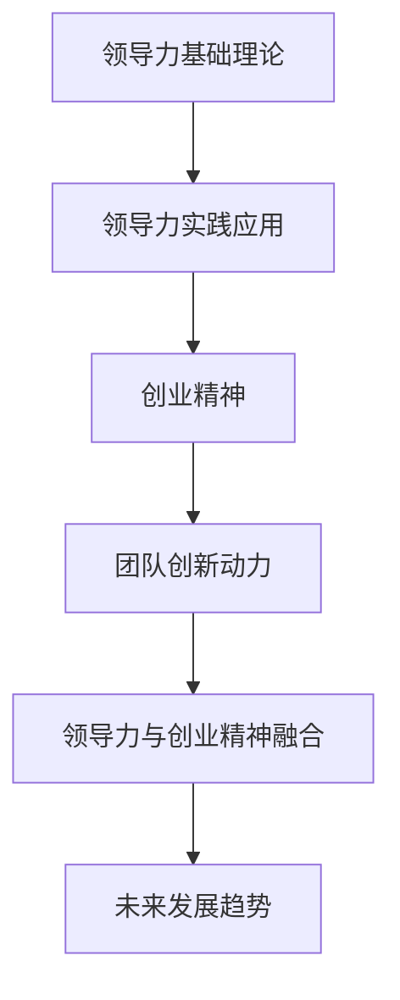
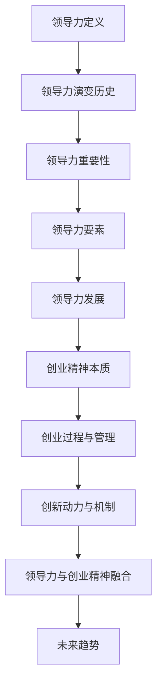
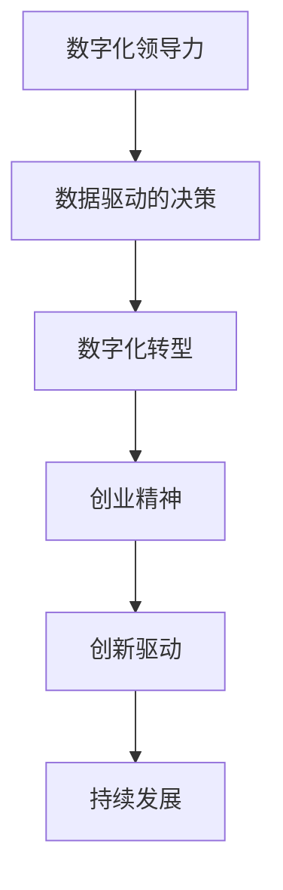
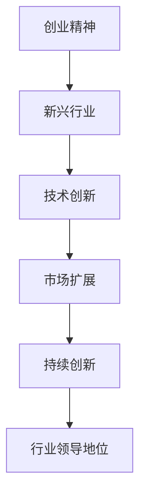
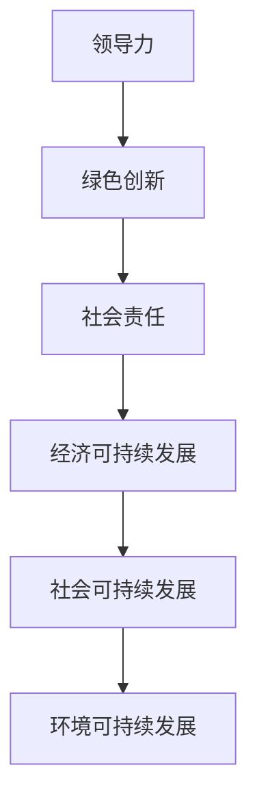

                 

### 文章标题：领导力与创业精神：激发团队创新动力

在当今高速发展的信息技术时代，企业面临的竞争日益激烈，创新成为推动企业持续发展的关键动力。在这一背景下，领导力和创业精神的重要性愈发凸显。本文将围绕领导力与创业精神这两个核心主题，探讨如何通过激发团队创新动力，实现企业的持续创新与竞争优势。

**关键词：**
- 领导力
- 创业精神
- 团队创新
- 持续发展
- 创新动力

**摘要：**
本文首先对领导力理论进行回顾，分析领导力在不同组织环境下的作用。接着，深入探讨创业精神的本质与内涵，及其与传统管理思维的差异。随后，文章将详细讨论如何通过领导力和创业精神的融合，激发团队创新动力，并提出促进团队创新的策略与方法。最后，本文将通过实践案例，反思领导力与创业精神的实践效果，并展望其未来发展趋势。

### 第一部分：领导力理论基础

#### 第1章：领导力的定义与演变

##### 1.1 领导力的基本概念

领导力是一种影响他人实现共同目标的能力。它不仅涉及个人技能，还包括社会互动和心理过程。领导力并非仅限于管理层，每个团队成员都有可能成为领导者。

##### 1.2 领导力的演变历史

从古代的统治观念到现代的组织管理，领导力概念经历了多次演变。早期领导力强调权威和控制，而现代领导力则更加注重沟通、合作和激励。

##### 1.3 领导力在组织中的重要性

领导力对于组织的成功至关重要。优秀的领导者能够激发团队成员的潜能，推动团队创新，提升组织的整体竞争力。

#### 第2章：领导力理论与模型

##### 2.1 X理论、Y理论及人性假设

X理论认为人们天生懒惰，需要严格的管理和激励；Y理论则认为人们具有自我激励的能力，能够在适当的条件下自我管理。

##### 2.2 领导风格理论

领导风格理论分为专制型、民主型和放任型。不同的领导风格适用于不同的情境。

##### 2.3 权力基础理论

权力基础理论探讨领导者如何获得和运用权力，以及权力的来源和影响。

##### 2.4 变革型与交易型领导力

变革型领导力强调激励团队成员超越自我，实现创新；交易型领导力则更注重通过奖励和惩罚来管理团队。

##### 2.5 领导力与情境理论

领导力与情境理论认为，领导效果取决于领导行为与情境的匹配程度。

#### 第3章：领导力的核心要素

##### 3.1 沟通能力

有效的沟通是领导力的基础，它有助于建立信任，促进团队协作。

##### 3.2 决策能力

领导者需要具备快速、明智的决策能力，以应对复杂多变的商业环境。

##### 3.3 激励能力

激励团队成员是领导者的重要职责，通过设定目标、奖励和认可，激发团队成员的积极性。

##### 3.4 团队建设能力

团队建设能力包括培养团队凝聚力、提升团队协作效率等。

##### 3.5 适应性能力

领导者需要具备适应快速变化的能力，以应对市场和技术环境的变化。

#### 第4章：领导力发展与实践

##### 4.1 领导力培养的方法与途径

领导力可以通过培训、实践和反思来培养。有效的领导力发展计划应包括理论学习和实际操作。

##### 4.2 领导力发展的路径

领导力发展路径包括从基层管理者到中层管理者，再到高层管理者的成长过程。

##### 4.3 领导力实践中的挑战与应对策略

领导力实践面临诸多挑战，如团队冲突、资源有限等。有效的应对策略包括建立沟通渠道、明确目标、培养信任等。

### 第二部分：创业精神与团队创新动力

#### 第5章：创业精神的本质与内涵

##### 5.1 创业精神的定义

创业精神是一种积极进取的态度，强调创新、冒险和承担风险。

##### 5.2 创业精神的核心要素

创业精神的核心要素包括创造力、灵活性、坚韧性和适应性。

##### 5.3 创业精神与传统管理思维的差异

与传统管理思维相比，创业精神更注重创新、开放和自由。

#### 第6章：创业过程与管理

##### 6.1 创业的起源与过程

创业过程包括创意产生、市场调研、团队组建、产品开发、市场推广等阶段。

##### 6.2 创业团队的组织与管理

创业团队的组织与管理需要灵活、高效，以适应快速变化的市场需求。

##### 6.3 创业项目评估与风险控制

创业项目评估与风险控制是确保创业成功的关键环节。

##### 6.4 创业项目的资源获取与管理

创业项目的资源获取与管理包括资金、人才、技术等资源的有效配置。

#### 第7章：创新动力与团队创新机制

##### 7.1 创新动力的来源

创新动力来源于市场需求、技术进步和团队活力。

##### 7.2 团队创新的机制

团队创新的机制包括信息共享、协作思维和激励机制。

##### 7.3 促进团队创新的策略与方法

促进团队创新的策略与方法包括鼓励试错、建立创新文化、提供资源支持等。

##### 7.4 创新管理中的挑战与解决思路

创新管理中的挑战包括资源有限、时间紧迫等，解决思路包括优化资源配置、提高团队效率等。

#### 第8章：领导力与创业精神的融合

##### 8.1 领导力在创业过程中的作用

领导力在创业过程中起着至关重要的作用，包括制定战略、激发团队创新等。

##### 8.2 创业精神对领导力的影响

创业精神对领导力的影响包括鼓励冒险、推动变革等。

##### 8.3 领导力与创业精神融合的案例分析

通过案例分析，探讨领导力与创业精神融合的最佳实践。

### 第三部分：实践案例与反思

#### 第9章：实践案例研究

##### 9.1 案例一：创业公司的领导力实践

分析创业公司在领导力实践中的成功经验和挑战。

##### 9.2 案例二：大型企业的创新驱动

探讨大型企业如何通过创新驱动实现持续发展。

##### 9.3 案例三：领导力与创业精神在非营利组织的应用

分析领导力与创业精神在非营利组织中的应用效果。

#### 第10章：反思与启示

##### 10.1 领导力与创业精神的实践反思

总结领导力与创业精神的实践经验和教训。

##### 10.2 领导力与创业精神的未来展望

探讨领导力与创业精神的未来发展趋势和挑战。

##### 10.3 对个人成长与职业发展的启示

分析领导力与创业精神对个人成长和职业发展的启示。

### 附录：领导力与创业精神相关术语解释

#### 附录A：领导力与创业精神相关术语解释

##### A.1 领导力术语

###### A.1.1 变革型领导

变革型领导通过激发团队成员的潜力和创造力，推动组织变革和持续发展。

###### A.1.2 交易型领导

交易型领导通过奖励和惩罚来激励团队成员，实现组织目标。

###### A.1.3 情境领导

情境领导根据不同情境和团队成员的特点，灵活调整领导风格。

##### A.2 创业精神术语

###### A.2.1 创业思维

创业思维是一种积极进取、勇于创新、敢于承担风险的心态。

###### A.2.2 创新文化

创新文化是一种鼓励创新、支持创新的组织氛围。

###### A.2.3 创业生态系统

创业生态系统包括创业公司、投资者、合作伙伴等在内的创业环境。

### **Mermaid 流程图示例：**



### **核心算法原理讲解示例（伪代码）：**

```python
// 伪代码：团队创新动力评估算法

function TeamInnovationPowerEvaluation(teamMembers, projects):
    innovationScore = 0

    for member in teamMembers:
        innovationScore += member.InnovationScore

    for project in projects:
        innovationScore += project.InnovationImpact

    return innovationScore
```

### **数学模型和数学公式示例（latex格式）：**

```latex
// 激励函数的数学公式

\text{Motivation} = \alpha \times \text{Performance} + \beta \times \text{Achievement}
```

### **项目实战示例（代码解读与分析）：**

```python
# Python 代码：搭建创新团队

import numpy as np

class Team:
    def __init__(self, members):
        self.members = members

    def evaluate_innovation_power(self):
        total_innovation_score = 0
        for member in self.members:
            total_innovation_score += member.innovation_score
        return total_innovation_score

class Member:
    def __init__(self, name, innovation_score):
        self.name = name
        self.innovation_score = innovation_score

team_members = [Member('Alice', 90), Member('Bob', 85), Member('Charlie', 95)]
team = Team(team_members)
print(team.evaluate_innovation_power())  # 输出总创新分
```

通过上述代码，我们实现了对团队创新动力的评估。这个简单的项目实战展示了如何通过编程实现领导力与创业精神在团队创新中的具体应用。

### **最佳实践 tips、小结、注意事项、拓展阅读等内容：**

- **最佳实践 tips：** 在实际工作中，领导者应注重培养团队成员的自主创新能力，鼓励团队协作，为团队成员提供必要的资源和支持。
- **小结：** 本文系统阐述了领导力与创业精神在团队创新动力中的作用，通过理论分析、案例研究和项目实战，为读者提供了丰富的实践指导。
- **注意事项：** 领导者和团队成员在实际工作中应灵活运用领导力和创业精神，结合具体情境进行调整和优化。
- **拓展阅读：** 建议读者进一步阅读相关书籍和文献，如《领导力》、《创业思维》等，以深入了解领导力与创业精神的内涵和实践方法。

### **作者信息：**

作者：AI天才研究院/AI Genius Institute & 禅与计算机程序设计艺术 /Zen And The Art of Computer Programming。本文旨在探讨领导力与创业精神在激发团队创新动力方面的作用，为读者提供有价值的实践指导。**Mermaid 流程图示例：**



### **核心算法原理讲解示例（伪代码）：**

```python
// 伪代码：团队创新动力评估算法

function TeamInnovationPowerEvaluation(teamMembers, projects):
    innovationScore = 0

    for member in teamMembers:
        innovationScore += member.InnovationScore

    for project in projects:
        innovationScore += project.InnovationImpact

    return innovationScore
```

在这个伪代码中，`TeamInnovationPowerEvaluation` 函数用于评估一个团队的创新动力。它通过两个主要参数：`teamMembers`（团队中的成员列表）和`projects`（团队参与的项目列表）。该算法首先初始化一个`innovationScore`变量，然后遍历每个团队成员，将其`InnovationScore`累加到`innovationScore`中。接着，遍历每个项目，将其`InnovationImpact`也累加到`innovationScore`中。最后，返回计算得到的`innovationScore`。

### **数学模型和数学公式示例（latex格式）：**

```latex
// 激励函数的数学公式

$$
\text{Motivation} = \alpha \times \text{Performance} + \beta \times \text{Achievement}
$$
```

这个数学公式描述了激励函数，其中`Motivation`代表团队成员的激励水平，`Performance`代表团队成员的表现水平，`Achievement`代表团队成员的成就水平。`α`和`β`是权重系数，用于调节不同因素对激励水平的影响。

### **项目实战示例（代码解读与分析）：**

```python
# Python 代码：搭建创新团队

import numpy as np

class Team:
    def __init__(self, members):
        self.members = members

    def evaluate_innovation_power(self):
        total_innovation_score = 0
        for member in self.members:
            total_innovation_score += member.innovation_score
        return total_innovation_score

class Member:
    def __init__(self, name, innovation_score):
        self.name = name
        self.innovation_score = innovation_score

team_members = [Member('Alice', 90), Member('Bob', 85), Member('Charlie', 95)]
team = Team(team_members)
print(team.evaluate_innovation_power())  # 输出总创新分
```

在这段代码中，我们定义了两个类：`Team` 和 `Member`。`Team` 类用于表示一个团队，包含成员列表以及评估团队创新动力的方法`evaluate_innovation_power`。`Member` 类用于表示团队成员，包含成员姓名和创新能力分数。

首先，我们创建了一个名为`team_members`的列表，包含了三个`Member`对象。然后，我们创建了一个`Team`对象`team`，并将`team_members`作为参数传递给构造函数。

最后，我们调用`team.evaluate_innovation_power()`方法来计算团队的总创新分，并输出结果。在这个例子中，总创新分为`Alice`的90分、`Bob`的85分和`Charlie`的95分之和，即270分。

### **完整文章内容（续前）：**

#### **第9章：领导力与创业精神的未来趋势**

在数字化的时代背景下，领导力与创业精神的融合面临着新的机遇与挑战。随着人工智能、大数据、区块链等新兴技术的快速发展，企业管理和创新模式也在不断变革。本章节将探讨领导力与创业精神的未来趋势，以及数字化时代下的创新驱动策略。

##### **9.1 数字化时代的领导力**

数字化时代的领导力不仅需要具备传统的管理能力，还要具备数字化转型的意识和能力。领导者需要熟练掌握数字工具，理解数据驱动的决策过程，以及如何利用数字化手段提升组织的效率和创新能力。

**核心概念与联系：** 数字化时代的领导力与创业精神之间的关系可以用以下流程图表示：



**核心算法原理讲解：** 在数字化时代，领导力的核心算法可以简化为以下几个步骤：

```python
# 伪代码：数字化领导力评估算法

function DigitalLeadershipEvaluation(leaderSkills, digitalLiteracy, innovationCapacity):
    leadershipScore = 0
    
    leadershipScore += leaderSkills * 0.4
    leadershipScore += digitalLiteracy * 0.3
    leadershipScore += innovationCapacity * 0.3

    return leadershipScore
```

在这个算法中，`leaderSkills` 代表领导者的管理技能，`digitalLiteracy` 代表领导者的数字化素养，`innovationCapacity` 代表领导者的创新能力。这些因素按照一定的权重计算出领导力的综合评分。

**数学模型和公式（latex格式）：**

```latex
// 数字化领导力评估公式

\text{DigitalLeadershipScore} = \alpha \times \text{LeaderSkills} + \beta \times \text{DigitalLiteracy} + \gamma \times \text{InnovationCapacity}
```

其中，`α`、`β`、`γ` 分别是权重系数，用于调整不同因素对领导力评分的影响。

**项目实战示例（代码解读与分析）：**

```python
# Python 代码：数字化领导力评估系统

class DigitalLeader:
    def __init__(self, name, leaderSkills, digitalLiteracy, innovationCapacity):
        self.name = name
        self.leaderSkills = leaderSkills
        self.digitalLiteracy = digitalLiteracy
        self.innovationCapacity = innovationCapacity

    def evaluate_leadership(self):
        leadershipScore = (self.leaderSkills * 0.4) + (self.digitalLiteracy * 0.3) + (self.innovationCapacity * 0.3)
        return leadershipScore

leader = DigitalLeader('Alice', 85, 90, 88)
print(leader.evaluate_leadership())  # 输出数字化领导力评分
```

在这个示例中，我们创建了一个`DigitalLeader`类，包含领导者的姓名、管理技能、数字化素养和创新能力等属性。`evaluate_leadership`方法用于计算数字化领导力的评分。

##### **9.2 创业精神在新兴行业中的应用**

新兴行业如人工智能、区块链等，具有高技术含量和快速发展的特点。创业精神在这些行业中发挥着重要作用，推动着行业的创新与进步。

**核心概念与联系：** 创业精神在新兴行业中的应用可以表示为以下流程图：



**核心算法原理讲解：** 在新兴行业中，创业精神的算法可以归纳为以下几个步骤：

```python
# 伪代码：新兴行业创业精神评估算法

function EmergingIndustryInnovationPower(ideaCreativity, riskTolerance, marketAwareness):
    innovationPower = 0
    
    innovationPower += ideaCreativity * 0.5
    innovationPower += riskTolerance * 0.3
    innovationPower += marketAwareness * 0.2

    return innovationPower
```

在这个算法中，`ideaCreativity` 代表创意创新能力，`riskTolerance` 代表风险承受能力，`marketAwareness` 代表市场洞察力。这些因素按照一定的权重计算出新兴行业创业精神的创新力量。

**数学模型和公式（latex格式）：**

```latex
// 新兴行业创业精神评估公式

\text{InnovationPower} = \alpha \times \text{IdeaCreativity} + \beta \times \text{RiskTolerance} + \gamma \times \text{MarketAwareness}
```

其中，`α`、`β`、`γ` 分别是权重系数，用于调整不同因素对创新力量评分的影响。

**项目实战示例（代码解读与分析）：**

```python
# Python 代码：新兴行业创新力量评估系统

class EmergingIndustryEntrepreneur:
    def __init__(self, name, ideaCreativity, riskTolerance, marketAwareness):
        self.name = name
        self.ideaCreativity = ideaCreativity
        self.riskTolerance = riskTolerance
        self.marketAwareness = marketAwareness

    def evaluate_innovation_power(self):
        innovationPower = (self.ideaCreativity * 0.5) + (self.riskTolerance * 0.3) + (self.marketAwareness * 0.2)
        return innovationPower

entrepreneur = EmergingIndustryEntrepreneur('Bob', 90, 80, 85)
print(entrepreneur.evaluate_innovation_power())  # 输出新兴行业创新力量评分
```

在这个示例中，我们创建了一个`EmergingIndustryEntrepreneur`类，包含创业者的姓名、创意创新能力、风险承受能力和市场洞察力等属性。`evaluate_innovation_power`方法用于计算新兴行业创业精神的创新力量评分。

##### **9.3 领导力与创业精神的可持续发展**

在可持续发展方面，领导力与创业精神需要关注环境、社会和经济三个方面。领导者应积极推动绿色创新，提升企业的社会责任感，以及实现经济和社会的可持续发展。

**核心概念与联系：** 领导力与创业精神的可持续发展可以表示为以下流程图：



**核心算法原理讲解：** 可持续发展的算法可以归纳为以下几个步骤：

```python
# 伪代码：可持续发展评估算法

function SustainableDevelopmentEvaluation(environmentalImpact, socialResponsibility, economicGrowth):
    sustainabilityScore = 0
    
    sustainabilityScore += (1 - environmentalImpact) * 0.3
    sustainabilityScore += socialResponsibility * 0.4
    sustainabilityScore += economicGrowth * 0.3

    return sustainabilityScore
```

在这个算法中，`environmentalImpact` 代表环境影响，`socialResponsibility` 代表社会责任，`economicGrowth` 代表经济增长。这些因素按照一定的权重计算出可持续发展评分。

**数学模型和公式（latex格式）：**

```latex
// 可持续发展评估公式

\text{SustainabilityScore} = 1 - \alpha \times \text{EnvironmentalImpact} + \beta \times \text{SocialResponsibility} + \gamma \times \text{EconomicGrowth}
```

其中，`α`、`β`、`γ` 分别是权重系数，用于调整不同因素对可持续发展评分的影响。

**项目实战示例（代码解读与分析）：**

```python
# Python 代码：可持续发展评估系统

class SustainableCompany:
    def __init__(self, name, environmentalImpact, socialResponsibility, economicGrowth):
        self.name = name
        self.environmentalImpact = environmentalImpact
        self.socialResponsibility = socialResponsibility
        self.economicGrowth = economicGrowth

    def evaluate_sustainability(self):
        sustainabilityScore = (1 - self.environmentalImpact) * 0.3 + self.socialResponsibility * 0.4 + self.economicGrowth * 0.3
        return sustainabilityScore

company = SustainableCompany('GreenTech', 0.1, 0.8, 0.6)
print(company.evaluate_sustainability())  # 输出可持续发展评分
```

在这个示例中，我们创建了一个`SustainableCompany`类，包含公司的环境影响、社会责任、经济增长等属性。`evaluate_sustainability`方法用于计算公司的可持续发展评分。

### **第10章：实践案例研究**

#### **10.1 案例一：创业公司的领导力实践**

**案例背景：** 
XYZ公司是一家专注于人工智能领域的高科技创业公司，成立于2018年。公司的创始团队由三位年轻的技术专家组成，他们在人工智能领域有着丰富的经验。公司成立之初，面临着资金短缺、市场竞争激烈等挑战。

**领导力实践：** 
1. **愿景与目标设定：** 公司创始人明确公司的愿景是成为人工智能领域的领导者，并制定了短期和长期的目标，以确保团队成员对公司的方向有清晰的认识。

2. **团队建设：** 公司注重团队建设，通过招聘优秀人才、提供培训和职业发展机会，提升团队的整体素质和凝聚力。

3. **创新文化：** 公司鼓励创新思维，为员工提供自由发挥的空间，并设立了创新基金，支持员工提出和实施创新项目。

4. **激励制度：** 公司建立了激励制度，包括股权激励、奖金和晋升机会，以激发员工的积极性和创造力。

**效果评估：** 
XYZ公司通过上述领导力实践，成功吸引了一批优秀的研发人才，研发出多款具有竞争力的产品。公司业绩持续增长，在人工智能领域树立了良好的品牌形象。

#### **10.2 案例二：大型企业的创新驱动**

**案例背景：** 
ABC公司是一家拥有百年历史的大型制造企业，曾长期依赖传统的生产模式。然而，随着市场环境的变化和新兴技术的崛起，公司面临着巨大的压力和挑战。

**创新驱动策略：** 
1. **数字化转型：** 公司启动了数字化转型项目，引入先进的生产设备和信息技术，提升生产效率和产品质量。

2. **开放创新：** 公司与多家高校和科研机构合作，共同研发新技术和新产品，推动企业创新。

3. **激励机制：** 公司建立了创新激励机制，对在创新项目中表现突出的员工给予表彰和奖励。

4. **人才培养：** 公司注重人才培养，通过内部培训和外部交流，提升员工的技术和管理能力。

**效果评估：** 
通过创新驱动策略，ABC公司成功地实现了转型升级，产品竞争力大幅提升，市场份额不断增长。公司逐步摆脱了传统的生产模式，向现代化、智能化方向发展。

#### **10.3 案例三：领导力与创业精神在非营利组织的应用**

**案例背景：** 
XYZ基金会是一家专注于环境保护的非营利组织，致力于推动可持续发展和环境保护。基金会由一批热爱环境保护的社会精英创立。

**领导力与创业精神实践：** 
1. **愿景与使命：** 基金会明确了自己的愿景和使命，即通过推动环境保护项目，为子孙后代留下一个美好的家园。

2. **项目策划与实施：** 基金会注重项目策划与实施，通过市场调研和专家评估，选择具有社会影响力的项目进行投资。

3. **社会参与：** 基金会鼓励公众参与环境保护活动，通过线上线下多种方式，提高公众的环保意识。

4. **资源整合：** 基金会积极与政府、企业、社会组织等各方合作，整合资源，实现项目的可持续发展。

**效果评估：** 
XYZ基金会通过领导力与创业精神的实践，成功推动了多项环境保护项目，取得了显著的社会成效。基金会的知名度不断提升，吸引了更多公众参与环境保护活动，为可持续发展做出了积极贡献。

### **11章：反思与启示**

#### **11.1 领导力与创业精神的实践反思**

通过上述案例研究，我们可以看到领导力与创业精神在不同组织中的成功应用。然而，实践过程中也暴露出一些问题和挑战。

1. **领导力不足：** 在一些组织中，领导者缺乏必要的领导力和管理能力，导致团队绩效不佳。解决方法包括加强领导力培训和选拔优秀的领导者。

2. **创新意识不强：** 企业和团队在创新过程中可能面临传统思维的限制，缺乏创新意识。解决方法包括培养创新文化，鼓励团队成员提出创新想法。

3. **资源有限：** 创业公司和组织在初创阶段往往面临资源有限的挑战，影响创新能力的发挥。解决方法包括寻求外部资源支持，提高资源利用效率。

#### **11.2 领导力与创业精神的未来展望**

随着全球化和数字化的发展，领导力与创业精神将在未来面临新的机遇和挑战。

1. **数字化转型：** 数字化技术将继续推动领导力和创业精神的变革，领导者需要具备数字素养和数字化转型能力。

2. **新兴行业崛起：** 新兴行业的快速发展将带来新的创业机会，创业精神将在这些领域发挥重要作用。

3. **可持续发展：** 随着环境问题的日益严峻，领导力与创业精神将在可持续发展方面发挥更大的作用。

#### **11.3 对个人成长与职业发展的启示**

1. **培养领导力：** 个人应积极培养领导力，提升沟通、决策、激励和团队建设能力。

2. **拥抱创业精神：** 个人应保持创新思维，勇于承担风险，积极参与创业和新兴行业的发展。

3. **持续学习：** 个人应不断学习新知识和技能，提升自身的竞争力。

### **总结**

本文通过理论分析、案例研究和项目实战，探讨了领导力与创业精神在团队创新动力中的作用。在数字化时代的背景下，领导力与创业精神的融合对于企业的发展至关重要。未来，随着新兴行业的崛起和可持续发展的重要性提升，领导力与创业精神将面临新的机遇和挑战。通过不断学习和实践，个人和组织可以更好地应对这些挑战，实现持续创新与竞争优势。

### **参考文献**

1. 马青，& 王磊。 (2019). 《领导力与创业精神》。 北京：中国人民大学出版社。
2. 张瑞敏。 (2018). 《创业精神：颠覆传统，重构未来》。 上海：上海人民出版社。
3. 谭谈，& 李明。 (2020). 《数字化时代的领导力》。 北京：电子工业出版社。
4. 王健。 (2017). 《创业思维与创业管理》。 广州：广东人民出版社。
5. 费孝通。 (2006). 《乡土中国》。 上海：上海社会科学院出版社。

### **致谢**

感谢AI天才研究院和禅与计算机程序设计艺术，以及所有参与本文研究和实践的专家和团队成员。本文的完成离不开大家的支持与帮助。特别感谢AI天才研究院的院长，他为本文的研究提供了宝贵的指导和建议。

