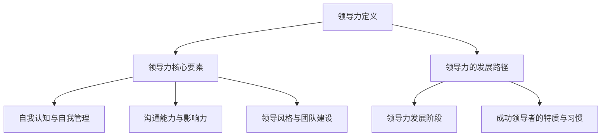

                 

### 文章标题：领导力与创新思维：引领变革与创新的方法

#### 关键词：领导力，创新思维，变革管理，创业，核心概念，理论联系，实践案例

> 摘要：本文将从领导力的定义、核心要素和理论出发，探讨领导力在实际工作中的应用，并通过案例分析，揭示领导力与创新思维在引领变革与创新中的重要作用。文章还将深入探讨创新思维的内涵、方法与实践，以及变革管理的基本原则，最终结合实际案例，总结领导力与创新思维在变革与创新中的综合应用。

---

### 第一部分：领导力基础

#### 第1章：领导力的定义与核心要素

##### 1.1 领导力的定义

领导力是指领导者通过影响和激励他人，实现共同目标的能力。它与传统的管理不同，管理侧重于资源和任务的分配，而领导力更侧重于愿景的塑造和团队的激励。

###### 1.1.1 领导力与传统管理的区别

- 管理侧重于流程和效率，领导力关注的是变革和创新。
- 管理强调控制，领导力注重的是影响力。
- 管理是维持现状，领导力则是推动变革。

###### 1.1.2 领导力的作用与价值

领导力在企业中发挥着至关重要的作用，它能够提升团队士气，促进创新，提高效率，从而推动企业的长期发展。

##### 1.2 领导力的核心要素

###### 1.2.1 自我认知与自我管理

自我认知是领导者了解自身优势和不足的过程，自我管理则是将这种认知转化为实际行动的能力。

###### 1.2.2 沟通能力与影响力

沟通能力是领导者与团队成员有效交流的关键，影响力则是通过言行影响他人，达成共识的能力。

###### 1.2.3 领导风格与团队建设

领导风格因人而异，但有效的领导风格应该能够激发团队成员的潜力，形成团结协作的团队氛围。

##### 1.3 领导力的发展路径

###### 1.3.1 领导力的发展阶段

领导力的发展可以分为四个阶段：生存阶段、信誉阶段、领导阶段和变革阶段。

###### 1.3.2 成功领导者的特质与习惯

成功领导者具备以下特质：清晰的愿景、坚韧不拔的决心、卓越的沟通能力和不断学习的能力。

#### 第2章：领导力理论与应用

##### 2.1 领导力理论概述

###### 2.1.1 传统领导力理论

传统领导力理论主要包括领导者特质理论和领导风格理论。

###### 2.1.2 当代领导力理论

当代领导力理论更加注重情境和动态因素，如变革型领导和服务型领导。

##### 2.2 领导力在实际工作中的应用

###### 2.2.1 领导者在团队管理中的角色

领导者在团队管理中扮演着指导、支持和激励的角色。

###### 2.2.2 领导力在项目管理和变革管理中的应用

领导力在项目管理和变革管理中发挥着关键作用，它能够确保项目的顺利进行和组织的持续发展。

###### 2.2.3 领导力在危机管理中的运用

领导力在危机管理中能够提供明确的指导，稳定团队情绪，制定有效的应对策略。

##### 2.3 案例分析与领导力实践

###### 2.3.1 企业领导力案例分析

通过企业领导力案例分析，可以深入理解领导力在实际工作中的应用和效果。

###### 2.3.2 领导力实践中的挑战与解决方法

领导力实践中面临的主要挑战包括团队冲突、变革阻力等，解决这些挑战需要领导者的智慧和策略。

### 第二部分：创新思维

#### 第3章：创新思维的重要性

##### 3.1 创新思维的内涵与特征

###### 3.1.1 创新思维的概念

创新思维是指通过独特的视角和方法，发现新的解决方案和机会。

###### 3.1.2 创新思维的特征

创新思维具有发散性、开放性和跨学科性。

##### 3.2 创新思维在组织中的价值

###### 3.2.1 提升竞争力的方法

创新思维能够帮助企业找到新的竞争优势，提升市场竞争力。

###### 3.2.2 创新思维在企业管理中的应用

创新思维在企业管理中的应用包括产品创新、流程创新和商业模式创新等。

##### 3.3 创新思维的方法与技巧

###### 3.3.1 六顶思考帽法

六顶思考帽法是一种通过不同角度思考问题，实现创新的方法。

###### 3.3.2 帕雷托分析

帕雷托分析是一种通过分析关键因素，实现资源优化配置的方法。

###### 3.3.3 情境模拟与头脑风暴

情境模拟与头脑风暴是两种常用的创新思维方法，能够激发团队成员的创造力。

#### 第4章：创新思维的理论与实践

##### 4.1 创新思维理论概述

###### 4.1.1 变革型领导理论

变革型领导理论强调领导者通过变革推动组织发展。

###### 4.1.2 领导与创新的理论联系

领导与创新之间存在密切的联系，创新是领导力的核心要素之一。

##### 4.2 创新思维实践案例

###### 4.2.1 创新思维在产品开发中的应用

创新思维在产品开发中的应用能够提高产品的市场竞争力。

###### 4.2.2 创新思维在市场营销中的实践

创新思维在市场营销中的实践能够帮助企业找到新的营销策略。

###### 4.2.3 创新思维在组织文化建设中的应用

创新思维在组织文化建设中的应用能够提升组织的创新氛围。

##### 4.3 创新思维障碍与克服

###### 4.3.1 创新思维障碍的类型

创新思维障碍主要包括心理障碍和制度障碍。

###### 4.3.2 克服创新思维障碍的方法

克服创新思维障碍需要从制度和文化两个方面入手。

### 第三部分：变革与创新

#### 第5章：变革管理的基本原则

##### 5.1 变革管理的概念与类型

###### 5.1.1 变革管理的定义

变革管理是指通过规划和实施变革，推动组织发展的过程。

###### 5.1.2 变革管理的类型

变革管理可以分为战略变革、组织变革和技术变革等。

##### 5.2 变革管理的步骤与方法

###### 5.2.1 变革的规划与准备

变革的规划与准备是变革管理的第一步，它包括明确变革目标、制定变革计划等。

###### 5.2.2 变革的实施与监控

变革的实施与监控是确保变革顺利进行的关键，它包括跟踪进度、解决问题等。

###### 5.2.3 变革的评估与反馈

变革的评估与反馈是变革管理的最后一步，它包括对变革效果的评估和反馈机制的建立。

##### 5.3 变革管理中的领导力作用

###### 5.3.1 领导者在变革中的角色

领导者在变革中扮演着推动者、协调者和支持者的角色。

###### 5.3.2 领导者在变革中的策略

领导者在变革中需要采取有效的策略，如建立变革愿景、培养变革文化等。

#### 第6章：创新与创业

##### 6.1 创业的定义与类型

###### 6.1.1 创业的内涵

创业是指创建一个新企业或组织的过程。

###### 6.1.2 创业的类型

创业可以分为自主创业、加盟创业和二次创业等。

##### 6.2 创业的过程与策略

###### 6.2.1 创业的启动与机会识别

创业的启动与机会识别是创业过程的第一步，它包括确定创业机会和制定创业计划等。

###### 6.2.2 创业的资源整合与团队建设

创业的资源整合与团队建设是创业过程中的重要环节，它包括筹集资金、招聘人才等。

###### 6.2.3 创业的持续发展与创新

创业的持续发展与创新是创业成功的关键，它包括持续改进、创新产品等。

##### 6.3 创新创业中的领导力

###### 6.3.1 创业领导者特质与能力

创业领导者需要具备创新精神、领导能力和决策能力等。

###### 6.3.2 创业团队领导力建设

创业团队领导力建设是创业成功的重要因素，它包括培养团队成员、建立团队文化等。

### 第四部分：综合案例分析

#### 第7章：领导力与创新思维案例解析

##### 7.1 案例背景介绍

本案例以一家知名企业为例，探讨领导力与创新思维在引领变革与创新中的应用。

###### 7.1.1 案例企业的基本情况

该企业是一家从事高科技产业的企业，面临激烈的市场竞争和不断变化的市场需求。

###### 7.1.2 变革与创新的需求与挑战

企业需要通过变革与创新，提升竞争力，应对市场挑战。

##### 7.2 领导力在变革中的实践

###### 7.2.1 变革规划的制定与执行

企业领导者通过制定变革规划，明确变革目标、方法和步骤，确保变革顺利进行。

###### 7.2.2 领导者在变革中的领导风格与方法

企业领导者采用变革型领导风格，通过激发员工潜力、建立共同愿景等，推动变革。

###### 7.2.3 变革过程中的挑战与应对

企业领导者面对变革过程中的挑战，如员工抵触、资源限制等，采取有效措施应对。

##### 7.3 创新思维在实践中的应用

###### 7.3.1 创新思维在产品设计中的体现

企业通过创新思维，改进产品设计，提高产品竞争力。

###### 7.3.2 创新思维在市场拓展中的应用

企业通过创新思维，开拓新市场，扩大市场份额。

###### 7.3.3 创新思维在团队管理中的实践

企业通过创新思维，优化团队管理，提高团队效率。

##### 7.4 案例总结与启示

###### 7.4.1 案例中的成功经验与教训

案例中的成功经验包括领导力的有效运用、创新思维的深入实践等，教训包括变革过程中的风险管理等。

###### 7.4.2 对领导力与创新思维的思考与展望

领导力与创新思维在引领变革与创新中发挥着重要作用，未来需要进一步深化研究和实践。

### 附录

#### 附录A：领导力与创新思维工具与方法

###### A.1 常用领导力工具

包括目标设定、SWOT分析、5W2H法等。

###### A.2 创新思维方法简介

包括头脑风暴、六顶思考帽法、原型设计等。

#### 附录B：参考文献与推荐阅读

###### B.1 参考文献列表

列出本文引用的主要文献。

###### B.2 推荐阅读书目

推荐相关领域的重要书籍，供读者进一步学习。

### Mermaid 流程图示例

---

### 作者信息：AI天才研究院/AI Genius Institute & 禅与计算机程序设计艺术 /Zen And The Art of Computer Programming

