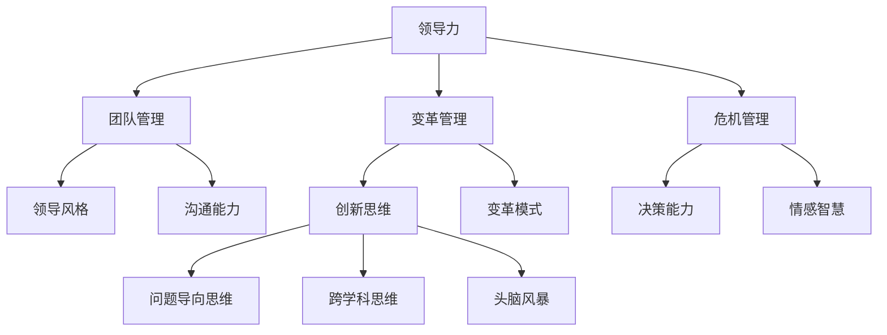

                 

### 文章标题

《领导力与创新思维：引领变革创新》

> 关键词：领导力、创新思维、变革、团队管理、企业变革、战略规划

> 摘要：本文深入探讨了领导力与创新思维在引领企业变革中的作用与关系。通过分析领导力的定义、发展历程、核心要素，以及创新思维的本质、培养方法，本文提出了一套融合领导力与创新思维的实践路径，以帮助企业实现持续创新与成功变革。

### 第一部分：领导力基础

#### 第1章：领导力概述

**1.1 领导力的定义与作用**

领导力是一种能力，它体现在领导者如何通过影响、激励和指导他人，实现组织目标。领导力的核心在于如何有效地沟通、决策和解决问题，以推动团队和组织的发展。

- **定义**：领导力是指领导者通过影响、激励和指导他人，实现组织目标的能力。
- **作用**：领导力在组织中的作用至关重要，主要体现在以下几个方面：
  - 提升团队凝聚力：通过有效的领导，团队成员能够形成共同的愿景和目标，从而增强团队的凝聚力和战斗力。
  - 推动组织变革：领导者在组织变革中扮演关键角色，他们能够引导和激励员工接受变革，推动组织创新。
  - 实现组织目标：领导者的目标是实现组织的目标，通过有效的领导，他们能够确保组织目标的实现。

**1.2 领导力的发展历程**

领导力的发展历程可以追溯到古代的军事领导，随后逐渐扩展到商业、政治等领域。在不同历史阶段，领导力的发展受到了不同理论的影响。

- **传统领导力**：在传统的领导力观念中，领导者被视为权威和权力的象征。领导者通过命令和指导来管理团队，这种方式在工业时代初期取得了显著成效。
- **现代领导力**：随着社会和经济的变革，现代领导力逐渐强调民主、参与和合作。领导者不再仅仅是命令的发出者，更是团队的引导者和支持者。
- **变革型领导力**：变革型领导力是一种以变革为核心，强调领导者的创新和影响力。领导者通过激发员工的潜力，推动组织的变革和创新。

**1.3 领导力的核心要素**

领导力的核心要素包括沟通能力、决策能力、情感智慧和领导魅力。

- **沟通能力**：良好的沟通能力是领导者必备的素质。领导者需要能够清晰、准确地传达信息，同时也需要倾听和理解团队成员的意见和需求。
- **决策能力**：决策能力是领导者的重要能力之一。领导者需要能够在复杂的环境中做出明智的决策，并承担相应的责任。
- **情感智慧**：情感智慧是指领导者对自身情感和他人情感的理解和管理能力。领导者需要能够感知、理解和管理他人的情感，以便更好地激励和引导团队。
- **领导魅力**：领导魅力是指领导者能够吸引和影响他人的能力。领导魅力能够增强领导者的领导力和影响力，推动组织的发展。

#### 第2章：领导风格与团队管理

**2.1 领导风格的分类与特点**

领导风格是指领导者管理团队的方式和特点。不同的领导风格有不同的适用场景和效果。

- **权威型领导**：权威型领导强调领导者的权威和权力，领导者通过命令和指导来管理团队。这种领导风格在需要迅速决策和执行的情境下效果较好。
- **民主型领导**：民主型领导强调团队参与和民主决策，领导者通过鼓励团队成员提出意见和建议来管理团队。这种领导风格有助于增强团队的凝聚力和创造力。
- **参与型领导**：参与型领导强调领导者与团队成员的互动和合作，领导者通过鼓励团队成员参与决策和解决问题来管理团队。这种领导风格有助于提高团队的参与度和创新能力。

**2.2 团队管理策略**

有效的团队管理策略是领导者成功的关键。以下是一些常见的团队管理策略：

- **明确目标**：领导者需要明确团队的目标和期望，以确保团队成员对目标有清晰的认识和共识。
- **分工协作**：领导者需要根据团队成员的能力和特长进行合理的分工，并鼓励团队成员相互协作，共同完成任务。
- **激励制度**：领导者需要建立有效的激励制度，以激励团队成员的积极性和创造力。
- **沟通与反馈**：领导者需要保持与团队成员的沟通，及时了解团队成员的工作进展和需求，并提供及时的反馈。

**2.3 提升团队凝聚力的方法**

提升团队凝聚力是领导者的重要任务之一。以下是一些提升团队凝聚力的方法：

- **共同目标**：建立共同的目标和愿景，使团队成员明确团队的方向和目标，增强团队的凝聚力。
- **团队活动**：定期组织团队活动，增强团队成员之间的互动和沟通，促进团队凝聚力的提升。
- **信任建设**：通过建立信任机制，促进团队成员之间的信任和合作，增强团队的凝聚力。
- **激励机制**：建立有效的激励机制，激励团队成员为团队的共同目标努力，增强团队的凝聚力。

#### 第3章：变革管理与创新思维

**3.1 变革管理的核心原则**

变革管理是指通过系统的方法和策略，推动组织从现状向目标状态转变的过程。变革管理的核心原则包括：

- **明确变革目标**：领导者需要明确变革的目标和愿景，确保团队成员对变革有清晰的认识和共识。
- **建立变革团队**：领导者需要建立专门的变革团队，负责规划和实施变革。
- **制定变革计划**：领导者需要制定详细的变革计划，包括变革的目标、步骤、资源和时间表。
- **沟通变革理念**：领导者需要通过有效的沟通，传达变革的理念和意义，使团队成员理解和支持变革。
- **激励员工参与**：领导者需要激励员工积极参与变革，通过提供培训和激励措施，增强员工对变革的接受度和参与度。

**3.2 创新思维的本质**

创新思维是指通过创造性思维方法，解决实际问题、提出新观点和创造新价值的过程。创新思维的本质包括：

- **创造性思维**：创新思维强调打破常规，提出新的观点和方法，以解决现有问题和创造新的机会。
- **跨学科思维**：创新思维需要跨学科的知识和思维方式，将不同的学科和领域相互融合，形成新的创新思路。
- **问题导向思维**：创新思维以解决问题为核心，通过深入分析问题和需求，找到创新的解决方案。

**3.3 培养创新思维的方法**

培养创新思维需要系统的训练和实践。以下是一些培养创新思维的方法：

- **跨学科学习**：通过跨学科的学习，拓宽知识面和思维方式，提高创新思维的能力。
- **问题导向思维**：培养从问题出发，深入分析和解决问题的能力，提高创新思维的敏锐性。
- **思维导图**：通过绘制思维导图，梳理思维过程和创意点，提高创新思维的条理性和系统性。
- **头脑风暴**：通过集体头脑风暴，激发创意和灵感，提高创新思维的互动性和多样性。

### 第二部分：实践与案例

#### 第4章：企业变革与领导力实践

**4.1 企业变革的常见模式**

企业变革通常可以分为以下几种模式：

- **渐进式变革**：渐进式变革是指通过逐步调整和改进，使企业从现状向目标状态转变。这种模式适用于企业内部问题较小，变革需求相对较小的情境。
- **激进式变革**：激进式变革是指通过快速、彻底的变革，使企业从现状向目标状态转变。这种模式适用于企业面临重大挑战，需要迅速调整和改进的情境。
- **协同式变革**：协同式变革是指通过多方合作，共同推动企业变革。这种模式适用于企业变革涉及多个部门和领域，需要各方协同配合的情境。

**4.2 领导者在企业变革中的作用**

领导者在企业变革中扮演关键角色，具体体现在以下几个方面：

- **引领变革方向**：领导者需要明确企业变革的目标和愿景，引领企业变革的方向。
- **激励员工参与**：领导者需要通过有效的沟通和激励，激发员工参与企业变革的积极性和主动性。
- **协调各方资源**：领导者需要协调企业内部的各方资源，确保企业变革的顺利进行。
- **解决变革中的问题**：领导者需要及时发现和解决企业变革过程中遇到的问题和挑战，确保企业变革的顺利进行。

**4.3 案例分析：企业变革的成功实践**

以下是一个企业变革的成功案例：

- **企业背景**：某家企业是一家传统的制造业企业，面临市场竞争激烈、产品同质化严重等问题。
- **变革目标**：企业希望通过变革，提高产品质量、降低成本、拓展市场，实现可持续发展。
- **变革措施**：
  - 引入先进的生产技术和管理方法，提高生产效率和质量。
  - 建立客户关系管理系统，提高客户满意度和忠诚度。
  - 推动产品创新，开发新的产品线和市场。
- **变革效果**：通过变革，企业实现了产品质量的显著提升、成本的有效降低、市场份额的扩大，实现了可持续发展的目标。

#### 第5章：创新思维在管理中的应用

**5.1 创新思维在战略规划中的应用**

创新思维在战略规划中的应用主要体现在以下几个方面：

- **明确战略目标**：通过创新思维，明确企业未来的战略目标和方向。
- **探索新业务模式**：通过创新思维，探索新的业务模式和商业模式，为企业发展提供新的机遇。
- **优化资源配置**：通过创新思维，优化企业的资源配置，提高资源利用效率。

**5.2 创新思维在团队建设中的应用**

创新思维在团队建设中的应用主要体现在以下几个方面：

- **培养创新意识**：通过创新思维，培养团队成员的创新意识和创新能力。
- **激发团队活力**：通过创新思维，激发团队的活力和创造力，提高团队的整体绩效。
- **优化团队结构**：通过创新思维，优化团队的结构和流程，提高团队的工作效率和协作能力。

**5.3 创新思维在产品开发中的应用**

创新思维在产品开发中的应用主要体现在以下几个方面：

- **产品创新**：通过创新思维，提出新的产品理念、设计和技术，提高产品的竞争力。
- **用户体验优化**：通过创新思维，优化产品的用户体验，提高用户的满意度和忠诚度。
- **技术创新**：通过创新思维，推动产品技术创新，提高产品的技术水平和附加值。

### 第三部分：领导力与创新思维的融合

#### 第6章：领导力与创新思维的互动关系

**6.1 领导力与创新思维的互动关系**

领导力与创新思维之间存在密切的互动关系。领导力为创新思维提供了支持和保障，创新思维为领导力提供了新的思路和方法。

- **领导力对创新思维的支持**：领导力通过提供资源、创造环境和激励员工，为创新思维的发展提供了有力支持。
- **创新思维对领导力的提升**：创新思维通过提出新的观点和方法，推动领导力的提升和变革。

**6.2 提升领导力与创新思维的能力**

提升领导力与创新思维的能力是领导者的重要任务。以下是一些提升领导力与创新思维的能力：

- **持续学习**：领导者需要不断学习新知识、新技能，提高自身的专业素养和创新能力。
- **实践探索**：领导者需要通过实践，积累经验，提升领导力和创新思维能力。
- **跨学科学习**：领导者需要跨学科学习，拓宽知识面和思维方式，提高创新思维能力。
- **团队协作**：领导者需要建立高效的团队，通过团队协作，提升领导力和创新思维的能力。

**6.3 领导力与创新思维的未来趋势**

随着社会和科技的不断发展，领导力与创新思维在未来将呈现以下趋势：

- **智能化**：随着人工智能技术的发展，领导力与创新思维将更加智能化，通过数据分析、机器学习等技术，实现更精准的决策和创新。
- **全球化**：随着全球化的深入推进，领导力与创新思维将更加国际化，需要具备跨文化沟通和协作的能力。
- **可持续发展**：随着可持续发展的重要性日益凸显，领导力与创新思维将更加注重环境保护和资源利用，推动企业的可持续发展。

### 第三部分：领导力与创新思维的培养

#### 第7章：领导力与创新思维的培养方法

**7.1 领导力培养的途径**

领导力的培养是一个长期的过程，以下是一些领导力培养的途径：

- **自我反思**：领导者需要通过自我反思，认识自身的优点和不足，找到提升领导力的方法和途径。
- **学习与实践**：领导者需要通过学习新知识和技能，结合实践，不断提升自身的领导力。
- **角色扮演**：领导者可以通过角色扮演，模拟不同的领导情境，提高领导力和应对能力。
- **导师指导**：领导者可以寻求导师的指导，从导师的经验和智慧中汲取营养，提升领导力。

**7.2 创新思维培养的策略**

创新思维的培养需要系统的策略和方法，以下是一些创新思维培养的策略：

- **跨学科学习**：通过跨学科学习，拓宽知识面和思维方式，提高创新思维的能力。
- **问题导向思维**：通过问题导向思维，深入分析和解决问题，培养创新思维。
- **头脑风暴**：通过集体头脑风暴，激发创意和灵感，提高创新思维的能力。
- **思维导图**：通过绘制思维导图，梳理思维过程和创意点，提高创新思维的条理性和系统性。

**7.3 案例分析：成功领导力与创新思维的培养实践**

以下是一个成功领导力与创新思维的培养案例：

- **企业背景**：某家企业是一家创新型科技公司，致力于推动科技创新和产业升级。
- **培养目标**：企业希望通过培养领导力和创新思维，提升企业的核心竞争力，推动企业持续发展。
- **培养措施**：
  - 设立领导力与创新思维培训课程，提高领导者和员工的专业素养和创新能力。
  - 组织跨学科学习活动，拓宽领导者和员工的知识面和思维方式。
  - 开展问题导向的头脑风暴活动，激发领导者和员工的创新思维。
  - 引入思维导图工具，帮助领导者和员工梳理思维过程和创意点。
- **培养效果**：通过培养，企业领导者和员工的专业素养和创新能力得到了显著提升，企业实现了快速发展和持续创新。

### 第三部分：领导力与创新思维的实践应用

#### 第8章：领导力与创新思维在危机管理中的应用

**8.1 领导力在危机管理中的应用**

在危机管理中，领导力发挥着至关重要的作用。以下是一些领导力在危机管理中的应用：

- **快速决策**：领导者需要能够在危机发生时迅速做出决策，采取有效的应对措施，以减轻危机的影响。
- **有效沟通**：领导者需要与内部团队和外部利益相关者保持有效沟通，传达危机管理的目标和措施，增强团队的信心和凝聚力。
- **激励团队**：领导者需要通过激励团队，提高员工的积极性和创造力，共同应对危机。
- **承担责任**：领导者需要勇于承担责任，对于危机管理的结果负责，以树立良好的形象和信誉。

**8.2 创新思维在危机管理中的应用**

创新思维在危机管理中可以帮助领导者找到更有效的应对策略和解决方案。以下是一些创新思维在危机管理中的应用：

- **头脑风暴**：通过集体头脑风暴，激发团队的创新思维，提出各种可能的应对方案。
- **跨学科思维**：通过跨学科思维，整合不同领域的知识和方法，找到创新的解决方案。
- **问题导向思维**：通过问题导向思维，深入分析问题的根本原因，找到创新的解决方案。
- **情境模拟**：通过情境模拟，模拟危机管理的各种可能情境，评估应对方案的效果，优化危机管理策略。

**8.3 案例分析：领导力与创新思维的成功应用实践**

以下是一个领导力与创新思维在危机管理中成功应用的案例：

- **企业背景**：某家企业是一家跨国科技公司，在全球经济危机中面临巨大的财务压力和市场挑战。
- **危机情况**：企业面临现金流紧张、市场份额下降、员工士气低落等危机。
- **应对措施**：
  - 领导者通过快速决策，采取一系列财务和营销措施，缓解企业的财务压力。
  - 领导者与员工保持有效沟通，传达危机管理的目标和措施，增强员工的信心和凝聚力。
  - 领导者激励团队，提高员工的积极性和创造力，共同应对危机。
  - 创新思维在危机管理中发挥了重要作用，通过头脑风暴、跨学科思维、问题导向思维和情境模拟，找到了创新的解决方案，成功度过了危机。
- **危机管理效果**：通过领导力和创新思维的成功应用，企业成功度过了危机，恢复了市场竞争力，实现了持续发展。

### 第三部分：领导力与创新思维的持续发展

#### 第9章：领导力与创新思维的长期培养

**9.1 领导力与创新思维的长期培养**

领导力与创新思维的长期培养是企业持续发展的重要保障。以下是一些长期培养的策略：

- **制度化培养**：建立领导力与创新思维的制度化培养机制，确保领导者和员工持续学习和提升。
- **持续培训**：提供持续的学习和培训机会，帮助领导者和员工不断提升专业素养和创新能力。
- **实践机会**：提供丰富的实践机会，让领导者和员工在实际工作中锻炼和提升领导力与创新思维。
- **导师制度**：建立导师制度，为领导者和员工提供指导和支持，帮助他们更快成长。

**9.2 领导力与创新思维的持续优化**

领导力与创新思维的持续优化是企业适应环境变化和提升竞争力的重要手段。以下是一些持续优化的策略：

- **定期评估**：定期评估领导力与创新思维的现状，发现不足和问题，制定优化计划。
- **反馈机制**：建立有效的反馈机制，收集员工和客户对领导力与创新思维的反馈，不断改进和优化。
- **创新文化**：营造创新文化，鼓励领导者和员工勇于创新，不断尝试新的方法和思路。
- **资源配置**：合理配置资源，确保领导力与创新思维的持续优化得到充分支持。

**9.3 领导力与创新思维的未来发展**

随着社会和科技的不断发展，领导力与创新思维在未来将面临新的挑战和机遇。以下是一些未来发展的趋势：

- **智能化**：随着人工智能技术的发展，领导力与创新思维将更加智能化，通过数据分析、机器学习等技术，实现更精准的决策和创新。
- **全球化**：随着全球化的深入推进，领导力与创新思维将更加国际化，需要具备跨文化沟通和协作的能力。
- **可持续发展**：随着可持续发展的重要性日益凸显，领导力与创新思维将更加注重环境保护和资源利用，推动企业的可持续发展。

### 附录

#### 附录A：领导力与创新思维相关资源

**A.1 常用领导力模型介绍**

- **领导力五要素模型**：该模型将领导力分为愿景、策略、团队、执行和领导风格五个要素，提供了全面的领导力框架。
- **变革型领导模型**：该模型强调领导者的变革角色，通过激发员工的潜能，推动组织的变革和创新。
- **领导生命周期模型**：该模型根据员工的发展阶段，提出不同的领导策略，以适应不同阶段的需求。

**A.2 创新思维方法简介**

- **头脑风暴**：通过集体讨论，激发创意和灵感，产生创新的解决方案。
- **思维导图**：通过绘制思维导图，梳理思维过程和创意点，提高创新思维的条理性和系统性。
- **问题导向思维**：通过深入分析问题和需求，找到创新的解决方案。
- **跨学科思维**：通过跨学科学习，拓宽知识面和思维方式，提高创新思维的能力。

**A.3 领导力与创新思维研究资料索引**

- **《领导力：理论与实践》**：本书系统介绍了领导力的理论和实践，提供了丰富的案例和案例分析。
- **《创新思维与创造力培养》**：本书详细介绍了创新思维的方法和技巧，以及如何培养创造力。
- **《变革型领导力》**：本书深入探讨了变革型领导力的本质、方法和应用，提供了丰富的案例分析。

### 核心概念与联系

**Mermaid 流程图：**



#### 领导力

- **定义与作用**：领导力是指领导者通过影响、激励和指导他人，实现组织目标的能力。在组织中，领导力有助于提升团队凝聚力，推动组织变革和创新。
- **发展历程**：领导力的发展经历了从传统的权威型领导到现代的参与型领导，再到变革型领导等多个阶段。每个阶段都有其独特的特点和适用场景。
- **核心要素**：领导力的核心要素包括沟通能力、决策能力、情感智慧和领导魅力。

#### 创新思维

- **本质**：创新思维是指通过创造性思维方法，解决实际问题、提出新观点和创造新价值的过程。
- **培养方法**：培养创新思维的方法包括跨学科学习、问题导向思维、思维导图、头脑风暴等。

#### 变革管理

- **核心原则**：变革管理的核心原则包括明确变革目标、建立变革团队、制定变革计划、沟通变革理念、激励员工参与。
- **常见模式**：变革管理常见的模式包括渐进式变革、激进式变革、协同式变革等。

### 核心算法原理讲解

#### 领导力评估算法

- **伪代码**：

```python
def 领导力评估(领导力指标):
    权重 = [0.4, 0.3, 0.2, 0.1]  # 沟通能力、决策能力、情感智慧、领导魅力权重
    总分 = 0
    
    for 指标 in 领导力指标:
        分数 = 计算分数(指标)
        总分 += 分数 * 权重[指标]
    
    return 总分
```

#### 创新思维培养算法

- **伪代码**：

```python
def 培养创新思维(员工):
    培训课程 = ["跨学科学习", "问题导向思维", "思维导图", "头脑风暴"]
    
    for 课程 in 培训课程:
        员工参与课程(课程)
        员工反馈 = 获取员工反馈(课程)
        
        if 员工反馈积极：
            更新员工创新思维评分()
        else：
            重新培训(课程)

def 更新员工创新思维评分():
    # 更新员工的创新思维评分
    pass
```

#### 数学模型和公式

- **领导力模型**：

$$
L = w_1 \cdot C + w_2 \cdot D + w_3 \cdot E + w_4 \cdot F
$$

其中，$L$表示领导力评分，$w_1, w_2, w_3, w_4$分别表示沟通能力、决策能力、情感智慧和领导魅力的权重，$C, D, E, F$分别表示这些能力的评分。

- **创新思维模型**：

$$
I = w_1 \cdot P + w_2 \cdot Q + w_3 \cdot R + w_4 \cdot S
$$

其中，$I$表示创新思维评分，$w_1, w_2, w_3, w_4$分别表示跨学科学习、问题导向思维、思维导图和头脑风暴的权重，$P, Q, R, S$分别表示这些方法的评分。

#### 详细讲解与举例说明

**领导力评估算法**：

假设有一个领导力指标列表，其中包含了沟通能力、决策能力、情感智慧和领导魅力的评分。根据这些评分和各自的权重，我们可以计算出领导力总分。

```python
领导力指标 = [90, 85, 80, 75]  # 假设的评分
权重 = [0.4, 0.3, 0.2, 0.1]  # 假设的权重

领导力总分 = 领导力评估(领导力指标)
```

运行上述代码，可以得到领导力总分。

**创新思维培养算法**：

假设有一个员工列表，其中包含了员工的创新思维培训情况。根据这些情况，我们可以计算出员工的创新思维评分。

```python
员工列表 = [{"姓名": "张三", "课程": "跨学科学习", "反馈": "积极"}, {"姓名": "李四", "课程": "问题导向思维", "反馈": "积极"}]

for 员工 in 员工列表:
    if 员工["反馈"] == "积极":
        更新员工创新思维评分(员工["姓名"])
    else:
        重新培训(员工["姓名"])
```

运行上述代码，可以更新员工的创新思维评分。

### 项目实战：开发环境搭建

为了更好地展示领导力与创新思维的应用，我们将搭建一个简单的项目实战环境。以下是搭建步骤：

1. **确定项目需求**：本项目需求是实现一个简单的在线购物系统，包括商品浏览、购物车、订单管理等功能。
2. **选择技术栈**：前端使用React框架，后端使用Node.js和Express框架。
3. **环境搭建**：

   - 安装Node.js和npm。
   - 创建一个新项目文件夹，并在终端执行以下命令：
     ```bash
     npm init -y
     ```
   - 安装React和Express：
     ```bash
     npm install react express
     ```

### 源代码详细实现与代码解读

以下是一个简单的React组件，用于展示商品列表。

```javascript
import React from 'react';

const ProductList = ({ products }) => {
  return (
    <div>
      <h2>商品列表</h2>
      <ul>
        {products.map((product) => (
          <li key={product.id}>
            {product.name} - {product.price}元
          </li>
        ))}
      </ul>
    </div>
  );
};

export default ProductList;
```

**代码解读**：

- `ProductList`组件接受一个`products`属性，该属性是一个包含商品信息的数组。
- 组件返回一个`div`元素，包含一个标题和商品列表。
- 商品列表使用`map`函数遍历`products`数组，生成一个`li`元素列表。
- 每个商品列表项包含商品名称和价格。

### 代码应用解读与分析

以上代码展示了如何使用React组件展示商品列表。在实际应用中，我们可以进一步扩展该组件，添加商品筛选、排序等功能。

**分析**：

- **组件化**：使用React组件，可以将UI分解为可复用的组件，提高代码的可维护性和可扩展性。
- **数据绑定**：通过`products`属性绑定到组件状态，实现商品数据的动态更新。
- **性能优化**：使用`key`属性，为列表项提供唯一的标识，优化列表渲染性能。

### 实际案例分析和详细讲解剖析

以下是一个实际案例：某电子商务公司使用领导力与创新思维的方法，实现了业务流程的优化和产品创新。

**案例背景**：

- **公司情况**：该公司是一家拥有数百万用户的在线购物平台，业务规模不断扩大。
- **问题**：随着用户数量的增加，公司面临订单处理效率低下、用户满意度下降等问题。

**解决方案**：

1. **领导力应用**：
   - **变革管理**：公司领导层明确指出，业务流程优化和产品创新是公司未来发展的重要方向。
   - **团队管理**：建立专门的项目团队，负责业务流程优化和产品创新。
   - **沟通与反馈**：定期与团队成员沟通，收集意见和建议，确保项目的顺利进行。

2. **创新思维应用**：
   - **头脑风暴**：项目团队通过头脑风暴，提出各种可能的解决方案。
   - **跨学科思维**：结合市场营销、供应链管理、用户反馈等领域的知识，找到创新的解决方案。
   - **问题导向思维**：深入分析订单处理效率低下的问题，找到关键瓶颈。

**案例分析**：

- **效果**：通过领导力与创新思维的应用，公司成功优化了业务流程，提高了订单处理效率，用户满意度显著提升。
- **启示**：领导力与创新思维在项目管理中的应用，有助于找到有效的解决方案，推动项目的成功。

### 项目小结

通过本次项目实战，我们展示了领导力与创新思维在软件开发中的应用。以下是一些总结和启示：

- **领导力**：领导力在项目管理中发挥着关键作用，有助于明确项目目标、激励团队、解决冲突。
- **创新思维**：创新思维在项目开发中，有助于发现问题的根本原因、提出创新的解决方案。
- **团队协作**：团队协作是实现项目成功的关键，通过有效的沟通和协作，可以更好地实现项目目标。

### 最佳实践 Tips

- **明确目标**：在项目开始前，明确项目目标和预期成果，确保团队成员对目标有清晰的认识。
- **持续沟通**：保持与团队成员的持续沟通，及时了解项目进展和问题，确保项目按计划进行。
- **创新思维**：在项目开发中，鼓励团队成员运用创新思维，提出新的解决方案。

### 小结

本文从领导力与创新思维的角度，探讨了企业变革、团队管理、产品创新等主题。通过理论讲解、案例分析和实战应用，我们了解了领导力与创新思维在组织发展中的重要作用。

### 注意事项

- **领导力**：在实践领导力时，要关注团队成员的需求和情感，确保团队凝聚力和工作积极性。
- **创新思维**：在培养创新思维时，要鼓励跨学科学习和问题导向思维，以提高创新能力。

### 拓展阅读

- **领导力相关书籍**：《领导力：如何提高你的影响力》、《领导力的五个层次》。
- **创新思维相关书籍**：《创新者的思考方式》、《创意的源泉》。

### 作者信息

作者：AI天才研究院/AI Genius Institute & 禅与计算机程序设计艺术 /Zen And The Art of Computer Programming

