                 

### 文章标题：领导力与创新管理：从创意到实施

#### 关键词：领导力、创新管理、项目管理、创意产生、实施过程、持续发展

> 摘要：本文旨在探讨领导力与创新管理在科技领域的实际应用。通过分析领导力的定义、类型、核心技能，以及创新管理的概念、流程、组织文化，本文将深入探讨从创意到实施的完整过程。文章将以具体案例为支撑，提供实际操作策略，并展望未来创新管理的趋势与挑战。

### 目录大纲

#### 第一部分：领导力概述

##### 第1章：领导力与管理的区别
###### 1.1 领导力的定义与重要性
###### 1.2 管理与领导的对比
###### 1.3 领导力的关键要素

##### 第2章：领导力的类型与风格
###### 2.1 领导力的类型
###### 2.2 领导风格
###### 2.3 领导风格与团队绩效的关系

##### 第3章：领导力的核心技能
###### 3.1 沟通技巧
###### 3.2 决策能力
###### 3.3 领导力的道德与伦理

#### 第二部分：创新管理

##### 第4章：创新管理的概念与重要性
###### 4.1 创新管理的定义
###### 4.2 创新的类型与来源
###### 4.3 创新管理的重要性

##### 第5章：创新流程与模型
###### 5.1 创新流程
###### 5.2 常见创新模型
###### 5.3 创新模型在实践中的应用

##### 第6章：创新的组织文化
###### 6.1 创新文化的重要性
###### 6.2 建立创新文化的策略
###### 6.3 创新文化与组织绩效的关系

#### 第三部分：从创意到实施

##### 第7章：创意的产生与评估
###### 7.1 创意的来源
###### 7.2 创意的评估方法
###### 7.3 创意筛选与开发

##### 第8章：项目管理与实施
###### 8.1 项目管理的核心任务
###### 8.2 项目生命周期管理
###### 8.3 项目风险管理

##### 第9章：实施过程中的挑战与应对
###### 9.1 实施过程中的常见问题
###### 9.2 应对挑战的策略
###### 9.3 持续改进与创新

##### 第10章：创新管理的持续发展
###### 10.1 创新管理的可持续性
###### 10.2 创新管理的发展趋势
###### 10.3 创新管理的未来发展

#### 附录

##### 附录A：创新管理工具与方法
###### A.1 创意生成工具
###### A.2 项目管理工具
###### A.3 创新管理方法总结

##### 附录B：案例研究
###### B.1 创新管理成功案例
###### B.2 创新管理失败案例
###### B.3 案例分析总结与启示

作者：AI天才研究院/AI Genius Institute & 禅与计算机程序设计艺术 /Zen And The Art of Computer Programming

### 第一部分：领导力概述

#### 第1章：领导力与管理的区别

在科技日新月异的今天，领导力与管理的重要性愈发凸显。领导力与管理虽然密切相关，但两者之间有着明显的区别。首先，我们需要明确两者的定义与重要性。

##### 1.1 领导力的定义与重要性

领导力是指领导者通过影响、激励和引导他人，实现共同目标的能力。它不仅关注结果，更强调过程中的协作与团队建设。领导力的重要性体现在以下几个方面：

1. **激发团队潜力**：领导者通过激励团队成员，发掘其潜力，实现团队绩效的最大化。
2. **引领变革**：在快速变化的环境中，领导者能够洞察趋势，引领团队适应变革。
3. **塑造组织文化**：领导力对组织文化的形成与传承起着关键作用，一个积极的组织文化能够促进创新与发展。
4. **决策与策略制定**：领导者需要具备良好的决策能力，制定有效的策略，以应对复杂的环境和挑战。

##### 1.2 管理与领导的对比

管理是指通过计划、组织、协调和控制等手段，实现组织目标的系统性活动。与领导力相比，管理更加侧重于过程的控制与资源的配置。以下是对管理的一些基本理解：

1. **任务导向**：管理注重任务的完成，关注效率和效果。
2. **流程控制**：管理通过制定流程和规则，确保工作有序进行。
3. **资源管理**：管理涉及人力、物力、财力等资源的合理配置。
4. **合规性**：管理需要遵守法律法规和公司政策，确保组织运作的合法性。

虽然领导力与管理有明确的区别，但在实际工作中，两者常常是相辅相成的。领导者需要具备管理技能，而管理者也需要具备领导能力。以下是一个简单的对比表格，帮助读者更清晰地理解两者：

| **特征** | **领导力** | **管理** |
| --- | --- | --- |
| **关注点** | 人（团队、员工、文化） | 工作（任务、流程、效率） |
| **目标** | 创造价值、激发潜能 | 完成任务、提高效率 |
| **方式** | 激励、影响、引导 | 组织、控制、协调 |
| **效果** | 长期影响、变革 | 短期结果、稳定性 |

##### 1.3 领导力的关键要素

领导力的核心要素包括沟通技巧、决策能力和道德与伦理等方面。以下将详细探讨这些要素：

1. **沟通技巧**：良好的沟通是领导力的基石。领导者需要具备清晰、有效的沟通能力，确保信息的准确传递，增强团队的凝聚力。
2. **决策能力**：领导者需要具备迅速而明智的决策能力，面对复杂的情况能够做出合理的决策。
3. **道德与伦理**：领导者应当具备高尚的道德品质和正确的伦理观念，以身作则，树立良好的榜样。

#### 总结

领导力与管理在组织中扮演着不可或缺的角色。通过理解两者的区别与联系，领导者和管理者可以更好地发挥各自的作用，共同推动组织的持续发展与创新。

## 第二部分：创新管理

#### 第2章：领导力的类型与风格

领导力并非一成不变，而是多种多样的。根据领导者的行为、理念和方法，可以将领导力划分为不同的类型和风格。理解这些类型和风格有助于领导者根据不同情境选择合适的领导方式，以实现最佳绩效。

##### 2.1 领导力的类型

1. **任务型领导力（Task-oriented Leadership）**：任务型领导者关注目标的实现，强调任务的优先级和效率。他们通过明确任务、设定目标和提供反馈来激励团队成员。这种领导力适用于需要高度组织和协调的任务。

   **优点**：任务明确、效率高、目标导向。
   
   **缺点**：可能导致团队成员感到压力过大、缺乏自主性。

2. **关系型领导力（Relationship-oriented Leadership）**：关系型领导者关注团队成员的情感和需求，重视人际关系和团队氛围。他们通过倾听、支持和支持来建立信任和合作。

   **优点**：增强团队凝聚力、提高员工满意度、促进团队合作。
   
   **缺点**：可能影响任务的优先级和效率。

3. **变革型领导力（Transformational Leadership）**：变革型领导者激励团队成员追求卓越，通过愿景、价值观和激励来引导变革。他们鼓励创新、承担责任并推动团队实现更高的目标。

   **优点**：激发创新、提高团队绩效、塑造积极组织文化。
   
   **缺点**：对领导者的要求较高、需要较长时间才能看到效果。

4. **授权型领导力（Empowerment Leadership）**：授权型领导者鼓励团队成员自主决策和承担责任，赋予他们更大的自由度和权力。他们相信团队成员的能力，并给予必要的支持。

   **优点**：增强员工的参与感和责任感、提高决策效率、促进团队发展。
   
   **缺点**：可能存在管理失控的风险。

##### 2.2 领导风格

1. **权威型（Authoritative）**：权威型领导者具有明确的决策权，通过下达指令来指导团队成员。他们擅长快速做出决策，但在长期内可能限制团队成员的自主性。

   **优点**：决策迅速、行动高效。
   
   **缺点**：可能导致团队依赖领导者、缺乏创新。

2. **民主型（Democratic）**：民主型领导者鼓励团队成员参与决策过程，尊重他们的意见和想法。这种领导风格有助于增强团队凝聚力和合作精神。

   **优点**：增强团队凝聚力、提高员工参与度。
   
   **缺点**：决策过程可能较慢、容易产生分歧。

3. **参与型（Participative）**：参与型领导者邀请团队成员共同参与决策和解决问题，通过集思广益来达成共识。这种领导风格强调团队协作和合作。

   **优点**：提高团队创新和创造力、增强团队成员的归属感。
   
   **缺点**：可能需要更多的时间和资源。

4. **教练型（Coach）**：教练型领导者关注团队成员的个人发展和成长，通过指导和支持来帮助他们实现目标。他们擅长提供反馈和激励，促进团队成员的进步。

   **优点**：提高员工技能和自信心、增强团队协作。
   
   **缺点**：对领导者的时间和精力要求较高。

##### 2.3 领导风格与团队绩效的关系

领导风格对团队绩效有着显著的影响。不同的领导风格适用于不同的情境和团队。以下是一个简化的关系架构，展示了不同领导风格与团队绩效之间的关系：

```
权威型领导力 → 高效但可能缺乏创新
民主型领导力 → 增强团队凝聚力但可能决策较慢
参与型领导力 → 提高创新和创造力但需要更多时间和资源
变革型领导力 → 激发创新和团队动力但需要较长时间
```

在实际应用中，领导者应根据团队的特点、任务的性质和外部环境选择合适的领导风格。以下是一个简化的Mermaid流程图，展示了如何根据不同情境选择领导风格：

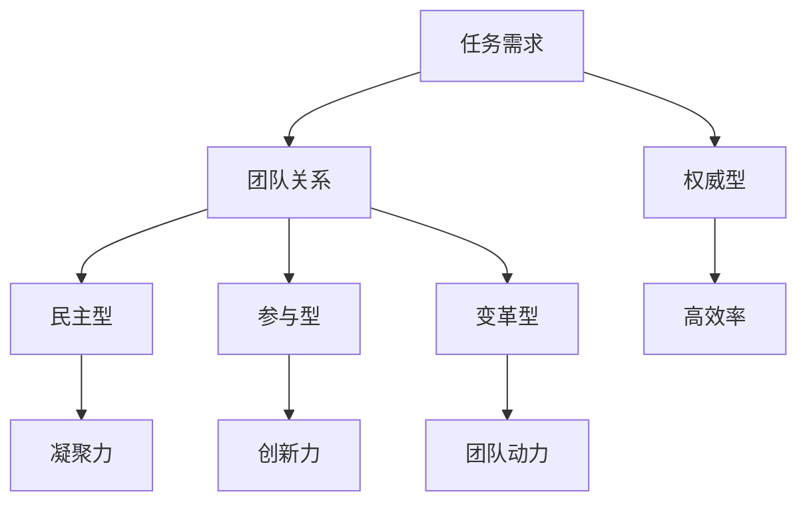

#### 总结

领导力的类型和风格多种多样，每种类型和风格都有其独特的优点和缺点。领导者应根据具体情境选择合适的领导方式，以实现团队的最佳绩效。通过理解不同领导风格与团队绩效之间的关系，领导者可以更有效地管理团队，推动组织的持续创新与发展。

### 第3章：领导力的核心技能

领导力的核心技能是领导者成功的关键，这些技能不仅关乎个人能力的提升，更直接影响团队和组织的发展。以下将详细探讨领导力的三个核心技能：沟通技巧、决策能力和道德与伦理。

#### 3.1 沟通技巧

沟通技巧是领导者不可或缺的能力，有效的沟通能够确保信息的准确传递，增强团队的凝聚力和信任。以下是一些关键的沟通技巧：

1. **倾听**：领导者应善于倾听团队成员的意见和建议，通过倾听了解他们的想法和需求，从而做出更明智的决策。

   **Mermaid流程图**：
   ```mermaid
   graph TD
       A[问题提出] --> B[倾听]
       B --> C[理解问题]
       C --> D[解决方案]
   ```

2. **清晰表达**：领导者需要具备清晰表达观点的能力，使团队成员能够准确理解领导的意图和期望。

   **伪代码示例**：
   ```python
   def communicate(message):
       print("领导：", message)
       print("团队成员：请确认是否理解。")
   ```

3. **非语言沟通**：领导者应重视非语言沟通，如肢体语言、面部表情和语气等，这些非语言信息能够补充和强化语言沟通的效果。

   **数学模型**：
   $$\text{沟通效果} = \text{语言信息} + \text{非语言信息}$$

#### 3.2 决策能力

决策能力是领导者必须具备的核心技能，良好的决策能力能够帮助领导者迅速应对复杂的情况，做出明智的选择。以下是一些关键要素：

1. **信息收集**：领导者需要收集全面的信息，了解问题的各个方面，从而做出更全面的决策。

   **伪代码示例**：
   ```python
   def collect_information():
       data = get_data_from_sources()
       print("收集到的信息：", data)
   ```

2. **分析评估**：领导者应具备分析评估能力，对收集到的信息进行评估和分析，找出最佳解决方案。

   **数学模型**：
   $$\text{决策质量} = \text{信息质量} \times \text{分析能力}$$

3. **风险评估**：领导者应考虑决策可能带来的风险，制定应对措施，降低风险。

   **伪代码示例**：
   ```python
   def risk_assessment():
       risks = identify_risks()
       print("潜在风险：", risks)
       print("应对措施：", mitigate_risks())
   ```

#### 3.3 领导力的道德与伦理

领导力的道德与伦理是领导者行为的重要准则，它关系到组织的声誉和长远发展。以下是一些关键要素：

1. **诚信**：领导者应诚实守信，言行一致，树立良好的道德榜样。

   **数学模型**：
   $$\text{领导力} = \text{道德} \times \text{诚信}$$

2. **公正**：领导者应公正无私，对待团队成员一视同仁，避免偏私和偏见。

   **数学模型**：
   $$\text{团队凝聚力} = \text{公正} \times \text{公平}$$

3. **责任感**：领导者应对自己的行为和决策负责，勇于承担后果。

   **数学模型**：
   $$\text{责任感} = \text{行为结果} \times \text{责任感}$$

#### 总结

沟通技巧、决策能力和道德与伦理是领导力的核心技能，它们共同构成了领导者成功的基础。通过提升这些技能，领导者可以更有效地管理团队，推动组织的持续创新与发展。

## 第二部分：创新管理

### 第4章：创新管理的概念与重要性

创新管理是现代企业持续发展和竞争力提升的关键因素。它不仅涉及新产品的研发，还包括新服务、新流程和新模式的创造。理解创新管理的概念和重要性，有助于企业在激烈的市场竞争中脱颖而出。

#### 4.1 创新管理的定义

创新管理是指企业通过系统的方法和策略，激励、引导和管理创新活动，以实现企业长期战略目标的过程。它包括以下几个方面：

1. **创意的收集和筛选**：通过多种渠道收集创意，如员工建议、市场调研等，并对创意进行筛选和评估。
2. **研发和创新流程管理**：建立有效的创新流程，确保创意能够快速转化为实际的产品或服务。
3. **资源分配和风险管理**：合理分配资源，确保创新项目得到充分支持，同时识别和应对创新过程中的风险。
4. **市场推广和商业化**：将创新成果推向市场，通过有效的营销策略实现商业化。

#### 4.2 创新的类型与来源

创新可以分为不同类型，根据创新的性质和范围，可以分为以下几类：

1. **渐进性创新**：通过持续改进和优化现有产品或服务，提高其性能和效率。
2. **突破性创新**：引入全新的产品、服务或商业模式，彻底改变市场和竞争格局。
3. **颠覆性创新**：颠覆现有的市场规则，创造新的市场需求。

创新的来源多种多样，包括以下几个方面：

1. **内部研发**：企业内部的研究团队和工程师是创新的主要源泉。
2. **外部合作**：与高校、研究机构、供应商等外部合作伙伴的合作，可以带来新的技术和管理经验。
3. **用户需求**：用户的需求和反馈是创新的直接动力，企业需要密切关注市场需求，及时调整产品和服务。
4. **跨界融合**：不同领域和行业的交叉融合，可以产生新的创新点。

#### 4.3 创新管理的重要性

创新管理对于企业的发展至关重要，主要体现在以下几个方面：

1. **竞争力提升**：创新是提升企业竞争力的关键，通过不断引入新的产品和服务，企业可以在市场中保持竞争优势。
2. **市场拓展**：创新可以帮助企业开拓新市场，扩大市场份额，提高销售和利润。
3. **品牌价值**：创新可以提升企业的品牌形象和品牌价值，增强用户对企业的信任和忠诚度。
4. **员工积极性**：创新管理可以激发员工的积极性和创造力，提高员工的满意度和忠诚度。

#### 总结

创新管理是企业持续发展的动力源泉，通过系统的创新管理，企业可以不断推动技术进步，提高市场竞争力，实现长期战略目标。

## 第5章：创新流程与模型

创新流程是创新管理的核心组成部分，它定义了从创意生成到商业化的一系列步骤。有效的创新流程可以确保创新项目的高效实施，并提高创新的成功率。本章将介绍常见的创新流程和模型，并探讨其在实践中的应用。

#### 5.1 创新流程

创新流程通常包括以下几个阶段：

1. **创意生成**：这一阶段主要涉及创意的产生和收集，可以通过头脑风暴、用户调研、市场分析等方法来激发创意。
2. **创意筛选**：对收集到的创意进行评估和筛选，选择具有潜力和可行性的创意进行进一步开发。
3. **概念验证**：对筛选出的创意进行初步验证，通过原型制作、实验等方式来验证创意的可行性。
4. **开发与实施**：对验证成功的创意进行深入开发，并逐步推向市场。
5. **市场推广与商业化**：将创新成果推向市场，通过营销策略实现商业化。

以下是一个简化的创新流程Mermaid流程图：

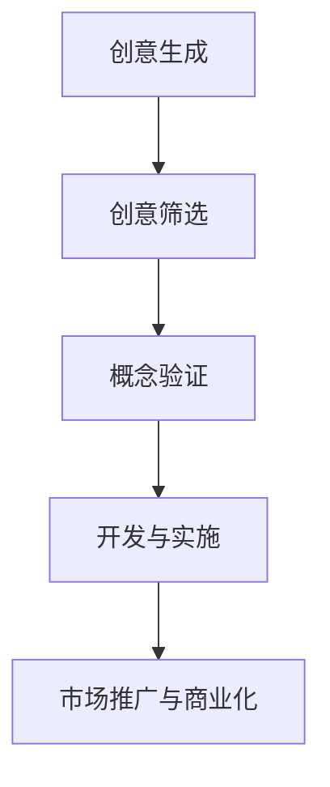

#### 5.2 常见创新模型

在创新管理中，常见的创新模型包括以下几种：

1. **线性创新模型**：线性创新模型是最传统的创新模型，包括创意生成、创意筛选、概念验证、开发与实施和市场推广与商业化等阶段。这种模型结构简单，易于理解，但可能缺乏灵活性。

2. **并行创新模型**：并行创新模型同时进行多个阶段的创新活动，通过并行处理来加速创新过程。这种模型适用于复杂和高风险的创新项目。

3. **迭代创新模型**：迭代创新模型通过不断的迭代和优化来推动创新。每个迭代都包括创意生成、评估、改进和再评估。这种模型强调快速反馈和持续改进。

4. **TRIZ模型**：TRIZ（Teoriya Resheniya Izobretatelskikh Zadatch，即“发明家问题解决理论”）是一种基于数学和逻辑的创新方法。它通过解决矛盾和问题来推动创新，适用于复杂问题的解决。

以下是一个简化的迭代创新模型Mermaid流程图：

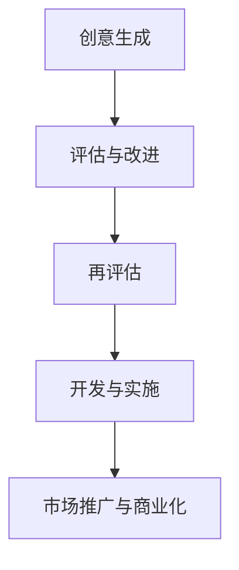

#### 5.3 创新模型在实践中的应用

创新模型在实践中的应用取决于具体情境和企业需求。以下是一些常见应用场景：

1. **研发型企业的应用**：对于研发型企业，如科技公司，迭代创新模型和TRIZ模型较为常见。这些企业通常拥有强大的研发团队和丰富的技术储备，通过不断迭代和优化来推出创新产品。

2. **传统制造企业的应用**：对于传统制造企业，线性创新模型和并行创新模型较为适用。这些企业通常面临较大的生产压力和市场变化，需要快速响应市场变化。

3. **服务行业的应用**：对于服务行业，如金融、咨询等，创意生成和概念验证阶段尤为重要。服务型企业需要深入了解客户需求，通过用户调研和头脑风暴来生成创意，并进行快速验证。

#### 总结

创新流程和模型是创新管理的核心，不同的模型适用于不同的应用场景。通过理解这些模型，企业可以更有效地管理创新项目，推动技术进步和市场竞争力的提升。

## 第6章：创新的组织文化

创新文化的建立是企业实现持续创新的重要保障。一个积极、开放和包容的创新文化能够激发员工的创造力，推动组织的整体进步。本章将探讨创新文化的重要性、建立策略以及创新文化与组织绩效之间的关系。

#### 6.1 创新文化的重要性

创新文化是企业持续发展的动力源泉。它不仅仅是一种价值观，更是一种行为准则，体现在组织的各个方面。以下是创新文化的重要性：

1. **激发员工创造力**：一个支持创新的氛围能够激发员工的创造力，鼓励他们提出新的想法和解决方案。
2. **促进知识共享**：创新文化鼓励员工分享知识和经验，促进知识的传播和应用，提高整个组织的创新能力。
3. **增强团队凝聚力**：通过共同的目标和创新活动，团队成员之间的联系更加紧密，团队凝聚力得到提升。
4. **提升企业竞争力**：持续的创新能够帮助企业保持市场竞争优势，提升品牌价值和市场份额。

#### 6.2 建立创新文化的策略

建立创新文化需要系统性的策略和持续的投入。以下是一些关键策略：

1. **领导层的支持**：领导层应明确表达对创新的重视和支持，通过实际行动树立榜样，推动创新文化的落地。
2. **鼓励试错**：企业应鼓励员工尝试新想法，即使失败也给予支持和鼓励，避免因恐惧失败而阻碍创新。
3. **提供资源**：企业应提供必要的资源，包括资金、技术和时间，支持员工的创新活动。
4. **建立激励机制**：通过奖励机制鼓励员工参与创新，提升他们的积极性和创造力。
5. **培养创新思维**：通过培训和教育，培养员工的创新思维和方法，提升他们的创新能力。

以下是一个简化的建立创新文化的策略Mermaid流程图：

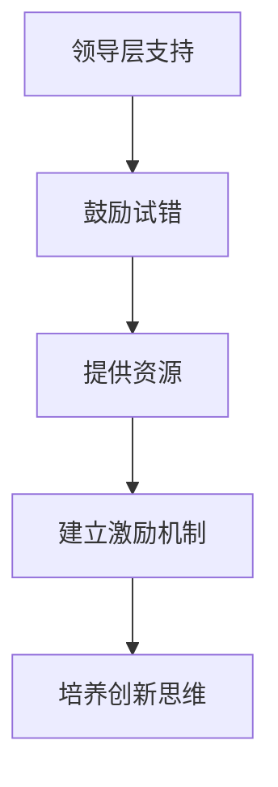

#### 6.3 创新文化与组织绩效的关系

创新文化对组织绩效有着显著的影响。以下是一个简化的创新文化与组织绩效的关系Mermaid流程图：

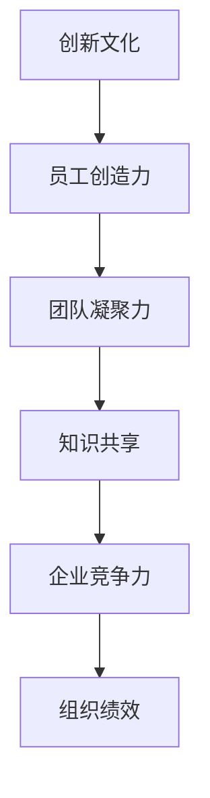

通过积极建立和维护创新文化，企业能够提升员工的创造力、增强团队凝聚力、促进知识共享和提升企业竞争力，从而实现整体绩效的提升。

#### 总结

创新文化是组织持续创新的重要保障，通过领导层的支持、鼓励试错、提供资源、建立激励机制和培养创新思维，企业可以建立积极、开放和包容的创新文化，推动组织的持续发展和市场竞争力的提升。

### 第7章：创意的产生与评估

创意的产生是创新过程的第一步，它决定了后续创新活动的方向和效果。本章将探讨创意的来源、评估方法和创意筛选与开发的过程。

#### 7.1 创意的来源

创意的产生来源于多种渠道，以下是一些常见的创意来源：

1. **用户需求**：用户的需求是创新的重要驱动力。通过用户调研和市场分析，可以获取用户的痛点和需求，从而产生创意。
2. **市场趋势**：关注市场趋势和行业动态，可以洞察未来的发展方向和机会，从而产生有前瞻性的创意。
3. **内部员工**：员工是创新的重要参与者，他们具备丰富的经验和专业知识，能够提出有价值的创意。
4. **竞争对手**：分析竞争对手的产品和服务，可以发现他们的优势和不足，从而产生创新的点子。
5. **跨界融合**：不同领域和行业的交叉融合可以带来新的创意和思路。

以下是一个简化的创意来源Mermaid流程图：

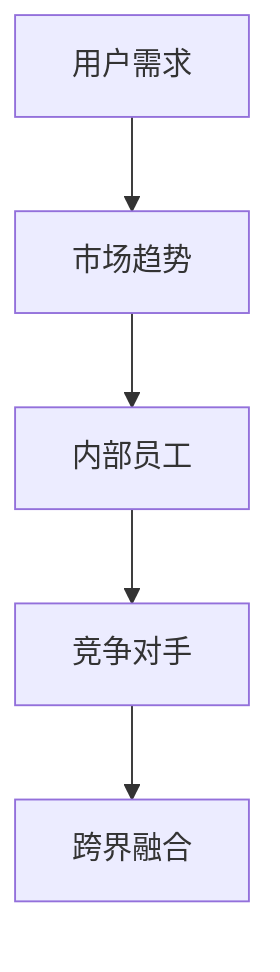

#### 7.2 创意的评估方法

对创意进行评估是确保创新项目可行性和价值的重要环节。以下是一些常见的创意评估方法：

1. **成本效益分析**：通过分析创意的预期成本和潜在收益，评估创意的经济可行性。
2. **市场潜力评估**：通过市场调研和分析，评估创意的市场前景和潜在用户群体。
3. **技术可行性评估**：通过技术分析，评估创意的技术实现难度和资源需求。
4. **风险分析**：识别创意实施过程中可能面临的风险，并评估风险的影响和应对策略。

以下是一个简化的创意评估方法Mermaid流程图：

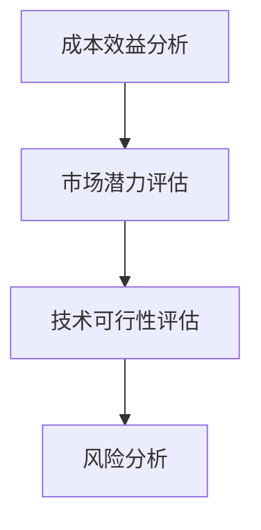

#### 7.3 创意筛选与开发

创意筛选是对评估后的创意进行选择，确保资源集中在最有潜力的创意上。以下是一些创意筛选的原则和方法：

1. **优先级排序**：根据创意的重要性和可行性进行优先级排序，确保有限的资源用于最具潜力的创意。
2. **试点实验**：对筛选出的创意进行试点实验，通过实际操作验证创意的可行性和效果。
3. **团队讨论**：组织团队对创意进行讨论，通过集思广益来完善创意，并评估创意的潜在问题和解决方案。

以下是一个简化的创意筛选与开发流程Mermaid流程图：

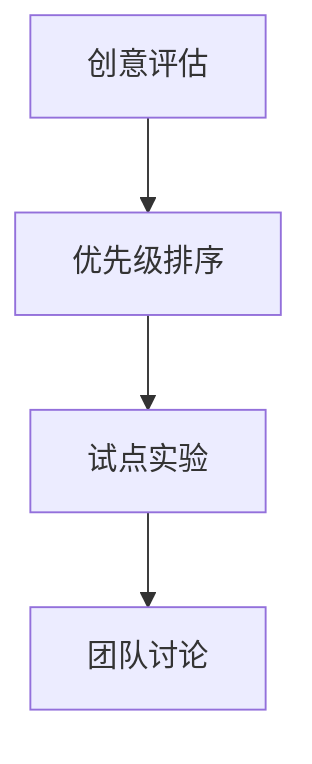

#### 总结

创意的产生与评估是创新过程的重要环节。通过多渠道获取创意、运用科学的评估方法进行筛选和开发，企业可以确保创新项目的高效实施，推动组织的持续发展。

### 第8章：项目管理与实施

项目管理是创新管理的关键环节，它确保创新项目能够按计划、高效地实施，并最终实现预期目标。本章将介绍项目管理的核心任务、项目生命周期管理和项目风险管理。

#### 8.1 项目管理的核心任务

项目管理的核心任务包括以下几个方面：

1. **目标设定**：明确项目的目标和范围，确保项目团队对项目的目标有共同的理解。
2. **资源分配**：合理分配项目所需的资源，包括人力、物力和财力等，确保项目能够顺利进行。
3. **计划制定**：制定详细的项目计划，包括时间表、任务分配、进度监控等，确保项目按计划推进。
4. **沟通协调**：建立有效的沟通机制，确保项目团队内部以及与外部利益相关者的信息流畅。
5. **风险管理**：识别项目可能面临的风险，并制定应对策略，降低风险对项目的影响。

以下是一个简化的项目管理核心任务Mermaid流程图：

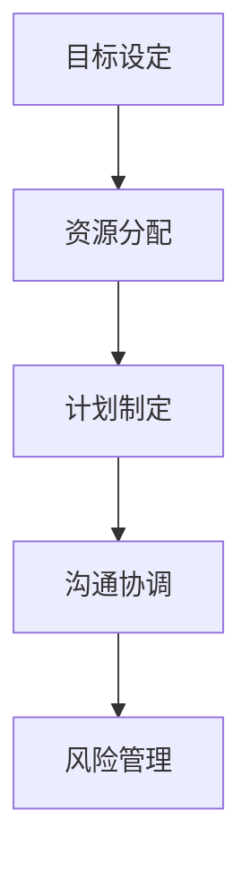

#### 8.2 项目生命周期管理

项目生命周期管理是指从项目启动到项目结束的全过程管理。项目生命周期通常包括以下几个阶段：

1. **项目启动**：明确项目目标和范围，组建项目团队，制定初步项目计划。
2. **项目规划**：详细制定项目计划，包括时间表、任务分配、资源需求等，确保项目有明确的执行路径。
3. **项目执行**：按照项目计划执行项目任务，进行进度监控和协调，确保项目按计划推进。
4. **项目监控**：通过定期评估和调整，确保项目在正确轨道上运行，及时解决项目中的问题和风险。
5. **项目收尾**：完成项目任务，进行项目总结和评估，确保项目目标实现，并为未来项目提供经验和教训。

以下是一个简化的项目生命周期管理Mermaid流程图：

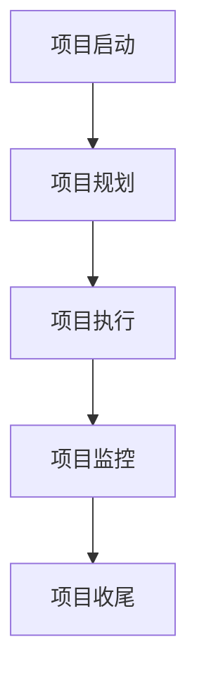

#### 8.3 项目风险管理

项目风险管理是项目管理的重要环节，旨在识别、评估和应对项目中的风险，确保项目目标的实现。项目风险管理包括以下几个步骤：

1. **风险识别**：通过头脑风暴、专家访谈等方法，识别项目中可能面临的风险。
2. **风险评估**：对识别出的风险进行评估，确定风险的概率和影响，以便制定应对策略。
3. **风险应对**：根据风险评估结果，制定相应的应对策略，包括风险规避、减轻、转移和接受等。
4. **风险监控**：在项目执行过程中，持续监控风险的变化和新的风险，及时调整应对策略。

以下是一个简化的项目风险管理Mermaid流程图：

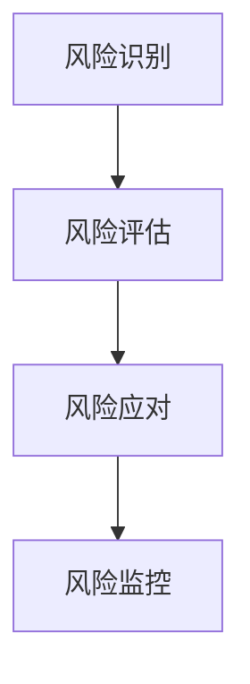

#### 总结

项目管理与实施是创新管理的关键环节，通过明确核心任务、有效管理项目生命周期和积极应对风险，企业可以确保创新项目的顺利实施和成功完成。

### 第9章：实施过程中的挑战与应对

创新项目在实施过程中常常面临各种挑战，这些挑战可能来自技术、人员、资源等方面。有效的应对策略能够帮助团队克服困难，确保项目的顺利进行。本章将探讨实施过程中的常见问题、应对策略以及持续改进与创新的方法。

#### 9.1 实施过程中的常见问题

在创新项目的实施过程中，常见的问题包括以下几个方面：

1. **技术难题**：创新项目往往涉及新的技术或方法，技术难题可能包括系统稳定性、性能优化、安全性等。
2. **资源不足**：项目资源包括人力、资金和技术支持等，资源不足可能导致项目进度延误或质量下降。
3. **团队协作**：团队成员之间的沟通不畅、协作不力可能影响项目的效率和质量。
4. **时间压力**：项目时间紧迫，可能导致团队成员过度工作，影响项目的持续性和创新性。
5. **市场不确定性**：市场环境的变化可能影响项目的预期收益，增加项目风险。

以下是一个简化的创新项目实施过程中常见问题的Mermaid流程图：

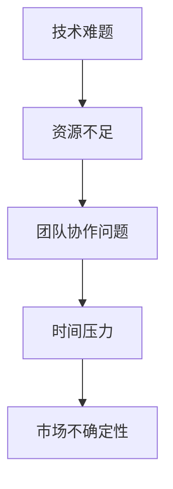

#### 9.2 应对挑战的策略

针对实施过程中遇到的挑战，可以采取以下策略：

1. **技术难题的应对**：
   - **技术调研**：在项目初期进行充分的技术调研，了解相关技术的最新进展和可行性。
   - **分阶段实施**：将复杂的技术任务分解为若干个阶段，逐步实施，降低技术难度。
   - **专家咨询**：邀请技术专家进行咨询，解决项目中的技术难题。

2. **资源不足的应对**：
   - **资源优化**：合理分配和优化项目资源，确保关键资源的充分利用。
   - **外部合作**：与外部合作伙伴合作，共享资源和技术，降低资源压力。
   - **优先级排序**：对项目任务进行优先级排序，确保资源集中在最关键的任务上。

3. **团队协作问题的应对**：
   - **沟通机制**：建立有效的沟通机制，确保团队成员之间的信息畅通。
   - **团队建设**：通过团队建设活动，增强团队成员之间的信任和协作。
   - **明确角色和责任**：明确团队成员的角色和责任，确保每个成员知道自己的任务和目标。

4. **时间压力的应对**：
   - **时间管理**：制定详细的时间表和任务分配，确保项目进度可控。
   - **弹性计划**：预留一定的缓冲时间，以应对不可预见的延误。
   - **持续监控**：持续监控项目进度，及时调整计划和资源分配。

5. **市场不确定性的应对**：
   - **市场调研**：定期进行市场调研，了解市场动态和用户需求。
   - **灵活调整**：根据市场反馈，灵活调整项目方向和策略。
   - **风险控制**：制定风险控制措施，降低市场不确定性对项目的影响。

以下是一个简化的应对挑战策略Mermaid流程图：

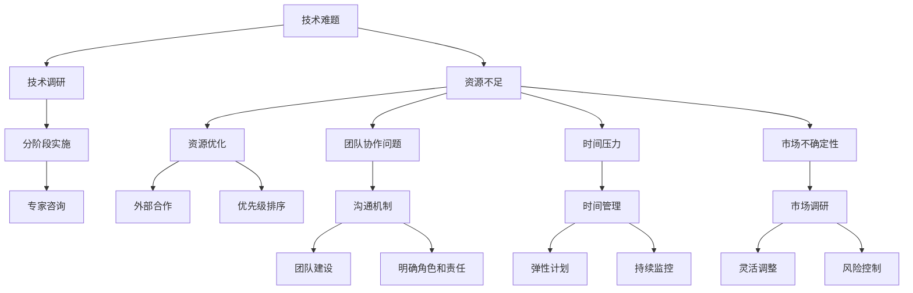

#### 9.3 持续改进与创新

在创新项目的实施过程中，持续改进与创新是保持项目活力和竞争力的重要手段。以下是一些方法：

1. **定期回顾**：定期对项目进行回顾，总结经验教训，识别改进机会。
2. **用户反馈**：积极收集用户反馈，了解用户的实际需求和体验，为项目的改进提供依据。
3. **技术创新**：鼓励团队成员进行技术创新，探索新的解决方案，提升项目的竞争力。
4. **知识共享**：建立知识共享机制，促进团队成员之间的经验交流和知识传递。
5. **敏捷开发**：采用敏捷开发方法，快速响应变化，持续优化项目。

以下是一个简化的持续改进与创新Mermaid流程图：

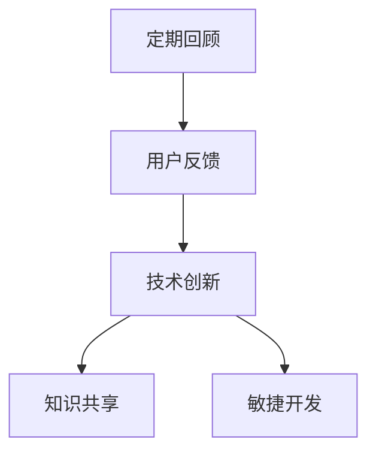

#### 总结

实施过程中的挑战是创新项目不可避免的问题，通过识别常见问题、采取有效应对策略以及持续改进与创新，企业可以确保创新项目的成功实施，推动组织的持续发展和市场竞争力提升。

### 第10章：创新管理的持续发展

#### 10.1 创新管理的可持续性

创新管理的可持续性是企业长期发展的关键因素。一个可持续的创新管理体系能够确保企业在不断变化的市场环境中保持竞争优势，实现持续的业绩增长。以下是确保创新管理可持续性的几个关键要素：

1. **制度化**：将创新管理纳入企业的日常运营，建立相应的制度和文化，确保创新活动制度化、常态化。
2. **资源投入**：持续投入资源，包括资金、人才和技术，支持创新活动的开展。
3. **风险管理**：建立有效的风险管理体系，识别和应对创新过程中的各种风险。
4. **员工培训**：定期对员工进行创新培训，提升他们的创新能力和素质。
5. **文化认同**：营造创新文化，使全体员工认同创新的重要性，形成共同的价值观和行为准则。

以下是一个简化的确保创新管理可持续性Mermaid流程图：

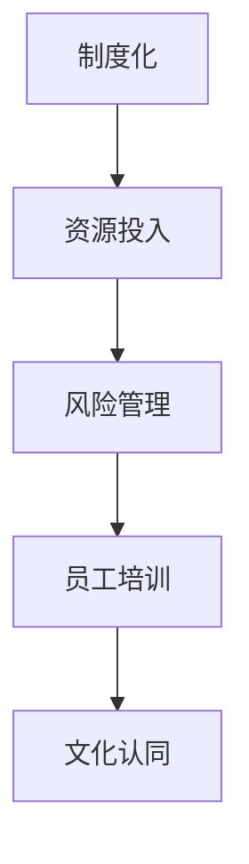

#### 10.2 创新管理的发展趋势

随着科技的发展和市场竞争的加剧，创新管理也在不断演变和进步。以下是几个重要的创新管理发展趋势：

1. **数字化创新**：数字化转型已成为创新管理的重要组成部分。通过大数据、人工智能等技术，企业可以更精准地了解用户需求，实现个性化的产品和服务。
2. **开放式创新**：开放式创新强调企业与外部合作伙伴的合作，通过整合外部资源和技术，提高创新的效率和质量。
3. **敏捷创新**：敏捷创新方法强调快速响应变化，通过迭代和反馈机制，不断优化创新过程和成果。
4. **跨学科创新**：跨学科创新通过融合不同领域的知识和技术，解决复杂问题，创造新的价值。
5. **社会创新**：社会创新关注社会责任和可持续发展，通过创新的商业模式和解决方案，解决社会问题，实现社会价值。

以下是一个简化的创新管理发展趋势Mermaid流程图：

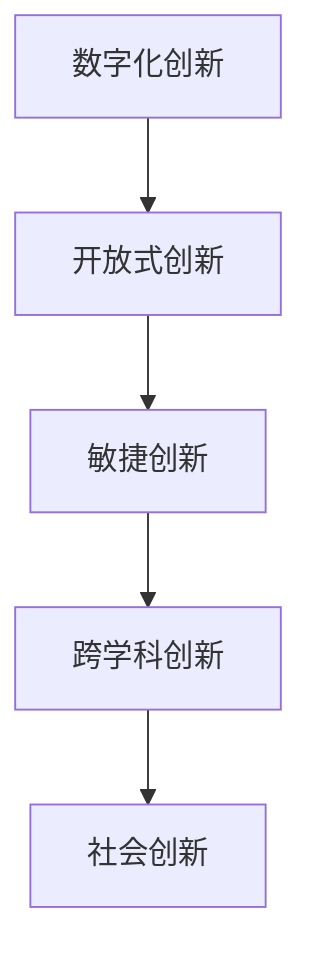

#### 10.3 创新管理的未来发展

未来，创新管理将继续在技术、市场和文化的驱动下发展。以下是创新管理的未来发展展望：

1. **更加智能化**：人工智能和大数据技术将进一步融入创新管理，实现智能化的决策和优化。
2. **全球化**：随着全球化的加深，企业将面临更加多元化和复杂的市场环境，创新管理需要具备全球视野和跨文化能力。
3. **可持续发展**：可持续发展将成为创新管理的重要方向，企业将更加关注环境保护、社会责任和经济效益的平衡。
4. **人文关怀**：在追求效率和创新的同时，企业将更加注重员工的福祉和人文关怀，构建和谐的工作环境。
5. **持续学习**：创新管理需要不断学习和适应新的技术和管理方法，以保持其竞争力和创新能力。

以下是一个简化的创新管理未来发展Mermaid流程图：

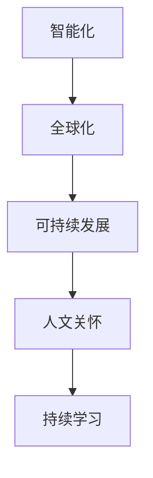

#### 总结

创新管理的持续发展是企业长期竞争力的保障。通过确保可持续性、关注发展趋势和展望未来发展，企业可以构建一个不断进化、创新的管理体系，推动组织的持续成长和市场竞争力的提升。

## 附录A：创新管理工具与方法

创新管理不仅需要理论支持，更需要实际操作的工具和方法。以下将介绍几种常见的创新管理工具和方法，帮助读者更好地理解和应用创新管理。

#### A.1 创意生成工具

创意生成是创新管理的重要环节，以下是一些常用的创意生成工具：

1. **头脑风暴（Brainstorming）**：头脑风暴是一种集体创意生成方法，通过集体讨论和自由表达，产生大量的创意。以下是一个简化的头脑风暴流程图：

   ```mermaid
   graph TD
       A[提出问题] --> B[自由讨论]
       B --> C[记录创意]
       C --> D[评估创意]
   ```

2. **思维导图（Mind Mapping）**：思维导图是一种图形化的思考工具，通过绘制思维导图，将创意和相关信息进行可视化，帮助人们更好地组织和分析创意。以下是一个简化的思维导图示例：

   ```mermaid
   graph TD
       A[中心主题]
       B[子主题1]
       C[子主题2]
       D[子主题3]
       A --> B
       A --> C
       A --> D
   ```

3. **SWOT分析（Strengths, Weaknesses, Opportunities, Threats）**：SWOT分析是一种用于评估创意的常用方法，通过分析创意的内部优势和劣势，以及外部机会和威胁，评估创意的可行性。以下是一个简化的SWOT分析流程图：

   ```mermaid
   graph TD
       A[优势] --> B[劣势]
       A --> C[机会]
       A --> D[威胁]
       B --> E[改进]
       C --> F[利用]
       D --> G[应对]
   ```

#### A.2 项目管理工具

项目管理工具能够帮助团队高效地管理项目，以下是一些常用的项目管理工具：

1. **甘特图（Gantt Chart）**：甘特图是一种图形化的项目进度管理工具，通过展示项目任务和进度的关系，帮助团队监控项目进度。以下是一个简化的甘特图示例：

   ```mermaid
   graph TD
       A[任务1] --> B[任务2]
       B --> C[任务3]
       C --> D[任务4]
   ```

2. **看板（Kanban）**：看板是一种基于看板系统的项目管理方法，通过可视化工作流程，帮助团队优化工作流程和资源分配。以下是一个简化的看板示例：

   ```mermaid
   graph TD
       A[待办事项] --> B[进行中]
       B --> C[审核]
       C --> D[完成]
   ```

3. **Trello**：Trello是一种基于看板系统的项目管理工具，通过创建卡片和列表，帮助团队可视化和管理项目任务。以下是一个简化的Trello示例：

   ```mermaid
   graph TD
       A[待办事项] --> B[进行中]
       B --> C[审核]
       C --> D[完成]
   ```

#### A.3 创新管理方法总结

创新管理方法的选择应根据具体情境和需求。以下是一个简化的创新管理方法总结Mermaid流程图：

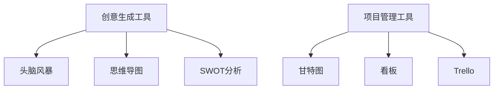

通过使用这些工具和方法，企业可以更有效地进行创新管理和项目管理，推动组织的持续发展和市场竞争力的提升。

## 附录B：案例研究

#### B.1 创新管理成功案例

以下是一个创新管理的成功案例，详细描述了案例背景、创新举措、实施过程和成果。

**案例背景**：
某科技公司在市场竞争中面临巨大压力，为了提升产品竞争力，公司决定通过创新管理来推动产品的更新和优化。

**创新举措**：
公司决定采用敏捷创新方法，通过快速迭代和用户反馈，不断优化产品。具体举措包括：
1. **用户调研**：通过用户调研，了解用户需求和痛点。
2. **头脑风暴**：组织团队进行头脑风暴，生成创新点子。
3. **SWOT分析**：对创新点子进行SWOT分析，评估其可行性。

**实施过程**：
1. **概念验证**：对评估成功的创新点子进行概念验证，通过原型制作和实验验证其可行性。
2. **迭代开发**：采用敏捷开发方法，快速迭代，不断优化产品。
3. **用户测试**：在产品开发过程中，邀请用户进行测试，收集反馈，并根据反馈进行调整。

**成果**：
通过创新管理，公司成功推出了优化后的产品，提高了用户体验和满意度，市场份额也得到了显著提升。

**案例分析总结与启示**：
1. **用户导向**：用户需求是创新的驱动力，通过用户调研和反馈，可以确保创新举措符合市场需求。
2. **敏捷开发**：敏捷开发方法能够快速响应市场变化，提高产品的迭代速度和竞争力。
3. **持续改进**：通过持续的用户测试和反馈，可以不断优化产品，提升用户体验和满意度。

#### B.2 创新管理失败案例

以下是一个创新管理的失败案例，详细描述了案例背景、失败原因、教训和启示。

**案例背景**：
某传统制造业公司为了应对市场变化，决定引入新的生产技术，以提高生产效率和产品质量。

**失败原因**：
1. **技术不成熟**：引入的技术尚未完全成熟，导致生产过程中出现大量问题。
2. **缺乏培训**：员工对新技术的掌握不足，缺乏必要的培训。
3. **管理不善**：项目管理过程中，缺乏有效的风险控制和沟通机制，导致项目进展不顺利。

**教训和启示**：
1. **技术调研**：在引入新技术前，应进行充分的技术调研，确保技术的成熟度和可行性。
2. **员工培训**：引入新技术前，应进行全面的员工培训，提高员工对新技术的掌握能力。
3. **风险管理**：项目管理过程中，应建立有效的风险控制机制，提前识别和应对潜在风险。

**案例分析总结与启示**：
1. **技术成熟度**：创新管理应关注技术成熟度，确保技术能够顺利实施。
2. **员工能力**：员工能力是创新成功的关键，应重视员工培训和技能提升。
3. **项目管理**：有效的项目管理是确保创新成功的重要因素，应建立完善的项目管理流程和机制。

通过这两个案例，可以看出创新管理成功的关键在于用户需求导向、技术成熟度、员工能力和项目管理。同时，了解失败的原因和教训，有助于企业避免重复错误，提高创新管理的成功率。

### 总结与展望

本文从领导力与创新管理的角度，详细探讨了从创意到实施的完整过程。通过分析领导力的定义、类型与技能，理解了领导力在组织管理中的关键作用。创新管理则通过探讨创新流程、模型、组织文化以及创意产生与评估，提供了创新管理的系统框架。

在实施过程中，项目管理与风险应对至关重要，企业应注重持续改进与创新。展望未来，随着数字化和全球化的深入，创新管理将迎来新的机遇与挑战。企业应积极适应变化，提升创新能力，以保持竞争优势。

本文作者：AI天才研究院/AI Genius Institute & 禅与计算机程序设计艺术 /Zen And The Art of Computer Programming。感谢您的阅读，希望本文能为您的创新管理提供有益的启示。如果您有任何问题或建议，欢迎在评论区留言，我们将持续为您解答。再次感谢！

