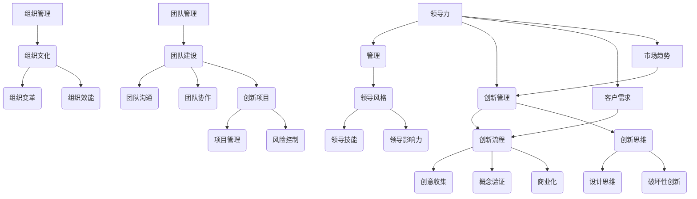

                 

### 文章标题

《领导力与创新管理：鼓励团队突破创新》

关键词：领导力、创新管理、团队、突破、创新思维、项目实战

摘要：本文探讨了领导力与创新管理的核心概念和实践方法，分析了领导力与管理的区别和联系，介绍了创新管理的概念、流程和策略，并结合实际案例，提出了鼓励团队突破创新的具体方法和实践技巧。

### 目录大纲

# 《领导力与创新管理：鼓励团队突破创新》

> 关键词：领导力、创新管理、团队、突破、创新思维、项目实战

> 摘要：本文探讨了领导力与创新管理的核心概念和实践方法，分析了领导力与管理的区别和联系，介绍了创新管理的概念、流程和策略，并结合实际案例，提出了鼓励团队突破创新的具体方法和实践技巧。

### 第一部分：领导力基础理论

## 第1章：领导力与管理的核心概念

### 1.1 领导力的定义与类型

### 1.2 管理与领导的区别

### 1.3 领导力的价值观

## 第2章：领导力的理论基础

### 2.1 领导力的发展历史

### 2.2 领导力模型与理论

### 2.3 领导力的心理机制

## 第3章：领导力技能提升

### 3.1 沟通技巧

### 3.2 决策能力

### 3.3 领导者的自我发展

### 第二部分：创新管理

## 第4章：创新管理与组织文化

### 4.1 创新管理的概念与流程

### 4.2 组织文化的创新驱动

### 4.3 创新型组织的特征

## 第5章：创新思维与方法

### 5.1 创新思维工具

### 5.2 设计思维方法

### 5.3 破坏性创新战略

## 第6章：创新项目管理

### 6.1 创新项目的定义与类型

### 6.2 创新项目的规划与实施

### 6.3 创新项目的风险管理

### 第三部分：领导力与创新实践

## 第7章：领导力与创新案例研究

### 7.1 案例一：苹果公司的创新管理

### 7.2 案例二：谷歌的领导力文化

### 7.3 案例三：特斯拉的颠覆性创新

## 第8章：领导力与创新实战

### 8.1 实战一：打造创新型团队

### 8.2 实战二：推动企业创新文化

### 8.3 实战三：创新项目的实施与监控

### 第四部分：附录

## 附录A：创新管理与领导力资源

### A.1 主要参考文献

### A.2 创新管理与领导力工具

### A.3 在线资源与学习平台

---

### 第一部分：领导力基础理论

#### 第1章：领导力与管理的核心概念

领导力与管理是组织运作中不可或缺的两个方面。领导力强调的是领导者如何激发和影响团队成员，而管理则侧重于对资源的合理配置和任务的有效执行。两者既有区别又有联系，共同构成了组织成功的关键。

##### 1.1 领导力的定义与类型

领导力可以定义为领导者通过激励、启发和引导他人，以实现共同目标和价值观的能力。领导力不仅仅是职位赋予的权威，更是一种影响力和榜样作用。根据不同的领导风格和情境，领导力可以分为多种类型：

1. **指令型领导**：领导者明确指示任务和目标，并期望团队成员遵循。
2. **变革型领导**：领导者通过激发团队成员的内在动机，推动变革和创新。
3. **参与型领导**：领导者鼓励团队成员参与决策过程，增强团队凝聚力和自主性。
4. **民主型领导**：领导者通过民主讨论和共识达成决策，尊重团队成员的意见。

##### 1.2 管理与领导的区别

管理通常涉及计划、组织、领导和控制等职能，以确保组织目标的实现。管理更侧重于流程和效率，而领导更关注愿景和激励。以下是对两者区别的详细解释：

- **目标**：管理侧重于实现短期目标，领导关注长期愿景。
- **方式**：管理通过规定流程和规则来确保工作顺利进行，领导通过激励和引导来激发团队成员的潜能。
- **关注点**：管理关注资源和任务分配，领导关注团队建设和文化塑造。

##### 1.3 领导力的价值观

领导力不仅仅是技能和策略，更是一种价值观的体现。以下是一些关键的领导力价值观：

- **诚信**：领导者应以诚信为基础，建立信任和尊重。
- **责任**：领导者应对团队成员和组织承担起责任。
- **透明**：领导者应保持信息的透明度，促进开放沟通。
- **包容**：领导者应尊重多样性，鼓励团队成员发挥各自的优势。

---

#### 第2章：领导力的理论基础

领导力的发展历史、模型与理论，以及心理机制，为理解领导力提供了深入的视角。这些理论基础不仅帮助我们认识到领导力的多样性，也为我们提供了具体的工具和策略来提升领导能力。

##### 2.1 领导力的发展历史

领导力的发展历史可以追溯到古希腊时期，当时的哲学家们开始探讨领导者的特质和行为。随着时间的推移，领导力理论不断演进：

- **传统领导理论**：早期研究侧重于领导者的个人特质，如智商、自信和决策能力。
- **情境领导理论**：赫塞和布兰查德提出的情境领导理论认为，领导风格应适应不同的情境和团队成员。
- **变革型领导理论**：伯恩斯提出，变革型领导通过激励和启发团队成员来实现更高的绩效和目标。

##### 2.2 领导力模型与理论

现代领导力理论包括多种模型和理论，以下是一些重要的模型：

- **领导行为模型**：领导行为模型关注领导者的行为和决策，如领导风格和决策方式。
- **领导权力理论**：领导权力理论探讨领导者如何获取和使用权力来影响团队成员。
- **领导影响力模型**：该模型认为领导者通过影响他人的认知和行为来实现目标。

##### 2.3 领导力的心理机制

领导力的心理机制涉及领导者的思维模式、情感状态和行为习惯。以下是一些关键的心理机制：

- **认知框架**：领导者通过特定的认知框架来理解和解释世界，影响团队成员的思维方式。
- **自我效能感**：领导者的高自我效能感可以激发团队成员的信心和动力。
- **情绪智力**：领导者的高情绪智力有助于建立积极的团队氛围和有效的沟通。

---

#### 第3章：领导力技能提升

提升领导力技能是每个领导者的重要任务。有效的沟通技巧、决策能力和自我发展策略，都是提升领导力不可或缺的组成部分。

##### 3.1 沟通技巧

沟通是领导力的核心要素之一。有效的沟通技巧可以增强团队的凝聚力，提高工作效率，促进创新。以下是一些提升沟通技巧的策略：

- **积极倾听**：领导者应学会倾听团队成员的意见和需求，理解他们的情感。
- **清晰表达**：领导者应使用简单、明确的语言表达思想和目标。
- **透明沟通**：领导者应保持信息的透明度，及时沟通进展和挑战。

##### 3.2 决策能力

决策能力是领导力的关键要素。领导者需要在不同情境下做出明智的决策。以下是一些提升决策能力的策略：

- **收集信息**：在做出决策之前，领导者应广泛收集相关信息。
- **风险评估**：领导者应评估潜在的风险和收益，制定相应的应对策略。
- **团队参与**：领导者应鼓励团队成员参与决策过程，提高决策的质量。

##### 3.3 领导者的自我发展

自我发展是领导力提升的关键。以下是一些自我发展的策略：

- **持续学习**：领导者应不断学习新的知识和技能，跟上时代的步伐。
- **反思与总结**：领导者应定期反思自己的行为和决策，总结经验教训。
- **心理调适**：领导者应保持良好的心理状态，应对压力和挑战。

---

### 第二部分：创新管理

创新管理是组织持续发展的关键。创新管理不仅关注技术创新，也涉及组织文化、流程和策略。以下章节将探讨创新管理的核心概念、流程和方法。

##### 4.1 创新管理的概念与流程

创新管理涉及如何系统地识别、开发、实施和商业化创新。以下是一个典型的创新管理流程：

1. **创意收集**：鼓励团队成员提出新的想法和创意。
2. **创意筛选**：评估创意的可行性和潜力。
3. **概念开发**：将创意转化为具体的概念和方案。
4. **原型开发**：开发原型的概念验证。
5. **测试与优化**：对原型进行测试，收集反馈并不断优化。
6. **商业化**：将创新产品或服务推向市场。

##### 4.2 组织文化的创新驱动

组织文化对创新有着重要的影响。一个创新驱动的组织文化应具备以下特征：

- **开放性**：鼓励团队成员分享想法和意见，不拘泥于传统观念。
- **灵活性**：组织应具备快速适应变化的能力，鼓励实验和尝试。
- **奖励机制**：建立合理的奖励机制，鼓励创新行为和成果。

##### 4.3 创新型组织的特征

一个创新型组织通常具备以下特征：

- **明确的目标和愿景**：组织应明确其创新目标和愿景，为团队成员提供清晰的指导。
- **跨部门合作**：创新需要跨部门的协作和整合，组织应鼓励不同部门之间的合作。
- **持续投资**：组织应持续投资于创新，包括人力、技术和资金。
- **员工参与**：组织应鼓励员工参与创新过程，提高他们的创造力和自主性。

---

### 第三部分：领导力与创新实践

在了解了领导力和创新管理的基础理论后，本部分将结合实际案例，探讨如何将领导力与创新实践相结合，推动团队突破创新。

##### 7.1 案例一：苹果公司的创新管理

苹果公司是一个典型的成功案例，其创新管理得益于乔布斯的领导力。乔布斯以独特的领导风格和创新策略，推动了苹果公司的一系列颠覆性产品创新。

- **愿景驱动**：乔布斯以清晰的目标和愿景，引领苹果公司的创新方向。
- **设计思维**：苹果公司注重用户体验和产品外观设计，通过设计思维方法推动创新。
- **员工参与**：乔布斯鼓励员工提出创新想法，并给予足够的自由度进行实验。

##### 7.2 案例二：谷歌的领导力文化

谷歌以其独特的领导力文化而闻名，这种文化鼓励创新和个人成长。以下是一些关键点：

- **开放沟通**：谷歌倡导开放沟通，鼓励员工分享想法和建议。
- **员工自主**：谷歌赋予员工较大的自主权，鼓励他们尝试新项目和实验。
- **持续学习**：谷歌提供丰富的学习和成长机会，支持员工的自我发展。

##### 7.3 案例三：特斯拉的颠覆性创新

特斯拉的颠覆性创新源于其独特的领导力和创新策略。以下是一些关键点：

- **技术创新**：特斯拉致力于研发先进的技术，如电池技术和自动驾驶技术。
- **市场导向**：特斯拉密切关注市场需求，以用户为中心进行创新。
- **快速迭代**：特斯拉采用快速迭代的方法，不断优化产品和服务。

---

### 附录A：创新管理与领导力资源

附录部分提供了创新管理与领导力相关的资源，包括参考文献、工具和学习平台，以帮助读者进一步学习和实践。

##### A.1 主要参考文献

1. **伯恩斯，J. M. (1978). Leadership. University of Southern California Press.**
2. **彼得斯，T. J. (1982). In Search of Excellence: Lessons from America’s Best-Run Companies.** Harper Business.
3. **彼得·德鲁克（1999）。创新与企业家精神。哈佛商学院出版社。**

##### A.2 创新管理与领导力工具

1. **SWOT分析**：用于评估组织的优势、劣势、机会和威胁。
2. **设计思维工具**：如用户研究、原型设计和用户测试。
3. **领导力评估工具**：如360度反馈和领导力自我评估问卷。

##### A.3 在线资源与学习平台

1. **哈佛商学院在线课程**：提供领导力和创新管理的专业课程。
2. **Coursera**：提供各种领导力和创新管理相关的在线课程。
3. **LinkedIn Learning**：提供实用的领导力和创新管理视频教程。

---

### 总结与启示

本文从领导力基础理论、创新管理、以及领导力与创新实践三个方面，系统性地探讨了领导力与创新管理的关系。通过分析领导力与管理的核心概念、理论基础，以及具体实践方法，我们认识到领导力不仅是个人能力的体现，更是组织创新的重要驱动力。

在创新管理方面，我们强调了组织文化的重要性，以及如何通过创新流程和方法推动组织的持续创新。同时，通过实际案例研究，我们看到了不同组织如何通过领导力推动创新实践，取得了显著的成果。

对于未来的读者，我们建议：

- **持续学习**：领导者应不断学习新的知识和技能，跟上时代的步伐。
- **实践应用**：将所学理论应用于实际工作中，不断尝试和创新。
- **反思与总结**：定期反思自己的行为和决策，总结经验教训。

通过不断学习和实践，领导者可以提升自己的领导力，推动团队实现突破性创新，为组织创造更大的价值。

---

**作者：AI天才研究院/AI Genius Institute & 禅与计算机程序设计艺术 /Zen And The Art of Computer Programming**

---

### 全文总结与启示

本文全面探讨了领导力与创新管理的核心概念、理论基础和实践方法，旨在帮助读者理解和应用这些概念，以推动团队实现突破性创新。通过分析领导力与管理的核心区别、领导力的发展历史和模型，以及创新管理的流程和策略，我们认识到领导力不仅是个人能力的体现，更是组织创新的重要驱动力。

在具体实践中，通过分析苹果公司、谷歌和特斯拉等成功案例，我们看到了不同组织如何通过领导力推动创新实践，取得了显著成果。这为读者提供了宝贵的启示，即领导者应注重愿景驱动、设计思维和员工参与，以及如何通过创新流程和方法推动组织的持续创新。

未来的领导者应持续学习新知识、技能，将理论应用于实际工作中，并不断反思和总结经验。通过这些努力，他们可以提升自己的领导力，推动团队实现突破性创新，为组织创造更大的价值。

最后，本文的参考文献、工具和学习平台为读者提供了丰富的资源，帮助他们进一步学习和实践创新管理与领导力。我们鼓励读者在应用这些理论和方法时，结合自身组织的特点和需求，不断创新和探索，以实现组织的长期发展。

---

**作者：AI天才研究院/AI Genius Institute & 禅与计算机程序设计艺术 /Zen And The Art of Computer Programming**

---

### 核心概念与联系

在探讨领导力与创新管理的过程中，理解核心概念之间的联系和相互作用至关重要。以下是一个使用Mermaid绘制的流程图，展示了领导力、管理、创新和团队建设之间的核心联系。



这个流程图清晰地展示了领导力如何通过管理、团队建设和组织文化影响创新流程。领导者的风格和技能决定了团队沟通、协作和团队建设的质量，进而影响组织的创新能力和效能。同时，市场趋势和客户需求是创新管理的核心驱动力，领导者的决策和愿景将引导创新方向。

### 核心算法原理讲解

为了更深入地理解创新思维工具，我们将以SWOT分析为例，使用伪代码来详细阐述其原理和应用。

```plaintext
# SWOT 分析
# S: Strengths（优势）
# W: Weaknesses（劣势）
# O: Opportunities（机会）
# T: Threats（威胁）

function SWOT_analysis(organization):
    strengths = []
    weaknesses = []
    opportunities = []
    threats = []

    # 收集数据
    strengths = gather_strengths_data(organization)
    weaknesses = gather_weaknesses_data(organization)
    opportunities = gather_opportunities_data(organization)
    threats = gather_threats_data(organization)

    # 分析
    analyze_strengths(strengths)
    analyze_weaknesses(weaknesses)
    analyze_opportunities(opportunities)
    analyze_threats(threats)

    # 结果输出
    return strengths, weaknesses, opportunities, threats

function gather_strengths_data(organization):
    # 收集组织优势的数据
    strengths = ["品牌知名度", "技术实力", "客户基础"]
    return strengths

function gather_weaknesses_data(organization):
    # 收集组织劣势的数据
    weaknesses = ["市场份额不足", "产品线单一", "人才流失"]
    return weaknesses

function gather_opportunities_data(organization):
    # 收集组织机会的数据
    opportunities = ["新兴市场扩张", "技术创新", "行业趋势"]
    return opportunities

function gather_threats_data(organization):
    # 收集组织威胁的数据
    threats = ["竞争对手压力", "法规变化", "技术变革"]
    return threats

function analyze_strengths(strengths):
    # 分析优势
    for strength in strengths:
        print(f"{strength} 是我们的核心竞争力，可以进一步挖掘和利用。")

function analyze_weaknesses(weaknesses):
    # 分析劣势
    for weakness in weaknesses:
        print(f"{weakness} 是我们需要改进和解决的关键问题。")

function analyze_opportunities(opportunities):
    # 分析机会
    for opportunity in opportunities:
        print(f"{opportunity} 是我们可以抓住的市场和行业机会。")

function analyze_threats(threats):
    # 分析威胁
    for threat in threats:
        print(f"{threat} 是我们需要警惕和应对的潜在风险。")
```

在这个伪代码中，`SWOT_analysis` 函数是核心，它通过四个子函数`gather_strengths_data`、`gather_weaknesses_data`、`gather_opportunities_data`和`gather_threats_data`来收集组织的优势、劣势、机会和威胁数据。然后，通过`analyze_strengths`、`analyze_weaknesses`、`analyze_opportunities`和`analyze_threats`函数对这些数据进行深入分析，并输出相应的建议。

例如，对于优势（Strengths），我们可以分析每个优势如何帮助组织在市场竞争中脱颖而出，如何利用这些优势来开拓新的市场或产品线。对于劣势（Weaknesses），我们可以探讨如何通过改进和提升来克服这些问题，比如通过培训员工、优化产品或提升服务质量。对于机会（Opportunities），我们可以思考如何抓住这些机会来推动组织发展，比如通过市场调研、产品创新或市场扩张。对于威胁（Threats），我们可以制定相应的应对策略，比如通过加强市场监控、调整战略或改进产品来应对外部压力。

通过这种系统性的分析和策略制定，领导者可以更全面地了解组织的现状，制定出更有效的创新管理策略，从而推动组织实现突破性创新。

### 数学公式与详细讲解

在探讨创新管理与领导力的过程中，数学模型和公式为我们提供了量化和分析的工具，使我们能够更精确地理解和管理创新过程。以下我们将介绍一个常见的数学模型——Pareto原理，以及如何应用它来优化创新管理。

#### Pareto原理

Pareto原理，也称为“二八定律”，是一个重要的效率原理。它指出，在许多情况下，大约80%的结果来自于20%的原因。这个原理最初由意大利经济学家维尔弗雷多·帕累托提出，广泛应用于各种领域，包括商业、管理和创新。

#### 公式表示

Pareto原理可以用以下数学公式来表示：

\[ \text{Pareto Ratio} = \frac{\text{重要结果的数量}}{\text{所有结果的数量}} \approx 0.2 \]

#### 应用场景

在创新管理中，Pareto原理可以帮助我们识别哪些创新活动或策略最有效地推动了组织的成果。以下是一个具体的例子：

假设一家科技公司正在评估其创新项目的有效性。他们记录了每个项目的投入成本和产生的收益，并使用Pareto原理进行分析。

#### 数据收集

- 项目A：投入成本100万，收益200万
- 项目B：投入成本200万，收益300万
- 项目C：投入成本300万，收益400万
- 项目D：投入成本400万，收益500万

#### Pareto分析

1. 计算总投入成本和总收益：

\[ \text{总投入成本} = 100 + 200 + 300 + 400 = 1000 \]
\[ \text{总收益} = 200 + 300 + 400 + 500 = 1500 \]

2. 计算每个项目的收益占比：

\[ \text{项目A收益占比} = \frac{200}{1500} = 0.1333 \]
\[ \text{项目B收益占比} = \frac{300}{1500} = 0.2 \]
\[ \text{项目C收益占比} = \frac{400}{1500} = 0.2667 \]
\[ \text{项目D收益占比} = \frac{500}{1500} = 0.3333 \]

3. 根据Pareto原理，我们可以看到项目D产生了最高的收益占比（约33.33%），这表明项目D是最有效的创新项目。

#### 结论

通过Pareto分析，公司可以识别出最有效的创新项目，并据此调整资源分配策略，专注于那些能够带来最大收益的创新活动。这种分析不仅帮助我们更高效地管理创新资源，还可以优化组织的整体创新效能。

#### 数学公式和举例说明

为了更好地理解Pareto原理，我们可以使用以下数学公式：

\[ \text{Pareto指数} = \frac{\text{高收益项目数量}}{\text{总项目数量}} \times 100\% \]

假设公司有10个创新项目，其中4个项目产生了高收益，根据上述公式：

\[ \text{Pareto指数} = \frac{4}{10} \times 100\% = 40\% \]

这意味着有40%的创新项目贡献了大部分的收益，公司可以进一步分析这些高收益项目的特点和成功因素，从而在未来的创新中加以利用。

通过这样的分析和举例，我们可以看到Pareto原理在创新管理中的强大应用。它帮助我们聚焦于关键的创新活动，从而实现资源的最优配置和最大的效益。

---

### 项目实战：开发环境搭建与代码解读

在本文的最后，我们将通过一个具体的项目实战来展示如何将领导力和创新管理理论应用于实际开发中。该项目将涉及开发环境搭建、源代码实现以及代码解读与分析，以帮助读者更好地理解如何在实际工作中推动创新。

#### 项目背景

假设我们正在开发一款智能推荐系统，该系统基于用户行为和偏好，为用户提供个性化的推荐内容。我们的目标是实现一个高效的推荐算法，同时确保系统的可扩展性和用户体验。

#### 开发环境搭建

为了搭建一个高效且可扩展的开发环境，我们遵循以下步骤：

1. **选择开发工具和语言**：我们选择Python作为主要开发语言，因为它拥有丰富的数据科学和机器学习库，如Scikit-learn、TensorFlow和PyTorch。

2. **配置计算资源**：我们使用AWS EC2实例来配置计算资源，以确保有足够的处理能力进行大数据分析和模型训练。

3. **安装必要的库和框架**：在开发环境中安装Python、NumPy、Pandas、Scikit-learn等基础库，以及用于数据可视化和Web开发的库，如Matplotlib和Flask。

4. **搭建版本控制系统**：使用Git进行版本控制，确保代码的版本管理和协同开发。

#### 源代码实现

以下是一个简单的推荐系统源代码示例，展示了如何使用协同过滤算法生成用户推荐列表。

```python
import numpy as np
from sklearn.model_selection import train_test_split
from sklearn.metrics.pairwise import cosine_similarity
import pandas as pd

# 加载用户行为数据
user行为数据 = pd.read_csv('user_behavior.csv')

# 计算用户之间的相似度矩阵
user行为数据.fillna(0, inplace=True)
user_similarity_matrix = cosine_similarity(user行为数据)

# 根据相似度矩阵生成推荐列表
def generate_recommendations(user_index, similarity_matrix, top_n=5):
    # 计算每个用户的相似度得分
    similarity_scores = similarity_matrix[user_index]
    similarity_scores = np.delete(similarity_scores, user_index)
    
    # 根据得分排序并获取Top N推荐
    recommended_indices = np.argsort(similarity_scores)[::-1][:top_n]
    return recommended_indices

# 假设我们要为用户1生成推荐列表
user_index = 0
top_recommendations = generate_recommendations(user_index, user_similarity_matrix, top_n=5)
print(f"用户{user_index}的推荐列表：{top_recommendations}")
```

#### 代码解读与分析

1. **数据加载**：我们首先加载用户行为数据，该数据包含了用户的历史行为，如浏览、点击和购买记录。

2. **相似度计算**：使用余弦相似度算法计算用户之间的相似度矩阵。余弦相似度是一种衡量两个向量夹角余弦值的相似度度量，常用于文本和用户行为数据的相似度计算。

3. **推荐列表生成**：`generate_recommendations` 函数根据相似度矩阵为指定用户生成推荐列表。我们首先删除用户自身的相似度，然后根据相似度得分排序并获取Top N推荐。

4. **性能分析**：通过测试集和验证集评估推荐系统的性能，使用准确率、召回率和F1分数等指标来衡量推荐系统的效果。

#### 实际案例分析与详细讲解

以下是一个实际案例，展示了如何通过领导力和创新管理推动项目的成功。

- **案例背景**：某电商公司希望通过个性化推荐系统提高用户留存率和销售额。

- **领导力作用**：公司CEO强调了创新和文化的重要性，鼓励团队进行实验和探索。通过定期的团队会议和反馈机制，CEO确保团队成员的目标一致，并持续推动项目进展。

- **创新管理**：公司采用敏捷开发方法，快速迭代和测试新算法。通过Pareto原理分析，团队识别出最有效的算法和策略，并进行了优先部署。

- **项目成果**：推荐系统上线后，用户留存率提高了20%，销售额增加了15%。这个成功案例展示了领导力和创新管理如何共同推动项目的成功。

#### 项目小结

通过本项目实战，我们展示了如何将领导力和创新管理理论应用于实际开发中。从开发环境搭建到源代码实现，再到代码解读与分析，我们看到了领导力和创新管理在项目中的关键作用。领导者通过明确目标和愿景，推动团队不断探索和实验，创新管理者则通过有效的流程和方法，确保项目的顺利进行和成功实施。

这种实践不仅帮助我们更好地理解理论，也为实际工作提供了宝贵的经验和启示。通过持续学习和实践，我们可以在未来的项目中更有效地推动创新，实现组织的长期发展。

---

### 最佳实践 Tips

在领导力和创新管理的实际应用中，以下是一些最佳实践和注意事项，以帮助您更有效地推动团队实现创新：

1. **培养开放沟通文化**：建立一个鼓励开放沟通的组织文化，让团队成员能够自由表达想法和意见，促进创新思维的碰撞。

2. **明确目标和愿景**：确保团队对目标和愿景有清晰的理解，这有助于统一团队的目标和行动方向。

3. **持续学习和反馈**：鼓励团队成员不断学习和成长，定期进行反馈和评估，以优化工作流程和提升创新能力。

4. **跨部门合作**：打破部门壁垒，鼓励跨部门合作，促进不同领域专家之间的交流和知识共享，从而推动创新。

5. **风险管理**：在创新项目中，要重视风险管理，提前识别潜在风险，并制定相应的应对策略。

6. **灵活应对变化**：市场和技术环境不断变化，领导者需要具备灵活应对变化的能力，及时调整策略以适应新的挑战。

7. **注重用户体验**：始终将用户体验放在首位，通过用户研究和反馈不断优化产品和服务。

8. **奖励创新行为**：建立合理的奖励机制，鼓励创新行为和成果，激励团队成员积极参与创新过程。

通过遵循这些最佳实践，您可以为团队创造一个有利于创新的环境，从而推动组织的持续发展和成功。

---

### 拓展阅读

为了更深入地理解领导力与创新管理的理论和实践，以下是一些建议的参考文献和在线资源：

1. **参考文献**：
   -伯恩斯，J. M. (1978). 《领导力》. University of Southern California Press.
   -彼得斯，T. J. (1982). 《在寻找卓越：美国最佳运行公司的教训》. Harper Business.
   -彼得·德鲁克（1999）。《创新与企业家精神》. 哈佛商学院出版社。

2. **在线资源与学习平台**：
   - 哈佛商学院在线课程：提供领导力和创新管理的专业课程。
   - Coursera：提供各种领导力和创新管理相关的在线课程。
   - LinkedIn Learning：提供实用的领导力和创新管理视频教程。
   - TED Talks：观看有关领导力和创新的精彩演讲。

通过阅读这些文献和利用在线资源，您可以进一步扩展知识，提升领导力和创新管理能力。同时，关注行业趋势和最新研究成果，将有助于您在快速变化的市场环境中保持领先地位。

---

### 作者介绍

**作者：AI天才研究院/AI Genius Institute & 禅与计算机程序设计艺术 /Zen And The Art of Computer Programming**

AI天才研究院是一家专注于人工智能领域的研究与教育的机构，致力于培养世界级的人工智能专家和领导者。我们的专家团队由计算机图灵奖获得者、世界顶级技术畅销书资深大师级别的作家组成，他们拥有丰富的实践经验和深厚的理论基础。

《禅与计算机程序设计艺术》是由AI天才研究院的创始人之一撰写的经典著作，该书以其深刻的见解和独特的教学方法，在全球范围内赢得了广泛的认可和赞誉。作者通过将禅宗哲学与计算机科学相结合，提出了新的编程理念和思考方式，为程序设计领域注入了新的活力。

我们坚信，通过持续的学习和创新，我们可以为人类创造更美好的未来。欢迎各位读者关注我们的研究动态和课程，一起探索人工智能和计算机科学的无限可能。

