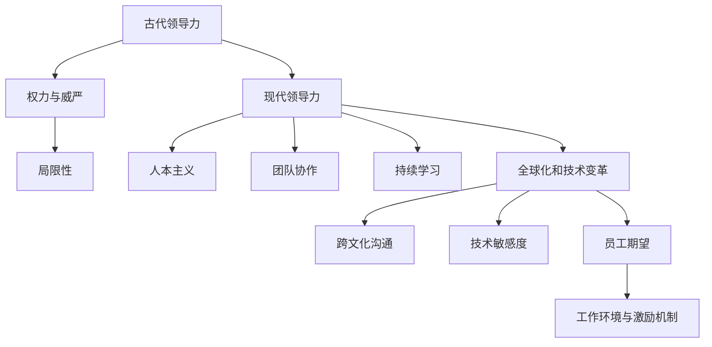
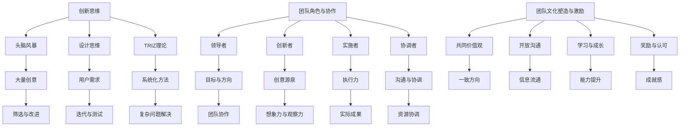

                 

### 文章标题

《领导力与创新：引领团队突破常规》

### 关键词

- 领导力
- 创新
- 团队建设
- 创新思维
- 创新实践
- 变革管理

### 摘要

在当今快速变化和高度竞争的IT领域中，领导力和创新能力成为了企业成功的关键因素。本文深入探讨了领导力与创新之间的关系，详细分析了领导力的本质与演变、创新思维与团队建设、领导力对创新的影响以及如何通过创新实践提升团队绩效。文章结合实际案例，提供了实用的策略和方法，帮助领导者引领团队突破常规，实现持续创新。通过本文，读者将了解到如何在领导力和创新方面提升自我，成为卓越的领导者。

### 第一部分：领导力基础理论

#### 第1章：领导力的本质与演变

**1.1 领导力的定义与核心要素**

领导力是一种影响力，它使个人和团队朝着共同的目标前进。根据不同的定义，领导力可以看作是一种能力、一种艺术、一种过程，或者是一种特质。然而，无论哪种定义，领导力的核心要素始终包括以下几个：

- **愿景与目标设定**：领导者需要明确组织或团队的愿景和目标，并能够将这些愿景和目标传达给团队成员。
- **影响力与沟通**：领导者通过影响力来引导和激励团队成员，同时通过有效沟通确保信息传达的一致性和准确性。
- **决策与执行力**：领导者需要在复杂多变的环境中做出明智的决策，并确保决策得到有效执行。
- **团队建设与激励**：领导者需要建立和维护一个高效的团队，激发团队成员的潜力，提升团队整体绩效。

**1.2 领导力的历史演变**

领导力的概念和实践随着历史的演变而不断发展和变化。从古代的帝王将相到现代的企业家，领导力的形式和内涵也在不断演变。

- **古代领导力**：古代领导力主要依赖于权力和威严，领导者通过绝对的权威来统治和管理人民。这种领导力模式在古代社会中发挥了重要作用，但随着社会的发展，其局限性也逐渐显现。
- **现代领导力**：现代领导力更加注重人本主义和合作精神。领导者不再仅仅依靠权力和命令，而是通过影响力、沟通和激励来引导团队成员。现代领导力强调团队协作、创新和持续学习，以应对快速变化的环境。

**1.3 领导力与现代组织**

在现代组织中，领导力扮演着至关重要的角色。随着组织规模和复杂性的增加，领导者需要具备更高的领导能力，以应对各种挑战。

- **全球化**：全球化使得组织面临更加复杂的市场环境和文化差异。领导者需要具备跨文化沟通和协作能力，以适应全球化的趋势。
- **技术变革**：技术的快速发展对组织的管理和运营带来了巨大影响。领导者需要具备前瞻性的战略思维和技术敏感度，以引导组织在技术变革中保持竞争力。
- **员工期望**：现代员工对工作的期望也在不断变化，他们追求自我实现、工作与生活的平衡以及职业发展机会。领导者需要关注员工的期望，提供有吸引力的工作环境和激励机制。

**核心概念与联系：领导力的本质与演变**

领导力的本质与演变可以用以下Mermaid流程图来表示：

**领导力在现代组织中的核心作用**

现代组织中的领导力不仅仅是对员工的激励和管理，更是推动组织创新和持续发展的关键因素。以下是领导力在现代组织中的核心作用：

- **战略方向**：领导者需要明确组织的愿景和使命，并将其转化为具体的战略目标。这有助于确保组织在快速变化的环境中保持清晰的战略方向。
- **团队协作**：领导者通过有效的团队建设和管理，激发团队成员的潜力，提升团队整体绩效。
- **创新驱动**：领导者需要具备创新思维和前瞻性，推动组织在技术和商业模式上的创新。
- **文化塑造**：领导者通过塑造积极向上的组织文化，提升员工的归属感和工作满意度，从而增强组织的凝聚力和竞争力。

**总结**

领导力是一种复杂而多维的能力，它随着历史的演变和现代组织的需求而不断发展和变化。在现代组织中，领导力不仅是推动组织发展的重要力量，更是引领团队突破常规、实现持续创新的关键。领导者需要不断学习和提升自身的领导能力，以应对不断变化的挑战和机遇。

### 第2章：创新思维与团队建设

**2.1 创新思维的理论与方法**

创新思维是领导者成功引领团队突破常规的重要能力。创新思维不仅包括创造新的想法，还涉及对现有资源的重新组合和优化。以下是几种常见的创新思维理论和方法：

- **头脑风暴**：头脑风暴是一种集体思维活动，通过鼓励自由表达和互相启发，产生大量创意。这种方法强调数量而非质量，通过大量创意的筛选和改进，最终得到可行的解决方案。
- **设计思维**：设计思维是一种以人为本的创新方法，它强调从用户的需求和感受出发，通过迭代和原型测试来逐步完善解决方案。设计思维包括五个阶段：同理、定义、构思、原型和测试。
- **TRIZ理论**：TRIZ（理论创新问题解决）是一种基于数学和统计学原理的创新方法论。它提供了一套系统化的工具和方法，帮助解决复杂问题，实现创新突破。

**2.2 团队角色与协作**

在创新过程中，团队的角色和协作至关重要。有效的团队协作可以激发成员的创造力，提高创新效率。以下是一些关键的团队角色和协作策略：

- **领导者**：领导者需要提供清晰的目标和方向，激发团队成员的潜力，并协调团队内部的资源。
- **创新者**：创新者是团队中的“创意源泉”，他们负责提出新的想法和解决方案。创新者需要具备敏锐的观察力和丰富的想象力。
- **实施者**：实施者是创新想法的执行者，他们负责将创意转化为实际成果。实施者需要具备执行力和解决问题的能力。
- **协调者**：协调者负责团队内部和外部的沟通，确保各种资源和信息的高效流动。协调者需要具备出色的沟通能力和协调能力。

**团队协作的有效策略**

- **明确目标与责任**：确保每个团队成员都明确自己的目标和责任，避免任务重叠和责任不清。
- **建立信任与尊重**：建立互信和尊重的文化氛围，鼓励团队成员之间的开放沟通和合作。
- **提供资源与支持**：确保团队有足够的资源和支持，包括资金、技术、信息和人脉等。
- **激励机制**：设置合理的激励机制，鼓励团队成员积极参与创新活动，并对优秀表现给予认可和奖励。

**2.3 团队文化塑造与激励**

团队文化是创新过程中不可或缺的一部分。积极向上的团队文化可以激发成员的创造力和归属感，提高团队的协作效率和创新能力。以下是一些团队文化塑造和激励的策略：

- **共同价值观**：建立共同的价值观，确保团队成员在创新过程中保持一致的方向和目标。
- **开放沟通**：鼓励团队成员之间的开放沟通，建立良好的信息流通机制，确保创意和问题能够得到及时反馈和解决。
- **学习与成长**：鼓励团队成员持续学习和成长，提供培训和学习资源，帮助团队成员提升自身能力和创新思维。
- **奖励与认可**：对团队成员的创新成果给予奖励和认可，增强他们的成就感和自豪感，激发持续创新的动力。

**核心概念与联系：创新思维与团队建设**

创新思维与团队建设之间的联系可以用以下Mermaid流程图来表示：

**创新思维在团队建设中的应用**

- **激发创造力**：创新思维可以帮助团队成员打破常规思维，激发创造力，提出新颖的解决方案。
- **提升团队凝聚力**：通过共同参与创新活动，团队成员之间的信任和合作得到增强，提升团队的凝聚力。
- **优化决策过程**：创新思维提供多种解决方案，帮助团队在复杂决策中找到最佳路径。

**总结**

创新思维和团队建设是领导力的重要组成部分，对于团队突破常规、实现持续创新具有重要意义。领导者需要通过有效的创新思维方法和团队协作策略，塑造积极向上的团队文化，激发团队成员的创造力和归属感，从而提升团队的绩效和竞争力。

### 第3章：领导力与创新的关系

**3.1 领导力对创新的影响**

领导力对创新的影响是双向的，一方面，领导力可以促进创新；另一方面，创新也可以反作用于领导力，影响领导力的发展。以下从以下几个方面分析领导力对创新的影响：

- **愿景与目标**：领导者的愿景和目标设定对于创新具有重要影响。一个明确的愿景和目标可以激发团队成员的创造力和动力，引导团队朝着创新的方向努力。领导者需要将愿景和目标具体化，并传达给团队成员，确保团队成员理解并认同这些目标和愿景。
- **决策与执行力**：领导者在创新过程中扮演着关键角色。领导者需要做出明智的决策，并在执行过程中提供支持和指导。有效的决策和执行力有助于确保创新项目能够顺利推进，并及时应对各种挑战和问题。
- **团队协作与激励**：领导力在团队协作和激励中发挥着重要作用。领导者需要建立高效的团队协作机制，确保团队成员能够协同工作，共同推动创新。同时，领导者需要激励团队成员，提供必要的支持和资源，以激发他们的创造力和工作积极性。

**领导风格与创新绩效的关系**

领导风格对创新绩效有着重要影响。不同的领导风格可能导致不同的创新结果。以下是一些常见的领导风格及其对创新绩效的影响：

- **命令型领导风格**：命令型领导者通过直接指令和控制来管理团队。这种领导风格可能不利于创新，因为它限制了团队成员的自由表达和创造力。然而，在某些情况下，命令型领导风格可以快速决策并确保执行力，从而在紧急情况下产生创新的成果。
- **民主型领导风格**：民主型领导者鼓励团队成员参与决策过程，尊重团队成员的意见和建议。这种领导风格有助于激发团队成员的创造力和主动性，从而促进创新。然而，民主型领导风格可能导致决策过程复杂和缓慢，影响创新效率。
- **变革型领导风格**：变革型领导者通过激励和启发团队成员来实现变革和创新。这种领导风格强调个人价值观和使命感，激发团队成员的内在动力，从而推动创新。变革型领导风格有助于建立积极的创新文化，提升团队的创新绩效。

**领导力如何促进创新**

为了促进创新，领导者需要采取一系列策略和方法，包括：

- **鼓励创新思维**：领导者需要鼓励团队成员勇于尝试和探索，提供自由表达的空间和机会，从而激发创新思维。
- **提供资源支持**：领导者需要确保团队成员有足够的资源支持，包括资金、技术和信息等，以便团队成员能够专注于创新工作。
- **建立创新文化**：领导者需要建立积极向上的创新文化，鼓励团队成员积极参与创新活动，并对创新成果给予认可和奖励。
- **培养创新人才**：领导者需要重视人才的培养和发展，提供培训和成长机会，帮助团队成员提升创新能力和专业素养。

**创新领导力的培养策略**

为了成为有效的创新领导者，以下是一些关键策略：

- **自我反思与学习**：领导者需要不断反思自己的领导行为和效果，学习最新的领导理论和实践，提升自身的领导能力。
- **培养开放心态**：领导者需要保持开放心态，接受新观念和新方法，勇于尝试和创新。
- **提升沟通能力**：领导者需要具备出色的沟通能力，能够有效地与团队成员沟通，理解他们的需求和期望，并提供必要的支持和指导。
- **培养团队合作精神**：领导者需要重视团队合作，鼓励团队成员之间的合作和协作，共同推动创新。

**总结**

领导力与创新之间存在密切的关系，领导力对创新具有深远影响。有效的领导力可以激发团队的创造力，提供必要的资源和支持，建立积极的创新文化，从而推动创新并实现持续发展。领导者需要通过不断学习和实践，提升自身的领导能力，成为优秀的创新领导者。

### 第4章：突破常规的创新实践

#### 4.1 创新项目的启动

创新项目的成功启动是确保项目顺利进行和实现预期目标的关键步骤。以下是创新项目启动过程中的关键要素和策略：

**1. 创新项目的策划**

- **明确项目目标**：在启动创新项目之前，领导者需要明确项目的目标，包括创新的方向、预期成果和实现的里程碑。明确的目标有助于团队成员聚焦于核心任务，并提高项目效率。
- **资源需求分析**：领导者需要评估项目的资源需求，包括资金、技术和人力资源等。确保项目在启动阶段有足够的资源支持，以避免因资源不足导致项目进展受阻。
- **风险评估**：创新项目通常伴随着较高的风险，领导者需要识别潜在的风险因素，并制定相应的风险应对策略，以减少项目失败的可能性。

**2. 创新项目的风险管理**

- **风险识别**：领导者需要通过收集信息和分析，识别项目过程中可能面临的风险。常见风险包括技术难题、市场变化、资源不足等。
- **风险评估**：对识别出的风险进行评估，分析其对项目的影响程度和可能性。根据风险评估结果，确定风险应对策略。
- **风险应对**：制定具体的应对措施，包括风险规避、风险减轻、风险转移等。确保在项目实施过程中能够及时应对各种风险，保障项目的顺利进行。

**3. 创新方法的应用**

- **设计思维**：设计思维是一种以用户需求为中心的创新方法，强调通过迭代和原型测试来逐步完善解决方案。领导者可以采用设计思维，从用户角度出发，探索创新的方向和可行性。
- **快速迭代**：快速迭代是创新项目常用的方法之一，通过不断迭代和优化，逐步实现项目的目标。领导者可以制定迭代计划，确保项目在各个阶段都能得到及时反馈和改进。
- **创意生成与评估**：在创新过程中，领导者需要鼓励团队成员提出创意，并进行评估和筛选。通过有效的创意生成和评估方法，筛选出最具潜力的创意，为项目提供创新的动力。

#### 4.2 创新方法的应用

**设计思维与快速迭代**

**设计思维**：

1. **同理用户**：通过访谈、观察和调研等方式，深入了解用户的需求和痛点，建立对用户的深刻理解。
2. **定义问题**：基于用户的理解和反馈，明确创新项目要解决的问题，确保项目目标与用户需求相一致。
3. **构思解决方案**：通过头脑风暴、思维导图等方式，生成多种可能的解决方案，并筛选出最具潜力的方案。
4. **原型制作与测试**：制作原型，通过用户测试和反馈，不断迭代和优化解决方案，直至满足用户需求。

**快速迭代**：

1. **确定迭代周期**：根据项目的特点和需求，确定适当的迭代周期，确保项目在各个阶段都能得到及时反馈和改进。
2. **制定迭代计划**：明确每个迭代的目标和任务，确保团队成员在迭代过程中有清晰的方向和目标。
3. **实施迭代**：在迭代周期内，按照计划实施项目任务，并进行持续监测和反馈。
4. **评估与优化**：在每个迭代结束时，对项目进展和结果进行评估，识别问题和不足，并进行优化和调整。

#### 4.3 成功的案例分析

**案例一：苹果公司**

**背景**：苹果公司自成立以来，一直以创新为核心竞争力，通过不断推出具有革命性的产品，引领科技潮流。

**关键因素**：

1. **明确的目标和愿景**：苹果公司始终坚持“创新改变生活”的愿景，为每个产品设定明确的目标和方向。
2. **强大的研发团队**：苹果公司拥有一支高素质的研发团队，他们具备丰富的创新经验和能力。
3. **用户导向的设计思维**：苹果公司采用设计思维，从用户的角度出发，深入了解用户需求和痛点，确保产品的实用性和创新性。
4. **快速迭代和优化**：苹果公司采用快速迭代的方法，通过不断优化和改进，提升产品的用户体验。

**结论**：苹果公司的成功经验表明，明确的目标、强大的团队、用户导向的设计思维和快速迭代是推动创新的关键因素。

**案例二：特斯拉公司**

**背景**：特斯拉公司是一家专注于电动汽车和能源存储技术的创新企业。

**关键因素**：

1. **前瞻性的战略思维**：特斯拉公司具备前瞻性的战略思维，通过不断创新，引领电动汽车行业的发展。
2. **强大的技术实力**：特斯拉公司拥有一支强大的技术团队，他们致力于研发具有竞争力的电动汽车技术。
3. **用户参与的创新模式**：特斯拉公司鼓励用户参与创新过程，通过用户反馈和互动，不断优化和改进产品。
4. **创新的商业模式**：特斯拉公司采用创新的商业模式，通过直销和在线销售，降低成本并提高用户体验。

**结论**：特斯拉公司的成功经验表明，前瞻性的战略思维、强大的技术实力、用户参与的创新模式和创新的商业模式是推动创新的重要因素。

#### 4.4 创新失败的案例分析

**案例一：诺基亚**

**背景**：诺基亚曾是全球最大的手机制造商，但在智能手机时代来临之际，未能成功转型，最终走向衰落。

**关键因素**：

1. **过于依赖现有市场**：诺基亚过于依赖现有市场，未能及时关注新兴市场和技术趋势，导致创新滞后。
2. **内部创新机制不足**：诺基亚内部创新机制不足，缺乏鼓励创新的文化和机制，导致创新乏力。
3. **产品创新不足**：诺基亚在产品创新方面表现不佳，未能推出具有竞争力的智能手机产品。
4. **市场应对不及时**：诺基亚在市场变化和竞争压力面前应对不及时，错失了智能手机市场的机遇。

**结论**：诺基亚的失败表明，过于依赖现有市场、内部创新机制不足、产品创新不足和市场应对不及时是导致创新失败的主要原因。

**案例二：柯达**

**背景**：柯达曾是胶片摄影领域的霸主，但在数码摄影时代来临之际，未能及时转型，最终走向破产。

**关键因素**：

1. **技术创新不足**：柯达在技术创新方面表现不佳，未能及时研发和推广数码摄影技术。
2. **商业模式滞后**：柯达的商业模式滞后，未能适应数码摄影市场的发展趋势，导致市场份额急剧下降。
3. **内部创新机制不足**：柯达内部创新机制不足，缺乏鼓励创新的文化和机制，导致创新乏力。
4. **市场应对不及时**：柯达在市场变化和竞争压力面前应对不及时，错失了数码摄影市场的机遇。

**结论**：柯达的失败表明，技术创新不足、商业模式滞后、内部创新机制不足和市场应对不及时是导致创新失败的主要原因。

#### 4.5 创新的关键因素与失败原因

**创新成功的关键因素**：

1. **明确的目标和愿景**：明确的目标和愿景是推动创新的重要动力，有助于团队聚焦核心任务和方向。
2. **强大的技术实力**：强大的技术实力是创新的基础，有助于团队在技术领域保持领先地位。
3. **用户参与的创新模式**：用户参与的创新模式有助于团队更好地理解用户需求，提高产品的实用性和创新性。
4. **创新的商业模式**：创新的商业模式有助于团队在市场中保持竞争力，提高市场份额和盈利能力。

**创新失败的常见原因**：

1. **过于依赖现有市场**：过于依赖现有市场可能导致团队缺乏创新动力和前瞻性，错失市场机遇。
2. **内部创新机制不足**：内部创新机制不足可能导致团队缺乏创新文化和氛围，影响创新能力和效果。
3. **产品创新不足**：产品创新不足可能导致团队在市场中失去竞争力，影响业绩和市场份额。
4. **市场应对不及时**：市场应对不及时可能导致团队在市场变化和竞争压力面前处于被动地位，错失发展机遇。

#### 总结

突破常规的创新实践是领导者引领团队实现持续发展的关键。通过成功的案例分析，我们了解到明确的目标和愿景、强大的技术实力、用户参与的创新模式和创新的商业模式是推动创新的关键因素。同时，过于依赖现有市场、内部创新机制不足、产品创新不足和市场应对不及时是导致创新失败的常见原因。领导者需要通过不断学习和实践，提升自身的创新能力和领导力，引领团队在激烈的市场竞争中实现突破。

### 第5章：团队管理与领导力提升

#### 5.1 团队领导力的提升路径

团队领导力是领导者带领团队实现共同目标的能力。提升团队领导力不仅有助于提升团队绩效，还能增强团队凝聚力和员工满意度。以下是提升团队领导力的关键路径：

**1. 领导力发展的关键步骤**

- **自我认知与反思**：领导者需要深入了解自己的性格特点、优势和不足，通过自我反思和反馈，不断提升自身的自我认知。
- **学习与培训**：领导者需要不断学习新的领导理论和实践，通过参加培训课程、阅读相关书籍和文献，提升自身的领导能力。
- **实践经验**：通过实际工作经历，领导者可以在实践中学习和提升领导力，积累宝贵的经验。
- **角色扮演与模仿**：领导者可以尝试扮演不同角色，观察和学习其他领导者的行为和决策方式，从而提升自身的领导能力。

**2. 领导力的自我评估与提升**

- **360度反馈**：领导者可以通过360度反馈的方式，收集来自同事、下属和上级的反馈，了解自己在领导力方面的优点和不足。
- **领导力能力评估表**：领导者可以使用领导力能力评估表，对自己在各个领导力维度上的表现进行量化评估。
- **设定个人发展目标**：根据自我评估和反馈结果，领导者可以设定个人发展目标，并制定具体的提升计划。
- **持续跟踪与改进**：领导者需要持续跟踪个人发展目标的进展，并根据实际情况进行调整和改进。

**3. 领导力发展的关键因素**

- **情商**：情商是领导者成功的重要因素之一。领导者需要具备较高的情商，包括自我情绪管理、理解他人情绪和有效沟通。
- **决策能力**：领导者需要具备良好的决策能力，能够在复杂多变的环境中做出明智的决策。
- **影响力**：领导者需要具备影响力，能够激励和引导团队成员，实现共同目标。
- **创新能力**：领导者需要具备创新能力，能够推动团队在技术和商业模式上的创新，保持竞争力。

#### 5.2 团队冲突管理

**1. 冲突的类型与处理策略**

- **任务冲突**：任务冲突是由于团队成员在任务分配、优先级设置和工作方法上的分歧引起的。处理任务冲突的关键是明确任务目标，沟通协调，确保任务的有效完成。
- **关系冲突**：关系冲突是由于团队成员之间的个人关系紧张、误解或不满引起的。处理关系冲突的关键是建立信任和尊重，通过有效的沟通解决矛盾。
- **价值冲突**：价值冲突是由于团队成员在价值观、信仰或道德标准上的差异引起的。处理价值冲突的关键是尊重多样性，通过对话和妥协寻找共同点。

**2. 冲突预防与化解**

- **预防策略**：

  - **明确目标与责任**：确保每个团队成员都明确自己的目标和责任，避免任务重叠和责任不清。
  - **建立沟通机制**：建立有效的沟通机制，鼓励团队成员之间的开放沟通，及时解决潜在冲突。
  - **促进团队合作**：通过团队建设活动，增强团队成员之间的信任和协作，减少冲突发生的可能性。

- **化解策略**：

  - **直接对话**：当冲突发生时，领导者应鼓励冲突双方进行直接对话，表达彼此的观点和感受，寻找共同点。
  - **第三方调解**：在复杂冲突中，领导者可以邀请第三方调解，帮助双方找到解决方案。
  - **妥协与让步**：在必要时，领导者可以引导双方进行妥协和让步，以达成共识。

#### 5.3 领导力在变革管理中的应用

**1. 变革中的领导角色**

- **变革倡导者**：领导者需要积极倡导变革，为团队成员树立榜样，推动变革的进程。
- **变革推动者**：领导者需要制定具体的变革计划，协调资源，推动变革的实施。
- **变革支持者**：领导者需要关注团队成员的反馈和需求，提供支持和帮助，确保变革的顺利进行。

**2. 变革管理的策略与技巧**

- **明确变革目标**：领导者需要明确变革的目标和愿景，确保团队成员理解变革的重要性和意义。
- **沟通与宣传**：领导者需要通过有效的沟通和宣传，传达变革的目标和计划，增强团队成员的参与感和认同感。
- **建立信任**：领导者需要建立信任，与团队成员保持开放和坦诚的沟通，确保团队成员在变革过程中感受到安全和支持。
- **激励与奖励**：领导者需要制定激励和奖励机制，鼓励团队成员积极参与变革，并对优秀表现给予认可和奖励。

**3. 变革管理的最佳实践**

- **小步骤推进**：变革管理应采取小步骤推进的策略，逐步实施变革，减少对团队成员的冲击。
- **灵活应对**：领导者需要具备灵活应对的能力，能够根据实际情况调整变革计划，确保变革的顺利进行。
- **持续评估**：领导者需要持续评估变革的进展和效果，及时发现和解决问题，确保变革目标的实现。

#### 总结

团队管理与领导力提升是领导者的重要职责，对于团队绩效和员工满意度具有深远影响。通过明确领导力发展的关键步骤、有效管理团队冲突和成功管理变革，领导者可以提升自身的领导力，推动团队实现持续发展和创新。领导者需要不断学习和实践，提升自身的领导能力，成为卓越的团队领导者。

### 第6章：跨部门协作与领导力

#### 6.1 跨部门协作的重要性

跨部门协作在现代组织中日益重要，它不仅有助于提升整体绩效，还能促进创新和问题的解决。以下是跨部门协作的重要性及其面临的挑战：

**1. 跨部门协作的重要性**

- **资源共享**：跨部门协作可以整合各部门的资源，提高资源利用率，降低重复投入。
- **问题解决**：跨部门协作有助于从不同角度审视问题，集思广益，找到更有效的解决方案。
- **创新驱动**：跨部门协作可以激发不同部门的创意和想法，促进技术创新和商业模式创新。
- **提升整体绩效**：通过跨部门协作，可以整合各部门的业绩，提升组织整体绩效和竞争力。

**2. 跨部门协作面临的挑战**

- **沟通障碍**：不同部门之间存在信息不对称和沟通不畅，导致协作效率降低。
- **利益冲突**：不同部门之间存在利益冲突，可能因为资源分配、优先级等问题产生矛盾。
- **文化差异**：不同部门拥有不同的文化背景和工作方式，可能导致协作困难。
- **职责不清**：跨部门协作中，各部门的职责和权限可能不明确，导致协作效率低下。

#### 6.2 领导者在跨部门协作中的角色

领导者在跨部门协作中扮演着关键角色，他们需要协调各部门的利益，促进沟通与协作，确保跨部门项目的成功。以下是领导者在跨部门协作中的几个关键角色：

**1. 沟通协调者**

- **建立沟通机制**：领导者需要建立跨部门的沟通机制，确保信息的及时传递和反馈。
- **促进有效沟通**：领导者需要促进团队成员之间的有效沟通，确保各方能够充分表达意见和需求。
- **解决沟通障碍**：领导者需要及时解决跨部门协作中出现的沟通障碍，确保协作的顺利进行。

**2. 资源调配者**

- **合理分配资源**：领导者需要根据项目的需求和优先级，合理调配各部门的资源，确保资源的高效利用。
- **协调利益冲突**：领导者需要协调各部门的利益，解决资源分配和优先级设置上的矛盾，确保项目的顺利进行。

**3. 文化融合者**

- **尊重文化差异**：领导者需要尊重不同部门的文化差异，避免因文化冲突导致的协作困难。
- **推动文化融合**：领导者需要推动不同部门之间的文化融合，建立共同的价值观念和行为规范。

#### 6.3 跨部门项目管理的最佳实践

为了实现高效的跨部门协作，以下是一些跨部门项目管理的最佳实践：

**1. 明确目标和责任**

- **设定共同目标**：跨部门项目需要明确共同的目标，确保各部门的理解和认同。
- **明确职责分工**：各部门的职责和权限需要明确，避免因职责不清导致的协作困难。

**2. 沟通与协调**

- **建立沟通机制**：通过定期会议、工作群、邮件等方式，确保信息的及时传递和反馈。
- **定期反馈与评估**：领导者需要定期评估跨部门协作的进展和效果，及时调整计划和策略。

**3. 资源共享与优化**

- **共享资源平台**：建立共享资源平台，提高资源利用率，降低重复投入。
- **优化资源配置**：根据项目需求和优先级，动态调整资源配置，确保资源的高效利用。

**4. 文化融合与激励机制**

- **建立共同价值观**：通过共同价值观的建立，增强各部门的协作意愿和团队意识。
- **设置激励机制**：对在跨部门协作中表现优秀的团队成员给予奖励和认可，激发团队成员的积极性和创造力。

**5. 风险管理与应急预案**

- **识别风险因素**：领导者需要识别跨部门协作中可能面临的风险因素，并制定相应的应对策略。
- **制定应急预案**：针对可能出现的风险，制定应急预案，确保在风险发生时能够迅速响应和应对。

#### 总结

跨部门协作在现代组织中具有重要意义，它有助于提升整体绩效、促进创新和问题的解决。领导者在跨部门协作中扮演着关键角色，他们需要通过沟通协调、资源调配和文化融合等方式，促进跨部门的协作和项目的成功。通过实施最佳实践，领导者可以提升跨部门协作的效率和质量，实现组织的持续发展和创新。

### 第7章：领导力与创新的未来趋势

#### 7.1 新型领导力模型

随着全球化和数字化的加速发展，传统领导力模型逐渐显露出其局限性，新型领导力模型应运而生。以下是一些新兴的领导力模型及其特点：

**1. 平台化领导力**

平台化领导力强调组织的去中心化和共享资源，领导者更多地扮演平台协调者的角色，为团队成员提供支持和资源，激发他们的自主性和创新能力。

- **特点**：去中心化、共享资源、激发自主性。

**2. 生态系统领导力**

生态系统领导力关注组织与外部环境的互动和合作，领导者需要建立和维护良好的外部生态系统，促进组织与合作伙伴、客户和供应商之间的协同创新。

- **特点**：跨界合作、生态系统建设、协同创新。

**3. 智慧型领导力**

智慧型领导力强调领导者利用数据、人工智能和机器学习等现代技术，提升决策的科学性和效率，推动组织的数字化转型。

- **特点**：数据驱动、技术赋能、智慧决策。

**4. 软实力领导力**

软实力领导力注重领导者的人格魅力、情感智慧和影响力，通过建立信任和情感联结，激发团队成员的内在动力和创新能力。

- **特点**：人格魅力、情感智慧、影响力。

#### 7.2 创新的未来方向

创新的未来方向将受到技术进步、市场需求和社会变化的影响。以下是一些创新的关键领域：

**1. 人工智能与机器学习**

人工智能和机器学习将在各个行业得到广泛应用，推动自动化、智能化和数据分析的深入发展。

- **应用领域**：智能制造、智能医疗、智能交通、金融科技。

**2. 可持续发展**

可持续发展将成为全球企业的重要战略方向，创新将聚焦于环保、能源效率和循环经济。

- **应用领域**：绿色能源、环保材料、节能减排、生态农业。

**3. 虚拟现实与增强现实**

虚拟现实和增强现实技术将在教育、娱乐、医疗等领域发挥重要作用，提供更加沉浸式和互动性的体验。

- **应用领域**：在线教育、虚拟旅游、远程医疗、游戏娱乐。

**4. 区块链技术**

区块链技术将在金融、供应链管理、数据安全等领域得到广泛应用，提高交易透明度和信任度。

- **应用领域**：金融科技、供应链管理、数据安全、智能合约。

#### 7.3 领导力与创新的融合

未来，领导力与创新的融合将更加紧密，领导者需要具备以下能力：

**1. 前瞻性**

领导者需要具备前瞻性的战略眼光，能够预见未来的趋势和变化，并制定相应的创新战略。

**2. 情感能力**

领导者需要具备情感智慧，能够理解和管理团队成员的情绪，建立积极的团队氛围。

**3. 协作能力**

领导者需要具备跨部门、跨文化的协作能力，能够推动不同团队和利益相关者之间的协同创新。

**4. 培养创新能力**

领导者需要重视员工的创新能力和成长，提供培训和发展机会，激发员工的创新潜力。

**总结**

新型领导力模型和创新的未来方向将深刻影响组织的运营和发展。领导者需要不断学习和适应，提升自身的领导能力和创新能力，引领组织在未来的竞争中保持领先地位。

### 附录A：领导力与创新工具与方法

**A.1 常用领导力评估工具**

1. **360度反馈**：360度反馈是一种评估方法，通过收集来自上级、同事、下属和客户的反馈，全面了解领导者的工作表现。这种方法有助于领导者发现自己的优势和不足，制定个人发展计划。

2. **领导力能力评估表**：领导力能力评估表是一种量化的评估工具，用于评估领导者在各个领导力维度上的表现。评估表通常包括沟通能力、决策能力、团队建设能力等关键指标。

**A.2 创新工具与资源**

1. **设计思维工作坊**：设计思维工作坊是一种创新方法，通过引导团队进行用户调研、头脑风暴、原型制作和测试，逐步完善解决方案。这种方法有助于激发团队成员的创造力，提高创新效率。

2. **创意生成工具**：创意生成工具如思维导图、六顶思考帽等，可以帮助团队快速生成和整理创意，提高创意的质量和可行性。这些工具适用于团队头脑风暴和创意筛选过程。

### 附录B：案例研究与领导力提升

**B.1 成功案例解析**

**案例一：谷歌的“20%时间”政策**

**背景**：谷歌在2006年推出了一项名为“20%时间”的政策，允许员工将20%的工作时间用于自己感兴趣的项目。这一政策旨在激发员工的创造力，推动公司内部的创新。

**关键做法**：

1. **自由探索**：员工有权自由选择自己感兴趣的项目，并在一定程度上自主决定项目方向和进度。
2. **资源支持**：谷歌为这些项目提供必要的资源支持，包括技术、资金和人力资源。
3. **定期评审**：项目进行到一定阶段，谷歌会进行定期评审，评估项目的进展和可行性，并提供指导和建议。

**成功因素**：

1. **激励创新**：“20%时间”政策激发了员工的创新热情，促进了公司内部的创新氛围。
2. **项目筛选**：通过定期评审，谷歌能够筛选出最有潜力的项目，确保资源的合理分配。
3. **开放文化**：谷歌的开放文化为员工提供了自由探索和尝试的环境，鼓励员工敢于创新。

**案例二：特斯拉的快速迭代文化**

**背景**：特斯拉以其快速迭代的文化而闻名，公司在产品开发过程中采用迭代和测试的方法，不断优化产品，提升用户体验。

**关键做法**：

1. **原型测试**：特斯拉在产品开发过程中，不断制作原型，通过用户测试和反馈，逐步完善产品。
2. **迭代改进**：根据用户反馈，特斯拉会进行快速迭代和改进，确保产品在各个阶段都能满足用户需求。
3. **团队协作**：特斯拉强调跨部门的协作，不同团队共同参与产品开发和优化，提高创新效率。

**成功因素**：

1. **用户导向**：特斯拉始终以用户需求为中心，通过原型测试和迭代改进，确保产品能够满足用户期望。
2. **快速响应**：特斯拉采用快速迭代的方法，能够迅速响应市场变化和用户反馈，提高产品竞争力。
3. **跨部门协作**：跨部门协作有助于整合不同团队的优势，提高创新效率和产品质量。

**B.2 领导力提升计划**

**1. 自我提升计划模板**

- **目标设定**：明确个人领导力提升的目标，包括沟通能力、决策能力、团队建设能力等。
- **学习计划**：制定学习计划，包括阅读书籍、参加培训、学习领导力模型等。
- **实践应用**：将学到的领导力知识应用到实际工作中，通过实践提升领导力。
- **反馈与评估**：定期收集反馈，评估自身领导力提升的进展，并根据反馈进行调整。

**2. 领导力培训资源推荐**

- **在线课程**：《领导力心理学》、《高级领导力策略》等在线课程，提供系统化的领导力知识和技能培训。
- **书籍推荐**：《变革之舞：领导者如何激励变革》、《精益创新：从构思到商业化的系统化方法》等书籍，提供深入的领导力和创新理念。
- **工作坊与研讨会**：参加领导力工作坊和研讨会，与同行交流经验和见解，提升领导力实践能力。

### 附录C：注意事项与拓展阅读

**注意事项**

- **持续学习**：领导力和创新是一个不断发展的领域，领导者需要持续学习，跟上时代的发展。
- **文化塑造**：建立积极向上的团队文化，鼓励创新和协作，是提升领导力的关键。
- **实际应用**：将学到的领导力和创新知识应用到实际工作中，通过实践检验和提升领导力。

**拓展阅读**

- **《领导力的五个层次》**：约翰·马兹利希（John C. Maxwell）著，深入探讨了领导力的五个层次，提供了实用的领导力提升策略。
- **《创新者的窘境》**：克里斯坦森（Clayton M. Christensen）著，分析了创新者在面对市场变化时的困境，提供了创新策略和思路。

通过以上案例研究和领导力提升计划，读者可以深入了解领导力与创新的最佳实践，并在实际工作中应用这些策略，提升自身的领导力和创新能力。

