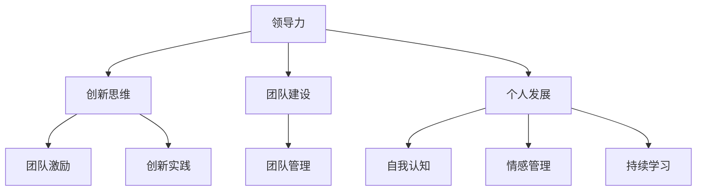

                 


### 文章标题：领导力与创新：引领团队走向未来

> 关键词：领导力、创新、团队建设、个人发展、科技领导

> 摘要：本文探讨了领导力与创新的关系，通过分析领导力的核心要素、创新思维模式、团队建设策略以及实际案例，帮助领导者提升自身领导力，引领团队实现创新，迎接未来挑战。

## 目录

## 第一部分：领导力基础

### 第1章：领导力概述

#### 1.1 领导力的定义与重要性

领导力是一种影响和激励他人实现共同目标的能力。它不仅仅是职位赋予的权力，更是一种个人素质和技能。在信息技术飞速发展的今天，领导力的重要性愈发凸显，它不仅关乎企业的生存与发展，更影响着整个团队的绩效与成长。

#### 1.2 领导力与传统管理的区别

传统管理侧重于控制与命令，而领导力则强调激发与激励。领导者需要通过愿景、价值观和文化来凝聚团队，共同追求卓越。

#### 1.3 领导力的核心要素

领导力的核心要素包括沟通能力、决策能力、自我认知和团队合作。有效的沟通是领导力的基础，决策能力决定了团队的方向和效率，自我认知则是领导者自我提升的基石，而团队合作则是实现共同目标的关键。

## 第二部分：创新思维与团队建设

### 第4章：创新思维概述

#### 4.1 创新的重要性

创新是推动企业发展的动力源泉。通过创新，企业能够持续适应市场变化，提升竞争力，实现可持续发展。

#### 4.2 创新思维的模式

创新思维包括发散思维和收敛思维。发散思维有助于发现新的机会和解决方案，收敛思维则能够从众多选项中筛选出最优解。

#### 4.3 创新思维的工具与方法

常用的创新思维工具有头脑风暴、六顶思考帽、思维导图等。这些工具和方法能够帮助团队激发创造力，实现突破性创新。

### 第5章：团队建设与激励

#### 5.1 团队的概念与类型

团队是志同道合的人为了实现共同目标而组成的协作单位。根据角色、目标和结构的不同，团队可以分为功能型团队、项目型团队和虚拟团队等。

#### 5.2 团队建设的关键因素

团队建设的关键因素包括信任、沟通、协作和共同目标。建立信任是团队合作的基石，有效的沟通是团队协调的保障，协作则是实现共同目标的必要条件。

#### 5.3 激励理论与实践

激励是调动团队成员积极性的关键。激励理论包括马斯洛的需求层次理论、赫茨伯格的双因素理论等。通过理解这些理论，领导者可以更有效地激励团队成员。

## 第三部分：领导力与创新案例分析

### 第7章：国内外领导力与创新案例研究

#### 7.1 案例研究方法

案例研究方法是一种通过深入研究具体案例来获取知识和洞察的方法。它有助于揭示领导力与创新的实践路径和成功要素。

#### 7.2 国内领导力与创新案例

国内领导力与创新案例包括华为、阿里巴巴等科技巨头。这些企业在领导力与创新方面取得了显著成就，为国内其他企业提供了有益的借鉴。

#### 7.3 国外领导力与创新案例

国外领导力与创新案例包括苹果、谷歌等国际知名企业。这些企业在全球范围内的影响力，展示了领导力与创新在全球市场的成功实践。

## 第四部分：领导力与创新的未来趋势

### 第8章：领导力与创新的未来趋势

#### 8.1 数字化背景下的领导力挑战

数字化时代给领导力带来了新的挑战，如数据安全、数字化决策等。领导者需要不断学习新技能，以应对这些挑战。

#### 8.2 创新趋势与未来发展方向

创新趋势包括人工智能、物联网、区块链等。领导者需要紧跟这些趋势，引领团队实现技术创新。

#### 8.3 领导者如何引领团队走向未来

领导者需要具备前瞻性思维，善于发现和把握机遇，同时要注重团队建设和个人发展，以实现可持续发展。

## 附录：领导力与创新资源指南

### 附录 A：领导力与创新书籍推荐

《领导力与新科学》、《创新者的窘境》、《精益创业》等书籍，提供了丰富的理论指导和实践经验。

### 附录 B：领导力与创新课程资源

《领导力与影响力》、《创新思维与设计思维》、《敏捷管理》等课程，帮助领导者提升领导力和创新能力。

### 附录 C：领导力与创新工具推荐

思维导图软件、敏捷管理工具等，能够提高团队协作效率和创新能力。

## Mermaid 流程图：领导力与创新核心要素关联



## 核心算法原理讲解：领导力与创新中的关键算法

### 伪代码示例：基于心理学的领导力评估算法

```python
function leadership_evaluation(leader_metrics, team_performance):
    correlation = correlation_coefficient(leader_metrics, team_performance)
    if correlation > 0.7:
        return "高领导力"
    elif correlation > 0.3:
        return "中等领导力"
    else:
        return "低领导力"
```

### 数学模型与公式讲解：创新风险评估

$$
R = \frac{V \cdot S}{C}
$$

### 详细讲解

创新风险值 \( R \) 是通过对创新项目价值 \( V \)、成功率 \( S \) 和成本 \( C \) 的综合计算得出的。这个公式表明，创新风险与成本成反比，与价值成正比，与成功率成反比。

### 举例说明

假设有一个创新项目，价值为100万元，成功率预计为70%，成本为50万元。根据上述公式，我们可以计算出创新风险值：

$$
R = \frac{100 \cdot 0.7}{50} = 1.4
$$

这个结果表明，该创新项目的风险相对较高，需要进一步评估和风险控制措施。

## 项目实战：领导力与创新的实际应用案例

### 实际案例：某科技公司的创新领导力实践

#### 1. 项目背景

某科技公司致力于研发人工智能技术，面临激烈的市场竞争和快速的技术变革。为了保持公司的创新活力和领导力，公司决定实施一套全面的创新领导力计划。

#### 2. 开发环境搭建

公司为研发团队配备了先进的研发工具，包括人工智能平台、数据存储和计算资源等，确保团队有足够的资源进行创新开发。

#### 3. 团队建设

公司通过内部培训和外部引进，不断提升团队成员的专业能力和团队协作能力。同时，公司建立了明确的团队目标和考核机制，激励团队成员积极参与创新项目。

#### 4. 创新实践

公司鼓励团队成员提出创新想法，并提供了充分的资源和时间支持。通过头脑风暴、六顶思考帽等创新思维工具，团队成功开发了多项创新产品，并在市场上取得了良好的反响。

#### 5. 项目小结

通过实施创新领导力计划，科技公司成功提升了团队的创新能力和市场竞争力，为企业的可持续发展奠定了坚实基础。领导者在整个过程中发挥了关键作用，通过有效的领导力和创新实践，引领团队不断突破自我，实现创新。

### 最佳实践 tips

1. 建立明确的创新目标和战略方向，确保团队的一致性和高效性。
2. 提供充足的资源和支持，为团队成员的创新提供保障。
3. 培养团队成员的创新思维和团队合作能力，提高整体创新能力。
4. 建立激励机制，激发团队成员的创新热情和积极性。

### 小结

领导力与创新是推动企业发展的重要力量。领导者需要具备深厚的领导力基础，掌握创新思维工具和方法，同时注重团队建设和个人发展。通过有效的领导力和创新实践，企业可以不断提升竞争力，引领团队走向未来。

### 注意事项

1. 领导者需要不断学习和适应新的技术和市场变化，保持创新活力。
2. 团队成员需要积极参与创新过程，发挥个人特长和优势。
3. 创新过程中要注重风险管理，避免盲目跟风和资源浪费。

### 拓展阅读

1. 汤姆·彼得斯，《领导力的未来：领导者的角色与挑战》
2. 约翰·霍金斯，《创新者的思考方式》
3. 克莱顿·克里斯滕森，《创新者的窘境》

[作者：AI天才研究院/AI Genius Institute & 禅与计算机程序设计艺术 /Zen And The Art of Computer Programming] 

