                 

### 文章标题：领导力与创新：激发团队创新精神

#### 关键词：领导力、创新、团队精神、激发、团队协作

#### 摘要：
在当今快速变化和高竞争的商业环境中，领导力和创新精神成为了企业成功的关键因素。本文将探讨如何通过有效的领导力来激发团队的创新精神，从而推动企业持续发展。文章首先定义了领导力的基本概念和重要性，然后详细介绍了团队管理、沟通技巧和激励策略。接着，文章深入探讨了创新思维的方法和实践，最后结合具体案例，展示了如何将领导力与创新相结合，以实现团队的创新突破。

### 目录大纲

## 《领导力与创新：激发团队创新精神》

### 第一部分：领导力基础

### 第1章：领导力的定义与重要性

#### 1.1 领导力的定义

#### 1.2 领导力的类型

#### 1.3 领导力的重要性

### 第2章：领导力与团队管理

#### 2.1 团队建设的原则

#### 2.2 团队沟通技巧

#### 2.3 激励团队士气

### 第3章：领导力与个人成长

#### 3.1 自我认知与领导力

#### 3.2 时间管理与决策

#### 3.3 领导力的自我提升

### 第二部分：创新思维与方法

### 第4章：创新思维概述

#### 4.1 创新的定义

#### 4.2 创新的重要性

#### 4.3 创新思维的类型

### 第5章：创新思维方法

#### 5.1 六顶思考帽法

#### 5.2 设计思考方法

#### 5.3 分享思维方法

### 第6章：创新实践与应用

#### 6.1 创新项目规划

#### 6.2 创新团队协作

#### 6.3 创新成果转化

### 第三部分：创新领导力

### 第7章：领导力与创新结合

#### 7.1 领导力与创新的关系

#### 7.2 创新领导者的特质

#### 7.3 领导力在创新中的角色

### 第8章：创新领导力的实践

#### 8.1 创新领导力的培养

#### 8.2 创新领导力的策略

#### 8.3 创新领导力的挑战与应对

### 第9章：案例研究：创新领导力在实践中的应用

#### 9.1 案例一：谷歌的领导力与创新

#### 9.2 案例二：苹果的创新领导力

#### 9.3 案例三：特斯拉的创新领导力

### 附录

### 附录A：创新领导力工具与方法概览

#### A.1 头脑风暴

#### A.2 SWOT分析

#### A.3 创意思维技术

### 附录B：参考资料

#### B.1 相关书籍推荐

#### B.2 创新与领导力研究论文

#### B.3 创新实践案例集

### Mermaid 流程图

```mermaid
graph TD
    A[领导力基础] --> B[领导力定义与重要性]
    A --> C[领导力与团队管理]
    A --> D[领导力与个人成长]
    B --> E[领导力定义]
    B --> F[领导力类型]
    B --> G[领导力重要性]
    C --> H[团队建设原则]
    C --> I[团队沟通技巧]
    C --> J[团队士气激励]
    D --> K[自我认知与领导力]
    D --> L[时间管理与决策]
    D --> M[领导力的自我提升]
    N[创新思维与方法] --> O[创新思维概述]
    N --> P[创新思维方法]
    N --> Q[创新实践与应用]
    O --> R[创新定义]
    O --> S[创新重要性]
    O --> T[创新思维类型]
    P --> U[六顶思考帽法]
    P --> V[设计思考方法]
    P --> W[分享思维方法]
    Q --> X[创新项目规划]
    Q --> Y[创新团队协作]
    Q --> Z[创新成果转化]
    AA[创新领导力] --> BB[领导力与创新结合]
    AA --> CC[创新领导力的实践]
    BB --> DD[领导力与创新关系]
    BB --> EE[创新领导者特质]
    BB --> FF[领导力在创新中角色]
    CC --> GG[创新领导力培养]
    CC --> HH[创新领导力策略]
    CC --> II[创新领导力挑战与应对]
    JJ[案例研究] --> KK[谷歌案例]
    JJ --> LL[苹果案例]
    JJ --> MM[特斯拉案例]
    NN[工具与方法概览] --> OO[头脑风暴]
    NN --> PP[SWOT分析]
    NN --> QQ[创意思维技术]
```

### 文章正文部分（8000-12000字）

#### 第一部分：领导力基础

### 第1章：领导力的定义与重要性

#### 1.1 领导力的定义

领导力是一种能力，指的是领导者通过影响、激励和引导他人来实现共同目标的能力。领导力不仅仅是管理职位的人才能拥有的，它是一种可以通过学习和实践获得的能力。有效的领导力可以激发团队成员的潜力，提高团队的绩效，推动组织的发展。

#### 1.2 领导力的类型

领导力可以分为多种类型，每种类型都有其独特的特点和应用场景。以下是一些常见的领导力类型：

- **权威型领导**：这种领导风格强调权威和命令，领导者具有高度的决策权，团队成员遵从领导者的指示。
- **参与型领导**：领导者鼓励团队成员参与决策过程，提高团队成员的参与感和归属感。
- **变革型领导**：领导者通过激励和鼓舞团队成员，推动组织进行变革，以适应外部环境的变化。
- **魅力型领导**：领导者具有强大的个人魅力和影响力，能够激发团队成员的激情和动力。
- **情境型领导**：领导者根据不同的情境和团队成员的特点，灵活运用不同的领导风格。

#### 1.3 领导力的重要性

领导力在企业中的重要性不容忽视。有效的领导力可以帮助企业实现以下目标：

- **提高团队绩效**：领导者通过激发团队成员的潜力，提高团队的绩效和生产力。
- **促进团队合作**：领导者通过有效的沟通和协调，促进团队成员之间的合作和协作。
- **推动创新**：领导者鼓励团队成员进行创新思维，推动组织进行创新和变革。
- **提升员工满意度**：领导者关心员工的成长和发展，提高员工的满意度和忠诚度。

### 第2章：领导力与团队管理

#### 2.1 团队建设的原则

团队建设是领导力的重要组成部分，一个高效的团队可以带来显著的组织效益。以下是团队建设的一些基本原则：

- **共同目标**：团队成员应该有一个共同的目标，这个目标能够激励团队成员共同努力。
- **相互信任**：团队成员之间应该建立信任，相互支持和合作。
- **分工合作**：团队成员应该明确各自的职责，合理分工，协作完成任务。
- **持续沟通**：团队成员之间应该保持开放的沟通，及时分享信息，解决冲突。

#### 2.2 团队沟通技巧

有效的沟通是团队成功的关键。以下是一些关键的团队沟通技巧：

- **倾听**：领导者应该学会倾听团队成员的意见和建议，理解他们的需求和想法。
- **清晰表达**：领导者应该能够清晰、准确地表达自己的想法和指令，避免误解和沟通障碍。
- **积极反馈**：领导者应该给予团队成员积极的反馈，鼓励他们继续努力。
- **冲突解决**：领导者应该具备解决冲突的能力，保持团队的和谐和稳定。

#### 2.3 激励团队士气

激励团队士气是领导者的重要任务之一。以下是一些激励团队士气的方法：

- **认可与奖励**：领导者应该认可团队成员的贡献和努力，给予适当的奖励和激励。
- **职业发展**：领导者应该关心团队成员的职业发展，提供培训和学习机会。
- **鼓励创新**：领导者应该鼓励团队成员进行创新思维，支持他们尝试新的想法和方法。
- **营造积极氛围**：领导者应该营造一个积极、开放的工作氛围，鼓励团队成员积极沟通和合作。

### 第3章：领导力与个人成长

#### 3.1 自我认知与领导力

自我认知是领导力发展的基础。领导者应该清晰地认识自己的优势和不足，不断进行自我反思和提升。以下是一些自我认知的方法：

- **反思**：领导者应该定期反思自己的行为和决策，分析成功和失败的原因。
- **反馈**：领导者应该寻求他人的反馈，了解自己的行为对他人的影响。
- **自我评估**：领导者应该进行自我评估，识别自己的优势和劣势。

#### 3.2 时间管理与决策

时间管理和决策能力是领导力的核心要素。以下是一些时间管理和决策的方法：

- **优先级排序**：领导者应该学会优先处理最重要和最紧急的任务。
- **时间规划**：领导者应该制定详细的时间规划，合理安排工作和休息时间。
- **决策分析**：领导者应该运用决策分析工具，全面评估决策的利弊和风险。

#### 3.3 领导力的自我提升

领导力是一种可以通过学习和实践不断提升的能力。以下是一些提升领导力的方法：

- **阅读与研究**：领导者应该阅读相关书籍和论文，了解最新的领导力理论和实践。
- **实践与反思**：领导者应该通过实践来提升自己的领导力，并不断进行反思和总结。
- **培训与学习**：领导者应该参加培训课程和学习活动，提升自己的领导力水平。

#### 第二部分：创新思维与方法

### 第4章：创新思维概述

#### 4.1 创新的定义

创新是指通过新的想法、方法或技术，创造出新的产品、服务或流程。创新可以分为以下几种类型：

- **技术创新**：通过新技术或新材料，创造新的产品或服务。
- **管理创新**：通过新的管理理念或方法，提高组织的效率和绩效。
- **市场创新**：通过新的市场策略或定位，开拓新的市场和客户。

#### 4.2 创新的重要性

创新在当今社会和商业环境中具有重要意义。以下是一些创新的重要性：

- **推动经济增长**：创新可以创造新的市场需求，推动经济的增长。
- **提升竞争力**：创新可以提升企业的竞争力，使其在市场中脱颖而出。
- **改善生活质量**：创新可以改善人们的生活质量，带来更好的生活体验。

#### 4.3 创新思维的类型

创新思维是指通过不同的方法和技巧，激发新的想法和解决方案。以下是一些常见的创新思维类型：

- **发散思维**：通过广泛思考，探索多种可能性。
- **收敛思维**：通过集中思考，筛选出最佳解决方案。
- **类比思维**：通过比较不同事物，发现新的解决方案。
- **逆向思维**：通过反向思考，找到新的解决方案。

### 第5章：创新思维方法

#### 5.1 六顶思考帽法

六顶思考帽法是一种结构化的创新思维方法，由英国心理学家爱德华·德·波诺提出。六顶思考帽分别代表不同的思考方式：

- **白色思考帽**：客观分析事实和数据。
- **红色思考帽**：表达情感和直觉。
- **黑色思考帽**：识别潜在的风险和问题。
- **白色思考帽**：提出解决问题的建议。
- **黄色思考帽**：寻找积极的一面和优点。
- **绿色思考帽**：提出新的想法和创意。

#### 5.2 设计思考方法

设计思考方法是一种以人为中心的创新思维方法，它强调用户的需求和体验。设计思考方法包括以下步骤：

- **发现问题**：深入了解用户的需求和问题。
- **定义问题**：明确问题的本质和范围。
- **生成创意**：通过头脑风暴和思维导图，产生多种创意解决方案。
- **原型设计**：快速构建原型，进行测试和反馈。
- **迭代改进**：根据测试反馈，不断改进原型。

#### 5.3 分享思维方法

分享思维方法是一种通过团队合作和知识共享，激发创新思维的方法。以下是一些分享思维的方法：

- **头脑风暴**：通过集思广益，产生大量的创意和想法。
- **思维导图**：通过图形化的方式，整理和展示思维过程和创意。
- **跨界合作**：与不同领域的专家和团队进行合作，获取新的视角和灵感。
- **知识共享**：通过内部培训和分享会议，传播知识和经验。

### 第6章：创新实践与应用

#### 6.1 创新项目规划

创新项目规划是创新实践的关键步骤。以下是一些创新项目规划的方法：

- **项目目标**：明确项目的目标和期望成果。
- **资源分配**：确定项目所需的人力、物力和财力资源。
- **时间规划**：制定详细的项目时间表和里程碑。
- **风险管理**：评估项目风险，并制定相应的风险应对策略。

#### 6.2 创新团队协作

创新团队协作是实现创新目标的关键。以下是一些创新团队协作的方法：

- **角色分工**：明确团队成员的角色和职责。
- **沟通协调**：建立有效的沟通渠道，保持团队信息的畅通。
- **激励机制**：制定激励机制，鼓励团队成员积极参与创新活动。
- **反馈机制**：建立反馈机制，及时了解项目进展和团队成员的意见。

#### 6.3 创新成果转化

创新成果转化是将创新思维转化为实际成果的过程。以下是一些创新成果转化的方法：

- **原型测试**：通过原型测试，验证创新方案的有效性和可行性。
- **市场调研**：了解市场需求，为创新成果的推广提供依据。
- **商业化运作**：将创新成果转化为商业产品或服务，实现商业价值。
- **持续改进**：根据市场反馈，不断优化创新成果，提高其竞争力。

#### 第三部分：创新领导力

### 第7章：领导力与创新结合

#### 7.1 领导力与创新的关系

领导力与创新密不可分。有效的领导力可以激发团队的创新精神，推动创新活动的开展。以下是一些领导力与创新的关系：

- **领导力促进创新**：领导者的激励和引导可以激发团队成员的创新思维和创造力。
- **创新推动领导力**：创新的成功可以提升领导者的声誉和影响力，促进领导力的发展。
- **领导力与创新相辅相成**：领导力和创新相互促进，共同推动组织的发展。

#### 7.2 创新领导者的特质

创新领导者具备以下特质：

- **愿景和远见**：创新领导者有明确的愿景和远见，能够指引团队朝着正确的方向前进。
- **开放和创新思维**：创新领导者具有开放和创新思维，能够接受新的想法和观点。
- **勇于冒险**：创新领导者勇于冒险，敢于尝试新的方法和方案。
- **团队协作**：创新领导者擅长团队协作，能够激发团队成员的潜力和创造力。

#### 7.3 领导力在创新中的角色

领导力在创新中扮演着重要角色。以下是一些领导力在创新中的角色：

- **领导者是创新的推动者**：领导者积极推动创新活动，为团队提供支持和资源。
- **领导者是创新的引导者**：领导者通过引导和激励，引导团队成员进行创新思维和尝试。
- **领导者是创新的协调者**：领导者协调团队内部和外部资源，推动创新项目的顺利进行。
- **领导者是创新成果的转化者**：领导者将创新成果转化为实际应用，实现商业价值。

### 第8章：创新领导力的实践

#### 8.1 创新领导力的培养

创新领导力的培养需要从以下几个方面入手：

- **自我认知**：领导者要深入了解自己的优势和不足，明确自己的领导风格和偏好。
- **知识学习**：领导者要不断学习新的知识和技能，提升自己的领导力水平。
- **实践锻炼**：领导者要通过实际工作，锻炼自己的领导力和创新能力。
- **团队协作**：领导者要注重团队协作，培养团队成员的创新能力和团队精神。

#### 8.2 创新领导力的策略

创新领导力需要采取以下策略：

- **营造创新文化**：领导者要营造一个鼓励创新、包容失败的文化氛围。
- **提供资源和支持**：领导者要为团队成员提供必要的资源和支持，鼓励他们进行创新尝试。
- **激励和认可**：领导者要给予团队成员激励和认可，激发他们的创新热情。
- **跨部门协作**：领导者要推动跨部门协作，促进创新资源的共享和整合。

#### 8.3 创新领导力的挑战与应对

创新领导力面临以下挑战：

- **创新能力不足**：领导者要不断提升自己的创新能力，引领团队进行创新。
- **资源限制**：领导者要合理分配资源，确保创新活动的顺利进行。
- **市场风险**：领导者要降低市场风险，确保创新成果的商业可行性。
- **团队协作**：领导者要促进团队协作，确保创新项目的成功实施。

应对挑战的方法包括：

- **持续学习和创新**：领导者要不断学习和创新，提升自己的领导力和创新能力。
- **资源优化配置**：领导者要合理配置资源，确保创新项目的顺利实施。
- **风险管理和控制**：领导者要制定有效的风险管理策略，降低市场风险。
- **团队激励和协作**：领导者要制定激励政策，促进团队协作和创新能力。

### 第9章：案例研究：创新领导力在实践中的应用

#### 9.1 案例一：谷歌的领导力与创新

谷歌是一家以创新著称的企业，其成功离不开领导力的支持。以下是谷歌在创新领导力方面的实践：

- **领导者的创新精神**：谷歌的领导者，如拉里·佩奇和谢尔盖·布林，具备强烈的创新精神，鼓励团队成员进行创新尝试。
- **创新文化**：谷歌营造了一个鼓励创新、包容失败的文化氛围，为团队成员提供充分的创新空间和资源。
- **跨部门协作**：谷歌推动跨部门协作，促进创新资源的共享和整合，推动创新项目的顺利进行。
- **激励机制**：谷歌制定了激励机制，对创新成果给予奖励和认可，激发团队成员的创新热情。

#### 9.2 案例二：苹果的创新领导力

苹果是一家以创新著称的企业，其成功离不开领导力的支持。以下是苹果在创新领导力方面的实践：

- **领导者的远见**：苹果的领导者，如史蒂夫·乔布斯，具备远见卓识，能够引领企业进行创新和变革。
- **创新文化**：苹果营造了一个重视创新、追求卓越的文化氛围，鼓励团队成员进行创新尝试。
- **设计思维**：苹果运用设计思维方法，关注用户需求，创造具有突破性的产品。
- **技术创新**：苹果不断投入大量资源进行技术研发，推动技术创新和产品创新。

#### 9.3 案例三：特斯拉的创新领导力

特斯拉是一家以创新著称的企业，其成功离不开领导力的支持。以下是特斯拉在创新领导力方面的实践：

- **领导者的愿景**：特斯拉的领导者，如伊隆·马斯克，具备强烈的愿景和远见，推动企业进行技术创新和产业变革。
- **技术创新**：特斯拉不断投入大量资源进行技术研发，推动电动汽车和能源技术的发展。
- **市场创新**：特斯拉通过创新的商业模式和市场策略，开拓新的市场和客户。
- **人才吸引**：特斯拉通过提供有竞争力的薪酬和福利，吸引和保留顶尖人才，推动企业创新。

### 附录

#### 附录A：创新领导力工具与方法概览

- **头脑风暴**：头脑风暴是一种集思广益的方法，通过迅速产生大量创意和想法，激发创新思维。
- **SWOT分析**：SWOT分析是一种用于评估企业或项目的优势、劣势、机会和威胁的方法，有助于制定创新策略。
- **创意思维技术**：创意思维技术包括联想思维、逆向思维、类比思维等多种方法，用于激发创新思维和解决方案。

#### 附录B：参考资料

- **相关书籍推荐**：《创新者的窘境》、《创新者的基因》、《创新思维技巧》等。
- **创新与领导力研究论文**：如《领导力与创新：理论和实证研究》、《领导力与创新思维：如何激发团队的创造力》等。
- **创新实践案例集**：《谷歌创新实践》、《苹果创新之路》、《特斯拉创新案例》等。

### 总结

领导力与创新精神是推动企业持续发展的关键因素。通过有效的领导力，可以激发团队的创新能力，推动企业进行创新和变革。本文详细介绍了领导力与创新的关系、创新思维方法、创新实践与应用，并结合具体案例展示了如何将领导力与创新相结合。希望本文能为读者提供有价值的参考和启示。

### 作者信息

作者：AI天才研究院/AI Genius Institute & 禅与计算机程序设计艺术 /Zen And The Art of Computer Programming

### 注意事项

- 领导力的培养需要长期的实践和积累，领导者要不断学习和提升自己的能力。
- 创新思维和方法是激发团队创新精神的重要手段，领导者要善于运用这些方法和工具。
- 在实际应用中，领导力与创新需要根据具体情况灵活调整，以适应不同环境和需求。

### 拓展阅读

- 《创新者的窘境》：克里斯坦森著，探讨企业在创新过程中面临的挑战和困境。
- 《领导力与创新思维：如何激发团队的创造力》：泰瑞·库比特著，详细介绍如何运用领导力激发团队的创造力。
- 《设计思维：创新的方法与应用》：大卫·凯利著，详细介绍设计思维的方法和应用。

