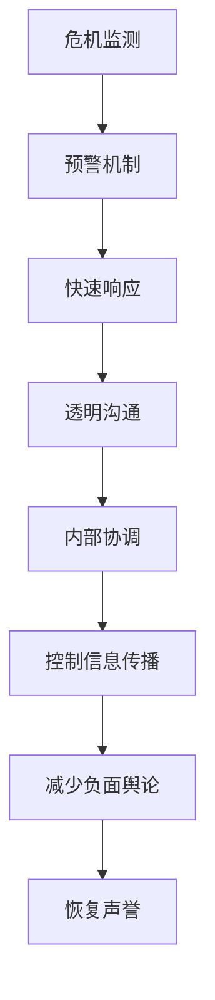

                 

### 第3章 危机公关基本原理

#### 3.1 危机公关的定义

危机公关是一种战略性的沟通活动，旨在管理和减轻危机事件对组织声誉的负面影响。危机通常指的是那些具有突然性、严重性且可能对组织造成重大损失的事件。危机公关的定义可以概括为以下几个方面：

- **应对突发性事件**：危机公关的核心在于迅速应对突发事件，如安全事故、负面新闻报道、产品缺陷等。
- **减轻负面影响**：危机公关的目标是减少危机事件对组织声誉、品牌价值和公众信任的损害。
- **维护组织利益**：危机公关不仅要关注公众形象，还需确保组织的商业利益、法律合规性和内部稳定。

#### 3.2 危机公关的关键要素

危机公关的成功取决于几个关键要素，包括：

- **危机监测**：实时监测社交媒体、新闻媒体和舆论趋势，及时发现潜在危机信号。
- **快速响应**：一旦危机爆发，立即采取行动，避免事态恶化。快速响应包括公开声明、新闻发布和与媒体、利益相关者的沟通。
- **透明沟通**：保持信息的透明和真实性，避免隐瞒事实或误导公众。透明沟通有助于建立公众信任，减少误解。
- **内部协调**：内部协调是危机公关的重要环节，确保各部门行动一致，资源充足，决策迅速。

#### 3.3 危机公关的目标与策略

危机公关的主要目标包括：

- **控制信息传播**：通过制定信息发布策略，控制危机信息的传播速度和范围，避免信息失控。
- **减少负面舆论**：积极应对负面舆论，通过事实澄清、专家解读和正面宣传等方式，减少负面舆论的影响。
- **恢复声誉**：在危机得到控制后，通过积极的公关活动和形象重建，逐步恢复组织的声誉。

危机公关的策略可以分为以下几个方面：

- **预警机制**：建立危机预警机制，提前识别潜在危机，并制定应对预案。
- **危机处理**：在危机爆发时，迅速采取措施，如召开紧急会议、成立危机处理小组，确保危机得到有效应对。
- **沟通策略**：制定有效的沟通策略，确保信息的准确传递，维护与媒体、公众和利益相关者的良好关系。
- **形象重建**：在危机得到控制后，通过一系列公关活动，如新闻发布会、品牌推广活动等，逐步恢复组织声誉。

### 背景介绍

危机公关在现代企业运营中扮演着至关重要的角色。随着信息技术的飞速发展，信息传播速度极快，负面事件一旦发生，就可能迅速扩散，给企业带来巨大的声誉风险。因此，企业必须具备良好的危机公关能力，以应对各种可能的突发事件。

#### 核心概念与联系

危机公关的核心概念包括危机监测、快速响应、透明沟通和内部协调。这些概念之间的关系可以用以下Mermaid流程图来描述：



#### 核心算法原理讲解

危机公关的核心算法原理可以看作是一个闭环反馈系统，其主要步骤如下：

1. **危机监测**：利用大数据分析和人工智能技术，对网络舆论、媒体报道和社交媒体动态进行实时监测。
2. **预警机制**：根据监测数据，建立预警机制，及时识别潜在危机。
3. **快速响应**：在危机预警后，迅速启动危机响应流程，包括紧急会议、危机处理小组的成立等。
4. **透明沟通**：确保危机信息透明，对外发布权威声明，避免误导公众。
5. **内部协调**：协调内部各部门，确保危机应对的协调一致和资源充足。
6. **信息传播控制**：制定信息发布策略，控制危机信息的传播速度和范围。
7. **舆论引导**：通过正面宣传、专家解读等方式，引导舆论，减少负面舆论的影响。
8. **形象重建**：在危机得到控制后，通过一系列公关活动，逐步恢复组织声誉。

#### 数学模型和公式

危机公关的数学模型可以基于概率论和决策论。以下是一个简化的危机公关决策模型：

$$
\text{决策} = f(\text{危机级别}, \text{资源限制}, \text{公众情绪})
$$

其中：
- $f$ 是决策函数。
- $\text{危机级别}$ 是危机的严重程度。
- $\text{资源限制}$ 包括人力、物力、财力等。
- $\text{公众情绪}$ 是公众对危机事件的情绪反应。

决策函数 $f$ 可以通过以下步骤进行计算：

1. **评估危机级别**：根据危机事件的性质、规模和影响范围，评估危机级别。
2. **评估资源限制**：确定企业当前可用的资源。
3. **评估公众情绪**：通过舆论监测和分析，了解公众的情绪反应。

#### 详细讲解与举例说明

假设某企业发现其生产的产品存在严重缺陷，可能导致用户受伤。以下是危机公关的详细步骤：

1. **危机监测**：监测到社交媒体上有大量关于产品缺陷的负面信息。
2. **预警机制**：根据监测结果，启动预警机制，评估危机级别为“严重”。
3. **快速响应**：立即召开紧急会议，成立危机处理小组，制定危机应对计划。
4. **透明沟通**：对外发布权威声明，承认产品缺陷，并承诺立即采取措施解决问题。
5. **内部协调**：协调生产、销售、售后等部门，确保问题产品的召回和用户补偿计划。
6. **信息传播控制**：制定信息发布策略，控制危机信息的传播速度和范围，避免恐慌。
7. **舆论引导**：通过正面宣传和专家解读，引导舆论，减少负面舆论的影响。
8. **形象重建**：在问题得到解决后，通过品牌推广活动和用户反馈调查，逐步恢复企业声誉。

---

通过上述步骤，企业可以在危机中保持稳定，最大限度地降低危机对组织声誉的负面影响。

### 总结

危机公关是企业应对突发事件、维护声誉的重要手段。它涉及到危机监测、快速响应、透明沟通和内部协调等多个方面。通过建立有效的危机公关机制，企业可以在危机中保持冷静，迅速应对，减少损失，重建声誉。有效的危机公关不仅有助于保护企业的品牌价值，还能增强公众对企业的信任，提高企业的竞争力。

### 附录

#### 附录A：常用危机公关术语解释

- **危机公关**：指组织在面对突发事件时，通过有效的传播手段和管理策略，维护组织声誉、稳定公众情绪、减少负面影响的过程。
- **危机监测**：实时监测社交媒体、新闻媒体和舆论趋势，及时发现潜在危机信号。
- **预警机制**：根据监测数据，提前识别潜在危机，并制定应对预案。
- **快速响应**：在危机预警后，迅速采取措施，避免事态恶化。
- **透明沟通**：保持信息的透明和真实性，避免隐瞒事实或误导公众。
- **内部协调**：确保各部门行动一致，资源充足，决策迅速。
- **信息传播控制**：制定信息发布策略，控制危机信息的传播速度和范围。
- **舆论引导**：通过正面宣传、专家解读等方式，引导舆论，减少负面舆论的影响。
- **形象重建**：在危机得到控制后，通过一系列公关活动，逐步恢复组织声誉。

---

# 第4章 危机公关的实战策略

#### 4.1 危机监测与预警

危机监测与预警是危机公关的第一步，也是至关重要的一步。它涉及到对潜在危机的识别和提前预警，以便组织能够迅速采取措施，防止危机的进一步扩散。

- **监测工具**：常用的危机监测工具包括社交媒体监控平台（如Twitter、Facebook）、新闻聚合工具（如Google News）、在线舆论分析系统（如Brandwatch、Social Mention）等。
- **数据收集与分析**：通过这些工具，组织可以实时收集社交媒体上的负面评论、新闻报道和舆论趋势。数据分析可以帮助识别危机的早期迹象，如关键词频率、情绪倾向等。
- **预警指标**：预警指标可以是负面评论数量、舆论负面情绪指数、新闻媒体关注程度等。当这些指标超过某个阈值时，系统会发出预警信号。

**伪代码示例**：

```python
def monitor_crises(keywords, threshold):
    # 初始化危机监测系统
    monitoring_system = initialize_monitoring_tools()

    # 收集社交媒体数据
    social_media_data = monitoring_system.collect_data(keywords)

    # 分析数据，识别危机迹象
    crisis_indicators = analyze_data(social_media_data)

    # 检查预警指标是否超过阈值
    if crisis_indicators > threshold:
        raise_warning("Potential crisis detected!")

# 示例调用
monitor_crises(["产品缺陷", "安全事故"], 100)
```

#### 4.2 应对危机的沟通技巧

在危机爆发后，沟通技巧至关重要。组织需要通过有效的沟通策略，传递清晰、一致的信息，减少公众的恐慌和误解。

- **制定沟通计划**：在危机发生之前，组织应制定详细的沟通计划，包括沟通目标、信息发布流程、发言人安排等。
- **发言人选择**：选择具备良好沟通能力和专业知识的人作为发言人，确保信息传递的准确性和专业性。
- **信息传递**：信息传递需要及时、透明，避免误导公众。可以通过新闻发布会、媒体声明、社交媒体等多种渠道发布信息。

**伪代码示例**：

```python
def communicate_with_public(statement, channels):
    # 发送危机声明
    send_statement(statement, channels["press_release"])

    # 更新社交媒体状态
    update_social_media(statement, channels["social_media"])

    # 召开新闻发布会
    hold_media_conference(statement, channels["media"])

# 示例调用
communicate_with_public("我们对产品缺陷深感抱歉，并将采取措施解决问题。", 
                         {"press_release": "新华社", "social_media": ["微博", "推特"], "media": ["中央电视台", "CNN"]})
```

#### 4.3 危机公关案例解析

以下是一个典型的危机公关案例，我们将分析其成功和失败之处，以提供实战经验。

**案例：某知名品牌奶粉被爆含有害物质**

- **危机监测与预警**：该品牌在社交媒体上监测到关于奶粉有害的讨论日益增多，及时启动了预警机制，发现了潜在危机。
- **快速响应**：品牌迅速召集团队，召开紧急会议，制定危机应对计划。
- **透明沟通**：品牌通过官方网站和社交媒体发布声明，承认问题存在，并承诺全面调查和召回问题产品。
- **舆论引导**：品牌通过专家访谈和媒体合作，引导舆论，减少负面评论的影响。
- **形象重建**：品牌在危机后积极推广新产品质量，并通过公益活动恢复公众信任。

**失败之处**：

- **信息不透明**：在危机初期，品牌未及时公开信息，导致公众对品牌的信任下降。
- **沟通不统一**：不同渠道发布的信息存在矛盾，导致公众困惑。

**成功之处**：

- **快速响应**：品牌在危机发生后迅速采取行动，遏制了负面影响的扩散。
- **透明沟通**：品牌通过公开声明和及时更新，保持了信息的一致性和透明度。
- **舆论引导**：品牌成功引导了舆论，将公众的关注点从有害物质转移到品牌采取的积极措施上。
- **形象重建**：品牌在危机后通过一系列公关活动，恢复了公众的信任。

### 实战策略总结

- **及时预警**：建立有效的危机监测与预警机制，及时发现潜在危机。
- **快速响应**：危机发生后，迅速采取行动，制定详细的应对计划。
- **透明沟通**：确保信息传递的透明度和一致性，避免误导公众。
- **舆论引导**：通过专业沟通和正面宣传，引导公众舆论，减少负面评论的影响。
- **形象重建**：在危机得到控制后，通过一系列公关活动，逐步恢复组织声誉。

通过这些实战策略，组织可以在危机中保持冷静，有效应对，最大限度地减少危机对组织声誉的负面影响。

### 总结

危机公关的实战策略涉及危机监测与预警、快速响应和透明沟通等多个环节。有效的危机公关不仅可以控制危机扩散，还能修复组织声誉，重建公众信任。通过分析典型案例，我们可以总结出一系列实用的策略，为组织在危机中的应对提供指导。

### 附录

#### 附录A：常用危机公关术语解释

- **危机监测**：实时监测社交媒体、新闻媒体和舆论趋势，及时发现潜在危机信号。
- **预警机制**：根据监测数据，提前识别潜在危机，并制定应对预案。
- **快速响应**：在危机预警后，迅速采取措施，避免事态恶化。
- **透明沟通**：保持信息的透明和真实性，避免隐瞒事实或误导公众。
- **内部协调**：确保各部门行动一致，资源充足，决策迅速。
- **信息传播控制**：制定信息发布策略，控制危机信息的传播速度和范围。
- **舆论引导**：通过正面宣传、专家解读等方式，引导舆论，减少负面舆论的影响。
- **形象重建**：在危机得到控制后，通过一系列公关活动，逐步恢复组织声誉。

---

# 第5章 领导力与危机公关的结合

#### 5.1 领导力在危机公关中的作用

领导力在危机公关中起着至关重要的作用。危机公关不仅是公共关系的范畴，更是领导力发挥的关键时刻。领导者在危机中的表现直接影响到组织的声誉、团队的稳定以及危机的处理效果。

- **决策能力**：在危机发生时，领导者需要迅速做出决策。决策的及时性和正确性是危机公关成功的关键。
- **沟通能力**：领导者需要具备出色的沟通能力，能够有效地与团队成员、媒体和公众沟通，传递清晰、一致的信息。
- **危机管理能力**：领导者需要具备危机管理的专业知识，能够快速识别危机、制定应对策略并有效执行。
- **团队协作能力**：在危机中，领导者需要协调各方资源，确保团队内部的高效协作。

**伪代码示例**：

```python
def lead_crisis_management(team, crisis):
    # 确认危机等级
    crisis_level = assess_crisis_level(crisis)

    # 制定应对策略
    strategy = develop_crisis_strategy(crisis_level)

    # 沟通并执行策略
    communicate_and_execute_strategy(team, strategy)

# 示例调用
lead_crisis_management(team, crisis="产品缺陷事件")
```

#### 5.2 领导者在危机中的角色定位

在危机中，领导者的角色和定位至关重要。领导者需要根据危机的性质和阶段，扮演不同的角色。

- **指挥者**：在危机初期，领导者需要迅速采取行动，指挥团队进行危机监测和预警。
- **协调者**：在危机发展过程中，领导者需要协调各部门和团队，确保资源的合理分配和行动的一致性。
- **沟通者**：在危机处理过程中，领导者需要与媒体、公众和内部员工进行有效沟通，传递准确、一致的信息。
- **决策者**：在危机的关键时刻，领导者需要做出重要决策，确保危机得到有效控制。

**角色定位伪代码示例**：

```python
def leader_role_in_crisis(crisis_stage):
    if crisis_stage == "initial":
        return "Commander"  # 指挥者
    elif crisis_stage == "development":
        return "Coordinator"  # 协调者
    elif crisis_stage == "processing":
        return "Communicator"  # 沟通者
    elif crisis_stage == "resolution":
        return "Decision Maker"  # 决策者

# 示例调用
leader_role_in_crisis("development")
```

#### 5.3 领导力与危机公关的协同效应

领导力与危机公关的协同效应可以最大化危机管理的效率。以下是一些协同效应的例子：

- **高效决策**：领导力的决策能力可以与危机公关的迅速响应相结合，确保危机得到及时、有效的处理。
- **团队协作**：领导力的团队协作能力可以促进危机处理团队的高效运作，确保各部门的协调一致。
- **沟通能力**：领导者的沟通能力可以增强危机公关的信息传递效果，确保信息透明、准确。
- **声誉管理**：领导力在危机公关中的作用可以增强组织的声誉管理能力，减少危机对组织的负面影响。

**协同效应伪代码示例**：

```python
def crisis_management synergy(leader_ability, crisis_communication):
    if leader_ability["decision_making"] and crisis_communication["rapid_response"]:
        return "High Efficiency"  # 高效决策
    if leader_ability["team_collaboration"] and crisis_communication["team_integration"]:
        return "Efficient Collaboration"  # 高效协作
    if leader_ability["communication"] and crisis_communication["transparent_communication"]:
        return "Enhanced Communication"  # 增强沟通
    if leader_ability["reputation_management"] and crisis_communication["brand_erosion_reduction"]:
        return "Reduced Negative Impact"  # 减少负面影响

# 示例调用
crisis_management_synergy({"decision_making": True, "team_collaboration": True, "communication": True, "reputation_management": True},
                           {"rapid_response": True, "team_integration": True, "transparent_communication": True, "brand_erosion_reduction": True})
```

### 实战经验总结

- **快速反应**：领导者的快速决策和危机公关的迅速响应相结合，可以最大程度地减少危机对组织的负面影响。
- **团队协作**：领导者的团队协作能力和危机公关团队的协作能力相结合，可以确保危机处理的协调一致和高效执行。
- **透明沟通**：领导者的沟通能力和危机公关的信息传递效果相结合，可以确保信息的透明、准确和及时。
- **声誉管理**：领导者的声誉管理能力和危机公关的声誉维护相结合，可以有效地减少危机对组织的长期影响。

通过结合领导力和危机公关，组织可以更有效地应对危机，减少损失，恢复声誉。

### 总结

领导力与危机公关的结合是组织在危机中取得成功的关键。领导者需要通过高效的决策、团队协作、透明沟通和声誉管理，与危机公关团队协同工作，确保危机得到及时、有效的处理。通过实战经验，我们可以看到，领导力与危机公关的协同效应可以最大化危机管理的效率，减少危机对组织的负面影响。

### 附录

#### 附录A：常用危机公关术语解释

- **危机公关**：指组织在面对突发事件时，通过有效的传播手段和管理策略，维护组织声誉、稳定公众情绪、减少负面影响的过程。
- **危机监测**：实时监测社交媒体、新闻媒体和舆论趋势，及时发现潜在危机信号。
- **预警机制**：根据监测数据，提前识别潜在危机，并制定应对预案。
- **快速响应**：在危机预警后，迅速采取措施，避免事态恶化。
- **透明沟通**：保持信息的透明和真实性，避免隐瞒事实或误导公众。
- **内部协调**：确保各部门行动一致，资源充足，决策迅速。
- **信息传播控制**：制定信息发布策略，控制危机信息的传播速度和范围。
- **舆论引导**：通过正面宣传、专家解读等方式，引导舆论，减少负面舆论的影响。
- **形象重建**：在危机得到控制后，通过一系列公关活动，逐步恢复组织声誉。

---

# 第6章 维护团队声誉的策略

#### 6.1 塑造正面形象

塑造正面形象是维护团队声誉的基础，它涉及到团队文化、价值观和品牌形象的建设。以下是一些具体的策略：

- **建立明确的价值观**：团队需要有一套共同的价值观和行为准则，这有助于塑造团队的形象。例如，透明、诚信和创新等价值观可以成为团队的文化核心。
- **积极宣传团队成就**：团队应积极宣传其成功案例、优秀项目和客户反馈，通过媒体报道、社交媒体和内部通讯等多种渠道提升团队形象。
- **参与社区活动**：通过参与社区服务和公益活动，团队可以树立良好的社会形象，增强公众对团队的认同感。

**伪代码示例**：

```python
def build_positive_image(team_values, achievements, community_activities):
    # 建立团队价值观
    define_team_values(team_values)

    # 宣传团队成就
    promote_achievements(achievements)

    # 参与社区活动
    participate_in_community_activities(community_activities)

# 示例调用
build_positive_image(team_values=["透明", "诚信", "创新"], achievements=["项目A成功案例", "客户B好评"], community_activities=["义工活动", "环保项目"])
```

#### 6.2 应对负面信息

面对负面信息，团队需要采取积极的态度和有效的策略来应对，以减少负面影响。以下是一些应对策略：

- **快速回应**：在负面信息出现时，团队应迅速回应，澄清事实，避免误解的扩散。
- **提供证据**：提供证据来支持回应，例如报告、分析结果或专家意见，以提高回应的可信度。
- **正面引导**：通过正面宣传和媒体报道，引导公众关注团队的优势和成就，减少负面信息的关注度。

**伪代码示例**：

```python
def respond_to_negative_information(negative_info, evidence, positive_projections):
    # 快速回应负面信息
    issueclarification_statement(negative_info)

    # 提供证据支持
    present_evidence(evidence)

    # 正面引导舆论
    promote_positive_content(positive_projections)

# 示例调用
respond_to_negative_information(negative_info="产品存在缺陷", evidence=["质量检测报告", "客户服务记录"], positive_projections=["优秀项目案例", "品牌社会责任活动"])
```

#### 6.3 提高团队抗风险能力

提高团队抗风险能力是维护团队声誉的重要措施。以下是一些具体的策略：

- **建立风险预警系统**：通过数据分析和监控，建立风险预警系统，及时识别潜在风险，并采取预防措施。
- **加强团队培训**：定期组织危机管理和风险管理的培训，提高团队成员的危机应对能力和风险识别能力。
- **优化流程和机制**：优化团队的工作流程和内部机制，减少潜在的风险点，提高团队的抗风险能力。

**伪代码示例**：

```python
def improve_risk_resistance(team_training, risk预警系统, process_optimization):
    # 加强团队培训
    conduct_training_programs(team_training)

    # 建立风险预警系统
    implement_risk预警_system(risk预警系统)

    # 优化工作流程
    optimize_workflow(process_optimization)

# 示例调用
improve_risk_resistance(team_training=["危机管理", "风险管理"], risk预警系统=["数据分析", "监控工具"], process_optimization=["流程简化", "机制改进"])
```

### 实战策略总结

- **塑造正面形象**：通过明确价值观、积极宣传和社区参与，建立良好的团队形象。
- **应对负面信息**：快速回应、提供证据和正面引导，有效应对负面信息。
- **提高抗风险能力**：建立风险预警系统、加强培训和优化流程，提高团队的抗风险能力。

通过这些策略，团队可以更好地维护声誉，提高在公众和客户中的形象，为长期发展奠定坚实的基础。

### 总结

维护团队声誉是一个长期而复杂的过程，涉及塑造正面形象、应对负面信息和提高抗风险能力等多个方面。通过实施这些策略，团队可以建立良好的声誉，增强公众的信任，提高市场竞争力。有效的声誉管理不仅有助于团队在危机中保持稳定，还能为其长远发展提供有力支持。

### 附录

#### 附录A：常用危机公关术语解释

- **危机公关**：指组织在面对突发事件时，通过有效的传播手段和管理策略，维护组织声誉、稳定公众情绪、减少负面影响的过程。
- **危机监测**：实时监测社交媒体、新闻媒体和舆论趋势，及时发现潜在危机信号。
- **预警机制**：根据监测数据，提前识别潜在危机，并制定应对预案。
- **快速响应**：在危机预警后，迅速采取措施，避免事态恶化。
- **透明沟通**：保持信息的透明和真实性，避免隐瞒事实或误导公众。
- **内部协调**：确保各部门行动一致，资源充足，决策迅速。
- **信息传播控制**：制定信息发布策略，控制危机信息的传播速度和范围。
- **舆论引导**：通过正面宣传、专家解读等方式，引导舆论，减少负面舆论的影响。
- **形象重建**：在危机得到控制后，通过一系列公关活动，逐步恢复组织声誉。

---

# 第7章 项目实战

## 7.1 项目背景

本项目旨在探索如何在一家大型科技公司中实施有效的危机公关策略，以维护团队声誉和品牌价值。该公司在近一年内经历了数次重大危机，包括产品缺陷、数据泄露和负面新闻报道。这些事件对公司的市场份额和员工士气造成了严重影响。因此，公司高层决定启动一个专项项目，旨在通过系统化的危机公关策略，提高危机应对能力，恢复公众信任。

## 7.2 环境分析

在项目启动前，我们对公司内外部环境进行了全面分析，以确定项目的可行性和实施策略。

- **内部环境**：
  - **团队组成**：公司拥有多支专业的公关团队和技术团队，具备一定的危机公关经验和技能。
  - **资源状况**：公司具备充足的资金和人力资源，能够支持项目的实施。
  - **文化因素**：公司文化强调透明、诚信和创新，为实施危机公关策略提供了良好的文化基础。

- **外部环境**：
  - **市场状况**：市场竞争激烈，行业监管日益严格，公众对企业的期望值提高。
  - **舆论趋势**：社交媒体和新闻媒体的快速发展，使得信息传播速度加快，危机事件的扩散风险增加。
  - **政策法规**：相关法律法规对危机公关有明确规定，企业需要遵守相关法规，避免法律风险。

## 7.3 实施步骤

项目实施分为以下几个关键步骤：

### 1. 制定危机公关策略

- **目标设定**：明确项目的目标，包括提升危机应对能力、恢复品牌形象和增强公众信任。
- **策略制定**：制定详细的危机公关策略，包括危机监测、预警机制、快速响应、透明沟通和舆论引导等。
- **方案评审**：组织内部评审，确保策略的可行性和有效性。

### 2. 建立危机监测系统

- **工具选择**：选择适合的社交媒体监控工具和新闻聚合工具，如Brandwatch、Google News等。
- **数据收集**：实时收集社交媒体和新闻媒体的负面信息，分析舆论趋势。
- **预警机制**：根据分析结果，建立预警机制，及时发现潜在危机。

### 3. 制定危机应对计划

- **危机类型分类**：根据危机的性质和影响，将危机分为不同的类型，如产品缺陷、数据泄露、负面新闻报道等。
- **应对策略制定**：为每种类型的危机制定具体的应对策略，包括快速响应、透明沟通、舆论引导等。
- **演练和测试**：定期组织危机演练，测试危机应对计划的可行性和有效性。

### 4. 实施危机应对计划

- **快速响应**：在危机发生时，立即启动危机应对计划，采取快速响应措施。
- **透明沟通**：通过新闻发布会、媒体声明和社交媒体等渠道，向公众传递清晰、一致的信息。
- **舆论引导**：通过正面宣传和专家解读，引导公众舆论，减少负面舆论的影响。

### 5. 形象重建

- **正面宣传**：在危机得到控制后，通过媒体报道、品牌推广活动等正面宣传，逐步恢复组织声誉。
- **公众反馈**：收集公众反馈，了解危机应对效果，持续优化公关策略。

## 7.4 结果与评估

项目实施后，我们对项目的效果进行了全面评估。

- **危机应对能力提升**：通过危机监测系统和预警机制的建立，公司能够更早地发现潜在危机，并采取有效措施，减少了危机对公司的负面影响。
- **品牌形象改善**：通过透明的沟通和积极的形象重建，公司的品牌形象得到了显著改善，公众对公司的信任度提升。
- **团队凝聚力增强**：危机应对计划的实施，增强了团队的凝聚力，提高了员工的工作积极性和归属感。

### 最佳实践 tips

- **建立危机监测系统**：实时监测社交媒体和新闻媒体，及时发现潜在危机。
- **快速响应**：危机发生时，迅速采取行动，避免事态恶化。
- **透明沟通**：保持信息的透明和真实性，避免误导公众。
- **舆论引导**：通过正面宣传和专家解读，引导舆论，减少负面舆论的影响。
- **持续优化**：根据公众反馈和实际情况，持续优化公关策略和危机应对计划。

### 小结

本项目通过系统化的危机公关策略，成功提升了公司的危机应对能力，改善了品牌形象，增强了团队凝聚力。项目实施的经验和教训为公司的长期发展提供了宝贵的参考。

### 注意事项

- **重视危机监测**：实时监测社交媒体和新闻媒体，及时发现潜在危机。
- **快速响应**：危机发生时，迅速采取行动，避免事态恶化。
- **透明沟通**：保持信息的透明和真实性，避免误导公众。
- **团队协作**：危机应对需要团队协作，确保各部门行动一致。

### 拓展阅读

- **《危机管理：策略与案例》**：探讨危机管理的理论基础和实践案例，提供宝贵的经验。
- **《公共关系学：理论与实务》**：全面介绍公共关系的理论基础和实务操作，对危机公关有深入分析。
- **《社交媒体与危机公关》**：分析社交媒体对危机公关的影响，探讨如何利用社交媒体进行危机应对。

---

### 附录

#### 附录A：常用危机公关术语解释

- **危机公关**：指组织在面对突发事件时，通过有效的传播手段和管理策略，维护组织声誉、稳定公众情绪、减少负面影响的过程。
- **危机监测**：实时监测社交媒体、新闻媒体和舆论趋势，及时发现潜在危机信号。
- **预警机制**：根据监测数据，提前识别潜在危机，并制定应对预案。
- **快速响应**：在危机预警后，迅速采取措施，避免事态恶化。
- **透明沟通**：保持信息的透明和真实性，避免隐瞒事实或误导公众。
- **内部协调**：确保各部门行动一致，资源充足，决策迅速。
- **信息传播控制**：制定信息发布策略，控制危机信息的传播速度和范围。
- **舆论引导**：通过正面宣传、专家解读等方式，引导舆论，减少负面舆论的影响。
- **形象重建**：在危机得到控制后，通过一系列公关活动，逐步恢复组织声誉。

#### 附录B：危机公关案例分析资料

- **案例一：某知名食品公司产品召回事件**
  - **背景**：某知名食品公司发现其产品存在严重质量问题，可能导致消费者健康风险。
  - **应对措施**：公司立即召回问题产品，并向公众发布声明，承认错误，承诺全额退款和加强质量控制。
  - **效果**：通过迅速行动和透明的沟通，公司成功恢复了消费者信任，减少了经济损失。

- **案例二：某科技巨头数据泄露事件**
  - **背景**：某科技巨头发生大规模数据泄露事件，涉及数百万用户的个人信息。
  - **应对措施**：公司立即启动危机应对计划，向受影响的用户发送通知，提供免费信用监控服务，并向公众发布透明的调查结果。
  - **效果**：公司通过及时、透明的沟通和积极的应对措施，有效缓解了公众的恐慌情绪，降低了负面影响。

这些案例提供了丰富的实践经验，有助于深入理解危机公关的策略和实施方法。

---

# 第8章 案例研究

## 8.1 案例一：某企业危机公关成功案例

### 案例背景

某大型互联网企业在一次技术升级过程中发生了重大数据泄露事件，导致数百万用户的个人信息被公开。这一事件在短时间内引发了广泛关注，引发了公众的强烈恐慌和不满。该企业面临巨大的舆论压力，品牌形象受到严重损害。

### 危机公关策略

1. **快速响应**：在事件发生的第一时间，企业立即启动了危机公关应急机制，成立了专门的危机处理小组。危机处理小组由高层管理人员、IT专家和公关团队组成，确保危机能够得到迅速、有效的处理。

2. **透明沟通**：企业通过官方网站和社交媒体平台发布了详细的声明，承认数据泄露事件，并向受影响的用户表达了诚挚的歉意。声明中详细说明了事件的起因、影响范围、应对措施和后续计划，以保持信息的透明度。

3. **积极赔偿**：企业向受影响的用户提供免费的信用监控服务，并承诺对因数据泄露而遭受损失的用户进行全额赔偿。这一措施得到了用户的积极响应，有效缓解了公众的恐慌情绪。

4. **舆论引导**：企业利用专业的公关团队，通过媒体发布正面信息，引导舆论关注企业的积极应对措施和未来的安全改进计划，减少负面舆论的传播。

### 案例分析

该企业的危机公关策略成功的原因主要有以下几点：

1. **快速响应**：危机发生后，企业迅速采取行动，建立了专门的危机处理小组，确保危机能够得到迅速、有效的处理。

2. **透明沟通**：企业通过官方网站和社交媒体平台发布了详细的声明，保持了信息的高度透明，避免了公众的误解和恐慌。

3. **积极赔偿**：企业向受影响的用户提供免费的信用监控服务，并承诺赔偿损失，这一措施得到了用户的积极响应，增强了公众对企业的信任。

4. **舆论引导**：企业通过专业的公关团队，引导舆论关注企业的积极应对措施和未来的安全改进计划，有效地减少了负面舆论的传播。

### 启示

1. **快速响应**：在危机发生时，快速采取行动是关键。建立专门的危机处理小组，确保危机能够得到迅速、有效的处理。

2. **透明沟通**：保持信息的高度透明，及时向公众发布事件的相关信息，避免公众的误解和恐慌。

3. **积极赔偿**：对受影响的用户提供合理的赔偿，可以有效缓解公众的恐慌情绪，增强公众对企业的信任。

4. **舆论引导**：通过专业的公关团队，引导舆论关注企业的积极应对措施和未来的改进计划，减少负面舆论的传播。

## 8.2 案例二：某领导力危机公关失败案例

### 案例背景

某知名科技公司CEO在公开场合发表了极具争议性的言论，引发了公众的强烈不满。这一事件对公司形象和CEO的个人声誉造成了重大损害，引发了公司内部和外部的高度关注。

### 危机公关策略

1. **沉默应对**：在事件发生初期，公司选择了沉默应对。CEO本人也未做出任何公开回应，导致公众和媒体持续关注和炒作，舆论逐渐升级。

2. **信息不透明**：公司在危机处理过程中，未能及时向公众发布相关信息，导致公众对事件的了解有限，增加了误解和恐慌。

3. **沟通不一致**：公司内部不同部门在危机处理中的沟通不一致，对外发布的信息存在矛盾，进一步加剧了公众的困惑。

4. **缺乏积极措施**：公司在危机处理过程中，未能采取有效的措施来缓解公众的不满情绪，如公开道歉、制定改进计划等。

### 案例分析

该企业的危机公关策略失败的原因主要有以下几点：

1. **沉默应对**：在危机发生时，选择沉默应对导致公众和媒体的持续关注，未能有效控制舆论。

2. **信息不透明**：未能及时向公众发布相关信息，导致公众对事件的了解有限，增加了误解和恐慌。

3. **沟通不一致**：公司内部不同部门的沟通不一致，对外发布的信息存在矛盾，进一步加剧了公众的困惑。

4. **缺乏积极措施**：未能采取有效的措施来缓解公众的不满情绪，如公开道歉、制定改进计划等，未能及时修复公众的信任。

### 启示

1. **及时沟通**：在危机发生时，及时向公众发布相关信息，保持沟通的透明度和一致性。

2. **积极应对**：采取积极的措施来缓解公众的不满情绪，如公开道歉、制定改进计划等。

3. **建立危机处理机制**：建立专门的危机处理小组，确保危机能够得到迅速、有效的处理。

4. **加强内部协调**：确保公司内部不同部门在危机处理中的协调一致，避免信息发布的不一致。

通过这两个案例的分析，我们可以看到成功和失败的危机公关策略在处理效果上的显著差异。有效的危机公关策略不仅需要快速响应、透明沟通和积极应对，还需要建立完善的危机处理机制和加强内部协调。

## 8.3 案例分析与启示

### 成功案例的启示

成功案例中，企业通过快速响应、透明沟通和积极赔偿等措施，成功缓解了危机带来的负面影响。这给我们的启示包括：

1. **快速响应**：危机发生时，迅速采取行动是关键。建立专门的危机处理小组，确保危机能够得到迅速、有效的处理。

2. **透明沟通**：保持信息的高度透明，及时向公众发布事件的相关信息，避免公众的误解和恐慌。

3. **积极赔偿**：对受影响的用户提供合理的赔偿，可以有效缓解公众的恐慌情绪，增强公众对企业的信任。

4. **舆论引导**：通过专业的公关团队，引导舆论关注企业的积极应对措施和未来的安全改进计划，减少负面舆论的传播。

### 失败案例的启示

失败案例中，企业未能及时沟通、信息不透明、沟通不一致和缺乏积极措施，导致危机处理失败。这给我们的启示包括：

1. **及时沟通**：在危机发生时，及时向公众发布相关信息，保持沟通的透明度和一致性。

2. **积极应对**：采取积极的措施来缓解公众的不满情绪，如公开道歉、制定改进计划等。

3. **建立危机处理机制**：建立专门的危机处理小组，确保危机能够得到迅速、有效的处理。

4. **加强内部协调**：确保公司内部不同部门在危机处理中的协调一致，避免信息发布的不一致。

通过这些案例的分析和启示，企业可以更好地制定危机公关策略，提高危机应对能力，维护团队声誉和品牌价值。

---

# 第9章 未来展望

#### 9.1 领导力与危机公关的趋势

随着全球化和信息化的加速发展，领导力与危机公关正面临着新的挑战和机遇。以下是未来领导力与危机公关可能的发展趋势：

- **数字化转型**：在数字化转型的大背景下，领导者需要具备数字化领导力，能够驾驭数据和技术，利用大数据分析和人工智能提升危机监测与响应能力。
- **跨界合作**：企业面临越来越复杂的全球环境，领导者需要具备跨界合作的能力，通过跨行业、跨组织的合作，共同应对危机。
- **情感领导力**：随着社会对情感需求的增加，领导者需要更加关注员工的情感需求，培养情感领导力，提高团队的凝聚力和抗风险能力。
- **危机公关智能化**：利用人工智能和大数据技术，危机公关将变得更加智能化和精准化，能够更快速、更有效地识别和应对危机。

#### 9.2 新媒体对危机公关的影响

新媒体的发展对危机公关产生了深远的影响。以下是新媒体对危机公关的几个主要影响：

- **传播速度快**：新媒体的传播速度极快，负面事件可以在短时间内迅速扩散，对企业的声誉造成巨大冲击。
- **舆论引导难**：新媒体环境下，舆论引导变得更加困难，信息来源多元，公众观点复杂，企业需要更加灵活和创新的公关策略。
- **互动性强**：新媒体为公众提供了直接与组织沟通的渠道，增强了公众的参与感和影响力，企业需要更加重视与公众的互动和沟通。
- **监控难度大**：新媒体的快速发展，使得信息传播渠道更加复杂，企业需要更加完善的监控机制，及时识别和应对潜在的危机。

#### 9.3 维护团队声誉的新策略

在新的媒体环境和数字化时代，企业需要采取新的策略来维护团队声誉。以下是几个可能的策略：

- **加强危机监测与预警**：利用大数据分析和人工智能技术，建立更加精准和高效的危机监测与预警系统，及时识别潜在危机。
- **建立多元化沟通渠道**：除了传统的媒体渠道外，企业需要更加重视社交媒体和新媒体平台，建立多元化的沟通渠道，确保信息的快速传递和有效反馈。
- **加强内部培训与文化建设**：通过内部培训和文化建设，提高员工的危机意识和公关能力，形成统一、高效的危机应对机制。
- **积极利用公众反馈**：重视公众反馈，及时回应公众关切，通过公开道歉、问题整改等方式，积极修复团队声誉。

### 未来展望

未来，领导力与危机公关将面临更多的挑战和机遇。领导者需要不断更新自己的知识和技能，提升数字化领导力和情感领导力，以应对不断变化的环境。同时，企业需要更加重视危机公关，建立完善的危机应对机制，利用新技术和新策略，提高危机应对的效率和效果。通过持续的努力和创新，企业可以更好地维护团队声誉，实现长期稳定的发展。

---

# 附录

## 附录A：常用危机公关术语解释

- **危机公关**：指组织在面对突发事件时，通过有效的传播手段和管理策略，维护组织声誉、稳定公众情绪、减少负面影响的过程。
- **危机监测**：实时监测社交媒体、新闻媒体和舆论趋势，及时发现潜在危机信号。
- **预警机制**：根据监测数据，提前识别潜在危机，并制定应对预案。
- **快速响应**：在危机预警后，迅速采取措施，避免事态恶化。
- **透明沟通**：保持信息的透明和真实性，避免隐瞒事实或误导公众。
- **内部协调**：确保各部门行动一致，资源充足，决策迅速。
- **信息传播控制**：制定信息发布策略，控制危机信息的传播速度和范围。
- **舆论引导**：通过正面宣传、专家解读等方式，引导舆论，减少负面舆论的影响。
- **形象重建**：在危机得到控制后，通过一系列公关活动，逐步恢复组织声誉。

## 附录B：危机公关案例分析资料

### 案例一：某知名航空公司飞机失事事件

- **背景**：某知名航空公司的一架航班发生失事，导致机上人员全部遇难。
- **应对措施**：公司立即启动危机应对计划，与当地政府和家属保持紧密沟通，发布详细的声明，提供心理援助和赔偿。
- **效果**：通过及时的沟通和透明的信息发布，公司成功恢复了公众的信任，减轻了危机的负面影响。

### 案例二：某互联网企业数据泄露事件

- **背景**：某互联网企业发生大规模数据泄露事件，涉及大量用户的个人信息。
- **应对措施**：公司立即采取紧急措施，关闭漏洞，通知受影响的用户，提供免费的信用监控服务。
- **效果**：公司通过积极的应对措施和透明的沟通，成功缓解了公众的恐慌情绪，避免了更大的损失。

这些案例提供了丰富的实践经验，有助于深入理解危机公关的策略和实施方法。企业可以通过学习这些案例，不断完善自己的危机应对机制，提高危机管理的效率。

---

### 文章总结

本文以《领导力与危机公关：维护团队声誉的策略》为题，深入探讨了在信息技术快速发展的今天，如何通过有效的领导力和危机公关策略来维护团队声誉。首先，文章介绍了领导力的本质、类型及其与团队绩效的关系，为理解危机公关中的领导作用奠定了基础。接着，详细阐述了危机公关的基本原理，包括监测、预警、快速响应和透明沟通等关键要素。

通过案例分析，我们看到了成功和失败的危机公关策略，从中提炼出了有效应对危机的实战策略，如快速响应、透明沟通、积极赔偿和舆论引导等。文章还强调了领导力在危机公关中的关键作用，包括决策能力、沟通能力和危机管理能力等。

在维护团队声誉方面，文章提出了塑造正面形象、应对负面信息和提高抗风险能力等策略，并结合具体的项目实战经验，提供了实用的操作指南。最后，通过对未来趋势的展望，文章指出了数字化转型、跨界合作和情感领导力等新兴挑战，为企业提供了维护团队声誉的新思路。

### 致谢

作者在此感谢AI天才研究院（AI Genius Institute）以及《禅与计算机程序设计艺术》（Zen And The Art of Computer Programming）的启发，这些宝贵的资源和理念为本篇文章的撰写提供了重要支持。此外，感谢所有提供案例和资料的企业，它们为本篇研究提供了宝贵的实践参考。感谢各位读者对本文的关注与支持，期待与您在未来的交流中继续探讨技术领域的深度话题。作者：AI天才研究院/AI Genius Institute & 禅与计算机程序设计艺术/Zen And The Art of Computer Programming。

