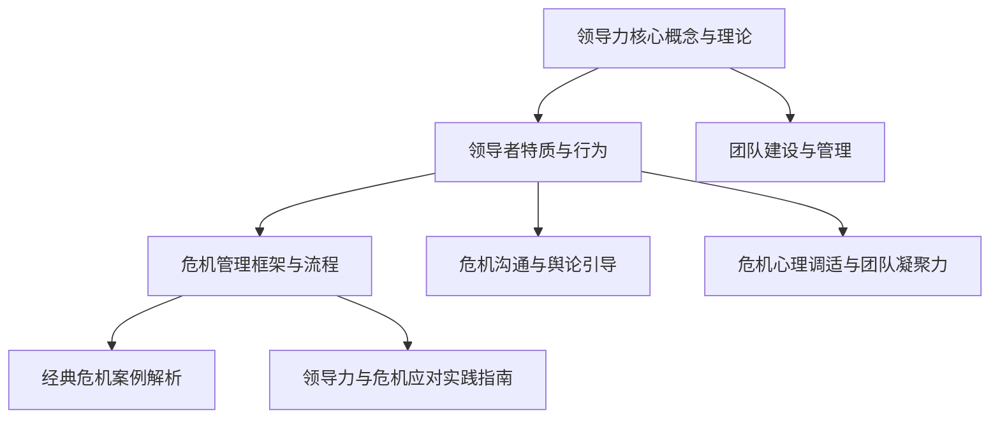

                 

### 文章标题

“领导力与危机应对：在逆境中凝聚团队”

### 关键词

领导力、危机应对、团队凝聚力、逆境管理、决策过程、沟通策略

### 摘要

在复杂多变的IT行业，领导力与危机应对能力是决定团队成败的关键因素。本文将深入探讨领导力的核心概念与理论、领导者的特质与行为模式、团队建设与管理，以及危机应对策略的框架与实施。通过案例分析、实践指南和数学模型讲解，本文旨在为IT领域的领导者提供一套系统、实用的领导力与危机应对方案，助力团队在逆境中保持稳定与成长。

---

### 第一部分：领导力基础

#### 1.1 领导力核心概念与理论

**定义与重要性**

领导力是指通过影响、激励和指导他人，共同实现目标的能力。在IT行业，领导力不仅关乎技术实力，更关乎团队协作和问题解决。有效的领导力能够促进创新、提高生产力、增强团队凝聚力，从而在竞争激烈的市场中取得优势。

**发展与培养**

领导力并非与生俱来，而是可以通过实践和学习不断提升的。领导者需要具备自我认知、情绪管理、目标设定、决策能力等关键技能。此外，领导力的发展还需经历多个阶段，包括依赖领导、亲和领导、变革领导和战略领导。

**理论综述**

- **情境理论**：领导者的风格应根据不同情境进行调整，以实现最佳效果。
- **领导风格理论**：不同的领导风格（如民主式、权威式、参与式等）适用于不同类型的团队和任务。
- **变革型领导**：通过激发团队成员的内在动机和愿景，推动团队实现变革和成长。

#### 1.2 领导者特质与行为

**领导者必备特质**

- **决断力**：在关键时刻能够做出快速、准确的决策。
- **沟通能力**：有效地传递信息、倾听意见、解决冲突。
- **责任感**：对团队和组织的成功负总责，勇于承担风险和责任。
- **创新精神**：持续寻求改进和创新，推动团队突破传统限制。

**领导者的行为模式与决策过程**

- **目标设定**：明确团队愿景和目标，制定可实现的具体计划。
- **资源管理**：合理配置人力、物力、财力等资源，确保团队运作顺畅。
- **激励与反馈**：通过激励机制和及时反馈，激发团队成员的积极性和创造力。
- **冲突管理**：处理团队内部冲突，维护团队和谐。

**领导力评估与反馈机制**

- **自我评估**：定期反思自己的领导行为和效果，识别需要改进的领域。
- **360度反馈**：通过团队成员、上级和其他利益相关者的评价，全面了解自己的领导力状况。
- **持续改进**：基于反馈结果，制定改进计划，不断提升领导力水平。

#### 1.3 团队建设与管理

**团队角色的理解与搭配**

- **团队成员的角色定位**：明确每个成员的职责和角色，确保团队运作高效。
- **团队角色的互补性**：通过角色互补，发挥团队整体优势，提高协作效率。

**团队沟通技巧与冲突管理**

- **沟通策略的选择与运用**：根据不同场景选择适当的沟通方式，确保信息准确传达。
- **冲突管理**：积极处理冲突，避免负面情绪蔓延，促进团队和谐。

**团队激励与绩效考核**

- **激励机制的设计**：建立合理的激励机制，激发团队成员的工作热情和创造力。
- **绩效考核**：通过科学、公正的绩效考核体系，激励团队成员持续提升绩效。

---

### 第二部分：危机应对策略

#### 2.1 危机管理框架与流程

**危机管理的概念与原则**

- **危机管理**：指在危机发生前、中、后期采取的一系列应对措施，以减轻危机对企业的影响。
- **原则**：预防为主、及时响应、信息透明、合作应对。

**危机识别与评估**

- **危机识别**：通过预警机制、情报收集等手段，及时发现潜在的危机。
- **危机评估**：评估危机的性质、严重程度和影响范围，为应对决策提供依据。

**应急预案与资源调配**

- **应急预案**：根据危机类型和特点，制定详细的应对预案。
- **资源调配**：在危机发生时，迅速调动人力、物力、财力等资源，确保应对措施的有效实施。

#### 2.2 危机沟通与舆论引导

**沟通策略的选择与运用**

- **内部沟通**：确保团队内部信息畅通，提高应对危机的协同效率。
- **外部沟通**：与利益相关者保持良好沟通，降低外部压力，维护企业形象。

**舆论引导技巧**

- **主动发声**：在危机爆发时，及时发布权威信息，抢占舆论主动权。
- **回应策略**：针对不同舆论反应，采取相应的回应策略，避免负面信息扩散。

**媒体沟通与信息披露**

- **媒体沟通**：与媒体建立良好关系，确保信息传递的准确性和及时性。
- **信息披露**：在符合法律法规的前提下，及时、透明地披露相关信息，增强公众信任。

#### 2.3 危机心理调适与团队凝聚力

**应对危机的心理准备**

- **心理调适**：通过心理辅导、团队建设等活动，帮助团队成员应对危机带来的心理压力。
- **心理准备**：提前做好心理准备，增强面对危机的信心和勇气。

**心理调适方法与技巧**

- **认知重构**：通过改变负面思维模式，提升应对危机的积极心态。
- **情绪调节**：运用深呼吸、放松训练等方法，缓解紧张情绪，保持冷静。
- **互助支持**：建立互助小组，通过分享经验和情感支持，共同应对危机。

**提升团队凝聚力的策略**

- **共同目标**：明确团队共同目标，增强团队凝聚力和向心力。
- **团队协作**：通过协同工作，培养团队默契，提升团队整体执行力。
- **文化建设**：建立积极向上的团队文化，增强团队成员的归属感和认同感。

---

### 第三部分：案例解析与实践指导

#### 3.1 经典危机案例解析

**案例1：某知名科技公司数据泄露事件**

- **危机背景**：公司发生数据泄露，涉及大量客户信息。
- **危机处理**：公司迅速启动应急预案，开展调查和补救措施，同时与相关部门和客户保持沟通，积极回应舆论关切。
- **成功经验**：及时响应、透明沟通、积极补救，赢得了客户的信任，并促进了内部安全管理提升。

**案例2：某初创公司资金链断裂**

- **危机背景**：公司因市场环境变化，面临资金链断裂风险。
- **危机处理**：公司通过紧急融资、业务重组和成本控制等措施，成功渡过危机，并实现了业务转型。
- **成功经验**：灵活应对市场变化、及时调整战略，展现了领导者的决策能力和危机应对能力。

#### 3.2 领导力与危机应对实践指南

**实际操作步骤与技巧**

- **危机预防**：建立危机预警机制，提前识别潜在风险。
- **危机应对**：制定应急预案，明确责任分工，确保应对措施快速、有效。
- **危机恢复**：在危机结束后，总结经验教训，持续改进和提升应对能力。

**领导力与危机应对的工具与方法**

- **情景模拟**：通过模拟不同危机场景，检验和提升领导者的应对能力。
- **案例分析**：学习经典危机案例，汲取成功经验，避免重复错误。
- **团队培训**：定期开展危机应对培训，提升团队的整体应对水平。

**案例分析与模拟演练**

- **案例分析**：对实际案例进行深入分析，探讨应对策略的优劣。
- **模拟演练**：通过模拟演练，检验团队应对危机的能力，发现和改进不足。

---

### 附录

#### 3.3 领导力与危机应对资源

**相关书籍与文献推荐**

- **《领导力》(Leadership) by John C. Maxwell**
- **《危机管理》(Crisis Management) by Gerard J. Kirwan and Ian Mitroff**
- **《团队协作的艺术》(The Art of Collaboration) by Katrin Muff and Christian Seifert**

**在线课程与培训资源**

- **Coursera - Leadership and Management Specialization**
- **edX - Effective Crisis Management**
- **Udemy - Crisis Communication & Management: A Step-by-Step Guide**

**领导力与危机应对实践案例库**

- **IBM Crisis Management Community**
- **Microsoft Crisis Response Resources**
- **Google Crisis Response Team**

---

### Mermaid 流程图



### 核心算法原理讲解（伪代码）

```python
# 伪代码：危机评估算法
def assess_crisis(crisis_data):
    """
    对危机进行评估，返回危机等级和应对策略。
    :param crisis_data: 危机数据，包括事件类型、影响范围、严重程度等。
    :return: (crisis_level, response_strategy)
    """
    # 根据危机数据计算危机等级
    crisis_level = calculate_crisis_level(crisis_data)

    # 根据危机等级制定应对策略
    response_strategy = define_response_strategy(crisis_level)

    return crisis_level, response_strategy

# 伪代码：危机等级计算函数
def calculate_crisis_level(crisis_data):
    """
    计算危机等级。
    :param crisis_data: 危机数据。
    :return: 危机等级。
    """
    # 根据事件类型、影响范围、严重程度等因素计算危机等级
    # 等级分为：低、中、高、特别严重
    level = "low"  # 初始化危机等级为低
    
    # 计算过程略
    # ...

    return level

# 伪代码：应对策略定义函数
def define_response_strategy(crisis_level):
    """
    根据危机等级定义应对策略。
    :param crisis_level: 危机等级。
    :return: 应对策略。
    """
    # 根据危机等级选择不同的应对策略
    if crisis_level == "low":
        strategy = "预警与监控"
    elif crisis_level == "medium":
        strategy = "紧急应对与协调"
    elif crisis_level == "high":
        strategy = "全面应急与资源调配"
    else:  # "特别严重"
        strategy = "最高级别应急与舆论引导"

    return strategy
```

### 数学模型和数学公式详细讲解

#### 

在危机应对过程中，数学模型和数学公式可以帮助我们更科学地评估危机等级和制定应对策略。以下是一个简单的数学模型，用于评估危机等级：

$$
\text{危机等级} = \text{影响范围} \times \text{严重程度} \times \text{应急响应能力}
$$

其中，影响范围、严重程度和应急响应能力分别代表危机的三个关键因素。我们可以通过以下公式对它们进行量化：

1. **影响范围**：

$$
\text{影响范围} = \frac{\text{受影响的人数}}{\text{总人数}}
$$

2. **严重程度**：

$$
\text{严重程度} = \text{潜在损失} \times \text{时间敏感性}
$$

3. **应急响应能力**：

$$
\text{应急响应能力} = \frac{\text{可用资源}}{\text{需求资源}}
$$

举例说明：

假设一家公司在一场自然灾害后，有500名员工受到影响，潜在经济损失为1000万元，时间敏感性较高，且公司已准备好充分的应急资源。我们可以计算该危机的等级：

- **影响范围**：

$$
\text{影响范围} = \frac{500}{5000} = 0.1
$$

- **严重程度**：

$$
\text{严重程度} = 1000 \times 1 = 1000
$$

- **应急响应能力**：

$$
\text{应急响应能力} = \frac{1000}{1000} = 1
$$

- **危机等级**：

$$
\text{危机等级} = 0.1 \times 1000 \times 1 = 100
$$

根据计算结果，我们可以得出该危机的等级为“中”，并采取相应的应对策略。

#### 数学模型和数学公式详细讲解

在领导力和危机应对的领域中，数学模型和数学公式发挥着重要作用。这些工具不仅帮助我们量化复杂的问题，还能提供更科学的决策支持。以下是一个详细的数学模型和数学公式讲解，用于评估危机等级和制定应对策略。

**危机等级评估模型**

危机等级评估模型是一个多维度的综合评价体系，它可以帮助我们更准确地评估危机的严重程度。该模型包括三个主要因素：影响范围、严重程度和应急响应能力。我们可以用以下公式表示：

$$
\text{危机等级} = f(\text{影响范围}, \text{严重程度}, \text{应急响应能力})
$$

其中，`f`函数表示危机等级的计算方法，它可以是线性、非线性或其他形式的函数。

**影响范围**

影响范围是指危机波及的范围，通常用百分比表示。影响范围可以通过以下公式计算：

$$
\text{影响范围} = \frac{\text{受影响人数}}{\text{总人数}}
$$

例如，如果一家公司有1000名员工，而在危机中有200人受到影响，那么影响范围就是：

$$
\text{影响范围} = \frac{200}{1000} = 0.2
$$

**严重程度**

严重程度是指危机带来的损失或影响的大小。严重程度可以通过以下公式计算：

$$
\text{严重程度} = \text{潜在损失} \times \text{时间敏感性}
$$

潜在损失是指危机可能造成的直接和间接经济损失，时间敏感性则反映了危机处理的时间紧迫性。例如，如果潜在损失为100万元，而时间敏感性非常高（假设为5），则严重程度为：

$$
\text{严重程度} = 100 \times 5 = 500
$$

**应急响应能力**

应急响应能力是指组织在危机发生时，能够调动和利用的资源能力。应急响应能力可以通过以下公式计算：

$$
\text{应急响应能力} = \frac{\text{可用资源}}{\text{需求资源}}
$$

可用资源是指组织能够立即使用的资源，包括人力、财力、技术等。需求资源则是危机发生时所需的总资源。例如，如果组织有50万元可用资源，而需求资源为30万元，则应急响应能力为：

$$
\text{应急响应能力} = \frac{50}{30} = 1.67
$$

**综合评估**

综合评估是将影响范围、严重程度和应急响应能力三个因素结合起来，得出危机等级。我们可以使用以下线性模型：

$$
\text{危机等级} = \text{影响范围} \times \text{严重程度} \times \text{应急响应能力}
$$

例如，假设影响范围、严重程度和应急响应能力分别为0.2、500和1.67，则危机等级为：

$$
\text{危机等级} = 0.2 \times 500 \times 1.67 = 166.7
$$

根据危机等级，我们可以制定相应的应对策略。例如，如果危机等级较低，我们可以采取预警与监控的策略；如果危机等级较高，则需要启动全面应急措施。

**实际应用**

以下是一个实际应用示例：

某公司发生了一起数据泄露事件，受影响人数为200人，潜在损失为500万元，时间敏感性为3。公司有30万元可用资源，需求资源为200万元。

- **影响范围**：

$$
\text{影响范围} = \frac{200}{1000} = 0.2
$$

- **严重程度**：

$$
\text{严重程度} = 500 \times 3 = 1500
$$

- **应急响应能力**：

$$
\text{应急响应能力} = \frac{30}{200} = 0.15
$$

- **危机等级**：

$$
\text{危机等级} = 0.2 \times 1500 \times 0.15 = 45
$$

根据计算结果，危机等级为45，属于较低等级。公司可以采取预警与监控的策略，同时加强数据安全措施，防止类似事件再次发生。

通过上述数学模型和数学公式的详细讲解，我们可以更好地理解和应用领导力和危机应对的方法。在实际工作中，领导者可以根据具体情况调整模型参数，以更准确地评估危机等级，制定有效的应对策略。

---

### 最佳实践 Tips、小结、注意事项、拓展阅读

**最佳实践 Tips**

1. **建立危机预警机制**：定期评估潜在风险，提前预警，为应对危机做好准备。
2. **制定应急预案**：针对不同类型的危机，制定详细的应对预案，确保快速反应。
3. **加强团队协作**：培养团队协作精神，提高团队应对危机的整体能力。
4. **持续学习与培训**：关注最新危机应对理论和实践，不断学习和提升自身能力。

**小结**

本文系统介绍了领导力与危机应对的核心概念、理论框架、策略和实践指南。通过分析领导者特质、团队建设、危机识别与评估、沟通与舆论引导、心理调适等方面，本文为IT领域的领导者提供了一套全面、实用的领导力与危机应对方案。在实际工作中，领导者应结合自身情况和团队特点，灵活应用这些策略，提升团队在逆境中的应对能力。

**注意事项**

1. **个性化定制**：危机应对策略应结合企业实际情况和团队特点进行个性化定制。
2. **持续更新**：随着环境变化，领导者应不断更新和优化危机应对策略。
3. **全员参与**：危机应对不仅仅是领导者的责任，全体员工都应积极参与，共同应对危机。

**拓展阅读**

1. **《危机管理：从应对到预见》(Crisis Management: From Response to Anticipation)** by Jim Hazlehurst
2. **《领导力与危机管理》(Leadership and Crisis Management)** by Peter J. Power
3. **《危机沟通：危机管理中的关键要素》(Crisis Communication: The Key to Crisis Management)** by Dr. Maryann T. Bucaro

---

**作者信息**

作者：AI天才研究院/AI Genius Institute & 禅与计算机程序设计艺术 /Zen And The Art of Computer Programming

