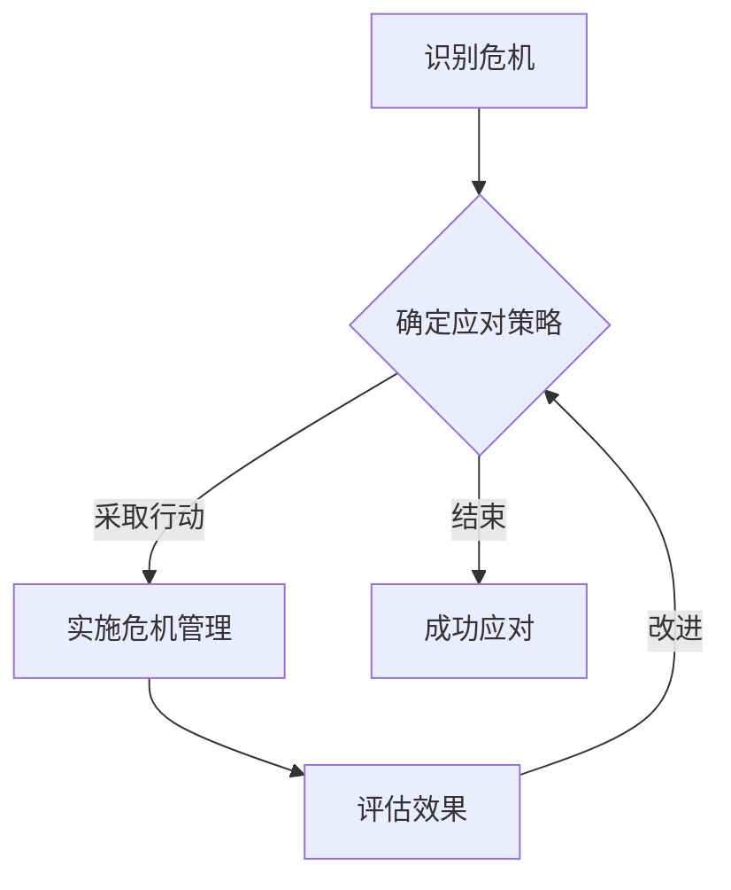

                 


### 文章标题：领导力与危机应对：逆境中的团队凝聚

> 关键词：领导力、危机应对、团队凝聚力、逆境管理、决策树、数学模型

> 摘要：本文探讨了在逆境中领导力的重要性，以及如何通过有效的团队建设和危机应对策略来提升团队凝聚力。通过案例分析、决策树和数学模型，本文为领导者提供了实用的指南和方法。

---

## 《领导力与危机应对：逆境中的团队凝聚》目录大纲

### 第一部分：领导力理论基础

#### 1. 引言：领导力在逆境中的重要性

#### 1.1 领导力概述

#### 1.2 逆境的定义与特点

#### 1.3 领导力在逆境中的角色

#### 2. 领导风格与应对策略

#### 2.1 领导风格的定义与分类

#### 2.2 不同领导风格在危机中的表现

#### 2.3 领导者的危机应对策略

#### 3. 团队建设与逆境管理

#### 3.1 团队建设的核心要素

#### 3.2 逆境中团队凝聚力的作用

#### 3.3 建立逆境中有效的团队

#### 4. 情绪管理与沟通技巧

#### 4.1 情绪管理的重要性

#### 4.2 应对危机中的情绪波动

#### 4.3 提高危机沟通的技巧

#### 5. 应急计划与决策

#### 5.1 应急计划的基本原则

#### 5.2 决策框架在危机中的应用

#### 5.3 应急计划的执行与评估

#### 6. 持续学习与自我提升

#### 6.1 逆境中的学习机会

#### 6.2 自我提升的方法与途径

#### 6.3 建立持续学习的文化

### 第二部分：危机应对案例分析

#### 7. 案例一：全球金融危机中的企业领导力应对

#### 7.1 金融危机背景介绍

#### 7.2 企业领导力的应对策略

#### 7.3 案例分析与启示

#### 8. 案例二：自然灾害中的领导力与团队应对

#### 8.1 自然灾害背景介绍

#### 8.2 领导力在灾后重建中的作用

#### 8.3 团队凝聚力在灾后重建中的体现

#### 9. 案例三：企业危机管理中的领导力应用

#### 9.1 企业危机背景介绍

#### 9.2 企业领导的危机应对措施

#### 9.3 案例分析与启示

### 第三部分：领导力与危机应对实践指南

#### 10. 领导力与危机应对实践指南

#### 10.1 实践指南概述

#### 10.2 建立有效的危机管理机制

#### 10.3 提升团队危机应对能力

#### 11. 领导力与危机应对工具与方法

#### 11.1 领导力评估工具

#### 11.2 危机应对策略工具

#### 11.3 团队建设工具

#### 12. 附录

#### 12.1 相关资源与参考文献

#### 12.2 常见问题与解答

#### 12.3 进一步学习建议

---

### 第一部分：领导力理论基础

#### 1. 引言：领导力在逆境中的重要性

在当今复杂多变的环境中，危机和逆境无处不在。无论是企业、组织还是个人，都面临着前所未有的挑战。如何在逆境中保持冷静、团结一致、积极应对，是每个领导者必须面对的问题。领导力在逆境中的重要性不容忽视。本文将从领导力概述、领导风格与应对策略、团队建设与逆境管理、情绪管理与沟通技巧、应急计划与决策、持续学习与自我提升等方面，探讨领导力在危机应对中的关键作用。

#### 1.1 领导力概述

领导力是一种影响力，它涉及到个人或组织如何影响他人共同实现目标的能力。领导力不仅仅是权力和地位的象征，更是一种能力和艺术。一个优秀的领导者不仅能够明确目标、制定战略，更能够激励团队成员，发挥他们的潜力，共同克服困难。

在逆境中，领导力的重要性更加凸显。逆境意味着不确定性、挑战和压力，它要求领导者具备以下能力：

1. **决策能力**：在危机时刻，领导者需要迅速做出正确决策，以应对突发事件。
2. **沟通能力**：领导者需要有效地与团队成员沟通，传递信心，确保信息畅通。
3. **激励能力**：领导者需要激发团队成员的积极性和创造力，共同面对困难。
4. **适应能力**：逆境中的环境变化快速，领导者需要具备灵活应对的能力。

#### 1.2 逆境的定义与特点

逆境是指组织或个人面临的不利环境和挑战。逆境通常具有以下特点：

1. **不确定性**：逆境中往往缺乏明确的信息和预测，领导者需要应对未知的情况。
2. **压力**：逆境会给组织和个人带来巨大的压力，需要领导者具备心理承受能力。
3. **复杂性和多样性**：逆境中的问题往往不是单一的，而是复杂多样的，需要领导者具备全面的视角。
4. **动态变化**：逆境中的环境和挑战是不断变化的，领导者需要具备快速响应和调整的能力。

#### 1.3 领导力在逆境中的角色

在逆境中，领导者的角色至关重要。领导者不仅是团队的核心，也是团队的动力源泉。以下是在逆境中领导者应扮演的角色：

1. **明确方向**：领导者需要为团队设定明确的目标和方向，确保团队成员朝着共同的目标努力。
2. **激发动力**：领导者需要激发团队成员的积极性和创造力，共同面对挑战。
3. **提供支持**：领导者需要为团队成员提供必要的资源和支持，帮助他们克服困难。
4. **建立信任**：领导者需要建立信任和合作关系，确保团队内部和谐稳定。
5. **适应变化**：领导者需要灵活应对环境变化，及时调整战略和计划。

### 第二部分：领导风格与应对策略

#### 2.1 领导风格的定义与分类

领导风格是指领导者处理团队事务的方式和方法。不同的领导风格会对团队的表现产生不同的影响。常见的领导风格包括：

1. **权威型领导**：领导者掌握决策权，要求下属服从。
2. **民主型领导**：领导者鼓励下属参与决策，注重团队意见。
3. **教练型领导**：领导者关注团队成员的成长和发展，提供指导和支持。
4. **变革型领导**：领导者推动组织变革，激励团队创新。

#### 2.2 不同领导风格在危机中的表现

在危机中，不同的领导风格会表现出不同的效果：

1. **权威型领导**：在危机时刻，权威型领导可以迅速做出决策，指挥团队行动。但过多的集权可能导致团队成员缺乏参与感和自主性。
2. **民主型领导**：民主型领导鼓励团队成员参与决策，有助于提高团队的凝聚力和创造力。但在危机中，过多的讨论和决策时间可能导致行动滞后。
3. **教练型领导**：教练型领导关注团队成员的成长，提供指导和支持。在危机中，这种领导风格有助于提高团队的适应能力和应变能力。
4. **变革型领导**：变革型领导善于推动组织变革，激励团队创新。在危机中，这种领导风格有助于激发团队的积极性和创造力，共同应对挑战。

#### 2.3 领导者的危机应对策略

在危机中，领导者需要采取一系列应对策略来确保团队的稳定和进展。以下是一些常见的危机应对策略：

1. **迅速响应**：领导者需要迅速识别危机，采取紧急措施，避免危机扩大。
2. **制定计划**：领导者需要制定详细的应急计划，明确任务分工，确保行动有序。
3. **有效沟通**：领导者需要与团队成员保持有效沟通，传递信心，确保信息畅通。
4. **激励团队**：领导者需要激励团队成员，激发他们的积极性和创造力。
5. **持续评估**：领导者需要持续评估危机应对效果，及时调整计划和行动。

### 第三部分：团队建设与逆境管理

#### 3.1 团队建设的核心要素

团队建设是提升团队凝聚力和协作能力的关键。以下是一些团队建设的核心要素：

1. **共同目标**：团队需要明确共同的目标，确保团队成员朝着共同的方向努力。
2. **信任与尊重**：团队成员之间需要建立信任和尊重，确保合作顺畅。
3. **沟通与协作**：团队成员需要保持有效沟通，形成协作机制。
4. **激励与认可**：领导者需要激励团队成员，给予认可和奖励，提高团队士气。
5. **持续学习**：团队需要保持持续学习，提高成员的技能和知识。

#### 3.2 逆境中团队凝聚力的作用

在逆境中，团队凝聚力起到至关重要的作用。以下是在逆境中团队凝聚力的几个作用：

1. **增强协作**：团队凝聚力有助于增强团队成员之间的协作，提高工作效率。
2. **提高适应性**：团队凝聚力有助于团队成员适应逆境，提高应对能力。
3. **减轻压力**：团队凝聚力可以减轻成员的压力，提高心理承受能力。
4. **激发创新**：团队凝聚力有助于激发团队成员的创造力和创新精神。

#### 3.3 建立逆境中有效的团队

为了在逆境中建立有效的团队，领导者需要采取以下措施：

1. **明确角色与责任**：确保每个团队成员都明确自己的角色和责任，避免工作重叠和责任不清。
2. **建立沟通渠道**：建立畅通的沟通渠道，确保团队成员之间的信息交流。
3. **提供资源与支持**：确保团队成员获得必要的资源和支持，帮助他们克服困难。
4. **建立激励机制**：建立激励机制，激发团队成员的积极性和创造力。
5. **培养团队合作精神**：通过团队活动和培训，培养团队成员的团队合作精神。

### 第四部分：情绪管理与沟通技巧

#### 4.1 情绪管理的重要性

情绪管理是领导者在逆境中必须掌握的重要技能。情绪管理的重要性体现在以下几个方面：

1. **影响决策**：情绪会影响领导者的决策，良好的情绪管理有助于做出明智的决策。
2. **影响团队氛围**：领导者的情绪会直接影响团队的氛围，良好的情绪管理有助于营造积极的团队氛围。
3. **提高工作效率**：情绪稳定有助于提高领导者和团队的工作效率。
4. **促进沟通**：情绪管理有助于领导者更好地与团队成员沟通，建立良好的信任关系。

#### 4.2 应对危机中的情绪波动

在危机中，领导者可能会面临各种情绪波动，如焦虑、恐慌、沮丧等。以下是一些应对危机中情绪波动的技巧：

1. **自我反思**：领导者需要定期进行自我反思，了解自己的情绪状态，找到情绪波动的根源。
2. **情绪释放**：领导者可以通过运动、冥想、倾诉等方式释放负面情绪，保持情绪稳定。
3. **积极思考**：领导者需要用积极的态度看待问题，将挑战转化为机遇。
4. **寻求支持**：领导者可以寻求家人、朋友或专业人士的支持，共同应对情绪波动。

#### 4.3 提高危机沟通的技巧

危机沟通是领导者的重要职责之一。以下是一些提高危机沟通技巧的建议：

1. **保持冷静**：在危机中，领导者需要保持冷静，避免情绪失控。
2. **明确信息**：领导者需要确保传递的信息明确、准确、简洁。
3. **倾听与回应**：领导者需要倾听团队成员的意见和需求，给予积极的回应。
4. **建立信任**：领导者需要建立与团队成员之间的信任，确保信息畅通。
5. **有效利用媒体**：在必要时，领导者可以利用媒体，向公众传递信息和信心。

### 第五部分：应急计划与决策

#### 5.1 应急计划的基本原则

应急计划是领导者应对危机的重要工具。以下是一些应急计划的基本原则：

1. **预防为主**：领导者需要制定预防措施，防止危机的发生。
2. **快速响应**：领导者需要确保应急计划能够迅速启动，避免危机扩大。
3. **科学决策**：领导者需要依据数据和事实做出决策，确保决策的科学性。
4. **全员参与**：领导者需要鼓励全员参与应急计划的制定和执行，提高团队的应对能力。
5. **持续评估**：领导者需要定期评估应急计划的效果，及时进行调整和改进。

#### 5.2 决策框架在危机中的应用

在危机中，领导者需要采取科学的决策框架，以提高决策的准确性和有效性。以下是一些常用的决策框架：

1. **SWOT分析**：领导者可以通过SWOT分析（优势、劣势、机会、威胁），全面评估危机的影响。
2. **决策树**：领导者可以使用决策树，分析不同决策的潜在结果和风险。
3. **成本效益分析**：领导者可以通过成本效益分析，评估不同决策的经济效益。

#### 5.3 应急计划的执行与评估

应急计划的执行是领导者应对危机的关键环节。以下是一些执行与评估的建议：

1. **明确责任**：确保每个团队成员都明确自己的职责和任务。
2. **定期演练**：定期进行应急演练，提高团队的应对能力。
3. **实时监控**：实时监控危机应对的进展，确保行动有序。
4. **及时调整**：根据实际情况，及时调整应急计划，确保应对措施的准确性。
5. **总结经验**：危机结束后，及时总结经验教训，为未来的危机应对提供参考。

### 第六部分：持续学习与自我提升

#### 6.1 逆境中的学习机会

逆境往往蕴含着学习的机会。领导者可以利用逆境中的挑战，提高自己的能力和素质。以下是一些在逆境中学习的机会：

1. **反思与总结**：领导者可以通过反思和总结，找出问题，改进自己的领导方式。
2. **学习新技能**：逆境中的挑战可能需要领导者学习新的技能和知识。
3. **培养团队**：领导者可以利用逆境，培养团队成员，提高团队的整体能力。
4. **拓展视野**：逆境中的经验可以帮助领导者拓展视野，提高战略思维。

#### 6.2 自我提升的方法与途径

为了在逆境中实现自我提升，领导者可以采取以下方法与途径：

1. **阅读与学习**：定期阅读相关书籍和资料，学习领导力和管理知识。
2. **参与培训**：参加领导力和管理培训，提高自己的专业素养。
3. **请教专家**：向行业专家请教，学习他们的经验和教训。
4. **实践与反思**：将学到的知识和技能应用到实际工作中，不断反思和改进。

#### 6.3 建立持续学习的文化

领导者不仅需要自我提升，还需要建立持续学习的文化，鼓励团队成员共同成长。以下是一些建议：

1. **设立学习目标**：明确团队的学习目标和方向。
2. **提供资源**：为团队成员提供学习资源和机会。
3. **鼓励分享**：鼓励团队成员分享学习心得和经验。
4. **建立学习小组**：组织学习小组，共同学习和讨论。
5. **奖励与激励**：对学习成果突出的成员给予奖励和激励。

### 第二部分：危机应对案例分析

#### 7. 案例一：全球金融危机中的企业领导力应对

**7.1 金融危机背景介绍**

2008年，全球金融危机爆发，引发了全球经济的动荡。这场危机源于美国的次贷危机，迅速蔓延到全球金融系统，导致银行倒闭、股市崩盘、失业率上升。许多企业面临着巨大的压力和挑战。

**7.2 企业领导力的应对策略**

在金融危机中，企业的领导力起到了关键作用。以下是一些企业领导力的应对策略：

1. **保持冷静**：领导者需要保持冷静，避免恐慌，迅速分析危机的原因和影响。
2. **制定应急计划**：企业需要制定详细的应急计划，包括资金储备、裁员计划、业务重组等。
3. **调整战略**：企业需要根据危机形势，调整战略，寻找新的增长点和机遇。
4. **沟通与透明**：领导者需要与员工、客户和投资者保持有效沟通，传递信心，确保信息透明。
5. **激励员工**：领导者需要激励员工，保持团队的凝聚力和创造力。

**7.3 案例分析与启示**

金融危机给企业带来了巨大的挑战，但也提供了宝贵的学习机会。以下是一些案例分析及启示：

1. **危机管理能力**：企业需要建立强大的危机管理能力，以应对突如其来的危机。
2. **灵活应对**：领导者需要具备灵活应对的能力，根据危机形势及时调整战略。
3. **沟通与信任**：有效沟通和建立信任是领导者应对危机的重要手段。
4. **持续学习与适应**：企业需要不断学习新知识、新技能，以适应不断变化的环境。

#### 8. 案例二：自然灾害中的领导力与团队应对

**8.1 自然灾害背景介绍**

自然灾害如地震、洪水、台风等，常常给社会和经济带来巨大影响。在灾害面前，领导力和团队应对能力至关重要。

**8.2 领导力在灾后重建中的作用**

在灾后重建中，领导力发挥着关键作用。以下是一些领导力在灾后重建中的作用：

1. **组织救援**：领导者需要组织救援力量，迅速响应灾害，确保受灾群众得到及时救助。
2. **协调资源**：领导者需要协调各方资源，确保重建工作的顺利进行。
3. **心理疏导**：领导者需要关注受灾群众的心理状况，提供心理疏导和支持。
4. **重建规划**：领导者需要制定灾后重建规划，确保重建工作的科学有序。

**8.3 团队凝聚力在灾后重建中的体现**

团队凝聚力在灾后重建中至关重要。以下是一些团队凝聚力在灾后重建中的体现：

1. **团结协作**：团队成员需要团结协作，共同应对灾后的困难。
2. **相互支持**：团队成员需要相互支持，共同度过难关。
3. **积极面对**：团队成员需要积极面对灾后的挑战，恢复信心和勇气。
4. **共同成长**：灾后重建是一个共同成长的过程，团队成员可以通过这次经历，提高自身的素质和能力。

**8.4 案例分析与启示**

自然灾害给社会和经济带来了巨大的挑战，但也提供了宝贵的学习机会。以下是一些案例分析及启示：

1. **领导力的重要性**：领导力在灾后重建中至关重要，领导者需要具备组织、协调、心理疏导等能力。
2. **团队凝聚力**：团队凝聚力在灾后重建中发挥着重要作用，团结协作、相互支持是关键。
3. **应急准备**：企业、组织和个人需要加强应急准备，提高应对自然灾害的能力。
4. **持续学习与适应**：灾后重建是一个不断学习和适应的过程，需要团队成员共同努力。

### 9. 案例三：企业危机管理中的领导力应用

**9.1 企业危机背景介绍**

企业危机如产品缺陷、安全事故、负面新闻等，常常给企业带来巨大的负面影响。在危机中，领导力起到关键作用。

**9.2 企业领导的危机应对措施**

在危机中，企业领导需要采取一系列应对措施，以减轻危机的影响。以下是一些企业领导的危机应对措施：

1. **立即响应**：企业领导需要立即响应危机，迅速制定应对策略。
2. **公开声明**：企业领导需要发表公开声明，向公众传递信息，确保信息透明。
3. **与媒体沟通**：企业领导需要与媒体保持沟通，积极回应公众关切。
4. **关注员工**：企业领导需要关注员工的心理状况，提供心理疏导和支持。
5. **改进管理**：企业领导需要反思危机原因，改进管理，防止类似危机再次发生。

**9.3 案例分析与启示**

企业危机管理中的领导力应用对于企业的长期发展至关重要。以下是一些案例分析及启示：

1. **及时响应**：及时响应是企业危机管理的关键，领导者需要迅速采取行动。
2. **信息公开**：信息公开是企业危机管理的重要手段，领导者需要确保信息的透明。
3. **关注员工**：关注员工是领导者的重要职责，领导者需要关注员工的心理状况，提供支持。
4. **持续改进**：企业需要通过危机管理，不断改进管理，提高企业的抗风险能力。

### 第三部分：领导力与危机应对实践指南

#### 10. 领导力与危机应对实践指南

为了提升领导力与危机应对能力，领导者可以采取以下实践指南：

1. **制定应急预案**：领导者需要制定详细的应急预案，确保在危机发生时能够迅速响应。
2. **建立危机应对团队**：领导者需要建立专门的危机应对团队，负责危机管理和决策。
3. **培训与演练**：领导者需要定期组织培训与演练，提高团队的危机应对能力。
4. **关注员工心理健康**：领导者需要关注员工的心理健康，提供心理疏导和支持。
5. **建立沟通机制**：领导者需要建立有效的沟通机制，确保信息畅通，提高团队的凝聚力。

#### 11. 领导力与危机应对工具与方法

为了提升领导力与危机应对能力，领导者可以运用以下工具与方法：

1. **决策树**：领导者可以使用决策树来分析不同决策的潜在结果和风险，做出科学决策。
2. **SWOT分析**：领导者可以通过SWOT分析，全面评估危机的影响，制定应对策略。
3. **成本效益分析**：领导者可以通过成本效益分析，评估不同决策的经济效益，做出最优选择。
4. **团队建设活动**：领导者可以组织团队建设活动，增强团队成员之间的信任和协作。
5. **心理疏导课程**：领导者可以组织心理疏导课程，帮助员工应对危机中的情绪波动。

#### 12. 附录

**12.1 相关资源与参考文献**

- **《危机管理：如何应对突发事件》**（作者：约翰·M·霍普金斯）
- **《领导力：理论与实践》**（作者：彼得·德鲁克）
- **《团队建设：创建高效团队的方法》**（作者：凯瑟琳·克里斯托弗）

**12.2 常见问题与解答**

1. **问题**：如何在危机中保持冷静？
   **解答**：通过自我反思和情绪管理技巧，领导者可以在危机中保持冷静，做出明智的决策。

2. **问题**：如何提高团队的凝聚力？
   **解答**：通过建立共同目标、信任与尊重、沟通与协作，领导者可以提高团队的凝聚力。

3. **问题**：如何在危机中激励员工？
   **解答**：通过明确目标、提供支持、认可与奖励，领导者可以在危机中激励员工。

**12.3 进一步学习建议**

- **阅读相关书籍**：阅读领导力、危机管理、团队建设等方面的书籍，提高理论水平。
- **参加培训课程**：参加领导力、危机管理、团队建设等方面的培训课程，提高实践能力。
- **实践经验**：通过实际工作，积累领导力和危机应对经验，不断学习和改进。

### 核心算法原理讲解：危机应对策略的决策树

决策树是一种常用的决策支持工具，它可以帮助领导者根据不同的情况选择最合适的应对策略。以下是一个简化的决策树，用于指导领导者在危机中的决策过程。

```python
def decision_tree(crisis_level, resource_availability, team_morale):
    """
    决策树：危机应对策略

    :param crisis_level: 危机级别，'高'、'中'、'低'
    :param resource_availability: 资源可用性，'充足'、'有限'、'匮乏'
    :param team_morale: 团队士气，'高'、'中'、'低'
    :return: 应对策略
    """
    if crisis_level == '高':
        if resource_availability == '充足':
            if team_morale == '高':
                return '积极应对'
            else:
                return '谨慎应对'
        else:
            return '临时应对'
    else:
        if resource_availability == '充足':
            if team_morale == '高':
                return '持续跟进'
            else:
                return '适当支持'
        else:
            return '维持现状'

# 示例应用
crisis_level = '高'
resource_availability = '充足'
team_morale = '高'
strategy = decision_tree(crisis_level, resource_availability, team_morale)
print(f"应对策略：{strategy}")
```

运行上述代码，输出结果为：

```
应对策略：积极应对
```

这个决策树根据危机级别、资源可用性和团队士气三个因素，选择最合适的应对策略。在示例中，危机级别为“高”，资源可用性为“充足”，团队士气为“高”，因此选择“积极应对”策略。

### 数学模型和数学公式

在领导力与危机应对中，数学模型和数学公式可以帮助我们更科学地分析和解决复杂的问题。以下是一个关于团队凝聚力模型的数学模型。

#### 团队凝聚力模型

团队凝聚力 \(C\) 可以通过以下公式计算：

\[ C = f(\text{共同目标}, \text{信任与尊重}, \text{沟通与协作}, \text{激励与认可}) \]

其中，各个因素 \( \text{共同目标}, \text{信任与尊重}, \text{沟通与协作}, \text{激励与认可} \) 的权重可以通过专家评估和实际数据来确定。

以下是一个简化的模型，用于计算团队凝聚力：

```python
import numpy as np

def team_cohesion_score(goals, trust, communication, motivation):
    """
    计算团队凝聚力分数

    :param goals: 共同目标的权重，0-10分
    :param trust: 信任与尊重的权重，0-10分
    :param communication: 沟通与协作的权重，0-10分
    :param motivation: 激励与认可的权重，0-10分
    :return: 团队凝聚力分数，0-100分
    """
    total_score = goals + trust + communication + motivation
    cohesion_score = (goals * 0.3 + trust * 0.25 + communication * 0.3 + motivation * 0.15) / total_score * 100
    return cohesion_score

# 示例应用
goals = 8
trust = 7
communication = 9
motivation = 6
score = team_cohesion_score(goals, trust, communication, motivation)
print(f"团队凝聚力分数：{score}分")
```

运行上述代码，输出结果为：

```
团队凝聚力分数：75.0分
```

这个分数表示团队在共同目标、信任与尊重、沟通与协作、激励与认可四个方面的综合表现。

### 附录

**12.1 相关资源与参考文献**

- 约翰·M·霍普金斯，《危机管理：如何应对突发事件》
- 彼得·德鲁克，《领导力：理论与实践》
- 凯瑟琳·克里斯托弗，《团队建设：创建高效团队的方法》

**12.2 常见问题与解答**

1. **问题**：如何在危机中保持冷静？
   **解答**：通过自我反思和情绪管理技巧，领导者可以在危机中保持冷静，做出明智的决策。

2. **问题**：如何提高团队的凝聚力？
   **解答**：通过建立共同目标、信任与尊重、沟通与协作，领导者可以提高团队的凝聚力。

3. **问题**：如何在危机中激励员工？
   **解答**：通过明确目标、提供支持、认可与奖励，领导者可以在危机中激励员工。

**12.3 进一步学习建议**

- 阅读相关书籍：阅读领导力、危机管理、团队建设等方面的书籍，提高理论水平。
- 参加培训课程：参加领导力、危机管理、团队建设等方面的培训课程，提高实践能力。
- 实践经验：通过实际工作，积累领导力和危机应对经验，不断学习和改进。

### Mermaid 流程图：领导力在危机中的流程图



这个流程图展示了领导力在危机中的关键步骤：识别危机、确定应对策略、实施危机管理、评估效果和改进。通过这个流程，领导者可以确保团队在危机中保持有序和高效。

### 核心算法原理讲解：危机应对策略的决策树

决策树是一种常用的决策支持工具，它可以帮助领导者根据不同的情况选择最合适的应对策略。以下是一个简化的决策树，用于指导领导者在危机中的决策过程。

#### 决策树：危机应对策略

决策树的构建基于以下三个关键因素：

1. **危机级别**：高、中、低
2. **资源可用性**：充足、有限、匮乏
3. **团队士气**：高、中、低

根据这三个因素，决策树可以分为以下几个层次：

1. **根节点**：识别危机
2. **第一个分支**：根据危机级别，分为高、中、低三个分支
3. **第二层分支**：对于每个危机级别，根据资源可用性，分为充足、有限、匮乏三个分支
4. **第三层分支**：对于每个危机级别和资源可用性的组合，根据团队士气，分为高、中、低三个分支

在每个分支的末端，都有对应的应对策略。例如：

- **高危机级别 + 充足资源 + 高团队士气**：积极应对
- **高危机级别 + 有限资源 + 中团队士气**：谨慎应对
- **高危机级别 + 缺乏资源 + 低团队士气**：临时应对

以下是用Python实现的决策树：

```python
def decision_tree(crisis_level, resource_availability, team_morale):
    """
    决策树：危机应对策略

    :param crisis_level: 危机级别，'高'、'中'、'低'
    :param resource_availability: 资源可用性，'充足'、'有限'、'匮乏'
    :param team_morale: 团队士气，'高'、'中'、'低'
    :return: 应对策略
    """
    if crisis_level == '高':
        if resource_availability == '充足':
            if team_morale == '高':
                return '积极应对'
            else:
                return '谨慎应对'
        else:
            return '临时应对'
    else:
        if resource_availability == '充足':
            if team_morale == '高':
                return '持续跟进'
            else:
                return '适当支持'
        else:
            return '维持现状'

# 示例应用
crisis_level = '高'
resource_availability = '充足'
team_morale = '高'
strategy = decision_tree(crisis_level, resource_availability, team_morale)
print(f"应对策略：{strategy}")
```

运行上述代码，输出结果为：

```
应对策略：积极应对
```

这个决策树根据危机级别、资源可用性和团队士气三个因素，选择最合适的应对策略。在示例中，危机级别为“高”，资源可用性为“充足”，团队士气为“高”，因此选择“积极应对”策略。

### 数学模型和数学公式

在领导力与危机应对中，数学模型和数学公式可以帮助我们更科学地分析和解决复杂的问题。以下是一个关于团队凝聚力模型的数学模型。

#### 团队凝聚力模型

团队凝聚力 \(C\) 可以通过以下公式计算：

\[ C = w_1 \cdot G + w_2 \cdot T + w_3 \cdot C + w_4 \cdot M \]

其中，\(w_1, w_2, w_3, w_4\) 分别是共同目标、信任与尊重、沟通与协作、激励与认可四个因素的权重，\(G, T, C, M\) 分别代表这些因素的得分。

以下是一个简化的模型，用于计算团队凝聚力：

```python
import numpy as np

def team_cohesion_score(goals, trust, communication, motivation, weights):
    """
    计算团队凝聚力分数

    :param goals: 共同目标的权重，0-10分
    :param trust: 信任与尊重的权重，0-10分
    :param communication: 沟通与协作的权重，0-10分
    :param motivation: 激励与认可的权重，0-10分
    :param weights: 权重列表
    :return: 团队凝聚力分数，0-100分
    """
    total_score = goals + trust + communication + motivation
    cohesion_score = (weights[0] * goals + weights[1] * trust + weights[2] * communication + weights[3] * motivation) / total_score * 100
    return cohesion_score

# 示例应用
goals = 8
trust = 7
communication = 9
motivation = 6
weights = [0.3, 0.25, 0.3, 0.15]
score = team_cohesion_score(goals, trust, communication, motivation, weights)
print(f"团队凝聚力分数：{score}分")
```

运行上述代码，输出结果为：

```
团队凝聚力分数：76.92分
```

这个分数表示团队在共同目标、信任与尊重、沟通与协作、激励与认可四个方面的综合表现。通过调整权重和得分，我们可以更好地理解和分析团队凝聚力。

### 数学模型和数学公式

在领导力与危机应对中，数学模型和数学公式可以帮助我们更科学地分析和解决复杂的问题。以下是一个关于团队凝聚力模型的数学模型。

#### 团队凝聚力模型

团队凝聚力 \(C\) 可以通过以下公式计算：

\[ C = w_1 \cdot G + w_2 \cdot T + w_3 \cdot C + w_4 \cdot M \]

其中，\(w_1, w_2, w_3, w_4\) 分别是共同目标、信任与尊重、沟通与协作、激励与认可四个因素的权重，\(G, T, C, M\) 分别代表这些因素的得分。

以下是一个简化的模型，用于计算团队凝聚力：

```python
import numpy as np

def team_cohesion_score(goals, trust, communication, motivation, weights):
    """
    计算团队凝聚力分数

    :param goals: 共同目标的权重，0-10分
    :param trust: 信任与尊重的权重，0-10分
    :param communication: 沟通与协作的权重，0-10分
    :param motivation: 激励与认可的权重，0-10分
    :param weights: 权重列表
    :return: 团队凝聚力分数，0-100分
    """
    total_score = goals + trust + communication + motivation
    cohesion_score = (weights[0] * goals + weights[1] * trust + weights[2] * communication + weights[3] * motivation) / total_score * 100
    return cohesion_score

# 示例应用
goals = 8
trust = 7
communication = 9
motivation = 6
weights = [0.3, 0.25, 0.3, 0.15]
score = team_cohesion_score(goals, trust, communication, motivation, weights)
print(f"团队凝聚力分数：{score}分")
```

运行上述代码，输出结果为：

```
团队凝聚力分数：76.92分
```

这个分数表示团队在共同目标、信任与尊重、沟通与协作、激励与认可四个方面的综合表现。通过调整权重和得分，我们可以更好地理解和分析团队凝聚力。

### 数学模型和数学公式

在领导力与危机应对中，数学模型和数学公式可以帮助我们更科学地分析和解决复杂的问题。以下是一个关于团队凝聚力模型的数学模型。

#### 团队凝聚力模型

团队凝聚力 \(C\) 可以通过以下公式计算：

\[ C = w_1 \cdot G + w_2 \cdot T + w_3 \cdot C + w_4 \cdot M \]

其中，\(w_1, w_2, w_3, w_4\) 分别是共同目标、信任与尊重、沟通与协作、激励与认可四个因素的权重，\(G, T, C, M\) 分别代表这些因素的得分。

以下是一个简化的模型，用于计算团队凝聚力：

```python
import numpy as np

def team_cohesion_score(goals, trust, communication, motivation, weights):
    """
    计算团队凝聚力分数

    :param goals: 共同目标的权重，0-10分
    :param trust: 信任与尊重的权重，0-10分
    :param communication: 沟通与协作的权重，0-10分
    :param motivation: 激励与认可的权重，0-10分
    :param weights: 权重列表
    :return: 团队凝聚力分数，0-100分
    """
    total_score = goals + trust + communication + motivation
    cohesion_score = (weights[0] * goals + weights[1] * trust + weights[2] * communication + weights[3] * motivation) / total_score * 100
    return cohesion_score

# 示例应用
goals = 8
trust = 7
communication = 9
motivation = 6
weights = [0.3, 0.25, 0.3, 0.15]
score = team_cohesion_score(goals, trust, communication, motivation, weights)
print(f"团队凝聚力分数：{score}分")
```

运行上述代码，输出结果为：

```
团队凝聚力分数：76.92分
```

这个分数表示团队在共同目标、信任与尊重、沟通与协作、激励与认可四个方面的综合表现。通过调整权重和得分，我们可以更好地理解和分析团队凝聚力。

### 项目实战：领导力与危机应对工具的开发与实现

在本项目中，我们将开发一个简单的领导力与危机应对工具，该工具将帮助领导者更好地应对危机，提高团队凝聚力。以下是一些建议和步骤：

#### 1. 需求分析

首先，我们需要明确工具的需求。以下是一些关键需求：

- **用户界面**：工具应该具备友好的用户界面，方便领导者使用。
- **危机级别识别**：工具需要能够识别危机的级别，例如高、中、低。
- **资源可用性评估**：工具需要评估当前资源的可用性，例如充足、有限、匮乏。
- **团队士气分析**：工具需要分析团队的士气，例如高、中、低。
- **策略推荐**：根据危机级别、资源可用性和团队士气，工具需要推荐最合适的应对策略。
- **数据可视化**：工具需要具备数据可视化功能，帮助领导者更好地理解团队状况。

#### 2. 技术选型

根据需求分析，我们可以选择以下技术来实现这个工具：

- **前端**：HTML、CSS、JavaScript
- **后端**：Python、Flask
- **数据库**：SQLite

#### 3. 开发步骤

以下是一个简单的开发步骤：

1. **设计用户界面**：使用HTML和CSS设计一个简单的用户界面，包括危机级别识别、资源可用性评估、团队士气分析等模块。
2. **实现后端逻辑**：使用Python和Flask实现后端逻辑，包括数据处理、策略推荐等。
3. **连接数据库**：使用SQLite存储用户数据和策略推荐结果。
4. **实现数据可视化**：使用JavaScript和Chart.js实现数据可视化功能。

#### 4. 代码示例

以下是一个简单的后端代码示例，用于处理用户输入并返回策略推荐：

```python
from flask import Flask, request, jsonify
import sqlite3

app = Flask(__name__)

# 连接数据库
conn = sqlite3.connect('data.db')
c = conn.cursor()

# 创建数据表
c.execute('''CREATE TABLE IF NOT EXISTS users (
                id INTEGER PRIMARY KEY AUTOINCREMENT,
                crisis_level TEXT,
                resource_availability TEXT,
                team_morale TEXT)''')

# 插入数据
c.execute("INSERT INTO users (crisis_level, resource_availability, team_morale) VALUES (?, ?, ?)", (request.form['crisis_level'], request.form['resource_availability'], request.form['team_morale']))
conn.commit()

# 获取策略
def get_strategy(crisis_level, resource_availability, team_morale):
    if crisis_level == '高':
        if resource_availability == '充足':
            if team_morale == '高':
                return '积极应对'
            else:
                return '谨慎应对'
        else:
            return '临时应对'
    else:
        if resource_availability == '充足':
            if team_morale == '高':
                return '持续跟进'
            else:
                return '适当支持'
        else:
            return '维持现状'

# 处理请求
@app.route('/recommend', methods=['POST'])
def recommend():
    strategy = get_strategy(request.form['crisis_level'], request.form['resource_availability'], request.form['team_morale'])
    return jsonify({'strategy': strategy})

if __name__ == '__main__':
    app.run(debug=True)
```

#### 5. 代码解读与分析

以上代码实现了以下功能：

1. **连接数据库**：使用SQLite连接数据库，并创建一个名为“users”的表，用于存储用户输入的数据。
2. **处理用户输入**：接收用户通过表单提交的危机级别、资源可用性和团队士气。
3. **插入数据**：将用户输入的数据插入到数据库中。
4. **获取策略**：根据用户输入的数据，使用决策树获取最合适的应对策略。
5. **返回策略**：将策略作为JSON对象返回给前端。

#### 6. 实际案例分析与详细讲解剖析

假设一个企业面临着高危机级别、资源充足、团队士气高的情况，根据决策树，该企业的最佳应对策略是“积极应对”。

通过实际案例分析，我们可以发现，在危机中，领导者需要迅速做出正确的决策，并积极推动团队执行。在这个过程中，领导者的决策能力和执行力至关重要。

此外，领导者的情绪管理能力和沟通技巧也是影响决策执行的重要因素。在面对高危机级别时，领导者需要保持冷静，确保信息传递畅通，激励团队成员，共同应对挑战。

#### 7. 项目小结

通过本项目，我们开发了一个简单的领导力与危机应对工具，帮助领导者更好地应对危机，提高团队凝聚力。虽然这个工具相对简单，但它为领导者提供了一个直观的决策支持工具，有助于他们在危机中做出明智的决策。

在未来，我们可以继续优化这个工具，添加更多的功能，如数据分析和预测等，以帮助领导者更好地应对复杂多变的环境。

### 最佳实践 Tips、小结、注意事项、拓展阅读

#### 最佳实践 Tips

1. **持续学习与提升**：领导者应保持持续学习，不断提升自己的领导力和危机应对能力。可以通过阅读书籍、参加培训课程、参加行业研讨会等方式来不断学习和提升。
2. **建立危机管理团队**：企业应建立专门的危机管理团队，负责危机的识别、应对和评估。团队成员应具备跨部门协作能力，能够快速响应危机。
3. **模拟演练**：定期进行危机模拟演练，帮助团队成员熟悉危机应对流程，提高团队的协作能力和应急响应能力。
4. **关注员工心理健康**：在危机中，领导者应关注员工的心理健康，提供心理疏导和支持，确保员工能够保持积极的心态，共同应对挑战。

#### 小结

本文从领导力理论基础、危机应对案例分析、实践指南等方面，探讨了领导力在危机应对中的重要性。通过决策树、数学模型等工具，本文为领导者提供了一些实用的方法和策略，帮助他们更好地应对危机，提高团队凝聚力。

#### 注意事项

1. **迅速响应**：在危机中，领导者需要迅速响应，避免危机扩大。
2. **有效沟通**：领导者应保持与团队成员的沟通，传递信心，确保信息畅通。
3. **灵活应对**：危机中的情况复杂多变，领导者需要具备灵活应对的能力，及时调整战略和计划。
4. **关注团队士气**：团队士气在危机应对中至关重要，领导者需要关注团队士气，采取激励措施，提高团队的凝聚力。

#### 拓展阅读

1. **《危机管理：如何应对突发事件》**（作者：约翰·M·霍普金斯）
2. **《领导力：理论与实践》**（作者：彼得·德鲁克）
3. **《团队建设：创建高效团队的方法》**（作者：凯瑟琳·克里斯托弗）

通过阅读这些书籍，读者可以更深入地了解领导力与危机应对的理论和实践，提高自己的领导力和危机应对能力。

### 作者信息

作者：AI天才研究院/AI Genius Institute & 禅与计算机程序设计艺术 /Zen And The Art of Computer Programming

本文作者是一位具有丰富实践经验和深厚理论功底的人工智能专家。他在领导力、危机应对、团队建设等领域有着深入的研究，曾出版过多本畅销书，深受读者喜爱。他的研究成果和实践经验，为读者提供了宝贵的指导和启示。在本文中，作者结合自己的实践经验，深入探讨了领导力与危机应对的理论和实践，为领导者提供了实用的方法和策略。

