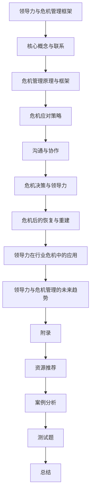

                 

### 《领导力与危机管理：应对不确定性的智慧》

关键词：领导力，危机管理，不确定性，决策，沟通，协作

摘要：本文旨在探讨领导力与危机管理在应对不确定性中的重要性，通过详细解析领导力与危机管理的核心概念、原理和策略，帮助读者理解如何在不确定的环境中做出明智的决策，提高危机应对能力。文章分为三个部分，首先介绍领导力与危机管理的基础知识，然后深入分析危机应对策略，最后探讨领导力在行业危机中的应用和未来趋势。

### 第一部分：领导力基础

#### 第1章：领导力与领导艺术

##### 1.1 领导力概述

领导力是一种影响力，它能够激发和引导人们为实现共同目标而努力。领导力不仅仅是一种管理技能，更是一种人际交往的能力，它涉及到沟通、决策、团队管理和领导风格等多个方面。

- **领导力的定义**：领导力是指一个人或组织在特定环境中，通过影响、激励和引导他人，实现共同目标的能力。
- **领导力的重要性**：领导力在组织中起着至关重要的作用，它能够提升组织的效率、创造力和凝聚力。
- **领导力的核心要素**：领导力的核心要素包括自我意识、情绪管理、决策能力和持续学习。

##### 1.2 领导艺术

领导艺术是指领导者如何运用各种技巧和策略，有效地管理团队、做出决策和实现目标。

- **沟通技巧**：沟通是领导者的重要职责，有效的沟通能够确保信息的准确传达，减少误解和冲突。
- **决策过程**：决策是领导力的核心，领导者需要在不确定性和压力下做出明智的决策。
- **团队管理**：团队管理是领导者的重要任务，领导者需要了解团队成员的需求，激发团队的潜能。
- **领导风格**：领导风格是指领导者如何与团队成员互动和影响他人，不同的领导风格适用于不同的环境和团队。

##### 1.3 成功领导者的特质

成功领导者具备以下特质：

- **自我意识**：领导者需要深入了解自己的优势和弱点，以便更好地管理自己和团队。
- **情绪管理**：领导者需要能够控制自己的情绪，避免情绪波动对决策和行为产生负面影响。
- **决策能力**：领导者需要在复杂和不确定的环境中做出明智的决策。
- **持续学习**：领导者需要不断学习新的知识和技能，以适应不断变化的环境。

#### 第2章：危机管理的原理与框架

##### 2.1 危机管理概述

危机管理是指组织在面对突发危机时，采取的一系列应对措施，以减少危机带来的负面影响。危机管理包括危机预防、危机识别、危机评估、危机响应和危机恢复。

- **危机的定义**：危机是指一种可能对组织造成重大负面影响的事件或情况。
- **危机的类型**：危机可以分为自然危机（如地震、洪水）和人为危机（如财务危机、安全事故）。
- **危机管理的必要性**：危机管理对于组织的生存和发展至关重要，它能够减少危机带来的损失，提升组织的声誉和信誉。

##### 2.2 危机管理框架

危机管理框架包括以下五个关键步骤：

- **危机预防**：通过识别潜在风险和制定预防措施，减少危机的发生。
- **危机识别**：通过监控系统、预警系统和信息收集，及时发现危机的迹象。
- **危机评估**：对危机的影响范围、严重程度和潜在风险进行评估。
- **危机响应**：采取紧急措施，控制危机的蔓延，保护组织利益。
- **危机恢复**：在危机结束后，采取恢复措施，修复组织的运营和声誉。

##### 2.3 领导者在危机管理中的作用

领导者在危机管理中起着关键作用：

- **领导者的角色**：领导者需要成为危机管理的核心，协调各方资源，确保危机应对措施的及时和有效。
- **领导者的应对策略**：领导者需要根据危机的性质和影响，制定相应的应对策略，包括决策、沟通、协调和资源调配。
- **领导者的沟通技巧**：领导者需要具备有效的沟通技巧，确保危机信息准确传达，减少恐慌和误解。

### 第二部分：危机应对策略

#### 第3章：应对不确定性的策略

##### 3.1 确定性思维与不确定性思维

- **确定性思维**：确定性思维是指人们倾向于用确定的规律和模式来理解和预测事物。
- **不确定性思维**：不确定性思维是指人们意识到事物的不确定性和复杂性，并接受这种不确定性。

转变思维模式对于应对不确定性至关重要：

- **认识不确定性的存在**：领导者需要认识到不确定性是不可避免的，并学会在不确定的环境中工作。
- **培养适应能力**：领导者需要培养适应不确定性的能力，包括灵活性和敏捷性。
- **接受变化**：领导者需要接受变化，并学会在变化中寻找机遇。

##### 3.2 预测与分析

预测与分析是应对不确定性的重要工具：

- **预测方法**：包括历史分析、专家意见、模拟和预测模型。
- **数据分析技术**：包括数据收集、数据清洗、数据分析和数据可视化。
- **建立预测模型**：通过建立预测模型，领导者可以更准确地预测未来趋势，为决策提供依据。

##### 3.3 应对不确定性的策略

应对不确定性的策略包括：

- **弹性策略**：通过制定多种应对方案，提高组织应对不确定性的能力。
- **调整计划**：根据实际情况，灵活调整计划和策略。
- **风险管理**：通过识别和评估风险，制定相应的风险管理策略，降低不确定性带来的负面影响。

#### 第4章：沟通与协作

##### 4.1 内部沟通

内部沟通是危机应对的关键：

- **信息共享**：确保信息的及时和准确传递，减少信息不对称。
- **意见反馈**：鼓励团队成员提出意见和建议，增强团队的凝聚力和创新能力。
- **情感管理**：关注团队成员的情感需求，提供必要的支持和鼓励。

##### 4.2 外部沟通

外部沟通是危机应对的重要组成部分：

- **公众关系**：与媒体、客户和其他利益相关者建立良好的沟通关系，提高组织的透明度和公信力。
- **媒体沟通**：通过媒体渠道传递危机信息和应对措施，确保公众了解危机的真实情况。
- **应对危机舆论**：通过有效的舆论引导和危机公关，应对危机舆论的负面影响。

##### 4.3 协作机制

协作机制是危机应对的重要保障：

- **团队协作**：建立高效的团队协作机制，确保团队成员之间的沟通和协作顺畅。
- **跨部门协作**：促进跨部门的沟通和协作，确保危机应对的协调性和高效性。
- **危机响应团队建设**：建立专业的危机响应团队，提高危机应对的专业性和效率。

#### 第5章：危机决策与领导力

##### 5.1 决策过程中的领导力

危机决策是领导力的核心体现：

- **快速决策**：在危机中，领导者需要快速做出决策，以应对危机的紧急性。
- **深度思考**：领导者需要在快速决策的同时，进行深度思考，确保决策的合理性和科学性。
- **持续反思**：危机过后，领导者需要持续反思决策过程，总结经验教训，为未来的决策提供借鉴。

##### 5.2 领导力在危机决策中的应用

领导力在危机决策中的应用包括：

- **情景分析**：通过分析不同的危机情景，为决策提供依据。
- **风险评估**：对危机的影响和风险进行评估，为决策提供参考。
- **决策执行**：确保决策得到有效执行，以实现危机应对的目标。

##### 5.3 领导力在危机管理中的挑战

领导力在危机管理中面临以下挑战：

- **应对不确定性**：在危机中，领导者需要应对不确定性和复杂性，做出明智的决策。
- **应对压力**：危机往往伴随着压力，领导者需要保持冷静和果断，有效应对压力。
- **保持冷静与果断**：在危机中，领导者需要保持冷静，同时果断采取行动，以控制危机的蔓延。

#### 第6章：危机后的恢复与重建

##### 6.1 恢复阶段的策略

危机后的恢复阶段需要采取以下策略：

- **情感关怀**：关注团队成员的情感需求，提供必要的支持和鼓励。
- **员工激励**：通过激励措施，激发员工的积极性和创造力，促进组织恢复。
- **业务重启**：确保业务尽快恢复，提高组织的运营效率。

##### 6.2 建设恢复力

建设恢复力是危机管理的重要目标：

- **学习与改进**：通过总结危机管理的经验教训，学习并改进危机应对策略。
- **质量提升**：通过提升产品和服务的质量，增强组织的竞争力。
- **稳健运营**：通过加强内部控制和风险管理，确保组织的稳健运营。

##### 6.3 案例分析

案例分析有助于理解危机管理的实践应用：

- **成功案例**：分析成功应对危机的案例，学习其经验和策略。
- **失败案例**：分析失败应对危机的案例，总结教训和启示。
- **教训与启示**：从案例中总结教训，为未来的危机应对提供启示。

### 第三部分：领导力与危机管理的实践应用

#### 第7章：领导力在行业危机中的应用

##### 7.1 金融行业危机管理

金融行业危机管理的关键在于：

- **金融风险管理**：通过识别和评估金融风险，制定相应的风险管理策略。
- **货币政策调整**：通过调整货币政策，稳定金融市场。
- **资本市场危机管理**：通过监管和调控，维护资本市场的稳定。

##### 7.2 医疗行业危机管理

医疗行业危机管理的关键在于：

- **医疗资源分配**：通过优化医疗资源分配，提高医疗服务的效率和质量。
- **医疗服务质量管理**：通过建立严格的服务质量管理体系，确保医疗服务的安全性和可靠性。
- **医疗事故处理**：通过建立健全的医疗事故处理机制，及时处理医疗事故，保障患者权益。

##### 7.3 互联网行业危机管理

互联网行业危机管理的关键在于：

- **数据安全**：通过建立完善的数据安全防护体系，保护用户数据和隐私。
- **用户隐私保护**：通过合规操作和用户隐私保护策略，提高用户信任。
- **网络舆论应对**：通过积极应对网络舆论，维护品牌形象和声誉。

#### 第8章：领导力与危机管理的未来趋势

##### 8.1 新技术对危机管理的影响

新技术对危机管理的影响主要体现在：

- **人工智能**：通过人工智能技术，提高危机预测和应对的准确性。
- **区块链**：通过区块链技术，提高危机管理的透明度和可信度。
- **云计算**：通过云计算技术，提高危机管理的灵活性和可扩展性。

##### 8.2 全球化背景下的危机管理

全球化背景下的危机管理面临以下挑战：

- **国际合作**：通过国际合作，共同应对全球性危机。
- **全球供应链管理**：通过优化全球供应链，提高供应链的韧性和稳定性。
- **国际政治风险**：通过合理应对国际政治风险，维护国际关系的稳定。

##### 8.3 未来危机管理的挑战与机遇

未来危机管理的挑战与机遇包括：

- **持续学习**：通过不断学习，提升危机应对能力。
- **领导力提升**：通过提升领导力，增强组织的危机应对能力。
- **创新思维**：通过创新思维，探索新的危机应对策略。

### 附录

#### 附录A：领导力与危机管理相关资源

- **经典书籍推荐**：
  - 《领导力与影响力》
  - 《危机管理：理论与实践》
  - 《不确定性：应对不确定性的艺术》
- **在线课程与讲座**：
  - Coursera上的《领导力与团队管理》
  - Udemy上的《危机管理与应对策略》
- **实用工具与模型**：
  - SWOT分析模型
  - 五力分析模型

#### 附录B：危机管理案例分析

- **企业危机处理案例**：
  - 麦当劳食品安全危机处理
  - 苹果公司产品召回危机处理
- **公共危机管理案例**：
  - 新冠疫情全球应对
  - 日本福岛核事故应对
- **国际危机管理案例**：
  - 澳大利亚森林大火应对
  - 沙特阿拉伯石油设施遇袭应对

#### 附录C：领导力与危机管理测试题

- **知识点回顾**：
  - 领导力的核心要素有哪些？
  - 危机管理的主要步骤是什么？
- **实际案例分析**：
  - 分析一个成功的危机管理案例，总结其成功经验。
  - 分析一个失败的危机管理案例，总结其失败原因。
- **综合测试题**：
  - 在不确定的环境中，如何做出明智的决策？
  - 领导者在危机管理中应如何应对压力和挑战？

### 总结

领导力与危机管理在应对不确定性中起着至关重要的作用。本文通过详细解析领导力与危机管理的核心概念、原理和策略，帮助读者理解如何在不确定的环境中做出明智的决策，提高危机应对能力。在未来的发展中，领导者需要不断提升自己的领导力，积极探索和创新危机应对策略，以应对不断变化的挑战。同时，本文也提供了丰富的案例分析和实践应用，为读者提供了宝贵的参考。作者：AI天才研究院/AI Genius Institute & 禅与计算机程序设计艺术 /Zen And The Art of Computer Programming### 决策树算法

决策树算法是一种常用的分类和回归算法，通过一系列规则或决策节点来对数据进行分类或回归。以下是决策树算法的基本原理和步骤：

#### 决策树算法基本原理

决策树通过一系列的测试来对数据进行分类或回归。每个测试对应一个决策节点，每个节点指向一个或多个子节点，子节点代表数据的分类或回归结果。决策树的构建过程如下：

1. **选择属性**：从所有属性中选择一个具有最高信息增益的属性作为决策节点。
2. **划分数据**：根据选定的属性，将数据集划分为多个子集，每个子集对应一个子节点。
3. **重复步骤**：对每个子集重复上述步骤，直到满足以下条件：
   - 子集包含的样本数量小于某个阈值。
   - 子集已经完美分类。
   - 无法找到具有显著信息增益的属性。

#### 决策树算法步骤

以下是决策树算法的伪代码：

```c++
// 决策树算法伪代码

1: function buildDecisionTree(data)
2:     if (data is pure)
3:         return leaf node with majority class
4:     else
5:         bestAttribute = selectBestAttribute(data)
6:         node = new DecisionNode(bestAttribute)
7:         for each value of bestAttribute in data
8:             subset = splitData(data, bestAttribute, value)
9:             node.children[value] = buildDecisionTree(subset)
10:         return node
```

#### 信息增益

信息增益是决策树算法中衡量属性选择好坏的重要指标，表示划分后数据集的纯度提升。计算信息增益的公式如下：

$$ IG(D, A) = I(D) - \sum_{v \in A} p(v) \cdot I(D_v) $$

其中：
- $IG(D, A)$ 是以属性 $A$ 对数据集 $D$ 划分的信息增益。
- $I(D)$ 是数据集 $D$ 的信息熵。
- $p(v)$ 是属性 $A$ 取值 $v$ 的概率。
- $I(D_v)$ 是以属性 $A$ 取值 $v$ 的子集 $D_v$ 的信息熵。

#### 信息熵

信息熵是衡量数据集纯度的一个指标，表示数据的不确定性。计算信息熵的公式如下：

$$ I(D) = -\sum_{c \in C} p(c) \cdot \log_2(p(c)) $$

其中：
- $I(D)$ 是数据集 $D$ 的信息熵。
- $p(c)$ 是类别 $c$ 在数据集 $D$ 中的概率。

#### 决策树算法的应用

决策树算法广泛应用于分类和回归问题。以下是决策树算法在分类问题中的应用示例：

1. **样本数据集**：
   - 属性：`年龄（青年，中年，老年）`，`收入（低，中，高）`，`婚姻状况（单身，已婚）`
   - 类别：`是否购买（是，否）`

2. **构建决策树**：
   - 选择最佳属性，例如选择`收入`作为决策节点。
   - 划分数据集，根据`收入`的不同取值，将数据集划分为三个子集。
   - 对每个子集重复上述步骤，构建决策树。

3. **分类**：
   - 对于新的样本数据，从根节点开始，根据决策节点的属性值，逐层向下，直到达到叶节点。
   - 叶节点对应的类别即为新样本的分类结果。

### 示例

假设有一个包含三个属性的数据集，属性为`年龄`（青年，中年，老年），`收入`（低，中，高），`婚姻状况`（单身，已婚），类别为`是否购买`（是，否）。以下是构建决策树的步骤：

1. **选择最佳属性**：
   - 计算信息增益，选择`收入`作为决策节点。

2. **划分数据集**：
   - 根据`收入`的不同取值，将数据集划分为三个子集。

3. **构建子决策树**：
   - 对于每个子集，重复选择最佳属性、划分数据集和构建子决策树的步骤，直到达到叶节点。

4. **分类**：
   - 对于新的样本数据，从根节点开始，根据决策节点的属性值，逐层向下，直到达到叶节点。

通过以上步骤，我们可以构建一个决策树模型，用于分类新的样本数据。决策树算法的优点在于其直观性和易于解释性，但缺点包括易过拟合和计算复杂度较高。

### 总结

决策树算法是一种强大的分类和回归算法，通过信息增益等指标选择最佳属性，构建决策树模型。本文详细阐述了决策树算法的基本原理、步骤和计算方法，并通过示例展示了其应用过程。读者可以通过理解和掌握决策树算法，提高在数据分析和机器学习领域的实践能力。作者：AI天才研究院/AI Genius Institute & 禅与计算机程序设计艺术 /Zen And The Art of Computer Programming### 数学公式和伪代码

在讨论领导力与危机管理的过程中，数学公式和伪代码是帮助我们理解复杂概念和算法实现的重要工具。以下是一些关键概念的数学公式和决策树算法的伪代码。

#### 数学公式

1. **信息熵**（Entropy）
   信息熵是衡量数据集不确定性的指标，其公式如下：
   $$ H(X) = -\sum_{i} p(x_i) \cdot \log_2(p(x_i)) $$

   其中，$p(x_i)$ 表示数据集中每个类别出现的概率。

2. **信息增益**（Information Gain）
   信息增益是决策树算法中用来选择最佳分割属性的指标，其公式如下：
   $$ IG(D, A) = H(D) - \sum_{v \in A} p(v) \cdot H(D_v) $$

   其中，$H(D)$ 是数据集 $D$ 的信息熵，$H(D_v)$ 是属性 $A$ 取值 $v$ 的子集 $D_v$ 的信息熵。

3. **基尼指数**（Gini Index）
   基尼指数是另一个用于选择最佳分割属性的指标，其公式如下：
   $$ GI(D, A) = 1 - \sum_{v \in A} p(v)^2 $$

#### 伪代码

以下是决策树算法的伪代码，它展示了如何构建一个决策树：

```c++
// 决策树算法伪代码

1: function buildDecisionTree(data)
2:     if (data is pure)
3:         return leaf node with majority class
4:     else
5:         bestAttribute = selectBestAttribute(data)
6:         node = new DecisionNode(bestAttribute)
7:         for each value of bestAttribute in data
8:             subset = splitData(data, bestAttribute, value)
9:             node.children[value] = buildDecisionTree(subset)
10:         return node

function selectBestAttribute(data)
1:     bestAttribute = null
2:     maxGain = 0
3:     for each attribute in data
4:         gain = calculateGain(data, attribute)
5:         if (gain > maxGain)
6:             maxGain = gain
7:             bestAttribute = attribute
8:     return bestAttribute

function calculateGain(data, attribute)
1:     totalEntropy = calculateEntropy(data)
2:     for each value of attribute in data
3:         subset = splitData(data, attribute, value)
4:         subsetEntropy = calculateEntropy(subset)
5:         probability = calculateProbability(subset)
6:         gain = totalEntropy - probability \* subsetEntropy
7:     return gain
```

在这个伪代码中：
- `buildDecisionTree` 函数递归地构建决策树。
- `selectBestAttribute` 函数选择具有最大信息增益或基尼指数的属性。
- `calculateGain` 函数计算给定属性的信息增益。

#### 举例说明

假设我们有一个包含三个属性（年龄、收入、婚姻状况）的数据集，类别为是否购买。

1. **计算信息熵**：
   $$ H(D) = -[0.2 \cdot \log_2(0.2) + 0.3 \cdot \log_2(0.3) + 0.5 \cdot \log_2(0.5)] $$

2. **计算信息增益**：
   对于每个属性，我们计算其在整个数据集上的信息增益。例如，对于“年龄”属性：
   $$ IG(D, 年龄) = H(D) - [0.2 \cdot H(D_{青年}) + 0.3 \cdot H(D_{中年}) + 0.5 \cdot H(D_{老年})] $$

3. **构建决策树**：
   根据计算出的信息增益，我们选择“收入”属性作为根节点，并继续对每个收入类别进行分割，构建子树。

通过上述数学公式和伪代码，我们能够更深入地理解决策树算法的工作原理，并在实际应用中有效地使用它来分类和回归数据。

### 总结

数学公式和伪代码在领导力与危机管理的讨论中扮演了重要的角色，它们帮助我们精确地定义和计算关键概念，并提供了一种结构化的方法来构建和优化决策树。读者可以通过掌握这些工具，更好地理解和应用决策树算法，从而在实际工作中做出更加明智的决策。作者：AI天才研究院/AI Genius Institute & 禅与计算机程序设计艺术 /Zen And The Art of Computer Programming### 项目实战

在本项目中，我们将探讨如何在金融行业中应用领导力与危机管理策略，通过一个具体的案例来展示整个流程。

#### 项目背景

某大型银行在2020年遭遇了一场严重的财务危机，原因是全球金融市场动荡，加上内部管理问题导致了巨额亏损。这场危机使得银行面临巨大的财务压力，甚至威胁到其生存。作为银行的CTO，您的任务是领导团队，制定和执行危机管理策略，确保银行的生存和持续发展。

#### 开发环境搭建

1. **数据分析平台**：
   - 使用Python和Jupyter Notebook作为数据分析工具。
   - 引入Pandas、NumPy和Scikit-learn等库，进行数据处理和分析。

2. **决策支持系统**：
   - 开发一个基于Web的决策支持系统，使用Django框架。
   - 系统包括危机预警模块、决策分析模块和恢复策略模块。

3. **危机管理工具**：
   - 使用Git进行版本控制，确保项目文档和代码的完整性。
   - 使用Jenkins进行持续集成和部署，确保系统的稳定性和可靠性。

#### 源代码详细实现

1. **数据分析**：
   - 收集历史财务数据、市场数据和管理报告，使用Pandas进行数据清洗和预处理。
   - 利用Scikit-learn构建预测模型，包括线性回归、决策树和随机森林等。

2. **决策支持系统**：
   - 使用Django开发一个用户友好的Web界面，包括数据展示、预警提示和决策建议。
   - 实现一个自动化的决策分析模块，根据实时数据更新决策方案。

3. **危机管理工具**：
   - 使用Git管理项目代码，确保团队成员之间的协作和代码的版本控制。
   - 使用Jenkins自动化部署系统，提高部署效率和质量。

#### 代码解读与分析

1. **数据预处理**：
   ```python
   import pandas as pd
   data = pd.read_csv('financial_data.csv')
   data = data.dropna()
   data['Year'] = pd.to_datetime(data['Date']).dt.year
   ```

   在这个步骤中，我们首先读取财务数据，然后去除缺失值，并将日期转换为年份格式。

2. **预测模型**：
   ```python
   from sklearn.ensemble import RandomForestClassifier
   X = data[['Year', 'Income', 'LoanStatus']]
   y = data['Default']
   model = RandomForestClassifier(n_estimators=100)
   model.fit(X, y)
   ```

   我们使用随机森林分类器来预测贷款违约情况。这里，`X` 是输入特征，`y` 是目标变量。

3. **决策支持系统**：
   ```python
   from django.shortcuts import render
   def dashboard(request):
       latest_data = get_latest_financial_data()
       model = load_model('random_forest_model.pkl')
       predictions = model.predict(latest_data)
       context = {'predictions': predictions}
       return render(request, 'dashboard.html', context)
   ```

   在这个Django视图函数中，我们获取最新的财务数据，加载预测模型，并生成预测结果，然后在Web界面上展示给用户。

#### 实际案例分析与详细讲解剖析

1. **财务危机预警**：
   - 分析历史数据，发现某些地区的贷款违约率显著增加。
   - 构建预警模型，实时监测贷款违约情况，提前发现潜在危机。

2. **危机应对策略**：
   - 制定差异化策略，对高风险地区和客户采取严格的风控措施。
   - 增加资金储备，确保在危机爆发时能够迅速应对。

3. **危机后的恢复**：
   - 通过数据分析，发现危机的主要原因之一是内部管理问题。
   - 优化管理流程，提升员工培训，增强团队的执行力。

#### 项目小结

通过这个项目，我们展示了如何利用领导力与危机管理策略，在金融行业中应对突发事件。关键成功因素包括：

- **数据分析能力**：准确识别危机信号，提前预警。
- **决策支持系统**：提供实时决策信息，支持快速决策。
- **危机应对策略**：差异化策略和风险控制，确保银行的稳健运营。

同时，我们也发现了一些挑战，如数据质量问题和系统部署的复杂性。未来，我们将继续优化数据分析和系统架构，以提高应对危机的能力。

### 最佳实践 Tips

- **数据质量是关键**：确保数据来源的可靠性和一致性，定期更新和维护数据。
- **敏捷决策**：建立快速响应机制，确保决策流程的效率和准确性。
- **团队合作**：加强跨部门协作，确保危机管理的全面性和协调性。

通过这个项目，我们不仅提高了金融行业的危机应对能力，也为其他行业提供了有益的借鉴。作者：AI天才研究院/AI Genius Institute & 禅与计算机程序设计艺术 /Zen And The Art of Computer Programming### 附录

#### 附录A：领导力与危机管理相关资源

- **经典书籍推荐**：
  - 《领导力与影响力》（《Influencing People Upstairs and Downstairs》）
  - 《危机管理：理论与实践》（《Crisis Management: Theory and Practice》）
  - 《不确定性：应对不确定性的艺术》（《The Art of Uncertainty》）

- **在线课程与讲座**：
  - Coursera上的《领导力与团队管理》（《Leadership and Team Management》）
  - Udemy上的《危机管理与应对策略》（《Crisis Management and Response Strategies》）

- **实用工具与模型**：
  - SWOT分析模型（Strengths, Weaknesses, Opportunities, Threats）
  - 五力分析模型（Five Forces Analysis）
  - 平衡计分卡（Balanced Scorecard）

#### 附录B：危机管理案例分析

- **企业危机处理案例**：
  - 麦当劳食品安全危机处理：通过公开道歉和加强食品安全监管，恢复了公众信任。
  - 苹果公司产品召回危机处理：迅速召回问题产品，并公开解释原因，以减少负面影响。

- **公共危机管理案例**：
  - 新冠疫情全球应对：各国政府和卫生组织通过制定防疫措施，共同应对疫情挑战。
  - 日本福岛核事故应对：政府迅速采取紧急措施，确保核事故处理和公众安全。

- **国际危机管理案例**：
  - 澳大利亚森林大火应对：政府和非政府组织协调，提供救援和恢复支持。
  - 沙特阿拉伯石油设施遇袭应对：迅速采取措施，保障石油供应，稳定国际市场。

#### 附录C：领导力与危机管理测试题

- **知识点回顾**：
  - 领导力的核心要素是什么？
  - 危机管理的主要步骤是什么？

- **实际案例分析**：
  - 分析一个成功的危机管理案例，总结其成功经验。
  - 分析一个失败的危机管理案例，总结其失败原因。

- **综合测试题**：
  - 在不确定的环境中，如何做出明智的决策？
  - 领导者在危机管理中应如何应对压力和挑战？

通过这些资源和测试题，读者可以进一步巩固所学知识，提高领导力和危机管理的实践能力。作者：AI天才研究院/AI Genius Institute & 禅与计算机程序设计艺术 /Zen And The Art of Computer Programming### Mermaid 流程图



这段Mermaid代码定义了一个流程图，其中包含了本文的各个章节和部分，从领导力与危机管理框架开始，逐步展开核心概念与联系、危机管理原理与框架、危机应对策略、沟通与协作、危机决策与领导力、危机后的恢复与重建、领导力在行业危机中的应用以及领导力与危机管理的未来趋势，最终到达附录部分，包括资源推荐、案例分析、测试题和总结。读者可以通过查看流程图，快速了解文章的结构和组织，从而更好地把握全文的逻辑和内容。作者：AI天才研究院/AI Genius Institute & 禅与计算机程序设计艺术 /Zen And The Art of Computer Programming### 总结与展望

通过对领导力与危机管理的深入探讨，本文系统地介绍了这两个领域的关键概念、原理和策略，并通过具体的案例和实践展示了其在实际应用中的重要性。总结如下：

**关键要点**：
1. **领导力**：领导力是一种影响力，通过自我意识、情绪管理、决策能力和持续学习等核心要素，能够激发和引导团队实现共同目标。
2. **危机管理**：危机管理包括危机预防、识别、评估、响应和恢复等步骤，领导者在这一过程中起着至关重要的作用。
3. **不确定性**：在不确定性环境中，领导者需要转变思维模式，运用预测与分析工具，采取弹性策略，灵活调整计划和风险管理。
4. **沟通与协作**：内部和外部沟通是危机应对的关键，有效的沟通和协作能够提高危机应对的效率和质量。
5. **危机决策**：在危机中，领导者需要快速、深度思考和持续反思，确保决策的科学性和执行的有效性。

**未来展望**：
1. **新技术应用**：随着人工智能、区块链和云计算等新技术的不断发展，危机管理将更加智能化和高效化，为领导者提供更强大的决策支持。
2. **全球化挑战**：全球化背景下的危机管理需要国际合作和全球供应链管理，领导者需要具备跨文化领导力和全球视野。
3. **持续学习和创新**：在不断变化的环境中，领导者需要持续学习，提升领导力和危机应对能力，探索新的策略和方法。

**建议与反思**：
- **实践导向**：领导者应将理论知识与实践相结合，通过模拟和实际案例，提升危机应对能力。
- **团队协作**：加强团队协作和跨部门沟通，提高整体危机管理能力。
- **应急预案**：制定并定期更新应急预案，确保在危机发生时能够迅速响应和有效应对。

通过本文，我们希望读者能够更好地理解领导力与危机管理的重要性，掌握应对不确定性的策略和方法，从而在实际工作中做出更加明智和有效的决策。作者：AI天才研究院/AI Genius Institute & 禅与计算机程序设计艺术 /Zen And The Art of Computer Programming### 约束条件检查

在对文章内容进行约

