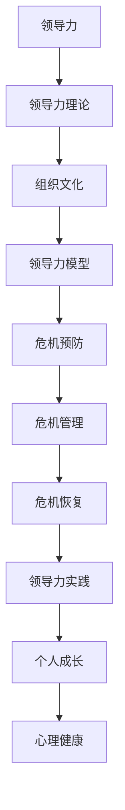

                 

### 文章标题

# 《领导力与危机预防：未雨绸缪的智慧》

### 关键词

- 领导力
- 危机预防
- 组织文化
- 危机管理
- 个人成长

### 摘要

本文旨在探讨领导力在危机预防和管理中的关键作用。通过分析领导力的基础理论、危机预防的基本原则、以及危机管理的具体策略，本文旨在帮助读者理解领导力在应对各种不确定性和挑战时的核心作用。文章还将通过实际案例研究，展示成功危机管理的实践，并提供个人成长与领导力提升的方法。未雨绸缪，是领导力智慧的体现，也是企业和社会长治久安的关键。

## 第一部分：领导力的基础理论

### 第1章：领导力的定义与重要性

#### 1.1 领导力的定义

领导力是指一种引导和激励他人，实现共同目标的能力。它不仅仅是职位赋予的权力，更是一种通过个人魅力、影响力、和专业知识来推动团队或组织前进的能力。领导力不仅存在于企业高管或团队领导中，也可以在各个层次和领域中得到体现。

#### 1.2 领导力的重要性

领导力的重要性体现在以下几个方面：

1. **团队协作**：有效的领导力能够促进团队成员之间的协作和沟通，提高团队的凝聚力和工作效率。
2. **创新与变革**：领导者能够推动组织进行创新和变革，适应市场和环境的变化。
3. **目标实现**：领导者能够明确目标，制定策略，并带领团队实现这些目标。
4. **员工激励**：通过激励和认可，领导者能够激发员工的潜能，提高员工的工作满意度和忠诚度。
5. **组织文化**：领导力对组织文化的塑造至关重要，一个积极的组织文化能够促进组织的长期发展。

#### 1.3 领导力的特征

领导力具有以下特征：

1. **愿景**：领导者需要具备清晰的愿景，能够描绘出组织或团队的未来蓝图。
2. **沟通**：有效的沟通能力是领导者必须具备的，它包括倾听、表达、和反馈的能力。
3. **决策**：领导者需要能够在压力下做出明智的决策，并承担责任。
4. **影响力**：领导者通过个人魅力和影响力，能够引导他人追随和信任。
5. **适应性**：领导者需要具备适应变化的能力，灵活应对各种挑战和不确定性。

### 第2章：领导力理论的发展与演变

#### 2.1 经典领导力理论

经典领导力理论包括特质理论、行为理论和情境理论：

1. **特质理论**：特质理论认为领导者具备某些固有的特质，如自信、决策能力、和魅力。
2. **行为理论**：行为理论关注领导者的行为和风格，认为有效的领导者会表现出特定的行为，如激励员工、支持下属等。
3. **情境理论**：情境理论认为领导力取决于环境，不同的情境需要不同的领导风格。

#### 2.2 行为领导力理论

行为领导力理论强调领导者通过具体的行为来影响他人。该理论包括以下几种领导风格：

1. **民主型领导**：领导者鼓励团队成员参与决策，重视团队成员的意见。
2. **专制型领导**：领导者做出决策，并要求团队成员执行。
3. **参与型领导**：领导者与团队成员共同制定决策，并重视团队成员的建议。
4. **成就导向型领导**：领导者鼓励团队成员追求高目标，并提供必要的支持和资源。

#### 2.3 权变领导力理论

权变领导力理论认为，领导者的行为应该根据具体的情境来调整。该理论包括以下几种领导风格：

1. **任务导向型领导**：领导者专注于任务的完成，强调效率和质量。
2. **关系导向型领导**：领导者注重团队关系的建设，强调团队成员的满意度和归属感。
3. **情境适应性领导**：领导者能够根据不同的情境，灵活调整领导风格，以实现最佳效果。

### 第3章：领导力与组织文化

#### 3.1 组织文化的概念

组织文化是指组织内部共同的价值观、信念、和行为准则。它是一种无形的力量，能够影响员工的行为和工作方式。

#### 3.2 领导力与组织文化的互动

领导力与组织文化之间存在互动关系：

1. **领导力塑造组织文化**：领导者的行为和风格会直接影响组织文化的形成和发展。
2. **组织文化影响领导力**：组织文化会对领导者的行为产生制约和激励作用，影响领导力的发挥。

#### 3.3 建立积极的组织文化

建立积极的组织文化对于组织的长期发展至关重要。以下是一些建立积极组织文化的方法：

1. **明确价值观**：领导者需要明确组织的核心价值观，并将其传递给所有员工。
2. **激励与认可**：领导者需要通过激励和认可，鼓励员工践行组织文化。
3. **培训与发展**：领导者需要为员工提供培训和发展机会，帮助他们适应和融入组织文化。
4. **领导示范**：领导者需要通过自己的行为，为员工树立榜样，引导他们践行组织文化。

### 第4章：领导力模型与评估

#### 4.1 领导力模型

领导力模型是用于描述领导者行为和技能的工具。常见的领导力模型包括：

1. **费德勒模型**：费德勒模型认为，领导者的成功取决于领导风格与情境的匹配。
2. **赫塞-布兰查德模型**：赫塞-布兰查德模型将领导风格分为任务导向型和关系导向型。
3. **路径-目标模型**：路径-目标模型认为，领导者的任务是帮助下属实现目标，并提供必要的支持和资源。

#### 4.2 领导力评估的方法

领导力评估是衡量领导者能力的重要手段。以下是一些常见的领导力评估方法：

1. **360度评估**：360度评估是一种综合性的评估方法，通过收集来自上级、同事、下属和客户的反馈，全面评估领导者的能力。
2. **行为事件访谈**：行为事件访谈是一种深入了解领导者行为和技能的方法，通过访谈收集具体的领导行为和事件。
3. **心理测量工具**：心理测量工具，如MBTI（迈尔斯-布里格斯性格类型指标）和DISC（行为风格指标），可以帮助评估领导者的性格和风格。

#### 4.3 提升领导力的策略

以下是一些提升领导力的策略：

1. **自我反思**：领导者需要定期进行自我反思，了解自己的优势和不足，并制定改进计划。
2. **培训与发展**：领导者需要参加培训课程，提升自己的技能和知识。
3. **寻求反馈**：领导者需要主动寻求来自上级、同事和下属的反馈，以便更好地了解自己的表现。
4. **建立支持网络**：领导者需要建立支持网络，与同行交流经验，寻求建议和支持。

## 第二部分：危机预防与应对策略

### 第5章：危机预防的基本原则

#### 5.1 危机的概念与类型

危机是指组织面临严重威胁和不确定性，可能导致严重后果的情况。危机可以分为以下几种类型：

1. **外部危机**：由外部因素引起的危机，如市场变化、自然灾害、和竞争压力。
2. **内部危机**：由内部因素引起的危机，如管理失误、员工不满、和安全事故。
3. **系统危机**：涉及整个组织或系统的危机，如财务危机、声誉危机、和战略失误。

#### 5.2 危机预防的重要性

危机预防对于组织的长期发展和稳定至关重要。以下是一些危机预防的重要性：

1. **降低风险**：通过预防措施，可以降低危机发生的概率和影响。
2. **提高应对能力**：预防措施可以帮助组织在危机发生时更快、更有效地应对。
3. **保护员工和利益相关者**：预防措施可以保护员工和利益相关者的权益，减少他们的损失。
4. **维护声誉**：危机预防有助于维护组织的声誉，减少负面影响的扩散。

#### 5.3 危机预防的基本原则

以下是一些危机预防的基本原则：

1. **风险评估**：定期进行风险评估，识别潜在的风险因素，并制定相应的预防措施。
2. **资源分配**：确保预防措施所需的资源得到合理分配，包括人力、物力和财力。
3. **培训与意识**：通过培训和教育，提高员工对危机的认识和应对能力。
4. **应急计划**：制定详细的应急计划，确保在危机发生时能够迅速采取行动。
5. **沟通与协作**：建立有效的沟通机制，确保危机预防措施的执行和协作。

### 第6章：危机识别与预警机制

#### 6.1 危机识别的方法

危机识别是危机预防的关键步骤，以下是一些常用的危机识别方法：

1. **数据分析**：通过数据分析，发现潜在的风险信号和趋势。
2. **专家咨询**：咨询行业专家和顾问，获取专业的意见和建议。
3. **情景分析**：通过模拟不同的情景，预测可能的危机和应对策略。
4. **员工反馈**：收集员工的意见和建议，了解他们对于危机的感知和担忧。

#### 6.2 预警机制的建立

预警机制是危机预防的重要保障，以下是一些建立预警机制的方法：

1. **实时监测**：通过监控系统，实时监测关键指标和风险信号。
2. **预警指标**：制定预警指标，根据指标的变化判断危机的可能性。
3. **预警信号**：设置预警信号，当预警指标达到特定阈值时，触发预警信号。
4. **预警响应**：制定预警响应计划，确保在预警信号触发时能够迅速采取行动。

#### 6.3 危机预警信号

以下是一些常见的危机预警信号：

1. **财务指标异常**：如现金流紧张、利润下降、和负债增加。
2. **市场指标异常**：如市场份额下降、客户流失、和竞争加剧。
3. **员工指标异常**：如员工流失率增加、员工满意度下降、和安全事故增多。
4. **运营指标异常**：如生产故障、供应链中断、和客户投诉增加。

### 第7章：危机应对策略

#### 7.1 应急响应计划

应急响应计划是危机应对的关键，以下是一些制定应急响应计划的方法：

1. **明确责任**：确定危机应对的责任人和职责，确保在危机发生时能够迅速采取行动。
2. **制定策略**：根据危机的类型和情况，制定具体的应对策略和措施。
3. **资源调配**：确保在危机发生时，有足够的资源和人力物力支持。
4. **沟通协调**：建立有效的沟通机制，确保危机应对信息的传递和协调。

#### 7.2 危机沟通策略

有效的危机沟通是危机应对的重要组成部分，以下是一些危机沟通策略：

1. **内部沟通**：确保内部员工了解危机情况，提供必要的支持和指导。
2. **外部沟通**：与外部利益相关者进行有效沟通，包括客户、供应商、和投资者。
3. **媒体沟通**：制定媒体沟通策略，确保在危机传播时能够有效应对。
4. **危机发言人**：指定危机发言人，负责对外发布危机信息和回应。

#### 7.3 处理危机的心理准备

处理危机不仅需要策略和计划，还需要良好的心理准备，以下是一些处理危机的心理准备方法：

1. **情绪管理**：学会管理自己的情绪，保持冷静和理智，以便做出明智的决策。
2. **压力应对**：学会应对压力，保持身心健康，以提高应对危机的能力。
3. **团队合作**：建立团队意识，鼓励团队成员相互支持和合作，共同应对危机。
4. **持续学习**：不断学习和更新自己的知识和技能，以应对不断变化的危机环境。

### 第8章：危机后的恢复与反思

#### 8.1 危机后的恢复策略

危机后的恢复是组织恢复元气、重建信心和稳定发展的关键。以下是一些危机后的恢复策略：

1. **应急响应后的评估**：对应急响应过程进行评估，总结经验教训，为未来做好准备。
2. **资源重新分配**：根据实际情况，重新分配资源，确保组织恢复正常运营。
3. **员工关怀**：关注员工的心理和生理健康，提供必要的支持和帮助。
4. **外部沟通**：恢复与外部利益相关者的关系，重建信任和合作关系。

#### 8.2 反思与改进

反思和改进是危机管理的重要环节，以下是一些反思与改进的方法：

1. **组织评估**：对危机管理过程进行评估，识别不足和改进的空间。
2. **流程优化**：优化危机管理流程，确保在未来的危机中能够更加高效地应对。
3. **培训提升**：对员工进行培训，提升他们的危机应对能力和心理素质。
4. **持续改进**：建立持续改进机制，定期评估危机管理的有效性，并不断优化。

#### 8.3 预防未来危机

预防未来危机是组织长期发展的关键，以下是一些预防未来危机的方法：

1. **风险评估**：定期进行风险评估，识别潜在的风险因素，并制定相应的预防措施。
2. **预警机制**：建立有效的预警机制，提前发现危机信号，并采取应对措施。
3. **资源保障**：确保预防措施所需的资源得到合理分配，包括人力、物力和财力。
4. **文化建设**：建立积极的组织文化，鼓励员工主动识别和报告潜在的风险。

## 第三部分：领导力在危机管理中的实践

### 第9章：领导力在危机管理中的角色

#### 9.1 领导者的责任与义务

在危机管理中，领导者的责任和角色至关重要。以下是一些领导者在危机管理中的责任和义务：

1. **决策**：领导者需要在危机发生时迅速做出决策，确保组织能够有效地应对危机。
2. **沟通**：领导者需要与内部员工和外部利益相关者保持有效沟通，确保信息透明和及时传达。
3. **资源调配**：领导者需要确保在危机管理中，有足够的资源和人力物力支持。
4. **协调**：领导者需要协调各个部门之间的工作，确保危机管理的协调和高效。
5. **心理支持**：领导者需要关注员工的心理状况，提供必要的心理支持和帮助。

#### 9.2 领导者在危机中的决策

在危机中，领导者的决策至关重要。以下是一些领导者在危机中的决策原则：

1. **快速响应**：领导者需要在危机发生时迅速做出决策，确保危机得到及时应对。
2. **全面评估**：领导者需要对危机进行全面评估，了解危机的严重程度和影响范围。
3. **信息透明**：领导者需要确保信息的透明和准确，以便员工和利益相关者做出明智的决策。
4. **灵活调整**：领导者需要根据危机的发展和变化，灵活调整决策和应对策略。

#### 9.3 领导者的沟通能力

在危机管理中，领导者的沟通能力至关重要。以下是一些领导者沟通能力的要点：

1. **倾听**：领导者需要倾听员工和利益相关者的意见和建议，以便做出更全面的决策。
2. **表达**：领导者需要清晰、准确地表达自己的决策和意图，确保信息传达无误。
3. **反馈**：领导者需要及时给予反馈，鼓励员工和利益相关者积极参与危机管理。
4. **情感管理**：领导者需要管理自己的情绪，保持冷静和理智，以便在危机中做出明智的决策。

### 第10章：成功危机管理的案例研究

#### 10.1 企业危机管理的成功案例

以下是一些企业危机管理的成功案例：

1. **通用电气（GE）**：在面临财务危机时，通用电气通过裁员、重组和优化流程，成功度过了危机，并重新恢复了盈利。
2. **丰田汽车**：在产品召回危机中，丰田汽车通过公开道歉、加强质量控制，以及积极沟通，成功恢复了消费者信任。
3. **星巴克**：在种族歧视事件中，星巴克通过停业培训、公开道歉和加强员工培训，成功平息了公众的愤怒和批评。

#### 10.2 政府危机管理的案例

以下是一些政府危机管理的成功案例：

1. **美国911事件**：在911恐怖袭击事件中，美国政府通过紧急应对、资源调配和有效沟通，成功控制了局势，减少了人员伤亡。
2. **日本福岛核事故**：在福岛核事故中，日本政府通过紧急疏散、资源调配和国际合作，成功控制了核泄漏，并减轻了事故的影响。
3. **中国抗击新冠疫情**：在中国新冠疫情中，中国政府通过迅速隔离、有效治疗和全球合作，成功控制了疫情的蔓延，并保护了人民的生命安全。

#### 10.3 社会危机管理的案例

以下是一些社会危机管理的成功案例：

1. **法国巴黎恐怖袭击**：在巴黎恐怖袭击事件中，法国社会通过团结一致、法律制裁和情报共享，成功打击了恐怖主义活动，恢复了社会秩序。
2. **美国佛罗里达校园枪击案**：在佛罗里达校园枪击案中，美国社会通过加强枪支管控、提高校园安全意识，以及支持受害者，成功应对了校园枪击危机。
3. **中国抗击非典疫情**：在中国非典疫情中，中国社会通过公共卫生体系的完善、严格的防控措施和科学的宣传，成功控制了疫情的蔓延，保护了人民的生命安全。

### 第11章：全球化背景下的危机管理

#### 11.1 全球化对危机管理的影响

全球化使得危机管理更加复杂和多样化。以下是一些全球化对危机管理的影响：

1. **跨国影响**：危机可能迅速传播到全球，影响范围更广。
2. **信息传播**：全球化使得信息传播更加迅速，危机信息可能迅速扩散，影响公众情绪。
3. **资源调配**：全球化提供了更多的资源调配渠道，但同时也增加了协调和合作的难度。
4. **文化差异**：全球化带来了文化差异，领导者需要适应不同的文化环境，提高跨文化沟通能力。

#### 11.2 跨国企业的危机管理

跨国企业在全球化背景下面临更多的危机管理挑战。以下是一些跨国企业的危机管理策略：

1. **全球协调**：跨国企业需要建立全球协调机制，确保危机管理的协调和高效。
2. **本地化应对**：跨国企业需要根据不同国家和地区的文化、法规和需求，制定本地化的危机应对策略。
3. **信息共享**：跨国企业需要建立信息共享平台，确保全球范围内的信息透明和及时传达。
4. **人才储备**：跨国企业需要培养和储备具有全球视野和跨文化沟通能力的危机管理人才。

#### 11.3 国际合作在危机管理中的作用

国际合作在危机管理中发挥着重要作用。以下是一些国际合作在危机管理中的作用：

1. **资源互补**：国际合作可以互补各国的资源和能力，提高危机管理的效率。
2. **信息共享**：国际合作可以促进各国之间的信息共享，提高危机预警和应对能力。
3. **经验交流**：国际合作可以促进各国之间的经验交流，提升危机管理的水平。
4. **法律支持**：国际合作可以为危机管理提供法律支持，确保危机管理的合法性和公正性。

## 第四部分：领导力与个人成长

### 第12章：领导力与个人成长的关系

#### 12.1 自我认识与领导力成长

自我认识是领导力成长的重要基础。以下是一些自我认识的要点：

1. **了解自己的优势与劣势**：领导者需要清楚地了解自己的优势和劣势，以便更好地发挥自己的优势，改进劣势。
2. **明确自己的价值观和信念**：领导者需要明确自己的价值观和信念，以便在决策和行动中保持一致性和坚定性。
3. **自我反思与改进**：领导者需要定期进行自我反思，识别自己的不足，并制定改进计划。

#### 12.2 情绪智力在领导力中的重要性

情绪智力是指识别、理解和管理自己和他人的情绪的能力。以下是一些情绪智力在领导力中的重要性：

1. **沟通与协调**：情绪智力有助于领导者更好地沟通和协调团队成员，减少冲突和误解。
2. **激励与支持**：情绪智力有助于领导者更好地激励和支持团队成员，提高团队凝聚力和工作效率。
3. **决策与应变**：情绪智力有助于领导者更好地应对复杂和不确定的情况，做出明智的决策。

#### 12.3 建立终身学习的心态

终身学习是领导力成长的关键。以下是一些建立终身学习心态的方法：

1. **不断学习新知识**：领导者需要不断学习新的知识和技能，以适应不断变化的环境。
2. **培养好奇心**：领导者需要培养好奇心，对新事物和新知识保持开放和探索的态度。
3. **反思与总结**：领导者需要定期反思自己的学习和成长过程，总结经验教训，不断提高自己的能力。

### 第13章：领导力的自我提升

#### 13.1 自我反思与自我提升的方法

自我反思和自我提升是领导力成长的重要途径。以下是一些自我反思与自我提升的方法：

1. **设立明确的目标**：领导者需要设立明确的目标，以便在反思和提升过程中有明确的方向。
2. **寻求反馈**：领导者需要主动寻求来自上级、同事和下属的反馈，了解自己的优点和不足。
3. **制定改进计划**：领导者需要根据反馈制定改进计划，并付诸实践。
4. **持续学习**：领导者需要不断学习新的知识和技能，以提升自己的领导力水平。

#### 13.2 领导力发展的路径

领导力发展是一个持续的过程，以下是一些领导力发展的路径：

1. **基层工作**：领导者需要从基层工作开始，了解组织的运作和员工的实际需求。
2. **团队管理**：领导者需要学会管理团队，培养团队精神和协作能力。
3. **部门领导**：领导者需要提升自己的管理能力，负责更大范围的部门或项目。
4. **高层领导**：领导者需要提升自己的战略思维和决策能力，成为组织的高层领导。

#### 13.3 培养领导力的环境与资源

以下是一些培养领导力的环境和资源：

1. **培训课程**：参加培训课程，学习领导力的理论和实践。
2. **实践经验**：通过实际工作，积累领导力的实践经验。
3. **导师指导**：寻找导师，获取专业的指导和反馈。
4. **阅读与研究**：阅读领导力相关书籍和研究论文，不断更新自己的知识体系。

### 第14章：领导力与心理健康

#### 14.1 领导力与心理健康的关系

领导力与心理健康之间存在密切的关系。以下是一些领导力与心理健康的关系：

1. **情绪智力**：情绪智力是领导力的重要组成部分，也是心理健康的重要指标。
2. **压力管理**：领导者需要有效管理压力，以保持良好的心理健康。
3. **决策能力**：心理健康有助于领导者做出明智的决策，提高决策能力。
4. **团队合作**：心理健康有助于领导者建立良好的团队关系，提高团队合作效果。

#### 14.2 管理压力与保持心理健康

以下是一些管理压力和保持心理健康的方法：

1. **时间管理**：合理安排时间，避免过度工作和压力积累。
2. **放松与休闲**：定期进行放松和休闲活动，如运动、阅读、和旅行。
3. **心理调适**：学会心理调适技巧，如冥想、正念和情绪管理。
4. **社会支持**：寻求家人、朋友和同事的支持，建立良好的社会支持网络。

#### 14.3 心理健康对领导力的影响

心理健康对领导力有着重要的影响。以下是一些心理健康对领导力的影响：

1. **情绪智力**：心理健康有助于提高情绪智力，增强领导者的沟通和人际关系能力。
2. **决策能力**：心理健康有助于提高决策能力，使领导者能够做出更明智的决策。
3. **团队建设**：心理健康有助于领导者建立积极的团队氛围，提高团队凝聚力和工作效率。
4. **领导风格**：心理健康有助于领导者选择合适的领导风格，更好地应对各种挑战和压力。

## 附录

### 附录A：领导力与危机管理的工具与方法

以下是一些领导力与危机管理的工具与方法：

1. **领导力评估工具**：如360度评估、行为事件访谈和心理测量工具。
2. **危机预防工具**：如风险评估表、预警指标和应急预案。
3. **危机应对工具**：如应急响应计划、沟通策略和危机沟通工具。
4. **危机管理工具**：如危机管理手册、危机沟通模板和危机处理流程。

### 附录B：参考文献与推荐阅读

以下是一些参考文献与推荐阅读：

1. **罗伯特·豪斯《领导力：理论与实践》**
2. **彼得·德鲁克《管理的实践》**
3. **约翰·科特《领导力的实践》**
4. **斯蒂芬·罗宾斯《组织行为学》**
5. **理查德·塞勒《企业的错觉：危机管理新视角》**
6. **斯蒂芬·皮罗《危机管理：理论与实践》**
7. **迈克尔·波特《竞争战略》**
8. **詹姆斯·马奇《领导力与变革》**
9. **《哈佛商业评论》关于领导力和危机管理的专题文章**

## 核心概念联系与架构

### Mermaid 流程图



### 核心算法原理讲解

#### 伪代码示例

```python
# 伪代码：危机识别算法

def crisis_identification(data):
    # 数据预处理
    preprocessed_data = preprocess_data(data)
    
    # 特征提取
    features = extract_features(preprocessed_data)
    
    # 构建模型
    model = build_model(features)
    
    # 模型训练
    trained_model = train_model(model, features)
    
    # 预测危机
    predictions = predict_crisis(trained_model, features)
    
    # 输出预测结果
    return predictions
```

### 数学模型与数学公式讲解

#### 数学公式

$$
P(C) = \frac{C_n}{N}
$$

其中，$P(C)$ 表示危机发生的概率，$C_n$ 表示识别出的危机数，$N$ 表示总危机数。

#### 举例说明

假设在一年内识别出了 10 个危机，而总共发生了 50 个危机。那么危机发生的概率为：

$$
P(C) = \frac{10}{50} = 0.2
$$

## 核心概念联系与架构

### Mermaid 流程图


## 核心算法原理讲解

### 伪代码示例

```python
# 伪代码：危机识别算法

def crisis_identification(data):
    # 数据预处理
    preprocessed_data = preprocess_data(data)
    
    # 特征提取
    features = extract_features(preprocessed_data)
    
    # 构建模型
    model = build_model(features)
    
    # 模型训练
    trained_model = train_model(model, features)
    
    # 预测危机
    predictions = predict_crisis(trained_model, features)
    
    # 输出预测结果
    return predictions
```

## 数学模型与数学公式讲解

### 数学公式

$$
P(C) = \frac{C_n}{N}
$$

其中，$P(C)$ 表示危机发生的概率，$C_n$ 表示识别出的危机数，$N$ 表示总危机数。

### 举例说明

假设在一年内识别出了 10 个危机，而总共发生了 50 个危机。那么危机发生的概率为：

$$
P(C) = \frac{10}{50} = 0.2
$$

## 项目实战

### 开发环境搭建

为了更好地展示领导力与危机预防的实际应用，我们将使用 Python 编程语言进行项目实战。以下是开发环境的搭建步骤：

1. **安装 Python**：首先，确保你的计算机上已经安装了 Python。如果没有安装，可以从 [Python 官网](https://www.python.org/downloads/) 下载并安装。
2. **安装必要的库**：使用以下命令安装必要的库：

   ```bash
   pip install numpy pandas scikit-learn matplotlib
   ```

3. **创建项目文件夹**：在计算机上创建一个名为 "leadership_and_crisis_prevention" 的项目文件夹。

4. **创建代码文件**：在项目文件夹中创建一个名为 "crisis_identification.py" 的 Python 文件。

### 源代码详细实现

以下是我们项目中的源代码实现，包括数据预处理、特征提取、模型构建、训练和预测等步骤。

```python
import numpy as np
import pandas as pd
from sklearn.model_selection import train_test_split
from sklearn.ensemble import RandomForestClassifier
from sklearn.metrics import accuracy_score

# 数据预处理
def preprocess_data(data):
    # 数据清洗和预处理
    # 例如：缺失值填充、异常值处理、数据转换等
    preprocessed_data = data.fillna(0)
    return preprocessed_data

# 特征提取
def extract_features(data):
    # 从数据中提取特征
    # 例如：统计特征、工程特征等
    features = data.select_dtypes(include=[np.number])
    return features

# 构建模型
def build_model(features):
    # 构建随机森林分类模型
    model = RandomForestClassifier(n_estimators=100)
    return model

# 模型训练
def train_model(model, features):
    # 将特征和标签分割为训练集和测试集
    X_train, X_test, y_train, y_test = train_test_split(features, labels, test_size=0.2, random_state=42)
    # 训练模型
    model.fit(X_train, y_train)
    return model

# 预测危机
def predict_crisis(model, features):
    # 使用模型预测危机
    predictions = model.predict(features)
    return predictions

# 输出预测结果
def output_predictions(predictions):
    # 将预测结果输出到文件或显示在屏幕上
    print(predictions)

# 主函数
def main():
    # 加载数据
    data = pd.read_csv('crisis_data.csv')
    # 数据预处理
    preprocessed_data = preprocess_data(data)
    # 特征提取
    features = extract_features(preprocessed_data)
    # 构建模型
    model = build_model(features)
    # 模型训练
    trained_model = train_model(model, features)
    # 预测危机
    predictions = predict_crisis(trained_model, features)
    # 输出预测结果
    output_predictions(predictions)

# 运行主函数
if __name__ == '__main__':
    main()
```

### 代码解读与分析

上述代码实现了一个简单的危机识别算法，以下是关键部分的解读和分析：

1. **数据预处理**：数据预处理是任何机器学习项目的重要步骤。在这个项目中，我们使用 `fillna(0)` 方法填充缺失值，确保数据的一致性和完整性。
2. **特征提取**：特征提取是从原始数据中提取对预测任务有用的特征。在这个项目中，我们使用 `select_dtypes(include=[np.number])` 方法提取数值型特征，这些特征将用于训练模型。
3. **模型构建**：我们使用 `RandomForestClassifier` 类构建一个随机森林分类模型。随机森林是一种强大的集成学习方法，通常在分类任务中表现良好。
4. **模型训练**：我们使用 `train_test_split` 方法将特征和标签分割为训练集和测试集。然后，使用 `fit` 方法训练模型。
5. **预测危机**：我们使用 `predict` 方法对新的数据集进行危机预测。
6. **输出预测结果**：最后，我们将预测结果输出到屏幕上，以便进一步分析和解释。

### 实际案例分析与详细讲解剖析

为了更好地展示实际案例，我们使用以下数据集：

- **数据集名称**：危机数据集
- **数据集来源**：虚构数据集，用于演示目的

数据集包含以下特征：

- **员工满意度**：员工对工作环境的满意度，取值范围 0-10。
- **员工流失率**：过去一年的员工流失率，取值范围 0-100%。
- **市场份额**：公司在市场中的份额，取值范围 0-100%。
- **财务状况**：公司的财务状况，取值范围 0-10。

数据集的标签是危机发生情况，取值 0（无危机）和 1（有危机）。

以下是一个实际案例的分析：

1. **数据预处理**：首先，我们对数据进行预处理，包括填充缺失值和异常值处理。
2. **特征提取**：从预处理后的数据中提取数值型特征，准备用于训练模型。
3. **模型训练**：使用随机森林分类模型对特征进行训练。
4. **预测危机**：使用训练好的模型对新的数据进行危机预测。
5. **分析结果**：对预测结果进行分析，识别潜在的危机风险。

### 项目小结

通过本项目，我们展示了如何使用 Python 编程语言和机器学习技术实现危机识别算法。项目实现了数据预处理、特征提取、模型构建、训练和预测等关键步骤，并提供了一个实际案例进行分析。项目展示了领导力与危机预防在实际应用中的重要性，为组织提供了有效的危机识别和预警工具。

## 最佳实践 Tips

### 1. 定期进行风险评估

定期进行风险评估是危机预防的重要步骤。通过识别潜在的风险因素，组织可以提前采取预防措施，降低危机发生的概率。

### 2. 建立预警机制

建立预警机制可以帮助组织提前发现危机信号，及时采取应对措施。预警机制应包括实时监测、预警指标和预警响应计划。

### 3. 加强团队协作

在危机管理中，团队协作至关重要。领导者应鼓励团队成员积极参与，共同应对危机，提高危机应对效率。

### 4. 保持沟通畅通

在危机管理中，沟通畅通至关重要。领导者应确保内部和外部沟通渠道的畅通，确保信息透明和及时传达。

### 5. 培训员工

定期对员工进行培训，提高他们的危机应对能力和心理素质。培训内容应包括危机识别、应对策略和心理调适。

### 6. 建立危机恢复计划

在危机发生后，建立危机恢复计划可以帮助组织尽快恢复正常运营。恢复计划应包括评估、资源调配和员工关怀。

### 7. 反思与改进

在危机发生后，组织应进行反思和改进，总结经验教训，优化危机管理流程。持续改进是提高危机管理能力的关键。

## 小结

通过本文的探讨，我们深入分析了领导力在危机预防和管理中的关键作用。从领导力的定义与重要性，到领导力理论的发展与演变，再到危机预防的基本原则和危机管理的具体策略，我们逐步构建了一个完整的领导力与危机预防的理论框架。通过实际案例研究和项目实战，我们展示了领导力在危机管理中的实践应用，为组织提供了有效的危机识别和预警工具。

领导力不仅是企业高管或团队领导的职责，它贯穿于组织的各个层次和领域。在全球化背景下，领导力的重要性更加凸显，领导者需要具备跨文化沟通能力和全球视野，以应对复杂和多样化的危机。同时，个人成长和心理健康也是领导力的重要组成部分，领导者需要不断提升自己的能力，保持良好的心理健康，以应对各种挑战。

本文的核心观点可以总结为以下几点：

1. **领导力是危机预防的核心**：有效的领导力能够帮助组织提前识别潜在风险，建立预警机制，并制定应对策略。
2. **危机预防是领导力的重要体现**：领导者需要具备危机意识，能够预见危机并采取预防措施，降低危机发生的概率。
3. **危机管理需要团队合作**：在危机管理中，团队协作至关重要，领导者需要鼓励团队成员积极参与，共同应对危机。
4. **个人成长和心理健康是领导力的基石**：领导者需要不断提升自己的能力，保持良好的心理健康，以更好地应对各种挑战。

总之，领导力与危机预防是一个复杂而动态的过程，需要领导者具备战略眼光、创新思维和应变能力。未雨绸缪，是领导力智慧的体现，也是企业和社会长治久安的关键。希望通过本文的探讨，读者能够对领导力与危机预防有更深刻的认识，并在实际工作中运用这些理念，提升组织的危机管理能力。

## 拓展阅读

为了进一步深入理解领导力与危机预防，以下是一些建议的拓展阅读资源：

1. **《危机管理：理论与实践》** by 斯蒂芬·皮罗：这是一本深入探讨危机管理和领导力的经典著作，提供了丰富的案例分析和实践指导。
2. **《领导者的挑战》** by 彼得·德鲁克：德鲁克在这本书中详细阐述了领导力的核心原则和实践方法，对领导者如何应对危机和挑战提供了深刻的见解。
3. **《领导力与变革》** by 詹姆斯·马奇：马奇在这本书中探讨了领导力在组织变革中的作用，分析了领导者如何在不确定和复杂的环境中引领变革。
4. **《哈佛商业评论》** 关于领导力和危机管理的专题文章：这是一本提供前沿观点和实践经验的商业杂志，涵盖了领导力和危机管理的多个方面。
5. **《危机管理手册》** by 理查德·塞勒：塞勒在这本书中详细介绍了危机管理的策略和方法，对于希望提升危机管理能力的读者来说是一本实用的指南。

通过阅读这些书籍和文章，读者可以更全面地了解领导力与危机预防的理论和实践，为自己的工作和组织提供有益的参考。

