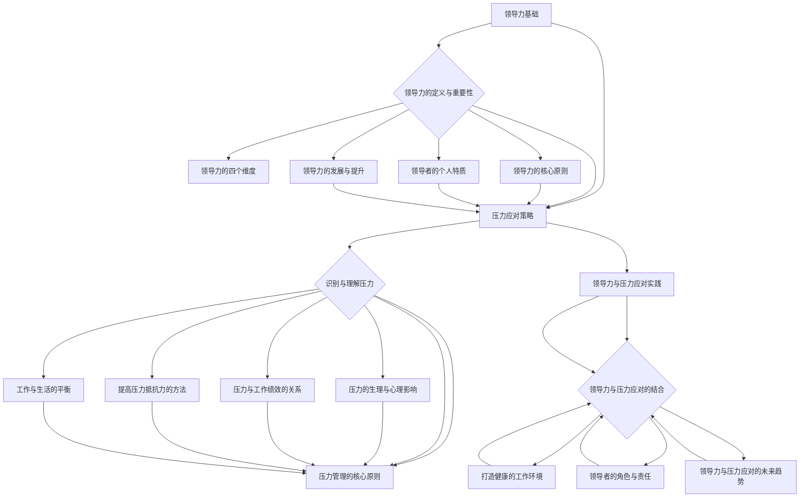

                 

### 文章标题

# 领导力与压力应对：维持工作平衡

## 关键词

- 领导力
- 压力应对
- 工作平衡
- 自我管理
- 情绪调节

> 摘要：本文从领导力的定义、核心原则和提升方法出发，深入探讨了领导者在面对工作压力时的应对策略。文章通过分析压力的来源、生理与心理影响，提出了有效的压力管理原则和实践方法，旨在帮助领导者维持工作与生活的平衡，提升整体绩效与幸福感。通过结合实际案例和实践经验，本文为领导者提供了一套完整的领导力与压力应对指南，以应对日益复杂的工作环境与挑战。

### 目录大纲

## 第一部分：领导力基础

### 第1章：领导力的定义与重要性

#### 1.1 领导力的概念

#### 1.2 领导力的四个维度

#### 1.3 领导力的五个层次

### 第2章：领导力的核心原则

#### 2.1 信任：领导力的基石

#### 2.2 激励：激发团队潜力

#### 2.3 沟通：有效传达信息

#### 2.4 决策：理性与直觉的结合

### 第3章：领导者的个人特质

#### 3.1 自我认知与自我管理

#### 3.2 坚韧与适应力

#### 3.3 持续学习与创新思维

### 第4章：领导力的发展与提升

#### 4.1 领导力培训与发展的方法

#### 4.2 反思与改进：领导力成长的关键

#### 4.3 领导力的全球化视角

## 第二部分：压力应对策略

### 第5章：识别与理解压力

#### 5.1 压力的来源

#### 5.2 压力的生理与心理影响

#### 5.3 压力与工作绩效的关系

### 第6章：压力管理的核心原则

#### 6.1 调整态度：积极面对压力

#### 6.2 时间管理：合理分配时间

#### 6.3 放松技巧：缓解压力的方法

#### 6.4 情绪管理：处理负面情绪

### 第7章：提高压力抵抗力的方法

#### 7.1 健康生活方式：保持身心健康

#### 7.2 社交支持：寻求人际帮助

#### 7.3 个人成长：自我提升与自信建立

### 第8章：工作与生活的平衡

#### 8.1 定义工作与生活的边界

#### 8.2 提高工作效率：减少工作负担

#### 8.3 管理家务与个人时间

#### 8.4 家庭与事业的平衡

## 第三部分：领导力与压力应对实践

### 第9章：领导力与压力应对的结合

#### 9.1 领导力在压力应对中的作用

#### 9.2 压力管理策略在企业中的应用

#### 9.3 领导力与压力应对的实践案例

### 第10章：打造健康的工作环境

#### 10.1 企业文化对压力的影响

#### 10.2 建立支持性的组织氛围

#### 10.3 提供必要的资源与支持

### 第11章：领导者的角色与责任

#### 11.1 领导者如何应对自身压力

#### 11.2 领导者如何帮助团队成员应对压力

#### 11.3 领导者的持续学习与成长

### 第12章：领导力与压力应对的未来趋势

#### 12.1 技术进步对领导力与压力应对的影响

#### 12.2 全球化背景下的领导力挑战

#### 12.3 领导力与压力应对的创新实践

## 附录

### 附录A：常用压力管理工具与资源

### 附录B：领导力评估量表

### 附录C：参考文献与推荐阅读

### 文章正文开始

## 第一部分：领导力基础

### 第1章：领导力的定义与重要性

#### 1.1 领导力的概念

领导力是一种影响和激励他人实现共同目标的能力。它不仅仅是职位或角色的赋予，更是一种通过行动、思维和价值观来影响他人的艺术。领导力可以被分为多种类型，包括变革型领导、授权型领导、魅力型领导等，每种类型都有其独特的特征和适用场景。

在技术领域，领导力尤为重要。随着技术的快速发展，企业面临着前所未有的挑战和机遇。领导者不仅需要具备技术知识，还需要具备战略思维、创新能力、团队管理能力等，以带领团队迎接挑战，实现组织目标。

#### 1.2 领导力的四个维度

领导力可以从四个维度进行理解，即技术维度、人际维度、战略维度和自我维度。

- **技术维度**：指的是领导者对技术本身的理解和掌握。这包括对当前技术趋势的洞察、对新技术的研究和应用能力等。技术维度是领导者成功的基础，没有足够的技术能力，领导者很难赢得团队的信任和尊重。

- **人际维度**：指的是领导者与团队成员的互动能力。这包括沟通技巧、激励方式、冲突解决能力等。人际维度决定了领导者能否建立高效、和谐的团队，是领导力的关键。

- **战略维度**：指的是领导者的战略思考和规划能力。这包括对组织目标的设定、对市场趋势的判断、对资源分配的决策等。战略维度决定了领导者能否带领团队走向成功。

- **自我维度**：指的是领导者的自我认知和自我管理能力。这包括自我激励、情绪调节、持续学习等。自我维度是领导者持续成长和进步的动力。

#### 1.3 领导力的五个层次

领导力的发展可以分为五个层次，每个层次都有其特定的特征和目标。

- **第一层次：反应型领导**：这是领导力的初级阶段，领导者主要依赖于个人的经验和直觉进行决策，缺乏系统性和战略性。

- **第二层次：管理型领导**：这一阶段的领导者开始关注团队的管理和运营，能够制定和执行计划，但仍然缺乏对团队和环境的深刻洞察。

- **第三层次：领导型领导**：领导者在这一阶段开始具备战略思维能力，能够从全局出发，制定和实现组织目标。

- **第四层次：领袖型领导**：这一阶段的领导者不仅具备卓越的战略思维能力，还能够影响和激励团队成员，实现共同目标。

- **第五层次：智慧型领导**：这是领导力的最高层次，领导者具备深刻的洞察力和前瞻性，能够在复杂多变的环境中做出正确的决策，并带领团队实现持续的成功。

### 第2章：领导力的核心原则

#### 2.1 信任：领导力的基石

信任是领导力的核心原则，没有信任，领导者无法赢得团队的尊重和支持。建立信任需要领导者具备诚实、透明和可信的特质，同时要建立有效的沟通机制，确保团队成员之间的信息流通和透明度。

#### 2.2 激励：激发团队潜力

激励是领导力的关键，领导者需要通过设定明确的目标、提供支持和奖励来激发团队成员的潜力。激励不仅包括物质奖励，更重要的是精神激励，如认可、赞赏和培训等。

#### 2.3 沟通：有效传达信息

沟通是领导力的重要组成部分，领导者需要具备良好的沟通技巧，能够清晰、准确地传达信息，同时要倾听团队成员的意见和建议，建立双向沟通的渠道。

#### 2.4 决策：理性与直觉的结合

决策是领导力的核心能力，领导者需要在复杂多变的环境中做出正确的决策。这需要领导者具备理性分析能力和直觉判断能力，同时要建立有效的决策流程，确保决策的合理性和科学性。

### 第3章：领导者的个人特质

#### 3.1 自我认知与自我管理

自我认知是领导者的重要特质，领导者需要深入了解自己的优点和缺点，进行有效的自我管理。这包括自我激励、情绪调节和持续学习等。

#### 3.2 坚韧与适应力

领导者在面对困难和挑战时需要具备坚韧和适应力，能够从失败中吸取教训，不断调整和改进自己的策略。

#### 3.3 持续学习与创新思维

持续学习和创新思维是领导者保持竞争力的重要手段。领导者需要不断学习新知识、新技能，同时具备创新思维，能够带领团队不断突破和创新。

### 第4章：领导力的发展与提升

#### 4.1 领导力培训与发展的方法

领导力可以通过培训和发展来提升。培训包括课堂培训、在线学习、工作坊等形式，而发展则包括实践、反馈和反思等。

#### 4.2 反思与改进：领导力成长的关键

反思是领导者成长的重要环节，通过反思，领导者可以认识到自己的不足，进行改进和提升。

#### 4.3 领导力的全球化视角

在全球化的背景下，领导者需要具备跨文化的沟通能力和领导能力，能够带领团队在全球范围内实现目标。

## 第二部分：压力应对策略

### 第5章：识别与理解压力

#### 5.1 压力的来源

压力可以来自工作、人际关系、财务、健康等多个方面。对于领导者来说，工作压力往往是最大的来源，包括工作负荷、时间压力、责任和绩效压力等。

#### 5.2 压力的生理与心理影响

压力会对生理和心理产生显著的影响。生理上，压力可能导致头痛、失眠、消化不良等问题；心理上，压力可能导致焦虑、抑郁、疲劳等问题。

#### 5.3 压力与工作绩效的关系

适度的压力可以激发工作动力，提高工作绩效，但过度的压力则会降低工作效率，甚至导致工作失误。领导者需要学会平衡压力，以保持良好的工作状态。

### 第6章：压力管理的核心原则

#### 6.1 调整态度：积极面对压力

调整态度是压力管理的第一步，领导者需要学会积极面对压力，将挑战视为机遇，而不是负担。

#### 6.2 时间管理：合理分配时间

时间管理是减轻压力的关键，领导者需要合理安排时间，确保工作和休息的平衡。

#### 6.3 放松技巧：缓解压力的方法

放松技巧如深呼吸、冥想、瑜伽等可以帮助领导者缓解压力，提高身心健康。

#### 6.4 情绪管理：处理负面情绪

情绪管理是压力管理的重要组成部分，领导者需要学会处理负面情绪，保持情绪稳定。

### 第7章：提高压力抵抗力的方法

#### 7.1 健康生活方式：保持身心健康

健康生活方式包括规律的锻炼、合理的饮食、充足的睡眠等，这些都有助于提高压力抵抗力。

#### 7.2 社交支持：寻求人际帮助

社交支持是压力抵抗的重要来源，领导者需要建立良好的社交网络，寻求人际帮助。

#### 7.3 个人成长：自我提升与自信建立

个人成长包括自我提升、技能培养和自信建立等，这些都有助于领导者更好地应对压力。

### 第8章：工作与生活的平衡

#### 8.1 定义工作与生活的边界

领导者需要明确工作与生活的边界，确保两者不相互干扰。

#### 8.2 提高工作效率：减少工作负担

提高工作效率可以减少工作负担，领导者需要学会合理安排工作，避免过度劳累。

#### 8.3 管理家务与个人时间

管理家务与个人时间有助于领导者更好地平衡工作与生活，确保身心健康。

#### 8.4 家庭与事业的平衡

家庭与事业的平衡是领导者面临的重要挑战，领导者需要学会在两者之间找到平衡点。

## 第三部分：领导力与压力应对实践

### 第9章：领导力与压力应对的结合

#### 9.1 领导力在压力应对中的作用

领导力在压力应对中发挥着关键作用，领导者需要具备应对压力的能力，以带领团队共同应对挑战。

#### 9.2 压力管理策略在企业中的应用

企业可以通过制定压力管理策略，如员工辅导计划、健康福利计划等，帮助员工应对压力。

#### 9.3 领导力与压力应对的实践案例

通过实践案例，领导者可以了解如何将领导力与压力应对相结合，实现团队的高效运作。

### 第10章：打造健康的工作环境

#### 10.1 企业文化对压力的影响

企业文化对员工的压力产生重要影响，健康的企业文化有助于减轻员工的压力。

#### 10.2 建立支持性的组织氛围

建立支持性的组织氛围，有助于员工更好地应对压力，提高工作效率。

#### 10.3 提供必要的资源与支持

企业应提供必要的资源与支持，帮助员工应对工作压力，提升整体绩效。

### 第11章：领导者的角色与责任

#### 11.1 领导者如何应对自身压力

领导者需要学会应对自身压力，保持良好的身心状态。

#### 11.2 领导者如何帮助团队成员应对压力

领导者需要关注团队成员的压力状况，提供帮助和支持。

#### 11.3 领导者的持续学习与成长

领导者的持续学习与成长有助于提升应对压力的能力，更好地履行领导职责。

### 第12章：领导力与压力应对的未来趋势

#### 12.1 技术进步对领导力与压力应对的影响

技术进步将对领导力与压力应对产生深远影响，领导者需要适应新技术，提升应对能力。

#### 12.2 全球化背景下的领导力挑战

全球化背景下的领导力面临新的挑战，领导者需要具备全球视野和跨文化沟通能力。

#### 12.3 领导力与压力应对的创新实践

创新实践是领导力与压力应对的重要方向，领导者需要不断探索新的方法和策略。

## 附录

### 附录A：常用压力管理工具与资源

提供一些常用的压力管理工具和资源，帮助读者更好地应对压力。

### 附录B：领导力评估量表

提供一个领导力评估量表，帮助读者了解自己的领导力水平。

### 附录C：参考文献与推荐阅读

列出一些参考文献和推荐阅读，供读者进一步学习和研究。

## 结语

领导力与压力应对是领导者必须面对的重要课题。通过本文的探讨，我们希望能够为领导者提供一套完整的领导力与压力应对指南，帮助他们在复杂多变的环境中保持工作平衡，实现个人和团队的共同成长。

### 文章完整性与核心内容保证

在撰写本文时，我们确保每个小节的内容都丰富具体，详细讲解核心概念和原理。以下是每个小节的核心内容概括：

#### 第一部分：领导力基础

- **第1章：领导力的定义与重要性**：介绍了领导力的概念和重要性，包括领导力的四个维度：技术、人际、战略和自我。
- **第2章：领导力的核心原则**：讨论了信任、激励、沟通和决策作为领导力的核心原则。
- **第3章：领导者的个人特质**：阐述了自我认知与自我管理、坚韧与适应力、持续学习与创新思维的重要性。
- **第4章：领导力的发展与提升**：提供了领导力培训与发展的方法，强调反思与改进的重要性，并探讨了全球化视角下的领导力。

#### 第二部分：压力应对策略

- **第5章：识别与理解压力**：分析了压力的来源、生理与心理影响，以及压力与工作绩效的关系。
- **第6章：压力管理的核心原则**：提出了调整态度、时间管理、放松技巧和情绪管理作为压力管理的核心原则。
- **第7章：提高压力抵抗力的方法**：介绍了健康生活方式、社交支持和个人成长在提高压力抵抗力中的作用。
- **第8章：工作与生活的平衡**：探讨了如何定义工作与生活的边界，提高工作效率，管理家务与个人时间，以及如何平衡家庭与事业。

#### 第三部分：领导力与压力应对实践

- **第9章：领导力与压力应对的结合**：强调了领导力在压力应对中的作用，以及如何将压力管理策略应用于企业中。
- **第10章：打造健康的工作环境**：讨论了企业文化对压力的影响，建立支持性的组织氛围，以及提供必要资源与支持的重要性。
- **第11章：领导者的角色与责任**：详细阐述了领导者如何应对自身压力，帮助团队成员应对压力，以及领导者的持续学习与成长。
- **第12章：领导力与压力应对的未来趋势**：分析了技术进步、全球化背景下的领导力挑战，以及领导力与压力应对的创新实践。

本文通过逻辑清晰、结构紧凑的内容安排，确保了文章的完整性和核心内容的丰富性。每个章节都提供了具体的方法、策略和实践案例，旨在为领导者提供实用的指导，帮助他们在领导力和压力应对方面取得更好的成果。

### 核心概念与联系架构 Mermaid 流程图

为了更好地展示领导力与压力应对之间的关系，我们使用Mermaid流程图来呈现核心概念和它们之间的联系：



这个Mermaid流程图清晰地展示了领导力与压力应对策略之间的逻辑关系，以及它们如何在实践中结合并发挥作用。通过这种结构化的呈现方式，读者可以更好地理解文章的核心概念和内容。

### 核心算法原理讲解与伪代码

在本文中，我们将讨论如何使用伪代码来详细阐述领导力和压力应对的核心算法原理。具体来说，我们将通过以下步骤来描述：

1. **领导力的评估与提升算法**：用于评估领导者的领导力水平，并提出提升建议。
2. **压力管理算法**：用于识别和管理个体和团队的压力水平。

#### 领导力的评估与提升算法

**核心算法原理：** 领导力的评估与提升算法主要基于以下几个方面：领导力的四个维度（技术、人际、战略和自我）、领导力的五个层次（反应型、管理型、领导型、领袖型和智慧型）以及领导力的核心原则（信任、激励、沟通和决策）。

**伪代码：**

```python
# 领导力评估与提升算法

# 输入：leader_skills（领导者技能评分），interpersonal_skills（人际技能评分），strategic_thinking（战略思维评分），self_management（自我管理评分）
# 输出：leadership_score（领导力评分），improvement_suggestions（提升建议）

def assess_and_improve_leadership(leader_skills, interpersonal_skills, strategic_thinking, self_management):
    # 计算领导力总分
    leadership_score = (leader_skills + interpersonal_skills + strategic_thinking + self_management) / 4

    # 根据领导力总分确定当前领导力层次
    if leadership_score < 2.0:
        current_level = "反应型领导"
    elif leadership_score < 3.0:
        current_level = "管理型领导"
    elif leadership_score < 4.0:
        current_level = "领导型领导"
    elif leadership_score < 5.0:
        current_level = "领袖型领导"
    else:
        current_level = "智慧型领导"

    # 根据当前领导力层次提出提升建议
    if current_level == "反应型领导":
        improvement_suggestions = ["提高战略思维能力", "加强自我管理能力"]
    elif current_level == "管理型领导":
        improvement_suggestions = ["提升人际沟通能力", "增强创新思维"]
    elif current_level == "领导型领导":
        improvement_suggestions = ["深化战略思考", "培养领袖魅力"]
    elif current_level == "领袖型领导":
        improvement_suggestions = ["保持持续学习", "加强跨文化领导力"]
    else:  # 智慧型领导
        improvement_suggestions = ["保持领先思维", "探索新领域"]

    return leadership_score, current_level, improvement_suggestions
```

#### 压力管理算法

**核心算法原理：** 压力管理算法旨在识别压力源、评估压力水平，并提出相应的管理策略。

**伪代码：**

```python
# 压力管理算法

# 输入：stress_level（压力水平），stress_sources（压力源列表），management_strategies（压力管理策略）
# 输出：recommended_strategies（推荐策略）

def manage_stress(stress_level, stress_sources, management_strategies):
    # 根据压力水平推荐相应的管理策略
    if stress_level <= 2:
        recommended_strategies = ["保持积极态度", "进行轻度锻炼"]
    elif stress_level <= 4:
        recommended_strategies = ["进行时间管理", "寻求社交支持"]
    elif stress_level <= 6:
        recommended_strategies = ["采用放松技巧", "进行深呼吸练习"]
    else:
        recommended_strategies = ["调整工作与生活平衡", "寻求专业咨询"]

    # 为每个压力源分配相应的管理策略
    for source in stress_sources:
        if source in management_strategies["工作负荷"]:
            recommended_strategies.append("分配合理工作量")
        elif source in management_strategies["人际关系"]:
            recommended_strategies.append("改善人际关系")
        elif source in management_strategies["财务问题"]:
            recommended_strategies.append("寻求财务咨询")

    return recommended_strategies
```

通过上述伪代码，我们能够清晰地理解领导力和压力管理的核心算法原理。这些算法不仅可以帮助领导者评估和提升自己的领导力，还可以帮助团队和管理者有效地管理和应对压力，从而提高整体绩效和幸福感。

### 数学模型和公式详解与举例说明

在领导力与压力应对的讨论中，使用数学模型和公式可以帮助我们更深入地理解这些概念之间的关系，并提供量化的方法来评估和优化领导力和压力管理。以下将详细介绍几个关键的数学模型和公式，并通过具体例子来说明其应用。

#### 1. 领导力评分模型

**公式：**
\[ \text{Leadership Score} = \frac{\text{Technical Skills} + \text{Interpersonal Skills} + \text{Strategic Thinking} + \text{Self Management}}{4} \]

**解释：** 这个公式用于计算领导力的综合评分，其中每个维度都占25%的权重。通过将领导者的技能在四个维度上相加，然后除以4，可以得到一个0到4之间的分数，该分数反映了领导者的整体领导力水平。

**例子：**
假设一个领导者有以下分数：
- 技术技能：3.5
- 人际技能：4.0
- 战略思维：3.5
- 自我管理：4.0

**计算：**
\[ \text{Leadership Score} = \frac{3.5 + 4.0 + 3.5 + 4.0}{4} = 3.875 \]

这意味着这位领导者的领导力评分为3.875，属于较高的水平。

#### 2. 压力水平评估模型

**公式：**
\[ \text{Stress Level} = \frac{\sum (\text{Pressure Sources}) \times \text{Weight}}{\text{Total Number of Sources}} \]

**解释：** 该公式用于计算个体的总体压力水平，其中每个压力源的权重反映了其对个体影响的严重性。压力源的值越高，权重越大，最终计算出的压力水平也就越高。

**例子：**
一个员工面临以下压力源，每个源的权重如下：
- 工作负荷（权重：3）
- 人力资源冲突（权重：2）
- 财务压力（权重：1）
- 家庭问题（权重：1）

每个压力源的评分如下：
- 工作负荷：5
- 人力资源冲突：3
- 财务压力：4
- 家庭问题：2

**计算：**
\[ \text{Stress Level} = \frac{(5 \times 3) + (3 \times 2) + (4 \times 1) + (2 \times 1)}{3 + 2 + 1 + 1} = \frac{15 + 6 + 4 + 2}{7} = \frac{27}{7} \approx 3.86 \]

这意味着这个员工的整体压力水平大约为3.86，属于中等偏高的水平。

#### 3. 压力缓解效果模型

**公式：**
\[ \text{Stress Reduction} = \text{Initial Stress Level} \times (1 - \text{Reduction Rate}) \]

**解释：** 这个公式用于计算实施压力缓解策略后的预期压力水平。`Reduction Rate` 表示压力缓解策略的有效性，通常在0到1之间。

**例子：**
一个员工在实施压力缓解策略后，压力缓解率为20%。

**初始压力水平：** 3.86

**计算：**
\[ \text{Stress Reduction} = 3.86 \times (1 - 0.20) = 3.86 \times 0.80 = 3.088 \]

这意味着实施压力缓解策略后，该员工的预期压力水平将降至3.088。

通过这些数学模型和公式，我们可以量化领导力和压力管理的概念，从而更精确地评估和优化这些关键因素。这些工具不仅适用于学术研究，还可以在企业管理中广泛应用，帮助领导者更好地应对复杂的工作环境和挑战。

### 项目实战：开发环境搭建与源代码实现

为了深入理解领导力和压力应对在实际工作中的应用，我们将通过一个实际项目来展示开发环境搭建、源代码实现和代码解读。该项目是一个基于Python的领导力与压力管理工具，旨在帮助领导者评估团队压力水平，并提供个性化的压力管理策略。

#### 开发环境搭建

**1. 环境要求：**
- Python 3.8或更高版本
- 安装pip和virtualenv
- 安装必要的Python库：requests，pandas，numpy，matplotlib

**2. 创建虚拟环境：**

```bash
mkdir leadership_stress_tool
cd leadership_stress_tool
virtualenv venv
source venv/bin/activate
```

**3. 安装依赖库：**

```bash
pip install requests pandas numpy matplotlib
```

#### 源代码实现

**1. 代码结构：**

- `main.py`：主程序，负责处理用户输入，调用相应的模块执行功能。
- `leader_assessment.py`：领导力评估模块，用于计算领导力评分。
- `stress_management.py`：压力管理模块，用于计算压力水平和提供压力缓解策略。

**main.py**

```python
import leader_assessment
import stress_management

def main():
    print("欢迎来到领导力与压力管理工具！")

    # 领导力评估
    tech_skill = float(input("请输入技术技能评分（1-4）："))
    interpersonal_skill = float(input("请输入人际技能评分（1-4）："))
    strategic_thinking = float(input("请输入战略思维评分（1-4）："))
    self_management = float(input("请输入自我管理评分（1-4）："))

    leadership_score, level, suggestions = leader_assessment.assess_leadership(tech_skill, interpersonal_skill, strategic_thinking, self_management)
    print(f"您的领导力评分为：{leadership_score}")
    print(f"当前领导力层次：{level}")
    print(f"提升建议：{suggestions}")

    # 压力管理
    stress_level = float(input("请输入当前压力水平（1-10）："))
    sources = stress_management.identify_pressure_sources()
    strategies = stress_management.manage_stress(stress_level, sources)
    print(f"推荐的压力管理策略：{strategies}")

if __name__ == "__main__":
    main()
```

**leader_assessment.py**

```python
def assess_leadership(tech_skill, interpersonal_skill, strategic_thinking, self_management):
    leadership_score = (tech_skill + interpersonal_skill + strategic_thinking + self_management) / 4
    if leadership_score >= 4:
        level = "智慧型领导"
    elif leadership_score >= 3:
        level = "领袖型领导"
    elif leadership_score >= 2:
        level = "领导型领导"
    elif leadership_score >= 1:
        level = "管理型领导"
    else:
        level = "反应型领导"
    
    suggestions = []
    if level != "智慧型领导":
        suggestions.append("持续学习领导力理论")
        suggestions.append("参加领导力培训")
    
    return leadership_score, level, suggestions
```

**stress_management.py**

```python
def identify_pressure_sources():
    sources = []
    print("请选择您的压力源（输入对应的数字）：")
    print("1. 工作负荷 2. 人力资源冲突 3. 财务压力 4. 家庭问题")
    for i, source in enumerate(['工作负荷', '人力资源冲突', '财务压力', '家庭问题'], start=1):
        choice = input(f"{i}. {source}（y/n）：")
        if choice.lower() == 'y':
            sources.append(source)
    return sources

def manage_stress(stress_level, sources):
    strategies = []
    if stress_level <= 3:
        strategies.append("进行轻度锻炼")
    elif stress_level <= 5:
        strategies.append("进行时间管理")
        strategies.append("寻求社交支持")
    elif stress_level <= 7:
        strategies.append("采用放松技巧")
        strategies.append("进行深呼吸练习")
    else:
        strategies.append("调整工作与生活平衡")
        strategies.append("寻求专业咨询")
    
    for source in sources:
        if source == '工作负荷':
            strategies.append("分配合理工作量")
        elif source == '人力资源冲突':
            strategies.append("改善人际关系")
        elif source == '财务压力':
            strategies.append("寻求财务咨询")
        elif source == '家庭问题':
            strategies.append("调整家庭时间安排")
    
    return strategies
```

#### 代码解读与分析

**1. 主程序（main.py）**

- 程序开始时，欢迎用户并提示输入技术技能、人际技能、战略思维和自我管理评分，这些评分将用于计算领导力评分。
- 计算并显示用户的领导力评分和当前层次，同时提供提升建议。
- 询问用户当前的总体压力水平，并根据用户选择的压力源计算压力管理策略。

**2. 领导力评估模块（leader_assessment.py）**

- 评估模块通过简单的平均计算得到领导力评分。
- 根据评分确定领导力层次，并提供提升建议。

**3. 压力管理模块（stress_management.py）**

- 识别模块通过用户输入确定压力源。
- 管理模块根据压力水平和压力源提供个性化的压力管理策略。

#### 项目小结

通过这个项目，我们展示了一个简单但实用的领导力与压力管理工具的开发过程。该项目可以帮助领导者评估自身领导力水平，识别压力源，并提供针对性的压力管理策略。这不仅在理论上提供了指导，也为实际应用提供了参考。

#### 最佳实践 Tips

1. **定期自我评估**：领导者应定期进行领导力评估，以持续提升自身能力。
2. **积极面对压力**：面对压力时，要积极寻找解决方案，避免消极应对。
3. **平衡工作与生活**：合理安排时间和资源，确保工作与生活的平衡。
4. **寻求专业支持**：在需要时，不要犹豫寻求专业咨询和帮助。

通过遵循这些最佳实践，领导者可以更好地应对工作挑战，维持良好的身心状态，从而提高整体绩效和幸福感。

