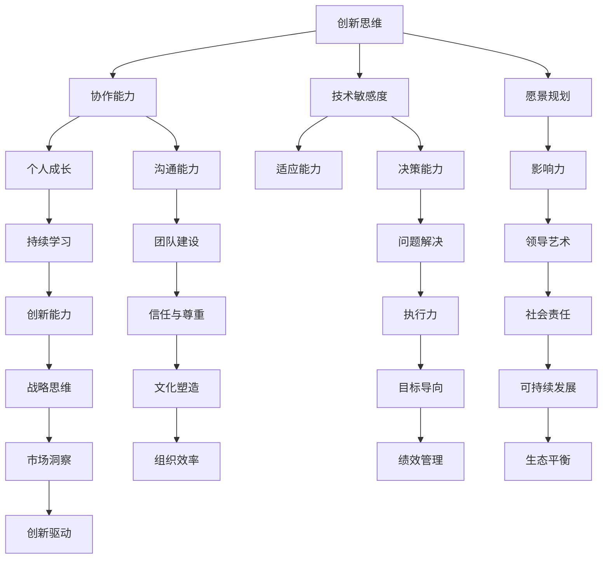

                 

### 文章标题

# 领导力与压力管理3.0：高压下的心理健康

### 关键词

- 领导力3.0
- 压力管理3.0
- 高压环境
- 心理健康
- 数字化时代
- 领导力与压力管理整合

### 摘要

在当今快节奏、高度竞争的数字化时代，领导力和压力管理成为了职场成功的关键要素。本文旨在探讨领导力与压力管理3.0的概念、原理和实践，强调在高压环境下维护心理健康的重要性。文章首先介绍了领导力3.0和压力管理3.0的核心概念，随后通过理论分析和实际案例，展示了如何在实际工作中运用这些方法来提升领导力和有效管理压力。通过本文的阅读，读者将深入了解如何在高压环境下保持心理健康，成为更加高效和有影响力的领导者。

### 引言与背景知识

#### 第1章 引言

##### 1.1 什么是领导力与压力管理3.0

**定义与背景**：领导力与压力管理3.0是在当前数字化时代背景下提出的全新概念，旨在应对快速变化的工作环境和日益增多的职业压力。领导力3.0不仅强调传统领导力中的领导技能，更强调在复杂多变的环境中，领导者如何通过创新思维和协作能力来激发团队潜力。压力管理3.0则从传统的心理调适方法出发，引入了科技和心理学的最新研究成果，提供了一套系统化的应对高压环境的方法。

**与传统领导力与压力管理的差异**：传统领导力强调权威和命令，而领导力3.0更注重平等、协作和共同成长。传统压力管理多侧重于放松技巧和短期的心理缓解，而压力管理3.0则通过系统化的方法，从根源上降低压力水平，提升长期的心理健康。

**当前社会与工作环境中的压力来源**：现代社会工作环境的压力主要来源于以下几个方面：

1. **工作负荷**：快速的工作节奏和高强度的工作要求，使得员工感受到巨大的时间压力。
2. **绩效压力**：竞争激烈的职场环境要求员工在绩效上不断突破，导致精神紧张。
3. **职业发展**：对职业晋升和个人成长的期望，往往使员工承受额外的心理压力。
4. **人际关系**：复杂的人际关系网络和沟通障碍，可能导致情感压力和焦虑。

##### 1.2 高压下的心理健康

**心理健康的重要性**：心理健康不仅是个人幸福感的保障，也是工作表现和创新能力的基础。一个心理健康的人能够更好地应对挑战，保持积极的工作态度，从而提高工作效率和质量。

**高压工作环境对心理健康的挑战**：高压环境对心理健康的影响是多方面的：

1. **情绪问题**：长期处于高压状态可能导致情绪波动，如焦虑、抑郁和易怒。
2. **认知问题**：压力可能导致注意力不集中，记忆力下降，影响工作表现。
3. **身体问题**：长期的压力还可能引发一系列身体问题，如失眠、疲劳和免疫力下降。
4. **工作满意度**：过度的压力会降低员工对工作的满意度，影响团队凝聚力。

**心理健康对领导力的影响**：心理健康不仅影响个人的工作表现，也会对领导力产生深远的影响。一个心理健康、心态积极的领导者能够更好地与团队成员沟通，激发团队的潜力，提升团队的整体绩效。

#### 第2章 领导力与压力管理3.0的核心概念

##### 2.1 领导力3.0

**领导力的定义与发展**：领导力是指引导和影响他人共同实现目标的能力。随着时代的发展，领导力的定义也在不断演变。传统领导力主要关注权威和指挥，而现代领导力强调领导者的服务精神和团队协作。

**领导力3.0的关键特征**：领导力3.0在数字化时代背景下，表现出以下关键特征：

1. **创新思维**：领导者需要具备创新思维，能够在复杂多变的环境中迅速应对和解决问题。
2. **协作能力**：领导力3.0强调平等和协作，领导者通过与团队成员的共同努力来实现目标。
3. **技术敏感度**：数字化时代要求领导者对新技术有敏感度，能够利用技术提升工作效率和创新能力。
4. **个人成长**：领导者需要不断学习和成长，以适应快速变化的环境。

**领导力3.0与数字化时代的关系**：数字化时代带来了信息的快速传播和沟通方式的变革，领导者需要适应这种变化，利用数字工具和平台来提升团队效率和沟通效果。同时，数字化时代也要求领导者具备更强的创新能力和适应能力，以应对快速变化的市场环境。

##### 2.2 压力管理3.0

**压力管理的传统方法**：传统的压力管理方法主要包括放松技巧、心理疏导和身体锻炼等。这些方法在一定程度上能够缓解压力，但往往缺乏系统性和长期效果。

**压力管理3.0的新思路**：压力管理3.0在传统方法的基础上，引入了科技和心理学的最新研究成果，提供了一套系统化的应对高压环境的方法。具体包括：

1. **心理调适**：通过认知行为疗法和正念等方法，帮助个体调整心态，降低压力感受。
2. **时间管理**：通过科学的日程安排和优先级排序，合理分配时间和精力，减轻工作压力。
3. **科技支持**：利用科技手段，如在线压力监测工具和虚拟放松室等，提供个性化的压力管理方案。
4. **团队支持**：通过团队建设活动和心理辅导，增强团队成员之间的支持，共同应对压力。

**如何应对高压环境中的压力**：在高压环境中，个体需要采取以下策略来有效应对压力：

1. **自我认知**：了解自己的压力源，明确自己的需求，有针对性地采取应对措施。
2. **积极应对**：面对压力时，采取积极的心态和行动，寻求解决问题的方法。
3. **定期放松**：合理安排休息时间，进行放松活动，如冥想、瑜伽和休闲旅游等。
4. **寻求支持**：在需要时，寻求家人、朋友和专业人士的支持和帮助，共同应对压力。

### 第二部分：理论与实践

#### 第3章 领导力3.0的原理与实践

##### 3.1 领导力3.0的原理

**Mermaid流程图：领导力3.0的核心概念与联系**



**领导力3.0的五大原则**

1. **以人为本**：领导者应该关注团队成员的需求，提供支持和激励，激发团队成员的潜力。
2. **创新驱动**：领导者需要具备创新思维，推动团队进行创新，以应对不断变化的市场环境。
3. **共同成长**：领导者与团队成员共同成长，通过分享知识和经验，提升团队的整体能力。
4. **透明沟通**：领导者应该建立透明沟通机制，确保团队成员能够了解组织的战略和目标。
5. **可持续发展**：领导者需要考虑组织的长远发展，制定可持续的发展策略，确保组织的长期成功。

##### 3.2 领导力3.0的实践

**领导力3.0的关键技能**

1. **愿景规划**：领导者需要具备清晰的目标和愿景，能够为团队指明方向。
2. **沟通能力**：领导者需要具备良好的沟通能力，能够有效地传达信息和激发团队成员的积极性。
3. **决策能力**：领导者需要能够在复杂的环境中做出明智的决策，并能够承担决策带来的后果。
4. **团队建设**：领导者需要关注团队建设，通过有效的团队管理，提升团队的凝聚力和协作能力。

**如何在团队中实践领导力3.0**

1. **建立共同目标**：领导者应该与团队成员共同制定目标，确保团队成员了解并认同组织的愿景。
2. **培养创新文化**：领导者应该鼓励团队成员提出创新想法，并支持创新实践。
3. **提供支持与资源**：领导者应该为团队成员提供必要的支持和资源，帮助团队成员实现个人和团队的目标。
4. **鼓励反馈与改进**：领导者应该建立开放的反馈机制，鼓励团队成员提出意见和建议，并不断改进工作方法。

**案例研究：成功实施领导力3.0的案例**

某科技公司在面对市场竞争和内部压力时，决定引入领导力3.0的理念。公司领导者通过以下措施成功实践了领导力3.0：

1. **制定清晰愿景**：公司领导者明确了公司的愿景和目标，并确保所有团队成员了解并认同。
2. **推动创新文化**：公司鼓励员工提出创新想法，并设立专项基金支持创新项目。
3. **提供培训与发展机会**：公司为员工提供各种培训和发展机会，提升员工的技能和知识水平。
4. **建立透明沟通机制**：公司建立了开放的沟通渠道，确保团队成员能够及时了解公司的战略和进展。
5. **鼓励反馈与改进**：公司鼓励员工提出意见和建议，并建立了反馈机制，确保问题能够得到及时解决。

通过这些措施，该公司成功地提升了员工的积极性和创新能力，实现了业务的快速增长和市场份额的提升。

#### 第4章 压力管理3.0的方法论

##### 4.1 压力管理3.0的数学模型与公式

**伪代码：压力管理3.0的算法原理**

```python
def stress_management3.0(stress_level, support_system, coping_strategy):
    # 输入参数：stress_level（压力水平），support_system（支持系统），coping_strategy（应对策略）
    # 输出参数：stress_reduction（压力缓解效果）

    # 初始化压力缓解效果
    stress_reduction = 0

    # 根据支持系统和应对策略计算压力缓解效果
    if support_system == "strong":
        stress_reduction += 0.3 * stress_level
    else:
        stress_reduction += 0.1 * stress_level

    if coping_strategy == "active":
        stress_reduction += 0.2 * stress_level
    else:
        stress_reduction += 0.1 * stress_level

    # 返回压力缓解效果
    return stress_reduction
```

**LaTeX公式解释与说明**

$$
\text{Stress Reduction} = \begin{cases}
0.3 \cdot \text{Stress Level} & \text{if } \text{Support System} = \text{strong} \\
0.1 \cdot \text{Stress Level} & \text{if } \text{Support System} = \text{weak} \\
\end{cases}
+ \begin{cases}
0.2 \cdot \text{Stress Level} & \text{if } \text{Coping Strategy} = \text{active} \\
0.1 \cdot \text{Stress Level} & \text{if } \text{Coping Strategy} = \text{passive} \\
\end{cases}
$$

**公式解释**：

- **Stress Reduction** 表示压力缓解效果。
- **Stress Level** 表示压力水平。
- **Support System** 表示支持系统，分为“strong”（强）和“weak”（弱）两种。
- **Coping Strategy** 表示应对策略，分为“active”（积极）和“passive”（消极）两种。

**公式应用举例**：

假设某人的压力水平为100，其支持系统为强，应对策略为积极，则其压力缓解效果为：

$$
\text{Stress Reduction} = 0.3 \cdot 100 + 0.2 \cdot 100 = 50
$$

即该人的压力缓解效果为50。

##### 4.2 压力管理3.0的具体实践方法

**身体与心理健康策略**

1. **身体锻炼**：定期进行有氧运动，如跑步、游泳和瑜伽，有助于缓解身体压力，提高心理健康水平。
2. **健康饮食**：保持均衡饮食，增加蔬菜和水果的摄入，减少高糖和高脂肪食品的摄入，有助于改善身体健康和心理健康。
3. **睡眠管理**：保证充足的睡眠时间，建立良好的睡眠习惯，有助于缓解压力，提高工作效率。
4. **放松技巧**：学习并实践冥想、深呼吸和渐进性肌肉放松等放松技巧，有助于减轻心理压力，提高心理健康水平。

**时间管理与优先级排序**

1. **时间规划**：制定合理的时间规划，合理安排工作和休息时间，确保工作和生活之间的平衡。
2. **任务优先级排序**：根据任务的紧急程度和重要性，合理安排任务，确保重要和紧急的任务得到优先处理。
3. **避免拖延**：及时处理任务，避免拖延，减少因任务积压而产生的压力。

**心理调适与放松技巧**

1. **认知重构**：通过认知行为疗法，改变负面思维模式，提高应对压力的能力。
2. **情绪管理**：学习情绪管理技巧，如情绪识别、情绪调节和情绪释放，有助于减轻心理压力。
3. **正念练习**：通过正念练习，培养对当下时刻的关注，减少对未来的担忧和过去的悔恨，有助于提高心理健康水平。

#### 第5章 领导力与压力管理的整合

##### 5.1 整合领导力与压力管理的方法

**如何平衡领导力与压力管理**

1. **领导者自我管理**：领导者需要首先管理好自己的压力，通过身体锻炼、心理调适和时间管理等方法，提升自己的心理健康水平。
2. **关注团队成员的身心健康**：领导者需要关注团队成员的身心健康，提供必要的支持和资源，帮助团队成员应对压力。
3. **建立支持系统**：领导者需要建立支持系统，包括团队内部的支持和外部专业支持，为团队成员提供帮助。
4. **促进团队沟通**：领导者需要促进团队内部的沟通，建立开放、透明和信任的沟通环境，确保团队成员能够及时了解压力源和解决方案。

**领导力与压力管理在组织层面的整合**

1. **制定健康策略**：组织需要制定全面的健康策略，包括心理健康、身体锻炼、时间管理和压力管理等方面，为员工提供全面的健康支持。
2. **提供培训与发展机会**：组织需要为员工提供心理健康和压力管理的培训机会，提升员工应对压力的能力。
3. **建立反馈机制**：组织需要建立反馈机制，定期收集员工关于压力管理和心理健康方面的意见和建议，及时调整管理策略。
4. **促进工作与生活的平衡**：组织需要通过调整工作安排、提供灵活的工作时间和工作方式等，帮助员工实现工作与生活的平衡。

##### 5.2 领导力与压力管理3.0的实施案例

**企业级领导力与压力管理3.0的实施策略**

某大型企业为了提升员工的身心健康和工作效率，决定引入领导力与压力管理3.0的理念。企业采取了以下实施策略：

1. **制定健康策略**：企业制定了全面的健康策略，包括心理健康、身体锻炼、时间管理和压力管理等方面，为员工提供全面的健康支持。
2. **提供培训与发展机会**：企业为员工提供心理健康和压力管理的培训机会，提升员工应对压力的能力。
3. **建立反馈机制**：企业建立了反馈机制，定期收集员工关于压力管理和心理健康方面的意见和建议，及时调整管理策略。
4. **促进工作与生活的平衡**：企业通过调整工作安排、提供灵活的工作时间和工作方式等，帮助员工实现工作与生活的平衡。

**案例研究：整合领导力与压力管理的成功实践**

某高科技企业在实施领导力与压力管理3.0后，取得了显著的效果。以下是该企业成功实践的几个方面：

1. **领导者以身作则**：企业领导者以身作则，积极参与心理健康和压力管理活动，树立了良好的榜样。
2. **建立支持系统**：企业建立了支持系统，为员工提供心理咨询和身体锻炼的支持，帮助员工应对压力。
3. **推动创新文化**：企业推动创新文化，鼓励员工提出创新想法，并通过激励机制激发员工的创新潜力。
4. **促进团队沟通**：企业建立了开放的沟通渠道，确保团队成员能够及时了解压力源和解决方案，提高了团队的协作效率。

通过这些措施，该企业成功地提升了员工的身心健康和工作效率，实现了业务的持续增长和市场份额的提升。

### 第三部分：应用与实践

#### 第6章 领导力与压力管理3.0在具体领域的应用

##### 6.1 领导力与压力管理3.0在企业管理中的应用

**组织文化与领导力的关系**：在企业管理中，组织文化对领导力的影响至关重要。一个积极、健康的文化能够促进领导力的发展，提高员工的凝聚力和工作效率。领导力与压力管理3.0强调领导者应该营造一种开放、包容和支持的文化，鼓励员工表达意见，提升团队的创新能力。

**高压环境下的员工心理健康支持**：在高压环境下，员工的心理健康受到严重影响。企业可以通过以下措施来支持员工心理健康：

1. **提供心理咨询服务**：企业应为员工提供专业的心理咨询服务，帮助员工解决心理问题，提高心理健康水平。
2. **组织心理健康培训**：企业应定期组织心理健康培训，提升员工应对压力的能力。
3. **鼓励身体锻炼**：企业可以组织健身活动，鼓励员工参与，提高员工的身体健康水平。
4. **建立员工支持网络**：企业应建立员工支持网络，鼓励员工相互支持，共同应对压力。

##### 6.2 领导力与压力管理3.0在人力资源管理中的应用

**招聘与选拔中的领导力与压力管理考量**：在招聘和选拔过程中，企业应重视候选人的领导力和压力管理能力。通过面试、评估和背景调查，了解候选人的领导风格、应对压力的能力和团队合作精神。

**员工培训与发展的领导力与压力管理策略**：企业应制定全面的培训和发展计划，提升员工的领导力和压力管理能力。具体措施包括：

1. **领导力培训**：为管理人员提供领导力培训，提升他们的领导能力和团队管理能力。
2. **压力管理培训**：为全体员工提供压力管理培训，提升他们应对压力的能力。
3. **个性化发展计划**：根据员工的需求和潜力，制定个性化的发展计划，帮助员工提升领导力和压力管理能力。
4. **职业导师计划**：为员工提供职业导师，帮助他们解决工作中的问题，提升职业素养。

#### 第7章 实际案例与讨论

##### 7.1 实际案例分析

**案例一：成功实施领导力与压力管理3.0的企业**

某互联网企业在面对激烈的市场竞争和快速变化的环境时，决定实施领导力与压力管理3.0的理念。企业采取了以下措施：

1. **建立创新文化**：企业鼓励员工提出创新想法，并设立创新基金支持创新项目。
2. **提供心理健康支持**：企业为员工提供专业的心理咨询和身体锻炼支持，提升员工的心理健康水平。
3. **推动团队建设**：企业定期组织团队建设活动，增强团队成员之间的信任和合作。
4. **培训与发展**：企业为员工提供领导力和压力管理的培训机会，提升员工的综合素质。

通过这些措施，该企业成功地提升了员工的积极性和创新能力，实现了业务的快速增长和市场份额的提升。

**案例二：失败案例中的教训与启示**

某制造企业在实施领导力与压力管理3.0时，由于缺乏系统性和持续性，最终未能取得预期的效果。通过分析，该企业失败的原因主要包括：

1. **缺乏清晰的目标和策略**：企业在实施过程中缺乏明确的目标和策略，导致措施不具体、不明确。
2. **缺乏持续的支持和资源**：企业在实施过程中未能提供持续的支持和资源，导致措施无法落地。
3. **缺乏有效的沟通和反馈**：企业在实施过程中未能建立有效的沟通和反馈机制，导致员工对措施的理解和执行不到位。

通过这个案例，我们可以得到以下启示：

1. **明确目标和策略**：在实施领导力与压力管理3.0时，企业需要明确目标和策略，确保措施具体、明确。
2. **提供持续的支持和资源**：企业需要提供持续的支持和资源，确保措施能够落地和持续发挥作用。
3. **建立有效的沟通和反馈机制**：企业需要建立有效的沟通和反馈机制，确保员工能够理解措施并积极参与实施。

##### 7.2 讨论与反思

**领导力与压力管理3.0面临的挑战**

1. **组织文化变革**：领导力与压力管理3.0的实践需要组织文化变革，这可能面临传统文化的抵制。
2. **领导者的角色转变**：领导者需要从传统的权威角色转变为服务型领导，这可能对领导者的能力和心态提出新的要求。
3. **资源和支持的分配**：实施领导力与压力管理3.0需要大量的资源和支持，如何合理分配资源是一个挑战。

**未来的趋势与发展方向**

1. **数字化技术的应用**：随着数字化技术的不断发展，领导力与压力管理3.0将更加依赖于数字化工具和平台。
2. **个性化定制**：未来的领导力与压力管理3.0将更加注重个性化定制，根据员工的需求和特点提供针对性的支持。
3. **可持续发展**：领导力与压力管理3.0将更加注重组织的可持续发展，通过提升员工的身心健康和创新能力，实现组织的长期成功。

### 第四部分：总结与展望

#### 第8章 总结与展望

##### 8.1 领导力与压力管理3.0的总结

**核心内容回顾**：本文系统地介绍了领导力与压力管理3.0的概念、原理和实践，强调了在数字化时代背景下，领导者如何通过领导力3.0和压力管理3.0的方法，提升团队效率和员工心理健康。

**关键理论与方法**：本文提出了领导力3.0的五大原则，包括以人为本、创新驱动、共同成长、透明沟通和可持续发展。同时，介绍了压力管理3.0的数学模型与公式，以及具体实践方法，如身体与心理健康策略、时间管理与优先级排序、心理调适与放松技巧。

##### 8.2 展望未来

**领导力与压力管理3.0的发展趋势**：随着数字化技术的不断进步和职场环境的变化，领导力与压力管理3.0将继续发展，更加注重个性化定制和可持续发展。

**未来的研究方向与挑战**：未来的研究将聚焦于如何更好地整合领导力与压力管理，提高其实施效果。同时，如何应对快速变化的职场环境，提升领导者和员工的适应能力，将是未来研究的重要方向。在实践层面，如何克服组织文化变革的阻力，实现领导力与压力管理的系统化、持续化，也是需要深入探讨的问题。

### 作者信息

作者：AI天才研究院/AI Genius Institute & 禅与计算机程序设计艺术/Zen And The Art of Computer Programming

