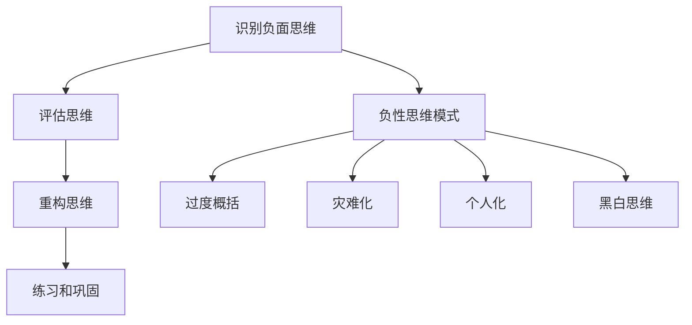
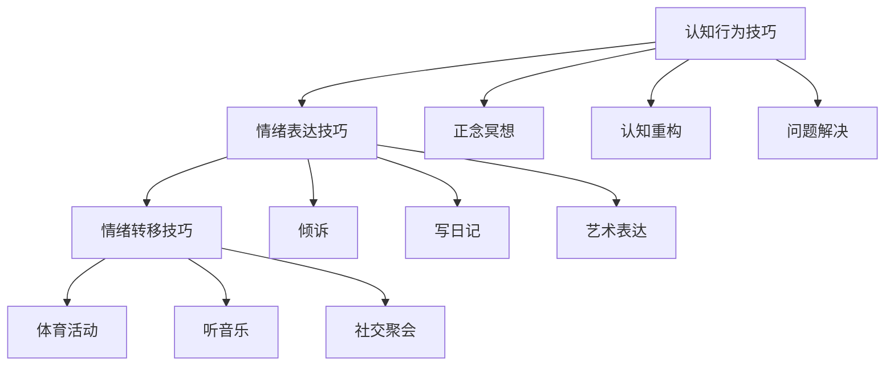
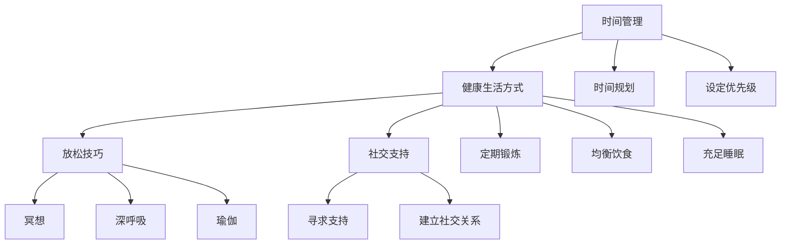
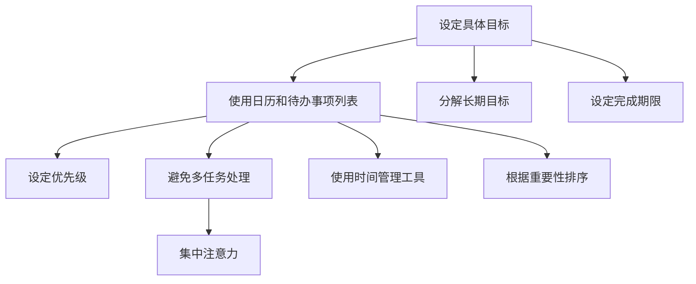
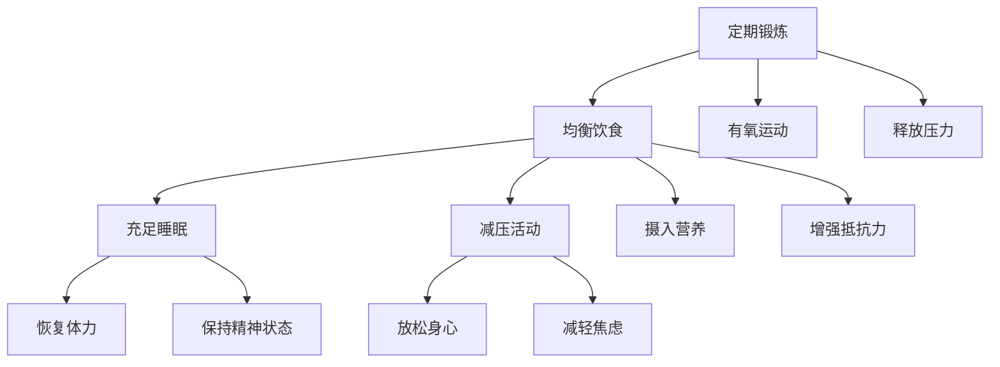
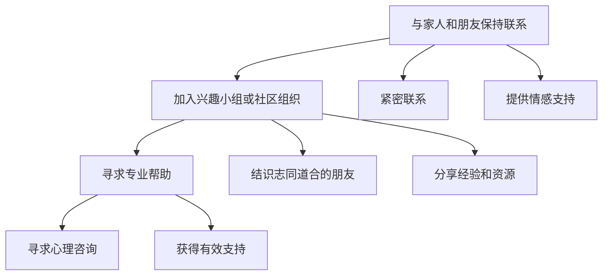

                 

### 文章标题：领导力与压力管理：在压力下保持高效

在当今快节奏的科技和商业环境中，领导力与压力管理已成为确保组织成功和员工福祉的关键要素。**领导力与压力管理：在压力下保持高效**将深入探讨如何通过有效的领导力策略和压力管理技巧，在高压环境中保持高效工作。

关键词：**领导力、压力管理、高效工作、团队管理、心理健康**

摘要：本文旨在揭示领导力与压力管理之间的密切关系，并通过具体的案例分析和实战技巧，帮助领导者和管理者在压力下保持高效的决策和执行能力。文章将分为三个部分：首先，介绍领导力的核心概念与基础；其次，探讨压力的来源与影响，并详细讲解压力管理的基本策略；最后，分析领导力与压力管理的实践应用，提供实际案例以供借鉴。

### 目录大纲

#### 第一部分：领导力的核心概念与基础

- **第1章：领导力的定义与类型**
  - 1.1 领导力的定义与重要性
  - 1.2 领导力的类型与风格
  - 1.3 领导力在组织中的角色

- **第2章：领导力与心理学基础**
  - 2.1 心理学在领导力中的应用
  - 2.2 人格特质与领导力
  - 2.3 情绪智力与领导力

#### 第二部分：压力管理与策略

- **第3章：压力的来源与影响**
  - 3.1 压力的定义与类型
  - 3.2 压力来源分析
  - 3.3 压力对个体的影响

- **第4章：压力管理的基本策略**
  - 4.1 认知重构策略
  - 4.2 情绪调节策略
  - 4.3 行为调整策略

- **第5章：应对工作与生活压力的技巧**
  - 5.1 时间管理与优先级设定
  - 5.2 健康生活方式与压力管理
  - 5.3 社交支持与心理健康

#### 第三部分：领导力与压力管理的实践

- **第6章：领导力与压力管理的融合**
  - 6.1 领导力在压力管理中的应用
  - 6.2 压力管理对领导力的影响
  - 6.3 领导者如何塑造积极的团队氛围

- **第7章：领导力与压力管理的实战案例分析**
  - 7.1 案例一：成功压力管理的领导者
  - 7.2 案例二：在压力下提升领导力的过程
  - 7.3 案例三：压力管理与团队效能

#### 附录

- **附录A：领导力与压力管理资源**
  - A.1 领导力理论的发展与演变
  - A.2 压力管理的研究成果与应用
  - A.3 领导力与压力管理的工具与量表

通过本文的深入探讨，读者将了解如何通过科学的领导力与压力管理方法，在压力环境下保持高效工作，实现个人与组织的共同成长。接下来，我们将逐章深入分析领导力与压力管理的各个方面。

### 第一部分：领导力的核心概念与基础

#### 第1章：领导力的定义与类型

在现代社会，领导力被广泛认为是推动组织成功和个人成长的关键因素。然而，领导力的定义和类型多种多样，这使得理解其核心概念与基础变得至关重要。

##### 1.1 领导力的定义与重要性

领导力可以被定义为一种激励和引导他人实现共同目标的能力。它不仅涉及决策和策略，还包括沟通、激励和领导风格等方面。领导力不仅仅是管理职位的人的专属技能，而是每个人都应具备的重要能力。

领导力的重要性体现在以下几个方面：

1. **推动创新与变革**：领导者能够激励团队成员跳出传统思维模式，推动创新和变革。
2. **提升团队凝聚力**：有效的领导力能够增强团队成员之间的信任和合作，提升团队凝聚力。
3. **提高绩效与效率**：领导者通过清晰的目标设定和高效的资源分配，提高团队的绩效和效率。
4. **培养人才**：领导者关注团队成员的成长和发展，培养未来的领导者。

##### 1.2 领导力的类型与风格

领导力可以分为不同的类型和风格，每种类型和风格都有其独特的特点和适用场景。

- **权威型领导**：权威型领导者通过权力和威望来指挥和影响团队成员。他们注重结果，决策迅速，适合在紧急情况下使用。

  ```mermaid
  graph TB
  A[权威型领导] --> B[特点]
  B --> C1[强调结果]
  B --> C2[决策迅速]
  B --> C3[使用权力]

  A --> D[适用场景]
  D --> E1[紧急情况]
  D --> E2[任务明确]
  ```

- **民主型领导**：民主型领导者鼓励团队成员参与决策过程，注重团队合作和开放沟通。他们通常在团队面临复杂问题和需要集体智慧时表现突出。

  ```mermaid
  graph TB
  A[民主型领导] --> B[特点]
  B --> C1[鼓励参与]
  B --> C2[开放沟通]
  B --> C3[注重团队]

  A --> D[适用场景]
  D --> E1[复杂问题]
  D --> E2[需要集体智慧]
  ```

- **变革型领导**：变革型领导者具有强烈的愿景，能够激励团队成员超越自我，追求卓越。他们通常在组织需要进行重大变革时发挥关键作用。

  ```mermaid
  graph TB
  A[变革型领导] --> B[特点]
  B --> C1[强烈愿景]
  B --> C2[激励团队]
  B --> C3[追求卓越]

  A --> D[适用场景]
  D --> E1[重大变革]
  D --> E2[追求卓越]
  ```

- **关怀型领导**：关怀型领导者关注团队成员的个人需求和情感，提供支持和鼓励。他们通常在团队面临挑战和压力时发挥积极作用。

  ```mermaid
  graph TB
  A[关怀型领导] --> B[特点]
  B --> C1[关注个人需求]
  B --> C2[提供支持]
  B --> C3[鼓励团队]

  A --> D[适用场景]
  D --> E1[团队挑战]
  D --> E2[压力大时]
  ```

##### 1.3 领导力在组织中的角色

领导力在组织中的角色是多方面的，包括但不限于以下几个方面：

1. **愿景规划**：领导者为组织设定清晰的愿景和目标，引导团队朝着共同的目标努力。
2. **资源分配**：领导者合理分配资源，确保团队能够高效地实现目标。
3. **决策制定**：领导者通过有效的决策，帮助组织应对挑战和抓住机遇。
4. **沟通协调**：领导者通过有效的沟通，确保团队内部的信息流通和协作。
5. **激励与发展**：领导者激励团队成员，关注其个人成长和职业发展。

在接下来的章节中，我们将深入探讨领导力与心理学基础，以及压力的来源与影响，帮助读者更好地理解领导力与压力管理的复杂性。敬请期待。

### 第2章：领导力与心理学基础

领导力不仅是管理技能的集合，更是心理学理论在实践中的运用。心理学在领导力中的应用为我们提供了深入理解领导行为、领导效能以及团队成员心理状态的工具。在这一章节中，我们将探讨心理学在领导力中的应用，以及领导力中的人格特质和情绪智力。

##### 2.1 心理学在领导力中的应用

心理学在领导力中的应用主要体现在以下几个方面：

1. **行为心理学**：行为心理学关注人类行为及其影响因素，通过研究行为模式，领导者可以更好地理解团队成员的行为，并采取适当的激励措施。例如，强化理论（ reinforcement theory）认为，通过奖励正面行为，可以增强这种行为发生的频率。

2. **社会心理学**：社会心理学研究人类在社会环境中的行为和心理状态，对领导力有重要启示。例如，社会认同理论（social identity theory）指出，个体在群体中会有认同感，领导者可以利用这一点来增强团队的凝聚力。

3. **认知心理学**：认知心理学研究人的思维过程和认知结构，对于领导者理解决策过程和团队思维模式有很大帮助。例如，双过程理论（dual-process theory）认为，人的决策既受自动思维的影响，也受有意识思维的影响，领导者需要平衡这两种思维过程。

4. **组织心理学**：组织心理学研究组织中的心理现象，包括领导行为、团队动力学和组织文化等。领导者可以通过组织心理学的研究，了解如何改善组织氛围，提高员工满意度和工作效率。

##### 2.2 人格特质与领导力

人格特质是影响领导力的关键因素之一。心理学家们通过大量研究，识别出一系列与领导力相关的人格特质：

1. **责任感**：具有责任感的领导者能够承担起领导责任，并为团队的成败负责。

2. **自信心**：自信的领导者能够坚定地引导团队，并在面对挑战时保持冷静和决心。

3. **情商**：情商（EQ）包括自我意识、自我调节、社交意识和关系管理能力。情商高的领导者能够更好地理解和管理团队成员的情绪，从而提高团队绩效。

4. **适应性**：适应性强的领导者能够灵活应对变化，带领团队克服挑战。

5. **正直与透明**：正直和透明的领导者能够赢得团队成员的信任，建立良好的团队关系。

##### 2.3 情绪智力与领导力

情绪智力是指个体识别、理解、管理和利用自己及他人的情绪的能力。情绪智力在领导力中起着至关重要的作用，以下是情绪智力在领导力中的几个关键方面：

1. **自我情绪管理**：领导者需要能够有效管理自己的情绪，避免在压力和挑战面前失控。自我情绪管理包括情绪调节、情绪释放和情绪恢复等方面。

2. **情绪识别**：领导者需要能够识别和理解自己的情绪，以及团队成员的情绪。这有助于建立有效的沟通和人际关系。

3. **情绪利用**：领导者可以利用情绪来激励和引导团队成员。例如，在团队面临挑战时，领导者可以通过表达积极的情绪来鼓舞士气。

4. **同理心**：同理心是指领导者能够站在他人的立场上理解他们的感受。同理心的领导者能够更好地支持团队成员，促进团队和谐。

通过结合心理学理论与实际领导力实践，领导者可以更好地理解和管理团队成员，提升团队绩效和整体幸福感。在下一章节中，我们将探讨压力的来源与影响，帮助领导者更好地应对压力，保持高效工作。

### 第二部分：压力管理与策略

#### 第3章：压力的来源与影响

在现代职场中，压力无处不在。了解压力的来源及其对个体的影响，对于有效管理和缓解压力至关重要。本章将详细探讨压力的来源和其对个体的影响。

##### 3.1 压力的定义与类型

压力通常被定义为一种身心紧张状态，当个体感受到外界要求超出了其应对能力时产生。压力可以分为以下几种类型：

1. **慢性压力**：慢性压力是指长期存在且持续的的压力。这种压力通常源自长期的工作负荷、人际关系问题或生活事件。例如，长期的工作压力、家庭纠纷或财务问题。

2. **急性压力**：急性压力是指短期、强烈的压力。这种压力通常源自突发事件或重大变故，如失业、离婚或突如其来的健康问题。

3. **情境压力**：情境压力是指特定情境下产生的压力，如考试、面试或演讲。

4. **心理压力**：心理压力是指由心理因素引起的压力，如焦虑、恐惧、过度担忧等。

##### 3.2 压力来源分析

压力的来源多种多样，以下是常见的压力来源：

1. **工作压力**：工作压力是压力的主要来源之一。高强度的工作负荷、不合理的期限、工作与生活平衡的困难等都是导致工作压力的因素。

2. **人际关系**：人际关系问题，如家庭矛盾、同事冲突或社交压力，也是导致压力的重要因素。

3. **健康问题**：健康问题，如慢性疾病、疼痛或精神健康问题，会显著增加压力水平。

4. **财务压力**：财务压力，如债务、失业或收入不稳定，会对个体的心理状态产生负面影响。

5. **个人成长与变化**：个人成长与变化，如搬家、换工作、结婚或生孩子，都会引发压力。

##### 3.3 压力对个体的影响

压力对个体的影响是多方面的，包括生理、心理和行为方面：

1. **生理影响**：长期的压力会导致一系列生理反应，如头痛、失眠、消化不良、高血压等。此外，压力还可能导致免疫系统功能下降，增加患病风险。

2. **心理影响**：心理压力会导致情绪波动，如焦虑、抑郁、易怒等。长期的压力还可能影响认知功能，如记忆力、注意力和决策能力。

3. **行为影响**：压力会影响个体的行为，如增加吸烟、饮酒和暴饮暴食等不健康行为。此外，压力还可能导致工作效率下降、缺勤和离职。

为了应对这些压力，有效的压力管理策略至关重要。在下一章中，我们将详细探讨压力管理的基本策略，帮助个体在高压环境中保持心理健康和工作效率。

### 第4章：压力管理的基本策略

在了解了压力的来源和影响之后，掌握有效的压力管理策略变得尤为重要。本章将介绍三种基本策略：认知重构策略、情绪调节策略和行为调整策略，帮助个体在高压环境中保持心理平衡。

##### 4.1 认知重构策略

认知重构策略的核心是通过改变思维方式和态度来应对压力。这种方法认为，个体对压力事件的认知和解释方式直接影响其情绪和行为反应。以下是认知重构的几个步骤：

1. **识别负面思维**：首先，个体需要识别出那些导致压力和负面情绪的负面思维模式。例如，过度概括、灾难化、个人化和黑白思维等。

2. **评估思维**：评估这些负面思维的合理性和效用。通过反思和逻辑分析，识别出这些思维背后的假设和偏见。

3. **重构思维**：将负面思维转变为更积极、合理和灵活的思维模式。例如，将“我一定会失败”重构为“我有能力克服这个挑战”。

4. **练习和巩固**：通过持续的练习和自我反思，巩固新的思维模式，使其成为习惯。

**伪代码示例**：



##### 4.2 情绪调节策略

情绪调节策略旨在通过控制情绪反应来减轻压力。以下是一些常用的情绪调节技巧：

1. **认知行为技巧**：这种技巧通过改变思维模式来调节情绪。例如，通过正念冥想、认知重构和问题解决等技巧，个体可以学会以更积极的方式看待压力情境。

2. **情绪表达技巧**：情绪表达技巧帮助个体学会如何健康地表达和处理情绪。例如，通过倾诉、写日记或艺术表达等方式，个体可以释放情绪压力。

3. **情绪转移技巧**：这种技巧通过将注意力从负面情绪转移到其他事物来调节情绪。例如，通过进行体育活动、听音乐或与朋友聚会等方式，个体可以暂时缓解压力。

**伪代码示例**：



##### 4.3 行为调整策略

行为调整策略通过改变行为习惯和环境来减轻压力。以下是一些有效的行为调整技巧：

1. **时间管理**：合理规划时间，设定优先级，避免过度工作。例如，使用时间管理工具，如日历、待办事项列表和时间追踪应用。

2. **健康生活方式**：保持健康的生活方式，如定期锻炼、均衡饮食和充足的睡眠。这些习惯有助于增强身体和心理的抵抗力。

3. **放松技巧**：通过冥想、深呼吸、瑜伽和渐进性肌肉放松等放松技巧来减轻身体和心理的紧张。

4. **社交支持**：建立和维护良好的社交关系，寻求家人、朋友或专业人士的支持。社交支持有助于缓解压力，提升心理健康。

**伪代码示例**：



通过认知重构、情绪调节和行为调整三种策略的综合运用，个体可以在压力环境中保持心理平衡和工作效率。在下一章中，我们将进一步探讨应对工作与生活压力的技巧，帮助个体实现全面的压力管理。

### 第5章：应对工作与生活压力的技巧

在高压环境中保持高效工作和生活质量，不仅需要有效的压力管理策略，还需要一系列具体的应对技巧。本章将详细探讨时间管理、健康生活方式和社交支持等应对工作与生活压力的技巧，帮助个体在忙碌和压力中找到平衡点。

##### 5.1 时间管理与优先级设定

时间管理是减轻工作压力的关键，通过合理安排时间，设定优先级，个体可以更好地掌控自己的工作和生活。以下是一些实用的时间管理技巧：

1. **设定具体目标**：将长期目标分解为短期目标，确保每个任务都有明确的完成期限。这样，个体可以集中精力完成最重要的任务。

2. **使用日历和待办事项列表**：使用日历和待办事项列表记录每天的任务和日程，有助于保持对时间的整体把握。例如，使用Google Calendar或Notion等工具，可以方便地安排和追踪任务。

3. **设定优先级**：根据任务的重要性和紧急性设定优先级。使用艾森豪威尔矩阵（Eisenhower Matrix），将任务分为“重要且紧急”、“重要但不紧急”、“不重要但紧急”和“不重要且不紧急”四类，有助于集中精力处理最重要的任务。

4. **避免多任务处理**：尽管多任务处理看起来可以提高效率，但实际上会分散注意力，降低工作质量。专注于一项任务，直到完成后再进行下一项。

**伪代码示例**：



##### 5.2 健康生活方式与压力管理

健康的生活方式对于应对压力至关重要。以下是一些促进健康和减轻压力的生活方式建议：

1. **定期锻炼**：定期进行有氧运动，如快走、跑步、游泳或骑自行车，有助于释放压力，提高心理和生理健康。

2. **均衡饮食**：摄入丰富的水果、蔬菜、全谷物和蛋白质，避免过多的糖和加工食品。均衡的饮食有助于提供身体所需的营养，增强抵抗力。

3. **充足睡眠**：确保每晚有7-9小时的睡眠，有助于恢复体力和精神状态。建立固定的睡眠时间表，避免晚上使用电子设备，有助于提高睡眠质量。

4. **减压活动**：进行一些放松身心的活动，如冥想、瑜伽、阅读或听音乐，有助于减轻压力和焦虑。

**伪代码示例**：



##### 5.3 社交支持与心理健康

社交支持是减轻压力的重要手段。以下是一些建立和维护社交支持系统的建议：

1. **与家人和朋友保持联系**：与家人和朋友保持紧密的联系，可以提供情感支持和实际帮助。定期进行面对面的聚会或电话交流，有助于缓解压力。

2. **加入兴趣小组或社区组织**：加入与自己兴趣相关的兴趣小组或社区组织，可以结识志同道合的朋友，分享经验和资源。

3. **寻求专业帮助**：如果压力影响到日常生活，可以考虑寻求心理咨询或治疗。专业心理医生或治疗师可以提供有效的应对策略和支持。

**伪代码示例**：



通过时间管理、健康生活方式和社交支持的综合运用，个体可以更好地应对工作与生活的压力，保持高效和心理健康。在下一部分中，我们将探讨领导力与压力管理的实践，通过实际案例进一步了解这些策略的应用。

### 第三部分：领导力与压力管理的实践

#### 第6章：领导力与压力管理的融合

领导力与压力管理之间的融合对于实现高效和可持续的工作环境至关重要。本章将探讨领导力在压力管理中的应用，压力管理对领导力的影响，以及领导者如何塑造积极的团队氛围。

##### 6.1 领导力在压力管理中的应用

领导力在压力管理中的应用主要体现在以下几个方面：

1. **提供心理支持**：领导者可以通过倾听、理解和支持团队成员，帮助其应对压力。这种支持可以是在工作上的，如提供资源或调整工作分配，也可以是在情感上的，如倾听和鼓励。

   ```mermaid
   graph TD
   A[提供心理支持] --> B[倾听]
   B --> C[理解]
   B --> D[鼓励]

   A --> E[工作支持]
   A --> F[情感支持]
   ```

2. **设定清晰的期望**：领导者需要设定明确的期望和目标，确保团队成员了解他们的职责和任务。清晰的期望有助于减少不确定性和焦虑，从而减轻压力。

   ```mermaid
   graph TD
   A[设定清晰的期望] --> B[明确职责]
   B --> C[了解任务]
   B --> D[减少不确定]
   ```

3. **促进沟通**：有效的沟通是减轻团队压力的关键。领导者需要确保信息在团队内部透明和流畅地传递，避免误解和猜疑。

   ```mermaid
   graph TD
   A[促进沟通] --> B[信息透明]
   B --> C[信息流畅]
   B --> D[避免误解]
   ```

4. **激励与认可**：领导者通过激励和认可团队成员的努力和成就，可以增强团队的凝聚力，提高士气，减轻压力。

   ```mermaid
   graph TD
   A[激励与认可] --> B[激励]
   B --> C[认可]
   B --> D[增强凝聚力]
   ```

##### 6.2 压力管理对领导力的影响

压力管理对领导力的影响是双向的。一方面，有效的压力管理可以提升领导力；另一方面，不良的压力管理可能削弱领导力。

1. **提升决策能力**：通过压力管理技巧，如情绪调节和认知重构，领导者可以在高压环境下保持清晰的思维，做出更明智的决策。

2. **增强人际关系**：压力管理有助于领导者建立和维护积极的人际关系，提高团队合作效率。

3. **提升团队效能**：有效的压力管理可以增强团队的整体效能，减少因压力导致的缺勤和离职，提高员工满意度和工作效率。

4. **培养领导者**：在应对压力的过程中，领导者可以培养自身的适应能力和韧性，为未来的领导角色打下坚实的基础。

##### 6.3 领导者如何塑造积极的团队氛围

塑造积极的团队氛围是领导者的重要任务，以下是一些建议：

1. **建立信任**：信任是团队氛围的核心。领导者需要通过诚实、透明和一致性来建立和维护信任。

   ```mermaid
   graph TD
   A[建立信任] --> B[诚实]
   B --> C[透明]
   B --> D[一致性]
   ```

2. **鼓励开放沟通**：领导者应鼓励团队成员开放地沟通想法、问题和担忧。这有助于提高团队透明度，减少误解和冲突。

   ```mermaid
   graph TD
   A[鼓励开放沟通] --> B[沟通]
   B --> C[透明度]
   B --> D[减少误解]
   ```

3. **培养团队合作精神**：领导者可以通过团队合作项目、团队建设和团队活动来培养团队合作精神，提高团队的凝聚力和协作能力。

   ```mermaid
   graph TD
   A[培养团队合作精神] --> B[团队项目]
   B --> C[团队建设]
   B --> D[团队活动]
   ```

4. **关注员工福祉**：领导者应关注员工的身心健康，提供必要的资源和支持，以减轻工作压力，提高工作满意度。

   ```mermaid
   graph TD
   A[关注员工福祉] --> B[提供资源]
   B --> C[减轻压力]
   B --> D[提高满意度]
   ```

通过领导力与压力管理的有效融合，领导者可以塑造一个积极、高效和充满动力的团队氛围。在下一部分中，我们将通过实际案例展示这些策略的应用效果。

### 第7章：领导力与压力管理的实战案例分析

在本章节中，我们将通过实际案例来探讨领导力与压力管理的应用效果。这些案例将展示成功压力管理的领导者如何在压力下提升领导力，并最终实现团队的高效运作。

#### 案例一：成功压力管理的领导者

在一个快速发展的科技公司，一位名叫约翰的领导者因其出色的压力管理技巧而广受赞誉。该公司正处于市场扩张阶段，任务繁重且竞争激烈，员工普遍感受到巨大的工作压力。

**背景**：

- 公司正在开发一款创新产品，需要在短时间内达到市场预期。
- 员工面临着高工作负荷和不断变化的项目要求。

**策略**：

1. **明确期望**：约翰首先明确了团队的期望和目标，确保每个成员都清楚自己的职责和任务。

2. **提供心理支持**：约翰设立了“压力日”，在这天，员工可以随时与约翰或其他团队成员交流，分享他们的压力和担忧。约翰通过倾听和理解，为员工提供情感支持。

3. **鼓励开放沟通**：约翰鼓励团队成员在项目中遇到问题时，及时沟通和反馈。这有助于减少误解和冲突，提高团队协作效率。

4. **激励与认可**：约翰通过公开表扬和奖励机制，认可员工的努力和成就，增强团队的凝聚力。

**结果**：

- 团队成员的压力显著减轻，工作效率和满意度提高。
- 项目提前完成，产品成功上市，获得了市场的积极反响。

**结论**：

约翰通过有效的领导力和压力管理技巧，成功帮助团队在压力下保持高效运作。他的行为不仅提升了团队的整体绩效，也为员工的个人成长和职业发展提供了支持。

#### 案例二：在压力下提升领导力的过程

李华是一家中型企业的部门经理，负责一个跨部门的重大项目。项目的复杂性高，时间紧，任务重，对李华和他的团队构成了巨大的压力。

**背景**：

- 项目涉及多个部门，需要高度协调和合作。
- 项目的时间表非常紧张，几乎没有缓冲时间。

**策略**：

1. **建立信任**：李华通过透明沟通和一致性，建立了与团队成员之间的信任关系。他定期召开会议，确保每个团队成员都了解项目的进展和他们的角色。

2. **时间管理**：李华使用时间管理工具，如Gantt图表和优先级矩阵，帮助团队成员合理安排时间和资源。

3. **情绪调节**：李华通过正念冥想和情绪调节技巧，保持了冷静和专注。他鼓励团队成员也采用类似的技巧，以应对压力。

4. **培养团队合作精神**：李华组织了多个团队建设活动，如团队合作游戏和团队培训，以增强团队的凝聚力和协作能力。

**结果**：

- 项目在预定时间内完成，且质量符合预期。
- 团队成员在项目过程中得到了锻炼和成长，领导力和团队合作能力显著提升。

**结论**：

李华在压力下展示了出色的领导力，通过有效的压力管理和团队协作技巧，成功实现了项目的顺利推进。他的领导风格和策略为团队树立了榜样，促进了团队成员的积极发展。

#### 案例三：压力管理与团队效能

张琳是一位项目经理，负责一个跨国团队，该团队需要在全球范围内协调资源和任务，以按时交付产品。由于时差和文化差异，团队面临着巨大的沟通和协调挑战。

**背景**：

- 团队成员分布在不同的时区和文化背景中。
- 项目进度紧张，需要高度协调和快速响应。

**策略**：

1. **时间管理**：张琳使用了跨时区协作工具，如Slack和Trello，确保团队成员能够实时沟通和协作。她还设置了明确的工作时段，以减少沟通的延误。

2. **文化理解**：张琳花时间了解团队成员的文化背景和工作习惯，以更好地理解他们的需求和压力点。她鼓励团队成员分享自己的文化故事，以增强团队的文化认同感。

3. **情绪支持**：张琳建立了心理支持网络，通过定期的视频会议和心理辅导，为团队成员提供情绪支持。

4. **激励机制**：张琳通过设置合理的激励机制，如奖励和认可，提高了团队的士气和动力。

**结果**：

- 团队成员的沟通和协作效率显著提高。
- 项目在预定时间内完成，且超出了预期质量。

**结论**：

张琳通过压力管理和团队协作技巧，成功克服了跨时区和文化差异带来的挑战。她的领导风格和策略为团队提供了强大的支持和动力，确保了项目的成功。

通过这些实际案例，我们可以看到，领导力与压力管理的有效融合能够帮助团队在压力环境中保持高效运作。领导者通过制定明确的期望、提供心理支持、促进沟通和激励团队成员，不仅提升了团队的绩效，也为员工的个人成长和职业发展创造了有利条件。

### 附录A：领导力与压力管理资源

在领导力和压力管理领域，有许多重要的理论、研究成果和实用工具。以下是一些推荐的资源，帮助读者进一步探索和理解这两个关键领域。

#### A.1 领导力理论的发展与演变

1. **《领导力的五种语言》（The Five Languages of Appreciation in the Workplace）** - Gary Chapman and Paul White
   - 这本书介绍了在职场中如何有效地表达感激和赞赏，从而提高团队凝聚力和员工满意度。

2. **《变革型领导力：变革型领导者如何塑造组织未来》（Transforming Leadership: How Ordinary People Change the World）** - Robert E. Quinn and Change Associates
   - 该书探讨了变革型领导者的特质和行为，以及如何通过变革型领导力推动组织的持续成长和成功。

3. **《领导力的习惯》（The Leadership Habits of Great Leaders）** - Steven R. Gaffney
   - 这本书提供了实用的领导力习惯和策略，帮助领导者提升个人和团队的绩效。

#### A.2 压力管理的研究成果与应用

1. **《压力管理：策略与实践》（Stress Management: Strategies for Health and Well-being）** - Richard A. Hine
   - 这本书涵盖了压力管理的理论基础和实际应用，提供了多种策略和工具，帮助读者应对日常压力。

2. **《工作压力管理：理论与实践》（Work Stress Management: Theory and Practice）** - David A. Saklofske and Mark S. Sussman
   - 本书详细介绍了工作压力的管理方法，包括心理学、组织行为学和管理学的最新研究成果。

3. **《压力与心理健康》（Stress and Mental Health）** - Jane A. Taylor and the Mental Health Foundation
   - 这本书提供了关于压力对心理健康影响的全面分析，以及如何通过心理健康服务来减轻压力。

#### A.3 领导力与压力管理的工具与量表

1. **迈尔斯-布里格斯类型指标（MBTI）** - Myer-Briggs Type Indicator (MBTI)
   - MBTI是一种广泛使用的个性评估工具，可以帮助领导者更好地理解团队成员的个性类型，从而更有效地管理团队和解决冲突。

2. **压力感知量表（Perceived Stress Scale, PSS）** - Shara M. Burke and Steven J.Loeb
   - PSS是一种常用的压力评估工具，可以帮助个体和领导者了解其压力水平和压力源。

3. **领导效能量表（Leadership Effectiveness Analysis, LEA）** - Robert J. House and colleagues
   - LEA是一种用于评估领导者效能的多维量表，涵盖了领导力、团队管理、决策能力和情感智力等多个方面。

通过这些资源和工具，读者可以更深入地了解领导力与压力管理的理论和实践，为自己的职业生涯和组织发展提供有力的支持。

### 最佳实践 tips、小结、注意事项、拓展阅读等内容

#### 最佳实践 Tips

1. **自我反思**：定期进行自我反思，了解自己在压力环境中的行为和反应，以便及时调整和优化。

2. **主动沟通**：与团队成员保持主动沟通，确保每个人都能清楚了解任务和期望，减少误解和焦虑。

3. **时间管理**：合理安排时间，设定明确的优先级，避免因过度工作而增加压力。

4. **健康生活**：保持健康的生活方式，如定期锻炼、均衡饮食和充足睡眠，以增强身体和心理的抵抗力。

5. **情绪管理**：学会情绪管理技巧，如深呼吸、冥想和正念练习，帮助自己在高压环境下保持冷静和专注。

#### 小结

领导力与压力管理是现代职场中不可或缺的技能。有效的领导力能够激发团队潜能，提升绩效，而有效的压力管理则有助于个体和团队在高压环境中保持高效和心理健康。通过理解领导力的核心概念和类型，掌握压力管理的基本策略，领导者可以更好地应对挑战，实现个人和组织的共同成长。

#### 注意事项

1. **个性化**：不同的领导风格和压力管理策略适用于不同的个体和团队。领导者需要根据具体情况调整策略。

2. **持续学习**：领导力和压力管理是一个不断发展的领域。领导者应持续学习和探索新的理论和实践，以不断提升自己的能力。

3. **文化适应性**：在多元文化环境中，领导者需要理解和尊重不同文化背景下的价值观和沟通方式。

#### 拓展阅读

- **《非暴力沟通》（Nonviolent Communication）** - Marshall B. Rosenberg
- **《压力与绩效：管理压力，提升工作表现》（Stress and Performance: Managing Stress to Enhance Performance）** - H. Jack Spear
- **《领导力的心理学》（The Psychology of Leadership）** - Richard D. Lepsinger and Ann E. Mulcahy

通过不断学习和实践，领导者可以更好地应对职场压力，实现个人和团队的成功。希望本文能为读者提供有价值的启示和指导。

