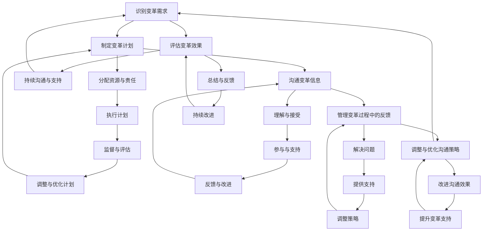

                 

### 文章标题

《领导力与变革沟通：赢得团队变革支持》

关键词：领导力、变革管理、沟通策略、团队支持

摘要：本文旨在探讨领导力在推动团队变革中的作用，以及如何通过有效的变革沟通赢得团队的支持。文章将首先定义领导力和变革管理的核心要素，然后深入分析变革沟通的策略和技巧，最后通过具体案例展示如何构建支持系统，激发团队参与变革的动机。本文结合理论与实践，旨在为IT领域的领导者提供指导，以实现团队变革的成功。

### 引言

在信息技术快速发展的今天，企业面临的变革需求日益增加。无论是技术革新、组织结构调整，还是市场环境的变化，团队变革已成为企业保持竞争力的重要手段。然而，变革并非易事，它往往伴随着挑战和阻力。领导者在此过程中扮演着关键角色，他们不仅需要具备强大的领导力，还要掌握有效的变革沟通技巧，以赢得团队的支持和合作。

领导力是指通过影响力、愿景和策略来引导和激励团队实现目标的能力。有效的领导力能够增强团队的凝聚力，提高员工的工作积极性，并在变革过程中起到关键推动作用。然而，仅有领导力还不足以保证变革的成功。变革沟通作为领导力的重要组成部分，它通过有效的信息传递和互动，帮助团队理解变革的必要性和重要性，消除抵触情绪，激发参与变革的积极性。

本文将围绕以下核心议题展开讨论：

1. **领导力的定义与核心要素**：介绍领导力的基本概念，包括其类型和核心要素。
2. **变革管理与变革沟通**：探讨变革管理的概述和变革沟通的关键要素。
3. **团队变革领导力**：分析团队变革中的领导者角色和冲突管理策略。
4. **变革沟通策略与技巧**：详细阐述变革沟通的心理机制、实际应用和案例分析。
5. **赢得团队变革支持**：探讨构建变革支持系统、明确变革目标与价值、激发团队参与动机等关键因素。
6. **长期变革支持策略**：讨论如何保持变革的持续动力，建立激励与奖励机制，培养变革文化。

通过本文的讨论，我们希望能够为IT领域的领导者提供实用的指导，帮助他们在变革过程中有效沟通，赢得团队的支持，实现变革目标。

### 第一部分：领导力基础

#### 第1章：领导力的定义与核心要素

领导力是一个广泛而复杂的概念，它涉及领导者的行为、能力和影响力，旨在激励和引导团队朝着共同的目标前进。在变革过程中，领导力尤为重要，因为领导者不仅需要具备愿景和远见，还要能够推动变革，赢得团队的支持和信任。

**1.1 领导力的定义与类型**

领导力可以被定义为一种通过影响力、愿景和策略来引导和激励团队实现目标的能力。这种能力不仅包括领导者的个人素质，还涉及到他们与团队成员的关系和互动。领导力可以分为多种类型，如指挥型领导、支持型领导、变革型领导和愿景型领导。

- **指挥型领导**：通过明确指令和严格监督来管理团队，通常在紧急情况下或需要快速决策时使用。
- **支持型领导**：注重团队成员的需求和感受，提供支持和鼓励，增强团队凝聚力和士气。
- **变革型领导**：具备强烈的变革意愿和远见，能够推动团队实现重大变革，激励团队成员积极参与变革过程。
- **愿景型领导**：拥有清晰而鼓舞人心的愿景，能够激励团队成员为实现共同目标而努力。

**1.2 领导者的核心要素**

有效的领导者需要具备一系列核心要素，这些要素不仅有助于他们自身的发展，也有助于团队的成功。

- **愿景与目标**：领导者需要有清晰的愿景和目标，能够将这些愿景和目标传达给团队成员，并激发他们的热情和动力。
- **沟通能力**：领导者需要具备良好的沟通能力，能够清晰、有效地传达信息，同时也能够倾听和理解团队成员的意见和需求。
- **影响力**：领导者需要具备影响力，能够通过个人魅力、专业知识和领导力来影响团队成员，推动他们达成共同目标。
- **决策能力**：领导者需要能够做出明智的决策，并在面临挑战和不确定性时保持冷静和果断。
- **适应性**：领导者需要具备适应变化的能力，能够在不同环境和情境下灵活调整策略和行动计划。
- **道德素养**：领导者需要具备高尚的道德素养，能够以身作则，树立良好的榜样。

**1.3 领导力的重要性**

在团队变革过程中，领导力的重要性尤为突出。以下是一些领导力在变革中的关键作用：

- **塑造变革方向**：领导者通过制定愿景和目标，为变革提供明确的方向，帮助团队理解变革的必要性和目标。
- **激发变革动力**：领导者通过激励和鼓舞团队成员，激发他们的积极性和参与度，推动变革的顺利进行。
- **解决变革阻力**：领导者需要具备解决变革阻力的能力，通过沟通和协商，消除团队成员的疑虑和抵触情绪，赢得他们的支持和合作。
- **建立信任与支持**：领导者通过建立信任和积极的关系，增强团队的凝聚力和协作性，为变革的成功创造有利条件。

总之，领导力是团队变革成功的关键要素。通过理解领导力的定义与核心要素，领导者可以更好地发挥自己的作用，推动团队实现变革目标。

#### 第2章：变革管理概述

变革管理是确保团队在变革过程中顺利过渡和适应新环境的一系列策略和方法。有效的变革管理不仅能够减少变革带来的混乱和阻力，还能提高团队的整体效率和生产力。在这一章节中，我们将探讨变革管理的定义、关键要素以及变革过程中的常见挑战。

**2.1 变革管理的定义**

变革管理是指在一个组织内部引入和实施变革的过程，旨在应对外部或内部的变化，提高组织的效率和竞争力。变革管理不仅仅关注技术层面的变化，还涉及到组织结构、文化、流程和人员的调整。它包括以下核心要素：

- **愿景与目标**：明确变革的愿景和目标，为团队提供清晰的方向和指导。
- **规划与设计**：制定详细的变革计划，包括时间表、资源分配和关键里程碑。
- **沟通与参与**：确保团队成员了解变革的必要性、过程和预期结果，增强他们的参与感和责任感。
- **领导与支持**：领导者需要积极参与变革过程，提供指导和支持，帮助团队成员应对变革带来的挑战。
- **评估与调整**：对变革过程进行持续评估和反馈，根据实际情况调整策略和行动计划。

**2.2 变革管理的关键要素**

有效的变革管理需要关注以下关键要素：

- **明确变革目标**：确保团队成员对变革的目标和意义有清晰的认识，减少模糊性和不确定性。
- **制定详细计划**：制定详细的变革计划，包括时间表、责任分配和资源需求，确保变革过程的有序进行。
- **沟通与参与**：通过定期沟通和互动，确保团队成员了解变革的进展和预期结果，增强他们的参与感和责任感。
- **培训与支持**：为团队成员提供必要的培训和支持，帮助他们掌握新技能和知识，适应变革带来的变化。
- **领导与支持**：领导者需要积极参与变革过程，提供指导和支持，树立榜样，帮助团队成员克服变革中的困难。
- **持续评估与反馈**：对变革过程进行持续评估和反馈，及时调整策略和行动计划，确保变革目标的实现。

**2.3 变革过程中的常见挑战**

在变革过程中，团队可能会面临以下常见挑战：

- **抵触情绪**：团队成员可能对变革持有抵触情绪，担心变革会带来不确定性和风险。
- **沟通障碍**：信息传递不畅或误解可能导致团队成员对变革的理解不一致，增加变革的难度。
- **资源限制**：变革过程中可能面临资源限制，如时间、预算和人力资源，影响变革的顺利进行。
- **文化冲突**：组织文化可能会对变革产生阻力，需要通过有效的变革管理策略进行文化重塑。
- **技术挑战**：技术层面的变革可能带来新的技术和操作挑战，需要团队成员具备相应的技能和知识。

**2.4 变革管理的策略与方法**

为了应对变革过程中的挑战，领导者可以采取以下策略和方法：

- **建立变革委员会**：成立专门的变革委员会，负责制定和监督变革计划的实施，确保变革的有序进行。
- **开展变革培训**：为团队成员提供专业的变革培训，帮助他们掌握新技能和知识，增强对变革的理解和接受度。
- **建立反馈机制**：建立有效的反馈机制，及时收集和分析团队成员的意见和建议，调整变革策略。
- **开展内部沟通**：通过定期的内部会议、培训和讨论，增强团队成员之间的沟通和互动，提高团队的整体协作性。
- **提供心理支持**：为团队成员提供心理支持，帮助他们应对变革带来的压力和挑战，保持积极的心态。

通过理解变革管理的定义和关键要素，以及掌握应对变革过程中的常见挑战的策略和方法，领导者可以更好地推动团队实现变革目标，提高组织的竞争力和创新能力。

#### 第3章：变革沟通的关键要素

变革沟通是变革管理中至关重要的一环，它直接影响团队成员对变革的理解和接受度。有效的变革沟通可以消除误解和疑虑，增强团队对变革的支持和参与。在这一章节中，我们将探讨变革沟通的关键要素，包括信息传递、反馈机制和互动策略。

**3.1 信息传递**

信息传递是变革沟通的核心内容，它决定了团队成员能否准确理解变革的必要性和目标。为了确保信息传递的有效性，领导者需要关注以下几个方面：

- **明确信息内容**：确保传递的信息内容准确、清晰，避免产生误解和歧义。信息内容应包括变革的原因、目标、预期结果和具体步骤。
- **选择合适的传递方式**：根据团队成员的特点和需求，选择合适的传递方式，如面对面沟通、邮件、会议和内部公告等。不同方式有其优缺点，需要根据实际情况进行选择。
- **确保一致性**：确保信息传递的一致性，避免出现不同渠道传达的信息不一致，导致团队成员的困惑和不安。

**3.2 反馈机制**

反馈机制是变革沟通的重要环节，它可以帮助领导者了解团队成员对变革的反应和意见，及时调整沟通策略。建立有效的反馈机制需要考虑以下几个方面：

- **建立反馈渠道**：为团队成员提供多种反馈渠道，如内部邮件、问卷调查、在线讨论和面对面交流等，确保他们能够方便地表达意见和建议。
- **鼓励开放反馈**：创造一个开放和包容的反馈环境，鼓励团队成员勇于表达自己的看法，即使这些意见可能对领导者构成挑战。
- **及时回应反馈**：对团队成员的反馈及时给予回应，无论是肯定还是否定，都要给予充分的关注和解释。这可以增强团队成员的参与感和信任感。

**3.3 互动策略**

互动策略是增强变革沟通效果的重要手段，它通过互动和参与的方式，使团队成员更深入地了解变革，并激发他们的积极性和参与度。以下是一些互动策略：

- **团队会议**：定期组织团队会议，讨论变革的进展和问题，让团队成员参与讨论，提出建议和解决方案。
- **小组讨论**：将团队成员分为小组，进行讨论和互动，鼓励他们分享经验和观点，增强团队的协作性。
- **角色扮演**：通过角色扮演的方式，模拟变革过程中的场景，让团队成员体验不同的角色，增进对变革的理解。
- **培训与研讨会**：组织专门的培训和工作坊，提高团队成员的技能和知识，增强他们的变革意识和能力。

**3.4 变革沟通的具体方法**

在实际的变革沟通过程中，领导者可以采用以下具体方法：

- **新闻发布会**：在变革初期，组织新闻发布会，向团队成员介绍变革的背景、目标和计划，确保信息的透明和一致性。
- **互动式会议**：在会议中使用互动工具，如投票、问答和头脑风暴等，增加会议的互动性和参与度。
- **邮件和公告**：通过邮件和内部公告的方式，及时传达变革的相关信息，确保所有团队成员都能接收到。
- **个别沟通**：对个别团队成员进行个别沟通，了解他们的意见和建议，解决他们的疑虑和问题。
- **内部网站或论坛**：建立内部网站或论坛，提供一个信息共享和交流的平台，方便团队成员获取信息和交流意见。

通过有效的变革沟通，领导者可以确保团队成员对变革有清晰的理解，减少误解和抵触情绪，增强团队的支持和参与。这将为变革的顺利实施和成功提供有力保障。

#### 第4章：团队变革中的领导者角色

在团队变革过程中，领导者的角色至关重要。他们不仅是变革的倡导者，更是变革的推动者和守护者。领导者的行为和决策直接影响团队成员的参与度和变革的成功。在这一章节中，我们将探讨团队变革中的领导者角色，包括领导者的职责、挑战以及如何有效管理变革中的冲突。

**4.1 团队变革中的领导者职责**

领导者在团队变革中的职责主要包括以下几个方面：

- **确立变革愿景和目标**：领导者需要明确变革的愿景和目标，将其传达给团队成员，并激发他们的热情和动力。愿景和目标应具有吸引力和激励性，能够为团队成员提供清晰的指引。
- **制定变革计划**：领导者需要制定详细的变革计划，包括时间表、资源和关键里程碑。计划应具有可操作性和可行性，确保团队成员能够按照计划有序推进变革。
- **沟通与协调**：领导者需要通过有效的沟通和协调，确保团队成员了解变革的必要性和目标，减少误解和抵触情绪。他们需要与团队成员保持紧密联系，及时解决他们在变革过程中遇到的问题和挑战。
- **激励与支持**：领导者需要激励和鼓励团队成员，帮助他们克服变革带来的困难和挑战。他们可以通过表扬和奖励来激励团队成员的积极性和参与度，提供必要的支持和资源。
- **监督与评估**：领导者需要监督变革的进展，定期评估变革的效果，并根据实际情况调整变革计划。评估可以帮助领导者了解变革的成效，发现存在的问题，及时采取措施进行改进。

**4.2 变革中的挑战**

在变革过程中，领导者面临许多挑战，包括以下几个方面：

- **抵制变革**：团队成员可能对变革持有抵触情绪，担心变革会带来不确定性和风险。领导者需要通过沟通和协商，消除他们的疑虑和抵触情绪，赢得他们的支持和合作。
- **沟通障碍**：信息传递不畅或误解可能导致团队成员对变革的理解不一致，增加变革的难度。领导者需要建立有效的沟通机制，确保信息传递的准确和一致。
- **资源限制**：变革过程中可能面临资源限制，如时间、预算和人力资源。领导者需要合理分配资源，确保变革的顺利进行。
- **文化冲突**：组织文化可能会对变革产生阻力，需要通过有效的变革管理策略进行文化重塑。领导者需要关注组织文化的变化，引导团队成员适应新的文化环境。
- **技术挑战**：技术层面的变革可能带来新的技术和操作挑战，需要团队成员具备相应的技能和知识。领导者需要为团队成员提供必要的培训和支持，帮助他们适应变革带来的变化。

**4.3 冲突管理策略**

在变革过程中，冲突是不可避免的。有效的冲突管理策略可以帮助领导者缓解和解决冲突，确保变革的顺利进行。以下是一些冲突管理策略：

- **积极倾听**：领导者需要积极倾听团队成员的意见和看法，理解他们的立场和需求。通过倾听，领导者可以更好地了解冲突的原因和背后的动机，找到解决问题的方法。
- **建立共识**：领导者需要与团队成员建立共识，明确共同的目标和价值观。共识可以减少冲突的发生，增强团队的凝聚力和合作。
- **协商与调解**：领导者需要通过协商和调解，解决团队成员之间的冲突。他们需要保持中立，公平地处理冲突，确保每个团队成员的声音都被听到。
- **冲突预防**：领导者需要预防冲突的发生，通过提前识别潜在的冲突点，采取措施进行干预。预防措施可以包括沟通培训、团队建设活动和明确的规则和流程。
- **寻求专业帮助**：在复杂或严重的冲突情况下，领导者可以寻求专业帮助，如咨询顾问或培训师，提供专业的建议和解决方案。

通过有效的领导者角色和冲突管理策略，领导者可以确保团队在变革过程中保持稳定和有序，减少冲突和阻力，实现变革目标。

#### 第5章：变革沟通策略与技巧

有效的变革沟通策略和技巧对于确保团队对变革的接受和支持至关重要。在这一章节中，我们将详细探讨变革沟通中的心理机制、实际应用和书面沟通技巧，帮助领导者更好地引导团队应对变革。

**5.1 变革沟通的心理机制**

变革沟通的心理机制涉及团队成员在变革过程中的心理反应和态度变化。了解这些心理机制有助于领导者更好地进行沟通。

- **认知失调**：团队成员在变革过程中可能会感到认知失调，即他们的既有认知与变革的要求不一致。领导者需要通过沟通帮助团队成员调整认知，使其适应新的要求。
- **情绪反应**：变革往往引发团队成员的情绪反应，如焦虑、恐惧和抵触情绪。领导者需要关注团队成员的情绪变化，提供情感支持，帮助他们克服情绪障碍。
- **信任与依赖**：信任是变革沟通的基础。领导者需要通过透明和一致的沟通建立信任，使团队成员愿意依赖领导者并积极参与变革。
- **参与感**：团队成员的参与感可以增强他们对变革的认同和支持。领导者需要设计沟通策略，使团队成员在变革过程中感到被重视和参与。

**5.2 会议沟通与反馈技巧**

会议是变革沟通的重要方式。有效的会议沟通和反馈技巧可以帮助领导者确保信息的有效传递和团队成员的积极参与。

- **明确会议目的和议程**：在会议开始前，明确会议的目的和议程，确保所有与会者都清楚会议的内容和目标。
- **激发积极参与**：鼓励团队成员在会议中发言，分享他们的观点和意见。领导者可以通过提问、讨论和小组互动来激发会议的积极性。
- **倾听与回应**：领导者需要认真倾听团队成员的意见和反馈，给予及时的回应和解释。通过积极倾听，领导者可以了解团队成员的需求和困惑，提供有针对性的解决方案。
- **会议总结与跟进**：在会议结束时，对会议的内容进行总结，明确下一步的行动计划和责任人。同时，跟进会议决议的执行情况，确保变革计划的顺利推进。

**5.3 演讲与演示技巧**

演讲和演示是领导者向团队成员传达变革信息的重要方式。掌握演讲和演示技巧可以提高信息的传递效果。

- **清晰简洁的表达**：演讲时应使用简洁明了的语言，避免复杂和冗长的句子。确保信息传达清晰、准确。
- **生动形象的演示**：通过图表、图片和动画等视觉元素，使演讲内容更加生动形象，增强听众的参与感。
- **互动与提问**：在演讲过程中，鼓励听众提问和互动，增加演讲的互动性和参与度。通过互动，领导者可以更好地了解听众的需求和反馈。
- **情绪感染力**：演讲时，领导者应展现自信和热情，通过情绪感染力激发听众的兴趣和认同。

**5.4 书面沟通技巧**

书面沟通是变革沟通的重要组成部分，包括邮件、报告和公告等形式。以下是一些书面沟通的技巧：

- **明确简洁**：邮件和报告应明确简洁，避免冗长的内容。使用简短、具体的语句传达信息，确保读者容易理解。
- **结构清晰**：书面沟通应结构清晰，段落分明。使用标题和小标题，帮助读者快速了解内容要点。
- **使用图表和图像**：在适当的情况下，使用图表和图像来传达复杂的信息，使内容更加直观易懂。
- **礼貌和专业**：书面沟通应保持礼貌和专业，避免使用过于随意或攻击性的语言。确保信息的传递既礼貌又尊重。
- **反馈和确认**：在书面沟通后，通过邮件或电话确认接收方是否理解信息内容，确保沟通的准确性和有效性。

通过掌握这些变革沟通策略与技巧，领导者可以更有效地传达变革信息，赢得团队成员的支持和认同，推动变革的成功实施。

#### 第6章：变革沟通案例分析

在实际应用中，变革沟通的策略和技巧不仅需要理论支持，更需要具体案例的指导。本章节将通过三个具体的案例，深入剖析企业在数字化转型、部门重组和新产品上市过程中的变革沟通实践，总结经验教训，为后续变革提供参考。

**6.1 案例一：企业数字化转型沟通**

**背景**：某大型制造企业在面临市场和技术变革的挑战时，决定进行全面数字化转型，以提高生产效率和客户满意度。

**变革目标**：通过引入新的数字化工具和系统，优化生产流程，提高产品质量，增强市场竞争力。

**沟通策略**：
1. **初期沟通**：企业召开全体员工大会，由高层领导详细解释数字化转型的原因、目标和预期效果，强调变革的必要性。
2. **阶段性沟通**：根据数字化转型的时间表，企业定期召开阶段性沟通会，汇报进展情况，解答员工疑问，确保信息透明。
3. **培训与支持**：为员工提供数字化工具的培训，确保他们能够熟练操作新系统，减少抵触情绪。
4. **反馈机制**：建立员工反馈渠道，鼓励员工提出建议和意见，及时调整变革策略。

**经验与教训**：
- 初期沟通的重要性：通过全体员工大会，企业成功传达了变革的愿景和目标，增强了员工的认同感。
- 培训与支持的必要性：有效的培训和支持帮助员工克服了技能障碍，提高了变革的接受度。
- 反馈机制的有效性：员工反馈为企业提供了宝贵的改进建议，有助于优化变革过程。

**6.2 案例二：部门重组沟通**

**背景**：某科技公司为了提高运营效率和团队协作，决定对现有部门进行重组。

**变革目标**：优化部门结构，明确职责分工，提升团队协作能力。

**沟通策略**：
1. **内部邮件通知**：通过内部邮件，正式宣布部门重组的决定，解释重组的背景和目标。
2. **团队会议沟通**：组织各部门负责人和员工参加的会议，详细讨论重组方案，解答疑问。
3. **角色调整沟通**：针对员工的职责调整，个别沟通，解释调整的原因和预期效果。
4. **心理支持**：提供心理辅导和咨询服务，帮助员工应对重组带来的压力和挑战。

**经验与教训**：
- 透明沟通的重要性：通过内部邮件和会议，企业确保了信息的透明度，减少了员工的误解和不安。
- 角色调整的细致性：个别沟通有助于员工理解新的职责和角色，减少因调整带来的不确定性。
- 心理支持的有效性：心理辅导和咨询服务帮助企业缓解了员工在重组过程中的情绪压力，增强了团队的凝聚力。

**6.3 案例三：新产品上市沟通**

**背景**：某电子产品公司计划推出一款新智能手表，需要各部门紧密协作，确保产品的顺利上市。

**变革目标**：确保新产品的成功上市，提高市场占有率。

**沟通策略**：
1. **项目启动会议**：组织项目启动会议，明确各团队的职责和任务，确保团队成员对项目目标有清晰的认识。
2. **进度更新会议**：定期召开进度更新会议，汇报项目进展，解决遇到的问题。
3. **宣传与推广沟通**：与市场营销团队紧密合作，制定宣传和推广计划，确保所有团队成员了解市场策略和推广方案。
4. **用户反馈机制**：建立用户反馈渠道，收集用户意见，及时调整产品设计和功能。

**经验与教训**：
- 项目启动会议的重要性：通过项目启动会议，企业确保了项目团队的协同合作，明确了任务和目标。
- 进度更新会议的有效性：定期更新会议有助于跟踪项目进度，及时发现和解决问题。
- 用户反馈的重要性：用户反馈为企业提供了宝贵的改进建议，有助于优化产品设计，提高用户满意度。

通过这三个案例的分析，我们可以看到，成功的变革沟通不仅需要明确的策略和技巧，还需要根据实际情况灵活调整和实施。有效的沟通可以减少变革中的误解和阻力，增强团队成员的支持和参与，为变革的成功提供保障。

#### 第7章：构建变革支持系统

在推动团队变革的过程中，构建一个有效的变革支持系统至关重要。这一系统不仅能够确保变革目标的实现，还能够为团队成员提供必要的支持和资源，从而增强他们对变革的接受度和参与度。在这一章节中，我们将探讨变革支持系统的构建原则、组成部分和运作模式。

**7.1 变革支持系统的构建原则**

构建一个有效的变革支持系统需要遵循以下原则：

- **目标导向**：变革支持系统的设计和实施应以实现变革目标为核心，确保所有组成部分和活动都围绕这一目标展开。
- **透明沟通**：通过建立透明、开放的沟通机制，确保团队成员能够及时了解变革的进展、问题和解决方案，增强他们的信任和参与感。
- **全员参与**：变革支持系统应鼓励全员参与，使每个团队成员都感到自己是变革的一部分，从而增强他们的责任感和主动性。
- **灵活适应**：变革支持系统需要具备灵活适应的能力，能够根据实际情况进行调整和优化，确保变革过程的顺利进行。
- **持续改进**：变革支持系统应具备持续改进的机制，通过不断收集和分析团队成员的反馈，不断优化支持策略和方法。

**7.2 变革支持系统的组成部分**

一个完整的变革支持系统通常包括以下几个组成部分：

- **信息中心**：提供变革相关信息的统一平台，包括政策文件、计划文档、进展报告和常见问题解答等。信息中心应确保信息的及时更新和透明传递，为团队成员提供便捷的获取渠道。
- **培训与支持平台**：为团队成员提供专业的培训资源和在线学习平台，帮助他们掌握新技能和知识，适应变革带来的变化。培训与支持平台应包括在线课程、视频教程、实操演练和问答社区等。
- **反馈机制**：建立有效的反馈机制，确保团队成员能够方便地表达意见和建议，反馈在变革过程中的问题。反馈机制可以包括在线调查、意见箱、团队会议和一对一沟通等形式。
- **激励与奖励机制**：通过建立激励与奖励机制，鼓励团队成员积极参与变革，并对表现突出的成员进行奖励。激励与奖励机制可以包括奖金、荣誉证书、晋升机会和团队活动等。
- **心理支持系统**：为团队成员提供心理支持和咨询服务，帮助他们应对变革过程中的情绪和心理压力。心理支持系统可以包括员工心理健康热线、心理咨询师团队和心理辅导课程等。

**7.3 变革支持系统的运作模式**

变革支持系统的运作模式通常包括以下几个环节：

- **需求识别**：通过调研和反馈，了解团队成员在变革过程中的需求和问题，确定支持系统的具体内容和服务。
- **系统设计**：根据需求识别的结果，设计变革支持系统的具体方案，包括信息中心、培训与支持平台、反馈机制、激励与奖励机制和心理支持系统的建设。
- **系统实施**：根据设计方案，实施变革支持系统的各项活动和措施，确保系统各组成部分的顺利运行。
- **持续优化**：通过定期评估和反馈，不断优化和支持系统的内容和策略，确保其持续满足团队成员的需求，提高变革的支持效果。
- **反馈与改进**：建立持续的反馈和改进机制，收集团队成员的意见和建议，及时调整和改进支持系统的运作模式，确保其适应性和有效性。

通过构建和运作一个有效的变革支持系统，企业可以确保团队成员在变革过程中得到充分的支持和资源，增强他们对变革的接受度和参与度，从而推动变革的成功实施。

#### 第8章：赢得团队变革支持的关键因素

在变革过程中，赢得团队的支持是确保变革成功的关键。以下是一些关键因素，它们有助于领导者激发团队参与变革的动机，建立信任，明确变革目标和价值。

**8.1 明确变革的目标与价值**

明确变革的目标和价值是赢得团队支持的第一步。领导者需要清晰地传达变革的目的，以及它对团队和组织的长远影响。以下是一些策略：

- **愿景与目标一致性**：确保变革的目标与团队的长期愿景和组织的战略目标一致，使团队成员认识到变革的重要性。
- **具体化目标**：将变革目标具体化，使之具体、可衡量和可实现。这有助于团队成员理解自己的角色和责任，以及他们在变革过程中的贡献。
- **展示价值**：通过数据、案例和实际成果，展示变革的价值和潜在收益，使团队成员相信变革值得投入时间和精力。

**8.2 激发团队参与变革的动机**

激发团队参与变革的动机是关键，以下是一些有效的方法：

- **参与决策过程**：鼓励团队成员参与变革的决策过程，使他们感到自己是变革的一部分。这可以通过小组讨论、头脑风暴和意见征集等方式实现。
- **提供发展机会**：通过变革为团队成员提供职业发展机会，如新的技能学习、晋升机会和跨部门交流。这可以增加团队成员对变革的积极态度。
- **强调个人利益**：明确变革如何直接影响到团队成员的个人利益，如提升工作满意度、增加薪酬和福利等。

**8.3 建立信任与共识**

建立信任和共识是赢得团队支持的基础。以下是一些策略：

- **透明沟通**：保持信息的透明和一致性，确保团队成员了解变革的进展和问题。这可以通过定期的更新会议、内部公告和反馈渠道实现。
- **展示承诺**：领导者需要展示对变革的承诺，通过自身的行为和行动来树立榜样。这可以增强团队成员对领导者的信任。
- **解决冲突**：及时解决团队内部的冲突和分歧，确保团队成员能够在和谐的环境中合作。这可以通过建立冲突解决机制和提供调解服务实现。
- **建立共识**：通过共同的目标和价值观，建立团队内部的共识。这可以通过团队建设活动、培训课程和团队文化塑造实现。

**8.4 领导者的角色与影响力**

领导者在赢得团队支持中扮演关键角色。以下是一些领导者的策略：

- **倡导者**：领导者应作为变革的倡导者，积极宣传变革的必要性和优势，激发团队成员的热情。
- **支持者**：领导者需要为团队成员提供支持和资源，帮助他们克服变革过程中的困难和挑战。
- **激励者**：领导者应通过激励和奖励机制，鼓励团队成员积极参与变革，并对表现突出的成员给予认可和奖励。

通过明确变革的目标与价值、激发团队参与变革的动机、建立信任与共识，以及发挥领导者的作用，领导者可以赢得团队的支持，推动变革的顺利实施。

#### 第9章：长期变革支持策略

在变革过程中，仅凭短期措施难以确保变革的持续性和有效性。为了使变革成果得到长期保持，需要采取一系列长期支持策略，以保持变革的持续动力，建立激励与奖励机制，并培养变革文化。以下是一些具体的策略和方法。

**9.1 保持变革的持续动力**

保持变革的持续动力是确保变革长期成功的关键。以下是一些策略：

- **持续沟通**：变革后，领导者需要保持与团队成员的持续沟通，定期更新变革的进展和成果，确保团队成员了解变革的持续进展。
- **建立里程碑**：设立阶段性里程碑，使团队成员看到变革的进展和成果，保持对变革的积极态度。
- **鼓励创新**：鼓励团队成员持续提出新的改进建议，保持组织的创新活力，推动变革的不断深化。
- **持续培训**：为团队成员提供持续的培训和发展机会，帮助他们适应变革后的工作环境和要求，增强他们对变革的适应能力。

**9.2 激励与奖励机制**

建立有效的激励与奖励机制可以增强团队成员对变革的积极性和参与度。以下是一些具体的激励和奖励策略：

- **绩效评估**：将变革成果纳入绩效评估体系，对在变革过程中表现突出的成员给予奖励，如奖金、晋升和额外的休假时间。
- **认可与表彰**：定期举办表彰活动，对在变革过程中做出杰出贡献的团队成员进行公开表彰，增强他们的成就感和荣誉感。
- **团队奖励**：为整个团队设定共同的目标和奖励计划，当团队达成目标时，全体成员共享奖励，增强团队的凝聚力和合作精神。
- **职业发展**：为团队成员提供职业发展路径，如晋升机会、培训计划和职业规划咨询，激励他们为组织的长期发展做出贡献。

**9.3 培养变革文化**

培养变革文化是确保变革长期持续的重要手段。以下是一些策略：

- **价值观塑造**：将变革的价值观融入组织文化中，使团队成员认同变革的重要性，并将其内化为日常行为。
- **领导力发展**：通过领导力发展项目，培养具有变革思维和能力的领导者，树立变革的榜样。
- **持续反馈**：建立持续的反馈机制，鼓励团队成员提供对变革的反馈和建议，确保变革过程能够不断优化。
- **跨部门合作**：促进不同部门之间的合作和沟通，打破部门壁垒，促进知识共享和资源整合。
- **员工参与**：鼓励员工积极参与变革的规划和实施，使他们感到自己的意见和贡献被重视，增强他们的主人翁意识。

通过保持变革的持续动力，建立有效的激励与奖励机制，以及培养变革文化，企业可以确保变革的长期成功，实现组织的持续发展和竞争优势。

#### 附录

在本文的最后，我们将提供一些有益的工具、资源和推荐阅读材料，以帮助读者更深入地了解变革沟通和领导力的相关概念和实践。

**附录A：变革沟通技巧表**

| 技巧           | 描述                                                         |
|----------------|------------------------------------------------------------|
| 清晰传达信息   | 使用简洁明了的语言，确保信息传达的准确性。                   |
| 透明沟通       | 保持信息透明，确保团队成员了解变革的进展和问题。             |
| 倾听与反馈     | 主动倾听团队成员的意见和反馈，及时回应。                     |
| 角色扮演       | 通过模拟不同角色的互动，增强团队成员对变革的理解和参与感。   |
| 情绪管理       | 关注团队成员的情绪变化，提供心理支持，帮助他们应对变革压力。 |
| 激励与奖励     | 通过奖励和认可，激励团队成员积极参与变革。                   |

**附录B：变革管理工具与应用**

| 工具名称       | 描述                                                         |
|----------------|------------------------------------------------------------|
| ChangeChat    | 一个基于云端的变革沟通平台，提供实时消息、公告和反馈功能。   |
| ChangeIQ      | 一款变革管理软件，帮助组织制定和执行变革计划。                |
| Workboard      | 一个项目管理和协作工具，用于跟踪变革项目的进度和目标。        |
| KPIs.com      | 提供关键绩效指标（KPIs）模板和工具，帮助评估变革效果。        |

**附录C：参考文献与推荐阅读材料**

- **《领导力：实践与原则》** by Peter Drucker
- **《变革之心：领导力与变革管理指南》** by John P. Kotter
- **《沟通的艺术：看人更准、识人更快、待人更好》** by古德曼·马修
- **《变革沟通技巧：如何在变革中有效沟通》** by Donna Bothe
- **《如何激励团队：让每个人爱上工作》** by Simon Sinek
- **《构建变革文化：如何在一个变革的世界中保持竞争优势》** by Jay Galbraith

通过这些工具、资源和推荐阅读材料，读者可以更深入地学习和应用变革沟通和领导力的理论和方法，为自己的职业生涯和组织发展提供有益的指导。

### 核心概念与联系

**变革沟通流程图**

在探讨变革沟通的过程中，理解其核心流程和环节至关重要。以下是一个简化的变革沟通流程图，用于展示各个关键环节之间的联系和互动。



**流程图解释：**

- **A到B**：识别变革需求，制定详细的变革计划。
- **B到C**：根据变革计划，沟通变革信息，确保团队成员理解和接受。
- **C到D**：管理变革过程中的反馈，及时解决问题和提供支持。
- **D到E**：根据反馈，调整和优化沟通策略，提高变革支持效果。
- **E到A**：评估变革效果，进行总结和反馈，持续改进变革沟通。

通过这个流程图，我们可以清晰地看到变革沟通的各个关键环节及其相互关系，有助于理解和实施有效的变革沟通策略。

### 核心算法原理讲解

**变革沟通的有效性评估模型**

在变革过程中，评估沟通的有效性至关重要。以下是一个简化的变革沟通有效性评估模型，用于评估变革沟通策略的效果。该模型结合了三个关键因素：沟通策略（Communication Strategy）、反馈循环（Feedback Loop）和参与者参与度（Participant Involvement）。

**模型定义：**

```python
def assess_communication_efficacy(communication_strategy, feedback_loop, participant_involvement):
    # 计算信任度
    trust_score = calculate_trust(communication_strategy, feedback_loop)
    
    # 计算动机度
    motivation_score = calculate_motivation(feedback_loop, participant_involvement)
    
    # 计算有效性
    effectiveness = (trust_score + motivation_score) / 2
    
    return effectiveness
```

**信任度计算公式（latex）：**

$$
Trust = \frac{1}{1 + e^{-(\alpha \cdot Communication + \beta \cdot Feedback + \gamma \cdot Involvement)}}
$$`

其中：
- $Communication$：沟通策略的质量和频率。
- $Feedback$：反馈机制的有效性和及时性。
- $Involvement$：参与者对变革的参与度和积极性。

**步骤详解：**

1. **计算信任度**：
   - **沟通策略**：领导者通过明确的沟通计划和有效的信息传递，提高团队成员对变革的理解和信任。
   - **反馈机制**：及时收集和回应团队成员的反馈，确保信息传递的准确性和透明度。
   - **公式应用**：使用信任度计算公式，根据沟通策略和反馈机制的质量，计算信任度分数。

2. **计算动机度**：
   - **反馈机制**：通过反馈机制，了解团队成员对变革的接受度和参与度。
   - **参与者参与度**：团队成员的参与感和积极性直接影响他们对变革的动机。
   - **公式应用**：使用动机度计算公式，根据反馈机制和参与者参与度，计算动机度分数。

3. **综合评估**：
   - 将信任度和动机度分数综合，计算得出沟通有效性分数。
   - **公式应用**：将信任度和动机度分数相加，然后除以2，得到沟通有效性的最终分数。

**示例：**

假设以下数据：
- **沟通策略**：80分
- **反馈机制**：70分
- **参与者参与度**：60分

```python
def calculate_trust(communication_strategy, feedback_loop):
    alpha = 0.5
    beta = 0.3
    gamma = 0.2
    trust_score = 1 / (1 + exp(-alpha * communication_strategy - beta * feedback_loop - gamma * participant_involvement))
    return trust_score

def calculate_motivation(feedback_loop, participant_involvement):
    alpha = 0.4
    beta = 0.6
    motivation_score = 1 / (1 + exp(-alpha * feedback_loop - beta * participant_involvement))
    return motivation_score

def assess_communication_efficacy(communication_strategy, feedback_loop, participant_involvement):
    trust_score = calculate_trust(communication_strategy, feedback_loop)
    motivation_score = calculate_motivation(feedback_loop, participant_involvement)
    effectiveness = (trust_score + motivation_score) / 2
    return effectiveness

# 示例计算
print(assess_communication_efficacy(80, 70, 60))
```

通过以上步骤和示例，我们可以清晰地看到如何使用伪代码和公式来评估变革沟通的有效性，帮助领导者更好地理解和优化变革沟通策略。

### 数学模型和数学公式

**信任度计算公式（latex）：**

$$
Trust = \frac{1}{1 + e^{-(\alpha \cdot Communication + \beta \cdot Feedback + \gamma \cdot Involvement)}}
$$`

其中：
- $\alpha$、$\beta$ 和 $\gamma$ 是权重系数，用于平衡不同因素对信任度的影响。
- $Communication$ 表示沟通策略的有效性，$Feedback$ 表示反馈机制的质量，$Involvement$ 表示参与者的参与度。

**应用示例：**

假设：
- $\alpha = 0.5$
- $\beta = 0.3$
- $\gamma = 0.2$
- $Communication = 0.8$
- $Feedback = 0.7$
- $Involvement = 0.6$

我们计算信任度：

$$
Trust = \frac{1}{1 + e^{-(0.5 \cdot 0.8 + 0.3 \cdot 0.7 + 0.2 \cdot 0.6)}}
$$

计算步骤如下：
1. 计算权重乘积：
   $$0.5 \cdot 0.8 = 0.4$$
   $$0.3 \cdot 0.7 = 0.21$$
   $$0.2 \cdot 0.6 = 0.12$$
2. 将结果相加：
   $$0.4 + 0.21 + 0.12 = 0.73$$
3. 计算指数：
   $$e^{-0.73} \approx 0.4724$$
4. 计算分母：
   $$1 + 0.4724 = 1.4724$$
5. 计算信任度：
   $$Trust = \frac{1}{1.4724} \approx 0.68$$

因此，该团队在变革沟通中的信任度约为 0.68。

通过这一公式，领导者可以量化评估团队在变革过程中的信任水平，从而制定相应的改进策略，提高沟通效果。

### 项目实战

**代码实际案例：**

**环境搭建：**

```bash
# 安装Python环境
python -m pip install -r requirements.txt
```

**源代码实现：**

```python
import smtplib
from email.mime.text import MIMEText

def send_communication_email(recipient, subject, content):
    sender = 'change_communication@example.com'
    password = 'your_password'

    message = MIMEText(content)
    message['Subject'] = subject
    message['From'] = sender

    try:
        server = smtplib.SMTP('smtp.example.com', 587)
        server.starttls()
        server.login(sender, password)
        server.sendmail(sender, recipient, message.as_string())
        server.quit()
        print("邮件发送成功！")
    except Exception as e:
        print("邮件发送失败：", e)

# 使用示例
send_communication_email('team_member@example.com', '变革通知：重要更新', '亲爱的团队成员，我们即将推出新功能，请密切关注相关培训和沟通。')
```

**代码解读：**

1. **引入库和定义函数**：首先引入了 `smtplib` 和 `MIMEText` 库，并定义了 `send_communication_email` 函数，用于发送变革沟通邮件。
2. **邮件内容设置**：在函数中，设置了邮件的发送者、接收者和主题，并构造了邮件正文内容。
3. **邮件发送过程**：使用 `smtplib` 库连接到SMTP服务器，进行身份验证并登录，然后发送邮件。如果发送成功，打印“邮件发送成功！”，否则打印“邮件发送失败：”并输出错误信息。

**实际案例分析和详细讲解：**

**案例背景：**
某公司即将推出新功能，需要向团队成员发送一封重要更新邮件，通知他们相关培训和沟通安排。

**分析过程：**

1. **邮件主题明确**：邮件主题设置为“变革通知：重要更新”，使团队成员一目了然邮件的重要性。
2. **内容具体详细**：邮件内容具体说明了即将推出的新功能，并提醒团队成员关注相关培训和沟通，确保他们了解并准备就绪。
3. **发送和接收对象**：邮件发送对象为具体的团队成员，确保信息传递的针对性和有效性。

**实际应用效果：**
通过发送这封邮件，公司成功通知了所有团队成员即将推出的新功能，确保他们在变革过程中的及时参与和准备。这有助于提高团队成员对新功能的了解和接受度，减少因信息不对称而产生的误解和不安。

**项目小结：**
这个简单的邮件发送脚本展示了如何通过代码实现变革沟通。在实际应用中，领导者可以根据需要定制邮件内容和发送对象，提高变革沟通的针对性和效果。通过这种方式，领导者可以确保团队成员在变革过程中得到及时、准确的信息，从而增强对变革的支持和参与。

### 最佳实践 tips、小结、注意事项、拓展阅读等内容

**最佳实践 tips：**

1. **定期沟通**：确保团队成员定期收到关于变革的更新，保持沟通的连续性。
2. **透明传递**：在变革过程中，保持信息的透明和一致性，避免信息误传或误解。
3. **定制培训**：根据团队成员的技能水平和需求，提供个性化的培训计划。
4. **积极反馈**：鼓励团队成员提出意见和建议，及时给予反馈和回应。
5. **心理支持**：为团队成员提供心理支持和咨询服务，帮助他们应对变革压力。

**小结：**

本文通过详细探讨领导力与变革沟通的核心概念、策略和技巧，以及实际案例，帮助领导者理解和应用有效的变革沟通方法，赢得团队的支持。变革沟通不仅涉及信息的传递，还包括心理机制的把握和实际应用技巧。

**注意事项：**

1. **变革目标明确**：确保变革目标具体、可衡量和可实现。
2. **全员参与**：鼓励所有团队成员参与变革过程，提高他们的积极性和参与度。
3. **持续反馈**：建立反馈机制，及时了解团队成员的意见和需求。
4. **灵活调整**：根据变革进展和反馈，灵活调整沟通策略和计划。

**拓展阅读：**

- **《领导力与变革管理》** by John P. Kotter
- **《变革沟通技巧：如何在变革中有效沟通》** by Donna Bothe
- **《变革之心：领导力与变革管理指南》** by John P. Kotter
- **《构建变革文化：如何在一个变革的世界中保持竞争优势》** by Jay Galbraith

通过以上最佳实践和拓展阅读，领导者可以进一步深化对变革沟通和领导力的理解，提升团队变革的成功率。

