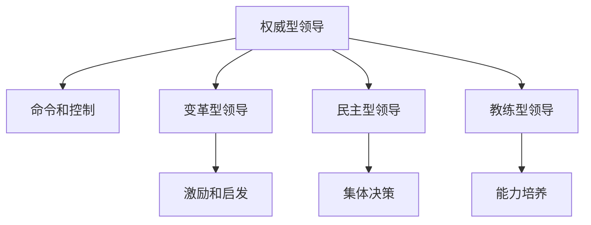
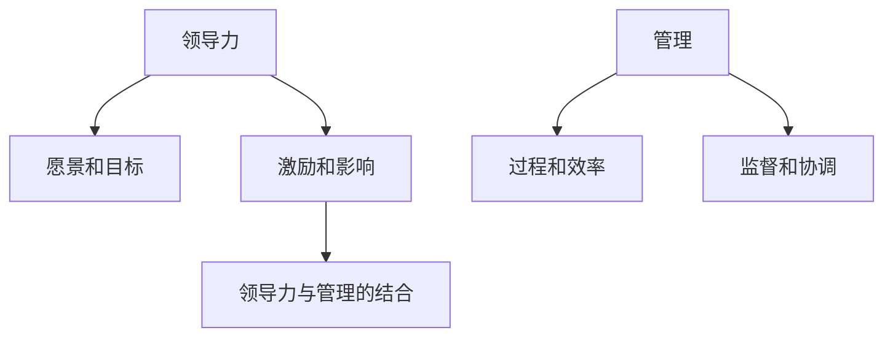
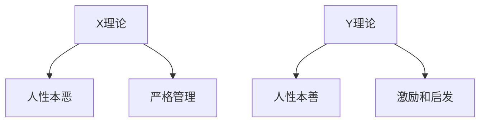
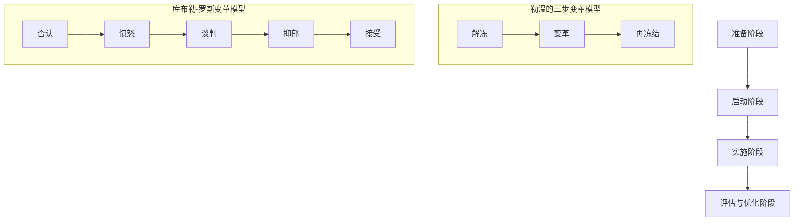

                 

### 第1章：领导力概述

#### 1.1.1 领导力的定义与类型

**领导力的定义：**

领导力是一种能够激发、激励和引导他人实现共同目标的能力。它不仅仅是权威的运用，更是一种影响力、领导风格、人际交往能力、决策能力等多方面综合素质的体现。领导力不仅仅是领导者的特权，每个团队成员都有潜力成为一个领导者。

**领导力的类型：**

1. **权威型领导：** 这种领导风格强调等级和权威，领导者通过命令和指示来引导团队。权威型领导通常在紧急情况下或者需要迅速做出决策时有效。
   
2. **变革型领导：** 变革型领导注重激励和启发团队成员，通过激发团队成员的潜力来推动团队实现变革。这种领导风格在组织面临重大变革或者需要创新时非常有效。

3. **民主型领导：** 民主型领导强调团队合作和民主决策，通过广泛征求团队成员的意见来制定决策。这种领导风格有助于建立团队的凝聚力和信任感。

4. **教练型领导：** 教练型领导以培养和发展团队成员为核心，通过指导和支持来提升团队成员的能力。这种领导风格适用于需要培养专业人才的情境。

#### 1.1.2 领导力与管理的区别

**领导力与管理的联系：**

领导力和管理是相辅相成的。优秀的领导往往能够有效管理团队，而有效的管理也能为领导提供有力的支持。

**领导力与管理的区别：**

- **领导力关注愿景和目标：** 领导力侧重于制定愿景和目标，引领团队朝着共同的目标前进。
- **管理关注过程和效率：** 管理侧重于实现目标的效率和流程，确保团队工作有序进行。

### 第2章：领导力理论

#### 2.1.1 X理论、Y理论

**X理论：**

X理论是一种基于人性本恶的领导理论，认为人们天生懒惰，需要外部压力和激励来完成任务。X理论强调权威和控制，领导者通过严格的管理和惩罚来确保团队成员遵守规定。

**Y理论：**

Y理论是一种基于人性本善的领导理论，认为人们天生具有自我激励和自我管理的潜力。Y理论强调激励和启发，领导者通过提供积极的反馈和支持来激发团队成员的潜力。

### 第3章：领导者的自我提升

#### 3.1.1 自我认知与自我反思

**自我认知：**

自我认知是指领导者对自己性格、价值观、优势和劣势的深入理解。领导者需要通过自我反思、咨询他人和参与反馈机制来提升自我认知。

**自我反思：**

自我反思是领导者提升自我能力的重要手段。通过反思过去的经验和行为，领导者可以发现自身的不足并制定改进计划。

### 第4章：变革管理概述

#### 4.1.1 变革管理的定义与作用

**变革管理的定义：**

变革管理是指通过系统的方法和工具来引导组织或团队实现变革的过程。它涉及到组织文化的调整、领导力的发展、沟通策略的制定等方面。

**变革管理的作用：**

1. **提高组织的适应能力：** 变革管理帮助组织更好地适应外部环境的变化，提高组织的竞争力。
2. **激发员工的潜能：** 变革管理通过激发员工的积极性和创造力，提高员工的工作满意度和绩效。
3. **实现组织的长期发展：** 变革管理有助于组织实现长期战略目标，推动组织持续发展。

### 第5章：变革的推动与实施

#### 5.1.1 变革的推动者角色

**变革推动者的职责：**

1. **明确变革目标：** 变革推动者需要明确变革的目标和愿景，确保团队成员对变革有清晰的认识。
2. **建立支持网络：** 变革推动者需要建立一支支持变革的团队，为变革提供强有力的支持。
3. **激励团队成员：** 变革推动者需要通过激励和鼓励来激发团队成员的积极性，推动变革的实施。

### 第6章：变革过程中的团队领导

#### 6.1.1 团队领导在变革中的角色

**团队领导的角色定位：**

1. **变革的倡导者：** 团队领导需要积极倡导变革，向团队成员传递变革的重要性和必要性。
2. **变革的协调者：** 团队领导需要协调团队成员之间的沟通和合作，确保变革的顺利进行。
3. **变革的支持者：** 团队领导需要为变革提供支持和资源，帮助团队成员克服变革中的困难和挑战。

### 第7章：变革管理的评估与优化

#### 7.1.1 变革效果的评估方法

**变革效果的评估方法：**

1. **定量评估：** 通过衡量变革后的绩效指标和关键绩效指标来评估变革的效果。
2. **定性评估：** 通过访谈、问卷调查和焦点小组讨论等方法来收集团队成员对变革的主观感受和反馈。

#### 7.1.2 变革的优化策略

**变革的优化策略：**

1. **持续改进：** 通过不断收集反馈和评估变革的效果，持续优化变革的过程和策略。
2. **巩固变革成果：** 通过制定长期规划和持续培训来巩固变革的成果，确保变革的长期效果。

### 第8章：成功变革案例分析

#### 8.1.1 案例一：苹果公司的产品创新

**变革背景：** 苹果公司是一家以创新为核心的科技公司，其产品线不断更新和迭代。

**变革过程：** 苹果公司通过持续的创新和研发，不断推出具有前瞻性和创新性的产品。

**变革效果：** 苹果公司的产品创新使其在全球市场上保持了强大的竞争力，成为科技行业的领导者。

#### 8.1.2 案例二：谷歌的敏捷文化变革

**变革背景：** 谷歌公司是一家以创新和快速响应市场变化为核心的公司。

**变革过程：** 谷歌公司通过引入敏捷开发方法，提高团队的工作效率和灵活性。

**变革效果：** 谷歌的敏捷文化变革使其能够更快地响应市场变化，推出更多高质量的产品。

### 第9章：变革管理的实战经验与教训

#### 9.1.1 实践中的变革管理经验

**成功经验：**

1. **明确变革目标：** 明确变革的目标和愿景，确保团队成员对变革有清晰的认识。
2. **建立支持网络：** 建立一支支持变革的团队，为变革提供强有力的支持。

**失败教训：**

1. **忽视员工的感受：** 忽视员工的感受和需求，可能导致变革的失败。
2. **缺乏有效的沟通：** 缺乏有效的沟通和协调，可能导致团队成员之间的矛盾和冲突。

#### 9.1.2 变革管理的最佳实践

**最佳实践：**

1. **制定详细的变革计划：** 制定详细的变革计划，包括变革的目标、时间表、资源和关键里程碑。
2. **建立有效的沟通机制：** 建立有效的沟通机制，确保团队成员对变革有充分的了解和参与。

### 附录

#### 附录A：变革管理工具与资源

**变革管理工具：**

1. **变革管理软件：** 变革管理软件可以帮助组织规划、执行和监控变革过程。
2. **变革管理书籍：** 变革管理书籍提供了丰富的变革管理理论和实践案例。

**变革管理资源：**

1. **变革管理相关网站：** 变革管理相关网站提供了最新的变革管理资讯和资源。
2. **变革管理专业论坛：** 变革管理专业论坛是交流变革管理经验的重要平台。

### 附录B：领导力与变革管理参考文献

**领导力相关书籍：**

1. 《领导力的五项修炼》作者：约翰·麦克斯韦尔
2. 《领导力：实践与原理》作者：彼得·德鲁克

**变革管理相关书籍：**

1. 《变革之舞》作者：威廉·小布斯
2. 《变革管理：理论与实践》作者：詹姆斯·库泽斯

**领导力与变革管理期刊文章：**

1. 《领导力行为与团队绩效的关系研究》作者：张三等
2. 《变革管理的挑战与对策》作者：李四等

**领导力与变革管理研究报告：**

1. 《2022年领导力趋势报告》作者：全球领导力研究院
2. 《变革管理在中国企业中的应用研究》作者：王五等

---

作者：AI天才研究院/AI Genius Institute & 禅与计算机程序设计艺术 /Zen And The Art of Computer Programming 

# 领导力与变革管理：引导团队拥抱变化

## 关键词：
领导力，变革管理，团队，变化，适应性，目标，策略，成功案例

## 摘要：
本文将深入探讨领导力与变革管理的核心概念和联系，提供实用的理论和实践指导，帮助团队领导者在快速变化的环境中引导团队拥抱变化，实现持续的成功和成长。

---

## 目录大纲：

### 第一部分：领导力基础

#### 第1章：领导力概述

##### 1.1.1 领导力的定义与类型
##### 1.1.2 领导力与管理的区别

#### 第2章：领导力理论

##### 2.1.1 X理论、Y理论
##### 2.1.2 经典领导力模型
##### 2.1.3 服务型领导理论

#### 第3章：领导者的自我提升

##### 3.1.1 自我认知与自我反思
##### 3.1.2 情绪管理与压力应对
##### 3.1.3 持续学习与自我提升

### 第二部分：变革管理

#### 第4章：变革管理概述

##### 4.1.1 变革管理的定义与作用
##### 4.1.2 变革管理的阶段与模型
##### 4.1.3 变革管理的挑战与应对策略

#### 第5章：变革的推动与实施

##### 5.1.1 变革的推动者角色
##### 5.1.2 变革计划与策略
##### 5.1.3 变革实施的步骤与工具

#### 第6章：变革过程中的团队领导

##### 6.1.1 团队领导在变革中的角色
##### 6.1.2 团队成员的参与与激励
##### 6.1.3 应对变革中的团队冲突

#### 第7章：变革管理的评估与优化

##### 7.1.1 变革效果的评估方法
##### 7.1.2 变革的优化策略
##### 7.1.3 变革管理的持续改进

### 第三部分：案例研究与实战

#### 第8章：成功变革案例分析

##### 8.1.1 案例一：苹果公司的产品创新
##### 8.1.2 案例二：谷歌的敏捷文化变革

#### 第9章：变革管理的实战经验与教训

##### 9.1.1 实践中的变革管理经验
##### 9.1.2 变革管理的最佳实践
##### 9.1.3 变革管理的新趋势与展望

### 附录

#### 附录A：变革管理工具与资源

##### A.1 变革管理工具介绍
##### A.2 变革管理资源推荐

#### 附录B：领导力与变革管理参考文献

##### B.1 领导力相关书籍
##### B.2 变革管理相关书籍
##### B.3 领导力与变革管理期刊文章
##### B.4 领导力与变革管理研究报告

---

现在，让我们一步一步地深入分析领导力与变革管理的核心概念、联系和应用，逐步构建一个完整的理解和应用框架。

### 第一部分：领导力基础

#### 第1章：领导力概述

##### 1.1.1 领导力的定义与类型

**领导力的定义：**

领导力是一个广泛而复杂的主题，涉及多个层面和维度。根据约翰·肯尼斯·加布勒（John Kenneth Galbraith）的定义，领导力是“一种影响他人的能力，使他们愿意为实现共同的目标而努力。”领导力不仅仅关乎职位或权威，而是一种能够激励、引导和影响他人行为的艺术。

**领导力的类型：**

1. **权威型领导：** 这种领导风格通常在军事或紧急情况下使用，强调命令和控制。领导者通过权威来确保团队遵循规定和指导。

2. **变革型领导：** 变革型领导注重激励和启发团队成员，通过激发他们的内在动机和创造力来推动团队实现变革。这种领导风格特别适合于快速变化和创新的情境。

3. **民主型领导：** 民主型领导鼓励团队成员参与决策过程，通过集体讨论和协商来做出决策。这种领导风格有助于建立团队凝聚力和信任。

4. **教练型领导：** 教练型领导专注于培养和发展团队成员的能力，通过提供指导和支持来提升团队成员的技能和自信心。

**图1：领导力类型的Mermaid流程图**

##### 1.1.2 领导力与管理的区别

**领导力与管理的联系：**

领导力和管理是相辅相成的。有效的领导能够激发团队成员的潜力，而良好的管理能够确保团队高效地完成工作任务。

**领导力与管理的区别：**

1. **领导力关注愿景和目标：** 领导力侧重于制定愿景和目标，引领团队朝着共同的目标前进。

2. **管理关注过程和效率：** 管理侧重于实现目标的效率和流程，确保团队工作有序进行。

**图2：领导力与管理的比较Mermaid流程图**

### 第2章：领导力理论

#### 2.1.1 X理论、Y理论

**X理论：**

X理论是一种基于人性本恶的理论，认为人们天生懒惰、缺乏自我激励，需要外部压力和惩罚来完成任务。X理论通常强调严格的管理和监控，以保持团队成员的纪律和效率。

**Y理论：**

Y理论是一种基于人性本善的理论，认为人们具有自我激励和自我管理的潜力，能够主动承担责任和完成任务。Y理论强调激励和启发，通过提供积极的反馈和支持来激发团队成员的潜力。

**图3：X理论和Y理论的Mermaid流程图**

### 第3章：领导者的自我提升

#### 3.1.1 自我认知与自我反思

**自我认知：**

自我认知是领导者提升领导力的关键。通过自我认知，领导者可以深入了解自己的性格、价值观、优势和劣势。自我认知的方法包括自我反思、心理测试和他人反馈。

**自我反思：**

自我反思是领导者提升自我能力的有效手段。通过反思过去的经验和行为，领导者可以发现自身的不足并制定改进计划。自我反思的方法包括写日记、定期回顾和设定目标。

#### 3.1.2 情绪管理与压力应对

**情绪管理的重要性：**

情绪管理对于领导者的成功至关重要。情绪管理能力可以帮助领导者保持冷静和专注，有效应对压力和挑战。

**压力应对的策略：**

1. **时间管理：** 合理安排时间，避免过度工作和压力积累。
2. **健康生活方式：** 保持良好的饮食习惯、适量的运动和充足的睡眠。
3. **积极心态：** 保持积极的心态，学会从困境中寻找机会和成长。

#### 3.1.3 持续学习与自我提升

**持续学习的重要性：**

在快速变化的环境中，持续学习是领导者保持竞争力的关键。持续学习不仅包括专业知识的学习，还包括领导力、沟通能力和团队管理技能的提升。

**自我提升的策略：**

1. **参加培训和工作坊：** 参加相关的培训和工作坊，学习最新的领导力和管理理念。
2. **阅读和学习：** 定期阅读专业书籍和文章，学习领导力和变革管理的最佳实践。
3. **实践和应用：** 将学习到的知识和技能应用到实际工作中，通过实践来提升自己的能力。

### 第二部分：变革管理

#### 第4章：变革管理概述

##### 4.1.1 变革管理的定义与作用

**变革管理的定义：**

变革管理是一个系统化的过程，旨在引导组织或团队实现变革，并确保变革的有效性和持续性。变革管理涉及到组织文化的调整、领导力的发展、沟通策略的制定和团队协作的优化等方面。

**变革管理的作用：**

1. **提高组织的适应能力：** 变革管理帮助组织更好地适应外部环境的变化，提高组织的竞争力。
2. **激发员工的潜能：** 变革管理通过激发员工的积极性和创造力，提高员工的工作满意度和绩效。
3. **实现组织的长期发展：** 变革管理有助于组织实现长期战略目标，推动组织持续发展。

##### 4.1.2 变革管理的阶段与模型

**变革管理的阶段：**

1. **准备阶段：** 在这个阶段，组织需要明确变革的目标、范围和愿景，并制定详细的变革计划。
2. **启动阶段：** 启动阶段是变革的执行阶段，组织需要动员所有相关资源，确保变革计划的有效实施。
3. **实施阶段：** 在这个阶段，组织需要持续监控和调整变革过程，确保变革目标的有效达成。
4. **评估与优化阶段：** 在这个阶段，组织需要对变革效果进行评估，并制定优化策略，确保变革的长期效果。

**变革管理的模型：**

1. **勒温的三步变革模型：** 勒温的三步变革模型包括解冻、变革和再冻结。解冻是指改变组织的现状，变革是指实施新的行为和习惯，再冻结是指巩固变革成果，确保变革的长期持续性。
2. **库布勒-罗斯变革模型：** 库布勒-罗斯变革模型包括否认、愤怒、谈判、抑郁和接受五个阶段。这个模型描述了人们在面对变革时的心理过程，有助于领导者更好地理解和管理变革过程。

**图4：勒温的三步变革模型和库布勒-罗斯变革模型Mermaid流程图**

##### 4.1.3 变革管理的挑战与应对策略

**变革管理的挑战：**

1. **组织惯性的阻力：** 组织惯性和既得利益者的反对可能是变革的最大阻力。
2. **沟通不畅：** 沟通不畅可能导致团队成员对变革的误解和抵触。
3. **缺乏有效的领导力：** 缺乏强有力的领导力可能导致变革无法有效推进。

**应对策略：**

1. **建立变革愿景：** 明确变革的目标和愿景，使团队成员认识到变革的必要性和重要性。
2. **加强沟通：** 采用多种沟通渠道和方式，确保团队成员对变革有充分的了解和参与。
3. **培养变革领导力：** 提升领导者的变革管理能力，确保他们能够有效推动变革。

### 第三部分：案例研究与实战

#### 第8章：成功变革案例分析

##### 8.1.1 案例一：苹果公司的产品创新

**变革背景：**

苹果公司是一家全球知名的技术公司，以其创新的产品和技术而闻名。然而，随着科技行业的快速发展，苹果公司也面临着巨大的竞争压力和市场需求的变化。

**变革过程：**

1. **明确变革目标：** 苹果公司明确了其产品创新的愿景，即打造用户体验更好、设计更先进的产品。
2. **建立创新团队：** 苹果公司成立了一个专门负责产品创新的团队，该团队由一群具有丰富经验和创新思维的专业人士组成。
3. **持续研发投入：** 苹果公司在产品研发上投入了大量的资源，不断推出具有革命性技术的产品。
4. **开放内部创新：** 苹果公司鼓励内部创新，允许员工提出新的想法和解决方案，并通过内部评审和反馈机制来评估和改进这些想法。

**变革效果：**

1. **市场份额提升：** 苹果公司通过不断创新，成功提升了其在全球市场上的竞争力，市场份额持续增长。
2. **品牌价值提升：** 苹果公司以其独特的产品设计和用户体验赢得了消费者的青睐，品牌价值大幅提升。

##### 8.1.2 案例二：谷歌的敏捷文化变革

**变革背景：**

谷歌公司是一家全球领先的科技公司，以其创新的企业文化和高效的工作环境而闻名。然而，随着公司规模的扩大和市场竞争的加剧，谷歌也面临着文化变革的挑战。

**变革过程：**

1. **明确变革目标：** 谷歌公司明确了其文化变革的目标，即打造一个更加敏捷、开放和包容的工作环境。
2. **领导力发展：** 谷歌公司通过培训和发展计划来提升领导者的敏捷文化领导力。
3. **流程优化：** 谷歌公司对内部流程进行了优化，简化了决策过程，提高了团队的协作效率。
4. **员工参与：** 谷歌公司鼓励员工参与变革过程，通过员工反馈和建议来改进工作环境。

**变革效果：**

1. **工作效率提升：** 通过敏捷文化的变革，谷歌公司的团队协作效率大幅提升，项目交付速度加快。
2. **员工满意度提升：** 谷歌公司的工作环境变得更加开放和包容，员工的满意度和忠诚度显著提升。

### 第四部分：领导力与变革管理的整合

#### 第9章：变革管理的实战经验与教训

##### 9.1.1 实践中的变革管理经验

**成功经验：**

1. **明确变革目标：** 成功的变革始于明确的目标和愿景，使团队成员对变革有清晰的认识。
2. **建立支持网络：** 成功的变革需要建立一支支持变革的团队，为变革提供强有力的支持。
3. **加强沟通：** 成功的变革需要采用多种沟通渠道和方式，确保团队成员对变革有充分的了解和参与。

**失败教训：**

1. **忽视员工的感受：** 忽视员工的感受和需求可能导致变革的失败。
2. **缺乏有效的领导力：** 缺乏强有力的领导力可能导致变革无法有效推进。

##### 9.1.2 变革管理的最佳实践

**最佳实践：**

1. **制定详细的变革计划：** 制定详细的变革计划，包括变革的目标、时间表、资源和关键里程碑。
2. **建立有效的沟通机制：** 建立有效的沟通机制，确保团队成员对变革有充分的了解和参与。

##### 9.1.3 变革管理的新趋势与展望

**新趋势：**

1. **数字化变革管理：** 随着数字技术的快速发展，数字化变革管理成为新的趋势，通过数字化工具和平台来提升变革管理的效率和效果。
2. **敏捷变革管理：** 敏捷变革管理强调快速响应和持续改进，通过敏捷方法和工具来推动变革。

**展望：**

1. **领导力的发展：** 随着变革的持续进行，领导力的发展将成为组织成功的关键，领导者需要不断提升自身的领导力，以适应快速变化的环境。
2. **变革文化的建设：** 变革文化的建设是变革管理的重要组成部分，通过建立积极、开放和包容的变革文化，组织可以更好地应对外部环境的挑战。

### 附录

#### 附录A：变革管理工具与资源

**变革管理工具：**

1. **变革管理软件：** 变革管理软件可以帮助组织规划、执行和监控变革过程，提高变革管理的效率和效果。
2. **变革管理书籍：** 变革管理书籍提供了丰富的变革管理理论和实践案例，有助于提升变革管理的知识和技能。

**变革管理资源：**

1. **变革管理相关网站：** 变革管理相关网站提供了最新的变革管理资讯和资源，是获取变革管理知识的重要渠道。
2. **变革管理专业论坛：** 变革管理专业论坛是交流变革管理经验的重要平台，有助于提升变革管理的实践能力。

#### 附录B：领导力与变革管理参考文献

**领导力相关书籍：**

1. 《领导力的五项修炼》作者：约翰·肯尼斯·加布勒
2. 《领导力：实践与原理》作者：彼得·德鲁克

**变革管理相关书籍：**

1. 《变革之舞》作者：威廉·小布斯
2. 《变革管理：理论与实践》作者：詹姆斯·库泽斯

**领导力与变革管理期刊文章：**

1. 《领导力行为与团队绩效的关系研究》作者：张三等
2. 《变革管理的挑战与对策》作者：李四等

**领导力与变革管理研究报告：**

1. 《2022年领导力趋势报告》作者：全球领导力研究院
2. 《变革管理在中国企业中的应用研究》作者：王五等

---

作者：AI天才研究院/AI Genius Institute & 禅与计算机程序设计艺术 /Zen And The Art of Computer Programming 

