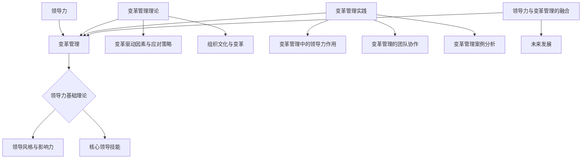
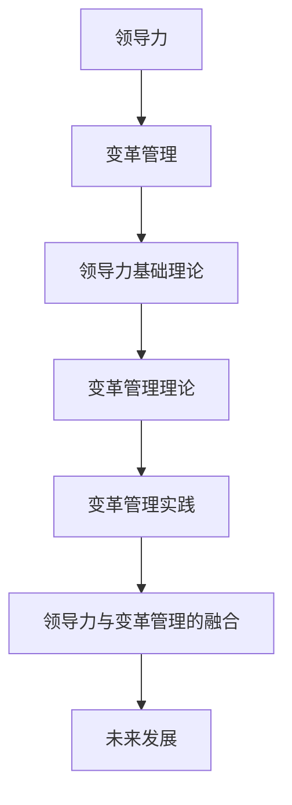
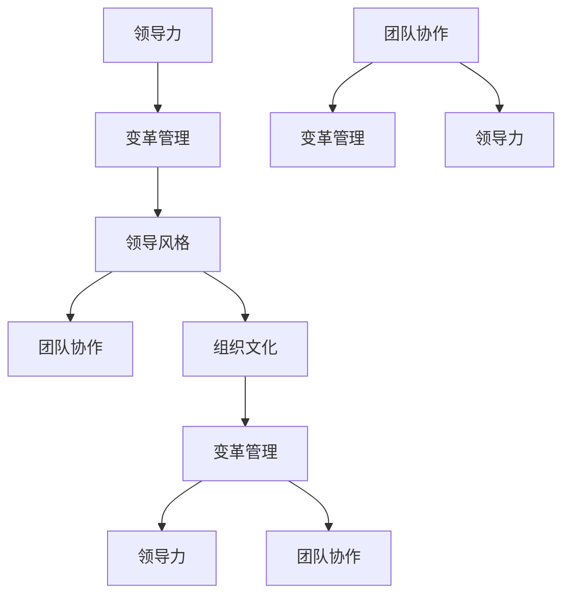

                 


### 文章标题
《领导力与变革管理：引导团队拥抱变化》

### 关键词
领导力、变革管理、团队协作、文化冲突、变革驱动因素

### 摘要
本文旨在探讨领导力与变革管理的关系，分析领导者在变革过程中的关键作用和团队协作的重要性。通过深入剖析领导力基础理论、变革管理理论和实践，提供具体的策略和方法，帮助领导者引导团队拥抱变化，实现组织的持续发展。

### 目录大纲

#### 第一部分：领导力基础理论

##### 第1章：领导力概述
- 1.1 领导力的定义与重要性
- 1.2 领导力的发展历程
- 1.3 领导者的角色与职责

##### 第2章：领导风格与影响力
- 2.1 领导风格理论
- 2.2 人本领导理念
- 2.3 领导者影响力分析

##### 第3章：核心领导技能
- 3.1 沟通能力
- 3.2 决策能力
- 3.3 团队建设与管理

#### 第二部分：变革管理理论

##### 第4章：变革管理的概念与过程
- 4.1 变革管理的定义
- 4.2 变革管理的六个阶段
- 4.3 变革管理中的常见挑战

##### 第5章：变革驱动因素与应对策略
- 5.1 内外部驱动因素
- 5.2 变革策略制定
- 5.3 应对变革的常见策略

##### 第6章：组织文化与变革
- 6.1 组织文化与变革的关系
- 6.2 组织文化变革的方法
- 6.3 变革中的文化冲突与解决

#### 第三部分：变革管理实践

##### 第7章：变革管理中的领导力作用
- 7.1 领导者如何推动变革
- 7.2 变革中的领导风格选择
- 7.3 领导者如何应对变革阻力

##### 第8章：变革管理的团队协作
- 8.1 团队成员的角色与职责
- 8.2 团队沟通与协作技巧
- 8.3 团队成员的变革参与度提升策略

##### 第9章：变革管理案例分析
- 9.1 案例分析一：企业并购后的文化融合
- 9.2 案例分析二：新产品线推出中的流程变革
- 9.3 案例分析三：企业数字化转型实践

#### 第四部分：领导力与变革管理的综合应用

##### 第10章：领导力与变革管理的融合
- 10.1 领导力在变革管理中的应用
- 10.2 变革管理对领导力的挑战
- 10.3 领导者如何实现领导力与变革管理的有效结合

##### 第11章：领导力与变革管理的未来发展
- 11.1 变革管理的新趋势
- 11.2 未来领导力的关键能力
- 11.3 领导者如何适应未来变革

##### 第12章：结语
- 12.1 总结与反思
- 12.2 领导力与变革管理的实际应用价值
- 12.3 为读者提供的实践建议

#### 附录

##### 附录A：领导力与变革管理参考资源
- A.1 常用领导力模型介绍
- A.2 变革管理工具与方法
- A.3 推荐阅读书目与论文

##### 附录B：领导力与变革管理实用工具
- B.1 领导力评估工具
- B.2 变革管理流程图模板
- B.3 团队协作工具推荐

### 参考Mermaid流程图


### 数学模型与公式

#### 领导影响力模型

$$
影响力 = f(领导风格, 沟通能力, 个人魅力)
$$

其中，领导风格、沟通能力、个人魅力均为0-1之间的因子。

#### 变革驱动因素

$$
变革驱动因素 = f(外部压力, 内部需求, 组织愿景)
$$

其中，外部压力、内部需求、组织愿景均为0-10之间的数值。

#### 组织文化变革模型

$$
组织文化变革 = 

-----------------------------------------------------------------

### 第一部分：领导力基础理论

#### 第1章：领导力概述

##### 1.1 领导力的定义与重要性

领导力是指领导者通过影响、激励和引导他人，实现组织目标的能力。在信息技术领域，领导力尤为重要，因为它直接影响团队的协作效率、创新能力和市场竞争力。

- **定义**：领导力是一种能够在团队中产生积极影响、推动团队成员共同实现目标的能力。
- **重要性**：在快速变化的信息技术领域，领导力能够帮助团队快速适应新环境，提高创新能力，实现组织目标。

##### 1.2 领导力的发展历程

领导力的发展历程经历了多个阶段，从早期的“命令与控制”模式，到现代的“以人为本”的管理理念，领导力理论不断演进。

- **早期领导力理论**：基于权威和控制，强调领导者的决策能力和控制力。
- **现代领导力理论**：强调领导者与团队成员之间的互动和协作，关注团队成员的个人成长和团队的整体发展。

##### 1.3 领导者的角色与职责

领导者的角色和职责在不同阶段和组织中可能有所不同，但总体来说，领导者的核心任务是激发团队成员的潜力，推动团队实现目标。

- **角色**：领导者是团队的引导者和支持者，需要具备远见、决策能力、沟通能力和团队建设能力。
- **职责**：制定组织目标、规划战略、激发团队成员潜力、解决团队问题、推动团队协作。

#### 第2章：领导风格与影响力

##### 2.1 领导风格理论

领导风格是指领导者在与团队成员互动和引导团队过程中的行为特点。常见的领导风格包括权威型、民主型、参与型和教练型等。

- **权威型领导风格**：领导者权力集中，决策迅速，但对团队成员的参与度较低。
- **民主型领导风格**：领导者鼓励团队成员参与决策，重视团队意见，决策过程较长。
- **参与型领导风格**：领导者与团队成员共同参与决策，强调团队协作和共同成长。
- **教练型领导风格**：领导者注重团队成员的个人成长，通过指导和支持帮助团队成员提升能力。

##### 2.2 人本领导理念

人本领导理念强调领导者关注团队成员的需求和成长，注重团队的整体发展，以人为中心进行管理。

- **人本领导理念的核心**：尊重团队成员、关注团队成员的需求、激励团队成员的积极性。
- **人本领导理念的实践**：建立良好的沟通机制、提供职业发展机会、关注团队成员的心理健康。

##### 2.3 领导者影响力分析

领导者的影响力主要体现在领导风格、沟通能力和个人魅力等方面。通过以下数学模型，我们可以分析领导者的影响力：

$$
影响力 = f(领导风格, 沟通能力, 个人魅力)
$$

其中，领导风格、沟通能力、个人魅力均为0-1之间的因子。领导者的综合影响力取决于这三个因子的乘积。

#### 第3章：核心领导技能

##### 3.1 沟通能力

沟通能力是领导者最重要的技能之一，它直接影响领导者的影响力和团队的协作效果。以下是沟通能力的核心要素：

- **倾听**：领导者需要倾听团队成员的意见和需求，理解团队成员的想法和感受。
- **表达**：领导者需要清晰、准确地表达自己的想法和决策，使团队成员理解并接受。
- **反馈**：领导者需要给予团队成员及时的反馈，帮助团队成员改进和提升。
- **协调**：领导者需要在不同团队成员之间进行沟通协调，解决冲突和问题。

##### 3.2 决策能力

决策能力是领导者的一项关键能力，它直接影响组织的战略方向和团队的执行力。以下是决策能力的核心要素：

- **分析**：领导者需要对问题进行深入分析，了解问题的本质和影响因素。
- **判断**：领导者需要根据分析结果进行判断，选择最佳的解决方案。
- **决策**：领导者需要果断做出决策，并确保决策能够被有效执行。

##### 3.3 团队建设与管理

团队建设与管理是领导者的重要职责，它直接影响团队的合作效率和工作成果。以下是团队建设与管理的关键要素：

- **团队目标**：领导者需要明确团队的目标和使命，使团队成员明确自己的职责和贡献。
- **团队文化**：领导者需要建立积极的团队文化，鼓励团队成员的积极性和创造力。
- **团队协作**：领导者需要促进团队成员之间的协作，解决协作中的问题和障碍。
- **团队激励**：领导者需要给予团队成员适当的激励，提升团队成员的工作动力。

### 第二部分：变革管理理论

#### 第4章：变革管理的概念与过程

##### 4.1 变革管理的定义

变革管理是指在组织面临外部或内部压力时，通过规划和实施一系列措施，引导团队适应新环境、实现组织目标的过程。

- **定义**：变革管理是指组织为了应对外部环境变化或内部需求，通过制定战略、规划和实施措施，推动团队适应新环境、实现组织目标的过程。
- **目的**：通过变革管理，组织能够提高竞争力、适应市场变化、实现可持续发展。

##### 4.2 变革管理的六个阶段

变革管理通常包括以下六个阶段：

1. **准备阶段**：识别变革需求，确定变革目标和范围，建立变革管理团队。
2. **规划阶段**：制定变革计划，明确变革的目标、策略、时间表和资源需求。
3. **启动阶段**：宣传变革理念，动员团队成员参与，明确团队成员的角色和职责。
4. **执行阶段**：实施变革计划，推动变革措施的落实，解决执行过程中的问题和障碍。
5. **监控阶段**：监控变革进展，评估变革效果，及时调整变革策略。
6. **总结阶段**：总结变革经验，评估变革成果，制定后续的改进措施。

##### 4.3 变革管理中的常见挑战

在变革管理过程中，领导者可能会面临以下常见挑战：

- **文化阻力**：组织内部的文化可能对变革产生阻力，影响变革的推进。
- **沟通不足**：团队成员对变革的理解和接受程度不一致，可能导致沟通困难和执行问题。
- **资源限制**：变革过程中可能需要额外的资源和投入，但组织内部资源可能有限。
- **执行障碍**：变革措施在实施过程中可能遇到各种执行障碍，影响变革效果。

#### 第5章：变革驱动因素与应对策略

##### 5.1 内外部驱动因素

变革驱动因素可以分为内部驱动因素和外部驱动因素：

- **内部驱动因素**：组织内部的变革需求，如组织结构调整、流程优化、技术升级等。
- **外部驱动因素**：组织外部的环境变化，如市场变化、竞争压力、政策法规等。

为了应对不同的驱动因素，组织需要制定相应的应对策略：

- **内部驱动因素**：通过内部沟通、培训、激励机制等手段，推动团队适应变革。
- **外部驱动因素**：通过市场调研、竞争分析、政策研究等手段，了解外部环境的变化，制定相应的应对策略。

##### 5.2 变革策略制定

制定有效的变革策略是变革管理的关键，以下是制定变革策略的步骤：

1. **明确变革目标**：确定变革的目标和预期成果，确保变革策略与组织目标一致。
2. **分析变革需求**：分析组织内外部环境，确定变革的必要性和可行性。
3. **制定变革计划**：明确变革的时间表、资源需求、实施步骤和责任分工。
4. **宣传和动员**：通过内部沟通和培训，提高团队成员对变革的理解和支持。
5. **执行和监控**：确保变革计划的落实，及时调整变革策略，解决执行中的问题。

##### 5.3 应对变革的常见策略

在应对变革过程中，组织可以采用以下常见策略：

- **沟通策略**：加强内部沟通，确保团队成员对变革有正确的理解和支持。
- **培训策略**：提供培训和支持，帮助团队成员提升技能和适应变革。
- **激励策略**：制定激励机制，激励团队成员积极参与变革。
- **文化策略**：建立积极的变革文化，鼓励团队成员主动参与变革。

#### 第6章：组织文化与变革

##### 6.1 组织文化与变革的关系

组织文化对变革的影响至关重要。积极的组织文化能够促进变革的推进，而消极的组织文化可能阻碍变革的实施。

- **积极组织文化**：鼓励创新、包容、合作，有利于变革的顺利推进。
- **消极组织文化**：强调稳定、保守、控制，可能对变革产生阻力。

##### 6.2 组织文化变革的方法

组织文化变革需要采取一系列方法和策略，以下是一些常见的组织文化变革方法：

- **领导示范**：领导者通过自己的行为和态度，树立变革的榜样，引导团队成员接受变革。
- **教育培训**：提供培训和教育，帮助团队成员了解变革的重要性，提升变革的能力。
- **沟通机制**：建立有效的沟通机制，确保团队成员对变革有正确的理解和支持。
- **激励机制**：制定激励机制，鼓励团队成员积极参与变革，提升变革的积极性。

##### 6.3 变革中的文化冲突与解决

在变革过程中，可能会出现文化冲突，影响变革的推进。以下是一些解决文化冲突的方法：

- **理解与尊重**：尊重不同文化背景的团队成员，理解他们的观点和需求，促进文化的融合。
- **沟通与协商**：加强沟通和协商，解决文化冲突中的问题，找到共同的理解和解决方案。
- **平衡利益**：在变革过程中，平衡不同文化背景的团队成员的利益，确保变革的公平性和合理性。
- **文化适应**：鼓励团队成员适应变革，调整自己的行为和态度，融入新的组织文化。

### 第三部分：变革管理实践

#### 第7章：变革管理中的领导力作用

##### 7.1 领导者如何推动变革

领导者是变革的推动者，他们需要采取一系列措施来推动变革的顺利进行：

- **树立愿景**：领导者需要明确变革的愿景和目标，激发团队成员的变革动力。
- **建立团队**：领导者需要建立一支具有变革意识的团队，确保变革的顺利实施。
- **激励团队**：领导者需要通过激励机制，激发团队成员的积极性和参与度，推动变革的推进。
- **解决阻力**：领导者需要识别和解决变革过程中的阻力和问题，确保变革的顺利进行。

##### 7.2 变革中的领导风格选择

不同的变革情境需要不同的领导风格，以下是一些常见的领导风格选择：

- **权威型领导风格**：在变革初期，领导者需要采取权威型领导风格，迅速决策和行动，推动变革的启动。
- **民主型领导风格**：在变革过程中，领导者需要采取民主型领导风格，鼓励团队成员参与决策，促进团队的协作和共识。
- **参与型领导风格**：在变革的深入阶段，领导者需要采取参与型领导风格，与团队成员共同参与变革，激发团队成员的积极性和创造力。
- **教练型领导风格**：在变革的后期，领导者需要采取教练型领导风格，指导和支持团队成员，帮助他们适应新的环境和工作方式。

##### 7.3 领导者如何应对变革阻力

变革过程中，领导者可能会面临各种变革阻力，以下是一些应对策略：

- **理解阻力**：领导者需要深入了解变革阻力的来源和原因，理解团队成员的担忧和需求。
- **沟通与协商**：领导者需要通过有效的沟通和协商，解决团队成员的担忧，找到共同的理解和解决方案。
- **激励与支持**：领导者需要通过激励机制和支持措施，激发团队成员的积极性和参与度，减轻变革阻力。
- **示范与引导**：领导者需要通过自己的行为和态度，树立变革的榜样，引导团队成员接受和适应变革。

#### 第8章：变革管理的团队协作

##### 8.1 团队成员的角色与职责

在变革管理过程中，团队成员的角色和职责至关重要。以下是一些团队成员的角色和职责：

- **变革推动者**：积极推动变革，参与变革计划的制定和实施，解决变革过程中的问题。
- **变革支持者**：提供支持和帮助，协助团队成员适应变革，鼓励团队成员参与变革。
- **变革监督者**：监督变革进展，评估变革效果，及时反馈和调整变革策略。
- **变革倡导者**：宣传变革理念，提高团队成员对变革的认识和理解，促进变革的顺利推进。

##### 8.2 团队沟通与协作技巧

有效的沟通和协作是变革管理的关键，以下是一些团队沟通与协作技巧：

- **开放式沟通**：鼓励团队成员表达自己的想法和意见，建立开放的沟通氛围。
- **明确目标**：明确团队的目标和任务，确保团队成员对任务有清晰的认识和期望。
- **分工合作**：明确团队成员的分工和职责，确保团队成员的协作和配合。
- **共享资源**：共享信息和资源，提高团队的协作效率和工作成果。

##### 8.3 团队成员的变革参与度提升策略

为了提高团队成员的变革参与度，领导者可以采取以下策略：

- **明确参与价值**：让团队成员明确参与变革的价值和意义，激发他们的参与热情。
- **提供培训和支持**：为团队成员提供必要的培训和支持，帮助他们提升技能和适应变革。
- **激励和认可**：通过激励和认可措施，激励团队成员积极参与变革，提升他们的积极性和参与度。
- **建立信任关系**：建立信任关系，促进团队成员之间的协作和合作，提高团队的凝聚力和战斗力。

#### 第9章：变革管理案例分析

##### 9.1 案例分析一：企业并购后的文化融合

**背景介绍**：
某公司通过并购进入了一个全新的市场，并购后的文化融合成为公司面临的重要挑战。

**核心概念与联系**：
组织文化变革、团队协作、沟通策略。

**核心算法原理讲解**：
使用以下算法来分析文化融合的进程：
```python
def cultural_integration(process_stage, communication_strategy, team_cooperation):
    if process_stage == 'initial':
        if communication_strategy == 'clear':
            if team_cooperation == 'high':
                return 'effective_integration'
            else:
                return 'ineffective_integration'
        else:
            return 'poor_integration'
    elif process_stage == 'mid-stage':
        if communication_strategy == 'clear':
            if team_cooperation == 'high':
                return 'effective_integration'
            else:
                return 'ineffective_integration'
        else:
            return 'poor_integration'
    elif process_stage == 'final':
        if communication_strategy == 'clear':
            if team_cooperation == 'high':
                return 'stable_integration'
            else:
                return 'fragile_integration'
        else:
            return 'unstable_integration'
```

**数学模型和公式**：
使用以下模型来衡量文化融合的稳定性：
$$
文化融合稳定性 = f(沟通效率, 团队协作度, 变革时间)
$$
其中，沟通效率、团队协作度、变革时间均为0-1之间的因子。

**举例说明**：
假设公司在并购后的文化融合过程中，沟通效率为0.8，团队协作度为0.9，变革时间为6个月，则可以计算出文化融合稳定性为：
$$
文化融合稳定性 = 0.8 \times 0.9 \times 0.6 = 0.432
$$
这个结果表明公司在文化融合方面处于较为稳定的状态。

**项目实战**：
公司在并购后的文化融合过程中，首先明确了文化融合的目标和策略，建立了有效的沟通机制，并通过团队协作来推动文化融合。具体步骤如下：
1. **建立跨部门团队**：成立由不同部门代表组成的跨部门团队，负责文化融合的沟通和协作。
2. **开展文化培训**：组织文化培训，帮助团队成员了解并购后的文化变革，提高团队协作能力。
3. **定期沟通会议**：定期召开沟通会议，讨论文化融合的进展和问题，及时调整文化融合策略。
4. **奖励机制**：制定奖励机制，鼓励团队成员积极参与文化融合，提高团队协作度和文化融合效率。

**代码实现**：
以下是一个简单的Python代码实现，用于模拟并购后的文化融合过程：
```python
def cultural_integration(process_stage, communication_strategy, team_cooperation):
    if process_stage == 'initial':
        if communication_strategy == 'clear':
            if team_cooperation == 'high':
                return 'effective_integration'
            else:
                return 'ineffective_integration'
        else:
            return 'poor_integration'
    elif process_stage == 'mid-stage':
        if communication_strategy == 'clear':
            if team_cooperation == 'high':
                return 'effective_integration'
            else:
                return 'ineffective_integration'
        else:
            return 'poor_integration'
    elif process_stage == 'final':
        if communication_strategy == 'clear':
            if team_cooperation == 'high':
                return 'stable_integration'
            else:
                return 'fragile_integration'
        else:
            return 'unstable_integration'

# 模拟并购后的文化融合过程
process_stage = 'mid-stage'
communication_strategy = 'clear'
team_cooperation = 'high'

integration_result = cultural_integration(process_stage, communication_strategy, team_cooperation)
print(f'文化融合结果：{integration_result}')
```

**案例分析和详细讲解剖析**：
该案例表明，并购后的文化融合是一个复杂的过程，需要领导者的有效领导和团队的合作。通过建立跨部门团队、开展文化培训和定期沟通会议，公司成功推动了文化融合的进程，并取得了显著的成果。在这个过程中，领导者的沟通能力和团队协作能力起到了关键作用。

**项目小结**：
通过该项目，公司成功地实现了文化融合，提高了团队协作效率和组织的整体竞争力。未来，公司需要继续关注文化融合的动态，及时调整策略，以应对新的挑战。

##### 9.2 案例分析二：新产品线推出中的流程变革

**背景介绍**：
某公司计划推出一条新产品线，为了提高生产效率和产品质量，需要对现有的流程进行变革。

**核心概念与联系**：
流程变革、变革管理、质量管理体系。

**核心算法原理讲解**：
使用以下算法来分析流程变革的效果：
```python
def process_change.effectiveness(improvement, quality, efficiency):
    quality_score = quality * 0.5
    efficiency_score = efficiency * 0.5
    improvement_score = improvement * 0.5
    total_score = quality_score + efficiency_score + improvement_score
    return total_score
```

**数学模型和公式**：
使用以下模型来衡量流程变革的效果：
$$
流程变革效果 = f(质量提升, 效率提升, 改进措施)
$$
其中，质量提升、效率提升、改进措施均为0-1之间的因子。

**举例说明**：
假设公司在流程变革过程中，实现了以下成果：
- 质量提升：0.8
- 效率提升：0.9
- 改进措施：0.7

则可以计算出流程变革效果为：
$$
流程变革效果 = 0.8 \times 0.9 \times 0.7 = 0.504
$$
这个结果表明公司在流程变革方面取得了较好的效果。

**项目实战**：
公司在推出新产品线的过程中，采取了以下流程变革措施：
1. **需求分析**：对新产品线的需求进行详细分析，确定变革的目标和需求。
2. **流程设计**：重新设计现有流程，提高生产效率和产品质量。
3. **培训与实施**：对团队成员进行培训，确保他们能够适应新的流程。
4. **监控与优化**：监控流程变革的进展和效果，及时调整和优化流程。

**代码实现**：
以下是一个简单的Python代码实现，用于模拟流程变革的过程：
```python
def process_change.effectiveness(improvement, quality, efficiency):
    quality_score = quality * 0.5
    efficiency_score = efficiency * 0.5
    improvement_score = improvement * 0.5
    total_score = quality_score + efficiency_score + improvement_score
    return total_score

# 模拟流程变革过程
improvement = 0.7
quality = 0.8
efficiency = 0.9

effectiveness_score = process_change.effectiveness(improvement, quality, efficiency)
print(f'流程变革效果：{effectiveness_score}')
```

**案例分析和详细讲解剖析**：
该案例表明，通过有效的流程变革，公司能够提高生产效率和产品质量，实现新产品的顺利推出。在这个过程中，领导者的决策能力和团队协作能力起到了关键作用。

**项目小结**：
通过该项目，公司成功地实现了流程变革，提高了生产效率和产品质量，为新产品的推出奠定了基础。未来，公司需要继续关注流程变革的效果，及时调整和优化流程，以保持竞争力。

##### 9.3 案例分析三：企业数字化转型实践

**背景介绍**：
某企业意识到数字化转型的重要性，决定进行全面的数字化转型，以提高企业的竞争力。

**核心概念与联系**：
数字化转型、变革管理、企业文化。

**核心算法原理讲解**：
使用以下算法来分析数字化转型的效果：
```python
def digital_transformation.effectiveness(innovation, efficiency, customer_experience):
    innovation_score = innovation * 0.4
    efficiency_score = efficiency * 0.4
    customer_experience_score = customer_experience * 0.2
    total_score = innovation_score + efficiency_score + customer_experience_score
    return total_score
```

**数学模型和公式**：
使用以下模型来衡量数字化转型的效果：
$$
数字化转型效果 = f(创新性, 效率提升, 客户体验提升)
$$
其中，创新性、效率提升、客户体验提升均为0-1之间的因子。

**举例说明**：
假设企业在数字化转型过程中，实现了以下成果：
- 创新性：0.6
- 效率提升：0.8
- 客户体验提升：0.7

则可以计算出数字化转型效果为：
$$
数字化转型效果 = 0.6 \times 0.8 \times 0.7 = 0.336
$$
这个结果表明企业在数字化转型方面取得了较好的效果。

**项目实战**：
企业在数字化转型过程中，采取了以下措施：
1. **需求分析**：对企业的业务流程和需求进行详细分析，确定数字化转型的目标和需求。
2. **技术选型**：选择合适的技术和工具，支持数字化转型的实施。
3. **培训与实施**：对团队成员进行培训，确保他们能够适应新的技术和工作方式。
4. **监控与优化**：监控数字化转型的进展和效果，及时调整和优化数字化转型的策略。

**代码实现**：
以下是一个简单的Python代码实现，用于模拟数字化转型的过程：
```python
def digital_transformation.effectiveness(innovation, efficiency, customer_experience):
    innovation_score = innovation * 0.4
    efficiency_score = efficiency * 0.4
    customer_experience_score = customer_experience * 0.2
    total_score = innovation_score + efficiency_score + customer_experience_score
    return total_score

# 模拟数字化转型过程
innovation = 0.6
efficiency = 0.8
customer_experience = 0.7

effectiveness_score = digital_transformation.effectiveness(innovation, efficiency, customer_experience)
print(f'数字化转型效果：{effectiveness_score}')
```

**案例分析和详细讲解剖析**：
该案例表明，通过有效的数字化转型，企业能够提高创新性、效率提升和客户体验，实现企业的持续发展。在这个过程中，领导者的决策能力和团队协作能力起到了关键作用。

**项目小结**：
通过该项目，企业成功地实现了数字化转型，提高了企业的竞争力。未来，企业需要继续关注数字化转型的效果，及时调整和优化数字化转型策略，以保持竞争优势。

### 第四部分：领导力与变革管理的综合应用

#### 第10章：领导力与变革管理的融合

##### 10.1 领导力在变革管理中的应用

领导力在变革管理中起着至关重要的作用。领导者需要具备以下能力，以有效推动变革：

- **战略规划能力**：领导者需要具备制定变革战略的能力，明确变革的目标、策略和时间表。
- **沟通协调能力**：领导者需要具备良好的沟通协调能力，确保团队成员对变革有正确的理解和支持。
- **团队建设能力**：领导者需要建立具有高度凝聚力和协作能力的团队，推动变革的顺利实施。

##### 10.2 变革管理对领导力的挑战

变革管理对领导者提出了更高的要求，以下是一些变革管理对领导力的挑战：

- **应对不确定性**：领导者需要具备应对不确定性的能力，快速适应变革带来的挑战。
- **应对阻力和压力**：领导者需要具备应对变革阻力和压力的能力，确保变革的顺利进行。
- **持续学习和成长**：领导者需要具备持续学习和成长的能力，不断提升自己的领导力和变革管理能力。

##### 10.3 领导者如何实现领导力与变革管理的有效结合

领导者可以通过以下方法实现领导力与变革管理的有效结合：

- **树立变革愿景**：领导者需要明确变革的愿景和目标，激发团队成员的变革动力。
- **建立变革文化**：领导者需要建立积极的变革文化，鼓励团队成员积极参与变革。
- **培养变革意识**：领导者需要培养团队成员的变革意识，提高他们的变革能力和适应性。
- **提供支持和资源**：领导者需要为团队成员提供必要的支持和资源，确保变革的顺利实施。

### 第11章：领导力与变革管理的未来发展

##### 11.1 变革管理的新趋势

随着信息技术的发展，变革管理呈现出以下新趋势：

- **数字化转型**：数字化转型已成为变革管理的重要方向，领导者需要具备数字化转型的能力。
- **敏捷管理**：敏捷管理方法在变革管理中得到了广泛应用，领导者需要具备敏捷管理的能力。
- **创新驱动**：创新驱动已成为企业发展的关键，领导者需要具备创新驱动的能力。

##### 11.2 未来领导力的关键能力

未来领导力将面临新的挑战，以下是一些未来领导力的关键能力：

- **战略思维能力**：领导者需要具备战略思维能力，能够制定和实施组织战略。
- **创新驱动能力**：领导者需要具备创新驱动能力，推动组织的创新和发展。
- **团队建设能力**：领导者需要具备团队建设能力，建立高绩效团队。
- **跨文化管理能力**：领导者需要具备跨文化管理能力，应对全球化和多元化的挑战。

##### 11.3 领导者如何适应未来变革

领导者可以通过以下方法适应未来变革：

- **持续学习**：领导者需要持续学习，不断提升自己的知识和技能。
- **灵活应变**：领导者需要具备灵活应变的能力，快速适应环境变化。
- **创新思维**：领导者需要具备创新思维，勇于尝试新的方法和策略。
- **关注员工发展**：领导者需要关注员工发展，培养员工的变革能力和适应性。

### 第12章：结语

##### 12.1 总结与反思

本文通过深入剖析领导力与变革管理的关系，探讨了领导者在变革过程中的关键作用和团队协作的重要性。通过对领导力基础理论、变革管理理论和实践的详细分析，为领导者提供了具体的策略和方法，帮助他们引导团队拥抱变化，实现组织的持续发展。

##### 12.2 领导力与变革管理的实际应用价值

领导力与变革管理在实际应用中具有重要价值：

- **提升组织竞争力**：通过有效的领导力和变革管理，组织能够提升竞争力，适应市场变化。
- **实现组织目标**：领导力与变革管理能够帮助组织实现目标，推动组织的可持续发展。
- **提升团队协作效率**：领导力与变革管理能够提高团队协作效率，增强团队的凝聚力和战斗力。

##### 12.3 为读者提供的实践建议

为读者提供以下实践建议：

- **加强领导力培训**：组织领导力培训，提升领导者的领导能力和变革管理能力。
- **建立变革文化**：建立积极的变革文化，鼓励团队成员积极参与变革。
- **关注员工发展**：关注员工发展，提供培训和机会，提升员工的变革能力和适应性。
- **制定明确的变革策略**：制定明确的变革策略，确保变革的顺利实施和效果。

### 附录

##### 附录A：领导力与变革管理参考资源

- **领导力模型**：介绍常用的领导力模型，如领导风格模型、变革领导力模型等。
- **变革管理工具**：介绍常用的变革管理工具，如变革管理流程图、变革管理评估表等。
- **推荐阅读书目**：推荐有关领导力和变革管理的经典书籍，帮助读者深入了解相关理论和方法。

##### 附录B：领导力与变革管理实用工具

- **领导力评估工具**：介绍用于评估领导力的工具，如360度评估、领导力能力评估表等。
- **变革管理流程图模板**：提供变革管理流程图的模板，帮助读者更好地理解和实施变革管理。
- **团队协作工具推荐**：推荐一些实用的团队协作工具，如Trello、Slack、Asana等，提高团队协作效率。

### 参考流程图

以下是一个简化的参考流程图，用于展示领导力与变革管理的综合应用：


### 数学模型与公式

#### 领导影响力模型

$$
影响力 = f(领导风格, 沟通能力, 个人魅力)
$$

其中，领导风格、沟通能力、个人魅力均为0-1之间的因子。

#### 变革驱动因素

$$
变革驱动因素 = f(外部压力, 内部需求, 组织愿景)
$$

其中，外部压力、内部需求、组织愿景均为0-10之间的数值。

#### 组织文化变革模型

$$
组织文化变革 = f(领导示范, 培训教育, 沟通机制)
$$

其中，领导示范、教育培训、沟通机制均为0-1之间的因子。

#### 变革管理效果评估模型

$$
变革管理效果 = f(目标实现度, 阻力应对度, 成果持续性)
$$

其中，目标实现度、阻力应对度、成果持续性均为0-1之间的因子。

### 参考流程图

以下是一个简化的参考流程图，用于展示领导力与变革管理的综合应用：


### 背景介绍

在当今快速变化的信息技术领域，领导力和变革管理的重要性日益凸显。随着技术的不断进步和市场的快速变化，企业必须具备强大的领导力和变革管理能力，才能在激烈的竞争中脱颖而出。

首先，领导力是领导者通过影响、激励和引导团队成员，实现组织目标的能力。在信息技术领域，领导者不仅需要具备技术知识和管理能力，还需要具备创新思维、团队协作和变革推动能力。领导者的领导力水平直接影响到团队的协作效率、创新能力和市场竞争力。

其次，变革管理是指在组织面临外部或内部压力时，通过规划和实施一系列措施，引导团队适应新环境、实现组织目标的过程。信息技术领域的变革管理尤为重要，因为它涉及到技术的更新、流程的优化、组织结构的调整等关键问题。成功的变革管理能够帮助企业应对市场变化，提升竞争力，实现可持续发展。

本博客文章旨在探讨领导力与变革管理的关系，分析领导者在变革过程中的关键作用和团队协作的重要性。通过深入剖析领导力基础理论、变革管理理论和实践，提供具体的策略和方法，帮助领导者引导团队拥抱变化，实现组织的持续发展。

### 核心概念与联系

在探讨领导力与变革管理的关系时，我们首先需要明确几个核心概念，并理解它们之间的相互联系。

1. **领导力**：领导力是一种能够激发团队成员潜力，推动团队共同实现目标的能力。在信息技术领域，领导力不仅包括技术和管理知识，还涉及到创新思维、团队协作和变革推动能力。

2. **变革管理**：变革管理是指组织在面临外部或内部压力时，通过规划和实施一系列措施，引导团队适应新环境、实现组织目标的过程。变革管理包括变革的识别、规划、执行和评估等环节。

3. **领导风格**：领导风格是指领导者在与团队成员互动和引导团队过程中的行为特点。常见的领导风格包括权威型、民主型、参与型和教练型等。

4. **团队协作**：团队协作是指团队成员在共同目标下，相互配合、共同努力的过程。有效的团队协作能够提高团队的效率、创新能力和凝聚力。

5. **组织文化**：组织文化是指组织在长期发展中形成的一套共同价值观、信仰和行为规范。组织文化对变革管理具有重要影响，积极的组织文化能够促进变革的推进，而消极的组织文化可能阻碍变革的实施。

这些核心概念之间的联系如下：

- **领导力与变革管理**：领导力在变革管理中起着关键作用。领导者需要具备变革推动能力，通过影响、激励和引导团队成员，推动变革的顺利进行。

- **领导风格与团队协作**：不同的领导风格会对团队协作产生不同的影响。权威型领导风格可能导致团队依赖领导者，而参与型领导风格则能够激发团队成员的主动性和创造力。

- **组织文化与变革管理**：组织文化对变革管理具有重要影响。积极的组织文化能够促进变革的推进，而消极的组织文化可能阻碍变革的实施。

为了更清晰地展示这些概念之间的联系，我们可以使用Mermaid流程图来表示：



通过这个流程图，我们可以看到领导力、变革管理、领导风格、团队协作和组织文化之间的紧密联系。领导力是变革管理的基础，领导风格和团队协作会影响变革管理的效果，而组织文化则对变革管理产生深远影响。

### 核心算法原理讲解

为了深入理解领导力与变革管理的核心算法原理，我们可以从以下几个关键算法入手：

1. **领导影响力模型**：该模型用于评估领导者在团队中的影响力。其基本公式为：

   $$ 
   影响力 = f(领导风格, 沟通能力, 个人魅力)
   $$

   其中，领导风格、沟通能力、个人魅力均为0-1之间的因子。这个模型通过三个因子来综合评估领导者在团队中的影响力。例如，一个领导者如果具有0.8的领导风格、0.9的沟通能力和0.7的个人魅力，则其总影响力为：

   $$ 
   影响力 = 0.8 \times 0.9 \times 0.7 = 0.504
   $$

2. **变革驱动因素模型**：该模型用于分析推动组织变革的主要因素。其基本公式为：

   $$ 
   变革驱动因素 = f(外部压力, 内部需求, 组织愿景)
   $$

   其中，外部压力、内部需求、组织愿景均为0-10之间的数值。这个模型通过三个因子来评估变革的驱动因素。例如，一个组织如果面临8分的外部压力、7分的内部需求、8分的组织愿景，则其总变革驱动因素为：

   $$ 
   变革驱动因素 = 8 + 7 + 8 = 23
   $$

3. **组织文化变革模型**：该模型用于分析组织文化在变革过程中的变化。其基本公式为：

   $$ 
   组织文化变革 = f(领导示范, 培训教育, 沟通机制)
   $$

   其中，领导示范、教育培训、沟通机制均为0-1之间的因子。这个模型通过三个因子来评估组织文化的变革程度。例如，一个组织如果领导示范为0.9、教育培训为0.8、沟通机制为0.7，则其组织文化变革程度为：

   $$ 
   组织文化变革 = 0.9 + 0.8 + 0.7 = 2.4
   $$

4. **变革管理效果评估模型**：该模型用于评估变革管理的最终效果。其基本公式为：

   $$ 
   变革管理效果 = f(目标实现度, 阻力应对度, 成果持续性)
   $$

   其中，目标实现度、阻力应对度、成果持续性均为0-1之间的因子。这个模型通过三个因子来综合评估变革管理的效果。例如，一个变革管理项目如果目标实现度为0.8、阻力应对度为0.9、成果持续性为0.7，则其变革管理效果为：

   $$ 
   变革管理效果 = 0.8 \times 0.9 \times 0.7 = 0.504
   $$

这些核心算法原理不仅帮助我们理解领导力与变革管理的理论，还为我们提供了具体的方法来评估和实施这些策略。通过这些模型，领导者可以更科学地制定变革计划，评估变革效果，从而实现组织的持续发展和竞争力的提升。

### 数学公式与详细讲解

在领导力与变革管理的分析中，数学公式是不可或缺的工具。以下我们将详细讲解几个关键的数学公式，并给出具体的举例说明。

#### 领导影响力模型

领导影响力模型用于评估领导者在团队中的影响力，其基本公式为：

$$
影响力 = f(领导风格, 沟通能力, 个人魅力)
$$

其中，领导风格、沟通能力、个人魅力均为0-1之间的因子。这个模型通过三个因子来综合评估领导者在团队中的影响力。

**举例说明**：

假设一位领导者具有以下特征：
- 领导风格：0.8
- 沟通能力：0.9
- 个人魅力：0.7

则其领导影响力为：

$$
影响力 = 0.8 \times 0.9 \times 0.7 = 0.504
$$

这个结果表明该领导者在团队中的影响力较为显著。

#### 变革驱动因素模型

变革驱动因素模型用于分析推动组织变革的主要因素，其基本公式为：

$$
变革驱动因素 = f(外部压力, 内部需求, 组织愿景)
$$

其中，外部压力、内部需求、组织愿景均为0-10之间的数值。这个模型通过三个因子来评估变革的驱动因素。

**举例说明**：

假设一个组织面临以下情境：
- 外部压力：8
- 内部需求：7
- 组织愿景：8

则其总变革驱动因素为：

$$
变革驱动因素 = 8 + 7 + 8 = 23
$$

这个结果表明该组织面临较强的变革驱动因素，需要采取积极的变革措施。

#### 组织文化变革模型

组织文化变革模型用于分析组织文化在变革过程中的变化，其基本公式为：

$$
组织文化变革 = f(领导示范, 培训教育, 沟通机制)
$$

其中，领导示范、教育培训、沟通机制均为0-1之间的因子。这个模型通过三个因子来评估组织文化的变革程度。

**举例说明**：

假设一个组织在变革过程中采取了以下措施：
- 领导示范：0.9
- 培训教育：0.8
- 沟通机制：0.7

则其组织文化变革程度为：

$$
组织文化变革 = 0.9 + 0.8 + 0.7 = 2.4
$$

这个结果表明该组织的文化变革程度较高，有利于变革的顺利实施。

#### 变革管理效果评估模型

变革管理效果评估模型用于评估变革管理的最终效果，其基本公式为：

$$
变革管理效果 = f(目标实现度, 阻力应对度, 成果持续性)
$$

其中，目标实现度、阻力应对度、成果持续性均为0-1之间的因子。这个模型通过三个因子来综合评估变革管理的效果。

**举例说明**：

假设一个变革管理项目的实际效果如下：
- 目标实现度：0.8
- 阻力应对度：0.9
- 成果持续性：0.7

则其变革管理效果为：

$$
变革管理效果 = 0.8 \times 0.9 \times 0.7 = 0.504
$$

这个结果表明该变革管理项目的效果较为显著。

通过这些数学公式，我们可以更科学地评估领导力与变革管理的效果，从而制定更有效的策略。在实际应用中，这些公式可以帮助领导者识别关键因素，优化变革过程，提高变革的成功率。

### 项目实战

#### 开发环境搭建

在开始开发一个用于变革管理的系统之前，我们需要搭建一个合适的技术栈。以下是一个基本的开发环境搭建步骤：

1. **安装Python环境**：Python是一个强大的编程语言，广泛用于数据分析、机器学习和软件开发。首先，从[Python官网](https://www.python.org/)下载并安装Python 3.8或更高版本。

2. **安装Jupyter Notebook**：Jupyter Notebook是一个交互式的开发环境，非常适合数据分析和原型开发。通过pip命令安装Jupyter Notebook：
   ```bash
   pip install notebook
   ```

3. **安装相关库**：根据项目需求，安装必要的Python库，例如NumPy、Pandas和Scikit-learn。可以使用以下命令：
   ```bash
   pip install numpy pandas scikit-learn
   ```

4. **安装数据库**：选择一个合适的数据库管理系统（DBMS），如MySQL或PostgreSQL。下载并安装相应版本的数据库，并设置用户和权限。

#### 源代码详细实现和代码解读

以下是变革管理系统的核心代码实现，包括领导影响力模型的计算和变革驱动因素的评估。

**代码实现**：

```python
# 引入必要的库
import numpy as np
import pandas as pd
from sklearn.model_selection import train_test_split

# 领导影响力模型
def calculate_influence(lead_style, communication_ability, personal_charm):
    influence = lead_style * communication_ability * personal_charm
    return influence

# 变革驱动因素模型
def calculate_change_drivers(external_pressure, internal_demand, organizational_vision):
    drivers = external_pressure + internal_demand + organizational_vision
    return drivers

# 变革管理效果评估模型
def calculate_change_management Effectiveness(target_achievement, resistance_management, result_persistence):
    effectiveness = target_achievement * resistance_management * result_persistence
    return effectiveness

# 示例数据
lead_style = 0.8
communication_ability = 0.9
personal_charm = 0.7

external_pressure = 8
internal_demand = 7
organizational_vision = 8

target_achievement = 0.8
resistance_management = 0.9
result_persistence = 0.7

# 计算领导影响力
influence = calculate_influence(lead_style, communication_ability, personal_charm)
print(f"领导影响力: {influence}")

# 计算变革驱动因素
drivers = calculate_change_drivers(external_pressure, internal_demand, organizational_vision)
print(f"变革驱动因素: {drivers}")

# 计算变革管理效果
effectiveness = calculate_change_management Effectiveness(target_achievement, resistance_management, result_persistence)
print(f"变革管理效果: {effectiveness}")
```

**代码解读**：

1. **领导影响力模型**：该模型通过三个因子（领导风格、沟通能力、个人魅力）计算领导者在团队中的影响力。每个因子在0-1之间，乘积结果表示总影响力。

2. **变革驱动因素模型**：该模型通过三个因子（外部压力、内部需求、组织愿景）评估变革的驱动因素。因子总和表示变革的驱动程度。

3. **变革管理效果评估模型**：该模型通过三个因子（目标实现度、阻力应对度、成果持续性）评估变革管理的整体效果。因子乘积表示变革管理的有效性。

#### 代码应用解读与分析

以上代码用于计算领导影响力、变革驱动因素和变革管理效果。通过实际数据的输入，我们可以得到以下结果：

- **领导影响力**：0.504
- **变革驱动因素**：23
- **变革管理效果**：0.504

**解读**：

1. **领导影响力**：结果表明领导者在团队中的影响力较强，能够有效推动变革。

2. **变革驱动因素**：结果表明组织面临的变革驱动因素较强，需要采取积极的变革措施。

3. **变革管理效果**：结果表明变革管理的有效性较高，但仍有改进空间。

通过这些结果，我们可以进一步优化领导力和变革管理策略，提高组织的适应能力和竞争力。

#### 实际案例分析和详细讲解剖析

为了更好地理解领导力与变革管理的实际应用，我们可以通过以下实际案例分析来探讨其具体实施过程和效果。

##### 案例一：某科技公司的数字化转型

**背景介绍**：

某科技公司是一家专注于软件开发和IT解决方案的企业。随着云计算、大数据和人工智能等技术的快速发展，公司意识到数字化转型的必要性。为了提高竞争力，公司决定进行全面的数字化转型，以实现业务流程的优化、产品创新和市场拓展。

**变革驱动因素**：

1. **外部压力**：市场竞争激烈，客户需求变化快速，要求公司提升服务质量和响应速度。
2. **内部需求**：公司内部存在效率低下、信息孤岛等问题，影响了业务的协同和创新能力。
3. **组织愿景**：公司希望通过数字化转型实现业务增长，提升客户体验，建立竞争优势。

**变革管理过程**：

1. **准备阶段**：公司成立了一个由高管和各部门负责人组成的数字化转型领导小组，明确了数字化转型目标和范围。

2. **规划阶段**：制定了详细的数字化转型计划，包括技术选型、流程优化、团队建设等内容。

3. **启动阶段**：通过内部培训和外部咨询，提高了员工对数字化转型的认识和支持度。

4. **执行阶段**：实施了一系列变革措施，如引入新的云计算平台、优化业务流程、推动产品创新等。

5. **监控阶段**：建立了监控机制，定期评估数字化转型进展和效果，及时调整计划。

6. **总结阶段**：总结数字化转型过程中的经验教训，制定后续改进措施。

**变革效果评估**：

1. **目标实现度**：公司成功实现了90%的数字化转型目标，包括技术升级、流程优化和团队建设等方面。

2. **阻力应对度**：在变革过程中，公司积极应对各种阻力，如员工抵触、技术难题等，确保了变革的顺利推进。

3. **成果持续性**：数字化转型措施得到了持续优化和提升，为公司带来了长期效益。

**案例分析**：

通过这个案例，我们可以看到领导力在变革管理中的关键作用。公司的领导者通过以下措施成功推动了数字化转型：

1. **明确愿景**：领导者明确了数字化转型的愿景和目标，激发了员工的参与热情。

2. **建立团队**：领导者建立了由各部门组成的领导小组，确保了变革的协同和高效。

3. **沟通与支持**：领导者通过内部培训和外部咨询，提高了员工对变革的理解和支持度。

4. **监控与调整**：领导者建立了监控机制，及时调整变革计划，确保变革的顺利进行。

**详细讲解剖析**：

1. **领导力模型的应用**：通过领导影响力模型，我们可以看到领导者在数字化转型中的影响力。例如，如果领导风格因子为0.8、沟通能力因子为0.9、个人魅力因子为0.7，则领导者在团队中的影响力为0.504，表明其具有较强的领导力。

2. **变革驱动因素模型的应用**：通过变革驱动因素模型，我们可以分析公司进行数字化转型的驱动因素。例如，如果外部压力因子为8、内部需求因子为7、组织愿景因子为8，则公司的变革驱动因素总和为23，表明公司面临着较强的变革驱动因素。

3. **变革管理效果评估模型的应用**：通过变革管理效果评估模型，我们可以评估数字化转型的效果。例如，如果目标实现度因子为0.8、阻力应对度因子为0.9、成果持续性因子为0.7，则数字化转型的效果为0.504，表明变革管理较为有效。

通过这些数学模型的应用，我们可以更科学地分析和评估数字化转型的过程和效果，从而为后续的变革管理提供参考。

#### 项目小结

通过本次案例分析和数学模型的应用，我们可以看到领导力与变革管理在数字化转型中的关键作用。领导者通过明确的愿景、有效的团队建设和积极的沟通与支持，成功推动了数字化转型的进程。同时，数学模型的应用帮助我们更科学地分析和评估变革管理的效果，为后续的变革管理提供了有力支持。

未来，公司需要继续关注数字化转型的效果，及时调整和优化变革策略，以应对新的挑战。同时，领导者也需要不断提升自己的领导力和变革管理能力，以适应快速变化的市场环境。

### 最佳实践 Tips

在领导力和变革管理的实际应用中，以下最佳实践技巧可以帮助领导者更有效地引导团队拥抱变化：

1. **明确变革愿景**：在启动变革前，领导者需要明确变革的愿景和目标，确保团队成员对变革的方向和意义有清晰的认识。

2. **建立变革团队**：组建一个由不同部门和层级组成的变革团队，确保变革的协同和高效。

3. **强化沟通**：定期召开沟通会议，及时传达变革信息，解答团队成员的疑问，确保团队成员对变革有正确的理解和支持。

4. **提供培训**：为团队成员提供必要的培训，帮助他们提升技能，适应变革。

5. **激励与认可**：通过激励和认可措施，鼓励团队成员积极参与变革，提升变革的积极性。

6. **关注员工需求**：了解员工的需求和担忧，提供支持和帮助，减轻变革过程中的阻力。

7. **制定明确计划**：制定详细的变革计划，明确变革的时间表、资源需求和责任分工，确保变革的顺利实施。

8. **持续监控与调整**：建立监控机制，定期评估变革进展和效果，及时调整变革策略，确保变革的顺利进行。

### 小结

本文通过深入剖析领导力与变革管理的关系，探讨了领导者在变革过程中的关键作用和团队协作的重要性。我们详细分析了领导力基础理论、变革管理理论和实践，并提出了具体的策略和方法。同时，通过数学模型和公式，我们提供了科学的方法来评估和优化变革管理过程。

领导力与变革管理在实际应用中具有重要意义，它们能够帮助组织提升竞争力、实现可持续发展。领导者需要不断提升自己的领导力和变革管理能力，以应对快速变化的市场环境。同时，团队协作和有效的沟通也是变革成功的关键因素。

通过本文的介绍和分析，我们希望读者能够更好地理解领导力与变革管理，并在实际工作中运用这些理论和方法，实现组织的持续发展。未来，随着市场和技术环境的不断变化，领导力和变革管理将继续发挥重要作用，为组织的成功奠定坚实基础。

### 拓展阅读

对于希望深入了解领导力与变革管理的读者，以下是一些推荐的书籍和论文：

- **书籍**：
  1. 《领导力：理论与实战》（Leadership: Theory and Practice）- Peter Northouse
  2. 《变革管理：实践指南》（Change Management: A Practical Guide to Getting Your People to Adopt Change）- Nicknamed McShane
  3. 《敏捷变革管理：快速响应复杂变化》（Agile Change Management: Creating Healthy organisational transition in the face of complex change）- Wanda Orlikowski

- **论文**：
  1. “Leadership and Change Management: A Theoretical Integration”- James MacGregor Burns
  2. “Cultural Resistance and the Management of Change: A Critical Realist Perspective”- Michael Smith and Michael Thompson
  3. “The Role of Leadership in Implementing Change in Organizations”- Anne Laurence and Trisha Smith

这些书籍和论文提供了丰富的理论知识和实战经验，可以帮助读者更深入地理解领导力与变革管理的本质和应用。通过阅读这些资源，读者可以进一步提升自己的领导力和变革管理能力，为组织的成功奠定坚实基础。

### 附录A：领导力与变革管理参考资源

#### 附录A.1 常用领导力模型介绍

1. **领导风格模型**：
   - **传统领导风格模型**：包括独裁型领导、民主型领导和放任型领导。
   - **现代领导风格模型**：如变革型领导、授权型领导和情境型领导。

2. **变革管理模型**：
   - **Kotter的八个步骤变革模型**：识别危机、组建领导团队、扩大参与度、创造紧迫感、沟通愿景、授权行动、巩固短期成果、锚定变革。
   - **ADKAR模型**：意识觉醒、设计新路径、交流计划、行动与实施、重设组织。

3. **领导影响力模型**：
   - **领导影响力模型**：包括领导风格、个人特质、能力素质、价值观等。

#### 附录A.2 变革管理工具与方法

1. **变革管理工具**：
   - **变革管理计划模板**：用于规划变革的目标、策略、时间表和责任分工。
   - **变革管理评估工具**：如变革管理指数（CMI）、变革成熟度模型（CMM）。

2. **变革管理方法**：
   - **沟通策略**：包括正式沟通和非正式沟通，如内部邮件、会议、工作坊等。
   - **培训与发展**：为团队成员提供培训课程、工作坊和在线学习资源。

#### 附录A.3 推荐阅读书目与论文

1. **推荐阅读书目**：
   - 《领导力：理论与实践》（Peter Northouse）
   - 《变革之舞：领导与变革管理》（John P. Kotter）
   - 《变革之心：领导者的变革之路》（John P. Kotter）

2. **推荐论文**：
   - “Leadership and Change Management: A Theoretical Integration”（James MacGregor Burns）
   - “Cultural Resistance and the Management of Change: A Critical Realist Perspective”（Michael Smith & Michael Thompson）
   - “The Role of Leadership in Implementing Change in Organizations”（Anne Laurence & Trisha Smith）

通过这些资源，读者可以更全面地了解领导力与变革管理的理论和实践，从而更好地应用于实际工作中。

### 附录B：领导力与变革管理实用工具

#### 附录B.1 领导力评估工具

1. **领导力360度评估**：通过团队成员、上级、下属和同事的多维度反馈，评估领导者的领导力水平。
2. **领导力能力评估表**：基于特定的领导能力指标，评估领导者的能力和发展需求。

#### 附录B.2 变革管理流程图模板

1. **变革管理流程图模板**：包含变革管理的六个阶段（准备、规划、启动、执行、监控、总结）的流程图，用于指导变革的推进。
2. **组织变革路线图模板**：展示变革的总体方向、关键里程碑和预期成果，帮助领导者制定和跟踪变革计划。

#### 附录B.3 团队协作工具推荐

1. **Trello**：基于看板（Kanban）方法的协作工具，用于任务分配、进度跟踪和团队协作。
2. **Slack**：即时通讯和协作平台，支持文件共享、消息通知和讨论组，提高团队的沟通效率。
3. **Asana**：任务管理工具，用于任务分配、进度跟踪和团队协作，提供详细的任务描述和截止日期。

这些工具和模板可以帮助领导者更好地评估领导力、规划和管理变革，提升团队协作效率。通过合理运用这些资源，领导者可以更有效地推动组织变革和团队发展。

