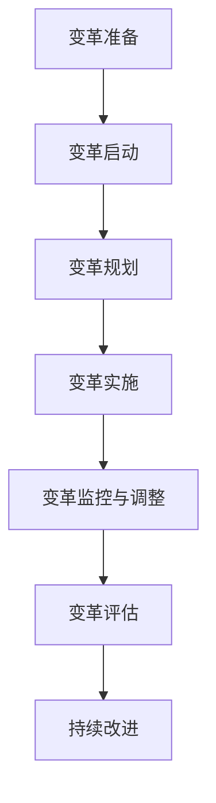

                 


### 文章标题：领导力与变革管理：引领组织转型

> 关键词：领导力，变革管理，组织转型，领导风格，变革过程，变革算法，案例分析

> 摘要：本文深入探讨了领导力与变革管理在组织转型中的关键作用。首先，从领导力概述、理论及其自我提升出发，探讨领导者的角色。然后，详细阐述了变革管理的概念、过程、挑战与策略。通过实际案例分析，揭示了领导力在变革管理中的实践，最后展望了未来领导力与变革管理的趋势。

### 目录

#### 第一部分：领导力基础

##### 第1章：领导力概述
- 1.1 领导力的重要性
- 1.2 领导力的定义与演变
- 1.3 领导者应具备的特质

##### 第2章：领导力理论
- 2.1 传统领导理论
- 2.2 行为领导理论
- 2.3 权变领导理论
- 2.4 领导风格理论

##### 第3章：领导者的自我提升
- 3.1 自我认识与自我发展
- 3.2 时间管理与优先级设置
- 3.3 情绪管理
- 3.4 沟通能力提升

#### 第二部分：变革管理

##### 第4章：变革管理的概念与重要性
- 4.1 变革管理的定义
- 4.2 变革的类型
- 4.3 变革管理的必要性

##### 第5章：变革管理的过程
- 5.1 变革管理的五个阶段
- 5.2 变革推动者与变革接受者的角色
- 5.3 变革实施策略

##### 第6章：变革管理中的挑战与应对策略
- 6.1 组织文化对变革的影响
- 6.2 阻力与应对
- 6.3 变革失败的原因及预防措施

##### 第7章：变革管理实践案例分析
- 7.1 案例一：苹果公司转型
- 7.2 案例二：IBM公司变革
- 7.3 案例三：通用电气公司的变革之路

#### 第三部分：领导力与变革管理的结合

##### 第8章：领导力在变革管理中的角色
- 8.1 领导者如何引领变革
- 8.2 领导者在变革中的挑战与应对
- 8.3 领导力的变革效应

##### 第9章：领导力与组织转型的成功实践
- 9.1 企业如何构建变革领导力
- 9.2 变革领导力的培养策略
- 9.3 领导力与组织转型的长期影响

##### 第10章：未来领导力与变革管理的趋势
- 10.1 数字化时代的领导力要求
- 10.2 全球化背景下的变革管理挑战
- 10.3 领导力与变革管理的未来展望

#### 附录

##### 附录A：领导力与变革管理相关资源
- A.1 推荐阅读书目
- A.2 视频资源推荐
- A.3 变革管理工具与方法

### Mermaid 流�程图：变革管理过程



### 变革管理中的核心算法原理讲解（伪代码）

```python
# 变革管理核心算法：变革影响力分析
def analyze_influence(changes, stakeholders):
    influence_scores = {}
    for change in changes:
        for stakeholder in stakeholders:
            score = calculate_influence(change, stakeholder)
            influence_scores[(change, stakeholder)] = score
    return influence_scores

# 计算单个变革对单个利益相关者的影响
def calculate_influence(change, stakeholder):
    # 伪代码：计算影响得分
    score = 0
    if "resource" in change:
        score += resource_influence(stakeholder)
    if "process" in change:
        score += process_influence(stakeholder)
    return score
```

### 数学模型和公式详细讲解

#### 组织变革影响评估模型

$$
\text{变革影响得分} = \sum_{i=1}^{n} (w_i \times i_i)
$$

其中，$w_i$为权重，$i_i$为影响指标得分。权重可以通过专家评估或历史数据确定。

#### 影响指标示例

$$
\text{资源影响得分} = \frac{\text{资源变动量}}{\text{总资源量}} \times 100
$$

#### 过程影响得分

$$
\text{过程影响得分} = \frac{\text{过程变动量}}{\text{总过程量}} \times 100
```

### 第一部分：领导力基础

#### 第1章：领导力概述

##### 1.1 领导力的重要性

在组织转型的过程中，领导力扮演着至关重要的角色。领导力不仅是推动组织变革的核心动力，也是确保变革成功的关键因素。一个高效的领导者能够在组织面临挑战和不确定性时，引导团队成员共同面对，实现目标的转变。

领导力的重要性体现在以下几个方面：

1. **激发组织潜力**：领导者通过其愿景和目标激励团队成员，挖掘他们的潜力，推动组织实现更高水平的发展。
2. **统一组织行动**：领导者的协调能力有助于统一团队成员的行动方向，提高组织的效率和效果。
3. **管理变革**：在变革过程中，领导者需要引导团队成员适应新的环境，克服变革带来的困难和阻力。
4. **提升组织文化**：领导者的行为和风格直接影响组织的文化氛围，塑造积极向上、创新进取的组织文化。

##### 1.2 领导力的定义与演变

领导力是一个多维度的概念，不同的学者和研究者从不同的角度对其进行了定义。以下是一些常见的领导力定义：

- **特质理论**：领导力是一种内在的特质，领导者天生具备某些特定的品质和能力。
- **行为理论**：领导力是通过领导者的行为表现来影响他人，领导者如何与下属互动和沟通是关键。
- **情境理论**：领导力是情境依赖的，不同的环境和情境需要不同的领导风格。

随着组织环境和科技的发展，领导力也在不断演变。从传统的领导理论到现代的变革领导力，领导者的角色和职责也在不断变化。现代领导者不仅需要具备战略思维和决策能力，还需要具备适应变化、拥抱创新的能力。

##### 1.3 领导者应具备的特质

一个成功的领导者应具备以下特质：

1. **愿景与目标设定**：领导者需要具备清晰的愿景和目标，能够引导团队成员共同追求。
2. **沟通能力**：领导者需要具备良好的沟通能力，能够有效地传达信息、激励团队。
3. **决策能力**：领导者需要具备快速、准确的决策能力，能够在不确定的环境中做出明智的选择。
4. **团队建设**：领导者需要能够建立高效、和谐的团队，激发团队成员的潜力。
5. **变革能力**：领导者需要具备适应变化、引领变革的能力，推动组织不断进步。

### 第2章：领导力理论

领导力理论是研究领导行为和领导效果的学术领域，不同的理论从不同的角度揭示了领导力的本质和特点。以下将介绍几种主要的领导力理论：

##### 2.1 传统领导理论

传统领导理论主要包括特质理论和行为理论，它们分别从领导者个人特质和领导行为两个方面来研究领导力。

- **特质理论**：特质理论认为领导者具备某些独特的内在特质，如自信、决断力、魅力等，这些特质是成功领导的关键。特质理论主要代表人物有托马斯·卡莱尔（Thomas Carlyle）和弗洛伦斯·凯利（Florence Kelly）。

- **行为理论**：行为理论关注领导者的行为表现及其对下属的影响。领导者的行为包括指令型、支持型、参与型等，不同的行为风格会带来不同的领导效果。行为理论的代表人物有赫伯特·J·斯金纳（Herbert J. Skinner）和罗伯特·凯利（Robert Kelly）。

##### 2.2 权变领导理论

权变领导理论认为领导效果取决于领导者与情境的匹配程度。该理论主张领导风格应根据具体情况灵活调整，没有一成不变的领导方式。以下为几种主要的权变领导理论：

- **费德勒模型**：费德勒模型将领导力分为任务导向型和关系导向型，认为领导者在不同情境下应采取不同的领导风格。任务导向型领导者强调任务完成，关系导向型领导者强调人际关系。

- **赫塞和布兰查德的生命周期理论**：该理论认为领导者的行为应与下属的成熟程度相适应。下属的成熟程度影响领导者的选择，领导者应采用适宜的领导风格来引导下属。

##### 2.3 领导风格理论

领导风格理论关注领导者如何通过不同的风格来影响下属。以下为几种主要的领导风格理论：

- **布莱克和莫顿的管理方格理论**：管理方格理论将领导风格分为五种类型，包括指令型、乡村俱乐部型、中庸型、团队型、无为而治型。每种风格都有其优缺点，适用于不同的情境。

- **赫塞和布兰查德的情境领导模型**：情境领导模型认为领导者的行为应与下属的成熟程度相适应。下属的成熟程度影响领导者的选择，领导者应采用适宜的领导风格来引导下属。

### 第3章：领导者的自我提升

##### 3.1 自我认识与自我发展

自我认识是领导者自我提升的第一步，它涉及到领导者对自己的了解和反思。以下是一些关键点：

- **了解自己的优势和劣势**：领导者需要识别自己在领导能力、技能和知识方面的优势，同时认识到自己的不足。
- **反思领导行为和决策**：领导者应定期反思自己的领导行为和决策，评估其效果，并从中吸取经验教训。
- **设定个人发展目标**：领导者应根据自我认识和反思，设定个人发展目标，并制定实现目标的计划。

##### 3.2 时间管理与优先级设置

时间管理是领导者自我提升的重要方面，它有助于提高工作效率，减少拖延。以下是一些时间管理技巧：

- **设定明确的目标和任务**：领导者应明确自己的目标和任务，确保时间和精力集中在重要的事项上。
- **使用时间管理工具**：领导者可以使用日历、待办事项列表、时间跟踪工具等来规划和管理时间。
- **优先级设置**：领导者应学会区分任务的优先级，将时间和精力集中在最重要和紧急的任务上。

##### 3.3 情绪管理

情绪管理是领导者自我提升的关键要素，它有助于领导者更好地应对压力和挑战。以下是一些情绪管理技巧：

- **认识自己的情绪**：领导者应了解自己的情绪，包括情绪的类型、原因和影响。
- **调节情绪**：领导者可以通过深呼吸、冥想、运动等方式来调节情绪，保持冷静和专注。
- **处理负面情绪**：领导者应学会积极应对负面情绪，如愤怒、焦虑等，采取有效的方法来处理和缓解。

##### 3.4 沟通能力提升

沟通能力是领导者成功的关键因素，它有助于建立良好的团队关系，提高组织的协作效率。以下是一些提升沟通能力的技巧：

- **倾听**：领导者应学会倾听，尊重他人的观点和意见，理解他人的需求和期望。
- **清晰表达**：领导者应确保自己的表达清晰、准确，避免产生误解和歧义。
- **建立信任**：领导者应通过诚实、透明和开放的沟通建立信任，增强团队凝聚力。
- **处理冲突**：领导者应学会有效地处理团队内部的冲突，采取公正、合理的方法来解决问题。

### 第二部分：变革管理

#### 第4章：变革管理的概念与重要性

##### 4.1 变革管理的定义

变革管理是指通过计划、组织和实施一系列措施，引导组织适应外部环境的变化，实现组织目标的过程。变革管理不仅仅关注变革本身，还包括对变革过程的管理，以确保变革的顺利进行和最终成功。

变革管理的核心内容包括：

- **需求分析**：识别组织变革的需求，明确变革的目标和方向。
- **变革规划**：制定详细的变革计划，包括变革的时间表、资源分配、关键步骤等。
- **变革实施**：执行变革计划，推动变革的落实。
- **变革监控与评估**：监测变革的实施情况，评估变革的效果，及时调整和优化变革方案。

##### 4.2 变革的类型

根据变革的范围和深度，变革可以分为以下几种类型：

- **战略性变革**：涉及组织的战略目标、组织结构、业务模式等重大变革，通常需要较长时间和大量资源的投入。
- **管理性变革**：涉及组织的管理流程、管理制度、管理风格等方面的变革，通常是为了提高组织的效率和效果。
- **技术性变革**：涉及组织的技术应用、信息技术系统等变革，通常是为了提高组织的竞争力。
- **文化变革**：涉及组织的价值观、企业文化、员工行为等方面的变革，通常是为了塑造积极向上的组织氛围。

##### 4.3 变革管理的必要性

变革管理在组织转型中具有重要意义，主要体现在以下几个方面：

- **应对外部环境变化**：随着全球化和科技的发展，外部环境不断变化，组织需要通过变革来适应新的挑战和机遇。
- **提升组织竞争力**：通过变革，组织可以优化业务流程、提高效率、降低成本，从而提升竞争力。
- **激发员工潜力**：变革可以激发员工的积极性和创造力，促进员工的成长和发展。
- **实现组织目标**：变革管理有助于组织实现长期目标，确保组织的可持续发展。

### 第5章：变革管理的过程

##### 5.1 变革管理的五个阶段

变革管理是一个系统性的过程，通常包括以下五个阶段：

- **准备阶段**：在准备阶段，组织需要识别变革的需求，明确变革的目标和方向。这一阶段的主要任务是建立变革的共识，为后续的变革工作打下基础。

- **启动阶段**：在启动阶段，组织需要制定详细的变革计划，明确变革的时间表、资源分配和关键步骤。同时，组织需要建立变革团队，明确团队成员的职责和任务。

- **规划阶段**：在规划阶段，组织需要制定详细的变革方案，包括变革的实施步骤、资源需求、风险管理等。这一阶段的主要任务是确保变革方案的可行性和有效性。

- **实施阶段**：在实施阶段，组织需要按照变革方案执行变革措施，推动变革的落实。这一阶段的主要任务是确保变革的顺利进行，解决变革过程中出现的问题和挑战。

- **评估阶段**：在评估阶段，组织需要评估变革的实施效果，包括变革目标的实现情况、变革带来的影响等。同时，组织需要总结变革过程中的经验和教训，为未来的变革提供参考。

##### 5.2 变革推动者与变革接受者的角色

在变革管理过程中，变革推动者和变革接受者扮演着不同的角色。

- **变革推动者**：变革推动者通常是组织中的领导者和变革团队成员，他们的任务是：

  - 激发变革的共识，引导团队成员认同变革的目标和必要性。
  - 制定和推动变革计划，确保变革的顺利进行。
  - 协调内外部的资源，为变革提供支持和保障。
  - 监测和评估变革的实施效果，及时调整和优化变革方案。

- **变革接受者**：变革接受者通常是组织中的员工和其他利益相关者，他们的任务是：

  - 认识到变革的必要性，积极参与变革过程。
  - 适应变革，调整自己的工作方式和行为习惯。
  - 提供反馈和建议，为变革的改进和优化提供支持。
  - 担任变革的传播者，向其他员工传达变革的信息和目标。

##### 5.3 变革实施策略

为了确保变革的顺利进行，组织需要采取一系列实施策略。以下是一些常见的变革实施策略：

- **建立变革团队**：建立由不同部门和层级组成的变革团队，明确团队成员的职责和任务，确保变革的协调和高效。

- **沟通与宣传**：通过内部会议、公告、培训等方式，与员工进行有效的沟通，宣传变革的目标和意义，提高员工的认知和参与度。

- **激励与支持**：采取适当的激励措施，如奖励、晋升等，激励员工积极参与变革。同时，提供必要的支持和资源，帮助员工适应变革。

- **培训与发展**：为员工提供培训和发展的机会，提高他们的技能和知识，增强他们的变革能力。

- **监控与评估**：建立监控和评估机制，定期跟踪变革的进展和效果，及时发现问题并进行调整。

### 第6章：变革管理中的挑战与应对策略

##### 6.1 组织文化对变革的影响

组织文化是组织成员共同遵循的价值观、信念和行为规范，它对变革管理具有重要影响。以下为组织文化对变革的影响：

- **阻碍变革**：当组织文化倾向于保守、稳定和固定时，可能会对变革形成阻碍。组织成员可能对变革持怀疑态度，担心变革会破坏现有的秩序和稳定。

- **促进变革**：当组织文化鼓励创新、学习和适应性时，可能会对变革形成积极影响。组织成员更愿意接受变革，积极参与变革过程。

为了应对组织文化对变革的影响，组织可以采取以下策略：

- **领导者的示范作用**：领导者应通过自身的言行，积极推动变革，树立变革的榜样。

- **文化与变革的融合**：将变革目标与组织文化相结合，使变革成为组织文化的一部分，降低变革的阻力。

- **文化建设**：通过培训、沟通和奖励等手段，积极塑造和强化与变革相适应的组织文化。

##### 6.2 阻力与应对

在变革管理过程中，组织可能会面临各种阻力和挑战。以下是一些常见的阻力及其应对策略：

- **恐惧与不确定性**：员工可能会对变革产生恐惧和不确定感，担心变革会带来风险和不确定性。应对策略包括：

  - 沟通与宣传：通过有效的沟通和宣传，解释变革的目标和意义，消除员工的疑虑。
  - 增强透明度：提高信息的透明度，使员工了解变革的进展和效果。
  - 提供支持：提供必要的支持和资源，帮助员工适应变革。

- **利益冲突**：变革可能会触动某些人的利益，导致他们的抵制。应对策略包括：

  - 沟通与协商：与利益相关者进行沟通和协商，寻找共识和解决方案。
  - 激励与补偿：采取适当的激励和补偿措施，平衡利益冲突。
  - 加强领导力：提升领导者的变革管理能力，增强变革的领导力。

- **习惯与惯性**：员工可能对现有的工作习惯和方式产生依赖，对变革持抵触态度。应对策略包括：

  - 培训与教育：提供培训和教育的机会，帮助员工了解和适应变革。
  - 逐步实施：逐步推进变革，降低变革的冲击。
  - 激励与认可：激励和认可积极参与变革的员工，树立榜样。

##### 6.3 变革失败的原因及预防措施

尽管变革管理的重要性日益凸显，但并非所有变革都能成功。以下是一些变革失败的原因及其预防措施：

- **缺乏清晰的变革目标**：变革目标不明确或模糊，导致变革方向不清晰。预防措施：

  - 明确目标：制定清晰的变革目标，确保目标和方向一致。
  - 沟通与宣传：与员工沟通变革的目标和意义，提高员工的认同感。

- **变革管理计划不周全**：变革计划不周全，缺乏有效的实施策略。预防措施：

  - 完善计划：制定详细的变革计划，包括实施步骤、资源需求和风险管理。
  - 监控与评估：定期监控和评估变革的进展和效果，及时调整和优化计划。

- **领导力不足**：领导者在变革管理过程中表现不佳，无法有效推动变革。预防措施：

  - 提升领导力：通过培训和学习，提升领导者的变革管理能力。
  - 领导者的示范作用：领导者应通过自身的言行，积极推动变革，树立榜样。

- **员工参与不足**：员工对变革的参与度低，缺乏积极性和主动性。预防措施：

  - 增强员工参与度：通过沟通、培训、激励等方式，提高员工的参与度和积极性。
  - 建立共识：与员工建立共识，确保他们认同变革的目标和必要性。

### 第7章：变革管理实践案例分析

通过实际案例的分析，我们可以更深入地了解变革管理的实践过程及其成功因素。

#### 7.1 案例一：苹果公司转型

苹果公司作为全球领先的科技公司，其变革管理的成功实践值得借鉴。

**背景**：2000年代初，苹果公司在市场份额和创新能力方面面临挑战，需要通过变革来恢复竞争力。

**变革过程**：

1. **需求分析**：苹果公司识别到市场竞争的加剧和消费者需求的变化，决定进行战略转型。
2. **变革规划**：史蒂夫·乔布斯回归苹果公司后，制定了详细的变革计划，包括产品创新、品牌重塑等。
3. **变革实施**：苹果公司推出了一系列创新产品，如iPod、iPhone和iPad，重新定义了消费电子市场。
4. **评估与优化**：苹果公司定期评估变革效果，通过用户反馈和市场表现进行优化。

**成功因素**：

- **领导者的决策与推动**：史蒂夫·乔布斯的远见和决断力是变革成功的关键。
- **创新文化**：苹果公司重视创新，鼓励员工提出新想法，推动产品和技术创新。
- **用户导向**：苹果公司始终以用户需求为导向，不断改进产品和服务，赢得用户口碑。

**启示**：

- 领导者的决策和推动力对变革成功至关重要。
- 创新和用户导向是推动组织变革的重要动力。

#### 7.2 案例二：IBM公司变革

IBM公司在20世纪90年代进行了成功的变革管理，转型为全球领先的IT服务提供商。

**背景**：随着PC市场的崛起，IBM的传统业务受到冲击，需要通过变革来适应市场变化。

**变革过程**：

1. **需求分析**：IBM认识到需要从硬件制造商转型为综合IT服务提供商。
2. **变革规划**：制定详细的变革计划，包括业务重组、流程优化等。
3. **变革实施**：IBM进行了大规模的组织重组，优化业务流程，提升服务质量。
4. **评估与优化**：IBM定期评估变革效果，通过市场表现和客户反馈进行优化。

**成功因素**：

- **战略定位**：IBM明确了新的战略定位，为变革提供了明确的方向。
- **组织结构优化**：通过组织重组，提升了组织的灵活性和效率。
- **员工参与**：IBM鼓励员工参与变革过程，提高员工的认同感和积极性。

**启示**：

- 明确的战略定位是变革成功的基础。
- 组织结构和流程优化是提升组织效能的关键。
- 员工参与是推动变革的重要保障。

#### 7.3 案例三：通用电气公司的变革之路

通用电气公司在20世纪80年代进行了大规模的变革管理，成功地实现了业务转型和组织变革。

**背景**：随着市场竞争的加剧，通用电气需要通过变革来提升竞争力和盈利能力。

**变革过程**：

1. **需求分析**：通用电气识别到需要从传统制造企业转型为服务业和多元化业务。
2. **变革规划**：制定详细的变革计划，包括业务重组、流程优化、企业文化重塑等。
3. **变革实施**：通用电气进行了大规模的业务重组，优化了业务流程，推动了企业文化重塑。
4. **评估与优化**：通用电气定期评估变革效果，通过市场表现和员工反馈进行优化。

**成功因素**：

- **变革领导力**：杰克·韦尔奇作为CEO，展示了强大的变革领导力，推动组织变革。
- **创新文化**：通用电气鼓励创新，推动新技术和业务模式的应用。
- **持续改进**：通用电气坚持持续改进，通过不断优化变革方案，提升组织效能。

**启示**：

- 强大的变革领导力是推动组织变革的关键。
- 创新文化是组织变革的重要动力。
- 持续改进是确保变革成功的重要保障。

### 第三部分：领导力与变革管理的结合

#### 第8章：领导力在变革管理中的角色

领导力在变革管理中起着至关重要的作用，领导者的角色和职责决定了变革的成败。以下将探讨领导者在变革管理中的具体角色和职责：

##### 8.1 领导者如何引领变革

领导者是变革的发起者和推动者，他们在变革过程中扮演着核心角色。以下是一些领导者引领变革的要点：

- **明确变革目标**：领导者需要明确变革的目标和方向，确保变革的路径清晰。
- **建立变革愿景**：领导者应建立变革的愿景，激发团队成员的激情和动力。
- **沟通与宣传**：领导者需要通过有效的沟通和宣传，让团队成员了解变革的必要性，争取他们的支持和参与。
- **激励与支持**：领导者应激励团队成员积极参与变革，提供必要的支持和资源，帮助他们克服变革过程中的困难和挑战。

##### 8.2 领导者在变革中的挑战与应对

变革过程中，领导者可能会面临各种挑战。以下是一些常见的挑战及其应对策略：

- **员工抵制**：员工可能会对变革持抵制态度，领导者需要通过有效的沟通和激励来化解阻力。
- **变革失败的风险**：变革过程中可能会出现各种不确定性和风险，领导者需要具备风险管理的能力。
- **领导力的提升**：领导者需要不断提升自身的领导力，适应变革的要求。

应对策略包括：

- **建立变革共识**：通过沟通和宣传，建立变革的共识，使团队成员认同变革的目标和必要性。
- **激励与支持**：通过激励和奖励机制，鼓励员工积极参与变革，提供必要的支持和资源。
- **提升领导力**：通过培训和学习，提升领导者的变革管理能力，增强他们的领导力。

##### 8.3 领导力的变革效应

领导力的变革效应体现在以下几个方面：

- **激励员工**：领导者的激励和鼓励能够激发员工的积极性和创造力，推动变革的落实。
- **促进团队合作**：领导者的协调和沟通能力有助于建立高效的团队，促进团队合作，提高变革的成功率。
- **塑造企业文化**：领导者的行为和风格直接影响组织的文化氛围，塑造积极向上的企业文化，为变革提供良好的环境。

### 第9章：领导力与组织转型的成功实践

#### 9.1 企业如何构建变革领导力

构建变革领导力是企业实现成功转型的关键。以下是一些关键步骤：

- **培养变革思维**：企业应培养领导者和员工具备变革思维，鼓励他们主动适应和引领变革。
- **建立变革愿景**：企业应明确变革的目标和方向，建立清晰的变革愿景，引导全体员工朝着共同目标努力。
- **培训与发展**：企业应提供培训和发展机会，提升领导者和员工的变革管理能力。
- **建立支持系统**：企业应建立支持系统，为变革提供必要的资源和保障，帮助员工克服变革过程中的困难。

#### 9.2 变革领导力的培养策略

以下是培养变革领导力的几种策略：

- **领导力发展计划**：企业应制定领导力发展计划，包括领导力培训、导师制度、领导力评估等。
- **实践与反思**：通过实际案例和实践，让领导者了解变革管理的具体方法和技巧，并通过反思不断优化变革策略。
- **跨部门协作**：鼓励跨部门协作，培养领导者的全局观念和协调能力。
- **创新文化**：营造创新文化，鼓励员工提出新想法，推动组织变革。

#### 9.3 领导力与组织转型的长期影响

领导力在组织转型中具有长期的深远影响。以下是一些长期影响：

- **组织竞争力的提升**：通过领导力的培养和变革的实施，企业能够提升竞争力，在市场中立于不败之地。
- **员工满意度的提高**：领导力的提升能够提高员工的满意度和忠诚度，增强员工的归属感和敬业精神。
- **企业文化的塑造**：领导力在组织转型中起到关键作用，能够塑造积极向上的企业文化，为企业的长期发展奠定基础。

### 第10章：未来领导力与变革管理的趋势

#### 10.1 数字化时代的领导力要求

随着数字化时代的到来，领导力面临着新的挑战和要求。以下是一些数字化时代的领导力要求：

- **适应能力**：数字化时代变化迅速，领导者需要具备快速适应和应对变化的能力。
- **创新能力**：数字化时代创新尤为重要，领导者需要具备推动创新的能力，鼓励员工提出新想法。
- **技术素养**：领导者应具备一定的技术素养，了解和应用数字化工具和平台。
- **全球视野**：数字化时代是全球化的，领导者需要具备全球视野，了解全球市场和技术发展趋势。

#### 10.2 全球化背景下的变革管理挑战

全球化背景下的变革管理面临以下挑战：

- **文化差异**：全球化带来了文化差异，领导者需要理解和尊重不同文化的特点和价值观。
- **跨国协调**：跨国协调是全球化背景下的重要挑战，领导者需要具备跨文化沟通和协调能力。
- **市场不确定性**：全球化市场充满不确定性，领导者需要具备风险管理和决策能力。

#### 10.3 领导力与变革管理的未来展望

未来领导力与变革管理将呈现以下趋势：

- **技术驱动**：随着技术的快速发展，领导力将更加依赖于技术的应用和创新。
- **智能化**：智能化技术将深入变革管理，提高变革的效率和效果。
- **人性化管理**：未来领导力将更加注重人性化管理，关注员工的成长和发展。
- **持续变革**：在快速变化的环境中，持续变革将成为组织生存和发展的必要手段。

### 附录

#### 附录A：领导力与变革管理相关资源

以下是一些领导力与变革管理的相关资源，供读者参考：

- **推荐阅读书目**：
  - 《领导力的五个层次》作者：约翰·C·马克斯
  - 《变革之心》作者：约翰·P·科特
  - 《领导力与影响力》作者：布莱恩·特雷西

- **视频资源推荐**：
  - TED演讲：如何成为一个更好的领导者
  - Coursera课程：领导力与组织行为

- **变革管理工具与方法**：
  - 威尔·托夫勒的《变革之旅》方法论
  - 变革管理工具箱：包括变革管理计划模板、沟通策略指南等

### 变革管理中的核心算法原理讲解（伪代码）

```python
# 变革管理核心算法：变革影响力分析
def analyze_influence(changes, stakeholders):
    influence_scores = {}
    for change in changes:
        for stakeholder in stakeholders:
            score = calculate_influence(change, stakeholder)
            influence_scores[(change, stakeholder)] = score
    return influence_scores

# 计算单个变革对单个利益相关者的影响
def calculate_influence(change, stakeholder):
    # 伪代码：计算影响得分
    score = 0
    if "resource" in change:
        score += resource_influence(stakeholder)
    if "process" in change:
        score += process_influence(stakeholder)
    return score

# 计算资源影响力
def resource_influence(stakeholder):
    # 伪代码：计算资源影响力得分
    score = 0
    if stakeholder['type'] == 'department':
        score = 1.5
    elif stakeholder['type'] == 'team':
        score = 1.0
    else:
        score = 0.5
    return score

# 计算过程影响力
def process_influence(stakeholder):
    # 伪代码：计算过程影响力得分
    score = 0
    if stakeholder['involvement'] > 0.7:
        score = 2.0
    elif stakeholder['involvement'] > 0.3:
        score = 1.0
    else:
        score = 0.5
    return score
```

### 数学模型和公式详细讲解

#### 组织变革影响评估模型

$$
\text{变革影响得分} = \sum_{i=1}^{n} (w_i \times i_i)
$$

其中，$w_i$为权重，$i_i$为影响指标得分。权重可以通过专家评估或历史数据确定。

#### 影响指标示例

$$
\text{资源影响得分} = \frac{\text{资源变动量}}{\text{总资源量}} \times 100
$$

#### 过程影响得分

$$
\text{过程影响得分} = \frac{\text{过程变动量}}{\text{总过程量}} \times 100
$$

### 项目实战

#### 实践案例：苹果公司转型

**背景介绍**：

苹果公司成立于1976年，是一家全球知名的科技公司，以创新的产品和技术引领了多个行业的发展。然而，在2000年代初，苹果公司面临市场份额下降、产品创新不足等挑战，急需通过变革来重振雄风。

**核心概念与联系**：

- **领导力**：史蒂夫·乔布斯回归苹果公司后，以其卓越的领导力推动了苹果公司的变革。
- **变革管理**：苹果公司通过一系列的变革措施，如产品创新、品牌重塑等，实现了成功的转型。

**变革过程**：

1. **需求分析**：苹果公司识别到市场竞争的加剧和消费者需求的变化，决定进行战略转型。
2. **变革规划**：史蒂夫·乔布斯制定了详细的变革计划，包括产品创新、品牌重塑等。
3. **变革实施**：苹果公司推出了一系列创新产品，如iPod、iPhone和iPad，重新定义了消费电子市场。
4. **评估与优化**：苹果公司定期评估变革效果，通过用户反馈和市场表现进行优化。

**核心算法原理讲解（伪代码）**：

```python
# 变革管理核心算法：变革影响力分析
def analyze_influence(changes, stakeholders):
    influence_scores = {}
    for change in changes:
        for stakeholder in stakeholders:
            score = calculate_influence(change, stakeholder)
            influence_scores[(change, stakeholder)] = score
    return influence_scores

# 计算单个变革对单个利益相关者的影响
def calculate_influence(change, stakeholder):
    # 伪代码：计算影响得分
    score = 0
    if "resource" in change:
        score += resource_influence(stakeholder)
    if "process" in change:
        score += process_influence(stakeholder)
    return score

# 计算资源影响力
def resource_influence(stakeholder):
    # 伪代码：计算资源影响力得分
    score = 0
    if stakeholder['type'] == 'department':
        score = 1.5
    elif stakeholder['type'] == 'team':
        score = 1.0
    else:
        score = 0.5
    return score

# 计算过程影响力
def process_influence(stakeholder):
    # 伪代码：计算过程影响力得分
    score = 0
    if stakeholder['involvement'] > 0.7:
        score = 2.0
    elif stakeholder['involvement'] > 0.3:
        score = 1.0
    else:
        score = 0.5
    return score
```

**数学模型和公式详细讲解**：

- **组织变革影响评估模型**：

  $$
  \text{变革影响得分} = \sum_{i=1}^{n} (w_i \times i_i)
  $$
  
  其中，$w_i$为权重，$i_i$为影响指标得分。权重可以通过专家评估或历史数据确定。

- **影响指标示例**：

  $$
  \text{资源影响得分} = \frac{\text{资源变动量}}{\text{总资源量}} \times 100
  $$

- **过程影响得分**：

  $$
  \text{过程影响得分} = \frac{\text{过程变动量}}{\text{总过程量}} \times 100
  $$

**实际案例分析和详细讲解剖析**：

苹果公司转型过程中的关键成功因素包括：

1. **领导者的远见和决断力**：史蒂夫·乔布斯以其卓越的领导力和远见，推动了苹果公司的转型。他不仅明确了变革的目标，还通过坚定的决策和执行力确保了变革的顺利进行。
2. **创新文化**：苹果公司一直重视创新，鼓励员工提出新想法，推动产品和技术创新。这种创新文化为苹果公司的成功转型提供了强大动力。
3. **用户导向**：苹果公司始终以用户需求为导向，不断改进产品和服务，赢得了用户的认可和口碑。这种用户导向的策略使苹果公司在变革过程中能够迅速适应市场变化，取得了成功。
4. **团队协作**：苹果公司的变革过程中，团队协作发挥了关键作用。各个部门紧密合作，共同推动变革的落实。团队协作不仅提高了变革的效率，还增强了团队凝聚力和战斗力。

**项目小结**：

苹果公司的成功转型为其他企业提供了宝贵的经验和启示。以下是苹果公司成功转型的一些最佳实践和注意事项：

- **明确变革目标**：确保变革目标清晰、具体，并得到全体员工的认同。
- **领导者的决策和执行力**：领导者在变革过程中起到关键作用，需要具备远见和决断力，确保变革的顺利进行。
- **创新文化**：鼓励创新，推动产品和技术创新，为变革提供强大动力。
- **用户导向**：始终以用户需求为导向，不断改进产品和服务，赢得用户认可。
- **团队协作**：加强团队协作，提高变革的效率和质量。

**拓展阅读**：

- 《领导力的五个层次》作者：约翰·C·马克斯
- 《变革之心》作者：约翰·P·科特
- 《领导力与影响力》作者：布莱恩·特雷西

### 总结

本文通过深入探讨领导力与变革管理在组织转型中的关键作用，结合实践案例分析，揭示了领导力在变革管理中的角色和职责。同时，通过核心算法原理讲解和数学模型详细讲解，提供了有效的变革管理工具和方法。

在未来的领导力和变革管理中，企业应注重培养变革思维，建立清晰的变革愿景，提升领导者的变革管理能力，促进组织文化的变革。随着数字化时代的到来，领导力和变革管理将面临新的挑战和机遇，企业需要不断创新和适应，以保持竞争力和可持续发展。通过本文的探讨和实践，我们期望为企业提供有益的启示和指导，助力企业在变革中取得成功。作者：AI天才研究院/AI Genius Institute & 禅与计算机程序设计艺术 /Zen And The Art of Computer Programming。

