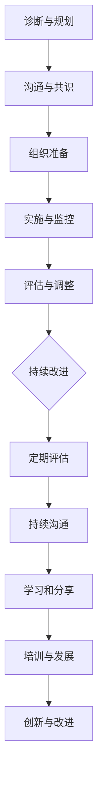
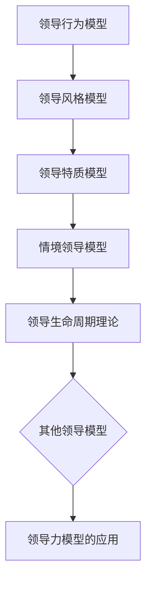

                 

### 《领导力与变革：引导团队度过转型期》

#### 关键词
- **领导力**
- **变革管理**
- **团队引导**
- **转型期**
- **策略与工具**
- **案例分析**

#### 摘要
本文将探讨在信息技术快速发展的背景下，领导者在引导团队度过转型期所面临的关键挑战和最佳实践。我们将从领导力的基础、变革管理的原理与实践、团队引导与领导的作用以及成功案例的分析等方面展开，为读者提供一套系统化的策略和工具，帮助领导者有效应对转型期的各种挑战，实现团队的持续成长和进步。

### 第一部分：领导力的基础

#### 第1章：领导力的核心概念与特征

**1.1 领导力的重要性**

在当今竞争激烈、变化多端的市场环境中，领导力被视为组织成功的关键因素。领导力不仅仅是领导者的个人特质，更是团队和组织效能的催化剂。有效的领导力能够激发员工的潜力，提升团队协作效率，推动创新和变革，从而实现组织的长远发展。

**1.2 领导力的定义与特征**

领导力是一种激励和影响他人实现共同目标的能力。它包括以下几个核心特征：

- **愿景与目标**：领导者需要拥有清晰的愿景和目标，能够引导团队朝着共同的方向前进。
- **信任与尊重**：领导者需要建立信任和尊重的关系，激发团队成员的积极性和创造力。
- **沟通与协作**：领导者需要具备良好的沟通能力和协作技巧，确保信息的有效传递和团队的高效运作。
- **决策与执行力**：领导者需要能够做出明智的决策，并具备强大的执行力，确保战略和计划的实施。

**1.3 领导力的模型与理论**

领导力理论有多种分类，以下是几种主要的模型和理论：

- **领导行为模型**：该模型强调领导者的行为对团队的影响，如专制型、民主型和参与型领导。
- **领导风格模型**：该模型根据领导者的风格特点，如任务导向型和关系导向型领导。
- **领导特质模型**：该模型关注领导者的个人特质，如自信、诚实、决断力等。
- **情境领导模型**：该模型认为领导力应根据不同情境进行调整，如情境领导理论和领导生命周期理论。

#### 第2章：领导者的角色与责任

**2.1 领导者的角色定位**

领导者的角色是多方面的，包括但不限于以下几种：

- **战略规划者**：领导者需要制定组织的战略目标和规划。
- **决策者**：领导者需要做出关键的决策，以推动组织的发展。
- **变革推动者**：领导者需要在变革过程中引导团队，克服阻力。
- **教练与导师**：领导者需要培养团队成员，提升其技能和能力。
- **协调者与沟通者**：领导者需要协调团队内外部的各种关系，确保信息流通。

**2.2 领导者的责任与义务**

领导者的责任和义务包括：

- **责任**：确保组织的成功和团队的成长。
- **义务**：维护团队的和谐，促进员工的福祉。
- **指导**：提供明确的方向和指导，帮助团队成员实现目标。
- **激励**：激发团队成员的积极性和创造力。
- **保护**：保护团队成员免受外部压力和负面影响。

**2.3 领导者的权力与影响力**

领导者的权力和影响力来源于以下几个方面：

- **正式权力**：来自组织的职位和职位赋予的权力。
- **非正式权力**：来自领导者的个人特质和影响力。
- **奖励权力**：通过奖励机制影响团队成员。
- **惩罚权力**：通过惩罚机制约束团队成员。

### 第二部分：变革管理

#### 第3章：变革管理的原理与实践

**3.1 变革的定义与类型**

变革是指组织在内外部压力下，对现有结构和行为进行的有意改变。根据变革的性质，可以分为以下几种类型：

- **技术变革**：涉及技术的引入和改进，如数字化转型。
- **结构变革**：涉及组织结构的调整，如部门重组。
- **文化变革**：涉及组织文化的重塑，如价值观的更新。
- **战略变革**：涉及战略方向的调整，如市场定位的改变。

**3.2 变革管理的过程与步骤**

变革管理是一个系统化的过程，通常包括以下几个步骤：

- **诊断与规划**：分析组织现状，确定变革的必要性和目标。
- **沟通与共识**：与团队成员沟通变革的愿景和目标，达成共识。
- **组织准备**：制定详细的变革计划，确保组织和个人做好准备。
- **实施与监控**：执行变革计划，监控进度和效果。
- **评估与调整**：评估变革的结果，根据反馈进行必要的调整。

**3.3 变革管理的策略与方法**

变革管理策略和方法的选择取决于组织的具体情况和变革的类型。以下是一些常见的策略和方法：

- **变革领导**：明确变革的领导者，确保变革的领导力和支持。
- **沟通策略**：制定有效的沟通计划，确保信息的传递和反馈。
- **员工参与**：鼓励员工参与变革过程，提高变革的接受度。
- **激励机制**：通过奖励机制激发员工的积极性和参与度。
- **培训与发展**：提供必要的培训和指导，帮助员工适应变革。

#### 第4章：变革中的领导力

**4.1 变革中的领导力挑战**

在变革过程中，领导者面临以下挑战：

- **信任危机**：变革可能导致团队成员对领导者的信任降低。
- **资源限制**：变革需要投入大量的时间和资源，可能影响组织的正常运作。
- **阻力**：团队成员可能对变革持有负面态度，产生抵触情绪。
- **不确定感**：变革过程中，团队成员可能感到不确定和焦虑。

**4.2 领导者如何应对变革**

领导者应对变革的策略包括：

- **建立信任**：通过沟通和行动建立信任，增强团队成员的信心。
- **明确目标**：明确变革的目标和愿景，确保团队成员明确变革的意义和方向。
- **提供支持**：提供必要的资源和支持，帮助团队成员克服变革中的困难。
- **激励与鼓舞**：通过激励和鼓舞激发团队成员的积极性和参与度。
- **持续沟通**：保持与团队成员的持续沟通，了解他们的想法和需求。

**4.3 领导者在变革过程中的角色转变**

在变革过程中，领导者需要从以下几个方面进行角色转变：

- **从指挥者到引导者**：领导者需要从指挥和控制转变为引导和支持。
- **从决策者到参与者**：领导者需要参与变革过程，与团队成员共同决策。
- **从管理者到变革推动者**：领导者需要推动变革，克服变革中的各种阻力。
- **从领导者到导师**：领导者需要成为导师，帮助团队成员适应变革。

### 第三部分：团队引导与领导

#### 第5章：团队引导的基础

**5.1 团队引导的定义与目的**

团队引导是指领导者通过一系列方法和技巧，引导团队实现共同目标的过程。其目的是：

- **提升团队协作效率**：通过引导，团队能够更高效地协作，实现目标。
- **增强团队凝聚力**：引导有助于增强团队成员之间的信任和凝聚力。
- **激发团队潜力**：引导能够激发团队成员的潜力和创造力，推动团队发展。

**5.2 团队引导的过程与方法**

团队引导的过程包括以下几个阶段：

1. **准备阶段**：制定引导计划，明确引导的目标和范围。
2. **启动阶段**：与团队成员建立联系，确保他们参与引导过程。
3. **引导阶段**：使用各种引导技巧和工具，引导团队达成共识，解决问题。
4. **评估阶段**：评估引导的效果，收集反馈，进行总结和改进。

常见的团队引导方法包括：

- **共识引导**：通过讨论和协商，达成团队共识。
- **问题引导**：通过提问和探索，引导团队识别和解决问题。
- **目标引导**：通过设定目标，引导团队明确方向和努力。
- **行动引导**：通过制定行动计划，引导团队采取行动。

**5.3 团队引导的技巧与策略**

团队引导的技巧和策略包括：

- **倾听与理解**：倾听团队成员的意见，理解他们的需求和担忧。
- **提问与探索**：使用开放性问题，引导团队成员深入思考和探索。
- **鼓励与支持**：鼓励团队成员积极参与，提供必要的支持。
- **激励与鼓舞**：通过激励和鼓舞，激发团队成员的积极性和创造力。
- **反馈与改进**：提供反馈，帮助团队成员改进工作。

#### 第6章：团队领导与变革

**6.1 团队领导在变革中的作用**

团队领导在变革中扮演关键角色，其作用包括：

- **推动变革**：领导者的支持和推动是变革成功的关键。
- **引导团队**：领导者需要引导团队理解变革的必要性和意义。
- **解决冲突**：领导者需要解决变革过程中出现的冲突和阻力。
- **激励员工**：领导者需要激励员工积极参与变革，克服困难。

**6.2 团队领导如何引导变革**

团队领导引导变革的步骤包括：

1. **明确变革目标**：明确变革的目标和愿景，确保团队成员理解。
2. **沟通与共识**：与团队成员沟通变革的计划和步骤，达成共识。
3. **制定行动计划**：制定详细的变革计划，明确任务和责任。
4. **执行与监控**：执行变革计划，监控进度和效果。
5. **反馈与调整**：收集反馈，进行总结和改进，确保变革的持续成功。

**6.3 团队领导如何处理变革中的冲突**

团队领导处理变革中的冲突的方法包括：

- **倾听与理解**：倾听冲突各方的意见，理解他们的需求和担忧。
- **中立与客观**：保持中立和客观，避免偏袒任何一方。
- **沟通与协商**：通过沟通和协商，寻找冲突的解决方案。
- **激励与支持**：激励和支持团队成员，帮助他们克服冲突。
- **反馈与改进**：提供反馈，帮助团队成员改进工作，减少冲突。

### 第四部分：案例分析

#### 第7章：成功变革的案例分析

**7.1 案例一：某企业成功转型的案例分析**

**背景介绍**：
某企业在面临市场竞争加剧和内部管理问题的双重压力下，决定进行转型。领导者通过变革管理，成功实现了企业的转型升级。

**核心概念与联系**：
变革管理中的核心概念包括愿景、目标、沟通、员工参与等。领导者需要建立明确的愿景和目标，与员工进行有效沟通，鼓励员工参与变革过程。

**核心算法原理讲解**：
领导者采用了一系列变革管理策略，如领导力模型、沟通策略、激励机制等，确保变革的顺利进行。

**数学模型和公式**：
无

**项目实战**：
企业通过实施数字化转型、组织结构调整和文化重塑等举措，成功实现了转型目标。

**案例小结**：
该案例展示了领导者如何通过有效的变革管理，推动企业实现转型升级。

**拓展阅读**：
- 《企业转型与变革管理》
- 《数字化时代的领导力》

**7.2 案例二：某团队有效应对变革的案例分析**

**背景介绍**：
某团队在面临新技术引入和业务模式变革的挑战时，通过有效的团队引导和领导，成功应对了变革。

**核心概念与联系**：
团队引导和领导的核心概念包括沟通、共识、目标设定、员工参与等。领导者需要建立沟通机制，确保团队达成共识，设定明确的目标，鼓励员工参与变革。

**核心算法原理讲解**：
领导者采用了一系列团队引导技巧和策略，如共识引导、问题引导、目标引导等，确保团队的积极性和参与度。

**数学模型和公式**：
无

**项目实战**：
团队通过设定明确的目标、制定行动计划、开展培训和激励措施，成功适应了新技术的引入和业务模式的变革。

**案例小结**：
该案例展示了团队如何通过有效的团队引导和领导，应对变革带来的挑战。

**拓展阅读**：
- 《团队引导与团队建设》
- 《变革中的团队协作》

**7.3 案例三：某领导者引领变革的案例分析**

**背景介绍**：
某领导者通过卓越的领导力和变革管理能力，成功引领团队实现了企业的数字化转型。

**核心概念与联系**：
领导力的核心概念包括愿景、信任、沟通、激励等。变革管理中的核心概念包括愿景、目标、沟通、员工参与等。

**核心算法原理讲解**：
领导者采用了一系列领导力和变革管理策略，如领导力模型、沟通策略、激励机制等，确保变革的顺利进行。

**数学模型和公式**：
无

**项目实战**：
领导者通过建立明确的愿景和目标，与团队进行有效沟通，激励员工参与变革，成功实现了企业的数字化转型。

**案例小结**：
该案例展示了领导者如何通过卓越的领导力和变革管理能力，引领团队实现企业的数字化转型。

**拓展阅读**：
- 《数字化时代的领导力》
- 《领导力与变革管理》

### 第五部分：策略与工具

#### 第8章：变革管理的策略与工具

**8.1 变革管理策略的选择与运用**

变革管理策略的选择取决于组织的具体情况和变革的类型。以下是一些常见的变革管理策略：

- **变革领导**：明确变革的领导者，确保变革的领导力和支持。
- **沟通策略**：制定有效的沟通计划，确保信息的传递和反馈。
- **员工参与**：鼓励员工参与变革过程，提高变革的接受度。
- **激励机制**：通过奖励机制激发员工的积极性和参与度。
- **培训与发展**：提供必要的培训和指导，帮助员工适应变革。

**8.2 变革管理工具的应用与效果评估**

变革管理工具的应用效果评估是确保变革成功的关键。以下是一些常用的变革管理工具：

- **变革管理模型**：如Kotter的变革八步骤模型、Balogh的变革矩阵等。
- **沟通工具**：如内部通讯、会议、培训、社交媒体等。
- **员工参与工具**：如调查问卷、焦点小组、开放式讨论等。
- **激励机制**：如奖励计划、晋升机会、培训资助等。
- **效果评估工具**：如关键绩效指标(KPI)、员工满意度调查、财务分析等。

**8.3 变革管理的持续改进与优化**

变革管理的持续改进与优化是确保变革长期成功的关键。以下是一些策略：

- **定期评估**：定期评估变革的效果，收集反馈，进行改进。
- **持续沟通**：保持与员工的持续沟通，了解他们的想法和需求。
- **学习和分享**：鼓励员工学习和分享变革的经验和最佳实践。
- **培训与发展**：提供持续的培训和指导，帮助员工适应变革。
- **创新与改进**：鼓励创新思维，持续改进变革管理策略和工具。

### 附录

#### 附录A：领导力与变革管理相关的书籍与资源推荐

- 《领导力》(Leadership) - by John C. Maxwell
- 《变革之舞：领导力与组织变革》(The Dance of Change) - by William Bridges
- 《领导力与变革管理》(Leadership and Change Management) - by Nick-resistant
- 《变革的智谋：如何在不确定性中找到方向》(The Intelligent Fight for Change) - by Jim Highsmith

#### 附录B：变革管理流程的Mermaid流程图

#### 附录C：领导力模型与理论的Mermaid流程图

### 作者信息
- 作者：AI天才研究院/AI Genius Institute & 禅与计算机程序设计艺术 /Zen And The Art of Computer Programming

### 总结
本文从领导力的基础、变革管理的原理与实践、团队引导与领导的作用以及成功案例的分析等方面，系统地探讨了领导者在引导团队度过转型期所面临的关键挑战和最佳实践。通过本文的阅读，读者可以了解到领导力的核心概念与特征、变革管理的策略与方法、团队引导的技巧与策略，以及成功变革的案例分析。希望本文能为领导者在实际工作中提供有益的启示和指导。

