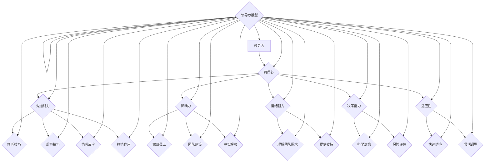

                 

### 文章标题

# 《领导力与同理心：理解并满足团队需求的能力》

> 关键词：领导力，同理心，团队管理，领导风格，跨文化沟通

> 摘要：本文旨在探讨领导力与同理心在团队管理中的重要性，通过详细分析两者的概念、核心特质和实际应用，揭示如何结合领导力和同理心，实现高效团队建设和冲突解决。文章将结合实际案例，提供实战经验和提升策略，帮助领导者更好地理解和满足团队需求。

## 目录大纲

### 第一部分：领导力基础

#### 第1章：领导力的概念与重要性

##### 1.1 领导力的定义

##### 1.2 领导力的重要性

##### 1.3 领导力与管理的区别

#### 第2章：领导力的核心特质

##### 2.1 沟通能力

##### 2.2 影响力

##### 2.3 情绪智力

##### 2.4 决策能力

##### 2.5 适应性

### 第二部分：同理心

#### 第3章：同理心的概念与重要性

##### 3.1 同理心的定义

##### 3.2 同理心的重要性

##### 3.3 同理心与同情心的区别

#### 第4章：培养同理心的方法

##### 4.1 倾听技巧

##### 4.2 观察技巧

##### 4.3 情感反应

##### 4.4 移情作用

##### 4.5 培养同理心的实践

### 第三部分：领导力与同理心的结合

#### 第5章：同理心在领导力中的运用

##### 5.1 同理心与领导风格

##### 5.2 同理心与团队建设

##### 5.3 同理心与冲突解决

##### 5.4 同理心与激励员工

#### 第6章：同理心在跨文化领导中的应用

##### 6.1 跨文化领导概述

##### 6.2 跨文化沟通与同理心

##### 6.3 跨文化团队建设

##### 6.4 跨文化冲突与解决

### 第四部分：实战应用

#### 第7章：领导力与同理心的实战案例分析

##### 7.1 案例一：成功领导者的同理心运用

##### 7.2 案例二：同理心在团队管理中的应用

##### 7.3 案例三：同理心在跨文化团队中的应用

#### 第8章：领导力与同理心的自我提升

##### 8.1 自我评估

##### 8.2 自我提升策略

##### 8.3 培养同理心的持续实践

### 第五部分：附录

#### 第9章：领导力与同理心的相关资源

##### 9.1 常见领导力模型

##### 9.2 同理心培养的书籍推荐

##### 9.3 领导力与同理心课程资源

#### 第10章：领导力与同理心Mermaid流程图

##### 10.1 领导力模型

##### 10.2 同理心培养过程

##### 10.3 领导力与同理心的结合### 文章引言

在现代企业中，领导力与同理心已成为衡量一位领导者是否具备卓越管理能力的关键指标。随着全球化和信息技术的发展，团队多样性日益增强，领导者不仅需要具备传统领导力特质，还要能够理解并满足团队成员的多样需求。本文将深入探讨领导力与同理心的概念、重要性及其在实际团队管理中的应用。

领导力，作为引导和激励团队达成目标的能力，其核心在于沟通能力、影响力、情绪智力、决策能力和适应性。而同理心，则是一种站在他人立场上的思考能力，它有助于领导者更好地理解团队成员的感受和需求，从而建立信任、促进团队协作。在现代企业中，领导力和同理心的结合，不仅能够提高团队的凝聚力和执行力，还能在复杂多变的环境中实现组织的持续发展和创新。

本文将从以下几个方面展开：

1. **领导力的基础**：介绍领导力的定义、重要性以及领导力与管理的区别，探讨领导力的核心特质。
2. **同理心**：定义同理心、探讨其在领导力中的重要性，分析同理心与同情心的区别，提供培养同理心的方法。
3. **领导力与同理心的结合**：探讨同理心在领导力中的具体应用，分析同理心在跨文化领导中的重要性，提供跨文化领导的具体策略。
4. **实战应用**：通过案例分析，展示领导力与同理心在实际团队管理中的成功实践，提供自我提升的策略。
5. **附录**：推荐领导力与同理心相关的资源和Mermaid流程图，帮助读者进一步理解本文的核心内容。

通过本文的探讨，希望读者能够认识到领导力与同理心在团队管理中的重要性，并学会如何将两者结合，实现团队的长期稳定发展和高效运作。接下来，我们将首先深入探讨领导力的基础，包括其定义、重要性以及领导力与管理的区别。通过清晰的概念介绍，我们将为后续内容打下坚实的基础。### 第一部分：领导力基础

#### 第1章：领导力的概念与重要性

##### 1.1 领导力的定义

领导力（Leadership）是一种复杂而多维的能力，它涉及激励、引导和影响他人朝着共同目标前进的过程。简而言之，领导力是一种通过影响和激励他人来实现目标的能力。在组织管理中，领导力不仅是领导者的个人特质，也是团队和组织成功的关键因素。

定义领导力的方式多种多样，但普遍认可的是，领导力不仅仅是权威的体现，还包括了沟通、影响力、情绪智力、决策能力和适应性。领导力不仅仅是管理者的职责，每个团队成员都可以通过提升自身的领导力来更好地协作和贡献。

在技术领域，领导力的重要性体现在以下几个方面：

- **团队协作**：领导力能够促进团队成员之间的沟通和协作，使团队在复杂项目中高效运作。
- **创新能力**：优秀的领导者能够激励团队勇于尝试新方法，从而推动技术创新和组织变革。
- **决策能力**：在技术决策中，领导力有助于领导者做出科学、合理的决策，从而降低风险。
- **问题解决**：面对技术挑战时，领导力能够帮助领导者快速识别问题，并制定有效的解决方案。

##### 1.2 领导力的重要性

领导力在团队和组织中的重要性不可低估。以下是几个关键方面：

- **团队凝聚力**：领导力能够增强团队成员之间的信任和合作，提升团队的凝聚力。
- **员工满意度**：领导者通过有效的领导力可以提升员工的工作满意度，进而提高生产效率。
- **组织绩效**：优秀的领导力能够推动组织绩效的提升，实现组织的长期战略目标。
- **适应变化**：在快速变化的市场环境中，领导力能够帮助团队和组织迅速适应变化，抓住市场机遇。

在技术团队中，领导力的重要性尤为突出。技术项目往往具有高风险和高不确定性，需要领导者具备出色的决策能力和问题解决能力，以应对复杂的技术挑战和市场变化。以下是一个具体案例：

某大型科技公司的一个研发团队在开发一款新兴技术产品时，遇到了技术难题和资源不足的问题。团队的领导者在面临巨大压力的情况下，通过积极沟通、合理调配资源和优化团队协作流程，最终带领团队成功解决了难题，使产品如期上市，并取得了巨大的市场成功。

##### 1.3 领导力与管理的区别

领导力和管理（Management）虽然密切相关，但它们之间也存在显著的区别。管理主要关注组织内部资源的合理分配和效率提升，而领导力则更注重激励和影响团队成员，推动他们为实现组织目标而努力。

- **目的不同**：管理关注的是如何有效地执行任务，而领导力则关注如何激励团队成员，使他们愿意并有能力为实现共同目标而努力。
- **手段不同**：管理主要依赖于制度和流程来确保工作的顺利进行，而领导力则更多地依赖于个人魅力、沟通技巧和影响力。
- **范围不同**：管理通常关注当前任务的完成，而领导力则关注组织的长远发展和战略规划。

一个具体的例子可以帮助我们理解这一区别。在一个技术团队中，项目经理的职责主要是确保项目按计划进行，包括分配任务、监控进度和解决资源问题。而技术领导者的职责则是激发团队成员的创新热情，提升团队的技术能力，以及推动技术方向的变革。

综上所述，领导力是现代企业中不可或缺的重要能力。它不仅能够提升团队的协作效率和创新能力，还能在复杂多变的环境中帮助团队和组织实现持续发展和成功。在下一章中，我们将进一步探讨领导力的核心特质，包括沟通能力、影响力、情绪智力、决策能力和适应性，以帮助读者更全面地理解领导力的本质。通过深入分析这些特质，我们将为提升领导力提供具体的指导和建议。### 第二部分：同理心

#### 第3章：同理心的概念与重要性

同理心（Empathy）是一种在情感和认知层面上理解他人感受的能力。它不仅仅是一种情感共鸣，更是一种深入思考和分析他人情感状态的能力。同理心的核心在于站在他人的立场上，体验和理解他们的感受。

##### 3.1 同理心的定义

同理心可以分为情感同理心和认知同理心：

- **情感同理心**：指在情感层面上感受到他人的情绪，如同他人一起欢笑或悲伤。
- **认知同理心**：指在认知层面上理解他人的情感状态，包括理解他们的想法、观点和感受。

同理心是一种重要的社交技能，它不仅有助于建立信任和亲密关系，还能提升沟通效果，促进团队合作。

##### 3.2 同理心的重要性

同理心在领导力中的重要性体现在以下几个方面：

1. **建立信任**：领导者通过同理心能够更好地理解团队成员的需求和感受，从而建立信任关系，提升团队的凝聚力。
2. **促进沟通**：同理心有助于领导者更准确地理解团队成员的意见和反馈，减少误解和冲突，提高沟通效率。
3. **提升员工满意度**：领导者通过同理心能够更好地满足员工的需求，提升员工的工作满意度和忠诚度。
4. **激励员工**：同理心的领导者能够更好地理解员工的动机和目标，从而提供更有针对性的激励和反馈，激发员工的工作热情。
5. **促进团队协作**：同理心有助于领导者识别和解决团队中的潜在问题，促进团队成员之间的合作。

在技术团队中，同理心的重要性尤为突出。技术工作往往具有高度的专业性和复杂性，团队成员可能面临巨大的工作压力和挑战。领导者通过同理心能够更好地理解他们的情感和需求，从而提供更有针对性的支持和帮助，提升团队的整体工作效率和创造力。

##### 3.3 同理心与同情心的区别

同理心与同情心（Sympathy）虽然密切相关，但它们之间存在一些重要的区别：

- **同情心**：主要是一种基于情感共鸣的反应，指对他人的痛苦或困境感到悲伤和关心。
- **同理心**：则是一种更深入的情感和认知层面的理解，不仅包括情感共鸣，还包括对他人情感状态的深入分析和思考。

同情心更多是一种情感上的反应，而同理心则更侧重于认知上的理解。同理心的领导者能够更全面地理解团队成员的内在需求和情感状态，从而提供更有针对性的支持和帮助。

一个具体的例子可以帮助我们更好地理解这一区别。当一个团队成员在工作中遇到困难时，一个有同理心的领导者不仅会表达同情和关心，还会主动询问他们的具体问题，倾听他们的感受，并尝试提供实质性的解决方案。而一个缺乏同理心的领导者可能只会简单地表示同情，却无法真正理解团队成员的困境和需求。

综上所述，同理心是一种重要的社交和领导能力，它有助于建立信任、提升沟通效率和促进团队合作。在技术团队管理中，同理心尤为重要。在下一章中，我们将探讨培养同理心的方法，包括倾听技巧、观察技巧、情感反应、移情作用和实践，以帮助领导者更好地理解和满足团队成员的需求。通过这些具体的方法和实践，领导者可以不断提升自己的同理心水平，从而在团队管理中取得更好的成效。### 第三部分：领导力与同理心的结合

#### 第5章：同理心在领导力中的运用

同理心在领导力中的运用是现代团队管理中不可或缺的一环。通过同理心，领导者能够更好地理解团队成员的需求和感受，从而实现高效的团队建设、冲突解决和员工激励。

##### 5.1 同理心与领导风格

同理心对领导风格有着重要的影响。不同的领导风格在同理心的运用上有所不同，以下是几种常见的领导风格与同理心的关系：

1. **授权型领导**：授权型领导者注重团队成员的自我实现和发展，他们通过同理心理解团队成员的能力和需求，给予他们更多的自主权和决策权。这种领导风格有助于激发团队成员的创造力和主动性。

2. **变革型领导**：变革型领导者通过同理心激励团队成员追求更高的目标，挑战现状，推动创新。他们关注团队成员的个人成长，通过同理心建立信任和尊重，使团队成员更加愿意追随和参与变革。

3. **民主型领导**：民主型领导者鼓励团队成员参与决策过程，通过同理心了解他们的观点和建议，从而做出更合理的决策。这种领导风格有助于增强团队的凝聚力和归属感。

4. **指令型领导**：指令型领导者主要通过指令和命令来管理团队，他们可能较少运用同理心。然而，在具体情况下，指令型领导者通过同理心理解团队成员的困境和需求，可以更有效地传达指令，提升执行效果。

一个具体的案例可以帮助我们更好地理解同理心与领导风格的关系。在一个跨国技术团队中，团队的领导通过同理心理解团队成员的文化背景和个性差异，采用授权型和变革型领导风格，鼓励团队成员积极参与项目决策和创新。这不仅提升了团队的整体工作效率，还增强了团队的凝聚力和创新能力。

##### 5.2 同理心与团队建设

同理心在团队建设中的作用至关重要。通过同理心，领导者能够建立信任和尊重，促进团队成员之间的沟通与合作，从而打造一个高效、和谐的团队。

1. **建立信任**：同理心有助于领导者理解团队成员的内心需求和期望，从而建立信任关系。信任是团队协作的基础，领导者通过同理心能够赢得团队成员的信任和尊重。

2. **促进沟通**：同理心使领导者能够更准确地理解团队成员的意见和反馈，减少误解和冲突。通过同理心，领导者能够更好地倾听团队成员的声音，鼓励他们表达自己的想法和感受。

3. **增强归属感**：同理心使领导者关注团队成员的个人成长和发展，使他们感受到被重视和关心。这种归属感有助于提升团队成员的满意度和忠诚度。

一个具体的案例可以帮助我们理解同理心在团队建设中的应用。在一个初创企业中，团队的领导通过同理心了解每个团队成员的职业规划和个人兴趣，为他们提供个性化的支持和培训机会。这不仅增强了团队成员的归属感，还提升了团队的整体绩效。

##### 5.3 同理心与冲突解决

同理心在冲突解决中发挥着重要作用。通过同理心，领导者能够更好地理解冲突双方的情感和需求，找到冲突的根本原因，并提出有效的解决方案。

1. **理解冲突原因**：同理心使领导者能够站在冲突双方的角度，理解他们的情感和需求。这有助于领导者找到冲突的根源，从而提出更有针对性的解决方案。

2. **建立共同目标**：同理心有助于领导者与冲突双方建立共识，找到共同的目标。通过共同的目标，领导者可以引导冲突双方达成妥协，化解冲突。

3. **促进有效沟通**：同理心使领导者能够更准确地理解冲突双方的意见和反馈，减少误解和误解。通过同理心，领导者可以促进冲突双方进行有效的沟通，达成共识。

一个具体的案例可以帮助我们理解同理心在冲突解决中的应用。在一个跨国项目中，团队成员由于文化差异产生了冲突。团队的领导通过同理心了解了冲突双方的文化背景和情感需求，组织了多次沟通会议，最终找到了冲突的根源并提出了有效的解决方案，使项目得以顺利进行。

##### 5.4 同理心与激励员工

同理心在激励员工中发挥着重要作用。通过同理心，领导者能够更好地理解员工的需求和动机，从而提出更有针对性的激励措施，提升员工的工作满意度和忠诚度。

1. **关注员工成长**：同理心使领导者能够关注员工个人成长和发展，为他们提供个性化的支持和培训机会。这有助于提升员工的工作满意度和忠诚度。

2. **满足员工需求**：同理心使领导者能够更好地理解员工的需求，包括工作环境、薪酬福利和工作压力等。通过满足员工的需求，领导者可以提升员工的工作满意度和投入度。

3. **提供激励**：同理心使领导者能够更准确地了解员工的动机和目标，从而提供更有针对性的激励措施，如奖励、晋升和认可等。这有助于激发员工的工作热情和创造力。

一个具体的案例可以帮助我们理解同理心在激励员工中的应用。在一个技术团队中，团队的领导通过同理心了解了团队成员的职业规划和职业目标，为他们提供了个性化的职业发展路径和支持。这不仅提升了团队成员的工作满意度和忠诚度，还增强了团队的整体绩效。

综上所述，同理心在领导力中的运用具有重要意义。通过同理心，领导者能够更好地理解团队成员的需求和感受，实现高效的团队建设、冲突解决和员工激励。在下一章中，我们将探讨同理心在跨文化领导中的应用，分析同理心在跨文化沟通和团队建设中的作用。通过深入探讨跨文化领导，我们将为读者提供更全面的领导力与同理心的实战策略。### 第四部分：同理心在跨文化领导中的应用

#### 第6章：同理心在跨文化领导中的应用

在全球化背景下，跨文化领导已成为现代组织管理的重要议题。同理心在跨文化领导中发挥着至关重要的作用，它有助于领导者理解和尊重不同文化背景的团队成员，建立有效的沟通和协作机制，提升团队的整体效能。

##### 6.1 跨文化领导概述

跨文化领导是指在不同文化背景下，领导者运用自身的领导力，引导和影响团队成员，实现组织目标的过程。跨文化领导的核心在于理解并尊重文化差异，通过有效沟通和协作，激发团队成员的潜力和创造力。

跨文化领导的重要性体现在以下几个方面：

1. **多元化团队的效能**：跨文化领导有助于充分利用多元化团队的多样性和优势，提高团队的创造力和创新能力。
2. **文化适应**：跨文化领导能够帮助团队成员更好地适应新的文化环境，降低文化冲突带来的负面影响。
3. **全球协作**：跨文化领导有助于不同文化背景的团队成员之间的有效沟通和协作，提升组织的全球竞争力。
4. **国际化发展**：跨文化领导有助于组织在国际市场中拓展业务，实现国际化发展目标。

##### 6.2 跨文化沟通与同理心

跨文化沟通是跨文化领导的核心环节。同理心在跨文化沟通中发挥着重要作用，它有助于领导者更好地理解不同文化背景下的团队成员，减少误解和冲突，提升沟通效果。

1. **倾听与理解**：同理心使领导者能够倾听团队成员的意见和反馈，从他们的文化背景和视角理解他们的观点。通过倾听和理解，领导者可以更好地捕捉团队成员的情感和需求，从而提高沟通效果。
2. **非言语沟通**：同理心有助于领导者理解不同文化背景下的非言语沟通方式，如肢体语言、面部表情和语调等。这有助于避免因文化差异导致的误解和冲突。
3. **文化敏感性**：同理心使领导者具备文化敏感性，能够识别和尊重不同文化背景下的行为规范和价值观念。这种文化敏感性有助于建立相互尊重和信任的工作环境。

一个具体的案例可以帮助我们理解同理心在跨文化沟通中的应用。在一个跨国团队中，团队成员来自不同的国家，具有不同的文化背景和沟通风格。团队的领导通过同理心倾听和理解团队成员的意见和反馈，尊重他们的文化习惯和沟通方式。在项目讨论中，领导注意使用简洁明了的语言，避免使用可能引起误解的专业术语。通过同理心的沟通，团队顺利解决了文化冲突，提高了项目的执行效率。

##### 6.3 跨文化团队建设

同理心在跨文化团队建设中起着关键作用，它有助于建立团队成员之间的信任和尊重，促进团队合作，提升团队的整体效能。

1. **建立信任**：同理心使领导者能够理解并尊重团队成员的文化背景和个性差异，从而建立信任和尊重。信任是团队合作的基础，通过同理心建立的信任有助于团队成员之间的有效沟通和协作。
2. **文化融合**：同理心有助于领导者识别和尊重不同文化背景下的团队成员的独特价值和贡献，促进文化融合。文化融合可以增强团队的多样性和创新能力。
3. **个性化领导**：同理心使领导者能够根据团队成员的文化背景和个性特点，采取个性化的领导方式。这种个性化的领导方式有助于提升团队成员的工作满意度和投入度。

一个具体的案例可以帮助我们理解同理心在跨文化团队建设中的应用。在一个国际性技术团队中，团队成员来自不同的国家，具有不同的技术背景和文化习惯。团队的领导通过同理心了解每个团队成员的文化背景和工作风格，制定了个性化的团队建设计划。例如，在项目讨论中，领导鼓励团队成员使用母语表达观点，以减少语言障碍。同时，领导组织了文化交流活动，让团队成员了解彼此的文化习俗，增强了团队的凝聚力和协作能力。

##### 6.4 跨文化冲突与解决

同理心在跨文化冲突解决中发挥着重要作用。通过同理心，领导者能够更好地理解冲突双方的文化背景和情感需求，找到冲突的根本原因，并提出有效的解决方案。

1. **理解冲突原因**：同理心使领导者能够站在冲突双方的角度，理解他们的文化背景和情感需求。这有助于领导者找到冲突的根源，并提出针对性的解决方案。
2. **促进有效沟通**：同理心有助于领导者促进冲突双方的有效沟通，减少误解和冲突。通过同理心的沟通，冲突双方可以更好地理解彼此的观点和需求，找到共同点。
3. **建立共识**：同理心使领导者能够与冲突双方建立共识，找到解决问题的方法。通过同理心的引导，冲突双方可以共同制定解决问题的方案，实现双赢。

一个具体的案例可以帮助我们理解同理心在跨文化冲突解决中的应用。在一个国际性项目中，团队成员由于文化差异产生了冲突。团队成员A来自中国，注重团队协作和面子；团队成员B来自美国，注重个人表现和效率。双方的冲突主要集中在项目任务的分工和进度上。团队的领导通过同理心了解双方的文化背景和情感需求，组织了多次沟通会议。领导在会议中耐心倾听双方的意见，尊重彼此的文化差异，最终找到了解决问题的方法：将任务分配得更合理，同时设置明确的进度目标和反馈机制，以确保项目的顺利进行。

综上所述，同理心在跨文化领导中具有重要意义。它有助于领导者理解并尊重不同文化背景的团队成员，建立有效的沟通和协作机制，提升团队的整体效能。在下一章中，我们将通过实战案例展示同理心在团队管理中的成功应用，提供具体的实战经验和提升策略。通过这些案例，读者可以更深入地了解同理心在团队管理中的实际应用价值。### 第四部分：实战应用

#### 第7章：领导力与同理心的实战案例分析

在实际的团队管理中，领导力与同理心的结合能够显著提升团队的效能和员工的满意度。以下是几个具体的案例，展示了如何通过运用领导力和同理心来实现团队的成功。

##### 7.1 案例一：成功领导者的同理心运用

在一个跨国技术公司，项目经理李明（Li Ming）面临着一个由不同文化背景成员组成的团队。团队成员来自世界各地，包括中国、美国、印度和巴西。李明发现，由于文化差异，团队成员在沟通和协作上存在很多障碍，导致项目进度缓慢。为了解决这个问题，李明决定运用同理心来管理团队。

首先，李明花时间了解每位团队成员的文化背景和工作习惯。他组织了团队建设活动，让团队成员分享自己的文化故事和兴趣。通过这些活动，李明更好地理解了团队成员的需求和期望。在此基础上，他调整了项目管理策略，采用了更具灵活性的工作方式，如弹性工作时间、远程办公和跨时区协作。

其次，李明注重倾听团队成员的意见和建议。每当团队成员提出问题时，他都会耐心倾听，并从他们的文化角度出发，给予合理的反馈和解决方案。这种倾听和同理心的表现，使团队成员感受到了被尊重和理解，从而增强了团队的凝聚力。

最后，李明通过定期的团队会议和一对一沟通，不断调整和优化项目计划。他鼓励团队成员积极参与决策过程，提出了基于团队共识的项目目标。通过这些措施，团队项目得以顺利推进，最终提前完成了目标，并获得了客户的高度评价。

##### 7.2 案例二：同理心在团队管理中的应用

在一个初创企业，团队领导王莉（Wang Li）面临着团队成员工作压力大、士气低落的问题。王莉意识到，这主要是由于团队成员在职业发展和工作环境方面存在不满。为了提升团队的工作满意度和绩效，王莉决定运用同理心来管理团队。

首先，王莉与每位团队成员进行了深入的沟通，了解他们的职业目标和工作期望。通过倾听，她发现团队成员对职业发展的期望主要集中在晋升机会和技能提升上。同时，他们还对工作环境提出了改进意见，如更灵活的工作安排、更好的团队氛围等。

接着，王莉根据团队成员的需求制定了具体的改进措施。她与高层领导沟通，争取到了更多的晋升机会和培训资源。同时，她调整了团队的工作流程，引入了更多的灵活工作安排，如远程办公和弹性工作时间，以减轻团队成员的工作压力。

最后，王莉通过定期的团队活动和反馈机制，不断优化团队的工作环境和氛围。她组织了团队建设活动，增强了团队成员之间的互动和信任。此外，她建立了反馈渠道，鼓励团队成员提出改进意见，并确保这些意见得到及时回应和解决。

通过这些措施，团队成员的工作满意度和士气显著提升，团队的整体绩效也得到了显著改善。这个案例表明，同理心在团队管理中的应用，不仅能够解决团队成员的具体问题，还能提升团队的整体效能。

##### 7.3 案例三：同理心在跨文化团队中的应用

在一个跨国工程咨询公司，项目经理张华（Zhang Hua）领导了一个由中美团队成员组成的跨文化团队。团队成员在文化、语言和沟通习惯上存在显著差异，导致项目进展缓慢，客户满意度下降。为了改善团队的工作效率和客户满意度，张华决定运用同理心来管理团队。

首先，张华组织了多次团队培训，帮助团队成员了解彼此的文化背景和沟通方式。他邀请了跨文化沟通专家进行培训，讲解了如何在不同文化背景下进行有效沟通，如何识别和尊重文化差异。通过这些培训，团队成员对跨文化沟通有了更深入的理解。

其次，张华通过一对一的沟通，了解每位团队成员的个人需求和期望。他尊重团队成员的文化背景和工作习惯，根据他们的需求调整了项目计划和团队协作方式。例如，对于习惯于直接沟通的美国团队成员，张华鼓励他们直接表达意见和建议；对于习惯于间接沟通的中国团队成员，张华则通过书面沟通和私下交流来确保信息的准确传达。

最后，张华通过定期的团队会议和反馈机制，保持与团队成员的沟通和协作。他鼓励团队成员积极参与项目决策，确保每个成员的意见和建议都能得到充分考虑。同时，他建立了反馈渠道，让团队成员能够及时反映问题，并提出改进建议。

通过这些措施，团队的工作效率显著提升，项目进展顺利，客户满意度也得到提高。这个案例表明，同理心在跨文化团队中的应用，不仅能够解决文化冲突，还能促进团队的协作和创造力。

综上所述，通过这些实战案例，我们可以看到领导力与同理心的结合在团队管理中的巨大潜力。通过同理心，领导者能够更好地理解团队成员的需求和期望，提供更有针对性的支持和帮助，从而提升团队的整体效能和员工的满意度。在下一章中，我们将探讨如何自我提升领导力和同理心，帮助读者在实际工作中更好地运用这些能力。### 第五部分：领导力与同理心的自我提升

#### 第8章：领导力与同理心的自我提升

提升领导力和同理心是一个持续的过程，需要领导者不断学习和实践。以下是一些具体的自我提升策略和实践方法，帮助读者在实际工作中更好地运用领导力和同理心。

##### 8.1 自我评估

自我评估是提升领导力和同理心的重要步骤。通过自我评估，领导者可以识别自己的优势和不足，制定具体的提升计划。以下是一些自我评估的方法：

- **360度反馈**：收集来自同事、下属和上级的反馈，了解自己在领导力和同理心方面的表现。这些反馈可以帮助领导者更客观地认识自己的优势和不足。
- **自我反思**：定期进行自我反思，回顾自己在工作中的表现，思考如何改进。可以通过写日记、记录工作日志或进行心理测试等方式，帮助自我反思。
- **能力测评**：参加相关的领导力和同理心测评，如MBTI（迈尔斯-布里格斯性格类型指标）或DISC（行为风格测评），了解自己的性格特点和领导风格。

##### 8.2 自我提升策略

在了解自己的优势和不足后，领导者可以制定具体的自我提升策略。以下是一些有效的自我提升策略：

- **学习和培训**：参加领导力和同理心的专业培训和研讨会，学习最新的理论和实践方法。可以通过在线课程、工作坊和读书会等形式，不断提升自己的知识和技能。
- **阅读和研究**：阅读相关的领导力和同理心书籍，研究成功领导者的案例和经验。通过阅读和研究，可以汲取他人的智慧和经验，为自己的提升提供参考。
- **角色扮演**：通过角色扮演，模拟领导者和团队成员的角色，练习沟通和冲突解决技巧。角色扮演可以帮助领导者更好地理解他人的感受和需求，提升同理心。
- **实践和反思**：在实际工作中，积极运用领导力和同理心的知识和技能，不断实践和反思。通过实践和反思，领导者可以不断提高自己的能力和水平。

##### 8.3 培养同理心的持续实践

同理心的培养需要持续的努力和实践。以下是一些培养同理心的持续实践方法：

- **倾听技巧**：倾听是培养同理心的关键。领导者可以通过倾听，更好地理解团队成员的需求和感受。可以通过询问开放性问题、保持目光接触和身体前倾等方式，提高倾听技巧。
- **观察他人**：通过观察他人的行为和反应，领导者可以更好地理解他们的情感和需求。可以通过观察同事、下属和领导者的行为，学习如何识别和理解他人的情感状态。
- **情感表达**：领导者可以通过情感表达，建立与团队成员的情感连接。可以通过真诚地表达关心、鼓励和支持，让团队成员感受到被理解和重视。
- **情感反应**：领导者可以通过情感反应，表达对团队成员情感的理解和认同。可以通过肢体语言、面部表情和口头表达等方式，回应团队成员的情感状态。

通过以上自我提升策略和持续实践，领导者可以不断提升自己的领导力和同理心水平。在实际工作中，领导者可以通过以下案例来验证和实践这些策略：

- **案例一**：某公司的项目经理通过参加领导力培训，学习了团队建设和管理技巧。他在实际工作中，积极运用这些知识和技能，通过倾听和情感表达，提升了团队的合作效率和员工满意度。
- **案例二**：某初创企业的创始人通过阅读领导力书籍，了解了不同领导风格的特点和适用场景。他根据自己的特点，调整了自己的领导风格，通过同理心和沟通技巧，建立了强大的团队凝聚力。
- **案例三**：某跨国公司的领导者在工作中，注重培养同理心。他通过观察和倾听，了解团队成员的文化背景和需求，制定了个性化的管理策略，成功地推动了团队的跨文化合作和项目成功。

通过这些案例，我们可以看到领导力与同理心的自我提升策略在实际工作中的显著成效。在提升领导力和同理心的过程中，领导者不仅能够提高自己的能力和水平，还能为团队和组织带来积极的影响。在下一章中，我们将提供领导力与同理心的相关资源，帮助读者进一步深入学习和实践。通过这些资源，读者可以更好地理解领导力和同理心的理论和实践，提升自己的领导能力。### 附录

#### 第9章：领导力与同理心的相关资源

为了帮助读者进一步深入学习和实践领导力与同理心，本文推荐以下资源：

##### 9.1 常见领导力模型

- **领导力五要素模型**：由科特（John P. Kotter）提出，强调领导力的五个关键要素：愿景、行动、团队、变革和沟通。
- **领导力风格模型**：包括布莱克-莫顿领导风格模型（BLM）和赫赛-布兰查德领导风格模型（Hersey-Blanchard），帮助领导者根据不同情境选择合适的领导风格。
- **变革型领导模型**：由豪斯（Robert House）提出，强调领导者通过激励、赋能和愿景引领团队实现变革。

##### 9.2 同理心培养的书籍推荐

- **《同理心：如何培养同理心，建立强大的人际关系》（Empathy: Why It Matters, and How to Get It）**：作者卡罗琳·海斯（Caroline Haythornthwaite），详细介绍了同理心的概念和实践方法。
- **《同理心沟通：如何通过倾听、理解与回应建立深度人际链接》（Empathic Communication: The Power of Listening, Understanding, and Responding）**：作者南茜·J·泰勒（Nancy J. Taylor），提供了实用的沟通技巧和案例分析。

##### 9.3 领导力与同理心课程资源

- **哈佛大学公开课《领导力》（Leadership, A Research-Based Approach）**：通过研究领导力的理论和实践，帮助学员了解领导力的关键要素和提升策略。
- **斯坦福大学公开课《同理心：沟通的艺术与科学》（Empathy: The Art and Science of Creating Connection）**：探讨了同理心的本质和培养方法，以及其在跨文化沟通中的应用。

通过这些资源和案例，读者可以更全面地理解领导力与同理心的理论和实践，提升自己的领导能力和人际沟通技巧。在实际工作中，领导者可以通过持续学习和实践，不断提升自己的领导力和同理心水平，为团队和组织带来积极的影响。

#### 第10章：领导力与同理心Mermaid流程图

以下是一个领导力与同理心的Mermaid流程图，展示了领导力与同理心的培养过程及其相互关系：

通过这个流程图，我们可以清晰地看到领导力与同理心的关系及其核心要素。领导力通过同理心在沟通能力、影响力、情绪智力、决策能力和适应性等方面发挥作用，而同理心则通过倾听技巧、观察技巧、情感反应、移情作用等具体实践，帮助领导者更好地理解并满足团队需求。这个流程图为领导者提供了一个系统化的视角，帮助他们在实际工作中有效提升领导力和同理心。### 结论

本文通过详细探讨领导力与同理心的概念、重要性及其在实际团队管理中的应用，揭示了两者结合在现代企业中的关键作用。领导力，作为引导和激励团队实现目标的核心能力，涵盖了沟通能力、影响力、情绪智力、决策能力和适应性等方面。同理心，则是一种深入理解和满足团队成员需求的思考能力，它通过情感共鸣和认知理解，增强了团队的凝聚力和协作效率。

通过本文的分析，我们认识到，领导力与同理心的结合不仅能够提升团队的整体效能，还能在跨文化团队中实现有效的沟通和协作。同理心的运用，使领导者能够更好地理解团队成员的需求和期望，提供更有针对性的支持和激励，从而提升员工的工作满意度和忠诚度。

为了帮助读者在实际工作中更好地提升领导力和同理心，本文提供了自我评估、学习和培训、实践和反思等自我提升策略，以及倾听技巧、观察技巧、情感表达和情感反应等培养同理心的具体方法。同时，还推荐了相关书籍、课程资源和Mermaid流程图，为读者提供了丰富的学习和实践资源。

总结而言，领导力与同理心的结合是现代企业领导者不可或缺的重要能力。通过不断学习和实践，领导者可以提升自身的领导力和同理心水平，为团队和组织的发展注入新的动力。我们鼓励读者在未来的工作中，积极运用这些理念和方法，不断探索和实践，以实现团队和个人的共同成长与成功。希望本文能够为读者在领导力和同理心的提升道路上提供有价值的指导和启示。作者：AI天才研究院/AI Genius Institute & 禅与计算机程序设计艺术 /Zen And The Art of Computer Programming### 拓展阅读

为了进一步深入探讨领导力和同理心，以下是几篇推荐阅读的文章：

1. **《领导力心理学：揭秘领导者如何影响团队》**：作者Michael G. Thomas。本文详细分析了领导力的心理学原理，包括领导者的行为、动机和团队心理反应，以及如何通过心理学方法提升领导力。

2. **《同理心：如何培养和运用同理心》**：作者Daniel Goleman。本书全面阐述了同理心的概念、重要性以及培养同理心的具体方法，提供了大量实践案例，帮助读者理解并掌握同理心的应用。

3. **《跨文化沟通：跨文化领导者的必备技能》**：作者Geert Hofstede。本文从文化差异的角度，探讨了跨文化沟通的挑战和解决方案，为领导者提供了有效的跨文化沟通策略。

4. **《同理心在团队管理中的应用》**：作者Steve Jobs。这篇文章通过苹果公司创始人史蒂夫·乔布斯的故事，展示了同理心在团队管理中的重要作用，以及如何通过同理心激发员工的创造力和激情。

5. **《领导力与变革管理：如何引领变革》**：作者John P. Kotter。本文详细阐述了领导者在变革管理中的角色和职责，提供了系统化的变革管理策略，帮助领导者成功引领组织变革。

通过阅读这些文章，读者可以更全面地理解领导力和同理心的理论和实践，为自己的领导力和团队管理能力提供有价值的参考。同时，这些文章也为读者提供了丰富的实际案例和经验，有助于他们在实际工作中更好地运用这些能力。希望这些建议能够帮助读者在提升领导力和同理心的道路上取得更大的进展。

