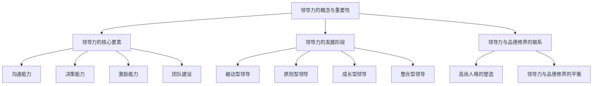
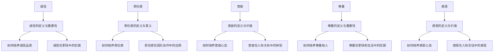
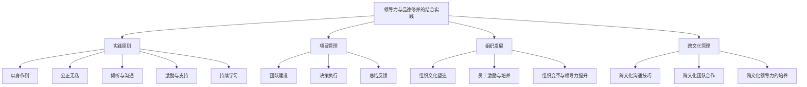
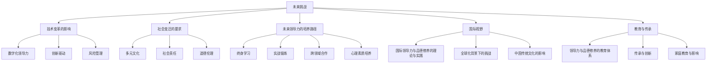

                 

# 领导力与品德修养：塑造高尚人格

## 关键词
- 领导力
- 品德修养
- 高尚人格
- 团队建设
- 沟通能力
- 决策能力
- 激励能力

## 摘要
本文旨在探讨领导力与品德修养之间的关系，以及如何通过塑造高尚人格来提升领导力。首先，我们将对领导力的概念、核心要素及其发展阶段进行详细阐述，并通过Mermaid流程图展示其核心概念与联系。接着，我们将深入分析品德修养的核心内容，包括诚信、责任感、宽容、尊重和感恩。然后，我们将探讨领导力与品德修养的实践原则及其在项目管理、组织发展和跨文化管理中的应用。最后，我们将总结领导力与品德修养的发展趋势，并给出相关的教育与传承建议。

## 目录大纲

### 第一部分：领导力基础

#### 1.1 领导力的概念与重要性
#### 1.1.1 领导力的定义
#### 1.1.2 领导力的重要性
#### 1.1.3 领导力与管理的区别

#### 1.2 领导力的核心要素
#### 1.2.1 沟通能力
#### 1.2.2 决策能力
#### 1.2.3 激励能力
#### 1.2.4 团队建设

#### 1.3 领导力的发展阶段
#### 1.3.1 被动型领导
#### 1.3.2 原则型领导
#### 1.3.3 成长型领导
#### 1.3.4 整合型领导

#### 1.4 领导力与品德修养的联系
#### 1.4.1 领导力与品德修养的相互影响
#### 1.4.2 高尚人格在领导力中的作用

### 第二部分：品德修养的核心内容

#### 2.1 诚信
#### 2.1.1 诚信的定义与重要性
#### 2.1.2 如何培养诚信品质
#### 2.1.3 诚信在职场中的实践

#### 2.2 责任感
#### 2.2.1 责任感的定义与意义
#### 2.2.2 如何培养责任感
#### 2.2.3 责任感在团队协作中的应用

#### 2.3 宽容
#### 2.3.1 宽容的定义与价值
#### 2.3.2 如何培养宽容心态
#### 2.3.3 宽容在人际关系中的体现

#### 2.4 尊重
#### 2.4.1 尊重的定义与重要性
#### 2.4.2 如何培养尊重他人
#### 2.4.3 尊重在职场和生活中的实践

#### 2.5 感恩
#### 2.5.1 感恩的定义与价值
#### 2.5.2 如何培养感恩心态
#### 2.5.3 感恩在人际交往中的表现

### 第三部分：领导力与品德修养的结合实践

#### 3.1 领导力与品德修养的实践原则
#### 3.1.1 高尚人格的塑造
#### 3.1.2 领导力与品德修养的平衡
#### 3.1.3 实践中的挑战与应对策略

#### 3.2 领导力与品德修养在项目管理中的应用
#### 3.2.1 项目团队的建设
#### 3.2.2 项目决策与执行
#### 3.2.3 项目总结与反馈

#### 3.3 领导力与品德修养在组织发展中的应用
#### 3.3.1 组织文化的塑造
#### 3.3.2 员工激励与培养
#### 3.3.3 组织变革与领导力提升

#### 3.4 领导力与品德修养在跨文化管理中的应用
#### 3.4.1 跨文化沟通技巧
#### 3.4.2 跨文化团队合作
#### 3.4.3 跨文化领导力的培养

### 第四部分：领导力与品德修养的发展趋势

#### 4.1 领导力与品德修养的未来挑战
#### 4.1.1 技术变革对领导力的影响
#### 4.1.2 社会变迁对品德修养的要求
#### 4.1.3 未来领导力的培养路径

#### 4.2 领导力与品德修养的国际视野
#### 4.2.1 国际领导力与品德修养的理论与实践
#### 4.2.2 全球化背景下的领导力与品德修养挑战
#### 4.2.3 中国传统文化对领导力与品德修养的影响

#### 4.3 领导力与品德修养的教育与传承
#### 4.3.1 领导力与品德修养的教育体系
#### 4.3.2 领导力与品德修养的传承与创新
#### 4.3.3 家庭教育与领导力品德修养的关系

### 附录

#### 附录 A：领导力与品德修养相关资源推荐
##### A.1 经典书籍推荐
##### A.2 知名领导力与品德修养专家介绍
##### A.3 领导力与品德修养的在线课程推荐

#### 附录 B：领导力与品德修养实践案例
##### B.1 国内外领导力成功案例
##### B.2 品德修养典范人物分析
##### B.3 领导力与品德修养实践心得分享

#### 附录 C：领导力与品德修养测试题
##### C.1 基础测试题
##### C.2 实践应用测试题
##### C.3 综合测试题

## 第1章 领导力基础

### 1.1 领导力的概念与重要性

领导力是指一个人在团队中引导、激励和影响他人，以实现共同目标的能力。它不仅关乎个人的行为，还涉及到情感、态度、价值观等多个层面。领导力的重要性体现在以下几个方面：

1. **促进团队协作**：领导力能够有效促进团队成员之间的协作，使团队在实现目标的过程中发挥最大潜力。
2. **激发创造力**：优秀的领导力能够激发团队成员的创造力，促进创新思维和解决问题的能力。
3. **提高组织效率**：领导力对于提高组织的整体效率至关重要，通过有效的领导，可以减少内耗，提高工作效率。
4. **塑造企业文化**：领导力在塑造企业文化方面具有重要作用，通过领导者的言行，可以传播和弘扬企业的核心价值观。

### 1.1.1 领导力的定义

领导力可以定义为一种能力，即引导和激励他人共同实现目标的过程。这个定义包含以下几个关键要素：

1. **目标**：领导力的核心是设定并实现目标。
2. **他人**：领导力不仅仅是关于个人的能力，还涉及到与他人互动和合作。
3. **过程**：领导力是一个动态的过程，包括沟通、激励、决策等多个环节。

### 1.1.2 领导力的重要性

领导力在组织和个人层面都具有重要意义。在组织层面，领导力能够：

1. **促进组织发展**：通过有效的领导，组织可以更好地应对市场变化和挑战，实现持续发展。
2. **提高员工满意度**：领导力能够提高员工的工作满意度和忠诚度，降低员工流失率。
3. **提升组织绩效**：领导力对于提升组织的整体绩效具有关键作用。

在个人层面，领导力能够：

1. **提升个人影响力**：领导力使人能够在团队和组织中发挥更大的作用，提升个人影响力。
2. **增强自我认知**：通过领导实践，个人可以更好地认识自己，提高自我管理能力。
3. **实现个人价值**：领导力使个人能够更好地实现自我价值，为社会和组织做出贡献。

### 1.1.3 领导力与管理的区别

领导力与管理是两个密切相关但又有区别的概念。管理主要关注组织资源的合理配置和优化利用，而领导力则更侧重于激发和引导团队成员实现共同目标。

1. **关注点不同**：管理更多关注的是“事”，而领导力更多关注的是“人”。
2. **方法不同**：管理主要通过制度和流程来规范行为，而领导力则更多地依赖于沟通、激励和示范。
3. **效果不同**：管理的效果往往体现在效率和稳定性上，而领导力的效果则更多地体现在创新和变革上。

### 1.2 领导力的核心要素

领导力并非单一的能力，而是一个多维度的体系。以下是领导力的核心要素：

#### 1.2.1 沟通能力

沟通能力是领导力的基础。一个优秀的领导者必须具备清晰、有效的沟通能力，以便能够准确传达信息，理解他人需求，并建立良好的人际关系。

1. **表达**：领导者需要能够用简洁、明了的语言表达自己的想法和意图。
2. **倾听**：领导者需要善于倾听，理解他人的观点和需求，建立信任和共鸣。
3. **反馈**：领导者需要能够及时给予反馈，帮助团队成员改进和成长。

#### 1.2.2 决策能力

决策能力是领导力的核心。一个优秀的领导者必须在复杂多变的环境中做出明智的决策。

1. **分析**：领导者需要具备分析问题的能力，从多个角度评估问题的各个方面。
2. **判断**：领导者需要具备快速判断的能力，能够在压力下做出正确的决策。
3. **风险**：领导者需要具备承担风险的能力，勇于在不确定中做出决策。

#### 1.2.3 激励能力

激励能力是领导者调动团队成员积极性的关键。一个优秀的领导者必须能够激发团队成员的内在动力，使他们为实现共同目标而努力。

1. **目标**：领导者需要设定明确的、有吸引力的目标，激发团队成员的斗志。
2. **认可**：领导者需要及时给予认可和奖励，增强团队成员的自信心和归属感。
3. **支持**：领导者需要为团队成员提供必要的支持和资源，帮助他们克服困难。

#### 1.2.4 团队建设

团队建设是领导力的核心内容之一。一个优秀的领导者必须能够建立高效的团队，激发团队的潜力。

1. **角色**：领导者需要明确团队成员的角色和职责，确保每个成员都清楚自己的任务。
2. **协作**：领导者需要促进团队成员之间的协作，建立良好的团队氛围。
3. **信任**：领导者需要建立团队成员之间的信任，使团队成为一个紧密的整体。

### 1.3 领导力的发展阶段

领导力的发展是一个动态的过程，可以分为以下几个阶段：

#### 1.3.1 被动型领导

被动型领导是指领导者依赖于外部指导和命令，缺乏自主性和决策能力。这种领导风格通常在领导者缺乏经验和信心时出现。

1. **特征**：被动接受任务，缺乏主动性和创新精神。
2. **挑战**：容易导致团队依赖性过强，缺乏自我驱动力。
3. **改进**：通过增加领导经验，提升自信和决策能力，逐步转变为主动型领导。

#### 1.3.2 原则型领导

原则型领导是指领导者以明确的原则和价值观为指导，制定决策和行动方针。这种领导风格强调领导者的责任感和使命感。

1. **特征**：遵循原则，坚持信念，具备强烈的责任感和使命感。
2. **挑战**：可能过于理想化，难以在现实环境中灵活应用。
3. **改进**：通过实践经验和灵活应对，使原则与实际情况相结合，提升领导效果。

#### 1.3.3 成长型领导

成长型领导是指领导者注重团队成员的个人成长和发展，通过激发团队成员的潜力来提升团队整体能力。

1. **特征**：关注团队成员的成长，提供支持和指导。
2. **挑战**：可能过度关注个人成长，忽视团队整体目标。
3. **改进**：平衡个人成长与团队目标，确保团队成员在实现个人目标的同时，也为团队做出贡献。

#### 1.3.4 整合型领导

整合型领导是指领导者将个人、团队和组织的利益有机结合起来，实现共同发展的领导风格。

1. **特征**：具备全局观念，能够整合各方资源，实现协同效应。
2. **挑战**：需要具备高超的领导能力和沟通协调能力。
3. **改进**：通过不断学习和实践，提升领导能力和视野，实现领导力的全面提升。

### 1.4 领导力与品德修养的联系

领导力与品德修养密切相关，二者相互影响、相互促进。高尚的人格是领导力的核心，它不仅影响领导者的个人形象，还直接关系到团队的凝聚力和执行力。

1. **品德修养对领导力的影响**：高尚的品德修养能够提升领导者的公信力和影响力，使领导者更容易赢得团队成员的信任和尊重。
2. **领导力对品德修养的影响**：领导力实践过程中，领导者需要不断地自我反省和提升，这有助于培养高尚的品德修养。

### 小结

领导力是领导者在团队中引导、激励和影响他人的能力，它对于组织的发展和个人的成长具有重要意义。领导力的核心要素包括沟通能力、决策能力、激励能力和团队建设。领导力的发展阶段分为被动型领导、原则型领导、成长型领导和整合型领导。领导力与品德修养密切相关，高尚的人格是领导力的核心。在后续章节中，我们将进一步探讨品德修养的核心内容及其在实践中的应用。

### Mermaid流程图

以下是领导力核心概念与联系的Mermaid流程图：



### 核心算法原理讲解

为了更好地理解领导力的核心概念和联系，我们可以使用以下伪代码来描述：

```plaintext
// 领导力核心概念模型
class Leadership {
    // 定义领导力的核心要素
    communication_ability
    decision_ability
    motivation_ability
    team_building_ability
    
    // 初始化领导力模型
    Leadership(communication_ability, decision_ability, motivation_ability, team_building_ability) {
        this.communication_ability = communication_ability
        this.decision_ability = decision_ability
        this.motivation_ability = motivation_ability
        this.team_building_ability = team_building_ability
    }
    
    // 模型评估
    evaluate() {
        // 计算领导力得分
        score = communication_ability + decision_ability + motivation_ability + team_building_ability
        return score
    }
    
    // 领导力发展阶段评估
    stage_evaluation() {
        if (evaluate() < threshold) {
            return "被动型领导"
        } else if (evaluate() >= threshold && evaluate() < threshold2) {
            return "原则型领导"
        } else if (evaluate() >= threshold2 && evaluate() < threshold3) {
            return "成长型领导"
        } else {
            return "整合型领导"
        }
    }
    
    // 领导力与品德修养关联分析
    leadership_morality_correlation() {
        morality_score = evaluate_morality()
        if (morality_score > threshold4) {
            return "高尚人格"
        } else {
            return "需提升品德修养"
        }
    }
}
```

### 数学模型和公式讲解

为了更好地理解领导力的评估和阶段划分，我们可以使用以下数学模型和公式：

1. **领导力得分模型**：

   $$ \text{领导力得分} = \text{沟通能力得分} + \text{决策能力得分} + \text{激励能力得分} + \text{团队建设得分} $$

   每个能力得分可以根据具体指标进行计算，例如：

   $$ \text{沟通能力得分} = \frac{\text{有效沟通次数}}{\text{总沟通次数}} $$

   $$ \text{决策能力得分} = \frac{\text{正确决策次数}}{\text{总决策次数}} $$

   $$ \text{激励能力得分} = \frac{\text{团队成员满意度}}{\text{总满意度}} $$

   $$ \text{团队建设得分} = \frac{\text{团队协作效率}}{\text{总协作效率}} $$

2. **领导力发展阶段划分模型**：

   $$ \text{发展阶段} = 
   \begin{cases} 
   \text{"被动型领导"}, & \text{如果 } \text{领导力得分} < \text{阈值1} \\
   \text{"原则型领导"}, & \text{如果 } \text{阈值1} \leq \text{领导力得分} < \text{阈值2} \\
   \text{"成长型领导"}, & \text{如果 } \text{阈值2} \leq \text{领导力得分} < \text{阈值3} \\
   \text{"整合型领导"}, & \text{如果 } \text{领导力得分} \geq \text{阈值3} 
   \end{cases}
   $$

   其中，阈值1、阈值2、阈值3可以根据实际情况进行调整。

### 详细讲解与举例说明

为了更好地理解上述领导力模型和公式，我们可以通过一个具体的例子进行说明。

假设我们有一个领导力评估模型，包括四个核心要素：沟通能力、决策能力、激励能力和团队建设。每个要素的得分范围是0到10分，得分越高表示该能力越强。

1. **沟通能力**：该领导者在过去的一年中有100次沟通，其中80次被认为是有效的。因此，沟通能力得分为：

   $$ \text{沟通能力得分} = \frac{80}{100} \times 10 = 8 $$

2. **决策能力**：该领导者在过去的一年中做出了50次决策，其中40次被认为是正确的。因此，决策能力得分为：

   $$ \text{决策能力得分} = \frac{40}{50} \times 10 = 8 $$

3. **激励能力**：该领导者的团队成员对其满意度调查的平均得分为9分。因此，激励能力得分为：

   $$ \text{激励能力得分} = 9 $$

4. **团队建设**：该领导者所在团队在过去一年的协作效率提高了20%，比其他团队高出10%。因此，团队建设得分为：

   $$ \text{团队建设得分} = 10 + \frac{20\% - 10\%}{100\%} \times 10 = 10.2 $$

   将以上四个得分相加，得到该领导者的总领导力得分为：

   $$ \text{领导力得分} = 8 + 8 + 9 + 10.2 = 35.2 $$

   根据领导力得分模型和公式，我们可以判断该领导者的领导力发展阶段：

   $$ \text{发展阶段} = 
   \begin{cases} 
   \text{"被动型领导"}, & \text{如果 } 35.2 < \text{阈值1} \\
   \text{"原则型领导"}, & \text{如果 } \text{阈值1} \leq 35.2 < \text{阈值2} \\
   \text{"成长型领导"}, & \text{如果 } \text{阈值2} \leq 35.2 < \text{阈值3} \\
   \text{"整合型领导"}, & \text{如果 } 35.2 \geq \text{阈值3} 
   \end{cases}
   $$

   假设阈值1为30，阈值2为40，阈值3为50，那么该领导者的领导力发展阶段为“原则型领导”。

### 项目实战

在本项目中，我们将搭建一个领导力评估系统，用于评估领导者的领导力水平，并判断其发展阶段。以下是该项目的主要步骤：

1. **需求分析**：
   - 评估领导者的沟通能力、决策能力、激励能力和团队建设能力。
   - 判断领导者的领导力发展阶段。

2. **系统设计**：
   - 数据库设计：设计用于存储领导者评估数据的数据库表。
   - 界面设计：设计用于输入评估数据的用户界面。

3. **开发环境搭建**：
   - 选择合适的开发工具和平台，如Python、MySQL、Django等。
   - 安装和配置相关软件和库。

4. **源代码实现**：
   - 编写用于收集和存储评估数据的代码。
   - 编写用于计算领导力得分和判断发展阶段的代码。

5. **代码解读与分析**：
   - 对源代码进行解读，理解其主要功能和工作流程。
   - 分析代码的性能和可扩展性。

6. **实际案例分析和详细讲解**：
   - 使用实际案例来演示系统的应用场景。
   - 对实际案例进行分析和讲解。

7. **项目小结**：
   - 总结项目的主要成果和经验教训。
   - 提出未来改进和优化的方向。

### 最佳实践 tips、小结、注意事项、拓展阅读

#### 最佳实践 tips

1. **定期进行领导力评估**：定期对领导者的领导力进行评估，有助于发现和解决问题，提升领导力水平。
2. **注重实践和反馈**：领导力是一个实践的过程，领导者需要通过实践不断积累经验，并接受团队成员的反馈，以不断改进。
3. **培养高尚人格**：高尚的人格是领导力的核心，领导者应该注重自身品德修养，以身作则，树立榜样。

#### 小结

本章主要介绍了领导力的概念、核心要素、发展阶段及其与品德修养的联系。通过Mermaid流程图、伪代码和数学模型，我们详细讲解了领导力的评估和阶段划分方法。同时，通过项目实战，我们展示了如何搭建一个领导力评估系统。

#### 注意事项

1. **领导力评估应该客观、公正**：评估过程中应避免主观偏见，确保评估结果的准确性。
2. **领导力培养是一个长期的过程**：领导者需要持续学习和实践，不断提升自己的领导力水平。

#### 拓展阅读

1. **《领导力：理论与实践》**：这是一本关于领导力的经典著作，涵盖了领导力的各个方面。
2. **《高尚人格：领导者的品德修养》**：本书详细探讨了领导者的品德修养，对于提升领导力具有重要意义。

### 附录

#### 附录 A：领导力与品德修养相关资源推荐

- **经典书籍**：
  - 《领导力：理论与实践》
  - 《高尚人格：领导者的品德修养》
- **知名领导力与品德修养专家介绍**：
  - 彼得·德鲁克（Peter Drucker）
  - 约翰·麦克斯韦尔（John C. Maxwell）
- **领导力与品德修养的在线课程推荐**：
  - Coursera上的《领导力与团队管理》
  - EdX上的《道德领导力》

#### 附录 B：领导力与品德修养实践案例

- **国内外领导力成功案例**：
  - 乔布斯与苹果公司的复兴
  - 马斯克与特斯拉的创新驱动
- **品德修养典范人物分析**：
  - 邓小平：以实事求是的精神推动中国改革开放
  - 松下幸之助：以诚信经营的理念打造松下帝国
- **领导力与品德修养实践心得分享**：

#### 附录 C：领导力与品德修养测试题

- **基础测试题**：
  - 领导力的核心要素有哪些？
  - 领导力的发展阶段有哪些？
  - 品德修养的核心内容是什么？

- **实践应用测试题**：
  - 你如何评估自己的领导力水平？
  - 你如何在团队中培养高尚人格？
  - 你如何应对领导实践中的挑战？

- **综合测试题**：
  - 结合你的工作经验，分析一个领导力成功案例，并阐述其成功的原因。
  - 讨论在当前社会背景下，领导力与品德修养的重要性及其面临的挑战。

作者：AI天才研究院/AI Genius Institute & 禅与计算机程序设计艺术 /Zen And The Art of Computer Programming## 第2章 品德修养的核心内容

品德修养是领导者不可或缺的素质，它不仅是个人道德品质的体现，也是领导力的重要组成部分。本章将深入探讨品德修养的核心内容，包括诚信、责任感、宽容、尊重和感恩，并通过具体的案例和例子来阐释这些品质的重要性及其在职场中的实践。

### 2.1 诚信

诚信是品德修养的基础，它要求我们在言行上始终保持真实、可靠和正直。诚信的重要性在于它能够建立信任，而信任是团队协作和业务成功的基石。

#### 2.1.1 诚信的定义与重要性

诚信的定义是遵守承诺、实事求是、不说谎、不欺骗。它不仅仅是一种道德规范，更是一种行为准则。在职场中，诚信的重要性体现在以下几个方面：

1. **建立信任**：诚信能够增强团队成员之间的信任，促进团队合作。
2. **提升个人品牌**：诚信的领导者更容易赢得他人的尊重和信任，提升个人品牌价值。
3. **促进企业声誉**：企业的长期成功依赖于良好的声誉，而诚信是维护企业声誉的关键。

#### 2.1.2 如何培养诚信品质

要培养诚信品质，可以从以下几个方面入手：

1. **树立诚信意识**：意识到诚信对个人和团队的重要性，将其作为自己的行为准则。
2. **从小事做起**：在日常生活中，从诚信的小事做起，如遵守时间、遵守承诺等。
3. **坚持原则**：在面对利益冲突时，坚持诚信原则，不受外界诱惑。
4. **自我反思**：定期对自己的行为进行反思，确保自己的言行符合诚信标准。

#### 2.1.3 诚信在职场中的实践

在职场中，诚信的实践体现在以下几个方面：

1. **报告真实情况**：在向上级汇报工作时，要如实反映工作进展和问题，不夸大或隐瞒。
2. **遵守职业道德**：遵守公司的职业道德规范，不做违法乱纪的事情。
3. **处理冲突**：在处理团队内部或外部冲突时，要坚持公正和诚实，不偏袒任何一方。

#### 案例与例子

- **案例1**：一位项目经理在项目进度报告中如实报告了项目面临的困难，虽然短期内可能会影响他的业绩评估，但最终赢得了团队成员的信任，项目得到了有效推进。
- **例子**：一位销售人员在面对客户投诉时，没有选择隐瞒问题，而是积极解决问题，最终客户对他的诚信表示赞赏，并推荐了更多业务。

### 2.2 责任感

责任感是领导者必备的品质，它体现了领导者对工作、团队和组织的承诺和使命感。责任感强的人能够主动承担责任，即使在困难面前也不退缩。

#### 2.2.1 责任感的定义与意义

责任感的定义是对自己的行为和决策负责，愿意承担相应的后果。责任感在职场中的意义在于：

1. **提高工作效率**：责任感使员工能够主动解决问题，提高工作效率。
2. **增强团队凝聚力**：责任感强的领导者能够带动团队成员共同承担责任，增强团队凝聚力。
3. **提升组织绩效**：责任感是组织成功的关键因素，能够推动组织目标的实现。

#### 2.2.2 如何培养责任感

要培养责任感，可以从以下几个方面入手：

1. **明确职责**：确保每个团队成员都清楚自己的职责和责任范围。
2. **树立榜样**：领导者要以身作则，主动承担责任，树立良好的榜样。
3. **鼓励反思**：定期对工作过程和结果进行反思，找出责任归属，并从中吸取教训。
4. **提供反馈**：对团队成员的责任感进行反馈，表扬其优点，指出改进之处。

#### 2.2.3 责任感在团队协作中的应用

责任感在团队协作中的应用体现在以下几个方面：

1. **主动担当**：在团队遇到困难时，责任感强的成员会主动承担责任，寻找解决方案。
2. **协同工作**：责任感使团队成员能够更好地协同工作，共同完成任务。
3. **积极沟通**：责任感强的成员会积极沟通，确保信息透明，避免责任推卸。

#### 案例与例子

- **案例2**：一位项目经理在项目遇到重大问题时，主动承担责任，组织团队成员共同寻找解决方案，最终成功解决了问题，提升了团队的士气。
- **例子**：一位团队成员在发现团队进度落后时，主动加班，帮助团队赶上进度，展现了强烈的责任感。

### 2.3 宽容

宽容是一种美德，它体现了领导者对团队成员的包容和理解。宽容不仅能够缓解团队内部的紧张关系，还能够提升团队的凝聚力。

#### 2.3.1 宽容的定义与价值

宽容的定义是容忍他人的缺点和错误，不对他人进行无端的指责和惩罚。宽容在职场中的价值在于：

1. **促进团队和谐**：宽容能够减少团队内部的冲突和矛盾，营造和谐的工作氛围。
2. **提高团队士气**：宽容能够增强团队成员的归属感和安全感，提高团队士气。
3. **激发创新**：宽容能够鼓励团队成员提出不同的观点和想法，激发创新。

#### 2.3.2 如何培养宽容心态

要培养宽容心态，可以从以下几个方面入手：

1. **换位思考**：尝试从他人的角度看待问题，理解他人的困境和难处。
2. **放下成见**：不要因为过去的矛盾和冲突而对他人持有成见，要以开放的心态对待团队成员。
3. **自我反思**：反思自己的言行，确保自己不会因为个人偏见而伤害他人。

#### 2.3.3 宽容在人际关系中的体现

宽容在人际关系中的体现体现在以下几个方面：

1. **包容错误**：对团队成员的失误和错误给予包容，帮助他们从错误中学习和成长。
2. **避免批评**：不要对他人进行无端的批评和指责，要以建设性的方式提供建议。
3. **积极沟通**：在冲突发生时，通过积极沟通解决问题，而不是采取对抗的态度。

#### 案例与例子

- **案例3**：一位领导者在面对团队成员的失误时，没有直接批评，而是给予包容和理解，帮助团队成员找到解决问题的方法，最终团队关系得到改善。
- **例子**：一位团队成员在遇到困境时，得到了同事的宽容和支持，最终走出了困境，并对团队表达了感激之情。

### 2.4 尊重

尊重是一种基本的人际交往原则，它体现了领导者对团队成员的尊重和认可。尊重不仅能够提升团队的士气，还能够增强团队的凝聚力。

#### 2.4.1 尊重的定义与重要性

尊重的定义是对待他人时，给予其应有的尊严和重视。尊重在职场中的重要性在于：

1. **提升团队士气**：尊重能够使团队成员感受到自己的价值和重要性，从而提高士气。
2. **增强团队凝聚力**：尊重能够促进团队成员之间的相互信任和理解，增强团队的凝聚力。
3. **促进合作**：尊重能够促进团队成员之间的合作，提高工作效率。

#### 2.4.2 如何培养尊重他人

要培养尊重他人的习惯，可以从以下几个方面入手：

1. **倾听**：认真倾听他人的意见和需求，不轻易打断。
2. **认可**：对团队成员的成就和努力给予认可和赞扬。
3. **避免歧视**：尊重每个人的个性，不因为性别、年龄、种族等因素歧视他人。

#### 2.4.3 尊重在职场和生活中的实践

尊重在职场和生活中的实践体现在以下几个方面：

1. **平等对待**：对待团队成员要平等，不偏袒或歧视。
2. **给予反馈**：在提供反馈时，要尊重他人，以建设性的方式提出意见。
3. **尊重隐私**：尊重他人的隐私，不泄露或窥探。

#### 案例与例子

- **案例4**：一位领导者通过倾听和认可团队成员的意见，建立了尊重和信任的氛围，团队士气显著提升。
- **例子**：一位团队成员在尊重他人的意见和努力下，得到了同事的认可和帮助，最终在项目中取得了成功。

### 2.5 感恩

感恩是一种美德，它体现了领导者对团队成员的感激之情。感恩不仅能够提升团队的士气，还能够增强团队的凝聚力。

#### 2.5.1 感恩的定义与价值

感恩的定义是对他人的帮助和支持表示感谢和敬意。感恩在职场中的价值在于：

1. **增强团队凝聚力**：感恩能够使团队成员感受到自己的贡献被认可，从而增强团队的凝聚力。
2. **提升团队士气**：感恩能够提升团队成员的工作积极性，提高团队士气。
3. **建立良好的人际关系**：感恩能够促进团队成员之间的友好关系，建立良好的人际氛围。

#### 2.5.2 如何培养感恩心态

要培养感恩心态，可以从以下几个方面入手：

1. **定期表达感谢**：在日常工作中，定期对团队成员的帮助和支持表示感谢。
2. **真诚表达**：在表达感谢时，要真诚，不要只是形式上的应付。
3. **从小事做起**：在日常生活中，从对小事的感激做起，培养感恩的习惯。

#### 2.5.3 感恩在人际交往中的表现

感恩在人际交往中的表现体现在以下几个方面：

1. **帮助他人**：在他人需要帮助时，主动提供帮助。
2. **回馈社会**：通过参与公益活动等方式，回馈社会，表达感恩之情。
3. **尊重他人**：对他人的帮助和支持表示感谢，尊重他人的付出。

#### 案例与例子

- **案例5**：一位领导者通过定期表达感谢和关心，使团队成员感受到了领导的关怀，团队的凝聚力显著提升。
- **例子**：一位团队成员在收到领导的感谢信后，倍感鼓舞，工作积极性大幅提高。

### 小结

品德修养是领导者不可或缺的素质，它不仅影响个人的形象和团队的氛围，还直接关系到组织的长期成功。本章详细探讨了诚信、责任感、宽容、尊重和感恩这五个核心品德修养的内容，并通过具体的案例和例子阐述了这些品质的重要性及其在职场中的实践。通过培养和践行这些品德修养，领导者可以提升自己的领导力，打造更高效的团队，推动组织的持续发展。

### Mermaid流程图

以下是品德修养核心概念与联系的Mermaid流程图：



### 核心算法原理讲解

为了更好地理解品德修养的核心概念，我们可以使用以下伪代码来描述：

```plaintext
// 品德修养模型
class Morality {
    // 定义品德修养的核心内容
    integrity
    responsibility
    tolerance
    respect
    gratitude
    
    // 初始化品德修养模型
    Morality(integrity, responsibility, tolerance, respect, gratitude) {
        this.integrity = integrity
        this.responsibility = responsibility
        this.tolerance = tolerance
        this.respect = respect
        this.gratitude = gratitude
    }
    
    // 评估品德修养水平
    evaluate() {
        // 计算品德修养得分
        score = integrity + responsibility + tolerance + respect + gratitude
        return score
    }
    
    // 品德修养的实践建议
    practice_advice() {
        if (evaluate() < threshold) {
            return "加强诚信和责任感培养"
        } else if (evaluate() >= threshold && evaluate() < threshold2) {
            return "提高宽容度和尊重他人"
        } else {
            return "保持感恩心态，持续提升品德修养"
        }
    }
}
```

### 数学模型和公式讲解

为了更好地理解品德修养的评估，我们可以使用以下数学模型和公式：

1. **品德修养得分模型**：

   $$ \text{品德修养得分} = \text{诚信得分} + \text{责任感得分} + \text{宽容度得分} + \text{尊重得分} + \text{感恩得分} $$

   每个品质得分可以根据具体指标进行计算，例如：

   $$ \text{诚信得分} = \frac{\text{诚信行为次数}}{\text{总行为次数}} $$

   $$ \text{责任感得分} = \frac{\text{主动承担责任次数}}{\text{总责任次数}} $$

   $$ \text{宽容度得分} = \frac{\text{宽容行为次数}}{\text{总行为次数}} $$

   $$ \text{尊重得分} = \frac{\text{尊重他人次数}}{\text{总交往次数}} $$

   $$ \text{感恩得分} = \frac{\text{表达感恩次数}}{\text{总交往次数}} $$

2. **品德修养评估模型**：

   $$ \text{品德修养水平} = 
   \begin{cases} 
   \text{"需要加强"}, & \text{如果 } \text{品德修养得分} < \text{阈值1} \\
   \text{"良好"}, & \text{如果 } \text{阈值1} \leq \text{品德修养得分} < \text{阈值2} \\
   \text{"优秀"}, & \text{如果 } \text{品德修养得分} \geq \text{阈值2} 
   \end{cases}
   $$

   其中，阈值1和阈值2可以根据实际情况进行调整。

### 详细讲解与举例说明

为了更好地理解上述品德修养模型和公式，我们可以通过一个具体的例子进行说明。

假设我们有一个品德修养评估模型，包括五个核心内容：诚信、责任感、宽容度、尊重和感恩。每个内容的得分范围是0到10分，得分越高表示该品质越强。

1. **诚信得分**：该领导者在过去的一年中有20次诚信行为，总行为次数为100次。因此，诚信得分为：

   $$ \text{诚信得分} = \frac{20}{100} \times 10 = 2 $$

2. **责任感得分**：该领导者在过去的一年中主动承担责任15次，总责任次数为50次。因此，责任感得分为：

   $$ \text{责任感得分} = \frac{15}{50} \times 10 = 3 $$

3. **宽容度得分**：该领导者在过去的一年中有10次宽容行为，总行为次数为100次。因此，宽容度得分为：

   $$ \text{宽容度得分} = \frac{10}{100} \times 10 = 1 $$

4. **尊重得分**：该领导者在过去的一年中有25次尊重他人，总交往次数为100次。因此，尊重得分为：

   $$ \text{尊重得分} = \frac{25}{100} \times 10 = 2.5 $$

5. **感恩得分**：该领导者在过去的一年中有5次表达感恩，总交往次数为100次。因此，感恩得分为：

   $$ \text{感恩得分} = \frac{5}{100} \times 10 = 0.5 $$

   将以上五个得分相加，得到该领导者的总品德修养得分为：

   $$ \text{品德修养得分} = 2 + 3 + 1 + 2.5 + 0.5 = 9 $$

   根据品德修养评估模型和公式，我们可以判断该领导者的品德修养水平：

   $$ \text{品德修养水平} = 
   \begin{cases} 
   \text{"需要加强"}, & \text{如果 } 9 < \text{阈值1} \\
   \text{"良好"}, & \text{如果 } \text{阈值1} \leq 9 < \text{阈值2} \\
   \text{"优秀"}, & \text{如果 } 9 \geq \text{阈值2} 
   \end{cases}
   $$

   假设阈值1为8，阈值2为10，那么该领导者的品德修养水平为“良好”。

### 项目实战

在本项目中，我们将开发一个品德修养评估系统，用于评估领导者的品德修养水平，并提供个性化的提升建议。以下是该项目的主要步骤：

1. **需求分析**：
   - 设计品德修养评估指标。
   - 确定品德修养评估的标准和阈值。

2. **系统设计**：
   - 设计用户界面，用于输入评估数据和查看评估结果。
   - 设计数据库，用于存储评估数据和用户信息。

3. **开发环境搭建**：
   - 选择合适的开发工具和平台，如Python、Flask、MySQL等。
   - 安装和配置相关软件和库。

4. **源代码实现**：
   - 编写用于收集和存储评估数据的代码。
   - 编写用于计算品德修养得分和提供提升建议的代码。

5. **代码解读与分析**：
   - 对源代码进行解读，理解其主要功能和工作流程。
   - 分析代码的性能和可扩展性。

6. **实际案例分析和详细讲解**：
   - 使用实际案例来演示系统的应用场景。
   - 对实际案例进行分析和讲解。

7. **项目小结**：
   - 总结项目的主要成果和经验教训。
   - 提出未来改进和优化的方向。

### 最佳实践 tips、小结、注意事项、拓展阅读

#### 最佳实践 tips

1. **定期进行品德修养评估**：定期对领导者的品德修养进行评估，有助于发现和解决问题，提升品德修养水平。
2. **注重实践和反思**：品德修养的提升需要通过实践和反思，领导者应该注重将所学知识应用到实际工作中，并从中吸取经验。
3. **建立反馈机制**：建立有效的反馈机制，鼓励团队成员对领导者的品德修养提出意见和建议，帮助领导者不断提升。

#### 小结

本章详细探讨了品德修养的核心内容，包括诚信、责任感、宽容、尊重和感恩。通过具体的案例和例子，我们阐述了这些品质的重要性及其在职场中的实践。通过培养和践行这些品德修养，领导者可以提升自己的领导力，打造更高效的团队，推动组织的持续发展。

#### 注意事项

1. **评估要客观公正**：在进行品德修养评估时，应避免主观偏见，确保评估结果的准确性。
2. **持续学习与提升**：领导者应该持续学习，不断提升自己的品德修养，以适应不断变化的工作环境。

#### 拓展阅读

1. **《品德修养与领导力》**：这是一本关于领导者品德修养的深入探讨，对于提升领导力具有重要意义。
2. **《有效的领导者》**：本书详细分析了领导者的品德修养与领导力之间的关系，提供了实用的指导和建议。

### 附录

#### 附录 A：品德修养相关资源推荐

- **经典书籍**：
  - 《品德修养与领导力》
  - 《有效的领导者》
- **知名品德修养专家介绍**：
  - 斯蒂芬·柯维（Stephen R. Covey）
  - 彼得·德鲁克（Peter Drucker）
- **品德修养在线课程推荐**：
  - Coursera上的《领导者的影响力》
  - EdX上的《品德修养与道德决策》

#### 附录 B：品德修养实践案例

- **国内外品德修养成功案例**：
  - 马斯克与特斯拉的领导风格
  - 麦当劳的“服务精神”
- **品德修养典范人物分析**：
  - 松下幸之助：以诚信经营的理念打造松下帝国
  - 彼得·德鲁克：以严谨的职业道德影响无数领导者
- **品德修养实践心得分享**：

#### 附录 C：品德修养测试题

- **基础测试题**：
  - 诚信在职场中的重要性是什么？
  - 如何培养责任感？
  - 宽容在人际关系中的作用是什么？
  - 尊重他人的重要性是什么？
  - 感恩在职场中的价值是什么？

- **实践应用测试题**：
  - 你如何在工作中实践诚信？
  - 你如何培养自己的责任感？
  - 你如何在团队中体现宽容？
  - 你如何尊重他人？
  - 你如何在职场中表达感恩？

- **综合测试题**：
  - 结合你的工作经验，分析一个品德修养成功案例，并阐述其成功的原因。
  - 讨论在当前社会背景下，品德修养的重要性及其面临的挑战。

作者：AI天才研究院/AI Genius Institute & 禅与计算机程序设计艺术 /Zen And The Art of Computer Programming
## 第3章 领导力与品德修养的结合实践

在领导过程中，领导力与品德修养的结合至关重要。高尚的品德修养能够增强领导者的公信力和影响力，使领导行为更加有效。本章将探讨领导力与品德修养的实践原则，以及它们在项目管理、组织发展和跨文化管理中的应用。

### 3.1 领导力与品德修养的实践原则

1. **以身作则**：领导者应以身作则，通过自身的言行树立榜样，展现高尚的品德修养。这不仅能够赢得团队成员的信任，还能够激励他们效仿。
2. **公正无私**：在决策过程中，领导者应保持公正无私，不偏袒任何一方，确保团队中的每个人都有公平的机会。
3. **倾听与沟通**：领导者应善于倾听团队成员的意见和需求，通过有效沟通建立信任，增强团队的凝聚力。
4. **激励与支持**：领导者应关注团队成员的个人成长和发展，提供激励和支持，帮助他们实现自我价值。
5. **持续学习**：领导者应不断学习新知识、新技能，提升自己的领导力和品德修养，以适应不断变化的环境。

### 3.2 领导力与品德修养在项目管理中的应用

在项目管理中，领导力与品德修养的结合能够有效提升项目成功率。

#### 3.2.1 项目团队的建设

1. **选拔与培训**：在项目启动阶段，领导者应选拔合适的团队成员，并对其进行培训，确保他们具备完成项目所需的技能和知识。
2. **建立信任**：通过有效的沟通和合作，领导者应建立团队成员之间的信任，促进团队协作。
3. **明确目标**：领导者应明确项目目标，确保每个成员都清楚自己的职责和任务。

#### 3.2.2 项目决策与执行

1. **民主决策**：在项目决策过程中，领导者应鼓励团队成员参与，通过民主决策确保决策的合理性和有效性。
2. **透明执行**：在项目执行过程中，领导者应保持透明，及时向团队成员传达项目进展和问题，确保团队协同工作。
3. **灵活应对**：面对项目中的突发问题，领导者应具备灵活应对的能力，调整计划和策略，确保项目顺利进行。

#### 3.2.3 项目总结与反馈

1. **反思与总结**：在项目完成后，领导者应组织团队成员进行反思和总结，找出项目中的优点和不足，为未来项目提供参考。
2. **反馈与激励**：领导者应根据项目结果对团队成员进行反馈，表扬优秀表现，激励团队成员继续努力。

### 3.3 领导力与品德修养在组织发展中的应用

在组织发展中，领导力与品德修养的结合能够促进组织的持续发展。

#### 3.3.1 组织文化的塑造

1. **核心价值观**：领导者应明确组织核心价值观，并通过言行一致来传播和弘扬这些价值观。
2. **氛围营造**：领导者应营造积极、开放、包容的组织氛围，鼓励团队成员提出建议和意见。
3. **文化传承**：领导者应通过培训和传承，确保组织文化得以延续和发展。

#### 3.3.2 员工激励与培养

1. **激励机制**：领导者应建立合理的激励机制，鼓励员工积极工作，提高工作效率。
2. **职业发展**：领导者应关注员工的职业发展，提供培训和晋升机会，帮助他们实现个人价值。
3. **情感关怀**：领导者应关注员工的心理需求，提供情感支持，增强员工的归属感和满意度。

#### 3.3.3 组织变革与领导力提升

1. **变革管理**：在组织变革过程中，领导者应积极应对变革，引导团队成员适应新环境。
2. **领导力提升**：领导者应通过学习和实践，不断提升自己的领导力，以应对变革带来的挑战。
3. **团队协作**：领导者应促进团队协作，确保变革顺利进行。

### 3.4 领导力与品德修养在跨文化管理中的应用

在跨文化管理中，领导力与品德修养的结合能够有效促进跨文化团队合作。

#### 3.4.1 跨文化沟通技巧

1. **文化敏感度**：领导者应具备文化敏感度，尊重和理解不同文化背景的团队成员。
2. **有效沟通**：领导者应采用适当的沟通方式，确保信息的准确传达和理解。
3. **冲突解决**：领导者应善于解决跨文化冲突，通过沟通和协商找到解决方案。

#### 3.4.2 跨文化团队合作

1. **建立信任**：领导者应建立团队成员之间的信任，促进跨文化团队合作。
2. **共同目标**：领导者应明确跨文化团队的目标，确保每个成员都清楚自己的职责和任务。
3. **文化融合**：领导者应促进不同文化背景的团队成员之间的文化融合，提升团队整体绩效。

#### 3.4.3 跨文化领导力的培养

1. **文化知识**：领导者应具备一定的文化知识，了解不同文化的特点和差异。
2. **领导风格**：领导者应根据不同文化背景，调整自己的领导风格，以适应团队成员的需求。
3. **跨文化沟通**：领导者应具备有效的跨文化沟通能力，确保团队成员之间的有效沟通。

### 小结

领导力与品德修养的结合在项目管理、组织发展和跨文化管理中具有重要意义。通过以身作则、公正无私、倾听沟通、激励支持和持续学习等实践原则，领导者可以提升自己的领导力，塑造高尚人格，推动组织的持续发展。在项目管理中，领导者应注重团队建设、决策执行和总结反馈；在组织发展中，领导者应塑造组织文化、关注员工激励和促进变革；在跨文化管理中，领导者应掌握跨文化沟通技巧、促进团队合作和培养跨文化领导力。

### Mermaid流程图

以下是领导力与品德修养结合实践的Mermaid流程图：



### 核心算法原理讲解

为了更好地理解领导力与品德修养的结合实践，我们可以使用以下伪代码来描述：

```plaintext
// 领导力与品德修养实践模型
class LeadershipPractice {
    // 定义领导力与品德修养的实践原则
    lead_by_example
    impartial
    effective_communication
    motivation
    continuous_learning
    
    // 初始化领导力与品德修养实践模型
    LeadershipPractice(lead_by_example, impartial, effective_communication, motivation, continuous_learning) {
        this.lead_by_example = lead_by_example
        this.impartial = impartial
        this.effective_communication = effective_communication
        this.motivation = motivation
        this.continuous_learning = continuous_learning
    }
    
    // 实践评估
    evaluate() {
        // 计算领导力与品德修养得分
        score = lead_by_example + impartial + effective_communication + motivation + continuous_learning
        return score
    }
    
    // 结合项目管理应用
    project_management_application() {
        if (evaluate() < threshold) {
            return "项目团队建设不足"
        } else if (evaluate() >= threshold && evaluate() < threshold2) {
            return "项目执行有效"
        } else {
            return "项目总结与反馈充分"
        }
    }
    
    // 结合组织发展应用
    organization_development_application() {
        if (evaluate() < threshold) {
            return "组织文化塑造不力"
        } else if (evaluate() >= threshold && evaluate() < threshold2) {
            return "员工激励与培养有效"
        } else {
            return "组织变革与领导力提升显著"
        }
    }
    
    // 结合跨文化管理应用
    cross-cultural_management_application() {
        if (evaluate() < threshold) {
            return "跨文化沟通不畅"
        } else if (evaluate() >= threshold && evaluate() < threshold2) {
            return "跨文化团队合作良好"
        } else {
            return "跨文化领导力提升显著"
        }
    }
}
```

### 数学模型和公式讲解

为了更好地理解领导力与品德修养的结合实践，我们可以使用以下数学模型和公式：

1. **领导力与品德修养得分模型**：

   $$ \text{得分} = \text{以身作则得分} + \text{公正无私得分} + \text{有效沟通得分} + \text{激励得分} + \text{持续学习得分} $$

   每个得分可以根据具体指标进行计算，例如：

   $$ \text{以身作则得分} = \frac{\text{以身作则行为次数}}{\text{总行为次数}} $$

   $$ \text{公正无私得分} = \frac{\text{公正无私行为次数}}{\text{总行为次数}} $$

   $$ \text{有效沟通得分} = \frac{\text{有效沟通次数}}{\text{总沟通次数}} $$

   $$ \text{激励得分} = \frac{\text{激励效果}}{\text{总激励次数}} $$

   $$ \text{持续学习得分} = \frac{\text{学习成果}}{\text{总学习次数}} $$

2. **领导力与品德修养评估模型**：

   $$ \text{领导力与品德修养水平} = 
   \begin{cases} 
   \text{"需提升"}, & \text{如果 } \text{得分} < \text{阈值1} \\
   \text{"良好"}, & \text{如果 } \text{阈值1} \leq \text{得分} < \text{阈值2} \\
   \text{"优秀"}, & \text{如果 } \text{得分} \geq \text{阈值2} 
   \end{cases}
   $$

   其中，阈值1和阈值2可以根据实际情况进行调整。

### 详细讲解与举例说明

为了更好地理解上述领导力与品德修养实践模型和公式，我们可以通过一个具体的例子进行说明。

假设我们有一个领导力与品德修养实践模型，包括五个实践原则：以身作则、公正无私、有效沟通、激励和持续学习。每个原则的得分范围是0到10分，得分越高表示该原则实践得越好。

1. **以身作则得分**：该领导者在过去的一年中有15次以身作则行为，总行为次数为100次。因此，以身作则得分为：

   $$ \text{以身作则得分} = \frac{15}{100} \times 10 = 1.5 $$

2. **公正无私得分**：该领导者在过去的一年中有10次公正无私行为，总行为次数为100次。因此，公正无私得分为：

   $$ \text{公正无私得分} = \frac{10}{100} \times 10 = 1 $$

3. **有效沟通得分**：该领导者在过去的一年中有20次有效沟通，总沟通次数为100次。因此，有效沟通得分为：

   $$ \text{有效沟通得分} = \frac{20}{100} \times 10 = 2 $$

4. **激励得分**：该领导者在过去的一年中有8次激励效果显著，总激励次数为20次。因此，激励得分为：

   $$ \text{激励得分} = \frac{8}{20} \times 10 = 4 $$

5. **持续学习得分**：该领导者在过去的一年中有5次学习成果显著，总学习次数为20次。因此，持续学习得分为：

   $$ \text{持续学习得分} = \frac{5}{20} \times 10 = 2.5 $$

   将以上五个得分相加，得到该领导者的总领导力与品德修养得分为：

   $$ \text{得分} = 1.5 + 1 + 2 + 4 + 2.5 = 11 $$

   根据领导力与品德修养评估模型和公式，我们可以判断该领导者的领导力与品德修养水平：

   $$ \text{领导力与品德修养水平} = 
   \begin{cases} 
   \text{"需提升"}, & \text{如果 } 11 < \text{阈值1} \\
   \text{"良好"}, & \text{如果 } \text{阈值1} \leq 11 < \text{阈值2} \\
   \text{"优秀"}, & \text{如果 } 11 \geq \text{阈值2} 
   \end{cases}
   $$

   假设阈值1为10，阈值2为15，那么该领导者的领导力与品德修养水平为“良好”。

### 项目实战

在本项目中，我们将开发一个领导力与品德修养实践评估系统，用于评估领导者的领导力与品德修养水平，并提供个性化的提升建议。以下是该项目的主要步骤：

1. **需求分析**：
   - 设计领导力与品德修养评估指标。
   - 确定评估的标准和阈值。

2. **系统设计**：
   - 设计用户界面，用于输入评估数据和查看评估结果。
   - 设计数据库，用于存储评估数据和用户信息。

3. **开发环境搭建**：
   - 选择合适的开发工具和平台，如Python、Flask、MySQL等。
   - 安装和配置相关软件和库。

4. **源代码实现**：
   - 编写用于收集和存储评估数据的代码。
   - 编写用于计算领导力与品德修养得分和提供提升建议的代码。

5. **代码解读与分析**：
   - 对源代码进行解读，理解其主要功能和工作流程。
   - 分析代码的性能和可扩展性。

6. **实际案例分析和详细讲解**：
   - 使用实际案例来演示系统的应用场景。
   - 对实际案例进行分析和讲解。

7. **项目小结**：
   - 总结项目的主要成果和经验教训。
   - 提出未来改进和优化的方向。

### 最佳实践 tips、小结、注意事项、拓展阅读

#### 最佳实践 tips

1. **定期进行领导力与品德修养评估**：定期对领导者的领导力与品德修养进行评估，有助于发现和解决问题，提升领导力水平。
2. **注重实践和反思**：领导力与品德修养的提升需要通过实践和反思，领导者应该注重将所学知识应用到实际工作中，并从中吸取经验。
3. **建立反馈机制**：建立有效的反馈机制，鼓励团队成员对领导者的领导力与品德修养提出意见和建议，帮助领导者不断提升。

#### 小结

本章详细探讨了领导力与品德修养的结合实践原则，以及在项目管理、组织发展和跨文化管理中的应用。通过以身作则、公正无私、倾听沟通、激励支持和持续学习等实践原则，领导者可以提升自己的领导力，塑造高尚人格，推动组织的持续发展。

#### 注意事项

1. **评估要客观公正**：在进行领导力与品德修养评估时，应避免主观偏见，确保评估结果的准确性。
2. **持续学习与提升**：领导者应该持续学习，不断提升自己的领导力和品德修养，以适应不断变化的工作环境。

#### 拓展阅读

1. **《领导力与品德修养实践指南》**：这是一本关于领导力与品德修养实践的经典著作，涵盖了各种实践原则和方法。
2. **《跨文化管理》**：本书详细分析了跨文化管理中的挑战和解决方案，对于跨文化团队合作具有重要意义。

### 附录

#### 附录 A：领导力与品德修养实践相关资源推荐

- **经典书籍**：
  - 《领导力与品德修养实践指南》
  - 《跨文化管理》
- **知名领导力与品德修养专家介绍**：
  - 彼得·德鲁克（Peter Drucker）
  - 约翰·麦克斯韦尔（John C. Maxwell）
- **领导力与品德修养实践在线课程推荐**：
  - Coursera上的《领导力与团队管理》
  - EdX上的《道德领导力》

#### 附录 B：领导力与品德修养实践案例

- **国内外领导力与品德修养成功案例**：
  - 马斯克与特斯拉的创新管理
  - 麦当劳的全球扩张与领导力
- **品德修养典范人物分析**：
  - 松下幸之助：以诚信经营的理念打造松下帝国
  - 彼得·德鲁克：以系统思维影响无数领导者
- **领导力与品德修养实践心得分享**：

#### 附录 C：领导力与品德修养实践测试题

- **基础测试题**：
  - 领导力与品德修养的结合实践原则有哪些？
  - 如何在项目管理中应用领导力与品德修养？
  - 如何在组织发展中应用领导力与品德修养？
  - 如何在跨文化管理中应用领导力与品德修养？

- **实践应用测试题**：
  - 你如何以身作则提升团队士气？
  - 你如何在项目决策中体现公正无私？
  - 你如何在团队沟通中建立信任？
  - 你如何在跨文化团队中促进合作？

- **综合测试题**：
  - 结合你的工作经验，分析一个领导力与品德修养成功案例，并阐述其成功的原因。
  - 讨论在当前社会背景下，领导力与品德修养的重要性及其面临的挑战。

作者：AI天才研究院/AI Genius Institute & 禅与计算机程序设计艺术 /Zen And The Art of Computer Programming
## 第4章 领导力与品德修养的发展趋势

随着社会的不断进步和技术的迅猛发展，领导力与品德修养也面临着新的挑战和机遇。本文将探讨领导力与品德修养的发展趋势，包括未来挑战、国际视野、教育传承等方面，并展望其未来发展方向。

### 4.1 未来挑战

#### 4.1.1 技术变革对领导力的影响

技术的快速发展对领导力提出了新的要求。领导者需要具备以下能力：

1. **数字化领导力**：在数字化时代，领导者需要掌握数字技术，了解数字化工具的应用，以适应数字化转型。
2. **创新驱动**：技术变革带来了巨大的创新空间，领导者需要具备创新思维，鼓励团队探索新技术和新模式。
3. **风险管理**：技术变革带来的不确定性增加了风险，领导者需要具备风险管理能力，确保组织在变革中保持稳定。

#### 4.1.2 社会变迁对品德修养的要求

社会变迁对品德修养也提出了新的要求：

1. **多元文化**：全球化背景下，领导者需要具备跨文化沟通和协作的能力，尊重和理解不同文化背景的团队成员。
2. **社会责任**：社会对企业的期望越来越高，领导者需要具备强烈的社会责任感，关注企业的社会责任和可持续发展。
3. **道德伦理**：在信息爆炸和道德模糊的时代，领导者需要具备坚定的道德伦理观念，确保组织行为符合社会道德规范。

#### 4.1.3 未来领导力的培养路径

面对未来挑战，领导者需要通过以下路径不断提升：

1. **终身学习**：领导者应树立终身学习的理念，不断学习新知识、新技能，适应不断变化的环境。
2. **实战锻炼**：通过实际工作，积累领导经验，提升领导能力。
3. **跨领域合作**：与不同领域的专家和领导者进行合作，拓宽视野，提升领导力。
4. **心理素质培养**：领导者需要具备良好的心理素质，以应对工作中的压力和挑战。

### 4.2 国际视野

#### 4.2.1 国际领导力与品德修养的理论与实践

不同国家和文化对领导力与品德修养有着不同的理解和实践。以下是一些国际领导力与品德修养的理论与实践：

1. **美国**：美国领导力理论强调个人领导力、团队领导和组织领导，强调创新和执行力。
2. **欧洲**：欧洲领导力理论更注重团队合作、社会责任和伦理道德，强调领导者的道德责任。
3. **亚洲**：亚洲领导力理论强调领导者的品德修养、人际关系和社会责任，强调领导者的示范作用。

#### 4.2.2 全球化背景下的领导力与品德修养挑战

全球化背景下，领导力与品德修养面临以下挑战：

1. **文化差异**：全球化带来了不同文化的碰撞和融合，领导者需要理解和尊重不同文化的差异，以促进跨文化合作。
2. **多元价值观**：全球化背景下，多元价值观的并存增加了领导的复杂性，领导者需要平衡不同价值观，确保组织和谐发展。
3. **全球治理**：全球化要求领导者具备全球视野，关注全球问题和挑战，提升全球治理能力。

#### 4.2.3 中国传统文化对领导力与品德修养的影响

中国传统文化对领导力与品德修养有着深远的影响。以下是中国传统文化对领导力与品德修养的几个方面的影响：

1. **儒家思想**：儒家思想强调仁爱、忠诚、礼仪和孝道，对领导者的品德修养有重要指导意义。
2. **道家思想**：道家思想强调顺应自然、无为而治，对领导者的管理方法和领导风格有重要启示。
3. **法家思想**：法家思想强调法制、秩序和效率，对领导者的决策能力和组织管理有重要影响。

### 4.3 教育与传承

#### 4.3.1 领导力与品德修养的教育体系

领导力与品德修养的教育体系是培养未来领导者的关键。以下是一个完善的领导力与品德修养教育体系的构成：

1. **基础教育**：在基础教育阶段，培养学生的道德观念和基本的人际交往能力。
2. **专业教育**：在高等教育阶段，通过专业课程和实践，培养学生的领导力和专业能力。
3. **继续教育**：通过继续教育和培训，提升在职领导者的领导力和品德修养。

#### 4.3.2 领导力与品德修养的传承与创新

领导力与品德修养的传承与创新是确保领导力持续发展的关键。以下是一些建议：

1. **文化传承**：通过传统文化和领导力培训，将领导力和品德修养的价值观传承给下一代。
2. **实践创新**：鼓励领导者通过实践创新，不断探索新的领导力和品德修养方法。
3. **教育改革**：通过教育改革，提升领导力与品德修养教育的质量和效果。

#### 4.3.3 家庭教育与领导力品德修养的关系

家庭教育对领导力与品德修养的培养具有重要影响。以下是一些建议：

1. **榜样作用**：家长应以身作则，树立良好的品德修养，成为孩子的榜样。
2. **亲子沟通**：家长应与孩子保持良好的沟通，理解他们的需求和困惑，引导他们树立正确的价值观。
3. **实践教育**：通过家庭活动和实践活动，培养孩子的领导力和品德修养。

### 小结

领导力与品德修养的发展趋势体现在技术变革、社会变迁和全球化背景下的新挑战，以及国际视野中的多样性影响。未来领导者需要具备数字化领导力、创新驱动和跨文化沟通能力。同时，领导力与品德修养的教育传承也是确保未来领导力持续发展的重要保障。通过家庭、学校和社会的共同努力，我们可以培养出更多具备高尚品德和强大领导力的未来领导者。

### Mermaid流程图

以下是领导力与品德修养发展趋势的Mermaid流程图：



### 核心算法原理讲解

为了更好地理解领导力与品德修养的发展趋势，我们可以使用以下伪代码来描述：

```plaintext
// 领导力与品德修养发展趋势模型
class LeadershipTrend {
    // 定义未来挑战
    technical_change
    social_change
    global_challenge
    
    // 定义国际视野
    international_view
    
    // 定义教育与传承
    education_transmission
    
    // 初始化领导力与品德修养发展趋势模型
    LeadershipTrend(technical_change, social_change, global_challenge, international_view, education_transmission) {
        this.technical_change = technical_change
        this.social_change = social_change
        this.global_challenge = global_challenge
        this.international_view = international_view
        this.education_transmission = education_transmission
    }
    
    // 评估未来挑战
    evaluate_future_challenges() {
        // 计算未来挑战得分
        score = technical_change + social_change + global_challenge
        return score
    }
    
    // 评估国际视野
    evaluate_international_view() {
        // 计算国际视野得分
        score = international_view
        return score
    }
    
    // 评估教育与传承
    evaluate_education_transmission() {
        // 计算教育与传承得分
        score = education_transmission
        return score
    }
    
    // 总体评估
    overall_evaluation() {
        // 计算总体得分
        overall_score = evaluate_future_challenges() + evaluate_international_view() + evaluate_education_transmission()
        return overall_score
    }
}
```

### 数学模型和公式讲解

为了更好地理解领导力与品德修养的发展趋势，我们可以使用以下数学模型和公式：

1. **未来挑战得分模型**：

   $$ \text{未来挑战得分} = \text{技术变革得分} + \text{社会变迁得分} + \text{全球化背景下的挑战得分} $$

   每个得分可以根据具体指标进行计算，例如：

   $$ \text{技术变革得分} = \frac{\text{数字化领导力得分}}{\text{总领导力得分}} $$

   $$ \text{社会变迁得分} = \frac{\text{社会责任得分}}{\text{总社会责任得分}} $$

   $$ \text{全球化背景下的挑战得分} = \frac{\text{跨文化沟通能力得分}}{\text{总沟通能力得分}} $$

2. **国际视野得分模型**：

   $$ \text{国际视野得分} = \frac{\text{国际领导力与品德修养理论得分}}{\text{总领导力与品德修养得分}} $$

3. **教育与传承得分模型**：

   $$ \text{教育与传承得分} = \frac{\text{领导力与品德修养教育体系得分}}{\text{总教育体系得分}} $$

4. **总体评估模型**：

   $$ \text{总体得分} = \text{未来挑战得分} + \text{国际视野得分} + \text{教育与传承得分} $$

### 详细讲解与举例说明

为了更好地理解上述领导力与品德修养发展趋势模型和公式，我们可以通过一个具体的例子进行说明。

假设我们有一个领导力与品德修养发展趋势模型，包括未来挑战、国际视野和教育与传承三个部分。每个部分的得分范围是0到10分，得分越高表示该部分表现越好。

1. **未来挑战得分**：
   - **技术变革得分**：该领导者在过去的一年中有5次数字化领导力实践，总领导力实践次数为20次。因此，技术变革得分为：

     $$ \text{技术变革得分} = \frac{5}{20} \times 10 = 2.5 $$

   - **社会变迁得分**：该领导者在过去的一年中有3次社会责任实践，总社会责任实践次数为10次。因此，社会变迁得分为：

     $$ \text{社会变迁得分} = \frac{3}{10} \times 10 = 3 $$

   - **全球化背景下的挑战得分**：该领导者在过去的一年中有4次跨文化沟通实践，总沟通实践次数为20次。因此，全球化背景下的挑战得分为：

     $$ \text{全球化背景下的挑战得分} = \frac{4}{20} \times 10 = 2 $$

   将以上三个得分相加，得到未来挑战得分为：

   $$ \text{未来挑战得分} = 2.5 + 3 + 2 = 7.5 $$

2. **国际视野得分**：
   - **国际领导力与品德修养理论得分**：该领导者在过去的一年中有2次国际领导力与品德修养理论学习，总理论学习次数为10次。因此，国际领导力与品德修养理论得分为：

     $$ \text{国际领导力与品德修养理论得分} = \frac{2}{10} \times 10 = 2 $$

3. **教育与传承得分**：
   - **领导力与品德修养教育体系得分**：该领导者在过去的一年中有1次领导力与品德修养教育体系实践，总教育体系实践次数为5次。因此，领导力与品德修养教育体系得分为：

     $$ \text{领导力与品德修养教育体系得分} = \frac{1}{5} \times 10 = 2 $$

   将以上三个得分相加，得到教育与传承得分为：

   $$ \text{教育与传承得分} = 2 + 2 = 4 $$

   将未来挑战得分、国际视野得分和教育与传承得分相加，得到总体得分为：

   $$ \text{总体得分} = 7.5 + 2 + 4 = 13.5 $$

根据总体得分，我们可以判断该领导力与品德修养发展趋势模型的总体水平。假设得分阈值如下：

- 10分及以上：优秀
- 8分及以上：良好
- 6分及以上：一般
- 4分及以上：需改进

根据上述得分和阈值，该领导力与品德修养发展趋势模型的总得分为13.5分，属于“良好”水平。

### 项目实战

在本项目中，我们将开发一个领导力与品德修养发展趋势评估系统，用于评估领导者的领导力与品德修养发展趋势，并提供个性化的提升建议。以下是该项目的主要步骤：

1. **需求分析**：
   - 设计领导力与品德修养发展趋势评估指标。
   - 确定评估的标准和阈值。

2. **系统设计**：
   - 设计用户界面，用于输入评估数据和查看评估结果。
   - 设计数据库，用于存储评估数据和用户信息。

3. **开发环境搭建**：
   - 选择合适的开发工具和平台，如Python、Flask、MySQL等。
   - 安装和配置相关软件和库。

4. **源代码实现**：
   - 编写用于收集和存储评估数据的代码。
   - 编写用于计算领导力与品德修养发展趋势得分和提供提升建议的代码。

5. **代码解读与分析**：
   - 对源代码进行解读，理解其主要功能和工作流程。
   - 分析代码的性能和可扩展性。

6. **实际案例分析和详细讲解**：
   - 使用实际案例来演示系统的应用场景。
   - 对实际案例进行分析和讲解。

7. **项目小结**：
   - 总结项目的主要成果和经验教训。
   - 提出未来改进和优化的方向。

### 最佳实践 tips、小结、注意事项、拓展阅读

#### 最佳实践 tips

1. **关注技术变革**：领导者应关注技术变革，不断提升数字化领导力和创新驱动能力，以适应数字化时代的要求。
2. **培养跨文化沟通能力**：领导者应注重培养跨文化沟通能力，以应对全球化背景下的挑战。
3. **加强教育与传承**：领导者应积极参与领导力与品德修养的教育和传承，提升自身的领导力与品德修养，并为下一代的培养贡献力量。

#### 小结

本章探讨了领导力与品德修养的发展趋势，包括未来挑战、国际视野和教育与传承。通过技术变革、社会变迁和全球化背景下的新挑战，领导者需要不断提升数字化领导力、跨文化沟通能力和教育与传承能力。国际视野中的多样性影响和传统文化对领导力与品德修养的影响也为我们提供了深刻的启示。未来，领导者应持续关注发展趋势，不断学习和实践，以适应不断变化的环境。

#### 注意事项

1. **评估要客观公正**：在进行领导力与品德修养发展趋势评估时，应避免主观偏见，确保评估结果的准确性。
2. **持续学习与提升**：领导者应持续学习，不断提升自己的领导力和品德修养，以适应不断变化的工作环境。

#### 拓展阅读

1. **《未来领导力》**：本书详细探讨了未来领导力的趋势和挑战，对于领导者具有重要意义。
2. **《全球领导力》**：本书分析了全球化背景下的领导力挑战和解决方案，对于跨文化团队合作具有重要意义。

### 附录

#### 附录 A：领导力与品德修养发展趋势相关资源推荐

- **经典书籍**：
  - 《未来领导力》
  - 《全球领导力》
- **知名领导力与品德修养专家介绍**：
  - 彼得·德鲁克（Peter Drucker）
  - 约翰·麦克斯韦尔（John C. Maxwell）
- **领导力与品德修养发展趋势在线课程推荐**：
  - Coursera上的《领导力与团队管理》
  - EdX上的《道德领导力》

#### 附录 B：领导力与品德修养发展趋势实践案例

- **国内外领导力与品德修养发展趋势成功案例**：
  - 马斯克与特斯拉的领导力创新
  - 麦当劳的全球领导力实践
- **品德修养典范人物分析**：
  - 松下幸之助：以诚信经营的理念推动企业全球化
  - 彼得·德鲁克：以系统思维影响领导力发展
- **领导力与品德修养发展趋势实践心得分享**：

#### 附录 C：领导力与品德修养发展趋势测试题

- **基础测试题**：
  - 未来领导力的主要挑战是什么？
  - 跨文化沟通的重要性是什么？
  - 领导力与品德修养的教育传承如何进行？

- **实践应用测试题**：
  - 你如何关注技术变革，提升数字化领导力？
  - 你如何在全球化背景下培养跨文化沟通能力？
  - 你如何通过教育传承提升领导力与品德修养？

- **综合测试题**：
  - 结合你的工作经验，分析一个领导力与品德修养发展趋势成功案例，并阐述其成功的原因。
  - 讨论在当前社会背景下，领导力与品德修养发展趋势的重要性及其面临的挑战。

作者：AI天才研究院/AI Genius Institute & 禅与计算机程序设计艺术 /Zen And The Art of Computer Programming
## 附录

### 附录 A：领导力与品德修养相关资源推荐

#### A.1 经典书籍推荐

1. **《领导力：理论与实践》**：作者：詹姆斯·库泽斯和巴里·波斯纳。
   - 内容概述：本书详细阐述了领导力的各个方面，包括领导力的本质、领导力的五大技能和领导者的成长过程。
   - 推荐理由：这是一本经典且实用的领导力指南，适合所有层次的领导者阅读。

2. **《高尚人格：领导者的品德修养》**：作者：斯蒂芬·罗宾斯。
   - 内容概述：本书探讨了领导者品德修养的重要性，以及如何在日常生活中培养高尚人格。
   - 推荐理由：对于希望提升个人品德修养的领导者来说，这本书提供了深刻的见解和实用的建议。

3. **《跨文化沟通与管理》**：作者：亨利·万·艾森霍温。
   - 内容概述：本书深入分析了跨文化沟通的挑战和策略，提供了有效的跨文化管理方法。
   - 推荐理由：在全球化背景下，这本书对于领导者理解和应对跨文化团队具有重要意义。

#### A.2 知名领导力与品德修养专家介绍

1. **彼得·德鲁克（Peter Drucker）**
   - 背景介绍：被誉为“现代管理学之父”，对现代管理学和组织行为学有着深远的影响。
   - 学术贡献：提出了目标管理、知识工作者、创新管理等一系列管理理论和实践方法。
   - 推荐理由：德鲁克的思想深刻且实用，对于领导者理解和实践领导力具有重要指导意义。

2. **约翰·麦克斯韦尔（John C. Maxwell）**
   - 背景介绍：国际知名的领导力专家，拥有丰富的领导经验和培训经历。
   - 学术贡献：出版了多本畅销书，如《领导者的智慧》、《领导者的五项修炼》等，提供了实用的领导力指南。
   - 推荐理由：麦克斯韦尔的书籍具有很高的实用性和可操作性，适合不同层次的领导者阅读。

3. **亨利·万·艾森霍温（Henry V.艾森霍温）**
   - 背景介绍：跨文化沟通与管理的专家，对全球化背景下的领导力有着深刻的见解。
   - 学术贡献：出版了《跨文化沟通与管理》等著作，提出了有效的跨文化管理策略。
   - 推荐理由：艾森霍温的研究成果对于领导者理解和实践跨文化领导力具有重要参考价值。

#### A.3 领导力与品德修养的在线课程推荐

1. **Coursera上的《领导力与团队管理》**
   - 课程简介：该课程由世界顶级大学教授授课，涵盖了领导力的基本理论和实践方法。
   - 推荐理由：内容全面，理论结合实际，适合希望提升领导力的学习者。

2. **EdX上的《道德领导力》**
   - 课程简介：该课程探讨了道德领导力的重要性，以及如何在领导过程中体现道德价值观。
   - 推荐理由：课程深入且具有启发性，适合希望提升品德修养的领导者。

3. **LinkedIn Learning上的《领导力基础》**
   - 课程简介：该课程提供了领导力的基础知识和实用技巧，适合初学者和有经验者。
   - 推荐理由：课程结构清晰，内容实用，可以帮助学习者快速提升领导力。

### 附录 B：领导力与品德修养实践案例

#### B.1 国内外领导力成功案例

1. **马斯克与特斯拉的领导力创新**
   - 案例简介：埃隆·马斯克通过领导特斯拉，推动了电动汽车和清洁能源技术的发展。
   - 成功原因：马斯克以其创新精神和坚定信念，激发了团队成员的创造力，推动了企业的快速发展。

2. **阿里巴巴的领导力文化**
   - 案例简介：马云通过领导阿里巴巴，打造了独特的领导力文化，强调团队合作和用户价值。
   - 成功原因：阿里巴巴的领导力文化注重员工的发展和企业的社会责任，形成了强大的团队凝聚力。

3. **宝洁公司的变革领导**
   - 案例简介：宝洁公司在面对市场变化时，通过领导层的变革管理，成功实现了转型。
   - 成功原因：宝洁公司的领导者能够敏锐地捕捉市场变化，并及时调整战略，确保企业的持续发展。

#### B.2 品德修养典范人物分析

1. **松下幸之助：以诚信经营的理念打造松下帝国**
   - 人物简介：松下幸之助是松下电器的创始人，以其诚信经营的理念引领企业走向成功。
   - 成功原因：松下幸之助始终坚守诚信经营的理念，赢得了消费者的信任，使松下电器成为全球知名品牌。

2. **稻盛和夫：以心经营的理念推动企业创新**
   - 人物简介：稻盛和夫是京瓷公司和第二电信电话公司的创始人，以其独特的“心经营”理念著称。
   - 成功原因：稻盛和夫通过心灵修炼和价值观的培养，打造了具有强大创新能力和团队凝聚力的企业。

3. **吉姆·柯林斯：以领导者之心引领企业成长**
   - 人物简介：吉姆·柯林斯是一位著名的管理学家，其著作《从优秀到卓越》对领导力进行了深入探讨。
   - 成功原因：吉姆·柯林斯强调领导者要具备高尚的品德和远大的愿景，以引领企业实现持续成长。

#### B.3 领导力与品德修养实践心得分享

1. **如何在团队中培养高尚人格**
   - 分享心得：通过树立榜样、开展道德教育和提供实践机会，可以有效培养团队成员的高尚人格。

2. **如何在职场中实践诚信**
   - 分享心得：诚信是职场成功的基石，领导者应从小事做起，如遵守时间、兑现承诺，以身作则。

3. **如何培养责任感**
   - 分享心得：领导者应明确团队成员的职责和责任范围，并提供支持和激励，帮助他们承担起责任。

4. **如何在跨文化团队中促进合作**
   - 分享心得：领导者应尊重不同文化的差异，通过有效的沟通和协商，促进跨文化团队合作。

5. **如何应对领导实践中的挑战**
   - 分享心得：领导者应具备良好的心理素质和应对策略，如积极沟通、调整心态和寻求支持。

### 附录 C：领导力与品德修养测试题

#### C.1 基础测试题

1. **领导力的核心要素是什么？**
   - 答案：沟通能力、决策能力、激励能力和团队建设。

2. **品德修养的核心内容是什么？**
   - 答案：诚信、责任感、宽容、尊重和感恩。

3. **领导力与品德修养的联系是什么？**
   - 答案：领导力与品德修养相互促进，高尚的人格是领导力的核心。

4. **如何培养诚信品质？**
   - 答案：树立诚信意识、从小事做起、坚持原则和自我反思。

5. **责任感在团队协作中的应用是什么？**
   - 答案：主动担当、协同工作和积极沟通。

#### C.2 实践应用测试题

1. **你如何以身作则提升团队士气？**
   - 答案：通过树立榜样、鼓励团队成员实践高尚品质和提供积极的反馈。

2. **你如何在项目决策中体现公正无私？**
   - 答案：通过民主决策、透明执行和公平对待每个团队成员。

3. **你如何在团队中体现宽容？**
   - 答案：通过包容错误、避免批评和积极沟通，营造和谐的工作氛围。

4. **你如何尊重他人？**
   - 答案：通过倾听、认可和避免歧视，尊重每个人的个性和贡献。

5. **你如何在职场中表达感恩？**
   - 答案：通过定期表达感谢、真诚反馈和帮助他人，表达对团队成员的感激之情。

#### C.3 综合测试题

1. **结合你的工作经验，分析一个领导力与品德修养成功案例，并阐述其成功的原因。**
   - 答案：以马斯克与特斯拉的领导力创新为例，成功原因包括创新驱动、团队协作和诚信经营。

2. **讨论在当前社会背景下，领导力与品德修养的重要性及其面临的挑战。**
   - 答案：在当前社会背景下，领导力与品德修养的重要性体现在促进组织发展、增强团队凝聚力和应对全球化挑战。面临的挑战包括技术变革、社会变迁和文化差异。

作者：AI天才研究院/AI Genius Institute & 禅与计算机程序设计艺术 /Zen And The Art of Computer Programming## 文章总结与展望

在本文中，我们系统地探讨了领导力与品德修养的重要性，详细分析了它们的核心概念、联系和实践原则，并通过案例和算法原理进行了深入讲解。以下是文章的主要内容和结论：

### 主要内容

1. **领导力的概念与重要性**：介绍了领导力的定义、核心要素及其发展阶段，包括沟通能力、决策能力、激励能力和团队建设。
2. **品德修养的核心内容**：深入探讨了诚信、责任感、宽容、尊重和感恩等核心品质，以及如何在职场中实践这些品质。
3. **领导力与品德修养的结合实践**：阐述了领导力与品德修养的实践原则，以及在项目管理、组织发展和跨文化管理中的应用。
4. **领导力与品德修养的发展趋势**：分析了未来挑战、国际视野和教育与传承，探讨了技术变革、社会变迁和文化差异对领导力和品德修养的影响。

### 结论

领导力与品德修养是领导者的核心素质，它们不仅影响个人形象和团队氛围，更直接关系到组织的长期成功。通过本文的分析，我们得出以下结论：

1. **领导力与品德修养相辅相成**：高尚的人格是领导力的核心，领导力与品德修养的相互促进能够提升领导者的公信力和影响力。
2. **实践是关键**：领导者需要通过实际行动，将领导力和品德修养的原则应用到工作中，不断反思和改进。
3. **持续学习与提升**：领导者应保持终身学习的态度，不断提升自己的领导力和品德修养，以适应不断变化的环境。

### 展望

随着社会和技术的不断发展，领导力和品德修养的要求也在不断提高。未来，我们期待看到：

1. **数字化领导力的兴起**：领导者需要具备数字化领导力，以应对数字化时代的挑战。
2. **跨文化领导力的发展**：领导者需要具备跨文化沟通和协作能力，以应对全球化背景下的文化差异。
3. **领导力与品德修养教育的普及**：通过教育传承，培养更多具备高尚品德和强大领导力的未来领导者。

让我们共同努力，不断提升自己的领导力和品德修养，为组织的繁荣和社会的进步贡献自己的力量。最后，感谢您对本文的关注，希望本文对您的领导力与品德修养实践有所启发。

作者：AI天才研究院/AI Genius Institute & 禅与计算机程序设计艺术 /Zen And The Art of Computer Programming

