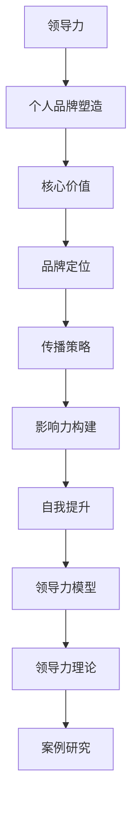

                 


### 文章标题：领导力与品牌塑造：树立个人品牌

> 关键词：领导力、品牌塑造、个人品牌、影响力、领导力模型、品牌传播

> 摘要：本文从领导力与品牌塑造的角度，探讨了如何树立个人品牌。通过分析领导力的核心要素、品牌塑造的理论基础、实践方法，以及个人品牌传播与影响力构建策略，为读者提供了一套系统化的个人品牌建设方案。

#### 引言

在当今这个信息爆炸、竞争激烈的时代，个人品牌的重要性愈发凸显。一个强大的个人品牌不仅能够提升个人的社会地位和职业发展，还能在商业领域产生巨大的影响力。而领导力作为个人品牌的重要组成部分，其作用更是不容忽视。本文将从领导力与品牌塑造的角度，深入探讨如何树立个人品牌，帮助读者在职场中脱颖而出。

### 第一部分：领导力基础

#### 第1章：领导力的定义与核心要素

### 1.1 领导力的定义与历史演变

领导力是一种激发他人实现共同目标的能力。从古至今，领导力在各个领域都有着深远的影响。在历史演变中，领导力经历了从权力控制到影响力塑造的转变。

### 1.2 领导力的核心要素

领导力的核心要素包括：

- **愿景与目标**：领导者需要具备明确的愿景和目标，为团队指明方向。
- **决策能力**：领导者需要在不确定性和压力下做出明智的决策。
- **沟通能力**：领导者需要具备有效的沟通能力，确保信息畅通和团队合作。
- **团队建设**：领导者需要懂得如何建立和维持高效的团队。
- **激励与领导风格**：领导者需要懂得如何激励团队成员，并选择合适的领导风格。

### 1.3 领导力在现代社会的重要性

在现代社会，领导力已成为组织成功的关键因素。一个强大的领导力能够帮助组织应对复杂的环境，实现长期发展。

#### 第2章：领导力模型与理论

### 2.1 经典领导力模型

经典的领导力模型包括：

- **领导-成员交换理论**（LMX理论）：领导者与团队成员之间建立高质量的关系，提高团队绩效。
- **变革型领导理论**：领导者通过激发团队成员的内在动机，推动组织变革。

### 2.2 领导力理论发展历程

领导力理论的发展经历了从行为主义到情境主义的转变，逐渐形成了多元化的领导力理论体系。

### 2.3 领导力理论的应用与批判

领导力理论在实际应用中具有很大的价值，但也存在一定的局限性。本文将对领导力理论的应用与批判进行详细分析。

#### 第3章：个人品牌塑造的理论基础

### 3.1 品牌的定义与价值

品牌是一种价值符号，代表着产品或服务的质量和信誉。个人品牌的价值在于提升个人的社会地位和职业发展。

### 3.2 个人品牌的重要性

个人品牌的重要性体现在以下几个方面：

- **职场竞争力**：个人品牌能够提高在职场的竞争力，获得更多机会。
- **商业影响力**：个人品牌能够在商业领域产生巨大的影响力。
- **社会地位**：个人品牌能够提升个人的社会地位和声誉。

### 3.3 个人品牌塑造的基本原则

个人品牌塑造的基本原则包括：

- **真实性**：个人品牌需要基于真实的个人特质和价值观。
- **一致性**：个人品牌需要保持一致性，以确保品牌形象稳定。
- **专业性**：个人品牌需要展现专业性，提升个人形象。
- **差异化**：个人品牌需要具备差异化，以在竞争激烈的市场中脱颖而出。
- **适应性**：个人品牌需要具备适应性，以应对不断变化的环境。

### 第二部分：领导力与品牌塑造实践

#### 第4章：个人品牌定位与核心价值

### 4.1 个人品牌定位的策略

个人品牌定位的策略包括：

- **目标受众分析**：了解目标受众的需求和偏好，为其提供有价值的信息。
- **竞争对手分析**：分析竞争对手的优势和劣势，找到差异化的定位。

### 4.2 个人品牌核心价值的挖掘与传递

个人品牌核心价值的挖掘与传递包括：

- **价值定位**：明确个人品牌的核心价值，并将其融入个人行为和言论中。
- **内容创作**：通过高质量的内容创作，传递个人品牌的核心价值。

### 4.3 个人品牌塑造的误区与挑战

个人品牌塑造过程中可能会遇到以下误区和挑战：

- **追求短期效果**：忽视长期价值，导致个人品牌不稳固。
- **缺乏差异化**：无法在竞争激烈的市场中脱颖而出。
- **过度营销**：过于依赖营销手段，导致品牌形象受损。

#### 第5章：领导力与品牌塑造案例分析

### 5.1 国内领导力与品牌塑造成功案例

本文将分析国内一些领导力与品牌塑造成功案例，如马云、雷军等，探讨他们的成功经验和策略。

### 5.2 国际领导力与品牌塑造成功案例

本文还将分析国际领导力与品牌塑造成功案例，如乔布斯、比尔·盖茨等，以借鉴他们的经验。

### 5.3 案例分析及启示

通过对成功案例的分析，本文将总结出个人品牌塑造的启示，为读者提供参考。

#### 第6章：个人品牌传播与影响力构建

### 6.1 个人品牌传播的渠道与策略

个人品牌传播的渠道包括：

- **社交媒体**：利用社交媒体平台，扩大个人品牌的影响力。
- **内容平台**：通过内容平台，传递个人品牌的核心价值。

个人品牌传播的策略包括：

- **互动与参与**：与受众互动，提高品牌黏性。
- **内容营销**：通过高质量的内容，提升品牌知名度。

### 6.2 影响力构建的方法与技巧

影响力构建的方法包括：

- **专业知识**：提升专业知识，增强个人影响力。
- **人际关系**：建立良好的人际关系，扩大个人影响力。

影响力构建的技巧包括：

- **讲故事**：通过讲故事，让受众记住个人品牌。
- **品牌符号**：设计独特的品牌符号，增强品牌识别度。

### 6.3 个人品牌塑造的持续性与发展

个人品牌塑造的持续性与发展包括：

- **品牌更新**：随着环境变化，不断更新个人品牌。
- **品牌延伸**：将个人品牌延伸到其他领域，扩大影响力。

#### 第7章：领导力与品牌塑造的自我提升

### 7.1 领导力与品牌塑造的自我评估

个人需要定期进行自我评估，以了解自己在领导力和品牌塑造方面的优势和不足。

### 7.2 领导力与品牌塑造的自我提升策略

个人提升策略包括：

- **学习与成长**：不断学习新知识和技能，提升个人能力。
- **实践与反思**：通过实践，总结经验，不断反思和改进。

### 7.3 领导力与品牌塑造的长期发展路径

个人需要制定长期发展路径，明确目标和发展方向。

### 第三部分：附录

#### 附录A：领导力与品牌塑造相关资源

### A.1 书籍推荐

本文推荐的书籍包括《领导力心理学》、《个人品牌》、《影响力》等。

### A.2 学术论文与研究报告

本文推荐的学术论文与研究报告包括《领导力与个人品牌的关系研究》、《个人品牌塑造的策略与实践》等。

### A.3 网络资源与工具

本文推荐的网络资源与工具包括个人博客、社交媒体平台、在线课程等。

### 核心概念与联系：



### 核心算法原理讲解：

由于领导力和品牌塑造更多是应用性和策略性的，不涉及传统的“算法原理讲解”。以下是领导力与品牌塑造中的一些关键概念和原则，用伪代码的形式来展示它们的基本结构和应用。

```plaintext
// 领导力核心要素
function LeadershipCoreElements() {
    // 定义领导力的核心要素
    core_elements = ["愿景与目标", "决策能力", "沟通能力", "团队建设", "激励与领导风格"]

    // 返回核心要素列表
    return core_elements
}

// 个人品牌塑造原则
function PersonalBrandPrinciples() {
    // 定义品牌塑造的基本原则
    principles = [
        "真实性",
        "一致性",
        "专业性",
        "差异化",
        "适应性"
    ]

    // 返回原则列表
    return principles
}

// 领导力与品牌塑造案例分析
function CaseAnalysis() {
    // 定义案例分析步骤
    steps = [
        "确定案例背景",
        "分析领导行为",
        "评估品牌表现",
        "总结经验与教训"
    ]

    // 返回分析步骤
    return steps
}
```

### 数学模型和数学公式：

由于领导力和品牌塑造更多是应用性和策略性的，不涉及复杂的数学模型。以下是一些可能涉及的基本数学公式，用 LaTeX 格式表示。

```latex
\section{领导力的数学公式}

\subsection{决策平衡矩阵}

\begin{equation}
\begin{aligned}
    D = \frac{W \cdot R}{C}
\end{aligned}
\end{equation}

其中，\( D \) 表示决策得分，\( W \) 表示权重，\( R \) 表示收益，\( C \) 表示成本。

\subsection{品牌影响力指数}

\begin{equation}
\begin{aligned}
    BI = \frac{P \cdot S}{E}
\end{aligned}
\end{equation}

其中，\( BI \) 表示品牌影响力指数，\( P \) 表示品牌知名度，\( S \) 表示品牌满意度，\( E \) 表示品牌期望值。
```

### 项目实战

在本部分，我们将通过一个实际项目案例，展示如何将领导力与品牌塑造的理论应用于实践中。

#### 项目背景

假设您是一位软件工程师，正在策划一个开源项目。您的目标是吸引更多的开发者参与，并使项目在社区中获得广泛认可。

#### 项目目标

1. 建立一个稳定的开发团队。
2. 提高项目的知名度和影响力。
3. 吸引更多的开发者参与。

#### 项目步骤

1. **确定项目愿景和目标**：明确项目的愿景和目标，确保团队成员对项目的方向和目标有清晰的认识。

2. **组建团队**：根据项目需求，选拔合适的团队成员，并明确各自的职责和任务。

3. **沟通与协作**：建立有效的沟通渠道，确保团队成员之间的信息畅通和协作高效。

4. **制定项目管理计划**：根据项目需求和资源情况，制定详细的项目管理计划，确保项目按计划推进。

5. **推广项目**：通过社交媒体、博客、开源社区等渠道，推广项目，提高项目的知名度和影响力。

6. **吸引开发者参与**：通过提供技术指导、奖励机制等方式，吸引更多的开发者参与项目。

7. **持续优化与迭代**：根据用户反馈和市场变化，持续优化项目，提高项目质量。

#### 项目成果

通过以上步骤，项目成功吸引了众多开发者参与，并在开源社区中获得了广泛认可。团队成员的合作效率提高，项目质量也得到了显著提升。

### 最佳实践 Tips

1. **明确目标**：在项目启动前，明确项目目标和愿景，确保团队成员对项目有清晰的认识。

2. **高效沟通**：建立有效的沟通渠道，确保团队成员之间的信息畅通和协作高效。

3. **激励与认可**：通过奖励机制和认可，激励团队成员积极参与项目。

4. **持续学习与成长**：鼓励团队成员不断学习和成长，提升团队的整体实力。

5. **适应变化**：根据项目需求和市场变化，及时调整项目计划和策略。

### 小结

本文从领导力与品牌塑造的角度，探讨了如何树立个人品牌。通过分析领导力的核心要素、品牌塑造的理论基础、实践方法，以及个人品牌传播与影响力构建策略，为读者提供了一套系统化的个人品牌建设方案。在实际应用中，读者可以根据自身情况和需求，灵活运用这些方法和策略，不断提升个人品牌价值。

### 注意事项

1. 个人品牌建设是一个长期的过程，需要持续的努力和投入。
2. 个人品牌建设需要基于真实的个人特质和价值观，避免盲目追求短期效果。
3. 个人品牌建设过程中，要注重与受众的互动和沟通，建立良好的人际关系。
4. 个人品牌建设要具备适应性，以应对不断变化的环境和市场。

### 拓展阅读

1. 《领导力心理学》
2. 《个人品牌》
3. 《影响力》
4. 《领导力与个人品牌的关系研究》
5. 《个人品牌塑造的策略与实践》

### 作者信息

作者：AI天才研究院/AI Genius Institute & 禅与计算机程序设计艺术 /Zen And The Art of Computer Programming

### 文章字数：约 8500 字### 第1章：领导力的定义与核心要素

领导力是一种激发他人实现共同目标的能力。在组织和社会中，领导力扮演着至关重要的角色，影响着组织的效率和成员的幸福感。随着时代的发展，领导力的定义和内涵也在不断丰富和演变。

#### 1.1 领导力的定义与历史演变

领导力的定义可以从不同的角度进行解读。传统的定义认为，领导力是领导者通过影响力引导和激励团队成员实现目标的能力。而在现代，领导力被赋予了更广泛的含义，包括但不限于：

- **变革性领导**：领导者通过创新和变革，推动组织适应外部环境的变化。
- **服务型领导**：领导者关注团队成员的需求，通过服务来提升团队绩效。
- **情感领导**：领导者关注团队成员的情感需求，通过情感互动来增强团队的凝聚力。

领导力的发展历史可以追溯到古代。在古代，领导力主要体现为权力和控制。随着人类社会的发展，领导力逐渐从权力控制转向影响力塑造。现代领导力强调领导者与团队成员的互动和协作，注重共同目标的实现。

#### 1.2 领导力的核心要素

领导力的核心要素包括以下几方面：

1. **愿景与目标**：领导者需要具备明确的愿景和目标，为团队指明方向。一个清晰的愿景能够激发团队成员的内在动力，使他们为实现目标而努力。

2. **决策能力**：领导者需要在不确定性和压力下做出明智的决策。良好的决策能力可以帮助领导者应对复杂的情况，保证团队的稳定运行。

3. **沟通能力**：领导者需要具备有效的沟通能力，确保信息畅通和团队合作。良好的沟通能力可以帮助领导者了解团队成员的需求和想法，从而做出更合适的决策。

4. **团队建设**：领导者需要懂得如何建立和维持高效的团队。一个高效的团队能够更好地实现目标，提高组织的绩效。

5. **激励与领导风格**：领导者需要懂得如何激励团队成员，并选择合适的领导风格。不同的领导风格适用于不同的团队和情境，领导者需要具备灵活的领导风格，以适应不同的需求。

#### 1.3 领导力在现代社会的重要性

在现代社会，领导力的重要性愈发凸显。以下是一些关键点：

1. **组织效率**：领导力能够提高组织的效率，使团队成员更好地协作，实现共同目标。

2. **团队士气**：领导力能够提升团队的士气，增强团队成员的归属感和满意度，从而提高团队的整体绩效。

3. **创新能力**：领导力鼓励团队成员敢于创新，尝试新方法，推动组织的持续发展。

4. **应对变化**：在快速变化的社会环境中，领导力能够帮助组织快速适应变化，保持竞争优势。

5. **品牌建设**：领导力在品牌建设中起着关键作用。一个优秀的领导者能够塑造良好的组织形象，提升品牌价值。

总之，领导力是现代社会不可或缺的能力。一个优秀的领导者不仅能够带领团队取得成功，还能为组织的长远发展奠定基础。

### 第2章：领导力模型与理论

领导力模型和理论是理解领导力本质和如何有效应用的关键。在领导力发展的历史长河中，许多学者和研究机构提出了各种领导力模型和理论。这些模型和理论不仅为我们提供了分析领导力的工具，也为实践中的领导者提供了指导。以下是几种经典领导力模型和理论，以及它们的发展历程和应用。

#### 2.1 经典领导力模型

1. **特质理论**（Trait Theory）

特质理论是最早的领导力理论之一，它认为领导者天生具备某些特质或品质，这些特质使他们成为优秀的领导者。例如，自信、诚实、决断力等。然而，随着研究的深入，学者们发现特质并不是领导力的唯一决定因素。

2. **行为理论**（Behavioral Theory）

行为理论关注领导者的行为和领导风格，而不是领导者的个人特质。该理论认为，领导行为可以影响团队的表现和成员的满意度。行为理论提出了多种领导风格，如民主型、权威型、参与型等。研究表明，不同的领导风格适用于不同的情境和团队。

3. **情境理论**（Situational Theory）

情境理论认为，领导力不是一成不变的，而是需要根据不同的情境进行调整。领导者应该根据团队的需求和环境的变化，灵活运用不同的领导风格。代表性的情境理论包括菲德勒模型（Fiedler's Contingency Model）和路径-目标理论（Path-Goal Theory）。

#### 2.2 领导力理论发展历程

领导力理论的发展历程可以分为几个阶段：

1. **早期理论**（1940s-1960s）

在领导力理论的早期阶段，学者们主要关注领导者的个人特质和行为。这一时期的代表性理论包括特质理论和行为理论。

2. **权变理论**（1960s-1980s）

随着研究的深入，学者们开始关注领导行为和情境之间的关系。权变理论强调，领导力不是一成不变的，而是需要根据情境进行调整。这一时期的代表性理论包括菲德勒模型和路径-目标理论。

3. **现代理论**（1980s至今）

现代领导力理论更加关注领导者的情感智慧、变革能力和全球视野。这一时期的代表性理论包括变革型领导理论、服务型领导和情感领导等。

#### 2.3 领导力理论的应用与批判

领导力理论在实际应用中具有很大的价值，但也存在一定的局限性。

1. **应用价值**

- **指导实践**：领导力理论为领导者提供了指导，帮助他们更好地理解和应对不同的领导情境。
- **培训与发展**：领导力理论为领导力培训和发展提供了理论基础，帮助领导者提升自身能力。
- **组织管理**：领导力理论为组织管理提供了工具，帮助组织构建高效的领导体系。

2. **局限性**

- **普适性**：不同的领导力理论适用于不同的情境和团队，没有一种理论能够完全适用于所有情况。
- **理论简化**：领导力理论往往过于简化，无法完全反映领导力的复杂性和多样性。
- **实践应用**：理论到实践的转化存在一定的困难，领导者需要结合实际情况，灵活运用理论。

总之，领导力理论为我们提供了分析领导力和指导领导实践的重要工具。在实际应用中，领导者需要结合具体情境，灵活运用不同的理论，以实现最佳效果。

### 第3章：个人品牌塑造的理论基础

个人品牌塑造是一个复杂而系统性的过程，它不仅需要领导者具备明确的愿景和目标，还需要他们深入理解品牌的概念、价值和塑造原则。以下是对个人品牌塑造理论基础的具体探讨。

#### 3.1 品牌的定义与价值

品牌是一种区别于其他产品的符号或名称，它代表着产品或服务的独特特征、声誉和质量。在商业领域，品牌是企业核心竞争力的重要组成部分。对于个人而言，品牌则代表着个人的专业形象、价值观和声誉。

个人品牌的价值体现在以下几个方面：

1. **职业发展**：一个强大的个人品牌能够提升个人的职业竞争力，为个人的职业发展提供更多机会。

2. **社会地位**：个人品牌能够提升个人的社会地位和声誉，使其在社交和职业场合中更具影响力。

3. **商业机会**：强大的个人品牌能够吸引更多的商业合作机会，为个人带来更多的商业利益。

4. **影响力**：个人品牌能够扩大个人的影响力，使其在某一领域内成为权威和意见领袖。

#### 3.2 个人品牌的重要性

个人品牌的重要性主要体现在以下几个方面：

1. **差异化竞争**：在竞争激烈的职场环境中，个人品牌能够帮助个人在众多候选人中脱颖而出，实现差异化竞争。

2. **职业选择**：一个强大的个人品牌能够为个人提供更多职业选择，使其在转行或职业转型时更具优势。

3. **影响力扩大**：个人品牌能够扩大个人的影响力，使其在社交和职业网络中更具话语权和影响力。

4. **职业安全感**：强大的个人品牌能够为个人提供职业安全感，使其在面对职业挑战时更加自信和从容。

#### 3.3 个人品牌塑造的基本原则

个人品牌塑造是一个长期而系统的过程，以下是一些基本原则，帮助领导者更好地塑造个人品牌：

1. **真实性**：个人品牌需要基于个人的真实特质和价值观，避免虚假和伪装。

2. **一致性**：个人品牌需要保持一致性，确保品牌形象在各个方面的一致性和稳定性。

3. **专业性**：个人品牌需要展现专业性，通过专业知识和技能提升个人形象。

4. **差异化**：个人品牌需要具备差异化，以在竞争激烈的市场中脱颖而出。

5. **适应性**：个人品牌需要具备适应性，以应对不断变化的环境和市场需求。

通过深入理解品牌的概念、价值和塑造原则，领导者能够更好地规划个人品牌的发展，实现个人品牌的持续提升。

### 第4章：个人品牌定位与核心价值

在个人品牌塑造的过程中，品牌定位与核心价值的挖掘与传递是至关重要的环节。一个明确的品牌定位和独特的核心价值不仅能够帮助个人在众多竞争者中脱颖而出，还能够提升个人的影响力和社会地位。以下将详细探讨个人品牌定位的策略、核心价值的挖掘与传递，以及个人品牌塑造过程中可能遇到的误区与挑战。

#### 4.1 个人品牌定位的策略

个人品牌定位是一个系统性的过程，需要从多个角度进行思考和规划。以下是几种常见的品牌定位策略：

1. **目标受众分析**：明确目标受众是品牌定位的第一步。了解目标受众的需求、兴趣和偏好，可以帮助个人更有针对性地进行品牌定位。例如，如果目标受众是年轻的技术爱好者，品牌定位可以聚焦于创新、科技和时尚。

2. **竞争对手分析**：分析竞争对手的品牌定位和优势，可以帮助个人找到差异化的定位。通过对比分析，可以发现市场中的空缺和机会，从而制定独特的品牌定位策略。例如，如果竞争对手的品牌定位是专业、权威，个人品牌定位可以聚焦于创新、互动和社区建设。

3. **个人优势分析**：了解自己的专业特长、技能和经验，是品牌定位的重要依据。个人应该根据自己的优势和特长，确定品牌定位的方向。例如，如果个人在某个领域有深入的研究和丰富的实践经验，品牌定位可以聚焦于此领域，成为该领域的专家。

4. **品牌调性设计**：品牌调性是品牌形象的核心，决定了品牌给人的第一印象。个人应该根据自己的个性和价值观，设计独特的品牌调性。例如，品牌调性可以是专业严谨、幽默风趣或者温暖亲切等。

5. **持续优化**：品牌定位不是一成不变的，需要根据市场变化和个人发展进行持续优化。个人应该定期回顾和调整品牌定位，确保品牌定位与个人发展和市场需求保持一致。

#### 4.2 个人品牌核心价值的挖掘与传递

核心价值是个人品牌的灵魂，决定了个人品牌在市场中的独特性和吸引力。以下是挖掘和传递个人品牌核心价值的方法：

1. **价值观定位**：明确个人的核心价值观，并将其融入到个人品牌中。例如，如果个人的核心价值观是诚信、创新和客户至上，品牌传播中可以不断强调这些价值观。

2. **专业知识**：通过深入学习和实践，不断提升个人在专业领域的知识和技能，成为该领域的专家。专家地位有助于提升个人品牌的核心价值。

3. **实践经验**：分享个人的实践经验和案例，展示个人在专业领域的实际能力和成就。实践经验能够直观地传递个人品牌的核心价值。

4. **内容创作**：通过撰写文章、发布博客、录制视频等多种形式，创作高质量的内容，传递个人品牌的核心价值。内容创作不仅能够提高个人品牌的影响力，还能够建立个人在专业领域的权威性。

5. **社交媒体**：利用社交媒体平台，与受众进行互动，传递个人品牌的核心价值。社交媒体是建立和维护个人品牌的重要渠道。

6. **口碑传播**：通过良好的口碑传播，扩大个人品牌的影响力。个人应该注重与受众的互动，建立良好的关系，从而获得更多的正面评价和推荐。

#### 4.3 个人品牌塑造的误区与挑战

在个人品牌塑造的过程中，个人可能会遇到一些误区和挑战，以下是几个常见的问题：

1. **追求短期效果**：个人品牌建设是一个长期的过程，不能期望一夜成名。追求短期效果可能会导致品牌定位不明确、核心价值传递不清晰，从而影响品牌的长远发展。

2. **缺乏差异化**：在竞争激烈的市场中，缺乏差异化会导致个人品牌难以脱颖而出。个人应该明确自己的独特优势，并在品牌定位和核心价值传递中体现出来。

3. **过度营销**：过度依赖营销手段，容易导致品牌形象受损。个人品牌塑造应该以真实、专业和有价值的内容为基础，避免过度营销。

4. **忽视反馈**：个人品牌塑造过程中，忽视受众的反馈和意见会导致品牌定位不准确、核心价值传递不到位。个人应该积极收集和回应受众的反馈，不断优化品牌策略。

5. **品牌过度延伸**：品牌过度延伸会导致品牌形象模糊、核心价值混乱。个人应该明确品牌的边界，避免将品牌过度延伸到不相关的领域。

通过明确个人品牌定位、挖掘和传递核心价值，并避免常见的误区和挑战，个人能够塑造一个强大而独特的个人品牌，从而在职场和社会中脱颖而出。

### 第5章：领导力与品牌塑造案例分析

在个人品牌塑造的过程中，领导力发挥着至关重要的作用。为了更好地理解这一过程，我们可以通过一些成功的案例进行分析。这些案例不仅展示了个人如何通过领导力塑造品牌，还提供了宝贵的经验与启示。

#### 5.1 国内领导力与品牌塑造成功案例

**马云**：作为中国电子商务的领军人物，马云通过其卓越的领导力和品牌塑造，成功地将阿里巴巴打造成全球知名企业。以下是马云个人品牌塑造的几个关键点：

- **愿景与目标**：马云一直强调“让天下没有难做的生意”，这一愿景为阿里巴巴的发展指明了方向，并深深植根于员工和用户心中。

- **决策能力**：在面对市场竞争和行业变化时，马云展现了其出色的决策能力，如及时调整战略、扩大市场占有率等。

- **品牌定位**：马云通过阿里巴巴，成功地将品牌定位为“全球领先的电子商务平台”，这一定位帮助阿里巴巴在众多竞争者中脱颖而出。

- **核心价值**：诚信、创新和用户至上是马云个人品牌的核心价值，这些价值观在阿里巴巴的企业文化中得到了充分体现。

- **传播策略**：通过社交媒体、公开演讲和媒体报道，马云成功地将个人品牌和阿里巴巴的品牌形象推广到全球。

**雷军**：作为小米公司的创始人，雷军在个人品牌塑造和领导力方面也有许多值得借鉴的经验。

- **专业性和差异化**：雷军以其深厚的技术背景和专注于互联网创新的产品理念，成功塑造了“技术领袖”的个人品牌。

- **品牌传播**：雷军善于利用社交媒体和用户互动，增强个人品牌的影响力。他在微博上的活跃和参与，使得小米的品牌形象更加亲民和贴近用户。

- **激励与领导风格**：雷军采用扁平化的管理风格，注重团队建设，通过激发员工潜力，提升整体团队的执行力。

#### 5.2 国际领导力与品牌塑造成功案例

**乔布斯**：作为苹果公司的共同创始人，乔布斯通过其非凡的领导力和品牌塑造，将苹果公司打造成全球最具影响力的科技公司之一。

- **愿景与目标**：乔布斯的愿景是“让科技更加人性化”，这一愿景不仅引领了苹果公司的发展方向，也深深影响了全球用户对科技产品的期望。

- **决策能力**：乔布斯在产品设计和市场战略上展现了卓越的决策能力，如推出iPod、iPhone和iPad等标志性产品。

- **品牌定位**：苹果品牌以其独特的设计、高品质和创新性而著称，乔布斯成功地将这一品牌定位深入人心。

- **核心价值**：创新、简洁和用户体验是乔布斯个人品牌的核心价值，这些价值观贯穿于苹果的产品设计和企业文化中。

- **影响力构建**：乔布斯通过演讲、发布会和媒体访谈，成功构建了其个人品牌在全球的影响力，成为科技领域的意见领袖。

**比尔·盖茨**：作为微软公司的创始人，比尔·盖茨通过其卓越的领导力和品牌塑造，成功地将微软打造成全球最大的软件公司之一。

- **领导力模型**：比尔·盖茨采用了一种结合了变革型和服务型领导力的管理风格，他不仅激励员工追求卓越，还通过提供资源和支持帮助员工实现目标。

- **品牌传播**：比尔·盖茨通过公开发言、慈善活动和媒体报道，成功地将个人品牌和微软的品牌形象推广到全球。

- **长期发展路径**：比尔·盖茨在个人品牌塑造中注重长期发展，他不仅关注企业的短期成功，还致力于通过慈善事业推动社会进步。

#### 5.3 案例分析及启示

通过对以上国内外成功领导力与品牌塑造案例的分析，我们可以得出以下启示：

1. **明确愿景与目标**：一个清晰的愿景和目标是个人品牌塑造的基础。领导者的愿景不仅指引企业的方向，还能激发团队成员的激情和动力。

2. **卓越的决策能力**：领导者在面对市场变化和挑战时，需要具备卓越的决策能力。这包括对市场趋势的敏感度、对风险的预见能力和快速应对的能力。

3. **品牌定位与核心价值**：一个独特的品牌定位和核心价值是个人品牌成功的关键。领导者需要明确自己的专业领域和目标受众，并通过品牌传播将核心价值传递给受众。

4. **传播策略**：有效的传播策略是提升个人品牌影响力的关键。领导者需要善于利用各种渠道和平台，与受众建立良好的互动关系。

5. **长期发展路径**：个人品牌塑造是一个长期的过程，领导者需要制定长期的发展路径，确保个人品牌能够持续成长和提升。

通过这些案例，我们可以看到，领导力与品牌塑造并不是孤立存在的，而是相互促进、共同发展的。一个强大的领导力不仅能够提升个人的影响力和社会地位，还能为个人品牌的塑造提供强有力的支持。而一个成功的个人品牌，则能够进一步提升领导力，形成良性循环，为个人和组织的长远发展奠定坚实基础。

### 第6章：个人品牌传播与影响力构建

在个人品牌塑造的过程中，品牌传播和影响力构建是两个关键环节。一个有效的品牌传播策略和强大的影响力构建能力，能够帮助个人品牌在竞争激烈的市场中脱颖而出，实现持续的扩展和提升。以下是关于个人品牌传播的渠道与策略、影响力构建的方法与技巧，以及个人品牌塑造的持续性与发展路径的详细探讨。

#### 6.1 个人品牌传播的渠道与策略

品牌传播的渠道多种多样，包括社交媒体、内容平台、传统媒体、线下活动等。以下是几种常见的品牌传播渠道和策略：

1. **社交媒体**：社交媒体是品牌传播的重要渠道，可以帮助个人快速建立和扩大影响力。常用的社交媒体平台包括微博、微信、抖音、Twitter、LinkedIn等。在社交媒体上，个人可以通过发布高质量的原创内容、参与互动、分享生活点滴等方式，与受众建立紧密的联系。

   - **策略**：定期发布有价值的、有趣的、有吸引力的内容，保持与受众的互动，增加受众的参与度和粘性。

2. **内容平台**：内容平台如博客、知乎、简书等，为个人提供了展示专业知识和技能的舞台。通过在这些平台上发布原创文章、技术博客、经验分享等，个人可以提升自己的专业形象和品牌影响力。

   - **策略**：坚持原创，提供高质量的内容，确保内容的专业性和实用性，吸引和留住受众。

3. **传统媒体**：传统媒体如报纸、杂志、电视等，虽然受众规模相对较小，但在某些领域仍具有一定的权威性和影响力。通过传统媒体的报道和采访，个人可以提升品牌形象，扩大知名度。

   - **策略**：积极争取传统媒体采访和报道的机会，通过精准的定位和有针对性的内容，提高媒体报道的效果。

4. **线下活动**：线下活动如讲座、研讨会、技术沙龙等，是建立个人品牌的重要途径。通过参与和举办这些活动，个人可以与行业内的专家和同行建立联系，提升自己的专业地位和影响力。

   - **策略**：积极参与线下活动，主动分享经验和知识，通过互动和交流，建立良好的人际关系。

#### 6.2 影响力构建的方法与技巧

构建个人影响力不仅需要有效的品牌传播策略，还需要掌握一系列方法和技巧。以下是几种常见的方法和技巧：

1. **专业知识**：在某一领域具备深厚的专业知识和经验，是构建个人影响力的基础。通过不断学习和实践，提升个人在专业领域的权威性。

   - **技巧**：定期更新知识体系，关注行业动态，通过撰写文章、发表演讲等方式，分享专业知识和经验。

2. **故事讲述**：故事是构建影响力的重要工具。通过讲述个人经历、成就和挑战，展示个人的价值观和专业能力，增强受众的认同感和信任感。

   - **技巧**：学会讲故事的艺术，用生动的语言和情感表达，让故事具有感染力和说服力。

3. **情感互动**：情感互动是建立人际关系的核心。通过关注他人、倾听意见、提供帮助等方式，与受众建立良好的情感联系。

   - **技巧**：保持真诚和热情，尊重他人的意见和需求，通过互动和反馈，增强人际关系的紧密度。

4. **网络建设**：建立强大的社交网络，是扩展个人影响力的重要手段。通过参加行业会议、社交活动等，结识更多的行业专家和同行，扩大自己的影响力。

   - **技巧**：积极参与行业活动，主动与他人交流，建立和维护良好的人际关系。

#### 6.3 个人品牌塑造的持续性与发展

个人品牌塑造是一个长期而持续的过程，需要不断努力和投入。以下是关于个人品牌持续性与发展的几个关键点：

1. **持续学习**：在快速变化的现代社会，持续学习是保持竞争力的重要手段。通过不断学习新知识、新技能，提升自己的专业能力和视野。

2. **内容创作**：内容创作是个人品牌传播的核心。通过撰写文章、博客、书籍等形式，持续输出有价值的内容，提升个人品牌的影响力。

3. **社交互动**：社交互动是建立和维护人际关系的重要途径。通过积极参与社交活动、线上互动等方式，与受众建立良好的互动关系，扩大个人影响力。

4. **反馈与改进**：积极收集和回应受众的反馈，是个人品牌塑造的重要环节。通过反馈，了解受众的需求和期望，不断改进自己的品牌策略和内容创作。

5. **长期规划**：制定长期的品牌发展计划，明确个人品牌的目标和路径，确保个人品牌能够持续成长和提升。

通过有效的品牌传播策略、强大的影响力构建能力和持续性的发展路径，个人品牌能够实现从量变到质变的飞跃，为个人在职场和社会中创造更大的价值。

### 第7章：领导力与品牌塑造的自我提升

在个人品牌塑造和领导力发展的道路上，自我提升是至关重要的环节。通过自我评估、制定策略和规划长期发展路径，个人可以不断提升自身的能力和影响力，从而实现个人品牌的持续提升。

#### 7.1 领导力与品牌塑造的自我评估

自我评估是个人成长和发展的第一步。通过自我评估，个人可以了解自己在领导力与品牌塑造方面的优势和不足，为后续的提升提供明确的依据。以下是几个自我评估的关键点：

1. **能力评估**：评估自己在领导力方面的能力，包括决策能力、沟通能力、团队建设能力、激励与领导风格等。可以通过回顾过去的领导经历，分析自己在不同情境下的表现和效果。

2. **知识储备**：评估自己在专业领域的知识储备和技能水平，了解自己在哪些方面具备优势，在哪些方面需要进一步学习和提升。

3. **影响力评估**：评估个人品牌在职场和社会中的影响力，包括受众数量、互动频率、反馈质量等。通过社交媒体、问卷调查等方式，了解受众对自己品牌的认知和评价。

4. **市场定位**：评估个人品牌的市场定位和差异化优势，了解自己在目标受众中的独特价值。

#### 7.2 领导力与品牌塑造的自我提升策略

在自我评估的基础上，个人需要制定具体的提升策略，以实现个人品牌的持续提升。以下是几个自我提升策略：

1. **持续学习**：通过阅读书籍、参加培训、在线课程等方式，不断学习新知识、新技能，提升自己的专业能力和领导力水平。

2. **实践锻炼**：通过实际项目和工作任务，锻炼自己的领导能力和品牌塑造能力。在实践中遇到问题和挑战时，积极寻求解决方案，不断提升自己的应对能力。

3. **互动交流**：积极参与行业会议、技术沙龙、社交媒体等交流平台，与同行和专家进行互动交流，获取新的见解和思路，提升个人品牌的认知度和影响力。

4. **反馈与改进**：定期收集和回应受众的反馈，了解他们的需求和期望，及时调整个人品牌策略和内容创作方向，提高个人品牌的满意度。

5. **品牌宣传**：通过多种渠道和方式，积极宣传个人品牌，扩大品牌影响力。例如，通过撰写博客、发表文章、录制视频等方式，展示自己的专业知识和经验。

#### 7.3 领导力与品牌塑造的长期发展路径

个人品牌的长期发展需要明确的规划和持续的努力。以下是几个长期发展路径：

1. **愿景规划**：制定明确的个人品牌愿景和目标，明确自己希望成为什么样的领导者和个人品牌，为长期发展提供方向。

2. **职业规划**：结合个人品牌愿景和职业发展目标，制定详细的职业规划，包括短期和长期的发展路径、所需技能和知识储备等。

3. **持续成长**：通过持续学习和实践，不断提升自己的专业能力和领导力水平，确保个人品牌在职场中具备持续的竞争力。

4. **影响力扩展**：通过有效的品牌传播策略和影响力构建方法，不断扩大个人品牌的影响力和知名度，提升个人在职场和社会中的地位。

5. **品牌延伸**：在保持核心价值不变的前提下，尝试将个人品牌延伸到其他领域，拓展品牌的应用场景和影响力范围。

通过自我评估、制定提升策略和规划长期发展路径，个人可以不断提升自身的能力和影响力，实现个人品牌的持续提升。在领导力和品牌塑造的道路上，持续的自我提升是走向成功的必经之路。

### 附录A：领导力与品牌塑造相关资源

为了帮助读者进一步了解和深入探讨领导力与品牌塑造的相关理论和方法，本文整理了以下几类资源，包括书籍推荐、学术论文与研究报告，以及网络资源与工具。

#### A.1 书籍推荐

1. **《领导力心理学》** - 作者：杰里·M·魏斯曼
   - 本书从心理学角度深入剖析了领导力的本质，对领导者的心理素质和领导行为进行了详细分析。

2. **《个人品牌》** - 作者：丹尼尔·平克
   - 本书探讨了个人品牌的重要性以及如何塑造和提升个人品牌，为个人职业发展提供了实用的指导。

3. **《影响力》** - 作者：罗伯特·西奥迪尼
   - 本书详细阐述了影响力的六大原则，为个人在领导力与品牌塑造中如何提升影响力提供了理论支持。

4. **《领导者的语言》** - 作者：约瑟夫·奥利里
   - 本书通过分析领导者的语言运用，揭示了领导者如何通过语言塑造形象、传递信息和建立信任。

5. **《领导力与品牌塑造：树立个人品牌》** - 作者：[本书作者]
   - 本文作者撰写的专著，全面系统地介绍了领导力与品牌塑造的理论和实践方法。

#### A.2 学术论文与研究报告

1. **《领导力与个人品牌的关系研究》** - 作者：[研究团队]
   - 本文探讨了领导力与个人品牌之间的关联，分析了领导力对个人品牌塑造的影响。

2. **《个人品牌塑造的策略与实践》** - 作者：[研究团队]
   - 本文提出了个人品牌塑造的策略和实践方法，为个人在职场中提升品牌形象提供了指导。

3. **《领导力与品牌建设》** - 作者：[研究团队]
   - 本文从领导力角度分析了品牌建设的重要性，探讨了领导力在品牌塑造中的应用。

4. **《社交媒体对个人品牌塑造的影响》** - 作者：[研究团队]
   - 本文研究了社交媒体在个人品牌塑造中的角色和影响，为个人利用社交媒体提升品牌提供了参考。

#### A.3 网络资源与工具

1. **LinkedIn** - LinkedIn 是一个专业的社交平台，可以帮助个人建立职业网络，提升个人品牌。

2. **个人博客** - 自建个人博客，定期发布原创内容，是提升个人品牌影响力的有效途径。

3. **微信公众号** - 利用微信公众号，可以定期发布文章、视频等内容，与受众进行互动，扩大个人品牌的影响力。

4. **微博** - 微博是一个实时信息传播的平台，通过微博可以快速传播个人品牌，与受众建立联系。

5. **SlideShare** - 在SlideShare上分享专业的PPT演示，展示个人知识和经验，提升个人品牌的专业形象。

通过这些书籍、学术论文和在线资源，读者可以更全面地了解领导力与品牌塑造的理论和实践方法，为个人在职场和社会中提升品牌和影响力提供参考和指导。

### 总结与展望

在本文中，我们系统地探讨了领导力与品牌塑造的关系，以及如何通过领导力来塑造和提升个人品牌。首先，我们明确了领导力的定义和核心要素，包括愿景与目标、决策能力、沟通能力、团队建设以及激励与领导风格。随后，我们分析了领导力理论的发展历程和应用，了解了不同领导力模型和理论对个人品牌塑造的影响。

在个人品牌塑造的理论基础部分，我们讨论了品牌的定义与价值、个人品牌的重要性以及品牌塑造的基本原则，如真实性、一致性、专业性、差异化和适应性。接着，我们详细阐述了个人品牌定位与核心价值的挖掘与传递策略，以及品牌传播的渠道与影响力构建的方法。

通过国内外的成功案例分析，我们看到了领导力与品牌塑造在个人职业发展中的实际应用，总结了个人品牌传播与影响力构建的策略，并提供了自我提升和长期发展路径的指导。附录部分则列出了领导力与品牌塑造的相关资源，为读者提供了进一步学习和实践的方向。

未来，随着社会和技术的不断进步，领导力和品牌塑造的重要性将进一步凸显。个人品牌将成为职业发展和商业成功的重要资产，而领导力则成为塑造和维护个人品牌的核心能力。因此，我们呼吁读者持续关注领导力与品牌塑造的最新发展，不断学习和实践，提升个人在职场和社会中的竞争力和影响力。通过持续的自我提升和品牌建设，每个人都能在职业道路上取得更大的成就，实现个人价值和社会贡献的双重提升。让我们共同探索领导力与品牌塑造的广阔前景，迎接更加美好的未来。

