                 

# 《领导力与品牌建设：提升团队影响力》

关键词：领导力，品牌建设，团队影响力，沟通技巧，决策能力，品牌价值

摘要：本文将深入探讨领导力与品牌建设之间的紧密联系，以及如何通过提升团队影响力来增强组织的竞争力。文章分为三个主要部分，首先阐述领导力的基础，包括定义、重要性、领导风格和核心能力；其次介绍品牌建设的基础知识、策略和管理；最后讨论领导力与品牌建设的关系，以及如何通过具体策略提升团队影响力。文章旨在为IT领域的技术专家和管理者提供实用的指导和建议。

## 目录

### 《领导力与品牌建设：提升团队影响力》目录大纲

# 第一部分：领导力基础

## 第1章：领导力概述

### 1.1 领导力的定义与重要性

领导力是一种影响他人共同实现目标的能力。在组织中，领导力至关重要，它能够激发团队的潜力，推动创新，提高工作效率。有效的领导力不仅能够提升个人和团队的表现，还能增强组织的整体竞争力。

#### 背景介绍

领导力作为一种关键管理技能，已经在过去几十年中引起了广泛关注。随着组织结构的复杂化和全球化，领导力的重要性愈加凸显。有效的领导力能够帮助组织应对变化，保持竞争优势，实现可持续发展。

#### 核心概念与联系

领导力与团队动力、个人发展、组织文化等概念密切相关。一个优秀的领导者不仅能够引导团队，还能够激发团队成员的潜力，促进个人成长。同时，领导力也是组织文化的重要组成部分，它能够塑造组织氛围，影响员工的态度和行为。

**Mermaid 流�程图：**

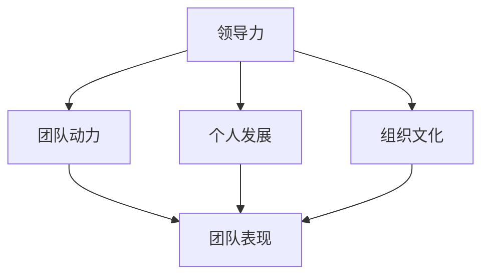

#### 核心算法原理讲解

领导力的核心算法可以看作是一个多变量函数，其输入包括领导风格、团队成员的能力、外部环境等，输出则是团队的绩效和满意度。这个函数可以用以下伪代码表示：

```python
def leadership_function(style, team_ability, environment):
    # 定义领导风格权重
    style_weights = {
        'autocratic': 0.3,
        'democratic': 0.4,
        'laissez-faire': 0.3
    }
    
    # 根据领导风格计算领导力得分
    leadership_score = style_weights[style] * team_ability * (1 + environment_factor)
    
    # 返回领导力得分
    return leadership_score
```

#### 数学模型和数学公式

领导力模型可以使用以下数学模型来表示：

$$
L = f(S, A, E)
$$

其中，$L$ 表示领导力得分，$S$ 表示领导风格，$A$ 表示团队成员的能力，$E$ 表示外部环境。这个模型说明了领导力是领导风格、团队成员能力和外部环境的函数。

#### 举例说明

假设一个团队采用民主式领导风格，团队成员的能力较高，且处于一个支持创新的外部环境，那么该团队的领导力得分将较高。

#### 项目实战

在一个高科技公司中，新上任的CEO意识到领导力对于团队创新的重要性。他首先对公司现有的领导风格进行了评估，然后引入了民主式领导风格，同时提供培训，提升团队成员的能力。在外部环境方面，CEO积极争取政府支持，为企业创造一个有利的发展环境。经过一系列措施，公司的创新能力和团队绩效显著提升。

#### 最佳实践 tips

- **持续学习**：领导者应不断学习新的管理理念和技术，保持自身的竞争力。
- **关注团队成员**：领导者应关注团队成员的需求，提供成长机会，提升团队凝聚力。
- **积极应对外部环境**：领导者应积极应对外部环境变化，把握发展机遇。

#### 小结

领导力是组织成功的关键因素。通过理解领导力的定义、重要性以及核心概念，领导者可以更好地提升自己的能力，推动团队和组织的发展。

## 第2章：领导风格与团队动力

### 2.1 领导风格理论

领导风格是指领导者在与团队成员互动时采用的方式和方法。不同的领导风格会对团队产生不同的影响。了解并掌握不同的领导风格理论，对于领导者来说至关重要。

#### 背景介绍

领导风格理论的发展可以追溯到20世纪早期，经过多年的研究和实践，形成了多种理论。常见的领导风格理论包括独裁式、民主式和放任式等。

#### 核心概念与联系

领导风格理论的核心概念包括领导者的行为、团队成员的反应以及团队绩效。这些概念相互关联，共同决定了领导风格的效果。

**Mermaid 流程图：**

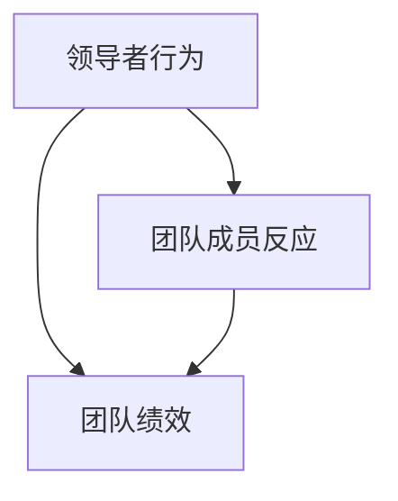

#### 核心算法原理讲解

领导风格算法可以看作是一个多输入多输出的系统，其输入包括领导者的行为、团队成员的反应和外部环境，输出则是团队的绩效和满意度。这个算法可以用以下伪代码表示：

```python
def leadership_style_algorithm(behavior, team_reaction, environment):
    # 定义领导风格效果权重
    style_effects = {
        'autocratic': {'performance': 0.8, 'satisfaction': 0.5},
        'democratic': {'performance': 0.9, 'satisfaction': 0.7},
        'laissez-faire': {'performance': 0.6, 'satisfaction': 0.3}
    }
    
    # 根据领导风格计算效果
    performance = style_effects[behavior]['performance'] * (1 + environment_factor)
    satisfaction = style_effects[behavior]['satisfaction'] * (1 + team_reaction_factor)
    
    # 返回团队绩效和满意度
    return performance, satisfaction
```

#### 数学模型和数学公式

领导风格模型可以使用以下数学模型来表示：

$$
\text{Effect} = f(\text{Style}, \text{Reaction}, \text{Environment})
$$

其中，$\text{Effect}$ 表示领导风格的效果，$\text{Style}$ 表示领导风格，$\text{Reaction}$ 表示团队成员的反应，$\text{Environment}$ 表示外部环境。这个模型说明了领导风格的效果是领导风格、团队成员反应和外部环境的函数。

#### 举例说明

假设一个团队采用民主式领导风格，团队成员对领导者的行为反应积极，且外部环境支持创新，那么该团队的绩效和满意度将较高。

#### 项目实战

在一个创业公司中，CEO意识到独裁式领导风格已经无法满足公司快速发展的需求。他决定转型为民主式领导风格，通过定期召开团队会议，听取团队成员的意见和建议，激发团队的创造力。同时，CEO还提供培训，提升团队成员的技能和自信心。经过一段时间的实践，公司的创新能力和团队绩效显著提升。

#### 最佳实践 tips

- **了解团队成员**：领导者应了解团队成员的兴趣、能力和需求，采用合适的领导风格。
- **灵活调整**：领导者应根据团队和环境的变化，灵活调整领导风格。
- **培养下属**：领导者应培养下属的领导能力，为团队注入新的活力。

#### 小结

领导风格是影响团队动力的重要因素。通过了解不同领导风格的理论和实践，领导者可以更好地选择合适的领导风格，提升团队动力和绩效。

## 第3章：领导力的核心能力

### 3.1 沟通技巧

沟通技巧是领导者必备的核心能力之一。有效的沟通能够促进团队协作，提高工作效率，减少误解和冲突。领导者的沟通技巧包括表达清晰、倾听和理解他人、非语言沟通等方面。

#### 背景介绍

在快速变化的信息时代，沟通变得尤为重要。领导者不仅需要表达自己的想法，还需要理解团队成员的需求和意见，建立良好的沟通渠道。

#### 核心概念与联系

沟通技巧的核心概念包括信息传递、反馈、倾听和建立信任。这些概念相互关联，共同决定了沟通的效果。

**Mermaid 流程图：**

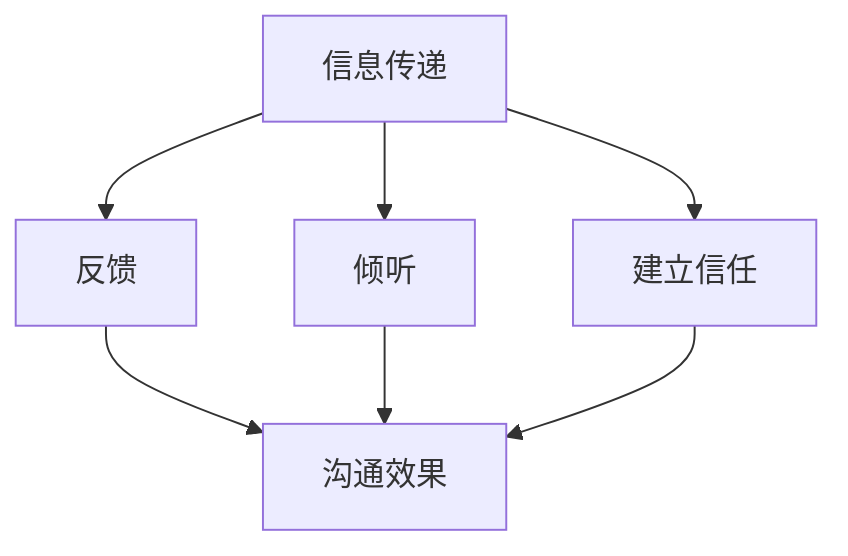

#### 核心算法原理讲解

沟通技巧算法可以看作是一个多输入多输出的系统，其输入包括信息、反馈、倾听和建立信任，输出则是沟通效果。这个算法可以用以下伪代码表示：

```python
def communication_algorithm(information, feedback, listening, trust):
    # 定义沟通效果权重
    effect_weights = {
        'information': 0.5,
        'feedback': 0.3,
        'listening': 0.2,
        'trust': 0.2
    }
    
    # 计算沟通效果
    effect = (effect_weights['information'] * information +
              effect_weights['feedback'] * feedback +
              effect_weights['listening'] * listening +
              effect_weights['trust'] * trust)
    
    # 返回沟通效果
    return effect
```

#### 数学模型和数学公式

沟通技巧模型可以使用以下数学模型来表示：

$$
\text{Effect} = w_1 \cdot \text{Information} + w_2 \cdot \text{Feedback} + w_3 \cdot \text{Listening} + w_4 \cdot \text{Trust}
$$

其中，$w_1, w_2, w_3, w_4$ 分别是信息、反馈、倾听和建立信任的权重。这个模型说明了沟通效果是这些因素的线性组合。

#### 举例说明

假设一个团队领导在沟通时，信息传递清晰、反馈及时、倾听认真、建立信任，那么该团队的沟通效果将较好。

#### 项目实战

在一个跨国公司中，项目经理意识到沟通对于项目成功至关重要。他通过定期召开团队会议，确保信息传递的清晰和及时，鼓励团队成员提出反馈，倾听他们的意见，并努力建立团队成员之间的信任。这些措施显著提高了项目的沟通效果，项目进展顺利，团队凝聚力增强。

#### 最佳实践 tips

- **清晰表达**：领导者应确保自己的表达清晰、准确，避免使用模糊的术语。
- **积极倾听**：领导者应积极倾听他人的意见，给予充分的关注和尊重。
- **建立信任**：领导者应通过行动建立团队成员之间的信任，为团队创造一个良好的沟通氛围。

#### 小结

沟通技巧是领导者的重要能力之一。通过掌握有效的沟通技巧，领导者可以提升团队协作效率，减少冲突，增强团队凝聚力。

## 第4章：品牌建设的基础知识

### 4.1 品牌的定义与价值

品牌是组织在市场中独特的识别标志，它代表着组织的价值观、使命和承诺。品牌不仅是一种商业标识，更是消费者对组织产品和服务的认知和情感连接。

#### 背景介绍

品牌的概念可以追溯到20世纪初期，随着市场经济的快速发展，品牌逐渐成为企业竞争的重要资产。有效的品牌建设能够提升企业的市场地位，增加消费者忠诚度，提高销售额。

#### 核心概念与联系

品牌的核心概念包括品牌识别、品牌价值、品牌定位和品牌传播。这些概念相互关联，共同决定了品牌的竞争力。

**Mermaid 流程图：**

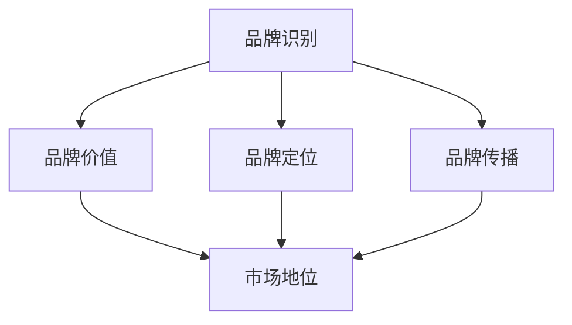

#### 核心算法原理讲解

品牌价值算法可以看作是一个多变量函数，其输入包括品牌识别、品牌定位、品牌传播和市场环境，输出则是品牌的市场价值。这个函数可以用以下伪代码表示：

```python
def brand_value_algorithm(brand_recognition, brand_positioning, brand_communication, market_environment):
    # 定义品牌价值权重
    value_weights = {
        'recognition': 0.4,
        'positioning': 0.3,
        'communication': 0.2,
        'environment': 0.1
    }
    
    # 根据品牌因素计算品牌价值
    brand_value = (value_weights['recognition'] * brand_recognition +
                   value_weights['positioning'] * brand_positioning +
                   value_weights['communication'] * brand_communication +
                   value_weights['environment'] * market_environment)
    
    # 返回品牌价值
    return brand_value
```

#### 数学模型和数学公式

品牌价值模型可以使用以下数学模型来表示：

$$
\text{Brand Value} = w_1 \cdot \text{Recognition} + w_2 \cdot \text{Positioning} + w_3 \cdot \text{Communication} + w_4 \cdot \text{Environment}
$$

其中，$w_1, w_2, w_3, w_4$ 分别是品牌识别、品牌定位、品牌传播和市场环境的权重。这个模型说明了品牌价值是这些因素的线性组合。

#### 举例说明

假设一个品牌的品牌识别度高、品牌定位准确、品牌传播广泛且市场环境有利，那么该品牌的市场价值将较高。

#### 项目实战

在一个新兴科技公司中，CEO意识到品牌建设对于公司发展的重要性。他首先明确了公司的品牌识别，即创新、科技和可靠，然后通过精准的品牌定位和有效的品牌传播，提升了品牌的市场价值。这些措施帮助公司在市场中建立了良好的声誉，吸引了大量客户和合作伙伴。

#### 最佳实践 tips

- **明确品牌识别**：领导者应明确品牌的核心价值和独特优势，确保品牌识别的一致性。
- **精准品牌定位**：领导者应根据目标市场的需求，为品牌定位，确保品牌在消费者心中的位置。
- **持续品牌传播**：领导者应持续进行品牌传播，通过各种渠道提升品牌的知名度和认可度。

#### 小结

品牌是组织的重要资产，有效的品牌建设能够提升组织的市场地位和竞争力。通过理解品牌的定义和价值，领导者可以更好地进行品牌建设，为组织创造更大的价值。

## 第5章：品牌策略制定与实施

### 5.1 品牌战略规划

品牌战略规划是品牌建设的核心环节，它涉及品牌愿景、目标、定位和行动计划。一个有效的品牌战略规划能够为组织提供明确的方向，确保品牌建设与组织的整体战略相一致。

#### 背景介绍

随着市场竞争的加剧，品牌战略规划变得越来越重要。一个清晰的品牌战略能够帮助组织在市场中脱颖而出，建立强大的品牌影响力。

#### 核心概念与联系

品牌战略规划的核心概念包括品牌愿景、目标、定位和行动计划。这些概念相互关联，共同决定了品牌战略的有效性。

**Mermaid 流程图：**

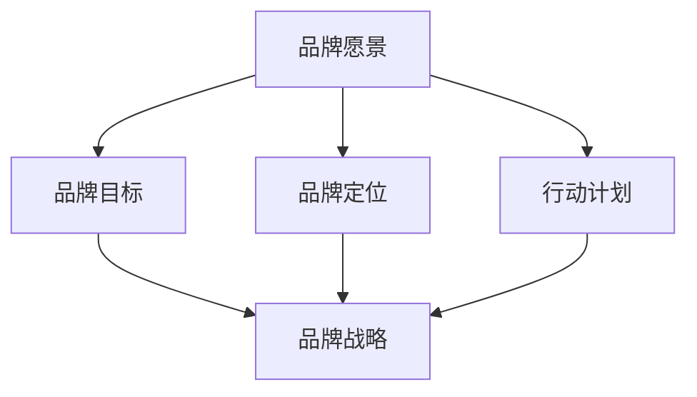

#### 核心算法原理讲解

品牌战略规划算法可以看作是一个多输入多输出的系统，其输入包括品牌愿景、目标、定位和行动计划，输出则是品牌战略和实施效果。这个算法可以用以下伪代码表示：

```python
def brand_strategy_algorithm(brand_vision, brand_goals, brand_positioning, action_plan):
    # 定义品牌战略权重
    strategy_weights = {
        'vision': 0.4,
        'goals': 0.3,
        'positioning': 0.2,
        'plan': 0.1
    }
    
    # 根据品牌因素计算品牌战略
    brand_strategy = (strategy_weights['vision'] * brand_vision +
                      strategy_weights['goals'] * brand_goals +
                      strategy_weights['positioning'] * brand_positioning +
                      strategy_weights['plan'] * action_plan)
    
    # 返回品牌战略
    return brand_strategy
```

#### 数学模型和数学公式

品牌战略模型可以使用以下数学模型来表示：

$$
\text{Brand Strategy} = w_1 \cdot \text{Vision} + w_2 \cdot \text{Goals} + w_3 \cdot \text{Positioning} + w_4 \cdot \text{Plan}
$$

其中，$w_1, w_2, w_3, w_4$ 分别是品牌愿景、目标、定位和行动计划的权重。这个模型说明了品牌战略是这些因素的线性组合。

#### 举例说明

假设一个品牌的愿景是成为行业领导者，目标是在三年内市场份额达到20%，定位是高端市场，行动计划包括品牌推广、产品创新和客户服务提升，那么该品牌战略将较为明确和有效。

#### 项目实战

在一个快速发展的科技公司中，CEO意识到品牌战略规划的重要性。他首先明确了公司的品牌愿景，即成为全球领先的科技企业，然后制定了具体的目标、定位和行动计划。通过一系列措施，公司的品牌影响力显著提升，市场份额逐年增加。

#### 最佳实践 tips

- **明确品牌愿景**：领导者应明确品牌的长远目标和愿景，确保品牌战略与组织的整体战略相一致。
- **制定具体目标**：领导者应制定具体的品牌目标，确保品牌建设有明确的方向和衡量标准。
- **定位准确**：领导者应根据目标市场的特点，为品牌定位，确保品牌在消费者心中的独特性。
- **行动计划详细**：领导者应制定详细的行动计划，确保品牌战略的实施有具体的操作步骤。

#### 小结

品牌战略规划是品牌建设的关键环节，通过理解品牌战略的核心概念和算法，领导者可以更好地制定和实施品牌战略，提升品牌的市场竞争力和影响力。

## 第6章：品牌管理与维护

### 6.1 品牌资产评估

品牌资产评估是品牌管理的重要环节，它涉及对品牌价值、品牌影响力、品牌忠诚度等多方面因素的评估。一个准确的品牌资产评估能够帮助组织了解品牌的现状，为品牌管理提供科学依据。

#### 背景介绍

随着市场竞争的加剧，品牌资产评估变得越来越重要。一个健康的品牌资产不仅能够提升组织的市场地位，还能够为组织带来持续的商业价值。

#### 核心概念与联系

品牌资产评估的核心概念包括品牌价值、品牌影响力、品牌忠诚度等。这些概念相互关联，共同决定了品牌资产的质量。

**Mermaid 流程图：**

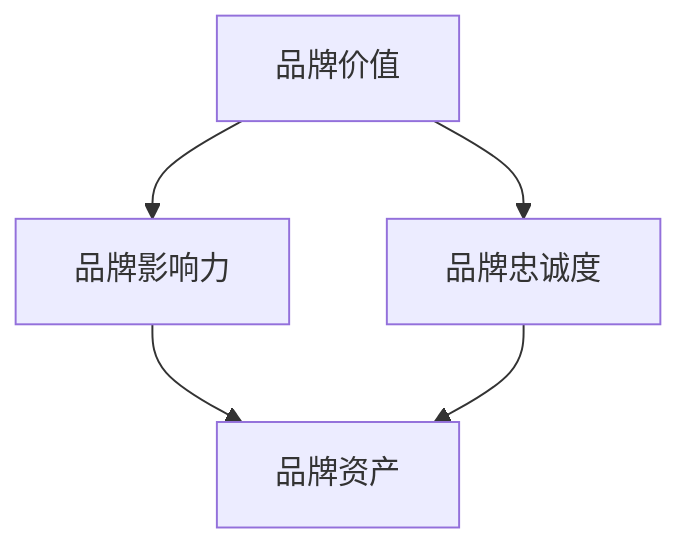

#### 核心算法原理讲解

品牌资产评估算法可以看作是一个多输入多输出的系统，其输入包括品牌价值、品牌影响力和品牌忠诚度，输出则是品牌资产的评估结果。这个算法可以用以下伪代码表示：

```python
def brand_asset_evaluation(brand_value, brand_influence, brand_loyalty):
    # 定义评估权重
    evaluation_weights = {
        'value': 0.5,
        'influence': 0.3,
        'loyalty': 0.2
    }
    
    # 计算品牌资产评估结果
    asset_evaluation = (evaluation_weights['value'] * brand_value +
                        evaluation_weights['influence'] * brand_influence +
                        evaluation_weights['loyalty'] * brand_loyalty)
    
    # 返回品牌资产评估结果
    return asset_evaluation
```

#### 数学模型和数学公式

品牌资产评估模型可以使用以下数学模型来表示：

$$
\text{Asset Evaluation} = w_1 \cdot \text{Brand Value} + w_2 \cdot \text{Brand Influence} + w_3 \cdot \text{Brand Loyalty}
$$

其中，$w_1, w_2, w_3$ 分别是品牌价值、品牌影响力和品牌忠诚度的权重。这个模型说明了品牌资产评估结果是这些因素的线性组合。

#### 举例说明

假设一个品牌的价值为1000万元，影响力较强，忠诚度较高，那么该品牌资产评估结果将较高。

#### 项目实战

在一个知名消费品牌中，品牌经理意识到品牌资产评估的重要性。他通过市场调研和数据分析，对品牌价值、影响力和忠诚度进行了详细评估。根据评估结果，品牌经理制定了针对性的品牌管理策略，有效提升了品牌的市场地位和商业价值。

#### 最佳实践 tips

- **定期评估**：领导者应定期对品牌资产进行评估，了解品牌的变化和趋势。
- **数据驱动**：领导者应采用数据驱动的方法，对品牌资产进行量化评估。
- **持续优化**：领导者应根据评估结果，持续优化品牌管理和营销策略。

#### 小结

品牌资产评估是品牌管理的重要环节，通过理解品牌资产评估的核心概念和算法，领导者可以更好地评估品牌资产，制定有效的品牌管理策略，提升品牌的竞争力。

## 第7章：领导力与品牌建设的关系

### 7.1 领导力对品牌建设的影响

领导力在品牌建设过程中起着至关重要的作用。有效的领导力不仅能够塑造组织的品牌形象，还能够推动品牌战略的实施，提升品牌价值。

#### 背景介绍

在全球化背景下，品牌建设已成为企业竞争的重要手段。一个成功的品牌不仅需要市场策略和品牌传播，更需要强有力的领导力来推动。

#### 核心概念与联系

领导力对品牌建设的影响可以从以下几个方面体现：

1. **品牌战略规划**：领导力在品牌战略规划中发挥着关键作用，领导者需要明确品牌愿景、目标和定位，制定切实可行的品牌战略。
2. **品牌文化传播**：领导力能够塑造组织文化，影响品牌价值观的传播，形成独特的品牌形象。
3. **品牌资产评估**：领导力在品牌资产评估中起到指导作用，领导者需要通过评估来优化品牌管理，提升品牌价值。

**Mermaid 流程图：**

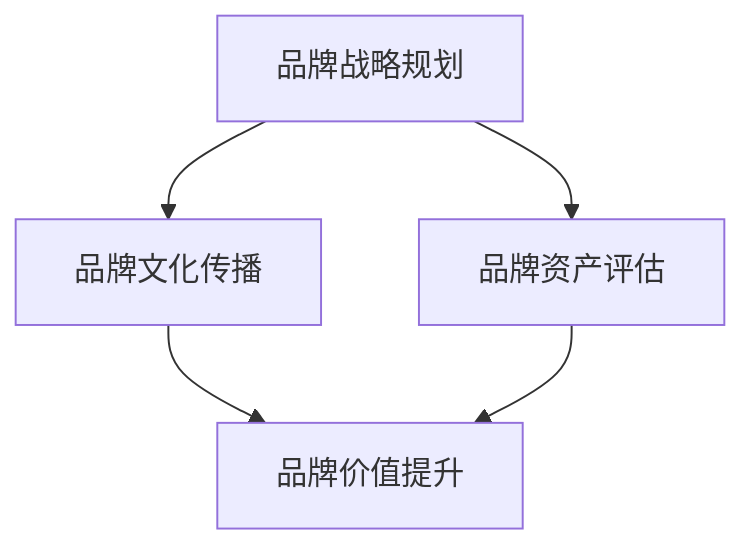

#### 核心算法原理讲解

领导力对品牌建设的影响可以用以下算法来表示：

```python
def leadership_brand_impact(strategy, culture, assessment):
    # 定义领导力影响权重
    impact_weights = {
        'strategy': 0.4,
        'culture': 0.3,
        'assessment': 0.3
    }
    
    # 计算领导力对品牌建设的影响
    impact = (impact_weights['strategy'] * strategy +
              impact_weights['culture'] * culture +
              impact_weights['assessment'] * assessment)
    
    # 返回领导力对品牌建设的影响
    return impact
```

#### 数学模型和数学公式

领导力对品牌建设的影响模型可以使用以下数学模型来表示：

$$
\text{Impact} = w_1 \cdot \text{Strategy} + w_2 \cdot \text{Culture} + w_3 \cdot \text{Assessment}
$$

其中，$w_1, w_2, w_3$ 分别是品牌战略、品牌文化和品牌资产评估的权重。这个模型说明了领导力对品牌建设的影响是这些因素的线性组合。

#### 举例说明

假设一个品牌在战略规划、文化建设和资产评估方面都表现出色，那么领导力对品牌建设的影响将显著。

#### 项目实战

在一个跨国科技公司中，CEO通过明确品牌愿景、构建积极的文化和科学的资产评估，显著提升了品牌的市场地位和价值。在他的领导下，公司的品牌影响力不断扩大，市场份额稳步提升。

#### 最佳实践 tips

- **强化战略规划**：领导者应注重品牌战略的制定和实施，确保品牌建设有明确的方向。
- **塑造积极文化**：领导者应塑造积极向上的组织文化，增强品牌的文化认同感。
- **科学资产评估**：领导者应定期对品牌资产进行评估，确保品牌管理科学有效。

#### 小结

领导力在品牌建设中具有不可替代的作用。通过理解领导力对品牌建设的影响，领导者可以更好地推动品牌战略的实施，提升品牌价值。

### 7.2 品牌建设对领导力的促进作用

品牌建设不仅能够提升组织的市场地位和价值，还能够对领导力产生积极的促进作用。一个成功的品牌能够为领导者提供有力的支持和资源，增强领导力的影响力和有效性。

#### 背景介绍

随着品牌建设的不断发展，品牌已成为组织中不可或缺的一部分。一个成功的品牌不仅能够提升组织的形象，还能够为领导者提供更多的机会和资源，从而增强领导力。

#### 核心概念与联系

品牌建设对领导力的促进作用主要体现在以下几个方面：

1. **增强领导影响力**：成功的品牌能够增强领导者的公信力和影响力，提高领导者在组织内外部的认可度。
2. **提供战略资源**：品牌建设能够为领导者提供更多的战略资源，如资金、人力和市场支持，帮助领导者更好地实现组织目标。
3. **提升领导力素质**：品牌建设要求领导者具备更高的战略思维、创新能力和团队协作能力，从而提升领导力的整体素质。

**Mermaid 流程图：**

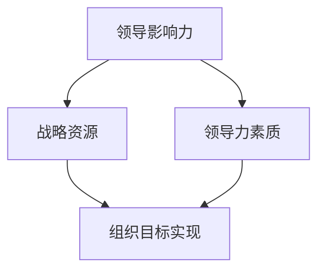

#### 核心算法原理讲解

品牌建设对领导力的促进作用可以用以下算法来表示：

```python
def brand_leadership促进作用(impact, resources, quality):
    # 定义促进作用权重
    promotion_weights = {
        'impact': 0.4,
        'resources': 0.3,
        'quality': 0.3
    }
    
    # 计算品牌建设对领导力的促进作用
    promotion = (promotion_weights['impact'] * impact +
                 promotion_weights['resources'] * resources +
                 promotion_weights['quality'] * quality)
    
    # 返回品牌建设对领导力的促进作用
    return promotion
```

#### 数学模型和数学公式

品牌建设对领导力的促进作用模型可以使用以下数学模型来表示：

$$
\text{Promotion} = w_1 \cdot \text{Impact} + w_2 \cdot \text{Resources} + w_3 \cdot \text{Quality}
$$

其中，$w_1, w_2, w_3$ 分别是领导影响力、战略资源和领导力素质的权重。这个模型说明了品牌建设对领导力的促进作用是这些因素的线性组合。

#### 举例说明

假设一个品牌在增强领导影响力、提供战略资源和提升领导力素质方面都表现出色，那么品牌建设对领导力的促进作用将显著。

#### 项目实战

在一个创新型科技公司中，成功的品牌建设不仅提升了公司的市场地位和价值，还显著增强了CEO的领导影响力。CEO利用品牌提供的资源，带领团队不断创新，取得了多项重要成果。

#### 最佳实践 tips

- **强化品牌意识**：领导者应注重品牌意识培养，确保品牌建设与组织的整体战略相一致。
- **利用品牌资源**：领导者应充分利用品牌资源，提升组织的目标实现能力。
- **提升领导力素质**：领导者应不断提升自身的领导力素质，适应品牌建设的要求。

#### 小结

品牌建设对领导力具有显著的促进作用。通过理解品牌建设对领导力的影响，领导者可以更好地利用品牌资源，提升自身的领导力，推动组织的发展。

### 7.3 领导力与品牌建设的协同效应

领导力与品牌建设之间存在着密切的协同效应。通过有效的领导力，品牌建设能够得到更好的推动，而成功的品牌建设也能够为领导力提供更广阔的发展空间。这种协同效应在组织中发挥着关键作用，能够显著提升组织的整体竞争力。

#### 背景介绍

在当前复杂多变的市场环境中，领导力与品牌建设的协同效应越来越受到重视。有效的协同效应能够帮助组织在竞争中脱颖而出，实现持续发展。

#### 核心概念与联系

领导力与品牌建设的协同效应主要体现在以下几个方面：

1. **战略协同**：领导力与品牌建设在战略层面协同，共同确定组织的发展方向和目标。
2. **文化协同**：领导力与品牌建设在组织文化层面协同，塑造积极向上的品牌形象和价值观。
3. **资源协同**：领导力与品牌建设在资源层面协同，充分利用品牌资源，提升组织的竞争力。
4. **效果协同**：领导力与品牌建设在效果层面协同，共同实现组织的战略目标和商业价值。

**Mermaid 流程图：**

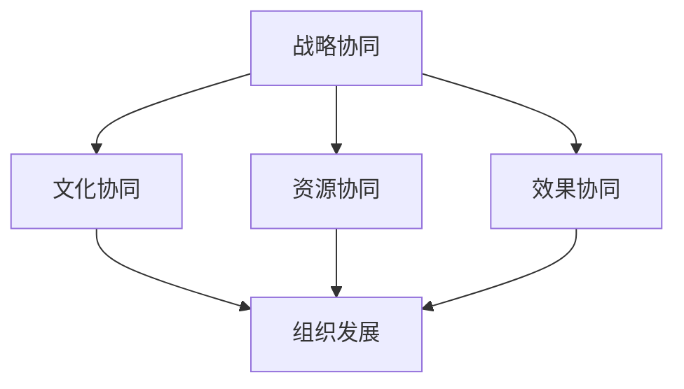

#### 核心算法原理讲解

领导力与品牌建设的协同效应可以用以下算法来表示：

```python
def synergy_effects(strategy, culture, resources, outcomes):
    # 定义协同效应权重
    synergy_weights = {
        'strategy': 0.3,
        'culture': 0.3,
        'resources': 0.2,
        'outcomes': 0.2
    }
    
    # 计算协同效应
    synergy = (synergy_weights['strategy'] * strategy +
               synergy_weights['culture'] * culture +
               synergy_weights['resources'] * resources +
               synergy_weights['outcomes'] * outcomes)
    
    # 返回协同效应
    return synergy
```

#### 数学模型和数学公式

领导力与品牌建设的协同效应模型可以使用以下数学模型来表示：

$$
\text{Synergy} = w_1 \cdot \text{Strategy} + w_2 \cdot \text{Culture} + w_3 \cdot \text{Resources} + w_4 \cdot \text{Outcomes}
$$

其中，$w_1, w_2, w_3, w_4$ 分别是战略协同、文化协同、资源协同和效果协同的权重。这个模型说明了协同效应是这些因素的线性组合。

#### 举例说明

假设一个组织的领导力在战略层面清晰、文化层面积极向上、资源层面充足且效果协同显著，那么该组织的协同效应将较强。

#### 项目实战

在一个快速成长的科技公司中，CEO通过明确战略、塑造积极文化、充分利用资源，实现了领导力与品牌建设的协同效应。公司的品牌影响力不断提升，市场份额逐年扩大，取得了显著的成功。

#### 最佳实践 tips

- **明确战略协同**：领导者应明确组织的战略目标，确保领导力和品牌建设在战略层面协同。
- **塑造积极文化**：领导者应注重组织文化的建设，确保品牌形象与组织文化相一致。
- **优化资源协同**：领导者应充分利用品牌资源，提升组织的竞争力。
- **追求效果协同**：领导者应关注协同效应的实际效果，不断优化领导力和品牌建设策略。

#### 小结

领导力与品牌建设之间的协同效应对于组织的成功至关重要。通过理解协同效应的核心概念和算法，领导者可以更好地实现领导力和品牌建设的协同，提升组织的整体竞争力。

## 第8章：提升团队影响力的策略

### 8.1 增强团队凝聚力的方法

团队凝聚力是团队有效运作的关键因素之一。一个具有高度凝聚力的团队能够更好地应对挑战，实现组织目标。增强团队凝聚力需要从多个方面入手，包括建立信任、明确目标、加强沟通等。

#### 背景介绍

在快速变化的市场环境中，团队的凝聚力和协作能力变得尤为重要。一个高度凝聚力的团队能够更好地应对外部压力，保持内部稳定，提高工作效率。

#### 核心概念与联系

团队凝聚力的核心概念包括信任、目标、沟通和归属感。这些概念相互关联，共同决定了团队的凝聚力。

**Mermaid 流程图：**

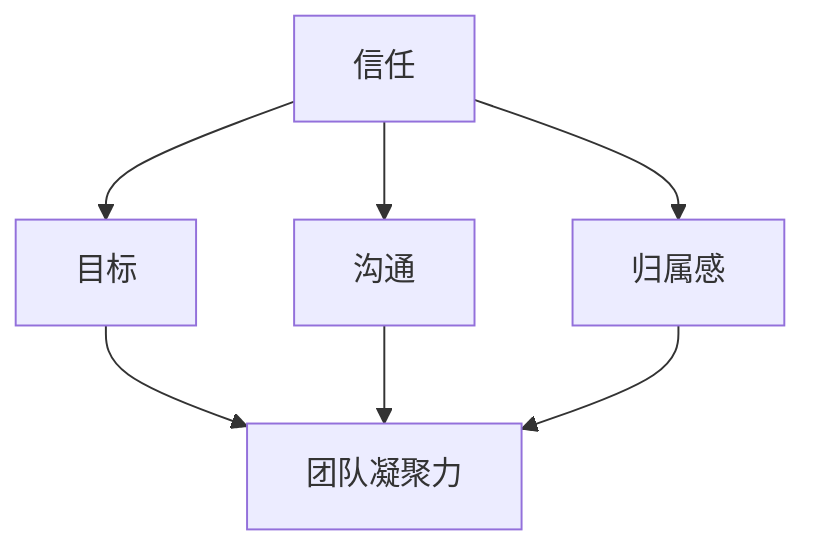

#### 核心算法原理讲解

团队凝聚力算法可以看作是一个多输入多输出的系统，其输入包括信任、目标、沟通和归属感，输出则是团队的凝聚力。这个算法可以用以下伪代码表示：

```python
def team_coherence(trust, goals, communication, belonging):
    # 定义凝聚力权重
    coherence_weights = {
        'trust': 0.4,
        'goals': 0.3,
        'communication': 0.2,
        'belonging': 0.1
    }
    
    # 计算团队凝聚力
    coherence = (coherence_weights['trust'] * trust +
                 coherence_weights['goals'] * goals +
                 coherence_weights['communication'] * communication +
                 coherence_weights['belonging'] * belonging)
    
    # 返回团队凝聚力
    return coherence
```

#### 数学模型和数学公式

团队凝聚力模型可以使用以下数学模型来表示：

$$
\text{Coherence} = w_1 \cdot \text{Trust} + w_2 \cdot \text{Goals} + w_3 \cdot \text{Communication} + w_4 \cdot \text{Belonging}
$$

其中，$w_1, w_2, w_3, w_4$ 分别是信任、目标、沟通和归属感的权重。这个模型说明了团队凝聚力是这些因素的线性组合。

#### 举例说明

假设一个团队在信任、目标、沟通和归属感方面表现优异，那么该团队的凝聚力将较高。

#### 项目实战

在一个软件开发团队中，团队领导通过定期的团队建设活动，增强了团队成员之间的信任和归属感。同时，团队领导明确了团队的目标，并通过有效的沟通确保团队成员的理解和参与。这些措施显著提升了团队的凝聚力，团队绩效显著提高。

#### 最佳实践 tips

- **建立信任**：领导者应通过行动建立团队成员之间的信任，为团队创造一个良好的工作氛围。
- **明确目标**：领导者应确保团队成员明确团队的目标，增强团队的凝聚力和向心力。
- **加强沟通**：领导者应加强团队内部和团队之间的沟通，确保信息的畅通和及时反馈。
- **增强归属感**：领导者应关注团队成员的需求，提供成长机会，增强团队成员的归属感。

#### 小结

团队凝聚力是团队有效运作的基础。通过理解团队凝聚力的核心概念和算法，领导者可以更好地提升团队凝聚力，促进团队的协作和成长。

### 8.2 激发团队创新与活力的策略

团队创新与活力是组织持续发展的重要动力。一个具有创新能力和活力的团队能够更好地应对市场变化，抓住发展机遇。激发团队创新与活力的策略包括提供创新环境、培养创新思维、建立激励机制等。

#### 背景介绍

在当今快速变化的市场环境中，创新能力已成为组织竞争力的重要组成部分。一个具有创新能力和活力的团队能够推动组织的持续发展，保持市场竞争力。

#### 核心概念与联系

团队创新与活力的核心概念包括创新环境、创新思维、激励机制和团队文化。这些概念相互关联，共同决定了团队的创新能力。

**Mermaid 流程图：**

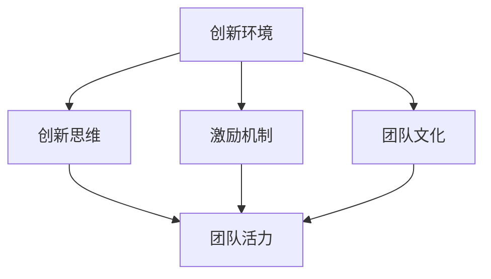

#### 核心算法原理讲解

团队创新与活力算法可以看作是一个多输入多输出的系统，其输入包括创新环境、创新思维、激励机制和团队文化，输出则是团队的活力和创新成果。这个算法可以用以下伪代码表示：

```python
def team_innovation_vitality(environment, mindset, incentives, culture):
    # 定义创新活力权重
    vitality_weights = {
        'environment': 0.3,
        'mindset': 0.3,
        'incentives': 0.2,
        'culture': 0.2
    }
    
    # 计算团队创新与活力
    vitality = (vitality_weights['environment'] * environment +
                vitality_weights['mindset'] * mindset +
                vitality_weights['incentives'] * incentives +
                vitality_weights['culture'] * culture)
    
    # 返回团队创新与活力
    return vitality
```

#### 数学模型和数学公式

团队创新与活力模型可以使用以下数学模型来表示：

$$
\text{Vitality} = w_1 \cdot \text{Environment} + w_2 \cdot \text{Mindset} + w_3 \cdot \text{Incentives} + w_4 \cdot \text{Culture}
$$

其中，$w_1, w_2, w_3, w_4$ 分别是创新环境、创新思维、激励机制和团队文化的权重。这个模型说明了团队创新与活力是这些因素的线性组合。

#### 举例说明

假设一个团队在创新环境、创新思维、激励机制和团队文化方面表现优异，那么该团队的创新与活力将较高。

#### 项目实战

在一个高科技公司中，CEO意识到团队创新与活力对于公司发展的重要性。他通过提供开放的创新环境、培养创新思维、建立激励机制和塑造积极向上的团队文化，激发了团队的创新活力。公司的产品开发速度显著加快，创新能力大幅提升。

#### 最佳实践 tips

- **提供创新环境**：领导者应创造一个开放、包容的创新环境，鼓励团队成员大胆尝试和探索。
- **培养创新思维**：领导者应培养团队成员的创新思维，鼓励他们提出新的想法和解决方案。
- **建立激励机制**：领导者应建立激励机制，奖励创新成果，激发团队成员的积极性。
- **塑造团队文化**：领导者应塑造积极向上的团队文化，增强团队成员的归属感和认同感。

#### 小结

团队创新与活力是组织持续发展的重要动力。通过理解团队创新与活力的核心概念和算法，领导者可以更好地激发团队的创新能力，推动组织的创新发展。

### 8.3 提升个人影响力与团队贡献度

提升个人影响力与团队贡献度是领导者实现组织目标的关键。一个具有高度个人影响力和团队贡献度的领导者能够更好地推动团队工作，提升组织绩效。提升个人影响力与团队贡献度的策略包括建立良好的人际关系、提供卓越的领导示范、培养团队领导力等。

#### 背景介绍

在组织运作中，领导者的个人影响力和团队贡献度对于组织的成功至关重要。一个具有高度个人影响力和团队贡献度的领导者能够推动团队协作，提高工作效率，实现组织目标。

#### 核心概念与联系

个人影响力与团队贡献度的核心概念包括人际关系、领导示范、团队领导和绩效表现。这些概念相互关联，共同决定了领导者的个人影响力和团队贡献度。

**Mermaid 流程图：**

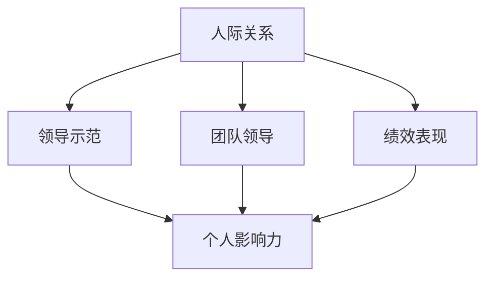

#### 核心算法原理讲解

个人影响力与团队贡献度算法可以看作是一个多输入多输出的系统，其输入包括人际关系、领导示范、团队领导和绩效表现，输出则是领导者的个人影响力和团队贡献度。这个算法可以用以下伪代码表示：

```python
def leadership_influence_relationship示范(relationship, demonstration, leadership, performance):
    # 定义影响力权重
    influence_weights = {
        'relationship': 0.3,
        'demonstration': 0.3,
        'leadership': 0.2,
        'performance': 0.2
    }
    
    # 计算个人影响力和团队贡献度
    influence = (influence_weights['relationship'] * relationship +
                 influence_weights['demonstration'] * demonstration +
                 influence_weights['leadership'] * leadership +
                 influence_weights['performance'] * performance)
    
    # 返回个人影响力和团队贡献度
    return influence
```

#### 数学模型和数学公式

个人影响力与团队贡献度模型可以使用以下数学模型来表示：

$$
\text{Influence} = w_1 \cdot \text{Relationship} + w_2 \cdot \text{Demonstration} + w_3 \cdot \text{Leadership} + w_4 \cdot \text{Performance}
$$

其中，$w_1, w_2, w_3, w_4$ 分别是人际关系、领导示范、团队领导和绩效表现的权重。这个模型说明了个人影响力和团队贡献度是这些因素的线性组合。

#### 举例说明

假设一个领导者在人际关系、领导示范、团队领导和绩效表现方面都表现出色，那么该领导者的个人影响力和团队贡献度将较高。

#### 项目实战

在一个大型企业中，CEO通过建立良好的人际关系、提供卓越的领导示范、培养团队领导力和提升个人绩效，显著提升了个人影响力和团队贡献度。他的领导风格和影响力激发了团队成员的工作热情，推动了企业的快速发展。

#### 最佳实践 tips

- **建立良好的人际关系**：领导者应注重与团队成员的沟通和互动，建立互信互敬的人际关系。
- **提供卓越的领导示范**：领导者应以身作则，树立榜样，通过行动影响团队成员。
- **培养团队领导力**：领导者应培养团队成员的领导力，提升团队的整体领导水平。
- **提升个人绩效**：领导者应不断提高个人绩效，为团队树立绩效标杆。

#### 小结

提升个人影响力与团队贡献度是领导者实现组织目标的关键。通过理解个人影响力与团队贡献度的核心概念和算法，领导者可以更好地提升自身的影响力，推动团队的发展，实现组织的目标。

## 附录

### 附录A：领导力与品牌建设常用工具

#### A.1 常用领导力评估工具

领导力评估工具是衡量领导者能力和绩效的重要手段。以下是一些常用的领导力评估工具：

1. **领导力360度评估**：通过收集团队成员、上级和下属的反馈，全面评估领导者的能力和行为。
2. **领导力行为观察表**：通过观察领导者在实际工作中的行为，评估领导者的领导风格和效果。
3. **领导力能力评估问卷**：通过问卷形式，评估领导者在不同能力维度上的表现。

#### A.2 品牌建设分析工具

品牌建设分析工具用于评估品牌的市场表现和影响力。以下是一些常用的品牌建设分析工具：

1. **品牌资产评估模型**：通过定量和定性方法，评估品牌的价值和影响力。
2. **品牌知名度调查**：通过调查消费者的品牌认知程度，评估品牌的知名度。
3. **品牌忠诚度调查**：通过调查消费者的品牌忠诚度，评估品牌的客户粘性。

#### A.3 团队影响力提升工具

团队影响力提升工具用于提升团队的协作效率和绩效。以下是一些常用的团队影响力提升工具：

1. **团队协作平台**：如Slack、Trello等，用于提升团队的沟通和协作效率。
2. **项目管理系统**：如JIRA、Asana等，用于管理项目进度和团队任务。
3. **团队反馈系统**：如SurveyMonkey、Google Forms等，用于收集团队成员的反馈和建议。

**Mermaid 流程图：**

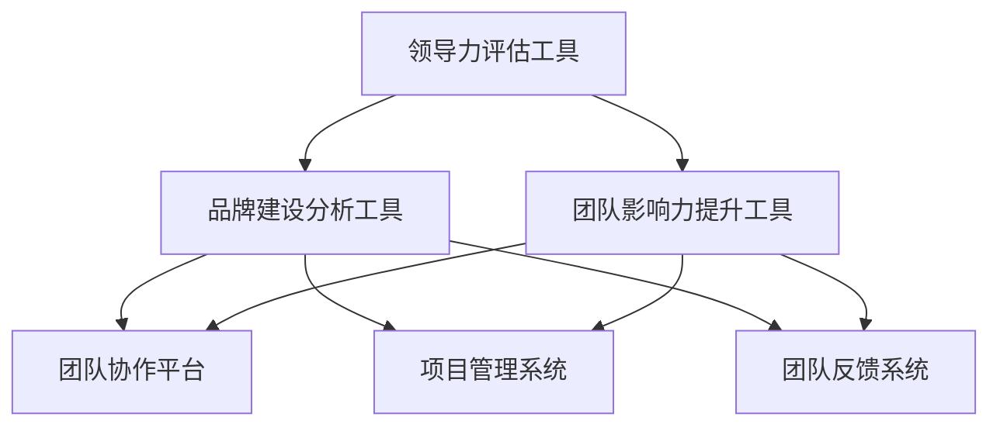

### 附录B：最佳实践、小结、注意事项与拓展阅读

#### 最佳实践

- **领导力提升**：定期进行领导力培训和自我反思，提升领导能力。
- **品牌建设**：明确品牌定位，制定有效的品牌战略，持续进行品牌传播。
- **团队影响力提升**：建立良好的团队文化，培养团队成员的领导力和协作能力。

#### 小结

本文通过详细探讨领导力与品牌建设的关系，以及如何提升团队影响力，为IT领域的技术专家和管理者提供了实用的指导。有效的领导力、品牌建设与团队影响力相互促进，共同推动组织的持续发展。

#### 注意事项

- **持续学习**：领导者应保持持续学习的态度，不断提升自身的能力。
- **关注团队成员**：领导者应关注团队成员的需求，提供成长机会，增强团队凝聚力。
- **适应变化**：领导者应积极应对外部环境变化，调整领导风格和品牌战略。

#### 拓展阅读

- **领导力相关书籍**：《领导力五项修炼》、《领导力的真谛》
- **品牌建设相关书籍**：《品牌战略》、《品牌管理实战》
- **团队影响力相关书籍**：《团队协作的艺术》、《团队领导力》

### 作者信息

作者：AI天才研究院/AI Genius Institute & 禅与计算机程序设计艺术 /Zen And The Art of Computer Programming

### 结束语

领导力与品牌建设是组织成功的关键因素。通过本文的探讨，我们希望读者能够更好地理解这两者的关系，并在实际工作中运用相关策略，提升团队的绩效和影响力，推动组织的持续发展。让我们共同努力，打造卓越的领导力和品牌，实现组织的辉煌。

