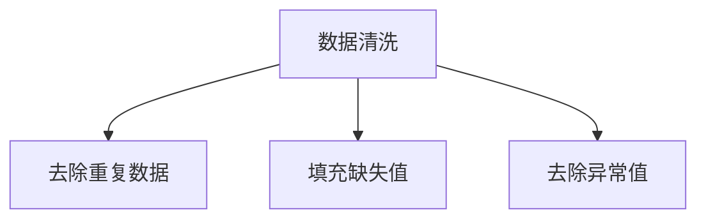
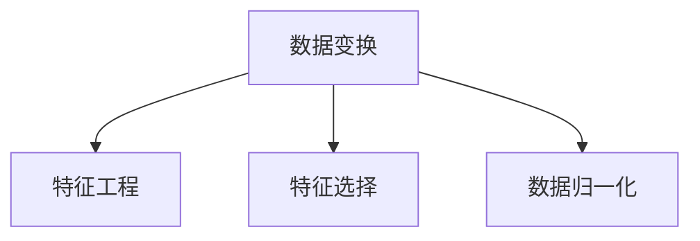
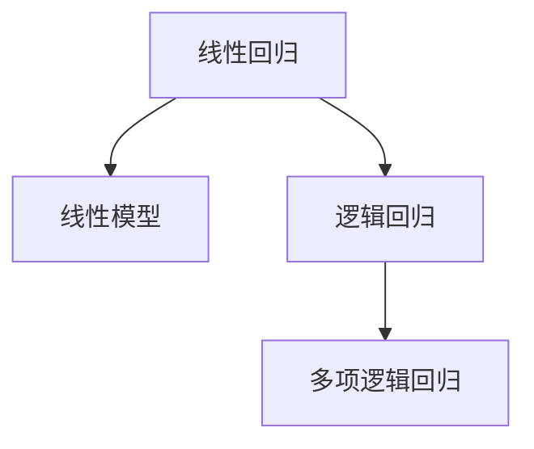
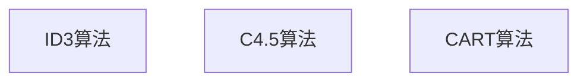
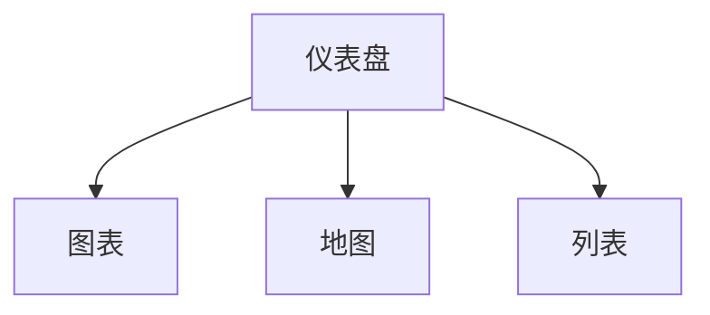

                 

### 《领导力与商业洞察：把握市场脉搏》

#### 关键词：
领导力、商业洞察、市场分析、数字化转型、创新思维

#### 摘要：
本文深入探讨了领导力与商业洞察在把握市场脉搏中的重要性。通过分析领导力的基础理论和核心要素，以及商业洞察的定义、关键要素和方法，我们揭示了领导力与商业洞察的内在联系。接着，本文介绍了市场分析的基本概念与方法，以及领导力与商业洞察在实际案例中的应用。最后，文章提出了领导力与商业洞察的未来发展趋势，并给出了实践指南。希望本文能为IT领域从业者提供有价值的参考和启示。

---

### 第一部分：领导力概述

#### 第1章：领导力的重要性与基础理论

#### 1.1 领导力的定义与核心要素

##### 1.1.1 领导力的定义

领导力是一种能力，它涉及到激发他人为实现共同目标而努力的过程。根据约翰·科特（John Kotter）的定义，领导力是一种影响他人积极改变的行为能力，目的是创造一个共同愿景，并将其转化为实际行动。简言之，领导力就是推动变革、激励团队并实现目标的能力。

##### 1.1.2 领导力的核心要素

领导力的核心要素主要包括以下三个方面：

1. **愿景**：领导力始于愿景。领导者需要明确地描述未来的愿景，并使团队成员理解并接受这个愿景。愿景是领导力的灵魂，是激励团队追求卓越的动力。

2. **信任**：信任是领导力的基石。没有信任，领导力就无法发挥作用。领导者需要通过诚信、透明和公正的行为来建立信任。

3. **沟通**：沟通是领导力的关键。领导者需要有效地与团队成员沟通愿景、目标和期望，确保信息准确无误地传递。

#### 1.2 领导力的四种类型

##### 1.2.1 转向型领导

转向型领导（Transitional Leadership）是指在组织面临重大变革时，领导者引导团队克服变革带来的阻力和挑战的能力。转向型领导的核心在于提供清晰的方向和目标，以及激励团队成员克服变革中的困难。

##### 1.2.2 变革型领导

变革型领导（Transformational Leadership）是指领导者通过激发团队成员的内在动机和潜力，推动组织实现重大变革的能力。变革型领导强调领导者的愿景、激励能力和影响力。

##### 1.2.3 交易型领导

交易型领导（Transaction Leadership）是指领导者通过明确的奖励和惩罚机制来激励团队成员，实现组织目标的能力。交易型领导强调绩效管理和激励机制。

##### 1.2.4 参与型领导

参与型领导（Participative Leadership）是指领导者鼓励团队成员参与决策过程，共同制定目标和策略的能力。参与型领导强调团队合作和共同决策。

#### 1.3 领导力的研究方法与模型

##### 1.3.1 领导力研究的方法

领导力研究的方法主要包括定性研究、定量研究和混合研究。定性研究通过深度访谈、观察和案例研究等方法，深入了解领导者的行为和思维模式。定量研究通过问卷调查、统计分析和实验方法，分析领导力与组织绩效之间的关系。混合研究结合了定性研究和定量研究的优点，提供更全面的分析。

##### 1.3.2 领导力模型分析

领导力模型分析主要包括领导行为模型、领导风格模型和领导权变模型。领导行为模型关注领导者的具体行为，如激励、沟通和决策。领导风格模型关注领导者的个性特征和领导风格，如民主型领导、专制型领导和参与型领导。领导权变模型关注领导行为与组织环境之间的关系，如费德勒模型（Fiedler Model）和赫赛-布兰查德模型（Hersey-Blanchard Model）。

---

### 第二部分：商业洞察

#### 第2章：商业洞察的重要性与技能

#### 2.1 商业洞察的定义与内涵

##### 2.1.1 商业洞察的定义

商业洞察（Business Insight）是指通过分析数据和趋势，识别商业机会、挑战和潜在风险，从而制定更有效的战略决策的能力。商业洞察是一种深入理解市场和客户需求，并将这些理解转化为实际业务价值的能力。

##### 2.1.2 商业洞察的内涵

商业洞察的内涵包括以下几个方面：

1. **数据驱动的决策**：商业洞察依赖于数据分析，通过挖掘数据中的信息和趋势，帮助组织做出更准确的决策。

2. **市场洞察**：商业洞察包括对市场环境的深入理解，包括竞争对手、客户需求和行业趋势等。

3. **战略规划**：商业洞察有助于组织制定长期战略，包括市场定位、产品开发和运营策略等。

4. **创新思维**：商业洞察鼓励组织采用创新思维，不断探索新的商业模式和市场机会。

#### 2.2 商业洞察的关键要素

##### 2.2.1 市场研究

市场研究是商业洞察的基础。通过市场研究，组织可以了解客户需求、市场趋势和竞争对手情况，为决策提供依据。

##### 2.2.2 数据分析

数据分析是商业洞察的核心。通过分析大量数据，组织可以发现隐藏在数据背后的趋势和模式，从而制定更有效的战略。

##### 2.2.3 创新思维

创新思维是商业洞察的关键。组织需要鼓励创新思维，不断探索新的解决方案和商业模式，以保持竞争力。

#### 2.3 商业洞察的方法与工具

##### 2.3.1 SWOT分析

SWOT分析是一种常用的商业洞察方法，用于分析组织的优势、劣势、机会和威胁。

##### 2.3.2 五力模型

五力模型是一种用于分析市场竞争结构和行业吸引力的方法。

##### 2.3.3 波特价值链分析

波特价值链分析是一种用于分析组织内部价值创造过程的方法。

---

### 第三部分：市场分析

#### 第3章：市场分析的基本概念与方法

#### 3.1 市场分析的定义与重要性

##### 3.1.1 市场分析的定义

市场分析（Market Analysis）是指对市场环境、竞争对手、客户需求和行业趋势进行全面分析，以制定有效的市场策略。

##### 3.1.2 市场分析的重要性

市场分析对组织的决策和战略制定具有重要意义。通过市场分析，组织可以：

1. **了解市场需求**：市场分析有助于组织了解客户需求，从而制定更准确的产品策略。

2. **识别竞争环境**：市场分析有助于组织了解竞争对手的情况，从而制定更有竞争力的策略。

3. **预测市场趋势**：市场分析有助于组织预测市场趋势，从而提前应对潜在的市场变化。

#### 3.2 市场分析的方法与步骤

##### 3.2.1 市场调研

市场调研是市场分析的重要步骤。通过市场调研，组织可以收集有关市场需求、竞争环境、客户行为等方面的数据。

##### 3.2.2 数据收集与处理

数据收集与处理是市场分析的核心。通过收集和处理数据，组织可以提取有用的信息，为决策提供依据。

##### 3.2.3 市场预测

市场预测是市场分析的最终目标。通过市场预测，组织可以预测未来的市场趋势和机会，为战略制定提供参考。

#### 3.3 市场分析工具与软件

##### 3.3.1 SPSS

SPSS是一种常用的统计分析软件，可用于数据收集、处理和预测。

##### 3.3.2 Excel

Excel是一种常用的电子表格软件，可用于数据可视化和分析。

##### 3.3.3 Tableau

Tableau是一种常用的数据可视化软件，可用于展示分析结果。

---

### 第四部分：领导力与商业洞察结合

#### 第4章：领导力与商业洞察的结合

#### 4.1 领导力在商业洞察中的作用

##### 4.1.1 领导力的商业洞察价值

领导力在商业洞察中具有重要作用。领导者通过以下方式提升商业洞察：

1. **愿景与目标设定**：领导者设定清晰的愿景和目标，为商业洞察提供方向。

2. **激励与引导**：领导者激励团队成员，引导他们参与商业洞察，提高团队的整体洞察力。

3. **资源分配**：领导者合理分配资源，支持商业洞察的研究和实践。

##### 4.1.2 领导力在商业决策中的应用

领导力在商业决策中发挥着关键作用。领导者通过以下方式应用商业洞察：

1. **市场定位**：领导者根据商业洞察，制定市场定位策略，提高产品竞争力。

2. **战略规划**：领导者根据商业洞察，制定长期战略规划，确保组织可持续发展。

3. **风险控制**：领导者根据商业洞察，识别潜在风险，制定风险控制策略。

#### 4.2 商业洞察在领导力中的体现

##### 4.2.1 商业洞察对领导力的挑战

商业洞察对领导力提出了新的挑战。领导者需要：

1. **不断学习**：领导者需要不断学习新的知识和技能，提高商业洞察能力。

2. **适应变革**：领导者需要适应快速变化的市场环境，灵活调整领导策略。

3. **创新思维**：领导者需要鼓励创新思维，推动组织变革。

##### 4.2.2 商业洞察在领导力发展中的应用

商业洞察在领导力发展中具有重要作用。领导者可以通过以下方式应用商业洞察：

1. **领导力培训**：领导者通过培训，提高商业洞察能力，提升领导力水平。

2. **团队建设**：领导者通过团队建设，激发团队成员的洞察力，提高团队的整体效能。

3. **战略执行**：领导者根据商业洞察，制定战略执行计划，确保战略落地。

---

### 第五部分：领导力与商业洞察应用案例

#### 第5章：领导力与商业洞察应用案例分析

#### 5.1 案例一：苹果公司的领导力与商业洞察

##### 5.1.1 苹果公司的领导力策略

苹果公司以其卓越的领导力著称。乔布斯作为苹果公司的创始人，以其独特的领导风格和创新思维，推动了公司的快速发展。

1. **愿景与目标**：乔布斯设定了明确的愿景和目标，如“改变世界”，并激励团队成员为实现这一愿景而努力。

2. **激励与引导**：乔布斯通过激发团队成员的内在动机，引导他们追求卓越，创造了许多创新产品。

3. **资源分配**：乔布斯合理分配资源，支持商业洞察的研究和实践，确保公司不断创新。

##### 5.1.2 苹果公司的商业洞察

苹果公司在商业洞察方面表现出色。以下是其商业洞察的几个关键方面：

1. **市场定位**：苹果公司通过创新产品，成功定位高端市场，赢得了大量忠实客户。

2. **战略规划**：苹果公司根据商业洞察，制定了长期战略规划，如进入智能手机市场，推动公司持续增长。

3. **风险控制**：苹果公司通过商业洞察，识别潜在风险，如竞争对手的挑战和供应链问题，并采取有效措施应对。

#### 5.2 案例二：谷歌公司的领导力与商业洞察

##### 5.2.1 谷歌公司的领导力策略

谷歌公司以其独特的领导力文化和创新氛围著称。以下是谷歌公司领导力的几个关键方面：

1. **愿景与目标**：谷歌公司设有明确的愿景和目标，如“组织全球信息，使人人可访问并从中受益”。

2. **激励与引导**：谷歌公司鼓励员工发挥创意，提供自由的工作环境，激发员工的内在动机。

3. **资源分配**：谷歌公司投资于研发和创新，支持商业洞察的研究和实践。

##### 5.2.2 谷歌公司的商业洞察

谷歌公司在商业洞察方面表现出色。以下是其商业洞察的几个关键方面：

1. **市场定位**：谷歌公司通过提供创新的产品和服务，成功定位全球市场，成为互联网巨头。

2. **战略规划**：谷歌公司根据商业洞察，制定多元化战略，如进入自动驾驶汽车、医疗技术等领域，推动公司持续增长。

3. **风险控制**：谷歌公司通过商业洞察，识别潜在风险，如数据隐私和安全问题，并采取有效措施应对。

---

### 第六部分：领导力与商业洞察实践指南

#### 第6章：领导力与商业洞察实践指南

#### 6.1 领导力与商业洞察培训与培养

##### 6.1.1 领导力与商业洞察培训方案设计

为了提高领导力和商业洞察能力，组织可以设计以下培训方案：

1. **内部培训**：组织可以组织内部培训，邀请行业专家分享经验和最佳实践。

2. **外部培训**：组织可以邀请专业培训机构，为员工提供领导力和商业洞察的培训课程。

3. **在线学习**：组织可以提供在线学习平台，让员工随时随地进行学习。

##### 6.1.2 领导力与商业洞察培养策略

组织可以采取以下策略培养领导力和商业洞察能力：

1. **领导力发展计划**：组织可以制定领导力发展计划，为员工提供晋升和发展的机会。

2. **跨部门合作**：组织可以鼓励跨部门合作，让员工了解不同部门的工作，提高他们的业务视野。

3. **外部交流**：组织可以组织员工参加行业会议和研讨会，了解最新的市场动态和行业趋势。

#### 6.2 领导力与商业洞察实践案例

##### 6.2.1 企业领导力与商业洞察实践案例

以下是一些企业领导力与商业洞察的实践案例：

1. **微软公司**：微软公司通过设立“内部创业基金”，鼓励员工提出创新项目，并给予资金支持。

2. **阿里巴巴集团**：阿里巴巴集团通过设立“阿里学院”，为员工提供领导力和商业洞察的培训。

3. **华为技术有限公司**：华为公司通过“全球招聘”策略，吸引全球顶尖人才，提升公司的领导力和商业洞察能力。

##### 6.2.2 领导力与商业洞察成功案例分享

以下是一些领导力与商业洞察的成功案例：

1. **苹果公司**：苹果公司通过其独特的领导力和商业洞察，成功推出了iPhone、iPad等产品，改变了整个科技行业。

2. **谷歌公司**：谷歌公司通过其卓越的领导力和商业洞察，成功推出了Google Search、Google Ads等产品，成为互联网巨头。

3. **特斯拉公司**：特斯拉公司通过其创新的领导力和商业洞察，成功推出了Model S、Model X等电动车产品，引领了电动汽车行业的发展。

---

### 第七部分：未来展望

#### 第7章：领导力与商业洞察的未来发展

#### 7.1 领导力与商业洞察的发展趋势

在未来，领导力与商业洞察将面临以下发展趋势：

1. **数字化转型**：随着数字化技术的不断发展，领导力和商业洞察将更加依赖于数据分析和人工智能。

2. **全球化**：全球化将推动领导力和商业洞察的国际化和多元化，要求领导者具备跨文化沟通和领导能力。

3. **创新思维**：创新思维将成为领导力和商业洞察的重要组成部分，领导者需要鼓励创新思维，推动组织变革。

#### 7.2 领导力与商业洞察的挑战与机遇

在未来，领导力与商业洞察将面临以下挑战和机遇：

1. **技术变革**：技术变革将带来新的领导力和商业洞察挑战，如数据隐私、网络安全等。

2. **市场竞争**：市场竞争将加剧，领导者需要具备更强的商业洞察能力，以应对市场变化。

3. **人才竞争**：人才竞争将成为领导力和商业洞察的关键，领导者需要具备吸引和培养人才的能力。

---

#### 附录

#### 附录A：领导力与商业洞察相关书籍推荐

以下是一些关于领导力与商业洞察的推荐书籍：

1. **《领导力的五个层次》（John C. Maxwell）**
2. **《商业洞察：如何从数据中发现价值》（Thomas H. Davenport）**
3. **《数字化管理：如何利用大数据进行决策》（Viktor Mayer-Schönberger, Kenneth Cukier）**
4. **《创新者的窘境》（Clayton M. Christensen）**
5. **《跨界创新》（Charles M. Jacoby Jr., Sanghoon Kim）**

#### 附录B：领导力与商业洞察常用工具和资源

以下是一些常用的领导力与商业洞察工具和资源：

1. **领导力模型**：
    - **费德勒模型（Fiedler Model）**
    - **赫赛-布兰查德模型（Hersey-Blanchard Model）**
    - **变革型领导模型（Transformational Leadership Model）**

2. **商业分析工具**：
    - **SPSS**
    - **Excel**
    - **Tableau**

3. **在线学习平台**：
    - **Coursera**
    - **Udemy**
    - **edX**

4. **行业报告**：
    - **市场研究公司（如Gartner、Forrester）**
    - **行业协会（如IEEE、ACM）**

---

**核心概念与联系**


**核心算法原理讲解**

### 数据分析算法原理讲解

#### 数据预处理算法

##### 数据清洗



##### 数据变换



#### 市场预测算法

##### 时间序列分析

时间序列分析是用于分析数据中的时间趋势和周期性波动的一种方法。常见的时间序列模型包括：

```latex
\text{ARIMA模型：} \ARIMA(p, d, q)
\text{SARIMA模型：} \SARIMA(p, d, q)(P, D, Q)[S]
```

其中，\(p\)、\(d\)、\(q\) 分别代表自回归项、差分项和移动平均项，\((P\)、\(D\)、\(Q\)[S] 分别代表季节性自回归项、季节性差分项和季节性移动平均项。

##### 回归分析

回归分析是一种用于建立因变量和自变量之间关系的方法。常见的回归分析方法包括：



线性回归模型可以表示为：

$$y = \beta_0 + \beta_1x_1 + \beta_2x_2 + ... + \beta_nx_n + \epsilon$$

逻辑回归模型可以表示为：

$$\ln(\frac{p}{1-p}) = \beta_0 + \beta_1x_1 + \beta_2x_2 + ... + \beta_nx_n$$

其中，\(p\) 表示因变量的概率。

##### 决策树

决策树是一种用于分类和回归的监督学习算法。常见的决策树算法包括：



决策树模型的基本原理是通过一系列的测试，将数据集划分为不同的区域，从而实现分类或回归。

#### 数据可视化算法

##### 仪表盘设计

仪表盘设计是一种用于展示数据分析结果的方法。常见的仪表盘设计包括：



仪表盘设计的关键是选择合适的图表类型，以直观地展示数据分析结果。

---

### 项目实战：开发环境搭建与代码解读

#### 环境搭建

为了进行数据分析与预测，我们需要搭建一个开发环境。以下是搭建过程：

1. **安装Python**：首先，我们需要安装Python。可以在 [Python官网](https://www.python.org/) 下载最新版本的Python安装程序。

2. **安装Jupyter Notebook**：Jupyter Notebook是一种交互式的开发环境，非常适合进行数据分析。我们可以在命令行中使用以下命令安装Jupyter Notebook：

   ```bash
   pip install notebook
   ```

3. **安装数据分析库**：我们需要安装一些数据分析库，如NumPy、Pandas、Matplotlib和Scikit-learn。可以使用以下命令安装：

   ```bash
   pip install numpy pandas matplotlib scikit-learn
   ```

#### 代码解读

以下是一个简单的数据分析与预测的项目，包括数据预处理、模型训练和预测：

```python
# 导入库
import numpy as np
import pandas as pd
import matplotlib.pyplot as plt
from sklearn.model_selection import train_test_split
from sklearn.linear_model import LinearRegression
from sklearn.metrics import mean_squared_error

# 加载数据
data = pd.read_csv('data.csv')

# 数据预处理
# 去除重复数据
data.drop_duplicates(inplace=True)

# 填充缺失值
data.fillna(data.mean(), inplace=True)

# 数据变换
# 特征工程
data['new_feature'] = data['feature1'] / data['feature2']

# 数据划分
X = data[['feature1', 'feature2', 'new_feature']]
y = data['target']

# 划分训练集和测试集
X_train, X_test, y_train, y_test = train_test_split(X, y, test_size=0.2, random_state=42)

# 模型训练
model = LinearRegression()
model.fit(X_train, y_train)

# 预测
y_pred = model.predict(X_test)

# 评估
mse = mean_squared_error(y_test, y_pred)
print(f'Mean Squared Error: {mse}')

# 可视化
plt.scatter(X_test['feature1'], y_test)
plt.plot(X_test['feature1'], y_pred, color='red')
plt.xlabel('Feature 1')
plt.ylabel('Target')
plt.show()
```

#### 项目小结

通过以上代码，我们实现了数据预处理、模型训练和预测。首先，我们加载数据并进行预处理，包括去除重复数据、填充缺失值和特征工程。然后，我们划分训练集和测试集，训练线性回归模型，并进行预测。最后，我们使用散点图和拟合曲线展示了预测结果。这是一个简单的数据分析与预测项目，但展示了数据预处理、模型训练和预测的基本流程。

---

#### 最佳实践 Tips、注意事项、拓展阅读

##### 最佳实践 Tips

1. **数据预处理**：数据预处理是数据分析的关键步骤，包括去除重复数据、填充缺失值、特征工程等。务必确保数据的准确性和完整性。

2. **模型选择**：选择合适的模型是模型训练的关键。根据数据特点和业务需求，选择合适的回归模型、决策树模型等。

3. **交叉验证**：交叉验证是一种常用的模型评估方法，有助于提高模型的泛化能力。在模型训练过程中，建议使用交叉验证方法。

##### 注意事项

1. **数据隐私**：在进行数据分析时，务必遵守数据隐私法规，确保数据的保密性和安全性。

2. **算法公平性**：在模型训练和预测过程中，要注意算法的公平性，避免产生歧视性结果。

3. **模型更新**：随着数据和环境的变化，模型需要定期更新，以确保其准确性和有效性。

##### 拓展阅读

1. **《机器学习实战》（Peter Harrington）**：这是一本关于机器学习和数据分析的实用指南，适合初学者和专业人士。

2. **《Python数据分析》（Wes McKinney）**：这是一本关于Python数据分析和Pandas库的权威指南，适合Python开发者。

3. **《深度学习》（Ian Goodfellow、Yoshua Bengio、Aaron Courville）**：这是一本关于深度学习和神经网络的基础教材，适合对深度学习感兴趣的学习者。

---

**作者：AI天才研究院/AI Genius Institute & 禅与计算机程序设计艺术 /Zen And The Art of Computer Programming**

