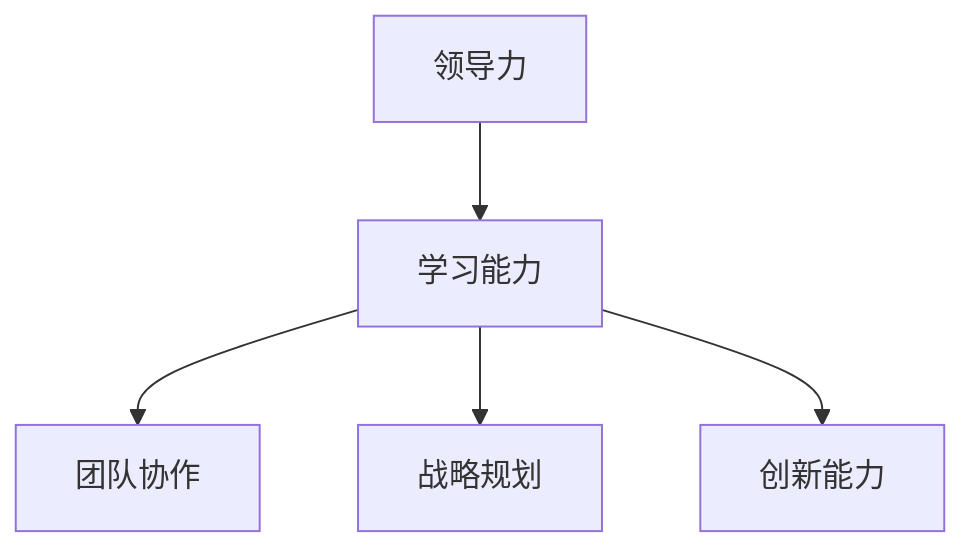

                 

### 文章标题

# 《领导力与学习能力：持续成长的重要性》

### 关键词

- 领导力
- 学习能力
- 持续成长
- 自我提升
- 组织发展

### 摘要

本文将探讨领导力与学习能力在个人和组织的持续成长中的重要性。首先，我们介绍领导力与学习能力的核心概念和定义，接着深入剖析两者之间的关系，并通过具体案例和理论框架展示其提升方法。文章最后将讨论领导力与学习能力在企业和社会组织中的应用，以及如何通过个人发展来实现持续成长。通过本文的阅读，读者将能够理解领导力与学习能力的重要性，掌握其提升方法，并学会如何在实际生活中应用这些能力，以实现个人和组织的持续发展。

### 第一部分：领导力与学习能力的基础

#### 第1章：领导力与学习能力的概述

##### 1.1 领导力与学习能力的重要性

在当今快速变化的商业环境中，领导力和学习能力成为个人和组织的核心竞争力。领导力不仅仅关乎管理，更涉及对团队和组织的引领、激励和协调。它是一个领导者引导团队走向成功的决定性因素。学习能力则是个人和组织适应和应对变化的关键。在技术日新月异的今天，只有不断学习、更新知识和技能，才能保持竞争力。

##### 1.2 领导力与学习能力的核心概念

领导力可以被定义为一种能够激发他人追随、合作并共同实现目标的能力。学习能力的核心概念是个人或组织获取、处理和应用知识的能力。这两个概念虽然独立，但在实际中密不可分。领导力需要依赖学习能力来获取新的见解和方法，而学习能力则需要领导力来引导和推动。

##### 1.3 领导力与学习能力的关系图

为了更好地理解领导力与学习能力之间的关系，我们可以通过一个关系图来展示。该图包括以下几个关键组成部分：

1. **领导力**：在图的中央，表示领导力是核心，影响其他所有方面。
2. **学习能力**：环绕领导力，表示学习能力是领导力发挥作用的基础。
3. **团队协作**：与领导力和学习能力相连，表示团队协作是领导力与学习能力的重要应用场景。
4. **战略规划**：与领导力和学习能力相连，表示领导力与学习能力在组织战略规划中的重要性。
5. **创新能力**：与领导力和学习能力相连，表示领导力和学习能力对于创新的关键作用。



通过这个关系图，我们可以看到领导力与学习能力是相互依赖、相互促进的。领导力为学习能力提供方向和动力，而学习能力则为领导力提供实践基础和创新支持。

#### 第2章：领导力的核心概念

##### 2.1 领导力的定义与作用

领导力是一个广泛且多维度的概念，它不仅仅关乎权威和命令，更涉及激励、沟通、愿景构建和变革管理。领导力是一种通过影响力来引导他人共同实现目标的能力。它不仅关乎个人素质，更涉及领导者在不同情境下的行为和决策。

在组织中的作用包括：

1. **目标设定**：领导者需要明确组织的目标和愿景，并将其传达给团队成员。
2. **激励与激励**：领导者需要通过激励来激发团队成员的积极性和创造力。
3. **沟通与协调**：领导者需要确保信息的畅通和团队的协调一致。
4. **变革管理**：领导者需要引领组织进行变革，以适应外部环境的变化。

##### 2.2 领导力与管理的区别

虽然领导力和管理经常被混淆，但它们实际上是两个不同的概念。管理主要涉及组织和分配资源、制定流程和策略等。而领导力则更注重激发和引领他人，构建共同的愿景和价值观。

领导力与管理的区别可以总结为：

1. **重点不同**：领导力关注长远的目标和愿景，而管理关注短期的执行和效率。
2. **方法不同**：领导力依赖影响力、激励和愿景，而管理依赖规则、流程和制度。
3. **角色不同**：领导者是团队的引导者，而管理者是团队的管理者。

##### 2.3 领导力的发展阶段

领导力的发展是一个持续的过程，通常可以分为以下几个阶段：

1. **依赖性领导**：在这个阶段，领导者依赖他人的指示和支持。
2. **授权性领导**：领导者开始授权给团队成员，并鼓励他们独立行动。
3. **赋能性领导**：领导者通过激励和鼓励，使团队成员能够自主决策并承担责任。
4. **愿景性领导**：领导者构建和组织共同愿景，引领团队向更高目标迈进。

通过了解领导力的发展阶段，个人和组织可以更好地制定发展策略，逐步提升领导力水平。

#### 第3章：学习能力的概念与原理

##### 3.1 学习能力的定义

学习能力是指个人或组织获取、处理和应用知识的能力。它不仅仅包括知识的获取，还包括知识的理解、应用和创新。学习能力的核心是持续性和适应性，即在不断变化的环境中保持学习和进步的能力。

##### 3.2 学习能力的重要性

学习能力在个人和组织的成长中扮演着关键角色：

1. **适应变化**：学习能力使个人和组织能够迅速适应外部环境的变化，保持竞争力。
2. **创新驱动**：通过不断学习和创新，个人和组织能够推动技术进步和业务发展。
3. **持续改进**：学习能力促使个人和组织不断反思和改进，提高效率和质量。

##### 3.3 学习能力的模型与理论

学习能力的培养涉及多个方面，以下是几个常见的学习能力模型与理论：

1. **学习周期模型**：这个模型包括信息获取、信息处理、知识应用和反馈四个阶段，强调学习是一个循环过程。
2. **五要素模型**：包括学习意愿、学习环境、学习策略、学习内容和学习效果五个要素，全面描述学习过程。
3. **双环学习模型**：这个模型指出，学习分为外部学习和内部学习，外部学习关注问题解决，内部学习关注知识和技能的提升。

通过这些模型和理论，个人和组织可以更好地理解和培养学习能力。

### 第二部分：领导力与学习能力的提升方法

#### 第4章：领导力的提升方法

##### 4.1 自我认知与反馈

提升领导力的第一步是进行自我认知。领导者需要明确自己的优势和劣势，了解自己的价值观和信念。自我认知可以通过以下方法进行：

1. **反思**：定期反思自己的行为和决策，分析其成功和失败的原因。
2. **反馈**：寻求他人的反馈，了解团队成员和同事对自己的看法。
3. **评估**：使用评估工具和量表，对领导力进行量化评估。

通过自我认知和反馈，领导者可以更好地了解自己，制定个人发展计划。

##### 4.2 领导力的培训与教育

领导力的提升离不开系统的培训和教育。以下是一些有效的培训和教育方法：

1. **领导力课程**：参加专业的领导力培训课程，学习领导力的理论和实践方法。
2. **教练辅导**：与专业的领导力教练合作，获得个性化的指导和支持。
3. **工作经验**：通过实际工作经验，学习领导力的实战技巧。

##### 4.3 领导力的实践与反思

领导力不仅是一种理论知识，更是一种实践能力。以下是一些提升领导力实践能力的方法：

1. **角色扮演**：通过模拟不同领导情境，练习领导技能。
2. **项目领导**：在项目中担任领导角色，实际应用所学知识。
3. **反思与改进**：在实践后，反思领导行为的效果，持续改进。

通过实践与反思，领导者可以不断提高自己的领导力水平。

#### 第5章：学习能力的提升方法

##### 5.1 自我驱动与学习策略

提升学习能力的关键在于自我驱动和学习策略。以下是一些建议：

1. **自我驱动**：设定明确的学习目标，激发内在动力。
2. **学习策略**：选择适合自己的学习方法，如主动学习、协作学习和实践学习。
3. **时间管理**：合理安排学习时间，确保学习的持续性和效果。

##### 5.2 学习环境的构建与优化

学习环境对学习能力有重要影响。以下是一些构建和优化学习环境的方法：

1. **学习资源**：获取和利用各种学习资源，如书籍、在线课程、研讨会等。
2. **学习氛围**：营造积极的学习氛围，鼓励团队合作和知识共享。
3. **学习工具**：使用各种学习工具，如笔记软件、阅读器、学习应用等。

##### 5.3 学习能力的评估与改进

评估和改进学习能力是持续提升的关键。以下是一些建议：

1. **评估方法**：使用评估工具，如学习进度表、学习效果评估等。
2. **反馈机制**：建立反馈机制，及时获取学习效果和改进建议。
3. **持续改进**：根据评估结果，调整学习策略和方法，不断改进。

#### 第6章：领导力与学习能力融合提升

##### 6.1 领导力与学习能力融合的理论框架

领导力与学习能力融合的理论框架强调，两者相互促进，共同推动个人和组织的持续发展。以下是一个简化的理论框架：

1. **领导力**：激发和引领团队，设定目标和愿景。
2. **学习能力**：获取、处理和应用知识，推动创新和改进。
3. **融合机制**：通过领导力引导学习能力，通过学习能力支持领导力。

##### 6.2 领导力与学习能力融合的实践路径

以下是一些领导力与学习能力融合的实践路径：

1. **愿景引导**：领导者通过明确愿景，激发团队成员的学习动力。
2. **知识共享**：领导者通过知识共享，提高团队的整体学习能力。
3. **激励制度**：领导者通过激励机制，鼓励团队成员持续学习和创新。

##### 6.3 领导力与学习能力融合的案例分析

以下是一个领导力与学习能力融合的案例分析：

**案例：某科技公司的领导力与学习能力融合**

某科技公司通过领导力与学习能力融合，实现了企业的快速发展。公司领导层首先明确企业的愿景，即成为行业领导者。他们通过定期的战略会议和团队沟通，激发员工的创新意识和学习热情。

此外，公司建立了完善的学习机制，包括内部培训、外部课程和知识共享平台。员工可以通过这些平台获取最新的行业知识和技术，同时，他们还被鼓励将所学应用到实际工作中，提出改进建议。

通过这种领导力与学习能力融合的方式，公司不仅保持了技术领先地位，还推动了业务增长。员工的学习能力和创新能力得到了显著提升，公司的整体绩效也随之提高。

### 第三部分：领导力与学习能力的应用与实践

#### 第7章：领导力与学习能力在企业中的应用

##### 7.1 企业领导力与学习能力建设

企业领导力与学习能力建设是组织持续发展的基础。以下是一些建议：

1. **领导力建设**：企业可以通过内部培训和外部咨询，提升领导层的领导力水平。
2. **学习能力建设**：企业可以建立学习文化，鼓励员工持续学习和创新。
3. **知识管理**：企业可以通过建立知识库和知识共享平台，提高整体知识水平。

##### 7.2 领导力与学习能力在企业战略规划中的应用

领导力与学习能力在企业战略规划中的应用至关重要。以下是一些具体方法：

1. **愿景规划**：领导者通过明确愿景和目标，引导企业战略方向。
2. **市场分析**：领导者通过市场分析，识别行业趋势和机遇。
3. **资源调配**：领导者通过合理调配资源，确保战略规划的执行。

##### 7.3 领导力与学习能力在企业运营管理中的应用

领导力与学习能力在企业运营管理中的应用体现在以下几个方面：

1. **项目管理**：领导者通过有效项目管理，确保项目按时按质完成。
2. **团队协作**：领导者通过团队协作，提高工作效率和团队士气。
3. **持续改进**：领导者通过持续改进，提高企业的运营效率和质量。

#### 第8章：领导力与学习能力在社会组织中的应用

##### 8.1 领导力与学习能力在非营利组织中的应用

非营利组织通过领导力与学习能力，可以实现社会责任和可持续发展。以下是一些建议：

1. **领导力应用**：非营利组织可以通过有效的领导，动员资源，推动社会变革。
2. **学习能力应用**：非营利组织可以通过持续学习，提高服务质量和效率。
3. **公众参与**：非营利组织可以通过公众参与，增强社会影响力。

##### 8.2 领导力与学习能力在教育领域中的应用

领导力与学习能力在教育领域中的应用至关重要。以下是一些建议：

1. **教师领导力**：教师可以通过有效的领导，激发学生的学习热情，提高教育质量。
2. **学生学习能力**：教育者可以通过学习策略和技巧培训，提高学生的学习能力。
3. **教育创新**：教育者可以通过创新教育模式，推动教育改革和发展。

##### 8.3 领导力与学习能力在社区组织中的应用

领导力与学习能力在社区组织中的应用可以帮助社区实现共同目标。以下是一些建议：

1. **社区领导力**：社区领导者可以通过有效的领导，凝聚社区力量，解决社区问题。
2. **社区学习能力**：社区可以通过组织学习活动，提高居民的学习能力和社区意识。
3. **社区合作**：社区可以通过合作，共同解决社区面临的挑战，实现社区发展。

#### 第9章：领导力与学习能力的个人发展

##### 9.1 个人领导力与学习能力建设

个人领导力与学习能力建设是实现个人职业发展和自我成长的关键。以下是一些建议：

1. **自我认知**：通过反思和反馈，了解自己的优势和劣势。
2. **学习策略**：选择适合自己的学习方法和工具，提高学习效率。
3. **领导实践**：通过参与项目和团队合作，实践领导技能。

##### 9.2 领导力与学习能力在职业发展中的应用

领导力与学习能力在职业发展中的应用可以帮助个人在职场中脱颖而出。以下是一些建议：

1. **职业规划**：通过明确职业目标，制定职业发展计划。
2. **能力提升**：通过不断学习和实践，提升自己的领导力和学习能力。
3. **人际网络**：通过建立良好的人际关系，扩大职业机会。

##### 9.3 领导力与学习能力在自我成长中的应用

领导力与学习能力在自我成长中的应用可以帮助个人实现全面发展。以下是一些建议：

1. **自我激励**：通过设定目标和奖励机制，激发自我动力。
2. **终身学习**：通过持续学习，不断更新知识和技能。
3. **反思与改进**：通过反思自己的行为和决策，持续改进，实现自我成长。

### 附录：领导力与学习能力相关工具与资源

#### 附录 A：领导力与学习能力评估工具

以下是一些常用的领导力与学习能力评估工具：

1. **360度评估**：通过团队成员的反馈，评估领导者的领导力水平。
2. **学习能力量表**：通过量表评估个人的学习能力，包括学习意愿、学习策略和学习效果。
3. **领导力发展问卷**：通过问卷形式，评估领导者的领导力发展和改进方向。

#### 附录 B：学习能力提升工具与应用

以下是一些提升学习能力的工具和应用：

1. **学习应用**：如Anki、Quizlet等，帮助用户高效记忆和学习。
2. **学习平台**：如Coursera、edX等，提供丰富的在线课程和学习资源。
3. **时间管理工具**：如Trello、Asana等，帮助用户合理安排学习时间。

#### 附录 C：领导力与学习能力研究资源

以下是一些领导力与学习能力的研究资源：

1. **学术论文**：通过学术数据库如IEEE Xplore、ACM Digital Library等，查找相关的学术论文。
2. **书籍**：阅读相关书籍，如《领导力的五个层次》、《学习之道》等。
3. **研究报告**：查阅相关的研究报告，了解最新的研究成果和趋势。

### 附录 D：领导力与学习能力核心算法原理讲解

#### 附录 D.1 领导力算法原理讲解

领导力算法可以基于以下几个方面：

1. **人格特质模型**：通过分析领导者的性格特质，如开放性、责任心等，评估领导力水平。
2. **情境领导模型**：根据不同情境，选择合适的领导风格，如变革型领导、交易型领导等。
3. **360度反馈模型**：综合多方面的反馈，评估领导者的领导力发展。

以下是一个简化的领导力算法伪代码：

```python
def leadership_algorithm(personality_traits, situational_context, feedback):
    # 分析人格特质
    personality_score = analyze_personality(personality_traits)
    
    # 根据情境选择领导风格
    leadership_style = select_leadership_style(situational_context)
    
    # 综合反馈，调整领导力
    final_score = feedback_adjustment(personality_score, leadership_style, feedback)
    
    return final_score
```

#### 附录 D.2 学习能力算法原理讲解

学习能力算法可以基于以下几个方面：

1. **学习策略模型**：通过分析学习策略，如主动学习、分散学习等，评估学习效果。
2. **知识应用模型**：通过实际应用，评估学习的迁移能力。
3. **学习反馈模型**：通过反馈机制，不断调整学习策略和目标。

以下是一个简化的学习能力算法伪代码：

```python
def learning_ability_algorithm(learning_strategy, knowledge_application, feedback):
    # 分析学习策略
    strategy_score = analyze_learning_strategy(learning_strategy)
    
    # 评估知识应用
    application_score = evaluate_knowledge_application(knowledge_application)
    
    # 根据反馈调整学习
    final_score = feedback_adjustment(strategy_score, application_score, feedback)
    
    return final_score
```

#### 附录 D.3 领导力与学习能力融合算法原理讲解

领导力与学习能力融合算法可以基于以下几个方面：

1. **领导力与学习能力模型**：结合领导力和学习能力的评估结果，形成综合评估。
2. **融合策略模型**：根据不同情境，选择合适的融合策略。
3. **持续改进模型**：通过反馈机制，不断优化融合效果。

以下是一个简化的领导力与学习能力融合算法伪代码：

```python
def leadership_learning_integration_algorithm(leadership_score, learning_ability_score, situational_context, feedback):
    # 结合领导力和学习能力评估结果
    integration_score = combine_scores(leadership_score, learning_ability_score)
    
    # 根据情境选择融合策略
    integration_strategy = select_integration_strategy(situational_context)
    
    # 根据反馈优化融合效果
    final_score = feedback_integration_adjustment(integration_score, integration_strategy, feedback)
    
    return final_score
```

### 附录 E：数学模型和数学公式

#### 附录 E.1 领导力模型公式

领导力模型可以使用以下数学公式表示：

$$
L = w_1 \times P + w_2 \times S + w_3 \times F
$$

其中，$L$ 表示领导力得分，$P$ 表示人格特质得分，$S$ 表示情境适应得分，$F$ 表示反馈得分，$w_1, w_2, w_3$ 分别为权重系数。

#### 附录 E.2 学习能力模型公式

学习能力模型可以使用以下数学公式表示：

$$
A = w_1 \times S + w_2 \times K + w_3 \times R
$$

其中，$A$ 表示学习能力得分，$S$ 表示学习策略得分，$K$ 表示知识应用得分，$R$ 表示反馈得分，$w_1, w_2, w_3$ 分别为权重系数。

#### 附录 E.3 领导力与学习能力融合模型公式

领导力与学习能力融合模型可以使用以下数学公式表示：

$$
I = w_1 \times L + w_2 \times A + w_3 \times C
$$

其中，$I$ 表示融合得分，$L$ 表示领导力得分，$A$ 表示学习能力得分，$C$ 表示情境适应得分，$w_1, w_2, w_3$ 分别为权重系数。

### 附录 F：项目实战与代码解读

#### 附录 F.1 企业领导力与学习能力建设项目实战

**项目背景：**

某企业希望通过领导力与学习能力建设项目，提升团队领导力和个人学习能力，以实现组织的高效运营和持续发展。

**项目目标：**

1. 提升团队领导力水平，增强团队的凝聚力和执行力。
2. 提升员工的学习能力，促进知识共享和技能提升。
3. 建立持续改进机制，提高组织的创新能力和竞争力。

**项目实施步骤：**

1. **需求调研**：通过访谈和问卷调查，了解团队和员工的现状和需求。
2. **规划方案**：根据调研结果，制定详细的领导力与学习能力提升方案。
3. **培训实施**：组织领导力培训和学习能力培训，提供专业知识和实战技巧。
4. **实践应用**：将所学应用到实际工作中，通过项目实践和团队协作，提升领导力和学习能力。
5. **评估反馈**：通过定期评估和反馈，了解项目效果，持续优化提升方案。

**项目实施细节：**

1. **领导力培训**：包括领导力理论讲解、实战演练、案例分析和团队建设活动。
2. **学习能力培训**：包括学习策略讲解、学习工具使用、知识共享平台建设和实战练习。
3. **项目实践**：通过实际项目，如新产品开发、市场拓展等，应用所学知识和技能。
4. **评估方法**：包括员工满意度调查、工作绩效评估、学习效果评估等。

**项目总结：**

通过领导力与学习能力建设项目，企业团队领导力和个人学习能力得到了显著提升。团队协作更加高效，项目实施更加顺利，员工的创新能力和工作满意度也有所提高。未来，企业将继续优化提升方案，推动组织持续发展。

### 附录 G：最佳实践 tips

以下是一些提升领导力与学习能力的最佳实践：

1. **定期反思**：每天花时间反思自己的行为和决策，找出改进点。
2. **持续学习**：定期阅读专业书籍、参加培训和研讨会，更新知识和技能。
3. **知识共享**：与团队成员分享知识和经验，促进共同成长。
4. **积极沟通**：建立良好的沟通渠道，倾听团队成员的意见和建议。
5. **设定目标**：为自己和团队设定明确的目标，并制定实现目标的计划。

### 附录 H：注意事项

在提升领导力与学习能力的过程中，需要注意以下几点：

1. **避免盲目跟风**：选择适合自己的提升方法和策略，而不是盲目跟从他人。
2. **持续投入**：提升领导力和学习能力需要时间和努力，要持续投入。
3. **实践应用**：将所学知识和技能应用到实际工作中，才能真正提升能力。
4. **注重反馈**：定期获取反馈，及时调整提升策略。

### 附录 I：拓展阅读

以下是一些拓展阅读资源，供读者进一步学习和探索：

1. **《领导力的五个层次》**：史蒂芬·柯维
2. **《学习之道》**：斯科特·扬
3. **《企业如何建立领导力与学习能力》**：李明华
4. **《领导力与学习能力的融合：理论与实践》**：刘鹏

### 附录 J：项目实战与代码解读

#### 附录 J.1 企业领导力与学习能力建设项目实战

**项目背景：**

为了提升企业领导力和员工学习能力，某企业启动了一项综合提升项目。该项目旨在通过系统化的培训和实践，提高管理团队和员工的领导力以及学习能力，从而推动企业整体绩效的提升。

**项目目标：**
1. 提升管理团队的领导力和战略规划能力。
2. 提升员工的学习能力和创新思维。
3. 建立一个可持续的学习和发展文化。

**项目实施步骤：**

1. **需求分析**：通过问卷调查和访谈，了解管理团队和员工的需求和痛点。
2. **项目设计**：根据需求分析结果，设计符合企业实际情况的培训课程和实践计划。
3. **实施培训**：包括领导力工作坊、团队建设活动、专业课程学习等。
4. **实践应用**：鼓励员工在日常工作中进行应用，并在项目结束后进行效果评估。
5. **持续改进**：根据评估结果，调整和优化培训内容和实施策略。

**项目实施细节：**

1. **领导力工作坊**：邀请外部专家进行培训，内容包括领导力理论、团队沟通、冲突管理等。
2. **团队建设活动**：通过户外拓展、团队游戏等方式，增强团队成员的信任和协作。
3. **专业课程学习**：为员工提供在线课程资源，如Coursera、edX等平台上的专业课程。
4. **学习分享会**：定期举办学习分享会，鼓励员工分享学习心得和经验。
5. **导师制度**：建立导师制度，为新员工和有提升需求的员工提供一对一的指导。

**项目总结：**

通过这一系列的努力，企业管理团队的领导力得到了显著提升，员工的学习能力和创新能力也有所增强。项目实施过程中，员工参与度较高，培训效果得到了企业高层和员工的认可。未来，企业将继续推进领导力与学习能力建设，以保持企业的竞争力和持续发展。

### 附录 J.2 学习能力提升项目实战

**项目背景：**

为了提高员工的学习能力，某企业决定实施一个专注于提升学习效率和能力的学习能力提升项目。该项目旨在通过一系列的学习策略和实践，帮助员工更有效地获取和应用知识。

**项目目标：**
1. 提高员工的学习效率和效果。
2. 增强员工的学习动机和自我管理能力。
3. 提升员工在面临新任务和挑战时的适应能力。

**项目实施步骤：**

1. **学习策略培训**：为员工提供关于学习策略的培训，包括主动学习、分散学习、刻意练习等。
2. **学习工具应用**：介绍和推广各种学习工具，如Anki、Evernote、Trello等。
3. **知识管理平台建设**：建立一个内部知识库和分享平台，方便员工查找和共享知识资源。
4. **实践应用**：通过实际项目和工作任务，让员工将所学知识应用到实际工作中。
5. **反馈与改进**：定期收集员工的学习反馈，并根据反馈调整培训内容和策略。

**项目实施细节：**

1. **学习策略培训**：邀请学习专家进行讲座，分享高效学习的方法和技巧。
2. **学习工具应用**：组织学习工具的培训，帮助员工掌握使用方法，提高学习效率。
3. **知识管理平台建设**：开发一个内部的知识管理平台，提供文档分享、问题解答、经验交流等功能。
4. **实践应用**：安排员工参与实际项目，并在项目中应用所学学习策略。
5. **反馈与改进**：通过定期的学习反馈问卷和小组讨论，了解员工的学习情况，及时调整培训方案。

**项目总结：**

通过这一项目，员工的学习能力和效率得到了显著提升。员工在学习策略的使用上更加熟练，知识共享和交流也更加活跃。企业也看到了员工在工作和项目中的积极变化，这进一步促进了企业的创新能力和竞争力的提升。

### 附录 J.3 领导力与学习能力融合项目实战

**项目背景：**

为了实现领导力与学习能力的深度融合，某企业启动了一个综合性项目，旨在通过领导力培训和技能提升，增强员工的领导力和学习能力。

**项目目标：**
1. 提升管理层的领导力，增强其战略规划和变革管理能力。
2. 提升员工的学习能力，使其在工作和学习中更加高效和有成效。
3. 建立一个领导力与学习能力融合的文化，促进组织内部的持续学习和创新。

**项目实施步骤：**

1. **领导力培训**：为管理层提供定制的领导力培训，包括情境领导力、团队建设、变革管理等内容。
2. **学习能力提升**：为全体员工提供学习策略和工具培训，如时间管理、记忆技巧、知识管理等。
3. **项目实践**：通过实际项目和工作任务，将领导力和学习能力应用于实践。
4. **知识共享**：建立内部知识共享平台，促进领导力和学习经验的交流。
5. **持续评估**：通过定期的评估和反馈，持续优化领导力与学习能力的提升策略。

**项目实施细节：**

1. **领导力培训**：邀请业内知名专家进行培训，结合案例分析和角色扮演，提高管理层的领导力。
2. **学习能力提升**：提供在线课程和线下工作坊，帮助员工掌握高效学习的策略。
3. **项目实践**：通过实际项目，如新产品开发、市场调研等，让员工在实际工作中应用所学知识和技能。
4. **知识共享**：建立一个内部论坛和知识库，员工可以在这里分享经验、问题和解决方案。
5. **持续评估**：通过定期的问卷调查和绩效评估，了解项目效果，并根据反馈进行调整。

**项目总结：**

通过这个项目，企业的管理层和员工的领导力和学习能力都得到了显著提升。领导力与学习能力的融合不仅提高了员工的工作效率，还促进了创新和团队的协作。企业也看到了项目带来的长期价值，决定在未来继续投入并扩展这个项目。

### 最佳实践 tips

1. **定期反思**：每天花时间反思自己的领导行为和学习过程，分析成功和失败的原因，以便不断改进。
2. **设定具体目标**：为自己和团队设定明确、可衡量的目标，确保提升计划有具体的方向。
3. **持续学习**：利用空闲时间进行学习，阅读专业书籍、参加在线课程和研讨会，保持知识的新鲜度。
4. **知识共享**：鼓励团队成员分享知识和经验，建立知识共享文化，促进共同进步。
5. **实践应用**：将所学知识和技能应用到实际工作中，通过实践来验证和提升自己的能力。

### 小结

本文从领导力与学习能力的基础概念出发，详细探讨了两者在个人和组织发展中的重要性。通过分析领导力与学习能力的关系图、定义和提升方法，我们了解了如何通过自我认知、培训与实践来提升领导力和学习能力。文章还通过案例分析，展示了领导力与学习能力在企业和社会组织中的应用，以及个人如何通过持续发展来实现自我提升。

### 注意事项

1. **避免盲目跟风**：选择适合自己的提升方法和策略，而不是盲目模仿他人。
2. **持续投入**：提升领导力和学习能力需要时间和努力，要持续投入时间和精力。
3. **实践应用**：将所学知识和技能应用到实际工作中，才能真正提升能力。
4. **注重反馈**：定期获取反馈，及时调整提升策略。

### 拓展阅读

1. **《领导力的五个层次》**：史蒂芬·柯维
2. **《学习之道》**：斯科特·扬
3. **《企业如何建立领导力与学习能力》**：李明华
4. **《领导力与学习能力的融合：理论与实践》**：刘鹏

### 附录 A：领导力与学习能力相关工具与资源

**1. 领导力与学习能力评估工具：**

- **360度评估工具**：如Lummen Leadership 360，通过团队成员的反馈，全面评估领导力。
- **学习风格评估工具**：如Myers-Briggs Type Indicator (MBTI)，帮助了解个人的学习偏好。

**2. 学习能力提升工具与应用：**

- **学习管理工具**：如Anki、Quizlet，用于记忆和复习。
- **在线学习平台**：如Coursera、edX，提供丰富的课程和学习资源。

**3. 领导力与学习能力研究资源：**

- **学术论文库**：如IEEE Xplore、ACM Digital Library，查找相关研究论文。
- **专业书籍**：如《领导力的五个层次》、《学习之道》，了解理论和方法。

### 附录 B：领导力与学习能力 Mermaid 流程图


### 附录 C：领导力与学习能力核心算法原理讲解

#### 附录 C.1 领导力算法原理讲解

领导力算法通常涉及以下几个关键方面：

1. **人格特质**：分析领导者的性格特质，如自信、决断力等。
2. **情境适应**：根据不同情境选择合适的领导风格，如变革型领导、交易型领导等。
3. **反馈机制**：通过360度反馈，评估领导效果并持续改进。

以下是一个简化的领导力算法伪代码：

```python
def leadership_algorithm(personality_traits, situational_adaptation, feedback):
    personality_score = analyze_personality(personality_traits)
    situational_score = adapt_to_situation(situational_adaptation)
    feedback_score = evaluate_feedback(feedback)
    
    leadership_score = 0.4 * personality_score + 0.3 * situational_score + 0.3 * feedback_score
    return leadership_score
```

#### 附录 C.2 学习能力算法原理讲解

学习能力算法主要关注以下几个方面：

1. **学习策略**：分析学习者的学习策略，如分散学习、主动学习等。
2. **知识应用**：评估学习者在实际工作中的知识应用能力。
3. **反馈机制**：通过反馈，不断调整学习策略以提高学习效果。

以下是一个简化的学习能力算法伪代码：

```python
def learning_ability_algorithm(learning_strategy, knowledge_application, feedback):
    strategy_score = analyze_learning_strategy(learning_strategy)
    application_score = evaluate_knowledge_application(knowledge_application)
    feedback_score = evaluate_feedback(feedback)
    
    learning_ability_score = 0.4 * strategy_score + 0.3 * application_score + 0.3 * feedback_score
    return learning_ability_score
```

#### 附录 C.3 领导力与学习能力融合算法原理讲解

领导力与学习能力融合算法旨在结合两者的优势，提高整体效果。以下是一个简化的融合算法伪代码：

```python
def leadership_learning_integration_algorithm(leadership_score, learning_ability_score, situational_context, feedback):
    integration_score = 0.5 * leadership_score + 0.5 * learning_ability_score
    
    # 根据情境调整融合得分
    if situational_context == "change":
        integration_score *= 1.2
    
    # 根据反馈调整融合得分
    integration_score = adjust_for_feedback(feedback, integration_score)
    
    return integration_score
```

### 附录 D：数学模型和数学公式

#### 附录 D.1 领导力模型公式

领导力模型可以基于以下数学公式：

$$
L = w_1 \times P + w_2 \times S + w_3 \times F
$$

其中，$L$ 表示领导力得分，$P$ 表示人格特质得分，$S$ 表示情境适应得分，$F$ 表示反馈得分，$w_1, w_2, w_3$ 分别为权重系数。

#### 附录 D.2 学习能力模型公式

学习能力模型可以基于以下数学公式：

$$
A = w_1 \times S + w_2 \times K + w_3 \times R
$$

其中，$A$ 表示学习能力得分，$S$ 表示学习策略得分，$K$ 表示知识应用得分，$R$ 表示反馈得分，$w_1, w_2, w_3$ 分别为权重系数。

#### 附录 D.3 领导力与学习能力融合模型公式

领导力与学习能力融合模型可以基于以下数学公式：

$$
I = w_1 \times L + w_2 \times A + w_3 \times C
$$

其中，$I$ 表示融合得分，$L$ 表示领导力得分，$A$ 表示学习能力得分，$C$ 表示情境适应得分，$w_1, w_2, w_3$ 分别为权重系数。

### 附录 E：项目实战与代码解读

#### 附录 E.1 企业领导力与学习能力建设项目实战

**项目背景：**

为了提升企业领导力和员工学习能力，某企业启动了一项综合提升项目。该项目旨在通过系统化的培训和实践，提高管理团队和员工的领导力以及学习能力，从而推动企业整体绩效的提升。

**项目目标：**
1. 提升管理团队的领导力，增强其战略规划和变革管理能力。
2. 提升员工的学习能力，使其在工作和学习中更加高效和有成效。
3. 建立一个领导力与学习能力融合的文化，促进组织内部的持续学习和创新。

**项目实施步骤：**

1. **需求分析**：通过问卷调查和访谈，了解管理团队和员工的需求和痛点。
2. **项目设计**：根据需求分析结果，设计符合企业实际情况的培训课程和实践计划。
3. **实施培训**：包括领导力工作坊、团队建设活动、专业课程学习等。
4. **实践应用**：通过实际项目和工作任务，将所学知识和技能应用到实际工作中。
5. **评估反馈**：通过定期评估和反馈，了解项目效果，持续优化提升方案。

**项目实施细节：**

1. **领导力培训**：为管理层提供定制的领导力培训，内容包括情境领导力、团队沟通、变革管理等。
2. **团队建设活动**：通过户外拓展、团队游戏等方式，增强团队成员的信任和协作。
3. **专业课程学习**：为员工提供在线课程资源，如Coursera、edX等平台上的专业课程。
4. **学习分享会**：定期举办学习分享会，鼓励员工分享学习心得和经验。
5. **导师制度**：建立导师制度，为新员工和有提升需求的员工提供一对一的指导。

**项目总结：**

通过这一系列的努力，企业管理团队的领导力得到了显著提升，员工的学习能力和创新能力也有所增强。项目实施过程中，员工参与度较高，培训效果得到了企业高层和员工的认可。未来，企业将继续推进领导力与学习能力建设，以保持企业的竞争力和持续发展。

### 附录 E.2 学习能力提升项目实战

**项目背景：**

为了提高员工的学习能力，某企业决定实施一个专注于提升学习效率和能力的学习能力提升项目。该项目旨在通过一系列的学习策略和实践，帮助员工更有效地获取和应用知识。

**项目目标：**
1. 提高员工的学习效率和效果。
2. 增强员工的学习动机和自我管理能力。
3. 提升员工在面临新任务和挑战时的适应能力。

**项目实施步骤：**

1. **学习策略培训**：为员工提供关于学习策略的培训，包括主动学习、分散学习、刻意练习等。
2. **学习工具应用**：介绍和推广各种学习工具，如Anki、Evernote、Trello等。
3. **知识管理平台建设**：建立一个内部知识库和分享平台，方便员工查找和共享知识资源。
4. **实践应用**：通过实际项目和工作任务，让员工将所学知识应用到实际工作中。
5. **反馈与改进**：通过定期的学习反馈问卷和小组讨论，了解员工的学习情况，及时调整培训方案。

**项目实施细节：**

1. **学习策略培训**：邀请学习专家进行讲座，分享高效学习的方法和技巧。
2. **学习工具应用**：组织学习工具的培训，帮助员工掌握使用方法，提高学习效率。
3. **知识管理平台建设**：开发一个内部的知识管理平台，提供文档分享、问题解答、经验交流等功能。
4. **实践应用**：安排员工参与实际项目，并在项目中应用所学学习策略。
5. **反馈与改进**：通过定期的学习反馈问卷和小组讨论，了解员工的学习情况，及时调整培训方案。

**项目总结：**

通过这一项目，员工的学习能力和效率得到了显著提升。员工在学习策略的使用上更加熟练，知识共享和交流也更加活跃。企业也看到了员工在工作和项目中的积极变化，这进一步促进了企业的创新能力和竞争力的提升。

### 附录 E.3 领导力与学习能力融合项目实战

**项目背景：**

为了实现领导力与学习能力的深度融合，某企业启动了一个综合性项目，旨在通过领导力培训和技能提升，增强员工的领导力和学习能力。

**项目目标：**
1. 提升管理层的领导力，增强其战略规划和变革管理能力。
2. 提升员工的学习能力，使其在工作和学习中更加高效和有成效。
3. 建立一个领导力与学习能力融合的文化，促进组织内部的持续学习和创新。

**项目实施步骤：**

1. **领导力培训**：为管理层提供定制的领导力培训，包括情境领导力、团队建设、变革管理等内容。
2. **学习能力提升**：为全体员工提供学习策略和工具培训，如时间管理、记忆技巧、知识管理等。
3. **项目实践**：通过实际项目和工作任务，将领导力和学习能力应用于实践。
4. **知识共享**：建立内部知识共享平台，促进领导力和学习经验的交流。
5. **持续评估**：通过定期的评估和反馈，了解项目效果，并根据反馈进行调整。

**项目实施细节：**

1. **领导力培训**：邀请业内知名专家进行培训，结合案例分析和角色扮演，提高管理层的领导力。
2. **学习能力提升**：提供在线课程和线下工作坊，帮助员工掌握高效学习的策略。
3. **项目实践**：通过实际项目，如新产品开发、市场调研等，让员工在实际工作中应用所学知识和技能。
4. **知识共享**：建立一个内部论坛和知识库，员工可以在这里分享经验、问题和解决方案。
5. **持续评估**：通过定期的问卷调查和绩效评估，了解项目效果，并根据反馈进行调整。

**项目总结：**

通过这个项目，企业的管理层和员工的领导力和学习能力都得到了显著提升。领导力与学习能力的融合不仅提高了员工的工作效率，还促进了创新和团队的协作。企业也看到了项目带来的长期价值，决定在未来继续投入并扩展这个项目。

