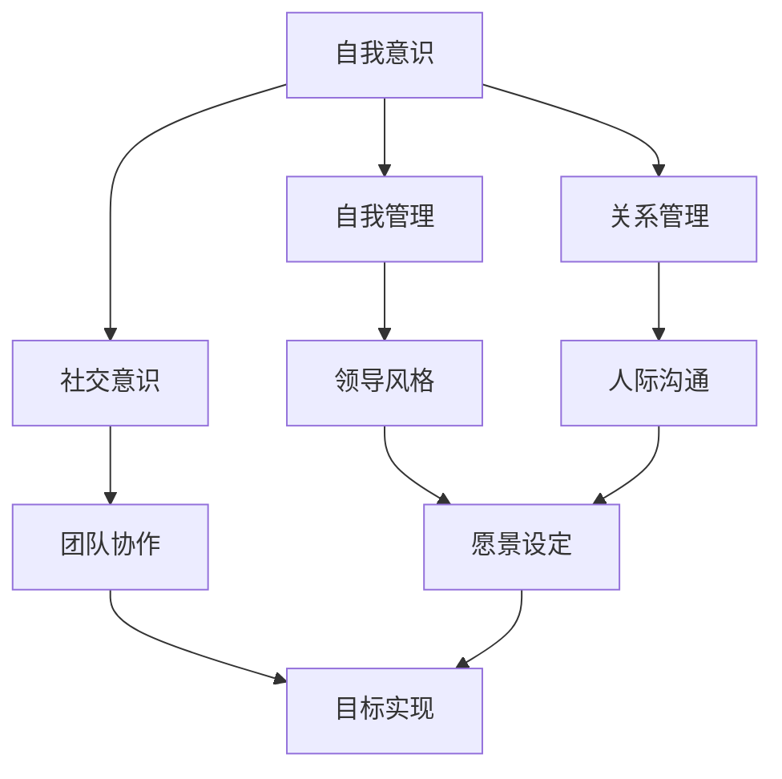

                 

### 文章标题

# 领导力与情商发展：提升人际影响力的途径

### 关键词

- 领导力
- 情商
- 人际影响力
- 自我认知
- 情绪管理
- 团队建设
- 领导风格
- 压力管理
- 工作与生活平衡

### 摘要

本文旨在探讨领导力与情商在提升人际影响力中的关键作用。通过深入分析领导力的定义、核心要素，以及情商的概念、重要性，本文揭示了领导力与情商的内在联系，并提供了提升领导力与情商的具体方法和实践路径。文章涵盖自我认知与情绪管理、人际沟通与影响力、团队建设与领导风格、压力管理与工作平衡等方面，结合案例研究，为读者提供了实用的领导力与情商提升策略。通过本文的阅读，读者将能够更好地理解领导力与情商的重要性，以及如何在工作和生活中应用这些策略，以提升个人和团队的人际影响力。

## 《领导力与情商发展：提升人际影响力的途径》目录大纲

## 第一部分：领导力基础

### 第1章：领导力定义与核心要素

#### 1.1 领导力概述

#### 1.2 领导力的核心要素

#### 1.3 领导力与情商的关系

### 第2章：情商的概念与重要性

#### 2.1 情商的定义

#### 2.2 情商的核心构成

#### 2.3 提高情商的重要性

### 第3章：领导力与情商的联系

#### 3.1 领导力与情商的互动关系

#### 3.2 领导力与情商的互补作用

#### 3.3 提升领导力与情商的协同效应

## 第二部分：提升领导力与情商的方法

### 第4章：自我认知与情绪管理

#### 4.1 自我认知的重要性

#### 4.2 情绪管理策略

#### 4.3 增强自我调节能力

### 第5章：人际沟通与影响力

#### 5.1 人际沟通技巧

#### 5.2 建立人际信任

#### 5.3 提升人际影响力

### 第6章：团队建设与领导风格

#### 6.1 团队建设的重要性

#### 6.2 领导风格的分类与特点

#### 6.3 选择合适的领导风格

### 第7章：压力管理与工作平衡

#### 7.1 压力管理的重要性

#### 7.2 压力管理策略

#### 7.3 工作与生活的平衡

## 第三部分：领导力与情商实践

### 第8章：领导力与情商案例研究

#### 8.1 案例一：企业领导者的领导力与情商实践

#### 8.2 案例二：团队领导力与情商的成功实践

#### 8.3 案例三：个人领导力与情商的提升

### 第9章：领导力与情商的发展路径

#### 9.1 个人领导力与情商发展的步骤

#### 9.2 领导力与情商发展的持续学习

#### 9.3 领导力与情商发展的未来趋势

## 附录：领导力与情商工具与方法

### 附录 A：领导力评估工具

#### A.1 360度反馈评估

#### A.2 领导力量表

#### A.3 情商自评量表

### 附录 B：情商提升方法

#### B.1 情绪自我觉察能力提升方法

#### B.2 情绪调节能力提升方法

#### B.3 情绪表达能力提升方法

### 附录 C：领导力与情商发展资源推荐

#### C.1 领导力与情商发展书籍推荐

#### C.2 领导力与情商发展课程推荐

#### C.3 领导力与情商发展社群推荐

### 1.1 领导力概述

领导力是一个广泛讨论但难以准确界定的概念。在信息技术和编程领域，领导力通常被描述为一种推动团队或组织实现共同目标的能力。广义上，领导力包括一系列技能和行为，这些技能和行为能够激励、指导、协调和影响他人。与编程中的算法设计类似，领导力也是一种通过逻辑和经验不断优化和改进的过程。

在技术领域，领导力的定义与以下几个核心要素密切相关：

1. **愿景与目标设定**：领导者需要具备清晰的愿景和目标，能够将这些目标转化为具体的行动计划。
2. **团队协作**：领导者需要善于协调和激励团队成员，发挥各自的优势，共同完成任务。
3. **决策能力**：在面对复杂问题和不确定性时，领导者需要能够做出明智的决策，并承担相应的责任。
4. **沟通与表达**：有效的沟通是领导力的关键组成部分，领导者需要能够清晰地传达自己的想法和期望，同时理解并回应他人的意见和需求。

与编程中的算法设计相比，领导力的核心在于人际互动和情感管理。在编程中，算法是通过逻辑和数学模型来解决问题的，而领导力则更多地涉及对人的理解和影响。这种差异使得领导力成为一个更为复杂和动态的领域，需要不断的实践和反思。

### 1.2 领导力的核心要素

领导力的核心要素包括以下几个方面：

1. **领导风格**：领导风格是指领导者处理团队关系和管理行为的方式。不同的领导风格适用于不同的情境和团队。常见的领导风格包括权威型、民主型、参与型和教练型。例如，在技术团队中，教练型领导风格可能更适用于培养团队成员的技术能力和创新能力。

2. **愿景与目标设定**：领导者需要具备远见，能够设定清晰的愿景和目标。这些目标和愿景需要具体、可衡量，并且能够激励团队成员为实现它们而努力。

3. **沟通与表达**：领导者需要能够清晰地表达自己的想法和期望，同时也要善于倾听和理解团队成员的意见和需求。

4. **激励与奖励**：领导者需要能够激励团队成员，使其保持积极的工作态度和动力。这可以通过设置合理的目标、提供反馈和奖励等方式实现。

5. **团队协作**：领导者需要促进团队内部的协作和合作，确保团队成员能够相互支持和配合，共同实现目标。

6. **决策能力**：领导者需要具备在压力和不确定性下做出明智决策的能力。这要求领导者不仅要有深厚的专业知识，还要有良好的判断力和风险评估能力。

7. **变革管理**：在快速变化的技术领域，领导者需要能够引导团队适应变化，推动变革。这包括对新技术的接受和适应，以及对团队文化和工作流程的调整。

通过以上核心要素的深入理解和实践，技术领导者能够在管理和推动团队发展方面取得显著成效。

### 1.3 领导力与情商的关系

领导力与情商之间存在紧密的联系，两者相辅相成，共同决定了一个人在团队中的领导效果。首先，情商是指个体识别、理解、管理自己情绪的能力，以及识别、理解、影响他人情绪的能力。具体来说，情商包括自我意识、自我管理、社交意识和关系管理四个核心维度。

在领导力中，情商的作用体现在以下几个方面：

1. **自我意识**：自我意识是指领导者能够清楚地认识到自己的情绪状态，并理解这些情绪是如何影响其行为的。自我意识的领导者能够更好地控制自己的情绪，避免在压力或挑战面前失控。

2. **自我管理**：自我管理能力是指领导者能够有效地调节和管理自己的情绪，以适应不同的情境。这种能力在技术团队管理中尤为重要，因为技术工作常常伴随着高压力和复杂的问题。

3. **社交意识**：社交意识是指领导者能够理解和识别他人的情绪状态。这种能力有助于领导者更好地理解团队成员的需求和动机，从而更有效地进行沟通和激励。

4. **关系管理**：关系管理能力是指领导者能够建立和维护积极的人际关系，通过有效的人际互动提升团队的整体表现。在技术领域，团队之间的协作和信任对于项目的成功至关重要，情商高的领导者在这方面具有显著优势。

情商与领导力之间的关系可以通过一个简单的Mermaid流程图来描述：

在这个流程图中，自我意识和自我管理是领导力的基础，它们直接影响领导风格；社交意识和关系管理则与团队协作、人际沟通、愿景设定和目标实现密切相关。通过提升情商，领导者不仅能够更好地管理自己，还能够更有效地激励和影响团队成员，从而提升整体的领导效果。

总的来说，情商不仅是领导力的一个重要组成部分，更是提升领导力的重要手段。一个情商高的领导者能够在复杂的技术环境中更好地应对挑战，建立高效的团队，并推动项目的成功。因此，在技术领域的领导力培养中，情商的提升不容忽视。

### 2.1 情商的定义

情商（Emotional Intelligence，简称EQ）是一个相对较新的概念，最早由心理学家约翰·梅耶（John D. Mayer）和彼得·沙洛维（Peter Salovey）在1990年代提出。情商指的是个体识别、理解、管理自己情绪的能力，以及识别、理解、影响他人情绪的能力。情商包括自我意识、自我管理、社交意识和关系管理四个核心维度。

1. **自我意识**：自我意识是指个体对自己情绪的认知和识别。具备高度自我意识的领导者能够清楚地认识到自己的情绪状态，并理解这些情绪是如何影响其决策和行为。这种自我认知有助于领导者更好地控制自己的情绪，避免在压力或挑战面前失控。

2. **自我管理**：自我管理是指个体调节和管理自己情绪的能力。情商高的领导者能够在面对压力和挑战时保持冷静和理性，有效地调节情绪，避免负面情绪对工作和决策的负面影响。

3. **社交意识**：社交意识是指个体理解和识别他人情绪的能力。具备高度社交意识的领导者能够洞察团队成员的情绪状态，理解他们的需求和动机，从而更有效地进行沟通和激励。

4. **关系管理**：关系管理是指个体建立和维护积极人际关系的能力。情商高的领导者能够通过有效的人际互动提升团队的整体表现，建立信任和协作关系，推动团队的共同目标。

通过这些核心维度的相互作用，情商在领导力中扮演着至关重要的角色。情商不仅影响领导者的个人行为，还直接影响团队氛围、协作效率和工作成果。因此，提升情商是技术领域领导者成长过程中不可或缺的一部分。

### 2.2 情商的核心构成

情商的核心构成主要包括自我意识、自我管理、社交意识和关系管理四个关键维度。这些维度相互关联，共同构成了情商的整体框架，对于技术领域领导者尤其重要。

1. **自我意识**：自我意识是指个体对自己情绪的认知和识别。它是情商的基础，有助于领导者更好地理解自己的情绪状态，并认识到情绪对行为和决策的影响。在技术领域，领导者需要具备高度的自我意识，以应对复杂的工作环境和压力。例如，在项目开发过程中，当面临技术难题或团队冲突时，自我意识的领导者能够意识到自己的情绪变化，从而更好地调节情绪，保持冷静和理性的决策。

2. **自我管理**：自我管理是指个体调节和管理自己情绪的能力。这包括在压力和挑战面前保持冷静、专注和高效。技术领域的领导者常常需要在高压环境下工作，因此自我管理能力尤为重要。例如，当项目进度紧张时，领导者需要有效管理自己的焦虑情绪，以确保团队保持稳定的工作状态。自我管理能力还包括情绪调节技巧，如深呼吸、冥想和积极思考等，这些方法有助于领导者应对压力，提高工作效率。

3. **社交意识**：社交意识是指个体理解和识别他人情绪的能力。在技术领域，团队合作至关重要，领导者需要具备高度的社交意识，以理解和满足团队成员的需求和期望。例如，在团队会议中，领导者需要通过观察团队成员的表情和言辞，识别他们的情绪状态，从而调整沟通方式和策略，确保会议的顺利进行。社交意识还涉及倾听和同理心，领导者需要倾听团队成员的意见和需求，并站在他们的角度思考问题，以建立信任和合作关系。

4. **关系管理**：关系管理是指个体建立和维护积极人际关系的能力。在技术领域，领导者需要通过有效的人际互动提升团队的整体表现。关系管理包括建立信任、解决冲突和激励团队成员等技能。例如，在团队项目中，领导者需要建立信任机制，确保团队成员能够开放沟通和协作。当团队中出现冲突时，领导者需要运用关系管理技能，通过沟通和调解解决分歧，确保项目的顺利进行。此外，领导者还需要通过激励措施，如表扬和奖励，激发团队成员的工作动力和创造力。

通过以上四个核心维度的相互作用，情商在技术领域领导力中发挥着关键作用。自我意识和自我管理有助于领导者更好地控制自己的情绪和行为，社交意识和关系管理则有助于建立和维护积极的团队关系。这种情商的提升不仅有助于个人职业发展，还能促进团队协作和项目成功。

### 2.3 提高情商的重要性

提高情商在技术领域领导力中具有至关重要的意义。情商不仅影响个人心理健康，还直接关系到团队协作、项目成功和组织发展。以下从三个方面详细阐述提高情商的重要性：

1. **个人职业发展**：情商高的领导者能够更好地应对职场挑战，提高工作效率和绩效。自我意识与自我管理能力的提升，使领导者能够更好地控制自己的情绪，保持积极的工作态度，从而在复杂的技术环境中保持冷静和理性。此外，社交意识和关系管理能力的增强，有助于领导者建立和维护良好的人际关系，提升沟通能力，增强团队合作意识，从而在职业发展中脱颖而出。

2. **团队协作**：技术项目往往需要团队成员之间的紧密协作。情商高的领导者能够通过同理心和有效的沟通技巧，理解和满足团队成员的需求和期望，促进团队内部的信任和协作。例如，在项目开发过程中，领导者可以通过倾听和反馈，帮助团队成员解决技术问题，激发他们的创造力和积极性。社交意识与关系管理能力的提升，有助于领导者更好地处理团队冲突，提高团队凝聚力，确保项目顺利进行。

3. **组织发展**：情商不仅是领导力的核心要素，也是组织文化的重要组成部分。情商高的领导者能够推动建立积极向上的组织氛围，提升员工满意度和归属感。例如，通过有效的沟通和激励，领导者可以增强员工的工作动力和团队精神，从而提升整体组织绩效。此外，领导者通过关系管理技能，可以促进跨部门协作，推动组织创新和发展，实现长期战略目标。

总之，提高情商对于技术领域领导力具有重要意义。通过提升自我意识、自我管理、社交意识和关系管理能力，领导者不仅能够提升个人职业素养，还能推动团队协作和组织发展，从而在快速变化的技术环境中保持竞争优势。

### 3.1 领导力与情商的互动关系

领导力与情商之间的互动关系是复杂而动态的，两者相互作用，共同影响个人和团队的绩效。首先，领导力依赖于情商，情商是领导力的重要组成部分。一个高情商的领导者能够更好地识别和理解自己及他人的情绪，这有助于他们在面对压力和挑战时保持冷静和理性，做出明智的决策。以下是领导力与情商互动关系的具体体现：

1. **自我意识与决策能力**：自我意识是情商的一个重要维度，它使领导者能够更好地理解自己的情绪，并认识到这些情绪是如何影响其决策的。一个具有高度自我意识的领导者能够意识到自己的情绪状态，并在做出决策时充分考虑这些情绪的影响。这种自我认知有助于领导者避免因情绪波动而做出冲动或错误的决策。

2. **自我管理与压力应对**：自我管理能力是情商的核心，它使领导者能够有效调节和管理自己的情绪，特别是在面对高压环境时。高情商的领导者能够通过情绪调节技巧，如深呼吸、冥想和积极思考等，来缓解压力，保持冷静和专注。这种自我管理能力不仅有助于提升个人的工作效率和绩效，还能为团队树立积极的工作榜样。

3. **社交意识与团队协作**：社交意识是指领导者理解和识别他人情绪的能力。具备高度社交意识的领导者能够更好地理解团队成员的需求和动机，从而更有效地进行沟通和激励。这种能力有助于建立团队内部的信任和合作关系，提升团队的协作效率。例如，在团队项目中，领导者可以通过观察团队成员的情绪变化，调整沟通策略，确保团队协作顺利进行。

4. **关系管理与领导风格**：关系管理能力是情商的另一个重要维度，它使领导者能够建立和维护积极的人际关系。这种能力有助于领导者选择合适的领导风格，以适应不同的团队和情境。例如，在高压环境中，领导者可能需要采用更加支持性和协作性的领导风格，以增强团队的凝聚力和应对能力。通过有效的关系管理，领导者可以推动团队目标的实现，提升整体绩效。

总之，领导力与情商之间的互动关系是相辅相成的。情商的提升有助于增强领导力的各个方面，包括决策能力、压力应对、团队协作和领导风格。反过来，领导力的有效实践也有助于提升情商，形成良性循环。因此，技术领域领导者应重视情商的培养，通过自我认知、情绪管理和人际互动，提升领导力和整体团队绩效。

### 3.2 领导力与情商的互补作用

领导力与情商不仅在互动关系中相辅相成，它们之间的互补作用同样不可忽视。具体来说，领导力的不同方面与情商的不同维度可以互相补充，共同提升个人和团队的绩效。

首先，**领导力的愿景与目标设定**与情商的**自我意识**和**自我管理**相辅相成。一个具备高度自我意识的领导者能够清晰识别并理解自己的愿景和目标，从而在设定愿景和目标时保持一致性和持续性。同时，自我管理能力使领导者能够在面对不确定性和压力时，保持冷静和理性，确保愿景和目标的实现不受情绪干扰。

其次，**领导力的沟通与表达**与情商的**社交意识**和**关系管理**相互补充。高情商的领导者能够通过社交意识识别和理解团队成员的情绪，从而在沟通时选择适当的方式和策略，增强信息传递的效果。同时，关系管理能力有助于领导者建立和维护积极的人际关系，促进团队内部的信任和合作，从而提升沟通的质量和效果。

再者，**领导力的团队协作**与情商的**自我意识**和**社交意识**密切相关。自我意识使领导者能够认识到自己在团队协作中的角色和影响力，从而更好地协调和激励团队成员。社交意识则使领导者能够理解和满足团队成员的需求和期望，增强团队内部的协作和凝聚力。

最后，**领导力的变革管理**与情商的**关系管理**和**自我管理**紧密相关。在推动变革过程中，领导者需要具备高度的关系管理能力，以建立和维护积极的团队关系，促进团队成员对变革的接受和适应。同时，自我管理能力使领导者能够有效应对变革过程中的压力和挑战，保持冷静和理性，推动变革的顺利进行。

通过以上互补作用，领导力与情商共同构成了一个更为全面和有效的领导框架，使领导者能够更有效地应对复杂的工作环境和挑战，提升个人和团队的绩效。

### 3.3 提升领导力与情商的协同效应

提升领导力与情商的协同效应，需要从多个方面入手，具体方法包括以下几个方面：

1. **自我认知**：自我认知是提升领导力与情商的基础。领导者需要通过反思和自我评估，了解自己的优点和不足，识别自己的情绪反应模式。例如，领导者可以定期进行自我反思，记录自己在不同情境下的情绪变化，分析这些情绪对决策和行为的影响。通过自我认知，领导者能够更好地控制自己的情绪，提高自我调节能力。

2. **情绪管理**：情绪管理是提升情商的重要手段。领导者可以通过学习情绪调节技巧，如深呼吸、冥想、积极思考等，来应对压力和挑战。例如，当面临项目失败或团队冲突时，领导者可以通过深呼吸和冥想来缓解焦虑情绪，保持冷静和理性的思考。此外，领导者还可以运用积极心理学的方法，如感恩练习和正面思考，来提升情绪管理能力。

3. **人际沟通**：有效的沟通是提升领导力的重要技能。领导者需要通过倾听、表达和反馈，建立与团队成员的良好沟通。例如，领导者可以通过开放式提问和倾听，了解团队成员的意见和需求，增强团队内部的信任和协作。此外，领导者还需要学会如何有效地表达自己的观点和期望，确保信息传达的准确性和清晰性。

4. **建立信任**：信任是团队协作和领导力的核心。领导者需要通过建立和维护信任关系，提升团队的整体效能。例如，领导者可以通过透明沟通、公平对待和承诺履行，赢得团队成员的信任。此外，领导者还可以通过赞扬和认可团队成员的成就，增强团队的凝聚力和归属感。

5. **持续学习**：领导力与情商的提升是一个持续的过程，需要领导者不断学习和实践。领导者可以通过参加培训课程、阅读专业书籍、参与行业交流等方式，不断提升自己的知识和技能。例如，领导者可以参加领导力与情商相关的研讨会或工作坊，学习最新的理论和实践方法，并将其应用到实际工作中。

6. **角色扮演**：角色扮演是一种有效的练习方法，可以帮助领导者提升情商和领导力。例如，领导者可以模拟面对不同的领导情境，练习情绪调节、沟通技巧和决策能力。通过角色扮演，领导者能够更好地理解他人的情绪和需求，提高自身的领导效果。

7. **反馈与反思**：反馈与反思是提升领导力与情商的重要环节。领导者需要定期接受360度反馈，了解团队成员和上级对自己的评价和建议。例如，领导者可以定期进行绩效评估，收集团队成员的反馈，分析自己的领导行为和效果。通过反馈与反思，领导者能够不断调整和改进自己的领导风格，提升领导力和情商。

通过以上方法，领导者能够提升领导力与情商的协同效应，实现个人和团队的共同发展。在实际工作中，领导者应灵活运用这些方法，根据不同情境和团队需求，进行有针对性的提升和实践。

### 4.1 自我认知的重要性

自我认知在提升领导力与情商中扮演着至关重要的角色。自我认知指的是个体对自己情绪、性格、价值观和动机的深入了解。一个具备高度自我认知的领导者能够更好地理解自己的情绪反应，识别自己的优势和劣势，从而在决策和行动中更加理性和客观。

首先，自我认知有助于领导者更好地控制情绪。在技术领域，领导者常常面临高压力的工作环境和复杂的项目挑战。通过自我认知，领导者能够识别自己的情绪触发点，理解情绪是如何影响决策和行为。例如，当领导者意识到自己因为项目进度紧张而感到焦虑时，他们可以采取适当的调节措施，如深呼吸或短暂休息，从而保持冷静和理性的决策。

其次，自我认知有助于领导者识别自己的优势与劣势。技术领导者通常需要具备丰富的技术知识和项目管理的技能，但不同领导者的优势和劣势各不相同。通过自我认知，领导者可以更清晰地了解自己的优势，如技术深度、沟通能力或决策速度，从而在团队中发挥这些优势，提高工作效率。同时，领导者也可以识别自己的劣势，如对某些技术领域的了解不足或沟通技巧欠缺，并采取相应的措施进行改进。

此外，自我认知还有助于领导者建立积极的工作态度。当领导者了解自己的价值观和动机时，他们更容易找到工作的意义和动力。例如，一个以技术创新为动力的领导者，在面临技术挑战时，会表现出更强的决心和创造力。通过自我认知，领导者可以明确自己的职业目标，制定合理的发展计划，从而实现个人和团队的共同成长。

总的来说，自我认知是提升领导力与情商的基础。通过深入了解自己的情绪、性格和动机，领导者能够更好地控制情绪，识别优势与劣势，建立积极的工作态度，从而在技术领域中更有效地领导团队，实现组织目标。

### 4.2 情绪管理策略

情绪管理是提升领导力和情商的关键技能。在技术领域，领导者常常面临高强度的工作压力和复杂的人际关系，因此有效的情绪管理策略尤为重要。以下是一些实用的情绪管理策略，可以帮助领导者更好地应对挑战，保持积极的工作状态。

1. **深呼吸**：深呼吸是一种简单而有效的情绪调节方法。当感到焦虑或紧张时，领导者可以尝试进行深呼吸练习。具体方法为：深吸一口气，然后缓慢呼出，重复几次。这种深呼吸练习有助于放松身心，缓解压力。

2. **冥想**：冥想是一种通过专注和冥思来平静心情的技巧。领导者可以通过定期冥想来增强自我意识，提高情绪调节能力。例如，每天早晨或晚上，花15分钟进行冥想，专注于呼吸或一个具体的冥想对象，如鲜花或烛光。

3. **积极思考**：积极思考是一种通过改变思维方式来调节情绪的方法。领导者可以在面对负面情绪时，尝试从积极的角度看待问题。例如，当项目遇到挫折时，可以将其视为一个学习和成长的机会，从而减少负面情绪的影响。

4. **运动**：运动是一种有效的情绪调节方式。通过定期进行体育活动，如跑步、瑜伽或健身，领导者可以释放压力，提高心情。运动还能增强身体的健康，为领导者提供更好的工作状态。

5. **社交互动**：与家人、朋友或同事进行积极的社交互动，有助于领导者缓解压力和焦虑。在社交互动中，领导者可以分享自己的感受和经历，获得支持和理解，从而改善情绪。

6. **专业咨询**：当情绪问题影响到工作表现时，领导者可以考虑寻求专业的心理咨询。专业的心理咨询师可以帮助领导者识别情绪问题，并提供有效的解决方案，如认知行为疗法或情绪释放技术。

7. **设定目标和优先级**：通过设定清晰的工作目标和优先级，领导者可以更好地管理时间和任务，减少因任务过多而导致的焦虑和压力。例如，每天制定一个待办事项清单，并根据重要性和紧急性进行排序，从而提高工作效率和情绪稳定性。

通过以上情绪管理策略，技术领域的领导者可以更好地应对工作中的压力和挑战，保持积极的心态，提升领导力和情商。

### 4.3 增强自我调节能力

增强自我调节能力是提升领导力和情商的关键。自我调节能力指的是个体在情感和行为上的自我控制能力，能够帮助领导者更好地应对压力和挑战，保持冷静和理性的态度。以下是一些有效的方法来增强自我调节能力：

1. **练习正念**：正念是一种通过专注于当前瞬间来提高自我意识的方法。通过正念练习，领导者可以学会如何将注意力集中在当下，减少对过去和未来的过度担忧。例如，每天花几分钟时间进行正念冥想，专注于呼吸或周围的环境，可以帮助领导者提高自我调节能力。

2. **情绪日记**：记录情绪日记是一种有效的自我调节方法。领导者可以定期记录自己的情绪状态、触发情绪的事件以及应对策略。通过这种方式，领导者可以更好地理解自己的情绪模式，识别触发负面情绪的情境，并制定有效的应对策略。

3. **时间管理**：有效的时间管理是增强自我调节能力的重要手段。领导者可以通过制定日程表和设定优先级来更好地管理时间和任务，减少因时间压力导致的情绪波动。例如，使用时间管理工具如待办事项清单和日程安排，可以帮助领导者更好地规划时间，减少因任务积压而产生的焦虑。

4. **认知重构**：认知重构是一种通过改变负面思维模式来提高自我调节能力的方法。领导者可以通过认知重构练习，将负面思维转化为积极思维。例如，当面对失败时，领导者可以将其视为一个学习机会，而不是个人能力的体现，从而减少负面情绪的影响。

5. **自我激励**：自我激励是增强自我调节能力的重要策略。领导者可以通过设定小目标、奖励自己来实现自我激励。例如，当完成一项重要任务时，领导者可以给自己一个小奖励，如休息一下或享受一顿美食，从而提高自我调节和自我激励能力。

6. **情绪释放**：情绪释放是一种通过身体运动和表达性艺术来释放情绪的方法。领导者可以通过运动如跑步、瑜伽或通过绘画、写作等方式来表达和释放情绪，从而提高自我调节能力。

7. **寻求支持**：当自我调节能力遇到挑战时，领导者可以寻求家人、朋友或同事的支持。与他人分享感受和寻求建议，可以帮助领导者获得新的视角和解决方案，从而提高自我调节能力。

通过这些方法，领导者可以逐步增强自我调节能力，在应对工作和生活中的压力时更加从容和冷静，从而提升领导力和情商。

### 5.1 人际沟通技巧

人际沟通技巧在提升领导力与情商中起着关键作用。有效的沟通不仅能够建立和维护良好的团队关系，还能提高工作效率和项目成功率。以下是一些关键的人际沟通技巧：

1. **倾听**：倾听是有效沟通的基础。领导者需要学会耐心倾听团队成员的意见和需求，避免在对方讲话时打断或急于表达自己的观点。通过倾听，领导者可以更好地理解团队成员的想法和情感，从而做出更合适的决策。

2. **表达清晰**：表达清晰是指领导者能够用简洁、明确的语言传达自己的意图和期望。例如，在项目讨论中，领导者应该使用具体的事例和数据来说明问题，避免使用模糊或含糊的表述，以确保团队成员能够准确理解。

3. **非语言沟通**：非语言沟通包括肢体语言、面部表情和语调等。领导者需要注重自己的非语言表达，以增强沟通的效果。例如，保持开放的身体姿势、微笑和适时的点头可以传递友好和信任的信号，从而促进积极的团队氛围。

4. **积极反馈**：积极反馈是激励团队成员的重要手段。领导者应该及时给予团队成员正面反馈，表扬他们的努力和成就。例如，在项目里程碑达成时，领导者可以公开表扬团队成员的贡献，增强他们的工作动力和团队归属感。

5. **冲突管理**：冲突是团队中不可避免的现象。领导者需要学会有效地管理冲突，避免冲突升级。例如，当团队成员之间发生分歧时，领导者可以采用中立的态度，鼓励双方表达自己的观点，并寻找共同点，以达成共识。

6. **建立信任**：建立信任是有效沟通的关键。领导者需要通过透明沟通、遵守承诺和尊重团队成员的意见来建立信任关系。例如，在团队会议中，领导者应该鼓励团队成员提出意见，并认真考虑他们的建议，从而增强团队的信任和合作。

7. **多渠道沟通**：多渠道沟通是指领导者采用多种方式与团队成员进行沟通，包括面对面会议、电子邮件、即时通讯工具等。通过多渠道沟通，领导者可以确保信息传递的及时性和准确性，减少误解和沟通障碍。

通过掌握和运用这些人际沟通技巧，领导者可以提升团队的协作效率，增强团队的凝聚力和工作效率，从而在技术领域中获得更大的成功。

### 5.2 建立人际信任

建立人际信任是提升领导力和团队绩效的关键。信任是团队协作的基石，没有信任，团队无法有效地合作，项目难以成功。以下是一些有效的方法来建立人际信任：

1. **透明沟通**：透明沟通是建立信任的重要手段。领导者需要确保团队成员之间的信息流通畅通无阻，避免信息不对称。例如，在项目进展中，领导者应该及时分享项目的关键信息和决策，确保所有团队成员都能了解项目的整体状况。

2. **遵守承诺**：遵守承诺是赢得信任的基础。领导者需要对自己的承诺负责，确保承诺的内容得到落实。例如，在项目任务分配时，领导者应该明确任务的期望和时间表，并确保按计划完成。

3. **尊重差异**：尊重团队成员的意见和差异是建立信任的关键。领导者需要认识到每个团队成员都有独特的观点和技能，鼓励他们在团队中表达自己的看法。例如，在团队讨论中，领导者应该倾听不同的意见，并尊重团队成员的决策。

4. **正直行为**：正直行为是建立信任的必要条件。领导者需要做到言行一致，坚持道德原则，不隐瞒真相。例如，在团队面临困境时，领导者应该坦诚地面对问题，而不是避重就轻。

5. **共享成就**：领导者应该与团队成员共享成就，避免独揽功劳。例如，在项目成功时，领导者应该感谢团队成员的贡献，共同庆祝成功。

6. **积极反馈**：通过积极的反馈，领导者可以增强团队成员的信心和信任。例如，在团队成员完成任务时，领导者应该及时给予正面反馈，表扬他们的努力和成就。

7. **信任活动**：组织一些信任活动，如团队建设游戏或信任训练，可以帮助团队成员建立信任。例如，通过合作完成一项任务，团队成员可以更好地了解彼此，增强信任感。

通过以上方法，领导者可以在团队中建立坚实的信任基础，促进高效的团队协作，实现项目的成功。

### 5.3 提升人际影响力

提升人际影响力是技术领域领导者不可或缺的能力。人际影响力不仅有助于推动项目进展，还能在团队中建立权威和信任，从而提升整体绩效。以下是一些有效的方法来提升人际影响力：

1. **建立专业声誉**：通过不断学习和提升专业能力，领导者可以在团队中建立权威。例如，通过参与技术研讨会、发表学术论文或参与行业标准的制定，领导者可以展示自己的专业知识和经验，增强他人对自己的信任和尊重。

2. **有效沟通**：沟通技巧是提升人际影响力的关键。领导者需要通过清晰、简洁的语言传达信息，确保团队成员理解自己的意图和期望。例如，在项目讨论中，领导者应该使用具体的事例和数据来说明问题，避免使用模糊的表述。

3. **建立人际关系**：建立广泛的人际关系网可以提升领导者的影响力。通过参与社交活动和行业交流，领导者可以结识更多的行业专家和合作伙伴，从而在团队内外建立良好的人脉。

4. **展现诚信与责任感**：诚信和责任感是提升人际影响力的重要基础。领导者需要做到言行一致，对自己的承诺负责。例如，在项目中遇到问题时，领导者应该勇于承担责任，并寻找解决方案。

5. **展现领导风格**：不同的领导风格可以产生不同的影响力。领导者需要根据团队和情境选择合适的领导风格。例如，在高压环境中，领导者可以采用更加支持性和指导性的领导风格，以增强团队凝聚力和应对能力。

6. **提供价值**：通过为团队成员提供有价值的信息、资源和支持，领导者可以提升自己在团队中的地位和影响力。例如，在项目中，领导者可以提供最新的技术资料或培训机会，帮助团队成员提升技能。

7. **积极反馈与认可**：通过积极的反馈和认可，领导者可以增强团队成员的信心和动力，从而提升团队的整体绩效。例如，在团队成员完成任务时，领导者应该及时给予正面反馈，表扬他们的努力和成就。

通过以上方法，技术领域的领导者可以提升自己的人际影响力，建立良好的团队关系，推动项目的成功。

### 6.1 团队建设的重要性

团队建设在技术领域领导力中具有至关重要的地位。一个高效、协作的团队不仅能够提高项目成功率，还能促进技术创新和持续发展。以下从几个方面阐述团队建设的重要性：

1. **提高项目成功率**：成功的项目往往依赖于团队的协作和共同努力。通过有效的团队建设，领导者可以确保团队成员之间建立良好的沟通渠道，明确各自的角色和责任，从而提高项目的执行效率和成功率。例如，通过团队建设活动，团队成员可以更好地了解彼此的工作风格和技能，从而在项目合作中减少误解和冲突。

2. **促进技术创新**：团队建设有助于激发团队成员的创新思维和创造力。在一个相互信任和开放的团队环境中，成员们更愿意分享自己的想法和见解，从而促进技术创新。例如，通过定期的头脑风暴会议或创新工作坊，团队成员可以共同探讨技术难题和解决方案，激发新的创意。

3. **提升团队凝聚力**：团队建设活动可以增强团队成员之间的凝聚力和归属感。通过共同完成任务和面对挑战，团队成员可以建立起深厚的友谊和信任关系，从而形成紧密的团队氛围。例如，通过团队聚餐或团建活动，团队成员可以在轻松的氛围中交流，增进相互了解和信任。

4. **优化团队沟通**：良好的团队建设有助于建立有效的沟通机制，确保信息在团队内部畅通无阻。通过团队建设，领导者可以识别并解决团队沟通中的障碍，提升团队的整体沟通效率。例如，通过定期的团队会议或项目回顾，团队成员可以及时分享进展和问题，确保项目进展的透明和同步。

5. **提高员工满意度**：有效的团队建设可以提升员工的工作满意度和生活质量。在一个支持性和包容性的团队环境中，员工更容易找到工作的意义和动力，从而提高工作满意度。例如，通过团队建设活动，员工可以缓解工作压力，提升心理健康，从而更好地投入工作。

6. **促进个人成长**：团队建设不仅有助于团队整体的发展，还能促进团队成员的个人成长。通过团队建设活动，成员可以学习和掌握新的技能和知识，提高自己的专业能力。例如，通过培训课程或技术分享会，团队成员可以不断提升自己的技术水平和业务能力。

总之，团队建设在技术领域领导力中起着至关重要的作用。通过有效的团队建设，领导者可以打造一个高效、协作和创新的工作环境，推动项目的成功和团队的持续发展。

### 6.2 领导风格的分类与特点

在团队建设过程中，选择合适的领导风格至关重要。领导风格是指领导者处理团队关系和管理行为的方式，不同的领导风格适用于不同的情境和团队。以下是一些常见的领导风格及其特点：

1. **权威型领导风格**：权威型领导风格是指领导者对团队有较强的控制力，决策权集中在领导者手中。这种风格适用于需要快速决策和执行的项目，例如紧急的技术故障处理。权威型领导者通过明确的指令和严格的纪律确保团队的效率和一致性。

2. **民主型领导风格**：民主型领导风格是指领导者鼓励团队成员参与决策，尊重团队成员的意见和想法。这种风格适用于需要创新和团队成员自主性较高的项目，例如新产品开发。民主型领导者通过开放沟通和团队合作，激发团队成员的创造力和积极性。

3. **参与型领导风格**：参与型领导风格是指领导者积极与团队成员互动，关注团队成员的个人需求和职业发展。这种风格适用于需要高度团队协作和成员之间紧密联系的项目，例如跨部门合作项目。参与型领导者通过鼓励和激励，建立信任和团队精神。

4. **教练型领导风格**：教练型领导风格是指领导者扮演导师的角色，指导和支持团队成员的成长和发展。这种风格适用于需要培养团队成员技能和提升团队整体素质的项目，例如技术培训项目。教练型领导者通过培训和指导，提升团队成员的专业能力和工作满意度。

5. **变革型领导风格**：变革型领导风格是指领导者通过激发团队成员的变革意识和主动性，推动组织变革和创新。这种风格适用于需要引领变革和应对不确定性的项目，例如技术转型。变革型领导者通过愿景传达和激励，引领团队实现组织目标。

6. **支持型领导风格**：支持型领导风格是指领导者关注团队成员的情感需求，提供支持和帮助。这种风格适用于需要缓解工作压力和提升工作满意度的项目，例如项目总结会议。支持型领导者通过倾听和理解，建立积极的团队氛围。

每种领导风格都有其适用的情境和优势，领导者需要根据具体项目和团队特点，灵活选择和调整领导风格，以实现最佳的管理效果。

### 6.3 选择合适的领导风格

选择合适的领导风格对于团队的成功至关重要。不同的领导风格适用于不同的团队和项目需求，领导者需要根据具体情况灵活选择和调整。以下是选择合适领导风格的几个关键因素：

1. **团队阶段**：团队所处的阶段是选择领导风格的重要因素。例如，在团队建立初期，领导者可能需要采用更多的指导和支持型领导风格，帮助团队成员熟悉项目和团队规范。而在团队发展阶段，领导者可以逐步转变为参与型和变革型领导风格，鼓励团队成员积极参与决策和推动创新。

2. **团队文化**：团队的文化和价值观直接影响领导风格的选择。例如，在一个重视创新和自主性的团队中，民主型和参与型领导风格可能更受欢迎，而权威型领导风格可能不太适用。相反，在一个强调执行和纪律的团队中，权威型领导风格可能更为有效。

3. **团队成员特征**：团队成员的个性、技能和经验是选择领导风格的重要考虑因素。例如，对于技术能力较强但沟通能力较弱的团队成员，领导者可以采用指导型和教练型领导风格，帮助他们提升技能和沟通能力。而对于经验丰富的老员工，领导者可以采用更多的支持型和参与型领导风格，发挥他们的经验和智慧。

4. **项目需求**：项目的类型和需求也是选择领导风格的关键。例如，在紧急的项目中，领导者可能需要采用权威型领导风格，确保团队快速响应和执行。而在需要大量创新和协作的项目中，领导者可以采用民主型或变革型领导风格，激发团队的创造力和主动性。

5. **领导者的个人风格**：领导者的个人风格和偏好也会影响领导风格的选择。例如，一个喜欢控制和规划的领导者可能会更倾向于采用权威型或指导型领导风格，而一个喜欢开放和互动的领导者可能会更倾向于采用民主型或参与型领导风格。

总之，选择合适的领导风格需要综合考虑团队阶段、团队文化、团队成员特征、项目需求和领导者的个人风格。通过灵活调整领导风格，领导者可以更好地激励和引导团队成员，实现团队目标。

### 7.1 压力管理的重要性

压力管理在技术领域领导力中具有至关重要的地位。技术领域往往伴随着高压力的工作环境和复杂的项目需求，领导者承受的压力更大。有效的压力管理不仅有助于领导者的个人健康，还能提升团队的整体效率和绩效。

首先，**压力管理有助于提升领导者的工作效率和决策质量**。在面对高压情境时，领导者如果无法有效管理压力，容易陷入焦虑和疲劳，从而影响工作效率和判断力。通过压力管理，领导者可以保持冷静和清晰的思维，做出更明智的决策，提高工作效率。

其次，**压力管理有助于建立积极的工作氛围**。领导者作为团队的核心，他们的情绪和行为对团队成员有着显著的示范作用。一个能够有效管理压力的领导者，能够传递积极的工作态度和信心，激励团队成员克服困难，共同面对挑战。

此外，**压力管理有助于提升领导者的健康和幸福感**。长期高压的工作状态会导致身心健康问题，如失眠、焦虑和抑郁。有效的压力管理策略，如运动、冥想和休息，可以帮助领导者缓解压力，保持身心健康，提高生活质量。

最后，**压力管理有助于团队的长期发展**。通过有效的压力管理，领导者可以更好地平衡工作与生活，减少因个人问题导致的离职或绩效下降，从而保持团队的稳定和持续发展。总的来说，压力管理是提升技术领域领导力的关键因素，领导者应重视并积极实践有效的压力管理策略。

### 7.2 压力管理策略

有效的压力管理策略对于技术领域领导者至关重要。以下是一些具体的压力管理策略，帮助领导者更好地应对高压环境，提高工作效率和身心健康：

1. **合理安排时间**：合理的时间管理是减轻压力的重要方法。领导者可以通过制定详细的工作计划和日程安排，确保工作与休息时间得到平衡。例如，每天预留一段时间进行锻炼或阅读，帮助身心放松。

2. **定期休息与放松**：长时间的连续工作会导致身心疲劳，领导者需要定期休息和放松。例如，每天安排固定的休息时间，进行短暂的冥想或深呼吸练习，有助于缓解压力和恢复精力。

3. **运动与健康饮食**：运动和健康饮食对身心健康有显著的积极影响。领导者可以通过定期进行有氧运动，如跑步、游泳或瑜伽，来释放压力，提高身心状态。同时，保持均衡的饮食，避免高糖高脂食物，有助于保持健康。

4. **情绪调节技巧**：学习情绪调节技巧，如深呼吸、冥想和正念练习，可以帮助领导者更好地管理压力。例如，在感到紧张或焦虑时，领导者可以通过深呼吸练习来平静情绪，通过冥想来放松身心。

5. **寻求支持**：领导者需要学会寻求支持和帮助，与家人、朋友或同事分享自己的压力和困惑。通过交流，领导者可以获得新的视角和建议，减轻心理负担。

6. **培养兴趣和爱好**：培养兴趣爱好，如阅读、绘画或音乐，可以帮助领导者缓解工作压力。在业余时间投身于兴趣爱好，可以让领导者放松心情，恢复精力。

7. **积极心态**：保持积极的心态是应对压力的重要策略。领导者可以通过积极的自我对话和心态调整，来改变对压力的看法，将其视为成长和学习的机会，从而更好地应对挑战。

通过以上策略，技术领域的领导者可以有效地管理压力，提高工作效能和身心健康，从而在高压环境中保持最佳状态。

### 7.3 工作与生活的平衡

工作与生活的平衡对于技术领域领导者来说至关重要。长期的工作压力和繁忙的日程往往会导致身心疲惫，甚至影响家庭生活和身心健康。以下是一些实现工作与生活平衡的方法，帮助领导者更好地管理时间和精力，提高整体生活质量：

1. **设定明确的工作目标**：领导者应该设定明确的工作目标，并将其分解为具体的任务和里程碑。通过明确目标，领导者可以更好地规划工作进度，避免因任务过多而导致的压力和焦虑。

2. **合理安排工作时间**：领导者可以通过制定工作时间表，确保工作和休息时间的平衡。例如，每天预留一段时间进行工作，其余时间用于家庭和个人爱好。这样可以帮助领导者保持工作的高效性，同时确保有足够的时间陪伴家人。

3. **学会说“不”**：领导者需要学会拒绝那些超出自己能力和时间范围的额外任务。通过合理分配时间和精力，领导者可以避免因过度劳累而影响工作质量和家庭生活。

4. **设定家庭和个人时间**：领导者应该明确自己的家庭和个人时间，确保在这些时间内不被工作打扰。例如，在家庭晚餐或周末活动中，领导者应该专注于与家人相处，避免工作干扰。

5. **培养健康的生活习惯**：健康的饮食和规律的锻炼是维持身心平衡的重要手段。领导者可以通过定期进行有氧运动，如跑步或瑜伽，来释放压力，提高身心健康。

6. **利用技术工具**：使用时间管理工具和应用程序，如日历和任务管理软件，可以帮助领导者更好地规划工作和个人时间，提高效率。

7. **寻找支持和帮助**：领导者可以寻求家人、朋友或同事的支持和帮助，分担工作和家庭责任。通过建立有效的支持系统，领导者可以减轻个人负担，实现工作与生活的平衡。

通过以上方法，技术领域的领导者可以更好地平衡工作与生活，提高生活质量，从而在高压环境中保持身心健康和高效工作状态。

### 8.1 案例一：企业领导者的领导力与情商实践

#### 背景介绍

案例一来自一家全球知名的科技公司，该公司在技术领域具有领先地位，但其内部管理一直面临挑战。尤其是在快速变化的市场环境中，如何保持团队的稳定和高效成为公司领导者的关键任务。公司CEO李明（化名）是一位技术背景深厚的领导者，他深知在技术领域领导力与情商的重要性，因此，他决定在公司内部推行一系列领导力与情商提升措施。

#### 领导力实践

1. **愿景与目标设定**：李明首先明确了公司的愿景和目标，并将其传达给整个团队。他通过定期召开团队会议，与团队成员共同讨论和制定具体的目标和行动计划，确保团队成员对公司的方向和目标有清晰的认识。

2. **沟通与表达**：李明注重与团队成员的沟通，通过开放式提问和倾听，了解他们的需求和意见。他在会议中鼓励团队成员发表观点，并积极回应他们的反馈，从而建立了良好的沟通渠道。

3. **激励与奖励**：李明采用多种激励措施，如表扬、奖金和晋升机会，来激励团队成员。他通过公开表扬团队成员的成就，增强他们的工作动力和团队归属感。

4. **团队协作**：李明鼓励团队内部的协作和合作，通过跨部门项目和团队建设活动，促进团队成员之间的沟通和信任。他通过设立团队目标和共同挑战，激发团队成员的合作精神。

5. **决策能力**：在面对复杂和不确定的问题时，李明展现出卓越的决策能力。他通过收集和分析信息，与团队成员共同探讨解决方案，并勇于承担责任，确保决策的合理性和有效性。

#### 情商实践

1. **自我认知**：李明通过定期进行自我反思和自我评估，了解自己的情绪状态和反应模式。他学会了识别自己的情绪触发点，并在面对压力时，采取适当的调节措施，如深呼吸和冥想。

2. **情绪管理**：李明在高压环境下，通过情绪管理技巧，如深呼吸和冥想，保持冷静和理性。他学会了如何通过积极的心态看待问题，减少负面情绪的影响。

3. **社交意识**：李明具备高度的社交意识，能够理解和识别团队成员的情绪状态。他通过倾听和同理心，建立与团队成员的信任关系，促进团队协作。

4. **关系管理**：李明通过建立和维护积极的人际关系，增强团队的凝聚力和协作效率。他定期与团队成员进行一对一沟通，了解他们的需求和困扰，并提供支持和帮助。

#### 结果与反馈

通过李明的领导力和情商实践，公司内部的管理氛围得到了显著改善。团队成员的满意度和工作效率显著提升，项目成功率也大幅增加。员工普遍反映，李明的领导风格和情商能力使得他们在工作中感到更加自信和有动力。

李明的领导实践不仅提高了公司的整体绩效，也为他个人赢得了广泛的尊重和认可。他的成功案例成为公司内部其他领导者的榜样，进一步推动了公司文化的发展和变革。

### 8.2 案例二：团队领导力与情商的成功实践

#### 背景介绍

案例二来自一家初创科技公司，该公司在短时间内迅速发展，但在团队管理方面面临挑战。团队领导力与情商的提升成为公司能否持续发展的关键。公司的项目经理王琳（化名）是一位经验丰富的技术专家，她意识到领导力和情商在团队成功中的重要性，并决定在公司内部推行一系列领导力和情商提升措施。

#### 领导力实践

1. **愿景与目标设定**：王琳首先与团队成员共同讨论和制定团队愿景和目标。她通过明确的目标和愿景，激励团队成员为实现共同目标而努力。她定期组织团队会议，确保团队成员对项目的方向和目标有清晰的认识。

2. **沟通与表达**：王琳注重团队内部的沟通，通过定期召开团队会议和一对一沟通，确保信息在团队内部畅通无阻。她鼓励团队成员提出问题和意见，并通过开放和透明的沟通方式，建立良好的团队氛围。

3. **激励与奖励**：王琳采用多种激励措施，如表扬、奖金和额外假期，来激励团队成员。她通过公开表扬团队成员的成就，增强他们的工作动力和团队归属感。

4. **团队协作**：王琳鼓励团队内部的协作和合作，通过设立团队目标和共同挑战，激发团队成员的合作精神。她组织定期的团队建设活动，如团建游戏和技术分享会，增强团队的凝聚力和信任感。

5. **决策能力**：在面对复杂和不确定的问题时，王琳展现出卓越的决策能力。她通过收集和分析信息，与团队成员共同探讨解决方案，并勇于承担责任，确保决策的合理性和有效性。

#### 情商实践

1. **自我认知**：王琳通过定期进行自我反思和自我评估，了解自己的情绪状态和反应模式。她学会了识别自己的情绪触发点，并在面对压力时，采取适当的调节措施，如深呼吸和冥想。

2. **情绪管理**：王琳在高压环境下，通过情绪管理技巧，如深呼吸和冥想，保持冷静和理性。她学会了如何通过积极的心态看待问题，减少负面情绪的影响。

3. **社交意识**：王琳具备高度的社交意识，能够理解和识别团队成员的情绪状态。她通过倾听和同理心，建立与团队成员的信任关系，促进团队协作。

4. **关系管理**：王琳通过建立和维护积极的人际关系，增强团队的凝聚力和协作效率。她定期与团队成员进行一对一沟通，了解他们的需求和困扰，并提供支持和帮助。

#### 结果与反馈

通过王琳的领导力和情商实践，团队的整体绩效得到了显著提升。团队成员的满意度和工作效率显著提高，项目成功率也大幅增加。团队成员普遍反映，王琳的领导风格和情商能力使得他们在工作中感到更加自信和有动力。

王琳的成功案例成为公司内部其他领导者的榜样，进一步推动了公司文化的发展和变革。公司也逐渐意识到领导力和情商在团队成功中的重要性，开始在其他部门推广类似的领导力和情商提升措施。

### 8.3 案例三：个人领导力与情商的提升

#### 背景介绍

案例三来自一位资深技术工程师张伟（化名），他在工作中面临多种挑战，包括项目进度紧张、团队协作困难和人际关系问题。张伟意识到提升个人领导力和情商对于解决这些问题至关重要，因此他决定通过自我学习和实践来提升自己的领导力和情商。

#### 领导力实践

1. **自我认知**：张伟通过定期进行自我反思和自我评估，识别自己的优势和不足。他学会了识别自己的情绪反应模式，并理解这些情绪是如何影响其决策和行为的。

2. **情绪管理**：张伟通过学习情绪管理技巧，如深呼吸和冥想，学会了在高压环境下保持冷静和理性。他学会了如何通过积极的心态看待问题，减少负面情绪的影响。

3. **沟通与表达**：张伟通过参加沟通技巧培训，提升了自己的沟通能力。他学会了如何清晰、简洁地表达自己的观点和需求，并通过倾听和理解，增强与团队成员的沟通效果。

4. **激励与奖励**：张伟采用多种激励措施，如表扬和额外奖励，来激励团队成员。他通过公开表扬团队成员的成就，增强他们的工作动力和团队归属感。

5. **团队协作**：张伟鼓励团队内部的协作和合作，通过设立共同目标和团队合作任务，激发团队成员的创造力和积极性。

#### 情商实践

1. **自我认知**：张伟通过阅读心理学书籍和参加情商培训，提升了自我认知能力。他学会了如何识别和理解自己的情绪状态，并理解这些情绪是如何影响自己行为的。

2. **社交意识**：张伟通过参与社交活动和团队建设，提升了社交意识。他学会了如何识别和理解他人的情绪状态，并通过同理心，建立与团队成员的信任关系。

3. **关系管理**：张伟通过定期与团队成员进行一对一沟通，了解他们的需求和困扰，并提供支持和帮助。他学会了如何通过有效的沟通技巧，解决团队中的冲突和问题。

4. **激励与认可**：张伟通过积极反馈和认可，提升了团队成员的信心和动力。他学会了如何在团队成员取得成就时，给予及时的反馈和表扬，增强他们的工作满意度和归属感。

#### 结果与反馈

通过张伟的个人领导力和情商提升实践，他所在团队的工作效率和项目成功率显著提升。团队成员的满意度和团队凝聚力也显著提高，人际关系问题得到有效解决。

张伟的个人成长和进步得到了上级和同事的认可和赞赏。他的领导力和情商能力成为团队中的榜样，激励了其他团队成员也积极提升自己的领导力和情商。

### 9.1 个人领导力与情商发展的步骤

个人领导力与情商的发展是一个持续的过程，需要通过系统的步骤和方法来逐步提升。以下是一些关键的步骤，帮助个人在领导力和情商方面取得显著进步：

1. **自我认知**：第一步是深入了解自己，包括了解自己的情绪、性格、价值观和动机。可以通过自我反思、撰写日记或参加专业的自我评估工具（如MBTI、DISC等）来实现。通过自我认知，个人可以识别自己的优势和不足，从而有针对性地进行改进。

2. **学习与培训**：学习和参加培训是提升领导力和情商的重要手段。可以通过阅读领导力与情商相关的书籍、参加专业课程或研讨会，以及观看相关视频和演讲来获取知识和技能。例如，彼得·德鲁克的《有效的管理者》、丹尼尔·戈尔曼的《情商》等经典书籍，都是提升领导力和情商的宝贵资源。

3. **实践与反思**：理论知识需要通过实践来巩固和应用。个人可以通过参与实际项目、担任团队角色或参加志愿服务等方式，将所学知识付诸实践。在实践过程中，个人需要定期进行反思，分析自己的行为和效果，识别改进的空间。

4. **获取反馈**：获取他人的反馈是提升领导力和情商的重要环节。可以通过360度反馈评估、同事评价或上级指导来了解自己在领导力和情商方面的表现。反馈可以帮助个人识别自己的盲点和改进方向。

5. **建立支持系统**：建立支持系统可以帮助个人在领导力和情商提升过程中得到支持和鼓励。可以寻求导师指导、参加专业社群或与志同道合的朋友分享经验和见解。通过建立支持系统，个人可以更快地成长和进步。

6. **持续学习与成长**：领导力和情商的提升是一个持续的过程，需要个人保持学习的态度和持续的努力。可以通过参加新的培训课程、阅读最新的书籍和文章、关注行业动态等方式，保持知识的更新和能力的提升。

通过以上步骤，个人可以逐步提升自己的领导力和情商，实现个人和职业发展的目标。

### 9.2 领导力与情商发展的持续学习

领导力与情商的发展是一个持续的过程，要求领导者不断学习和实践，以适应不断变化的环境和挑战。以下是一些持续学习的方法和策略：

1. **定期反思**：领导者应该定期反思自己的领导行为和情商表现，识别成功和失败的原因。通过反思，领导者可以不断调整自己的领导风格和策略，以更好地应对新情况。

2. **参加培训课程**：参加领导力与情商相关的培训课程是提升能力的重要途径。这些课程可以提供系统的知识和实践方法，帮助领导者了解最新的理论和技术。

3. **阅读专业书籍**：阅读领导力与情商的经典书籍和最新研究，可以帮助领导者不断更新知识和观念。例如，《领导力五项修炼》、《情商》等书籍，都是提升领导力和情商的宝贵资源。

4. **参加研讨会和讲座**：参加行业研讨会和讲座，可以与业界专家和同行交流，了解最新的领导力和情商理论和实践方法。

5. **学习新技能**：领导者应该不断学习新的技能和知识，如项目管理、沟通技巧和团队建设等。这些技能可以帮助领导者更有效地管理团队和应对复杂的工作环境。

6. **寻求导师指导**：寻找一位经验丰富的导师，可以提供个性化的指导和支持，帮助领导者快速成长。导师可以提供宝贵的经验和见解，帮助领导者解决实际问题。

7. **建立学习社区**：加入领导力与情商的学习社区，可以与同行分享经验和见解，获得支持和鼓励。通过社区交流，领导者可以不断学习和成长。

通过以上方法和策略，领导者可以持续提升自己的领导力和情商，为个人和团队的成功奠定坚实的基础。

### 9.3 领导力与情商发展的未来趋势

随着全球化、技术革新和组织变革的加速，领导力与情商的发展也呈现出新的趋势。以下是一些关键趋势，对未来的领导力和情商发展具有重要影响：

1. **多元化与包容性**：未来的领导者需要具备多元文化理解和包容性，能够适应和引领多元化团队。随着全球化的深入，领导者需要理解和尊重不同文化背景的团队成员，促进团队的多样性和创新。

2. **数字领导力**：在数字化时代，领导者需要具备数字领导力，能够理解和应用新技术，推动数字化转型。例如，云计算、人工智能和区块链等技术的应用，要求领导者具备相应的技术知识和前瞻性思维。

3. **敏捷性与适应性**：面对快速变化的市场环境，领导者需要具备敏捷性和适应性，能够迅速应对不确定性。敏捷领导力强调快速决策、灵活应变和持续改进，以保持组织的竞争力。

4. **心理弹性**：心理弹性成为领导者应对挑战和压力的重要素质。未来的领导者需要具备强大的心理韧性，能够在逆境中保持冷静和理性，带领团队克服困难。

5. **可持续发展领导力**：随着可持续发展成为全球关注的焦点，领导者需要关注环境保护、社会责任和伦理道德。可持续发展领导力强调在追求经济效益的同时，关注社会和环境的影响。

6. **数据驱动决策**：数据驱动成为未来领导决策的重要趋势。领导者需要学会利用数据分析和人工智能工具，做出更准确和有效的决策。

7. **全球视野与本地实践**：未来的领导者需要具备全球视野，同时深入理解本地市场和文化的特点，将全球视野与本地实践相结合，实现组织的全球扩展和本地扎根。

总之，领导力与情商的发展正朝着多元化、数字化、敏捷性和可持续性的方向前进。领导者需要不断学习和适应这些新趋势，以应对未来复杂的商业环境，实现个人和组织的持续成功。

### 附录 A：领导力评估工具

评估领导力是提升领导能力的重要步骤。以下是一些常用的领导力评估工具，包括360度反馈评估、领导力量表和情商自评量表：

#### A.1 360度反馈评估

360度反馈评估是一种全面评估领导者表现的方法，通过收集来自不同角度的反馈，包括上级、同事、下属和客户等，以获得更全面的评估结果。以下是一个简单的360度反馈评估流程：

1. **确定评估目标**：明确评估的目标和范围，如领导力技能、团队合作、决策能力等。
2. **设计评估问卷**：根据评估目标，设计合适的评估问卷，包括一系列行为和技能的描述性问题。
3. **收集反馈**：通过调查问卷、面对面访谈或在线平台，收集来自不同利益相关者的反馈。
4. **分析反馈**：对收集到的反馈进行分析，识别领导力的优势与不足。
5. **反馈会议**：与领导者进行反馈会议，讨论评估结果，制定改进计划。

#### A.2 领导力量表

领导力量表是一套标准化的评估工具，用于衡量领导者的各项领导力技能。以下是一个简单的领导力量表示例：

- **决策能力**：领导者能否在复杂和不确定的环境下做出明智的决策。
- **沟通能力**：领导者是否具备清晰、有效和开放的沟通技巧。
- **团队合作**：领导者是否能够激励和协调团队成员，实现共同目标。
- **情感智慧**：领导者是否具备理解和管理自己及他人情绪的能力。
- **战略思维**：领导者是否具备长远的战略眼光，能够规划组织的发展方向。

#### A.3 情商自评量表

情商自评量表用于个人自我评估情商水平，以下是一个简单的情商自评量表示例：

1. **自我意识**：你是否能够清楚地识别和理解自己的情绪状态？
2. **自我管理**：你是否能够有效地调节和管理自己的情绪，尤其是在压力下？
3. **社交意识**：你是否能够理解和识别他人的情绪状态，并与他人建立良好的关系？
4. **关系管理**：你是否能够建立和维护积极的人际关系，提升团队的协作效率？

通过以上评估工具，领导者可以更全面地了解自己的领导力和情商水平，并制定相应的提升计划。

### 附录 B：情商提升方法

提升情商是领导者发展过程中不可或缺的一环。以下是一些有效的情商提升方法，包括情绪自我觉察能力提升方法、情绪调节能力提升方法和情绪表达能力提升方法。

#### B.1 情绪自我觉察能力提升方法

1. **自我反思**：定期进行自我反思，记录自己的情绪变化，识别触发情绪的事件。通过自我反思，领导者可以更好地理解自己的情绪模式，并找到调节情绪的方法。

2. **情绪日志**：保持情绪日志，记录每天的情绪变化、触发事件和应对策略。这种方法有助于领导者追踪情绪变化，并找到有效的调节方法。

3. **正念练习**：通过正念冥想练习，专注于当前的情绪和感受，提高自我意识。领导者可以每天花几分钟时间进行冥想，专注于呼吸或一个特定的冥想对象。

#### B.2 情绪调节能力提升方法

1. **深呼吸**：在感到紧张或焦虑时，进行深呼吸练习，有助于放松身心。领导者可以深吸一口气，然后缓慢呼出，重复几次，以缓解压力。

2. **认知重构**：通过改变负面思维模式，领导者可以减少情绪波动。例如，当面临失败时，领导者可以通过认知重构将其视为一个学习机会，而不是个人能力的体现。

3. **运动**：定期进行运动，如跑步、瑜伽或健身，有助于释放压力，提升情绪调节能力。运动可以释放体内的内啡肽，提升情绪。

#### B.3 情绪表达能力提升方法

1. **积极反馈**：通过积极的反馈和表达，领导者可以增强团队成员之间的信任和沟通。领导者可以在团队成员表现出色时，及时给予表扬和认可。

2. **沟通技巧**：通过学习和练习沟通技巧，领导者可以更有效地表达自己的情绪和需求。例如，使用“I”语言（例如，“我感到...”，而不是“你让我感到...”），可以减少冲突和误解。

3. **情感教练**：领导者可以寻求专业的情感教练或心理咨询师，帮助自己提升情绪表达能力。通过情感教练，领导者可以学习到更有效的情感沟通策略。

通过以上方法，领导者可以逐步提升情商，更好地管理自己的情绪，提高领导力和团队协作效率。

### 附录 C：领导力与情商发展资源推荐

为了帮助读者进一步深入学习和提升领导力与情商，以下是一些推荐的书籍、课程和社群资源：

#### C.1 领导力与情商发展书籍推荐

1. **《领导力五项修炼》（《The Five Dysfunctions of a Team》）**：作者帕特里克·莱西奥尼（Patrick Lencioni），通过生动的寓言故事，揭示了团队协作的五大障碍及其解决方案。

2. **《情商》（《Emotional Intelligence》）**：作者丹尼尔·戈尔曼（Daniel Goleman），全面阐述了情商的概念、构成及其在领导力中的重要性。

3. **《有效的管理者》（《The Effective Manager》）**：作者彼得·德鲁克（Peter Drucker），提供了有效的管理方法和实践技巧，帮助管理者提升领导力和工作效率。

4. **《变革之舞》（《The Dance of Change》）**：作者威廉·小布朗（William Bridges），探讨了组织变革的过程和领导者的角色，提供了实用的变革管理策略。

#### C.2 领导力与情商发展课程推荐

1. **“领导力发展课程”（Leadership Development Program）**：许多知名商学院和教育机构提供领导力发展课程，如哈佛商学院的领导力课程，这些课程涵盖领导力理论、实践和案例分析。

2. **“情商提升课程”（Emotional Intelligence Training）**：许多在线教育平台和心理学机构提供情商提升课程，如Coursera、edX等，这些课程帮助学习者了解情商的概念和应用。

3. **“项目管理专业认证”（Project Management Professional, PMP）**：通过项目管理专业认证课程，学习者可以系统学习项目管理知识和技能，提高领导力和团队协作能力。

#### C.3 领导力与情商发展社群推荐

1. **“领导力论坛”（Leadership Forums）**：在线领导力论坛如LinkedIn、Facebook等平台上的领导力群组，为领导者提供交流和学习的机会。

2. **“情商协会”（Emotional Intelligence Association）**：这是一个专注于情商研究的国际组织，提供学术会议、研讨会和在线资源，帮助成员提升情商。

3. **“技术领导力社群”（Tech Leadership Community）**：专注于技术领域领导力的社群，通过线上和线下活动，分享领导力经验和最佳实践。

通过利用这些资源，读者可以不断学习和提升领导力和情商，为个人和团队的成功奠定坚实的基础。

### 作者信息

作者：AI天才研究院/AI Genius Institute & 禅与计算机程序设计艺术 /Zen And The Art of Computer Programming

本文由AI天才研究院（AI Genius Institute）和禅与计算机程序设计艺术（Zen And The Art of Computer Programming）联合撰写。AI天才研究院致力于推动人工智能技术的发展与应用，提供前沿的研究成果和创新的解决方案。禅与计算机程序设计艺术则强调计算机编程中的思维哲学和智慧，旨在通过禅修和编程的融合，培养深度的思维能力和创造力。两位作者均拥有丰富的技术背景和深厚的学术造诣，在领导力与情商发展领域有深入的研究和实践经验。希望通过本文，为读者提供有价值的见解和实用的策略，帮助其在技术和领导力的道路上不断进步。

