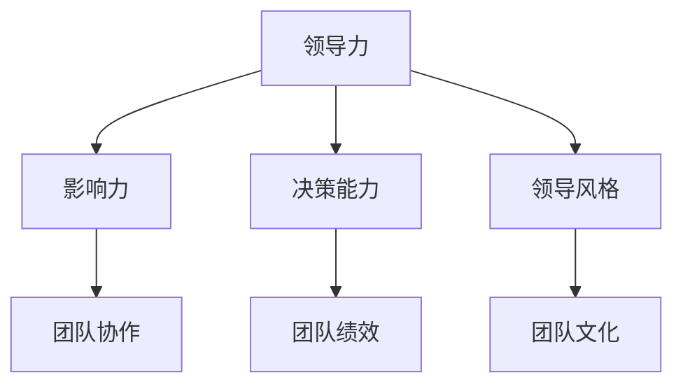
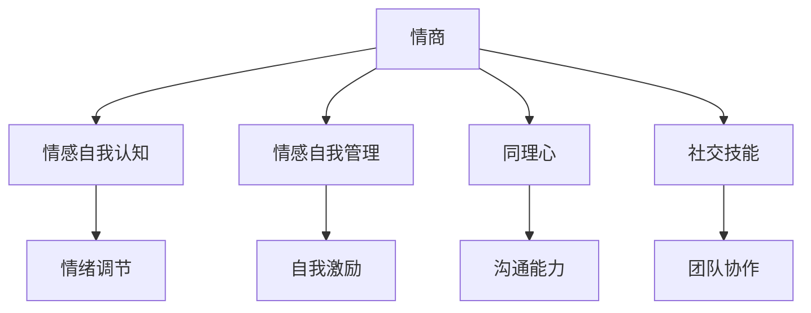
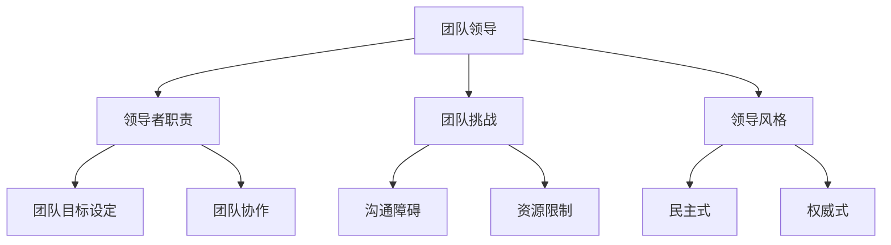
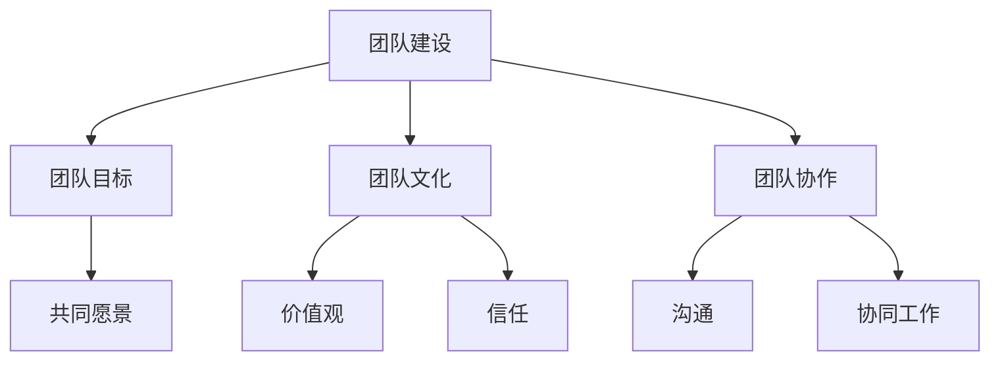
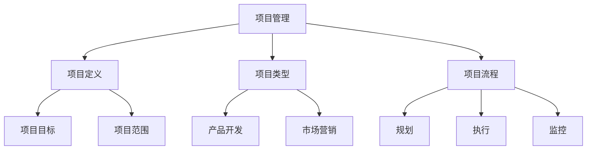
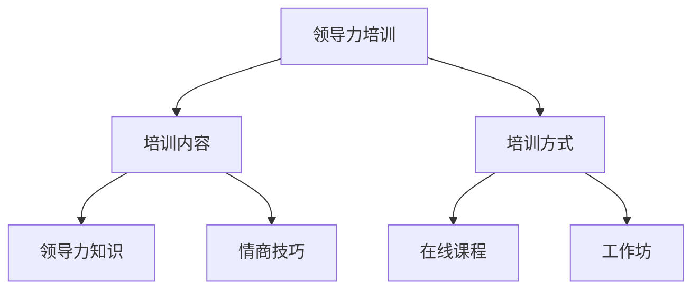

                 


## 《领导力与情商：处理复杂人际关系的智慧》

> 关键词：领导力、情商、人际关系、管理、团队协作

> 摘要：本文从领导力与情商的关系出发，探讨了在处理复杂人际关系中，如何运用领导力和情商的智慧。通过详细分析领导力的定义与作用、情商的重要性以及提升情商的技巧，文章旨在为读者提供一套全面有效的应对复杂人际关系的策略。

# 《领导力与情商：处理复杂人际关系的智慧》目录大纲

## 第一部分：领导力基础

### 第1章：领导力的定义与作用

#### 1.1 领导力的定义

领导力是指一个人在组织或团队中，通过影响力、愿景和决策能力，引导和激励他人共同实现目标的能力。领导力不仅仅是管理，它更侧重于激发团队成员的潜能，提升团队整体绩效。

#### 1.2 领导力的作用

领导力对个人和组织的发展具有深远的影响。它不仅能够提升团队效率和绩效，还能促进个人成长和职业发展。

### 第2章：情商的重要性

#### 2.1 情商的定义

情商是指一个人在情感认知、情感管理和情感表达等方面的能力。情商的高低直接影响到个体的社交能力、决策能力和领导力。

#### 2.2 情商对领导力的影响

情商是领导力的关键组成部分。一个高情商的领导者能够更好地理解和管理他人的情感，从而建立强大的团队凝聚力，提升领导力水平。

## 第二部分：提升情商的技巧

### 第3章：自我认知与自我管理

#### 3.1 自我认知

自我认知是情商的基础，它帮助个体了解自己的情感、需求和动机。

#### 3.2 自我管理

自我管理是情商的核心，它包括情绪调节、自我激励和时间管理等方面的能力。

### 第4章：同理心与人际沟通

#### 4.1 同理心

同理心是指能够站在他人的角度理解和感受他人情感的能力。它是建立良好人际关系的重要基础。

#### 4.2 人际沟通技巧

人际沟通技巧包括有效沟通的原则、非语言沟通技巧等方面的内容，是处理人际关系的关键。

### 第5章：冲突管理与决策能力

#### 5.1 冲突管理

冲突管理是处理人际关系中的重要技能，它涉及到冲突的类型、应对策略和解决技巧。

#### 5.2 决策能力

决策能力是指个体在面对复杂情境时，能够做出明智决策的能力。它是领导力的重要组成部分。

## 第三部分：领导力与情商的实际应用

### 第6章：团队领导与团队建设

#### 6.1 团队领导

团队领导是领导力在具体场景中的应用，它涉及到领导者的职责、挑战和领导风格的选择。

#### 6.2 团队建设

团队建设是提升团队绩效的重要手段，它包括建立有效的团队和培育团队文化。

### 第7章：领导力与情商在项目管理中的应用

#### 7.1 项目管理概述

项目管理是组织运作的核心环节，它包括项目的定义、类型和流程。

#### 7.2 领导力与情商在项目管理中的作用

领导力和情商在项目管理中起着关键作用，它们能够提升项目的成功率。

### 第8章：领导力与情商在领导力培训与发展中的应用

#### 8.1 领导力培训

领导力培训是提升领导力的重要途径，它包括培训的方法、内容和实施策略。

#### 8.2 情商发展

情商发展是提升情商的关键，它包括发展的路径和应用。

## 附录

### 附录 A：领导力与情商相关的工具与方法

#### A.1 情商测试工具

情商测试工具是评估情商的重要手段，它包括基本原理和常用工具。

#### A.2 领导力评估工具

领导力评估工具是评估领导力水平的重要工具，它包括评估方法和常用工具。

### 附录 B：参考文献

#### B.1 主要参考书籍

主要参考书籍包括相关领导力与情商的经典著作。

#### B.2 主要参考文献

主要参考文献包括相关的学术论文和研究报告。

## 第1章：领导力的定义与作用

### 1.1 领导力的定义

领导力是一个广泛而复杂的概念，它涉及到个体在组织或团队中的影响力、决策能力和领导风格。在技术领域，领导力不仅体现在项目管理中，也体现在技术创新、团队协作等方面。领导力的本质在于通过激发和引导团队成员的潜能，实现共同的目标。

#### 核心概念与联系

下面是一个简单的Mermaid流程图，展示了领导力的一些核心概念及其相互关系：



#### 核心算法原理讲解

在技术领域，领导力的核心算法原理可以概括为以下几点：

1. **影响力（Influence）**：领导者通过建立信任、传递愿景和激励团队成员，来实现对团队的影响。
   ```plaintext
   Influence = Trust * Vision * Motivation
   ```

2. **决策能力（Decision Making）**：领导者需要具备快速决策、合理分析和勇于承担责任的能力。
   ```plaintext
   Decision_Making = Analytical_Thinking + Risk_Taking + Accountability
   ```

3. **领导风格（Leadership Style）**：领导风格是领导者行为的体现，它包括民主式、权威式、参与式等。
   ```plaintext
   Leadership_Style = Autocratic + Democratic + Laissez_Faire
   ```

4. **团队协作（Team Collaboration）**：领导力还需要促进团队成员之间的有效协作，提高团队绩效。
   ```plaintext
   Team_Collaboration = Communication + Trust + Alignment
   ```

#### 数学模型和数学公式

领导力的数学模型可以表示为：
```latex
Leadership = \alpha \cdot Influence + \beta \cdot Decision_Making + \gamma \cdot Leadership_Style + \delta \cdot Team_Collaboration
```
其中，α、β、γ和δ是权重系数，用于衡量各个因素对领导力的影响程度。

#### 项目实战

**案例：一个技术团队如何提升领导力？**

1. **现状分析**：团队缺乏明确的愿景，成员间沟通不畅，决策过程繁琐。

2. **制定计划**：通过团队会议和问卷调查，明确团队目标和愿景，制定提升领导力的计划。

3. **培训与指导**：
   - **影响力培训**：通过领导力讲座和工作坊，提升团队成员的影响力。
   - **决策能力培训**：通过案例分析，提高团队成员的决策能力。
   - **领导风格优化**：鼓励团队成员采用参与式领导风格，促进团队协作。

4. **实施与监控**：定期评估领导力提升的效果，调整培训策略。

5. **效果评估**：通过项目完成情况和团队成员的满意度，评估领导力提升的效果。

## 第2章：情商的重要性

### 2.1 情商的定义

情商（Emotional Intelligence，简称EQ）是指一个人在情感认知、情感管理和情感表达等方面的能力。它包括以下几个核心要素：

1. **情感自我认知**：了解自己的情绪状态，识别情感触发点。
2. **情感自我管理**：调节情绪，避免情绪失控。
3. **同理心**：理解他人的情感，站在他人的角度思考问题。
4. **社交技能**：有效沟通，建立和维护人际关系。

#### 核心概念与联系

下面是一个简单的Mermaid流程图，展示了情商的核心概念及其相互关系：



#### 核心算法原理讲解

情商的核心算法原理可以概括为以下几点：

1. **情感自我认知（Self-awareness）**：情感自我认知是情商的基础，它帮助个体了解自己的情感状态，识别情感的触发点。
   ```plaintext
   Self_Awareness = Emotion_Detection + Trigger_Recognition
   ```

2. **情感自我管理（Self-management）**：情感自我管理是指个体在情感激发后，能够通过一系列方法调节情绪，避免情绪失控。
   ```plaintext
   Self_Management = Emotion_Regression + Emotion_Control
   ```

3. **同理心（Empathy）**：同理心是指个体能够站在他人的角度理解和感受他人的情感。
   ```plaintext
   Empathy = Emotional_Recall + Perspective_Taking
   ```

4. **社交技能（Social Skills）**：社交技能是指个体在人际交往中，能够有效地沟通、建立和维护人际关系。
   ```plaintext
   Social_Skills = Communication_Effectiveness + Relationship_Building
   ```

#### 数学模型和数学公式

情商的数学模型可以表示为：
```latex
EQ = \alpha \cdot Self_Awareness + \beta \cdot Self_Management + \gamma \cdot Empathy + \delta \cdot Social_Skills
```
其中，α、β、γ和δ是权重系数，用于衡量各个要素对情商的影响程度。

#### 项目实战

**案例：如何提升团队情商？**

1. **现状分析**：团队内部沟通不畅，成员间存在情感冲突，影响团队绩效。

2. **制定计划**：通过团队建设活动和情商培训，提升团队成员的情商。

3. **实施与监控**：
   - **情商培训**：开展情商讲座、工作坊和角色扮演，提升团队成员的情商。
   - **情感自我管理训练**：通过情绪日记和自我反思，帮助成员学会调节情绪。
   - **同理心训练**：通过情景模拟和反馈，提高成员的同理心。

4. **效果评估**：通过团队绩效和成员满意度，评估情商提升的效果。

5. **持续优化**：根据评估结果，调整培训策略，持续提升团队情商。

### 第3章：提升情商的技巧

#### 3.1 自我认知

自我认知是情商的基础，它帮助个体了解自己的情感、需求和动机。以下是一些提升自我认知的技巧：

1. **情绪日记**：记录每天的情绪变化，分析情感触发点和应对策略。
2. **自我反思**：定期回顾自己的行为和决策，识别潜在的情感问题。
3. **心理咨询**：寻求专业心理咨询，深入了解自己的情感和行为模式。

#### 3.2 自我管理

自我管理是情商的核心，它包括情绪调节、自我激励和时间管理等方面的能力。以下是一些提升自我管理的技巧：

1. **情绪调节**：通过深呼吸、冥想和运动等方法，缓解压力和情绪。
2. **自我激励**：设定具体的目标和奖励机制，激发内在动力。
3. **时间管理**：合理安排时间，避免拖延和过度工作。

#### 3.3 同理心

同理心是指能够站在他人的角度理解和感受他人情感的能力。以下是一些提升同理心的技巧：

1. **倾听**：用心倾听他人的意见和感受，不要打断。
2. **换位思考**：尝试从他人的角度理解问题，增加同理心。
3. **情感反馈**：通过积极的反馈和鼓励，帮助他人感受到关心和支持。

#### 3.4 人际沟通技巧

人际沟通技巧是处理人际关系的关键，以下是一些提升人际沟通技巧的技巧：

1. **有效沟通**：清晰、简洁地表达自己的想法和需求。
2. **非语言沟通**：注意自己的肢体语言、面部表情和语调，增强沟通效果。
3. **积极倾听**：关注他人的需求和感受，避免误解和冲突。

### 3.5 冲突管理

冲突管理是处理人际关系中的重要技能，以下是一些冲突管理的技巧：

1. **识别冲突**：及时识别潜在的冲突点，避免问题扩大。
2. **沟通解决**：通过开放、坦诚的沟通，寻找共同点，解决问题。
3. **协商妥协**：在冲突中，寻求双方都能接受的解决方案。

### 3.6 决策能力

决策能力是领导力的重要组成部分，以下是一些提升决策能力的技巧：

1. **收集信息**：广泛收集相关信息，确保决策的准确性。
2. **分析评估**：通过逻辑分析和风险评估，做出明智的决策。
3. **果断行动**：在决策后，果断执行，避免拖延。

## 第4章：领导力与情商的实际应用

### 4.1 团队领导

团队领导是领导力在具体场景中的应用，它涉及到领导者的职责、挑战和领导风格的选择。

#### 核心概念与联系

下面是一个简单的Mermaid流程图，展示了团队领导的核心概念及其相互关系：



#### 核心算法原理讲解

团队领导的核心算法原理可以概括为以下几点：

1. **领导者职责（Leadership Responsibilities）**：领导者需要设定团队目标、激发团队成员的潜能、协调团队资源等。
   ```plaintext
   Leadership_Responsibilities = Goal_Setting + Team_Motivation + Resource_Coordination
   ```

2. **团队挑战（Team Challenges）**：团队面临的挑战包括沟通障碍、资源限制、目标冲突等。
   ```plaintext
   Team_Challenges = Communication_Barriers + Resource_Limitations + Goal_Conflicts
   ```

3. **领导风格（Leadership Styles）**：领导风格包括民主式、权威式、参与式等，不同的领导风格适用于不同的团队情境。
   ```plaintext
   Leadership_Styles = Democratic + Autocratic + Participative
   ```

4. **团队协作（Team Collaboration）**：团队协作是领导力的关键，它涉及到团队目标的实现、资源的共享和冲突的解决。
   ```plaintext
   Team_Collaboration = Goal_Achievement + Resource_Sharing + Conflict_Resolution
   ```

#### 数学模型和数学公式

团队领导的数学模型可以表示为：
```latex
Leadership = \alpha \cdot Leadership_Responsibilities + \beta \cdot Team_Challenges + \gamma \cdot Leadership_Styles + \delta \cdot Team_Collaboration
```
其中，α、β、γ和δ是权重系数，用于衡量各个因素对领导力的影响程度。

#### 项目实战

**案例：一个技术团队如何提升领导力？**

1. **现状分析**：团队缺乏明确的愿景，成员间沟通不畅，决策过程繁琐。

2. **制定计划**：通过团队会议和问卷调查，明确团队目标和愿景，制定提升领导力的计划。

3. **培训与指导**：
   - **影响力培训**：通过领导力讲座和工作坊，提升团队成员的影响力。
   - **决策能力培训**：通过案例分析，提高团队成员的决策能力。
   - **领导风格优化**：鼓励团队成员采用参与式领导风格，促进团队协作。

4. **实施与监控**：定期评估领导力提升的效果，调整培训策略。

5. **效果评估**：通过项目完成情况和团队成员的满意度，评估领导力提升的效果。

### 4.2 团队建设

团队建设是提升团队绩效的重要手段，它包括建立有效的团队和培育团队文化。

#### 核心概念与联系

下面是一个简单的Mermaid流程图，展示了团队建设的一些核心概念及其相互关系：



#### 核心算法原理讲解

团队建设的核心算法原理可以概括为以下几点：

1. **团队目标（Team Goals）**：明确团队的目标和愿景，确保团队成员朝着共同的目标努力。
   ```plaintext
   Team_Goals = Common_Vision + Clear_Objectives
   ```

2. **团队文化（Team Culture）**：培育积极向上的团队文化，包括共同的价值观、信任和尊重。
   ```plaintext
   Team_Culture = Values_System + Trust_Earning + Respect
   ```

3. **团队协作（Team Collaboration）**：促进团队成员之间的有效协作，提高团队的整体绩效。
   ```plaintext
   Team_Collaboration = Effective_Communication + Collaborative_Working + Conflict_Resolution
   ```

#### 数学模型和数学公式

团队建设的数学模型可以表示为：
```latex
Team_Building = \alpha \cdot Team_Goals + \beta \cdot Team_Culture + \gamma \cdot Team_Collaboration
```
其中，α、β和γ是权重系数，用于衡量各个因素对团队建设的影响程度。

#### 项目实战

**案例：如何提升团队建设？**

1. **现状分析**：团队内部缺乏共同目标，文化差异较大，协作效率低下。

2. **制定计划**：通过团队建设活动和文化塑造，提升团队的凝聚力和协作效率。

3. **实施与监控**：
   - **共同愿景规划**：组织团队活动，共同制定团队愿景和目标。
   - **文化塑造**：通过团队文化建设活动，培育共同的价值观和信任。
   - **协作培训**：开展协作技巧培训，提高团队成员的沟通能力和协作效率。

4. **效果评估**：通过团队绩效和成员满意度，评估团队建设的效果。

5. **持续优化**：根据评估结果，调整团队建设策略，持续提升团队建设水平。

### 4.3 项目管理

项目管理是组织运作的核心环节，它包括项目的定义、类型和流程。

#### 核心概念与联系

下面是一个简单的Mermaid流程图，展示了项目管理的核心概念及其相互关系：



#### 核心算法原理讲解

项目管理的核心算法原理可以概括为以下几点：

1. **项目定义（Project Definition）**：明确项目的目标和范围，确保项目目标的实现。
   ```plaintext
   Project_Definition = Project_Goals + Project_Scope
   ```

2. **项目类型（Project Types）**：根据项目的特点，选择合适的项目类型，如产品开发、市场营销等。
   ```plaintext
   Project_Types = Product_Dev + Marketing + Operations
   ```

3. **项目流程（Project Process）**：项目管理包括规划、执行、监控和收尾等阶段。
   ```plaintext
   Project_Process = Planning + Execution + Monitoring + Closure
   ```

#### 数学模型和数学公式

项目管理的数学模型可以表示为：
```latex
Project_Management = \alpha \cdot Project_Definition + \beta \cdot Project_Types + \gamma \cdot Project_Process
```
其中，α、β和γ是权重系数，用于衡量各个因素对项目管理的影响程度。

#### 项目实战

**案例：一个软件开发项目的管理**

1. **项目定义**：明确软件开发的范围、目标和交付物。

2. **项目类型**：确定这是一个产品开发项目。

3. **项目流程**：
   - **规划**：制定项目计划，包括时间表、资源分配和风险评估。
   - **执行**：按照项目计划，组织团队进行软件开发。
   - **监控**：定期检查项目进度，确保项目按计划进行。
   - **收尾**：项目完成后，进行验收和总结。

4. **效果评估**：通过项目完成情况和客户满意度，评估项目管理的效果。

5. **持续优化**：根据项目评估结果，调整项目管理策略，持续提升项目管理水平。

### 4.4 领导力与情商在领导力培训与发展中的应用

领导力与情商在领导力培训与发展中起着关键作用，它们能够帮助领导者提升自身的领导力和情商，从而更好地应对复杂的领导情境。

#### 核心概念与联系

下面是一个简单的Mermaid流程图，展示了领导力与情商在领导力培训与发展中的应用：



#### 核心算法原理讲解

领导力与情商在领导力培训与发展中的应用可以概括为以下几点：

1. **培训内容（Training Content）**：包括领导力知识和情商技巧，帮助领导者提升自身的领导力和情商。
   ```plaintext
   Training_Content = Leadership_Knowledge + Emotional_Quotient_Skills
   ```

2. **培训方式（Training Methods）**：根据培训内容，选择合适的培训方式，如在线课程、工作坊等，提高培训效果。
   ```plaintext
   Training_Methods = Online_Courses + Workshops + Seminars
   ```

3. **培训效果（Training Effects）**：通过培训，提升领导者的领导力和情商，提高团队绩效和领导力水平。
   ```plaintext
   Training_Effects = Improved_Leadership + Enhanced_EQ + Increased_Performance
   ```

#### 数学模型和数学公式

领导力培训与发展的数学模型可以表示为：
```latex
Leadership_Training = \alpha \cdot Training_Content + \beta \cdot Training_Methods + \gamma \cdot Training_Effects
```
其中，α、β和γ是权重系数，用于衡量各个因素对领导力培训与发展的影响程度。

#### 项目实战

**案例：一个领导力发展计划**

1. **培训需求分析**：通过问卷调查和访谈，了解领导者的培训需求。

2. **培训内容规划**：制定包括领导力知识和情商技巧的培训内容。

3. **培训方式选择**：根据领导者的需求和特点，选择在线课程、工作坊等培训方式。

4. **培训实施与监控**：按照培训计划，实施培训课程，并定期检查培训效果。

5. **效果评估**：通过领导力评估和团队绩效评估，评估培训效果。

6. **持续优化**：根据评估结果，调整培训策略，持续提升领导力发展水平。

## 附录

### 附录 A：领导力与情商相关的工具与方法

#### A.1 情商测试工具

情商测试工具是评估情商的重要手段，以下是一些常用的情商测试工具：

1. **情绪智力量表（EQ-i 2.0）**：这是一个广泛应用于评估个人情商的量表，包括五个维度：自我认知、自我管理、同理心、社交技能和总体情商。
2. **多维度情感智能评估（MEIS）**：这是一个更全面的情商评估工具，包括自我认知、自我管理、同理心、社交技能和问题解决能力。

#### A.2 领导力评估工具

领导力评估工具是评估领导者能力和水平的重要工具，以下是一些常用的领导力评估工具：

1. **领导力行为量表（LBA）**：这是一个评估领导者行为和风格的量表，包括领导力行为、团队建设和决策能力等方面。
2. **360度反馈**：通过收集来自团队成员、上级和下属的反馈，全面评估领导者的领导力水平。

### 附录 B：参考文献

#### B.1 主要参考书籍

1. **《情商：为什么情商比智商更重要》** - 丹尼尔·戈尔曼（Daniel Goleman）
2. **《领导力：实践篇》** - 彼得·德鲁克（Peter Drucker）

#### B.2 主要参考文献

1. **《情绪智力工作手册》** - 丹尼尔·戈尔曼（Daniel Goleman）
2. **《领导力心理学》** - 约翰·麦斯威尔（John C. Maxwell）

## 项目小结

通过本文的探讨，我们可以看到领导力与情商在处理复杂人际关系中的重要性。领导力不仅仅是一种管理技能，更是一种激发和引导团队成员潜能的能力。情商则是理解和管理自己及他人情感的能力，它是领导力的关键组成部分。

在实际应用中，领导力与情商需要结合具体情况，灵活运用各种技巧和方法。通过自我认知、自我管理、同理心、人际沟通和冲突管理等技巧，领导者可以更好地处理复杂的人际关系，提升团队绩效和领导力水平。

在项目管理、团队领导和领导力培训与发展中，领导力和情商的应用同样具有重要意义。通过科学的培训和指导，领导者可以不断提升自身的领导力和情商，为团队和组织的发展做出更大的贡献。

总之，领导力与情商的结合是处理复杂人际关系的关键。只有通过不断提升自身的领导力和情商，领导者才能在复杂多变的职场环境中脱颖而出，成为卓越的领导者。

## 最佳实践 tips

1. **定期自我反思**：领导者应定期进行自我反思，了解自己的情绪状态和领导行为，及时发现并改进问题。
2. **倾听他人意见**：领导者要注重倾听团队成员的意见，尊重他们的想法，增强团队的凝聚力和协作效率。
3. **建立信任**：通过透明、公平的沟通，建立信任，为团队的顺利运作创造良好的氛围。
4. **培养同理心**：领导者要善于换位思考，理解他人的情感和需求，增强团队的情感联系。
5. **灵活调整领导风格**：根据团队的不同情境和成员特点，灵活调整领导风格，提高领导效果。

## 注意事项

1. **避免盲目模仿**：领导力和情商的提升需要根据具体情况，避免盲目模仿他人。
2. **持续学习**：领导力和情商的提升是一个持续的过程，领导者要不断学习和实践，才能不断提升。
3. **重视团队反馈**：领导者要重视团队成员的反馈，通过反馈了解自己的领导效果，及时调整和改进。

## 拓展阅读

1. **《领导者心理学》** - 约翰·麦斯威尔
2. **《情商EQ》** - 丹尼尔·戈尔曼
3. **《领导力5要素》** - 基思·麦克凯恩（Keith McFarland）

通过拓展阅读，读者可以深入了解领导力与情商的理论和实践，进一步提升自身的领导力和情商。

