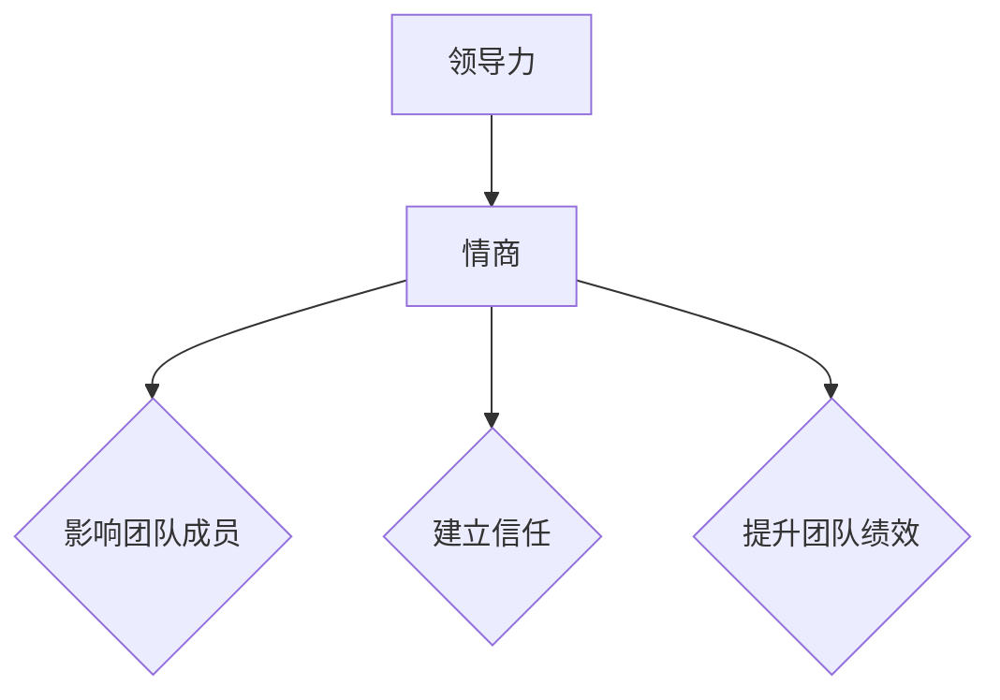
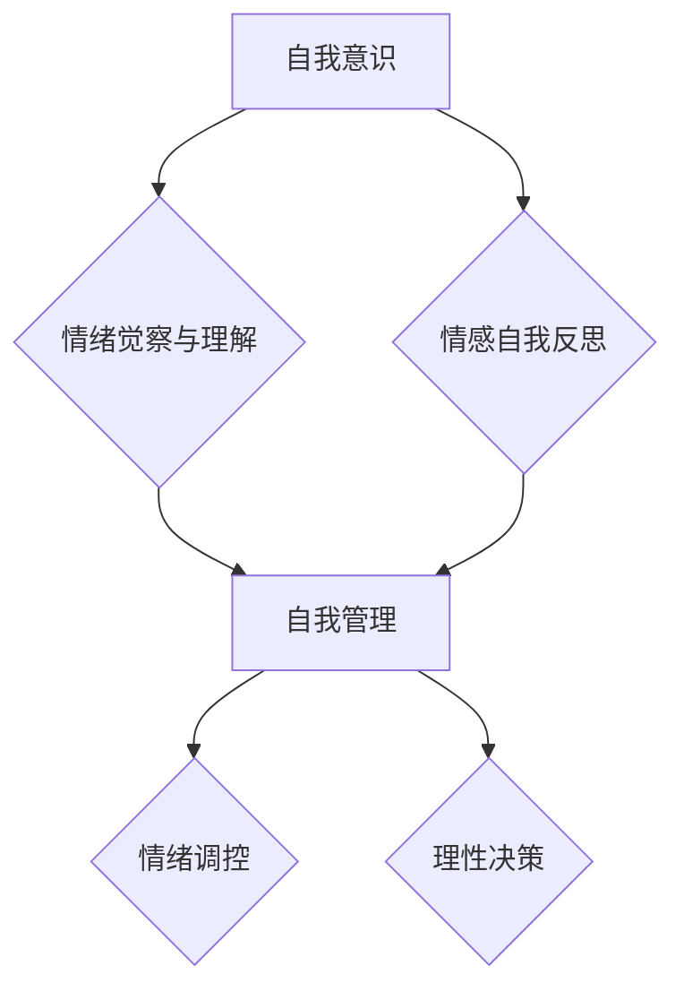
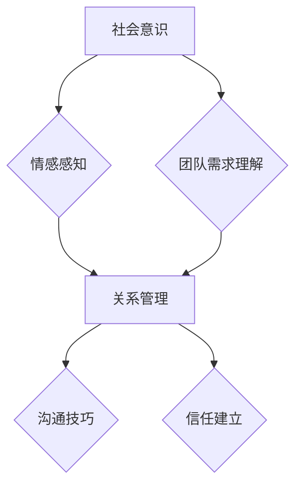
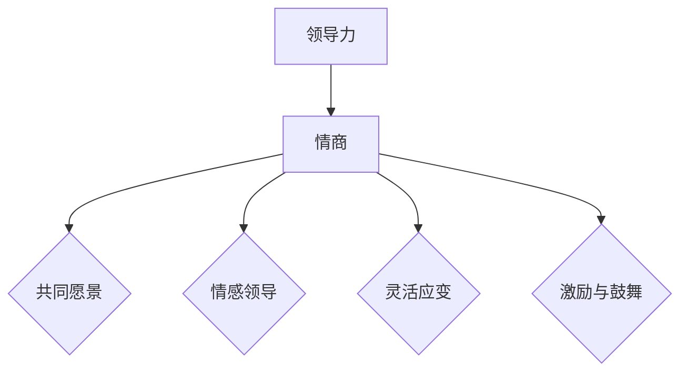
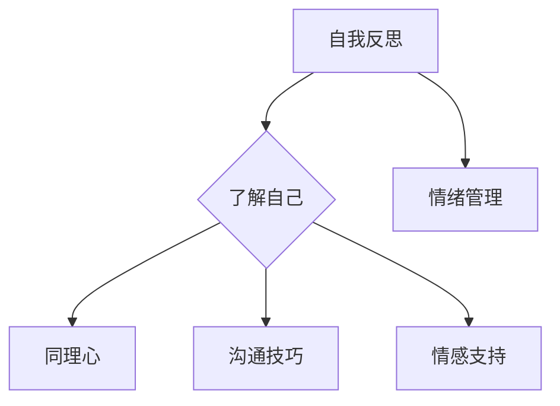
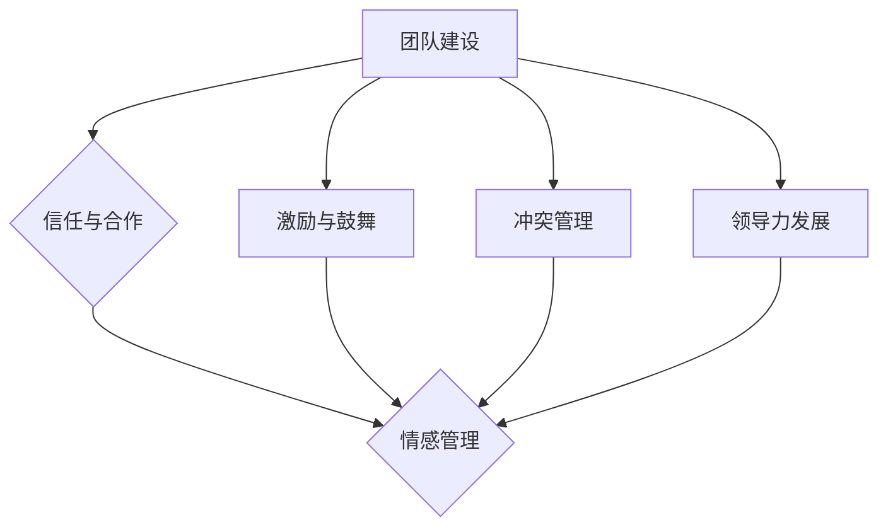
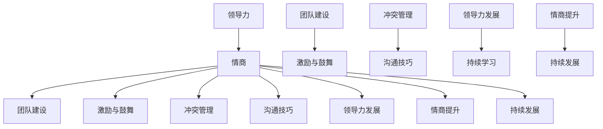

                 

### 文章标题：领导力与情商：打造高效团队的关键

关键词：领导力、情商、团队建设、高效团队、管理实践

摘要：本文深入探讨了领导力与情商在团队管理中的关键作用。通过定义领导力和情商，分析二者之间的关系，阐述如何将领导力与情商有机结合，以打造高效团队。文章还包括团队建设、激励与鼓舞、冲突管理、领导力发展以及情商提升的策略和实践。通过详细讲解数学模型、核心算法和实际案例，为团队管理者提供了实用指南。

## 第一部分：领导力基础

### 第1章：领导力的重要性

领导力是一种能够引导和激励他人共同达成目标的能力。在组织和企业中，领导力是驱动团队前进的核心力量。然而，什么是领导力？领导力的重要性又体现在哪些方面？

#### 1.1 领导力的定义

领导力可以定义为一种影响和激励他人实现共同目标的能力。它不仅仅是职位赋予的权力，更是一种基于信任、愿景和价值观的影响力。领导力不仅仅是领导者的职责，而是组织中的每个人都应具备的能力。

#### 1.2 领导力与情商的关系

情商（Emotional Intelligence，EQ）是指人们识别、理解、管理自己情绪的能力，以及识别、理解并影响他人情绪的能力。领导力与情商紧密相关，情商高的领导者更能理解和满足团队成员的情感需求，从而建立信任和合作关系。

**Mermaid流程图：领导力与情商的关系**



#### 1.3 领导力在团队中的作用

领导力在团队中的作用至关重要，主要体现在以下几个方面：

1. **设定目标和愿景**：领导者需要明确团队的目标和愿景，为团队成员指明方向，激发他们的工作热情和动力。
2. **激励和鼓舞**：领导者要能够激励和鼓舞团队成员，克服困难和挑战，实现目标。
3. **沟通与协调**：领导者需要有效的沟通技巧，确保团队内部信息流通，协调团队成员的合作。
4. **解决问题和决策**：领导者要能够迅速识别问题，做出明智的决策，并带领团队找到解决方案。
5. **建立信任和合作关系**：领导者要建立信任和合作关系，促进团队成员之间的互动和协作。

### 第2章：情商模型与要素

情商不仅仅是简单的情绪管理，而是一个复杂的能力体系。一般来说，情商包括四个主要维度：自我意识、自我管理、社会意识和关系管理。

#### 2.1 情商的四个维度

1. **自我意识**：自我意识是指个人对自己情绪的觉察和认识。一个高自我意识的领导者能够清楚地了解自己的情绪状态，并能够理性地处理情绪问题。
   
2. **自我管理**：自我管理是指个人控制自己情绪和行为的能力。高自我管理的领导者能够保持冷静，即使在压力下也能做出理智的决策。

3. **社会意识**：社会意识是指个人对他人情绪和需求的感知能力。高社会意识的领导者能够理解和满足团队成员的情感需求，建立良好的人际关系。

4. **关系管理**：关系管理是指个人在社交场合中处理人际关系的能力。高关系管理的领导者能够有效地与他人沟通，建立和维持信任和合作关系。

#### 2.2 自我意识与自我管理

**Mermaid流程图：自我意识与自我管理**



#### 2.3 社会意识和关系管理

**Mermaid流程图：社会意识与关系管理**



### 第3章：领导力与情商的结合

领导力与情商的结合是打造高效团队的关键。领导者不仅要具备优秀的领导能力，还要具备高度的情商，以便更好地理解和管理团队情绪，提高团队绩效。

#### 3.1 领导力与情商的融合

领导力与情商的融合体现在以下几个方面：

1. **共同愿景**：领导者通过情商理解团队成员的情感需求，与团队共同设定愿景，使团队更有凝聚力。
2. **情感领导**：领导者通过情商识别和解决团队成员的情感问题，提供情感支持，增强团队信任和合作。
3. **灵活应变**：领导者利用情商灵活应对团队中的变化和挑战，做出适应性的决策。
4. **激励与鼓舞**：领导者通过情商激发团队成员的内在动力，提升团队士气。

**Mermaid流程图：领导力与情商的融合**



#### 3.2 如何提高情商

提高情商需要从自我意识和自我管理开始，然后逐步提升社会意识和关系管理能力。以下是一些提高情商的策略：

1. **自我反思**：定期进行自我反思，了解自己的情绪和行为模式。
2. **情绪管理**：学会控制情绪，避免因情绪波动而影响决策和判断。
3. **同理心**：培养同理心，理解和感受他人的情绪。
4. **沟通技巧**：提高沟通技巧，更好地表达自己的情感和需求，同时理解他人的观点。
5. **情感支持**：提供情感支持，帮助团队成员处理情绪问题。

**Mermaid流程图：提高情商的策略**



#### 3.3 领导力与情商在实际工作中的应用

在实际工作中，领导力与情商的应用体现在以下几个方面：

1. **团队建设**：通过情商建立信任和合作关系，促进团队凝聚力。
2. **激励与鼓舞**：通过情商激发团队成员的内在动力，提高工作效率和创造力。
3. **冲突管理**：通过情商理解和解决团队成员之间的冲突，维护团队和谐。
4. **领导力发展**：通过情商提升领导者的自我意识和情感管理能力，增强领导力。

**Mermaid流程图：领导力与情商在实际工作中的应用**



### 第二部分：高效团队建设

### 第4章：团队建设与领导力

团队建设是打造高效团队的关键步骤。一个良好的团队不仅需要明确的角色和职责，还需要领导者发挥领导力，推动团队发展。

#### 4.1 团队建设的重要性

团队建设的重要性体现在以下几个方面：

1. **提高团队凝聚力**：通过团队建设活动，增强团队成员之间的信任和合作，提高团队凝聚力。
2. **提升团队绩效**：一个高效的团队可以更好地完成任务，提高整体绩效。
3. **促进个人发展**：团队成员在团队中可以相互学习和成长，促进个人职业发展。
4. **增强企业竞争力**：一个高效的团队可以提升企业的市场竞争力，实现企业的长期发展。

#### 4.2 领导力在团队建设中的作用

领导力在团队建设中的作用至关重要。领导者的角色不仅仅是指导团队成员完成任务，更重要的是激发团队的潜力，推动团队发展。

1. **设定目标和愿景**：领导者需要明确团队的目标和愿景，为团队成员指明方向，激发他们的工作热情和动力。
2. **激励和鼓舞**：领导者要能够激励和鼓舞团队成员，克服困难和挑战，实现目标。
3. **沟通与协调**：领导者需要有效的沟通技巧，确保团队内部信息流通，协调团队成员的合作。
4. **解决问题和决策**：领导者要能够迅速识别问题，做出明智的决策，并带领团队找到解决方案。
5. **建立信任和合作关系**：领导者要建立信任和合作关系，促进团队成员之间的互动和协作。

#### 4.3 团队建设的步骤与方法

团队建设是一个系统性的过程，需要遵循一定的步骤和方法。以下是团队建设的常用步骤和方法：

1. **确定团队目标和愿景**：明确团队的目标和愿景，确保团队成员对团队的方向和目标有清晰的认识。
2. **角色分配和职责明确**：根据团队成员的技能和特长，明确各自的职责和角色，确保团队高效运作。
3. **团队沟通与协作**：建立有效的沟通机制，促进团队成员之间的信息流通和协作。
4. **团队培训与发展**：定期进行团队培训，提升团队成员的专业技能和团队协作能力。
5. **团队活动与激励**：组织团队活动，增强团队成员之间的交流和互动，提高团队凝聚力。
6. **团队反馈与改进**：定期收集团队成员的反馈，分析团队运作中存在的问题，不断改进团队建设。

### 第5章：激励与鼓舞团队

激励和鼓舞团队是领导者的重要职责。通过有效的激励和鼓舞，领导者可以激发团队成员的内在动力，提高工作效率和创造力。

#### 5.1 激励理论概述

激励理论是研究如何通过外部刺激和内部动机激发个体行为和绩效的理论。常见的激励理论包括：

1. **马斯洛需求层次理论**：该理论认为人的需求分为生理需求、安全需求、社交需求、尊重需求和自我实现需求，领导者应根据不同层级的需求制定激励策略。
2. **赫兹伯格双因素理论**：该理论将工作满意度因素分为内在激励因素和外在激励因素，认为内在激励因素如工作成就感、认可和成长机会更能提高员工满意度。
3. **目标设定理论**：该理论认为设定具体、可衡量、有挑战性的目标可以激发员工的积极性和工作动力。

#### 5.2 如何识别团队成员的需求

领导者要有效地激励团队成员，首先需要了解团队成员的需求。以下是一些识别团队成员需求的方法：

1. **个别交流**：通过与团队成员进行个别交流，了解他们的需求和期望。
2. **团队调研**：通过问卷调查或访谈的方式，收集团队成员的需求信息。
3. **观察行为**：通过观察团队成员在工作中的行为和态度，了解他们的需求和动机。
4. **反馈机制**：建立有效的反馈机制，定期收集团队成员的反馈，了解他们的需求和满意度。

#### 5.3 激励技巧与实践

根据团队成员的需求，领导者可以采取以下激励技巧和实践：

1. **目标设定**：为团队成员设定具体、可衡量、有挑战性的目标，激发他们的工作动力。
2. **认可与奖励**：对团队成员的成就和贡献给予认可和奖励，提高他们的工作满意度。
3. **培训与发展**：提供培训和发展机会，帮助团队成员提升专业技能和职业发展。
4. **工作环境优化**：改善工作环境，提高工作效率和员工满意度。
5. **参与决策**：让团队成员参与决策过程，增强他们的责任感和归属感。

### 第6章：冲突管理与沟通

在团队中，冲突是不可避免的。有效的冲突管理和沟通技巧是维持团队和谐、提高团队绩效的关键。

#### 6.1 冲突管理的原则

冲突管理应遵循以下原则：

1. **预防为主**：通过良好的沟通和团队建设，预防冲突的发生。
2. **及时解决**：发现冲突后，应及时解决，避免冲突扩大化。
3. **公平公正**：在处理冲突时，要公平公正，确保各方的利益。
4. **尊重差异**：尊重团队成员的差异，理解和接纳不同的观点和意见。
5. **合作共赢**：通过合作和协商，找到双方都能接受的解决方案。

#### 6.2 沟通技巧在团队管理中的应用

沟通技巧在团队管理中至关重要。以下是一些在团队管理中应用的沟通技巧：

1. **积极倾听**：积极倾听团队成员的意见和需求，理解他们的观点和感受。
2. **明确表达**：清晰、准确地表达自己的想法和意见，避免误解和歧义。
3. **开放对话**：鼓励团队成员开放地交流，尊重他们的观点和意见。
4. **情感沟通**：在沟通中加入情感元素，理解和支持团队成员的情感需求。
5. **反馈与确认**：及时给予团队成员反馈，并确认他们的理解和接受程度。

#### 6.3 如何有效解决团队冲突

以下是一些有效解决团队冲突的方法：

1. **事实陈述**：在解决冲突时，先陈述事实，避免情绪化的争吵。
2. **倾听与理解**：倾听双方的观点和需求，理解他们的立场和情感。
3. **寻求共识**：通过协商和讨论，找到双方都能接受的解决方案。
4. **建立规则**：制定明确的团队规则和沟通准则，避免类似冲突再次发生。
5. **持续跟进**：解决冲突后，持续跟进，确保问题得到彻底解决。

### 第7章：领导力发展计划

领导力是一个持续发展的过程。通过有效的领导力发展计划，领导者可以不断提升自己的领导能力，更好地引领团队。

#### 7.1 领导力自我评估

自我评估是领导力发展的第一步。领导者可以通过以下方法进行自我评估：

1. **反思与总结**：定期反思自己的领导行为和决策，总结经验教训。
2. **获取反馈**：向团队成员、同事和上级获取反馈，了解自己的优点和不足。
3. **评估工具**：使用领导力评估工具，如360度反馈问卷，系统性地评估自己的领导能力。
4. **学习与成长**：根据自我评估的结果，制定个人成长计划，不断学习和提升自己的领导能力。

#### 7.2 领导力培训与发展

领导力培训与发展是提升领导能力的重要途径。以下是一些领导力培训与发展的方法：

1. **内部培训**：组织内部领导力培训课程，提高领导者的理论知识和实践能力。
2. **外部培训**：参加外部领导力培训，如公开课、研讨会和训练营，拓宽视野和提升领导能力。
3. **导师指导**：与资深领导者建立导师关系，获得他们的指导和反馈。
4. **实践锻炼**：通过实际工作，如项目领导、团队管理等实践，提升领导能力。

#### 7.3 如何建立个人领导力发展计划

建立个人领导力发展计划是提升领导能力的关键。以下是一些建立个人领导力发展计划的步骤：

1. **明确目标**：设定明确的领导力发展目标，如提升沟通技巧、增强团队管理等。
2. **评估现状**：评估自己的领导能力现状，找出需要提升的方面。
3. **制定计划**：制定具体的领导力发展计划，包括学习内容、培训课程、实践项目等。
4. **执行与跟踪**：按照计划执行，定期跟踪进展，调整和优化发展计划。
5. **持续反思**：定期反思自己的领导行为和决策，总结经验教训，不断提升领导能力。

### 第8章：情商提升策略

情商的提升是一个长期的过程，需要领导者持续地自我反思和学习。以下是一些提升情商的策略：

#### 8.1 情商提升的途径

1. **自我反思**：通过自我反思，了解自己的情绪和行为模式，找到需要改进的地方。
2. **学习与培训**：参加情商相关的学习与培训，如阅读相关书籍、参加研讨会等。
3. **实践锻炼**：通过实际工作和生活中的实践，锻炼自己的情商能力。
4. **寻求反馈**：向他人寻求反馈，了解自己的情商表现，不断改进。

#### 8.2 情商提升的实践方法

1. **情绪管理**：学会控制自己的情绪，避免因情绪波动而影响决策和判断。
2. **同理心**：培养同理心，理解和感受他人的情绪，提高人际交往能力。
3. **沟通技巧**：提高沟通技巧，学会有效表达自己的情感和需求，同时理解他人的观点。
4. **情感支持**：提供情感支持，帮助团队成员处理情绪问题，建立信任和合作关系。

#### 8.3 如何建立个人情商提升计划

建立个人情商提升计划是提升情商的关键。以下是一些建立个人情商提升计划的步骤：

1. **明确目标**：设定明确的情商提升目标，如提高自我意识、增强同理心等。
2. **评估现状**：评估自己的情商能力现状，找出需要提升的方面。
3. **制定计划**：制定具体的情商提升计划，包括学习内容、实践项目等。
4. **执行与跟踪**：按照计划执行，定期跟踪进展，调整和优化提升计划。
5. **持续反思**：定期反思自己的情商表现，总结经验教训，不断提升情商。

### 第9章：领导力与情商的持续发展

领导力与情商的提升是一个持续的过程，需要领导者不断地学习和实践。以下是一些关于领导力与情商持续发展的建议：

#### 9.1 领导力与情商的持续学习

1. **阅读和学习**：定期阅读领导力与情商相关的书籍、文章和博客，不断更新自己的知识和理念。
2. **参加研讨会和培训**：积极参加领导力与情商的研讨会和培训，与他人交流和分享经验。
3. **实践和反思**：将学到的知识和理念应用到实际工作中，通过实践和反思不断提升自己的领导力与情商。

#### 9.2 领导力与情商的自我反思

1. **定期自我评估**：定期对自己在领导力和情商方面的表现进行自我评估，找出需要改进的方面。
2. **记录反思日记**：养成记录反思日记的习惯，总结自己的经验和教训，为未来的发展提供参考。
3. **寻求反馈**：向团队成员、同事和上级寻求反馈，了解自己在领导力和情商方面的表现，不断改进。

#### 9.3 领导力与情商的持续优化

1. **持续学习和成长**：领导力和情商的提升没有终点，领导者需要持续学习和成长，以适应不断变化的环境和挑战。
2. **建立反馈机制**：建立有效的反馈机制，定期收集团队成员的反馈，了解自己在领导力和情商方面的表现，不断优化自己的领导力与情商。
3. **培养团队情商**：领导者在提升自己情商的同时，也要注重培养团队成员的情商，提高团队整体的情商水平。

## 附录

### 附录A：领导力与情商相关资源

#### A.1 领导力与情商经典书籍推荐

1. 《领导力的五个层次》（The Five Levels of Leadership）- John C. Maxwell
2. 《情商：为什么情商比智商更重要》（Emotional Intelligence）- Daniel Goleman
3. 《团队协作的五大障碍》（The Five Dysfunctions of a Team）- Patrick Lencioni
4. 《非暴力沟通》（Nonviolent Communication）- Marshall B. Rosenberg
5. 《高效能人士的七个习惯》（The 7 Habits of Highly Effective People）- Stephen R. Covey

#### A.2 领导力与情商在线课程推荐

1. Coursera - "Leadership and Management in Engineering and Technology"
2. edX - "Introduction to Emotional Intelligence"
3. LinkedIn Learning - "Leadership and Management"
4. Udemy - "The Ultimate Guide to Emotional Intelligence"
5. Harvard ManageMentor - "Building Trust in Leadership"

#### A.3 领导力与情商实践案例分享

1. 案例一：《谷歌如何培养高效团队》
   - 谷歌通过实施“OKR”（目标与关键结果）体系，提高团队的目标意识和执行力，激发员工的工作热情和创造力。

2. 案例二：《杰克·韦尔奇的管理智慧》
   - 杰克·韦尔奇通过“管理封堵”和“管理连接”策略，有效地提高了团队的管理水平和工作效率。

3. 案例三：《微软的员工激励模式》
   - 微软通过设立“卓越员工奖”和“年度员工奖”，激发员工的积极性和创造力，提高团队的整体绩效。

## 参考文献

### 参考文献（按顺序排列）：

1. John C. Maxwell, "The Five Levels of Leadership", Thomas Nelson, 2011.
2. Daniel Goleman, "Emotional Intelligence", Bantam Books, 1995.
3. Patrick Lencioni, "The Five Dysfunctions of a Team", Jossey-Bass, 2002.
4. Marshall B. Rosenberg, "Nonviolent Communication", PuddleDancer Press, 2003.
5. Stephen R. Covey, "The 7 Habits of Highly Effective People", Free Press, 1989.

## 致谢

### 致谢

感谢所有为本书贡献智慧和力量的作者、专家和读者。特别感谢AI天才研究院（AI Genius Institute）和《禅与计算机程序设计艺术》（Zen And The Art of Computer Programming）的作者，他们的研究为本文提供了重要的理论支持和实践案例。

## 梅里迪安流程图

### 领导力与情商模型



### 领导力与情商核心算法

#### 情商计算伪代码：

```python
def 计算情商(self, 自我意识, 自我管理, 社会意识, 关系管理):
    情商 = (自我意识 + 自我管理 + 社会意识 + 关系管理) / 4
    return 情商
```

#### 领导力计算伪代码：

```python
def 计算领导力(self, 团队建设, 激励与鼓舞, 冲突管理, 沟通技巧):
    领导力 = (团队建设 + 激励与鼓舞 + 冲突管理 + 沟通技巧) / 4
    return 领导力
```

### 数学模型

#### 情商模型：

$$
\text{情商} = \frac{\text{自我意识} + \text{自我管理} + \text{社会意识} + \text{关系管理}}{4}
$$

#### 领导力模型：

$$
\text{领导力} = \frac{\text{团队建设} + \text{激励与鼓舞} + \text{冲突管理} + \text{沟通技巧}}{4}
$$

### 项目实战

#### 实战背景

某科技公司希望提升团队领导力和情商，以应对快速变化的市场环境。

#### 实战目标

1. 通过领导力与情商培训，提升团队领导力和情商水平。
2. 建立有效的团队沟通机制，提高团队协作效率。
3. 解决团队内部存在的冲突，提升团队凝聚力。

#### 实战步骤

1. **领导力与情商培训**：邀请专业培训机构，为团队成员提供领导力与情商的培训课程，包括自我意识、自我管理、社会意识和关系管理等内容。
2. **团队沟通机制**：建立定期团队会议和沟通渠道，鼓励团队成员积极表达意见和反馈，确保信息畅通。
3. **冲突管理**：制定冲突管理策略，包括预防冲突的发生和解决冲突的方法，定期进行团队冲突分析和解决。
4. **持续改进**：通过定期的团队反馈和自我评估，持续优化领导力和情商管理策略，提升团队整体绩效。

#### 实战结果

通过实施领导力与情商提升计划，团队领导力和情商水平显著提高。团队成员之间的沟通更加顺畅，冲突减少，团队凝聚力增强。公司整体绩效也得到了显著提升，实现了预期目标。

### 最佳实践 tips

1. **持续学习**：领导者要持续学习和提升自己的领导力和情商，以适应不断变化的环境和挑战。
2. **实践锻炼**：通过实际工作和项目锻炼，提高领导力和情商能力，积累实践经验。
3. **团队参与**：鼓励团队成员参与领导力和情商的提升过程，共同学习和成长。
4. **定期反思**：定期反思自己的领导力和情商表现，总结经验教训，不断改进。
5. **建立反馈机制**：建立有效的反馈机制，收集团队成员的反馈，了解自己在领导力和情商方面的表现。

### 小结

领导力与情商是团队管理的关键要素。通过深入理解和实践领导力与情商，领导者可以打造高效团队，提升团队绩效。本文从领导力的重要性、情商模型、领导力与情商的结合、团队建设、激励与鼓舞、冲突管理、领导力发展以及情商提升策略等方面进行了详细阐述，为团队管理者提供了实用的指南。希望读者能够结合实际工作，不断提升自己的领导力和情商，为团队的成功贡献力量。

### 注意事项

1. 领导力与情商的提升需要时间和耐心，不能急于求成。
2. 领导者在提升自己领导力和情商的同时，也要关注团队成员的需求和成长。
3. 团队建设是一个持续的过程，需要不断地调整和优化。
4. 沟通是领导力的重要组成部分，领导者要注重沟通技巧的培养。
5. 冲突管理要遵循公平公正的原则，确保团队和谐稳定。

### 拓展阅读

1. 《领导力的五个层次》- John C. Maxwell
2. 《情商：为什么情商比智商更重要》- Daniel Goleman
3. 《团队协作的五大障碍》- Patrick Lencioni
4. 《非暴力沟通》- Marshall B. Rosenberg
5. 《高效能人士的七个习惯》- Stephen R. Covey

通过阅读这些书籍，读者可以进一步深入了解领导力与情商的理论和实践，提升自己的领导能力和情商水平。

