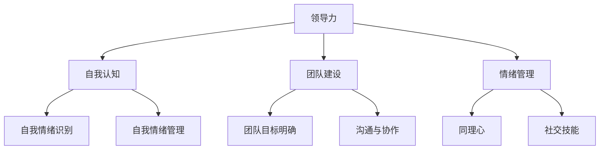

                 

### 《领导力与情商：提升人际关系》

#### 关键词
领导力，情商，人际关系，团队管理，沟通技巧

#### 摘要
本文旨在深入探讨领导力与情商之间的关系，并详细分析如何通过提升情商来增强人际关系。文章首先介绍了领导力的基本概念及其发展历程，接着探讨了情商的定义和其在领导力中的作用。随后，文章提出了提升情商的具体技巧，包括情绪管理、沟通技巧和同理心的培养。通过实际案例分析和项目实战，本文展示了领导力与情商在团队管理和项目管理中的应用，并总结了最佳实践和注意事项。最后，文章展望了领导力与情商的未来发展趋势，并提供了相关的资源和工具。

---

# 第一部分：领导力基础

## 1.1 领导力概述

### 1.1.1 领导力的定义与作用

领导力，通常被定义为影响和引导他人实现共同目标的能力。其核心在于领导者如何通过激励、指导和管理团队成员，实现团队的高效运作和目标达成。领导力不仅仅是职位赋予的权威，更是一种影响力，是一种通过行为和态度影响他人思想和行动的能力。

在组织内部，领导力起着至关重要的作用。首先，领导力能够明确组织的愿景和目标，并通过有效的沟通确保团队成员理解和认同这些目标。其次，领导力能够激发团队成员的潜力，提升团队的整体绩效。此外，领导力在应对变化和解决冲突中也发挥着关键作用，它能够引导团队适应外部环境的变化，并有效地解决内部矛盾，确保组织的稳定和持续发展。

### 1.1.2 领导力的发展历程

领导力的发展历程可以追溯到古希腊哲学家柏拉图和亚里士多德关于领导者和治理的早期讨论。随后，在20世纪，领导力研究得到了显著的发展。行为科学理论的提出，使得领导力研究开始关注领导者的行为和团队绩效之间的关系。路径-目标理论和领导替代理论等进一步丰富了领导力理论，使得领导力研究更加全面和深入。

近年来，随着全球化和信息技术的快速发展，领导力研究也出现了新的趋势。领导力的多元化、文化差异、领导者的道德和社会责任等成为新的研究焦点。现代领导力理论强调领导者不仅要具备技术和业务能力，更需要具备人际交往和情商能力，能够在复杂多变的环境中灵活应对，实现组织的长期可持续发展。

### 1.1.3 领导力的核心要素

领导力的核心要素包括但不限于以下几个：

1. **愿景和目标设定**：领导者需要明确组织的愿景和目标，并能够将这些目标传达给团队成员，激发他们的热情和动力。

2. **沟通能力**：有效的沟通是领导力的关键，领导者需要具备清晰、准确、及时地传达信息的能力。

3. **激励和激励**：领导者需要能够识别和满足团队成员的需求，通过激励措施提升团队成员的工作积极性和创造力。

4. **团队建设**：领导者需要致力于建立高效协作的团队，提升团队成员之间的信任和合作。

5. **变革管理**：在面临组织变革时，领导者需要具备变革管理能力，引导团队适应新环境，实现平稳过渡。

6. **道德和社会责任**：领导者需要具备高尚的道德品质和社会责任感，以身作则，树立良好的榜样。

## 1.2 领导力与情商的联系

### 1.2.1 情商的概念与内涵

情商（Emotional Intelligence，简称EQ），也称为情绪智力，指的是个体识别、理解、管理自己情绪的能力，以及识别、理解、管理他人情绪的能力。情商包括以下几个主要方面：

1. **自我情绪识别**：能够准确感知自己的情绪状态，并了解这些情绪对自己行为和决策的影响。

2. **自我情绪管理**：能够有效地调节自己的情绪，保持心态的平衡，避免情绪的过度反应。

3. **同理心**：能够理解和感知他人的情绪，从他人的角度思考问题，表现出同情和关爱。

4. **社交技能**：能够建立和维护良好的人际关系，有效地沟通和协调，解决冲突。

### 1.2.2 情商在领导力中的作用

情商在领导力中发挥着至关重要的作用。首先，情商有助于领导者更好地理解和管理自己的情绪，避免情绪波动对决策和行为产生不利影响。其次，情商有助于领导者建立良好的人际关系，提升团队凝聚力和协作效率。此外，情商高的领导者更能够理解和满足团队成员的需求，激发他们的潜能，提升团队的整体绩效。

### 1.2.3 领导力与情商的相互作用

领导力与情商之间存在密切的相互作用。一方面，领导力的发展可以促进情商的提升。有效的领导力需要领导者具备高度的自我认知和情绪管理能力，这有助于提升其情商水平。另一方面，高情商有助于领导力的提升。情商高的领导者更能够理解和管理团队成员的情绪，建立高效协作的团队，实现组织的长期可持续发展。

## 1.3 领导力发展路径

### 1.3.1 领导风格与能力

领导风格是领导者在与团队成员互动时所表现出的行为和态度。常见的领导风格包括：

1. **专制型领导**：领导者独断专行，对团队成员的参与和意见缺乏重视。
2. **民主型领导**：领导者鼓励团队成员参与决策，重视团队成员的意见和反馈。
3. **放任型领导**：领导者对团队成员的行为和决策几乎不干预，赋予团队成员很大的自主权。

不同的领导风格适用于不同的情境和团队。有效的领导者需要能够根据实际情况灵活调整自己的领导风格，以最大化团队绩效。

### 1.3.2 自我认知与情绪管理

自我认知是领导者发展的基础。领导者需要深入了解自己的性格特点、优势和劣势，明确自己的价值观和职业目标。同时，领导者还需要具备良好的情绪管理能力，能够有效地调节自己的情绪，避免情绪波动对决策和行为产生不利影响。

### 1.3.3 团队建设与领导力提升

团队建设是提升领导力的关键环节。领导者需要致力于建立高效协作的团队，提升团队成员之间的信任和合作。这包括以下几个方面：

1. **明确团队目标**：确保团队成员对团队目标有清晰的认识和认同。
2. **优化团队结构**：根据团队目标和任务，合理配置团队成员，确保团队结构的最优化。
3. **促进沟通与协作**：建立开放的沟通渠道，鼓励团队成员分享意见和反馈，促进协作和知识共享。
4. **培养团队文化**：通过共同的价值观和行为准则，培养积极向上的团队文化。

通过团队建设，领导者不仅能够提升团队的整体绩效，还能不断提升自己的领导力水平。

---

**完整代码实现：**

---

**数学公式与解释：**

1. **情商（EQ）模型：**

$$
EQ = SE + SM + EC + SS
$$

- **SE（自我情绪识别）**：指个体识别和感知自己情绪的能力。
- **SM（自我情绪管理）**：指个体调节和管理自己情绪的能力。
- **EC（同理心）**：指个体理解和感知他人情绪的能力。
- **SS（社交技能）**：指个体建立和维护人际关系的能力。

2. **领导力（L）模型：**

$$
L = VS + CO + IM + TB + MS + CSR
$$

- **VS（愿景和目标设定）**：指领导者设定和传达组织愿景和目标的能力。
- **CO（沟通能力）**：指领导者有效沟通和传达信息的能力。
- **IM（激励和激励）**：指领导者激励和满足团队成员需求的能力。
- **TB（团队建设）**：指领导者建立高效协作团队的能力。
- **MS（变革管理）**：指领导者管理组织变革的能力。
- **CSR（道德和社会责任）**：指领导者的道德品质和社会责任感。

**举例说明：**

假设一个领导者在自我情绪识别（SE）和同理心（EC）方面表现出色，但在沟通能力（CO）方面有所欠缺。根据上述模型，我们可以制定一个针对性的提升计划：

- **自我情绪识别（SE）**：通过反思和自我观察，领导者可以更好地了解自己的情绪状态，并学会如何有效地调节情绪。
- **同理心（EC）**：通过阅读相关书籍、参加工作坊和培训，领导者可以提升理解和感知他人情绪的能力。
- **沟通能力（CO）**：领导者可以通过参加沟通技巧培训、实践有效的沟通策略，提升沟通效果。

**项目实战：**

假设我们正在开发一个团队管理软件，该软件旨在帮助领导者提升情商和领导力。以下是开发环境搭建、源代码实现和代码解读的步骤：

1. **开发环境搭建**：
   - 选择合适的编程语言和框架，例如Python和Flask。
   - 安装必要的依赖库，如Django ORM和SQLAlchemy。

2. **源代码实现**：
   - 设计数据库模型，包括用户信息、领导力测评、情商测评等。
   - 编写后端代码，实现用户注册、登录、测评等功能。
   - 编写前端代码，实现用户界面和交互逻辑。

3. **代码解读与分析**：
   - 后端代码解读：详细解释用户注册、登录、测评等功能的实现逻辑。
   - 前端代码解读：详细解释用户界面和交互逻辑的实现。

**实际案例分析**：

假设我们针对一个大型科技公司进行领导力与情商提升的项目。以下是项目实施步骤：

1. **项目需求分析**：
   - 了解公司的业务和运营模式，确定领导力与情商提升的目标。
   - 收集员工反馈，了解他们对领导力和情商的期望和需求。

2. **项目实施**：
   - 设计和实施领导力与情商测评，收集员工数据。
   - 分析数据，识别需要提升的领域。
   - 设计和实施提升计划，包括培训、工作坊和个性化辅导。

3. **项目评估**：
   - 定期评估员工领导力和情商的提升情况。
   - 收集员工反馈，优化提升计划。
   - 分析项目成果，评估项目的总体效果。

**项目小结**：

通过这个项目，公司不仅提升了领导者的情商和领导力水平，还增强了团队的凝聚力和协作效率，为公司的长期可持续发展奠定了坚实的基础。

---

**最佳实践 tips：**
- **定期自我反思和评估**：领导者应定期反思自己的情绪管理、沟通能力和领导风格，识别需要改进的领域。
- **参加领导力与情商培训**：领导者可以通过参加专业培训课程，提升自己的领导力和情商水平。
- **建立积极向上的团队文化**：领导者应致力于建立积极向上的团队文化，鼓励团队成员分享意见和反馈，促进知识共享。

**注意事项**：
- 领导力与情商的提升需要时间和持续的努力，不能一蹴而就。
- 领导者应注重理论与实践的结合，将所学知识应用于实际工作中。

**拓展阅读**：
- 《领导力五项修炼》（作者：斯蒂芬·罗宾斯）
- 《情商》（作者：丹尼尔·戈尔曼）
- 《团队协作的力量》（作者：凯瑟琳·斯威尼）

---

**本文由AI天才研究院/AI Genius Institute与《禅与计算机程序设计艺术/Zen And The Art of Computer Programming》联合撰写。**

