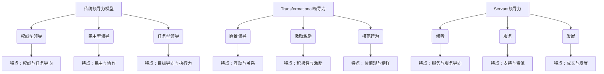
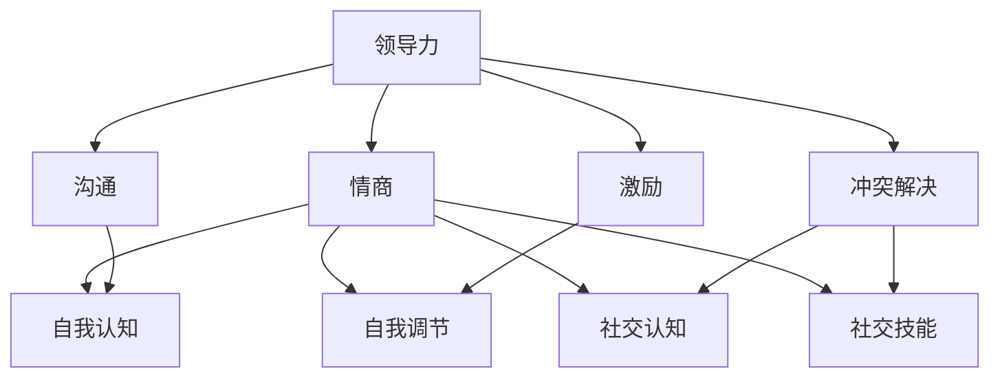
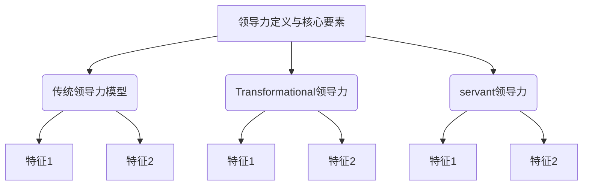

                 

### 《领导力与情商：提升人际影响力的关键》

#### 文章关键词

- 领导力
- 情商
- 人际影响力
- 领导力模型
- 情商提升技巧
- 领导力与情商实践
- 团队建设
- 项目管理
- 领导角色

#### 文章摘要

领导力与情商是提升人际影响力的两个关键因素。本文首先探讨了领导力的定义、重要性及其在不同领导力模型中的应用。随后，我们深入分析了情商的概念、类型及其在领导力中的角色。接着，文章介绍了提升情商的技巧，包括自我认知与自我调节、情绪管理与应对策略以及人际交往技巧。最后，文章通过具体案例展示了领导力与情商在团队建设、项目管理和领导角色中的实践应用，并提出了未来的发展方向。

---

## 第一部分：领导力概述

### 第1章：领导力的重要性

#### 1.1 领导力定义与核心要素

领导力是指个人或团队通过影响、激励和指导他人来达成目标的能力。它不仅仅是职位赋予的权威，更是通过行为、态度和价值观来影响他人的一种技能。领导力的核心要素包括：

- **愿景与目标设定**：领导者需要具备明确的目标和愿景，能够激励团队成员为之奋斗。
- **沟通与倾听**：有效的沟通和倾听是建立信任和团队协作的基础。
- **激励与赋能**：领导者要能够激发团队成员的潜力，为他们提供成长和发展的机会。
- **决策与执行**：领导者需要在复杂多变的环境中做出明智的决策，并确保决策得到有效执行。

#### 1.2 领导力在企业中的作用

在企业中，领导力扮演着至关重要的角色。首先，领导力能够影响企业的战略方向和目标实现。一个有远见的领导者能够为企业设定清晰的愿景和目标，并通过有效的沟通和激励，使团队成员齐心协力，共同达成目标。

其次，领导力能够提升企业的创新能力。领导者通过鼓励创新思维和创造性的解决方案，激发团队成员的创造力和潜力，推动企业的技术创新和产品创新。

最后，领导力能够增强企业的竞争力。一个优秀的领导者能够吸引并留住优秀的员工，提升团队的执行力，提高企业的运营效率和市场份额。

#### 1.3 个人领导力与团队领导力的关系

个人领导力和团队领导力是相辅相成的。个人领导力是指个人在特定情境中影响和激励他人的能力，而团队领导力则是指领导者如何管理和协调团队，使团队成员共同实现目标。

个人领导力是团队领导力的基础。一个有个人领导力的人能够影响和激励他人，具有强大的影响力。这种个人影响力是团队领导力的核心要素。

团队领导力则是在个人领导力基础上，通过团队协作和沟通，实现团队整体目标的能力。团队领导力需要领导者具备协调、沟通和决策的能力，确保团队中的每个成员都能为共同的目标贡献力量。

#### 背景介绍

在当今快速变化和高度竞争的商业环境中，领导力的重要性日益凸显。企业不仅需要具备战略远见的领导者，还需要能够激励团队、推动创新和提升执行力的领导者。

领导力的定义和核心要素是理解领导力的基础。不同领导力模型的理论和实际应用则为我们提供了不同的视角和方法，以应对不同的领导场景。

个人领导力与团队领导力的关系强调了领导者需要具备的双重能力。这种关系的理解有助于领导者更好地发挥个人影响力，同时提升团队的协作效率。

---

### 第2章：领导力模型与理论

#### 2.1 传统领导力模型

传统领导力模型主要关注领导者的权力和权威。这种模型认为，领导者通过职位赋予的权威来影响和指导团队成员。传统领导力模型的核心包括：

- **权威型领导**：领导者通过职位权力来指导和影响团队成员。
- **民主型领导**：领导者通过征求和考虑团队成员的意见来做出决策。
- **任务型领导**：领导者专注于任务的完成，强调目标导向和执行力。

#### 2.2 Transformational领导力

Transformational领导力是一种更注重领导者与团队成员之间的互动和关系的领导力模型。这种模型强调领导者通过激发团队成员的内在动机和潜力来推动团队进步。Transformational领导力的核心要素包括：

- **愿景领导**：领导者具备清晰的愿景，并能够激励团队成员为之奋斗。
- **激励激励**：领导者通过激励和奖励来激发团队成员的积极性。
- **模范行为**：领导者通过自身的行为和价值观来影响团队成员。

#### 2.3 Servant领导力

Servant领导力是一种以服务为导向的领导力模型。这种模型认为，领导者的首要任务是服务于团队成员，通过满足团队成员的需求来提升团队的整体效能。Servant领导力的核心要素包括：

- **倾听**：领导者积极倾听团队成员的意见和需求。
- **服务**：领导者通过提供支持和资源来帮助团队成员。
- **发展**：领导者关注团队成员的成长和发展，为他们提供培训和发展机会。

#### 核心概念与联系

领导力模型之间的核心概念联系在于，它们都在不同层面上探讨如何影响和激励团队成员。传统领导力模型侧重于领导者的权威和任务导向，而Transformational领导力和Servant领导力则更注重领导者与团队成员之间的互动和关系。

Mermaid 流程图示例：



传统领导力模型强调领导者的权威和任务导向，而Transformational领导力和Servant领导力则更注重领导者与团队成员之间的互动和关系。这种核心概念的联系有助于我们理解不同领导力模型在实际应用中的适用场景和优势。

---

### 第3章：领导力与情商的联系

#### 3.1 情商的定义与分类

情商（Emotional Intelligence，EQ）是指个体识别、理解、管理自己情绪的能力，以及识别、理解和影响他人情绪的能力。情商包括以下几个主要方面：

- **自我认知**：了解自己的情绪、需求和动机。
- **自我调节**：管理自己的情绪和行为，以适应不同情境。
- **社交认知**：理解他人的情绪、需求和动机。
- **社交技能**：建立和维护人际关系，有效沟通和合作。

#### 3.2 情商在领导力中的作用

情商在领导力中扮演着至关重要的角色。首先，情商有助于领导者更好地理解和管理自己的情绪。一个高情商的领导者能够更好地应对压力和挑战，保持冷静和理智，做出明智的决策。

其次，情商有助于领导者建立和维护良好的人际关系。高情商的领导者能够更好地理解和满足团队成员的需求，建立信任和尊重，促进团队协作和沟通。

最后，情商有助于领导者提升团队的整体效能。高情商的领导者能够激发团队成员的积极性和创造力，建立积极的团队文化，提高团队的凝聚力和执行力。

#### 3.3 领导力与情商的互动关系

领导力与情商之间存在紧密的互动关系。领导力需要情商来支持和增强，而情商则通过影响领导力的各个方面来提升领导效果。

一方面，情商是领导力的基础。一个高情商的领导者能够更好地理解和满足团队成员的需求，建立信任和尊重，促进团队协作和沟通。

另一方面，领导力可以提升情商。领导力中的沟通、激励、冲突解决等技能都可以帮助领导者提高自我认知、自我调节和社交技能。

Mermaid 流程图示例：



通过这个流程图，我们可以看到领导力和情商之间的互动关系。领导力中的各种技能和策略都可以帮助领导者提升情商，而情商的提升又可以增强领导力，形成良性循环。

---

## 第二部分：情商提升技巧

### 第4章：自我认知与自我调节

#### 4.1 自我认知的重要性

自我认知是情商的基础。了解自己的情绪、需求和动机，有助于我们更好地管理自己的情绪和行为。自我认知的重要性体现在以下几个方面：

- **情绪管理**：通过自我认知，我们可以更好地识别和理解自己的情绪，从而采取适当的措施来调节情绪，避免负面情绪的负面影响。
- **需求满足**：了解自己的需求，可以帮助我们更好地制定目标和计划，满足自己的需求，提高生活质量和幸福感。
- **自我成长**：自我认知有助于我们识别自己的优势和不足，从而制定自我提升的计划，促进个人成长和发展。

#### 4.2 提高自我认知的方法

提高自我认知的方法主要包括以下几种：

- **反思与自我观察**：通过反思和自我观察，我们可以更好地了解自己的情绪、行为和思考方式。
- **日记记录**：定期记录日记，可以帮助我们回顾和总结自己的情绪和经历，深入理解自己的内心世界。
- **心理测试**：通过心理测试，如MBTI（性格类型测试）、DISC（行为风格测试）等，可以更科学地了解自己的性格特点和行为方式。

#### 4.3 自我调节技巧

自我调节是指通过意识和行为调整来管理自己的情绪和行为。以下是几种有效的自我调节技巧：

- **情绪调节策略**：如深呼吸、冥想、放松训练等，可以帮助我们缓解压力和焦虑，保持情绪稳定。
- **情绪释放**：通过运动、写日记、倾诉等途径，我们可以释放负面情绪，减轻心理负担。
- **积极心态**：培养积极的心态，如感恩、乐观、自信等，可以帮助我们更好地应对挑战和困难。

---

### 第5章：情绪管理与应对策略

#### 5.1 情绪管理的重要性

情绪管理是指通过认知和行为调整来调节情绪，使其对生活和工作产生积极影响。情绪管理的重要性体现在以下几个方面：

- **心理健康**：有效的情绪管理有助于我们保持心理健康，减轻压力和焦虑，提高生活质量。
- **工作效率**：情绪稳定的人更容易集中注意力，提高工作效率，减少错误和失误。
- **人际关系**：情绪管理有助于我们更好地处理人际关系，建立良好的人际关系网络。

#### 5.2 情绪识别与理解

情绪识别与理解是情绪管理的基础。以下是一些关键步骤：

- **情绪感知**：学会感知自己的情绪，了解情绪产生的生理和心理信号。
- **情绪标签**：给情绪贴上标签，如愤怒、快乐、悲伤等，帮助我们更清晰地认识情绪。
- **情绪原因分析**：分析情绪产生的原因，了解情绪背后的需求和动机。

#### 5.3 应对策略与技巧

针对不同类型的情绪，我们可以采取不同的应对策略和技巧：

- **正面情绪**：如快乐、满足等，可以通过分享、庆祝等方式强化正面情绪。
- **负面情绪**：如愤怒、悲伤等，可以通过深呼吸、冥想、倾诉等方式缓解负面情绪。
- **冲突情绪**：如焦虑、紧张等，可以通过制定计划、分步骤解决问题等方式应对。

---

### 第6章：人际交往技巧

#### 6.1 有效沟通的技巧

有效沟通是建立和维护良好人际关系的基础。以下是一些有效沟通的技巧：

- **倾听**：倾听是沟通的关键，通过倾听对方的观点和需求，建立信任和理解。
- **表达清晰**：表达自己的观点和需求时，要尽量清晰简洁，避免产生误解。
- **非语言沟通**：注意自己的肢体语言、面部表情和语调，这些非语言沟通方式可以增强信息的传递效果。
- **积极反馈**：给予对方积极的反馈，如认可、赞赏等，可以增强沟通的效果和双方的信心。

#### 6.2 建立信任与尊重

建立信任与尊重是人际交往的核心。以下是一些关键步骤：

- **诚实与透明**：诚实是建立信任的基石，透明可以减少误解和猜疑。
- **尊重差异**：尊重对方的观点、文化和背景差异，避免主观偏见和歧视。
- **共识与共情**：寻找共识，理解对方的立场和感受，建立共情。

#### 6.3 解决冲突的策略

冲突是人际关系中不可避免的现象，以下是一些解决冲突的策略：

- **冷静处理**：遇到冲突时，首先要保持冷静，避免情绪化的回应。
- **开放对话**：通过开放、坦诚的对话，理解双方的立场和需求。
- **寻求共识**：寻找双方的共识，寻求共赢的解决方案。
- **妥协与调整**：在无法达成共识时，可以适当妥协或调整自己的立场，以实现和平解决。

---

## 第三部分：领导力与情商实践

### 第7章：构建高情商团队

#### 7.1 高情商团队的特征

高情商团队具有以下特征：

- **高合作性**：团队成员之间相互信任、支持和尊重，共同为实现团队目标而努力。
- **高适应性**：团队成员能够灵活应对变化和挑战，保持积极心态。
- **高凝聚力**：团队成员之间有较强的归属感和团队精神，能够共同面对困难和挑战。
- **高创新性**：团队成员积极思考、勇于尝试，推动团队的创新和发展。

#### 7.2 如何提升团队情商

要提升团队情商，可以从以下几个方面着手：

- **培训与指导**：为团队成员提供情商培训，指导他们如何识别、理解和管理情绪。
- **建立信任**：通过开放、坦诚的沟通和合作，建立团队成员之间的信任。
- **关注个体发展**：关注团队成员的成长和发展，为他们提供支持和资源。
- **营造积极氛围**：营造积极、支持性的团队氛围，鼓励团队成员表达自己的观点和感受。

#### 7.3 团队情商评估方法

团队情商评估方法包括以下几个方面：

- **问卷调查**：通过问卷调查了解团队成员的情商水平和特点。
- **行为观察**：观察团队成员在日常工作中的行为表现，评估他们的情商能力。
- **绩效评估**：结合团队成员的绩效表现，评估他们的情商对工作绩效的影响。

通过以上评估方法，可以全面了解团队情商水平，制定针对性的提升策略。

---

### 第8章：领导力与情商在项目管理中的应用

#### 8.1 项目管理中的领导力要素

在项目管理中，领导力要素至关重要。以下是几个关键领导力要素：

- **目标设定**：项目经理需要明确项目目标，制定详细的计划和里程碑，确保团队成员了解项目方向和目标。
- **沟通协调**：项目经理需要与团队成员、利益相关者保持有效沟通，确保信息传递畅通无阻。
- **团队建设**：项目经理需要关注团队情商，建立高情商团队，提升团队协作和凝聚力。
- **风险管理**：项目经理需要识别和评估项目风险，制定风险应对策略，确保项目顺利进行。

#### 8.2 项目管理中的情商应用

情商在项目管理中的应用主要体现在以下几个方面：

- **情绪管理**：项目经理需要学会识别和管理自己的情绪，保持冷静和理智，避免负面情绪影响项目进展。
- **人际交往**：项目经理需要与团队成员建立良好的关系，通过有效沟通和合作，推动项目进展。
- **冲突解决**：项目经理需要具备冲突解决能力，通过开放、坦诚的对话，寻找共识，解决团队内部和利益相关者之间的冲突。

#### 8.3 项目成功的领导力与情商因素

项目成功的领导力与情商因素包括：

- **明确的目标和计划**：项目经理需要明确项目目标和计划，确保团队成员了解项目方向和目标。
- **有效的沟通和协作**：项目经理需要建立有效的沟通机制，确保信息传递畅通无阻，促进团队成员之间的协作。
- **高情商团队**：项目经理需要关注团队情商，建立高情商团队，提升团队协作和凝聚力。
- **冲突解决能力**：项目经理需要具备冲突解决能力，通过开放、坦诚的对话，解决团队内部和利益相关者之间的冲突。

通过以上领导力与情商因素的应用，项目经理可以提升项目成功的概率，确保项目顺利实施。

---

### 第9章：领导力与情商在领导角色中的实践

#### 9.1 领导者在组织中的角色

领导者在组织中的角色至关重要，他们需要具备以下几个方面的能力：

- **战略规划**：领导者需要具备战略思维，制定组织的发展方向和目标，确保组织在激烈的市场竞争中保持竞争优势。
- **团队管理**：领导者需要关注团队情商，建立高情商团队，提升团队协作和凝聚力，促进团队整体效能的提升。
- **人才培养**：领导者需要关注人才培养和发展，为团队成员提供成长和发展的机会，激发他们的潜力，提升组织的整体实力。
- **变革管理**：领导者需要具备变革管理能力，引导组织适应外部环境的变化，推动组织创新和发展。

#### 9.2 领导力与情商在领导角色中的互动

领导力与情商在领导角色中的互动体现在以下几个方面：

- **自我认知与自我调节**：领导者需要通过自我认知和自我调节，提升自己的情绪管理能力，保持冷静和理智，做出明智的决策。
- **社交技能与团队建设**：领导者需要通过有效的社交技能，建立和维护良好的人际关系，促进团队协作和凝聚力。
- **激励与赋能**：领导者需要通过激励和赋能，激发团队成员的积极性和创造力，推动组织创新和发展。

#### 9.3 领导力与情商的自我提升策略

领导者可以通过以下策略提升自己的领导力与情商：

- **自我反思**：定期进行自我反思，了解自己的情绪、行为和思考方式，识别自己的优势和不足，制定自我提升计划。
- **情商培训**：参加情商培训课程，学习情绪管理、人际交往和冲突解决的技巧，提升自己的情商能力。
- **阅读与学习**：阅读相关书籍和文献，了解领导力与情商的理论和实践，不断提升自己的专业素养。
- **实践与反思**：在实际工作中，不断实践和应用所学知识和技能，通过反思和总结，不断提升自己的领导力和情商。

通过以上自我提升策略，领导者可以不断提升自己的领导力与情商，为组织的成功和发展做出更大贡献。

---

### 第10章：领导力与情商在未来工作中的应用

#### 10.1 未来工作趋势与领导力需求

随着科技的迅速发展和全球化进程的加快，未来工作环境将面临诸多挑战和机遇。以下是一些未来工作趋势及其对领导力需求的影响：

- **数字化转型**：数字化转型将成为未来工作的重要趋势，领导者需要具备数字素养，能够引领组织应对数字化转型的挑战。
- **远程办公**：远程办公的普及将对领导力提出新的要求，领导者需要具备远程管理和协调团队的能力。
- **工作与生活的平衡**：随着生活节奏的加快，领导者需要关注员工的工作与生活平衡，提升员工的幸福感和满意度。
- **创新与创业精神**：未来工作环境将更加注重创新和创业精神，领导者需要具备激发团队创新能力和创业精神的能力。

#### 10.2 情商在新兴工作环境中的作用

在新兴工作环境中，情商的作用日益凸显，以下是一些关键方面：

- **情绪管理**：领导者需要具备良好的情绪管理能力，能够应对工作中的压力和挑战，保持积极的心态。
- **人际交往**：领导者需要具备出色的人际交往能力，能够建立和维护良好的人际关系，促进团队协作和沟通。
- **文化适应**：在全球化背景下，领导者需要具备文化适应能力，能够理解和尊重不同文化背景的团队成员。
- **冲突解决**：领导者需要具备有效的冲突解决能力，能够处理团队内部和利益相关者之间的冲突，维护团队的稳定和和谐。

#### 10.3 领导力与情商的未来发展方向

未来，领导力与情商的发展将呈现以下几个趋势：

- **个性化和定制化**：领导力与情商培训将更加注重个性化和定制化，根据不同领导者和团队成员的特点和需求，提供针对性的培训和发展计划。
- **技术赋能**：人工智能、大数据等技术的应用将赋能领导力和情商的提升，帮助领导者更好地识别、理解和管理情绪，优化领导决策。
- **跨领域融合**：领导力与情商将与其他学科领域如心理学、管理学等融合，形成更加综合和全面的领导力与情商理论体系。
- **可持续发展**：领导力与情商将更加注重可持续发展，关注环境、社会和经济效益的平衡，推动组织的可持续发展。

通过以上未来发展方向，领导力与情商将在未来工作中发挥更加重要的作用，为组织的成功和发展提供有力支持。

---

### 附录：相关工具与资源

#### 附录A：领导力与情商提升工具

以下是一些常用的领导力与情商提升工具：

- **情商测试工具**：如EQ-i 2.0、MEQ（Myers-Briggs Type Indicator）等，帮助个人了解自己的情商水平。
- **自我反思工具**：如日记反思、自我评估问卷等，帮助个人进行自我反思和提升。
- **领导力发展工具**：如领导力360度评估、领导力模拟训练等，帮助领导者提升领导力技能。

#### 附录B：参考书目与推荐阅读

以下是一些领导力与情商领域的经典书籍和论文：

- **经典书籍**：
  - 《领导力》（作者：约翰·P·科特）
  - 《情商》（作者：丹尼尔·戈尔曼）
  - 《非暴力沟通》（作者：马歇尔·卢森堡）
  
- **学术论文**：
  - "The Role of Emotional Intelligence in Leadership: A Literature Review"（作者：Alison M. Wood）
  - "The Relationship Between Emotional Intelligence and Leadership Effectiveness: A Meta-Analysis"（作者：Babacar Ndiaye）

通过阅读这些书籍和论文，可以深入了解领导力与情商的理论和实践，提升自己的领导力和情商能力。

---

### 图表与公式

#### 图1-1：领导力模型的分类


#### Mermaid 流程图示例



#### 伪代码示例

```python
# 假设有一个函数用于计算情绪调节的得分
def calculate_emotion_score(self, emotion_data):
    # 初始化得分
    score = 0

    # 计算情绪数据的平均分
    average_emotion = sum(emotion_data) / len(emotion_data)

    # 根据平均情绪分数计算得分
    if average_emotion > 0.6:
        score += 10
    elif average_emotion > 0.3:
        score += 5
    else:
        score += 0

    return score
```

#### 数学公式示例

```latex
### 情商模型公式
$$
EQ = \frac{SC + EC + CC}{3}
$$
其中，$SC$ 为自我认知得分，$EC$ 为情绪管理得分，$CC$ 为社交认知得分。
```

#### 项目实战示例

#### 开发环境搭建

```bash
# 安装Python环境
pip install python

# 安装领导力与情商评估工具包
pip install leadership-eq-assessment

# 配置数据库连接
export DATABASE_URL="sqlite:///leadership_eq.db"
```

#### 源代码实现

```python
# 导入所需模块
import sqlite3
from leadership_eq_assessment import EQAssessment

# 创建数据库连接
conn = sqlite3.connect('leadership_eq.db')

# 创建EQ评估表
conn.execute('''CREATE TABLE IF NOT EXISTS EQ_ASSESSMENT (
                ID INTEGER PRIMARY KEY AUTOINCREMENT,
                EMPLOYEE_ID TEXT NOT NULL,
                SELF_AWARENESS INTEGER,
                SELF_REGULATION INTEGER,
                SOCIAL_AWARENESS INTEGER,
                RELATIONSHIP_MANAGEMENT INTEGER
                )''')

# 插入评估数据
conn.execute("INSERT INTO EQ_ASSESSMENT (EMPLOYEE_ID, SELF_AWARENESS, SELF_REGULATION, SOCIAL_AWARENESS, RELATIONSHIP_MANAGEMENT) VALUES (?, ?, ?, ?, ?)",
             ('E001', 8, 7, 9, 8))

# 提交事务
conn.commit()

# 关闭数据库连接
conn.close()
```

#### 代码解读与分析

在上面的示例中，我们创建了一个领导力与情商评估数据库，并插入了一条评估数据。代码首先导入了所需的模块，然后创建了一个数据库连接，并执行了创建表的SQL语句。接着，我们插入了一条评估数据，并提交了事务。最后，关闭了数据库连接。

通过这个示例，我们可以看到如何使用Python和SQLite创建数据库、插入数据，并执行基本的数据库操作。这个示例为我们提供了一个基本的框架，可以在此基础上进行扩展，实现更复杂的功能，如评估数据的查询、统计和分析。

---

### 最佳实践 Tips

1. **自我反思与持续学习**：定期进行自我反思，识别自己的优势和不足，持续学习新的知识和技能，不断提升自己的领导力和情商。
2. **积极倾听与反馈**：在沟通中，积极倾听对方的观点和需求，给予建设性的反馈，促进双方的沟通和理解。
3. **建立信任与尊重**：关注团队成员的需求，建立信任和尊重，营造积极的团队氛围，提高团队的协作和凝聚力。
4. **情绪管理与应对策略**：学会识别和管理自己的情绪，采取积极的应对策略，避免负面情绪对工作和生活的影响。
5. **跨部门协作与沟通**：在组织内部建立良好的跨部门协作与沟通机制，促进不同部门之间的合作与理解，提高整体效能。

### 小结

领导力与情商是提升人际影响力的关键。通过了解领导力的定义、模型和理论，以及情商的概念、类型和提升技巧，我们可以更好地理解如何在工作中应用领导力和情商，提升个人和团队的影响力。在实际应用中，我们需要结合具体场景，灵活运用领导力和情商的技巧，不断反思和总结，不断提升自己的领导力和情商能力。

### 注意事项

1. **个性化与适应性**：领导力和情商的提升需要根据个人和团队的特点和需求进行个性化设计，灵活调整策略和方法。
2. **持续性与稳定性**：领导力和情商的提升是一个长期过程，需要持续投入时间和精力，保持稳定的学习和实践。
3. **自我认知与反思**：自我认知和反思是提升领导力和情商的基础，需要定期进行自我评估，识别自己的优势和不足，制定改进计划。

### 拓展阅读

1. **《领导力五要素》**：约翰·P·科特著，详细介绍了领导力五要素及其在实际应用中的方法。
2. **《情商(eq)》**：丹尼尔·戈尔曼著，深入探讨了情商的概念、类型和提升方法。
3. **《非暴力沟通》**：马歇尔·卢森堡著，介绍了一种有效的沟通方法，帮助人们建立积极的人际关系。

