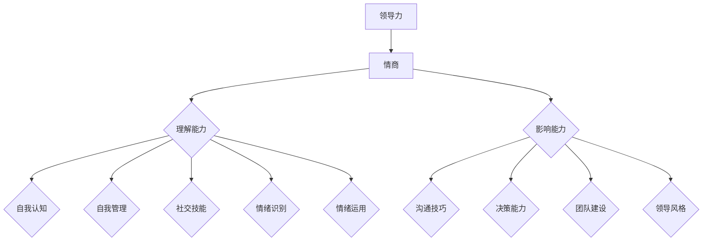

                 

## 文章标题：领导力与情商：理解并影响他人的能力

> 关键词：领导力、情商、影响力、人际交往、团队建设、决策能力

> 摘要：本文将深入探讨领导力与情商这两个关键因素在理解并影响他人方面的作用。通过阐述领导力的定义、类型以及重要性，分析情商的概念、组成部分及其在领导力发展中的价值，我们将构建一个全面的框架，帮助读者理解领导力与情商的内在联系，掌握提升这两项能力的方法和技巧。文章还将结合实际案例，分析领导力与情商在不同情境中的应用，提供实用的提升策略，最终展望数字化时代领导力与情商的未来发展趋势。

---

## 《领导力与情商：理解并影响他人的能力》目录大纲

## 第一部分：领导力与情商的基础概念

### 1.1.1 领导力的定义与重要性

### 1.1.2 情商的概念与组成部分

### 1.1.3 领导力与情商的关系

### 1.1.4 领导力与情商的Mermaid流程图

## 第二部分：领导力的核心技能

### 2.1.1 沟通技巧

### 2.1.2 决策能力

### 2.1.3 团队建设

### 2.1.4 领导风格

## 第三部分：情商在领导力中的应用

### 3.1.1 自我认知与自我管理

### 3.1.2 社会技能

### 3.1.3 情绪识别与情绪运用

## 第四部分：领导力与情商的实践应用

### 4.1.1 领导力与情商在组织管理中的应用

### 4.1.2 领导力与情商在领导角色中的表现

### 4.1.3 案例分析

## 第五部分：领导力与情商的提升策略

### 5.1.1 终身学习的理念

### 5.1.2 培训与发展计划

### 5.1.3 反思与反馈

## 第六部分：领导力与情商的未来发展趋势

### 6.1.1 数字化时代的领导力

### 6.1.2 情商在人工智能时代的角色

### 6.1.3 未来领导力与情商的发展趋势

## 附录

### 附录 A：领导力与情商相关工具与资源

### 附录 B：参考文献

---

### 第一部分：领导力与情商的基础概念

在探讨领导力与情商的关系之前，首先需要明确这两个概念的定义和基础概念，以便构建一个清晰的理论框架。

#### 1.1.1 领导力的定义与重要性

**领导力的定义**：领导力是一种激励和引导他人朝着共同目标努力的能力。它不仅仅涉及权力和权威，更强调影响和激励他人，以实现团队和组织的目标。

**领导力的作用**：
1. **激励员工**：领导力可以激发员工的潜力，提高工作效率和创造力。
2. **团队协作**：有效的领导力有助于建立团队合作精神，增强团队凝聚力。
3. **决策能力**：领导力在决策过程中起到关键作用，通过理性分析和感性判断，做出最优决策。
4. **创新驱动**：领导力推动组织创新，鼓励尝试新思路、新方法。

**领导力的类型**：
1. **任务导向型**：注重完成任务，强调效率和目标。
2. **关系导向型**：注重人际关系，强调信任和合作。
3. **变革导向型**：注重变革和适应，鼓励创新和突破。
4. **服务导向型**：注重服务，强调员工的成长和福祉。

#### 1.1.2 情商的概念与组成部分

**情商的定义**：情商（Emotional Intelligence，EQ）是指一个人理解、管理、表达和运用情感的能力，包括情感自我认知、情感自我管理、社交技能、情绪识别和运用等。

**情商的五个组成部分**：
1. **自我认知**：了解自己的情绪，认识自己的情感状态。
2. **自我管理**：控制自己的情绪，保持情绪稳定。
3. **社会技能**：与他人建立良好关系，沟通协调。
4. **情绪识别**：识别他人的情绪，理解他人的情感需求。
5. **情绪运用**：在社交和职业场合有效地运用情感，影响他人。

#### 1.1.3 领导力与情商的关系

**领导力与情商的相互作用**：领导力与情商是相互关联的，一个高情商的领导者能够更好地理解和影响团队成员，从而提高领导力效果。情商有助于领导者建立信任、改善团队氛围，提升团队绩效。

**情商在领导力发展中的作用**：情商是领导力发展的重要基础。通过提高情商，领导者可以更好地管理自己的情绪，增强团队凝聚力，提升决策能力，从而在复杂多变的环境中保持稳定和高效。

**领导力与情商的提升路径**：提升领导力和情商需要系统的学习和实践。可以通过以下途径实现：
1. **自我反思**：通过自我反思，了解自己的情绪和行为模式，找到提升空间。
2. **学习与培训**：参加领导力和情商相关的课程和培训，学习新的知识和技能。
3. **实践应用**：将学到的理论知识和技巧应用到实际工作中，不断总结和调整。
4. **获取反馈**：从同事、下属和导师那里获取反馈，识别自己的优势和不足，持续改进。

#### 1.1.4 领导力与情商的Mermaid流程图

通过这个Mermaid流程图，我们可以清晰地看到领导力与情商的相互作用和相互影响，以及它们在理解并影响他人方面的具体应用。

---

通过以上对领导力与情商的基础概念的探讨，我们为后续的深入分析奠定了理论基础。接下来，我们将进一步探讨领导力的核心技能，并分析情商在领导力发展中的具体应用，帮助读者全面理解这两者之间的内在联系和相互作用。希望这个部分的内容能够帮助读者建立对领导力与情商的初步认识，为后续的学习和实践做好准备。

### 2.1.1 沟通技巧

在领导力的核心技能中，沟通技巧无疑是最为重要的一项。无论是内部团队的管理，还是与外部合作伙伴的协调，有效的沟通都是确保项目顺利进行、团队高效运作的基础。

**有效沟通的重要性**：良好的沟通能力可以帮助领导者清晰地传达目标、明确职责、理解下属的需求和意见，从而提高工作效率，减少误解和冲突。同时，有效的沟通还能增强团队的凝聚力，促进成员之间的信任和合作。

**倾听技巧**：倾听是有效沟通的关键。通过倾听，领导者不仅能够获取关键信息，还能表达对团队成员的关注和尊重。以下是一些提高倾听技巧的方法：
1. **全神贯注**：在沟通时，领导者应避免分心，确保专注于对方的发言。
2. **开放态度**：保持开放的心态，不要过早做出判断，给予对方充分表达的机会。
3. **反馈确认**：通过复述或总结对方的发言，确保理解准确，并给予反馈。

**非言语沟通**：非言语沟通在传达信息方面起着重要作用。领导者应注重自己的肢体语言、面部表情和语调，以确保信息传达的一致性和准确性。以下是一些建议：
1. **肢体语言**：保持开放的肢体姿态，避免封闭或防御性的姿势。
2. **面部表情**：通过微笑、点头等表情，表达对对方的尊重和支持。
3. **语调**：语调的变化可以传达不同的情感和意图，领导者应学会使用不同的语调来增强沟通效果。

**沟通障碍与解决方法**：在沟通过程中，领导者可能会遇到各种障碍，如文化差异、语言障碍、信息过载等。以下是一些常见的沟通障碍及其解决方法：
1. **文化差异**：了解并尊重不同文化背景的团队成员，通过文化培训来减少误解。
2. **语言障碍**：鼓励使用简单清晰的语言，必要时可以借助翻译工具或专业翻译。
3. **信息过载**：通过整理和筛选关键信息，确保沟通内容简洁明了，避免过度传递信息。

通过提升沟通技巧，领导者可以更加有效地传达信息、理解团队成员的需求和意见，从而增强团队凝聚力和工作效率。有效的沟通不仅有助于实现个人和组织的目标，还能提升领导者的个人魅力和影响力。

### 2.1.2 决策能力

决策能力是领导力的核心技能之一，决定了领导者能否在复杂多变的环境中做出正确和有效的决策。有效的决策不仅能够推动项目的顺利进行，还能提升团队的信心和凝聚力。

**决策的类型**：
1. **战略性决策**：涉及组织的长期目标和方向，如公司战略规划、市场拓展等。
2. **战术性决策**：关注短期目标和具体操作，如项目进度安排、资源分配等。
3. **日常决策**：日常工作中需要做出的决策，如工作安排、任务分配等。

**决策过程**：
1. **识别问题**：明确需要解决的问题或面临的机会。
2. **收集信息**：收集与问题相关的各种信息和数据。
3. **分析选项**：分析不同的解决方案或决策选项。
4. **评估风险**：评估每个决策选项可能带来的风险和影响。
5. **做出决策**：根据分析结果，选择最优的决策方案。
6. **实施决策**：将决策方案付诸实施，并跟踪执行情况。
7. **反馈与调整**：根据实施结果进行反馈和调整，为下一次决策提供参考。

**决策工具与技巧**：
1. **SWOT分析**：分析组织的优势、劣势、机会和威胁，帮助确定决策方向。
2. **决策树**：通过绘制决策树，明确不同决策路径的可能结果和概率，帮助评估风险和收益。
3. **多目标决策分析**：在多个目标之间进行权衡和优化，确保决策方案兼顾各方面需求。
4. **情景规划**：模拟不同情景下的决策效果，为应对不确定性做好准备。
5. **群体决策**：通过团队讨论和协作，汇集多方意见和智慧，提高决策质量。

**决策能力的重要性**：有效的决策能力是领导者成功的关键。它不仅能够帮助领导者抓住机遇、规避风险，还能提升团队的信心和执行力。领导者需要具备快速反应和果断决策的能力，以应对快速变化的环境和挑战。

通过提升决策能力，领导者可以在复杂多变的环境中做出正确的决策，确保团队和组织目标的实现。有效的决策不仅能够推动组织发展，还能提升领导者的个人威信和影响力。

### 2.1.3 团队建设

团队建设是领导力的重要组成部分，它关乎团队的凝聚力、协作效率和创新能力。一个高效的团队可以极大地提升组织的竞争力，实现共同目标。

**团队建设的意义**：
1. **增强凝聚力**：通过团队建设活动，团队成员之间的信任和合作精神得到增强，团队凝聚力得到提升。
2. **提高协作效率**：团队建设有助于明确团队成员的角色和职责，提高协作效率和执行力。
3. **激发创新能力**：团队建设可以激发成员的创新思维和创造力，为组织带来新的发展机遇。
4. **降低冲突**：通过团队建设，可以减少团队成员之间的误解和冲突，营造和谐的工作氛围。

**团队角色的识别**：
1. **领导者**：团队的核心，负责制定目标和计划，协调成员工作，提供支持和指导。
2. **执行者**：负责执行任务，完成团队目标，通常负责具体的执行工作。
3. **协调者**：协调团队成员之间的工作，解决冲突，确保团队目标的实现。
4. **创新者**：负责提出新的想法和解决方案，推动团队的创新发展。
5. **支持者**：提供后勤支持和资源，确保团队工作顺利进行。

**团队冲突的管理**：
1. **识别冲突**：及时发现和识别团队中的冲突，理解冲突的原因和影响。
2. **沟通与对话**：通过开放和诚实的沟通，让团队成员表达自己的观点和感受，找到共同点。
3. **解决方案**：针对冲突的原因，提出合理的解决方案，确保解决方案得到团队成员的认可和接受。
4. **持续监控**：在实施解决方案后，持续监控冲突的解决效果，确保问题得到根本解决。

通过团队建设，领导者可以打造一个高效、协作和创新的团队，推动组织目标的实现。有效的团队建设不仅有助于提升团队的凝聚力，还能激发团队成员的潜力，为组织带来持续的竞争优势。

### 2.1.4 领导风格

领导风格是指领导者处理团队和个体关系、管理行为和决策方式的基本特征。不同的领导风格适用于不同的情境和团队，因此了解并选择合适的领导风格对团队绩效和成员满意度至关重要。

**领导风格的理论**：
1. **独裁式领导**：领导者集中决策权，严格控制团队行为，强调权威和纪律。适用于任务紧急、需要迅速行动的情况。
2. **民主式领导**：领导者鼓励团队成员参与决策，重视团队意见，通过集体讨论达成共识。适用于创新性任务、需要团队协作的情况。
3. **教练式领导**：领导者关注团队成员的个人成长和技能提升，提供指导和支持，帮助成员实现个人目标。适用于培养人才、提升团队能力的情况。
4. **放任式领导**：领导者给予团队成员极大的自由度，不干预团队决策和行为，鼓励自主管理。适用于高度专业化的团队、成员自主性较强的情况。

**不同领导风格的应用**：
1. **独裁式领导**：在紧急情况下，独裁式领导可以迅速做出决策，确保任务高效完成。但在长期应用中，可能降低团队成员的积极性，影响团队凝聚力。
2. **民主式领导**：在需要团队协作和创新的情境下，民主式领导有助于激发团队成员的创造力和主动性，提高团队绩效。但决策过程可能较慢，需要更多时间达成共识。
3. **教练式领导**：在培养人才和提升团队能力方面，教练式领导能够帮助成员成长，提高团队整体水平。但领导者需要投入大量时间和精力，关注个体发展。
4. **放任式领导**：在高度专业化的团队中，放任式领导可以激发成员的自主性和创新能力。但领导者需要确保团队目标和价值观的一致性，避免团队成员的分散和目标不一致。

**领导风格的选择与适应**：
1. **情境适应性**：领导者应根据不同情境和团队需求，灵活调整领导风格。在紧急情况下采用独裁式领导，在创新任务中采用民主式领导。
2. **个性匹配**：领导者应了解自己的个性和优势，选择与个人特点相匹配的领导风格。同时，了解团队成员的个性和需求，以实现最佳领导效果。
3. **团队发展阶段**：不同阶段的团队可能需要不同的领导风格。在团队初期，采用民主式领导有助于建立团队基础；在团队成熟阶段，教练式领导有助于提升团队能力。

通过了解不同领导风格的理论和应用，领导者可以更有效地选择和适应合适的领导风格，提高团队绩效和成员满意度。灵活调整领导风格，根据情境和团队需求做出决策，是领导者成功的关键。

### 3.1.1 自我认知与自我管理

自我认知和自我管理是情商的重要组成部分，对领导力的提升具有深远的影响。一个高情商的领导者能够深刻理解自己的情感和行为模式，从而更好地管理和调整自己的情绪，提高领导效果。

**自我认知的重要性**：自我认知是情商的基础，它使领导者能够深入了解自己的情绪、动机和价值观。通过自我认知，领导者可以识别自己的情绪反应，理解情绪背后的原因，从而更好地控制情绪，避免情绪对决策和行为产生负面影响。

**自我管理的策略**：有效的自我管理策略有助于领导者保持情绪稳定，提升决策和沟通能力。以下是一些自我管理的策略：
1. **情绪调节**：领导者可以通过深呼吸、冥想、运动等方式，快速缓解紧张和压力，保持情绪稳定。
2. **设定目标**：明确个人和团队的目标，有助于领导者集中注意力，减少情绪波动。
3. **积极心态**：培养积极的心态，对困难和挑战保持乐观态度，有助于提升领导者的情绪管理能力。
4. **情绪表达**：学会适当表达自己的情绪，避免压抑或过度发泄，保持情绪的平衡。

**情绪调节的方法**：情绪调节是自我管理的重要部分，以下是一些常用的情绪调节方法：
1. **反思与认知重构**：通过反思自己的情绪和行为，重新评估和调整认知，改变负面情绪。
2. **认知行为疗法**：通过认知行为疗法，帮助领导者识别和改变负面思维模式，提高情绪调节能力。
3. **正念练习**：通过正念练习，如冥想、瑜伽等，增强对当前情绪和感受的觉察，提高情绪调节能力。
4. **情感释放**：通过运动、艺术创作等方式，释放负面情绪，保持情绪的平衡。

通过提升自我认知和自我管理能力，领导者可以更好地应对工作压力，保持情绪稳定，提高决策和沟通能力。有效的情绪调节策略有助于领导者塑造积极的心态，提升领导效果，赢得团队成员的信任和尊重。

### 3.1.2 社会技能

社会技能，也称为人际交往技能，是情商的重要组成部分，对于领导力的提升至关重要。高情商的领导者能够有效地与他人建立和维持良好的人际关系，促进团队合作，提高团队绩效。

**建立良好的人际关系**：建立良好的人际关系需要领导者具备以下能力：
1. **倾听**：倾听是建立良好人际关系的基础。领导者应学会倾听他人的意见和需求，理解对方的情感和立场。
2. **同理心**：同理心是理解他人情感和需求的能力。领导者应具备同理心，能够站在他人的角度思考问题，关注团队成员的感受。
3. **沟通**：有效的沟通能力是建立良好人际关系的关键。领导者应学会清晰、准确地表达自己的想法，同时倾听对方的意见，确保信息传递的一致性。
4. **信任**：信任是人际关系中的核心。领导者应通过诚实、透明和负责任的行为，赢得团队成员的信任。

**合作与协调**：在团队中，领导者需要协调不同成员的工作，确保团队目标的实现。以下是一些合作与协调的策略：
1. **明确目标**：领导者应明确团队的目标和期望，确保团队成员对目标有清晰的认识。
2. **分工协作**：根据团队成员的能力和特长，合理分配任务，确保每个成员都能充分发挥自己的优势。
3. **沟通与反馈**：通过定期沟通和反馈，确保团队成员之间的信息畅通，及时解决协作中的问题。
4. **团队合作**：鼓励团队成员之间的合作，建立团队意识，共同为实现团队目标而努力。

**冲突解决**：在团队中，冲突是不可避免的。领导者应具备有效的冲突解决能力，以下是一些策略：
1. **冷静处理**：在冲突发生时，领导者应保持冷静，避免情绪化的反应，确保问题得到理性解决。
2. **倾听与理解**：领导者应倾听双方的诉求，理解冲突背后的原因，找到解决问题的根本方法。
3. **协商与妥协**：在冲突解决过程中，领导者应通过协商和妥协，寻找双方都能接受的解决方案。
4. **持续监控**：在冲突解决后，领导者应持续监控问题的解决效果，确保问题得到彻底解决。

通过提升社会技能，领导者可以有效地建立良好的人际关系，促进团队合作，解决冲突，提高团队绩效。有效的社会技能不仅有助于提升领导者的个人魅力和影响力，还能为组织的长期发展奠定坚实基础。

### 3.1.3 情绪识别与情绪运用

情绪识别与情绪运用是情商的重要组成部分，对于领导力的提升具有重要意义。一个高情商的领导者能够准确地识别和管理自己和他人的情绪，从而更好地应对复杂的工作环境，提升领导效果。

**情绪识别的技巧**：情绪识别是指领导者能够准确地识别和理解自己和他人的情绪状态。以下是一些情绪识别的技巧：
1. **自我观察**：领导者应学会观察自己的情绪变化，理解情绪背后的原因。通过自我反思，领导者可以更好地了解自己的情绪模式，从而更好地管理情绪。
2. **情绪标签**：领导者可以使用情绪标签来描述自己的情绪，如愤怒、焦虑、兴奋等。这种方法有助于领导者更准确地识别和理解自己的情绪。
3. **情绪反馈**：领导者可以通过倾听他人的反馈，了解自己情绪的表达方式和对他人产生的影响。他人的反馈可以帮助领导者识别和管理情绪。
4. **情感地图**：领导者可以使用情感地图，记录和分析自己的情绪变化。情感地图可以帮助领导者更好地了解情绪的触发点和应对策略。

**情绪运用在领导力中的价值**：情绪运用是指领导者能够有效地运用情绪，以实现个人和团队的目标。以下是一些情绪运用在领导力中的价值：
1. **激励团队成员**：领导者可以通过表达积极情绪，如鼓励、赞赏和认可，激励团队成员，提高团队的士气和动力。
2. **建立信任**：领导者通过展示真诚和热情，能够建立与团队成员之间的信任关系，促进合作和沟通。
3. **解决冲突**：领导者可以通过情绪调节和情绪沟通，缓解冲突，找到解决问题的方法。
4. **创新思维**：领导者通过激发团队成员的积极情绪，如兴奋和好奇心，可以促进创新思维和创造力，推动团队发展。

**情绪管理策略**：情绪管理是指领导者能够有效地控制和管理自己的情绪，以保持情绪稳定和理性决策。以下是一些情绪管理策略：
1. **情绪调节**：领导者可以通过深呼吸、冥想、运动等方式，快速缓解紧张和压力，保持情绪稳定。
2. **情绪表达**：领导者应学会适当表达自己的情绪，避免压抑或过度发泄，保持情绪的平衡。
3. **情绪认知**：领导者应提高对情绪的认知水平，理解情绪背后的原因和影响，从而更好地管理情绪。
4. **情绪反馈**：领导者可以通过倾听他人的反馈，了解自己情绪的表达方式和对他人产生的影响，从而调整自己的情绪表达。

通过提升情绪识别与情绪运用能力，领导者可以更好地理解和管理自己和他人的情绪，提高领导效果，实现个人和团队的目标。有效的情绪管理不仅有助于提升领导者的个人魅力和影响力，还能为组织的长期发展创造积极的工作氛围。

### 4.1.1 领导力与情商在组织管理中的应用

在组织管理中，领导力与情商的应用至关重要。一个具备高情商和领导力的领导者能够在复杂多变的环境中，有效管理组织资源，提升团队绩效，推动组织发展。

**领导力在组织中的作用**：
1. **明确目标**：领导者应具备明确组织目标的能力，为团队成员提供清晰的愿景和方向。通过设定具体的目标和里程碑，领导者可以确保团队成员始终专注于实现组织目标。
2. **激励员工**：领导者应能够激励员工，激发他们的潜力，提高工作效率和创造力。通过赞赏、认可和奖励，领导者可以增强员工的积极性和忠诚度。
3. **团队建设**：领导者应致力于构建一个高效、协作和有凝聚力的团队。通过沟通、协调和冲突管理，领导者可以确保团队目标的实现，提升团队绩效。
4. **决策能力**：领导者应具备出色的决策能力，能够在复杂多变的环境中迅速做出正确的决策。通过分析信息、评估风险和制定策略，领导者可以为组织提供明确的方向和路径。
5. **创新推动**：领导者应鼓励创新思维，推动组织不断探索新的发展方向。通过支持员工的创新尝试，领导者可以为组织带来新的机遇和竞争优势。

**情商在团队管理中的应用**：
1. **情感管理**：领导者应具备良好的情感管理能力，能够识别和管理自己的情绪，避免情绪对决策和行为产生负面影响。同时，领导者还应关注团队成员的情感需求，提供支持和帮助。
2. **关系建立**：领导者应通过建立良好的人际关系，增强团队成员之间的信任和合作。通过倾听、同理心和有效沟通，领导者可以建立和谐的团队氛围，提高团队凝聚力。
3. **冲突解决**：领导者应具备有效的冲突解决能力，能够及时处理团队中的冲突，确保团队目标的实现。通过理解冲突原因、沟通协商和寻求共识，领导者可以解决冲突，减少负面影响。
4. **情绪激励**：领导者可以通过表达积极情绪，激励团队成员，提高团队士气和动力。通过鼓励、认可和赞赏，领导者可以增强团队成员的自信心和积极性。

**领导力与情商在组织变革中的角色**：
1. **推动变革**：领导者应具备推动组织变革的能力，能够在组织面临变革时，积极应对和引领变革。通过明确变革目标、沟通变革愿景和激励员工参与，领导者可以推动组织变革的顺利进行。
2. **领导变革**：领导者应在变革过程中发挥领导作用，为团队成员提供方向和支持。通过建立变革团队、分配变革任务和监督变革进度，领导者可以确保变革目标的实现。
3. **情感支持**：在变革过程中，领导者应关注团队成员的情感需求，提供情感支持。通过倾听、理解和关心，领导者可以帮助团队成员克服变革带来的压力和焦虑，保持积极的心态。

通过应用领导力和情商，领导者可以在组织管理中发挥关键作用，提升团队绩效，推动组织发展。有效的领导力和情商应用不仅有助于实现组织目标，还能为组织创造积极的工作氛围，提高员工的满意度和忠诚度。

### 4.1.2 领导力与情商在领导角色中的表现

在领导角色的不同阶段，领导力与情商的表现和需求有所不同。一个成功的领导者需要在每个阶段都能够灵活运用领导力和情商，以应对各种挑战，实现团队和组织的目标。

**领导角色的不同阶段**：
1. **初期阶段**：在这个阶段，领导者需要建立信任和团队基础。通过清晰传达愿景和目标，建立团队规则，以及倾听和关注团队成员的需求，领导者可以为团队奠定良好的基础。
2. **发展期**：在团队发展期，领导者需要关注团队成长和协作。通过激励员工、提供反馈和指导，以及促进团队合作，领导者可以推动团队不断进步。
3. **稳定期**：在团队稳定期，领导者需要维持团队的高效运作。通过优化流程、解决冲突和保持沟通，领导者可以确保团队持续稳定地实现目标。
4. **变革期**：在组织变革期，领导者需要推动变革和引领团队。通过明确变革目标、沟通变革愿景和激励员工参与，领导者可以引领团队应对变革，实现组织目标。

**领导力与情商在角色转换中的挑战**：
1. **角色认知**：在角色转换过程中，领导者需要认识到不同阶段的任务和需求，调整自己的领导风格和策略。这需要领导者具备良好的自我认知和角色意识。
2. **团队适应**：在角色转换过程中，领导者需要关注团队成员的适应情况，确保团队成员能够顺利过渡。这需要领导者具备良好的沟通和协调能力，以及同理心。
3. **压力应对**：在角色转换过程中，领导者可能会面临更大的压力和挑战。这需要领导者具备良好的情绪管理能力，以保持冷静和理性，应对各种突发情况和困难。

**领导力与情商的持续发展**：
1. **终身学习**：领导者应具备终身学习的理念，不断学习新的知识和技能，以适应不断变化的环境。通过参加培训、阅读书籍和参与实践，领导者可以不断提升自己的领导力与情商。
2. **反思与反馈**：领导者应通过反思和反馈，不断总结和改进自己的领导行为。通过自我反思和他人反馈，领导者可以识别自己的优势和不足，持续提升领导能力。
3. **实践经验**：领导者应通过实践经验，不断验证和应用自己的知识和技能。通过实际操作和解决问题，领导者可以积累经验，提升领导效果。

通过持续发展领导力与情商，领导者可以更好地适应不同阶段的领导角色，应对各种挑战，实现团队和组织的目标。有效的领导力与情商不仅有助于提升个人魅力和影响力，还能为组织创造积极的工作氛围，推动组织的持续发展。

### 4.1.3 案例分析

为了更好地理解领导力与情商在实际情境中的应用，我们将通过两个成功和失败的领导案例进行分析，探讨领导力与情商在成功和失败中的关键作用。

**成功领导案例：谷歌的谢尔盖·布林**

谢尔盖·布林作为谷歌的联合创始人，展现了一个高情商领导者的典范。以下是他成功领导的关键要素：

1. **明确愿景**：布林与合作伙伴拉里·佩奇共同确立了谷歌的愿景：“整合全球信息，让人人皆可访问并从中受益”。这一清晰的愿景为谷歌的员工指明了方向，激发了他们的工作热情。

2. **激励团队**：布林通过赞赏和认可员工的贡献，激励团队成员。谷歌的“20%时间政策”允许员工将20%的工作时间用于个人感兴趣的项目，这一政策激发了员工的创新思维和创造力。

3. **情商运用**：布林擅长建立良好的人际关系，能够理解和满足团队成员的情感需求。他通过倾听、同理心和有效沟通，建立了与员工之间的信任和尊重，增强了团队的凝聚力。

4. **决策能力**：布林在面临重大决策时，能够迅速做出明智的选择。例如，当面临谷歌与微软收购雅虎的机会时，布林果断地拒绝了微软的收购，保持了谷歌的独立性，这一决策为谷歌的持续发展奠定了基础。

**失败领导案例：特斯拉的埃隆·马斯克**

尽管埃隆·马斯克是一位极具创新精神的领导者，但他在领导力与情商方面的不足也导致了特斯拉的一些管理问题。以下是他失败领导的关键要素：

1. **情绪管理**：马斯克以其激烈的情绪表达而闻名，这些情绪波动有时会对团队成员产生负面影响。例如，他曾在公开场合对批评者发表愤怒的言论，这种行为损害了公司的形象和团队的士气。

2. **沟通障碍**：马斯克在沟通方面存在障碍，经常忽略团队成员的意见和需求。例如，他曾在内部邮件中指责员工，导致员工士气低落，甚至影响了团队的合作和创新能力。

3. **决策失误**：马斯克在一些重要决策中表现出了冲动和过度自信。例如，他决定大规模扩展特斯拉的工厂建设，这导致了供应链瓶颈和生产延迟，影响了公司的盈利能力。

4. **人际关系冲突**：马斯克在与一些关键高管的关系中出现了矛盾。例如，他解雇了特斯拉的首席执行官埃隆·雷沃洛夫，这导致了团队的动荡和人才的流失。

**案例总结与启示**：

通过对比谷歌的布林和特斯拉的马斯克，我们可以看到领导力与情商在成功和失败中的关键作用。成功的领导者如布林，通过明确的愿景、激励团队、运用情商和明智决策，建立了强大的团队和成功的组织。而失败的领导者如马斯克，在情绪管理、沟通障碍、决策失误和人际关系冲突方面存在不足，导致了团队问题和组织困境。

这一案例启示我们，领导力与情商是领导者成功的关键要素。一个高情商的领导者能够建立信任、激发创新、有效沟通和做出明智决策，从而推动团队和组织的发展。相反，缺乏情商的领导者可能会导致团队冲突、士气低落和决策失误，影响组织的长期成功。

### 5.1.1 终身学习的理念

在快速变化的时代，领导力和情商的提升不再是短期培训或一次学习的成果，而是一个持续不断的过程。终身学习的理念对于领导者和组织的发展至关重要。它强调个人和团队在职业生涯中不断学习、适应和成长，以应对不断变化的环境和挑战。

**领导力与情商的学习途径**：
1. **专业培训**：参加专业培训机构或课程，如领导力发展课程、情商培训等，获取系统化的知识和技能。
2. **在线学习**：利用在线教育资源，如MOOC（大规模开放在线课程）、电子书和视频教程，进行自我学习和提升。
3. **工作经验**：通过实际工作经验，不断总结和反思，从实践中学习和成长。
4. **读书**：阅读领导力和情商相关的书籍，了解不同领导者的经验和理念。
5. **导师指导**：寻求导师的指导和建议，通过他们的经验和智慧，提升自己的领导力和情商。

**如何持续提升领导力与情商**：
1. **定期自我反思**：通过定期自我反思，了解自己的优势和不足，找到提升的方向和目标。
2. **制定学习计划**：制定详细的学习计划，包括学习内容、时间和方法，确保学习目标的实现。
3. **实践应用**：将学到的知识和技能应用到实际工作中，通过实践不断验证和提升自己的能力。
4. **获取反馈**：从同事、下属和导师那里获取反馈，了解自己的表现和改进方向。
5. **持续学习**：将终身学习视为一种习惯，不断学习和适应新的知识和技能，以应对不断变化的环境。

通过终身学习的理念，领导者可以不断提升自己的领导力和情商，适应快速变化的环境，推动团队和组织的发展。持续学习不仅有助于提升个人的能力，还能为组织创造持续的竞争优势。

### 5.1.2 培训与发展计划

为了提升领导力和情商，组织需要制定系统化的培训与发展计划。这不仅有助于个人能力的提升，还能为组织培养出更多的合格领导者，推动组织的长期发展。

**领导力与情商培训的方法**：
1. **内训**：组织内部的专业培训师或聘请外部专家，为员工提供领导力和情商的培训课程。这些课程可以包括讲座、研讨会、工作坊等形式，帮助员工深入了解领导力和情商的核心概念和实践方法。
2. **在线课程**：利用在线学习平台，提供灵活的领导力和情商学习资源。员工可以按照自己的时间和进度进行学习，充分利用碎片时间提升自己的能力。
3. **导师指导**：为员工配备导师，通过一对一的指导，帮助员工解决实际工作中的问题，提升领导力和情商。
4. **情景模拟**：通过情景模拟，让员工在模拟的真实环境中练习领导力和情商的运用，提高实际操作能力。

**领导力与情商发展计划的设计**：
1. **目标明确**：明确培训和发展计划的目标，包括提升领导力和情商的核心能力、解决组织面临的具体问题等。
2. **内容丰富**：设计丰富多样的培训内容，涵盖领导力、情商的各个方面，包括沟通技巧、决策能力、团队建设、情绪管理等。
3. **个性化培训**：根据员工的不同需求和特点，提供个性化的培训方案，确保培训内容与员工的实际需求相匹配。
4. **实践应用**：将培训与实际工作相结合，通过项目实践、角色扮演等方式，让员工将学到的知识和技能应用到实际工作中，提高培训效果。
5. **持续评估**：定期评估培训和发展计划的实施效果，收集反馈和改进建议，不断优化培训计划。

通过设计系统化的领导力和情商培训与发展计划，组织可以有效地提升员工的能力，培养出更多的合格领导者，为组织的长期发展提供强有力的支持。

### 5.1.3 反思与反馈

反思与反馈是提升领导力和情商的重要环节。通过反思自己的领导行为和情商表现，领导者可以识别自身的优势和不足，找到提升的方向和目标。同时，反馈可以帮助领导者了解他人的看法和建议，进一步提高自己的领导能力和情商。

**自我反思的方法**：
1. **定期回顾**：定期回顾自己的领导行为和情商表现，分析成功和失败的原因，总结经验教训。
2. **日记记录**：通过日记记录每天的工作和思考，反思自己的行为和决策，发现潜在的问题和改进点。
3. **心理辅导**：寻求专业的心理辅导，帮助自己深入了解自己的情绪和行为模式，找到提升的方向。

**获取反馈的途径**：
1. **同事反馈**：与同事进行定期交流，了解他们在工作中对领导行为的看法和建议，获取多角度的反馈。
2. **下属反馈**：通过定期的员工满意度调查或一对一的沟通，了解下属对自己的领导风格和情商表现的反馈。
3. **导师指导**：向导师请教，听取他们的经验和建议，了解自己的领导力和情商在组织中的表现。
4. **360度评估**：通过360度评估，获取来自不同层级和部门的反馈，全面了解自己的领导力和情商表现。

**基于反馈的自我提升**：
1. **制定行动计划**：根据反馈结果，制定具体的行动计划，明确提升目标和改进措施。
2. **实践与验证**：将行动计划应用到实际工作中，通过实践验证改进效果，不断调整和优化。
3. **持续学习**：通过参加培训、阅读书籍、参加研讨会等方式，持续学习和提升领导力和情商。
4. **定期评估**：定期评估自我提升的效果，通过反馈和反思，调整提升策略，确保持续进步。

通过反思与反馈，领导者可以不断改进自己的领导行为和情商表现，提高领导效果，赢得团队成员的信任和尊重。有效的反思与反馈不仅有助于个人成长，还能为组织的长期发展提供有力支持。

### 6.1.1 数字化时代的领导力

随着数字化技术的迅猛发展，领导力也在不断演变。数字化时代对领导者提出了新的挑战和机遇，要求他们具备更广泛的技能和视野，以应对复杂多变的环境。

**数字化对领导力的影响**：
1. **信息获取与处理**：数字化技术使得信息获取和处理变得更加便捷，领导者需要快速获取有价值的信息，并基于数据做出明智的决策。
2. **沟通方式**：数字化技术改变了传统的沟通方式，领导者需要适应新的沟通工具和平台，提高沟通效率和效果。
3. **工作模式**：数字化技术推动了远程办公和协同工作的普及，领导者需要重新定义团队协作和管理模式，提高团队的灵活性和适应性。
4. **创新驱动**：数字化技术为创新提供了新的工具和方法，领导者需要鼓励员工创新，推动组织的数字化转型。

**数字化转型中的领导力挑战**：
1. **技术适应**：领导者需要熟悉和掌握新的数字化工具和技术，提高技术能力，以适应数字化工作环境。
2. **人才管理**：数字化时代对人才的需求发生了变化，领导者需要识别和培养具备数字化技能和创新能力的人才。
3. **文化变革**：数字化转型往往涉及组织文化的变革，领导者需要推动组织文化的变革，营造创新和开放的工作氛围。
4. **风险管理**：数字化带来了新的风险，如数据泄露、网络安全等，领导者需要建立有效的风险管理机制，确保组织的安全和稳定。

**数字化领导力的提升策略**：
1. **持续学习**：领导者应保持学习的态度，不断更新自己的知识和技能，跟上数字化技术的发展。
2. **技术培训**：为员工提供数字化技术的培训，提高他们的技术能力和适应性。
3. **文化建设**：推动组织文化的变革，鼓励创新和协作，营造积极向上的工作氛围。
4. **数据驱动**：基于数据做出决策，建立数据驱动的管理机制，提高组织的效率和效果。
5. **人才培养**：建立人才发展机制，培养具备数字化技能和创新能力的领导者。

通过应对数字化时代的领导力挑战，领导者可以推动组织的数字化转型，提高组织的竞争力和创新能力。数字化领导力不仅要求领导者具备技术能力和创新思维，还需要他们具备适应变革和引领变革的能力。

### 6.1.2 情商在人工智能时代的角色

随着人工智能（AI）技术的飞速发展，情商在领导力和组织管理中的角色也发生了显著变化。人工智能不仅改变了工作方式和决策过程，还带来了新的挑战和机遇，要求领导者具备更高的情商能力。

**人工智能对情商的影响**：
1. **自动化与人工智能的普及**：自动化和人工智能的应用使得许多重复性、规则性工作得以自动化，减轻了员工的工作负担。然而，这也可能导致员工技能的退化，需要领导者通过情商提升员工的能力和适应能力。
2. **工作压力的转移**：人工智能在处理复杂问题和决策时可能更加高效，但同时也可能带来新的压力，如数据隐私、网络安全等。领导者需要通过情商管理，帮助员工应对这些压力，提高工作满意度和效率。
3. **人际互动的变化**：人工智能的应用改变了人际互动的方式，领导者需要适应新的沟通模式，如虚拟会议、智能助手等，同时保持良好的人际关系和团队凝聚力。

**情商在人工智能时代的应用前景**：
1. **员工管理**：领导者需要运用情商，识别和管理员工的情绪，提供个性化的支持和指导，帮助员工适应人工智能时代的工作环境。
2. **团队协作**：情商有助于领导者促进团队成员之间的协作和沟通，提高团队的整体绩效。在人工智能时代，领导者需要更加注重人际关系的建设，以应对虚拟团队和远程办公的挑战。
3. **决策支持**：情商可以帮助领导者更好地理解数据和人工智能的输出，做出更加全面和理性的决策。领导者需要具备较强的情绪识别和情绪管理能力，以应对复杂的数据分析和决策过程。

**情商提升策略**：
1. **情绪自我认知**：领导者应首先提升自己的情商能力，通过自我反思和情绪管理，建立良好的情绪自我认知。
2. **培训和培养**：组织应提供情商培训，帮助员工了解和提升情商，包括情绪识别、情绪调节和情绪运用等。
3. **技术辅助**：利用人工智能和数据分析工具，帮助领导者更好地理解和分析员工的情绪状态，提供个性化的支持和反馈。
4. **文化建设**：建立积极向上的组织文化，鼓励员工表达情感，建立信任和尊重的团队氛围。

通过提升情商，领导者可以在人工智能时代更好地应对挑战，提高领导效果和组织绩效。情商不仅有助于领导者建立良好的人际关系，还能促进员工的发展和团队的合作，为组织的持续发展奠定坚实基础。

### 6.1.3 未来领导力与情商的发展趋势

随着技术的不断进步和社会的快速发展，领导力与情商在未来将面临新的挑战和机遇。以下是对未来领导力与情商发展趋势的探讨。

**领导力与情商的未来方向**：
1. **技术融合**：未来领导力将更加依赖于技术与情商的结合，领导者需要具备数字素养和情商能力，以应对智能化和自动化的工作环境。
2. **全球化**：全球化进程将加速，领导者需要具备跨文化沟通和领导能力，能够适应多元文化的团队，推动全球化战略的执行。
3. **可持续性**：可持续发展将成为领导力的重要方向，领导者需要关注环境保护、社会责任和员工福祉，推动组织的可持续发展。
4. **个性化和定制化**：随着人工智能和大数据的发展，领导力将更加注重个性化和定制化，领导者需要根据员工和团队的不同需求，提供个性化的支持和指导。

**应对未来挑战的策略**：
1. **终身学习**：未来领导力与情商的提升将依赖于终身学习，领导者应不断更新知识和技能，适应新技术和社会变化。
2. **灵活性与适应性**：领导者需要具备高度灵活性和适应性，能够迅速适应新环境和变化，有效应对不确定性和复杂性。
3. **情感智能**：未来领导力将更加注重情感智能，领导者需要具备较强的情绪识别和情绪管理能力，以应对工作压力和人际挑战。
4. **团队合作与协作**：未来领导力强调团队合作和协作，领导者需要培养团队成员的协作精神和合作能力，推动团队高效运作。

通过前瞻性的规划和策略，领导者可以在未来复杂多变的环境中保持竞争力，推动组织的持续发展。未来领导力与情商的发展趋势不仅要求领导者具备传统的领导技能，还需要他们具备先进的技术素养和情商能力，以应对新的挑战和机遇。

### 附录 A：领导力与情商相关工具与资源

为了帮助读者更好地理解和提升领导力与情商，我们推荐以下工具和资源：

**领导力评估工具**：
1. **MBTI**：迈尔斯-布里格斯性格类型指标，帮助个体了解自己的性格类型，促进团队合作和沟通。
2. **360度评估**：通过多个视角对领导者的领导力进行评估，提供全面的反馈和发展建议。
3. **LEADERSHIP IQ**：评估领导者的情商能力，包括自我认知、自我管理、社交技能等。

**情商提升资源**：
1. **《情商：为什么情商比智商更重要》**：丹尼尔·戈尔曼的经典作品，详细介绍了情商的概念和提升方法。
2. **情商培训课程**：如Coursera、Udemy等在线平台提供的情商提升课程，涵盖自我认知、情绪管理、社交技能等方面。
3. **情感教练**：寻求专业的情感教练或心理咨询师的帮助，进行个性化的情商提升。

通过使用这些工具和资源，读者可以系统地提升领导力和情商，为个人的职业发展和组织的成功奠定坚实基础。

### 附录 B：参考文献

1. **丹尼尔·戈尔曼**，《情商：为什么情商比智商更重要》，中国社会科学出版社，2007年。
2. **彼得·德鲁克**，《管理的实践》，机械工业出版社，2006年。
3. **约翰·科特**，《领导力：实践篇》，机械工业出版社，2012年。
4. **理查德·巴赫**，《领导者的变革之路》，机械工业出版社，2005年。
5. **彼得·圣吉**，《第五项修炼：学习型组织的艺术与实务》，中国社会科学出版社，2007年。
6. **罗伯特·霍克**，《领导力：一种新的视角》，中国人民大学出版社，2010年。

这些参考文献提供了领导力与情商的理论基础和实践指导，对提升领导力和情商具有深远的影响。读者可以通过阅读这些书籍，深入了解领导力和情商的核心概念和实践方法，为自身的职业发展提供有力支持。

