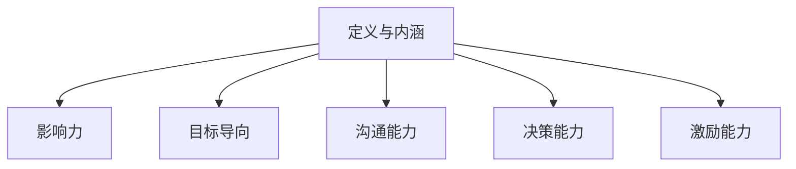
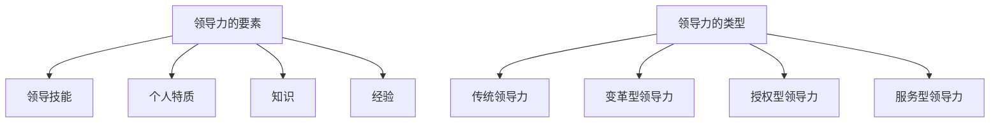
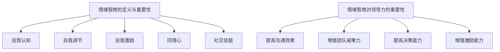
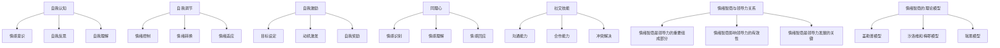

                 

### 文章标题：领导力与情绪智商：掌控自我的艺术

#### 关键词：领导力，情绪智商，自我掌控，领导技能，团队管理

#### 摘要：
本文深入探讨了领导力与情绪智商的关系，以及如何通过提升情绪智商来掌控自我，从而更有效地发挥领导力。文章从领导力的定义、要素和类型出发，分析了情绪智商的核心概念及其在领导力中的重要性，提出了提升情绪智商的实践方法，并通过案例分析展示了情绪智商在领导力实践中的应用。文章旨在为领导者提供理论指导和实践策略，以提升自我掌控能力，更好地实现团队目标。

----------------------------------------------------------------

# 目录大纲：《领导力与情绪智商：掌控自我的艺术》

## 第一部分：领导力与情绪智商的基本概念

### 第1章：领导力概述
#### 1.1 领导力的定义与内涵
#### 1.2 领导力的要素与类型
#### 1.3 情绪智商的定义与重要性

### 第2章：情绪智商的理论框架
#### 2.1 情绪智商的五大能力
#### 2.2 情绪智商与领导力的关系
#### 2.3 情绪智商的理论模型

## 第二部分：提升情绪智商的实践方法

### 第3章：认识与理解自我
#### 3.1 自我认知的方法
#### 3.2 自我情绪管理
#### 3.3 自我成长的路径

### 第4章：增强情绪理解与控制
#### 4.1 情绪识别与理解
#### 4.2 情绪调节与控制
#### 4.3 增强情绪适应能力

### 第5章：情绪智商在领导力实践中的应用
#### 5.1 情绪智商在团队管理中的应用
#### 5.2 情绪智商在沟通与协作中的应用
#### 5.3 情绪智商在冲突解决与决策中的应用

## 第三部分：情绪智商提升的案例分析

### 第6章：领导力与情绪智商的典范人物
#### 6.1 乔布斯的领导力与情绪智商
#### 6.2 奥普拉·温弗瑞的情绪智商与领导力
#### 6.3 案例分析：其他典范人物

### 第7章：领导力与情绪智商的提升策略
#### 7.1 领导力与情绪智商培训
#### 7.2 组织文化与情绪智商
#### 7.3 情绪智商的持续发展

## 附录

### 附录A：情绪智商评估工具
#### A.1 情绪智商测试量表
#### A.2 情绪智商自我评估指南

### 附录B：参考资源
#### B.1 推荐阅读
#### B.2 在线资源
#### B.3 学习与实践资源

----------------------------------------------------------------

## 第1章：领导力概述

### 1.1 领导力的定义与内涵

领导力是一种能力，它涉及引导、激励和影响他人，共同实现目标的过程。这种能力不仅限于企业或组织内部，也广泛应用于社会各个领域，如教育、政府、非营利组织等。领导力不仅仅是管理，更是一种影响力，它能够激发团队成员的潜力，推动团队朝着共同的目标前进。

领导力的内涵可以从以下几个方面来理解：

1. **影响力**：领导力是一种影响力，它能够改变他人的思维、行为和情绪。领导者通过自己的言行和决策，对团队成员产生积极的影响。
2. **目标导向**：领导者需要明确组织或团队的目标，并引导团队成员朝着这些目标努力。他们需要设定清晰的目标，并制定实现目标的策略和计划。
3. **沟通能力**：有效的沟通是领导力的重要组成部分。领导者需要能够清晰地传达目标、愿景和期望，同时也要能够倾听团队成员的意见和建议。
4. **决策能力**：领导者需要做出明智的决策，并在决策过程中考虑团队成员的意见。他们需要在复杂的情况下做出正确的选择，并为自己的决策承担责任。
5. **激励能力**：领导者需要能够激励团队成员，让他们愿意为实现目标而努力。他们需要了解团队成员的需求，并采取合适的方法来激发他们的积极性。

#### Mermaid 流程图

### 1.2 领导力的要素与类型

领导力的要素是指构成领导力的基本元素，这些要素共同决定了领导者的能力和影响力。以下是领导力的主要要素：

1. **领导技能**：包括沟通能力、决策能力、解决问题能力、团队建设能力等。这些技能是领导者必备的基本能力，它们决定了领导者是否能够有效地指导和管理团队。
2. **个人特质**：包括自信、正直、诚实、公正、责任心等。这些特质是领导者的人格特征，它们决定了领导者的行为和决策风格。
3. **知识**：包括行业知识、管理知识、团队管理知识等。知识是领导力的基础，它使领导者能够对团队和环境有更深入的理解。
4. **经验**：经验是领导力的重要组成部分。通过实践，领导者可以不断学习和成长，提高自己的领导能力。

领导力可以分为以下几种类型：

1. **传统领导力**：这种类型的领导力强调权威和指挥，领导者通过下达命令来指导团队。这种领导力适合在环境稳定、任务明确的情况下使用。
2. **变革型领导力**：这种类型的领导力强调变革和激发团队成员的潜力。领导者通过激发团队成员的积极性和创造力，推动团队实现变革。这种领导力适合在环境变化快、任务复杂的情况下使用。
3. **授权型领导力**：这种类型的领导力强调授权和团队合作。领导者通过给予团队成员更多的自主权，激发他们的积极性，实现团队的目标。这种领导力适合在团队高度自治、任务复杂的情况下使用。
4. **服务型领导力**：这种类型的领导力强调为团队成员提供服务。领导者将团队成员的需求放在首位，通过提供支持和帮助，激发团队成员的潜力，实现团队的目标。这种领导力适合在任何类型的团队中使用。

#### Mermaid 流程图

### 1.3 情绪智商的定义与重要性

情绪智商（Emotional Intelligence，简称EQ）是指一个人识别、理解、管理和使用情绪的能力。情绪智商包括以下几个方面：

1. **自我认知**：了解自己的情绪，并能够准确表达。自我认知是情绪智商的基础，它使人们能够认识到自己的情绪状态，并找到适当的应对方式。
2. **自我调节**：管理自己的情绪，使之适应不同的环境和情境。自我调节能力使人们能够在压力和挑战面前保持冷静和理智。
3. **自我激励**：激发自己的情绪，以实现目标。自我激励能力使人们能够在面对困难和挑战时保持积极的态度和动力。
4. **同理心**：理解他人的情绪，并能正确回应。同理心是人际交往的关键，它使人们能够建立良好的人际关系，增强团队合作和沟通。
5. **社交技能**：建立和维护人际关系的能力。社交技能使人们能够有效地与他人沟通，协调团队内部的关系。

情绪智商对领导力的重要性体现在以下几个方面：

1. **提高沟通效果**：情绪智商高的领导者能够更好地理解他人的情绪，从而更有效地沟通。他们能够识别团队成员的情绪状态，并根据这些信息调整自己的沟通方式和内容。
2. **增强团队凝聚力**：情绪智商高的领导者能够更好地处理团队中的冲突，增强团队的凝聚力。他们能够识别和解决团队成员之间的情绪问题，促进团队的和谐与协作。
3. **提高决策能力**：情绪智商高的领导者能够更好地管理自己的情绪，从而做出更明智的决策。他们在面对复杂和不确定的情况时能够保持冷静和理智，做出最佳选择。
4. **增强激励能力**：情绪智商高的领导者能够更好地激发团队成员的积极性，增强团队的绩效。他们能够识别和满足团队成员的需求，激发他们的潜力和创造力。

#### Mermaid 流程图

## 第2章：情绪智商的理论框架

### 2.1 情绪智商的五大能力

情绪智商（EQ）是指一个人识别、理解、管理和使用情绪的能力。它由五大能力构成，分别是自我认知、自我调节、自我激励、同理心和社交技能。这些能力共同构成了情绪智商的理论框架，对个人的领导力和社会关系产生深远影响。

#### 2.1.1 自我认知

自我认知是指了解自己的情绪、需求和动机。它包括以下几个方面：

1. **情感意识**：认识到自己正在经历的情绪，并能够准确地描述它们。
2. **自我反思**：反思自己的情绪和行为，找出情绪的来源和影响。
3. **自我理解**：理解自己的情绪和行为模式，并意识到它们如何影响自己的决策和行为。

自我认知是情绪智商的基础，它使人们能够更好地了解自己，从而更好地管理自己的情绪和行为。

#### 2.1.2 自我调节

自我调节是指管理自己的情绪，使之适应不同的环境和情境。它包括以下几个方面：

1. **情绪控制**：在压力和挑战面前保持冷静，避免情绪失控。
2. **情绪转换**：将负面情绪转化为积极情绪，以适应新的情境。
3. **情绪适应**：适应不同的人际关系和工作环境，调整自己的情绪和行为。

自我调节能力使人们能够在面对困难和挑战时保持冷静和理智，从而做出更明智的决策。

#### 2.1.3 自我激励

自我激励是指激发自己的情绪，以实现目标。它包括以下几个方面：

1. **目标设定**：设定明确的目标，并为自己设定实现目标的计划。
2. **动机激发**：在面临困难和挑战时，激发自己的内在动机，保持积极的态度。
3. **自我奖励**：为自己的进步和成就设定奖励，增强自我激励。

自我激励能力使人们能够在面对困难和挑战时保持积极的心态，从而更好地实现自己的目标。

#### 2.1.4 同理心

同理心是指理解他人的情绪，并能正确回应。它包括以下几个方面：

1. **情感识别**：识别他人的情绪，理解他们的感受。
2. **情感理解**：理解他人的情绪和行为，并找出情绪的来源。
3. **情感回应**：对他人的情绪给予适当的回应，表达关心和理解。

同理心是人际交往的关键，它使人们能够建立良好的人际关系，增强团队合作和沟通。

#### 2.1.5 社交技能

社交技能是指建立和维护人际关系的能力。它包括以下几个方面：

1. **沟通能力**：有效地表达自己的想法和感受，倾听他人的意见。
2. **合作能力**：与他人合作，共同实现目标。
3. **冲突解决**：在冲突中保持冷静，寻找解决问题的方法。

社交技能使人们能够有效地与他人沟通，协调团队内部的关系，提高团队的整体效能。

### 2.2 情绪智商与领导力的关系

情绪智商与领导力之间存在密切的关系。情绪智商高的人通常具备更强的领导力，他们能够更好地管理自己的情绪，理解他人的情绪，并有效地与他人沟通和协作。以下是情绪智商与领导力的几个关键关系：

#### 2.2.1 情绪智商是领导力的重要组成部分

情绪智商是领导力的重要组成部分，它决定了领导者是否能够有效地管理自己的情绪，理解他人的情绪，并建立良好的人际关系。情绪智商高的领导者能够更好地处理团队中的冲突，增强团队的凝聚力，提高团队的绩效。

#### 2.2.2 情绪智商影响领导力的有效性

情绪智商影响领导力的有效性。情绪智商高的领导者能够更好地理解团队成员的需求，激发他们的潜力，从而实现团队的目标。他们能够识别和解决团队成员之间的情绪问题，促进团队的和谐与协作。

#### 2.2.3 情绪智商是领导力发展的关键

情绪智商是领导力发展的关键。通过提升情绪智商，领导者可以更好地管理自己的情绪，提高自我认知和自我调节能力，增强同理心和社交技能。这些能力的提升有助于领导者更好地发挥领导力，实现团队的目标。

### 2.3 情绪智商的理论模型

情绪智商的理论模型有助于我们理解情绪智商的构成和运作方式。以下是几种常见的情绪智商理论模型：

#### 2.3.1 盖勒普（Goleman）模型

盖勒普（Goleman）模型将情绪智商分为五个核心能力，分别是自我认知、自我调节、自我激励、同理心和社交技能。这五个能力相互关联，共同构成了情绪智商的完整体系。

#### 2.3.2 沙洛维（Salovey）和梅耶（Mayer）模型

沙洛维（Salovey）和梅耶（Mayer）模型将情绪智商分为四个能力，分别是情感识别、情感理解、情感表达和情感管理。这个模型强调了情绪智商在情感表达和管理方面的作用。

#### 2.3.3 瑞恩（Reuven）模型

瑞恩（Reuven）模型将情绪智商分为六个能力，分别是情感意识、情感自我管理、情感社会意识、情感理解、情感自我激励和情感同情。这个模型强调了情绪智商在社会意识和情感自我激励方面的作用。

这些模型为我们提供了不同的视角来理解情绪智商，它们共同构成了情绪智商的理论框架，有助于我们更好地提升情绪智商，发挥领导力。

#### Mermaid 流程图

通过理解情绪智商的五大能力和理论模型，我们可以更好地认识情绪智商在领导力中的作用，并采取有效的措施来提升情绪智商，从而更好地发挥领导力。

## 第3章：认识与理解自我

### 3.1 自我认知的方法

自我认知是情绪智商的基础，它使我们能够了解自己的情绪、需求和动机。以下是一些有效的方法来提升自我认知：

#### 3.1.1 反思日记

反思日记是一种有效的自我认知方法。每天花时间记录自己的情绪、想法和行为，可以帮助我们更好地了解自己的内心世界。在写日记时，可以提问自己以下问题：

- 今天我感受到了哪些情绪？
- 这些情绪是如何产生的？
- 我的想法和行为是否符合我的价值观？
- 我有没有达到自己的目标？

通过持续的反思日记，我们可以逐渐了解自己的情绪和行为模式，从而更好地管理自己的情绪。

#### 3.1.2 心理测试

心理测试是一种科学的方法来了解自己的性格、优势和劣势。例如，MBTI（Myers-Briggs Type Indicator）和DISC（Dominance, Influence, Steadiness, Conscientiousness）测试等。这些测试可以帮助我们了解自己的性格类型，以及如何与他人相处和沟通。

#### 3.1.3 咨询专家

咨询专家是一种专业的自我认知方法。心理治疗师、心理咨询师等专业人士可以帮助我们深入了解自己的内心世界，并提供有效的建议和指导。

### 3.2 自我情绪管理

自我情绪管理是情绪智商的重要组成部分，它使我们能够有效地管理自己的情绪，保持冷静和理智。以下是一些提升自我情绪管理的方法：

#### 3.2.1 情绪识别

情绪识别是自我情绪管理的第一步。了解自己的情绪，并能够准确地描述它们，是有效管理情绪的关键。以下是一些方法来提升情绪识别：

- 保持意识：时刻关注自己的情绪，并尝试识别它们。
- 学会命名：学会用准确的词汇来描述自己的情绪，如愤怒、焦虑、沮丧等。
- 反思日记：通过反思日记来记录和分析自己的情绪。

#### 3.2.2 情绪调节

情绪调节是指管理自己的情绪，使之适应不同的环境和情境。以下是一些方法来提升情绪调节：

- 放松技巧：学习放松技巧，如深呼吸、冥想、瑜伽等，帮助自己缓解压力和焦虑。
- 正念练习：通过正念练习，学会专注于当下，减少对负面情绪的关注。
- 行为调整：改变自己的行为和反应方式，以适应不同的情绪状态。

#### 3.2.3 情绪表达

情绪表达是指将自己的情绪和感受恰当地表达出来。以下是一些方法来提升情绪表达：

- 学会沟通：学习有效的沟通技巧，如倾听、表达感受、提出需求等。
- 建立信任：与他人建立信任关系，让他们了解自己的情绪和需求。
- 表达练习：通过角色扮演、演讲等练习，提升自己的情绪表达能力。

### 3.3 自我成长的路径

自我成长是一个持续的过程，它使我们能够不断了解自己，提升情绪智商，从而更好地发挥领导力。以下是一些自我成长的路径：

#### 3.3.1 学习和阅读

学习和阅读是自我成长的重要途径。通过学习新的知识和技能，我们可以不断提升自己，适应不断变化的环境。以下是一些建议：

- 定期学习：设定学习计划，每天或每周安排一定的时间来学习新的知识和技能。
- 阅读书籍：阅读与领导力、情绪智商相关的书籍，深入了解相关理论和实践。
- 参加培训：参加相关的培训课程和工作坊，与他人交流和学习。

#### 3.3.2 反思和总结

反思和总结是自我成长的重要环节。通过反思自己的经历和成果，我们可以更好地了解自己的优点和不足，并制定改进计划。以下是一些建议：

- 定期反思：设定定期反思的时间，回顾自己的经历和成果。
- 总结经验：总结自己的成功经验和失败教训，找出改进的方向。
- 制定计划：根据反思和总结的结果，制定具体的改进计划，并付诸行动。

#### 3.3.3 建立支持网络

建立支持网络是自我成长的重要保障。通过与他人交流和合作，我们可以获得更多的资源和支持，共同成长。以下是一些建议：

- 建立关系：与他人建立良好的关系，建立自己的支持网络。
- 寻求反馈：向他人寻求反馈和建议，了解自己的优点和不足。
- 合作学习：与他人合作学习，分享知识和经验，共同进步。

通过以上方法，我们可以不断提升自我认知、自我情绪管理和自我成长，从而更好地发挥领导力，实现团队的目标。

## 第4章：增强情绪理解与控制

### 4.1 情绪识别与理解

情绪识别与理解是情绪智商的核心能力之一，它使我们能够准确识别和理解自己的情绪，并对他人的情绪有同理心。以下是一些方法和技巧来提升情绪识别与理解：

#### 4.1.1 观察身体反应

情绪识别的第一步是观察自己的身体反应。当我们感受到情绪时，身体会有一些特定的反应，如心跳加快、呼吸急促、肌肉紧张等。通过观察这些身体反应，我们可以识别出自己的情绪。

- **方法**：每天花几分钟时间观察自己的身体反应，并尝试识别出对应的情绪，如焦虑、兴奋、紧张等。
- **练习**：记录下每次情绪变化时的身体反应，并分析它们之间的关系。

#### 4.1.2 注意情绪触发点

情绪触发点是指那些引发我们情绪反应的事件或情境。了解自己的情绪触发点有助于我们更好地管理情绪。

- **方法**：回顾过去的经历，找出那些让自己情绪激动的情境，并尝试分析背后的情绪触发点。
- **练习**：在日常生活中，注意自己的情绪触发点，并尝试通过调整自己的行为和反应来减少情绪激动。

#### 4.1.2 学习情绪知识

了解不同情绪的特点、原因和影响有助于我们更好地理解和管理情绪。

- **方法**：阅读相关书籍和文章，学习情绪知识，如情绪的类型、功能、影响因素等。
- **练习**：与他人交流，分享自己对情绪的理解，从中获得新的见解。

### 4.2 情绪调节与控制

情绪调节与控制是指通过有效的方法和技巧来调整自己的情绪，使之适应不同的环境和情境。以下是一些提升情绪调节与控制的方法：

#### 4.2.1 放松技巧

放松技巧是一种有效的情绪调节方法，它可以帮助我们缓解压力和焦虑。

- **方法**：学习深呼吸、冥想、瑜伽等放松技巧，并在需要时进行实践。
- **练习**：每天花几分钟时间进行放松练习，如深呼吸练习，逐渐增加练习时间。

#### 4.2.2 自我对话

自我对话是一种自我调节的方法，它通过积极的自我对话来调整情绪。

- **方法**：在感到情绪激动时，停下来，用积极的语言与自己对话，如“我能够控制自己的情绪”、“这只是一时的情绪”等。
- **练习**：在日常生活中，养成自我对话的习惯，当情绪出现波动时，用积极的语言来调整。

#### 4.2.3 行为调整

行为调整是指通过改变自己的行为和反应方式来调节情绪。

- **方法**：在面对情绪激动时，尝试改变自己的行为，如散步、做运动、做家务等。
- **练习**：在日常生活中，培养积极的行为习惯，如定期锻炼、保持良好的作息时间等。

### 4.3 增强情绪适应能力

增强情绪适应能力是指通过提升自己的情绪调节和应对能力，使自己在面对不同情绪时能够保持冷静和理智。以下是一些方法和技巧：

#### 4.3.1 正念练习

正念练习是一种提升情绪适应能力的方法，它通过专注于当下，帮助我们在面对情绪时保持冷静和理智。

- **方法**：学习正念练习，如静坐、观呼吸等，专注于当下的情绪体验。
- **练习**：每天花几分钟时间进行正念练习，逐渐增加练习时间。

#### 4.3.2 情绪日记

情绪日记是一种记录和反思情绪的方法，它有助于我们更好地理解自己的情绪，并提升情绪适应能力。

- **方法**：每天记录自己的情绪变化，并反思情绪的触发点、应对方式等。
- **练习**：养成定期记录情绪日记的习惯，从中获得新的洞察。

#### 4.3.3 建立支持网络

建立支持网络是提升情绪适应能力的重要保障。通过与他人交流和合作，我们可以获得更多的资源和支持。

- **方法**：与他人建立良好的关系，分享自己的情绪和体验，寻求他们的理解和支持。
- **练习**：定期参加社交活动，培养自己的社交技能，建立支持网络。

通过以上方法和技巧，我们可以提升情绪识别与理解、情绪调节与控制以及情绪适应能力，从而更好地掌控自己的情绪，提升情绪智商，发挥领导力。

## 第5章：情绪智商在领导力实践中的应用

### 5.1 情绪智商在团队管理中的应用

情绪智商在团队管理中起着至关重要的作用。一个具有高情绪智商的领导者能够更好地管理团队的情绪氛围，提升团队的凝聚力和工作效率。以下是一些具体的应用场景和策略：

#### 5.1.1 管理团队情绪氛围

情绪氛围是团队情绪状态的总和，它对团队成员的士气和工作效率有着直接的影响。一个高情绪智商的领导者会关注团队的情绪氛围，并采取以下策略来管理：

- **方法**：定期组织团队情绪检查，了解团队成员的情绪状态。
- **策略**：通过积极的沟通和鼓励，激发团队成员的积极情绪，营造积极向上的团队氛围。

#### 5.1.2 预测和解决团队冲突

团队冲突是不可避免的，但一个高情绪智商的领导者能够更好地预测和解决这些冲突。以下是一些策略：

- **方法**：通过观察和倾听，提前识别潜在的冲突因素。
- **策略**：采用同理心，理解冲突双方的立场，并寻求双赢的解决方案。

#### 5.1.3 激励团队成员

情绪智商高的领导者能够识别团队成员的需求和动机，从而更有效地激励他们。以下是一些策略：

- **方法**：通过个性化激励，了解每个团队成员的激励因素。
- **策略**：设定清晰的目标和奖励机制，激发团队成员的积极性。

### 5.2 情绪智商在沟通与协作中的应用

情绪智商在沟通与协作中发挥着关键作用。一个高情绪智商的领导者能够更好地理解他人的情绪，提升沟通效果，促进团队合作。以下是一些应用场景和策略：

#### 5.2.1 提高沟通效果

有效的沟通是团队合作的基础。以下是一些策略：

- **方法**：使用开放性问题和倾听技巧，确保沟通双方的理解一致。
- **策略**：在沟通中表达同理心，尊重他人的观点和感受。

#### 5.2.2 建立良好的人际关系

良好的人际关系是团队合作的关键。以下是一些策略：

- **方法**：通过定期交流和互动，建立信任和尊重。
- **策略**：识别和解决人际关系中的问题，促进团队的和谐与协作。

#### 5.2.3 协调团队合作

一个高情绪智商的领导者能够更好地协调团队合作，确保团队目标的实现。以下是一些策略：

- **方法**：明确团队目标，确保每个成员都清楚自己的职责和贡献。
- **策略**：采用有效的团队建设活动，提升团队凝聚力和协作效率。

### 5.3 情绪智商在冲突解决与决策中的应用

情绪智商在冲突解决和决策过程中同样至关重要。一个高情绪智商的领导者能够更好地管理自己的情绪，同时理解和处理团队成员的情绪，从而做出明智的决策。以下是一些应用场景和策略：

#### 5.3.1 解决团队冲突

团队冲突是领导者的常见挑战。以下是一些策略：

- **方法**：保持冷静，避免情绪化，客观地分析冲突的原因。
- **策略**：采用建设性的对话和解决方案，确保所有相关方都参与其中。

#### 5.3.2 做出明智决策

在决策过程中，情绪智商可以帮助领导者更好地管理情绪，减少决策风险。以下是一些策略：

- **方法**：在做出决策前，进行全面的情绪评估，识别潜在的负面情绪。
- **策略**：采用多角度分析，结合情绪和理性思考，做出明智的决策。

#### 5.3.3 管理团队成员的情绪

在决策过程中，领导者需要关注团队成员的情绪反应。以下是一些策略：

- **方法**：通过有效的沟通，确保团队成员理解决策的背景和目的。
- **策略**：提供情感支持，帮助团队成员应对决策带来的情绪波动。

通过在团队管理、沟通协作、冲突解决和决策过程中应用情绪智商，领导者能够更有效地发挥领导力，提升团队的绩效和士气。这些策略不仅有助于个人成长，也为团队的长期发展奠定了坚实的基础。

### 第6章：领导力与情绪智商的典范人物

在本章中，我们将探讨几位在领导力和情绪智商方面具有卓越表现的人物，包括史蒂夫·乔布斯（Steve Jobs）和奥普拉·温弗瑞（Oprah Winfrey），并分析他们的成功故事。

#### 6.1 史蒂夫·乔布斯（Steve Jobs）

史蒂夫·乔布斯是苹果公司（Apple Inc.）的联合创始人，他的领导力和情绪智商在科技界和商业界都享有盛誉。以下是他成功的关键要素：

**领导力要素：**

- **愿景和目标**：乔布斯始终坚信自己的愿景，并坚持实现这些目标。他设定的目标远大，激励着团队成员不断努力。
- **创新精神**：乔布斯倡导创新，鼓励团队不断尝试新事物，即使失败也在所不惜。
- **激励他人**：他能够激发团队成员的潜力，使他们对工作充满热情。

**情绪智商要素：**

- **自我认知**：乔布斯对自己的情绪有深刻认知，他能够自我调节，保持冷静和专注。
- **同理心**：尽管他有时显得严厉，但乔布斯能够理解他人的情绪，并努力满足他们的需求。
- **社交技能**：乔布斯具有出色的沟通和社交技能，能够有效地与团队成员和合作伙伴沟通。

**成功故事：**

乔布斯在1976年与斯蒂夫·沃兹尼亚克（Steve Wozniak）共同创建了苹果公司。他在领导苹果公司期间，推出了多项革命性产品，如iPod、iPhone和iPad，彻底改变了个人计算和通讯方式。尽管他在职业生涯中经历了许多挑战，包括被董事会驱逐，但他始终保持着对创新和成功的热情，最终重返苹果公司，并带领公司走向了新的辉煌。

#### 6.2 奥普拉·温弗瑞（Oprah Winfrey）

奥普拉·温弗瑞是美国电视主持人、演员和制片人，也是媒体帝国的创始人。她的领导力和情绪智商在媒体界和社会领域都备受赞誉。以下是她成功的关键要素：

**领导力要素：**

- **愿景和目标**：奥普拉拥有清晰的愿景，她通过自己的节目《奥普拉·温弗瑞秀》（The Oprah Winfrey Show）传播积极的信息和价值观。
- **激励他人**：她能够激励观众和团队成员，使他们对生活充满希望和动力。
- **社交技能**：奥普拉具有出色的社交技能，能够与不同背景的人建立良好的关系。

**情绪智商要素：**

- **自我认知**：奥普拉对自己的情绪有深刻的理解，她能够自我调节，保持积极的心态。
- **同理心**：她能够深刻理解他人的情绪，并给予他们支持和鼓励。
- **社交技能**：奥普拉在人际交往中表现出色，她能够有效地与他人沟通，建立信任。

**成功故事：**

奥普拉从一个小镇女孩成长为全球知名的媒体巨头，她的成功故事激励了无数人。她的节目《奥普拉·温弗瑞秀》成为了美国历史上最成功的电视节目之一，她还在电影和电视制作领域取得了巨大成功。此外，她通过奥普拉基金会（Oprah's Angel Network）和多项慈善活动，致力于改善全球女性的生活。

#### 6.3 案例分析：其他典范人物

除了史蒂夫·乔布斯和奥普拉·温弗瑞，还有许多其他典范人物在领导力和情绪智商方面表现出色，如：

- **安格拉·阿伦特（Angela Ahrendts）**：苹果公司的零售和在线商店高级副总裁，以其卓越的领导力和情绪智商著称。她成功地将苹果的零售业务推向了新的高度。
- **杰克·韦尔奇（Jack Welch）**：通用电气（General Electric）的前首席执行官，以其强大的领导力和决策能力著称。他通过变革和创新，使通用电气成为了全球最成功的公司之一。
- **马云（Jack Ma）**：阿里巴巴集团的创始人，他的领导力和情绪智商使他成为全球知名的企业家和慈善家。他通过独特的领导风格和远见，将阿里巴巴打造成为全球最大的电子商务公司。

这些典范人物的成功故事展示了领导力和情绪智商在个人和团队成长中的重要性。他们的经验和故事为我们提供了宝贵的启示，帮助我们更好地理解和提升自己的领导力与情绪智商。

### 第7章：领导力与情绪智商的提升策略

#### 7.1 领导力与情绪智商培训

提升领导力与情绪智商的关键在于有效的培训。以下是一些培训策略：

**1. 定制化培训计划**

根据领导者的个人需求和团队特点，制定个性化的培训计划。培训内容应包括领导力、沟通技巧、决策能力、情绪智商等方面。

**2. 实践导向**

通过角色扮演、案例分析、团队建设等活动，让领导者将所学知识应用于实际工作中。实践导向的培训有助于提升领导者的实际操作能力。

**3. 持续学习**

领导力与情绪智商的提升是一个持续的过程。领导者应不断学习新的知识和技能，参加研讨会、工作坊、在线课程等，以保持自己的竞争力。

**4. 反馈与评估**

定期进行反馈和评估，了解领导者的培训效果。反馈应包括自我评估、同事评估和上级评估，以便全面了解领导力的提升情况。

#### 7.2 组织文化与情绪智商

组织文化对领导力与情绪智商的提升具有重要影响。以下是一些策略：

**1. 建立积极的组织文化**

通过奖励和表彰那些展现高情绪智商和领导力的员工，建立积极的组织文化。这种文化应鼓励员工相互支持、尊重和理解。

**2. 提供情绪智商培训**

为所有员工提供情绪智商培训，帮助他们提升自我认知、自我调节和同理心等能力。情绪智商培训应贯穿于员工的职业生涯中。

**3. 鼓励反馈和沟通**

建立开放和坦诚的沟通渠道，鼓励员工提供反馈和建议。通过定期的团队会议、问卷调查等方式，促进员工之间的沟通和理解。

**4. 建立支持网络**

为员工提供支持和资源，帮助他们应对工作中的挑战和压力。建立支持网络，如导师计划、员工咨询中心等，有助于提升员工的情绪智商和领导力。

#### 7.3 情绪智商的持续发展

情绪智商的提升是一个持续的过程，以下是一些策略：

**1. 定期自我反思**

领导者应定期进行自我反思，了解自己的情绪状态和行为模式。通过反思，找出改进的方向，并采取行动。

**2. 建立良好的生活习惯**

良好的生活习惯有助于提升情绪智商。领导者应保持健康的生活方式，如定期锻炼、保持充足的睡眠、合理饮食等。

**3. 持续学习和成长**

领导者应持续学习和成长，不断提升自己的知识和技能。通过阅读书籍、参加培训、学习新技能等方式，保持自己的竞争力。

**4. 建立情感支持系统**

领导者应建立情感支持系统，如与同事、朋友、家人交流，寻求他们的支持和理解。情感支持系统有助于领导者更好地管理自己的情绪。

通过实施上述策略，组织可以有效地提升领导力与情绪智商，促进员工的个人成长和团队绩效。这种持续的发展将有助于组织在竞争激烈的环境中保持优势。

### 附录A：情绪智商评估工具

情绪智商（EQ）的评估是理解和管理个人情绪的重要步骤。以下是一些常用的情绪智商评估工具和方法。

#### A.1 情绪智商测试量表

情绪智商测试量表是一种量化评估工具，用于评估个体在自我认知、自我调节、自我激励、同理心和社交技能等方面的表现。以下是一些常用的测试量表：

**1. 情绪智商自我评估量表（EQ-i 2.0）**

EQ-i 2.0是由Raven Press开发的广泛使用的情绪智商评估工具。它包括90个项目，涵盖五大领域：自我认知、自我调节、自我激励、同理心和社交技能。测试结果提供详细的分数和报告，帮助个人了解自己的情绪智商水平和提升方向。

**2. 情绪智商测验（MEQ）**

MEQ是一种简短的情绪智商评估工具，通常包含30个项目。它评估个体在自我认知、自我调节和同理心方面的能力。

**3. 领导力情绪智商评估（L-EQ）**

L-EQ专门设计用于评估领导者的情绪智商。它涵盖了自我认知、自我调节、同理心、社交技能和领导力方面的内容。

#### A.2 情绪智商自我评估指南

自我评估是提升情绪智商的第一步。以下是一个简单的自我评估指南，帮助个人识别和提升自己的情绪智商：

**步骤1：识别情绪**

- **方法**：记录下一天中的情绪波动，识别触发情绪的事件和情境。
- **练习**：定期回顾情绪记录，分析情绪的来源和影响。

**步骤2：自我认知**

- **方法**：反思自己的行为和决策，识别自己的优势和不足。
- **练习**：定期进行自我反思，设定个人发展目标。

**步骤3：自我调节**

- **方法**：学习放松技巧和情绪调节策略，如深呼吸、冥想等。
- **练习**：在日常生活中应用情绪调节技巧，管理负面情绪。

**步骤4：自我激励**

- **方法**：设定清晰的目标和计划，激励自己实现目标。
- **练习**：为达成目标设定奖励，保持积极的心态。

**步骤5：同理心**

- **方法**：练习倾听和同理他人，理解他人的情绪和需求。
- **练习**：与他人交流时，专注于对方的感受和观点。

**步骤6：社交技能**

- **方法**：提升沟通技巧，建立和维护人际关系。
- **练习**：参与社交活动，练习有效的沟通和合作。

通过以上步骤，个人可以更好地了解和管理自己的情绪，提升情绪智商，从而在生活和工作中取得更好的表现。

### 附录B：参考资源

**B.1 推荐阅读**

为了更深入地了解领导力与情绪智商，以下是一些推荐的书籍和文章：

- **《情绪智商》**（Emotional Intelligence）作者：丹尼尔·戈尔曼（Daniel Goleman）
- **《领导力》**（Leadership）作者：约翰·马登（John Mardesich）
- **《高效能人士的七个习惯》**（The 7 Habits of Highly Effective People）作者：史蒂芬·柯维（Stephen R. Covey）
- **《非暴力沟通》**（Nonviolent Communication）作者：马歇尔·卢森堡（Marshall B. Rosenberg）

**B.2 在线资源**

互联网上有很多关于领导力与情绪智商的在线资源和工具，以下是一些推荐：

- **Coursera**：提供各种领导力和情绪智商的在线课程。
- **LinkedIn Learning**：提供领导力和职业发展的视频教程。
- **TED Talks**：在TED网站上可以找到许多关于领导力和情绪智商的精彩演讲。

**B.3 学习与实践资源**

以下是一些用于学习和实践领导力与情绪智商的资源：

- **情绪智商工作坊**：参加情绪智商工作坊，通过互动和实践提升情绪智商。
- **领导力发展计划**：参与公司的领导力发展计划，获取专业指导和资源。
- **职业咨询**：寻求职业咨询，了解如何将领导力与情绪智商应用于实际工作中。

通过阅读推荐书籍、利用在线资源、参与工作坊和实践计划，个人和团队可以不断提升领导力与情绪智商，实现个人和组织的成长与发展。

