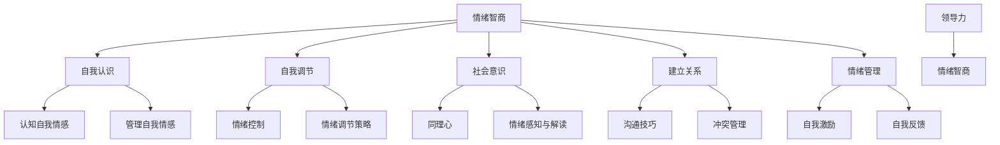

                 

### 文章标题

# 领导力与情绪智商：控制情绪的智慧

### 关键词

- 领导力
- 情绪智商
- 情绪控制
- 情绪管理
- 团队沟通
- 组织发展

### 摘要

本文深入探讨了领导力与情绪智商之间的紧密联系，以及如何通过控制情绪来提升领导效能。文章从定义情绪智商、剖析其核心要素、探讨其在领导力中的运用、以及具体实践案例等多个角度进行了详细的阐述。通过本文，读者将了解到情绪智商在个人成长、团队建设、组织发展中的重要性，并掌握一系列实用的情绪管理技巧，从而在领导岗位上更好地发挥自己的才能。

### 目录大纲设计

根据《领导力与情绪智商：控制情绪的智慧》这本书的主题，我们设计了一个详细的目录大纲，以便读者能够系统地掌握相关内容。以下是该书的完整目录大纲：

## 第一部分：理解情绪智商

### 第1章：情绪智商的定义与重要性

#### 1.1 情绪智商的概念
#### 1.2 情绪智商的重要性
#### 1.3 情绪智商与领导力的关系

### 第2章：情绪智商的核心要素

#### 2.1 自我认识
##### 2.1.1 自我情感的感知
##### 2.1.2 自我情感的管理
#### 2.2 自我调节
##### 2.2.1 情绪的控制
##### 2.2.2 情绪的调节策略
#### 2.3 社会意识
##### 2.3.1 情绪的同理心
##### 2.3.2 情绪的感知与解读
#### 2.4 建立关系
##### 2.4.1 情绪的沟通技巧
##### 2.4.2 情绪的冲突管理

### 第3章：情绪智商的发展与实践

#### 3.1 情绪智商的培养方法
##### 3.1.1 情绪自我反思
##### 3.1.2 情绪智力训练
#### 3.2 情绪智商的实际应用
##### 3.2.1 个人层面
##### 3.2.2 团队层面
##### 3.2.3 组织层面

## 第二部分：情绪智商在领导力中的运用

### 第4章：情绪智商与领导力

#### 4.1 领导力与情绪智商的联系
##### 4.1.1 情绪智商在领导力中的作用
##### 4.1.2 情绪智商对领导效能的影响
#### 4.2 情绪智商在领导力发展中的应用
##### 4.2.1 领导自我管理
##### 4.2.2 领导激励与反馈
##### 4.2.3 领导决策与问题解决

### 第5章：情绪智商与团队建设

#### 5.1 情绪智商在团队建设中的重要性
##### 5.1.1 团队情绪智商的评估
##### 5.1.2 提高团队情绪智商的策略
#### 5.2 情绪智商在团队沟通中的应用
##### 5.2.1 情绪智力沟通技巧
##### 5.2.2 团队冲突管理

### 第6章：情绪智商与组织发展

#### 6.1 情绪智商在组织管理中的应用
##### 6.1.1 组织情绪智商的构建
##### 6.1.2 组织文化的建设
#### 6.2 情绪智商在组织变革中的角色
##### 6.2.1 应对组织危机
##### 6.2.2 促进组织创新

## 第三部分：情绪智商的实践与反思

### 第7章：情绪智商的实践案例

#### 7.1 成功案例分享
##### 7.1.1 某企业领导力提升案例
##### 7.1.2 某团队情绪智商建设的经验
#### 7.2 挑战与反思
##### 7.2.1 情绪智商实践的挑战
##### 7.2.2 情绪智商实践的反思

### 第8章：情绪智商的未来发展

#### 8.1 情绪智商研究的新趋势
##### 8.1.1 人工智能与情绪智商的结合
##### 8.1.2 跨文化情绪智商研究
#### 8.2 情绪智商在未来的应用前景
##### 8.2.1 教育领域
##### 8.2.2 健康领域

通过以上目录大纲，我们可以清晰地看到本书的结构和内容安排。每个章节都围绕情绪智商的不同方面进行了深入的探讨，既涵盖了理论讲解，又结合了实际案例，旨在帮助读者全面理解和应用情绪智商。

## 第一部分：理解情绪智商

### 第1章：情绪智商的定义与重要性

情绪智商（Emotional Intelligence，简称EQ）是一种对情感的理解、感知、管理和应用的能力。它不仅仅涉及个人的情绪管理，还包括对他人的情绪感知和管理。情绪智商与传统的智商（IQ）不同，后者主要关注认知能力和逻辑推理能力，而情绪智商则更多地关注情感领域。

#### 1.1 情绪智商的概念

情绪智商最初由心理学家约翰·梅耶（John D. Mayer）和彼得·萨洛维（Peter Salovey）在1990年提出，他们将其定义为“识别、使用、理解和管理情绪的能力”。在后来的研究中，心理学家丹尼尔·戈尔曼（Daniel Goleman）对情绪智商的概念进行了进一步的拓展，提出了五个核心要素：自我认识、自我调节、社会意识、建立关系和情绪管理。

#### 1.2 情绪智商的重要性

情绪智商在个人和职业生涯中扮演着至关重要的角色。首先，在个人层面，情绪智商有助于我们更好地理解自己的情绪，从而更好地处理压力和挑战。一个高情绪智商的人能够更有效地管理自己的情绪，保持积极的心态，从而提高生活质量。其次，在职业生涯中，情绪智商是领导力和成功的关键因素。研究表明，情绪智商对领导力的贡献超过了智商和技能。高情绪智商的领导者能够更好地理解员工的需求，建立强大的团队，有效地解决问题，从而提高组织的整体效能。

#### 1.3 情绪智商与领导力的关系

情绪智商与领导力之间存在着密切的联系。首先，情绪智商是领导力的重要组成部分。一个高情绪智商的领导者能够更好地理解自己的情绪，控制情绪，以及理解和管理他人的情绪。这种能力使领导者能够在面对挑战和压力时保持冷静，做出明智的决策，并有效地激励团队成员。其次，情绪智商对领导效能有着显著的影响。研究表明，情绪智商高的领导者能够更有效地建立团队，提高员工的满意度和绩效，从而提升整个组织的效能。

为了更直观地展示情绪智商的核心概念及其与领导力的关系，我们可以使用Mermaid流程图来表示：

通过上述流程图，我们可以清晰地看到情绪智商的核心要素及其与领导力的关系。接下来，我们将深入探讨情绪智商的核心要素，以便更好地理解这一概念。

### 第2章：情绪智商的核心要素

情绪智商（EQ）涵盖了多个方面，其中核心要素包括自我认识、自我调节、社会意识和建立关系。这些要素共同构成了情绪智商的基础，对于个人成长和领导力发展具有重要意义。

#### 2.1 自我认识

自我认识是情绪智商的基础，它涉及对自己情感的理解和管理。自我认识的两个主要方面是自我情感感知和自我情感管理。

##### 2.1.1 自我情感的感知

自我情感的感知是指个体对自己情感状态的理解和认识。这包括意识到自己正在经历的情绪，例如快乐、愤怒、悲伤或焦虑。自我情感感知有助于我们更好地理解自己的情绪，从而更好地应对情绪挑战。一个有效的自我情感感知策略是定期进行自我反思，记录自己的情绪变化，并分析这些情绪背后的原因。

##### 2.1.2 自我情感的管理

自我情感的管理是指个体如何处理和调节自己的情绪。这包括学会控制情绪反应，避免情绪爆发，以及在面对负面情绪时采取积极的应对策略。例如，当感到愤怒时，可以采取深呼吸、冷静思考或寻求支持等方式来控制情绪。自我情感管理的关键是学会情绪调节策略，例如积极思考、放松训练和自我激励。

#### 2.2 自我调节

自我调节是指个体如何管理自己的行为和情绪，以适应不同的环境和挑战。自我调节的能力对于应对压力和保持心理健康至关重要。

##### 2.2.1 情绪的控制

情绪的控制是指个体如何抑制或调节不适当的情绪反应。一个有效的情绪控制策略是学会识别情绪触发点，并在情绪爆发前采取预防措施。例如，当感到压力时，可以采取放松技巧、运动或冥想来缓解情绪。

##### 2.2.2 情绪的调节策略

情绪的调节策略包括一系列方法，帮助个体在情绪不稳定时恢复平衡。常见的调节策略有：

1. **认知重构**：通过改变对情境的认知评价来调节情绪。例如，将挑战视为成长机会，而不是威胁。
2. **放松训练**：通过深呼吸、冥想或渐进性肌肉松弛来减轻紧张和焦虑。
3. **运动**：通过身体活动来释放紧张情绪，提高心情。
4. **寻求支持**：与家人、朋友或专业人士交流，寻求情感支持和建议。

#### 2.3 社会意识

社会意识是指个体对他人情感状态的理解和管理能力。它包括同理心和情绪感知与解读。

##### 2.3.1 情绪的同理心

同理心是指能够感知和理解他人情感状态的能力。一个高同理心的个体能够设身处地为他人考虑，从而更好地与他人沟通和建立关系。同理心有助于建立信任，促进团队合作，并提高领导效能。

##### 2.3.2 情绪的感知与解读

情绪的感知与解读是指个体如何识别和解释他人的情绪表达。这包括通过语言、面部表情、身体语言等非言语线索来感知情绪，并正确解读这些情绪背后的含义。有效的情绪感知与解读有助于避免误解和冲突，促进有效沟通。

#### 2.4 建立关系

建立关系是指个体如何与他人建立和维护积极的情感联系。情绪智商在建立关系中的作用至关重要。

##### 2.4.1 情绪的沟通技巧

情绪的沟通技巧是指个体如何通过语言和非语言方式表达自己的情绪，并理解他人的情绪。这包括倾听技巧、表达情感的能力、以及解决冲突的策略。有效的情绪沟通技巧有助于建立信任，提高团队合作，并促进个人和组织的成功。

##### 2.4.2 情绪的冲突管理

情绪的冲突管理是指个体如何处理和解决与他人之间的情绪冲突。这包括识别冲突原因、采取适当的沟通策略，以及寻求解决方案。有效的情绪冲突管理有助于维护团队和谐，提高组织效能。

通过以上对情绪智商核心要素的详细探讨，我们可以看到，情绪智商不仅仅是关于个人情感管理，还涉及到与他人建立良好关系的能力。这些能力在个人成长和职业生涯中发挥着重要作用，尤其是在领导力发展中。接下来，我们将进一步探讨情绪智商的发展和实践，以便更好地理解其应用价值。

### 第3章：情绪智商的发展与实践

情绪智商（EQ）是一种可以通过培养和实践得到提升的能力。通过以下方法，个体可以在日常生活中发展自己的情绪智商，从而在个人、团队和组织层面取得更好的成效。

#### 3.1 情绪智商的培养方法

培养情绪智商需要从自我反思和情感训练两个方面入手。

##### 3.1.1 情绪自我反思

情绪自我反思是一种通过内省和自我观察来提高对情绪认识的方法。以下是一些具体的步骤：

1. **记录情绪日记**：每天记录自己的情绪状态，包括情绪类型、出现时间、情绪强度和引发原因。通过这种记录，可以更清晰地看到自己的情绪模式。
2. **自我提问**：在情绪日记的基础上，定期进行自我提问，例如：“我在这个情境中为什么会有这样的情绪？”“我如何能更好地处理这种情绪？”通过这些提问，可以深入分析自己的情绪反应，找到改进的方法。
3. **设定情绪目标**：根据自己的情绪日记和自我提问，设定具体的情绪管理目标，如减少负面情绪的时间、提高同理心等。定期评估进展，调整策略。

##### 3.1.2 情绪智力训练

情绪智力训练是通过一系列练习来提高情绪管理能力的具体方法。以下是一些常见的训练方式：

1. **情感角色扮演**：与他人一起模拟各种情境，例如工作中的冲突或家庭中的矛盾，然后练习如何以积极的方式表达和处理情绪。这种角色扮演有助于提高情绪表达能力和冲突解决能力。
2. **正念练习**：通过冥想、深呼吸等正念练习，提高自我意识和情绪调节能力。正念练习有助于减少压力，提高情绪稳定性。
3. **情绪调节策略练习**：练习各种情绪调节策略，如认知重构、放松训练和运动。通过不断的练习，可以在实际情境中更有效地应用这些策略。

#### 3.2 情绪智商的实际应用

情绪智商在实际应用中体现在个人、团队和组织三个层面。

##### 3.2.1 个人层面

在个人层面，情绪智商有助于提高个人生活质量和职业效能。以下是一些实际应用的例子：

1. **提高人际关系质量**：通过同理心和情绪沟通技巧，建立更紧密的家庭关系和友谊。这有助于减少冲突，提高情感支持。
2. **提升职业表现**：通过自我调节和情绪管理，提高工作表现和职业满意度。高情绪智商的员工更容易适应工作压力，保持积极的工作态度。
3. **增强心理健康**：通过自我反思和情感训练，提高心理健康水平，减少焦虑和抑郁症状。

##### 3.2.2 团队层面

在团队层面，情绪智商有助于建立高效的团队和提升团队效能。以下是一些实际应用的例子：

1. **增强团队合作**：通过情绪沟通技巧和冲突管理策略，减少团队冲突，提高团队合作效率。
2. **提高团队凝聚力**：通过同理心和积极情感表达，建立信任和尊重，增强团队凝聚力。
3. **提升团队创新力**：通过自我调节和情绪管理，提高团队成员的创造力和创新能力。

##### 3.2.3 组织层面

在组织层面，情绪智商有助于提升组织文化和整体效能。以下是一些实际应用的例子：

1. **构建积极组织文化**：通过情绪管理和沟通技巧，建立积极、健康的工作环境，提高员工满意度和忠诚度。
2. **提高领导效能**：通过情绪智商的领导力发展，提高领导者的决策能力、激励能力和问题解决能力。
3. **促进组织创新**：通过情绪智商的培养，激发员工的创新思维和创造力，推动组织变革和创新。

总之，情绪智商是一种可以通过培养和实践得到提升的能力，它在个人、团队和组织层面都有广泛的应用价值。通过自我反思、情感训练和实际应用，个体可以有效地提高情绪智商，从而在生活和工作中取得更好的成效。

### 第二部分：情绪智商在领导力中的运用

情绪智商在领导力中的重要性不容忽视。一个高情绪智商的领导者不仅能够更好地管理自己的情绪，还能够有效地影响和激励团队成员，从而提高组织的整体效能。在本章中，我们将探讨情绪智商与领导力之间的联系，并讨论如何在实际领导力发展过程中应用情绪智商。

#### 4.1 领导力与情绪智商的联系

领导力与情绪智商之间存在紧密的联系。首先，情绪智商是领导力的重要组成部分。一个高情绪智商的领导者能够更好地理解自己的情绪，管理自己的情绪反应，并在面对挑战和压力时保持冷静。这种能力使领导者能够做出更明智的决策，并有效地应对复杂的情况。

其次，情绪智商对领导效能有着显著的影响。研究表明，情绪智商高的领导者能够更有效地建立团队，提高员工的满意度和绩效。他们能够更好地理解员工的需求和情感，从而提供更有针对性的激励和支持。此外，高情绪智商的领导者能够更有效地解决团队冲突，促进团队成员之间的沟通和协作，从而提高团队的整体效能。

#### 4.1.1 情绪智商在领导力中的作用

情绪智商在领导力中发挥着多种重要作用。以下是几个关键方面：

1. **自我管理**：高情绪智商的领导者能够更好地管理自己的情绪，保持情绪稳定。这种自我管理能力使领导者能够在压力下保持冷静，做出理智的决策，并有效地应对突发事件。

2. **激励与反馈**：情绪智商高的领导者能够更有效地激励员工，提供积极的反馈。他们能够理解员工的情感需求，从而提供更有针对性的激励措施。此外，他们能够通过积极的反馈来认可员工的贡献，增强员工的自信心和动力。

3. **问题解决**：情绪智商高的领导者能够更有效地解决团队中的问题和冲突。他们能够通过同理心和沟通技巧来理解问题的根源，并采取适当的措施来解决问题。这种能力有助于减少冲突，提高团队的整体效能。

4. **团队建设**：情绪智商高的领导者能够更好地建立和维护团队关系。他们能够通过同理心和积极的情感表达来增强团队成员之间的信任和合作。这种团队建设能力有助于提高团队的凝聚力和协作效率。

#### 4.1.2 情绪智商对领导效能的影响

情绪智商对领导效能有着显著的影响。以下是几个具体的影响：

1. **提高员工满意度**：情绪智商高的领导者能够更好地理解员工的需求和情感，从而提供更有针对性的支持。这种支持有助于提高员工的满意度和忠诚度，减少员工流失率。

2. **提升团队绩效**：情绪智商高的领导者能够更有效地激励和引导团队成员，从而提高团队的绩效。他们能够通过积极的反馈和激励措施来激发团队成员的潜力，促进团队目标的实现。

3. **减少冲突**：情绪智商高的领导者能够更有效地解决团队冲突，避免负面情绪的扩散。他们能够通过同理心和沟通技巧来理解冲突的根源，并采取适当的措施来解决问题，从而维护团队的和谐和稳定。

4. **提高决策质量**：情绪智商高的领导者能够在决策过程中更好地管理自己的情绪，避免冲动和偏见。这种情绪管理能力有助于提高决策的质量，减少错误决策的可能性。

#### 4.2 情绪智商在领导力发展中的应用

为了在实际领导力发展中应用情绪智商，领导者可以采取以下措施：

1. **自我反思**：领导者应该定期进行自我反思，了解自己的情绪反应和管理方式。通过自我反思，领导者可以识别自己的情绪触发点，并找到改进情绪管理的策略。

2. **情感培训**：领导者可以参加情感培训课程，学习情绪管理的技巧和策略。这些课程可以帮助领导者提高情绪智商，更好地应对领导工作中的挑战。

3. **积极沟通**：领导者应该通过积极的沟通方式与团队成员建立联系。这包括倾听、同理心和有效的情感表达。积极的沟通有助于建立信任和尊重，提高团队的整体效能。

4. **建立支持系统**：领导者可以建立支持系统，为团队成员提供情感支持和建议。这种支持系统可以包括团队会议、一对一辅导和心理健康咨询等。

5. **持续学习**：领导者应该持续学习，不断提升自己的情绪智商。这可以通过阅读相关书籍、参加研讨会和与同行交流来实现。

通过以上措施，领导者可以在实际工作中有效地应用情绪智商，提高领导效能，促进团队和组织的发展。

### 第5章：情绪智商与团队建设

情绪智商在团队建设中的作用至关重要。一个高情绪智商的团队能够更好地处理内部冲突，提高协作效率，从而实现更高的目标。本章将探讨情绪智商在团队建设中的重要性，以及如何评估和提高团队的情商。

#### 5.1 情绪智商在团队建设中的重要性

情绪智商在团队建设中的重要性体现在以下几个方面：

1. **提高团队合作效率**：高情绪智商的团队成员能够更好地理解和管理自己的情绪，从而减少冲突和误解，提高团队合作效率。

2. **增强团队凝聚力**：通过同理心和积极的情感表达，团队成员能够建立更深层次的信任和尊重，增强团队的凝聚力。

3. **促进问题解决**：情绪智商高的团队成员能够更有效地识别和解决团队中的问题，避免负面情绪的扩散，从而提高问题解决能力。

4. **提升创新能力**：情绪智商有助于团队成员在压力下保持积极的心态，激发创新思维，从而推动团队在创新方面的突破。

#### 5.1.1 团队情绪智商的评估

评估团队情绪智商是团队建设的重要步骤。以下是一些常用的评估方法：

1. **问卷调查**：通过问卷调查，可以了解团队成员的情绪认知、情绪管理、同理心等情绪智商方面的情况。常用的工具包括丹尼尔·戈尔曼的情绪智商问卷（EQ-i）和迈尔斯-布里格斯性格类型指标（MBTI）。

2. **团队反馈**：通过团队反馈会议，团队成员可以匿名分享自己的情绪体验和团队关系，从而识别团队中的情绪问题和潜在改进方向。

3. **行为观察**：领导者可以通过观察团队成员在团队活动中的行为，评估他们的情绪智商表现。例如，是否能够有效沟通、解决冲突、表现出同理心等。

4. **心理测试**：专业的心理测试工具，如情商测试（EQ Test）和行为评估测试（BAP），可以提供更详细的情绪智商数据，帮助团队识别改进方向。

#### 5.1.2 提高团队情绪智商的策略

为了提高团队情绪智商，领导者可以采取以下策略：

1. **培训与发展**：提供情绪智商培训课程，帮助团队成员提高自我认知、自我调节、同理心和沟通技巧。这些培训可以包括研讨会、工作坊和在线课程。

2. **建立反馈机制**：建立定期的团队反馈机制，鼓励团队成员分享自己的情绪体验和改进建议。这种反馈机制可以帮助团队成员识别问题，并共同制定改进计划。

3. **促进积极沟通**：鼓励团队成员进行积极的沟通，包括倾听、同理心和有效的情感表达。领导者可以设置团队沟通目标，并提供沟通技巧培训。

4. **建立信任文化**：通过建立信任文化，促进团队成员之间的信任和尊重。这可以通过定期的团队建设活动、开放的沟通渠道和共同的目标来实现。

5. **提供支持与资源**：为团队成员提供情感支持和资源，如心理健康咨询和情绪管理工具。这可以帮助团队成员在压力下保持积极的心态，提高情绪智商。

通过以上策略，领导者可以帮助团队提高情绪智商，从而增强团队的合作效率、凝聚力和创新能力。

### 第6章：情绪智商与组织发展

情绪智商不仅对个人和团队有着深远的影响，也对组织发展起到关键作用。在本章中，我们将探讨情绪智商在组织管理中的应用，以及如何通过构建积极的组织文化和应对组织变革来提升组织的整体效能。

#### 6.1 情绪智商在组织管理中的应用

情绪智商在组织管理中的应用主要体现在以下几个方面：

1. **提高管理效能**：高情绪智商的管理者能够更好地理解员工的情感需求，从而制定更有效的管理策略。他们能够通过同理心和有效的沟通技巧来激励员工，提高员工的工作满意度和绩效。

2. **构建积极组织文化**：情绪智商有助于构建积极、健康的工作环境。通过同理心和积极的情感表达，组织成员能够建立信任和尊重，从而形成一种积极向上的组织文化。

3. **提升决策质量**：情绪智商高的管理者能够在面对复杂决策时更好地管理自己的情绪，避免冲动和偏见，从而提高决策质量。

4. **增强创新能力**：情绪智商有助于组织在压力下保持创新动力。通过同理心和积极的情感表达，组织成员能够更好地应对挑战，推动创新思维和组织变革。

#### 6.1.1 组织情绪智商的构建

构建组织情绪智商需要从以下几个方面入手：

1. **领导层带头**：领导者应该以身作则，展示高情绪智商的行为，包括自我管理、同理心和积极的沟通技巧。通过领导层的示范作用，可以树立组织情绪智商的标杆。

2. **培养员工情商**：通过培训和指导，帮助员工提高自我认知、自我调节、同理心和沟通技巧。这可以通过内部培训、外部培训和在线课程来实现。

3. **建立反馈机制**：鼓励员工定期进行自我反思和相互反馈，识别和改进情绪管理方面的不足。这种反馈机制可以帮助员工在情感领域不断成长。

4. **促进跨部门合作**：通过跨部门的项目和活动，促进不同部门之间的沟通和协作，提高整体的情绪智商水平。

#### 6.1.2 组织文化的建设

组织文化是情绪智商得以发挥的重要基础。以下是一些建设积极组织文化的策略：

1. **价值观传递**：明确组织的核心价值观，并通过各种渠道传递给全体员工。这包括公司的使命、愿景和核心信念。

2. **透明沟通**：建立透明、开放的沟通渠道，鼓励员工表达自己的想法和情感。这有助于建立信任和尊重，促进团队合作。

3. **认可与激励**：通过认可和奖励员工的成绩，激发员工的积极性和创造力。这种认可可以包括公开表扬、奖金和晋升机会。

4. **支持个人发展**：提供员工个人发展的机会和资源，包括培训、辅导和职业规划。这有助于员工在情感和职业方面不断成长。

#### 6.2 情绪智商在组织变革中的角色

组织变革过程中，情绪智商发挥着关键作用。以下是一些情绪智商在组织变革中的应用：

1. **应对变革压力**：情绪智商高的员工能够更好地应对变革带来的压力和不确定性，保持积极的心态，从而推动变革的顺利进行。

2. **促进员工参与**：情绪智商有助于提高员工对变革的接受度，鼓励员工积极参与变革过程。通过同理心和积极的沟通技巧，领导者可以更好地理解员工的需求和担忧，从而提高员工对变革的支持。

3. **解决变革冲突**：情绪智商高的员工能够更有效地解决变革过程中出现的冲突，避免负面情绪的扩散，从而维护组织的稳定和和谐。

4. **推动组织创新**：情绪智商有助于激发员工的创新思维和创造力，推动组织在变革中寻求新的机会和发展方向。

#### 6.2.1 应对组织危机

在组织危机中，情绪智商的作用尤为重要。以下是一些应对组织危机的策略：

1. **快速响应**：情绪智商高的领导者能够迅速识别危机，并采取有效的应对措施。他们能够保持冷静，分析问题，并制定合理的解决方案。

2. **有效沟通**：情绪智商有助于领导者与员工进行有效沟通，传达危机信息，解释危机的原因和影响，从而稳定员工情绪，减少恐慌。

3. **积极动员**：情绪智商高的领导者能够通过积极的情感表达和激励措施，动员员工共同应对危机，共同寻找解决问题的办法。

4. **提供支持**：在危机中，情绪智商高的领导者会提供情感支持和实际帮助，帮助员工度过难关，恢复信心。

通过上述策略，组织可以在危机中保持稳定，甚至实现逆境中的转型和成长。

总之，情绪智商在组织发展中扮演着重要角色。通过构建积极的组织文化、应对组织变革和危机，组织可以提升整体效能，实现可持续发展。

### 第7章：情绪智商的实践案例

情绪智商（EQ）是一种可以通过实践得到提升的能力。在本章中，我们将通过分析成功案例和面临的挑战，深入探讨情绪智商在实践中的应用。

#### 7.1 成功案例分享

以下是一些情绪智商在实践中的成功案例：

**案例一：某企业领导力提升**

在某企业，领导层意识到情绪智商在提升领导力中的重要性，于是决定进行全员情绪智商培训。通过一系列的培训活动，包括角色扮演、团队反馈和情感训练，企业领导者的情绪管理能力得到了显著提升。他们能够更好地理解员工的情感需求，提供更有针对性的激励和支持，从而提高了员工的工作满意度和绩效。此外，企业内部冲突得到了有效缓解，团队凝聚力显著增强。

**案例二：某团队情绪智商建设**

在某团队中，团队成员通过定期进行情绪智商的自我反思和培训，提高了自我认知和情绪管理能力。他们学会了如何更好地处理压力和挑战，保持了积极的心态。通过同理心和有效的沟通技巧，团队成员之间建立了深厚的信任和尊重，团队协作效率大幅提高。团队创新力也得到了显著提升，成功推出了一系列创新产品。

#### 7.2 挑战与反思

尽管情绪智商在实践中有诸多成功案例，但在实际应用中也面临一些挑战：

**挑战一：文化差异**

在跨文化团队中，情绪智商的应用受到文化差异的挑战。不同文化背景下，人们的情绪表达和管理方式可能存在差异，这可能导致误解和冲突。为了克服这一挑战，团队需要加强跨文化沟通培训，提高对文化差异的敏感性和适应能力。

**挑战二：员工抵触情绪**

一些员工可能对情绪智商培训持怀疑态度，认为这是浪费时间和资源。为了应对这一挑战，企业需要通过成功案例和实际效果来证明情绪智商培训的价值，同时鼓励员工积极参与，建立信任和合作关系。

**挑战三：持续性和系统性**

情绪智商的提升需要长期的持续努力和系统性规划。企业需要制定长期的情绪智商发展战略，并将其纳入员工培训和发展计划中，以确保情绪智商的提升能够持续并得到巩固。

#### 7.3 反思与建议

通过对成功案例和挑战的反思，我们提出以下建议：

1. **强化领导力培训**：企业应将情绪智商培训作为领导力发展的重要组成部分，通过定期的培训和研讨会，提升领导者的情绪管理能力和同理心。

2. **建立反馈机制**：建立有效的反馈机制，鼓励员工进行自我反思和相互反馈，识别和改进情绪管理方面的不足。

3. **跨文化沟通培训**：加强跨文化沟通培训，提高团队成员对文化差异的敏感性和适应能力，促进跨文化团队的协作和融合。

4. **长期发展战略**：制定长期的情绪智商发展战略，将其纳入企业文化和员工发展计划中，确保情绪智商的提升能够持续并得到系统性的支持。

通过以上措施，企业可以更好地应用情绪智商，提升领导力和团队效能，实现组织的可持续发展。

### 第8章：情绪智商的未来发展

随着社会的不断进步和科技的发展，情绪智商（EQ）正迎来新的机遇和挑战。本章将探讨情绪智商研究的最新趋势，以及在未来各个领域的应用前景。

#### 8.1 情绪智商研究的新趋势

1. **人工智能与情绪智商的结合**：人工智能（AI）技术的发展为情绪智商的研究提供了新的工具和方法。通过机器学习和大数据分析，研究人员可以更精确地测量和预测个体的情绪状态。例如，利用面部识别技术和情绪分析软件，可以实时检测个体的情绪变化，从而为情绪管理提供实时反馈。

2. **跨文化情绪智商研究**：随着全球化进程的加速，跨文化情绪智商研究越来越受到关注。不同文化背景下的情绪表达和管理方式存在差异，这为情绪智商的研究提供了丰富的素材。未来的研究将更深入地探讨情绪智商在跨文化背景下的应用和影响。

3. **情绪智商的神经科学研究**：神经科学的发展使得情绪智商的研究更加深入。通过脑成像技术和神经心理学测试，研究人员可以揭示情绪智商与大脑结构、功能之间的联系，从而为情绪智商的提升提供生理基础。

#### 8.2 情绪智商在未来的应用前景

1. **教育领域**：情绪智商在教育事业中的应用前景广阔。通过情感教育和情绪智商培训，学生可以更好地理解和管理自己的情绪，提高学习效果和人际交往能力。未来，学校可以引入情绪智商评估工具，制定个性化的情感教育计划。

2. **健康领域**：情绪智商在心理健康和医疗保健领域具有重要意义。通过情绪智商的评估和干预，可以预防和治疗情感障碍，提高心理健康水平。未来，情绪智商评估将成为健康检查的一部分，帮助个体和医疗专业人员更好地管理情绪健康。

3. **职场领域**：在职场中，情绪智商对个人和组织的成功都至关重要。未来，企业和组织将更加注重员工的情绪智商培养，通过培训和发展计划提高员工的情绪管理能力和同理心。高情绪智商的员工将成为企业的重要资产，推动组织的创新和变革。

4. **公共管理**：情绪智商在公共管理和社会治理中发挥着重要作用。通过提高公共管理者的情绪智商，可以更好地应对社会问题，提高政策制定和执行的有效性。未来，政府和社会组织将更加重视情绪智商的培养和应用，以实现社会和谐与可持续发展。

总之，情绪智商在未来的发展中具有广阔的应用前景。随着科技的进步和研究的深入，情绪智商将在各个领域发挥越来越重要的作用，为个体和社会的全面发展提供有力支持。

### 总结与最佳实践

通过本文的深入探讨，我们了解了情绪智商在领导力、团队建设、组织发展中的重要性，并探讨了如何通过自我反思、情感训练和实际应用来提升情绪智商。以下是本文的核心观点和最佳实践总结：

1. **情绪智商的重要性**：情绪智商不仅影响个人生活质量和职业效能，还对团队协作和组织发展具有深远影响。一个高情绪智商的领导者能够更好地管理情绪，激励员工，解决问题，提升团队效能。

2. **核心要素**：情绪智商的核心要素包括自我认识、自我调节、社会意识和建立关系。通过提高这些方面的能力，个体可以更好地理解和管理自己的情绪，以及理解和影响他人的情绪。

3. **培养方法**：通过自我反思和情感训练，个体可以提升情绪智商。自我反思包括记录情绪日记、定期自我提问和设定情绪目标。情感训练则包括角色扮演、正念练习和情绪调节策略练习。

4. **实际应用**：情绪智商在实际应用中体现在个人、团队和组织层面。在个人层面，提高情绪智商有助于提升人际关系质量和职业表现。在团队层面，情绪智商有助于增强团队合作、提高团队凝聚力和创新能力。在组织层面，情绪智商有助于构建积极组织文化、提升决策质量和促进组织创新。

5. **最佳实践**：为了更好地应用情绪智商，建议企业加强领导力培训，建立反馈机制，促进跨文化沟通，并制定长期的情绪智商发展战略。此外，个人可以通过阅读相关书籍、参加研讨会和持续学习来提升情绪智商。

通过以上总结，我们希望读者能够更好地理解情绪智商的重要性和应用方法，并将其应用到实际工作和生活中，从而提升个人和组织的整体效能。

### 注意事项与拓展阅读

在提升情绪智商的过程中，以下注意事项和建议将对您的实践有所帮助：

1. **定期自我反思**：自我反思是提升情绪智商的关键步骤。建议您每天花时间记录自己的情绪状态和反应，分析情绪背后的原因，并设定情绪管理目标。

2. **建立支持系统**：与家人、朋友或专业人士分享您的情绪体验，建立一个支持系统。这有助于您在情绪低落时获得帮助和鼓励，同时也可以从他人的反馈中获得新的视角和解决方案。

3. **持续学习**：情绪智商是一个持续发展的过程，需要不断学习和实践。建议您阅读相关书籍，参加研讨会和工作坊，以保持对情绪智商的关注和提升。

4. **注重实践**：理论知识是基础，但实践才是提升情绪智商的关键。将所学的情绪管理技巧应用到实际工作和生活中，通过不断的实践来巩固和提高。

5. **心理辅导**：在情绪管理遇到困难时，可以考虑寻求专业的心理辅导。心理咨询师可以提供专业的指导和支持，帮助您更好地理解和管理自己的情绪。

以下是一些拓展阅读的推荐，供您进一步了解情绪智商的相关知识：

- 《情绪智力》（Emotional Intelligence），作者：丹尼尔·戈尔曼（Daniel Goleman）
- 《情绪智商训练》（Emotional Intelligence 2.0），作者：史蒂芬·柯维（Stephen R. Covey）等
- 《情绪智商实践指南》（The Emotional Intelligence Primer），作者：朱迪思·汉弗莱斯（Judith Humphries）
- 《情绪智商在工作中的应用》（Applying Emotional Intelligence in the Workplace），作者：凯瑟琳·卡斯特罗（Catherine Castro）

通过以上阅读和实践，您将能够更好地理解和应用情绪智商，提升个人和组织的整体效能。希望这篇文章能够为您在情绪管理方面提供有价值的启示和帮助。作者：AI天才研究院/AI Genius Institute & 禅与计算机程序设计艺术 /Zen And The Art of Computer Programming。再次感谢您的阅读和时间。

