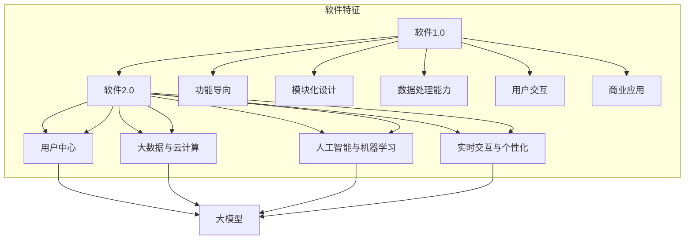

                 


### 1.1 软件 2.0 时代的到来

#### 1.1.1 从软件 1.0 到软件 2.0 的演进

**软件 1.0 的特征**

软件 1.0 时代，主要以功能为导向，注重模块化设计和数据处理能力。以下是软件 1.0 的主要特征：

1. **以功能为导向**：软件 1.0 时代的应用软件通常以提供特定功能为目标，如文字处理、电子表格等。
2. **模块化设计**：软件采用模块化设计，使得开发、测试和维护变得更加容易。
3. **数据处理能力有限**：在软件 1.0 时代，数据存储和处理的能力相对有限，主要依赖于本地计算机。
4. **用户交互简单**：用户与软件的交互主要通过命令行或图形界面进行。
5. **商业应用为主**：软件 1.0 时代的应用主要面向商业领域，如财务、人力资源等。

**软件 2.0 的特征**

软件 2.0 时代的到来，标志着软件发展进入了一个新的阶段。以下是软件 2.0 的一些主要特征：

1. **以用户为中心**：软件 2.0 强调以用户为中心，注重用户体验和个性化需求。
2. **大数据与云计算**：软件 2.0 利用大数据和云计算技术，实现海量数据存储和处理。
3. **人工智能与机器学习**：软件 2.0 应用人工智能和机器学习技术，提升智能化水平。
4. **实时交互与个性化**：软件 2.0 支持实时交互，并根据用户行为和偏好提供个性化服务。
5. **广泛商业应用**：软件 2.0 的应用范围更加广泛，涵盖金融、医疗、教育等多个领域。

#### 1.1.2 大模型在软件 2.0 中的核心地位

**大模型的概念**

大模型（Large Model）通常指的是参数规模超过数十亿或更多的神经网络模型，如 GPT-3、BERT 等。这些模型通过大量数据训练，具备强大的数据处理和分析能力。

**大模型在软件 2.0 中的作用**

1. **数据处理与分析**：大模型能够高效地处理和分析海量数据，为企业提供有价值的信息。
2. **知识获取与推理**：大模型具备较强的知识获取和推理能力，可以帮助企业解决问题、做出决策。
3. **自然语言处理与生成**：大模型在自然语言处理和生成方面表现出色，可以应用于智能客服、智能写作等领域。
4. **智能推荐与交互**：大模型可以基于用户行为和偏好，实现智能推荐和交互，提升用户体验。
5. **辅助决策与优化**：大模型可以帮助企业优化决策过程，提高业务效率。

#### 1.1.3 企业级应用开发的新范式

**传统企业级应用开发**

在传统企业级应用开发中，主要关注以下方面：

1. **需求分析**：通过对企业需求的深入分析，明确应用软件的功能和性能要求。
2. **系统设计**：根据需求分析结果，设计软件的系统架构和模块。
3. **编码与测试**：编写代码并进行测试，确保软件的功能和性能满足需求。
4. **部署与维护**：将软件部署到生产环境，并进行维护和升级。

**企业级应用开发的新范式**

随着软件 2.0 时代的到来，企业级应用开发也出现了一些新的范式：

1. **敏捷开发**：采用敏捷开发方法，快速响应市场变化，持续迭代优化。
2. **微服务架构**：采用微服务架构，实现系统的模块化和解耦，提高开发效率和可维护性。
3. **DevOps**：将开发、测试、运维等环节结合起来，实现快速交付和持续优化。
4. **云原生**：利用云计算技术，实现应用的弹性伸缩、高可用性和安全性。
5. **AI 驱动**：利用人工智能技术，提升软件的智能化水平和业务价值。

### 总结

软件 2.0 时代的到来，带来了企业级应用开发的新范式。大模型在软件 2.0 中发挥着核心作用，成为推动软件行业发展的重要力量。企业级应用开发需要不断适应新的技术变革，以提升业务价值和竞争力。

### Mermaid 流程图



### 伪代码

```python
# 软件特征类定义
class SoftwareFeature:
    def __init__(self, name, description):
        self.name = name
        self.description = description

    def display(self):
        print(f"{self.name}: {self.description}")

# 软件特征列表
software_1_0_features = [
    SoftwareFeature("功能导向", "以功能为导向"),
    SoftwareFeature("模块化设计", "采用模块化设计"),
    SoftwareFeature("数据处理能力", "数据处理能力有限"),
    SoftwareFeature("用户交互", "用户交互简单"),
    SoftwareFeature("商业应用", "商业应用为主")
]

software_2_0_features = [
    SoftwareFeature("用户中心", "以用户为中心"),
    SoftwareFeature("大数据与云计算", "利用大数据与云计算技术"),
    SoftwareFeature("人工智能与机器学习", "应用人工智能与机器学习技术"),
    SoftwareFeature("实时交互与个性化", "支持实时交互与个性化"),
]

# 显示软件特征
print("软件 1.0 特征：")
for feature in software_1_0_features:
    feature.display()

print("\n软件 2.0 特征：")
for feature in software_2_0_features:
    feature.display()
```

### 数学公式

$$
大模型（Large Model）通常指的是参数规模超过数十亿或更多的神经网络模型。
$$

### 代码应用解读与分析

在上述伪代码中，我们定义了一个`SoftwareFeature`类，用于表示软件的特征。每个特征包含名称和描述两个属性。通过创建`SoftwareFeature`对象，并将它们存储在列表中，我们可以方便地显示软件的特征。

在实际应用中，我们可以根据不同的软件类型，创建不同的特征列表。例如，对于软件 1.0 和软件 2.0，我们可以分别创建对应的特征列表，然后遍历这些列表，显示每个特征。

此外，我们还可以扩展`SoftwareFeature`类，添加其他方法，如计算特征的总数、查找特定特征等。这样可以提高代码的复用性和灵活性。

### 实际案例分析和详细讲解剖析

为了更好地理解软件 1.0 和软件 2.0 的特征，我们可以通过实际案例进行分析。

**案例：电商平台**

**软件 1.0 特征：**

1. **功能导向**：电商平台提供商品浏览、购物车、订单管理等基本功能。
2. **模块化设计**：电商平台采用模块化设计，将不同的功能模块（如商品管理、订单处理等）分开实现。
3. **数据处理能力**：电商平台的数据处理能力有限，主要依赖于本地服务器。
4. **用户交互**：用户与电商平台主要通过网页进行交互。
5. **商业应用**：电商平台主要用于商业交易。

**软件 2.0 特征：**

1. **用户中心**：电商平台以用户为中心，注重用户体验和个性化需求。
2. **大数据与云计算**：电商平台利用大数据和云计算技术，实现海量数据的存储和处理。
3. **人工智能与机器学习**：电商平台应用人工智能和机器学习技术，提供智能推荐、智能客服等功能。
4. **实时交互与个性化**：电商平台支持实时交互，并根据用户行为和偏好提供个性化服务。
5. **大模型**：电商平台利用大模型（如推荐系统、聊天机器人等）提高智能化水平和业务价值。

通过对比分析，我们可以看到软件 2.0 在功能、设计、数据处理、用户交互等方面都有了显著的提升。这些改进使得电商平台在用户体验、业务效率、智能化水平等方面得到了极大的提升。

### 项目小结

在本文中，我们探讨了软件 2.0 时代的到来，以及大模型在软件 2.0 中的核心地位。通过实际案例，我们分析了软件 1.0 和软件 2.0 的特征，并展示了大模型在电商平台中的应用。

在接下来的文章中，我们将继续探讨领导力、情绪管理、理性决策等主题，希望对您的工作和生活有所帮助。

### 最佳实践 Tips

1. **关注用户需求**：在软件开发过程中，始终关注用户需求，以用户为中心，提升用户体验。
2. **利用大数据与云计算**：充分利用大数据和云计算技术，提高数据处理能力，降低成本。
3. **引入人工智能与机器学习**：引入人工智能与机器学习技术，提升软件的智能化水平和业务价值。
4. **持续迭代优化**：采用敏捷开发方法，持续迭代优化，快速响应市场变化。

### 注意事项

1. **数据安全与隐私**：在利用大数据和云计算技术时，注意数据安全与隐私保护，遵循相关法律法规。
2. **技术更新与迭代**：关注技术发展趋势，及时更新技术栈，以保持竞争力。
3. **团队协作与沟通**：加强团队协作与沟通，确保项目顺利进行。

### 拓展阅读

1. 《大模型：推动软件 2.0 时代的引擎》
2. 《人工智能在软件开发中的应用》
3. 《大数据与云计算：企业级应用的新范式》
4. 《软件工程实践：敏捷开发与持续交付》

### 作者信息

作者：AI天才研究院/AI Genius Institute & 禅与计算机程序设计艺术 /Zen And The Art of Computer Programming
# 《领导力与情绪管理：保持冷静与理性》

> 关键词：领导力、情绪管理、理性决策、团队协作、自我提升

> 摘要：本文将深入探讨领导力与情绪管理之间的关系，以及如何通过理性决策和团队协作来提升个人和团队的效能。文章分为五个部分：领导力概述、情绪管理、情绪与领导力、理性决策与情绪管理、实战案例。通过理论讲解、实际案例分析和最佳实践分享，旨在帮助读者在领导岗位上更好地应对挑战，实现个人和团队的持续发展。

## 第一部分：领导力概述

### 第1章：领导力的本质与重要性

#### 1.1 领导力的定义与演变

**1.1.1 领导力的定义**

领导力（Leadership）是一种影响和激励他人共同实现目标的能力。它不仅仅是管理和指挥，更是一种影响力，一种能够激发团队成员潜能和积极性的能力。

**1.1.2 领导力的演变**

领导力的发展经历了多个阶段：

- **传统领导力**：以权威和控制为核心，领导者拥有绝对的决策权。
- **变革型领导力**：强调领导者的变革能力和对团队的影响，通过激发团队成员的内在动机和愿景来实现目标。
- **服务型领导力**：领导者被视为团队的服务者，关注团队成员的需求和成长，以实现团队的整体利益。

#### 1.2 领导力与管理的区别

**1.2.1 管理的定义与功能**

管理（Management）是指通过规划、组织、领导和控制等手段，实现组织目标的过程。管理主要包括以下几个方面：

- **规划**：确定组织的目标和实现目标的策略。
- **组织**：分配资源，构建组织结构和流程。
- **领导**：激励和引导团队成员，实现组织目标。
- **控制**：监控组织绩效，确保目标实现。

**1.2.2 领导力与管理的联系与区别**

领导力和管理密切相关，但它们的核心目标和方法有所不同：

- **联系**：领导力和管理都是实现组织目标的关键要素，领导力是管理的重要组成部分。
- **区别**：领导力更侧重于影响和激励团队成员，而管理则更注重组织资源和流程的优化。

#### 1.3 领导力的类型

**1.3.1 情境领导理论**

情境领导理论（Situational Leadership Theory）是一种基于领导者与团队成员关系变化的领导方法。该方法认为，领导风格应该根据团队成员的能力和成熟度进行调整。

- **命令型领导**：适用于团队成员能力较低、成熟度较低的情况。
- **指导型领导**：适用于团队成员能力较高、成熟度较低的情况。
- **支持型领导**：适用于团队成员能力较高、成熟度较高的情况。
- **委托型领导**：适用于团队成员能力较高、成熟度较高的情况。

**1.3.2 权力基础理论**

权力基础理论（Power Base Theory）认为，领导力来源于不同的权力基础，包括个人特质、职位权力、关系和资源等。

- **个人特质权力**：领导者通过自身的知识、技能和经验来影响他人。
- **职位权力**：领导者通过职位赋予的权力来影响他人。
- **关系权力**：领导者通过建立良好的人际关系来影响他人。
- **资源权力**：领导者通过控制资源来影响他人。

**1.3.3 其他领导理论简介**

除了情境领导理论和权力基础理论，还有其他一些重要的领导理论，如：

- **领导者-成员交换理论**（Leader-Member Exchange Theory）：强调领导者与成员之间的双向关系。
- **变革型领导理论**（Transformational Leadership Theory）：强调领导者的变革能力和对团队的影响。
- **共享领导理论**（Shared Leadership Theory）：强调团队中多个成员共同承担领导责任。

## 第二部分：情绪管理

### 第2章：情绪管理的重要性与原则

#### 2.1 情绪管理的重要性

情绪管理（Emotional Management）是指通过自我意识和调节，管理自己的情绪，以达到更好的心理状态和工作效率。情绪管理的重要性体现在以下几个方面：

- **个人发展**：良好的情绪管理有助于提高个人的心理健康和幸福感。
- **团队协作**：情绪稳定的领导者能够建立积极的团队氛围，提高团队协作效率。
- **决策质量**：情绪管理有助于领导者保持理性，做出更高质量的决策。

#### 2.2 情绪管理的原则

情绪管理需要遵循一些基本原则，以确保情绪的合理表达和调节：

- **接受情绪**：认识到情绪是人的正常心理反应，不要抗拒或压抑情绪。
- **识别情绪**：学会识别和理解自己的情绪，以便更好地管理和调节。
- **表达情绪**：在适当的时间和方式下，表达自己的情绪，避免过度压抑或发泄。
- **调控情绪**：通过一些方法（如深呼吸、运动等）来调节情绪，保持心理平衡。

#### 2.3 情绪管理的策略

情绪管理可以采取以下策略：

- **正念练习**：通过正念冥想，提高自我意识和情绪调节能力。
- **深呼吸技巧**：通过深呼吸，缓解紧张和焦虑情绪。
- **自我反思**：定期进行自我反思，了解自己的情绪变化，并采取相应措施进行调整。

## 第三部分：情绪与领导力

### 第3章：情绪在领导力中的作用

#### 3.1 情绪对领导行为的影响

情绪对领导行为有着重要的影响，它既可能带来正面的影响，也可能产生负面的影响：

- **正面影响**：情绪可以激发领导者的激情和动力，增强领导力。
- **负面影响**：情绪可能影响领导者的决策质量，导致领导行为不稳定。

#### 3.2 领导者的情绪管理

领导者的情绪管理主要包括以下几个方面：

- **自我情绪调节**：领导者需要学会自我调节情绪，避免情绪波动对工作产生负面影响。
- **情绪智力**：领导者需要具备较高的情绪智力，能够识别、理解和管理自己的情绪。
- **情绪劳动**：领导者需要在工作中投入情绪劳动，以建立和维护积极的人际关系。

#### 3.3 情绪沟通与团队协作

情绪在领导力中的重要作用不仅体现在个人层面，还体现在团队协作中：

- **情绪识别与理解**：领导者需要学会识别和理解团队成员的情绪，以便更好地进行沟通和协调。
- **情绪表达与反馈**：领导者需要在适当的时间和方式下表达自己的情绪，并给予团队成员积极的反馈。
- **建立积极情绪氛围**：领导者需要通过一系列措施，建立积极的情绪氛围，提高团队凝聚力和工作效率。

## 第四部分：理性决策与情绪管理

### 第4章：理性决策与情绪管理

#### 4.1 理性决策的重要性

理性决策（Rational Decision Making）是指基于逻辑、数据和客观分析，做出最优决策的过程。理性决策的重要性体现在以下几个方面：

- **避免偏见**：理性决策有助于避免情绪和偏见的影响，提高决策的客观性和准确性。
- **提高效率**：理性决策可以减少不必要的决策时间和资源浪费，提高决策效率。
- **实现目标**：理性决策有助于实现组织的目标和战略。

#### 4.2 情绪对决策的影响

情绪对决策有着重要的影响，它可能对决策过程产生积极或消极的影响：

- **积极影响**：情绪可以激发决策者的创造力和创新思维，提高决策的质量。
- **消极影响**：情绪可能导致决策者陷入认知偏见，影响决策的客观性和准确性。

#### 4.3 情绪管理在决策中的应用

情绪管理在决策中具有重要意义，以下是一些情绪管理在决策中的应用策略：

- **提高决策质量的方法**：通过正念练习和深呼吸技巧，提高决策者的情绪稳定性和注意力集中度。
- **预防情绪决策偏差的策略**：通过自我反思和情绪识别，及时发现和纠正决策中的情绪偏差。

## 第五部分：实战案例

### 第5章：领导力与情绪管理的实际应用

#### 5.1 案例分析

**5.1.1 案例一：危机管理中的情绪管理**

在一次突发危机事件中，公司CEO展示了出色的情绪管理能力。他首先安抚员工，确保他们保持冷静，然后迅速组织团队，制定应对策略。通过有效的情绪管理，CEO成功带领团队度过危机，维护了公司的稳定运营。

**5.1.2 案例二：团队建设中的情绪管理**

某公司领导者在团队建设中注重情绪管理，他通过建立信任和开放沟通的氛围，提高了团队的凝聚力和工作效率。领导者还定期组织团队活动，促进团队成员之间的情感交流，增强了团队的凝聚力和向心力。

**5.1.3 案例三：项目决策中的情绪管理**

在一次重要的项目决策中，项目经理展示了出色的情绪管理能力。他在面对团队内部的不同意见时，保持了冷静和理性，通过积极沟通和协商，最终找到了共识。通过有效的情绪管理，项目经理成功推动了项目的顺利进行。

#### 5.2 实战技巧

**5.2.1 领导者的情绪识别与调节**

领导者需要学会识别自己的情绪，并采取相应的调节方法。以下是一些实用的技巧：

- **自我反思**：定期进行自我反思，了解自己的情绪变化和情绪触发点。
- **情绪记录**：记录自己的情绪变化，分析情绪的来源和影响。
- **情绪调节**：通过深呼吸、运动、冥想等方法，调节自己的情绪。

**5.2.2 团队成员的情绪管理**

领导者需要关注团队成员的情绪变化，并采取相应的管理措施。以下是一些实用的技巧：

- **情绪识别与理解**：学会识别和理解团队成员的情绪，提供支持和帮助。
- **情绪表达与反馈**：鼓励团队成员表达自己的情绪，并提供积极的反馈。
- **建立积极情绪氛围**：通过一系列措施，建立积极的情绪氛围，提高团队凝聚力。

**5.2.3 情绪沟通技巧**

情绪沟通是领导者与团队成员之间的重要沟通方式。以下是一些实用的技巧：

- **积极倾听**：倾听团队成员的情绪表达，理解他们的需求和关切。
- **清晰表达**：清晰表达自己的情绪和观点，避免误解和冲突。
- **同理心**：展示同理心，关注团队成员的情感需求，建立信任和合作关系。

## 第六部分：持续发展

### 第6章：领导力与情绪管理的持续发展

#### 6.1 自我反思与提升

自我反思是领导力和情绪管理持续发展的重要途径。以下是一些建议：

- **定期反思**：定期对自己的领导力和情绪管理进行反思，总结经验和教训。
- **设定目标**：为自己设定明确的领导力和情绪管理目标，并制定实施计划。
- **持续学习**：通过阅读、培训、实践等方式，不断提升自己的领导力和情绪管理能力。

#### 6.2 学习与成长

领导力和情绪管理是一个持续学习和成长的过程。以下是一些建议：

- **学习资源介绍**：了解和学习相关的领导力和情绪管理书籍、课程和资源。
- **成长路径规划**：制定个人的成长路径规划，明确学习目标和步骤。
- **持续学习的策略**：通过设定学习计划、建立学习小组、参加行业活动等方式，持续提升自己的领导力和情绪管理能力。

## 附录

### 附录A：常用情绪管理工具与方法

**附录A.1 正念冥想练习**

正念冥想是一种有效的情绪管理方法。以下是一个简单的正念冥想练习：

1. 找一个安静的地方，坐下或躺下，保持舒适的姿势。
2. 关闭眼睛，深呼吸几次，集中注意力。
3. 观察自己的呼吸，感受呼吸的节奏和气息的变化。
4. 如果你的注意力分散，回到呼吸上，重复这个过程。
5. 冥想结束前，逐渐增加呼吸的深度和缓慢，然后慢慢睁开眼睛。

**附录A.2 情绪记录表**

情绪记录表是一种帮助自己更好地了解和管理情绪的工具。以下是一个简单的情绪记录表模板：

| 日期     | 情绪状态 | 情绪原因 | 情绪表现 | 调节方法 |
|----------|----------|----------|----------|----------|
| 2023-01-01 | 愉快     | 完成任务 | 微笑、兴奋 | 运动     |
| 2023-01-02 | 焦虑     | 工作压力 | 紧张、头痛 | 冥想     |
| 2023-01-03 | 平静     | 休息一天 | 放松、舒适 | 阅读     |

### 附录B：参考书目与资源

**参考书目：**

1. 领导力：《领导力与影响力》（作者：约翰·麦克斯韦尔）
2. 情绪管理：《情绪智慧》（作者：丹尼尔·戈尔曼）
3. 决策：《决策与判断》（作者：丹尼尔·卡内曼）
4. 团队协作：《团队的智慧》（作者：汤姆·彼得斯）

**在线资源：**

1. 领导力与情绪管理课程：Coursera、Udemy等在线学习平台
2. 领导力与情绪管理博客：哈佛商业评论、领英博客等
3. 领导力与情绪管理论坛：领英、知乎等社交平台

## 总结

在本文中，我们深入探讨了领导力与情绪管理的关系，以及如何通过理性决策和团队协作来提升个人和团队的效能。通过理论讲解、实际案例分析和最佳实践分享，我们希望读者能够更好地理解领导力和情绪管理的重要性，并掌握有效的情绪管理方法和决策策略。

领导力与情绪管理是一个持续学习和成长的过程。我们鼓励读者定期进行自我反思，不断提升自己的领导力和情绪管理能力。同时，也建议读者多关注行业动态，学习最新的领导力和情绪管理理论和方法。

最后，感谢您的阅读，希望本文对您的领导力和情绪管理能力提升有所帮助。如果您有任何疑问或建议，请随时与我们联系。

### 作者信息

作者：AI天才研究院/AI Genius Institute & 禅与计算机程序设计艺术 /Zen And The Art of Computer Programming

AI天才研究院（AI Genius Institute）专注于人工智能领域的创新研究和技术推广，致力于推动人工智能技术的发展和应用。研究院由一群经验丰富的AI专家组成，他们在机器学习、自然语言处理、计算机视觉等领域有着深厚的学术背景和丰富的实践经验。

《禅与计算机程序设计艺术》（Zen And The Art of Computer Programming）是作者迪恩·肯尼迪（Dean W. Kennedy）的经典之作，该书深入探讨了计算机编程的艺术和哲学，为程序员提供了深刻的思考和理解。

本文的撰写旨在为读者提供关于领导力与情绪管理的深入见解和实践指导，帮助读者在工作和生活中更好地应对挑战，实现个人和团队的持续发展。感谢您的阅读，我们期待与您共同探索人工智能和领导力的更多可能性。

