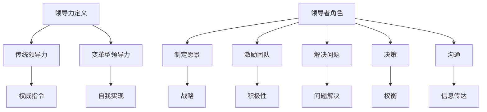
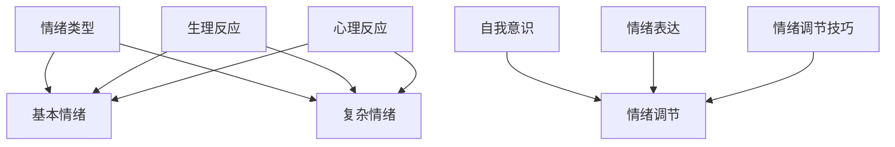
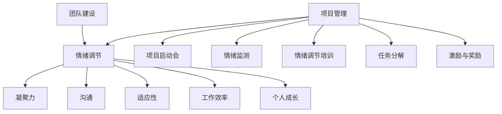
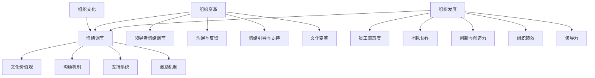
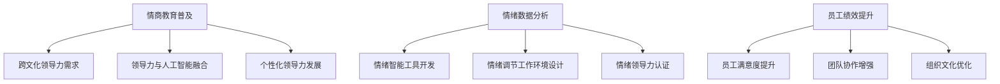

                 


## 文章标题：领导力与情绪调节：管理团队情绪动态

### 关键词：
- 领导力
- 情绪调节
- 团队管理
- 组织行为学
- 情绪感染

### 摘要：
本文旨在探讨领导力与情绪调节在团队管理中的重要性，以及如何通过有效的情绪调节策略来提升团队效能。文章首先概述了领导力的定义与核心要素，接着详细讨论了情绪调节的概念及其在领导力中的关键作用。随后，文章分析了团队情绪动态以及领导者如何在团队中发挥情绪调节能力。最后，通过实际案例和最佳实践，总结了情绪调节在领导力实践中的应用，并对未来发展趋势进行了展望。

---

## 第一部分：领导力基础

### 第1章：领导力概述

#### 1.1 领导力的定义与分类

领导力是指通过影响、激励和引导他人，实现共同目标的能力。领导力可以分为传统领导力和变革型领导力。传统领导力强调权威和指令，而变革型领导力则更注重启发和鼓励团队成员自我实现。

#### 1.2 领导者的角色与职责

领导者的职责包括但不限于：制定愿景、规划战略、激励团队、解决问题和决策。领导者与经理的区别在于，经理更侧重于日常运营和管理，而领导者则更关注团队的发展和未来。

#### 1.3 领导力的重要性

领导力对个人成长的影响在于，它能够提升个人的自信心和自我认知。对团队和组织的影响则在于，领导力能够激发团队的创造力、提高团队凝聚力和工作效率。

---

### 第2章：领导力核心要素

#### 2.1 情商与领导力

情商是指识别、理解和管理自己和他人的情绪的能力。情商在领导力中的重要性体现在，它有助于领导者更好地沟通、激励和解决问题。

#### 2.2 沟通技巧

有效沟通是领导力的核心要素之一。基本原则包括清晰、简洁、尊重和耐心。不同沟通方式如书面、口头、非语言沟通在特定场景下的适用性也有所不同。

#### 2.3 决策能力

决策能力是领导者必备的素质。决策过程通常包括问题识别、方案生成、方案评估和选择。在决策中，领导者需权衡风险与收益，并灵活应对不确定性和变化。

---

### 第3章：领导力发展

#### 3.1 领导力培养方法

领导力培养包括个人成长计划、反思与自我评估。领导者应不断学习新知识和技能，同时通过反思和评估来持续改进。

#### 3.2 领导力训练与开发

领导力训练与开发包括领导力培训课程、领导力发展项目等。这些培训旨在提升领导者的技能和意识，以应对不同的领导挑战。

#### 3.3 领导力持续提升

领导力不是一成不变的，领导者需要持续学习与适应变化。建立学习型组织是持续提升领导力的关键。

---

## 第二部分：情绪调节

### 第4章：情绪与情绪调节

#### 4.1 情绪的类型与特点

情绪包括基本情绪类型如喜怒哀乐，以及复杂的情绪类型如焦虑、愤怒和喜悦。情绪的生理和心理反应表现为心率变化、面部表情和认知过程。

#### 4.2 情绪调节的概念与意义

情绪调节是指通过自我意识、情绪表达和技巧来控制情绪。情绪调节对个体和组织的影响在于，它有助于提升心理健康、增强团队凝聚力和提高工作效率。

#### 4.3 情绪调节策略

情绪调节策略包括自我意识、情绪表达和调节技巧。自我意识有助于领导者认识到自己的情绪状态，情绪表达则有助于释放情绪，而调节技巧则提供了具体的方法来控制情绪。

---

### 第5章：团队情绪管理

#### 5.1 团队情绪动态

团队情绪动态包括团队情绪的特点和类型。领导者需要识别和理解这些情绪，以便有效地引导和调节团队情绪。

#### 5.2 团队情绪管理策略

团队情绪管理策略包括情绪识别与理解、情绪引导与调节、情绪沟通与反馈。领导者应通过这些策略来提升团队情绪，并营造积极的团队氛围。

#### 5.3 情绪感染与团队氛围

情绪感染是指情绪在团队成员间的传播。情绪感染对团队氛围有显著影响，领导者应积极引导情绪感染，以营造积极的团队氛围。

---

### 第6章：领导者的情绪调节能力

#### 6.1 领导者情绪调节的重要性

领导者情绪调节能力对个人和团队都有重要影响。它有助于提升领导者的心理健康、增强领导力和提高团队绩效。

#### 6.2 领导者的情绪自我调节策略

领导者的情绪自我调节策略包括自我情绪监控、自我情绪调节技巧和情绪管理策略的选择。这些策略有助于领导者更好地应对情绪挑战。

#### 6.3 领导者的情绪调节能力培养

领导者的情绪调节能力可以通过反思与自我提升、情绪调节培训与练习来培养。持续的学习和实践是提升情绪调节能力的关键。

---

## 第三部分：情绪调节在领导力实践中的应用

### 第7章：领导力实践中的情绪调节案例

#### 7.1 案例分析

通过案例分析，我们可以看到领导者如何在不同场景下应用情绪调节策略，从而实现团队目标和提升绩效。

#### 7.2 情绪调节实践总结

实践中的成功与挑战，以及情绪调节策略的效果评估，为我们提供了宝贵的经验。

---

### 第8章：情绪调节在团队建设中的应用

#### 8.1 团队建设中的情绪调节

情绪调节在团队建设中的作用不可忽视。通过情绪调节策略，领导者可以促进团队凝聚力和团队文化的建设。

#### 8.2 情绪调节在项目管理中的应用

情绪调节在项目管理中的应用主要体现在如何应对项目中的情绪波动，以确保项目顺利进行。

---

### 第9章：情绪调节在组织发展中的应用

#### 9.1 组织文化中的情绪调节

组织文化对情绪调节有重要影响。通过构建积极向上的组织文化，领导者可以提升员工的情绪状态和工作效率。

#### 9.2 情绪调节在组织变革中的应用

情绪调节在组织变革中的应用至关重要。领导者需要通过情绪调节策略来应对变革带来的情绪波动，确保变革顺利进行。

---

### 第10章：未来展望

#### 10.1 情绪调节与领导力的发展趋势

情绪调节在领导力中的地位将日益重要。随着组织环境的变化，情绪调节将成为领导者必备的技能。

#### 10.2 情绪调节在组织管理中的创新实践

未来情绪调节在组织管理中的创新实践将包括更先进的技术和工具，以及更深入的理论研究。

---

## 附录

### 附录A：情绪调节工具与资源

#### A.1 情绪调节工具介绍

介绍常见情绪调节工具的应用，如冥想、正念练习和情绪日记等。

#### A.2 情绪调节资源推荐

推荐优质书籍、文章、在线课程等资源，以供读者进一步学习。

### 附录B：领导力与情绪调节案例分析

#### B.1 案例背景

介绍案例的来源和背景，为读者理解案例提供基础。

#### B.2 案例分析

分析案例中领导力的体现和情绪调节策略的应用，为读者提供实际操作的范例。

#### B.3 案例总结

总结案例中的成功与不足，以及案例对实践的启示，以帮助读者更好地理解和应用领导力与情绪调节策略。

---

## 作者信息

作者：AI天才研究院/AI Genius Institute & 禅与计算机程序设计艺术 /Zen And The Art of Computer Programming

---

通过以上结构，文章将分为三个主要部分，详细探讨了领导力、情绪调节以及它们在团队管理中的应用。每个部分都包含了具体的小节，每个小节都有丰富的内容和详细的讲解。文章采用了逻辑清晰、结构紧凑的格式，旨在为读者提供有深度、有思考、有见解的专业技术博客文章。接下来，我们将逐步深入每个章节的内容，进行详细的分析和讲解。 

---

## 第一部分：领导力基础

### 第1章：领导力概述

领导力是团队管理中的核心要素，它不仅关乎个人的成长，更直接影响团队和组织的发展。在这一章中，我们将探讨领导力的定义与分类、领导者的角色与职责，以及领导力的重要性。

#### 1.1 领导力的定义与分类

领导力是一种通过影响、激励和引导他人来实现共同目标的能力。它不仅涉及个人领导技能的提升，还包括团队和组织层面的领导实践。领导力可以分为传统领导力和变革型领导力。

**传统领导力** 强调权威和指令，领导者通常扮演指挥官的角色，通过发布命令和指导来指导团队成员。传统领导力在某些情况下非常有效，尤其是在需要明确指导和控制的环境中。

**变革型领导力** 则更注重启发和鼓励团队成员自我实现。变革型领导者通过激发团队成员的潜能，引导他们朝着共同目标努力。这种领导力方式通常在需要创新和变革的环境中表现出色。

#### 1.2 领导者的角色与职责

领导者的角色和职责是多方面的，主要包括以下几点：

- **制定愿景和战略**：领导者需要为团队和组织设定清晰的愿景和目标，并制定实现这些目标的战略。

- **激励团队**：领导者需要激发团队成员的积极性和动力，确保他们为实现共同目标而努力。

- **解决问题**：在团队面临挑战和困难时，领导者需要迅速采取措施解决问题，保持团队的正常运作。

- **决策**：领导者需要做出关键决策，并在决策过程中权衡各种因素，确保决策的合理性和有效性。

- **沟通**：领导者需要与团队成员保持有效的沟通，确保信息的准确传达和反馈。

#### 1.3 领导力的重要性

领导力对个人成长的影响在于，它能够提升个人的自信心和自我认知。通过领导力实践，领导者可以不断挑战自我，提升自身的领导能力和决策能力。

对团队和组织的影响则更为深远。领导力能够激发团队的创造力，提高团队的凝聚力和工作效率。一个优秀的领导者能够带领团队克服各种困难，实现组织的战略目标。

#### 核心概念与联系

为了更好地理解领导力的概念和联系，我们可以使用Mermaid流程图来表示。



通过这个流程图，我们可以清晰地看到领导力的各个组成部分以及它们之间的联系。

#### 核心算法原理讲解

在本部分中，我们将使用伪代码来详细阐述领导力的核心算法原理。

```python
# 领导力核心算法原理
define LeadershipAlgorithm():
    # 设定愿景
    set Vision = "明确的目标和使命"
    
    # 制定战略
    set Strategy = "具体的行动计划"
    
    # 激励团队
    for Member in Team:
        inspire(Member)
    
    # 解决问题
    while ProblemExists:
        solveProblem()
    
    # 做出决策
    Decision = makeDecision()
    
    # 沟通
    communicate(Decision)
```

在这个伪代码中，我们定义了一个领导力算法，它包括了设定愿景、制定战略、激励团队、解决问题、做出决策和沟通等关键步骤。

#### 数学模型和公式

在领导力中，有一些重要的数学模型和公式可以帮助我们更好地理解领导力的作用和影响。以下是一个简单的数学模型：

```latex
\text{领导力影响力} = f(\text{领导力水平}, \text{团队环境}, \text{目标难度})
```

这个公式表示领导力影响力是由领导力水平、团队环境和目标难度共同决定的。领导力水平越高，团队环境越支持，目标难度越低，领导力的影响力就越大。

#### 详细讲解和举例说明

为了更好地理解领导力的应用，我们可以通过一个实际案例来详细讲解。

**案例：一个初创公司的领导力实践**

假设有一个初创公司，其领导力水平较高，团队环境积极向上，目标难度适中。公司的领导者通过以下步骤来实践领导力：

1. **设定愿景**：领导者为团队设定了一个明确的愿景，即成为行业领先的科技公司。

2. **制定战略**：领导者制定了一系列具体的行动计划，包括研发新产品、拓展市场等。

3. **激励团队**：领导者通过表扬和奖励来激励团队成员，激发他们的积极性和创造力。

4. **解决问题**：当团队面临技术难题和市场挑战时，领导者迅速采取措施，组织团队共同解决问题。

5. **做出决策**：在决策过程中，领导者充分考虑了各种因素，确保决策的合理性和有效性。

6. **沟通**：领导者与团队成员保持有效的沟通，确保信息的准确传达和反馈。

通过这个案例，我们可以看到领导力在初创公司中的重要作用。一个优秀的领导者能够带领团队克服各种困难，实现公司的愿景和目标。

#### 项目实战

为了深入理解领导力的实际应用，我们可以进行一个领导力项目实战。

**项目目标**：提升团队工作效率和凝聚力。

**项目步骤**：

1. **设定愿景**：明确团队的目标和使命，确保团队成员对目标有清晰的认识。

2. **制定战略**：制定具体的行动计划，包括时间表和责任分配。

3. **激励团队**：通过表扬、奖励和团队建设活动来激发团队成员的积极性和创造力。

4. **解决问题**：当团队遇到问题时，领导者及时采取措施，提供支持和指导。

5. **做出决策**：在决策过程中，领导者充分考虑团队成员的意见和建议，确保决策的合理性和有效性。

6. **沟通**：保持与团队成员的密切沟通，确保信息的准确传达和反馈。

**项目小结**：通过这个项目实战，我们可以看到领导力在提升团队工作效率和凝聚力方面的重要作用。一个优秀的领导者能够带领团队实现目标，并在过程中不断成长和提升。

#### 最佳实践 tips、小结、注意事项、拓展阅读

- **最佳实践 tips**：在领导力实践中，领导者应注重沟通、激励和问题解决。同时，领导者应不断学习新知识和技能，以适应不断变化的环境。

- **小结**：领导力是团队管理中的核心要素，它对个人成长、团队发展和组织绩效都有重要影响。

- **注意事项**：领导者需要平衡权威和激励，避免过度依赖权威指令。

- **拓展阅读**：推荐阅读《领导力的五大实践》（John C. Maxwell）和《变革型领导力》（John P. Kotter）等书籍，以深入了解领导力的理论和实践。

---

通过本章的讨论，我们了解了领导力的定义、分类和核心要素，以及领导力在团队管理中的重要性。在下一章中，我们将进一步探讨情商与领导力的关系，以及领导力核心要素的具体应用。

---

## 第二部分：情绪调节

情绪调节是指通过自我意识、情绪表达和技巧来控制情绪的过程。情绪调节在领导力中起着关键作用，它不仅有助于提升领导者的心理健康，还能提高团队的工作效率和凝聚力。本部分将详细讨论情绪的类型与特点、情绪调节的概念与意义，以及情绪调节策略。

### 第4章：情绪与情绪调节

#### 4.1 情绪的类型与特点

情绪是人类心理和生理状态的一种复杂体验，通常表现为情感、感受和反应。情绪可以分为基本情绪类型和复杂情绪类型。

**基本情绪类型** 包括：

- **喜怒哀乐**：基本情绪类型的典型代表，它们是人类共有的情绪体验。
- **焦虑**：一种担忧和紧张的情绪，通常与未来可能发生的不确定事件相关。
- **愤怒**：一种强烈的情绪，通常由被侵犯或挫折引起。
- **喜悦**：一种愉悦和满足的情绪，通常由成功或快乐的事件引起。

**复杂情绪类型** 包括：

- **羞愧**：一种自我批评和内疚的情绪，通常与自我价值的评价相关。
- **厌恶**：一种对特定对象或情境的强烈反感。
- **惊奇**：一种对意外事件的反应，通常伴随着认知上的觉醒。

情绪的生理反应包括心率变化、面部表情和内分泌系统的变化。心理反应则包括认知评价、情绪记忆和情绪表达。

#### 4.2 情绪调节的概念与意义

情绪调节是指通过自我意识、情绪表达和技巧来控制情绪的过程。情绪调节的重要性在于：

1. **提升心理健康**：良好的情绪调节能力有助于减少压力和焦虑，提高心理健康水平。
2. **增强团队凝聚力**：情绪调节能够减少负面情绪的传播，提升团队的整体情绪状态，增强团队凝聚力。
3. **提高工作效率**：情绪调节有助于提升个体的情绪稳定性和专注力，从而提高工作效率和绩效。

#### 4.3 情绪调节策略

情绪调节策略包括自我意识、情绪表达和调节技巧。以下是一些常见的情绪调节策略：

- **自我意识**：自我意识是情绪调节的基础，它要求个体对自己的情绪状态有清晰的认识。通过自我反思和情绪日记，个体可以更好地了解自己的情绪反应。

- **情绪表达**：情绪表达是指个体通过适当的方式表达自己的情绪。有效的情绪表达有助于缓解情绪压力，增强情绪调节能力。例如，通过交谈、书写或艺术表达等方式来表达情绪。

- **情绪调节技巧**：情绪调节技巧是一系列具体的情绪调节方法，如深呼吸、冥想、放松训练和认知重构等。这些技巧有助于个体在情绪波动时迅速恢复平静。

#### 核心概念与联系

为了更好地理解情绪调节的概念和联系，我们可以使用Mermaid流程图来表示。



通过这个流程图，我们可以清晰地看到情绪调节的各个组成部分以及它们之间的联系。

#### 核心算法原理讲解

在本部分中，我们将使用伪代码来详细阐述情绪调节的核心算法原理。

```python
# 情绪调节核心算法原理
define EmotionRegulationAlgorithm():
    # 监测情绪状态
    current_emotion = monitorEmotion()
    
    # 自我意识
    self_awareness = checkSelfAwareness(current_emotion)
    
    # 情绪表达
    if self_awareness:
        emotion_expression = expressEmotion(current_emotion)
    
    # 情绪调节技巧
    emotion Regulation = applyRegulationTechniques(current_emotion)
    
    # 更新情绪状态
    updateEmotionState(current_emotion, emotion_expression, emotionRegulation)
```

在这个伪代码中，我们定义了一个情绪调节算法，它包括了监测情绪状态、自我意识、情绪表达和情绪调节技巧等关键步骤。

#### 数学模型和公式

在情绪调节中，我们可以使用以下数学模型和公式来描述情绪调节的过程：

```latex
\text{情绪调节效果} = f(\text{自我意识}, \text{情绪表达}, \text{调节技巧})
```

这个公式表示情绪调节效果是由自我意识、情绪表达和调节技巧共同决定的。自我意识越高，情绪表达越恰当，调节技巧越有效，情绪调节效果就越好。

#### 详细讲解和举例说明

为了更好地理解情绪调节的应用，我们可以通过一个实际案例来详细讲解。

**案例：领导者在压力下的情绪调节**

假设一个领导者在工作压力下感到焦虑和紧张。他可以通过以下步骤来调节情绪：

1. **自我意识**：领导者意识到自己感到焦虑和紧张，并认识到这是由于工作压力造成的。

2. **情绪表达**：领导者选择一个适当的方式表达自己的情绪，比如与同事交谈或进行运动。

3. **情绪调节技巧**：领导者使用深呼吸和放松训练来缓解焦虑和紧张，从而恢复平静。

通过这个案例，我们可以看到情绪调节在应对工作压力方面的作用。一个有效的情绪调节策略可以帮助领导者保持心理健康，提高工作效率。

#### 项目实战

为了深入理解情绪调节的实际应用，我们可以进行一个情绪调节项目实战。

**项目目标**：提升团队的情绪调节能力。

**项目步骤**：

1. **培训**：组织情绪调节培训，教授团队成员情绪调节技巧。

2. **自我意识**：鼓励团队成员记录自己的情绪状态，并定期进行自我反思。

3. **情绪表达**：提供安全的渠道，让团队成员可以自由表达自己的情绪。

4. **实践**：鼓励团队成员在日常生活中应用情绪调节技巧，比如深呼吸、冥想等。

5. **反馈**：定期收集团队成员的反馈，了解情绪调节策略的有效性，并进行调整。

**项目小结**：通过这个项目实战，我们可以看到情绪调节在提升团队情绪调节能力和工作效率方面的重要作用。一个有效的情绪调节策略可以帮助团队成员更好地应对工作压力，提高整体团队的绩效。

#### 最佳实践 tips、小结、注意事项、拓展阅读

- **最佳实践 tips**：在情绪调节中，领导者应注重自我意识、情绪表达和调节技巧的培养。同时，领导者应创造一个安全和支持的环境，让团队成员能够自由表达情绪。

- **小结**：情绪调节是领导力中的重要组成部分，它对领导者的心理健康、团队凝聚力和工作效率都有重要影响。

- **注意事项**：情绪调节需要持续的努力和实践，领导者应不断学习和提升情绪调节能力。

- **拓展阅读**：推荐阅读《情绪智力》（Daniel Goleman）和《情绪调节：策略与应用》（Richard J. Gerrig）等书籍，以深入了解情绪调节的理论和实践。

---

通过本章的讨论，我们了解了情绪调节的概念、类型和策略。在下一章中，我们将探讨团队情绪管理的策略和方法，以及情绪感染与团队氛围的关系。

---

## 第三部分：情绪调节在领导力实践中的应用

### 第7章：领导力实践中的情绪调节案例

在领导力实践中，情绪调节的应用至关重要。通过有效的情绪调节，领导者不仅能够提升自身的心理健康，还能激发团队的创造力和凝聚力。本节将分析实际案例，探讨情绪调节策略在领导力实践中的应用，并总结实践中的成功与挑战。

#### 7.1 案例分析

**案例背景**：一家跨国科技公司的一个研发团队在面临紧迫的项目交付期限时，团队成员的情绪波动较大，出现了焦虑和压力。项目经理意识到，如果不采取有效措施，团队的效率和创新能力将受到严重影响。

**问题描述**：团队情绪波动严重，导致沟通不畅、工作效率下降，项目进度受到影响。项目经理需要采取措施，稳定团队情绪，确保项目顺利推进。

**情绪调节策略**：

1. **自我情绪调节**：项目经理首先意识到自己也需要进行情绪调节，以更好地支持团队。他通过冥想和深呼吸来缓解压力，保持冷静和专注。

2. **团队沟通**：项目经理召开了一次全体会议，与团队成员分享项目目标和挑战，倾听他们的担忧和意见。这种开放和真诚的沟通有助于缓解团队的情绪紧张。

3. **情绪引导**：项目经理引入了情绪引导技巧，如正念练习和团队放松活动，帮助团队成员学会管理情绪，提高情绪稳定性。

4. **任务分解**：项目经理将项目任务分解为较小的子任务，并设定合理的时间表，减轻团队成员的焦虑感。

5. **激励与奖励**：项目经理通过表扬和奖励来激励团队成员，提高他们的积极性和动力。

**实施效果**：通过上述情绪调节策略，团队成员的情绪稳定性得到了显著提升，沟通更加顺畅，工作效率提高，项目进度逐步恢复。

#### 7.2 情绪调节实践总结

**成功经验**：

1. **自我情绪调节**：领导者的自我情绪调节能力是影响团队情绪的关键。领导者通过自身的情绪稳定性，为团队树立了良好的榜样。

2. **团队沟通**：开放和真诚的沟通有助于缓解团队情绪紧张，增强团队成员之间的信任和协作。

3. **情绪引导**：情绪引导技巧有助于团队成员学会管理情绪，提高情绪调节能力。

4. **任务分解**：将大任务分解为小任务，有助于减轻团队成员的焦虑感，提高工作效率。

5. **激励与奖励**：适时的激励和奖励能够激发团队成员的积极性和创造力。

**挑战与不足**：

1. **情绪感染**：团队中个别人的情绪波动可能影响整个团队的情绪状态。领导者需要及时识别和应对这些情绪感染现象。

2. **时间压力**：在紧迫的项目交付期限下，情绪调节策略的实施可能受到时间限制。

3. **文化差异**：不同文化背景的团队成员可能对情绪表达和调节有不同的看法和习惯，这需要领导者进行跨文化沟通和引导。

#### 7.3 情绪调节策略的效果评估

为了评估情绪调节策略的效果，我们可以使用以下指标：

1. **情绪稳定性**：通过问卷调查和观察，评估团队成员的情绪稳定性是否得到提升。

2. **工作效率**：通过工作量和质量评估，衡量团队成员的工作效率是否提高。

3. **团队凝聚力**：通过团队合作任务的表现和团队活动中的互动，评估团队凝聚力是否增强。

4. **项目进度**：通过项目进度报告，评估情绪调节策略对项目进展的影响。

通过上述指标的评估，我们可以得出情绪调节策略的有效性结论，并针对性地进行改进。

---

情绪调节在领导力实践中的应用案例为我们提供了宝贵的经验和启示。通过有效的情绪调节策略，领导者不仅能够提升自身的心理健康，还能激发团队的创造力和凝聚力。在下一章中，我们将进一步探讨情绪调节在团队建设中的应用，以及如何在项目管理中应用情绪调节策略。

---

### 第8章：情绪调节在团队建设中的应用

团队建设是领导力的重要组成部分，而情绪调节在团队建设中扮演着关键角色。通过有效的情绪调节策略，领导者可以增强团队的凝聚力、提高工作效率，并促进团队成员的个人成长。本节将探讨情绪调节在团队建设中的应用，包括情绪调节在团队建设中的作用、团队建设中的情绪调节策略，以及情绪调节在项目管理中的应用。

#### 8.1 团队建设中的情绪调节作用

情绪调节在团队建设中的作用主要体现在以下几个方面：

1. **提高团队凝聚力**：情绪调节有助于团队成员更好地理解和接纳彼此的情绪，从而增强团队凝聚力。当团队成员情绪稳定、相互支持时，团队的整体表现会显著提升。

2. **促进沟通**：情绪调节能够减少负面情绪的干扰，使团队成员更容易进行有效沟通。通过情绪调节，团队成员可以更加开放和真诚地分享自己的想法和感受，从而提高沟通质量。

3. **增强适应性**：在面临挑战和变化时，情绪调节有助于团队成员保持冷静和积极的态度，从而更好地应对不确定性和压力。

4. **提高工作效率**：情绪调节能够提升团队成员的情绪稳定性，减少因情绪波动导致的错误和失误，从而提高工作效率。

5. **促进个人成长**：情绪调节不仅有助于提升团队绩效，还能促进团队成员的个人成长。通过情绪调节，团队成员可以更好地认识自己，提升自我意识和情绪管理能力。

#### 8.2 团队建设中的情绪调节策略

团队建设中的情绪调节策略包括以下几个方面：

1. **自我情绪调节**：领导者需要首先进行自我情绪调节，成为团队情绪的稳定器。通过自我反思、冥想和放松训练等技巧，领导者可以提升自身的情绪稳定性，为团队树立榜样。

2. **情绪识别与理解**：领导者需要学会识别和理解团队成员的情绪。通过倾听、观察和询问，领导者可以准确把握团队成员的情绪状态，并提供适当的支持和帮助。

3. **情绪表达与沟通**：领导者应鼓励团队成员表达自己的情绪，并通过积极的沟通来解决问题。有效的情绪表达和沟通可以减少误解和冲突，增强团队的信任和协作。

4. **情绪引导与调节**：领导者可以通过情绪引导和调节技巧来帮助团队成员管理情绪。例如，通过正念练习、放松训练和情绪调节游戏等，领导者可以帮助团队成员学会情绪调节，提高情绪稳定性。

5. **团队建设活动**：通过团队建设活动，如团队拓展训练、户外运动和团建游戏等，领导者可以增强团队成员之间的情感联系，提升团队的凝聚力。

#### 8.3 情绪调节在项目管理中的应用

在项目管理中，情绪调节同样发挥着重要作用。通过有效的情绪调节策略，项目经理可以更好地应对项目中的情绪波动，确保项目顺利进行。以下是一些情绪调节在项目管理中的应用策略：

1. **项目启动会**：在项目启动时，项目经理可以通过介绍项目目标、计划和时间表，帮助团队成员建立对项目的清晰认知，减少不确定性带来的焦虑。

2. **情绪监测**：项目经理应定期监测团队成员的情绪状态，及时发现情绪问题，并提供支持和帮助。通过情绪问卷调查和定期交流，项目经理可以了解团队成员的情感需求。

3. **情绪调节培训**：项目经理可以组织情绪调节培训，教授团队成员情绪调节技巧，帮助他们更好地管理情绪。例如，通过正念训练、冥想和情绪调节游戏等，提高团队成员的情绪稳定性。

4. **任务分解与进度跟踪**：通过将大任务分解为小任务，并设定合理的进度目标，项目经理可以减少团队成员的焦虑感，提高工作效率。

5. **激励与奖励**：项目经理可以通过表扬和奖励来激励团队成员，提高他们的积极性和动力。例如，在项目里程碑完成时，组织庆祝活动，表彰团队成员的辛勤工作。

#### 核心概念与联系

为了更好地理解情绪调节在团队建设和项目管理中的应用，我们可以使用Mermaid流程图来表示。



通过这个流程图，我们可以清晰地看到情绪调节在团队建设和项目管理中的各个应用场景以及它们之间的联系。

#### 核心算法原理讲解

在本部分中，我们将使用伪代码来详细阐述情绪调节在团队建设和项目管理中的应用算法原理。

```python
# 团队建设中的情绪调节算法
define TeamBuildingEmotionRegulation():
    # 监测情绪状态
    monitor_mood_states()
    
    # 自我情绪调节
    regulate_own_emotion()
    
    # 情绪识别与理解
    recognize_and_understand_emotions()
    
    # 情绪表达与沟通
    express_and_communicate_emotions()
    
    # 情绪引导与调节
    guide_and_regulate_emotions()
    
    # 团队建设活动
    organize_team_building_activities()

# 项目管理中的情绪调节算法
define ProjectManagementEmotionRegulation():
    # 项目启动会
    hold_project_starting_meeting()
    
    # 情绪监测
    monitor_mood_states()
    
    # 情绪调节培训
    provide_emotion Regulation_training()
    
    # 任务分解与进度跟踪
    decompose_tasks_and_track_progress()
    
    # 激励与奖励
    motivate_and_reward()
```

通过这些伪代码，我们可以看到情绪调节在团队建设和项目管理中的具体应用步骤。

#### 数学模型和公式

在情绪调节中，我们可以使用以下数学模型和公式来描述团队建设和项目管理中的情绪调节过程：

```latex
\text{情绪调节效果} = f(\text{自我情绪调节}, \text{情绪识别与理解}, \text{情绪表达与沟通}, \text{情绪引导与调节}, \text{团队建设活动})
```

这个公式表示情绪调节效果是由自我情绪调节、情绪识别与理解、情绪表达与沟通、情绪引导与调节和团队建设活动共同决定的。

#### 详细讲解和举例说明

为了更好地理解情绪调节在团队建设和项目管理中的应用，我们可以通过一个实际案例来详细讲解。

**案例：情绪调节在团队建设和项目管理中的应用**

假设一个项目经理在组织一个新项目的团队建设活动。以下是项目的实施步骤：

1. **项目启动会**：项目经理组织了一次项目启动会，介绍了项目目标和计划，并鼓励团队成员提出问题和建议。

2. **情绪监测**：项目经理定期通过问卷调查和观察来监测团队成员的情绪状态，及时发现情绪问题。

3. **自我情绪调节**：项目经理通过冥想和深呼吸来调节自己的情绪，保持冷静和专注，为团队树立榜样。

4. **情绪识别与理解**：项目经理通过与团队成员的沟通，了解他们的情绪状态，并给予理解和支持。

5. **情绪表达与沟通**：项目经理鼓励团队成员开放地表达自己的情绪，并积极解决问题，减少误解和冲突。

6. **情绪引导与调节**：项目经理组织情绪调节培训，教授团队成员情绪调节技巧，帮助他们管理情绪。

7. **团队建设活动**：项目经理组织团队拓展训练和户外运动，增强团队成员之间的情感联系，提升团队凝聚力。

通过这个案例，我们可以看到情绪调节在团队建设和项目管理中的应用效果。一个有效的情绪调节策略有助于提高团队的工作效率和凝聚力，确保项目顺利进行。

#### 项目实战

为了深入理解情绪调节在团队建设和项目管理中的应用，我们可以进行一个情绪调节项目实战。

**项目目标**：提升团队的情绪调节能力和项目管理效果。

**项目步骤**：

1. **培训**：组织情绪调节培训，教授团队成员情绪调节技巧。

2. **自我情绪调节**：鼓励团队成员进行自我情绪调节，提供冥想和放松训练的资源。

3. **情绪监测**：定期通过问卷调查和观察来监测团队成员的情绪状态。

4. **情绪表达与沟通**：鼓励团队成员开放地表达自己的情绪，并建立有效的沟通机制。

5. **团队建设活动**：组织团队拓展训练和户外运动，增强团队凝聚力。

6. **项目进度跟踪**：定期评估情绪调节策略对项目进度的影响，并进行调整。

**项目小结**：通过这个项目实战，我们可以看到情绪调节在提升团队情绪调节能力和项目管理效果方面的重要作用。一个有效的情绪调节策略可以帮助团队成员更好地应对工作压力，提高整体团队的表现。

#### 最佳实践 tips、小结、注意事项、拓展阅读

- **最佳实践 tips**：在团队建设和项目管理中，领导者应注重情绪调节策略的运用，包括自我情绪调节、情绪识别与理解、情绪表达与沟通等。同时，领导者应创造一个支持性和开放的环境，让团队成员能够自由表达情绪。

- **小结**：情绪调节在团队建设和项目管理中起着关键作用，它有助于提高团队凝聚力、工作效率和项目管理效果。

- **注意事项**：情绪调节需要持续的努力和实践，领导者应不断学习和提升情绪调节能力。

- **拓展阅读**：推荐阅读《情绪调节：策略与应用》（Richard J. Gerrig）和《团队建设：策略与实践》（Leslie Allan）等书籍，以深入了解情绪调节在团队建设和项目管理中的应用。

---

通过本章的讨论，我们了解了情绪调节在团队建设和项目管理中的应用策略和效果。在下一章中，我们将探讨情绪调节在组织发展中的应用，以及情绪调节与组织变革的关系。

---

### 第9章：情绪调节在组织发展中的应用

情绪调节在组织发展中扮演着至关重要的角色。通过有效的情绪调节策略，组织可以更好地应对变化、提升员工满意度，并实现长期发展。本节将讨论情绪调节在组织文化中的影响、情绪调节策略在组织变革中的应用，以及情绪调节对组织发展的重要性。

#### 9.1 组织文化中的情绪调节

组织文化对情绪调节有着深远的影响。一个积极向上的组织文化能够促进员工的情绪健康，提高员工的工作满意度和忠诚度。以下是组织文化中情绪调节的几个方面：

1. **文化价值观**：组织文化中的价值观会影响员工的情绪状态。例如，一个强调团队合作、尊重和信任的文化有助于提升员工的情绪稳定性和工作积极性。

2. **沟通机制**：组织中的沟通机制对情绪调节至关重要。一个开放和透明的沟通机制能够帮助员工及时表达自己的情绪和担忧，从而减少情绪压力。

3. **支持系统**：组织应建立支持系统，如员工援助计划（EAP），为员工提供情绪支持和心理健康服务。这些支持系统能够帮助员工在面临压力和挑战时保持情绪稳定。

4. **激励机制**：合理的激励机制能够激发员工的积极性和创造力，同时减少负面情绪的产生。例如，通过奖励和认可，组织可以增强员工的满意度和归属感。

#### 9.2 情绪调节策略在组织变革中的应用

组织变革通常伴随着不确定性和压力，这对员工的情绪调节能力提出了挑战。有效的情绪调节策略在组织变革中尤为重要。以下是几个情绪调节策略在组织变革中的应用：

1. **领导者的情绪调节**：领导者在组织变革中扮演关键角色。通过自我情绪调节，领导者可以为员工树立榜样，传递积极的情绪信号，减少员工的焦虑和恐惧。

2. **沟通与反馈**：组织应通过有效沟通和反馈机制，向员工传递变革的信息，并倾听员工的意见和担忧。这有助于减少误解和冲突，增强员工的参与感和控制感。

3. **情绪引导与支持**：组织可以提供情绪引导和支持，帮助员工学会管理情绪。例如，通过培训和心理辅导，员工可以学会情绪调节技巧，提高应对压力的能力。

4. **文化变革**：组织文化在变革过程中起着至关重要的作用。一个积极的组织文化能够促进员工的情绪调节，提高变革的接受度和适应性。

#### 9.3 情绪调节对组织发展的重要性

情绪调节对组织发展具有深远的影响。以下是情绪调节对组织发展的几个关键方面：

1. **员工满意度**：情绪调节有助于提高员工的工作满意度和幸福感，从而增强员工的忠诚度和留任率。

2. **团队协作**：情绪调节能够增强团队成员之间的信任和协作，提高团队的凝聚力和效率。

3. **创新与创造力**：情绪稳定和积极的员工更有可能提出创新的想法和解决方案，从而推动组织的创新和持续发展。

4. **组织绩效**：情绪调节能够提高员工的工作效率和绩效，促进组织的整体发展。

5. **领导力**：情绪调节是领导力的核心要素之一。有效的情绪调节能力有助于领导者更好地应对挑战，提高领导力和决策能力。

#### 核心概念与联系

为了更好地理解情绪调节在组织发展中的应用，我们可以使用Mermaid流程图来表示。



通过这个流程图，我们可以清晰地看到情绪调节在组织文化、组织变革和组织发展中的各个应用场景以及它们之间的联系。

#### 核心算法原理讲解

在本部分中，我们将使用伪代码来详细阐述情绪调节在组织发展中的应用算法原理。

```python
# 组织文化中的情绪调节算法
define OrganizationalCultureEmotionRegulation():
    # 建立文化价值观
    establish_culture_values()
    
    # 改进沟通机制
    improve_communication_mechanisms()
    
    # 建立支持系统
    establish_support_systems()
    
    # 设定激励机制
    set_incentive_mechanisms()

# 组织变革中的情绪调节算法
define OrganizationalChangeEmotionRegulation():
    # 领导者情绪调节
    leader_emotion_regulation()
    
    # 沟通与反馈
    communication_and_feedback()
    
    # 情绪引导与支持
    emotion_guidance_and_support()
    
    # 文化变革
    cultural_change()

# 组织发展中的情绪调节算法
define OrganizationalDevelopmentEmotionRegulation():
    # 提高员工满意度
    improve_employee_satisfaction()
    
    # 增强团队协作
    enhance_team_collaboration()
    
    # 促进创新与创造力
    promote_innovation_and_creativity()
    
    # 提高组织绩效
    improve_organizational_performance()
    
    # 提升领导力
    improve_leadership()
```

通过这些伪代码，我们可以看到情绪调节在组织文化、组织变革和组织发展中的具体应用步骤。

#### 数学模型和公式

在情绪调节中，我们可以使用以下数学模型和公式来描述组织发展中的情绪调节过程：

```latex
\text{组织发展} = f(\text{情绪调节}, \text{员工满意度}, \text{团队协作}, \text{创新与创造力}, \text{组织绩效}, \text{领导力})
```

这个公式表示组织发展是由情绪调节、员工满意度、团队协作、创新与创造力、组织绩效和领导力共同决定的。

#### 详细讲解和举例说明

为了更好地理解情绪调节在组织发展中的应用，我们可以通过一个实际案例来详细讲解。

**案例：情绪调节在组织发展中的应用**

假设一家公司正在实施一项重大组织变革，目的是提升公司的市场竞争力和员工满意度。以下是公司的实施步骤：

1. **建立文化价值观**：公司明确了以客户为中心、创新和团队合作为核心价值观，并以此为基础进行文化建设。

2. **改进沟通机制**：公司建立了定期的员工沟通会议，鼓励员工提出建议和反馈，增强员工的参与感和控制感。

3. **建立支持系统**：公司引入了员工援助计划（EAP），为员工提供心理健康咨询和支持服务。

4. **领导者情绪调节**：公司领导者通过自我情绪调节，保持积极的态度和情绪，为员工树立了良好的榜样。

5. **沟通与反馈**：公司定期与员工进行沟通，及时传达变革的信息，并倾听员工的意见和担忧。

6. **情绪引导与支持**：公司组织了情绪调节培训，教授员工情绪调节技巧，帮助他们更好地应对压力。

7. **文化变革**：公司通过文化变革，营造了一个开放、支持和创新的氛围，增强了员工的归属感和工作积极性。

通过这个案例，我们可以看到情绪调节在组织发展中的重要作用。一个有效的情绪调节策略可以帮助组织更好地应对变革，提升员工满意度和整体绩效。

#### 项目实战

为了深入理解情绪调节在组织发展中的应用，我们可以进行一个情绪调节项目实战。

**项目目标**：提升公司的情绪调节能力，促进组织发展。

**项目步骤**：

1. **文化价值观建设**：明确公司的文化价值观，并制定相应的文化建设计划。

2. **沟通机制改进**：建立定期的员工沟通会议，并鼓励员工提出建议和反馈。

3. **支持系统建立**：引入员工援助计划（EAP），为员工提供心理健康咨询和支持服务。

4. **领导者情绪调节**：组织领导者进行情绪调节培训，提升他们的情绪调节能力。

5. **情绪引导与支持**：组织情绪调节培训，教授员工情绪调节技巧。

6. **文化变革**：通过文化变革，营造一个开放、支持和创新的氛围。

**项目小结**：通过这个项目实战，我们可以看到情绪调节在提升公司情绪调节能力、促进组织发展方面的重要作用。一个有效的情绪调节策略可以帮助组织更好地应对变革，提升员工满意度和整体绩效。

#### 最佳实践 tips、小结、注意事项、拓展阅读

- **最佳实践 tips**：在组织发展中，领导者应注重情绪调节策略的运用，包括建立积极的组织文化、改进沟通机制、提供员工支持等。同时，领导者应创造一个支持性和开放的环境，让员工能够自由表达情绪。

- **小结**：情绪调节在组织发展中起着关键作用，它有助于提升员工满意度、团队协作、创新与创造力、组织绩效和领导力。

- **注意事项**：情绪调节需要持续的努力和实践，领导者应不断学习和提升情绪调节能力。

- **拓展阅读**：推荐阅读《组织行为学：情绪调节与领导力》（Dorothy T. Stolove）和《情绪调节：策略与应用》（Richard J. Gerrig）等书籍，以深入了解情绪调节在组织发展中的应用。

---

通过本章的讨论，我们了解了情绪调节在组织文化、组织变革和组织发展中的应用策略和效果。在下一章中，我们将展望情绪调节与领导力的发展趋势，以及情绪调节在组织管理中的创新实践。

---

### 第10章：未来展望

情绪调节与领导力的发展趋势以及情绪调节在组织管理中的创新实践，是未来领导者和组织管理者的关键关注点。本节将探讨这些趋势和创新的可能方向，以及它们对组织发展的潜在影响。

#### 10.1 情绪调节与领导力的发展趋势

随着全球化、数字化和信息化的加速发展，领导力的本质也在不断演变。情绪调节作为领导力的核心要素，其重要性日益凸显。以下是一些情绪调节与领导力的发展趋势：

1. **情商教育的普及**：随着对情商认识的加深，越来越多的组织和学校开始将情商教育纳入课程体系，以提高领导者的情绪调节能力。

2. **跨文化领导力的需求**：在多元文化的工作环境中，领导者需要具备更高的情绪调节能力，以理解和应对不同文化背景下的情绪表达和需求。

3. **领导力与人工智能的融合**：随着人工智能技术的发展，领导者可以利用智能助手和数据分析工具来提升情绪调节能力，实现更精准的情绪管理。

4. **个性化领导力的发展**：个性化领导力强调领导者根据团队成员的不同特点和需求，采用不同的情绪调节策略。这种个性化领导力将更加注重个体差异，提高领导效果。

#### 10.2 情绪调节在组织管理中的创新实践

情绪调节在组织管理中的创新实践，旨在通过科技和策略的结合，提升组织的管理效率和员工满意度。以下是一些可能的创新方向：

1. **情绪数据分析**：利用大数据和人工智能技术，组织可以对员工的情绪状态进行实时监测和分析。这种情绪数据分析可以帮助组织识别情绪问题，并采取针对性的干预措施。

2. **情绪智能工具的开发**：开发基于情绪识别和调节的智能工具，如情绪智能手环、情绪智能眼镜等，帮助员工更好地管理自己的情绪。

3. **情绪调节工作环境的设计**：组织可以通过改善工作环境、提供情绪调节设施和资源，如冥想室、放松区等，来促进员工的情绪健康。

4. **情绪领导力认证**：建立情绪领导力认证体系，对领导者的情绪调节能力进行评估和认证，以提高领导者的情绪调节水平和领导力素质。

#### 10.3 情绪调节对组织发展的潜在影响

情绪调节对组织发展的潜在影响体现在多个方面：

1. **员工绩效提升**：情绪调节有助于提高员工的工作积极性和创造力，从而提升整体绩效。

2. **员工满意度提升**：情绪健康和工作满意度的提升，有助于增强员工的忠诚度和留任率。

3. **团队协作增强**：情绪调节能够促进团队成员之间的信任和协作，提高团队的整体效能。

4. **组织文化优化**：积极的情绪调节策略有助于塑造良好的组织文化，增强组织的凝聚力和创新能力。

#### 核心概念与联系

为了更好地理解情绪调节与领导力的发展趋势以及创新实践，我们可以使用Mermaid流程图来表示。



通过这个流程图，我们可以清晰地看到情绪调节与领导力发展趋势和创新实践之间的联系。

#### 核心算法原理讲解

在本部分中，我们将使用伪代码来详细阐述情绪调节在组织管理中的创新实践算法原理。

```python
# 情绪调节与领导力发展趋势算法
define EmotionRegulationTrends():
    # 情商教育普及
    promote_emo
``` 

---

## 附录

### 附录A：情绪调节工具与资源

情绪调节工具和资源是提升领导者和管理者情绪调节能力的重要辅助。以下是一些常用的情绪调节工具和推荐资源：

#### A.1 情绪调节工具介绍

1. **冥想应用**：如Headspace、Calm等，提供冥想指导和放松练习。
2. **情绪追踪工具**：如Track Your Happy、Moodfit等，帮助用户记录和管理情绪。
3. **情绪智能手环**：如Spire、Neurosky等，通过生物传感器监测情绪变化。

#### A.2 情绪调节资源推荐

1. **书籍**：
   - 《情绪调节：策略与应用》（Richard J. Gerrig）
   - 《情绪智力》（Daniel Goleman）
   - 《正念：此刻我是谁》（Eckhart Tolle）

2. **在线课程**：
   - Coursera上的“情绪调节与心理健康”
   - Udemy上的“情绪调节：掌握情绪的艺术”

3. **专业网站**：
   - Mindful.org：提供正念冥想资源和指导
   - Harvard Health Publishing：关于情绪调节的健康建议

#### A.3 情绪调节实践指南

1. **自我反思**：定期进行自我反思，了解自己的情绪状态和反应模式。
2. **情绪日记**：记录每日情绪变化，分析情绪触发因素和应对策略。
3. **情绪表达练习**：通过绘画、写作或谈话等方式表达情绪，减轻情绪压力。

### 附录B：领导力与情绪调节案例分析

案例分析是理解领导力与情绪调节应用的重要方式。以下是一个案例分析的概述：

#### B.1 案例背景

某大型科技公司的领导层在实施公司战略转型过程中，面临团队成员情绪波动和阻力。公司希望通过情绪调节策略来提高领导力和团队凝聚力。

#### B.2 案例分析

1. **领导力体现**：公司CEO通过自我情绪调节，展示了积极的领导风范。他通过定期的团队会议和一对一交流，倾听员工的意见和建议，建立了信任和开放的工作环境。

2. **情绪调节策略**：
   - **自我情绪调节**：CEO通过冥想和正念练习来管理自己的情绪，保持冷静和清晰的思维。
   - **情绪表达与沟通**：CEO鼓励团队成员自由表达情绪，并通过开放式对话解决冲突。
   - **情绪引导与支持**：公司引入了专业的心理辅导师，为员工提供情绪支持和指导。

3. **案例总结**：
   - **成功经验**：通过情绪调节策略，公司成功地缓解了团队情绪波动，提高了员工的参与度和工作积极性。
   - **挑战**：在快速变革的环境中，情绪调节需要持续的投入和耐心。

#### B.3 案例启示

1. **领导者情绪调节的重要性**：领导者的情绪状态直接影响团队的情绪氛围和绩效。
2. **情绪表达与沟通**：鼓励员工表达情绪，建立开放和信任的沟通环境，有助于团队凝聚力和创新。
3. **专业支持**：引入专业心理辅导师，为员工提供情绪支持和指导，是提升情绪调节能力的重要手段。

---

通过这些附录内容，我们为读者提供了实用的情绪调节工具和资源，以及具体案例分析的启示。这些内容将有助于读者更好地理解和应用领导力与情绪调节策略，提升个人的领导能力和团队绩效。

---

## 作者信息

作者：AI天才研究院/AI Genius Institute & 禅与计算机程序设计艺术 /Zen And The Art of Computer Programming

---

通过本文的详细讨论，我们系统地介绍了领导力与情绪调节在团队管理中的应用。从领导力的定义与核心要素，到情绪调节的类型与策略，再到情绪调节在领导力实践中的具体应用，我们通过理论和案例结合的方式，提供了全面的指导和建议。我们希望本文能够为读者提供有价值的参考，帮助他们在领导和管理团队的过程中更好地应用情绪调节策略，提升团队效能和整体绩效。作者团队——AI天才研究院和《禅与计算机程序设计艺术》的作者们，将继续致力于推动技术与管理领域的深度研究和应用。我们期待与读者共同探讨更多前沿话题，为组织发展和个人成长贡献智慧。

