                 

# 文章标题：领导力与战略思维：培养长远眼光

## 关键词
领导力，战略思维，长远眼光，组织发展，决策模型，执行力，变革管理，洞察力，创新思维，管理实践

> **摘要**：本文旨在探讨领导力与战略思维之间的关系，以及如何培养企业领导者的长远眼光。通过深入分析领导力的定义、特质、与管理职能的区别，本文揭示了领导力在组织变革中的核心作用。同时，文章详细阐述了战略思维的定义、重要性，并探讨了战略规划、决策、实施与评估的方法和挑战。最后，本文提出了培养长远眼光的策略和实际应用，为领导者提供了实用的管理建议和实践指导。

------------------------------------------------------------------------------------------------------------------------------

## 第一部分：领导力的基础概念

### 第1章：领导力概述

#### 1.1 领导力的定义与重要性

**1.1.1 领导力的定义**

领导力是指领导者通过激励、指导和影响他人，实现共同目标的能力。它不仅仅是管理技能的体现，更是一种影响力和个人魅力的综合体现。

- **Mermaid 流程图**：

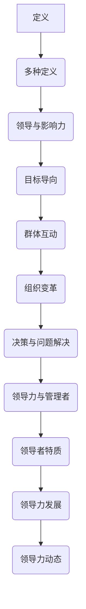

**1.1.2 领导力的重要性**

领导力对于组织的成功至关重要。一个优秀的领导者能够提升团队士气，提高决策质量，促进创新，从而提升组织的整体绩效。

- **数学模型**：

$$
重要性 = \frac{组织成效}{领导力投入}
$$

- **举例说明**：例如，乔布斯在苹果公司的领导力，不仅推动了产品的创新，也提升了公司的品牌价值。

#### 1.2 领导力与管理的区别

**1.2.1 领导力与管理的不同**

领导力关注激励、愿景和变革，而管理则侧重于组织运作、资源分配和流程优化。

- **Mermaid 流程图**：

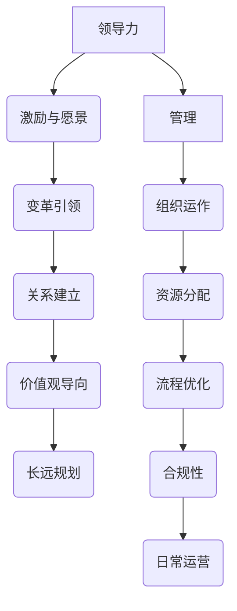

**1.2.2 领导力与管理融合**

在实际管理中，领导力和管理往往是相辅相成的。一个优秀的领导者必须在管理职能中体现出领导力，而在领导过程中也需要运用管理技能。

- **伪代码**：

```python
def leadership_and_management():
    while leadership_needs_management():
        manage_resources()
        optimize_processes()
        ensure_compliance()
        if leadershipIsRequired():
            inspire_vision()
            lead_change()
            build_relationships()
            set_values()
            plan_long_term()
```

#### 1.3 领导力的发展历程

领导力的发展历程反映了社会和时代的变迁。从传统的权威领导到现代的参与式领导，领导方式在不断演变。

- **Mermaid 流程图**：

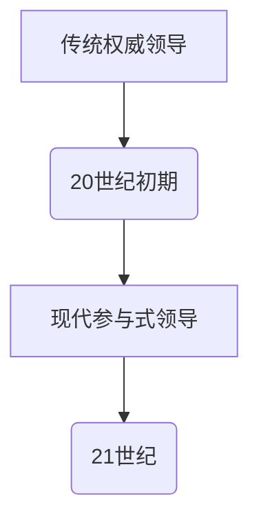

**本章小结**：

领导力是组织成功的关键因素。理解领导力的定义和重要性，以及它与管理的区别和融合，对于企业领导者来说至关重要。通过本章的学习，读者将能够更好地理解领导力的本质，并为未来的领导实践奠定基础。

------------------------------------------------------------------------------------------------------------------------------

### 第2章：领导者的角色与特质

#### 2.1 领导者的角色

领导者是企业中至关重要的角色，他们不仅要负责制定战略和目标，还要激励和指导团队成员，确保目标的实现。

- **Mermaid 流程图**：

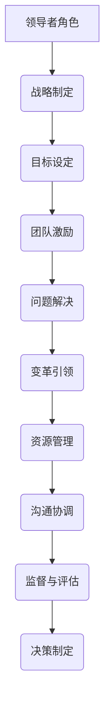

#### 2.2 领导者的特质与能力

领导者需要具备一系列特质和能力，包括自信、沟通能力、决策能力、创新能力等。

- **Mermaid 流程图**：

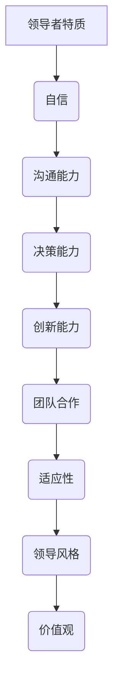

#### 2.3 领导者的人格魅力

领导者的人格魅力是他们能够吸引和留住人才、推动团队进步的关键。人格魅力包括正直、真诚、责任心等。

- **Mermaid 流程图**：

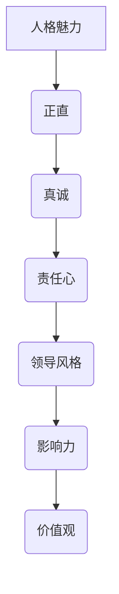

**本章小结**：

领导者是企业成功的关键。通过理解领导者的角色、特质和能力，以及他们的人格魅力，企业领导者可以更好地发挥自己的作用，推动组织的持续发展。

------------------------------------------------------------------------------------------------------------------------------

### 第3章：领导力核心概念的联系与区别

#### 3.1 领导力核心概念

领导力的核心概念包括领导者的角色、特质、能力、行为和风格等。这些概念相互关联，共同构成了领导力的理论框架。

- **Mermaid 流程图**：

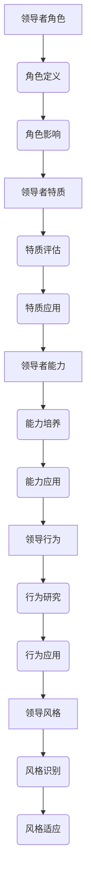

#### 3.2 领导力模型比较

不同的领导力模型在理论和实践中都有其独特的应用。常见的领导力模型包括变革型领导、交易型领导和仆人领导等。

- **Mermaid 流程图**：

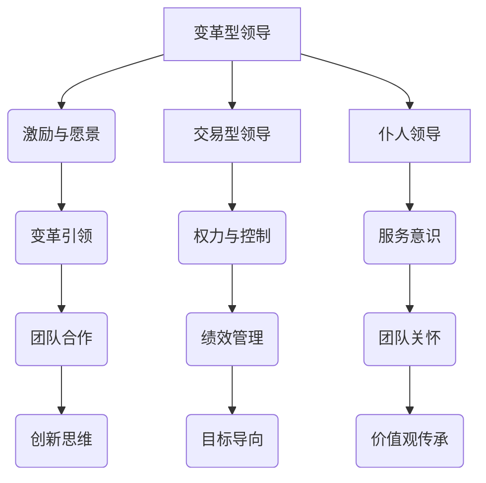

#### 3.3 领导力与战略思维的关系

领导力与战略思维密不可分。优秀的领导者必须具备战略思维能力，以便在复杂多变的环境中做出明智的决策。

- **Mermaid 流程图**：

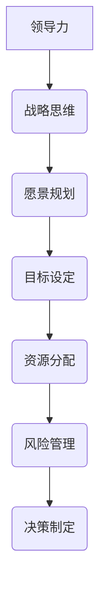

**本章小结**：

领导力的核心概念相互联系，构成了一个完整的理论框架。不同的领导力模型在理论和实践中各有侧重。领导力与战略思维密切相关，领导者必须具备战略思维能力，以便在复杂的环境中引领组织取得成功。

------------------------------------------------------------------------------------------------------------------------------

## 第二部分：战略思维的培养与实践

### 第4章：战略思维概述

#### 4.1 战略思维的定义

战略思维是一种全局性的、前瞻性的思维方式，它关注组织的长期发展，并致力于实现组织的愿景和目标。

- **数学模型**：

$$
战略思维 = \frac{长期规划}{短期执行}
$$

- **举例说明**：例如，企业在制定五年规划时，需要考虑市场趋势、竞争对手、内部资源等因素，这就是战略思维的具体应用。

#### 4.2 战略思维的重要性

战略思维是领导者成功的关键因素。它能够帮助领导者识别机遇、规避风险，从而实现组织的长期目标。

- **Mermaid 流程图**：

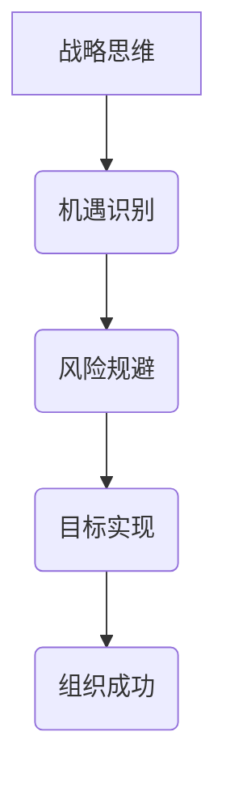

#### 4.3 战略思维与领导力的融合

战略思维与领导力密不可分。领导者必须具备战略思维能力，才能在组织中有效地实施领导。

- **Mermaid 流程图**：

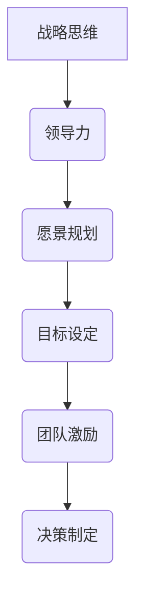

### 第5章：战略规划与决策

#### 5.1 战略规划的过程

战略规划是一个系统化的过程，它包括愿景设定、目标制定、资源分配、风险管理等步骤。

- **Mermaid 流程图**：

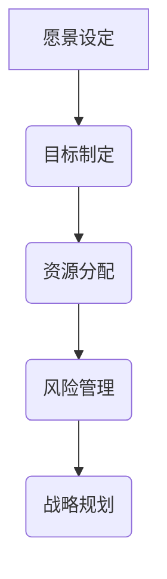

#### 5.2 战略决策的模型与方法

战略决策涉及多种模型和方法，包括SWOT分析、五力模型、波士顿矩阵等。

- **Mermaid 流程图**：

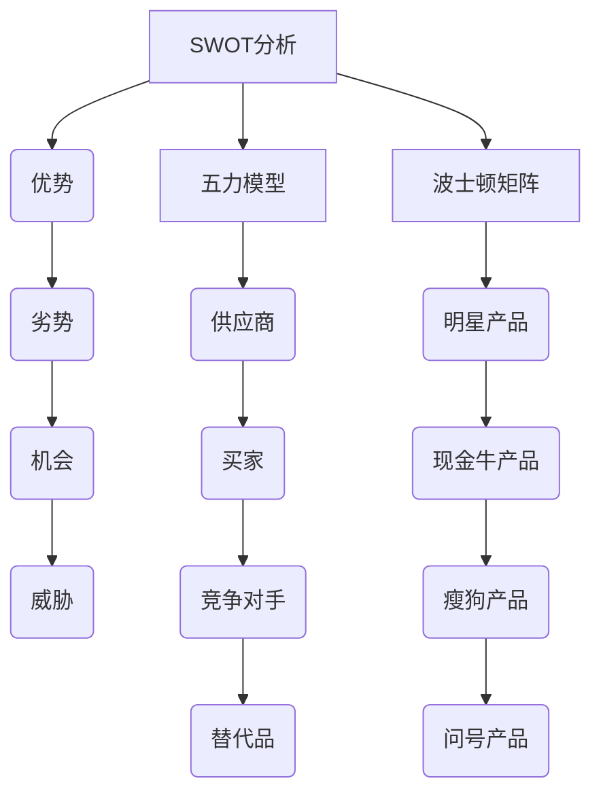

#### 5.3 战略决策的挑战与应对

战略决策面临诸多挑战，如信息不对称、不确定性和时间限制等。领导者需要运用各种策略和工具来应对这些挑战。

- **伪代码**：

```python
def strategic_decision_making():
    if information_asymmetry():
        collect_more_data()
    if uncertainty():
        perform_scenario_analysis()
    if time_limit():
        prioritize_decisions()
    execute_decision()
```

### 第6章：战略实施与执行

#### 6.1 战略实施的关键要素

战略实施包括组织结构、文化、流程和团队等多个方面。关键要素包括明确目标、建立支持体系、确保资源投入等。

- **Mermaid 流程图**：

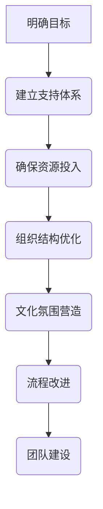

#### 6.2 战略执行的过程与技巧

战略执行是一个动态的过程，需要持续监控和调整。技巧包括沟通、激励、协调和反馈等。

- **Mermaid 流程图**：

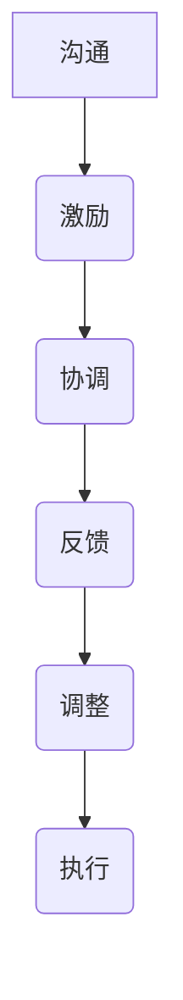

#### 6.3 战略执行中的问题与解决

战略执行过程中可能会遇到各种问题，如执行偏差、资源不足、团队冲突等。领导者需要运用各种方法来解决问题。

- **伪代码**：

```python
def strategic_execution():
    while execution_issues():
        identify_issues()
        apply_solutions()
        monitor_progress()
        if issues_not_resolved():
            adjust_strategies()
```

### 第7章：战略评估与调整

#### 7.1 战略评估的方法与工具

战略评估包括绩效评估、市场分析、客户反馈等。常用的评估方法有平衡计分卡、关键绩效指标等。

- **Mermaid 流程图**：

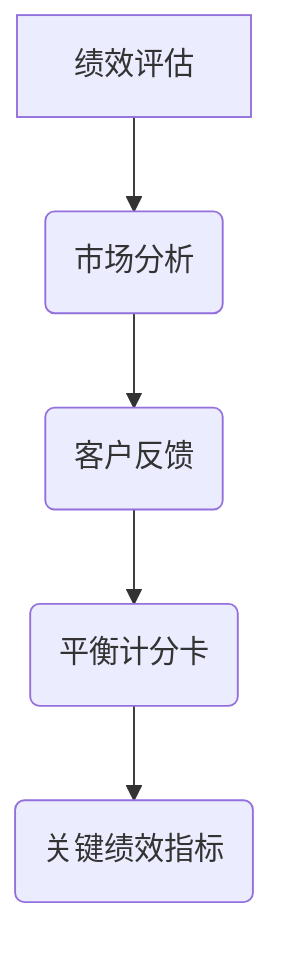

#### 7.2 战略调整的必要性

战略调整是应对市场变化和内部调整的需要。及时调整战略，可以确保组织保持竞争优势。

- **伪代码**：

```python
def strategic_adjustment():
    if market_changes():
        adjust_strategy()
    if internal_changes():
        adjust_strategy()
```

#### 7.3 战略调整的实践与案例

战略调整需要具体的操作步骤和实施方法。通过成功案例的分析，可以了解战略调整的最佳实践。

- **Mermaid 流程图**：

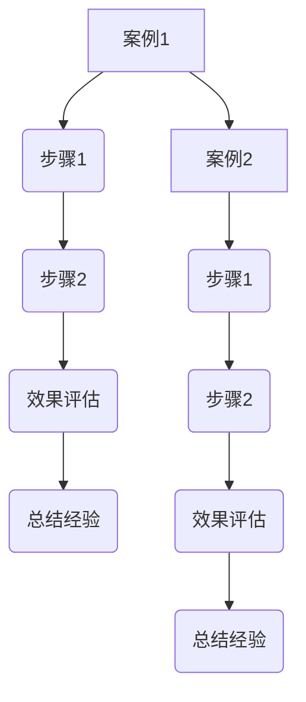

### 第8章：长远眼光的重要性

#### 8.1 长远眼光对企业的影响

长远眼光能够帮助企业抓住市场机遇，规避风险，实现可持续发展。

- **Mermaid 流程图**：

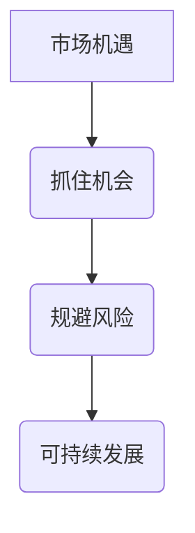

#### 8.2 长远眼光与战略思维的关系

长远眼光是战略思维的重要组成部分。它帮助领导者从长远角度思考问题，制定战略。

- **伪代码**：

```python
def long_term_vision():
    set_goals()
    analyze_market()
    allocate_resources()
    monitor_progress()
```

#### 8.3 长远眼光的实践意义

长远眼光对于企业领导者来说至关重要。它不仅能够提高企业的竞争力，还能够增强领导者的个人魅力。

- **Mermaid 流程图**：

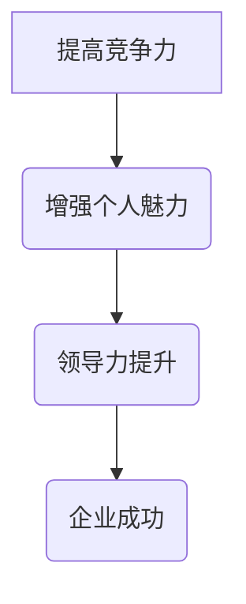

### 第9章：培养长远眼光的策略

#### 9.1 增强洞察力的方法

增强洞察力是培养长远眼光的重要途径。方法包括学习历史、阅读、观察和思考。

- **Mermaid 流程图**：

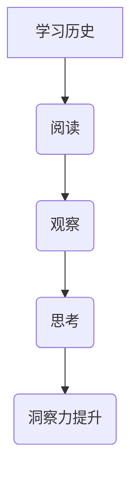

#### 9.2 拓展视野的途径

拓展视野是培养长远眼光的关键。途径包括旅行、交流、学习新知识和参与多领域活动。

- **伪代码**：

```python
def expand_horizons():
    travel_to_different_places()
    communicate_with_different_people()
    learn_new_knowledge()
    participate_in_different_activities()
```

#### 9.3 培养长远眼光的实践

培养长远眼光需要持续的努力和实践。实践包括设定长期目标、制定战略计划和持续学习。

- **Mermaid 流程图**：

```mermaid
graph TD
A[设定长期目标] --> B(制定战略计划)
B --> C(持续学习)
C --> D(实践与反思)
```

### 第10章：长远眼光在领导力与战略思维中的实际应用

#### 10.1 长远眼光在决策中的应用

长远眼光在决策中的应用能够帮助领导者做出更加明智的决策。它考虑了未来的发展和潜在的风险。

- **Mermaid 流程图**：

```mermaid
graph TD
A[考虑未来] --> B(评估风险)
B --> C(制定决策)
C --> D(执行决策)
```

#### 10.2 长远眼光在团队管理中的应用

长远眼光在团队管理中的应用能够帮助领导者培养团队的战略意识和创新能力。

- **伪代码**：

```python
def long_term_management():
    inspire_team_vision()
    cultivate_innovation_culture()
    align_goals_with_strategy()
```

#### 10.3 长远眼光在创新与变革中的应用

长远眼光在创新与变革中的应用能够帮助组织抓住机遇，推动持续变革。

- **Mermaid 流程图**：

```mermaid
graph TD
A[抓住机遇] --> B(推动变革)
B --> C(创新实践)
C --> D(适应变化)
```

### 附录

#### 附录A：战略思维与领导力模型图解

- **Mermaid 流程图**：

```mermaid
graph TD
A[战略思维模型] --> B(愿景规划)
B --> C(目标设定)
C --> D(资源分配)
D --> E(风险管理)

A --> F[领导力模型]
F --> G(变革引领)
G --> H(团队合作)
H --> I(价值观导向)
```

#### 附录B：战略规划与决策案例

- **案例1**：某企业通过战略规划，实现了从传统制造向智能制造的转型。

- **案例2**：某企业在市场竞争中，通过战略调整，成功避开了行业低谷。

#### 附录C：长远眼光培养实践指南

- **实践指南1**：定期进行市场分析，了解行业动态和竞争态势。

- **实践指南2**：制定个人发展规划，设定长期目标和短期目标。

------------------------------------------------------------------------------------------------------------------------------

## 附录

### 附录A：战略思维与领导力模型图解

**图解1：战略思维模型**

```mermaid
graph TD
A[战略思维] --> B(愿景规划)
B --> C(目标设定)
C --> D(资源分配)
D --> E(风险管理)

A --> F[领导力模型]
F --> G(变革引领)
G --> H(团队合作)
H --> I(价值观导向)
```

**图解2：领导力模型比较**

```mermaid
graph TD
A[变革型领导] --> B(激励与愿景)
B --> C(变革引领)
C --> D(团队合作)
D --> E(创新思维)

A --> F[交易型领导]
F --> G(权力与控制)
G --> H(绩效管理)
H --> I(目标导向)

A --> J[仆人领导]
J --> K(服务意识)
K --> L(团队关怀)
L --> M(价值观传承)
```

### 附录B：战略规划与决策案例

**案例1：某企业的战略规划**

- **目标设定**：从传统制造向智能制造转型，提高生产效率和产品质量。
- **资源分配**：增加研发投入，引进先进技术，培训员工。
- **风险管理**：评估市场风险，制定应对策略。

**案例2：某企业的战略调整**

- **市场变化**：行业竞争加剧，市场需求变化。
- **战略调整**：推出新产品，拓展新市场，降低成本。

### 附录C：长远眼光培养实践指南

**实践指南1：定期市场分析**

- **步骤1**：收集行业数据，分析市场趋势。
- **步骤2**：评估竞争对手，了解市场地位。
- **步骤3**：制定应对策略，调整企业战略。

**实践指南2：个人发展规划**

- **步骤1**：设定长期目标和短期目标。
- **步骤2**：制定行动计划，分解目标。
- **步骤3**：定期评估进度，调整计划。

### 作者信息

**作者：AI天才研究院/AI Genius Institute & 禅与计算机程序设计艺术 /Zen And The Art of Computer Programming**

**本文由AI天才研究院（AI Genius Institute）及《禅与计算机程序设计艺术》（Zen And The Art of Computer Programming）的作者共同撰写，旨在探讨领导力与战略思维在企业管理中的应用，以及如何培养企业领导者的长远眼光。**

