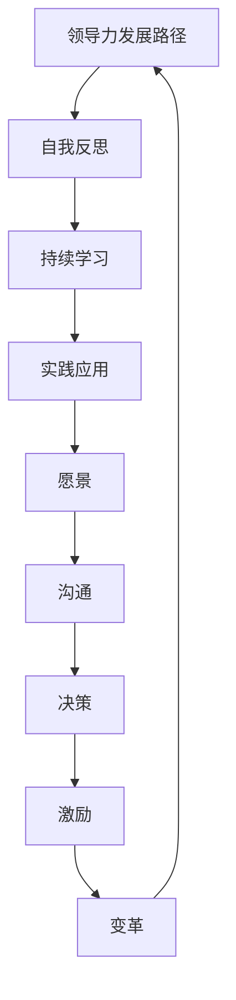
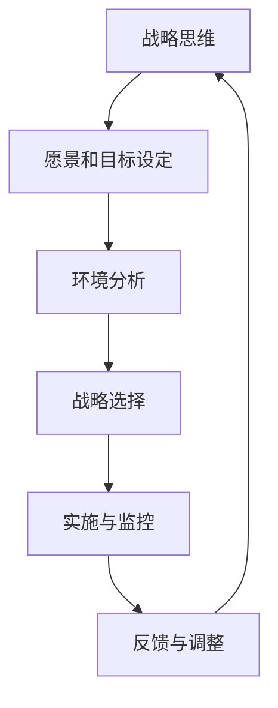

                 

### 《领导力与战略思维：长远规划与短期执行的平衡》

#### 关键词：
领导力、战略思维、长远规划、短期执行、平衡

#### 摘要：
本文深入探讨了领导力与战略思维的相互关系及其在长远规划和短期执行中的平衡作用。通过对领导力核心概念的阐述、战略思维的基础解析、长远规划与短期执行的关系分析，以及实际案例研究，本文旨在为读者提供一个全面、系统的理解框架，帮助他们提升领导力，优化战略思维，从而在复杂多变的环境中实现组织目标。

---

### 第一部分：领导力基础

#### 第1章：领导力概述

领导力是一种能够激励、引导和影响他人共同实现目标的能力。在组织管理中，领导力起着至关重要的作用，是推动组织发展和实现战略目标的核心动力。

##### 1.1 领导力的定义与类型

领导力可以分为多种类型，如权威型领导、民主型领导、变革型领导、教练型领导等。每种领导力类型都有其特定的特点和适用场景。

- **权威型领导**：领导者通过权威和命令来管理团队，适用于需要快速决策和行动的情境。
- **民主型领导**：领导者鼓励团队成员参与决策，提高团队的凝聚力和创造力。
- **变革型领导**：领导者通过激发团队的变革意愿，推动组织转型和创新。
- **教练型领导**：领导者关注团队成员的个人成长，提供指导和支持。

##### 1.2 领导力与管理的区别

领导力和管理是两个相关但不完全相同的概念。领导力侧重于激励和影响他人，而管理则侧重于规划、组织、领导和控制资源以实现目标。

- **领导力**：关注愿景、价值观、文化、人才等软性因素。
- **管理**：关注流程、绩效、预算等硬性指标。

##### 1.3 领导力的核心要素

领导力的核心要素包括：
- **愿景**：明确组织的发展方向和目标。
- **沟通**：有效传达愿景和目标，建立信任和协作。
- **决策**：在复杂多变的环境中做出正确决策。
- **激励**：激发团队成员的潜力，实现个人和组织的共同成长。

#### 第2章：领导力核心概念与联系

##### 2.1 领导力模型与框架

领导力模型提供了理解和应用领导力的框架。常见的领导力模型包括领导力五要素模型、领导力三层次模型等。

- **领导力五要素模型**：包括愿景、沟通、决策、激励和变革。
- **领导力三层次模型**：包括技术领导力、人际关系领导力和变革领导力。

##### 2.2 领导力与组织文化

组织文化是组织的价值观、信念和行为的总和。领导力对组织文化有深远的影响，可以塑造和维护积极的组织文化。

- **领导者**：通过自身行为树立榜样，影响和塑造组织文化。
- **组织文化**：影响领导者的行为和决策，反过来也受到领导者的影响。

##### 2.3 领导力与个人成长

领导力不仅是领导者的职责，也是每个团队成员的个人成长过程。通过不断学习和实践，团队成员可以提高自身的领导力，为组织的成功贡献力量。

- **自我反思**：领导者通过自我反思，了解自身的优势和不足，不断提升自身能力。
- **持续学习**：领导者通过学习新知识、新技能，保持自身的竞争力。
- **实践应用**：领导者通过实际工作，将理论知识转化为实际行动，提高领导力。

### 第3章：领导力Mermaid流程图

为了更好地理解领导力的发展路径和核心要素，我们可以使用Mermaid流程图来展示。

在这个流程图中，领导力发展路径是一个循环过程，通过自我反思、持续学习和实践应用，不断提升领导力，从而实现组织的长远规划和短期执行。

#### 第4章：战略思维基础

战略思维是一种高级思考能力，它能够帮助领导者从全局角度审视组织的发展，制定长远规划和应对短期挑战。

##### 4.1 战略思维的定义与重要性

战略思维是指领导者运用系统的、全面的、前瞻性的思考方式，制定和实施组织战略的能力。战略思维的重要性体现在：
- **指导组织发展方向**：战略思维能够帮助组织明确长远目标，规划未来发展路径。
- **应对复杂环境**：战略思维能够帮助组织在面对复杂多变的环境时，做出正确的决策。
- **提升竞争力**：战略思维能够帮助组织识别和抓住市场机会，提升竞争优势。

##### 4.2 战略规划的过程与方法

战略规划是一个系统的过程，通常包括以下步骤：
1. **愿景和目标设定**：明确组织的愿景和短期、长期目标。
2. **环境分析**：分析外部环境和内部资源，识别机会和挑战。
3. **战略选择**：根据环境分析和资源状况，选择适合的战略方案。
4. **实施与监控**：制定详细的实施计划，并对实施过程进行监控和调整。

##### 4.3 战略规划的核心要素

战略规划的核心要素包括：
- **愿景**：组织的长远目标和愿景，是战略规划的出发点和归宿。
- **资源**：组织可利用的资源，包括人力资源、财务资源、技术资源等。
- **能力**：组织的能力和核心竞争力，是战略规划的基础。
- **环境**：组织所处的外部环境，包括市场环境、政策环境等。

### 第5章：战略思维Mermaid流程图

为了更好地理解战略思维的过程和方法，我们可以使用Mermaid流程图来展示。

在这个流程图中，战略思维是一个循环过程，通过不断设定愿景和目标、分析环境、选择战略方案、实施和监控，以及根据反馈进行调整，实现组织的长远规划和短期执行。

#### 第6章：长远规划与短期执行的平衡

##### 6.1 长远规划的重要性

长远规划是组织发展的基础，它能够帮助组织：
- **明确发展方向**：长远规划能够明确组织的发展方向和目标，为组织的决策提供依据。
- **避免短期行为**：长远规划能够避免组织因短期利益而做出错误决策，影响长期发展。
- **提升竞争力**：长远规划能够帮助组织抓住市场机会，提升竞争优势。

##### 6.2 短期执行的必要性

短期执行是实现长远规划的关键，它能够帮助组织：
- **快速响应市场变化**：短期执行能够使组织迅速调整策略，应对市场变化。
- **实现阶段性目标**：短期执行能够实现组织的阶段性目标，为长远规划提供支撑。
- **积累经验和资源**：短期执行能够帮助组织积累经验和资源，为长远规划提供支持。

##### 6.3 长远规划与短期执行的关系

长远规划与短期执行是相辅相成的，二者之间存在着紧密的关系：
- **长远规划为短期执行提供方向**：长远规划明确了组织的发展方向和目标，为短期执行提供了明确的指导。
- **短期执行为长远规划提供反馈**：短期执行的结果为长远规划提供了反馈，使组织能够根据实际情况进行调整。

### 第7章：领导力与战略思维案例研究

#### 7.1 企业成功案例解析

以某大型互联网公司为例，该公司在发展中成功地运用了领导力和战略思维，实现了长远规划和短期执行的平衡。

- **领导力运用**：公司领导者通过愿景和目标的设定，激励团队，引导组织发展。
- **战略思维运用**：公司通过环境分析，制定了清晰的战略规划，并根据市场变化进行调整。

#### 7.2 领导力与战略思维失败案例分析

以某传统制造业企业为例，该公司在发展中未能有效运用领导力和战略思维，导致长远规划和短期执行失衡，最终面临困境。

- **领导力问题**：公司领导者缺乏远见，无法激励团队，导致组织缺乏活力。
- **战略思维问题**：公司未能进行有效的环境分析，制定的战略规划与市场脱节。

#### 7.3 从案例中汲取经验与教训

通过以上案例，我们可以汲取以下经验与教训：

- **领导者需要具备战略思维**：领导者需要具备战略思维，明确组织的发展方向，制定长远规划。
- **战略规划需要与市场紧密结合**：战略规划需要紧密结合市场环境，根据市场变化进行调整。
- **领导力与战略思维相辅相成**：领导力和战略思维相互促进，共同实现组织的长远规划和短期执行。

### 第8章：领导力与战略思维的实践应用

#### 8.1 领导力提升策略

- **自我反思**：领导者需要定期进行自我反思，了解自身的优势和不足，制定提升计划。
- **持续学习**：领导者需要持续学习新知识、新技能，提升自身的领导能力。
- **实践应用**：领导者需要将理论知识应用到实际工作中，提升领导效果。

#### 8.2 战略思维在日常工作中的应用

- **环境分析**：领导者需要定期分析外部环境和内部资源，识别机会和挑战。
- **目标设定**：领导者需要设定清晰的目标和愿景，明确组织的发展方向。
- **决策制定**：领导者需要根据环境分析和资源状况，做出正确的决策。

#### 8.3 领导力与战略思维协同发展的路径

- **建立协同机制**：组织需要建立领导力与战略思维的协同机制，确保二者相互促进。
- **培训与发展**：组织需要提供领导力与战略思维的培训与发展机会，提升员工能力。
- **文化塑造**：组织需要塑造积极向上的文化氛围，鼓励员工运用领导力和战略思维，实现组织目标。

### 第9章：领导力与战略思维的持续发展

#### 9.1 个人成长与领导力提升

个人成长是领导力提升的基础，领导者需要通过不断学习和实践，提升自身的综合素质和领导能力。

- **自我反思**：领导者需要定期进行自我反思，了解自身的优势和不足，制定提升计划。
- **持续学习**：领导者需要持续学习新知识、新技能，提升自身的领导能力。
- **实践应用**：领导者需要将理论知识应用到实际工作中，提升领导效果。

#### 9.2 战略思维的持续发展

战略思维的发展是一个长期过程，领导者需要不断更新和提升战略思维。

- **环境变化**：领导者需要关注外部环境的变化，及时调整战略思维。
- **实践经验**：领导者需要通过实践积累经验，提升战略思维能力。
- **持续学习**：领导者需要不断学习新的战略思维理论和方法，提升战略思维水平。

#### 9.3 领导力与战略思维的未来趋势

随着社会和经济的快速发展，领导力与战略思维也将面临新的挑战和机遇。

- **数字化时代**：数字化时代的到来，要求领导者具备数字化战略思维，引领组织转型和创新。
- **全球化视野**：全球化的发展，要求领导者具备全球化视野，应对复杂多变的国际环境。
- **可持续发展**：可持续发展成为全球共识，领导者需要将可持续发展理念融入战略思维，引领组织实现可持续发展。

### 附录

#### 附录A：领导力与战略思维工具与方法

- **SWOT分析**：用于评估组织的优势、劣势、机会和威胁，为战略规划提供依据。
- **五力模型**：用于分析市场环境中的竞争力量，为战略制定提供参考。
- **平衡计分卡**：用于衡量组织的绩效，包括财务、客户、内部流程、学习与成长等方面。

#### 附录B：领导力与战略思维资源推荐

- **经典书籍**：《领导力的五个层次》、《战略思维》、《领导力与决策》等。
- **杰出领导力案例分析**：《基业长青》、《从优秀到卓越》等。
- **战略规划工具使用指南**：各种战略规划工具的使用方法和案例，如SWOT分析、五力模型等。

### 作者信息

作者：AI天才研究院/AI Genius Institute & 禅与计算机程序设计艺术 /Zen And The Art of Computer Programming

---

本文以markdown格式呈现，内容涵盖了领导力与战略思维的基础概念、长远规划与短期执行的平衡、实际案例分析以及实践应用等各个方面。通过本文的阅读，读者可以全面了解领导力与战略思维的重要性和应用方法，提升自身的领导力和战略思维能力。希望本文能够为读者在组织管理和战略规划方面提供有益的启示和指导。

