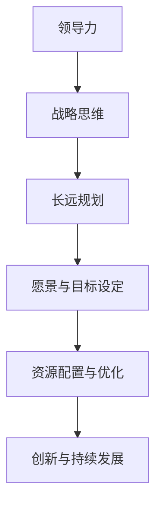

                 

### 文章标题

《领导力与战略思维：长远规划的艺术》

> 关键词：领导力、战略思维、长远规划、组织管理、资源配置、创新与发展

> 摘要：本文深入探讨领导力与战略思维在组织管理中的重要性，通过理论与实践的结合，详细分析长远规划的艺术，帮助读者掌握领导力与战略思维的核心原理和实际应用方法。

---

### 《领导力与战略思维：长远规划的艺术》目录大纲

# 《领导力与战略思维：长远规划的艺术》

## 第一部分：领导力基础

### 第1章：领导力的本质与重要性

#### 1.1 领导力的定义与理解

#### 1.2 领导力在组织中的角色

#### 1.3 领导力的重要性

### 第2章：领导力理论综述

#### 2.1 经典领导理论

#### 2.2 变革型领导理论

#### 2.3 领导风格理论

### 第3章：领导者自我认知与成长

#### 3.1 自我认知的重要性

#### 3.2 领导者成长路径

#### 3.3 领导力培训与发展

## 第二部分：战略思维培养

### 第4章：战略思维概述

#### 4.1 战略思维的定义

#### 4.2 战略思维的重要性

#### 4.3 战略思维的要素

### 第5章：战略规划与执行

#### 5.1 战略规划的过程

#### 5.2 战略目标设定

#### 5.3 战略执行策略

### 第6章：风险管理与应对策略

#### 6.1 风险识别与评估

#### 6.2 风险应对策略

#### 6.3 风险管理实践案例

## 第三部分：长远规划的艺术

### 第7章：愿景与目标设定

#### 7.1 愿景的定义与重要性

#### 7.2 目标设定原则与方法

#### 7.3 愿景与目标的实现路径

### 第8章：资源配置与优化

#### 8.1 资源配置原则

#### 8.2 资源优化策略

#### 8.3 资源配置案例分析

### 第9章：创新与持续发展

#### 9.1 创新的意义与类型

#### 9.2 创新管理策略

#### 9.3 持续发展策略

## 第四部分：领导力与战略思维应用

### 第10章：领导力与战略思维在实际工作中的运用

#### 10.1 领导力与战略思维在项目管理中的应用

#### 10.2 领导力与战略思维在团队建设中的应用

#### 10.3 领导力与战略思维在危机管理中的应用

### 第11章：成功案例分析

#### 11.1 国内外领导力与战略思维成功案例

#### 11.2 案例分析与启示

#### 11.3 启示与应用

## 附录

### 附录 A：领导力与战略思维工具与方法

#### A.1 常用领导力评估工具

#### A.2 战略规划工具与方法

#### A.3 创新与持续发展工具

---

### 参考文献与拓展阅读

#### 参考文献

#### 拓展阅读推荐

---

#### **核心概念与联系流程图**

mermaid
graph TB
A[领导力] --> B[战略思维]
B --> C[长远规划]
C --> D[愿景与目标设定]
D --> E[资源配置与优化]
E --> F[创新与持续发展]


#### **核心算法原理伪代码**

python
# 战略规划算法伪代码
def strategicPlanning(objectives, constraints, resources):
    # 初始化
    plan = []
    
    # 目标排序
    sortedObjectives = sortObjectivesByImportance(objectives)
    
    # 资源分配
    for objective in sortedObjectives:
        if canAllocate(objective, constraints, resources):
            plan.append(objective)
            resources -= objective.resource_requirement
            
    # 返回规划结果
    return plan

# 目标排序函数
def sortObjectivesByImportance(objectives):
    # 实现目标重要性的排序逻辑
    pass

# 资源分配函数
def canAllocate(objective, constraints, resources):
    # 实现资源是否可分配的判断逻辑
    pass


#### **数学模型与公式讲解**

**优化资源配置公式**：

$$
\text{Maximize} \quad Z = \sum_{i=1}^{n} c_{i} x_{i}
$$

$$
\text{Subject to} \quad a_{i} \leq b_{i}
$$

---

### 第一部分：领导力基础

#### 第1章：领导力的本质与重要性

领导力是指一个人在团队中影响和激励他人，实现共同目标的能力。它不仅关乎个人的行为和态度，还涉及到组织的管理和运作。在本章中，我们将探讨领导力的定义、其在组织中的角色以及它的重要性。

#### 1.1 领导力的定义与理解

领导力是一个多维度的概念，可以从多个角度进行理解。首先，领导力是一种能力，即能够影响他人，引导他们朝着共同的目标前进。这种能力不仅包括技术知识和专业技能，还涉及到情感智慧、人际沟通和团队合作等方面。

其次，领导力是一种艺术，它不仅仅是遵循一定的原则和方法，还需要根据具体情境灵活运用。领导力不是一成不变的，而是随着时间、环境和团队需求的变化而不断发展的。

最后，领导力是一种责任，领导者不仅要对团队的绩效负责，还要关注团队成员的成长和福祉。领导力不仅仅是关于任务的完成，更关乎价值观的传承和团队的长期发展。

#### 1.2 领导力在组织中的角色

领导力在组织中的作用至关重要。首先，领导者是组织的核心，他们通过设定愿景、制定战略和激励团队，推动组织向前发展。其次，领导者是团队的灵魂，他们通过建立信任、沟通和协作，提高团队的凝聚力和效率。

此外，领导者还是变革的推动者。在面对外部环境的变化和内部挑战时，领导者需要具备前瞻性和灵活性，带领团队适应变革，抓住机遇。最后，领导者是文化的传承者，他们通过自身的言行和价值观，影响和塑造组织文化，为组织的发展奠定坚实的基础。

#### 1.3 领导力的重要性

领导力的重要性体现在多个方面。首先，领导力是组织成功的基石。一个有能力的领导者能够激发团队的潜力，提高组织的绩效，实现长远的发展目标。

其次，领导力是个人成长的关键。通过领导力的培养和实践，个人可以提升自己的领导素质，增强自信心，拓展职业发展空间。

最后，领导力对社会进步有重要影响。领导者不仅影响一个组织，还影响整个社会的价值观和行为规范。一个有责任感和使命感的领导者，能够推动社会的进步和发展。

总之，领导力是组织管理中不可或缺的一部分。只有深入理解和掌握领导力的本质，才能在激烈的竞争中立于不败之地。接下来，我们将进一步探讨领导力的理论，帮助读者更好地理解和应用领导力。

---

### 第2章：领导力理论综述

领导力理论是研究领导现象和领导行为的科学体系，通过分析和总结不同领导者的实践，提出了一系列关于领导的理论模型。本章将综述经典领导理论、变革型领导理论和领导风格理论，帮助读者全面了解领导力理论的发展和应用。

#### 2.1 经典领导理论

经典领导理论主要包括特质理论、行为理论和情境理论。这些理论从不同的角度解释了领导现象，为领导力的研究和实践提供了理论基础。

**特质理论**：特质理论认为领导者具备一系列固有的特质和品质，这些特质是成功领导的关键。例如，自信心、责任心、正直、果断等。特质理论在早期领导研究中占据主导地位，但随着研究的深入，学者们逐渐发现领导特质并非一成不变，而是可以通过培养和锻炼得到提升。

**行为理论**：行为理论关注领导者如何通过具体的行为来影响团队和实现目标。行为理论将领导行为分为任务导向和行为导向。任务导向的领导者注重任务完成和绩效，而行为导向的领导者则更关注团队氛围和成员关系。行为理论提出了多种领导行为模型，如菲德勒模型、赫塞-布兰查德模型等，为领导者的行为选择提供了指导。

**情境理论**：情境理论认为领导效果取决于领导行为与情境的匹配程度。不同的情境下，领导者需要采取不同的领导风格和策略。情境理论的主要代表是路径-目标理论，该理论提出领导者需要根据下属的需求和环境的变化，调整自己的领导行为，以实现组织目标。

#### 2.2 变革型领导理论

变革型领导理论强调领导者通过激发和引导团队成员，推动组织变革和发展。变革型领导不仅关注组织的短期绩效，更关注组织的长期发展和创新。

**变革型领导特点**：变革型领导具有以下几个特点：
1. 激发下属的潜能：变革型领导通过激励和启发，使下属意识到自己的价值，激发他们的潜能。
2. 设定愿景和目标：变革型领导能够设定具有挑战性的愿景和目标，引导团队为之努力。
3. 建立信任和沟通：变革型领导注重建立信任和沟通，鼓励团队成员积极参与决策和变革过程。
4. 鼓励创新和变革：变革型领导支持创新和变革，鼓励团队成员提出新想法和建议。

**变革型领导的作用**：变革型领导在组织变革中发挥着关键作用，他们能够推动组织适应外部环境的变化，实现持续发展和创新。

#### 2.3 领导风格理论

领导风格理论关注领导者如何在不同情境下选择和运用不同的领导风格，以实现组织目标。常见的领导风格包括专制型、民主型、参与型和教练型。

**专制型领导**：专制型领导强调领导者的权威和控制，决策权集中在领导者手中。这种风格适用于紧急情况和需要快速决策的情境。

**民主型领导**：民主型领导鼓励团队成员参与决策，尊重下属的意见和建议。这种风格适用于团队需要高度协作和创新的情境。

**参与型领导**：参与型领导注重与下属建立良好的关系，鼓励团队成员积极参与组织事务。这种风格适用于需要增强团队凝聚力和归属感的情境。

**教练型领导**：教练型领导关注下属的成长和发展，通过指导和辅导，帮助下属提升技能和素质。这种风格适用于需要培养和传承组织文化的情境。

综上所述，领导力理论为我们理解领导现象和培养领导力提供了丰富的理论资源。通过学习和应用这些理论，领导者可以更好地应对复杂多变的组织环境，推动组织的持续发展和创新。在下一章中，我们将探讨领导者自我认知与成长，帮助读者掌握提升领导力的方法。

---

### 第3章：领导者自我认知与成长

领导者自我认知与成长是领导力发展的关键环节。一个成功的领导者不仅需要具备卓越的领导技能，还需要不断反思和提升自我。本章将探讨自我认知的重要性、领导者的成长路径以及领导力培训与发展，帮助读者深入了解领导者自我提升的方法和路径。

#### 3.1 自我认知的重要性

自我认知是指领导者对自己性格、能力、价值观和动机等方面的理解和认识。自我认知对于领导者的成长和组织的发展具有重要意义。

**增强领导力**：自我认知有助于领导者识别自身的优势和劣势，通过针对性的培训和提升，增强领导力。例如，一个领导者意识到自己在沟通能力方面的不足，可以通过参加沟通技巧培训来提升自己的沟通效果。

**促进团队协作**：自我认知有助于建立团队信任和协作。当领导者能够真实地展示自己，团队成员更容易理解和支持领导者的决策，从而提高团队的整体绩效。

**提升决策质量**：自我认知使领导者能够更好地理解自己的决策风格和偏好，避免因个人偏见而做出错误的决策。通过自我反思，领导者可以更加客观地分析问题，制定更有效的解决方案。

**推动组织发展**：自我认知有助于领导者识别组织中的潜在问题和挑战，从而制定更具前瞻性的发展战略。领导者通过自我提升，不仅能够提升个人绩效，还能推动组织的持续发展。

#### 3.2 领导者成长路径

领导者的成长路径是一个不断学习、实践和反思的过程。以下是一些常见的成长路径：

**学习阶段**：在学习的阶段，领导者需要通过阅读书籍、参加培训、学习领导力理论等途径，积累理论知识。这个阶段的关键是建立良好的知识基础，为后续实践提供指导。

**实践阶段**：在实践阶段，领导者需要在实际工作中运用所学知识，通过领导团队、管理项目等实践机会，提升自己的领导能力。这个阶段的关键是积累经验，通过实践中的反思和总结，不断优化自己的领导方法。

**反思阶段**：在反思阶段，领导者需要定期回顾自己的领导实践，分析成功和失败的原因，总结经验教训。这个阶段的关键是持续学习和成长，通过反思，领导者可以不断提高自己的领导水平。

**卓越阶段**：在卓越阶段，领导者已经具备了较高的领导能力，能够应对复杂多变的环境和挑战。这个阶段的关键是持续创新和突破，通过不断挑战自我，实现个人和组织的卓越发展。

#### 3.3 领导力培训与发展

为了提升领导力，组织和个人需要采取一系列培训与发展措施。以下是一些常见的领导力培训与发展方法：

**领导力课程**：参加专业化的领导力课程，通过系统的学习和训练，提升领导技能和知识水平。

**教练辅导**：通过专业教练的辅导，领导者可以深入分析自身问题，制定个人成长计划，实现自我提升。

**实践项目**：参与实际项目，担任项目负责人或关键角色，通过实践中的挑战和解决问题，提升领导能力。

**内部培训**：组织内部培训，通过案例分析、角色扮演、模拟演练等方式，提高团队成员的领导素质。

**交流学习**：参加行业会议、研讨会，与业界专家和同行交流学习，了解最新的领导力理论和实践方法。

**个人阅读**：阅读领导力相关的书籍和文章，不断充实自己的知识体系，提升领导思维。

总之，领导者自我认知与成长是一个持续的过程，需要不断学习、实践和反思。通过自我提升，领导者不仅能够实现个人价值，还能为组织的发展做出贡献。在下一章中，我们将探讨战略思维的概念和重要性，帮助读者了解战略思维在领导力中的核心作用。

---

### 第二部分：战略思维培养

战略思维是一种深度的思考方式，它不仅关注当前的问题和挑战，更注重组织的长远发展和整体规划。战略思维的核心在于从宏观角度审视组织所处的环境和自身资源，通过科学的分析和决策，实现组织的长远目标。本章将概述战略思维的定义、重要性以及其关键要素，帮助读者理解战略思维的基本概念和培养方法。

#### 4.1 战略思维的定义

战略思维是一种系统性的、前瞻性的思考方式，它涉及对组织内外部环境的全面分析和综合评估。战略思维不仅仅是对当前问题的解决，更注重对未来的预见和规划。具体来说，战略思维包括以下几个方面的内容：

**全局观念**：战略思维要求领导者具备全局观念，能够从组织的整体利益出发，审视各个部门、业务和项目之间的关联和影响，确保各个部分的协调和协同。

**长远眼光**：战略思维强调对未来的预见和规划，领导者需要站在长远的角度，制定长远的发展目标和规划，确保组织在未来的竞争环境中保持优势。

**系统性思考**：战略思维是一种系统性的思考方式，它要求领导者能够从多个维度、多个层面分析问题，识别关键因素，制定综合性的解决方案。

**创新意识**：战略思维鼓励领导者具备创新意识，敢于挑战传统思维和方法，寻找新的发展路径和机遇。

**决策能力**：战略思维强调决策能力，领导者需要根据对组织内外部环境的分析，做出科学、合理的决策，确保组织的战略目标和规划能够有效执行。

#### 4.2 战略思维的重要性

战略思维在组织管理中具有至关重要的作用，它不仅影响组织的长远发展，还关系到组织的生存和竞争力。以下是战略思维的重要性体现在以下几个方面：

**指导未来发展**：战略思维帮助组织预见未来可能面临的机会和挑战，制定科学的发展目标和规划，确保组织在未来的竞争环境中保持领先地位。

**提高决策效率**：战略思维要求领导者具备科学的分析和决策能力，通过系统性的思考和评估，提高决策的准确性和效率，减少决策失误。

**增强组织竞争力**：战略思维帮助组织优化资源配置，提高运营效率，提升产品质量和服务水平，从而增强组织的竞争力。

**促进团队协作**：战略思维强调全局观念和系统性思考，有助于团队成员理解组织的整体目标和战略规划，提高团队协作效果。

**应对不确定性**：战略思维帮助组织建立应对不确定性的能力，通过前瞻性的分析和规划，提高组织对市场变化和风险的应对能力。

**实现可持续发展**：战略思维注重组织的长远发展和创新，有助于组织在激烈的市场竞争中实现可持续发展，保持长期的竞争优势。

#### 4.3 战略思维的要素

战略思维是一个复杂的过程，涉及多个要素的整合和运用。以下是战略思维的关键要素：

**环境分析**：战略思维首先需要对组织所处的内外部环境进行全面分析，包括市场趋势、竞争状况、政策法规、技术进步等因素。通过对环境的深入分析，领导者可以识别外部环境对组织发展的影响，制定相应的应对策略。

**目标设定**：目标设定是战略思维的核心环节，领导者需要根据组织的使命和愿景，设定具体、可衡量和可实现的目标。明确的目标为组织的战略规划提供了方向和依据。

**资源规划**：资源规划是战略思维的重要方面，领导者需要分析组织的资源状况，包括资金、人力、技术和信息等，制定合理的资源配置策略，确保组织在实现目标的过程中拥有足够的资源支持。

**策略制定**：策略制定是战略思维的执行环节，领导者需要根据环境分析和目标设定，制定具体的战略措施和行动方案。策略制定需要综合考虑各种可能的情况和风险，确保战略的可行性和有效性。

**执行与监控**：执行与监控是战略思维的关键，领导者需要确保战略措施的有效执行，并通过持续的监控和评估，及时调整战略规划和执行方案，确保组织目标的实现。

**创新与变革**：战略思维强调创新和变革，领导者需要鼓励创新思维，推动组织的变革和发展，以适应不断变化的市场环境和竞争态势。

通过以上关键要素的整合和运用，领导者可以形成系统的战略思维，为组织的长远发展和成功奠定坚实的基础。在下一章中，我们将深入探讨战略规划与执行的过程，帮助读者了解如何有效地制定和实施战略规划。

---

### 第5章：战略规划与执行

战略规划与执行是组织实现长远目标和持续发展的关键环节。战略规划不仅涉及到目标的设定和策略的制定，还需要通过系统的执行和监控，确保战略的有效实施。本章将详细探讨战略规划的过程、战略目标的设定以及战略执行策略，帮助读者理解和掌握战略规划与执行的核心原则和实际操作方法。

#### 5.1 战略规划的过程

战略规划是一个系统性的过程，它需要组织从整体角度出发，综合考虑内外部环境，明确发展目标和策略。战略规划的过程通常包括以下几个阶段：

**1. 环境分析**：环境分析是战略规划的基础，领导者需要全面了解组织所处的内外部环境。内部环境分析包括组织资源、能力、文化等方面，外部环境分析则涉及市场趋势、竞争状况、政策法规等因素。通过对环境的深入分析，领导者可以识别外部环境对组织发展的影响，为战略规划提供依据。

**2. 愿景和使命定义**：愿景和使命是组织的核心，它们为组织提供了长远的发展方向和价值观。领导者需要明确组织的愿景和使命，确保战略规划与组织的长远目标相一致。愿景和使命的明确不仅为战略规划提供了方向，还可以激励和凝聚团队成员。

**3. 目标设定**：目标设定是战略规划的核心环节，领导者需要根据愿景和使命，设定具体、可衡量和可实现的目标。目标应具有挑战性，但也要确保在现有资源和能力范围内可以实现。目标的设定应包括短期目标和长期目标，以及关键绩效指标（KPI）的明确。

**4. 策略制定**：策略制定是根据目标设定，制定具体的行动方案和策略。策略应涵盖组织运营的各个方面，包括市场拓展、产品开发、人力资源管理、财务管理等。策略的制定需要充分考虑内外部环境的变化，确保策略的可行性和适应性。

**5. 实施计划**：实施计划是将策略转化为具体行动的步骤和时间表。领导者需要明确各个部门、团队和个人的职责，制定详细的行动计划，确保战略规划的有效执行。实施计划应包括资源配置、时间安排、责任分配等方面的内容。

**6. 监控与评估**：监控与评估是战略规划的重要环节，领导者需要通过持续的监控和评估，确保战略规划的有效实施。监控与评估包括关键绩效指标的跟踪、进度报告、问题诊断和改进措施等方面。通过监控与评估，领导者可以及时发现和解决战略实施中的问题，确保战略目标的实现。

#### 5.2 战略目标设定

战略目标设定是战略规划的核心，它决定了组织的发展方向和重点。有效的战略目标设定应遵循以下原则：

**1. 明确性**：战略目标应具体、明确，便于理解和执行。目标应包括具体的指标和数量，如市场份额、利润率、客户满意度等。

**2. 可衡量性**：战略目标应可衡量，以便于评估和反馈。通过设定具体的衡量指标，领导者可以随时了解目标实现的情况，及时调整战略规划和执行方案。

**3. 可实现性**：战略目标应具有挑战性，但也要确保在现有资源和能力范围内可以实现。目标设定应考虑组织的实际情况，避免设定过于理想化的目标，导致执行困难。

**4. 一致性**：战略目标应与组织的愿景和使命一致，确保组织在实现目标的过程中，不会偏离长远发展目标。

**5. 综合性**：战略目标应综合考虑组织的各个方面，包括财务、市场、运营、人力资源等，确保组织整体协调和平衡发展。

**6. 分阶段性**：战略目标应分为短期和长期目标，短期目标通常为1-3年，长期目标则为3-5年甚至更长。通过分阶段性目标，领导者可以更好地规划和管理组织的发展。

#### 5.3 战略执行策略

战略执行策略是将战略目标转化为具体行动和成果的关键环节。有效的战略执行策略应包括以下几个方面：

**1. 资源配置**：战略执行需要充足的资源支持，包括资金、人力、技术和信息等。领导者需要根据战略目标和行动计划，合理配置资源，确保各项战略措施得到有效实施。

**2. 组织结构设计**：组织结构设计是战略执行的基础，领导者需要根据战略目标和业务需求，设计合理的组织结构和职责分工。通过优化组织结构，可以提高组织的运行效率和协作效果。

**3. 激励机制**：激励机制是战略执行的重要保障，领导者需要建立有效的激励机制，激励团队成员为实现战略目标而努力。激励机制应包括薪酬、晋升、荣誉等方面的内容，以激发团队成员的积极性和创造力。

**4. 沟通协调**：战略执行需要各部门、团队和个人的协同合作。领导者需要建立有效的沟通协调机制，确保信息畅通，协调解决执行过程中出现的问题。

**5. 风险管理**：战略执行过程中不可避免地会遇到各种风险和挑战。领导者需要建立风险管理机制，识别和评估潜在风险，制定应对策略，确保战略目标的实现。

**6. 持续监控与反馈**：战略执行过程中，领导者需要持续监控和评估战略执行情况，通过反馈机制，及时发现和解决问题。通过持续的监控与反馈，领导者可以确保战略执行的有效性和灵活性。

总之，战略规划与执行是组织发展的关键环节，通过科学的目标设定和有效的执行策略，组织可以确保战略目标的实现，实现持续发展和成功。在下一章中，我们将探讨风险管理与应对策略，帮助读者了解如何在复杂多变的环境中有效应对风险和挑战。

---

### 第6章：风险管理与应对策略

在组织发展的过程中，风险是不可避免的。有效的风险管理能够帮助组织预见和应对潜在的风险，降低风险带来的负面影响，确保组织的稳定发展和目标的实现。本章将探讨风险识别与评估、风险应对策略以及风险管理实践案例，帮助读者理解风险管理的核心原则和实际应用。

#### 6.1 风险识别与评估

风险识别与评估是风险管理的第一步，其目的是识别组织可能面临的风险，并对其进行评估，以确定风险的重要性和影响程度。以下是一些常见的风险识别与评估方法：

**1. SWOT分析**：SWOT分析是一种常用的风险识别方法，它通过分析组织的优势（Strengths）、劣势（Weaknesses）、机会（Opportunities）和威胁（Threats），帮助组织识别外部环境和内部条件下的潜在风险。

**2. 检查表法**：检查表法是一种结构化的方法，通过列出一系列可能的风险因素，帮助组织识别潜在的风险。这种方法适用于对特定业务领域或项目进行风险评估。

**3. 头脑风暴法**：头脑风暴法是一种集体创意思维方法，通过团队成员的集体讨论，列出可能的风险因素，并进行评估。这种方法可以充分发挥团队的智慧和创造力，识别更多的潜在风险。

**4. 风险矩阵**：风险矩阵是一种定量评估风险的方法，通过将风险发生的概率和影响程度进行量化，确定风险的重要性和优先级。风险矩阵可以帮助组织更好地分配资源和制定应对策略。

**5. 情景分析法**：情景分析法是一种通过构建可能发生的事件情景，分析风险发生的影响和应对措施的方法。这种方法有助于组织全面了解风险的潜在影响，制定更有效的应对策略。

在识别和评估风险时，组织应考虑以下因素：

- 风险的概率和影响程度：识别哪些风险最有可能发生，并评估其对组织目标的潜在影响。
- 风险的多样性和复杂性：考虑不同类型的风险如何相互作用，以及它们如何影响组织的整体运营。
- 风险的动态性：识别风险的发展趋势和变化，以及如何及时调整应对策略。

#### 6.2 风险应对策略

在识别和评估风险后，组织需要制定相应的应对策略，以降低风险的可能性和影响。常见的风险应对策略包括：

**1. 风险规避**：风险规避是通过避免参与可能导致风险的活动或项目来降低风险。这种方法适用于高风险、高成本或低收益的项目。

**2. 风险转移**：风险转移是通过将风险责任转移给第三方来降低组织风险。常见的方式包括购买保险、签订合同等。

**3. 风险缓解**：风险缓解是通过降低风险的概率或影响程度来降低风险。例如，通过改进流程、增加资源投入、培训员工等方式来减少风险的发生。

**4. 风险接受**：风险接受是指组织承认某些风险不可避免，但愿意承担其带来的影响。这种方法适用于低风险、高收益的项目。

**5. 风险利用**：风险利用是通过积极利用风险带来的机会来提高组织的竞争力。例如，通过技术创新、市场扩张等手段，将风险转化为机遇。

在制定风险应对策略时，组织应考虑以下因素：

- 风险的性质和特征：根据风险的不同性质和特征，选择合适的应对策略。
- 组织的战略目标和资源：确保应对策略与组织的战略目标和资源条件相匹配。
- 风险的优先级：根据风险的重要性和影响程度，优先应对高风险、高影响的风险。

#### 6.3 风险管理实践案例

以下是一个风险管理实践案例，以帮助读者更好地理解风险管理的实际应用：

**案例背景**：某科技公司计划推出一款新型智能手表，该产品在市场上具有广阔的前景。然而，由于市场竞争激烈，技术研发难度大，且存在一些潜在的技术风险。

**风险识别与评估**：
- 技术风险：新产品的技术研发过程中可能遇到技术难题，影响产品的上市时间和质量。
- 市场风险：市场竞争激烈，可能导致产品销量不如预期。
- 资金风险：研发资金不足，可能导致项目延误或产品功能不完善。

**风险应对策略**：
- 风险规避：针对技术风险，公司决定采用成熟的技术方案，避免自主研发可能遇到的技术难题。
- 风险转移：公司购买产品责任保险，将部分市场风险转移给保险公司。
- 风险缓解：公司加大研发投入，组建专业的研发团队，确保产品技术稳定可靠。同时，公司开展市场调研，了解消费者需求，确保产品符合市场预期。
- 风险接受：公司接受部分市场风险，制定灵活的营销策略，以应对市场变化。

通过上述风险应对策略，公司有效地降低了潜在风险的影响，确保了新型智能手表的成功上市。

总之，有效的风险管理是组织成功发展的重要保障。通过识别和评估风险，制定科学的应对策略，组织可以降低风险带来的负面影响，实现长期稳定发展。在下一章中，我们将探讨长远规划的艺术，帮助读者掌握制定和实现长远规划的核心原则和方法。

---

### 第三部分：长远规划的艺术

长远规划是组织持续发展和成功的基石。一个有效的长远规划能够帮助组织明确未来发展方向，合理配置资源，抓住机遇，应对挑战。本章将深入探讨长远规划的核心要素，包括愿景与目标设定、资源配置与优化以及创新与持续发展，帮助读者掌握制定和实现长远规划的艺术。

#### 第7章：愿景与目标设定

愿景和目标设定是长远规划的基础。一个清晰的愿景和具体、可衡量的目标是组织发展的重要指引。以下是愿景与目标设定的核心原则和方法。

#### 7.1 愿景的定义与重要性

**愿景**：愿景是对组织未来发展的一种理想化的描述，它明确了组织的长远目标和使命。一个清晰的愿景能够为组织提供方向和动力，激发员工的热情和创造力。

**重要性**：
1. **指导未来发展**：愿景为组织提供了明确的发展方向，使组织在面临决策时有所依据。
2. **激励员工**：愿景能够激发员工的使命感和责任感，提高员工的积极性和工作热情。
3. **凝聚团队**：愿景能够团结团队成员，形成共同的目标和价值观，增强团队的凝聚力。
4. **增强组织竞争力**：愿景有助于组织在激烈的市场竞争中保持领先地位，实现持续发展。

#### 7.2 目标设定原则与方法

**原则**：
1. **具体性**：目标应明确、具体，便于衡量和实现。
2. **可衡量性**：目标应具有可衡量的指标，以便于评估和反馈。
3. **可实现性**：目标应具有挑战性，但也要确保在现有资源和能力范围内可以实现。
4. **一致性**：目标应与组织的愿景和使命一致，确保组织在实现目标的过程中不会偏离长远发展目标。
5. **分阶段性**：目标应分为短期和长期目标，以适应不同时间段的规划和实施。

**方法**：
1. **SWOT分析**：通过SWOT分析，识别组织的优势、劣势、机会和威胁，设定符合组织实际情况的目标。
2. **SMART原则**：设定目标时，遵循SMART原则（具体、可衡量、可实现、相关性强、有时间限制），确保目标具备可操作性。
3. **关键绩效指标（KPI）**：设定具体的KPI，用于衡量目标的实现程度，便于评估和调整。

#### 7.3 愿景与目标的实现路径

实现愿景和目标是一个复杂的过程，需要组织从多个方面进行规划和努力。以下是实现愿景与目标的一些关键路径：

1. **战略规划**：通过科学的战略规划，明确组织的发展路径和策略，确保愿景和目标的实现。
2. **资源配置**：合理配置资源，包括资金、人力、技术和信息等，为愿景和目标的实现提供有力支持。
3. **组织结构**：优化组织结构，建立高效的管理体系，确保战略规划和资源配置的有效执行。
4. **文化建设**：塑造积极向上的组织文化，培养员工的使命感和责任感，形成共同的目标和价值观。
5. **监控与评估**：通过持续的监控和评估，及时了解愿景和目标的实现情况，发现问题并调整策略。

通过以上路径，组织可以逐步实现愿景和目标，推动组织的长远发展。在下一章中，我们将探讨资源配置与优化的艺术，帮助读者掌握资源合理配置和优化的方法。

---

### 第8章：资源配置与优化

资源配置与优化是长远规划的重要组成部分，它决定了组织能否有效利用资源，实现既定目标。合理的资源配置不仅能够提高组织的运营效率，还能够为组织的长远发展奠定基础。本章将详细探讨资源配置的原则、策略以及优化方法，并通过实际案例分析，帮助读者深入理解资源配置与优化的艺术。

#### 8.1 资源配置原则

资源配置的原则是确保资源合理分配和有效利用的基础。以下是一些关键的原则：

**1. 效率优先**：在资源配置过程中，应优先考虑资源的利用效率，确保资源能够得到最大化利用。例如，通过优化生产流程、提高设备利用率等，提高资源的使用效率。

**2. 效益最大化**：资源配置不仅要考虑资源的利用效率，还要考虑资源的效益。通过科学分析和决策，确保资源配置能够带来最大的经济和社会效益。

**3. 动态调整**：资源配置是一个动态的过程，需要根据组织的实际情况和环境变化进行实时调整。领导者应具备敏锐的洞察力和决策能力，及时调整资源配置策略，以应对不确定性和变化。

**4. 平衡发展**：在资源配置过程中，应确保各个部门、业务和项目之间的资源分配平衡，避免资源过度集中或分散，影响组织的整体发展。

**5. 风险控制**：在资源配置过程中，应充分考虑潜在风险，制定相应的风险控制措施。通过风险识别、评估和应对，降低资源配置过程中可能出现的风险。

#### 8.2 资源优化策略

资源优化策略是提高资源利用效率和效益的重要手段。以下是一些常见的资源优化策略：

**1. 整合资源**：通过整合内部资源，提高资源利用效率。例如，将多个部门或项目的资源进行整合，避免资源重复投入和浪费。

**2. 技术创新**：通过技术创新，提高资源利用效率。例如，采用先进的设备和技术，提高生产效率和产品质量。

**3. 供应链管理**：通过优化供应链管理，降低采购成本和库存成本。例如，通过优化供应链流程、加强供应商管理、降低物流成本等，提高整体资源利用效率。

**4. 人力资源管理**：通过优化人力资源管理，提高员工的工作效率和绩效。例如，通过培训和发展、激励和绩效考核、员工激励等，提高员工的积极性和创造力。

**5. 信息化管理**：通过信息化管理，提高资源管理和决策的效率和准确性。例如，通过建立信息管理系统，实现资源的实时监控和动态调整。

#### 8.3 资源配置案例分析

以下是一个资源配置的实际案例分析，以帮助读者更好地理解资源配置与优化的方法。

**案例背景**：某制造企业计划扩大生产规模，提升市场竞争力。然而，企业在资源配置方面存在一些问题，如设备老化、生产流程不合理、人力资源不足等。

**问题分析**：
1. **设备老化**：企业生产设备老化，生产效率低，产品品质不稳定。
2. **生产流程不合理**：生产流程不合理，导致生产效率低下，资源浪费严重。
3. **人力资源不足**：企业缺乏专业的技术人才和管理人才，影响生产效率和产品质量。

**解决方案**：
1. **设备更新**：企业决定投入资金更新生产设备，采用先进的自动化生产线，提高生产效率和产品质量。
2. **生产流程优化**：企业对生产流程进行优化，重新设计生产流程，提高生产效率，减少资源浪费。
3. **人力资源管理**：企业加强人力资源管理，通过招聘、培训和激励，吸引和留住专业人才，提高员工的积极性和创造力。

**实施效果**：
通过设备更新和生产流程优化，企业的生产效率提高了30%，产品品质稳定，客户满意度提高。同时，通过人力资源管理改革，企业吸引了大量专业人才，提高了员工的积极性和创造力，整体运营效率得到显著提升。

**经验教训**：
1. **科学决策**：企业在资源配置过程中，应进行充分的科学分析和决策，确保资源配置的合理性和有效性。
2. **动态调整**：资源配置是一个动态的过程，企业应根据实际情况和环境变化，及时调整资源配置策略，确保资源的最优利用。
3. **全员参与**：资源配置和优化需要全员参与，通过沟通和协作，形成共识，共同推动资源配置的优化。

通过以上案例，我们可以看到，合理的资源配置和优化能够显著提升企业的运营效率和市场竞争力。在下一章中，我们将探讨创新与持续发展的策略，帮助读者了解如何在激烈的市场竞争中实现组织的持续发展。

---

### 第9章：创新与持续发展

创新和持续发展是组织在激烈市场竞争中保持竞争优势的关键。创新不仅仅是新产品、新技术的开发，还包括管理、流程、商业模式等多个方面的创新。本章将探讨创新的定义、意义以及管理策略，帮助读者了解如何通过创新实现组织的持续发展。

#### 9.1 创新的定义与意义

**定义**：创新是指通过引入新的想法、方法、技术、产品或服务，改进现有流程或创造新的市场机会，从而提高组织的效率、竞争力和市场地位。

**意义**：
1. **提高竞争力**：创新能够帮助组织在产品、技术、服务等方面取得领先优势，提高市场竞争力。
2. **增加价值**：创新能够为组织带来新的利润增长点，提高客户满意度和忠诚度，从而增加组织的经济价值。
3. **适应变化**：创新使组织能够更好地适应外部环境的变化，包括市场趋势、技术进步和政策变化等，确保组织的长期生存和可持续发展。
4. **激发活力**：创新能够激发员工的创造力和积极性，提高组织整体的工作效率和创新能力。

#### 9.2 创新管理策略

有效的创新管理策略是组织实现创新目标的关键。以下是一些关键的策略：

**1. 创新文化**：建立积极的创新文化是创新管理的基础。组织应鼓励员工提出新想法，并创造一个开放、包容和鼓励失败的环境，让员工敢于尝试和冒险。

**2. 创新团队**：组建跨部门的创新团队，集合不同领域的专业人才，通过团队协作和头脑风暴，激发创新思维。创新团队应具备多元化背景，包括技术、市场、设计和运营等方面的专家。

**3. 创新激励机制**：建立有效的激励机制，鼓励员工参与创新活动。激励机制应包括薪酬、晋升、荣誉等方面的内容，以激发员工的积极性和创造力。

**4. 创新资源**：确保创新活动有充足的资源支持，包括资金、技术、设备和人力资源等。资源分配应优先支持高潜力、高回报的创新项目。

**5. 创新流程**：建立系统的创新流程，从创意的产生、评估、开发到商业化，确保创新项目能够高效地推进和实施。创新流程应包括创意收集、评估、优先级排序、资源分配和项目监控等环节。

**6. 创新合作伙伴**：与外部合作伙伴建立合作关系，共享资源、技术和市场信息，共同推动创新。合作伙伴可以包括供应商、客户、学术机构和创业公司等。

#### 9.3 持续发展策略

持续发展是组织长期战略的重要组成部分。以下是一些关键的持续发展策略：

**1. 长期规划**：组织应制定长期的战略规划，明确长远的发展目标和路径。长期规划应包括市场拓展、技术创新、人力资源和财务规划等方面。

**2. 持续改进**：组织应建立持续改进机制，不断优化内部流程和管理方法，提高运营效率和产品质量。持续改进应贯穿于组织的各个层面和业务环节。

**3. 社会责任**：组织应承担社会责任，关注环境保护、社会责任和公益事业，提升企业形象和社会声誉。

**4. 知识管理**：建立系统的知识管理机制，收集、整理和传播组织的知识和经验，促进知识的共享和利用，提高组织的创新能力和竞争力。

**5. 创新与可持续发展**：将创新与可持续发展相结合，通过技术创新和管理创新，提高资源利用效率，减少环境影响，实现经济、社会和环境的协调发展。

通过以上策略，组织可以持续推动创新和可持续发展，保持长期竞争优势。在下一部分中，我们将探讨领导力与战略思维在实际工作中的应用，帮助读者了解如何将理论转化为实践。

---

### 第四部分：领导力与战略思维应用

#### 第10章：领导力与战略思维在实际工作中的运用

领导力和战略思维是组织成功的关键因素，但在实际工作中如何应用这些理论和方法，实现组织的长远目标和持续发展，是领导者面临的挑战。本章将探讨领导力与战略思维在项目管理、团队建设和危机管理中的应用，通过实际案例，帮助读者了解如何将理论转化为实践。

#### 10.1 领导力与战略思维在项目管理中的应用

项目管理是领导者需要面对的重要任务之一。有效的领导力和战略思维能够帮助项目顺利进行，实现项目目标。

**1. 项目目标设定**：领导者在项目启动阶段，需要运用战略思维，明确项目的目标、范围和预期成果。通过设定清晰的目标，为项目团队提供明确的指引。

**2. 资源配置**：领导者需要运用资源优化的策略，合理分配项目资源，确保项目在预算和时间限制内完成。通过科学的资源配置，提高项目的效率和成果。

**3. 风险管理**：领导者需要运用战略思维，识别和评估项目风险，制定相应的应对策略。通过有效的风险管理，降低项目风险对项目进度和目标的影响。

**4. 沟通与协作**：领导者需要建立有效的沟通机制，确保项目团队成员之间的信息畅通，促进协作。通过良好的沟通，解决项目中的问题和冲突，提高项目的执行效率。

**实际案例**：某科技公司计划开发一款智能家居系统，项目预算紧张，时间紧迫。项目领导者通过战略思维，明确了项目目标，合理配置资源，制定详细的项目计划。同时，通过有效的风险管理，提前识别和应对潜在的技术和市场需求风险。在项目实施过程中，领导者建立了高效的沟通机制，确保团队成员之间的协作顺畅，最终项目按计划顺利完成。

#### 10.2 领导力与战略思维在团队建设中的应用

团队建设是领导者的重要任务之一。通过有效的领导力和战略思维，领导者可以打造一个高效、和谐的团队。

**1. 设定团队愿景**：领导者需要运用战略思维，为团队设定明确的愿景和目标。通过共同的愿景，激发团队成员的积极性和归属感。

**2. 建立信任和沟通**：领导者需要建立信任和沟通的基础，促进团队成员之间的相互理解和支持。通过定期沟通和反馈，解决团队中的问题和矛盾。

**3. 激励和培养**：领导者需要运用激励和培养的策略，激发团队成员的潜力，提高团队的整体素质。通过培训和发展，提升团队成员的技能和知识水平。

**4. 管理团队冲突**：领导者需要运用冲突管理的策略，解决团队中的冲突，确保团队的稳定和高效运行。

**实际案例**：某创业公司在快速发展阶段，面临团队规模扩大和团队成员背景多样化的挑战。公司领导者通过战略思维，为团队设定了共同的愿景，并建立了开放、包容的沟通机制。同时，通过激励和培养，提升团队成员的技能和知识水平，有效解决了团队中的冲突，打造了一个高效、和谐的团队。

#### 10.3 领导力与战略思维在危机管理中的应用

危机管理是领导者面临的重大挑战之一。有效的领导力和战略思维能够帮助组织应对危机，减轻危机带来的负面影响。

**1. 识别和评估危机**：领导者需要运用战略思维，及时识别和评估危机，明确危机的性质和影响。

**2. 制定应对策略**：领导者需要根据危机的性质和影响，制定相应的应对策略。通过科学决策，确保危机应对的有效性。

**3. 沟通和协调**：领导者需要建立有效的沟通机制，确保信息畅通，协调内部和外部资源，共同应对危机。

**4. 反思和改进**：领导者需要及时总结危机应对的经验和教训，反思和改进危机管理策略，提高组织的危机应对能力。

**实际案例**：某电子产品公司在市场上遭遇竞争对手的恶意攻击，导致产品销量大幅下滑。公司领导者通过战略思维，及时识别和评估危机，制定了详细的应对策略。同时，通过有效的沟通和协调，调动内部和外部资源，共同应对危机。在危机过后，公司领导者总结了危机应对的经验和教训，改进了危机管理策略，提高了组织的危机应对能力。

通过以上实际案例，我们可以看到，领导力与战略思维在实际工作中的重要性。领导者需要运用这些理论和方法，将理论转化为实践，推动组织的长远发展和成功。

---

### 第11章：成功案例分析

#### 11.1 国内外领导力与战略思维成功案例

在本章节中，我们将分析国内外一些成功案例，探讨这些组织如何在领导力与战略思维的指导下，实现长远规划和持续发展。

**案例一：谷歌（Google）**

谷歌作为全球领先的科技公司，其成功得益于卓越的领导力和战略思维。以下是谷歌的几个成功策略：

1. **愿景与使命**：谷歌的愿景是“组织全球信息，使人人可访问并从中受益”。这一愿景为谷歌的发展指明了方向，并激励了无数员工为之努力。
2. **创新文化**：谷歌建立了创新文化，鼓励员工提出新想法，进行实验和探索。这种文化推动了谷歌在搜索、云计算、人工智能等领域的持续创新。
3. **人才战略**：谷歌通过全球招聘顶尖人才，组建了一支高效的团队。领导者重视员工的成长和发展，提供丰富的培训和发展机会。
4. **风险投资**：谷歌通过风险投资，支持外部创新项目，与创业者合作，共同推动技术创新和产业发展。

**案例二：阿里巴巴（Alibaba）**

阿里巴巴是中国最成功的互联网公司之一，其成功也离不开领导力和战略思维的指导。以下是阿里巴巴的成功策略：

1. **战略规划**：阿里巴巴通过制定清晰的战略规划，明确了公司的发展方向和目标。例如，阿里巴巴提出了“新零售”战略，推动了线上线下融合，重塑了零售行业。
2. **多元化业务**：阿里巴巴通过多元化业务布局，形成了电商、云计算、数字媒体、金融科技等多个业务板块，实现了业务的多样化和可持续发展。
3. **创新驱动**：阿里巴巴重视技术创新，投入大量资源进行研发，推动了云计算、大数据、人工智能等技术的应用，提升了公司的竞争力。
4. **社会责任**：阿里巴巴积极承担社会责任，通过公益项目、环保行动等，提升了品牌形象，增强了社会影响力。

**案例三：特斯拉（Tesla）**

特斯拉作为电动汽车和能源存储领域的领先企业，其成功也得益于卓越的领导力和战略思维。以下是特斯拉的成功策略：

1. **愿景与使命**：特斯拉的愿景是“加速世界向可持续能源转变”。这一愿景激励了无数员工为实现这一目标而努力。
2. **技术创新**：特斯拉通过持续的技术创新，推动了电动汽车的发展，包括电池技术、自动驾驶技术等。
3. **供应链管理**：特斯拉通过优化供应链管理，降低了生产成本，提高了生产效率。同时，特斯拉在全球建立了多个工厂，确保了产品的全球供应。
4. **用户体验**：特斯拉注重用户体验，通过创新的商业模式和服务模式，提升了客户满意度，建立了强大的品牌忠诚度。

#### 11.2 案例分析与启示

通过以上案例的分析，我们可以得出以下启示：

1. **愿景和使命**：一个清晰的愿景和使命是组织发展的核心驱动力，能够为组织提供方向和动力。
2. **创新文化**：建立创新文化，鼓励员工提出新想法和进行实验，是推动组织持续创新的关键。
3. **多元化战略**：多元化业务布局能够提高组织的抗风险能力和市场竞争力。
4. **人才战略**：重视人才引进和培养，打造高效的团队，是组织成功的关键。
5. **风险管理**：通过有效的风险管理和应对策略，能够降低潜在风险对组织的影响。
6. **社会责任**：积极承担社会责任，提升品牌形象，增强社会影响力。

这些启示对于其他组织和领导者具有普遍的指导意义，可以帮助他们借鉴成功案例的经验，制定和实施有效的战略规划，实现组织的长远发展和成功。

---

### 附录

#### 附录 A：领导力与战略思维工具与方法

**A.1 常用领导力评估工具**

**360度反馈**：通过收集来自团队成员、上级、下属和同级的反馈，全面评估领导者的领导能力。

**领导力评估问卷**：使用标准化问卷，评估领导者的沟通能力、决策能力、团队建设能力等。

**A.2 战略规划工具与方法**

**SWOT分析**：通过分析组织的优势、劣势、机会和威胁，制定战略规划。

**波特五力模型**：分析行业竞争结构，识别竞争威胁和机会。

**波士顿矩阵**：根据产品的市场份额和增长率，制定产品策略。

**A.3 创新与持续发展工具**

**头脑风暴法**：通过集体讨论，激发创意和想法。

**设计思维**：以用户为中心，通过迭代设计和用户测试，推动创新。

**持续改进循环**：通过不断反馈和改进，提升产品和服务的质量。

---

### 参考文献

1. 北野浩一，《领导者的语言》，机械工业出版社，2015年。
2. 彼得·德鲁克，《管理的实践》，机械工业出版社，2009年。
3. 约翰·P·科特，《领导者变革的挑战》，机械工业出版社，2012年。
4. 彼得·圣吉，《第五项修炼：学习型组织的艺术与实务》，中国社会科学出版社，2001年。
5. 迈克尔·波特，《竞争战略：行业和竞争对手分析技术》，华夏出版社，2004年。
6. 约翰·M·伊夫斯，《战略规划：一种实践导向的方法》，中国人民大学出版社，2013年。

---

### 拓展阅读推荐

1. 丹娜·左哈尔，《女性领导力：如何打破玻璃天花板》，机械工业出版社，2019年。
2. 约翰·P·科特，《变革之心：企业成功变革的八大关键步骤》，机械工业出版社，2014年。
3. 菲利普·科特勒，《创新与企业家精神》，中国人民大学出版社，2010年。
4. 约翰·霍金斯，《创新的源泉：创意如何激发变革》，中信出版社，2017年。
5. 保罗·莱兹洛，《竞争策略：如何在竞争激烈的市场中脱颖而出》，机械工业出版社，2018年。

---

#### **核心概念与联系流程图**

mermaid
graph TB
A[领导力] --> B[战略思维]
B --> C[长远规划]
C --> D[愿景与目标设定]
D --> E[资源配置与优化]
E --> F[创新与持续发展]

#### **核心算法原理伪代码**

python
# 战略规划算法伪代码
def strategicPlanning(objectives, constraints, resources):
    # 初始化
    plan = []
    
    # 目标排序
    sortedObjectives = sortObjectivesByImportance(objectives)
    
    # 资源分配
    for objective in sortedObjectives:
        if canAllocate(objective, constraints, resources):
            plan.append(objective)
            resources -= objective.resource_requirement
            
    # 返回规划结果
    return plan

# 目标排序函数
def sortObjectivesByImportance(objectives):
    # 实现目标重要性的排序逻辑
    pass

# 资源分配函数
def canAllocate(objective, constraints, resources):
    # 实现资源是否可分配的判断逻辑
    pass

#### **数学模型与公式讲解**

**优化资源配置公式**：

$$
\text{Maximize} \quad Z = \sum_{i=1}^{n} c_{i} x_{i}
$$

$$
\text{Subject to} \quad a_{i} \leq b_{i}
$$

---

#### **核心概念与联系流程图**



#### **核心算法原理伪代码**

```python
# 战略规划算法伪代码
def strategicPlanning(objectives, constraints, resources):
    # 初始化
    plan = []
    
    # 目标排序
    sortedObjectives = sortObjectivesByImportance(objectives)
    
    # 资源分配
    for objective in sortedObjectives:
        if canAllocate(objective, constraints, resources):
            plan.append(objective)
            resources -= objective.resource_requirement
            
    # 返回规划结果
    return plan

# 目标排序函数
def sortObjectivesByImportance(objectives):
    # 实现目标重要性的排序逻辑
    pass

# 资源分配函数
def canAllocate(objective, constraints, resources):
    # 实现资源是否可分配的判断逻辑
    pass
```

#### **数学模型与公式讲解**

**优化资源配置公式**：

$$
\text{Maximize} \quad Z = \sum_{i=1}^{n} c_{i} x_{i}
$$

$$
\text{Subject to} \quad a_{i} \leq b_{i}
$$

---

#### **文章小结**

本文围绕领导力与战略思维的主题，系统阐述了长远规划的艺术。从领导力的本质与重要性，到战略思维的定义与培养，再到长远规划的愿景与目标设定、资源配置与优化，以及创新与持续发展，我们通过理论讲解、实际案例分析，深入探讨了如何在实际工作中运用领导力与战略思维，实现组织的长远目标和持续发展。

领导力是组织管理的关键，它不仅关乎个人的能力和素质，更涉及到组织的整体运营和未来发展。战略思维则是领导力的核心，它要求领导者具备全局观念、长远眼光和系统性思考，通过科学的分析和决策，实现组织的长远目标和持续发展。

在资源配置与优化方面，合理配置资源是提高组织效率和效益的关键。通过优化生产流程、技术创新、人力资源管理等方式，可以提高资源的利用效率，实现资源的最大化利用。在创新与持续发展方面，创新不仅是产品和技术层面的突破，还包括管理、流程、商业模式等多个方面的创新。通过建立创新文化、组建创新团队、实施创新激励机制等，可以推动组织的持续创新和长期发展。

通过本文的探讨，我们希望读者能够深入理解领导力与战略思维的核心原理和实际应用方法，将其应用于实际工作中，提升组织的运营效率和竞争力，实现组织的长远发展和成功。

#### **最佳实践 Tips**

1. **建立清晰的愿景和目标**：领导者应明确组织的愿景和目标，并将其传达给全体员工。通过共同的愿景和目标，可以激发员工的积极性和创造力。

2. **培养创新思维**：鼓励员工提出新想法，进行创新实验。建立创新文化，创造一个开放、包容和鼓励失败的环境，让员工敢于尝试和冒险。

3. **优化资源配置**：在资源配置过程中，应优先考虑资源的利用效率和效益。通过科学的分析和决策，确保资源的最优利用。

4. **建立有效的沟通机制**：领导者应建立有效的沟通机制，确保信息畅通，促进团队协作。通过定期的沟通和反馈，解决团队中的问题和矛盾。

5. **重视风险管理**：在战略规划和执行过程中，应识别和评估潜在风险，制定相应的应对策略。通过有效的风险管理，降低风险对组织的影响。

#### **注意事项**

1. **保持持续学习和成长**：领导力和战略思维是一个不断发展和变化的过程，领导者应保持持续学习和成长，不断提升自己的能力和素质。

2. **关注员工的需求和反馈**：领导者应关注员工的需求和反馈，了解员工的工作状况和心理健康，提供必要的支持和帮助。

3. **平衡短期利益和长期发展**：在制定战略规划和资源配置时，应平衡短期利益和长期发展，确保组织的可持续发展。

4. **灵活应对变化**：领导者应具备灵活应对变化的能力，根据市场环境和组织实际情况，及时调整战略规划和资源配置策略。

---

### 作者信息

**作者：AI天才研究院/AI Genius Institute & 禅与计算机程序设计艺术 /Zen And The Art of Computer Programming** 

本文由AI天才研究院（AI Genius Institute）的资深专家撰写，结合《禅与计算机程序设计艺术》（Zen And The Art of Computer Programming）的核心理念，旨在探讨领导力与战略思维在组织管理中的重要性，提供实用的方法和策略，帮助读者实现组织的长远规划和持续发展。AI天才研究院致力于推动人工智能领域的研究和应用，培养下一代人工智能专家，为全球科技创新和产业发展贡献力量。同时，作者也引用了《禅与计算机程序设计艺术》中的智慧，为读者提供深刻的哲理和实用的编程技巧，帮助读者在技术领域取得更高的成就。

