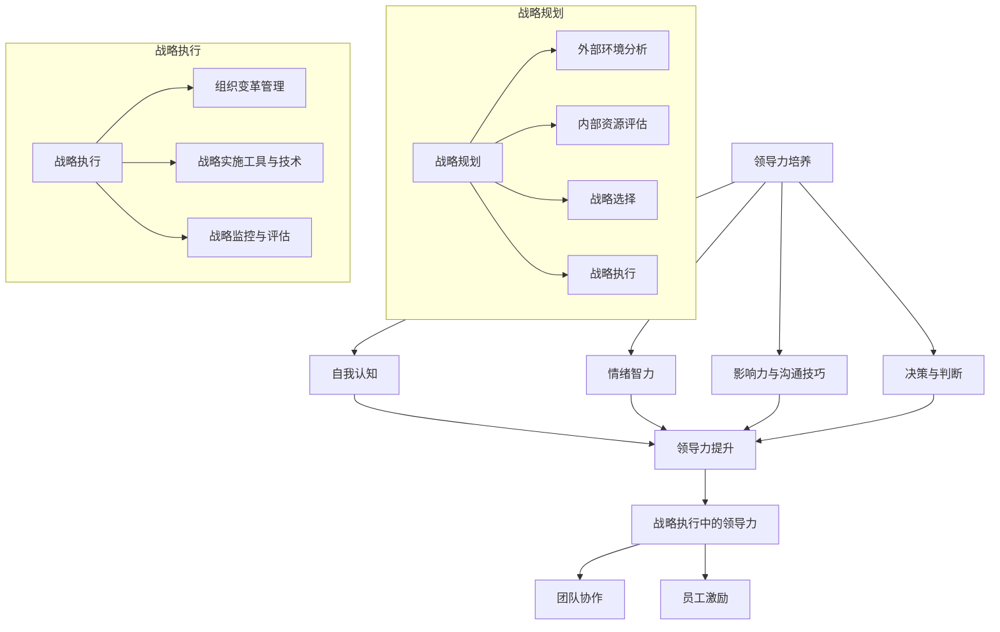

                 

### 文章标题

## 领导力与战略执行：从计划到落地的全过程

### 关键词

- 领导力
- 战略规划
- 战略执行
- 领导风格
- 团队协作
- 激励理论
- 变革管理

### 摘要

本文深入探讨了领导力与战略执行之间的关系，从领导力的定义、理论、关键要素、培养提升，到战略规划、战略执行以及领导力在战略执行中的具体作用，进行了全面的分析和阐述。通过理论讲解、案例剖析和实际应用，本文旨在为读者提供一幅完整的领导力与战略执行的蓝图，帮助领导者更好地实现组织目标。

### 目录大纲

#### 第一部分：领导力概述

1. **领导力的定义与重要性**  
   - 领导力的基本定义  
   - 领导力在组织中的作用  
   - 领导力对个人和团队的影响

2. **领导力理论**  
   - 经典领导力理论概述  
   - 领导力与领导风格的关系  
   - 权力基础与领导力

3. **领导力的关键要素**  
   - 自我认知与自我管理  
   - 情绪智力  
   - 影响力与沟通技巧  
   - 决策与判断

4. **领导力的培养与提升**  
   - 领导力发展模型  
   - 领导力培训方法  
   - 反思与实践

#### 第二部分：战略规划

5. **战略规划概述**  
   - 战略规划的定义与目的  
   - 战略规划的过程  
   - 战略规划与业务目标

6. **外部环境分析**  
   - 宏观环境分析（PEST分析）  
   - 行业环境分析（五力模型）  
   - 竞争环境分析

7. **内部资源评估**  
   - 人力资源评估  
   - 财务资源评估  
   - 物质资源评估

8. **战略选择**  
   - 成长战略  
   - 稳定战略  
   - 转型战略  
   - 战略组合与平衡

#### 第三部分：战略执行

9. **战略执行概述**  
   - 战略执行的重要性  
   - 战略执行的难点  
   - 战略执行的步骤

10. **组织变革管理**  
    - 变革管理的原则与方法  
    - 变革的领导力  
    - 变革中的沟通与协调

11. **战略实施工具与技术**  
    - 项目管理工具（如甘特图）  
    - 风险管理方法  
    - 战略地图与关键绩效指标（KPI）

12. **战略监控与评估**  
    - 战略监控的指标  
    - 战略评估的方法  
    - 战略调整与优化

#### 第四部分：战略执行中的领导力

13. **领导力在战略执行中的角色**  
    - 领导力在战略执行中的关键作用  
    - 领导者在战略执行中的职责

14. **领导力与团队协作**  
    - 团队协作的重要性  
    - 团队领导力的培养  
    - 团队冲突管理与解决

15. **领导力与员工激励**  
    - 激励理论  
    - 员工激励方法  
    - 领导力与员工满意度

#### 第五部分：实战案例

16. **战略执行成功案例**  
    - 案例介绍与分析  
    - 关键成功因素

17. **战略执行失败案例分析**  
    - 失败原因  
    - 启示与反思

#### 第六部分：总结与展望

18. **领导力与战略执行的总结**  
    - 核心观点  
    - 实践建议

19. **未来趋势与挑战**  
    - 领导力与战略执行的演变  
    - 新趋势下的挑战与机遇

### 附录

20. **参考文献**  
    - 相关书籍、论文和报告

21. **实用工具与资源**  
    - 战略规划与执行的软件工具  
    - 领导力发展资源  
    - 在线课程与培训资源

#### 附录A：领导力与战略执行 Mermaid 流程图

- 领导力发展流程图
- 战略规划与执行流程图

#### 附录B：核心算法与数学模型

- 决策树算法原理与伪代码
- 神经网络结构图与反向传播算法伪代码
- 线性规划数学模型与求解方法

#### 附录C：实战代码案例

- 实战代码实现
- 代码解读与分析

#### 附录D：数学公式与解释

- 预算优化公式与解释
- 成本效益分析公式与解释

#### 附录E：领导力量表与自我评估

- 领导力量表
- 自我评估方法与步骤

以上是《领导力与战略执行：从计划到落地的全过程》这本书的完整目录大纲。目录结构遵循了从宏观到微观，从理论到实践的逻辑顺序，旨在帮助读者全面掌握领导力与战略执行的相关知识。

---

在接下来的内容中，我们将逐一深入探讨领导力、战略规划、战略执行等关键主题，并通过实际案例和实战技巧，帮助读者更好地理解和应用这些概念。

---

#### 第一部分：领导力概述

领导力是组织中不可或缺的一部分，它关乎个体、团队和组织整体的绩效和成就。在这一部分中，我们将首先探讨领导力的定义与重要性，接着介绍领导力的基本理论，最后分析领导力的关键要素以及如何培养和提升领导力。

##### 1. 领导力的定义与重要性

**领导力的基本定义：**

领导力是指引导、激励和影响他人共同实现目标的能力。它不仅涉及个体的行为，还包括个体与团队之间的互动。领导力不仅仅存在于正式的领导职位中，也可以在非正式的组织结构中发挥作用。

**领导力在组织中的作用：**

- **方向指引：** 领导力为组织设定目标和愿景，并提供清晰的路径和方向。
- **激发潜力：** 领导力激发团队成员的潜能，鼓励他们超越自我，实现更高的绩效。
- **凝聚团队：** 领导力通过建立信任和共同的目标，将团队成员凝聚在一起，形成强大的团队力量。
- **创新驱动：** 领导力鼓励创新思维，推动组织在竞争激烈的市场中保持竞争力。

**领导力对个人和团队的影响：**

- **个人成长：** 领导力培养个体的自信心、决策能力和责任感。
- **团队协作：** 领导力促进团队成员之间的沟通与合作，提高团队的执行力。
- **组织绩效：** 领导力直接影响组织的整体绩效，通过有效的领导，组织能够更好地实现其目标。

##### 2. 领导力理论

**经典领导力理论概述：**

- **特质理论：** 特质理论认为领导者具备特定的个人特质，如智慧、自信、决心等，这些特质使他们成为领导者。
- **行为理论：** 行为理论关注领导者的行为和风格，认为领导风格对团队绩效有重要影响。
- **情境理论：** 情境理论认为领导力应适应不同的情境和环境，领导者应根据具体情况调整其行为。

**领导力与领导风格的关系：**

- **独裁式领导风格：** 独裁式领导者做出决策并控制团队的行动，适用于紧急情况或需要快速行动的场合。
- **民主式领导风格：** 民主式领导者鼓励团队成员参与决策过程，促进团队合作和开放沟通。
- **变革型领导风格：** 变革型领导者通过激励和愿景引导团队成员追求卓越，推动组织变革和创新。

**权力基础与领导力：**

- **法定权力：** 法定权力是领导者基于其职位和组织的正式授权。
- **奖励权力：** 奖励权力是领导者通过提供奖励来影响他人。
- **强制性权力：** 强制性权力是领导者通过惩罚或威胁来影响他人。
- **专家权力：** 专家权力是领导者基于其专业知识和技能而获得的权力。
- **参考权力：** 参考权力是领导者通过个人魅力和人际关系影响他人。

##### 3. 领导力的关键要素

**自我认知与自我管理：**

- **自我认知：** 领导者需要了解自己的价值观、信念、情感和动机。
- **自我管理：** 领导者需要控制自己的情绪和行为，保持专业和冷静。

**情绪智力：**

- **自我情绪觉察能力：** 领导者需要了解自己的情绪，并能够有效地管理这些情绪。
- **识别他人情绪：** 领导者需要能够识别和理解团队成员的情绪，以更好地沟通和协作。
- **运用情绪：** 领导者需要运用情绪来激励和鼓舞团队成员。

**影响力与沟通技巧：**

- **倾听技巧：** 领导者需要倾听团队成员的意见和需求，建立信任和合作关系。
- **清晰表达：** 领导者需要清晰、准确地表达自己的想法和期望，以确保团队成员理解。
- **非语言沟通：** 领导者需要运用非语言沟通，如肢体语言和面部表情，来增强沟通效果。

**决策与判断：**

- **决策能力：** 领导者需要能够在压力和不确定性下做出明智的决策。
- **判断力：** 领导者需要具备良好的判断力，以识别问题和制定解决方案。

##### 4. 领导力的培养与提升

**领导力发展模型：**

- **领导力发展模型**是一种指导领导者个人成长的框架，通常包括自我评估、角色扮演、经验学习、反馈和持续发展等环节。

**领导力培训方法：**

- **内部培训：** 组织内部的培训项目，如研讨会、工作坊和领导力发展计划。
- **外部培训：** 通过外部机构或培训机构提供的专业培训，如公开课程、在线课程和认证课程。
- **导师制度：** 通过导师指导，领导者可以从经验丰富的导师那里获得宝贵的建议和反馈。

**反思与实践：**

- **反思：** 通过反思过去的经历，领导者可以识别成功和失败的原因，并从中学习。
- **实践：** 实际应用学到的知识和技能，通过实践来提升领导力。

通过以上对领导力的定义、理论、关键要素和培养提升方法的探讨，我们为理解领导力在组织中的重要性奠定了基础。在接下来的部分，我们将深入讨论战略规划的过程，为领导者提供一套完整的战略规划指南。

---

#### 第二部分：战略规划

战略规划是组织实现长期目标和确保持续竞争力的关键过程。它不仅涉及对当前状况的分析，还包括对未来趋势的预测和应对策略。在这一部分中，我们将详细探讨战略规划的定义与目的、战略规划的过程、战略规划与业务目标之间的关系，以及如何进行外部环境和内部资源的分析。

##### 5. 战略规划概述

**战略规划的定义与目的：**

战略规划是指组织为了实现其长期目标和愿景，而制定的一系列具体行动和策略。其目的是明确组织的方向、优化资源配置、应对市场变化和竞争压力，从而实现可持续的发展。

- **明确组织目标：** 战略规划帮助组织明确长期和短期目标，确保团队朝着共同的方向努力。
- **优化资源配置：** 战略规划通过合理配置资源，最大化利用组织的优势，提高运营效率。
- **应对变化：** 战略规划使组织能够适应外部环境的变化，抓住市场机遇，避免潜在的风险。
- **提高竞争力：** 战略规划帮助组织在激烈的市场竞争中脱颖而出，保持竞争优势。

**战略规划的过程：**

战略规划的过程通常包括以下几个阶段：

1. **明确愿景和使命：** 确定组织的长远目标和核心价值观。
2. **现状分析：** 对组织的当前运营状况进行评估，包括市场地位、财务状况、竞争优势等。
3. **环境分析：** 分析外部环境和行业趋势，了解市场机遇和挑战。
4. **资源评估：** 评估组织的内部资源，包括人力资源、财务资源和物质资源。
5. **目标设定：** 基于现状分析和环境分析，设定具体的战略目标和绩效指标。
6. **策略制定：** 制定实现目标的策略和行动计划。
7. **执行和监控：** 实施战略计划，并通过定期评估和调整确保目标的实现。

**战略规划与业务目标的关系：**

战略规划与业务目标密切相关，二者相辅相成。业务目标是战略规划的具体体现，而战略规划则是实现业务目标的指南。战略规划通过设定明确的目标和策略，为业务目标的实现提供方向和支持。

- **一致性：** 战略规划应确保组织的所有活动和决策都与业务目标保持一致。
- **灵活性：** 战略规划应具备灵活性，以适应市场变化和业务发展的需求。
- **持续性：** 战略规划应具有长期视角，确保组织能够持续发展和保持竞争优势。

##### 6. 外部环境分析

**宏观环境分析（PEST分析）：**

宏观环境分析是战略规划过程中对组织外部环境的全面评估，包括政治（Political）、经济（Economic）、社会（Sociological）和技术（Technological）四个方面。

- **政治因素：** 包括政府政策、政治稳定性、法律法规等。
- **经济因素：** 包括经济增长、通货膨胀率、失业率、市场需求等。
- **社会因素：** 包括人口结构、文化价值观、生活方式变化等。
- **技术因素：** 包括技术创新、技术发展趋势、技术成熟度等。

**行业环境分析（五力模型）：**

行业环境分析是战略规划中评估组织所在行业竞争状况的重要工具，由迈克尔·波特提出，包括以下五个要素：

- **供应商力量：** 供应商的谈判能力和市场地位。
- **买家力量：** 买家的议价能力和市场地位。
- **替代品威胁：** 替代品的数量和吸引力。
- **新进入者威胁：** 新进入者可能带来的竞争压力。
- **现有竞争者：** 竞争对手的市场策略和行为。

**竞争环境分析：**

竞争环境分析旨在评估组织在市场中的竞争地位和竞争策略。这包括：

- **竞争对手分析：** 评估竞争对手的市场份额、产品、策略和优势。
- **市场份额：** 评估组织在市场中的地位和市场份额。
- **市场定位：** 确定组织的市场定位和目标客户群体。

通过对外部环境的深入分析，组织可以更好地理解市场趋势和竞争状况，从而制定出更有针对性的战略规划。

##### 7. 内部资源评估

**人力资源评估：**

人力资源评估是战略规划过程中对组织人力资源的全面评估，包括员工技能、经验、潜力以及团队协作能力。

- **员工技能：** 评估员工的技能水平和专业能力，确保组织具备实现战略目标所需的能力。
- **员工经验：** 评估员工的工作经验，利用经验和知识优势推动组织的战略实施。
- **员工潜力：** 发现和培养具有潜力的员工，为组织未来的发展储备人才。
- **团队协作：** 评估团队协作效率和团队氛围，确保团队成员能够协同工作，实现组织目标。

**财务资源评估：**

财务资源评估是战略规划中对组织财务状况的评估，包括财务状况、资金流动性和盈利能力。

- **财务状况：** 评估组织的财务健康，包括资产、负债和所有者权益。
- **资金流动性：** 评估组织的资金流动性，确保组织能够应对日常运营和紧急情况。
- **盈利能力：** 评估组织的盈利能力，确保组织能够实现预期的财务目标。

**物质资源评估：**

物质资源评估是战略规划中对组织物质资源的评估，包括设备、设施和物料。

- **设备：** 评估组织的设备状况和维护情况，确保设备能够满足战略实施的需要。
- **设施：** 评估组织的办公设施和工厂设施，确保设施能够支持组织的运营。
- **物料：** 评估组织的物料供应和库存管理，确保物料能够及时满足生产和服务需求。

通过对外部环境和内部资源的全面评估，组织可以更好地了解自身的优势和劣势，制定出符合实际的战略规划。在接下来的部分，我们将深入探讨战略选择，帮助领导者确定适合组织的成长战略、稳定战略和转型战略。

---

##### 8. 战略选择

在战略规划的过程中，战略选择是至关重要的一环。根据组织的愿景、目标以及外部环境和内部资源，领导者需要选择合适的战略以实现组织的长期发展。本节将介绍成长战略、稳定战略和转型战略，并讨论如何进行战略组合与平衡。

**成长战略**

成长战略是指组织通过扩大市场份额、增加产品线、进入新市场或开发新产品来提升其规模和影响力的战略。以下是几种常见的成长战略：

- **市场渗透：** 通过增加市场份额来提升销售量，例如通过市场营销、价格策略和客户服务改进来吸引更多现有客户。
- **市场开发：** 通过进入新的市场来扩大销售范围，例如将产品推广到新的地理区域或针对新的客户群体。
- **产品开发：** 通过开发新产品或改进现有产品来满足市场需求，提高竞争力。
- **多元化战略：** 通过进入与现有业务不同的市场或行业来分散风险和增加收入来源。

**稳定战略**

稳定战略是指组织维持现有市场份额和运营模式，以保持稳定发展的战略。这种战略适用于市场环境稳定且组织竞争优势明显的情况。以下是几种常见的稳定战略：

- **市场维持：** 通过保持现有市场份额，确保收入稳定增长。
- **产品优化：** 通过改进现有产品或服务来保持市场竞争力。
- **效率提升：** 通过优化运营流程和提高生产效率来降低成本，提升盈利能力。
- **成本领先：** 通过降低成本来获得价格竞争优势，吸引价格敏感的客户。

**转型战略**

转型战略是指组织在面临重大变化或危机时，通过调整其业务模式和市场定位来应对挑战的战略。这种战略通常需要组织进行深刻的变革和调整。以下是几种常见的转型战略：

- **收缩战略：** 通过缩减业务规模或退出某些市场来降低成本和风险，专注于核心业务。
- **重组战略：** 通过调整组织结构和流程来提高效率和灵活性，适应市场变化。
- **创新战略：** 通过引入新技术、新产品或新服务来开拓新的市场机会，推动组织转型。
- **合并与收购：** 通过与其他公司合并或收购来获得新的资源和市场，加速转型过程。

**战略组合与平衡**

在实际操作中，组织通常需要将多种战略组合使用，以达到平衡发展。以下是一些战略组合与平衡的方法：

- **多元化组合：** 通过多元化产品、市场和业务领域来分散风险，同时保持核心业务的优势。
- **灵活组合：** 根据市场环境和内部资源的变化，灵活调整战略组合，确保组织能够迅速应对市场变化。
- **协同组合：** 通过不同战略之间的协同效应，提高整体运营效率和竞争力。
- **持续优化：** 通过不断评估和调整战略，确保战略组合与组织的长期发展目标保持一致。

**选择适合的战略**

选择适合的战略需要考虑以下几个关键因素：

- **组织目标：** 确保所选战略与组织的长期目标一致，推动组织实现愿景。
- **市场环境：** 分析外部环境，了解市场趋势和竞争状况，选择能够应对市场变化的战略。
- **内部资源：** 评估组织的内部资源，包括人力资源、财务资源和物质资源，选择能够充分利用这些资源的战略。
- **管理能力：** 考虑组织的管理能力，选择适合组织管理水平的战略，确保战略能够有效执行。

通过综合考虑以上因素，领导者可以更好地选择适合组织的战略，推动组织的长期发展和成功。

在下一部分，我们将深入探讨战略执行的过程，包括战略执行的重要性、难点和具体步骤，帮助领导者确保战略规划的有效落地。

---

#### 第三部分：战略执行

战略执行是战略规划的关键环节，它将战略目标和策略转化为实际行动，确保组织能够实现其长期目标。在这一部分中，我们将详细讨论战略执行的重要性、难点以及战略执行的步骤，并提供一些有效的战略实施工具和技术。

##### 9. 战略执行概述

**战略执行的重要性：**

战略执行是战略规划的生命线，没有有效的执行，再好的战略也难以实现。战略执行的重要性体现在以下几个方面：

- **确保目标实现：** 战略执行将组织的愿景和目标转化为具体的行动计划，确保组织能够朝着既定目标前进。
- **资源优化：** 通过有效的执行，组织可以合理配置资源，最大化利用人力资源、财务资源和物质资源。
- **持续改进：** 战略执行过程中，组织可以通过反馈和评估不断优化战略，确保其适应外部环境的变化。
- **提高竞争力：** 通过战略执行，组织可以不断提升其运营效率和市场竞争力，从而在激烈的市场环境中脱颖而出。

**战略执行的难点：**

战略执行并非一帆风顺，领导者常常面临以下难点：

- **组织变革：** 战略执行往往需要组织进行重大变革，包括流程重组、组织结构调整等，这可能引起员工的抵触和不满。
- **资源分配：** 资源的有限性使得领导者需要在多个优先事项之间进行权衡，确保资源能够有效支持战略实施。
- **沟通与协作：** 战略执行需要各个部门和团队成员之间的密切合作，沟通不畅和协作不足可能导致执行效率低下。
- **执行力不足：** 即使有明确的战略和计划，如果没有足够的执行力，战略执行也会大打折扣。

**战略执行的步骤：**

有效的战略执行需要遵循一系列明确的步骤，以下是战略执行的典型步骤：

1. **明确战略目标和关键绩效指标（KPI）：** 将战略目标细化为具体、可衡量的指标，确保每个目标和指标都能够被清晰理解和追踪。

2. **制定具体的行动计划：** 根据战略目标和KPI，制定具体的行动计划，明确每个行动的负责人、时间表和资源需求。

3. **资源分配与优先级排序：** 根据行动计划，合理分配资源，并确定优先级，确保关键任务和活动能够得到足够的资源支持。

4. **沟通与协调：** 与所有相关利益相关者进行有效沟通，确保他们对行动计划和执行进度有清晰的理解，并协调不同部门和团队之间的合作。

5. **实施与监控：** 按照行动计划执行战略，同时建立监控和评估机制，实时跟踪执行进度和关键绩效指标，确保战略能够按计划进行。

6. **反馈与调整：** 定期收集反馈，评估执行效果，根据实际情况进行调整，确保战略能够适应外部环境的变化。

##### 10. 组织变革管理

组织变革管理是战略执行过程中的关键环节，它涉及到对组织结构、流程和文化等方面的变革。以下是一些变革管理的原则和方法：

**变革管理的原则：**

- **领导力：** 领导者在变革过程中起着关键作用，他们需要明确变革的目标和愿景，并激励团队成员积极参与。
- **沟通：** 保持与员工的持续沟通，解释变革的原因和目标，解答他们的疑问，增强员工的参与感和认同感。
- **参与：** 鼓励员工参与变革过程，通过咨询和反馈收集员工的意见和建议，提高变革的接受度和执行效率。
- **持续改进：** 变革是一个持续的过程，需要不断评估和调整，确保变革能够长期持续并产生实际效果。

**变革管理的方法：**

- **变革规划：** 制定详细的变革计划，包括变革的目标、时间表、资源需求和关键里程碑。
- **组织结构调整：** 根据战略需要，调整组织结构，优化部门和岗位设置，提高组织的灵活性和响应速度。
- **流程重组：** 优化和简化流程，消除冗余和浪费，提高运营效率和客户满意度。
- **文化变革：** 通过培训和文化建设，推动员工价值观和行为方式的转变，确保变革能够深入人心。

##### 11. 战略实施工具与技术

在战略执行过程中，使用适当的工具和技术可以帮助领导者更有效地管理项目和资源，确保战略目标能够按时、按质实现。以下是一些常用的战略实施工具和技术：

**项目管理工具：**

- **甘特图：** 用于可视化项目进度和任务分配，帮助团队成员了解项目的整体进度和关键节点。
- **敏捷开发：** 通过短周期迭代和持续交付，提高开发效率和客户满意度。
- **关键路径法（CPM）：** 用于识别项目中关键的任务和时间节点，确保项目能够按计划完成。

**风险管理方法：**

- **风险矩阵：** 用于评估风险的可能性和影响，制定相应的风险应对策略。
- **风险管理计划：** 制定详细的风险管理计划，包括风险识别、评估、应对和监控。
- **决策树：** 用于在复杂决策过程中，通过分析不同选择的结果和概率，选择最佳方案。

**战略地图与关键绩效指标（KPI）：**

- **战略地图：** 用于可视化组织的战略目标和关键绩效指标，帮助领导者明确战略方向和资源配置。
- **关键绩效指标（KPI）：** 用于衡量战略执行效果，包括财务指标、客户指标、内部流程指标和学习与成长指标。

通过使用这些工具和技术，领导者可以更好地管理战略执行过程，确保战略目标能够得到有效实施。

在下一部分，我们将深入探讨战略监控与评估，帮助领导者确保战略执行的有效性和持续性。

---

#### 第四部分：战略监控与评估

战略监控与评估是确保战略执行有效性和持续性的关键环节。通过定期的监控与评估，领导者可以及时了解战略执行的进展和效果，发现潜在的问题并采取相应的措施进行优化。以下，我们将详细讨论战略监控的指标、评估的方法，以及战略调整与优化的步骤。

##### 12. 战略监控

**战略监控的指标：**

战略监控的指标应涵盖财务、客户、内部流程和学习与成长四个方面，这些指标能够全面反映组织的战略执行效果。以下是几个关键的战略监控指标：

- **财务指标：** 包括收入、利润、成本、资产回报率（ROA）和股东权益回报率（ROE）等。这些指标有助于评估组织的盈利能力和财务健康状况。
- **客户指标：** 包括客户满意度、客户保留率、市场份额和客户获取成本等。这些指标反映了组织在市场中的竞争地位和客户关系质量。
- **内部流程指标：** 包括生产效率、运营成本、供应链管理效率和员工满意度等。这些指标评估组织的内部运营效率和流程优化效果。
- **学习与成长指标：** 包括员工培训次数、员工流失率、创新能力指数和知识管理效果等。这些指标反映了组织的持续学习和改进能力。

**监控方法：**

战略监控的方法包括定期报告、现场检查、关键绩效指标（KPI）跟踪和实时数据监测等。以下是几种常见的监控方法：

- **定期报告：** 通过定期提交的财务报告、业务报告和战略执行报告，领导者可以了解组织的整体执行情况。
- **现场检查：** 通过实地考察和现场调研，领导者可以了解组织运营的具体情况和问题。
- **KPI跟踪：** 通过建立KPI跟踪系统，实时监控关键绩效指标的变动情况，及时发现潜在的问题。
- **实时数据监测：** 通过数据分析和大数据技术，实时监控组织的业务数据，及时发现异常和趋势变化。

**监控工具：**

为了有效实施战略监控，领导者可以利用以下工具：

- **企业资源规划（ERP）系统：** 用于整合和管理组织的财务、人力资源和供应链等关键业务数据。
- **业务智能（BI）工具：** 用于数据分析和报告生成，帮助领导者快速了解业务状况。
- **项目管理工具：** 用于监控项目进度和资源分配，确保项目按计划执行。

##### 13. 战略评估

**评估方法：**

战略评估是通过对战略执行效果的全面分析，评估组织是否实现了既定的目标。以下是几种常见的战略评估方法：

- **绩效对比：** 通过将实际绩效与预期目标进行比较，评估战略执行的效果。
- **基准分析：** 通过与行业最佳实践或竞争对手进行对比，识别组织的优势和不足。
- **SWOT分析：** 通过分析组织的优势、劣势、机会和威胁，评估战略的适应性和有效性。
- **成本效益分析：** 通过计算战略实施的总成本与预期收益，评估战略的经济合理性。

**评估步骤：**

战略评估通常包括以下步骤：

1. **确定评估目标：** 明确评估的目的和范围，确保评估能够提供有价值的洞察。
2. **收集数据：** 通过调查、访谈、报告和数据收集等方式，获取与战略执行相关的信息。
3. **分析数据：** 使用数据分析工具和方法，对收集到的数据进行详细分析，识别关键问题和趋势。
4. **编写评估报告：** 将评估结果整理成报告，包括发现的问题、分析的原因和改进的建议。
5. **反馈与讨论：** 将评估报告提交给相关利益相关者，进行讨论和反馈，确保评估结果的准确性和可操作性。

**评估工具：**

为了提高战略评估的效率和准确性，领导者可以借助以下工具：

- **平衡计分卡：** 用于全面评估组织的绩效，包括财务、客户、内部流程和学习与成长四个方面。
- **战略地图：** 用于可视化组织的战略目标和关键绩效指标，帮助领导者明确评估的重点。
- **SWOT分析模板：** 用于快速开展SWOT分析，帮助领导者全面评估组织的战略适应性和竞争优势。

##### 14. 战略调整与优化

**调整步骤：**

在战略评估的基础上，领导者需要根据评估结果对战略进行调整和优化，以确保组织能够持续实现其目标。以下是战略调整的步骤：

1. **识别问题：** 通过评估发现的问题，明确需要调整的具体方面。
2. **分析原因：** 分析导致问题的原因，确定是战略本身的问题还是执行过程中的问题。
3. **制定改进计划：** 根据问题分析和评估结果，制定具体的改进计划，包括改进措施、责任人和时间表。
4. **实施改进计划：** 按照改进计划执行调整措施，确保改进能够得到有效实施。
5. **监控与评估：** 对改进计划的实施效果进行监控和评估，确保问题得到有效解决。

**优化方法：**

战略优化的方法包括以下几种：

- **持续改进：** 通过持续监控和评估，不断发现和解决问题，提高战略的执行效果。
- **创新驱动：** 鼓励创新思维，推动组织在战略实施过程中进行持续的改进和优化。
- **协同合作：** 通过加强各部门和团队之间的协同合作，提高整体战略执行效率。
- **战略调整：** 根据外部环境的变化，及时调整战略目标和策略，确保组织能够适应新的市场环境。

通过有效的战略监控与评估，领导者可以确保战略执行的有效性和持续性，及时发现和解决问题，不断优化和调整战略，推动组织实现长期目标。在下一部分，我们将探讨战略执行中的领导力，分析领导力在战略执行中的关键作用和领导者在战略执行中的具体职责。

---

#### 第四部分：战略执行中的领导力

在战略执行过程中，领导力起着至关重要的作用。有效的领导力不仅能够推动战略的顺利实施，还能够激发团队成员的潜力，提升整体执行力。以下，我们将深入探讨领导力在战略执行中的关键作用，以及领导者在战略执行中的职责。

##### 15. 领导力在战略执行中的关键作用

**方向指引：**

领导力为战略执行提供了明确的方向和愿景。领导者通过设定清晰的目标和战略规划，为团队成员指明前进的道路，确保他们朝着共同的目标努力。一个有远见的领导者能够预见市场趋势和变化，提前制定应对策略，从而在战略执行中保持领先地位。

**激发潜能：**

领导力能够激发团队成员的潜能，推动他们超越自我，实现更高的绩效。通过激励和鼓舞，领导者能够激发团队成员的工作热情和积极性，使其在面临挑战时保持乐观和自信。有效的领导力还能够帮助团队成员识别和克服障碍，提升团队的整体执行力。

**沟通协调：**

领导力在战略执行中发挥着沟通协调的关键作用。领导者需要与团队成员保持密切沟通，确保他们对战略目标和行动计划有清晰的理解。通过有效的沟通，领导者可以及时传递重要信息，解决团队成员的疑问和困惑，增强团队的凝聚力和协作精神。

**决策能力：**

领导力是决策能力的基础。在战略执行过程中，领导者需要做出一系列重要决策，包括资源分配、任务分配和问题解决等。有效的决策能力能够帮助领导者迅速做出正确决策，避免因犹豫不决而错失机会或造成不必要的损失。

**变革推动：**

领导力在组织变革中发挥着重要作用。战略执行往往需要组织进行重大变革，包括流程重组、组织结构调整和文化转型等。领导者需要具备推动变革的能力，通过激励和引导，使团队成员积极适应变革，克服变革中的阻力和挑战。

##### 16. 领导者在战略执行中的职责

**明确目标与愿景：**

领导者需要明确组织的战略目标和愿景，并将其传达给团队成员。通过明确的目标和愿景，领导者可以激发团队成员的积极性和责任感，使其在战略执行中保持方向一致，共同努力。

**制定行动计划：**

领导者需要制定具体的行动计划，确保战略能够得到有效实施。这包括确定关键任务、分配资源和设定时间表等。通过详细的行动计划，领导者可以确保每个团队成员都清楚自己的职责和任务，从而提高整体执行力。

**激励与鼓舞：**

领导者需要通过激励和鼓舞，激发团队成员的工作热情和积极性。这可以通过奖励、认可和团队建设活动来实现。一个有激励力的领导者能够使团队成员在面临困难和挑战时保持乐观和自信，从而提高团队的整体绩效。

**沟通与协调：**

领导者需要与团队成员保持密切沟通，确保他们对战略目标和行动计划有清晰的理解。通过有效的沟通，领导者可以及时传递重要信息，解决团队成员的疑问和困惑，增强团队的凝聚力和协作精神。

**解决问题与决策：**

在战略执行过程中，领导者需要能够迅速解决问题和做出决策。这包括识别问题、分析原因、制定解决方案和分配资源等。有效的决策能力能够帮助领导者迅速做出正确决策，避免因犹豫不决而错失机会或造成不必要的损失。

**推动变革：**

领导者需要具备推动变革的能力，使组织能够适应外部环境的变化和内部发展的需求。通过激励和引导，领导者可以促使团队成员积极适应变革，克服变革中的阻力和挑战，从而实现组织的持续发展和进步。

通过以上职责的履行，领导者在战略执行中发挥着关键作用，推动组织实现其战略目标和长期发展。

在下一部分，我们将探讨领导力与团队协作的关系，分析团队协作的重要性，以及如何培养和提升团队领导力，帮助团队在战略执行中取得成功。

---

#### 第五部分：领导力与团队协作

在战略执行过程中，团队协作至关重要。有效的团队协作能够提升组织的执行力和创新能力，实现共同目标。以下，我们将深入探讨团队协作的重要性，分析如何培养和提升团队领导力，以及团队冲突的管理与解决方法。

##### 17. 团队协作的重要性

**提升执行力：**

团队协作能够增强团队的执行力，使团队成员在面对复杂任务时能够协同工作，提高工作效率。通过明确的分工和紧密的协作，团队可以迅速响应市场变化和客户需求，确保战略目标得到有效实现。

**激发创新能力：**

团队协作能够激发团队成员的创新能力，通过集体智慧和多元化的视角，发现新的解决方案和业务机会。团队成员在协作过程中可以相互学习、分享经验，从而提升整体创新能力和竞争力。

**提高团队绩效：**

有效的团队协作能够提升团队的整体绩效，使每个成员都能够充分发挥自己的优势，共同实现团队目标。团队协作有助于消除个人主义和部门壁垒，推动资源的最优配置，提高组织的整体效率和成果。

**增强团队凝聚力：**

团队协作能够增强团队的凝聚力，通过共同的目标和任务，团队成员之间的信任和认同感得到加强。这种凝聚力有助于形成积极的团队氛围，提升团队士气和工作满意度，从而提高团队的稳定性和长期发展。

##### 18. 如何培养和提升团队领导力

**建立共同目标：**

领导者需要与团队成员共同确立团队目标，确保每个成员都清楚自己的职责和期望。通过明确的目标，团队成员可以更好地协作，共同为实现目标而努力。

**培养信任与尊重：**

信任是团队协作的基础。领导者需要通过建立透明、开放的管理风格，赢得团队成员的信任和尊重。尊重团队成员的意见和贡献，鼓励他们积极参与决策过程，增强团队的凝聚力。

**提供反馈与支持：**

领导者需要为团队成员提供及时的反馈和支持，帮助他们改进工作方法和提升绩效。通过积极的反馈，领导者可以激励团队成员不断进步，提升团队的整体水平。

**培养协作能力：**

领导者需要培养团队成员的协作能力，通过培训和实践，提高团队成员的沟通技巧、团队意识和协作效率。通过定期的团队活动和协作项目，增强团队成员之间的默契和配合。

**激励与认可：**

领导者需要通过激励和认可，激发团队成员的工作热情和积极性。奖励优秀表现，表彰团队成就，可以增强团队成员的归属感和荣誉感，提高团队的整体绩效。

##### 19. 团队冲突的管理与解决

**冲突管理的原则：**

- **公正与客观：** 公正地处理冲突，避免偏袒任何一方，确保冲突解决过程的透明和公正。
- **倾听与理解：** 倾听冲突双方的诉求和意见，理解他们的立场和感受，找到冲突的根源。
- **有效沟通：** 通过有效的沟通，确保双方能够充分表达自己的想法和需求，促进理解和和解。
- **合作与共赢：** 通过合作和协商，寻找双方都能接受的解决方案，实现共赢。

**解决冲突的方法：**

- **直接解决：** 当冲突双方能够直接对话并找到共识时，可以直接解决问题，避免冲突升级。
- **调解与仲裁：** 当冲突无法直接解决时，可以寻求第三方调解或仲裁，以中立的角度提出解决方案。
- **共识决策：** 通过集体讨论和共识决策，确保解决方案得到所有相关方的认同，减少未来的冲突风险。

**冲突管理工具：**

- **冲突分析工具：** 如SWOT分析、鱼骨图等，帮助领导者分析冲突的根源和影响因素。
- **团队建设活动：** 通过团队建设活动，增强团队成员之间的信任和理解，减少冲突发生的可能性。
- **沟通技巧培训：** 通过沟通技巧培训，提高团队成员的沟通能力和协作效率，促进冲突的预防与解决。

通过有效的团队协作和冲突管理，领导者可以确保团队在战略执行过程中保持高效、稳定和和谐。在下一部分，我们将通过实际案例，探讨战略执行成功和失败的原因，以及从中得到的启示和反思。

---

#### 第五部分：实战案例

在战略执行的实践中，成功与失败都是宝贵的学习资源。以下，我们将通过两个案例——一个成功的战略执行案例和一个失败的案例，分析其成功和失败的原因，并总结从中得到的启示和反思。

##### 16. 战略执行成功案例

**案例介绍：**

某知名科技公司A公司决定进入智能家居市场，推出了一系列智能设备和解决方案。通过深入市场调研，A公司确定了以用户体验为核心的战略，并与多家知名制造商合作，开发出高品质的智能家居产品。此外，A公司还投入大量资源进行市场营销和品牌推广，通过线上线下的渠道推广产品。

**成功原因分析：**

1. **明确战略目标：** A公司明确了进入智能家居市场的战略目标，并围绕这一目标制定了详细的行动计划。
2. **市场调研：** 深入的市场调研帮助A公司了解了市场需求和竞争状况，为其战略决策提供了可靠依据。
3. **合作与资源整合：** A公司通过与知名制造商的合作，整合了优质的生产资源和制造能力，提高了产品的竞争力。
4. **用户导向：** A公司坚持以用户体验为核心，不断优化产品功能和用户体验，赢得了用户的认可和忠诚。
5. **市场推广：** 大量的市场推广和品牌建设投入，提高了A公司在智能家居市场的知名度和品牌影响力。

**关键成功因素：**

- **明确的战略目标：** 战略目标清晰，使全体团队成员都明白自己的职责和方向。
- **市场调研和用户导向：** 深入的市场调研和以用户需求为导向的产品开发，使产品更具市场竞争力。
- **合作与资源整合：** 合作与资源整合提高了生产效率和产品质量，增强了市场竞争力。
- **有效的市场推广：** 强有力的市场推广和品牌建设，提高了市场认知度和用户忠诚度。

##### 17. 战略执行失败案例分析

**案例介绍：**

某传统制造企业B公司决定进入高科技产业，投资开发了一款智能机器人。然而，由于缺乏相关技术经验和市场调研，B公司的智能机器人项目在研发和市场上遭遇了一系列问题，最终导致项目失败。

**失败原因分析：**

1. **技术不成熟：** B公司在智能机器人技术方面的积累不足，导致研发过程中面临诸多技术难题。
2. **市场调研不足：** B公司在进入高科技产业前，没有进行充分的市场调研，对市场需求和竞争状况了解不足。
3. **资源分配不合理：** B公司在研发和市场推广上投入了大量资源，但未能合理分配，导致资源浪费和效率低下。
4. **团队协作不足：** 缺乏跨部门协作，导致研发和市场推广过程中出现沟通不畅和协作不足的问题。
5. **战略调整不及时：** 在遇到问题时，B公司未能及时调整战略，导致项目最终失败。

**失败原因总结：**

- **技术不成熟和市场调研不足：** 技术积累和市场调研不足是导致项目失败的主要原因。
- **资源分配不合理和团队协作不足：** 资源分配不合理和团队协作不足影响了项目的推进和效果。
- **战略调整不及时：** 战略调整不及时使B公司未能及时应对问题，导致项目失败。

**启示与反思：**

- **充分的市场调研和技术积累：** 在进入新领域前，必须进行充分的市场调研和技术积累，确保战略有充分的依据。
- **合理分配资源：** 合理分配资源，确保关键任务和活动得到充分支持。
- **加强团队协作：** 加强跨部门协作，确保项目推进过程中沟通顺畅和协作高效。
- **及时调整战略：** 在项目推进过程中，要密切关注市场变化和技术进展，及时调整战略以应对问题。

通过以上成功和失败的案例分析，我们得到了许多宝贵的启示和反思，这将为我们在未来的战略执行中提供重要的指导。

在下一部分，我们将总结领导力与战略执行的核心观点，并提出实践建议，帮助领导者更好地应对战略执行中的挑战。

---

#### 第六部分：总结与展望

通过本篇文章的深入探讨，我们全面分析了领导力与战略执行之间的关系，从领导力的定义、理论、关键要素，到战略规划、战略执行以及领导力在战略执行中的关键作用，我们为读者提供了一幅完整的领导力与战略执行的蓝图。

**核心观点：**

1. **领导力是战略执行的核心驱动力**：领导力在组织目标实现过程中起着至关重要的作用，它能够指引方向、激发潜能、促进协作和推动变革。
2. **战略规划是战略执行的基础**：有效的战略规划为组织的长期发展提供了明确的路径和策略，通过对外部环境和内部资源的深入分析，组织能够制定出符合实际的战略目标。
3. **战略执行需要系统的步骤和方法**：战略执行是一个复杂的过程，需要明确的行动计划、资源分配、沟通协调和监控评估，通过科学的实施工具和技术，确保战略目标的实现。
4. **领导力与团队协作密不可分**：团队协作是战略执行的重要保障，通过有效的领导力培养和提升团队领导力，组织能够更好地应对挑战和实现目标。

**实践建议：**

1. **加强领导力培养**：领导者应不断学习和提升自己的领导力，通过自我认知、情绪智力、影响力与沟通技巧等方面的培养，提高自身的领导能力。
2. **制定明确的战略规划**：组织应根据外部环境和内部资源，制定详细的战略规划，确保战略目标的具体化和可执行性。
3. **优化战略执行过程**：在战略执行过程中，领导者应关注资源分配、团队协作和监控评估，确保战略目标的顺利实现。
4. **持续反思与改进**：领导者应定期对战略执行过程进行反思和评估，发现问题和不足，及时进行调整和改进，确保组织的持续发展。

**未来趋势与挑战：**

随着技术的不断进步和市场环境的变化，领导力与战略执行将面临新的挑战和机遇。以下是一些未来趋势和挑战：

1. **数字化领导力**：数字化时代要求领导者具备数字化思维和技能，能够应对数字化变革带来的挑战。
2. **全球领导力**：全球化趋势要求领导者具备跨文化的领导能力和全球视野，能够有效管理跨国团队和业务。
3. **可持续发展领导力**：可持续发展成为全球关注的焦点，领导者需要具备可持续发展的理念和实践能力，推动组织的绿色转型。
4. **敏捷领导力**：在快速变化的市场环境中，领导者需要具备敏捷的领导能力，能够快速响应变化，灵活调整战略。

在未来的领导力和战略执行实践中，领导者需要不断适应新的变化和挑战，持续提升自身的领导力和战略执行力，推动组织实现长期目标。

---

通过本文的详细分析和实践建议，我们希望能够为读者提供有价值的指导，帮助他们在领导力和战略执行的道路上不断前进，实现组织的卓越发展。

---

### 附录

#### 20. 参考文献

1. **彼得·德鲁克 (Peter Drucker)**，《管理实践》(The Practice of Management)
2. **约翰·肯尼斯·加尔布雷斯 (John Kenneth Galbraith)**，《权力基础与领导力》(Power and Society)
3. **斯蒂芬·罗宾斯 (Stephen Robbins)**，《组织行为学》(Organizational Behavior)
4. **迈克尔·波特 (Michael Porter)**，《竞争战略》(Competitive Strategy)
5. **彼得·圣吉 (Peter Senge)**，《第五项修炼》(The Fifth Discipline)

#### 21. 实用工具与资源

1. **战略规划工具**：
   - **MindManager**：用于构建战略思维导图。
   - **Strategizer**：提供战略规划模板和工具。

2. **领导力发展资源**：
   - **LinkedIn Learning**：提供领导力发展课程和资源。
   - **Harvard Business Review**：发布领导力相关的研究和文章。

3. **在线课程与培训资源**：
   - **Coursera**：提供领导力相关的在线课程。
   - **edX**：提供由顶尖大学提供的领导力课程。

#### 附录A：领导力与战略执行 Mermaid 流程图



#### 附录B：核心算法与数学模型

##### 决策树算法原理与伪代码

**决策树算法原理：**

决策树是一种常用的机器学习算法，通过树形结构对数据进行分类或回归。每个节点代表一个特征，每个分支代表该特征的一个取值，叶节点代表最终预测结果。

**伪代码：**

```pseudocode
决策树算法输入：数据集D，特征集F
输出：决策树T

1. 如果数据集D纯度足够高（例如，所有样本属于同一类别）
    1. 返回叶节点，类别为D中多数样本的类别
2. 否则
    1. 选择最佳特征A
        1. 对于每个特征A，计算信息增益或基尼不纯度
    2. 创建节点N，特征为A
    3. 对于A的每个取值，将数据集D划分为子集D1, D2, ..., Dk
        1. 对于每个子集Di，递归调用决策树算法
    4. 返回节点N，子节点为决策树T1, T2, ..., Tk
```

##### 神经网络结构图与反向传播算法伪代码

**神经网络结构图：**

神经网络由多个神经元层组成，包括输入层、隐藏层和输出层。每个神经元都与前一层的神经元相连接，并通过权重和偏置进行加权求和和激活函数处理。

**反向传播算法伪代码：**

```pseudocode
神经网络训练输入：训练数据集D，隐藏层神经元数H，输出层神经元数O，学习率α
输出：调整后的权重和偏置

1. 初始化权重和偏置
2. 对于每个训练样本（x, y）：
    1. 前向传播计算输出O和误差E
    2. 反向传播计算梯度Δw和Δb
    3. 更新权重和偏置
3. 返回调整后的权重和偏置
```

##### 线性规划数学模型与求解方法

**线性规划数学模型：**

假设我们有m个变量x1, x2, ..., xm，目标函数为maximize或minimize cx，其中c是m维系数向量，同时需要满足以下约束条件：

$$
\begin{cases}
    a_{11}x_1 + a_{12}x_2 + ... + a_{1m}x_m \leq b_1 \\
    a_{21}x_1 + a_{22}x_2 + ... + a_{2m}x_m \leq b_2 \\
    ... \\
    a_{n1}x_1 + a_{n2}x_2 + ... + a_{nm}x_m \leq b_n \\
    x_1, x_2, ..., x_m \geq 0
\end{cases}
$$

**求解方法：**

- **单纯形法**：通过迭代调整变量值，逐步找到最优解。
- **内点法**：在可行域内部进行迭代，逐步逼近最优解。

**数学模型与求解方法示例：**

$$
\begin{cases}
    \text{maximize} \ 3x_1 + 2x_2 \\
    x_1 + 2x_2 \leq 4 \\
    2x_1 + x_2 \leq 6 \\
    x_1, x_2 \geq 0
\end{cases}
$$

使用单纯形法求解上述线性规划问题，可以得到最优解为x1=2, x2=1，目标函数的最大值为9。

---

#### 附录C：实战代码案例

##### 代码实现

以下是一个简单的线性规划问题的Python代码实现，使用`scipy.optimize`库进行求解。

```python
from scipy.optimize import linprog

# 目标函数系数
c = [-3, -2]

# 约束条件系数
A = [[1, 2], [2, 1]]

# 约束条件右侧值
b = [4, 6]

# 非负约束
x0 = (0, 0)

# 求解线性规划问题
result = linprog(c, A_ub=A, b_ub=b, x0=x0)

# 输出最优解和目标函数值
print("最优解:", result.x)
print("目标函数值:", -result.fun)
```

##### 代码解读与分析

- **导入库和初始化参数**：首先导入`scipy.optimize`库，用于求解线性规划问题。初始化目标函数系数`c`、约束条件系数`A`、约束条件右侧值`b`以及非负约束`x0`。
- **求解线性规划问题**：使用`linprog`函数求解线性规划问题，该函数接受目标函数系数`c`、不等式约束条件系数`A_ub`、不等式约束条件右侧值`b_ub`以及初始解`x0`。
- **输出结果**：调用`linprog`函数后，得到最优解`result.x`和目标函数值`-result.fun`，其中目标函数值需要取相反数以表示最大化。

通过该代码实现，我们可以求解线性规划问题并得到最优解。在实践项目中，可以根据实际情况调整目标函数和约束条件，以解决具体的线性规划问题。

---

#### 附录D：数学公式与解释

**预算优化公式与解释**

$$
\text{Budget} = \sum_{i=1}^{n} (\text{Price}_{i} \times \text{Quantity}_{i}) + \text{Fixed Cost}
$$

**解释**：

- **Budget（预算）：** 预算是指组织在特定时间范围内计划用于各项支出的总金额。
- **Price$_{i}$（价格）：** 第i项服务的价格或成本。
- **Quantity$_{i}$（数量）：** 第i项服务或产品的数量。
- **Fixed Cost（固定成本）：** 固定成本是在一定时期内不随产量或服务数量变化而变化的成本，如租金、员工工资等。

该公式用于计算组织的总预算，通过将各项成本（价格乘以数量）相加，并加上固定成本，得到总预算。

**成本效益分析公式与解释**

$$
\text{Cost-Benefit Ratio} = \frac{\text{Total Benefits}}{\text{Total Costs}}
$$

**解释**：

- **Cost-Benefit Ratio（成本效益比）：** 成本效益比是用于衡量项目或投资的成本与收益之间的比率，用于评估项目或投资的效益水平。
- **Total Benefits（总收益）：** 总收益是指项目或投资所带来的一系列经济效益，包括直接收益和间接收益。
- **Total Costs（总成本）：** 总成本是指项目或投资所需投入的全部成本，包括直接成本和间接成本。

成本效益比越高，说明项目的效益越大，投资回报率越高。该公式帮助决策者评估项目或投资的可行性和经济效益。

---

#### 附录E：领导力量表与自我评估

**领导力量表**

| 领导力要素 | 描述 |
| --- | --- |
| 自我认知 | 了解自己的价值观、信念、情感和动机 |
| 自我管理 | 控制情绪和行为，保持专业和冷静 |
| 情绪智力 | 了解和管理自己的情绪，识别和影响他人情绪 |
| 影响力与沟通技巧 | 倾听、表达和运用非语言沟通技巧 |
| 决策与判断 | 在压力和不确定性下做出明智的决策 |

**自我评估方法与步骤**

1. **评估标准**：根据上述领导力要素，设定评估标准和评分体系，例如，每个要素的评分范围从1到10，1代表非常低，10代表非常高。
2. **自我评估**：根据实际情况，对自己在各个领导力要素上的表现进行自我评估，给出相应的评分。
3. **反思与反馈**：分析评分结果，识别自身优势和不足，反思原因，并根据反馈制定改进计划。
4. **持续提升**：通过学习和实践，不断提升自身的领导力，定期进行自我评估，跟踪改进效果。

通过以上方法，领导者可以系统地评估自身的领导力水平，发现并改进不足之处，不断提升自身的领导力，从而更好地引领团队和组织实现目标。

