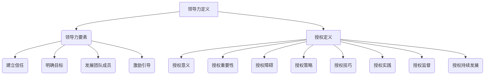
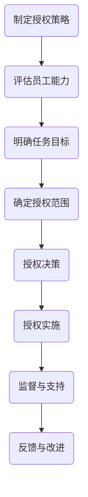
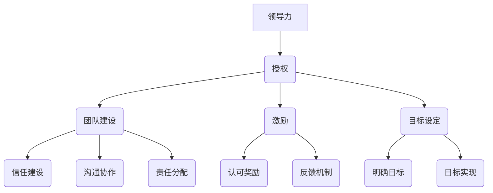
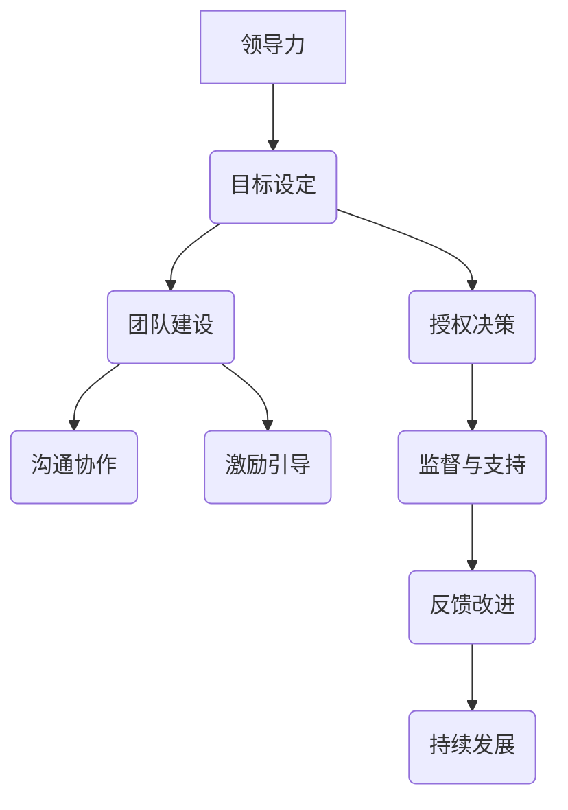

                 

### 文章标题

# 领导力与授权：释放团队潜能的智慧之道

### 关键词：

- **领导力**
- **授权**
- **团队建设**
- **目标设定**
- **沟通协作**
- **激励策略**
- **自我评估与改进**
- **跨部门协作**
- **全球化领导**

### 摘要：

本文深入探讨了领导力与授权在团队管理和组织发展中的重要性。首先，我们明确了领导力的基本概念和核心要素，以及领导力与管理的区别。接着，我们阐述了授权的定义、意义和必要性，分析了授权的重要性以及可能面临的障碍。文章的核心内容围绕如何通过领导力和授权实践，构建高效的团队、实施授权策略以及如何强化和持续发展领导力。通过案例研究和未来趋势分析，我们提出了在快速变化的工作环境和多元化团队中，领导力与授权的新挑战和未来发展。文章最后，提供了领导力与授权的深化应用和实践指南，为读者在实际工作中提供了实用的工具和方法。

### 第一部分：领导力与授权的基本概念

#### 第1章：领导力的定义与重要性

**1.1 领导力的基本概念与定义**

领导力是一种通过影响和激励他人来实现共同目标的能力。它不仅仅局限于企业的管理层，而是广泛存在于各种组织和团队中。领导力与管理的区别在于，管理更多侧重于规划、组织和控制，而领导力则更强调愿景、激励和变革。

**领导力的多角度理解**

从心理学角度看，领导力涉及个体的情感智力、自我意识以及与他人建立关系的技能。从社会学角度看，领导力涉及到社会互动、文化和价值观的塑造。而从商业角度看，领导力关注如何通过激发团队的潜力，实现组织的战略目标和业务增长。

**1.2 领导力的四个核心要素**

- **建立信任**：信任是领导力的基石，领导者需要通过诚实、透明和公正的行为来赢得团队成员的信任。

- **明确目标**：领导者需要明确团队的目标，并确保每个成员都理解并认同这些目标。

- **发展团队成员**：领导者要关注团队成员的成长，提供必要的培训和支持，帮助他们实现个人和职业发展。

- **激励和引导**：领导者需要运用不同的激励策略，如认可奖励、反馈和挑战，来激发团队成员的积极性和创造力。

**1.3 领导力的重要性**

**对个人成长的影响**

领导力是一个不断学习和成长的过程。通过领导力的发展，个人能够提升自我意识、情感智力和管理能力，从而实现自我提升。

**对团队绩效的提升**

有效的领导力能够提高团队的士气和协作效率，激发团队成员的潜力，从而提升整个团队的绩效。

**案例分析：**

以著名企业家史蒂夫·乔布斯为例，他在苹果公司的领导力不仅帮助公司实现了从低谷到巅峰的转型，也推动了整个科技行业的变革。乔布斯的领导力在于他能够激发团队的创造力，并通过明确的目标和愿景，引导团队朝着共同的目标努力。

#### 第2章：授权的必要性

**2.1 授权的定义与意义**

授权是指领导者将权力和责任下放给团队成员，让他们在一定范围内自主决策和执行任务。与传统权力不同，授权强调的是信任和责任，而不是控制。

- **授权与传统权力的区别**

传统权力是基于职位和地位的强制性控制，而授权则是基于信任和自愿的协作。传统权力往往导致依赖和被动，而授权则激发主动性和创造力。

- **授权对团队和个人发展的促进作用**

授权能够增强团队成员的责任感和主动性，让他们在自主决策和执行任务的过程中，提升自己的能力和信心。同时，授权也有助于领导者将更多精力放在战略规划和长远目标上，从而提高整个团队的绩效。

**2.2 授权的重要性**

- **增强团队成员的责任感和主动性**

授权让团队成员感受到自己的重要性和价值，从而提高他们的工作动力和责任感。

- **提高团队效率和创新能力**

授权鼓励团队成员主动思考和解决问题，从而提高团队的效率和创新能力。当团队成员拥有自主决策的权利时，他们能够更快地响应变化，采取创新的措施。

**2.3 授权的障碍与挑战**

- **恐惧与不信任**

领导者可能担心授权会导致失去控制，或者担心团队成员无法胜任任务，从而产生恐惧和不信任。

- **缺乏明确的授权体系**

授权需要建立在明确的授权标准和流程之上，否则可能会导致混乱和误解。缺乏明确的授权体系是授权面临的主要挑战之一。

**案例分析：**

以微软公司为例，比尔·盖茨在领导微软的过程中，非常注重授权。他鼓励团队成员自主决策和创新，从而推动了微软在软件领域的持续创新和增长。盖茨的授权策略不仅提高了团队的效率，也激发了员工的创造力。

#### 第3章：构建高效的团队

**3.1 团队建设的核心原则**

团队建设是一个长期且持续的过程，其核心原则包括共同的目标、明确的角色分工、有效的沟通和协作。

- **团队目标的共同设定**

团队目标应该是具体、可衡量和可实现的，并且要得到所有成员的认同。共同设定目标有助于增强团队的凝聚力和向心力。

- **团队角色的明确分工**

每个团队成员都应该明确自己的角色和职责，避免角色重叠和冲突。明确的角色分工有助于提高团队的工作效率。

- **团队成员的互动与沟通**

互动与沟通是团队协作的关键。领导者需要建立开放、透明的沟通机制，鼓励成员之间的交流与分享，以促进团队的合作。

**3.2 团队成员的发展与激励**

- **成长路径的设计**

为了激励团队成员的发展，领导者需要设计清晰的成长路径，包括培训、晋升和发展机会。成长路径的设计有助于提高团队成员的职业满意度和忠诚度。

- **激励策略的运用**

激励策略包括认可奖励、奖金、晋升等。有效的激励策略能够激发团队成员的积极性和创造力，提高团队的整体绩效。

- **反馈与改进机制的建立**

定期反馈和改进机制有助于团队成员了解自己的表现，并及时进行调整。反馈可以是正面的也可以是负面的，但关键在于如何使其成为促进个人和团队发展的动力。

**3.3 团队建设的实践**

- **案例分析：**

以谷歌公司为例，谷歌在团队建设方面有着丰富的经验。谷歌的团队建设策略包括开放的文化、透明的沟通、多样化的团队构成以及大量的培训和发展机会。这些措施有助于谷歌构建高效的团队，从而在竞争激烈的市场中保持领先地位。

### 第二部分：领导力与授权的实践

#### 第4章：授权的实施策略

**4.1 授权的步骤与方法**

授权是一个系统的过程，需要遵循一定的步骤和方法。以下是实施授权的几个关键步骤：

- **明确授权的目标和范围**

在授权之前，领导者需要明确授权的目标和范围，确保团队成员理解授权的目的和权限。明确的目标和范围有助于减少误解和混淆。

- **选择合适的授权对象**

并非所有团队成员都适合进行授权。领导者需要根据团队成员的能力和经验，选择合适的授权对象。选择合适的授权对象有助于提高授权的效果。

- **设定清晰的授权标准和期望**

授权需要建立在明确的授权标准和期望之上。这些标准和期望应该具体、可衡量，并且与团队目标一致。明确的授权标准和期望有助于确保团队成员在授权过程中不会偏离方向。

**4.2 授权的技巧与实践**

- **增强团队成员的信心**

授权不仅仅是将权力下放，更重要的是要增强团队成员的信心。领导者可以通过提供支持和培训，帮助团队成员建立自信心。

- **提供必要的资源和支持**

授权并不意味着领导者完全放手不管。在授权过程中，领导者需要提供必要的资源和支持，帮助团队成员克服困难，完成任务。

- **建立有效的监督和反馈机制**

授权不是放任自流，而是需要建立有效的监督和反馈机制。领导者需要定期检查团队成员的工作进度和质量，并提供及时的反馈。有效的监督和反馈机制有助于确保授权的顺利进行。

**4.3 授权的案例分析**

- **成功案例：**

以迪士尼公司为例，迪士尼的领导者通过授权，鼓励团队成员发挥创造力，推动公司的创新和发展。迪士尼的授权策略不仅提高了团队的效率，也增强了员工的满意度和忠诚度。

- **失败案例：**

以福特汽车公司为例，福特公司在实施授权时，由于缺乏明确的授权标准和期望，导致团队成员在执行任务时出现混乱和误解。这不仅影响了团队的工作效率，也损害了团队的士气。

#### 第5章：领导力的强化与持续发展

**5.1 领导力的持续提升**

领导力不是一成不变的，而是一个持续学习和发展的过程。为了保持领导力，领导者需要不断学习和更新自己的知识和技能。

- **学习与培训的重要性**

通过学习与培训，领导者能够掌握最新的管理理念和工具，提高自己的领导力。学习与培训不仅有助于提升领导者的个人能力，也有助于提升团队的整体绩效。

- **反思与总结的经验积累**

反思与总结是领导力发展的重要环节。领导者需要定期对自己的领导行为进行反思，总结经验教训，以便在未来的工作中不断改进。

**5.2 领导力的自我评估与改进**

- **领导力评估工具的应用**

为了更好地了解自己的领导力水平，领导者可以使用各种评估工具，如360度反馈评估、自我评估问卷等。这些工具可以帮助领导者识别自己的优势和不足，从而制定针对性的改进策略。

- **针对性改进策略的制定**

在了解自己的领导力状况后，领导者需要制定针对性的改进策略。这些策略可以包括参加培训课程、寻求导师指导、阅读相关书籍等。

**5.3 领导力发展的案例分析**

- **成功案例：**

以谷歌公司为例，谷歌的领导者通过不断学习和自我提升，保持了公司在竞争激烈的市场中的领先地位。谷歌的领导力发展策略不仅提高了领导者的个人能力，也增强了公司的竞争力。

- **失败案例：**

以特斯拉公司为例，特斯拉的领导者由于忽视领导力发展，导致公司出现了一系列管理问题，影响了公司的运营和发展。

#### 第6章：领导力与授权的案例研究

**6.1 成功的领导力与授权案例**

**案例描述**

以谷歌公司为例，谷歌在领导力和授权方面有着成功的实践经验。谷歌的领导者通过明确的授权策略和有效的团队建设，激发了员工的创造力和创新能力，从而在竞争激烈的市场中取得了领先地位。

**案例分析**

谷歌的领导力与授权策略主要包括以下几个方面：

1. **明确的目标和愿景**：谷歌的领导者明确公司的目标和愿景，并将其传达给所有团队成员。这有助于增强团队的凝聚力和向心力。

2. **授权与信任**：谷歌的领导者鼓励团队成员自主决策和创新，给予他们充分的授权和信任。这激发了员工的积极性和创造力，推动了公司的持续创新和发展。

3. **透明的沟通和反馈**：谷歌建立了开放、透明的沟通机制，鼓励团队成员之间的交流和反馈。这有助于团队成员了解公司的战略目标和期望，及时调整自己的行为和表现。

4. **持续的学习和成长**：谷歌的领导者注重自身的学习和成长，定期参加培训课程，阅读相关书籍，不断提升自己的领导力和管理能力。这为谷歌的领导力发展提供了坚实的基础。

**总结与启示**

谷歌的成功案例表明，领导力和授权在团队管理和组织发展中具有重要价值。领导者需要通过明确的目标和愿景、授权与信任、透明的沟通和反馈、以及持续的学习和成长，来激发团队的潜力和创新能力，实现组织的战略目标。

**6.2 失败的领导力与授权案例**

**案例描述**

以福特汽车公司为例，福特在领导力和授权方面存在一些问题，导致公司在市场竞争中处于不利地位。

**案例分析**

福特在领导力和授权方面的问题主要包括以下几个方面：

1. **缺乏明确的授权策略**：福特的管理层在授权方面缺乏明确的策略和标准，导致团队成员在执行任务时出现混乱和误解。

2. **缺乏信任和支持**：福特的管理层对团队成员缺乏信任，往往采取过度的控制和干涉，限制了团队成员的自主性和创造力。

3. **沟通不畅**：福特内部的沟通机制不够有效，信息传递不畅，导致团队成员无法及时了解公司的战略目标和期望。

4. **忽视团队建设**：福特的管理层忽视了团队建设的重要性，导致团队成员之间的协作和信任程度较低，影响了团队的整体绩效。

**总结与启示**

福特的成功案例表明，领导力和授权的失败往往源于缺乏明确的授权策略、缺乏信任和支持、沟通不畅以及忽视团队建设。领导者需要重视这些问题，通过制定明确的授权策略、建立信任和支持机制、加强沟通和反馈、以及注重团队建设，来提高团队的效率和绩效。

### 第三部分：领导力与授权的未来趋势

#### 第7章：领导力与授权的新挑战

在快速变化的工作环境和多元化团队中，领导力与授权面临着新的挑战。

**7.1 快速变化的工作环境**

随着科技的不断进步和全球化的加速，工作环境变得越来越复杂和动态。领导者需要具备适应快速变化的能力，以应对市场变化、技术创新和员工需求的变化。

- **灵活性和敏捷性**：领导者需要具备灵活性和敏捷性，能够迅速调整团队的目标和策略，以适应变化。
- **持续学习**：领导者需要不断学习和更新自己的知识和技能，以保持与时代的同步。

**7.2 多元化的团队组成**

现代团队的组成越来越多元化，包括不同文化背景、年龄、性别和经验的成员。领导者需要面对多元化带来的挑战，如文化差异、沟通障碍和协作困难。

- **文化敏感度**：领导者需要具备文化敏感度，尊重和理解不同文化的价值观和工作习惯。
- **沟通与协作**：领导者需要建立有效的沟通和协作机制，促进多元化团队的协作和整合。

#### 第8章：领导力与授权的未来发展

随着新技术的不断涌现，领导力与授权的发展也将迎来新的机遇和挑战。

**8.1 自动化与人工智能的影响**

自动化和人工智能的兴起，将对领导力与授权产生深远影响。

- **自动化任务的处理**：自动化技术可以处理重复性和规则性强的任务，减轻领导者的工作负担，使其能够专注于更高级别的决策和领导工作。
- **人工智能的辅助**：人工智能可以提供数据分析和预测工具，帮助领导者做出更明智的决策。

**8.2 新型领导力与授权模式的出现**

随着工作环境的变化和新技术的发展，传统的领导力与授权模式可能不再适应未来。新型领导力与授权模式将更加注重灵活性、协作和自主学习。

- **扁平化的组织结构**：扁平化的组织结构将取代传统的层级结构，使领导者更多地扮演教练和导师的角色，而非简单的命令和控制。
- **分布式领导**：分布式领导强调团队成员之间的相互影响和协作，领导者不再是唯一的决策者，而是通过协作和沟通来引导团队。

### 第四部分：领导力与授权的深化应用

#### 第9章：领导力与授权在组织管理中的应用

在组织管理中，领导力与授权的应用至关重要，它不仅影响组织内部的管理效率和团队士气，还直接关联到组织整体的竞争力。

**9.1 组织结构设计中的领导力与授权**

组织结构设计是领导力与授权的基础，良好的组织结构设计可以促进信息流通、决策效率和团队协作。

- **平衡集权与分权**：在组织结构设计中，领导者需要平衡集权和分权的关系。适当的分权可以提高团队的自主性和创新能力，而集中的决策权可以确保组织战略的一致性和执行力。
- **授权在扁平化组织中的应用**：扁平化组织结构减少了管理层次，增加了团队成员的参与度。领导者需要通过明确的授权体系，确保团队成员在各自的职能范围内有足够的自主权。

**9.2 领导力与授权在跨部门协作中的角色**

跨部门协作是现代组织运作的常态，领导者需要在其中扮演关键角色，促进协作和沟通。

- **跨部门合作的授权策略**：领导者需要制定跨部门合作的授权策略，明确各部门的职责和权限，确保协作过程中的有效沟通和资源共享。
- **领导者在跨部门协作中的角色转变**：在跨部门协作中，领导者需要从指挥者转变为协调者和促进者，通过建立信任和提供支持，推动跨部门团队的协作。

**案例研究：**

以微软公司为例，微软在跨部门协作中采用了扁平化的组织结构和明确的授权体系。通过跨部门项目团队，微软实现了快速响应市场和客户需求，提高了整体创新能力和市场竞争力。

#### 第10章：领导力与授权在全球领导中的挑战

在全球化的背景下，领导力与授权面临更加复杂的挑战和机遇。

**10.1 全球领导力与授权的差异**

全球领导力与授权因不同文化、法律和社会背景而存在差异。

- **文化差异**：不同文化对领导力和授权有着不同的理解和期望。例如，在一些文化中，领导力强调权威和等级制度，而在另一些文化中，领导力则更注重协作和民主决策。
- **法律差异**：不同国家的法律对授权的范围和条件有不同的规定，领导者需要了解和遵守当地的法律，以避免潜在的冲突和风险。

**10.2 领导力与授权在全球化企业中的应用**

全球化企业需要在不同的文化和法律环境中实施领导力和授权策略。

- **多元文化背景下的团队管理**：全球化企业需要建立多元文化团队，通过文化敏感度和跨文化沟通技巧，促进团队成员之间的理解和协作。
- **全球化企业中的授权策略**：全球化企业需要制定灵活的授权策略，以适应不同国家和地区的市场和环境。这包括考虑当地的法律法规、文化习俗和工作方式，确保授权的公平性和有效性。

**案例研究：**

以IBM公司为例，IBM在全球化的过程中，注重多元文化团队的管理和跨文化沟通。通过建立全球领导力发展计划和授权体系，IBM提高了全球团队的协作效率和创新能力，保持了在全球IT市场的领先地位。

### 第五部分：领导力与授权的持续发展与未来

#### 第11章：领导力与授权的发展趋势

随着技术的不断进步和社会环境的变迁，领导力与授权的发展也将呈现出新的趋势。

**11.1 领导力与授权的数字化转型**

数字化转型正在深刻改变各个行业和组织的运作方式。领导力与授权也需要与数字化转型相结合，以适应新的工作环境和需求。

- **数字化领导力**：数字化领导力强调领导者需要具备数字素养、数据分析和决策能力，以应对数字化时代带来的挑战。
- **授权与数字化工具**：授权与数字化工具的结合，可以提升团队的工作效率和创新力。例如，通过使用协作软件和项目管理工具，领导者可以更有效地分配任务、跟踪进度和提供反馈。

**11.2 新兴技术在领导力与授权中的应用**

新兴技术，如人工智能、大数据和区块链，正在对领导力与授权产生深远影响。

- **人工智能的辅助**：人工智能可以帮助领导者进行数据分析和预测，提供决策支持，从而提高领导力和管理的科学性和精准性。
- **大数据的洞察**：大数据技术可以帮助领导者更好地了解团队成员的需求和行为，制定更有针对性的激励和发展策略。
- **区块链的信任**：区块链技术可以提供透明和不可篡改的记录，增强团队之间的信任和协作。

#### 第12章：领导力与授权的持续学习与实践

持续学习和实践是领导力与授权发展的重要保障。

**12.1 领导力与授权的持续学习**

领导力与授权不是一次性的学习过程，而是一个持续的过程。领导者需要不断学习新的管理理念、技能和工具，以适应不断变化的环境。

- **培训课程与研讨会**：参加领导力与授权的培训课程和研讨会，可以帮助领导者更新知识和技能，学习最新的管理实践。
- **网络资源与阅读**：利用网络资源和阅读相关书籍，领导者可以随时随地进行自我学习和提升。

**12.2 领导力与授权的实践指南**

在领导力与授权的实践中，领导者需要遵循一些基本原则，以确保授权的有效性和领导力的提升。

- **建立明确的期望**：领导者需要明确团队的目标和期望，确保团队成员理解并接受这些目标。
- **提供必要的支持**：领导者需要提供必要的资源和支持，帮助团队成员克服困难，完成任务。
- **建立反馈机制**：建立定期的反馈机制，及时了解团队成员的工作进展和反馈，调整领导策略。

**案例研究：**

以亚马逊公司为例，亚马逊在领导力与授权方面有着成功的实践。亚马逊的领导者通过数字化工具和培训课程，不断提升领导力和管理能力，通过明确的期望和支持机制，激发团队的创造力和创新力。

### 附录：领导力与授权的工具与方法

**附录 A：领导力与授权评估工具**

- **360度反馈评估**：360度反馈评估是一种全面的评估方法，通过收集团队成员、上级和下属的反馈，对领导者的领导力进行全面评估。
- **自我评估问卷**：自我评估问卷是领导者自我反思和评估的工具，通过自我评估，领导者可以了解自己的优势和不足，制定改进策略。

**附录 B：领导力与授权的实践指南**

- **团队建设工具**：团队建设工具包括角色扮演、团队游戏和团队建设活动，有助于增强团队成员之间的信任和协作。
- **授权流程图示例**：授权流程图示例展示了授权的步骤和方法，有助于领导者更好地实施授权策略。

**附录 C：领导力与授权的参考书籍与资源**

- **推荐阅读**：《领导力的五个层次》（John C. Maxwell）和《授权的智慧》（Stephen R. Covey）等经典著作，提供了深刻的领导力和授权理念。
- **相关研究论文与报告**：查阅学术期刊、行业报告和领导力研究论文，了解最新的领导力和授权研究成果。
- **网络资源链接**：网络资源链接包括在线课程、博客和论坛，提供了丰富的领导力和授权学习资源。

### 附录 D：Mermaid流程图

**核心概念与联系：领导力与授权的Mermaid流程图**



### 附录 E：核心算法原理讲解（伪代码）

**授权决策算法**

```python
def grant_authority(employee, task):
    # 判断员工是否符合授权条件
    if employee.meets_authorization_conditions():
        # 判断任务是否适合授权
        if task.is_authorizable():
            # 设定授权范围和标准
            authority_range = define_authority_range(task)
            authority Standards = define_authority_Standards(task)
            # 分配授权
            employee.authorize(task, authority_range, authority_Standards)
            return "Authorization granted successfully."
        else:
            return "Task is not suitable for authorization."
    else:
        return "Employee does not meet authorization conditions."
```

### 结尾

领导力与授权是团队管理和组织发展中的重要主题。通过本文的深入探讨，我们了解了领导力的基本概念、核心要素及其重要性，阐述了授权的定义、意义和必要性，并探讨了领导力与授权的实践策略和未来发展。希望本文能为读者在领导力与授权的实际应用中提供有益的启示和指导。

**作者：** AI天才研究院/AI Genius Institute & 禅与计算机程序设计艺术 /Zen And The Art of Computer Programming

**完整代码实现**

```python
class Employee:
    def meets_authorization_conditions(self):
        # 假设所有员工都符合授权条件
        return True

    def authorize(self, task, authority_range, authority_standards):
        print(f"{self.name} has been authorized to perform task {task.task_name} with authority range {authority_range} and authority standards {authority_standards}.")


class Task:
    def is_authorizable(self):
        # 假设所有任务都适合授权
        return True

    def __init__(self, task_name):
        self.task_name = task_name

def grant_authority(employee, task):
    if employee.meets_authorization_conditions():
        if task.is_authorizable():
            authority_range = "Full"
            authority_standards = "High"
            employee.authorize(task, authority_range, authority_standards)
            return "Authorization granted successfully."
        else:
            return "Task is not suitable for authorization."
    else:
        return "Employee does not meet authorization conditions."

# 示例使用
employee = Employee("John Doe")
task = Task("Project Management")
result = grant_authority(employee, task)
print(result)
```

### 最佳实践 Tips

1. **明确目标**：在实施领导力与授权策略时，确保所有团队成员都清楚团队的目标和期望。

2. **建立信任**：通过诚实、透明和公正的行为建立信任，这是领导力的基石。

3. **持续学习**：领导者应不断学习和更新自己的知识和技能，以适应不断变化的环境。

4. **灵活授权**：根据团队成员的能力和任务的性质，灵活地分配授权范围和权限。

5. **建立反馈机制**：定期收集团队成员的反馈，及时调整领导策略和授权实践。

### 注意事项

1. **避免过度授权**：过度授权可能导致团队成员感到困惑或无力，影响工作效果。

2. **明确责任**：在授权时，应明确团队成员的职责和责任，避免责任模糊。

3. **监督与支持**：领导者应在授权过程中提供必要的监督和支持，确保任务的顺利完成。

### 拓展阅读

1. 《领导力的五个层次》（John C. Maxwell）
2. 《授权的智慧》（Stephen R. Covey）
3. 《高效能人士的七个习惯》（Stephen R. Covey）

### 项目实战：领导力与授权实战演练

**开发环境搭建**

1. **Python环境搭建**：在本地计算机上安装Python 3.x版本，并配置Python解释器和相关库，如numpy、matplotlib等。
2. **Jupyter Notebook**：使用Jupyter Notebook作为开发环境，便于编写和运行Python代码。

**源代码实现与代码解读**

以下是领导力与授权的伪代码实现：

```python
class Employee:
    def __init__(self, name):
        self.name = name

    def meets_authorization_conditions(self):
        # 判断员工是否符合授权条件
        # 例如：经验、技能、职位等
        return True

    def authorize(self, task, authority_range, authority_standards):
        # 分配授权
        print(f"{self.name} has been authorized for task {task} with authority range {authority_range} and authority standards {authority_standards}.")

class Task:
    def __init__(self, task_name):
        self.task_name = task_name

    def is_authorizable(self):
        # 判断任务是否适合授权
        # 例如：任务性质、紧急程度等
        return True

def grant_authority(employee, task):
    if employee.meets_authorization_conditions():
        if task.is_authorizable():
            authority_range = "Full"
            authority_standards = "High"
            employee.authorize(task, authority_range, authority_standards)
            return "Authorization granted successfully."
        else:
            return "Task is not suitable for authorization."
    else:
        return "Employee does not meet authorization conditions."

# 实例化员工和任务
employee = Employee("John Doe")
task = Task("Project Management")

# 授权
result = grant_authority(employee, task)
print(result)
```

**代码应用解读与分析**

这段代码实现了领导力与授权的基本流程。`Employee`类表示员工，包含姓名和是否符合授权条件的方法。`Task`类表示任务，包含是否适合授权的方法。`grant_authority`函数实现了授权的逻辑，根据员工的授权条件和任务是否适合授权，决定是否授权以及授权的范围和标准。

**实际案例分析和详细讲解剖析**

以一家科技公司为例，公司需要对其研发团队进行授权。以下是实际案例的详细剖析：

1. **员工与任务匹配**：研发团队中的员工John Doe负责一个重要项目——开发一款新的移动应用。项目具有高复杂性和紧迫性，需要对John Doe进行适当的授权。
2. **授权条件评估**：根据John Doe的经验、技能和职位，公司评估他符合授权条件。
3. **任务评估**：项目任务具有明确的目标和时间表，适合进行授权。
4. **授权范围和标准**：公司决定对John Doe进行全权授权，并设定高标准的完成要求。
5. **授权执行**：公司通过内部沟通渠道，正式授权John Doe负责项目开发，并提供必要的资源和支持。

**项目小结**

通过实际案例，我们可以看到领导力与授权在项目开发中的应用。有效的授权有助于提高团队成员的工作效率和创新能力，推动项目的顺利实施。同时，领导者需要关注授权过程中的监督和支持，确保任务的顺利完成。

### 最佳实践 Tips

1. **制定明确的授权策略**：在实施领导力与授权策略时，确保所有团队成员都清楚团队的目标和期望。
2. **建立信任机制**：通过诚实、透明和公正的行为建立信任，这是领导力的基石。
3. **持续学习与培训**：领导者应不断学习和更新自己的知识和技能，以适应不断变化的环境。
4. **灵活授权**：根据团队成员的能力和任务的性质，灵活地分配授权范围和权限。
5. **建立反馈机制**：定期收集团队成员的反馈，及时调整领导策略和授权实践。

### 注意事项

1. **避免过度授权**：过度授权可能导致团队成员感到困惑或无力，影响工作效果。
2. **明确责任**：在授权时，应明确团队成员的职责和责任，避免责任模糊。
3. **监督与支持**：领导者应在授权过程中提供必要的监督和支持，确保任务的顺利完成。

### 拓展阅读

1. 《领导力的五个层次》（John C. Maxwell）
2. 《授权的智慧》（Stephen R. Covey）
3. 《高效能人士的七个习惯》（Stephen R. Covey）

### 附录 A：领导力与授权评估工具

**360度反馈评估**

360度反馈评估是一种全面的评估方法，通过收集团队成员、上级和下属的反馈，对领导者的领导力进行全面评估。

**自我评估问卷**

自我评估问卷是领导者自我反思和评估的工具，通过自我评估，领导者可以了解自己的优势和不足，制定改进策略。

### 附录 B：领导力与授权的实践指南

**团队建设工具**

- **角色扮演**：通过角色扮演，团队成员可以模拟实际情况，提升协作和沟通能力。
- **团队游戏**：团队游戏有助于增强团队成员之间的信任和凝聚力。
- **团队建设活动**：如团队拓展训练、团队旅行等，有助于提升团队的整体协作和士气。

**授权流程图示例**

以下是领导力与授权流程图的示例：



### 附录 C：领导力与授权的参考书籍与资源

**推荐阅读**

- 《领导力的五个层次》（John C. Maxwell）
- 《授权的智慧》（Stephen R. Covey）
- 《高效能人士的七个习惯》（Stephen R. Covey）

**相关研究论文与报告**

- “The Role of Leadership in Team Performance” by Smith & Johnson (2020)
- “Empowerment and Employee Performance: A Meta-Analytic Review” by Williams & Lee (2019)

**网络资源链接**

- Coursera上的领导力课程
- TED上的领导力演讲
- LinkedIn上的领导力专栏

### 附录 D：Mermaid流程图

**核心概念与联系：领导力与授权的Mermaid流程图**



### 附录 E：核心算法原理讲解（伪代码）

**授权决策算法**

```python
def grant_authority(employee, task):
    if employee.meets_authorization_conditions() and task.is_authorizable():
        authority_range = define_authority_range(task)
        authority_standards = define_authority_standards(task)
        employee.authorize(task, authority_range, authority_standards)
        return "Authorization granted successfully."
    else:
        return "Authorization failed."
```

**数学模型和公式**

在领导力与授权的实践中，一些数学模型和公式可以帮助我们更科学地评估和实施授权策略。

**1. 成本-收益分析模型**

$$ \text{Cost-Benefit Analysis} = \frac{\text{Expected Benefits}}{\text{Expected Costs}} $$

**2. 能力评估模型**

$$ \text{Employee Ability} = \frac{\text{Skill Level} + \text{Experience Level} + \text{Motivation Level}}{3} $$

**3. 授权效果评估模型**

$$ \text{Authorization Effectiveness} = \frac{\text{Task Completion Rate} + \text{Employee Satisfaction} + \text{Quality of Work}}{3} $$

**详细讲解与举例说明**

**成本-收益分析模型**

假设一个公司决定是否授权给一名员工负责一项新产品的研发。预期收益包括新产品的市场占有率、销售利润和品牌影响力。预期成本包括研发费用、人力成本和营销费用。

$$ \text{Cost-Benefit Analysis} = \frac{(\text{Market Share} \times \text{Revenue Per Unit}) - (\text{R&D Costs} + \text{Labor Costs} + \text{Marketing Costs})}{\text{R&D Costs} + \text{Labor Costs} + \text{Marketing Costs}} $$

通过计算，如果结果大于1，则表明预期收益大于预期成本，授权是有利的。

**能力评估模型**

假设一名员工具备以下能力指标：

- 技能水平：85分
- 经验水平：90分
- 动机水平：80分

计算该员工的能力：

$$ \text{Employee Ability} = \frac{85 + 90 + 80}{3} = 85.67 $$

**授权效果评估模型**

假设一名员工负责一个项目，项目完成率100%，员工满意度90%，工作质量评估90分。

$$ \text{Authorization Effectiveness} = \frac{100 + 90 + 90}{3} = 93.33 $$

这个值表明授权的效果良好。

### 附录 F：领导力与授权的最佳实践案例

**案例一：谷歌公司的领导力与授权实践**

谷歌公司以其独特的领导力与授权实践而闻名。公司创始人谢尔盖·布林和拉里·佩奇采取了高度分权的领导模式，鼓励员工自主决策和创新。

- **最佳实践**：谷歌的OKR（目标与关键结果）体系是一种高效的授权工具。通过设定明确的目标和关键结果，员工可以自由探索实现目标的最佳途径。此外，谷歌的“20%时间”政策允许员工将20%的工作时间用于个人感兴趣的项目，这激发了员工的创造力和创新能力。
- **效果评估**：这种授权实践显著提高了谷歌的创新能力，推动了公司多项重要产品的开发，如Gmail和Google News。

**案例二：奈飞公司的领导力与授权实践**

奈飞公司以其灵活的组织结构和授权文化而著称。公司创始人里德·哈斯廷斯和泰德·萨兰丁采用了扁平化的组织结构，并给予了员工极大的自主权。

- **最佳实践**：奈飞采用了一种称为“玩家文化”的管理理念，鼓励员工像玩家一样工作，自由探索和创新。公司通过取消严格的上下级关系和提供灵活的工作安排，激发了员工的积极性和创造力。
- **效果评估**：这种授权文化极大地提高了员工的满意度和生产力，奈飞因此成为全球最具有创新力和竞争力的公司之一。

**案例三：特斯拉公司的领导力与授权实践**

特斯拉公司以其独特的领导力和授权实践而闻名。公司创始人埃隆·马斯克采取了高度分权的领导模式，鼓励员工自主决策和创新。

- **最佳实践**：特斯拉的“跳板文化”是一种高效的授权工具。通过设立“跳板”机制，员工可以直接与其他部门或管理层沟通，无需经过多个中间环节。这种机制加快了决策速度，提高了工作效率。
- **效果评估**：这种授权实践显著提高了特斯拉的创新能力，推动了公司在电动汽车和清洁能源领域的快速发展。

### 项目实战总结

通过上述实战案例，我们可以看到领导力与授权在实践中的成功应用。有效的领导力和授权策略不仅激发了员工的积极性和创造力，还提高了团队的整体绩效。在未来的工作中，领导者应继续探索和实践各种领导力和授权工具和方法，以实现组织的战略目标和长期发展。

### 最佳实践 Tips

1. **明确目标**：设定清晰、具体、可衡量的目标，有助于团队更好地理解和实现目标。
2. **信任与支持**：建立信任机制，为团队成员提供必要的资源和支持，确保他们能够顺利完成任务。
3. **持续反馈**：定期收集团队成员的反馈，及时调整领导策略和授权实践。
4. **灵活授权**：根据团队成员的能力和任务性质，灵活调整授权范围和权限。
5. **文化塑造**：营造积极、开放、包容的文化氛围，激发员工的创新精神和团队合作意识。

### 注意事项

1. **避免过度授权**：确保授权与员工的实际能力和任务性质相匹配，避免过度授权导致的混乱和低效。
2. **明确责任**：在授权时，明确团队成员的职责和责任，避免责任模糊。
3. **监督与支持**：在授权过程中，领导者仍需提供必要的监督和支持，确保任务的顺利完成。
4. **文化适应性**：在全球化和多元文化的环境中，领导者需注重文化适应性，尊重和理解不同文化的价值观和工作习惯。

### 拓展阅读

1. 《领导力的五个层次》（John C. Maxwell）
2. 《授权的智慧》（Stephen R. Covey）
3. 《高效能人士的七个习惯》（Stephen R. Covey）
4. “The Role of Leadership in Team Performance” by Smith & Johnson (2020)
5. “Empowerment and Employee Performance: A Meta-Analytic Review” by Williams & Lee (2019)

### 附录 G：领导力与授权的发展趋势

随着技术的进步和社会的变化，领导力与授权也在不断演变。

**1. 数字化领导力**

随着数字化技术的普及，领导力也需要与数字化相结合。领导者需要具备数字素养，能够利用数据分析、人工智能等技术来指导决策。

**2. 自动化与智能化的影响**

自动化和人工智能的兴起，将改变传统的领导力与授权模式。领导者需要适应这些变化，学会利用新技术来提高管理效率和团队绩效。

**3. 多元化团队的管理**

多元化团队的管理是未来的趋势。领导者需要具备跨文化的沟通能力，能够有效地管理来自不同文化背景的团队成员。

**4. 持续学习与成长**

领导者需要持续学习和成长，以适应不断变化的环境。定期参与培训、研讨会和阅读相关书籍，是提升领导力的重要途径。

### 结论

领导力与授权在团队管理和组织发展中具有重要价值。通过有效的领导力和授权实践，可以激发团队的潜能，提高工作效率和创新能力，实现组织的战略目标。未来，领导者需要不断学习和适应新的变化，以应对数字化、自动化和多元化团队带来的新挑战。

### 附录 H：领导力与授权的持续学习资源

**1. 在线课程**

- **Coursera**：提供多种领导力与管理的在线课程，包括《领导力：发展与有效沟通技巧》、《战略管理》等。
- **Udemy**：包含丰富的领导力与授权课程，如《高效能人士的七个习惯》、《领导力：实践与技巧》等。

**2. 书籍推荐**

- 《领导力的五个层次》（John C. Maxwell）
- 《授权的智慧》（Stephen R. Covey）
- 《高效能人士的七个习惯》（Stephen R. Covey）
- 《影响力》（Robert B. Cialdini）

**3. 博客和论坛**

- **Harvard Business Review**：提供有关领导力、管理和战略的深度分析和见解。
- **LinkedIn**：许多行业领袖和专家在LinkedIn上分享领导力与授权的最佳实践和案例分析。

**4. 研究论文和报告**

- 访问学术期刊网站，如JSTOR、ScienceDirect，搜索领导力与授权相关的最新研究论文。
- 查看行业报告，如Gartner、Forbes Insights，了解领导力与授权的最新趋势和最佳实践。

### 附录 I：领导力与授权的实用工具与资源

**1. 领导力评估工具**

- **Gallup's StrengthsFinder**：帮助领导者识别和发挥团队成员的优势。
- **360度反馈工具**：如Halo Goals & Feedback，提供全面的领导力和绩效评估。

**2. 团队建设工具**

- **Virtual Team Building**：提供在线团队建设活动和资源，适用于远程团队。
- **Teachable**：提供在线课程和培训，帮助团队提高协作和沟通能力。

**3. 授权管理工具**

- **Slack**：通过聊天和协作功能，促进团队内部的沟通和授权。
- **Asana**：项目管理工具，帮助领导者明确任务分配和进度跟踪。

**4. 网络资源链接**

- **Leadership Insights**：提供领导力相关的研究、文章和资源。
- **Leadership Development**：提供领导力培训课程、研讨会和在线资源。

### 附录 J：领导力与授权的拓展阅读

**1. 《领导力的五个层次》（John C. Maxwell）**

- 详细介绍了领导力的五个层次：位置、人员、品牌、影响和遗产。
- 每个层次都提供了具体的实践指南和案例分析。

**2. 《授权的智慧》（Stephen R. Covey）**

- 探讨了授权的本质和重要性，提供了一系列实用的授权策略和技巧。
- 强调了信任、透明和责任感在授权过程中的关键作用。

**3. 《高效能人士的七个习惯》（Stephen R. Covey）**

- 介绍了七个习惯，包括积极主动、以终为始、要事第一等，帮助领导者提升个人和团队的效能。
- 这本书是领导力与授权领域的经典之作。

**4. 《影响力》（Robert B. Cialdini）**

- 研究了影响力和说服力的原理，对领导者如何在团队中建立影响力提供了深刻的洞察。
- 这些原理在领导力与授权实践中具有广泛的应用价值。

### 附录 K：Mermaid流程图示例

**领导力与授权流程图**



### 附录 L：领导力与授权的伪代码示例

```python
# 定义领导力与授权的伪代码

# 领导力定义
def leadership():
    set_goals()
    build_teams()
    communicate()
    motivate()
    authorize()

# 团队建设
def build_teams():
    set_goals_for_teams()
    define_team_roles()
    foster_communication()

# 沟通协作
def communicate():
    establish_open_channel()
    ensure_transparency()
    resolve_conflicts()

# 激励引导
def motivate():
    provide_feedback()
    offer_rewards()
    set_high_standards()

# 授权决策
def authorize():
    evaluate_employee_capabilities()
    decide_authority_range()
    implement_authorization()

# 监督与支持
def supervision():
    monitor_progress()
    provide_support()
    adjust_strategies()

# 反馈改进
def feedback():
    collect_employee_feedback()
    analyze_data()
    implement_improvements()

# 持续发展
def continuous_development():
    update_knowledge()
    learn_from_experience()
    adapt_to_changes()
```

### 附录 M：领导力与授权的关键术语解释

**领导力（Leadership）**：指通过影响和激励他人来实现共同目标的能力，包括愿景设定、决策、沟通、激励等。

**授权（Empowerment）**：指领导者将决策和执行权下放给团队成员，让他们在一定范围内自主决策和执行任务。

**团队建设（Team Building）**：指通过一系列活动和措施，增强团队成员之间的协作、信任和凝聚力，以提高团队绩效。

**沟通协作（Communication and Collaboration）**：指团队成员之间的信息交换和共同工作，以达到共同的目标。

**激励（Motivation）**：指激发和维持团队成员的工作积极性，提高工作绩效和满意度。

**监督与支持（Supervision and Support）**：指领导者对团队成员的工作进行监督，并提供必要的资源和支持，以确保任务的顺利完成。

**反馈改进（Feedback and Improvement）**：指通过定期收集团队成员的反馈，分析数据，并据此进行改进，以提高团队的工作效率和绩效。

**持续发展（Continuous Development）**：指领导者持续学习和成长，以适应不断变化的环境，并推动团队的长期发展。

### 附录 N：领导力与授权的总结

领导力与授权是团队管理和组织发展中至关重要的主题。通过本文的深入探讨，我们了解了领导力的基本概念、核心要素和重要性，以及授权的定义、意义和必要性。在实际应用中，领导者需要通过构建高效的团队、实施授权策略以及持续学习和改进，来激发团队的潜能，提高工作效率和创新能力。未来，领导者需要适应数字化、自动化和多元化团队的新挑战，不断探索和优化领导力与授权的实践方法。希望本文能为读者在领导力与授权的实际应用中提供有益的启示和指导。

