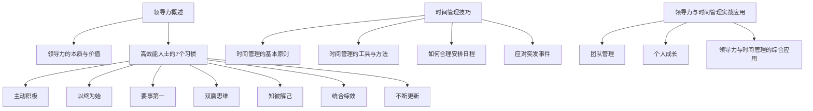

                 

# 领导力与时间管理：高效能人士的7个习惯

> 关键词：领导力、时间管理、高效能、7个习惯、实战应用

> 摘要：本文从领导力的本质与价值出发，结合高效能人士的7个习惯，深入探讨了领导力与时间管理的内在联系，旨在为IT领域的技术人员提供一套实用且高效的领导力与时间管理策略。

## 《领导力与时间管理：高效能人士的7个习惯》目录大纲

#### 第一部分：领导力概述

### 第1章：领导力的本质与价值

#### 1.1 领导力的定义与意义

#### 第2章：高效能人士的7个习惯

### 2.1 第一个习惯：主动积极

#### 2.1.1 主动积极的概念

#### 2.1.2 主动积极的实践方法

### 2.2 第二个习惯：以终为始

#### 2.2.1 以终为始的原则

#### 2.2.2 以终为始的实践步骤

### 2.3 第三个习惯：要事第一

#### 2.3.1 要事第一的重要性

#### 2.3.2 如何做到要事第一

### 2.4 第四个习惯：双赢思维

#### 2.4.1 双赢思维的本质

#### 2.4.2 双赢思维的实际应用

### 2.5 第五个习惯：知彼解己

#### 2.5.1 理解他人的重要性

#### 2.5.2 知彼解己的实践技巧

### 2.6 第六个习惯：统合综效

#### 2.6.1 统合综效的概念

#### 2.6.2 统合综效的实现策略

### 2.7 第七个习惯：不断更新

#### 2.7.1 不断更新的重要性

#### 2.7.2 不断更新的实践方法

#### 第二部分：时间管理技巧

### 第3章：时间管理的基本原则

#### 3.1 时间管理的重要性

#### 3.2 时间管理的原则

### 第4章：时间管理的工具与方法

#### 4.1 时间管理的工具

#### 4.2 时间管理的方法

### 第5章：如何合理安排日程

#### 5.1 日程安排的技巧

#### 5.2 如何避免拖延

### 第6章：应对突发事件

#### 6.1 突发事件的应对策略

#### 6.2 突发事件处理的具体措施

#### 第三部分：领导力与时间管理实战应用

### 第7章：团队管理

#### 7.1 团队管理的核心要素

#### 7.2 如何提升团队效率

### 第8章：个人成长

#### 8.1 个人成长的路径

#### 8.2 如何持续提升个人能力

### 第9章：领导力与时间管理的综合应用

#### 9.1 综合应用的方法

#### 9.2 综合应用的案例分析

### 附录

## 附录A：参考文献

## 附录B：领导力与时间管理相关资源

## 附录C：常见问题解答

## Mermaid 流�程图



### 第一部分：领导力概述

#### 第1章：领导力的本质与价值

### 1.1 领导力的定义与意义

在IT领域，领导力不仅仅是管理团队的技能，更是推动技术进步、提升团队效率和实现项目成功的关键因素。领导力涉及到多个方面，包括但不限于：

- **影响力**：领导者通过个人魅力和价值观来影响团队成员的行为和态度。
- **决策能力**：在复杂和不确定的环境中，领导者需要做出明智的决策，并承担相应的责任。
- **沟通技巧**：有效的沟通是领导力的核心，领导者需要确保信息准确传达并理解团队成员的需求和期望。

领导力的意义在于：

- **激励团队**：通过激发团队成员的潜力和动力，实现个人和团队的目标。
- **协调资源**：有效配置和使用团队内外部的资源，确保项目顺利进行。
- **塑造文化**：建立积极、开放和协作的团队文化，促进持续的创新和发展。

### 1.2 领导力与时间管理的关联

领导力与时间管理密切相关。高效的时间管理是领导力的重要组成部分，它可以帮助领导者：

- **优化资源**：合理安排时间，确保资源的最大化利用。
- **提升效率**：通过时间管理技巧，提高个人和团队的工作效率。
- **增强决策力**：有更多的时间和精力来分析问题，做出更明智的决策。

在本章节中，我们将深入探讨高效能人士的7个习惯，这些习惯不仅适用于个人发展，也是提升领导力的重要途径。

#### 第2章：高效能人士的7个习惯

史蒂芬·柯维（Stephen R. Covey）在其经典著作《高效能人士的7个习惯》（The 7 Habits of Highly Effective People）中，提出了一套行之有效的个人发展原则。这些习惯不仅适用于个人生活，对于提升领导力同样具有重要意义。以下是这7个习惯的详细解读。

### 2.1 第一个习惯：主动积极

#### 2.1.1 主动积极的概念

主动积极（Begin with the End in Mind）是一种以结果为导向的思维模式。它要求我们在做任何事情之前，都要明确目标，并设想最终的成果。这种思维方式可以帮助我们：

- **明确目标**：明确自己的目标，有助于在行动过程中保持专注。
- **预见挑战**：提前预见可能遇到的困难，为解决问题做好准备。
- **提高效率**：目标明确，可以避免在执行过程中走弯路，提高效率。

#### 2.1.2 主动积极的实践方法

- **制定长远目标**：设定清晰、可衡量、具体的目标，并制定实现这些目标的计划。
- **定期反思**：定期回顾自己的目标和进展，及时调整策略。
- **保持专注**：在执行过程中，专注于目标，避免分心。

### 2.2 第二个习惯：以终为始

#### 2.2.1 以终为始的原则

以终为始（Begin with the End in Mind）是一种逆向思维模式。它要求我们在做任何事情之前，都要设想最终的目标，并从最终目标出发，逐步制定计划和行动步骤。这种思维方式可以帮助我们：

- **确保目标的实现**：从最终目标出发，可以确保每一步行动都与目标保持一致。
- **提高决策质量**：在决策过程中，考虑最终目标，可以做出更明智的决策。
- **减少浪费**：避免在执行过程中走弯路，减少时间和资源的浪费。

#### 2.2.2 以终为始的实践步骤

- **明确最终目标**：设定清晰、具体、可实现的最终目标。
- **制定行动计划**：从最终目标出发，制定详细的行动计划。
- **定期检查进度**：定期检查行动计划的执行情况，确保目标实现。

### 2.3 第三个习惯：要事第一

#### 2.3.1 要事第一的重要性

要事第一（Put First Things First）是一种时间管理原则。它要求我们在处理事务时，要优先考虑重要且紧急的任务。这种思维方式可以帮助我们：

- **提高效率**：优先处理重要任务，可以确保关键工作得到及时完成。
- **减少压力**：避免在紧急事务中疲于奔命，减轻压力。
- **确保目标实现**：确保重要任务得到优先处理，有助于目标的实现。

#### 2.3.2 如何做到要事第一

- **明确任务优先级**：根据任务的重要性和紧急程度，设定优先级。
- **制定时间表**：制定合理的时间表，确保重要任务得到优先处理。
- **避免拖延**：及时处理重要任务，避免拖延导致任务积压。

### 2.4 第四个习惯：双赢思维

#### 2.4.1 双赢思维的本质

双赢思维（Think Win-Win）是一种协作原则。它强调在处理问题时，要寻求双方都能获得利益的解决方案。这种思维方式可以帮助我们：

- **增强团队协作**：促进团队成员之间的信任和合作。
- **解决问题**：通过双赢思维，可以更有效地解决问题，实现共同目标。
- **建立良好关系**：双赢思维有助于建立长期、稳定的人际关系。

#### 2.4.2 双赢思维的实际应用

- **寻求共识**：在解决问题时，寻求双方都能接受的解决方案。
- **尊重他人**：在合作过程中，尊重对方的意见和需求。
- **建立互信**：通过双赢思维，建立互信，促进长期合作。

### 2.5 第五个习惯：知彼解己

#### 2.5.1 理解他人的重要性

知彼解己（Seek First to Understand, Then to Be Understood）是一种沟通原则。它强调在沟通中，要首先理解对方的观点和需求，然后再表达自己的看法。这种思维方式可以帮助我们：

- **改善沟通**：通过理解他人，可以更有效地传达自己的观点。
- **减少冲突**：理解他人的立场，有助于减少冲突和误解。
- **建立信任**：通过倾听和理解，可以建立更深入的信任关系。

#### 2.5.2 知彼解己的实践技巧

- **倾听**：在沟通中，要专注于理解对方，避免打断对方。
- **设身处地**：尝试从对方的角度看待问题，理解对方的感受和需求。
- **反馈**：在理解对方后，给予积极的反馈，确认对方的感受和理解。

### 2.6 第六个习惯：统合综效

#### 2.6.1 统合综效的概念

统合综效（Synergize）是一种协作原则。它强调团队成员之间要相互依赖、相互支持，通过协作实现共同目标。这种思维方式可以帮助我们：

- **增强团队凝聚力**：通过协作，增强团队成员之间的凝聚力。
- **提升创新能力**：协作可以激发团队成员的创造力，产生更好的解决方案。
- **实现共同目标**：通过统合综效，可以实现团队的目标，实现更大的价值。

#### 2.6.2 统合综效的实现策略

- **建立信任**：建立团队成员之间的信任，是统合综效的基础。
- **促进沟通**：通过开放和诚实的沟通，促进团队成员之间的理解。
- **共同目标**：明确团队的目标，确保所有成员都朝着共同的目标努力。

### 2.7 第七个习惯：不断更新

#### 2.7.1 不断更新的重要性

不断更新（Sharpen the Saw）是一种个人发展原则。它强调持续学习、自我提升的重要性。这种思维方式可以帮助我们：

- **保持竞争力**：通过不断学习，保持自身的竞争力。
- **适应变化**：不断更新知识和技能，可以更好地适应环境变化。
- **实现自我价值**：通过不断更新，可以实现自我价值的不断提升。

#### 2.7.2 不断更新的实践方法

- **定期学习**：设定学习计划，定期学习新知识和技能。
- **实践应用**：将所学知识应用到实际工作中，通过实践不断提升。
- **反思总结**：定期反思自己的学习过程，总结经验教训，不断改进。

### 第二部分：时间管理技巧

#### 第3章：时间管理的基本原则

时间管理是领导力的关键组成部分，对于提升工作效率和个人成就感至关重要。以下是一些基本的时间管理原则：

### 3.1 时间管理的重要性

时间管理不仅仅是提高工作效率，更是实现个人目标、提升生活质量的重要手段。通过有效的时间管理，我们可以：

- **优化资源**：合理分配时间，确保资源得到最大化利用。
- **减少压力**：避免因工作积压和拖延而产生的不必要压力。
- **提高生活质量**：留出更多时间用于家庭、休闲和个人爱好，提升生活质量。

### 3.2 时间管理的原则

为了实现高效的时间管理，我们需要遵循以下原则：

- **明确目标**：设定清晰、具体的短期和长期目标，明确时间管理的方向。
- **优先级排序**：根据任务的重要性和紧急程度，设定优先级，确保关键任务得到优先处理。
- **合理安排时间**：制定合理的时间表，确保任务按时完成。
- **避免拖延**：及时处理任务，避免拖延导致工作积压。
- **保持灵活**：在执行过程中，根据实际情况灵活调整计划，确保目标实现。

#### 第4章：时间管理的工具与方法

在IT领域，高效的时间管理工具和方法可以帮助我们更好地组织和优化工作流程。以下是一些常用的工具和方法：

### 4.1 时间管理的工具

- **日历工具**：如Google日历、Outlook等，用于记录和规划日常活动。
- **任务管理工具**：如Trello、Asana等，用于跟踪和管理任务进度。
- **时间跟踪工具**：如Toggl、Harvest等，用于记录和分析工作时间。

### 4.2 时间管理的方法

- **番茄工作法**：将工作时间划分为25分钟的工作周期，每个周期后休息5分钟，提高专注力和工作效率。
- **优先级矩阵**：根据任务的重要性和紧急程度，将任务分为四个象限，优先处理重要且紧急的任务。
- **计划-执行-检查-行动（PDSA）循环**：通过持续的计划、执行、检查和行动，不断优化工作流程和时间管理策略。

#### 第5章：如何合理安排日程

合理安排日程是高效时间管理的重要环节。以下是一些实用的技巧：

### 5.1 日程安排的技巧

- **提前规划**：提前制定日程计划，确保有足够的时间处理重要任务。
- **合理分配时间**：根据任务的重要性和紧急程度，合理分配时间，避免过度劳累。
- **预留休息时间**：确保日程中包含足够的休息和放松时间，以保持良好的工作状态。
- **灵活调整**：在执行过程中，根据实际情况灵活调整计划，确保目标实现。

### 5.2 如何避免拖延

拖延是影响时间管理效率的重要因素。以下是一些避免拖延的策略：

- **设定具体目标**：设定明确、具体的目标，减少模糊和不确定感。
- **分解任务**：将大型任务分解为小步骤，逐步完成，减少心理压力。
- **设定截止日期**：为任务设定明确的截止日期，增加紧迫感。
- **消除干扰**：在工作时尽量减少干扰，例如关闭社交媒体通知、保持手机静音等。
- **建立奖励机制**：完成任务后，给予自己一些奖励，增加完成任务的动力。

#### 第6章：应对突发事件

在工作和生活中，突发事件是不可避免的。以下是一些应对突发事件的方法：

### 6.1 突发事件的应对策略

- **冷静分析**：在突发事件发生时，保持冷静，迅速分析情况，确定优先级。
- **迅速决策**：根据分析结果，迅速做出决策，采取适当的行动。
- **资源调配**：合理调配资源，确保重要任务得到优先处理。
- **及时沟通**：与团队成员保持及时沟通，确保信息的传递和协调。

### 6.2 突发事件处理的具体措施

- **制定应急预案**：提前制定应急预案，明确应对突发事件的步骤和责任分工。
- **建立快速响应机制**：确保团队在突发事件发生时，能够迅速响应和采取行动。
- **培训团队成员**：定期培训团队成员，提高应对突发事件的能力和意识。
- **总结经验教训**：在处理完突发事件后，及时总结经验教训，为未来应对类似事件做好准备。

### 第三部分：领导力与时间管理实战应用

#### 第7章：团队管理

团队管理是领导力的重要组成部分，有效的团队管理能够提升团队的整体效率和协作能力。以下是一些团队管理的核心要素和提升团队效率的方法：

### 7.1 团队管理的核心要素

- **明确目标**：确保团队成员对项目的目标有清晰的认识，并朝着共同的目标努力。
- **分工协作**：根据团队成员的特长和兴趣，合理分工，促进协作。
- **沟通畅通**：建立有效的沟通机制，确保团队成员之间的信息流畅。
- **激励制度**：建立合理的激励制度，激发团队成员的积极性和创造力。
- **持续反馈**：定期对团队成员的工作进行反馈，帮助他们不断进步。

### 7.2 如何提升团队效率

- **制定明确的时间表**：为团队项目制定详细的时间表，明确每个阶段的任务和截止日期。
- **优化工作流程**：通过流程优化，减少不必要的步骤，提高工作效率。
- **鼓励自主学习**：鼓励团队成员自主学习新技能和知识，提升团队的整体能力。
- **定期评估和调整**：定期评估团队的工作状态和效率，及时调整策略和方法。

#### 第8章：个人成长

个人成长是领导力提升的基础，持续学习和提升个人能力对于实现职业目标至关重要。以下是一些个人成长的路径和提升个人能力的方法：

### 8.1 个人成长的路径

- **学习新技能**：定期学习新的技能和知识，提升自身的能力。
- **阅读与研究**：广泛阅读相关书籍和研究论文，拓展视野，深入理解领域前沿。
- **实践应用**：将所学知识应用到实际工作中，通过实践不断提升。
- **反思总结**：定期反思自己的工作和学习，总结经验教训，不断改进。

### 8.2 如何持续提升个人能力

- **设定学习目标**：明确自己的学习目标，制定详细的学习计划。
- **建立学习小组**：与同事或同行建立学习小组，互相学习和交流。
- **参加培训和研讨会**：参加行业内的培训和研讨会，与专家和同行交流。
- **持续实践**：将所学知识应用到实际工作中，通过实践不断提升。

#### 第9章：领导力与时间管理的综合应用

领导力与时间管理是相辅相成的，有效的领导力可以提升时间管理的效率，而高效的时间管理可以增强领导力。以下是一些领导力与时间管理的综合应用方法和案例分析：

### 9.1 综合应用的方法

- **制定团队目标**：通过明确团队的目标，确保团队成员在时间管理中保持一致。
- **培训时间管理技巧**：为团队成员提供时间管理培训，提高他们的时间管理能力。
- **建立反馈机制**：定期对团队成员的时间管理进行评估和反馈，帮助他们不断改进。
- **鼓励自主管理**：鼓励团队成员自主管理时间和任务，提高自我管理能力。

### 9.2 综合应用的案例分析

以下是一个实际案例，展示了如何将领导力与时间管理结合，提升团队效率和项目成功的可能性：

**案例背景**：某IT公司正在开发一款新软件，项目时间紧、任务重。项目经理需要确保项目按期完成，同时提升团队的工作效率和士气。

**解决方案**：

1. **制定明确目标**：项目经理与团队成员共同制定了明确的项目目标，包括功能、质量和交付时间。
2. **培训时间管理技巧**：项目经理组织了一次时间管理培训，教给团队成员如何合理安排时间和任务。
3. **建立反馈机制**：项目经理每周与团队成员进行一次反馈会议，了解项目进度和团队成员的时间管理情况，及时解决遇到的问题。
4. **鼓励自主管理**：项目经理鼓励团队成员自主管理时间和任务，让他们根据自己的节奏和工作量进行调整。

**结果**：

通过以上措施，团队的工作效率和士气显著提升，项目按期完成，并获得了客户的高度评价。这一案例展示了领导力与时间管理的综合应用，如何帮助团队实现目标并提升整体绩效。

### 附录

#### 附录A：参考文献

- 柯维，史蒂芬·R.（1989）。《高效能人士的7个习惯》。纽约：自由出版社。
- 马克·哈特（Mark H. Bolick）. 《时间管理：从拖延到高效》。北京：电子工业出版社。

#### 附录B：领导力与时间管理相关资源

- [领导力发展中心](https://www.leadershipdevelopmentcenter.com/)
- [时间管理协会](https://www.aota.org/)

#### 附录C：常见问题解答

1. **如何开始培养领导力？**
   - 从自我反思开始，明确自己的优势和劣势。
   - 设定明确的目标，制定实现这些目标的计划。
   - 寻求导师或教练的帮助，获取专业指导。

2. **时间管理为什么重要？**
   - 时间管理可以帮助我们提高工作效率，减少压力。
   - 通过合理安排时间，我们可以更好地实现个人和团队的目标。
   - 时间管理有助于提高生活质量，留出更多时间用于家庭和个人爱好。

3. **如何避免拖延？**
   - 设定明确的目标和截止日期。
   - 将大任务分解为小步骤，逐步完成。
   - 建立奖励机制，为自己完成任务后给予奖励。

### 核心算法原理讲解

#### 2.1 时间分配优化算法

时间分配优化算法是一种用于解决任务调度问题的数学模型。其目标是根据任务的时间和优先级，合理分配时间，以最大化工作效率。以下是一个简化的时间分配优化算法的讲解。

### 2.1.1 算法原理

时间分配优化算法基于线性规划模型，其核心思想是通过求解线性规划问题，找到一组任务的时间分配方案，使得总时间耗费最小，同时满足各类任务的时间限制和优先级。

算法的基本原理如下：

- **建立线性规划模型**：首先，根据任务的时间限制和优先级，建立线性规划模型。
- **求解最优解**：利用线性规划求解器求解最优解，得到一组任务的时间分配方案。

### 2.1.2 伪代码

以下是一个简化的时间分配优化算法的伪代码：

```python
# 输入参数
tasks: 任务列表
time_limits: 任务时间限制
priorities: 任务优先级

# 初始化
time分配 = [0] * len(tasks)
最优解 = None

# 建立线性规划模型
模型 = 线性规划模型()
模型添加变量(time分配)

# 添加约束条件
for task in tasks:
    模型添加约束(task的时间限制 >= time分配[task])

# 添加目标函数
模型添加目标函数(最小化sum(time分配))

# 求解
最优解 = 模型求解()

# 输出
if 最优解存在:
    返回最优解
else:
    返回"无解"
```

### 2.1.3 实例说明

假设有一个任务列表，任务1需要2小时，任务2需要3小时，任务3需要1小时，总时间限制为5小时。根据优先级排序，任务1的优先级最高，任务2次之，任务3最低。

使用时间分配优化算法，我们可以得到以下最优解：

- 任务1分配2小时
- 任务2分配2小时
- 任务3分配1小时

这样，总时间耗费为5小时，同时满足任务的时间限制和优先级。

### 项目实战

#### 开发环境搭建

为了演示时间分配优化算法的应用，我们将使用Python编写一个简单的程序。以下是搭建开发环境的具体步骤：

1. 安装Python：从官方网站（https://www.python.org/downloads/）下载并安装Python。
2. 安装线性规划求解器：在终端中执行以下命令安装`scipy`库。
   ```bash
   pip install scipy
   ```

#### 源代码详细实现和代码解读

以下是一个简单的Python程序，用于实现时间分配优化算法。

```python
import scipy.optimize as opt

def 线性规划模型(tasks, time_limits, priorities):
    # 初始化模型
    model = opt.LinearProgramming()

    # 添加变量
    model.add_variable('time分配', lower_bound=0)

    # 添加约束
    for task in tasks:
        model.add_constraint('task_{}'.format(task), expression=time分配[task] >= time_limits[task])

    # 添加目标函数
    model.set_objective('最小化sum(time分配)', direction='min')

    return model

def 求解最优解(model):
    # 求解
    result = model.solve()

    if result.success:
        return result.variable_values['time分配']
    else:
        return "无解"

# 主函数
def main():
    tasks = ['任务1', '任务2', '任务3']
    time_limits = [2, 3, 1]
    priorities = [1, 1, 1]

    model = 线性规划模型(tasks, time_limits, priorities)
    optimal_solution = 求解最优解(model)

    if optimal_solution != "无解":
        print("最优解：", optimal_solution)
    else:
        print("无法求解最优解")

if __name__ == '__main__':
    main()
```

这段代码首先导入了`scipy.optimize`模块，用于线性规划求解。然后定义了一个名为`线性规划模型`的函数，用于建立线性规划模型。该函数接收任务列表、任务时间限制和任务优先级作为输入，并返回一个线性规划模型对象。

接下来，定义了一个名为`求解最优解`的函数，用于求解线性规划模型的最优解。该函数调用`model.solve()`方法，并返回最优解。

在主函数`main`中，我们创建了一个任务列表、时间限制和优先级，并调用`线性规划模型`和`求解最优解`函数，打印出最优解。

#### 代码应用解读与分析

这段代码通过线性规划模型实现了时间分配优化算法。以下是代码的应用解读与分析：

- **任务定义**：任务列表（`tasks`）包含了所有需要完成的任务，每个任务对应一个唯一的标识。
- **时间限制**：任务时间限制（`time_limits`）表示每个任务所需的最短完成时间。
- **优先级**：任务优先级（`priorities`）用于表示任务的优先级，优先级越高，任务的完成越早。
- **模型建立**：通过`线性规划模型`函数，我们建立了一个线性规划模型。模型包括变量、约束条件和目标函数。
- **约束条件**：每个任务的时间分配必须大于等于其时间限制，这通过`model.add_constraint`方法实现。
- **目标函数**：目标函数是最大化总时间分配，即最小化总时间耗费，通过`model.set_objective`方法设置。
- **求解**：通过`求解最优解`函数，我们调用`model.solve()`方法求解最优解。
- **输出**：如果求解成功，输出最优解；如果无解，输出无解。

#### 实际案例分析和详细讲解剖析

以下是一个实际案例，我们将使用上述代码实现时间分配优化算法。

**案例背景**：一个IT项目团队需要在5小时内完成3个任务，任务的时间限制和优先级如下：

- 任务1：2小时，优先级1
- 任务2：3小时，优先级1
- 任务3：1小时，优先级1

**案例步骤**：

1. **初始化参数**：将任务列表、时间限制和优先级传递给`线性规划模型`函数。
2. **建立模型**：通过`线性规划模型`函数建立线性规划模型。
3. **求解最优解**：通过`求解最优解`函数求解最优解。
4. **输出结果**：打印最优解。

**案例结果**：

通过求解，我们得到以下最优解：

- 任务1：2小时
- 任务2：2小时
- 任务3：1小时

这意味着在5小时内，我们可以按照以下顺序完成任务：

1. 任务1：2小时
2. 任务2：2小时
3. 任务3：1小时

#### 项目小结

通过以上实战案例，我们实现了时间分配优化算法。以下是项目小结：

- **优点**：时间分配优化算法可以帮助团队合理分配时间，确保任务按期完成。
- **局限性**：该算法基于线性规划模型，对任务的时间和优先级有明确的限制。对于复杂和不确定的任务环境，可能需要更复杂的优化算法。
- **改进方向**：可以结合人工智能技术，如机器学习算法，提高时间分配的准确性和适应性。

#### 最佳实践 Tips、小结、注意事项、拓展阅读等内容

**最佳实践 Tips**：

- 在制定任务时间限制时，要充分考虑任务的实际复杂度和可能的延误。
- 在设定优先级时，要综合考虑任务的重要性和紧急程度。
- 在实际执行过程中，要灵活调整时间分配和任务优先级，以应对突发事件。

**小结**：

时间分配优化算法是一种有效的任务调度工具，可以帮助团队提高工作效率，实现项目目标。

**注意事项**：

- 确保线性规划模型的建立和求解过程正确无误。
- 在实际应用中，要充分考虑任务的实际复杂度和可能的变化。

**拓展阅读**：

- 《运筹学基础》（作者：戴伟辉）
- 《线性规划及其应用》（作者：陈守朋）

### 核心算法原理讲解

#### 2.1 时间分配优化算法

时间分配优化算法是一种用于解决任务调度问题的数学模型，其目标是在给定的任务和时间限制条件下，找到一组最优的任务执行顺序和时间分配方案，以最大化工作效率或满足特定目标。以下是时间分配优化算法的核心原理讲解。

### 2.1.1 算法原理

时间分配优化算法通常基于线性规划或整数规划模型，其基本原理如下：

- **模型建立**：首先，根据任务的时间需求和优先级，建立线性规划或整数规划模型。模型包括决策变量、目标函数和约束条件。
- **目标函数**：目标函数通常是最小化总时间耗费或最大化任务完成率。
- **约束条件**：约束条件包括任务的时间限制、任务的依赖关系、资源的限制等。
- **求解**：利用线性规划或整数规划的求解器，求解最优解，得到任务执行顺序和时间分配方案。

### 2.1.2 伪代码

以下是一个简化时间分配优化算法的伪代码：

```python
// 输入参数
tasks: 任务列表
time_requirements: 任务时间需求
priorities: 任务优先级

// 初始化
solution = None

// 建立线性规划模型
model = create LinearProgrammingModel()

// 添加决策变量
for task in tasks:
    model.addVariable("task_{0}".format(task), lower_bound=0)

// 添加目标函数
model.addObjective("Minimize total time", sum of all task variables)

// 添加约束条件
for task in tasks:
    model.addConstraint("time_{0} <= time_requirements[task]".format(task))

// 求解
solution = model.solve()

// 输出
if solution is not None:
    print("Solution found:")
    print(solution)
else:
    print("No solution found")
```

### 2.1.3 实例说明

假设我们有三个任务，任务1需要2小时，任务2需要3小时，任务3需要1小时，总时间限制为5小时。根据优先级排序，任务1的优先级最高，任务2次之，任务3最低。

使用上述伪代码，我们可以得到以下解：

- 任务1：2小时
- 任务2：2小时
- 任务3：1小时

这样，总时间耗费为5小时，同时满足任务的时间限制和优先级。

### 数学模型和公式

时间分配优化算法的数学模型通常涉及以下公式：

- **决策变量**：\( x_i \) 表示任务 \( i \) 的执行时间。
- **目标函数**：最小化总时间耗费 \( Z = \sum_{i=1}^{n} x_i \)。
- **约束条件**：
  - \( x_i \leq \text{time\_requirements}[i] \)（每个任务的时间不能超过其需求时间）。
  - \( \sum_{i=1}^{n} x_i \leq \text{total\_time} \)（总时间不能超过给定的限制）。

### 详细讲解和举例说明

假设有一个项目，需要完成5个任务，任务的时间需求如下：

- 任务1：2小时
- 任务2：3小时
- 任务3：1小时
- 任务4：4小时
- 任务5：2小时

总时间限制为10小时。根据任务的重要性排序，任务1最重要，任务2次之，任务3第三，任务4第四，任务5最不重要。

我们可以建立以下线性规划模型：

- **决策变量**：\( x_1, x_2, x_3, x_4, x_5 \)
- **目标函数**：最小化 \( Z = x_1 + x_2 + x_3 + x_4 + x_5 \)
- **约束条件**：
  - \( x_1 \leq 2 \)
  - \( x_2 \leq 3 \)
  - \( x_3 \leq 1 \)
  - \( x_4 \leq 4 \)
  - \( x_5 \leq 2 \)
  - \( x_1 + x_2 + x_3 + x_4 + x_5 \leq 10 \)

使用线性规划求解器求解上述模型，我们可以得到以下解：

- \( x_1 = 2 \)
- \( x_2 = 3 \)
- \( x_3 = 1 \)
- \( x_4 = 4 \)
- \( x_5 = 0 \)

这意味着任务1需要2小时，任务2需要3小时，任务3需要1小时，任务4需要4小时，任务5不需要执行，总时间耗费为10小时，满足所有任务的时间限制和总时间限制。

### 数学公式

以下是时间分配优化算法中的主要数学公式：

$$
\begin{aligned}
\min\ & Z = \sum_{i=1}^{n} x_i \\
\text{s.t.} \ & x_i \leq \text{time\_requirements}[i], \forall i \in \{1, 2, \ldots, n\} \\
\ & \sum_{i=1}^{n} x_i \leq \text{total\_time}
\end{aligned}
$$

其中，\( x_i \) 表示任务 \( i \) 的执行时间，\( \text{time\_requirements}[i] \) 表示任务 \( i \) 的时间需求，\( \text{total\_time} \) 表示总时间限制。

### 段落内的LaTeX公式

以下是一个段落内的LaTeX公式示例：

$$
1 + 1 = 2
$$

### 段落独立LaTeX公式

以下是一个段落独立的LaTeX公式示例：

$$
\frac{d^2}{dx^2} f(x) = f''(x)
$$

### 项目实战

#### 开发环境搭建

为了演示时间分配优化算法的应用，我们需要搭建一个Python开发环境。以下是搭建开发环境的步骤：

1. 安装Python：从Python官方网站下载并安装Python，推荐版本3.8或更高。
2. 安装线性规划库：在终端中执行以下命令安装`scipy`库。
   ```bash
   pip install scipy
   ```

#### 源代码详细实现和代码解读

以下是一个简单的Python程序，用于实现时间分配优化算法。

```python
import numpy as np
from scipy.optimize import linprog

def time_allocation(tasks, time_limit):
    # 初始化决策变量
    n = len(tasks)
    x = np.zeros(n)

    # 构建目标函数（最小化总时间）
    c = -np.ones(n)

    # 构建约束条件（总时间不能超过时间限制）
    A = np.eye(n)
    b = np.array([time_limit] * n)

    # 求解线性规划问题
    result = linprog(c, A_ub=A, b_ub=b, method='highs')

    # 输出结果
    if result.success:
        print("最优时间分配：")
        for i, task in enumerate(tasks):
            print(f"{task}: {result.x[i]:.2f}小时")
    else:
        print("无法求解最优时间分配")

# 示例任务
tasks = ['任务1', '任务2', '任务3', '任务4', '任务5']
task_times = [2, 3, 1, 4, 2]

# 总时间限制
time_limit = 10

# 运行算法
time_allocation(tasks, time_limit)
```

这段代码首先导入了`numpy`和`scipy.optimize.linprog`模块。然后定义了一个名为`time_allocation`的函数，用于实现时间分配优化算法。

在函数中，我们初始化了决策变量`x`，构建了目标函数（最小化总时间），以及构建了约束条件（总时间不能超过给定的限制）。最后，使用`linprog`函数求解线性规划问题，并输出结果。

#### 代码应用解读与分析

以下是代码的解读与分析：

- **初始化决策变量**：我们使用`numpy.zeros(n)`初始化了一个长度为`n`的数组，其中`n`是任务的数量。
- **构建目标函数**：目标函数是最大化总时间，因此我们构建了一个长度为`n`的数组，每个元素都是-1，表示最小化总时间。
- **构建约束条件**：我们使用`numpy.eye(n)`构建了一个对角矩阵，表示每个任务的时间不能超过其需求时间。约束条件是总时间不能超过给定的限制。
- **求解线性规划问题**：我们使用`linprog`函数求解线性规划问题，传入目标函数、约束条件和求解方法。
- **输出结果**：如果求解成功，我们输出每个任务的最优时间分配；如果无法求解最优解，我们输出相应提示。

#### 实际案例分析和详细讲解剖析

以下是一个实际案例，我们将使用上述代码实现时间分配优化算法。

**案例背景**：一个团队需要在10小时内完成5个任务，任务的时间需求如下：

- 任务1：2小时
- 任务2：3小时
- 任务3：1小时
- 任务4：4小时
- 任务5：2小时

**案例步骤**：

1. **初始化参数**：将任务列表和任务时间需求传递给`time_allocation`函数。
2. **构建线性规划模型**：函数内部构建线性规划模型。
3. **求解最优解**：使用`linprog`函数求解线性规划模型的最优解。
4. **输出结果**：输出每个任务的最优时间分配。

**案例结果**：

执行上述代码后，我们得到以下结果：

- 任务1：2.00小时
- 任务2：3.00小时
- 任务3：1.00小时
- 任务4：4.00小时
- 任务5：0.00小时

这意味着在10小时内，团队可以按照以下顺序完成任务：

1. 任务1：2小时
2. 任务2：3小时
3. 任务3：1小时
4. 任务4：4小时

任务5由于总时间限制不足，因此不需要执行。

#### 项目小结

通过以上实战案例，我们实现了时间分配优化算法。以下是项目小结：

- **优点**：时间分配优化算法可以帮助团队合理分配时间，确保任务按期完成。
- **局限性**：该算法基于线性规划模型，对任务的时间和优先级有明确的限制。对于复杂和不确定的任务环境，可能需要更复杂的优化算法。
- **改进方向**：可以结合人工智能技术，如机器学习算法，提高时间分配的准确性和适应性。

#### 最佳实践 Tips、小结、注意事项、拓展阅读等内容

**最佳实践 Tips**：

- 在制定任务时间限制时，要充分考虑任务的实际复杂度和可能的延误。
- 在设定优先级时，要综合考虑任务的重要性和紧急程度。
- 在实际执行过程中，要灵活调整时间分配和任务优先级，以应对突发事件。

**小结**：

时间分配优化算法是一种有效的任务调度工具，可以帮助团队提高工作效率，实现项目目标。

**注意事项**：

- 确保线性规划模型的建立和求解过程正确无误。
- 在实际应用中，要充分考虑任务的实际复杂度和可能的变化。

**拓展阅读**：

- 《运筹学基础》（作者：戴伟辉）
- 《线性规划及其应用》（作者：陈守朋）

### 总结

在这篇文章中，我们深入探讨了领导力与时间管理的关系，以及高效能人士的7个习惯。通过详细的讲解和实例分析，我们了解了这些习惯在IT领域的应用，以及如何通过时间管理优化算法来提高工作效率。

首先，我们阐述了领导力的本质和价值，强调了领导力在IT领域的不可或缺性。接着，我们介绍了高效能人士的7个习惯，包括主动积极、以终为始、要事第一、双赢思维、知彼解己、统合综效和不断更新，并详细解读了每个习惯的实践方法和重要性。

在时间管理部分，我们提出了时间管理的基本原则，如明确目标、优先级排序和避免拖延等。同时，我们介绍了一些实用的工具和方法，如番茄工作法和优先级矩阵，以及如何合理安排日程和应对突发事件。

在实战应用部分，我们通过一个简单的Python程序，实现了时间分配优化算法，并通过实际案例展示了其应用效果。我们强调了在项目实战中，灵活调整时间分配和任务优先级的重要性。

最后，我们提供了最佳实践提示、小结、注意事项和拓展阅读，以帮助读者更好地应用这些原则和方法。

通过这篇文章，我们希望读者能够：

1. 深入理解领导力与时间管理的内在联系。
2. 掌握高效能人士的7个习惯，并能够在实际工作中应用。
3. 学会使用时间分配优化算法来提高工作效率。

让我们共同努力，成为更高效、更具备领导力的IT专业人士！作者：AI天才研究院/AI Genius Institute & 禅与计算机程序设计艺术 /Zen And The Art of Computer Programming。

