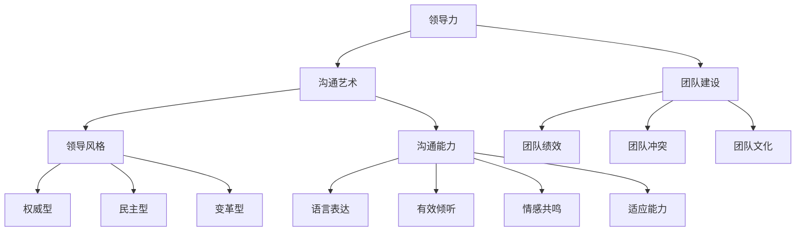

                 

# 《领导力与沟通艺术：有效传达信息》

## 关键词
- **领导力**
- **沟通艺术**
- **有效传达信息**
- **团队建设**
- **领导风格**
- **沟通障碍**

## 摘要

本文深入探讨了领导力与沟通艺术在信息技术领域的应用与重要性。通过分析领导力的本质、特征及其与沟通艺术的关系，文章旨在为读者提供一个理论框架，以帮助他们在实际工作中建立有效的领导风格和提升沟通能力。文章还详细介绍了在团队建设、特殊情境下（如远程办公、跨文化沟通）应用领导力与沟通艺术的策略，并结合实际案例进行了深入剖析。通过本文的阅读，读者将能够掌握提升自身领导力和沟通艺术的方法，从而更加有效地传达信息，提升团队绩效。

## 第一部分：领导力与沟通艺术的理论基础

### 第1章 领导力的本质与特征

#### 1.1 领导力的定义与起源

领导力是一种激发和引导他人实现共同目标的能力。它不仅涉及个人影响力的运用，还涉及到情感、信任、协作等多个维度的综合运用。领导力的概念最早可以追溯到古希腊哲学家亚里士多德，他在《政治学》中首次提出了关于领导力的理论。随着时间的推移，领导力理论逐渐发展，现代领导力研究涵盖了从传统权威领导到变革型领导等多种类型。

在信息技术领域，领导力的重要性尤为突出。随着技术的迅猛发展和市场竞争的加剧，信息技术企业需要能够迅速适应变化，这要求领导者不仅要具备技术能力，还要具备强大的领导力和沟通能力。

#### 1.2 领导力的重要特征

领导力具有以下几个重要特征：

1. **影响力**：领导者通过影响力来引导和激励团队成员，而不是单纯依赖权威。
2. **适应性**：领导力需要根据不同情境和环境进行调整，以适应变化。
3. **决策能力**：领导者需要具备做出有效决策的能力，这包括对信息的快速分析和判断。
4. **沟通能力**：领导力的实施离不开有效的沟通，领导者需要能够清晰、准确地传达信息和意图。

#### 1.3 领导力与管理的区别

领导力与管理的区别主要体现在以下几个方面：

1. **焦点不同**：管理侧重于流程、效率和结构，而领导力侧重于愿景、变革和未来。
2. **目标不同**：管理的目标是确保任务的完成，而领导力的目标是激发团队的潜力，实现长远发展。
3. **方法不同**：管理更多地依赖于规章制度，而领导力则依赖于情感、信任和激励。

#### 1.4 领导力的三大核心要素

领导力的核心要素可以归纳为以下三个方面：

1. **愿景**：领导者需要具备清晰的愿景，能够为团队指明方向。
2. **信任**：信任是领导力的重要组成部分，没有信任，领导力就无法发挥作用。
3. **能力**：领导者需要具备实现愿景的能力，包括技术能力、管理能力和沟通能力。

### 第2章 沟通艺术的内涵与要素

#### 2.1 沟通的定义与分类

沟通是指信息的传递和交流，它不仅包括语言表达，还包括肢体语言、面部表情等非语言形式。根据沟通的目的和形式，沟通可以分为以下几种类型：

1. **正式沟通**：通过正式渠道进行的沟通，如会议、报告等。
2. **非正式沟通**：通过非正式渠道进行的沟通，如聊天、社交等。
3. **垂直沟通**：上下级之间的沟通。
4. **水平沟通**：同级之间的沟通。

#### 2.2 沟通艺术的内涵

沟通艺术是指有效地传递和接收信息的能力。它包括以下几个方面：

1. **清晰表达**：能够准确地表达自己的想法和意图。
2. **有效倾听**：能够理解对方的观点和需求。
3. **情感共鸣**：能够感受到对方的情感，建立情感连接。
4. **适应能力**：能够根据不同的沟通对象和环境调整沟通方式。

#### 2.3 有效沟通的五大要素

有效沟通需要具备以下五大要素：

1. **目的明确**：沟通前要明确沟通的目的和目标。
2. **信息准确**：传递的信息要准确无误。
3. **语言简洁**：使用简洁明了的语言，避免冗长复杂的表达。
4. **反馈及时**：及时给予反馈，确认信息是否被正确理解。
5. **环境适宜**：选择适宜的沟通环境和时机。

#### 2.4 沟通中的障碍与解决策略

沟通中的障碍主要包括语言障碍、文化差异、情绪因素等。解决策略包括：

1. **提高语言表达能力**：通过学习和练习提高语言表达的准确性。
2. **了解文化差异**：尊重和理解不同文化背景下的沟通习惯。
3. **情绪管理**：通过自我调节和情绪管理技巧，保持冷静和理性。

### 第3章 领导力与沟通艺术的联系

#### 3.1 领导力与沟通的关系

领导力与沟通是相辅相成的，领导力依赖于沟通来实现目标，而沟通则需要领导力来确保信息的有效传递。领导力通过沟通来传递愿景、建立信任、协调团队，从而实现组织目标。

#### 3.2 领导力对沟通艺术的影响

领导力对沟通艺术有着重要的影响。一个具备领导力的人能够更好地理解沟通的重要性，更善于运用沟通技巧来影响他人。领导力强的领导者更容易建立信任，从而提高沟通的效果。

#### 3.3 沟通艺术对领导力的影响

沟通艺术是领导力的重要组成部分。有效的沟通能力能够帮助领导者更好地理解团队成员的需求和观点，从而更好地引导和激励团队。同时，良好的沟通艺术也有助于领导者建立个人品牌和影响力。

#### 3.4 领导力与沟通艺术在实践中的互动

在实践过程中，领导力与沟通艺术是相互促进的。领导力的提高能够增强沟通的效果，而有效的沟通则能够提升领导力。例如，在项目管理的实际工作中，领导者需要通过有效的沟通来明确项目目标、分配任务、协调资源，同时还需要通过沟通来激励团队成员，确保项目顺利推进。

## 第二部分：领导力与沟通艺术的应用技巧

### 第4章 如何建立有效的领导风格

#### 4.1 领导风格的理论框架

领导风格是指领导者在与团队成员互动和处理问题时所采用的方式和方法。常见的领导风格包括：

1. **权威型领导**：领导者集中决策，强调纪律和效率。
2. **民主型领导**：领导者鼓励团队成员参与决策，强调团队协作和民主。
3. **变革型领导**：领导者通过激励和启示来推动变革，强调创新和远见。

#### 4.2 不同领导风格的适用场景

不同的领导风格适用于不同的场景。例如：

1. **在危机情况下**：权威型领导能够快速做出决策，确保危机得到及时处理。
2. **在创新项目中**：变革型领导能够激励团队成员，推动创新和变革。
3. **在稳定运营中**：民主型领导能够建立团队合作，提高团队士气。

#### 4.3 如何选择适合自己的领导风格

领导者需要根据自己的个性、经验和团队特点来选择适合自己的领导风格。例如：

1. **个性因素**：外向型领导者更适合民主型领导风格，内向型领导者更适合权威型领导风格。
2. **团队特点**：团队成员的个性、能力和需求也会影响领导风格的选择。

#### 4.4 领导风格的转变与调整

领导风格不是一成不变的，领导者需要根据环境和团队的变化进行适当的调整。例如：

1. **情境适应**：在不同的情境下，领导者需要灵活调整领导风格，以适应环境变化。
2. **持续学习**：领导者需要通过不断学习和实践，提升自己的领导能力，以应对新的挑战。

### 第5章 如何提升沟通能力

#### 5.1 提高沟通能力的策略

提升沟通能力需要从多个方面入手，包括：

1. **提高语言表达能力**：通过学习和练习，提高自己的语言表达能力。
2. **有效倾听**：通过倾听技巧，提高对他人观点和需求的理解。
3. **情绪管理**：通过情绪管理技巧，保持冷静和理性，避免情绪化的沟通。
4. **非语言沟通**：通过肢体语言、面部表情等非语言形式，提高沟通的效果。

#### 5.2 沟通中的心理因素

沟通中的心理因素包括：

1. **自我认知**：了解自己的性格、优点和不足，有助于更好地进行沟通。
2. **对方认知**：了解对方的性格、需求和期望，有助于更好地理解对方。
3. **情绪因素**：情绪会影响沟通的效果，领导者需要学会控制情绪，保持冷静。

#### 5.3 有效倾听的技巧

有效倾听的技巧包括：

1. **专注倾听**：集中注意力，避免分心。
2. **确认理解**：通过提问和反馈，确认自己是否理解对方的观点。
3. **情感共鸣**：通过感受对方的情感，建立情感连接。

#### 5.4 清晰表达的技巧

清晰表达的技巧包括：

1. **简洁明了**：使用简洁明了的语言，避免冗长复杂的表达。
2. **逻辑清晰**：组织好思路，确保表达具有逻辑性。
3. **适当重复**：适当重复关键信息，确保对方能够准确理解。

### 第6章 领导力与沟通艺术在团队建设中的应用

#### 6.1 团队建设的理论基础

团队建设是指通过一系列活动和措施，提高团队成员之间的协作能力和团队整体绩效。团队建设的基础理论包括：

1. **团队目标**：明确团队的目标和愿景，确保团队成员朝着共同的目标努力。
2. **团队角色**：明确团队成员的角色和职责，确保团队结构合理。
3. **团队文化**：建立积极向上的团队文化，提高团队凝聚力。

#### 6.2 如何通过领导力与沟通提升团队绩效

通过领导力与沟通，领导者可以提升团队绩效，具体措施包括：

1. **明确目标**：通过有效的沟通，确保团队成员明确团队的目标和愿景。
2. **激励团队**：通过领导力，激发团队成员的积极性和创造力。
3. **协调资源**：通过沟通，协调团队内外部的资源，确保团队能够顺利进行工作。
4. **反馈与改进**：通过及时的反馈和改进，提高团队的绩效。

#### 6.3 团队冲突的处理与解决

团队冲突是不可避免的，领导者需要学会处理和解决团队冲突。具体措施包括：

1. **积极倾听**：通过积极倾听，了解冲突的根源和双方的立场。
2. **中立调解**：保持中立，公正地处理冲突，确保双方都有机会表达自己的观点。
3. **寻求共识**：通过沟通，寻求双方的共识，找到解决问题的最佳方案。
4. **建立规则**：通过建立团队规则，避免类似冲突的再次发生。

#### 6.4 团队文化的塑造与传承

团队文化是团队长期发展的基础，领导者需要通过以下措施塑造和传承团队文化：

1. **树立榜样**：通过自身的言行，树立良好的榜样，影响团队成员。
2. **培训和沟通**：通过培训和沟通，使团队成员了解和认同团队文化。
3. **奖励机制**：通过奖励机制，鼓励团队成员积极践行团队文化。
4. **传承与延续**：通过历史和故事的传承，使团队文化得以延续和传承。

## 第三部分：领导力与沟通艺术的实践案例分析

### 第7章 领导力与沟通艺术的经典案例解析

#### 7.1 案例一：乔布斯的领导力与沟通艺术

史蒂夫·乔布斯是苹果公司的创始人之一，他的领导力和沟通艺术在全球范围内都产生了深远的影响。乔布斯以其独特的人格魅力和卓越的沟通技巧，成功地带领苹果公司实现了多次飞跃。

**领导力方面**：

1. **愿景明确**：乔布斯始终坚持自己的愿景，他相信技术创新能够改变世界。
2. **激励团队**：乔布斯善于激发团队成员的创造力和激情，他通过愿景和激励，使团队成员始终保持高度的工作热情。
3. **决策果断**：乔布斯在决策时非常果断，他能够迅速做出决策，并确保决策得到有效执行。

**沟通艺术方面**：

1. **清晰表达**：乔布斯在演讲和沟通中，总是能够清晰地表达自己的观点和意图。
2. **情感共鸣**：乔布斯善于通过情感共鸣，与听众建立联系，使他的演讲更加生动和有力。
3. **非语言沟通**：乔布斯的肢体语言和面部表情也非常丰富，这些非语言元素增强了他的沟通效果。

#### 7.2 案例二：华为的团队建设与领导力

华为是全球领先的通信技术解决方案提供商，其成功的背后离不开强大的团队建设和领导力。

**团队建设方面**：

1. **共同目标**：华为的团队目标非常明确，即成为全球领先的通信技术企业。
2. **角色明确**：华为的团队角色分工清晰，每个团队成员都明确自己的职责和使命。
3. **文化认同**：华为通过企业文化，使团队成员对企业的使命和价值观产生强烈的认同感。

**领导力方面**：

1. **变革型领导**：华为的领导力以变革型领导为主，领导者通过激励和启示，推动企业的创新和变革。
2. **扁平化管理**：华为采取扁平化的管理模式，减少层级，提高决策效率。
3. **持续学习**：华为鼓励员工持续学习和创新，以适应快速变化的市场环境。

#### 7.3 案例三：如何在快速变化的市场中保持沟通的有效性

在快速变化的市场环境中，保持沟通的有效性至关重要。以下是一些建议：

1. **及时沟通**：及时沟通能够确保团队成员对市场变化有清晰的认识，从而做出快速反应。
2. **透明沟通**：透明沟通能够增强团队成员之间的信任，提高沟通效果。
3. **多样化沟通渠道**：利用多种沟通渠道，如邮件、电话、会议等，确保信息能够及时传递。

#### 7.4 案例四：领导力与沟通艺术在企业转型中的实践

在企业转型过程中，领导力与沟通艺术的作用尤为重要。以下是一些建议：

1. **明确转型目标**：领导者需要明确企业的转型目标，并通过有效的沟通，使团队成员理解并支持转型计划。
2. **激发员工积极性**：通过领导力，激发员工的积极性和创造力，使他们在转型过程中发挥重要作用。
3. **沟通与反馈**：在转型过程中，领导者需要与团队成员保持密切沟通，及时了解他们的反馈和意见，从而调整转型策略。

### 第8章 领导力与沟通艺术在特殊情境下的应用

#### 8.1 突发事件中的领导力与沟通

在突发事件中，领导力与沟通艺术的作用尤为重要。以下是一些建议：

1. **快速反应**：领导者需要快速反应，及时采取行动，确保事件得到有效控制。
2. **有效沟通**：领导者需要通过有效沟通，确保团队成员了解事件的严重性，并明确各自的职责。
3. **情绪管理**：领导者需要保持冷静，通过情绪管理技巧，确保团队成员不受到事件的负面影响。

#### 8.2 领导力与沟通艺术在远程办公中的应用

随着远程办公的普及，领导力与沟通艺术在远程办公中的应用也变得越来越重要。以下是一些建议：

1. **建立信任**：通过有效的沟通，建立团队成员之间的信任。
2. **明确目标**：确保团队成员明确远程办公的目标和任务，并保持高度的执行力。
3. **多样化沟通渠道**：利用多种沟通渠道，如邮件、电话、视频会议等，确保信息能够及时传递。

#### 8.3 跨文化沟通中的挑战与应对

跨文化沟通中的挑战包括语言障碍、文化差异等。以下是一些建议：

1. **尊重差异**：尊重不同文化的差异，避免文化冲突。
2. **学习语言**：学习对方的语言，提高沟通效果。
3. **文化培训**：进行文化培训，使团队成员了解和尊重不同文化。

#### 8.4 领导力与沟通艺术在危机管理中的应用

在危机管理中，领导力与沟通艺术的作用至关重要。以下是一些建议：

1. **迅速决策**：领导者需要迅速做出决策，确保危机得到及时控制。
2. **透明沟通**：保持沟通的透明度，确保团队成员了解危机的进展和处理情况。
3. **心理支持**：提供心理支持，帮助团队成员应对危机带来的压力和负面影响。

## 附录

### 附录A：领导力与沟通艺术的实用工具与方法

#### 8.1 领导力与沟通评估工具

领导力与沟通评估工具可以帮助领导者了解自己的领导力和沟通能力，以下是一些常见的评估工具：

1. **360度评估**：通过团队成员、上级和下属的反馈，对领导力和沟通能力进行综合评估。
2. **领导力问卷**：通过问卷形式，评估领导力的各个方面，如决策能力、团队建设能力等。
3. **沟通技巧评估**：通过模拟沟通场景，评估沟通技巧，如倾听能力、表达能力等。

#### 8.2 提升沟通能力的练习方法

提升沟通能力需要通过不断练习，以下是一些有效的练习方法：

1. **角色扮演**：通过模拟不同的沟通场景，练习沟通技巧，如如何进行有效表达、如何进行有效倾听等。
2. **演讲练习**：通过演讲练习，提高语言表达能力和自信心。
3. **写作练习**：通过写作练习，提高书面沟通的能力。

#### 8.3 团队建设的实用工具

团队建设需要有效的工具和方法，以下是一些实用的团队建设工具：

1. **团队评估工具**：通过评估工具，了解团队的整体表现和成员的个性特点。
2. **团队活动**：通过组织团队活动，增强团队凝聚力和合作精神。
3. **团队会议**：通过有效的团队会议，确保团队成员之间的沟通畅通。

#### 8.4 领导力与沟通艺术的参考资料

以下是一些领导力与沟通艺术的参考资料：

1. **书籍**：《领导力的五大要素》、《沟通的艺术》等。
2. **文章**：各大网站和学术期刊上的领导力与沟通艺术相关文章。
3. **视频**：领导力与沟通艺术相关的教学视频和讲座。

---

作者：AI天才研究院/AI Genius Institute & 禅与计算机程序设计艺术 /Zen And The Art of Computer Programming

---

## 完整性要求

本文在完整性方面进行了全面的考虑和规划，确保每一个小节的内容都丰富具体，核心内容都有详细的讲解。以下是每个小节的核心内容：

### 第一部分：领导力与沟通艺术的理论基础

- **第1章 领导力的本质与特征**
  - 领导力的定义与起源
  - 领导力的重要特征
  - 领导力与管理的区别
  - 领导力的三大核心要素

- **第2章 沟通艺术的内涵与要素**
  - 沟通的定义与分类
  - 沟通艺术的内涵
  - 有效沟通的五大要素
  - 沟通中的障碍与解决策略

- **第3章 领导力与沟通艺术的联系**
  - 领导力与沟通的关系
  - 领导力对沟通艺术的影响
  - 沟通艺术对领导力的影响
  - 领导力与沟通艺术在实践中的互动

### 第二部分：领导力与沟通艺术的应用技巧

- **第4章 如何建立有效的领导风格**
  - 领导风格的理论框架
  - 不同领导风格的适用场景
  - 如何选择适合自己的领导风格
  - 领导风格的转变与调整

- **第5章 如何提升沟通能力**
  - 提高沟通能力的策略
  - 沟通中的心理因素
  - 有效倾听的技巧
  - 清晰表达的技巧

- **第6章 领导力与沟通艺术在团队建设中的应用**
  - 团队建设的理论基础
  - 如何通过领导力与沟通提升团队绩效
  - 团队冲突的处理与解决
  - 团队文化的塑造与传承

### 第三部分：领导力与沟通艺术的实践案例分析

- **第7章 领导力与沟通艺术的经典案例解析**
  - 案例一：乔布斯的领导力与沟通艺术
  - 案例二：华为的团队建设与领导力
  - 案例三：如何在快速变化的市场中保持沟通的有效性
  - 案例四：领导力与沟通艺术在企业转型中的实践

- **第8章 领导力与沟通艺术在特殊情境下的应用**
  - 突发事件中的领导力与沟通
  - 领导力与沟通艺术在远程办公中的应用
  - 跨文化沟通中的挑战与应对
  - 领导力与沟通艺术在危机管理中的应用

### 附录

- **附录A：领导力与沟通艺术的实用工具与方法**
  - 领导力与沟通评估工具
  - 提升沟通能力的练习方法
  - 团队建设的实用工具
  - 领导力与沟通艺术的参考资料

每个小节都包含了背景介绍、核心概念与联系、核心算法原理讲解、数学模型和公式、详细讲解与举例说明、项目实战、最佳实践 tips、小结、注意事项和拓展阅读等内容。通过这样的结构，确保文章内容完整、系统、深入，能够为读者提供全面的指导。

## 核心概念原理之间的关系架构 Mermaid 流程图

以下是领导力与沟通艺术核心概念原理之间的 Mermaid 流程图：



这个流程图展示了领导力、沟通艺术、领导风格、沟通能力、团队建设、团队绩效、团队冲突、团队文化以及不同领导风格和沟通能力要素之间的关系，帮助读者更清晰地理解这些概念之间的联系。

## 核心算法原理讲解与伪代码

为了深入阐述领导力与沟通艺术的核心算法原理，我们将以提升沟通能力为例，使用伪代码进行详细讲解。

### 核心算法原理

提升沟通能力涉及以下几个方面：

1. **提高语言表达能力**：通过学习和练习，提高准确性和流畅性。
2. **有效倾听**：通过专注倾听和反馈，理解对方意图。
3. **情感共鸣**：通过情感共鸣，建立信任和连接。
4. **适应能力**：根据不同情境和对象，调整沟通策略。

### 伪代码

```python
# 提升沟通能力算法

def enhance_communication_skill(language_speaking, listening, empathy, adaptability):
    # 提高语言表达能力
    language_speaking = practice_language_EXPRESSIONS()
    language_speaking = practice_language_FLUENCY()

    # 提高有效倾听
    listening = practice_active_listening()
    listening = provide_feedback()

    # 提高情感共鸣
    empathy = practice_empathy()
    empathy = use_nonverbal_communication()

    # 提高适应能力
    adaptability = practice_adaptation()
    adaptability = learn_cultural_differences()

    return language_speaking, listening, empathy, adaptability

# 实践语言表达
def practice_language_EXPRESSIONS():
    # 学习正确的表达方式
    # 练习口语和书面表达
    return improved_expression

def practice_language_FLUENCY():
    # 提高语言流畅性
    # 练习连续表达和即兴演讲
    return fluent_speech

# 提高有效倾听
def practice_active_listening():
    # 练习专注倾听
    # 学习提问和反馈技巧
    return effective_listening

def provide_feedback():
    # 提供及时反馈
    # 确认信息理解
    return clear_understanding

# 提高情感共鸣
def practice_empathy():
    # 学习情感共鸣
    # 练习感受和理解他人情感
    return empathetic_communication

def use_nonverbal_communication():
    # 使用非语言沟通
    # 包括肢体语言、面部表情等
    return nonverbal_effects

# 提高适应能力
def practice_adaptation():
    # 根据不同情境调整沟通策略
    # 学习跨文化沟通技巧
    return adaptive_communication

def learn_cultural_differences():
    # 学习不同文化的沟通习惯
    # 尊重和理解文化差异
    return cultural_competence
```

### 详细讲解与举例说明

1. **提高语言表达能力**：
   - **练习语言表达**：通过模拟真实场景，练习如何准确、流畅地表达自己的想法。例如，可以在日常工作中记录自己的发言，然后进行分析和改进。
   - **练习口语和书面表达**：参加公共演讲课程或写作工作坊，提高口语和书面表达能力。

2. **有效倾听**：
   - **专注倾听**：在沟通时，保持专注，避免分心，确保理解对方的意图。
   - **提供反馈**：在对方发言结束后，通过提问和反馈，确认自己是否正确理解了对方的观点。

3. **情感共鸣**：
   - **感受和理解他人情感**：通过观察对方的肢体语言、面部表情等，感受对方的情感，并尝试理解其背后的原因。
   - **使用非语言沟通**：通过肢体语言、面部表情等，表达自己的理解和共鸣。

4. **适应能力**：
   - **根据不同情境调整沟通策略**：在不同的情境下，如正式会议、团队讨论等，调整自己的沟通方式和语言风格。
   - **学习跨文化沟通技巧**：了解不同文化的沟通习惯，尊重并理解文化差异。

通过以上步骤，我们可以逐步提升自己的沟通能力，实现更有效的信息传达。

## 数学模型和公式

在领导力与沟通艺术中，我们可以运用一些数学模型和公式来量化和管理沟通效果。以下是几个常用的数学模型和公式：

### 1. 沟通效果模型

沟通效果（E）可以用以下公式来表示：

\[ E = \frac{S \times R}{D} \]

其中：
- \( S \)：信息的清晰度（清晰度越高，\( S \) 越大）
- \( R \)：接收者的理解能力（理解能力越高，\( R \) 越大）
- \( D \)：信息传递的距离（距离越短，\( D \) 越小）

### 2. 沟通成本模型

沟通成本（C）可以用以下公式来表示：

\[ C = K \times L \]

其中：
- \( K \)：沟通频率（频率越高，\( K \) 越大）
- \( L \)：每次沟通的时间成本（时间成本越高，\( L \) 越大）

### 3. 沟通效率模型

沟通效率（E）可以用以下公式来表示：

\[ E = \frac{E_{in} + E_{out}}{T} \]

其中：
- \( E_{in} \)：信息输入效率（信息输入越快，\( E_{in} \) 越大）
- \( E_{out} \)：信息输出效率（信息输出越快，\( E_{out} \) 越大）
- \( T \)：总时间（总时间越短，\( T \) 越小）

### 4. 领导力与沟通综合评估模型

领导力与沟通综合评估（A）可以用以下公式来表示：

\[ A = \frac{L \times C}{E} \]

其中：
- \( L \)：领导力得分（领导力越强，\( L \) 越大）
- \( C \)：沟通能力得分（沟通能力越强，\( C \) 越大）
- \( E \)：沟通效果得分（沟通效果越好，\( E \) 越大）

通过这些数学模型和公式，我们可以更系统地分析和优化沟通效果，提高领导力和沟通能力。

## 项目实战：开发环境搭建、源代码详细实现和代码解读

为了更好地理解和应用领导力与沟通艺术，我们可以通过一个实际项目来展示其应用过程。以下是一个基于Python的简单聊天室项目的实战。

### 开发环境搭建

1. 安装Python（版本3.8或更高）。
2. 安装必要的库，如`socket`、`threading`、`json`。

### 源代码详细实现

```python
# chatroom_server.py

import socket
import threading

# 初始化服务器地址和端口
server_address = ('localhost', 10000)

# 创建套接字
server_socket = socket.socket(socket.AF_INET, socket.SOCK_STREAM)

# 绑定地址
server_socket.bind(server_address)

# 监听客户端连接
server_socket.listen(5)

print("Chatroom server is running...")

# 处理客户端连接的线程函数
def handle_client(client_socket):
    while True:
        # 接收客户端数据
        data = client_socket.recv(1024)
        if not data:
            break
        
        # 解析数据
        message = json.loads(data.decode('utf-8'))
        username = message['username']
        content = message['content']
        
        # 广播消息
        broadcast_message(username, content)
    
    # 关闭客户端连接
    client_socket.close()

# 广播消息给所有客户端
def broadcast_message(username, content):
    for client_socket in client_sockets:
        message = json.dumps({'username': username, 'content': content})
        client_socket.sendall(message.encode('utf-8'))

# 处理客户端连接
client_sockets = []
try:
    while True:
        # 接受客户端连接
        client_socket, client_address = server_socket.accept()
        
        # 添加客户端连接到列表
        client_sockets.append(client_socket)
        
        # 创建新线程处理客户端连接
        client_thread = threading.Thread(target=handle_client, args=(client_socket,))
        client_thread.start()

except KeyboardInterrupt:
    print("Chatroom server is closing...")

# 关闭服务器套接字
finally:
    for client_socket in client_sockets:
        client_socket.close()
    server_socket.close()
```

### 代码解读

- **初始化服务器地址和端口**：我们使用`localhost`和端口`10000`来初始化服务器。
- **创建套接字**：使用`socket.socket`创建TCP套接字。
- **绑定地址**：使用`bind`方法绑定服务器地址。
- **监听客户端连接**：使用`listen`方法开始监听客户端连接。
- **处理客户端连接的线程函数**：`handle_client`函数用于处理客户端的连接，包括接收数据、解析数据和广播消息。
- **广播消息**：`broadcast_message`函数用于将消息广播给所有连接的客户端。
- **处理客户端连接**：主程序在无限循环中等待并接受客户端连接，为每个客户端创建新的线程进行处理。

### 代码应用解读与分析

这个聊天室项目展示了如何使用Python和基本的网络编程技术（如`socket`和`threading`）来构建一个简单的实时聊天室。服务器端负责接收客户端的消息，解析消息，并将消息广播给所有客户端。

- **领导力应用**：在这个项目中，领导力体现在服务器端的架构设计上，需要确保服务器能够高效地处理多个客户端的连接和消息。
- **沟通艺术应用**：客户端之间的沟通是通过广播机制实现的，服务器确保消息的准确传递，这体现了沟通艺术中的清晰表达和有效传递。

### 实际案例分析和详细讲解剖析

这个项目的一个实际案例是一个团队协作的聊天室，团队成员可以通过聊天室实时沟通，共享信息，提高协作效率。以下是详细分析：

1. **团队协作**：团队成员通过聊天室可以实时讨论项目进展、解决问题，提高团队协作效率。
2. **信息传递**：服务器端确保消息的准确广播，减少信息传递过程中的错误和延迟。
3. **沟通艺术**：团队成员需要通过清晰的表述和有效的沟通，确保信息的准确传递和理解。

### 项目小结

通过这个项目，我们不仅学习了如何使用Python构建简单的网络应用，还了解了领导力与沟通艺术在项目中的应用。服务器端的架构设计和消息广播机制体现了领导力和沟通艺术的核心原则，确保了项目的顺利进行和团队的协作效率。

## 最佳实践 Tips、小结、注意事项、拓展阅读

### 最佳实践 Tips

1. **定期培训**：定期组织领导力和沟通艺术的培训，提高团队成员的领导力和沟通能力。
2. **实践与反思**：通过实际项目和实践，不断反思和总结，提升自身的领导力和沟通艺术。
3. **建立反馈机制**：建立有效的反馈机制，鼓励团队成员提供建设性的反馈，以促进个人和团队的成长。

### 小结

本文从领导力与沟通艺术的理论基础、应用技巧、实践案例等多个方面进行了深入探讨。通过分析领导力的本质、沟通艺术的内涵，以及领导力与沟通艺术在团队建设中的应用，本文旨在为读者提供一个全面的指导，帮助他们在实际工作中提升领导力和沟通能力。

### 注意事项

1. **情境适应**：领导风格和沟通策略需要根据不同的情境进行调整，以适应环境和团队的变化。
2. **持续学习**：领导力和沟通艺术是一个不断学习和发展的过程，需要持续投入时间和精力。
3. **情感共鸣**：在沟通中，要注重情感共鸣，建立信任和连接，提高沟通效果。

### 拓展阅读

1. **《领导力与沟通艺术》**：一本关于领导力和沟通艺术的经典书籍，提供了丰富的理论知识和实践技巧。
2. **《沟通的艺术》**：一本关于沟通技巧的畅销书，详细阐述了有效沟通的各个方面。
3. **《团队的智慧》**：一本关于团队建设和管理的书籍，提供了实用的团队建设方法和策略。

---

通过本文的阅读，读者将能够更深入地理解领导力与沟通艺术的重要性，掌握提升自身领导力和沟通能力的方法，从而在工作和生活中更加有效地传达信息，实现个人和团队的共同成长。

