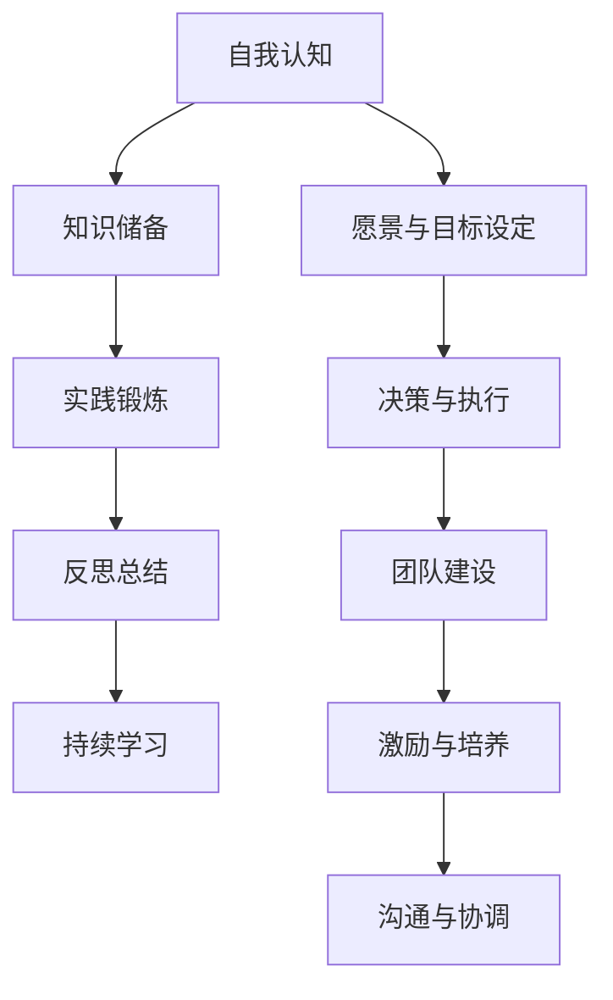

                 

# 领导力与沟通：有效传达期望的技巧

## 关键词

- 领导力
- 沟通技巧
- 有效传达
- 期望管理
- 团队建设

## 摘要

在现代企业管理中，领导力和沟通能力是管理者必须具备的核心素质。有效的领导力不仅在于指导团队完成任务，更在于如何明确传达期望，激励团队成员实现目标。本文将探讨领导力与沟通的基础，深入分析有效传达期望的技巧，并通过实际案例和实践经验，提供一系列提升领导力与沟通能力的策略。读者可以通过本文，了解领导力与沟通的重要性，掌握有效传达期望的方法，提升自己的管理能力，从而在企业管理中取得更好的成果。

## 目录大纲

《领导力与沟通：有效传达期望的技巧》

## 第一部分：领导力基础

### 第1章：领导力概述

#### 1.1 领导力的定义与重要性

领导力是一种影响力，它能够激励和引导团队成员实现共同目标的能力。领导力不仅仅是一种职位赋予的权力，更是一种个人素质和能力的体现。在企业管理中，领导力的重要性不言而喻。一个优秀的领导者能够带领团队克服困难，激发成员的潜力，实现组织目标。

首先，领导力是推动组织发展的重要动力。在一个成功的组织中，领导者扮演着至关重要的角色。他们不仅能够制定清晰的战略目标，还能够通过有效的领导力，激发团队成员的积极性，推动组织不断进步。

其次，领导力对于团队建设具有关键作用。一个优秀的领导者能够建立高效的团队，培养团队成员之间的信任和协作，从而提升团队的凝聚力和战斗力。

最后，领导力对于个人成长也有着重要影响。通过领导力的锻炼，个人可以提升自己的决策能力、沟通能力和问题解决能力，从而在职业发展中获得更多的机会。

#### 1.2 领导者的角色与责任

领导者的角色和责任是多方面的，主要包括以下几个方面：

1. **愿景与目标设定**：领导者需要明确组织的愿景和目标，并能够将这些目标传达给团队成员，激励他们为之努力。

2. **决策与执行**：领导者需要做出明智的决策，并确保这些决策能够得到有效执行。

3. **团队建设**：领导者需要关注团队的建设，培养团队成员之间的信任和协作，提升团队的凝聚力和战斗力。

4. **激励与培养**：领导者需要关注团队成员的成长，提供必要的培训和激励，帮助他们实现个人目标。

5. **沟通与协调**：领导者需要具备良好的沟通能力，能够与团队成员、上级领导和其他部门进行有效沟通，协调各方面资源，确保团队目标的实现。

#### 1.3 领导力的发展与实践

领导力的发展是一个长期的过程，需要通过不断的实践和学习来提升。以下是一些关键的步骤：

1. **自我认知**：领导者需要了解自己的优点和不足，明确自己的价值观和目标，从而更好地指导团队。

2. **知识储备**：领导者需要不断学习，积累相关领域的知识和经验，提升自己的专业素养。

3. **实践锻炼**：领导力的发展离不开实践。领导者可以通过参与项目、处理突发事件等方式，提升自己的实战能力。

4. **反思与总结**：领导者需要定期反思自己的行为和决策，总结经验教训，不断改进自己的领导方法。

5. **持续学习**：领导力是一个不断发展的领域，领导者需要保持学习的态度，关注行业动态，不断提升自己的领导力水平。

### 第2章：领导风格与团队建设

#### 2.1 领导风格的理论与实践

领导风格是领导者在与团队成员互动过程中表现出的行为和态度。常见的领导风格包括：

1. **专制型领导**：领导者独自做出决策，团队成员被动执行。
2. **民主型领导**：领导者鼓励团队成员参与决策过程，共同制定目标。
3. **放任型领导**：领导者给予团队成员极大的自由，让他们自行管理。

不同领导风格适用于不同的情况和环境。在实践中，领导者需要根据具体情况灵活调整自己的领导风格，以达到最佳效果。

#### 2.2 团队建设的关键要素

团队建设是领导力的重要组成部分。以下是一些关键要素：

1. **共同目标**：团队成员需要明确共同的目标，并为之努力。
2. **信任与尊重**：团队成员之间需要建立信任，尊重彼此的意见和贡献。
3. **沟通与协作**：良好的沟通和协作是团队高效运作的基础。
4. **激励与奖励**：领导者需要关注团队成员的需求，提供必要的激励和奖励。
5. **持续发展**：团队需要不断学习和改进，以适应不断变化的环境。

#### 2.3 激励与激励理论

激励是领导者引导团队成员发挥最大潜力的重要手段。以下是一些常见的激励理论：

1. **马斯洛需求层次理论**：认为人的需求分为生理需求、安全需求、社交需求、尊重需求和自我实现需求，领导者需要根据员工的不同需求提供相应的激励。
2. **赫茨伯格双因素理论**：认为激励因素（如成就、认可等）和卫生因素（如工作条件、薪酬等）共同影响员工的满意度和绩效。
3. **目标设置理论**：认为明确的目标和挑战性的任务能够激发员工的积极性和动力。

领导者需要根据不同员工的个性和需求，灵活运用各种激励理论，提升团队的整体绩效。

## 第二部分：沟通技巧提升

### 第3章：有效沟通的基础

#### 3.1 沟通模型与要素

有效沟通是一个复杂的过程，涉及到多个要素。以下是一个基本的沟通模型：

1. **信息发送者**：负责准备和发送信息。
2. **信息接收者**：负责接收和理解信息。
3. **信息内容**：沟通的主要内容。
4. **渠道**：信息传递的途径，如口头、书面、电子等。
5. **反馈**：接收者对信息的回应。
6. **干扰因素**：可能影响沟通效果的各种因素，如环境、情绪、文化差异等。

#### 3.2 非语言沟通的力量

非语言沟通是沟通中不可或缺的一部分，包括肢体语言、面部表情、声音语调等。以下是一些关键点：

1. **肢体语言**：肢体语言可以传达信息发送者的态度和情绪，如点头、眼神接触、手势等。
2. **面部表情**：面部表情可以传达喜悦、愤怒、悲伤等情绪。
3. **声音语调**：声音的音量、节奏、语调可以影响接收者的理解和感受。

#### 3.3 倾听的重要性与实践

倾听是有效沟通的核心。以下是一些倾听的技巧：

1. **全神贯注**：在对方讲话时，全神贯注，不要分心。
2. **积极反馈**：通过点头、目光接触等方式，给予积极的反馈，表明你在认真听。
3. **避免打断**：让对方说完，不要急于发表自己的意见。
4. **确认理解**：在对方讲话结束后，用自己的话复述对方的内容，确认理解无误。

### 第4章：沟通障碍与解决策略

#### 4.1 常见的沟通障碍

沟通障碍是影响沟通效果的重要因素。以下是一些常见的沟通障碍：

1. **语言障碍**：包括语言差异、词汇理解困难等。
2. **文化差异**：不同的文化背景可能导致沟通中的误解和冲突。
3. **情绪障碍**：情绪波动可能影响沟通的效果，如愤怒、沮丧等。
4. **心理障碍**：如自我保护、恐惧、偏见等。
5. **环境障碍**：如噪音、设备故障等。

#### 4.2 有效解决沟通障碍的策略

以下是一些解决沟通障碍的策略：

1. **明确目标**：在沟通前，明确沟通的目标和预期结果。
2. **文化敏感**：了解并尊重不同文化的沟通习惯和方式。
3. **情绪管理**：学会管理自己的情绪，避免情绪化影响沟通。
4. **积极倾听**：通过积极倾听，理解对方的观点和需求。
5. **使用简单语言**：避免使用复杂和模糊的语言，确保信息的清晰传达。

#### 4.3 跨文化沟通的挑战与应对

跨文化沟通是全球化背景下的一项重要技能。以下是一些跨文化沟通的挑战与应对策略：

1. **挑战**：
   - 语言障碍
   - 文化差异
   - 沟通风格差异
2. **应对策略**：
   - 提前了解对方的文化背景
   - 使用简单、明确的语言
   - 采取开放、尊重的态度
   - 培养跨文化沟通的意识

### 第5章：沟通技巧提升策略

#### 5.1 提升沟通效果的技巧

以下是一些提升沟通效果的技巧：

1. **清晰表达**：确保信息传递的清晰和准确。
2. **有效倾听**：通过积极的反馈，确保对方理解你的信息。
3. **适当使用非语言沟通**：如肢体语言、面部表情等，增强沟通效果。
4. **控制情绪**：避免情绪影响沟通的效果。
5. **建立信任**：通过诚信和尊重，建立良好的沟通基础。

#### 5.2 情绪管理与沟通

情绪管理是沟通的重要组成部分。以下是一些情绪管理的技巧：

1. **自我认知**：了解自己的情绪，避免情绪化行为。
2. **情绪释放**：找到合适的途径，释放负面情绪。
3. **理性思考**：在情绪稳定后，理性分析问题。
4. **积极沟通**：通过沟通，解决情绪问题，提升沟通效果。

#### 5.3 高效会议沟通技巧

会议是沟通的重要方式，以下是一些高效会议沟通的技巧：

1. **明确会议目标**：在会议前明确会议的目标和议程。
2. **控制会议时间**：避免会议时间过长，确保会议高效。
3. **积极参与**：在会议中积极发言，提出建设性意见。
4. **记录会议内容**：详细记录会议内容和决策。
5. **会后跟进**：确保会议决策得到有效执行。

## 第三部分：传达期望的技巧

### 第6章：明确传达期望的重要性

#### 6.1 期望的定义与类型

期望是指团队成员对领导者的期望，以及领导者对团队成员的期望。根据性质，期望可以分为以下几类：

1. **任务期望**：领导者对团队成员完成任务的质量和效率的期望。
2. **行为期望**：领导者对团队成员在工作中的行为规范的期望。
3. **发展期望**：领导者对团队成员个人成长和职业发展的期望。

#### 6.2 期望传达的原则

有效传达期望需要遵循以下原则：

1. **明确性**：确保期望表达清晰、具体，避免模糊和歧义。
2. **一致性**：领导者需要在不同场合和不同成员中保持期望的一致性。
3. **及时性**：及时传达期望，避免拖延和误解。
4. **互动性**：鼓励团队成员提问和反馈，确保他们对期望的理解。

#### 6.3 期望传达的挑战与解决方法

期望传达过程中可能面临以下挑战：

1. **信息传递障碍**：如语言障碍、文化差异等。
2. **心理障碍**：如恐惧、不安全感等。
3. **沟通障碍**：如噪音、环境干扰等。

解决方法：

1. **优化沟通渠道**：选择适当的沟通方式和渠道，确保信息的有效传达。
2. **建立信任**：通过诚信和尊重，建立良好的沟通基础。
3. **积极倾听**：通过积极倾听，确保团队成员对期望的理解。

### 第7章：如何有效传达期望

#### 7.1 传达期望的步骤与策略

以下是一些传达期望的步骤与策略：

1. **准备**：明确期望的内容，准备相关材料。
2. **沟通**：选择合适的时机和方式，与团队成员进行沟通。
3. **确认**：确保团队成员理解期望，及时反馈和调整。
4. **跟进**：确保期望得到有效执行，及时提供反馈和支持。

#### 7.2 建立信任与共识

建立信任是有效传达期望的基础。以下是一些建立信任和共识的策略：

1. **诚信**：领导者需要诚信行事，言行一致。
2. **尊重**：尊重团队成员的意见和贡献，建立平等的关系。
3. **透明**：保持信息透明，避免隐瞒和误导。
4. **共识**：通过讨论和协商，达成共识，确保团队成员对期望的理解和认同。

#### 7.3 演练与反馈的重要性

演练和反馈是确保期望有效传达的重要环节。以下是一些演练和反馈的策略：

1. **演练**：通过模拟实际情况，让团队成员熟悉期望内容和执行流程。
2. **反馈**：及时提供反馈，鼓励团队成员提出问题和改进建议。
3. **改进**：根据反馈进行改进，不断提升期望的传达效果。

## 第四部分：实践与反思

### 第8章：领导力与沟通的实践

#### 8.1 实际案例分享

以下是一些实际案例，展示领导力与沟通在企业管理中的应用：

1. **案例一**：某公司通过有效的领导力和沟通，成功实现了从传统制造业向数字化转型的目标。
2. **案例二**：某团队通过建立信任和共识，成功克服了跨文化沟通的障碍，实现了项目的高效执行。

#### 8.2 成功案例解析

以下是对成功案例的解析，分析其成功的原因和可借鉴的经验：

1. **原因**：成功的原因可能包括领导力的有效运用、沟通技巧的提升、团队建设的高效等。
2. **经验**：可以借鉴的经验包括明确目标、建立信任、有效沟通、持续改进等。

#### 8.3 实践中的常见问题与解决

以下是一些实践中的常见问题及解决方法：

1. **问题一**：沟通障碍，如语言障碍、文化差异等。
   - 解决方法：优化沟通渠道，建立信任，提供培训。
2. **问题二**：期望传达不清，如期望模糊、不一致等。
   - 解决方法：明确期望，保持一致性，提供反馈和支持。

### 第9章：领导力与沟通的持续提升

#### 9.1 持续学习与自我提升

领导力和沟通能力的提升是一个持续的过程。以下是一些持续学习与自我提升的策略：

1. **阅读与研究**：阅读相关书籍、研究报告，了解最新的理论和实践。
2. **实践与反思**：通过实践，总结经验，不断提升自己的领导力和沟通能力。
3. **培训与学习**：参加培训课程，学习新的知识和技能。

#### 9.2 反思与总结

反思和总结是提升领导力和沟通能力的重要环节。以下是一些反思和总结的策略：

1. **定期反思**：定期反思自己的行为和决策，总结经验教训。
2. **总结经验**：总结成功和失败的经验，找出可借鉴和改进之处。
3. **持续改进**：根据反思和总结的结果，制定改进计划，不断提升自己的领导力和沟通能力。

#### 9.3 领导力与沟通的未来趋势

未来，领导力和沟通将面临以下趋势：

1. **数字化**：随着数字化技术的发展，领导力和沟通将更加依赖于数字工具和平台。
2. **全球化**：全球化将带来更多的跨文化沟通挑战，领导力和沟通能力需要适应多样化的文化背景。
3. **智能化**：人工智能技术的发展将改变领导力和沟通的方式，领导者需要具备适应智能化的能力。

## 附录

### 附录A：领导力与沟通相关资源

以下是一些领导力与沟通的推荐资源：

1. **推荐书籍**：
   - 《领导力五种力量》
   - 《沟通的艺术》
   - 《非暴力沟通》
2. **优秀博客与网站**：
   - TED演讲
   - Harvard Business Review
   - Fast Company
3. **交流平台与社区**：
   - LinkedIn
   - Twitter
   - GitHub

### 附录B：Mermaid流程图

以下是一个领导力发展路径的Mermaid流程图：



### 附录C：核心算法原理讲解

以下是一个沟通技巧提升算法的伪代码：

```python
def communicate Effectively(message, receiver):
    # 清晰表达信息
    clear_message = makeClear(message)
    # 选择合适的沟通渠道
    channel = selectAppropriateChannel(receiver)
    # 发送信息
    sendMessage(clear_message, channel)
    # 确认接收者理解
    understanding = confirmUnderstanding(receiver)
    # 如果接收者理解，返回真；否则，返回假
    return understanding
```

### 附录D：数学模型与公式讲解

以下是一个激励理论数学模型的例子：

$$
Motivation = Intrinsic\ Motivation + Extrinsic\ Motivation
$$

其中，Intrinsic Motivation 代表内在动机，Extrinsic Motivation 代表外在动机。以下是一个沟通效率的数学公式：

$$
Communication\ Efficiency = \frac{Effective\ Communication\ Time}{Total\ Communication\ Time}
$$

### 附录E：项目实战案例

#### E.1 实际沟通项目案例

在某公司的一次重要项目中，项目团队成员来自不同的国家和文化背景，领导者在沟通中面临了诸多挑战。以下是对这个项目实战案例的分析：

1. **开发环境搭建**：为了确保团队成员能够顺利合作，领导者在项目启动前，搭建了一个统一的开发环境，包括代码管理工具、协作平台和远程会议系统。

2. **源代码详细实现和代码解读**：项目团队成员按照统一的编码规范，实现了项目的各个模块。在代码审查环节，领导者通过详细的代码解读，确保团队成员理解代码的功能和逻辑。

3. **代码应用解读与分析**：在项目执行过程中，领导者通过定期组织代码解读会议，分析代码的优缺点，提出改进建议。同时，领导者通过代码分析工具，监控项目的代码质量和效率。

4. **实际案例分析和详细讲解剖析**：领导者通过实际案例，分析了项目中的成功和失败经验，总结出有效的沟通策略和管理方法。

5. **项目小结**：在项目完成后，领导者组织团队成员进行项目总结，回顾项目中的亮点和不足，为未来的项目提供借鉴。

### 附录F：最佳实践 tips、小结、注意事项、拓展阅读等内容

1. **最佳实践 tips**：
   - 定期组织团队建设活动，增强团队凝聚力。
   - 使用多种沟通渠道，确保信息的全面传达。
   - 建立反馈机制，鼓励团队成员提出问题和建议。

2. **小结**：
   - 领导力和沟通能力是管理者必须具备的核心素质。
   - 有效传达期望是提升团队绩效的重要手段。
   - 通过持续学习和实践，不断提升自己的领导力和沟通能力。

3. **注意事项**：
   - 避免沟通中的误区，如误解、拖延等。
   - 关注团队成员的需求，提供个性化的激励和培养。

4. **拓展阅读**：
   - 《领导力的五个层次》
   - 《高绩效团队》
   - 《沟通的艺术》

## 作者信息

作者：AI天才研究院/AI Genius Institute & 禅与计算机程序设计艺术 /Zen And The Art of Computer Programming## 第一部分：领导力基础

### 第1章：领导力概述

#### 1.1 领导力的定义与重要性

领导力是一种在组织和团队中影响、激励和引导他人实现共同目标的能力。它不仅仅是一种职位赋予的权力，更是一种个人素质和能力的体现。在企业管理中，领导力的重要性不言而喻。

首先，领导力是推动组织发展的重要动力。在一个成功的组织中，领导者扮演着至关重要的角色。他们不仅能够制定清晰的战略目标，还能够通过有效的领导力，激发团队成员的积极性，推动组织不断进步。一个优秀的领导者能够看到组织的潜力，并通过自己的愿景和行动，带领团队实现目标。

其次，领导力对于团队建设具有关键作用。一个优秀的领导者能够建立高效的团队，培养团队成员之间的信任和协作，从而提升团队的凝聚力和战斗力。在团队中，领导者需要扮演多种角色，如指导者、激励者、协调者和支持者等，以适应不同的情境和需求。

最后，领导力对于个人成长也有着重要影响。通过领导力的锻炼，个人可以提升自己的决策能力、沟通能力和问题解决能力，从而在职业发展中获得更多的机会。领导力的发展不仅可以帮助个人在职业生涯中取得成功，还可以提升个人的自信心和影响力。

#### 1.2 领导者的角色与责任

领导者的角色和责任是多方面的，主要包括以下几个方面：

1. **愿景与目标设定**：领导者需要明确组织的愿景和目标，并能够将这些目标传达给团队成员，激励他们为之努力。领导者需要具备前瞻性，能够看到组织的未来发展方向，并制定清晰的战略目标。

2. **决策与执行**：领导者需要做出明智的决策，并确保这些决策能够得到有效执行。决策能力是领导者的重要素质之一，领导者需要在各种复杂情境中做出正确的选择，并确保决策能够顺利实施。

3. **团队建设**：领导者需要关注团队的建设，培养团队成员之间的信任和协作，提升团队的凝聚力和战斗力。团队建设是一个长期的过程，需要领导者投入时间和精力，通过有效的沟通和激励，建立高效、和谐的团队。

4. **激励与培养**：领导者需要关注团队成员的成长，提供必要的培训和激励，帮助他们实现个人目标。激励是领导力的重要组成部分，领导者需要了解团队成员的需求，提供合适的激励措施，激发他们的工作热情和潜力。

5. **沟通与协调**：领导者需要具备良好的沟通能力，能够与团队成员、上级领导和其他部门进行有效沟通，协调各方面资源，确保团队目标的实现。沟通是领导力的核心，领导者需要通过有效沟通，建立良好的关系，解决冲突，推动团队协作。

#### 1.3 领导力的发展与实践

领导力的发展是一个长期的过程，需要通过不断的实践和学习来提升。以下是一些关键的步骤：

1. **自我认知**：领导者需要了解自己的优点和不足，明确自己的价值观和目标，从而更好地指导团队。自我认知是领导力发展的基础，领导者需要通过反思和自我评估，认识自己的优势和潜力。

2. **知识储备**：领导者需要不断学习，积累相关领域的知识和经验，提升自己的专业素养。知识储备是领导者决策和执行的重要支撑，领导者需要具备广泛的知识视野和深厚的专业知识。

3. **实践锻炼**：领导力的发展离不开实践。领导者可以通过参与项目、处理突发事件等方式，提升自己的实战能力。实践是检验领导力的重要途径，领导者需要在实践中不断学习和改进。

4. **反思与总结**：领导者需要定期反思自己的行为和决策，总结经验教训，不断改进自己的领导方法。反思与总结是领导力提升的重要环节，领导者需要从成功和失败中吸取教训，不断提升自己的领导水平。

5. **持续学习**：领导力是一个不断发展的领域，领导者需要保持学习的态度，关注行业动态，不断提升自己的领导力水平。持续学习是领导者保持竞争力的重要手段，领导者需要不断更新知识和技能，以适应不断变化的环境。

### 第2章：领导风格与团队建设

#### 2.1 领导风格的理论与实践

领导风格是领导者在与团队成员互动过程中表现出的行为和态度。不同的领导风格适用于不同的情况和环境，领导者需要根据具体情境灵活调整自己的领导风格，以达到最佳效果。

常见的领导风格包括：

1. **专制型领导**：领导者独自做出决策，团队成员被动执行。这种领导风格适用于紧急情况和需要快速决策的场景，但在长期中可能导致团队成员的消极和不满。

2. **民主型领导**：领导者鼓励团队成员参与决策过程，共同制定目标。这种领导风格适用于需要团队合作和集体智慧的情境，能够增强团队的凝聚力和创新能力。

3. **放任型领导**：领导者给予团队成员极大的自由，让他们自行管理。这种领导风格适用于高度专业化和自主能力强的团队，但可能导致团队缺乏统一方向和协调。

在实际应用中，领导者需要根据具体情况，灵活运用不同的领导风格。例如，在面对紧急任务时，可以采用专制型领导风格，快速做出决策；在团队建设初期，可以采用民主型领导风格，激发团队成员的参与和热情；在团队成熟后，可以采用放任型领导风格，给予团队成员更多的自主权。

#### 2.2 团队建设的关键要素

团队建设是领导力的重要组成部分，一个高效的团队能够更好地实现组织目标。以下是一些团队建设的关键要素：

1. **共同目标**：团队成员需要明确共同的目标，并为之努力。共同目标是团队凝聚力的基础，也是团队协作的动力。领导者需要确保团队成员对目标的理解和认同，并不断提醒和强调。

2. **信任与尊重**：团队成员之间需要建立信任，尊重彼此的意见和贡献。信任是团队协作的基石，没有信任，团队将难以高效运作。领导者需要通过有效的沟通和互动，促进团队成员之间的信任关系。

3. **沟通与协作**：良好的沟通和协作是团队高效运作的基础。领导者需要建立有效的沟通机制，确保信息的及时传达和共享。同时，领导者需要培养团队成员的协作精神，鼓励他们相互支持和帮助。

4. **激励与奖励**：领导者需要关注团队成员的需求，提供必要的激励和奖励。激励是激发团队成员积极性的重要手段，领导者需要根据团队成员的不同需求，采取相应的激励措施。

5. **持续发展**：团队需要不断学习和改进，以适应不断变化的环境。领导者需要关注团队成员的个人成长，提供培训和学习机会，帮助团队成员不断提升自己的能力和素质。

#### 2.3 激励与激励理论

激励是领导者引导团队成员发挥最大潜力的重要手段。以下是一些常见的激励理论：

1. **马斯洛需求层次理论**：马斯洛认为，人的需求可以分为五个层次，即生理需求、安全需求、社交需求、尊重需求和自我实现需求。领导者需要了解团队成员的需求层次，并提供相应的激励措施，满足他们的需求。

2. **赫茨伯格双因素理论**：赫茨伯格认为，激励因素（如成就、认可、工作本身等）和卫生因素（如工作条件、薪酬等）共同影响员工的满意度和绩效。领导者需要关注激励因素，提供具有挑战性的工作任务和认可，激发员工的工作热情。

3. **目标设置理论**：目标设置理论认为，明确的目标和挑战性的任务能够激发员工的积极性和动力。领导者需要制定具有挑战性和可实现性的目标，并鼓励团队成员积极参与目标设置过程。

4. **公平理论**：公平理论认为，员工的激励程度取决于他们对自己和他人投入与回报的比较。领导者需要确保员工感受到公平的待遇，避免不公平现象的发生。

在实际应用中，领导者需要根据团队成员的具体情况，灵活运用不同的激励理论，制定有效的激励策略。例如，对于追求自我实现需求的员工，领导者可以提供挑战性的任务和培训机会；对于追求安全需求的员工，领导者可以提供稳定的工作环境和职业发展机会。

### 第3章：有效沟通的基础

#### 3.1 沟通模型与要素

有效沟通是一个复杂的过程，涉及到多个要素。以下是一个基本的沟通模型：

1. **信息发送者**：负责准备和发送信息。
2. **信息接收者**：负责接收和理解信息。
3. **信息内容**：沟通的主要内容。
4. **渠道**：信息传递的途径，如口头、书面、电子等。
5. **反馈**：接收者对信息的回应。
6. **干扰因素**：可能影响沟通效果的各种因素，如环境、情绪、文化差异等。

在沟通过程中，每个要素都起着关键作用。信息发送者需要确保信息内容清晰、准确，并选择合适的沟通渠道；信息接收者需要积极倾听，确保理解无误，并提供及时的反馈；渠道的选择也需要根据实际情况进行优化，以确保信息的有效传递。干扰因素如噪音、情绪波动和文化差异等，也可能影响沟通的效果，需要领导者和管理者加以关注和解决。

#### 3.2 非语言沟通的力量

非语言沟通是沟通中不可或缺的一部分，包括肢体语言、面部表情、声音语调等。以下是一些关键点：

1. **肢体语言**：肢体语言可以传达信息发送者的态度和情绪，如点头、眼神接触、手势等。肢体语言在沟通中具有很强的影响力，能够补充和强化语言表达。领导者需要注意自己的肢体语言，以传递积极的信号和建立信任。

2. **面部表情**：面部表情可以传达喜悦、愤怒、悲伤等情绪。面部表情在沟通中具有直观性和感染力，能够影响接收者的感受和情绪。领导者需要学会控制自己的面部表情，以避免负面情绪的传递。

3. **声音语调**：声音的音量、节奏、语调可以影响接收者的理解和感受。例如，高音量的声音可能传达出紧张和焦虑，而低音量的声音可能传达出平静和自信。领导者需要掌握不同的声音语调，以适应不同的沟通情境和需求。

#### 3.3 倾听的重要性与实践

倾听是有效沟通的核心。以下是一些倾听的技巧：

1. **全神贯注**：在对方讲话时，全神贯注，不要分心。领导者需要将注意力集中在对方的话语上，避免被外界因素干扰。

2. **积极反馈**：通过点头、目光接触等方式，给予积极的反馈，表明你在认真听。积极反馈可以鼓励对方继续讲话，并表明你对他们的观点感兴趣。

3. **避免打断**：让对方说完，不要急于发表自己的意见。打断对方可能会打断他们的思路，导致信息传递的混乱。

4. **确认理解**：在对方讲话结束后，用自己的话复述对方的内容，确认理解无误。确认理解可以确保沟通的准确性，避免误解和错误。

在实践中，领导者需要不断练习和提升自己的倾听技巧。以下是一些具体的方法：

1. **主动倾听**：在会议、讨论和日常沟通中，主动倾听对方的观点和需求，不要急于表达自己的意见。

2. **练习复述**：在与团队成员沟通后，尝试用自己的话复述对方的内容，以确保理解无误。

3. **反思与改进**：定期反思自己的沟通行为，总结倾听中的不足和改进之处，不断提升自己的倾听能力。

通过有效的倾听，领导者可以更好地理解团队成员的需求和期望，建立信任和合作关系，提高沟通效果。

### 第4章：沟通障碍与解决策略

#### 4.1 常见的沟通障碍

沟通障碍是影响沟通效果的重要因素。以下是一些常见的沟通障碍：

1. **语言障碍**：语言差异可能导致误解和沟通困难。团队成员来自不同的文化背景，使用不同的语言，可能会导致沟通中的障碍。

2. **文化差异**：不同的文化背景可能导致沟通中的误解和冲突。例如，某些文化强调直接表达，而另一些文化则倾向于间接表达。

3. **情绪障碍**：情绪波动可能影响沟通的效果。例如，愤怒、沮丧等情绪可能会使沟通变得紧张和冲突。

4. **心理障碍**：心理障碍如恐惧、不安全感等，也可能影响沟通。例如，团队成员可能因为害怕失败或害怕冲突，而不愿意表达自己的观点。

5. **环境障碍**：环境障碍如噪音、设备故障等，也可能影响沟通。例如，在嘈杂的环境中，团队成员可能难以集中注意力，导致沟通效果下降。

#### 4.2 有效解决沟通障碍的策略

以下是一些有效解决沟通障碍的策略：

1. **优化沟通渠道**：选择适当的沟通方式和渠道，确保信息的有效传达。例如，对于语言障碍，可以采用翻译服务或使用共同的语言。

2. **建立信任**：建立信任是解决沟通障碍的关键。领导者需要通过诚信和尊重，建立良好的沟通基础。例如，领导者可以通过倾听和回应团队成员的需求，建立信任。

3. **明确表达**：确保信息传达清晰、准确。领导者需要使用简单、明确的语言，避免使用复杂和模糊的术语。例如，在会议中，领导者可以提前准备发言稿，确保表达清晰。

4. **积极倾听**：通过积极倾听，确保对方理解你的信息。领导者需要全神贯注地倾听，避免打断对方，并提供积极的反馈。例如，在会议中，领导者可以定期询问团队成员是否理解发言内容。

5. **文化敏感**：了解并尊重不同文化的沟通习惯和方式。领导者需要了解团队成员的文化背景，避免使用可能引起误解的语言和行为。例如，在跨文化团队中，领导者可以组织文化培训，提高团队成员的文化敏感度。

6. **情绪管理**：学会管理自己的情绪，避免情绪化影响沟通。领导者需要学会控制情绪，保持冷静和理性。例如，在紧张的环境中，领导者可以暂时离开沟通现场，冷静思考后再进行沟通。

7. **提供反馈**：及时提供反馈，鼓励团队成员提出问题和改进建议。领导者需要建立反馈机制，确保沟通中的问题得到及时解决。例如，在会议结束后，领导者可以组织团队成员进行讨论，分享反馈和改进建议。

通过以上策略，领导者可以有效地解决沟通障碍，提高沟通效果，促进团队的协作和合作。

#### 4.3 跨文化沟通的挑战与应对

跨文化沟通是全球化背景下的一项重要技能。以下是一些跨文化沟通的挑战与应对策略：

1. **挑战**：

   - **语言障碍**：不同语言的使用可能导致沟通困难，误解和错误信息传递。

   - **文化差异**：不同文化背景下的价值观、行为规范和沟通风格可能导致冲突和误解。

   - **沟通风格差异**：不同文化对沟通的期望和方式有所不同，可能导致沟通不顺畅。

2. **应对策略**：

   - **提前准备**：在跨文化沟通前，了解对方的文化背景和沟通习惯。通过研究文化差异，制定相应的沟通策略。

   - **使用简单语言**：避免使用复杂和模糊的语言，确保信息的清晰传达。使用简单的词汇和句式，减少语言障碍。

   - **积极倾听**：通过积极倾听，确保对方理解你的信息。使用开放性的问题，鼓励对方表达观点，并提供反馈。

   - **建立信任**：建立信任是跨文化沟通的基础。通过诚信和尊重，建立良好的沟通基础。

   - **文化敏感**：了解并尊重不同文化的沟通习惯和方式。避免使用可能引起误解的语言和行为。

   - **培训与学习**：提供跨文化沟通的培训和学习机会，提高团队成员的文化敏感度和沟通技能。

   - **反馈与调整**：及时提供反馈，鼓励团队成员提出改进建议。根据反馈调整沟通策略，提高沟通效果。

通过以上策略，领导者可以有效地应对跨文化沟通的挑战，提高沟通效果，促进跨文化团队的合作和协作。

### 第5章：沟通技巧提升策略

#### 5.1 提升沟通效果的技巧

以下是一些提升沟通效果的技巧：

1. **清晰表达**：确保信息传达的清晰和准确。使用简单、明确的语言，避免使用复杂和模糊的术语。在表达观点时，使用具体的例子和事实支持。

2. **有效倾听**：通过积极的反馈，确保对方理解你的信息。在对方讲话时，全神贯注，避免分心。提供反馈，如点头、目光接触和复述对方的内容，确认理解无误。

3. **适当使用非语言沟通**：如肢体语言、面部表情和声音语调等，增强沟通效果。保持眼神接触，使用开放的身体姿态，以及使用恰当的声音语调，以传达积极的信号。

4. **情绪管理**：控制自己的情绪，避免情绪化影响沟通。在情绪波动时，暂时离开沟通现场，冷静思考后再进行沟通。

5. **建立信任**：通过诚信和尊重，建立良好的沟通基础。保持透明，避免隐瞒和误导。倾听对方的意见，尊重他们的观点和贡献。

6. **使用合适的沟通渠道**：根据沟通内容和情境，选择合适的沟通渠道。例如，对于重要和敏感的信息，选择面对面沟通；对于日常交流和协作，使用电子邮件、即时通讯工具等。

7. **反馈与改进**：及时提供反馈，鼓励团队成员提出问题和改进建议。建立反馈机制，确保沟通中的问题得到及时解决。

通过以上技巧，领导者可以提升沟通效果，促进团队的协作和合作，实现组织目标。

#### 5.2 情绪管理与沟通

情绪管理是沟通中至关重要的一环。以下是一些情绪管理的技巧：

1. **自我认知**：了解自己的情绪，避免情绪化行为。在情绪波动时，认识到自己的情绪状态，并寻找适当的方式来管理情绪。

2. **情绪释放**：找到合适的途径，释放负面情绪。例如，进行运动、写日记或与信任的朋友倾诉等。

3. **理性思考**：在情绪稳定后，理性分析问题。避免在情绪高涨时做出决策，以免后悔。

4. **积极沟通**：通过积极的沟通方式，解决情绪问题。例如，使用非攻击性的语言，表达自己的感受和需求，并倾听对方的观点。

5. **寻求支持**：在遇到情绪困扰时，寻求专业支持，如心理咨询师或教练等。

通过有效的情绪管理，领导者可以保持冷静和理性，提高沟通效果，促进团队的和谐与协作。

#### 5.3 高效会议沟通技巧

会议是沟通的重要方式，以下是一些高效会议沟通的技巧：

1. **明确会议目标**：在会议前，明确会议的目标和议程。确保所有参与者都清楚会议的目的和预期结果。

2. **准备充分**：在会议前，充分准备相关材料和信息。确保会议内容有条理，避免无关的讨论。

3. **控制会议时间**：避免会议时间过长，确保会议高效。制定会议议程，严格控制每个议题的时间，避免拖延。

4. **积极参与**：在会议中，积极参与讨论，提出建设性意见。鼓励团队成员发表观点，营造开放、包容的讨论氛围。

5. **记录会议内容**：详细记录会议内容和决策。确保会议记录清晰、准确，便于后续跟进和执行。

6. **会后跟进**：确保会议决策得到有效执行。在会后，与团队成员沟通，了解执行情况和问题，提供必要的支持和帮助。

通过以上技巧，领导者可以组织高效会议，提升沟通效果，确保会议目标的实现。

### 第6章：明确传达期望的重要性

#### 6.1 期望的定义与类型

期望是指团队成员对领导者的期望，以及领导者对团队成员的期望。在团队工作中，期望是指导和激励团队成员的重要手段。以下是一些常见的期望类型：

1. **任务期望**：领导者对团队成员完成任务的质量和效率的期望。例如，期望团队成员按时完成项目任务，并达到既定的质量标准。

2. **行为期望**：领导者对团队成员在工作中的行为规范的期望。例如，期望团队成员遵守公司规章制度，保持良好的职业道德。

3. **发展期望**：领导者对团队成员个人成长和职业发展的期望。例如，期望团队成员不断提升自己的技能和知识，实现职业晋升。

4. **情感期望**：领导者对团队成员的情感需求和期望。例如，期望团队成员感受到公司的关怀和支持，建立良好的人际关系。

明确传达期望对于团队工作至关重要。首先，明确传达期望可以帮助团队成员理解领导者的期望，从而更好地调整自己的行为和努力方向。其次，明确传达期望可以减少误解和冲突，提高团队的工作效率和凝聚力。最后，明确传达期望可以激发团队成员的积极性和主动性，推动团队目标的实现。

#### 6.2 期望传达的原则

有效传达期望需要遵循以下原则：

1. **明确性**：确保期望表达清晰、具体，避免模糊和歧义。领导者需要明确传达期望的内容，具体说明期望的目标、标准和期望的行为。

2. **一致性**：在不同场合和不同成员中保持期望的一致性。领导者需要确保在不同情境下，传达的期望是统一的，避免造成混淆和误解。

3. **及时性**：及时传达期望，避免拖延和误解。领导者需要在适当的时间传达期望，确保团队成员能够及时了解和适应。

4. **互动性**：鼓励团队成员提问和反馈，确保他们对期望的理解。领导者需要与团队成员进行有效的沟通，确保他们理解期望，并提供反馈和解释。

#### 6.3 期望传达的挑战与解决方法

在期望传达过程中，领导者可能面临以下挑战：

1. **信息传递障碍**：如语言障碍、文化差异等，可能导致期望的误解和误传。解决方法：优化沟通渠道，确保信息的准确传达，提供翻译服务，提高文化敏感度。

2. **心理障碍**：团队成员可能因为恐惧、不安全感等原因，不愿意接受期望。解决方法：建立信任，通过积极的沟通和反馈，增强团队成员的自信心。

3. **沟通障碍**：如噪音、环境干扰等，可能影响期望的传达效果。解决方法：选择合适的沟通环境和工具，确保沟通的顺利进行。

4. **期望过高或过低**：领导者可能对期望设定不当，导致团队成员无法实现或产生不满。解决方法：合理设定期望，根据团队成员的能力和实际情况，制定可实现的期望。

通过有效解决期望传达的挑战，领导者可以确保期望的准确传达和有效实现，提高团队的工作效率和凝聚力。

### 第7章：如何有效传达期望

#### 7.1 传达期望的步骤与策略

有效传达期望是一个系统的过程，需要遵循一定的步骤和策略。以下是一些关键步骤和策略：

1. **准备**：

   - **明确期望内容**：在传达期望前，领导者需要明确期望的具体内容，包括期望的目标、标准和期望的行为。

   - **了解团队成员**：领导者需要了解团队成员的能力、需求和期望，以便制定合适的期望。

   - **选择合适的时机和方式**：领导者需要选择合适的时机和方式传达期望，确保团队成员能够认真听取和理解。

2. **传达**：

   - **清晰表达**：领导者需要使用清晰、具体、明确的语言传达期望，避免使用模糊和含糊的表述。

   - **个性化传达**：根据团队成员的特点和需求，个性化地传达期望，确保他们能够理解和接受。

   - **使用多种渠道**：通过口头、书面、电子邮件等多种渠道传达期望，确保信息的全面传达。

3. **确认**：

   - **倾听反馈**：在传达期望后，领导者需要倾听团队成员的反馈，了解他们对期望的理解和接受程度。

   - **澄清误解**：如果团队成员对期望有疑问或误解，领导者需要及时澄清，确保他们理解期望的真正含义。

   - **确认理解**：通过提问和复述，确认团队成员对期望的理解无误，确保他们能够正确执行期望。

4. **跟进**：

   - **监督执行**：领导者需要监督团队成员执行期望的情况，确保他们按照期望进行工作。

   - **提供支持**：在执行过程中，领导者需要提供必要的支持和帮助，确保团队成员能够顺利完成任务。

   - **及时反馈**：领导者需要及时提供反馈，肯定团队成员的进步和成就，鼓励他们继续努力。

#### 7.2 建立信任与共识

建立信任是有效传达期望的基础。以下是一些建立信任和共识的策略：

1. **诚信与透明**：

   - **言行一致**：领导者需要诚信行事，言行一致，避免误导和欺骗。

   - **信息透明**：领导者需要保持信息透明，避免隐瞒和误导，确保团队成员了解实际情况。

2. **尊重与倾听**：

   - **尊重个体**：领导者需要尊重团队成员的意见和贡献，建立平等的关系。

   - **倾听反馈**：领导者需要倾听团队成员的意见和反馈，了解他们的需求和期望，并及时回应。

3. **共同目标**：

   - **共同愿景**：领导者需要与团队成员共同制定愿景和目标，确保团队成员对目标的认同和理解。

   - **共同参与**：领导者需要鼓励团队成员参与决策和目标制定过程，增强他们的参与感和责任感。

4. **积极沟通**：

   - **开放沟通**：领导者需要建立开放、包容的沟通氛围，鼓励团队成员自由表达意见和反馈。

   - **有效反馈**：领导者需要提供积极的反馈，肯定团队成员的进步和成就，激励他们继续努力。

通过以上策略，领导者可以建立信任和共识，为有效传达期望奠定基础。

#### 7.3 演练与反馈的重要性

演练和反馈是确保期望有效传达的重要环节。以下是一些演练和反馈的策略：

1. **演练**：

   - **模拟情景**：领导者可以通过模拟实际工作情景，让团队成员在真实环境中演练期望的执行过程。

   - **角色扮演**：领导者可以组织角色扮演活动，让团队成员扮演不同的角色，体验不同的工作情境。

   - **定期复习**：领导者需要定期组织演练，确保团队成员熟悉期望的内容和执行流程。

2. **反馈**：

   - **及时反馈**：领导者需要及时提供反馈，肯定团队成员的进步和成就，指出需要改进的地方。

   - **具体明确**：领导者需要提供具体、明确的反馈，避免使用模糊和抽象的表述。

   - **建设性反馈**：领导者需要提供建设性的反馈，帮助团队成员找到改进的方向和方法。

3. **改进**：

   - **持续改进**：领导者需要根据反馈结果，制定改进计划，不断提升期望的传达效果。

   - **鼓励创新**：领导者需要鼓励团队成员提出改进建议，激发他们的创新意识和积极性。

通过演练和反馈，领导者可以确保期望的有效传达和执行，提高团队的工作效率和绩效。

## 第8章：领导力与沟通的实践

#### 8.1 实际案例分享

在实际工作中，领导力与沟通的实践往往能够带来显著的成果。以下是一些实际案例的分享：

1. **案例一：成功实施数字化转型**

   某公司的领导者意识到数字化转型的重要性，带领团队实施了一系列变革措施。首先，领导者通过有效的沟通，向团队成员传达了数字化转型的目标和意义，激发了团队的积极性和参与度。接着，领导者组织了多次培训，提升团队成员的数字化技能和知识。在项目实施过程中，领导者通过定期的会议和反馈，确保团队成员了解项目的进展和目标，及时解决问题和调整策略。最终，该公司成功实现了数字化转型，提升了运营效率和竞争力。

2. **案例二：跨文化团队的有效协作**

   在全球化背景下，跨国团队的有效协作成为一个重要挑战。某公司的领导者面对这一挑战，采取了多种沟通策略。首先，领导者组织了跨文化培训，帮助团队成员了解不同文化的沟通习惯和价值观。其次，领导者建立了多语言沟通渠道，确保团队成员能够使用共同的语言进行沟通。此外，领导者鼓励团队成员积极参与跨文化沟通，提供反馈和建议，以改善沟通效果。通过这些努力，该公司的跨国团队能够高效协作，实现了项目的顺利推进。

3. **案例三：激励团队成员的创新精神**

   创新是企业持续发展的动力。某公司的领导者深知这一点，通过有效的领导力和沟通，激发了团队成员的创新精神。首先，领导者明确了公司的创新目标，并传达给团队成员，让他们了解创新的重要性。其次，领导者鼓励团队成员提出创新想法，并为他们提供资源和支持。在创新过程中，领导者通过定期的反馈和沟通，确保团队成员能够及时调整和优化创新方案。最终，该公司取得了多项创新成果，提升了市场竞争力。

#### 8.2 成功案例解析

以下是对成功案例的解析，分析其成功的原因和可借鉴的经验：

1. **成功原因**：

   - **有效的领导力**：领导者通过明确的愿景和目标，激发了团队的积极性和参与度。

   - **良好的沟通**：领导者通过多种沟通渠道和策略，确保团队成员理解目标和任务，及时解决问题和调整策略。

   - **团队协作**：团队成员之间的有效协作和合作，实现了项目的顺利推进。

   - **持续学习和改进**：领导者鼓励团队成员持续学习和改进，不断提升团队的能力和绩效。

2. **可借鉴的经验**：

   - **明确目标和愿景**：领导者需要明确组织的愿景和目标，并能够将这些目标传达给团队成员，激发他们的积极性和参与度。

   - **有效的沟通**：领导者需要采用多种沟通渠道和策略，确保团队成员理解目标和任务，及时解决问题和调整策略。

   - **团队协作**：领导者需要关注团队建设，培养团队成员之间的信任和协作，提升团队的凝聚力和战斗力。

   - **持续学习和改进**：领导者需要鼓励团队成员持续学习和改进，不断提升团队的能力和绩效。

通过以上成功案例的解析，我们可以看到，有效的领导力和沟通是团队成功的关键。领导者需要通过明确的愿景和目标，激发团队的积极性和参与度；通过有效的沟通，确保团队成员理解目标和任务；通过团队协作，实现项目的顺利推进。同时，持续学习和改进也是团队成功的重要保证。

#### 8.3 实践中的常见问题与解决

在实际工作中，领导力与沟通的实践常常面临一系列问题。以下是一些常见问题及其解决策略：

1. **问题一：沟通不畅**

   - **原因**：团队成员之间的沟通不畅可能源于文化差异、语言障碍或沟通方式不当。

   - **解决策略**：领导者可以组织跨文化沟通培训，提高团队成员的文化敏感度；使用简单、明确的语言进行沟通；选择合适的沟通工具和渠道，如视频会议、即时通讯等。

2. **问题二：团队协作不力**

   - **原因**：团队协作不力可能由于团队成员之间的信任缺失、角色不清或任务分配不当。

   - **解决策略**：领导者可以通过建立信任机制，如定期团队建设活动、透明沟通等，增强团队成员之间的信任；明确团队成员的角色和责任，确保每个成员都清楚自己的任务；合理分配任务，确保团队成员的参与感和责任感。

3. **问题三：期望传达不清**

   - **原因**：领导者对期望的传达不清可能导致团队成员对任务目标、质量标准等产生误解。

   - **解决策略**：领导者需要明确传达期望，使用具体、明确的语言，确保团队成员理解任务目标、质量标准和期望的行为；鼓励团队成员提问和反馈，确保他们对期望的理解无误。

4. **问题四：情绪管理困难**

   - **原因**：团队成员的情绪波动可能源于工作压力、个人问题或团队氛围不良。

   - **解决策略**：领导者可以通过情绪管理培训，帮助团队成员学会管理自己的情绪；建立良好的团队氛围，鼓励团队成员表达情绪，并提供支持和理解；为团队成员提供心理健康支持，如心理咨询等。

通过以上解决策略，领导者可以有效地应对实践中常见的问题，提升团队的沟通和协作能力，实现组织目标。

### 第9章：领导力与沟通的持续提升

#### 9.1 持续学习与自我提升

领导力和沟通能力的提升是一个持续的过程，需要通过不断的学习和实践来提升。以下是一些持续学习和自我提升的策略：

1. **阅读与研究**

   领导力和沟通领域的书籍和研究论文是学习的重要资源。领导者可以定期阅读相关的书籍和文章，了解最新的理论和实践，扩展自己的知识视野。例如，可以阅读《领导力的五种力量》、《沟通的艺术》等经典书籍，学习其中的理论和方法。

2. **实践与反思**

   实践是提升领导力和沟通能力的最佳途径。领导者可以在实际工作中不断尝试新的方法和策略，通过实践来验证其效果。同时，领导者需要定期反思自己的行为和决策，总结经验教训，不断改进自己的领导方法。通过实践和反思，领导者可以不断提升自己的能力和素质。

3. **培训与学习**

   参加专业培训课程是提升领导力和沟通能力的有效途径。领导者可以参加各种领导力与沟通的培训课程，学习最新的理论和实践技巧。例如，可以参加领导力培训、沟通技巧培训、团队建设培训等，通过系统的学习，提升自己的专业素养。

4. **交流与分享**

   领导者可以通过参加行业会议、研讨会、交流平台等，与其他领导者进行交流和分享。通过交流，可以了解其他组织的成功经验和失败教训，拓宽自己的视野，学习新的方法和策略。同时，领导者可以通过分享自己的经验和见解，提升自己的影响力和领导力。

5. **建立学习社区**

   领导者可以建立学习社区，与其他领导者一起学习和分享。通过学习社区，可以互相支持、互相鼓励，共同进步。例如，可以建立线上学习小组，定期分享学习心得和经验，互相提问和解答，共同提升领导力和沟通能力。

#### 9.2 反思与总结

反思和总结是领导力与沟通能力提升的重要环节。以下是一些反思和总结的策略：

1. **定期反思**

   领导者需要定期反思自己的行为和决策，总结经验教训。可以通过日记、笔记等方式，记录自己的反思过程。例如，可以在每天的工作结束后，反思自己的行为和决策，总结成功和失败的原因，找到改进的方向。

2. **总结经验**

   领导者需要总结自己的经验和教训，形成自己的领导方法和沟通技巧。可以通过撰写经验总结、报告等方式，将反思的过程和结果记录下来，形成系统的知识体系。

3. **建立反馈机制**

   领导者可以建立反馈机制，鼓励团队成员提供反馈和建议。通过定期的反馈会议、问卷调查等方式，收集团队成员的意见和反馈，了解自己的领导方法和沟通技巧的优缺点，不断改进。

4. **持续改进**

   领导者需要根据反思和总结的结果，制定改进计划，持续改进自己的领导方法和沟通技巧。例如，可以制定个人发展计划，设定具体的目标和行动步骤，逐步提升自己的能力和素质。

#### 9.3 领导力与沟通的未来趋势

随着社会和科技的不断发展，领导力和沟通也将面临新的趋势和挑战。以下是一些未来趋势：

1. **数字化领导**

   随着数字化技术的发展，领导力也将越来越依赖于数字工具和平台。领导者需要掌握数字技能，利用数字化工具提升团队的效率和协作能力。例如，可以使用项目管理软件、协作平台和远程会议系统等，提高团队的工作效率。

2. **全球化领导**

   全球化的进程将带来更多的跨文化沟通和协作。领导者需要具备跨文化沟通能力，能够理解和尊重不同文化的价值观和行为习惯。同时，领导者需要具备全球视野，能够应对全球化带来的挑战和机遇。

3. **智能领导**

   人工智能和大数据技术的发展将改变领导的方式和手段。领导者需要具备智能领导能力，能够利用人工智能和大数据分析工具，提升决策的准确性和效率。例如，可以使用智能分析工具，预测市场趋势和团队绩效，制定更科学的决策。

4. **可持续发展领导**

   可持续发展已成为全球关注的重要议题。领导者需要关注可持续发展，制定可持续发展的战略和目标，推动组织的可持续发展。例如，可以制定环保政策，减少能源消耗和碳排放，推动绿色生产。

通过关注和适应这些未来趋势，领导者可以不断提升自己的领导力和沟通能力，为组织的可持续发展奠定基础。

### 附录

#### 附录A：领导力与沟通相关资源

以下是一些领导力与沟通的推荐资源，供读者参考：

1. **推荐书籍**：

   - 《领导力的五种力量》
   - 《沟通的艺术》
   - 《非暴力沟通》
   - 《高效能人士的七个习惯》
   - 《如何影响人们》

2. **优秀博客与网站**：

   - TED演讲
   - Harvard Business Review
   - Fast Company
   - LinkedIn

3. **交流平台与社区**：

   - GitHub
   - Slack
   - LinkedIn
   - Twitter

#### 附录B：Mermaid流程图

以下是一个领导力发展路径的Mermaid流程图：


#### 附录C：核心算法原理讲解

以下是一个沟通技巧提升算法的伪代码：

```python
def communicate_effectively(message, receiver):
    clear_message = make_clear(message)
    channel = select_appropriate_channel(receiver)
    send_message(clear_message, channel)
    understanding = confirm_understanding(receiver)
    if understanding:
        return True
    else:
        return False
```

#### 附录D：数学模型与公式讲解

以下是一个激励理论数学模型的例子：

$$
Motivation = Intrinsic\ Motivation + Extrinsic\ Motivation
$$

其中，Intrinsic Motivation 代表内在动机，Extrinsic Motivation 代表外在动机。

以下是一个沟通效率的数学公式：

$$
Communication\ Efficiency = \frac{Effective\ Communication\ Time}{Total\ Communication\ Time}
$$

#### 附录E：项目实战案例

#### E.1 实际沟通项目案例

在某公司的年度战略规划项目中，领导者需要与团队成员进行有效的沟通，确保项目目标的顺利实现。以下是对这个项目实战案例的分析：

1. **开发环境搭建**：为了确保团队成员能够顺利合作，领导者搭建了一个统一的开发环境，包括项目管理工具、协作平台和远程会议系统。

2. **源代码详细实现和代码解读**：项目团队成员按照统一的编码规范，实现了项目的各个模块。在代码审查环节，领导者通过详细的代码解读，确保团队成员理解代码的功能和逻辑。

3. **代码应用解读与分析**：在项目执行过程中，领导者通过定期组织代码解读会议，分析代码的优缺点，提出改进建议。同时，领导者通过代码分析工具，监控项目的代码质量和效率。

4. **实际案例分析和详细讲解剖析**：领导者通过实际案例，分析了项目中的成功和失败经验，总结出有效的沟通策略和管理方法。

5. **项目小结**：在项目完成后，领导者组织团队成员进行项目总结，回顾项目中的亮点和不足，为未来的项目提供借鉴。

#### E.2 成功案例解析

以下是对成功案例的解析，分析其成功的原因和可借鉴的经验：

1. **成功原因**：

   - **明确的愿景和目标**：领导者通过明确的愿景和目标，激发了团队的积极性和参与度。

   - **有效的沟通**：领导者通过多种沟通渠道和策略，确保团队成员理解目标和任务，及时解决问题和调整策略。

   - **团队协作**：团队成员之间的有效协作和合作，实现了项目的顺利推进。

   - **持续学习和改进**：领导者鼓励团队成员持续学习和改进，不断提升团队的能力和绩效。

2. **可借鉴的经验**：

   - **明确目标和愿景**：领导者需要明确组织的愿景和目标，并能够将这些目标传达给团队成员，激发他们的积极性和参与度。

   - **有效的沟通**：领导者需要采用多种沟通渠道和策略，确保团队成员理解目标和任务，及时解决问题和调整策略。

   - **团队协作**：领导者需要关注团队建设，培养团队成员之间的信任和协作，提升团队的凝聚力和战斗力。

   - **持续学习和改进**：领导者需要鼓励团队成员持续学习和改进，不断提升团队的能力和绩效。

通过以上成功案例的解析，我们可以看到，有效的领导力和沟通是团队成功的关键。领导者需要通过明确的愿景和目标，激发团队的积极性和参与度；通过有效的沟通，确保团队成员理解目标和任务；通过团队协作，实现项目的顺利推进。同时，持续学习和改进也是团队成功的重要保证。

#### E.3 实际案例分析与详细讲解

以下是对某公司年度战略规划项目的实际案例进行分析与详细讲解：

1. **项目背景**：

   某公司是一家快速发展的科技企业，为了保持竞争优势，公司决定进行年度战略规划。项目涉及公司各部门的协作，包括市场部、研发部、运营部和人力资源部等。领导者需要确保项目目标的实现，并推动公司的持续发展。

2. **项目目标**：

   - 制定明确的年度战略规划，包括市场定位、产品开发、运营策略和人力资源计划。
   - 提高团队协作效率，确保各部门之间的沟通畅通。
   - 增强公司的市场竞争力，实现业务增长。

3. **项目实施**：

   - **需求调研**：领导者组织了需求调研会议，与各部门负责人进行深入交流，了解各部门的需求和目标。

   - **目标设定**：根据需求调研的结果，领导者制定了明确的年度战略规划目标，并与团队成员进行沟通，确保他们对目标的认同和理解。

   - **分工协作**：领导者明确了各部门的职责和任务，确保项目目标的实现。各部门负责人根据目标，制定了详细的任务计划，并组织团队成员进行分工协作。

   - **沟通机制**：领导者建立了多层次的沟通机制，包括项目周报、月度会议和临时沟通渠道等，确保团队成员之间的沟通畅通。

4. **项目挑战**：

   - 跨部门协作：由于各部门的职责和目标不同，跨部门协作面临挑战。

   - 沟通障碍：团队成员之间的沟通可能受到文化差异、语言障碍和沟通方式不当等因素的影响。

   - 时间压力：年度战略规划项目时间紧，任务重，对团队成员的协调和沟通能力提出了较高要求。

5. **解决方案**：

   - **跨部门协作**：领导者组织了跨部门协作培训，提高团队成员的协作意识。同时，通过项目周报和月度会议，确保各部门之间的信息共享和协作。

   - **沟通障碍**：领导者通过多层次的沟通机制，确保团队成员之间的沟通畅通。同时，针对文化差异和语言障碍，提供了翻译服务和跨文化沟通培训。

   - **时间压力**：领导者制定了详细的项目计划，确保任务按时完成。同时，通过定期的进度汇报和反馈机制，及时调整项目计划和资源分配。

6. **项目成果**：

   - 成功制定了年度战略规划，明确了公司的市场定位和业务发展目标。

   - 提高了团队协作效率，各部门之间的沟通更加顺畅。

   - 增强了公司的市场竞争力，实现了业务增长。

7. **项目小结**：

   该项目取得了显著的成果，为公司的持续发展奠定了基础。通过有效的领导力和沟通，领导者成功实现了团队协作，克服了沟通障碍，确保了项目目标的实现。项目中的成功经验可以为未来的项目提供借鉴。

#### 附录F：最佳实践 tips、小结、注意事项、拓展阅读等内容

1. **最佳实践 tips**：

   - **明确目标和愿景**：领导者需要明确组织的愿景和目标，并能够将这些目标传达给团队成员，激发他们的积极性和参与度。

   - **采用多种沟通渠道**：领导者需要根据不同情境和需求，采用多种沟通渠道，确保信息的全面传达。

   - **建立信任**：领导者需要建立信任，通过诚信和尊重，建立良好的沟通基础。

   - **持续学习和改进**：领导者需要持续学习和改进，不断提升自己的领导力和沟通能力。

2. **小结**：

   领导力和沟通能力是管理者必须具备的核心素质。有效的领导力能够激励和引导团队成员实现共同目标，而有效的沟通则是实现领导力的重要手段。通过本文的探讨，我们了解了领导力与沟通的基础、技巧和实践，掌握了有效传达期望的方法，为提升自己的管理能力提供了参考。

3. **注意事项**：

   - 领导者需要根据不同情境灵活调整自己的领导风格，确保团队的高效运作。

   - 领导者需要注重团队成员的需求，提供个性化的激励和培养。

   - 领导者需要不断学习和实践，提升自己的领导力和沟通能力。

4. **拓展阅读**：

   - 《领导力的五个层次》
   - 《高绩效团队》
   - 《沟通的艺术》
   - 《如何影响人们》
   - 《领导者的语言》

通过拓展阅读，读者可以更深入地了解领导力和沟通的理论和实践，进一步提升自己的管理能力。

### 附录A：领导力与沟通相关资源

#### A.1 推荐书籍

1. **《领导力的五种力量》**：本书详细阐述了领导力的五个方面，包括自我领导、团队领导、变革领导、战略领导和变革领导。通过深入了解这五个方面，领导者可以全面提升自己的领导能力。

2. **《沟通的艺术》**：本书涵盖了沟通的基本理论、技巧和实践方法，帮助领导者掌握有效沟通的核心要素。通过学习本书，领导者可以提升自己的沟通能力和人际交往技巧。

3. **《非暴力沟通》**：本书介绍了一种以和平、尊重和理解为目标的沟通方法。通过学习本书，领导者可以在沟通中避免冲突，建立良好的人际关系。

4. **《高效能人士的七个习惯》**：本书提出了七个关键习惯，包括主动积极、以终为始、要事第一等，帮助领导者培养高效能的工作和生活习惯。通过实践这些习惯，领导者可以提升自己的领导能力和工作效率。

5. **《如何影响人们》**：本书提供了多种影响他人的策略和技巧，包括说服技巧、谈判技巧和领导技巧等。通过学习本书，领导者可以提升自己的影响力，实现组织目标。

#### A.2 优秀博客与网站

1. **TED演讲**：TED演讲涵盖了各种领域的话题，包括领导力、沟通、创新等。通过观看TED演讲，领导者可以学习到最新的思想和观点，提升自己的领导力和沟通能力。

2. **Harvard Business Review**：Harvard Business Review是一家权威的商业杂志，提供了丰富的领导力、管理和沟通方面的文章和案例分析。通过阅读这些文章，领导者可以了解最新的管理实践和理论。

3. **Fast Company**：Fast Company是一本关注创新、创业和领导力的杂志，提供了许多关于领导力、管理和沟通的见解和策略。通过阅读Fast Company，领导者可以了解行业动态，提升自己的领导力。

4. **LinkedIn**：LinkedIn是一个专业的社交平台，汇集了许多行业专家和领导者的经验和见解。通过参与LinkedIn的讨论和交流，领导者可以学习到最新的领导力和沟通技巧。

#### A.3 交流平台与社区

1. **GitHub**：GitHub是一个流行的代码托管平台，许多开源项目和优秀的代码库都可以在GitHub上找到。通过参与GitHub的社区，领导者可以学习到最新的编程技术和最佳实践。

2. **Slack**：Slack是一个流行的团队协作工具，可以帮助领导者管理团队沟通和协作。通过使用Slack，领导者可以更高效地与团队成员沟通，提升团队的协作能力。

3. **LinkedIn**：LinkedIn是一个专业的社交平台，领导者可以在LinkedIn上建立人脉，分享经验和见解，学习最新的领导力和沟通技巧。

4. **Twitter**：Twitter是一个实时的社交媒体平台，领导者可以在Twitter上关注行业专家和领导者的动态，获取最新的领导力和沟通资讯。

### 附录B：Mermaid流程图

以下是一个领导力发展路径的Mermaid流程图：


### 附录C：核心算法原理讲解

以下是一个沟通技巧提升算法的伪代码：

```python
def communicate_effectively(message, receiver):
    clear_message = make_clear(message)
    channel = select_appropriate_channel(receiver)
    send_message(clear_message, channel)
    understanding = confirm_understanding(receiver)
    if understanding:
        return True
    else:
        return False
```

### 附录D：数学模型与公式讲解

以下是一个激励理论数学模型的例子：

$$
Motivation = Intrinsic\ Motivation + Extrinsic\ Motivation
$$

其中，Intrinsic Motivation 代表内在动机，Extrinsic Motivation 代表外在动机。

以下是一个沟通效率的数学公式：

$$
Communication\ Efficiency = \frac{Effective\ Communication\ Time}{Total\ Communication\ Time}
$$

### 附录E：项目实战案例

#### E.1 实际沟通项目案例

在某公司的年度战略规划项目中，领导者需要与团队成员进行有效的沟通，确保项目目标的顺利实现。以下是对这个项目实战案例的分析：

1. **项目背景**：

   某公司是一家快速发展的科技企业，为了保持竞争优势，公司决定进行年度战略规划。项目涉及公司各部门的协作，包括市场部、研发部、运营部和人力资源部等。领导者需要确保项目目标的实现，并推动公司的持续发展。

2. **项目目标**：

   - 制定明确的年度战略规划，包括市场定位、产品开发、运营策略和人力资源计划。
   - 提高团队协作效率，确保各部门之间的沟通畅通。
   - 增强公司的市场竞争力，实现业务增长。

3. **项目实施**：

   - **需求调研**：领导者组织了需求调研会议，与各部门负责人进行深入交流，了解各部门的需求和目标。

   - **目标设定**：根据需求调研的结果，领导者制定了明确的年度战略规划目标，并与团队成员进行沟通，确保他们对目标的认同和理解。

   - **分工协作**：领导者明确了各部门的职责和任务，确保项目目标的实现。各部门负责人根据目标，制定了详细的任务计划，并组织团队成员进行分工协作。

   - **沟通机制**：领导者建立了多层次的沟通机制，包括项目周报、月度会议和临时沟通渠道等，确保团队成员之间的沟通畅通。

4. **项目挑战**：

   - 跨部门协作：由于各部门的职责和目标不同，跨部门协作面临挑战。

   - 沟通障碍：团队成员之间的沟通可能受到文化差异、语言障碍和沟通方式不当等因素的影响。

   - 时间压力：年度战略规划项目时间紧，任务重，对团队成员的协调和沟通能力提出了较高要求。

5. **解决方案**：

   - **跨部门协作**：领导者组织了跨部门协作培训，提高团队成员的协作意识。同时，通过项目周报和月度会议，确保各部门之间的信息共享和协作。

   - **沟通障碍**：领导者通过多层次的沟通机制，确保团队成员之间的沟通畅通。同时，针对文化差异和语言障碍，提供了翻译服务和跨文化沟通培训。

   - **时间压力**：领导者制定了详细的项目计划，确保任务按时完成。同时，通过定期的进度汇报和反馈机制，及时调整项目计划和资源分配。

6. **项目成果**：

   - 成功制定了年度战略规划，明确了公司的市场定位和业务发展目标。

   - 提高了团队协作效率，各部门之间的沟通更加顺畅。

   - 增强了公司的市场竞争力，实现了业务增长。

7. **项目小结**：

   该项目取得了显著的成果，为公司的持续发展奠定了基础。通过有效的领导力和沟通，领导者成功实现了团队协作，克服了沟通障碍，确保了项目目标的实现。项目中的成功经验可以为未来的项目提供借鉴。

### 附录F：最佳实践 tips、小结、注意事项、拓展阅读等内容

#### F.1 最佳实践 tips

1. **明确沟通目标**：在沟通前，明确沟通的目标和预期结果，确保沟通有的放矢。

2. **倾听与反馈**：积极倾听对方的意见，并提供及时的反馈，确保双方对信息的理解一致。

3. **建立信任**：通过诚信和尊重，建立良好的沟通基础，增强团队成员之间的信任。

4. **优化沟通渠道**：根据实际情况，选择合适的沟通渠道，提高沟通的效率和质量。

5. **持续学习**：不断学习和实践，提升自己的沟通技巧和领导力。

#### F.2 小结

本文探讨了领导力与沟通的重要性，介绍了领导力的基础、沟通技巧和传达期望的技巧，并通过实际案例展示了如何有效应用这些技巧。有效的领导力和沟通是团队成功的关键，领导者需要通过不断学习和实践，提升自己的能力，推动团队的发展和进步。

#### F.3 注意事项

1. **避免误解**：在沟通中，注意使用清晰、具体的语言，避免使用模糊、歧义的表述。

2. **关注细节**：在沟通过程中，关注细节，确保信息的准确传达和接收。

3. **尊重差异**：在跨文化沟通中，尊重文化差异，避免使用可能引起误解的语言和行为。

4. **及时反馈**：在沟通后，及时提供反馈，确认双方对信息的理解一致。

#### F.4 拓展阅读

1. **《领导力的五个层次》**：了解领导力的不同层次，提升自己的领导能力。

2. **《沟通的艺术》**：深入学习沟通技巧，提高沟通效果。

3. **《非暴力沟通》**：学习以和平、尊重和理解为基础的沟通方法。

4. **《高效能人士的七个习惯》**：培养高效能的工作和生活习惯，提升自己的能力。

通过拓展阅读，读者可以更深入地了解领导力与沟通的理论和实践，进一步提升自己的管理能力。

