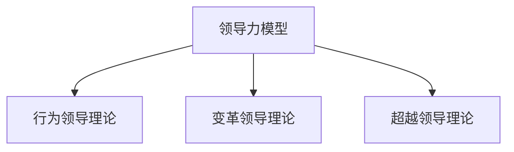
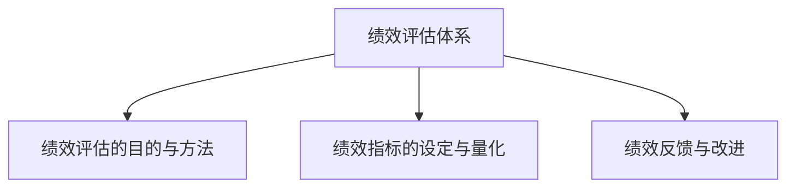
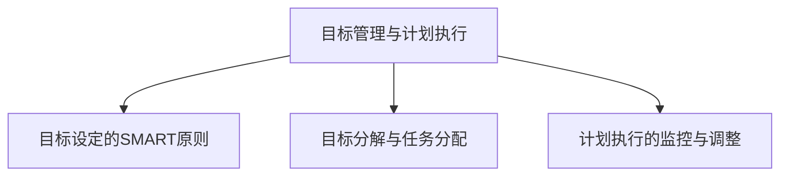

                 

### 文章标题：领导力与绩效改进：持续提升团队表现的技巧

#### 关键词：领导力、绩效改进、团队表现、管理技巧、持续提升

> 摘要：本文深入探讨了领导力与绩效改进之间的紧密联系，通过分析领导力的重要性、模型以及绩效评估体系，提出了一系列有效的策略和实践技巧。文章旨在为IT领域的领导者提供有价值的指导，帮助他们持续提升团队表现，实现组织的长期发展。

### 《领导力与绩效改进：持续提升团队表现的技巧》目录大纲

#### 第一部分：领导力概述

**第1章：领导力的重要性**

- **1.1 领导力的定义与演变**：介绍领导力的基本概念和演变过程，探讨其对企业成功的重要性。
- **1.2 领导力在现代组织中的作用**：分析领导力在现代企业中的角色和影响。
- **1.3 领导力与个人素质的关系**：探讨领导力与个人素质之间的相互关系。

**第2章：领导力模型**

- **2.1 行为领导理论**：阐述行为领导理论的核心观点和应用。
- **2.2 变革领导理论**：探讨变革领导理论在组织转型中的应用。
- **2.3 超越领导理论**：介绍超越领导理论的基本原理和实践意义。

#### 第二部分：绩效改进策略

**第3章：绩效评估体系**

- **3.1 绩效评估的目的与方法**：分析绩效评估的目的和方法，包括定性评估和定量评估。
- **3.2 绩效指标的设定与量化**：介绍绩效指标的类型和设定原则，强调SMART原则的应用。
- **3.3 绩效反馈与改进**：探讨绩效反馈的目的和方法，以及如何通过改进实现绩效提升。

**第4章：目标管理与计划执行**

- **4.1 目标设定的SMART原则**：详细解释SMART原则，并给出目标设定的实际案例。
- **4.2 目标分解与任务分配**：分析目标分解和任务分配的重要性及方法。
- **4.3 计划执行的监控与调整**：介绍计划执行的监控和调整策略。

**第5章：激励与团队合作**

- **5.1 激励理论在实践中的应用**：探讨激励理论在IT团队中的实际应用。
- **5.2 建立高效团队**：分析高效团队的特征和建立方法。
- **5.3 团队冲突与解决策略**：讨论团队冲突的原因和解决策略。

#### 第三部分：领导力提升实践

**第6章：领导力发展计划**

- **6.1 领导力培训与研讨会**：介绍领导力培训的方法和重要性。
- **6.2 个人领导力发展计划**：讨论个人领导力发展计划的设计和实施。
- **6.3 职业生涯规划**：探讨职业生涯规划对领导力提升的影响。

**第7章：领导力案例分析**

- **7.1 国内领导力成功案例**：分析国内企业的领导力成功案例。
- **7.2 国际领导力经典案例**：探讨国际企业的领导力经典案例。
- **7.3 案例分析与启示**：总结案例分析的结果和启示。

#### 第四部分：绩效改进工具与方法

**第8章：质量管理工具**

- **8.1 PDCA循环**：介绍PDCA循环的基本原理和应用。
- **8.2 沙林模型**：探讨沙林模型在绩效改进中的应用。
- **8.3 五力分析**：分析五力分析在绩效改进中的作用。

**第9章：创新与持续改进**

- **9.1 创新思维与工具**：介绍创新思维和工具在绩效改进中的应用。
- **9.2 持续改进流程**：讨论持续改进流程的设计和实施。
- **9.3 企业文化在绩效改进中的作用**：分析企业文化对绩效改进的影响。

#### 第五部分：领导力与绩效改进的结合

**第10章：领导力在绩效改进中的应用**

- **10.1 领导力对绩效改进的影响**：探讨领导力对绩效改进的影响。
- **10.2 领导力与绩效改进的整合策略**：分析领导力与绩效改进的整合策略。
- **10.3 领导力与绩效改进的实战应用**：介绍领导力与绩效改进的实战案例。

**第11章：领导力与绩效改进的持续发展**

- **11.1 组织学习与知识管理**：讨论组织学习和知识管理对领导力与绩效改进的持续发展的影响。
- **11.2 领导力与绩效改进的持续改进**：探讨如何通过持续改进实现领导力与绩效改进的持续发展。
- **11.3 领导力与绩效改进的未来趋势**：展望领导力与绩效改进的未来发展趋势。

#### 附录

**附录 A：领导力与绩效改进相关工具与方法清单**：列出领导力与绩效改进常用的工具和方法。

**附录 B：领导力与绩效改进常用参考资料**：提供领导力与绩效改进相关的参考资料。

**附录 C：领导力与绩效改进案例研究精选**：精选领导力与绩效改进的成功案例，进行详细分析和解读。

**附图 A.1：领导力模型的Mermaid流程图**：展示领导力模型的基本架构。

**附图 A.2：绩效评估体系的Mermaid流程图**：展示绩效评估体系的基本架构。

**附图 A.3：目标管理与计划执行的Mermaid流程图**：展示目标管理与计划执行的基本架构。

---

接下来，我们将逐一展开对每个章节的详细讨论，逐步分析领导力与绩效改进的各个方面。让我们开始这场深入的技术博客之旅吧！### 第一部分：领导力概述

在企业和组织中，领导力扮演着至关重要的角色。领导力不仅仅是指导和管理团队，它更是激励、引导和塑造组织文化的重要力量。在这一部分，我们将深入探讨领导力的重要性、定义与演变，以及领导力在现代组织中的作用和与个人素质的关系。

#### 第1章：领导力的重要性

**1.1 领导力的定义与演变**

领导力是一种能力，它涉及影响、激励和引导他人来实现共同的目标。领导力不仅仅是关于权威和控制，更是一种通过愿景、价值观和行动来影响他人的艺术。

- **传统领导力**：传统领导力主要强调权威和命令，领导者通常扮演着指挥者的角色，通过制定规则和制度来管理团队。
- **现代领导力**：随着组织环境的变化，现代领导力更加注重沟通、协作和激励。领导者不再是单打独斗的指挥者，而是合作伙伴和激励者。

**1.2 领导力在现代组织中的作用**

在现代组织中，领导力发挥着多重作用：

- **塑造组织文化**：领导力塑造组织的价值观、信念和行为准则，影响员工的行为和工作方式。
- **促进创新与变革**：领导者推动创新和变革，引导组织适应快速变化的市场环境。
- **提高团队绩效**：有效的领导力能够激励团队，提高员工的工作效率和绩效。
- **培养人才**：领导者通过培养和发展团队成员，确保组织拥有持续的人才储备。

**1.3 领导力与个人素质的关系**

领导力并非与生俱来，而是可以通过培养和个人素质的提升来发展。以下是一些与领导力紧密相关的个人素质：

- **自我认知**：领导者需要深入了解自己的优势和弱点，以便更好地指导团队。
- **沟通能力**：良好的沟通能力是领导者成功的关键，它帮助领导者与团队成员建立信任和有效的沟通。
- **决策能力**：领导者需要能够快速做出决策，并在不确定的情况下做出明智的选择。
- **团队合作能力**：领导者需要具备团队合作的能力，能够激励团队成员共同实现目标。
- **适应性**：在快速变化的环境中，领导者需要具备适应能力，灵活应对各种挑战。

通过上述分析，我们可以看出领导力在现代组织中的重要性。它是组织成功和持续发展的关键因素，需要通过不断的学习和实践来提升。接下来，我们将进一步探讨不同的领导力模型，以了解领导力的不同维度和应用。

---

在下一章中，我们将详细介绍几种常见的领导力模型，包括行为领导理论、变革领导理论和超越领导理论，深入探讨这些模型的核心观点和实际应用。敬请期待！### 第2章：领导力模型

领导力模型是理解和管理领导行为的重要工具。不同的领导力模型提供了不同的视角和方法，帮助领导者更好地应对各种组织挑战。在本章中，我们将详细探讨三种常见的领导力模型：行为领导理论、变革领导理论和超越领导理论。

#### 2.1 行为领导理论

行为领导理论关注领导者的行为和行动对团队绩效的影响。这一理论认为，领导行为可以分为四种类型：

- **指示型领导**：领导者明确指出团队成员需要做什么，如何做，以及何时做。这种领导风格在任务明确且需要快速执行时非常有效。
  ```mermaid
  graph TD
  A[指示型领导] --> B[任务导向]
  A --> C[明确指令]
  ```

- **支持型领导**：领导者关注团队成员的需求和情感，提供支持和鼓励。这种领导风格有助于建立良好的团队关系，提高员工的满意度和忠诚度。
  ```mermaid
  graph TD
  A[支持型领导] --> B[关注员工需求]
  A --> C[提供支持]
  ```

- **参与型领导**：领导者鼓励团队成员参与决策过程，尊重员工的意见和反馈。这种领导风格有助于提高团队的参与度和创造力。
  ```mermaid
  graph TD
  A[参与型领导] --> B[决策参与]
  A --> C[尊重意见]
  ```

- **成就型领导**：领导者设定高目标，激励团队成员追求卓越，并帮助他们实现目标。这种领导风格有助于激发员工的潜能，提高绩效。
  ```mermaid
  graph TD
  A[成就型领导] --> B[设定目标]
  A --> C[激励追求]
  ```

行为领导理论强调领导者应根据不同情境选择合适的领导风格，以最大化团队绩效。

#### 2.2 变革领导理论

变革领导理论关注领导者如何推动组织变革。在组织面临外部压力或内部需求时，变革领导成为关键。这一理论提出了四个关键步骤：

1. **建立愿景**：领导者需要明确组织的未来方向，并使其成为激励团队成员的动力。
2. **沟通与宣传**：领导者需要与团队成员进行有效沟通，解释变革的必要性和目标，以获得他们的支持。
3. **激励与参与**：领导者需要激励团队成员积极参与变革过程，并确保他们感到被重视和认可。
4. **持续支持**：领导者需要提供持续的支持和指导，帮助团队成员克服变革过程中的困难和挑战。

变革领导理论的核心在于通过有效沟通和激励，推动团队成员接受和适应变革。

#### 2.3 超越领导理论

超越领导理论强调领导者需要超越传统的领导角色，成为变革的推动者和组织的灵魂人物。这一理论提出了以下几个关键原则：

- **愿景领导**：领导者需要拥有清晰的愿景，并能够将愿景转化为可执行的计划。
- **服务领导**：领导者应将团队成员的需求置于自身利益之上，服务团队并推动组织发展。
- **学习领导**：领导者需要持续学习和成长，以适应快速变化的环境。
- **整合领导**：领导者需要整合组织内外部的资源，促进协作和创新。
- **价值观领导**：领导者需要树立正确的价值观，引导团队成员遵循组织的核心原则。

超越领导理论强调领导者需要具备超越常规的能力和品质，以推动组织的长远发展。

通过上述分析，我们可以看到不同的领导力模型提供了不同的视角和方法，帮助领导者更好地应对各种挑战。在实际应用中，领导者应根据组织的实际情况和团队的需求，灵活运用不同的领导力模型，以实现最佳绩效。

在下一章中，我们将讨论绩效改进策略，包括绩效评估体系、目标管理与计划执行，以及激励与团队合作。敬请期待！### 第二部分：绩效改进策略

在提升团队表现的过程中，绩效改进策略至关重要。有效的绩效改进不仅能够提高员工的工作效率，还能够促进团队的整体发展。在这一部分，我们将详细探讨绩效评估体系、目标管理与计划执行、激励与团队合作等方面的策略。

#### 第3章：绩效评估体系

**3.1 绩效评估的目的与方法**

绩效评估是衡量员工工作表现的重要手段，其目的包括：

- **衡量员工工作绩效**：通过绩效评估，企业可以了解员工的工作表现，识别优秀员工和需要改进的员工。
- **激励员工积极性**：通过公平和透明的绩效评估，可以激励员工提高工作积极性。
- **发现和解决问题**：绩效评估可以帮助企业发现工作中的问题，并提出改进措施。
- **人才选拔与发展**：绩效评估结果可以作为人才选拔和培养的重要依据。

绩效评估的方法主要包括：

- **定性评估**：定性评估是通过主观评价来衡量员工的工作表现。这种方法包括主管评价、同事评价和自我评估。
  ```mermaid
  graph TD
  A[定性评估] --> B[主管评价]
  A --> C[同事评价]
  A --> D[自我评估]
  ```

- **定量评估**：定量评估是通过客观数据来衡量员工的工作表现。这种方法包括关键绩效指标（KPI）和平衡计分卡（BSC）。
  ```mermaid
  graph TD
  A[定量评估] --> B[KPI]
  A --> C[BSC]
  ```

**3.2 绩效指标的设定与量化**

为了确保绩效评估的准确性和公正性，绩效指标的设定和量化至关重要。以下是设定绩效指标时需要考虑的原则：

- **具体（Specific）**：绩效指标应明确具体，避免模糊不清。
- **可衡量（Measurable）**：绩效指标应具有可量化性，便于衡量员工的工作表现。
- **可实现（Achievable）**：绩效指标应具有挑战性，同时是可实现的。
- **相关（Relevant）**：绩效指标应与工作目标相关，能够反映员工的工作表现。
- **时限（Time-bound）**：绩效指标应有明确的时间限制，以便员工有目标地工作。

**3.3 绩效反馈与改进**

绩效反馈是绩效评估的重要环节，它不仅可以帮助员工了解自己的工作表现，还能够激励他们改进。以下是绩效反馈的几个关键步骤：

1. **明确反馈目的**：在反馈过程中，领导者应明确反馈的目的，确保员工理解反馈的内容。
2. **正面反馈**：领导者应积极肯定员工的优点和成就，增强员工的自信心和动力。
3. **建设性反馈**：领导者应提出具体、建设性的改进建议，帮助员工识别问题并找到改进的方向。
4. **持续跟踪**：领导者应持续跟踪员工的改进情况，并提供必要的支持和指导。

通过绩效评估体系的建立和执行，企业可以确保员工的工作表现得到有效衡量和改进，从而提升团队的整体绩效。

#### 第4章：目标管理与计划执行

**4.1 目标设定的SMART原则**

目标管理是提升团队绩效的关键策略之一。SMART原则是一种有效的目标设定方法，它包括以下五个要素：

- **具体（Specific）**：目标应明确具体，避免模糊不清。
- **可衡量（Measurable）**：目标应具有可量化性，便于衡量进度和成效。
- **可实现（Achievable）**：目标应具有挑战性，同时是可实现的。
- **相关（Relevant）**：目标应与组织的整体目标相关，能够推动团队发展。
- **时限（Time-bound）**：目标应有明确的时间限制，以便员工有目标地工作。

**4.2 目标分解与任务分配**

为了实现整体目标，需要将目标分解为具体的任务和子任务，并明确责任分工。以下是目标分解和任务分配的步骤：

1. **明确目标**：确定团队的整体目标。
2. **分解目标**：将整体目标分解为具体的子任务和里程碑。
3. **责任分工**：为每个任务和子任务分配责任，确保每个员工都有明确的任务和职责。
4. **协同合作**：鼓励团队成员之间的协同合作，确保任务顺利完成。

**4.3 计划执行的监控与调整**

在计划执行过程中，领导者需要持续监控任务的进展情况，并根据实际情况进行调整。以下是监控和调整的几个关键步骤：

1. **定期检查**：定期检查任务的进展情况，确保任务按计划进行。
2. **及时反馈**：及时反馈任务进展和存在的问题，确保问题得到及时解决。
3. **调整计划**：根据实际情况调整计划，确保目标能够按时完成。
4. **持续优化**：通过不断优化计划和执行流程，提高团队的执行效率和绩效。

通过目标管理和计划执行，企业可以确保团队目标清晰、责任明确，从而提高工作效率和整体绩效。

#### 第5章：激励与团队合作

**5.1 激励理论在实践中的应用**

激励是提升员工工作积极性和绩效的重要手段。以下是几种常用的激励理论及其在实践中的应用：

- **需要层次理论**：马斯洛的需要层次理论指出，人的需求分为生理需求、安全需求、社交需求、尊重需求和自我实现需求。领导者应根据员工的不同需求提供相应的激励。
  ```mermaid
  graph TD
  A[生理需求] --> B[安全需求]
  B --> C[社交需求]
  C --> D[尊重需求]
  D --> E[自我实现需求]
  ```

- **双因素理论**：赫茨伯格的双因素理论认为，激励因素（如成就、认可、工作本身）和保健因素（如工资、工作环境、工作条件）对员工的工作满意度有不同影响。领导者应关注激励因素，提高员工的工作满意度。
  ```mermaid
  graph TD
  A[激励因素] --> B[成就]
  A --> C[认可]
  A --> D[工作本身]
  B --> E[保健因素]
  B --> F[工资]
  B --> G[工作环境]
  B --> H[工作条件]
  ```

**5.2 建立高效团队**

高效团队是提升组织绩效的关键。以下是建立高效团队的关键要素：

- **共同目标**：团队成员应明确共同的目标和愿景，并为此共同努力。
- **信任与尊重**：团队成员之间应建立信任和尊重，互相支持和协作。
- **分工与合作**：明确团队成员的职责和任务，鼓励合作和知识共享。
- **沟通与反馈**：保持开放的沟通渠道，及时反馈工作进展和存在的问题。

**5.3 团队冲突与解决策略**

团队冲突是团队合作中常见的问题。以下是解决团队冲突的几个策略：

- **理解与沟通**：通过理解对方的观点和需求，建立有效的沟通渠道。
- **妥协与协商**：在双方利益冲突时，寻求妥协和协商的解决方案。
- **冲突管理**：通过培训和管理，提高团队成员的冲突管理能力。
- **心理疏导**：对于严重的团队冲突，可以通过心理疏导来缓解紧张情绪，促进团队和谐。

通过激励和团队合作，企业可以激发员工的工作热情和创造力，提高团队的整体绩效。

在下一部分，我们将探讨领导力提升实践，包括领导力发展计划、案例分析，以及绩效改进工具与方法。敬请期待！### 第三部分：领导力提升实践

领导力的提升是一个持续的过程，它需要通过系统的学习和实践来实现。在这一部分，我们将详细探讨领导力发展计划、个人领导力发展计划、职业生涯规划，以及国内外领导力成功案例的分析和启示。

#### 第6章：领导力发展计划

**6.1 领导力培训与研讨会**

领导力培训是提升领导能力的重要手段。通过系统的培训，领导者可以学习最新的领导理论、技能和实践方法。以下是领导力培训的关键要素：

- **定制化培训**：根据领导者的个人需求和岗位要求，设计定制化的培训计划。
- **实战模拟**：通过实战模拟，让领导者能够在实际场景中应用所学知识，提升领导能力。
- **案例研究**：分析成功和失败的领导案例，从中吸取经验和教训。
- **互动讨论**：通过小组讨论和互动交流，促进领导者之间的知识共享和经验交流。

**6.2 个人领导力发展计划**

个人领导力发展计划是领导者自我提升的重要工具。以下是制定个人领导力发展计划的步骤：

1. **自我评估**：领导者应首先进行自我评估，了解自己的优势和弱点。
2. **设定目标**：根据自我评估的结果，设定明确的个人发展目标。
3. **制定计划**：制定具体的行动计划，包括学习目标、培训课程、实践项目等。
4. **跟踪执行**：持续跟踪计划的执行情况，及时调整和优化。

**6.3 职业生涯规划**

职业生涯规划对领导力的提升具有重要意义。以下是职业生涯规划的关键要素：

- **长远规划**：领导者应制定长期的职业规划，明确自己的职业目标和晋升路径。
- **持续学习**：领导者应持续学习新知识、新技能，不断提升自己的专业能力和领导力。
- **职业发展**：通过积极参与组织内的职业发展活动和项目，提升职业竞争力。
- **平衡工作与生活**：在追求职业发展的同时，注意平衡工作与生活，保持身心健康。

#### 第7章：领导力案例分析

**7.1 国内领导力成功案例**

在中国，有许多企业在领导力方面取得了显著的成功。以下是几个典型的国内领导力成功案例：

- **华为**：华为通过持续的创新和全球化的战略，成为了全球领先的通信设备供应商。华为的领导力成功得益于其企业文化、人才管理和激励机制。
- **阿里巴巴**：阿里巴巴通过电子商务的颠覆性创新，推动了整个零售行业的变革。阿里巴巴的领导力成功在于其独特的企业文化、价值观和领导力模型。

**7.2 国际领导力经典案例**

在全球范围内，有许多企业通过卓越的领导力实现了持续的发展和成功。以下是几个典型的国际领导力经典案例：

- **苹果公司**：苹果公司通过其独特的产品设计和用户体验，引领了全球科技潮流。苹果公司的领导力成功在于其创新文化、领导风格和人才培养体系。
- **谷歌公司**：谷歌公司以其开放的企业文化和创新的商业模式，成为了全球最具创新力的企业之一。谷歌的领导力成功在于其人才激励机制、创新文化和领导力模型。

**7.3 案例分析与启示**

通过对国内外领导力成功案例的分析，我们可以得到以下启示：

- **文化驱动**：成功的企业文化是领导力成功的关键因素。
- **人才为本**：重视人才管理和培养，是提升领导力的关键。
- **创新引领**：创新是推动组织发展的重要动力。
- **持续学习**：领导者应持续学习新知识、新技能，不断提升自己的领导力。

通过以上领导力提升实践，企业可以培养出具备卓越领导能力的领导者，从而推动组织的持续发展和成功。

在下一部分，我们将探讨绩效改进工具与方法，包括质量管理工具、创新与持续改进，以及领导力与绩效改进的结合。敬请期待！### 第四部分：绩效改进工具与方法

在提升团队绩效的过程中，使用适当的工具和方法是至关重要的。这不仅能够帮助领导者更有效地管理团队，还能确保绩效改进策略的有效实施。在本部分，我们将详细探讨绩效改进工具与方法，包括质量管理工具、创新与持续改进，以及企业文化在绩效改进中的作用。

#### 第8章：质量管理工具

**8.1 PDCA循环**

PDCA循环（计划-执行-检查-行动）是一种广泛使用的质量管理工具，它提供了一个系统的框架，用于持续改进和优化流程。以下是PDCA循环的四个阶段：

- **计划（Plan）**：在这个阶段，领导者需要设定目标、制定计划，并确定执行方案。这个过程包括分析现状、设定目标、制定策略和行动计划。
- **执行（Do）**：执行阶段是将计划付诸实践的过程。领导者需要确保团队成员了解计划，并按照既定的行动方案进行操作。
- **检查（Check）**：在执行过程中，领导者需要监控和评估绩效，检查目标是否达到，并识别存在的偏差和问题。
- **行动（Act）**：基于检查结果，领导者需要采取措施进行改进。这包括修正计划、优化流程，以及实施新的行动方案。

**8.2 沙林模型**

沙林模型（Shewhart Cycle）是一种早期的质量管理循环，也被称为“控制图循环”。它包括以下三个阶段：

- **计划阶段**：领导者需要设定质量标准，确定控制界限，并制定质量控制计划。
- **执行阶段**：在这个阶段，领导者需要监控和测量实际过程的质量，确保过程处于控制状态。
- **改进阶段**：通过分析监控数据，领导者可以识别出过程中的偏差和问题，并采取相应的改进措施。

**8.3 五力分析**

五力分析是一种用于评估市场竞争环境的工具，它可以帮助领导者了解行业内的竞争格局。五力分析包括以下五个方面：

- **供应商的议价能力**：供应商的议价能力越强，企业面临的成本压力就越大。
- **客户的议价能力**：客户的议价能力越强，企业的产品价格就越有可能下降。
- **替代品的威胁**：替代品的威胁越大，企业的市场份额就越有可能受到侵蚀。
- **新进入者的威胁**：新进入者的威胁越大，行业竞争就越激烈。
- **现有竞争者的竞争强度**：现有竞争者的竞争强度越大，企业的市场地位就越容易受到挑战。

通过这些质量管理工具，领导者可以系统地识别和解决问题，从而持续提升团队绩效。

#### 第9章：创新与持续改进

**9.1 创新思维与工具**

创新是提升团队绩效的重要驱动力。以下是几种常用的创新思维工具：

- **头脑风暴**：头脑风暴是一种集体创新的方法，鼓励团队成员自由表达自己的想法，并相互启发。
- **思维导图**：思维导图是一种视觉化的思维工具，可以帮助领导者梳理思路，发现潜在的关联和解决方案。
- **六顶思考帽**：六顶思考帽是一种思维训练方法，通过分别佩戴不同的“思考帽”进行思考，提高决策的质量和效果。

**9.2 持续改进流程**

持续改进是一种持续优化流程和绩效的方法。以下是持续改进流程的关键步骤：

1. **识别问题**：通过监控和评估，识别出需要改进的问题。
2. **分析问题**：对问题进行深入分析，找出根本原因。
3. **制定解决方案**：基于分析结果，制定具体的改进方案。
4. **实施解决方案**：将改进方案付诸实践，并监控实施效果。
5. **评估效果**：评估改进措施的有效性，并根据评估结果进行调整。

**9.3 企业文化在绩效改进中的作用**

企业文化对绩效改进有着深远的影响。以下是企业文化在绩效改进中的作用：

- **激励作用**：积极的企业文化可以激发员工的创新意识和工作热情，提高绩效。
- **导向作用**：企业文化可以引导员工的行为和决策，使其与组织的战略目标保持一致。
- **凝聚作用**：企业文化可以增强团队的凝聚力和归属感，提高团队的整体绩效。

通过创新和持续改进，企业可以不断提升团队绩效，实现组织的长期发展。

在下一部分，我们将探讨领导力与绩效改进的结合，包括领导力在绩效改进中的应用、整合策略和实战应用。敬请期待！### 第五部分：领导力与绩效改进的结合

在提升团队表现的过程中，领导力与绩效改进是相辅相成的。领导力为绩效改进提供了方向和动力，而绩效改进则为领导力提供了衡量和验证的依据。在这一部分，我们将深入探讨领导力在绩效改进中的应用、整合策略以及实战应用，并展望领导力与绩效改进的持续发展。

#### 第10章：领导力在绩效改进中的应用

**10.1 领导力对绩效改进的影响**

领导力在绩效改进中发挥着关键作用。以下是领导力对绩效改进的几个主要影响：

- **目标设定**：领导者通过设定明确的目标和愿景，为团队提供方向和动力，确保绩效改进目标的实现。
- **激励与鼓励**：领导者通过激励和鼓励，激发员工的工作热情和创造力，提高绩效改进的积极性。
- **资源调配**：领导者通过合理调配资源，确保绩效改进所需的资源和支持，提高改进效率。
- **沟通与协调**：领导者通过有效的沟通和协调，确保团队成员之间的协同合作，减少冲突，提高绩效改进的合力。

**10.2 领导力与绩效改进的整合策略**

为了实现领导力与绩效改进的有机结合，领导者可以采取以下整合策略：

- **建立共同目标**：领导者与团队成员共同设定明确的目标，确保绩效改进与组织战略目标的一致性。
- **加强团队协作**：领导者通过建立高效的团队协作机制，促进团队成员之间的沟通与合作，提高绩效改进的效率。
- **持续反馈与改进**：领导者通过定期反馈和评估，及时识别绩效改进中的问题和障碍，采取有效的改进措施。
- **鼓励创新与学习**：领导者鼓励员工持续学习和创新，推动组织文化和技能的不断提升，为绩效改进提供持续动力。

**10.3 领导力与绩效改进的实战应用**

以下是几个领导力与绩效改进的实战应用案例：

- **案例1：华为的绩效改进实践**：华为通过建立以客户为中心的绩效管理体系，不断优化内部流程，提升产品和服务质量。领导力在华为的绩效改进中发挥了关键作用，通过持续创新和人才培养，实现了企业的快速发展。
- **案例2：谷歌的团队协作与绩效改进**：谷歌通过构建开放、包容的企业文化，鼓励员工自由表达意见和参与决策。领导者通过有效的沟通和协调，确保团队之间的协作，实现了高效的工作和持续的创新。

#### 第11章：领导力与绩效改进的持续发展

**11.1 组织学习与知识管理**

组织学习与知识管理是领导力与绩效改进持续发展的重要保障。以下是组织学习与知识管理的关键要素：

- **建立学习文化**：领导者通过倡导学习文化，鼓励员工持续学习和知识共享，提升组织的知识储备和创新能力。
- **知识管理平台**：建立有效的知识管理平台，促进知识的收集、存储、共享和利用，提高知识传递的效率和准确性。
- **培训与发展**：领导者通过定期培训和职业发展规划，提升员工的专业能力和领导力，为绩效改进提供人才支持。

**11.2 领导力与绩效改进的持续改进**

持续改进是领导力与绩效改进的核心原则。以下是实现持续改进的关键步骤：

- **建立持续改进机制**：领导者通过建立持续改进机制，确保绩效改进的持续性和系统性。
- **定期评估与反馈**：领导者通过定期评估和反馈，识别绩效改进中的问题和障碍，及时进行调整和优化。
- **鼓励创新与尝试**：领导者鼓励员工勇于创新和尝试，支持创新项目和实验，为绩效改进注入新的活力。

**11.3 领导力与绩效改进的未来趋势**

随着组织环境的变化，领导力与绩效改进将面临新的挑战和机遇。以下是领导力与绩效改进的未来趋势：

- **数字化领导**：数字化技术的普及将推动领导力的数字化转型，领导者需要具备数字领导能力，引导组织适应数字化时代的发展。
- **敏捷管理**：敏捷管理理念将得到更广泛的应用，领导者需要具备敏捷管理的技能和思维，提高组织的响应速度和创新能力。
- **人才驱动**：人才将成为组织最重要的资产，领导者需要关注人才的发展和管理，激发员工的潜能，实现绩效的持续提升。

通过领导力与绩效改进的结合，企业可以不断提升团队表现，实现组织的长期发展。在未来，随着环境的变化和技术的进步，领导力与绩效改进将继续发展和创新，为企业带来新的机遇和挑战。

### 附录

**附录A：领导力与绩效改进相关工具与方法清单**

- **领导力工具**：领导力模型、领导力发展计划、职业生涯规划
- **绩效改进工具**：绩效评估体系、SMART原则、PDCA循环、五力分析
- **创新工具**：头脑风暴、思维导图、六顶思考帽

**附录B：领导力与绩效改进常用参考资料**

- **领导力参考书籍**：《领导力与新科学》、《领导力的五个层次》
- **绩效改进参考书籍**：《绩效改进原理与实践》、《绩效管理体系设计》
- **创新参考书籍**：《创新与企业家精神》、《创新思维与技巧》

**附录C：领导力与绩效改进案例研究精选**

- **国内案例研究**：《华为绩效管理体系研究》、《阿里巴巴企业文化与领导力》
- **国际案例研究**：《谷歌的领导力与创新》、《苹果公司的绩效改进实践》

**附图A.1：领导力模型的Mermaid流程图**



**附图A.2：绩效评估体系的Mermaid流程图**



**附图A.3：目标管理与计划执行的Mermaid流程图**



通过上述内容，我们可以看到领导力与绩效改进在提升团队表现中的重要性。领导者需要不断学习和实践，运用合适的工具和方法，实现领导力与绩效改进的有机结合，推动企业的持续发展。在未来的道路上，领导者将继续面临新的挑战和机遇，不断探索和创新，为团队和组织创造更大的价值。

