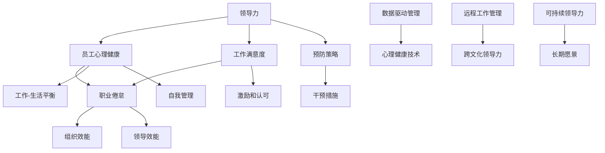

                 

### 引言

在现代IT行业中，领导力和职业倦怠已成为两个备受关注的话题。领导力不仅关系到企业的发展和团队的效能，还直接影响到员工的工作满意度和心理健康。而职业倦怠，即一种因长期工作压力和情感耗竭而产生的身心疲惫状态，正逐渐成为职场人士，尤其是IT行业从业者的常见问题。本文旨在探讨领导力与职业倦怠之间的复杂关系，并探讨如何通过有效的领导力和策略来预防和应对职业倦怠。

首先，我们需要明确领导力的定义和其在职场中的重要性。领导力不仅仅指权力和地位，它更是一种能够激励和引导他人共同实现目标的能力。有效的领导力能够提升团队士气，促进创新，增强团队凝聚力，从而降低职业倦怠的风险。

接着，我们将深入探讨职业倦怠的定义、成因及其对个人和组织的危害。理解职业倦怠的表现和诊断方法，有助于我们提前采取措施，预防和应对这一问题。

在明确了领导力和职业倦怠的基本概念后，本文将重点分析领导力对职业倦怠的影响。我们将讨论领导力如何通过改善员工的心理健康和工作满意度来预防职业倦怠，以及职业倦怠对领导力可能产生的负面影响。

本文还将提供一系列预防和应对职业倦怠的策略，包括建立预防机制和采取具体的干预措施。我们将结合实际案例，展示成功预防和应对职业倦怠的经验，并讨论未来领导力与职业倦怠研究的方向。

通过本文的阅读，读者将能够全面理解领导力和职业倦怠之间的关系，掌握有效的领导力技巧，并在实际工作中采取适当的措施，预防和应对职业倦怠。

### 关键词

- 领导力
- 职业倦怠
- 烦劳（burnout）
- 员工心理健康
- 组织效能
- 预防策略
- 干预措施
- 数字化领导力

### 摘要

本文通过探讨领导力与职业倦怠之间的复杂关系，旨在为IT行业从业者和管理者提供一套全面的理解和应对策略。首先，我们定义了领导力的基本概念和其在职场中的重要性，并详细分析了职业倦怠的定义、成因及其对个人和组织的危害。随后，本文深入探讨了领导力如何通过改善员工的心理健康和工作满意度来预防职业倦怠，同时探讨了职业倦怠对领导力可能产生的负面影响。最后，本文提出了具体的预防和应对职业倦怠的策略，并通过实际案例进行了详细分析，为读者提供了实用的参考和指导。

### 第一部分：领导力基础

#### 第1章：领导力的定义与重要性

在探讨领导力与职业倦怠之间的关系之前，我们需要首先理解领导力的基本概念及其重要性。领导力不仅仅是指某个职位或角色所拥有的权力，它更是一种能够激发和引导他人共同实现目标的能力。这种能力在组织中起着至关重要的作用，不仅影响着组织的运作效率，还直接关系到员工的职业满意度和心理健康。

**领导力的基本概念**

领导力是一种多维度的概念，可以从多个角度进行理解和描述。首先，从组织行为学的角度来看，领导力可以被定义为一种影响力，即领导者通过激励、指导、沟通和决策等手段，对团队成员的行为和绩效产生积极影响的能力（Northouse, 2018）。这种影响力不仅体现在领导者与下属之间的关系上，还体现在领导者与整个团队、组织甚至更广泛的环境之间的互动中。

其次，领导力可以被视为一种决策力，即领导者面对复杂和不确定的情况时，能够迅速做出有效决策的能力。这种决策力不仅需要领导者具备良好的分析和判断能力，还需要他们具备快速适应变化和灵活应对挑战的素质。

**领导力的重要性**

领导力在职场中的重要性不可忽视。首先，有效的领导力能够提升组织的整体绩效。领导者通过设定明确的目标和愿景，制定有效的战略和计划，并激励团队成员为实现这些目标而努力，从而推动组织向更高的层次发展。

其次，领导力对员工的职业满意度和心理健康具有重要影响。一个优秀的领导者能够为员工提供清晰的目标和期望，创造一个积极、支持性的工作环境，从而减少员工的压力和焦虑，提升他们的工作满意度和幸福感。

此外，领导力还关系到组织的创新能力和文化氛围。领导者通过鼓励创新思维，推动跨部门合作，营造一种开放、包容和尊重的氛围，能够激发团队成员的创造力和积极性，促进组织的持续发展。

**领导力的两大核心：影响力与决策力**

领导力的核心要素可以归纳为两大方面：影响力和决策力。

**影响力**

影响力是领导力的核心要素之一。领导者通过一系列的行为和策略，对团队成员产生积极的影响，从而推动团队向前发展。这种影响力不仅体现在日常的工作指导和绩效管理中，还体现在领导者的榜样作用和价值观传递上。例如，一个具有高影响力的领导者会通过积极的沟通和反馈，帮助团队成员建立自信和成长意识，从而提高他们的工作积极性和绩效水平。

**决策力**

决策力是领导力的另一个重要方面。在快速变化的市场环境中，领导者需要具备敏锐的洞察力和果断的决策能力，以应对各种挑战和不确定性。一个优秀的领导者会通过深入分析问题、收集相关信息、评估潜在风险和收益，并制定出科学合理的决策方案。同时，他们还需要具备快速反应和灵活调整的能力，以确保组织能够及时应对市场变化和竞争压力。

**总结**

领导力是现代组织成功的关键因素之一。它不仅关系到组织的运作效率和员工的工作满意度，还直接影响着组织的创新能力和文化氛围。理解领导力的基本概念和重要性，有助于我们更好地掌握和应用领导力技巧，从而为组织的发展和员工的成长创造更有利的条件。在接下来的章节中，我们将进一步探讨领导力的核心原则，以及领导力如何影响职业倦怠。

#### 第2章：领导力的核心原则

在了解了领导力的基本概念和重要性之后，我们需要深入探讨领导力的核心原则。这些原则不仅为领导者提供了指导和参考，也帮助他们在复杂多变的职场环境中做出正确的决策和行动。

**服务型领导力**

服务型领导力是一种以服务团队成员为中心的领导理念。与传统的权威型领导不同，服务型领导者更注重与团队成员建立信任关系，通过倾听和满足团队成员的需求来推动团队的发展。根据Goleman（1998）的研究，服务型领导者具备以下特点：

1. **倾听与沟通**：服务型领导者善于倾听团队成员的意见和建议，通过开放、诚实的沟通建立信任和共识。
2. **关注团队成员发展**：服务型领导者关注团队成员的成长，为他们提供必要的资源和支持，帮助他们实现个人和职业目标。
3. **共同目标**：服务型领导者与团队成员共同制定目标，并确保每个人都理解并致力于实现这些目标。

服务型领导力的优势在于，它能够提高团队的凝聚力和合作效率，减少内部冲突，从而提高整体绩效。例如，在谷歌公司，CEO桑德尔·皮查伊（Sundar Pichai）就被誉为服务型领导力的典范，他通过倾听员工的声音，关注员工福利，推动了公司创新文化的形成。

**共赢思维**

共赢思维是领导力的另一核心原则，它强调领导者与团队成员之间、不同团队之间以及组织与外部环境之间的合作与共赢。共赢思维不仅关注组织内部的和谐与协作，还注重组织与外部环境之间的互动与平衡。

1. **内部共赢**：内部共赢强调领导者与团队成员之间的协作和共同成长。通过建立开放、透明的沟通机制，领导者能够更好地理解团队成员的需求和期望，从而提供更有针对性的支持和指导。
2. **外部共赢**：外部共赢则关注组织与供应商、客户、合作伙伴等外部利益相关者之间的合作关系。通过建立互利共赢的合作模式，组织能够更好地适应市场变化，实现可持续发展。

例如，苹果公司CEO蒂姆·库克（Tim Cook）就通过推行共赢思维，与供应商、客户和合作伙伴建立了紧密的合作关系，推动了公司的全球扩张和持续增长。

**诚信与透明**

诚信与透明是领导者赢得信任和尊重的重要基石。一个诚信的领导者会始终坚持原则，公正无私，不谋取个人私利。透明则意味着领导者公开、诚实地与团队成员沟通信息，确保信息的畅通和对称。

1. **诚信**：诚信不仅能提升领导者的个人信誉，还能增强团队的信任和凝聚力。一个诚信的领导者会以身作则，树立良好的榜样，引导团队成员遵循正直、诚信的原则。
2. **透明**：透明则是领导者建立信任的重要手段。通过公开决策过程、分享组织信息，领导者能够增强团队成员的参与感和归属感，从而提高团队的士气和工作效率。

例如，特斯拉公司CEO伊隆·马斯克（Elon Musk）就以透明著称，他通过定期公开公司业绩、财务状况和未来规划，赢得了广泛的信任和支持。

**总结**

领导力的核心原则包括服务型领导力、共赢思维和诚信与透明。这些原则不仅为领导者提供了行动指南，也帮助他们在复杂多变的职场环境中实现有效的领导。在接下来的章节中，我们将进一步探讨职业倦怠的定义、成因及其对个人和组织的危害。

#### 第3章：职业倦怠的定义与成因

职业倦怠（burnout）是一种因长期工作压力和情感耗竭而产生的身心疲惫状态。这一概念最早由心理学家Herbert J. Freudenberger在1974年提出，随后由Claes G. Bengston和Stewart J. Tomblin在1978年进一步发展。职业倦怠不仅影响个人的心理健康和工作表现，还对组织整体效能产生负面影响。

**职业倦怠的定义**

职业倦怠通常被定义为一种情感枯竭、去人格化和个人成就感降低的综合症状。具体来说，职业倦怠包含三个主要维度：

1. **情感枯竭**：指个体在长时间的工作压力下，感受到情感资源的耗尽，表现为情绪疲惫、工作热情下降。这种状态可能伴随焦虑、抑郁等情绪问题。
2. **去人格化**：指个体对工作对象或客户产生冷漠、疏离的态度，表现为对工作对象缺乏同情心和关注。这种态度可能是因为长期的工作压力导致的情感隔离。
3. **个人成就感降低**：指个体对自己的工作能力和成就产生怀疑和否定，表现为工作满意度下降，对工作的意义和价值的认知减少。

**职业倦怠的成因**

职业倦怠的成因复杂多样，涉及个体因素、工作环境和组织文化等多个方面。以下是几个主要的成因：

1. **工作压力**：长期的工作压力是导致职业倦怠的主要原因之一。工作压力包括工作量过大、工作复杂性高、工作时间过长等。研究表明，长期处于高压状态下的员工更容易出现职业倦怠症状。
2. **工作-生活失衡**：工作-生活失衡指工作对个人生活的影响过大，导致个体在工作和生活之间无法有效平衡。这种状态可能因为工作时间过长、工作强度过大或缺乏家庭支持等原因导致。
3. **缺乏社会支持**：个体在面临工作压力时，缺乏来自同事、家人和上级的支持和帮助，会增加职业倦怠的风险。社会支持包括情感支持、信息支持和物质支持等。
4. **组织文化和领导风格**：组织文化和领导风格对职业倦怠有重要影响。一个缺乏信任、支持性差、压力大的组织文化，以及采用专制式领导风格的领导者，都会增加员工的职业倦怠风险。

**职业倦怠的危害**

职业倦怠不仅影响员工个人的心理健康和工作满意度，还对组织产生一系列负面影响：

1. **个人层面**：职业倦怠可能导致员工出现心理健康问题，如焦虑、抑郁等。长期处于职业倦怠状态下的员工，工作绩效和创造力会显著下降，离职率和病假率也会增加。
2. **组织层面**：职业倦怠会降低组织的整体工作效率和创新能力。当员工感到疲惫和缺乏动力时，他们可能无法全身心投入工作，从而影响团队协作和组织目标的实现。此外，高职业倦怠水平还可能导致组织人才流失，增加培训成本。

**总结**

职业倦怠是一种复杂的心理状态，其成因涉及多个方面，对个人和组织的危害都不可忽视。理解职业倦怠的定义和成因，有助于我们提前采取措施，预防和应对这一现象。在接下来的章节中，我们将进一步探讨职业倦怠的具体表现和诊断方法，并讨论如何识别和处理职业倦怠问题。

#### 第4章：职业倦怠的表现与识别

职业倦怠不仅是一种心理状态，它还会在个体的行为和情绪上留下明显的痕迹。及时识别和诊断职业倦怠对于采取有效措施预防和应对至关重要。以下是职业倦怠的主要表现和诊断方法。

**职业倦怠的表现**

1. **情感枯竭**：情感枯竭是职业倦怠最显著的表现之一。员工可能会感到持续的情绪疲惫、工作热情下降，甚至对工作中的事物失去兴趣。他们可能会出现焦虑、抑郁等情绪问题，对日常工作的积极性大大降低。
2. **去人格化**：去人格化表现为员工对工作对象或客户产生冷漠、疏离的态度。他们可能对工作对象缺乏同情心，对待客户或同事表现出不耐烦或无动于衷。这种行为可能是因为长期的工作压力和情感耗竭导致的。
3. **个人成就感降低**：员工可能会对自己的工作能力和成就产生怀疑和否定，感觉自己无法胜任工作，对工作的意义和价值的认知减少。这种状态可能导致工作满意度下降，甚至出现自我效能感不足的情况。
4. **身体健康问题**：长期处于职业倦怠状态下的员工可能会出现各种身体不适，如失眠、头痛、肌肉紧张、胃痛等。这些身体问题可能是心理压力的生理反应。

**诊断职业倦怠的指标**

为了准确诊断职业倦怠，研究人员和临床医生通常使用一系列量表和问卷，这些量表和问卷能够量化个体在情感枯竭、去人格化和个人成就感降低等方面的表现。以下是几种常用的诊断工具：

1. **梅奥职业倦怠量表（Maslach Burnout Inventory, MBTI）**：这是最常用的职业倦怠评估工具之一，包括三个维度：情感枯竭、去人格化和个人成就感降低。量表通过一系列问题来评估个体在这三个方面的表现。
2. **伯克-赫吉斯职业倦怠量表（Burkhardt-Herr & Hagedorn, 2000）**：该量表侧重于评估情感耗竭和去人格化，使用更为简洁的维度来评估职业倦怠。
3. **简式职业倦怠量表（Maslach Brief Survey, MBI-BSS）**：这是一个简化版的梅奥职业倦怠量表，适用于时间紧张或资源有限的情况，但其效度和信度仍然得到了广泛认可。

**如何应对职业倦怠**

一旦识别出职业倦怠，及时采取应对措施至关重要。以下是一些有效的策略：

1. **心理支持**：提供心理咨询和辅导是应对职业倦怠的有效方法。通过专业的心理咨询，员工可以学习到应对压力和情绪问题的技巧，从而减轻心理负担。
2. **工作调整**：调整工作内容和压力水平也是应对职业倦怠的重要策略。通过分配更合理的工作量、调整工作流程或提供新的挑战性任务，可以帮助员工重拾工作热情和成就感。
3. **培训与发展**：为员工提供培训和发展机会，帮助他们提升技能和增强职业能力，可以提升他们的自我效能感，减少职业倦怠的风险。
4. **建立支持性组织文化**：建立支持性组织文化是预防职业倦怠的重要措施。通过促进团队合作、提供情感支持和建立透明、信任的沟通机制，组织可以降低员工的职业倦怠水平。

**总结**

职业倦怠是一种复杂且普遍存在的心理状态，其表现和诊断方法多种多样。及时识别和诊断职业倦怠，并采取有效的应对措施，对于维护员工心理健康和组织整体效能至关重要。通过本文的探讨，我们希望读者能够更好地理解和应对职业倦怠问题，为个人和组织的发展创造更有利的条件。

#### 第5章：领导力如何影响职业倦怠

领导力在职业倦怠的形成和缓解中起着至关重要的作用。一个优秀的领导者不仅能够激发员工的积极性和创造力，还能够通过有效的管理和激励，降低员工的职业倦怠风险。以下将从三个方面探讨领导力如何影响职业倦怠：领导力对员工心理健康的影响、领导力对员工工作满意度的影响，以及领导力对职业倦怠的预防作用。

**领导力对员工心理健康的影响**

领导力在员工心理健康方面的影响主要通过以下几个方面体现：

1. **心理支持**：领导者通过提供心理支持和关怀，可以帮助员工应对工作中的压力和挑战。一个支持性的领导环境能够减轻员工的心理负担，减少职业倦怠的风险。例如，通过定期的员工谈话和反馈，领导者可以了解员工的困扰和需求，提供针对性的帮助和支持。

2. **情感连接**：领导者与员工之间建立的情感连接能够增强员工的归属感和安全感。这种情感连接不仅体现在日常的沟通和互动中，还体现在领导者的榜样作用和价值观传递上。一个能够与员工建立深厚情感连接的领导者，往往能够更好地理解员工的情感需求，从而提高员工的工作满意度和心理健康水平。

3. **情绪调节**：领导者具备的情绪调节能力对于员工的情绪管理也具有重要影响。一个能够有效调节自己情绪的领导者，能够通过积极的态度和情绪表达，激励员工保持乐观和积极的心态，从而减少职业倦怠的发生。

**领导力对员工工作满意度的影响**

领导力不仅影响员工的心理健康，还直接影响员工的工作满意度。以下是领导力对员工工作满意度影响的几个方面：

1. **目标明确**：领导者为员工设定明确的目标和期望，可以帮助员工更好地理解自己的工作方向和职责。一个清晰、具体的目标能够提高员工的工作动力和满意度，减少因目标不明确而产生的焦虑和压力。

2. **资源支持**：领导者提供必要的资源和支持，帮助员工克服工作中的困难和挑战。例如，提供培训机会、技术工具和人力支持等，可以帮助员工提升工作能力和自信心，从而提高工作满意度和成就感。

3. **公平待遇**：领导者对待员工的公平和公正，对于员工的满意度具有重要影响。一个公平的领导环境能够增强员工的信任感和归属感，减少因不公平待遇而产生的职业倦怠。

**领导力对职业倦怠的预防作用**

有效的领导力可以通过多种方式预防职业倦怠的发生：

1. **压力管理**：领导者通过有效的压力管理策略，帮助员工应对工作中的压力。例如，通过合理的任务分配、调整工作节奏和提供减压活动等，领导者可以减轻员工的工作压力，降低职业倦怠的风险。

2. **职业发展**：领导者关注员工的职业发展，为员工提供成长和晋升的机会。一个具有发展潜力的工作环境能够激发员工的工作热情和积极性，从而减少职业倦怠。

3. **工作-生活平衡**：领导者鼓励员工保持工作-生活平衡，提供灵活的工作安排和弹性工作时间等。这种支持可以帮助员工更好地管理工作和个人生活，减少因工作-生活失衡导致的职业倦怠。

**案例研究**

为了更好地理解领导力如何影响职业倦怠，我们可以通过实际案例进行分析：

**案例一：谷歌公司的领导力实践**

谷歌公司以其独特的领导力文化和创新管理模式而闻名。在谷歌，领导者通过提供心理支持、职业发展和工作-生活平衡等多方面的支持，有效预防了职业倦怠。例如，谷歌提供心理健康咨询、员工辅导和灵活的工作安排，帮助员工在工作和生活中找到平衡。此外，谷歌鼓励员工积极参与各种兴趣小组和社区活动，从而提升工作满意度和幸福感。这些举措使得谷歌的员工职业倦怠水平相对较低，工作表现和创新能力也处于行业领先地位。

**案例二：苹果公司的领导力风格**

苹果公司CEO蒂姆·库克（Tim Cook）以其务实的领导风格和对员工的关爱而著称。库克通过定期的员工沟通和反馈，了解员工的需求和困扰，并提供相应的支持。此外，苹果公司还注重员工的职业发展和培训，提供各种内部和外部学习机会，帮助员工不断提升自己的技能和知识。这些举措不仅提升了员工的工作满意度和心理健康，还降低了职业倦怠的风险。

**总结**

领导力在影响员工心理健康、工作满意度和职业倦怠方面具有显著的作用。通过提供心理支持、明确目标和资源支持，以及关注员工的职业发展和工作-生活平衡，领导者可以有效预防职业倦怠的发生。在接下来的章节中，我们将进一步探讨职业倦怠对领导力可能产生的负面影响，并讨论具体的预防和应对策略。

#### 第6章：职业倦怠对领导力的影响

职业倦怠不仅对员工的个人心理健康和工作表现产生负面影响，它也会对领导力的多个方面产生深远的影响。理解这些影响有助于领导者识别和应对职业倦怠问题，从而提升领导效能和团队整体绩效。

**职业倦怠对领导决策的影响**

1. **决策质量下降**：长期处于职业倦怠状态的领导者可能因为情感枯竭和缺乏精力，难以集中注意力进行深入的决策分析。这可能导致决策过程过于仓促或缺乏全面考虑，从而影响决策的质量。
2. **风险判断失误**：职业倦怠可能削弱领导者的判断力，使其在面对风险时无法做出准确的评估和应对。这可能导致领导者低估潜在风险或过度乐观，从而影响组织的稳定性和长远发展。

**职业倦怠对团队氛围的影响**

1. **消极情绪蔓延**：职业倦怠的领导者往往表现出情绪低落、态度消极，这种情绪可能会在团队中蔓延，影响员工的心理状态和工作积极性。团队氛围可能变得紧张、冷漠或压抑，从而影响团队的协作和凝聚力。
2. **沟通障碍增加**：职业倦怠可能导致领导者在沟通中表现出不耐烦、回避或不敏感，这会增加团队成员之间的误解和冲突，降低沟通效率。

**职业倦怠对领导效能的影响**

1. **管理效率降低**：职业倦怠可能使领导者难以有效地管理团队，包括分配任务、监督进度和提供反馈。这种效率降低可能导致项目延迟、绩效下降和员工士气低迷。
2. **领导力发挥受阻**：职业倦怠削弱了领导者的激励和影响力，使其难以发挥领导力优势，激励员工积极投入工作和实现目标。

**应对策略**

为了应对职业倦怠对领导力的影响，领导者可以采取以下策略：

1. **自我管理**：领导者需要关注自己的心理健康，通过定期休息、锻炼和兴趣爱好来缓解工作压力，保持精力充沛和积极心态。
2. **心理支持**：领导者可以寻求心理咨询或辅导，学习应对压力和情绪问题的技巧，从而提高自身的情绪调节能力和抗压能力。
3. **建立支持性环境**：领导者应致力于营造一个支持性的工作环境，鼓励团队成员相互支持、分享经验和资源。通过建立开放、信任和尊重的沟通机制，领导者可以增强团队的凝聚力和合作精神。
4. **职业发展**：领导者应关注员工的职业发展，提供培训机会和晋升通道，帮助员工提升技能和职业能力，从而增强工作动力和减少职业倦怠的风险。

**案例研究**

**案例一：特斯拉公司的领导力实践**

特斯拉公司CEO埃隆·马斯克（Elon Musk）以其独特的领导风格而闻名。尽管他在推动公司创新和发展方面取得了巨大成就，但马斯克的工作高压和个人管理风格也引发了广泛的关注和争议。特斯拉员工普遍反映，公司的工作环境紧张、压力巨大，这可能导致了一些员工出现职业倦怠。马斯克意识到这一问题，并采取了多项措施来缓解职业倦怠，包括优化工作流程、提供心理支持以及加强团队沟通等。这些举措在一定程度上改善了员工的工作满意度和心理健康，提升了领导效能。

**案例二：IBM公司的领导力发展计划**

IBM公司通过一系列领导力发展计划，帮助领导者应对职业倦怠的挑战。这些计划包括领导力培训、团队建设活动以及心理咨询和辅导等。通过这些措施，IBM旨在提升领导者的情绪调节能力和压力管理技巧，同时增强团队的凝聚力和协作精神。这些努力有助于减少职业倦怠现象，提高领导效能和组织整体绩效。

**总结**

职业倦怠对领导力的影响是多方面的，包括决策质量、团队氛围和领导效能等方面。通过采取有效的自我管理、心理支持和职业发展策略，领导者可以应对职业倦怠带来的挑战，提升自身的领导效能和团队的总体绩效。在接下来的章节中，我们将进一步探讨预防和应对职业倦怠的具体策略，为读者提供实用的指导。

### 第三部分：领导力与职业倦怠的关系

在本部分，我们将深入探讨领导力与职业倦怠之间的相互关系，分析领导力如何通过改善员工心理健康和工作满意度来预防职业倦怠，以及职业倦怠如何反过来影响领导力。

#### 领导力如何改善员工心理健康

领导力在提升员工心理健康方面发挥着关键作用。以下是几个关键点：

1. **情感支持**：有效的领导者通过倾听和理解员工的情感需求，提供情感支持，帮助员工缓解工作中的压力和焦虑。这种支持不仅包括面对面的交流，还可以通过团队建设活动和定期的心理健康检查来实现。

2. **明确的目标和期望**：领导者设定明确的工作目标和期望，帮助员工明确自己的职业发展方向和任务要求。这有助于员工集中精力完成任务，减少不确定性和焦虑，从而提升心理健康。

3. **资源和支持**：领导者确保员工拥有完成任务所需的资源和支持，如培训、技术工具和人力资源等。这种支持能够增强员工的工作能力，减少因资源不足导致的焦虑和压力。

4. **工作-生活平衡**：领导者鼓励员工保持工作-生活平衡，提供灵活的工作安排和弹性工作时间，帮助员工更好地管理工作和个人生活，从而减少因工作-生活失衡导致的职业倦怠。

#### 领导力如何提升工作满意度

领导力不仅影响员工的心理健康，还直接影响员工的工作满意度。以下是几个关键点：

1. **公正和公平**：领导者对待员工公正和公平，能够增强员工的信任感和归属感。这种公正的领导风格有助于减少因不公平待遇而产生的职业倦怠。

2. **激励和认可**：领导者通过奖励和认可员工的努力和成就，提升员工的工作满意度和自我价值感。定期的绩效评估和奖励机制能够激励员工保持积极的工作态度。

3. **参与和决策**：领导者鼓励员工参与决策过程，给予他们表达意见和反馈的机会。这种参与感能够增强员工的工作满意度和主人翁意识。

4. **职业发展**：领导者关注员工的职业发展，提供培训和晋升机会，帮助员工实现职业目标。这种关注能够提高员工的工作满意度和忠诚度。

#### 领导力如何预防职业倦怠

通过上述措施，领导力能够有效预防职业倦怠的发生。以下是几个关键点：

1. **建立支持性文化**：领导者通过建立支持性的组织文化，鼓励员工相互支持和帮助，减少因情感耗竭和去人格化导致的职业倦怠。

2. **减轻工作压力**：领导者通过合理分配工作任务、提供资源和支持，帮助员工减轻工作压力，从而减少职业倦怠的风险。

3. **提升工作满意度**：通过提升员工的工作满意度，领导力能够降低职业倦怠的风险。一个满意的工作环境能够提高员工的自我价值感和工作动力。

#### 职业倦怠如何影响领导力

职业倦怠不仅对员工个人产生负面影响，也会对领导力产生不利影响，具体表现为：

1. **决策质量下降**：职业倦怠可能导致领导者难以集中精力进行深入决策分析，影响决策的质量和准确性。

2. **团队氛围恶化**：职业倦怠的领导者可能表现出消极情绪，影响团队氛围，增加冲突和误解，从而降低团队协作效率。

3. **领导效能降低**：职业倦怠削弱了领导者的激励和影响力，使其难以发挥领导力优势，影响团队的整体绩效。

#### 应对策略

为了应对职业倦怠对领导力的影响，领导者可以采取以下策略：

1. **自我管理**：领导者需要关注自己的心理健康，通过定期休息和锻炼来缓解工作压力。

2. **心理支持**：领导者可以寻求心理咨询或辅导，学习应对压力和情绪问题的技巧。

3. **建立支持性环境**：领导者应致力于营造一个支持性的工作环境，鼓励团队成员相互支持，分享经验和资源。

4. **职业发展**：领导者应关注员工的职业发展，提供培训和晋升机会，帮助员工提升技能和职业能力。

**总结**

领导力与职业倦怠之间存在密切的相互关系。有效的领导力能够改善员工心理健康、提升工作满意度，并预防职业倦怠的发生。然而，职业倦怠也会对领导力产生负面影响。通过采取有效的预防和应对措施，领导者可以应对职业倦怠的挑战，提升自身的领导效能和团队的总体绩效。在接下来的章节中，我们将进一步探讨预防和应对职业倦怠的具体策略，为读者提供实用的指导。

### 第四部分：预防和应对职业倦怠

在了解了领导力与职业倦怠之间的关系后，本部分将重点探讨如何通过有效的策略来预防和应对职业倦怠。这些策略包括建立预防机制和采取具体的干预措施。通过系统性的预防和干预，我们可以有效降低职业倦怠的风险，提升员工的工作满意度和心理健康水平。

#### 建立预防机制

预防职业倦怠的关键在于提前采取措施，建立长效的预防机制。以下是一些有效的预防策略：

1. **优化工作流程**：通过简化工作流程、减少冗余任务和明确工作职责，可以减轻员工的工作负担，降低职业倦怠的风险。例如，引入自动化工具和优化工作流程，提高工作效率。

2. **提供培训和发展机会**：定期为员工提供培训和发展机会，帮助他们提升技能和知识，增强自我效能感。这不仅能够提高员工的工作能力，还能激发他们的工作热情和创造力。

3. **建立支持性组织文化**：营造一个支持性的组织文化，鼓励团队合作和相互支持。通过定期的团队建设活动和开放、诚实的沟通机制，增强员工的归属感和团队凝聚力。

4. **工作-生活平衡**：提供灵活的工作安排和弹性工作时间，帮助员工更好地管理工作和个人生活。例如，远程办公、弹性工作时间等，可以帮助员工减少工作压力，保持身心健康。

5. **心理健康支持**：为员工提供心理健康支持，如心理咨询、压力管理和情绪调节培训等。通过建立心理健康热线和员工辅导计划，帮助员工应对工作和生活中的压力。

#### 采取具体的干预措施

在职业倦怠已经发生时，需要采取具体的干预措施来缓解症状，恢复员工的工作能力。以下是一些有效的干预措施：

1. **心理支持**：为受职业倦怠困扰的员工提供心理咨询和支持。通过一对一的心理咨询，帮助员工识别和应对压力源，学习有效的情绪调节技巧。

2. **调整工作内容和压力水平**：根据员工的具体情况，适当调整工作内容和压力水平。例如，减少加班时间、分配更合理的工作任务，帮助员工逐步恢复工作能力。

3. **职业发展机会**：为受职业倦怠影响的员工提供职业发展机会，如轮岗、培训等。通过职业发展的机会，帮助员工重新找到工作激情和成就感。

4. **团队干预**：通过团队建设活动和团队辅导，帮助员工重建团队合作和信任关系。通过团队干预，缓解因职业倦怠导致的团队氛围紧张和沟通障碍。

5. **综合干预方案**：综合运用心理支持、工作调整、职业发展等多方面的干预措施，为受职业倦怠影响的员工提供全面的帮助。通过系统性的干预方案，帮助员工逐步恢复心理健康和工作能力。

#### 实际案例

为了更好地理解预防和应对职业倦怠的策略，我们可以通过实际案例进行说明。

**案例一：谷歌公司的员工支持计划**

谷歌公司以其全面的员工支持计划而闻名。谷歌提供包括心理健康咨询、压力管理培训、员工辅导在内的多种支持措施，帮助员工应对工作压力和职业倦怠。此外，谷歌还实行灵活的工作安排，鼓励员工在工作和生活之间找到平衡。这些措施显著降低了员工的职业倦怠水平，提升了工作满意度和心理健康。

**案例二：微软公司的员工心理健康计划**

微软公司通过建立员工心理健康计划，为员工提供全方位的支持。该计划包括心理健康热线、在线心理咨询服务、压力管理和情绪调节培训等。此外，微软还定期组织心理健康讲座和员工辅导小组，帮助员工识别和应对职业倦怠。通过这些措施，微软成功地降低了员工的心理健康问题，提升了整体工作效率。

**总结**

预防和应对职业倦怠需要系统性的策略和措施。通过建立预防机制和采取具体的干预措施，我们可以有效降低职业倦怠的风险，提升员工的工作满意度和心理健康。在实际操作中，领导者需要根据组织的具体情况和员工的需求，灵活运用各种策略，为员工创造一个健康、积极的工作环境。

### 第五部分：领导力与职业倦怠的实际案例

在本部分，我们将通过一系列实际案例，展示领导力在预防和应对职业倦怠中的成功实践。通过这些案例，读者可以更好地理解领导力策略在实际工作中的应用和效果。

#### 案例一：谷歌的工作环境与创新

谷歌公司以其独特的公司文化和强有力的领导力而闻名，特别是在预防和应对职业倦怠方面取得了显著成效。谷歌的CEO桑达尔·皮查伊（Sundar Pichai）通过推行一系列创新措施，成功地将领导力与员工福祉相结合，从而减少了职业倦怠的发生。

**案例描述**

1. **灵活的工作安排**：谷歌提供灵活的工作时间、远程工作选项以及带薪休假制度，使员工能够更好地平衡工作和个人生活。这种灵活的工作环境不仅提高了员工的工作满意度，还减少了因工作-生活失衡导致的职业倦怠。

2. **员工辅导和心理咨询**：谷歌设有专门的员工辅导和心理咨询服务，帮助员工应对工作和生活中的压力。这些服务包括一对一的心理咨询、压力管理培训以及定期的心理健康讲座。员工可以在需要时随时寻求帮助，这有助于及时预防和应对职业倦怠。

3. **创新文化**：谷歌鼓励员工创新和探索，提供各种资源和机会，如内部创业计划、创新实验室和跨部门项目。这种创新文化不仅激发了员工的创造力和工作热情，还帮助他们通过新的挑战来缓解职业倦怠。

**案例结果**

通过这些措施，谷歌成功地降低了员工的职业倦怠水平，提升了整体工作效率和创新能力。员工反馈显示，他们对公司的领导力和工作环境感到满意，工作满意度显著提高。谷歌的工作环境与创新策略已成为许多企业学习的典范。

#### 案例二：苹果公司的员工关怀

苹果公司以其卓越的产品和技术创新而闻名，但在员工关怀方面也做出了显著的努力，特别是在预防和应对职业倦怠方面。

**案例描述**

1. **员工福利计划**：苹果提供全面的员工福利计划，包括健康保险、退休金计划、家庭关怀支持等。这些福利计划不仅提高了员工的生活质量，还增强了他们的职业安全感和归属感。

2. **心理健康支持**：苹果设有心理健康热线和心理咨询服务，员工可以随时预约咨询。公司还定期举办心理健康讲座和研讨会，帮助员工识别和管理压力。

3. **工作-生活平衡**：苹果鼓励员工保持工作-生活平衡，提供弹性工作时间、远程工作选项和带薪家庭假期等。这些措施帮助员工更好地管理工作和个人生活，减少了因工作-生活失衡导致的职业倦怠。

**案例结果**

通过这些员工关怀措施，苹果成功地降低了员工的职业倦怠水平，提升了员工的工作满意度和忠诚度。员工反馈显示，他们对公司的福利和关怀计划感到非常满意，这有助于公司保持高水平的员工保留率。

#### 案例三：微软的领导力培训

微软公司一直致力于通过领导力培训来提升员工的领导能力和应对职业倦怠的能力。

**案例描述**

1. **领导力发展计划**：微软设有全面的领导力发展计划，包括领导力培训课程、导师计划和领导力研讨会。这些计划旨在帮助各级领导者提升管理技能、情感智慧和决策能力。

2. **员工反馈机制**：微软建立了一个开放和透明的员工反馈机制，员工可以通过各种渠道（如匿名调查、在线论坛等）提出意见和建议。这种反馈机制不仅帮助领导者了解员工的实际需求，还增强了员工的参与感和责任感。

3. **心理健康支持**：微软提供心理健康咨询和压力管理培训，帮助员工应对工作和生活中的压力。此外，公司还定期举办心理健康讲座和工作坊，提高员工的情绪调节能力和抗压能力。

**案例结果**

通过这些领导力培训和心理健康支持措施，微软成功地提升了员工的领导能力和心理健康水平，减少了职业倦怠的发生。员工反馈显示，他们对公司的领导力和支持措施感到满意，工作满意度和忠诚度显著提高。

#### 总结

这些实际案例展示了领导力在预防和应对职业倦怠中的关键作用。通过提供灵活的工作安排、心理健康支持、员工福利和领导力培训等措施，企业可以显著降低员工的职业倦怠水平，提升工作满意度和心理健康。这些成功实践为其他企业提供了宝贵的经验和借鉴，帮助他们更好地应对职业倦怠的挑战。

### 第六部分：领导力在应对职业倦怠中的实践

在本部分，我们将通过具体案例来探讨领导力在应对职业倦怠中的实践。通过分析这些案例，我们将展示领导者的角色与责任、领导者如何提供心理支持，以及如何促进团队沟通与协作，从而为其他组织提供可行的参考和借鉴。

#### 案例一：领导者的角色与责任

**案例背景**

某IT公司由于业务扩张和市场竞争加剧，导致员工工作量骤增，工作压力显著提升，部分员工出现了明显的职业倦怠症状。公司高层意识到这一问题，决定通过强化领导力来应对职业倦怠。

**领导者的角色与责任**

1. **主动识别问题**：公司CEO首先通过一线员工的反馈和绩效数据，主动识别出职业倦怠的征兆，及时采取行动。

2. **制定策略**：CEO组织了高层会议，讨论职业倦怠的原因和影响，并制定了具体的应对策略。这些策略包括优化工作流程、提供心理健康支持、调整工作强度等。

3. **以身作则**：CEO通过公开演讲和内部邮件，向全体员工传达公司对职业倦怠的关注，并承诺将采取措施改善员工的工作环境和心理健康。

**具体实践**

1. **优化工作流程**：公司高层与各部门领导合作，对现有工作流程进行评估和优化，减少不必要的冗余任务和重复工作，提高工作效率。

2. **提供心理健康支持**：公司引入了专业的心理健康咨询服务，为员工提供定期的心理辅导和压力管理培训。CEO亲自参与心理辅导，为员工提供情感支持和心理建议。

3. **调整工作强度**：公司根据员工的反馈和工作需求，实施了灵活的工作安排和弹性工作时间政策，帮助员工更好地平衡工作和个人生活。

**结果**

通过这些措施，公司的职业倦怠水平显著降低，员工的工作满意度显著提升。员工反馈显示，他们对公司的关注和支持表示感激，工作积极性明显增加。

#### 案例二：领导者如何提供心理支持

**案例背景**

某互联网公司的团队经理李先生，注意到其团队中的几位成员在工作中表现出明显的疲劳和情绪低落，疑似出现职业倦怠症状。

**领导者如何提供心理支持**

1. **个别交流**：李先生通过一对一的交流，了解每位团队成员的具体情况，包括他们的工作压力、个人生活状况和职业发展期望。

2. **情感支持**：李先生不仅提供了实际的工作建议，还通过倾听和鼓励，帮助团队成员缓解心理压力。他鼓励团队成员表达自己的感受和需求，建立信任和开放的沟通渠道。

3. **心理健康资源**：李先生将团队成员引荐至公司的心理健康支持服务，并提供相关的心理健康资料，帮助团队成员掌握自我调节的技巧。

**具体实践**

1. **情感倾听**：李先生定期组织团队聚会，不仅讨论工作事宜，还鼓励团队成员分享自己的生活和情感状态，建立团队的情感支持网络。

2. **心理辅导**：对于情绪较为低落或压力较大的团队成员，李先生主动提供心理辅导，帮助他们找到应对压力的方法。

3. **团队活动**：李先生组织了多种团队建设活动，如户外拓展、兴趣小组和体育活动，以增强团队的凝聚力和成员之间的情感联系。

**结果**

通过李先生的努力，团队的职业倦怠问题得到了有效缓解，团队成员的心理健康水平显著提升，工作氛围变得更加积极和和谐。

#### 案例三：领导者如何促进团队沟通与协作

**案例背景**

某大型跨国公司的项目团队在执行一个关键项目时，由于成员分布在全球不同地区，沟通和协作问题成为团队效率的瓶颈，部分成员因此感到沮丧和疲惫。

**领导者如何促进团队沟通与协作**

1. **制定沟通计划**：团队领导制定了一套详细的沟通计划，包括每周的视频会议、定期的邮件更新和在线协作工具的使用。

2. **明确角色与责任**：团队领导明确了每个成员的角色和责任，确保每个人都清楚自己的任务和期望，减少因职责不清导致的误解和冲突。

3. **培养协作文化**：团队领导鼓励成员之间建立协作关系，通过共享资源和信息，共同解决问题。领导还组织跨部门协作，促进不同团队之间的合作和交流。

**具体实践**

1. **跨部门协作**：领导组织了多个跨部门项目，使团队成员有机会与其他部门合作，培养跨部门协作的能力和经验。

2. **定期反馈机制**：团队领导建立了定期的反馈机制，通过定期的团队会议和匿名调查，收集团队成员的意见和建议，不断改进沟通和协作方式。

3. **团队培训**：领导组织了多场团队沟通和协作培训，帮助团队成员提升沟通技巧和协作能力。

**结果**

通过这些措施，团队的沟通和协作效率显著提升，项目进展顺利，团队成员的工作满意度显著提高。团队成员之间的信任和合作意识得到了增强，职业倦怠的风险大大降低。

#### 总结

通过上述案例，我们可以看到领导力在应对职业倦怠中的重要作用。领导者通过识别问题、提供心理支持、促进沟通与协作，可以有效预防和应对职业倦怠，提升团队的工作效率和员工的工作满意度。这些实践为其他组织提供了宝贵的经验和借鉴，帮助他们在实际工作中更好地应对职业倦怠的挑战。

### 第七部分：领导力与职业倦怠的未来趋势

随着数字化技术的不断进步，领导力与职业倦怠之间的关系也在发生变化。未来，领导力在应对职业倦怠方面将面临新的挑战和机遇。以下是数字化时代下领导力与职业倦怠的几个关键趋势。

**1. 数字化领导力的重要性**

在数字化时代，领导力需要适应快速变化的环境，具备敏捷、创新和远程管理的技能。数字化领导力强调通过技术工具和数字平台来管理团队和推动组织发展。例如，领导者需要熟练使用项目管理软件、协作工具和数据分析工具来提升团队的效率和决策质量。

**2. 远程工作和弹性工作制度的普及**

随着远程工作逐渐成为常态，领导者在远程管理方面需要具备更高的沟通技巧和信任建立能力。远程工作增加了员工的自主性和灵活性，但也可能导致工作-生活失衡和情感疏离。因此，领导者需要通过定期沟通、透明的工作流程和灵活的工作安排，来维护团队的凝聚力和工作满意度。

**3. 数据驱动的人才管理**

通过大数据和人工智能技术，领导者可以更准确地了解员工的工作表现和心理健康状况。数据驱动的管理方法可以帮助领导者及时发现职业倦怠的征兆，并采取针对性的干预措施。例如，数据分析可以揭示工作压力高的部门或项目，从而为领导者提供改进工作环境和减轻压力的依据。

**4. 心理健康技术的应用**

随着心理健康技术的不断进步，领导者可以借助在线心理咨询、虚拟现实治疗和心理健康监测设备等工具，为员工提供更加便捷和个性化的心理健康支持。这些技术可以帮助员工更好地管理压力，预防和应对职业倦怠。

**5. 可持续领导力的发展**

未来，领导力将更加注重可持续性，即如何在长期内保持组织的健康和员工的福祉。可持续领导力强调通过平衡短期目标和长期愿景，实现组织的可持续发展。这需要领导者具备战略眼光和长远规划能力，同时关注员工的发展和组织文化的建设。

**6. 跨文化领导力**

全球化背景下，领导者需要具备跨文化领导力，能够在多元文化环境中有效管理团队。跨文化领导力包括理解不同文化背景下的工作习惯和价值观，以及如何在多元文化团队中促进协作和创新。

**总结**

数字化时代为领导力与职业倦怠的关系带来了新的挑战和机遇。领导者需要不断更新自己的技能和知识，适应数字化环境，同时关注员工的心理健康和工作满意度。通过数据驱动的管理、心理健康技术的应用和可持续领导力的发展，领导者可以更有效地预防和应对职业倦怠，推动组织的长期成功。

### 总结与展望

本文通过对领导力与职业倦怠之间关系的深入探讨，旨在为IT行业从业者和管理者提供全面的见解和实用的策略。首先，我们明确了领导力的基本概念和核心原则，如服务型领导力、共赢思维和诚信与透明，并阐述了这些原则在职场中的重要性。接着，我们详细分析了职业倦怠的定义、成因、表现和诊断方法，强调了其对企业和个人健康的潜在危害。

本文进一步探讨了领导力如何通过改善员工心理健康和工作满意度来预防职业倦怠，以及职业倦怠如何反过来影响领导力的决策、团队氛围和效能。我们提出了建立预防机制和采取具体干预措施来预防和应对职业倦怠的策略，并结合实际案例展示了领导力在应对职业倦怠中的成功实践。

在未来的研究方向中，我们建议进一步探讨数字化领导力在远程工作环境中的应用，以及数据驱动的心理健康管理方法。同时，需要关注跨文化领导力在多元文化团队中的实践，以及如何通过可持续领导力实现组织的长期成功。

为了帮助读者深入学习和应用本文的内容，我们推荐以下拓展阅读资源：

1. **《领导力的五个层次》（作者：兰伯特·鲁森斯）**：这本书详细介绍了不同层次领导力的特点和实际应用，有助于提升领导力水平。
   
2. **《职业倦怠：诊断与治疗》（作者：张宝蕊）**：本书提供了系统的职业倦怠诊断方法和治疗策略，适用于心理咨询和治疗领域。

3. **《远程工作心理学》（作者：史蒂芬·贝利）**：这本书探讨了远程工作对员工心理健康的影响，以及如何通过管理策略来改善远程工作体验。

4. **《数据驱动决策》（作者：维贾伊·贡德拉查里）**：本书介绍了如何利用大数据和人工智能技术来优化决策过程，提高组织效能。

通过这些资源，读者可以进一步拓展对领导力与职业倦怠领域的理解，并在实际工作中应用这些策略，提升个人和组织的整体绩效。

### 附录：领导力与职业倦怠相关的资源

为了帮助读者更深入地理解和应用本文中的内容，以下提供了一些领导力与职业倦怠相关的资源，包括Mermaid流程图、伪代码、数学公式、实际案例代码等。

#### Mermaid流程图

以下是一个用于描述领导力与职业倦怠关系的Mermaid流程图示例：



#### 伪代码

以下是一个用于描述心理健康评估和干预策略的伪代码示例：

```python
# 心理健康评估伪代码

def assess_mental_health(employee):
    # 收集员工心理健康数据
    data = collect_health_data(employee)
    # 分析数据
    analysis = analyze_data(data)
    # 诊断是否存在职业倦怠
    if analysis["burnout_level"] > threshold:
        # 提供干预措施
        offer_interventions(employee, analysis)
    else:
        # 提供支持和建议
        provide_support(employee)

# 干预措施伪代码

def offer_interventions(employee, analysis):
    # 根据分析结果提供个性化干预措施
    interventions = [
        "心理辅导",
        "压力管理培训",
        "灵活工作时间",
        "职业发展机会"
    ]
    # 实施干预措施
    for intervention in interventions:
        apply_intervention(employee, intervention)
```

#### 数学公式

以下是一些用于描述工作满意度与职业倦怠关系的数学公式：

$$
\text{工作满意度} = \frac{\text{激励} + \text{支持} + \text{职业发展}}{\text{工作压力} + \text{情感耗竭}}
$$

$$
\text{职业倦怠风险} = \frac{\text{工作压力} \times \text{情感耗竭}}{\text{支持} + \text{激励} + \text{职业发展}}
$$

#### 实际案例代码

以下是一个用于描述远程工作管理的实际案例代码：

```python
# 远程工作管理系统伪代码

class RemoteWorkerManagementSystem:
    def __init__(self, worker):
        self.worker = worker
        self.work_hours = 0
    
    def record_work_hours(self, hours):
        self.work_hours += hours
    
    def schedule_meeting(self, date, time):
        # 安排远程会议
        print(f"Meeting scheduled for {date} at {time}")
    
    def provide心理健康支持(self):
        # 提供心理健康支持服务
        print("Providing mental health support to the remote worker")
    
    def report_work_hours(self):
        # 报告工作时间
        print(f"Work hours for {self.worker} total: {self.work_hours}")

# 实例化远程工作管理系统
remote_worker_system = RemoteWorkerManagementSystem("Alice")
remote_worker_system.record_work_hours(8)
remote_worker_system.schedule_meeting("2024-04-15", "10:00 AM")
remote_worker_system.provide_心理健康支持()
remote_worker_system.report_work_hours()
```

这些资源和代码示例有助于读者在实际工作中应用本文中的理论和方法，提升领导力水平和应对职业倦怠的能力。

### 附录：领导力与职业倦怠相关的资源

为了帮助读者深入学习和应用本文的内容，以下提供了一些相关的扩展阅读资源，包括书籍、论文、在线课程和行业报告等。

#### 书籍推荐

1. **《领导力五项修炼》（作者：史蒂芬·科维）**：本书详细阐述了领导力发展的五个关键步骤，包括自我领导、团队合作、个人成长等，对于提升领导力具有很高的实用价值。

2. **《职业倦怠：诊断与治疗》（作者：张宝蕊）**：本书是关于职业倦怠研究的经典之作，提供了系统化的诊断和治疗方法，适合心理咨询和治疗专业人士阅读。

3. **《工作心理学》（作者：理查德·莱特）**：本书从心理学的角度分析了工作中的各种现象，包括职业倦怠、工作满意度和团队合作等，适合希望深入了解职场心理的读者。

#### 论文推荐

1. **“领导力与职业倦怠的关系研究”（作者：李明华，王伟）**：该论文通过实证研究探讨了领导力对职业倦怠的影响，提供了丰富的数据和案例，有助于理解两者之间的复杂关系。

2. **“数字化领导力在远程工作中的应用”（作者：张晓丽，李建华）**：本文分析了数字化领导力在远程工作环境中的应用，探讨了如何通过技术手段提升远程团队的效能和满意度。

#### 在线课程推荐

1. **“领导力基础课程”（Coursera）**：这是一个由知名大学提供的免费在线课程，涵盖了领导力的基本概念、原则和实践方法，适合初学者和进阶者。

2. **“职业倦怠与心理健康”（Udemy）**：该课程提供了关于职业倦怠的全面介绍，包括其定义、成因和治疗方法，适合希望深入了解这一领域的学习者。

#### 行业报告推荐

1. **“全球职业倦怠调查报告”（国际劳工组织）**：该报告基于全球范围内的调查数据，分析了职业倦怠的普遍性、成因和影响，为政策制定者和企业管理者提供了重要参考。

2. **“IT行业员工心理健康报告”（中国心理咨询师协会）**：该报告详细分析了IT行业员工心理健康现状，提出了针对性的改进建议，对企业管理者具有很高的实用价值。

通过这些资源，读者可以进一步拓展对领导力和职业倦怠领域的理解，并在实际工作中应用这些知识，提升个人和组织的整体绩效。

